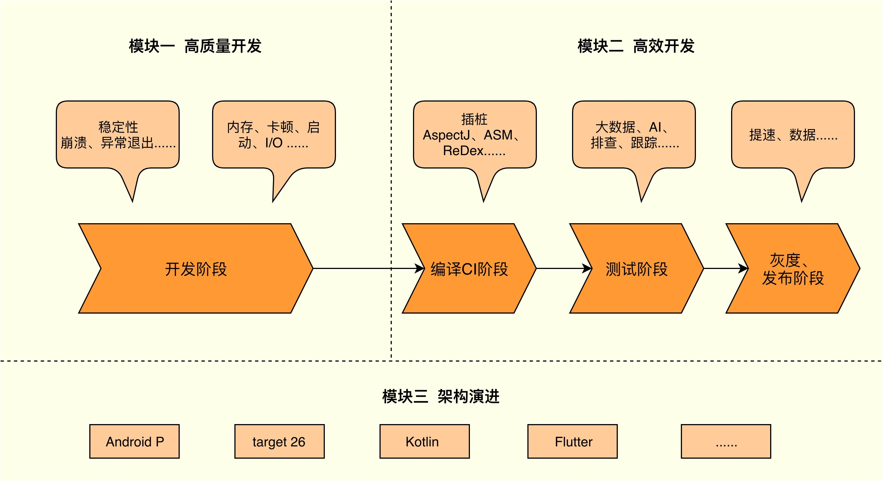
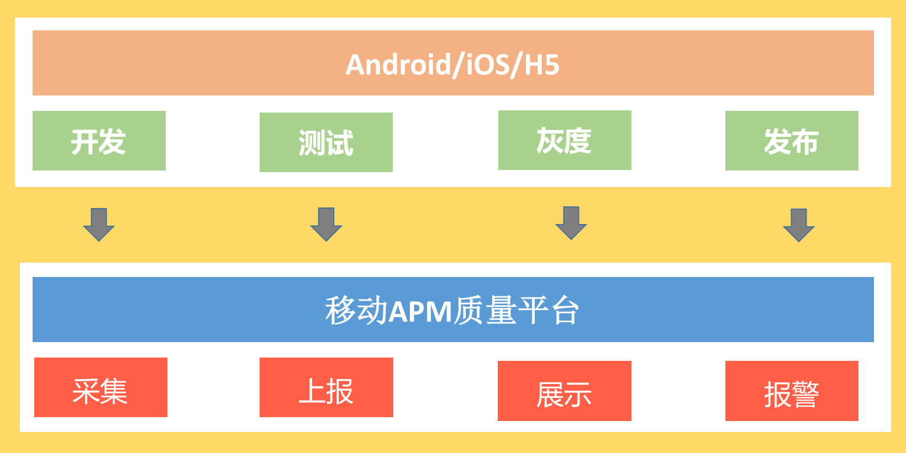
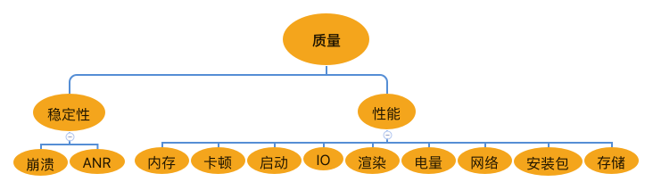
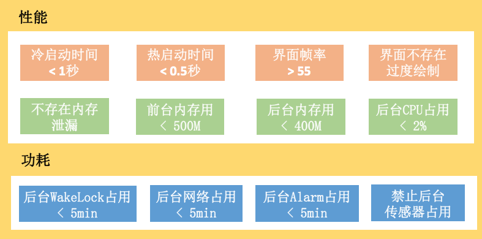

<!DOCTYPE html>
<html xmlns="http://www.w3.org/1999/xhtml">

<head>

    <head>
        <meta http-equiv="Content-Type" content="text/html; charset=UTF-8">
        <meta name="viewport" content="width=device-width, initial-scale=1, maximum-scale=1.0, user-scalable=no">
        <meta http-equiv='content-language' content='zh-cn'>
        <meta name='description' content=00&#32;导读&#32;如何打造高质量的应用？>
        <link rel="icon" href="/static/favicon.png">
        <title>00 导读 如何打造高质量的应用？ </title>
        
        <link rel="stylesheet" href="/static/index.css">
        <link rel="stylesheet" href="/static/highlight.min.css">
        
        
        <meta name="generator" content="Hexo 4.2.0">
        
    </head>

<body>
    

        

            

                <a href="/">
                    
                    技术文章摘抄
                </a>
            

            

                <ul class="uncollapsible">
                    <li><a href="/" class="current-tab">首页</a></li>
                    <li><a href="../">上一级</a></li>
                </ul>
                <ul class="uncollapsible">
                    
                    <li>
                        <a class="menu-item" id="00 导读 如何打造高质量的应用？.md" href="/%e4%b8%93%e6%a0%8f/Android%e5%bc%80%e5%8f%91%e9%ab%98%e6%89%8b%e8%af%be/00%20%e5%af%bc%e8%af%bb%20%e5%a6%82%e4%bd%95%e6%89%93%e9%80%a0%e9%ab%98%e8%b4%a8%e9%87%8f%e7%9a%84%e5%ba%94%e7%94%a8%ef%bc%9f.md">00 导读 如何打造高质量的应用？.md</a>
                    </li>
                    
                    <li>
                        <a class="menu-item" id="00 开篇词 焦虑的移动开发者该如何破局？.md" href="/%e4%b8%93%e6%a0%8f/Android%e5%bc%80%e5%8f%91%e9%ab%98%e6%89%8b%e8%af%be/00%20%e5%bc%80%e7%af%87%e8%af%8d%20%e7%84%a6%e8%99%91%e7%9a%84%e7%a7%bb%e5%8a%a8%e5%bc%80%e5%8f%91%e8%80%85%e8%af%a5%e5%a6%82%e4%bd%95%e7%a0%b4%e5%b1%80%ef%bc%9f.md">00 开篇词 焦虑的移动开发者该如何破局？.md</a>
                    </li>
                    
                    <li>
                        <a class="menu-item" id="01 崩溃优化（上）：关于“崩溃”那些事儿.md" href="/%e4%b8%93%e6%a0%8f/Android%e5%bc%80%e5%8f%91%e9%ab%98%e6%89%8b%e8%af%be/01%20%e5%b4%a9%e6%ba%83%e4%bc%98%e5%8c%96%ef%bc%88%e4%b8%8a%ef%bc%89%ef%bc%9a%e5%85%b3%e4%ba%8e%e2%80%9c%e5%b4%a9%e6%ba%83%e2%80%9d%e9%82%a3%e4%ba%9b%e4%ba%8b%e5%84%bf.md">01 崩溃优化（上）：关于“崩溃”那些事儿.md</a>
                    </li>
                    
                    <li>
                        <a class="menu-item" id="02 崩溃优化（下）：应用崩溃了，你应该如何去分析？.md" href="/%e4%b8%93%e6%a0%8f/Android%e5%bc%80%e5%8f%91%e9%ab%98%e6%89%8b%e8%af%be/02%20%e5%b4%a9%e6%ba%83%e4%bc%98%e5%8c%96%ef%bc%88%e4%b8%8b%ef%bc%89%ef%bc%9a%e5%ba%94%e7%94%a8%e5%b4%a9%e6%ba%83%e4%ba%86%ef%bc%8c%e4%bd%a0%e5%ba%94%e8%af%a5%e5%a6%82%e4%bd%95%e5%8e%bb%e5%88%86%e6%9e%90%ef%bc%9f.md">02 崩溃优化（下）：应用崩溃了，你应该如何去分析？.md</a>
                    </li>
                    
                    <li>
                        <a class="menu-item" id="03 内存优化（上）：4GB内存时代，再谈内存优化.md" href="/%e4%b8%93%e6%a0%8f/Android%e5%bc%80%e5%8f%91%e9%ab%98%e6%89%8b%e8%af%be/03%20%e5%86%85%e5%ad%98%e4%bc%98%e5%8c%96%ef%bc%88%e4%b8%8a%ef%bc%89%ef%bc%9a4GB%e5%86%85%e5%ad%98%e6%97%b6%e4%bb%a3%ef%bc%8c%e5%86%8d%e8%b0%88%e5%86%85%e5%ad%98%e4%bc%98%e5%8c%96.md">03 内存优化（上）：4GB内存时代，再谈内存优化.md</a>
                    </li>
                    
                    <li>
                        <a class="menu-item" id="04 内存优化（下）：内存优化这件事，应该从哪里着手？.md" href="/%e4%b8%93%e6%a0%8f/Android%e5%bc%80%e5%8f%91%e9%ab%98%e6%89%8b%e8%af%be/04%20%e5%86%85%e5%ad%98%e4%bc%98%e5%8c%96%ef%bc%88%e4%b8%8b%ef%bc%89%ef%bc%9a%e5%86%85%e5%ad%98%e4%bc%98%e5%8c%96%e8%bf%99%e4%bb%b6%e4%ba%8b%ef%bc%8c%e5%ba%94%e8%af%a5%e4%bb%8e%e5%93%aa%e9%87%8c%e7%9d%80%e6%89%8b%ef%bc%9f.md">04 内存优化（下）：内存优化这件事，应该从哪里着手？.md</a>
                    </li>
                    
                    <li>
                        <a class="menu-item" id="05 卡顿优化（上）：你要掌握的卡顿分析方法.md" href="/%e4%b8%93%e6%a0%8f/Android%e5%bc%80%e5%8f%91%e9%ab%98%e6%89%8b%e8%af%be/05%20%e5%8d%a1%e9%a1%bf%e4%bc%98%e5%8c%96%ef%bc%88%e4%b8%8a%ef%bc%89%ef%bc%9a%e4%bd%a0%e8%a6%81%e6%8e%8c%e6%8f%a1%e7%9a%84%e5%8d%a1%e9%a1%bf%e5%88%86%e6%9e%90%e6%96%b9%e6%b3%95.md">05 卡顿优化（上）：你要掌握的卡顿分析方法.md</a>
                    </li>
                    
                    <li>
                        <a class="menu-item" id="06 卡顿优化（下）：如何监控应用卡顿？.md" href="/%e4%b8%93%e6%a0%8f/Android%e5%bc%80%e5%8f%91%e9%ab%98%e6%89%8b%e8%af%be/06%20%e5%8d%a1%e9%a1%bf%e4%bc%98%e5%8c%96%ef%bc%88%e4%b8%8b%ef%bc%89%ef%bc%9a%e5%a6%82%e4%bd%95%e7%9b%91%e6%8e%a7%e5%ba%94%e7%94%a8%e5%8d%a1%e9%a1%bf%ef%bc%9f.md">06 卡顿优化（下）：如何监控应用卡顿？.md</a>
                    </li>
                    
                    <li>
                        <a class="menu-item" id="06补充篇 卡顿优化：卡顿现场与卡顿分析.md" href="/%e4%b8%93%e6%a0%8f/Android%e5%bc%80%e5%8f%91%e9%ab%98%e6%89%8b%e8%af%be/06%e8%a1%a5%e5%85%85%e7%af%87%20%e5%8d%a1%e9%a1%bf%e4%bc%98%e5%8c%96%ef%bc%9a%e5%8d%a1%e9%a1%bf%e7%8e%b0%e5%9c%ba%e4%b8%8e%e5%8d%a1%e9%a1%bf%e5%88%86%e6%9e%90.md">06补充篇 卡顿优化：卡顿现场与卡顿分析.md</a>
                    </li>
                    
                    <li>
                        <a class="menu-item" id="07 启动优化（上）：从启动过程看启动速度优化.md" href="/%e4%b8%93%e6%a0%8f/Android%e5%bc%80%e5%8f%91%e9%ab%98%e6%89%8b%e8%af%be/07%20%e5%90%af%e5%8a%a8%e4%bc%98%e5%8c%96%ef%bc%88%e4%b8%8a%ef%bc%89%ef%bc%9a%e4%bb%8e%e5%90%af%e5%8a%a8%e8%bf%87%e7%a8%8b%e7%9c%8b%e5%90%af%e5%8a%a8%e9%80%9f%e5%ba%a6%e4%bc%98%e5%8c%96.md">07 启动优化（上）：从启动过程看启动速度优化.md</a>
                    </li>
                    
                    <li>
                        <a class="menu-item" id="08 启动优化（下）：优化启动速度的进阶方法.md" href="/%e4%b8%93%e6%a0%8f/Android%e5%bc%80%e5%8f%91%e9%ab%98%e6%89%8b%e8%af%be/08%20%e5%90%af%e5%8a%a8%e4%bc%98%e5%8c%96%ef%bc%88%e4%b8%8b%ef%bc%89%ef%bc%9a%e4%bc%98%e5%8c%96%e5%90%af%e5%8a%a8%e9%80%9f%e5%ba%a6%e7%9a%84%e8%bf%9b%e9%98%b6%e6%96%b9%e6%b3%95.md">08 启动优化（下）：优化启动速度的进阶方法.md</a>
                    </li>
                    
                    <li>
                        <a class="menu-item" id="09 I_O优化（上）：开发工程师必备的I_O优化知识.md" href="/%e4%b8%93%e6%a0%8f/Android%e5%bc%80%e5%8f%91%e9%ab%98%e6%89%8b%e8%af%be/09%20I_O%e4%bc%98%e5%8c%96%ef%bc%88%e4%b8%8a%ef%bc%89%ef%bc%9a%e5%bc%80%e5%8f%91%e5%b7%a5%e7%a8%8b%e5%b8%88%e5%bf%85%e5%a4%87%e7%9a%84I_O%e4%bc%98%e5%8c%96%e7%9f%a5%e8%af%86.md">09 I_O优化（上）：开发工程师必备的I_O优化知识.md</a>
                    </li>
                    
                    <li>
                        <a class="menu-item" id="10 I_O优化（中）：不同I_O方式的使用场景是什么？.md" href="/%e4%b8%93%e6%a0%8f/Android%e5%bc%80%e5%8f%91%e9%ab%98%e6%89%8b%e8%af%be/10%20I_O%e4%bc%98%e5%8c%96%ef%bc%88%e4%b8%ad%ef%bc%89%ef%bc%9a%e4%b8%8d%e5%90%8cI_O%e6%96%b9%e5%bc%8f%e7%9a%84%e4%bd%bf%e7%94%a8%e5%9c%ba%e6%99%af%e6%98%af%e4%bb%80%e4%b9%88%ef%bc%9f.md">10 I_O优化（中）：不同I_O方式的使用场景是什么？.md</a>
                    </li>
                    
                    <li>
                        <a class="menu-item" id="11 I_O优化（下）：如何监控线上I_O操作？.md" href="/%e4%b8%93%e6%a0%8f/Android%e5%bc%80%e5%8f%91%e9%ab%98%e6%89%8b%e8%af%be/11%20I_O%e4%bc%98%e5%8c%96%ef%bc%88%e4%b8%8b%ef%bc%89%ef%bc%9a%e5%a6%82%e4%bd%95%e7%9b%91%e6%8e%a7%e7%ba%bf%e4%b8%8aI_O%e6%93%8d%e4%bd%9c%ef%bc%9f.md">11 I_O优化（下）：如何监控线上I_O操作？.md</a>
                    </li>
                    
                    <li>
                        <a class="menu-item" id="12 存储优化（上）：常见的数据存储方法有哪些？.md" href="/%e4%b8%93%e6%a0%8f/Android%e5%bc%80%e5%8f%91%e9%ab%98%e6%89%8b%e8%af%be/12%20%e5%ad%98%e5%82%a8%e4%bc%98%e5%8c%96%ef%bc%88%e4%b8%8a%ef%bc%89%ef%bc%9a%e5%b8%b8%e8%a7%81%e7%9a%84%e6%95%b0%e6%8d%ae%e5%ad%98%e5%82%a8%e6%96%b9%e6%b3%95%e6%9c%89%e5%93%aa%e4%ba%9b%ef%bc%9f.md">12 存储优化（上）：常见的数据存储方法有哪些？.md</a>
                    </li>
                    
                    <li>
                        <a class="menu-item" id="13 存储优化（中）：如何优化数据存储？.md" href="/%e4%b8%93%e6%a0%8f/Android%e5%bc%80%e5%8f%91%e9%ab%98%e6%89%8b%e8%af%be/13%20%e5%ad%98%e5%82%a8%e4%bc%98%e5%8c%96%ef%bc%88%e4%b8%ad%ef%bc%89%ef%bc%9a%e5%a6%82%e4%bd%95%e4%bc%98%e5%8c%96%e6%95%b0%e6%8d%ae%e5%ad%98%e5%82%a8%ef%bc%9f.md">13 存储优化（中）：如何优化数据存储？.md</a>
                    </li>
                    
                    <li>
                        <a class="menu-item" id="14 存储优化（下）：数据库SQLite的使用和优化.md" href="/%e4%b8%93%e6%a0%8f/Android%e5%bc%80%e5%8f%91%e9%ab%98%e6%89%8b%e8%af%be/14%20%e5%ad%98%e5%82%a8%e4%bc%98%e5%8c%96%ef%bc%88%e4%b8%8b%ef%bc%89%ef%bc%9a%e6%95%b0%e6%8d%ae%e5%ba%93SQLite%e7%9a%84%e4%bd%bf%e7%94%a8%e5%92%8c%e4%bc%98%e5%8c%96.md">14 存储优化（下）：数据库SQLite的使用和优化.md</a>
                    </li>
                    
                    <li>
                        <a class="menu-item" id="15 网络优化（上）：移动开发工程师必备的网络优化知识.md" href="/%e4%b8%93%e6%a0%8f/Android%e5%bc%80%e5%8f%91%e9%ab%98%e6%89%8b%e8%af%be/15%20%e7%bd%91%e7%bb%9c%e4%bc%98%e5%8c%96%ef%bc%88%e4%b8%8a%ef%bc%89%ef%bc%9a%e7%a7%bb%e5%8a%a8%e5%bc%80%e5%8f%91%e5%b7%a5%e7%a8%8b%e5%b8%88%e5%bf%85%e5%a4%87%e7%9a%84%e7%bd%91%e7%bb%9c%e4%bc%98%e5%8c%96%e7%9f%a5%e8%af%86.md">15 网络优化（上）：移动开发工程师必备的网络优化知识.md</a>
                    </li>
                    
                    <li>
                        <a class="menu-item" id="16 网络优化（中）：复杂多变的移动网络该如何优化？.md" href="/%e4%b8%93%e6%a0%8f/Android%e5%bc%80%e5%8f%91%e9%ab%98%e6%89%8b%e8%af%be/16%20%e7%bd%91%e7%bb%9c%e4%bc%98%e5%8c%96%ef%bc%88%e4%b8%ad%ef%bc%89%ef%bc%9a%e5%a4%8d%e6%9d%82%e5%a4%9a%e5%8f%98%e7%9a%84%e7%a7%bb%e5%8a%a8%e7%bd%91%e7%bb%9c%e8%af%a5%e5%a6%82%e4%bd%95%e4%bc%98%e5%8c%96%ef%bc%9f.md">16 网络优化（中）：复杂多变的移动网络该如何优化？.md</a>
                    </li>
                    
                    <li>
                        <a class="menu-item" id="17 网络优化（下）：大数据下网络该如何监控？.md" href="/%e4%b8%93%e6%a0%8f/Android%e5%bc%80%e5%8f%91%e9%ab%98%e6%89%8b%e8%af%be/17%20%e7%bd%91%e7%bb%9c%e4%bc%98%e5%8c%96%ef%bc%88%e4%b8%8b%ef%bc%89%ef%bc%9a%e5%a4%a7%e6%95%b0%e6%8d%ae%e4%b8%8b%e7%bd%91%e7%bb%9c%e8%af%a5%e5%a6%82%e4%bd%95%e7%9b%91%e6%8e%a7%ef%bc%9f.md">17 网络优化（下）：大数据下网络该如何监控？.md</a>
                    </li>
                    
                    <li>
                        <a class="menu-item" id="18 耗电优化（上）：从电量优化的演进看耗电分析.md" href="/%e4%b8%93%e6%a0%8f/Android%e5%bc%80%e5%8f%91%e9%ab%98%e6%89%8b%e8%af%be/18%20%e8%80%97%e7%94%b5%e4%bc%98%e5%8c%96%ef%bc%88%e4%b8%8a%ef%bc%89%ef%bc%9a%e4%bb%8e%e7%94%b5%e9%87%8f%e4%bc%98%e5%8c%96%e7%9a%84%e6%bc%94%e8%bf%9b%e7%9c%8b%e8%80%97%e7%94%b5%e5%88%86%e6%9e%90.md">18 耗电优化（上）：从电量优化的演进看耗电分析.md</a>
                    </li>
                    
                    <li>
                        <a class="menu-item" id="19 耗电优化（下）：耗电的优化方法与线上监控.md" href="/%e4%b8%93%e6%a0%8f/Android%e5%bc%80%e5%8f%91%e9%ab%98%e6%89%8b%e8%af%be/19%20%e8%80%97%e7%94%b5%e4%bc%98%e5%8c%96%ef%bc%88%e4%b8%8b%ef%bc%89%ef%bc%9a%e8%80%97%e7%94%b5%e7%9a%84%e4%bc%98%e5%8c%96%e6%96%b9%e6%b3%95%e4%b8%8e%e7%ba%bf%e4%b8%8a%e7%9b%91%e6%8e%a7.md">19 耗电优化（下）：耗电的优化方法与线上监控.md</a>
                    </li>
                    
                    <li>
                        <a class="menu-item" id="20 UI 优化（上）：UI 渲染的几个关键概念.md" href="/%e4%b8%93%e6%a0%8f/Android%e5%bc%80%e5%8f%91%e9%ab%98%e6%89%8b%e8%af%be/20%20UI%20%e4%bc%98%e5%8c%96%ef%bc%88%e4%b8%8a%ef%bc%89%ef%bc%9aUI%20%e6%b8%b2%e6%9f%93%e7%9a%84%e5%87%a0%e4%b8%aa%e5%85%b3%e9%94%ae%e6%a6%82%e5%bf%b5.md">20 UI 优化（上）：UI 渲染的几个关键概念.md</a>
                    </li>
                    
                    <li>
                        <a class="menu-item" id="21 UI 优化（下）：如何优化 UI 渲染？.md" href="/%e4%b8%93%e6%a0%8f/Android%e5%bc%80%e5%8f%91%e9%ab%98%e6%89%8b%e8%af%be/21%20UI%20%e4%bc%98%e5%8c%96%ef%bc%88%e4%b8%8b%ef%bc%89%ef%bc%9a%e5%a6%82%e4%bd%95%e4%bc%98%e5%8c%96%20UI%20%e6%b8%b2%e6%9f%93%ef%bc%9f.md">21 UI 优化（下）：如何优化 UI 渲染？.md</a>
                    </li>
                    
                    <li>
                        <a class="menu-item" id="22 包体积优化（上）：如何减少安装包大小？.md" href="/%e4%b8%93%e6%a0%8f/Android%e5%bc%80%e5%8f%91%e9%ab%98%e6%89%8b%e8%af%be/22%20%e5%8c%85%e4%bd%93%e7%a7%af%e4%bc%98%e5%8c%96%ef%bc%88%e4%b8%8a%ef%bc%89%ef%bc%9a%e5%a6%82%e4%bd%95%e5%87%8f%e5%b0%91%e5%ae%89%e8%a3%85%e5%8c%85%e5%a4%a7%e5%b0%8f%ef%bc%9f.md">22 包体积优化（上）：如何减少安装包大小？.md</a>
                    </li>
                    
                    <li>
                        <a class="menu-item" id="23 包体积优化（下）：资源优化的进阶实践.md" href="/%e4%b8%93%e6%a0%8f/Android%e5%bc%80%e5%8f%91%e9%ab%98%e6%89%8b%e8%af%be/23%20%e5%8c%85%e4%bd%93%e7%a7%af%e4%bc%98%e5%8c%96%ef%bc%88%e4%b8%8b%ef%bc%89%ef%bc%9a%e8%b5%84%e6%ba%90%e4%bc%98%e5%8c%96%e7%9a%84%e8%bf%9b%e9%98%b6%e5%ae%9e%e8%b7%b5.md">23 包体积优化（下）：资源优化的进阶实践.md</a>
                    </li>
                    
                    <li>
                        <a class="menu-item" id="24 想成为Android高手，你需要先搞定这三个问题.md" href="/%e4%b8%93%e6%a0%8f/Android%e5%bc%80%e5%8f%91%e9%ab%98%e6%89%8b%e8%af%be/24%20%e6%83%b3%e6%88%90%e4%b8%baAndroid%e9%ab%98%e6%89%8b%ef%bc%8c%e4%bd%a0%e9%9c%80%e8%a6%81%e5%85%88%e6%90%9e%e5%ae%9a%e8%bf%99%e4%b8%89%e4%b8%aa%e9%97%ae%e9%a2%98.md">24 想成为Android高手，你需要先搞定这三个问题.md</a>
                    </li>
                    
                    <li>
                        <a class="menu-item" id="25 如何提升组织与个人的研发效能？.md" href="/%e4%b8%93%e6%a0%8f/Android%e5%bc%80%e5%8f%91%e9%ab%98%e6%89%8b%e8%af%be/25%20%e5%a6%82%e4%bd%95%e6%8f%90%e5%8d%87%e7%bb%84%e7%bb%87%e4%b8%8e%e4%b8%aa%e4%ba%ba%e7%9a%84%e7%a0%94%e5%8f%91%e6%95%88%e8%83%bd%ef%bc%9f.md">25 如何提升组织与个人的研发效能？.md</a>
                    </li>
                    
                    <li>
                        <a class="menu-item" id="26 关于编译，你需要了解什么？.md" href="/%e4%b8%93%e6%a0%8f/Android%e5%bc%80%e5%8f%91%e9%ab%98%e6%89%8b%e8%af%be/26%20%e5%85%b3%e4%ba%8e%e7%bc%96%e8%af%91%ef%bc%8c%e4%bd%a0%e9%9c%80%e8%a6%81%e4%ba%86%e8%a7%a3%e4%bb%80%e4%b9%88%ef%bc%9f.md">26 关于编译，你需要了解什么？.md</a>
                    </li>
                    
                    <li>
                        <a class="menu-item" id="27 编译插桩的三种方法：AspectJ、ASM、ReDex.md" href="/%e4%b8%93%e6%a0%8f/Android%e5%bc%80%e5%8f%91%e9%ab%98%e6%89%8b%e8%af%be/27%20%e7%bc%96%e8%af%91%e6%8f%92%e6%a1%a9%e7%9a%84%e4%b8%89%e7%a7%8d%e6%96%b9%e6%b3%95%ef%bc%9aAspectJ%e3%80%81ASM%e3%80%81ReDex.md">27 编译插桩的三种方法：AspectJ、ASM、ReDex.md</a>
                    </li>
                    
                    <li>
                        <a class="menu-item" id="28 大数据与AI，如何高效地测试？.md" href="/%e4%b8%93%e6%a0%8f/Android%e5%bc%80%e5%8f%91%e9%ab%98%e6%89%8b%e8%af%be/28%20%e5%a4%a7%e6%95%b0%e6%8d%ae%e4%b8%8eAI%ef%bc%8c%e5%a6%82%e4%bd%95%e9%ab%98%e6%95%88%e5%9c%b0%e6%b5%8b%e8%af%95%ef%bc%9f.md">28 大数据与AI，如何高效地测试？.md</a>
                    </li>
                    
                    <li>
                        <a class="menu-item" id="29 从每月到每天，如何给版本发布提速？.md" href="/%e4%b8%93%e6%a0%8f/Android%e5%bc%80%e5%8f%91%e9%ab%98%e6%89%8b%e8%af%be/29%20%e4%bb%8e%e6%af%8f%e6%9c%88%e5%88%b0%e6%af%8f%e5%a4%a9%ef%bc%8c%e5%a6%82%e4%bd%95%e7%bb%99%e7%89%88%e6%9c%ac%e5%8f%91%e5%b8%83%e6%8f%90%e9%80%9f%ef%bc%9f.md">29 从每月到每天，如何给版本发布提速？.md</a>
                    </li>
                    
                    <li>
                        <a class="menu-item" id="30 数据评估（上）：如何实现高可用的上报组件？.md" href="/%e4%b8%93%e6%a0%8f/Android%e5%bc%80%e5%8f%91%e9%ab%98%e6%89%8b%e8%af%be/30%20%e6%95%b0%e6%8d%ae%e8%af%84%e4%bc%b0%ef%bc%88%e4%b8%8a%ef%bc%89%ef%bc%9a%e5%a6%82%e4%bd%95%e5%ae%9e%e7%8e%b0%e9%ab%98%e5%8f%af%e7%94%a8%e7%9a%84%e4%b8%8a%e6%8a%a5%e7%bb%84%e4%bb%b6%ef%bc%9f.md">30 数据评估（上）：如何实现高可用的上报组件？.md</a>
                    </li>
                    
                    <li>
                        <a class="menu-item" id="31 数据评估（下）：什么是大数据平台？.md" href="/%e4%b8%93%e6%a0%8f/Android%e5%bc%80%e5%8f%91%e9%ab%98%e6%89%8b%e8%af%be/31%20%e6%95%b0%e6%8d%ae%e8%af%84%e4%bc%b0%ef%bc%88%e4%b8%8b%ef%bc%89%ef%bc%9a%e4%bb%80%e4%b9%88%e6%98%af%e5%a4%a7%e6%95%b0%e6%8d%ae%e5%b9%b3%e5%8f%b0%ef%bc%9f.md">31 数据评估（下）：什么是大数据平台？.md</a>
                    </li>
                    
                    <li>
                        <a class="menu-item" id="32 线上疑难问题该如何排查和跟踪？.md" href="/%e4%b8%93%e6%a0%8f/Android%e5%bc%80%e5%8f%91%e9%ab%98%e6%89%8b%e8%af%be/32%20%e7%ba%bf%e4%b8%8a%e7%96%91%e9%9a%be%e9%97%ae%e9%a2%98%e8%af%a5%e5%a6%82%e4%bd%95%e6%8e%92%e6%9f%a5%e5%92%8c%e8%b7%9f%e8%b8%aa%ef%bc%9f.md">32 线上疑难问题该如何排查和跟踪？.md</a>
                    </li>
                    
                    <li>
                        <a class="menu-item" id="33 做一名有高度的移动开发工程师.md" href="/%e4%b8%93%e6%a0%8f/Android%e5%bc%80%e5%8f%91%e9%ab%98%e6%89%8b%e8%af%be/33%20%e5%81%9a%e4%b8%80%e5%90%8d%e6%9c%89%e9%ab%98%e5%ba%a6%e7%9a%84%e7%a7%bb%e5%8a%a8%e5%bc%80%e5%8f%91%e5%b7%a5%e7%a8%8b%e5%b8%88.md">33 做一名有高度的移动开发工程师.md</a>
                    </li>
                    
                    <li>
                        <a class="menu-item" id="34 聊聊重构：优秀的架构都是演进而来的.md" href="/%e4%b8%93%e6%a0%8f/Android%e5%bc%80%e5%8f%91%e9%ab%98%e6%89%8b%e8%af%be/34%20%e8%81%8a%e8%81%8a%e9%87%8d%e6%9e%84%ef%bc%9a%e4%bc%98%e7%a7%80%e7%9a%84%e6%9e%b6%e6%9e%84%e9%83%bd%e6%98%af%e6%bc%94%e8%bf%9b%e8%80%8c%e6%9d%a5%e7%9a%84.md">34 聊聊重构：优秀的架构都是演进而来的.md</a>
                    </li>
                    
                    <li>
                        <a class="menu-item" id="35 Native Hook 技术，天使还是魔鬼？.md" href="/%e4%b8%93%e6%a0%8f/Android%e5%bc%80%e5%8f%91%e9%ab%98%e6%89%8b%e8%af%be/35%20Native%20Hook%20%e6%8a%80%e6%9c%af%ef%bc%8c%e5%a4%a9%e4%bd%bf%e8%bf%98%e6%98%af%e9%ad%94%e9%ac%bc%ef%bc%9f.md">35 Native Hook 技术，天使还是魔鬼？.md</a>
                    </li>
                    
                    <li>
                        <a class="menu-item" id="36 跨平台开发的现状与应用.md" href="/%e4%b8%93%e6%a0%8f/Android%e5%bc%80%e5%8f%91%e9%ab%98%e6%89%8b%e8%af%be/36%20%e8%b7%a8%e5%b9%b3%e5%8f%b0%e5%bc%80%e5%8f%91%e7%9a%84%e7%8e%b0%e7%8a%b6%e4%b8%8e%e5%ba%94%e7%94%a8.md">36 跨平台开发的现状与应用.md</a>
                    </li>
                    
                    <li>
                        <a class="menu-item" id="37 移动开发新大陆：工作三年半，移动开发转型手游开发.md" href="/%e4%b8%93%e6%a0%8f/Android%e5%bc%80%e5%8f%91%e9%ab%98%e6%89%8b%e8%af%be/37%20%e7%a7%bb%e5%8a%a8%e5%bc%80%e5%8f%91%e6%96%b0%e5%a4%a7%e9%99%86%ef%bc%9a%e5%b7%a5%e4%bd%9c%e4%b8%89%e5%b9%b4%e5%8d%8a%ef%bc%8c%e7%a7%bb%e5%8a%a8%e5%bc%80%e5%8f%91%e8%bd%ac%e5%9e%8b%e6%89%8b%e6%b8%b8%e5%bc%80%e5%8f%91.md">37 移动开发新大陆：工作三年半，移动开发转型手游开发.md</a>
                    </li>
                    
                    <li>
                        <a class="menu-item" id="38 移动开发新大陆：Android音视频开发.md" href="/%e4%b8%93%e6%a0%8f/Android%e5%bc%80%e5%8f%91%e9%ab%98%e6%89%8b%e8%af%be/38%20%e7%a7%bb%e5%8a%a8%e5%bc%80%e5%8f%91%e6%96%b0%e5%a4%a7%e9%99%86%ef%bc%9aAndroid%e9%9f%b3%e8%a7%86%e9%a2%91%e5%bc%80%e5%8f%91.md">38 移动开发新大陆：Android音视频开发.md</a>
                    </li>
                    
                    <li>
                        <a class="menu-item" id="39 移动开发新大陆： 边缘智能计算的趋势.md" href="/%e4%b8%93%e6%a0%8f/Android%e5%bc%80%e5%8f%91%e9%ab%98%e6%89%8b%e8%af%be/39%20%e7%a7%bb%e5%8a%a8%e5%bc%80%e5%8f%91%e6%96%b0%e5%a4%a7%e9%99%86%ef%bc%9a%20%e8%be%b9%e7%bc%98%e6%99%ba%e8%83%bd%e8%ae%a1%e7%ae%97%e7%9a%84%e8%b6%8b%e5%8a%bf.md">39 移动开发新大陆： 边缘智能计算的趋势.md</a>
                    </li>
                    
                    <li>
                        <a class="menu-item" id="40 动态化实践，如何选择适合自己的方案？.md" href="/%e4%b8%93%e6%a0%8f/Android%e5%bc%80%e5%8f%91%e9%ab%98%e6%89%8b%e8%af%be/40%20%e5%8a%a8%e6%80%81%e5%8c%96%e5%ae%9e%e8%b7%b5%ef%bc%8c%e5%a6%82%e4%bd%95%e9%80%89%e6%8b%a9%e9%80%82%e5%90%88%e8%87%aa%e5%b7%b1%e7%9a%84%e6%96%b9%e6%a1%88%ef%bc%9f.md">40 动态化实践，如何选择适合自己的方案？.md</a>
                    </li>
                    
                    <li>
                        <a class="menu-item" id="41 聊聊Flutter，面对层出不穷的新技术该如何跟进？.md" href="/%e4%b8%93%e6%a0%8f/Android%e5%bc%80%e5%8f%91%e9%ab%98%e6%89%8b%e8%af%be/41%20%e8%81%8a%e8%81%8aFlutter%ef%bc%8c%e9%9d%a2%e5%af%b9%e5%b1%82%e5%87%ba%e4%b8%8d%e7%a9%b7%e7%9a%84%e6%96%b0%e6%8a%80%e6%9c%af%e8%af%a5%e5%a6%82%e4%bd%95%e8%b7%9f%e8%bf%9b%ef%bc%9f.md">41 聊聊Flutter，面对层出不穷的新技术该如何跟进？.md</a>
                    </li>
                    
                    <li>
                        <a class="menu-item" id="42 Android开发高手课学习心得.md" href="/%e4%b8%93%e6%a0%8f/Android%e5%bc%80%e5%8f%91%e9%ab%98%e6%89%8b%e8%af%be/42%20Android%e5%bc%80%e5%8f%91%e9%ab%98%e6%89%8b%e8%af%be%e5%ad%a6%e4%b9%a0%e5%bf%83%e5%be%97.md">42 Android开发高手课学习心得.md</a>
                    </li>
                    
                    <li>
                        <a class="menu-item" id="Android JVM TI机制详解（内含福利彩蛋）.md" href="/%e4%b8%93%e6%a0%8f/Android%e5%bc%80%e5%8f%91%e9%ab%98%e6%89%8b%e8%af%be/Android%20JVM%20TI%e6%9c%ba%e5%88%b6%e8%af%a6%e8%a7%a3%ef%bc%88%e5%86%85%e5%90%ab%e7%a6%8f%e5%88%a9%e5%bd%a9%e8%9b%8b%ef%bc%89.md">Android JVM TI机制详解（内含福利彩蛋）.md</a>
                    </li>
                    
                    <li>
                        <a class="menu-item" id="Android工程师的“面试指南”.md" href="/%e4%b8%93%e6%a0%8f/Android%e5%bc%80%e5%8f%91%e9%ab%98%e6%89%8b%e8%af%be/Android%e5%b7%a5%e7%a8%8b%e5%b8%88%e7%9a%84%e2%80%9c%e9%9d%a2%e8%af%95%e6%8c%87%e5%8d%97%e2%80%9d.md">Android工程师的“面试指南”.md</a>
                    </li>
                    
                    <li>
                        <a class="menu-item" id="Native下如何获取调用栈？.md" href="/%e4%b8%93%e6%a0%8f/Android%e5%bc%80%e5%8f%91%e9%ab%98%e6%89%8b%e8%af%be/Native%e4%b8%8b%e5%a6%82%e4%bd%95%e8%8e%b7%e5%8f%96%e8%b0%83%e7%94%a8%e6%a0%88%ef%bc%9f.md">Native下如何获取调用栈？.md</a>
                    </li>
                    
                    <li>
                        <a class="menu-item" id="专栏学得苦？可能你还需要一份配套学习书单.md" href="/%e4%b8%93%e6%a0%8f/Android%e5%bc%80%e5%8f%91%e9%ab%98%e6%89%8b%e8%af%be/%e4%b8%93%e6%a0%8f%e5%ad%a6%e5%be%97%e8%8b%a6%ef%bc%9f%e5%8f%af%e8%83%bd%e4%bd%a0%e8%bf%98%e9%9c%80%e8%a6%81%e4%b8%80%e4%bb%bd%e9%85%8d%e5%a5%97%e5%ad%a6%e4%b9%a0%e4%b9%a6%e5%8d%95.md">专栏学得苦？可能你还需要一份配套学习书单.md</a>
                    </li>
                    
                    <li>
                        <a class="menu-item" id="专栏学得苦？可能是方法没找对.md" href="/%e4%b8%93%e6%a0%8f/Android%e5%bc%80%e5%8f%91%e9%ab%98%e6%89%8b%e8%af%be/%e4%b8%93%e6%a0%8f%e5%ad%a6%e5%be%97%e8%8b%a6%ef%bc%9f%e5%8f%af%e8%83%bd%e6%98%af%e6%96%b9%e6%b3%95%e6%b2%a1%e6%89%be%e5%af%b9.md">专栏学得苦？可能是方法没找对.md</a>
                    </li>
                    
                    <li>
                        <a class="menu-item" id="程序员修炼之路 设计能力的提升途径.md" href="/%e4%b8%93%e6%a0%8f/Android%e5%bc%80%e5%8f%91%e9%ab%98%e6%89%8b%e8%af%be/%e7%a8%8b%e5%ba%8f%e5%91%98%e4%bf%ae%e7%82%bc%e4%b9%8b%e8%b7%af%20%e8%ae%be%e8%ae%a1%e8%83%bd%e5%8a%9b%e7%9a%84%e6%8f%90%e5%8d%87%e9%80%94%e5%be%84.md">程序员修炼之路 设计能力的提升途径.md</a>
                    </li>
                    
                    <li>
                        <a class="menu-item" id="练习Sample跑起来 ASM插桩强化练习.md" href="/%e4%b8%93%e6%a0%8f/Android%e5%bc%80%e5%8f%91%e9%ab%98%e6%89%8b%e8%af%be/%e7%bb%83%e4%b9%a0Sample%e8%b7%91%e8%b5%b7%e6%9d%a5%20ASM%e6%8f%92%e6%a1%a9%e5%bc%ba%e5%8c%96%e7%bb%83%e4%b9%a0.md">练习Sample跑起来 ASM插桩强化练习.md</a>
                    </li>
                    
                    <li>
                        <a class="menu-item" id="练习Sample跑起来 唯鹿同学的练习手记 第1辑.md" href="/%e4%b8%93%e6%a0%8f/Android%e5%bc%80%e5%8f%91%e9%ab%98%e6%89%8b%e8%af%be/%e7%bb%83%e4%b9%a0Sample%e8%b7%91%e8%b5%b7%e6%9d%a5%20%e5%94%af%e9%b9%bf%e5%90%8c%e5%ad%a6%e7%9a%84%e7%bb%83%e4%b9%a0%e6%89%8b%e8%ae%b0%20%e7%ac%ac1%e8%be%91.md">练习Sample跑起来 唯鹿同学的练习手记 第1辑.md</a>
                    </li>
                    
                    <li>
                        <a class="menu-item" id="练习Sample跑起来 唯鹿同学的练习手记 第2辑.md" href="/%e4%b8%93%e6%a0%8f/Android%e5%bc%80%e5%8f%91%e9%ab%98%e6%89%8b%e8%af%be/%e7%bb%83%e4%b9%a0Sample%e8%b7%91%e8%b5%b7%e6%9d%a5%20%e5%94%af%e9%b9%bf%e5%90%8c%e5%ad%a6%e7%9a%84%e7%bb%83%e4%b9%a0%e6%89%8b%e8%ae%b0%20%e7%ac%ac2%e8%be%91.md">练习Sample跑起来 唯鹿同学的练习手记 第2辑.md</a>
                    </li>
                    
                    <li>
                        <a class="menu-item" id="练习Sample跑起来 唯鹿同学的练习手记 第3辑.md" href="/%e4%b8%93%e6%a0%8f/Android%e5%bc%80%e5%8f%91%e9%ab%98%e6%89%8b%e8%af%be/%e7%bb%83%e4%b9%a0Sample%e8%b7%91%e8%b5%b7%e6%9d%a5%20%e5%94%af%e9%b9%bf%e5%90%8c%e5%ad%a6%e7%9a%84%e7%bb%83%e4%b9%a0%e6%89%8b%e8%ae%b0%20%e7%ac%ac3%e8%be%91.md">练习Sample跑起来 唯鹿同学的练习手记 第3辑.md</a>
                    </li>
                    
                    <li>
                        <a class="menu-item" id="练习Sample跑起来 热点问题答疑第1期.md" href="/%e4%b8%93%e6%a0%8f/Android%e5%bc%80%e5%8f%91%e9%ab%98%e6%89%8b%e8%af%be/%e7%bb%83%e4%b9%a0Sample%e8%b7%91%e8%b5%b7%e6%9d%a5%20%e7%83%ad%e7%82%b9%e9%97%ae%e9%a2%98%e7%ad%94%e7%96%91%e7%ac%ac1%e6%9c%9f.md">练习Sample跑起来 热点问题答疑第1期.md</a>
                    </li>
                    
                    <li>
                        <a class="menu-item" id="练习Sample跑起来 热点问题答疑第2期.md" href="/%e4%b8%93%e6%a0%8f/Android%e5%bc%80%e5%8f%91%e9%ab%98%e6%89%8b%e8%af%be/%e7%bb%83%e4%b9%a0Sample%e8%b7%91%e8%b5%b7%e6%9d%a5%20%e7%83%ad%e7%82%b9%e9%97%ae%e9%a2%98%e7%ad%94%e7%96%91%e7%ac%ac2%e6%9c%9f.md">练习Sample跑起来 热点问题答疑第2期.md</a>
                    </li>
                    
                    <li>
                        <a class="menu-item" id="练习Sample跑起来 热点问题答疑第3期.md" href="/%e4%b8%93%e6%a0%8f/Android%e5%bc%80%e5%8f%91%e9%ab%98%e6%89%8b%e8%af%be/%e7%bb%83%e4%b9%a0Sample%e8%b7%91%e8%b5%b7%e6%9d%a5%20%e7%83%ad%e7%82%b9%e9%97%ae%e9%a2%98%e7%ad%94%e7%96%91%e7%ac%ac3%e6%9c%9f.md">练习Sample跑起来 热点问题答疑第3期.md</a>
                    </li>
                    
                    <li>
                        <a class="menu-item" id="练习Sample跑起来 热点问题答疑第4期.md" href="/%e4%b8%93%e6%a0%8f/Android%e5%bc%80%e5%8f%91%e9%ab%98%e6%89%8b%e8%af%be/%e7%bb%83%e4%b9%a0Sample%e8%b7%91%e8%b5%b7%e6%9d%a5%20%e7%83%ad%e7%82%b9%e9%97%ae%e9%a2%98%e7%ad%94%e7%96%91%e7%ac%ac4%e6%9c%9f.md">练习Sample跑起来 热点问题答疑第4期.md</a>
                    </li>
                    
                    <li>
                        <a class="menu-item" id="结束语 移动开发的今天和明天.md" href="/%e4%b8%93%e6%a0%8f/Android%e5%bc%80%e5%8f%91%e9%ab%98%e6%89%8b%e8%af%be/%e7%bb%93%e6%9d%9f%e8%af%ad%20%e7%a7%bb%e5%8a%a8%e5%bc%80%e5%8f%91%e7%9a%84%e4%bb%8a%e5%a4%a9%e5%92%8c%e6%98%8e%e5%a4%a9.md">结束语 移动开发的今天和明天.md</a>
                    </li>
                    
                    <li>
                        <a class="menu-item" id="聊聊Framework的学习方法.md" href="/%e4%b8%93%e6%a0%8f/Android%e5%bc%80%e5%8f%91%e9%ab%98%e6%89%8b%e8%af%be/%e8%81%8a%e8%81%8aFramework%e7%9a%84%e5%ad%a6%e4%b9%a0%e6%96%b9%e6%b3%95.md">聊聊Framework的学习方法.md</a>
                    </li>
                    
                    <li><a href="https://lianglianglee.com/assets/%E6%8D%90%E8%B5%A0.md">捐赠</a></li>
                </ul>

            

        

        

            

        

        

            

                

                    

                        
                        <header class="navbar">
                            <section class="navbar-section">
                                <a onclick="open_sidebar()">
                                    <i class="icon icon-menu"></i>
                                </a>
                            </section>
                        </header>
                    

                    

                        

                            
                            
                            
                            

                            <h1 id="title" data-id="00 导读 如何打造高质量的应用？" class="title">00 导读 如何打造高质量的应用？</h1>
                            

今年年初，我去上海参加一个移动技术会议，问了很多开发者最近在忙啥。令我非常惊讶的是，大家讲的最多的还是用户体验和应用质量。特别是出海东南亚的同学，面对一堆512MB内存的设备、无处不在的弱网络流下了无助的眼泪。

除了内存优化、弱网络优化，想做一款高质量的应用还远远不止这些。一方面，我们面对的环境越来越复杂。过去的iOS开发者可能做梦也想不到，现在也要开始适配屏幕和双卡双待了，更不用说Android那多如繁星的机型、厂家和系统。如果你的应用也要出海，那么还要面对几十个国家不同的语言、环境。

另一方面，我们的代码跟业务也越来越复杂了。先不说大量“年久失修”的历史代码，业务越来越复杂，如何管理好几十上百个模块？还要面对React Native、Flutter、TensorFlow等各种语言跟框架堆积在一起的情况，再加上复杂的环境和庞大的系统，想想做一款高质量的应用真的不容易。

<h2 id="从应用交付的流程说起">从应用交付的流程说起</h2>

既然打造一款高质量的应用那么困难，我们可以先从哪里入手做些什么呢？我的方法是把应用当成一件商品，想象一下商品在流水线生产的过程，那么怎样在每个步骤做好“质检”呢？这就要从应用交付的流程说起。

在我看来，一个应用至少会经过开发、编译CI、测试、灰度和发布这几个阶段。每个阶段需要关注什么问题呢？

1.开发阶段。在面试的时候，常常有人说自己熟练掌握各种开发工具。但是，我们真的懂吗？就拿我们比较熟悉的耗时分析工具Traceview来说，它背后的实现原理是什么？能不能做一个完全没有性能损耗的Traceview？或者怎么样将它移植到线上使用？

2.编译CI阶段。如何防止代码不断地恶化？怎样进一步优化性能？d8与ReDex有什么神奇的黑科技？如何利用好Coverity、Infer这些静态分析工具？这部分可能需要一些编译原理的知识，你会发现移动开发也有很多值得深入研究的东西。

3.测试阶段。我们常说敏捷开发，用户是最好的测试。遇到问题在线上反复试错，对自己、对用户都十分痛苦。我们希望可以做到测试“左移”，尽可能早地发现问题。但是很多时候我们不是不想测试，而是发现测不出什么问题。那么怎样提升实验室发现问题的能力呢？如何尽可能地模拟用户的操作路径？做好测试并不容易，自动化测试结合AI或许可以帮助我们解决一些痛点。

4.灰度和发布阶段。动态部署流行起来之后，很多开发变得松懈起来。有问题发补丁，一个不行就两个，两个不行就十个。怎样去保证产品质量？很多线上问题概率很低，基本很难复现，比如对于一个印度的用户，我们希望有一个远程的听诊器，而不需要把用户拉到我们的手术台上。

对照应用的交付流程，我来介绍一下专栏的学习方法。专栏“高质量开发”模块主要对应的是开发阶段，你可以带着实践过程的困惑去深入学习开发需要的各种武器。专栏“高效开发”模块主要对应编译CI、测试、灰度和发布阶段，你可以结合实际工作全面提升整个应用交付的效率。另外，我认为一个好的架构可以减少甚至避免团队出错，也是打造一款高质量应用非常重要的一环，因此我会在最后的“架构演进”模块和你聊聊如何设计一个好的架构，以及架构该如何选型。

<h2 id="移动apm质量平台">移动APM质量平台</h2>

请你思考一下，在应用交付的这几个阶段中，我们对高质量的目标和实现方式是否一样呢？开发阶段有开发人员，可能希望采集尽可能多的数据；测试阶段有测试人员，可能更针对实验室环境或与竞品对比进行测试；灰度和发布阶段可能也有专门的运维人员，策略会相对保守一些。很明显，不同阶段我们对高质量的目标跟手段可能不太一样。

一个公司有多套质量系统，这在大公司是非常普遍的现象。我们希望有一个统一的平台，整合应用的人员和开发流程，这就是我们常说APM质量平台。

APM的全称是“Application Performance Management”，即应用性能管理。据我了解，国内像阿里、腾讯、美团点评、饿了么、爱奇艺这些公司都在大力投入。Google今年也发力Android Vitals监控，新增了耗电、权限管理模块。那么APM质量平台究竟有着什么样的魅力呢？

<strong>1. 统一管理</strong>。A同学写了一个耗时监控工具，B同学写了一个内存监控工具，它们在不同的仓库，上报格式可能不太一样，各自都搭了一个简单的页面。如果想评估一个应用的质量，总是要去几个系统汇总数据，想想都费劲。

<strong>2. 统一三端</strong>。一个公司可能有多个应用，一个应用也可能有H5、iOS、Android多个端。我们希望它们只是采集数据方式有所不同，上报、后台分析、展示、报警都是共用的。随着技术的发展，我们可能会增加React Native、Flutter这些新模块的监控，这个平台应该是统一演进的。当然我们非常希望业界有一套开源的方案，大家可以一起优化。

那这个质量平台需要关注哪些问题呢？这需要看我们用户关心什么问题。有的问题可能是致命的，像崩溃、卡死、白屏。另一大类问题就是性能问题，安装包大小、启动、耗时、内存、耗电、流量都是这一个范畴。在这个专栏里，我并不会教你如何从头搭建一个APM平台，我会更期待你掌握背后所需要的知识，它们主要包括：

由于Android版本的碎片化和国内Android生态的乱象，或者换句话说，“Android开发者很苦，国内的Android开发者更苦”。在11月举办的Android绿色联盟开发者大会上推出的应用体验标准，有对应用的兼容性、稳定性、性能、功能和安全做了详细的定义。我贴张图，你可以看下。

在极致性能的同时，我们希望能更进一步地打造“绿色应用”。在这个过程中，一个全面而强大的APM质量平台会是我们坚实的后盾。当然对于大多数中小开发者来说，我们更建议选择成熟的第三方服务。但深入了解它们背后的原理，无论是对我们如何选择合适的服务，还是日常开发工作都会有很大的帮助。在学习完上面的这些内容之后，你也会觉得其实“性能优化”并不是那么“高不可攀”，我们也可以慢慢地迈向“性能优化专家”之路。

不过我们需要明确一点，虽然移动APM质量平台可以帮助我们快速发现和定位问题，但是监控并不能保证实现高质量，这里最关键的永远是人，而不是系统。为什么呢？我举两个小例子。

你在工作中可能总能遇到这样的场景，我管它叫反馈问题三连击：“是我的问题吗？”“能复现吗？”“你的测试靠谱吗？”。虽然通过APM质量平台可以减少推卸责任，但有些人的做法通常还是发现空指针加一个判空，发现并发问题加一个锁。这里的空指针真正原因是什么？这里判空了后面的逻辑是否还会运行正常？有没有更加好的方法或架构可以避免这个问题？我们真正应该反问的是这三个问题，把“质量观”深入骨髓，真正去想要得到个人成长，深挖背后的原因。

第二个例子是，我发现许多人都在问题无法忍受，或者说是老板无法忍受的时候才去开启各种优化专项，但事后又不了了之。我们很多时候都在用战术的勤奋掩盖战略的懒惰，性能优化的关键在于<strong>如何解决存量问题，同时快速发现增量问题</strong>。APM质量平台只可以协助我们，并不能解决组织内部的心态问题。

<h2 id="总结">总结</h2>

看到这里可能你会有这样的疑问，我们在小公司根本没有机会学习到这些东西呀？确实如此，个人与公司一起成长是最快速，也是非常难得的事情，但并不一定人人都会有这样的机会。从我自己的经验来看，在搜狗、微信会遇到各种各样的疑难问题，也可以有很多时间去研究，让我在解决问题的过程中获得成长。

幸运的是现在大家都更加乐于去分享，在专栏和技术会议中，我们可以看到很多成熟的解决问题的经验和思路，在GitHub我们可以找到很多优秀的源代码。在这个环境下，我们需要耐得住寂寞，多抠一些细节，多深入研究，多停下来总结。

我来分享一个我的故事，2013年初我去面试微信，前面都不太理想，最后还是通过了。后来有一次跟面试官闲聊说起这个事情，他们认为有一件事情打动了他们。2012年的时候，LeakCanary还没开源，我在使用MAT做内存泄漏分析的时候总觉得很不爽。为什么不能做自动化？为什么看不到Bitmap的图片？我当时深入研究了内存文件Hprof的格式，做了几个小创新：

1.实现内存的自动化测试。在自动化测试后回到首页，这个时候获取应用的内存快照。自动分析内存中Activity实例，正常情况应该只存在一个，其他都认为是泄漏。为了支持正式包，还做了通过mapping文件反混淆Hprof文件的功能。

2.查看图片。自动将内存中重复的图片、比较大的图片转换成PNG格式输出到文件。

现在看起来这些功能并不是太难，但如果放到六年前，想到而且能做到的人相信并不多。讲这个故事还是希望你能在工作和实践中多停下来思考，多深入研究一些细节，很多看似不经意的思考和创新，可能在日后发挥更大的价值。

<h2 id="课后作业">课后作业</h2>

“纸上得来终觉浅，绝知此事要躬行”，只有通过实践，运用到自己的项目里面，才会对知识有更深入地理解。

我为专栏的“课后作业”环节专门设计了可供你操作实践的Sample，并在GitHub新建了专栏的<a href="https://github.com/AndroidAdvanceWithGeektime" target="_blank">Group</a>，后面会陆续将这些Sample放到上面。课后作业主要是根据Sample进行操作，需要你理解实现原理，并在极客时间App专栏文章下面的留言区提交你的学习总结和思考。我和极客时间为认真提交作业的同学准备了丰厚的学习加油礼包，里面包含我推荐的经典图书、极客时间周历、专栏阅码等礼品。我还会选出坚持参与学习并分享心得的同学，在专栏模块一、模块三结束时，分别送出2张2019年GMTC大会的门票。

<strong>为了更好地给同学们答疑，我邀请了我的朋友孙鹏飞作为课程的“学习委员”，他将不定期讲解我们Sample的实现原理</strong>。鹏飞是Android资深开发工程师，现在负责某知名网约车平台司机端的业务开发、性能优化等工作。我们的学习委员对系统框架、虚拟机、性能优化等都有很深入的理解，实战经验也很丰富，相信鹏飞的加入可以更好地帮助你掌握课程的要点，并能解决实践中的问题。

<strong>今天是课程导读，也正式开启了我们接下来3个多月的学习之旅，所以最后特别邀请你在留言区也做个自我介绍，介绍下自己，聊聊目前的工作、学习情况，或者说说遇到的具体问题和困惑，也可以写写自己对这个课程的期待，让我们彼此有更多了解。</strong>

希望你能够积极参与进来，咱们教学相长，共同进步。

欢迎你点击“请朋友读”，把今天的内容分享给好友，邀请他一起学习。

                        

                        

                            

                            

                            

                            

                        

                    

                

            

            

                

                
© 2019 - 2023 <a href="/cdn-cgi/l/email-protection#711d1d1d48454040414631161c10181d5f121e1c" target="_blank">Liangliang Lee</a>.
                    Powered by <a href="https://github.com/gin-gonic/gin" target="_blank">gin</a> and <a
                        href="https://github.com/kaiiiz/hexo-theme-book" target="_blank">hexo-theme-book</a>.

            

        

        
    

</body>

</html>