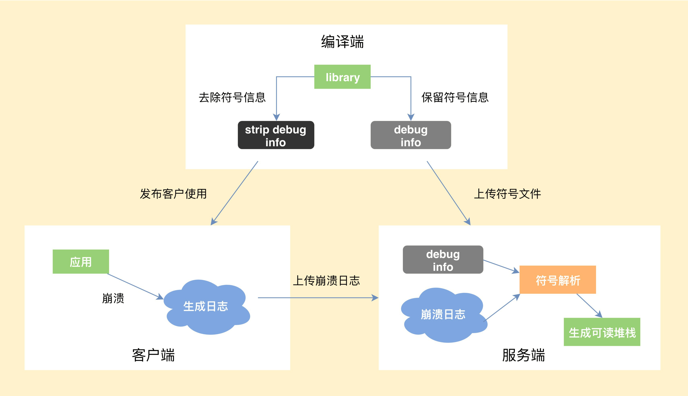

<!DOCTYPE html>
<html xmlns="http://www.w3.org/1999/xhtml">

<head>

    <head>
        <meta http-equiv="Content-Type" content="text/html; charset=UTF-8">
        <meta name="viewport" content="width=device-width, initial-scale=1, maximum-scale=1.0, user-scalable=no">
        <meta http-equiv='content-language' content='zh-cn'>
        <meta name='description' content=01&#32;崩溃优化（上）：关于“崩溃”那些事儿>
        <link rel="icon" href="/static/favicon.png">
        <title>01 崩溃优化（上）：关于“崩溃”那些事儿 </title>
        
        <link rel="stylesheet" href="/static/index.css">
        <link rel="stylesheet" href="/static/highlight.min.css">
        
        
        <meta name="generator" content="Hexo 4.2.0">
        
    </head>

<body>
    

        

            

                <a href="/">
                    
                    技术文章摘抄
                </a>
            

            

                <ul class="uncollapsible">
                    <li><a href="/" class="current-tab">首页</a></li>
                    <li><a href="../">上一级</a></li>
                </ul>
                <ul class="uncollapsible">
                    
                    <li>
                        <a class="menu-item" id="00 导读 如何打造高质量的应用？.md" href="/%e4%b8%93%e6%a0%8f/Android%e5%bc%80%e5%8f%91%e9%ab%98%e6%89%8b%e8%af%be/00%20%e5%af%bc%e8%af%bb%20%e5%a6%82%e4%bd%95%e6%89%93%e9%80%a0%e9%ab%98%e8%b4%a8%e9%87%8f%e7%9a%84%e5%ba%94%e7%94%a8%ef%bc%9f.md">00 导读 如何打造高质量的应用？.md</a>
                    </li>
                    
                    <li>
                        <a class="menu-item" id="00 开篇词 焦虑的移动开发者该如何破局？.md" href="/%e4%b8%93%e6%a0%8f/Android%e5%bc%80%e5%8f%91%e9%ab%98%e6%89%8b%e8%af%be/00%20%e5%bc%80%e7%af%87%e8%af%8d%20%e7%84%a6%e8%99%91%e7%9a%84%e7%a7%bb%e5%8a%a8%e5%bc%80%e5%8f%91%e8%80%85%e8%af%a5%e5%a6%82%e4%bd%95%e7%a0%b4%e5%b1%80%ef%bc%9f.md">00 开篇词 焦虑的移动开发者该如何破局？.md</a>
                    </li>
                    
                    <li>
                        <a class="menu-item" id="01 崩溃优化（上）：关于“崩溃”那些事儿.md" href="/%e4%b8%93%e6%a0%8f/Android%e5%bc%80%e5%8f%91%e9%ab%98%e6%89%8b%e8%af%be/01%20%e5%b4%a9%e6%ba%83%e4%bc%98%e5%8c%96%ef%bc%88%e4%b8%8a%ef%bc%89%ef%bc%9a%e5%85%b3%e4%ba%8e%e2%80%9c%e5%b4%a9%e6%ba%83%e2%80%9d%e9%82%a3%e4%ba%9b%e4%ba%8b%e5%84%bf.md">01 崩溃优化（上）：关于“崩溃”那些事儿.md</a>
                    </li>
                    
                    <li>
                        <a class="menu-item" id="02 崩溃优化（下）：应用崩溃了，你应该如何去分析？.md" href="/%e4%b8%93%e6%a0%8f/Android%e5%bc%80%e5%8f%91%e9%ab%98%e6%89%8b%e8%af%be/02%20%e5%b4%a9%e6%ba%83%e4%bc%98%e5%8c%96%ef%bc%88%e4%b8%8b%ef%bc%89%ef%bc%9a%e5%ba%94%e7%94%a8%e5%b4%a9%e6%ba%83%e4%ba%86%ef%bc%8c%e4%bd%a0%e5%ba%94%e8%af%a5%e5%a6%82%e4%bd%95%e5%8e%bb%e5%88%86%e6%9e%90%ef%bc%9f.md">02 崩溃优化（下）：应用崩溃了，你应该如何去分析？.md</a>
                    </li>
                    
                    <li>
                        <a class="menu-item" id="03 内存优化（上）：4GB内存时代，再谈内存优化.md" href="/%e4%b8%93%e6%a0%8f/Android%e5%bc%80%e5%8f%91%e9%ab%98%e6%89%8b%e8%af%be/03%20%e5%86%85%e5%ad%98%e4%bc%98%e5%8c%96%ef%bc%88%e4%b8%8a%ef%bc%89%ef%bc%9a4GB%e5%86%85%e5%ad%98%e6%97%b6%e4%bb%a3%ef%bc%8c%e5%86%8d%e8%b0%88%e5%86%85%e5%ad%98%e4%bc%98%e5%8c%96.md">03 内存优化（上）：4GB内存时代，再谈内存优化.md</a>
                    </li>
                    
                    <li>
                        <a class="menu-item" id="04 内存优化（下）：内存优化这件事，应该从哪里着手？.md" href="/%e4%b8%93%e6%a0%8f/Android%e5%bc%80%e5%8f%91%e9%ab%98%e6%89%8b%e8%af%be/04%20%e5%86%85%e5%ad%98%e4%bc%98%e5%8c%96%ef%bc%88%e4%b8%8b%ef%bc%89%ef%bc%9a%e5%86%85%e5%ad%98%e4%bc%98%e5%8c%96%e8%bf%99%e4%bb%b6%e4%ba%8b%ef%bc%8c%e5%ba%94%e8%af%a5%e4%bb%8e%e5%93%aa%e9%87%8c%e7%9d%80%e6%89%8b%ef%bc%9f.md">04 内存优化（下）：内存优化这件事，应该从哪里着手？.md</a>
                    </li>
                    
                    <li>
                        <a class="menu-item" id="05 卡顿优化（上）：你要掌握的卡顿分析方法.md" href="/%e4%b8%93%e6%a0%8f/Android%e5%bc%80%e5%8f%91%e9%ab%98%e6%89%8b%e8%af%be/05%20%e5%8d%a1%e9%a1%bf%e4%bc%98%e5%8c%96%ef%bc%88%e4%b8%8a%ef%bc%89%ef%bc%9a%e4%bd%a0%e8%a6%81%e6%8e%8c%e6%8f%a1%e7%9a%84%e5%8d%a1%e9%a1%bf%e5%88%86%e6%9e%90%e6%96%b9%e6%b3%95.md">05 卡顿优化（上）：你要掌握的卡顿分析方法.md</a>
                    </li>
                    
                    <li>
                        <a class="menu-item" id="06 卡顿优化（下）：如何监控应用卡顿？.md" href="/%e4%b8%93%e6%a0%8f/Android%e5%bc%80%e5%8f%91%e9%ab%98%e6%89%8b%e8%af%be/06%20%e5%8d%a1%e9%a1%bf%e4%bc%98%e5%8c%96%ef%bc%88%e4%b8%8b%ef%bc%89%ef%bc%9a%e5%a6%82%e4%bd%95%e7%9b%91%e6%8e%a7%e5%ba%94%e7%94%a8%e5%8d%a1%e9%a1%bf%ef%bc%9f.md">06 卡顿优化（下）：如何监控应用卡顿？.md</a>
                    </li>
                    
                    <li>
                        <a class="menu-item" id="06补充篇 卡顿优化：卡顿现场与卡顿分析.md" href="/%e4%b8%93%e6%a0%8f/Android%e5%bc%80%e5%8f%91%e9%ab%98%e6%89%8b%e8%af%be/06%e8%a1%a5%e5%85%85%e7%af%87%20%e5%8d%a1%e9%a1%bf%e4%bc%98%e5%8c%96%ef%bc%9a%e5%8d%a1%e9%a1%bf%e7%8e%b0%e5%9c%ba%e4%b8%8e%e5%8d%a1%e9%a1%bf%e5%88%86%e6%9e%90.md">06补充篇 卡顿优化：卡顿现场与卡顿分析.md</a>
                    </li>
                    
                    <li>
                        <a class="menu-item" id="07 启动优化（上）：从启动过程看启动速度优化.md" href="/%e4%b8%93%e6%a0%8f/Android%e5%bc%80%e5%8f%91%e9%ab%98%e6%89%8b%e8%af%be/07%20%e5%90%af%e5%8a%a8%e4%bc%98%e5%8c%96%ef%bc%88%e4%b8%8a%ef%bc%89%ef%bc%9a%e4%bb%8e%e5%90%af%e5%8a%a8%e8%bf%87%e7%a8%8b%e7%9c%8b%e5%90%af%e5%8a%a8%e9%80%9f%e5%ba%a6%e4%bc%98%e5%8c%96.md">07 启动优化（上）：从启动过程看启动速度优化.md</a>
                    </li>
                    
                    <li>
                        <a class="menu-item" id="08 启动优化（下）：优化启动速度的进阶方法.md" href="/%e4%b8%93%e6%a0%8f/Android%e5%bc%80%e5%8f%91%e9%ab%98%e6%89%8b%e8%af%be/08%20%e5%90%af%e5%8a%a8%e4%bc%98%e5%8c%96%ef%bc%88%e4%b8%8b%ef%bc%89%ef%bc%9a%e4%bc%98%e5%8c%96%e5%90%af%e5%8a%a8%e9%80%9f%e5%ba%a6%e7%9a%84%e8%bf%9b%e9%98%b6%e6%96%b9%e6%b3%95.md">08 启动优化（下）：优化启动速度的进阶方法.md</a>
                    </li>
                    
                    <li>
                        <a class="menu-item" id="09 I_O优化（上）：开发工程师必备的I_O优化知识.md" href="/%e4%b8%93%e6%a0%8f/Android%e5%bc%80%e5%8f%91%e9%ab%98%e6%89%8b%e8%af%be/09%20I_O%e4%bc%98%e5%8c%96%ef%bc%88%e4%b8%8a%ef%bc%89%ef%bc%9a%e5%bc%80%e5%8f%91%e5%b7%a5%e7%a8%8b%e5%b8%88%e5%bf%85%e5%a4%87%e7%9a%84I_O%e4%bc%98%e5%8c%96%e7%9f%a5%e8%af%86.md">09 I_O优化（上）：开发工程师必备的I_O优化知识.md</a>
                    </li>
                    
                    <li>
                        <a class="menu-item" id="10 I_O优化（中）：不同I_O方式的使用场景是什么？.md" href="/%e4%b8%93%e6%a0%8f/Android%e5%bc%80%e5%8f%91%e9%ab%98%e6%89%8b%e8%af%be/10%20I_O%e4%bc%98%e5%8c%96%ef%bc%88%e4%b8%ad%ef%bc%89%ef%bc%9a%e4%b8%8d%e5%90%8cI_O%e6%96%b9%e5%bc%8f%e7%9a%84%e4%bd%bf%e7%94%a8%e5%9c%ba%e6%99%af%e6%98%af%e4%bb%80%e4%b9%88%ef%bc%9f.md">10 I_O优化（中）：不同I_O方式的使用场景是什么？.md</a>
                    </li>
                    
                    <li>
                        <a class="menu-item" id="11 I_O优化（下）：如何监控线上I_O操作？.md" href="/%e4%b8%93%e6%a0%8f/Android%e5%bc%80%e5%8f%91%e9%ab%98%e6%89%8b%e8%af%be/11%20I_O%e4%bc%98%e5%8c%96%ef%bc%88%e4%b8%8b%ef%bc%89%ef%bc%9a%e5%a6%82%e4%bd%95%e7%9b%91%e6%8e%a7%e7%ba%bf%e4%b8%8aI_O%e6%93%8d%e4%bd%9c%ef%bc%9f.md">11 I_O优化（下）：如何监控线上I_O操作？.md</a>
                    </li>
                    
                    <li>
                        <a class="menu-item" id="12 存储优化（上）：常见的数据存储方法有哪些？.md" href="/%e4%b8%93%e6%a0%8f/Android%e5%bc%80%e5%8f%91%e9%ab%98%e6%89%8b%e8%af%be/12%20%e5%ad%98%e5%82%a8%e4%bc%98%e5%8c%96%ef%bc%88%e4%b8%8a%ef%bc%89%ef%bc%9a%e5%b8%b8%e8%a7%81%e7%9a%84%e6%95%b0%e6%8d%ae%e5%ad%98%e5%82%a8%e6%96%b9%e6%b3%95%e6%9c%89%e5%93%aa%e4%ba%9b%ef%bc%9f.md">12 存储优化（上）：常见的数据存储方法有哪些？.md</a>
                    </li>
                    
                    <li>
                        <a class="menu-item" id="13 存储优化（中）：如何优化数据存储？.md" href="/%e4%b8%93%e6%a0%8f/Android%e5%bc%80%e5%8f%91%e9%ab%98%e6%89%8b%e8%af%be/13%20%e5%ad%98%e5%82%a8%e4%bc%98%e5%8c%96%ef%bc%88%e4%b8%ad%ef%bc%89%ef%bc%9a%e5%a6%82%e4%bd%95%e4%bc%98%e5%8c%96%e6%95%b0%e6%8d%ae%e5%ad%98%e5%82%a8%ef%bc%9f.md">13 存储优化（中）：如何优化数据存储？.md</a>
                    </li>
                    
                    <li>
                        <a class="menu-item" id="14 存储优化（下）：数据库SQLite的使用和优化.md" href="/%e4%b8%93%e6%a0%8f/Android%e5%bc%80%e5%8f%91%e9%ab%98%e6%89%8b%e8%af%be/14%20%e5%ad%98%e5%82%a8%e4%bc%98%e5%8c%96%ef%bc%88%e4%b8%8b%ef%bc%89%ef%bc%9a%e6%95%b0%e6%8d%ae%e5%ba%93SQLite%e7%9a%84%e4%bd%bf%e7%94%a8%e5%92%8c%e4%bc%98%e5%8c%96.md">14 存储优化（下）：数据库SQLite的使用和优化.md</a>
                    </li>
                    
                    <li>
                        <a class="menu-item" id="15 网络优化（上）：移动开发工程师必备的网络优化知识.md" href="/%e4%b8%93%e6%a0%8f/Android%e5%bc%80%e5%8f%91%e9%ab%98%e6%89%8b%e8%af%be/15%20%e7%bd%91%e7%bb%9c%e4%bc%98%e5%8c%96%ef%bc%88%e4%b8%8a%ef%bc%89%ef%bc%9a%e7%a7%bb%e5%8a%a8%e5%bc%80%e5%8f%91%e5%b7%a5%e7%a8%8b%e5%b8%88%e5%bf%85%e5%a4%87%e7%9a%84%e7%bd%91%e7%bb%9c%e4%bc%98%e5%8c%96%e7%9f%a5%e8%af%86.md">15 网络优化（上）：移动开发工程师必备的网络优化知识.md</a>
                    </li>
                    
                    <li>
                        <a class="menu-item" id="16 网络优化（中）：复杂多变的移动网络该如何优化？.md" href="/%e4%b8%93%e6%a0%8f/Android%e5%bc%80%e5%8f%91%e9%ab%98%e6%89%8b%e8%af%be/16%20%e7%bd%91%e7%bb%9c%e4%bc%98%e5%8c%96%ef%bc%88%e4%b8%ad%ef%bc%89%ef%bc%9a%e5%a4%8d%e6%9d%82%e5%a4%9a%e5%8f%98%e7%9a%84%e7%a7%bb%e5%8a%a8%e7%bd%91%e7%bb%9c%e8%af%a5%e5%a6%82%e4%bd%95%e4%bc%98%e5%8c%96%ef%bc%9f.md">16 网络优化（中）：复杂多变的移动网络该如何优化？.md</a>
                    </li>
                    
                    <li>
                        <a class="menu-item" id="17 网络优化（下）：大数据下网络该如何监控？.md" href="/%e4%b8%93%e6%a0%8f/Android%e5%bc%80%e5%8f%91%e9%ab%98%e6%89%8b%e8%af%be/17%20%e7%bd%91%e7%bb%9c%e4%bc%98%e5%8c%96%ef%bc%88%e4%b8%8b%ef%bc%89%ef%bc%9a%e5%a4%a7%e6%95%b0%e6%8d%ae%e4%b8%8b%e7%bd%91%e7%bb%9c%e8%af%a5%e5%a6%82%e4%bd%95%e7%9b%91%e6%8e%a7%ef%bc%9f.md">17 网络优化（下）：大数据下网络该如何监控？.md</a>
                    </li>
                    
                    <li>
                        <a class="menu-item" id="18 耗电优化（上）：从电量优化的演进看耗电分析.md" href="/%e4%b8%93%e6%a0%8f/Android%e5%bc%80%e5%8f%91%e9%ab%98%e6%89%8b%e8%af%be/18%20%e8%80%97%e7%94%b5%e4%bc%98%e5%8c%96%ef%bc%88%e4%b8%8a%ef%bc%89%ef%bc%9a%e4%bb%8e%e7%94%b5%e9%87%8f%e4%bc%98%e5%8c%96%e7%9a%84%e6%bc%94%e8%bf%9b%e7%9c%8b%e8%80%97%e7%94%b5%e5%88%86%e6%9e%90.md">18 耗电优化（上）：从电量优化的演进看耗电分析.md</a>
                    </li>
                    
                    <li>
                        <a class="menu-item" id="19 耗电优化（下）：耗电的优化方法与线上监控.md" href="/%e4%b8%93%e6%a0%8f/Android%e5%bc%80%e5%8f%91%e9%ab%98%e6%89%8b%e8%af%be/19%20%e8%80%97%e7%94%b5%e4%bc%98%e5%8c%96%ef%bc%88%e4%b8%8b%ef%bc%89%ef%bc%9a%e8%80%97%e7%94%b5%e7%9a%84%e4%bc%98%e5%8c%96%e6%96%b9%e6%b3%95%e4%b8%8e%e7%ba%bf%e4%b8%8a%e7%9b%91%e6%8e%a7.md">19 耗电优化（下）：耗电的优化方法与线上监控.md</a>
                    </li>
                    
                    <li>
                        <a class="menu-item" id="20 UI 优化（上）：UI 渲染的几个关键概念.md" href="/%e4%b8%93%e6%a0%8f/Android%e5%bc%80%e5%8f%91%e9%ab%98%e6%89%8b%e8%af%be/20%20UI%20%e4%bc%98%e5%8c%96%ef%bc%88%e4%b8%8a%ef%bc%89%ef%bc%9aUI%20%e6%b8%b2%e6%9f%93%e7%9a%84%e5%87%a0%e4%b8%aa%e5%85%b3%e9%94%ae%e6%a6%82%e5%bf%b5.md">20 UI 优化（上）：UI 渲染的几个关键概念.md</a>
                    </li>
                    
                    <li>
                        <a class="menu-item" id="21 UI 优化（下）：如何优化 UI 渲染？.md" href="/%e4%b8%93%e6%a0%8f/Android%e5%bc%80%e5%8f%91%e9%ab%98%e6%89%8b%e8%af%be/21%20UI%20%e4%bc%98%e5%8c%96%ef%bc%88%e4%b8%8b%ef%bc%89%ef%bc%9a%e5%a6%82%e4%bd%95%e4%bc%98%e5%8c%96%20UI%20%e6%b8%b2%e6%9f%93%ef%bc%9f.md">21 UI 优化（下）：如何优化 UI 渲染？.md</a>
                    </li>
                    
                    <li>
                        <a class="menu-item" id="22 包体积优化（上）：如何减少安装包大小？.md" href="/%e4%b8%93%e6%a0%8f/Android%e5%bc%80%e5%8f%91%e9%ab%98%e6%89%8b%e8%af%be/22%20%e5%8c%85%e4%bd%93%e7%a7%af%e4%bc%98%e5%8c%96%ef%bc%88%e4%b8%8a%ef%bc%89%ef%bc%9a%e5%a6%82%e4%bd%95%e5%87%8f%e5%b0%91%e5%ae%89%e8%a3%85%e5%8c%85%e5%a4%a7%e5%b0%8f%ef%bc%9f.md">22 包体积优化（上）：如何减少安装包大小？.md</a>
                    </li>
                    
                    <li>
                        <a class="menu-item" id="23 包体积优化（下）：资源优化的进阶实践.md" href="/%e4%b8%93%e6%a0%8f/Android%e5%bc%80%e5%8f%91%e9%ab%98%e6%89%8b%e8%af%be/23%20%e5%8c%85%e4%bd%93%e7%a7%af%e4%bc%98%e5%8c%96%ef%bc%88%e4%b8%8b%ef%bc%89%ef%bc%9a%e8%b5%84%e6%ba%90%e4%bc%98%e5%8c%96%e7%9a%84%e8%bf%9b%e9%98%b6%e5%ae%9e%e8%b7%b5.md">23 包体积优化（下）：资源优化的进阶实践.md</a>
                    </li>
                    
                    <li>
                        <a class="menu-item" id="24 想成为Android高手，你需要先搞定这三个问题.md" href="/%e4%b8%93%e6%a0%8f/Android%e5%bc%80%e5%8f%91%e9%ab%98%e6%89%8b%e8%af%be/24%20%e6%83%b3%e6%88%90%e4%b8%baAndroid%e9%ab%98%e6%89%8b%ef%bc%8c%e4%bd%a0%e9%9c%80%e8%a6%81%e5%85%88%e6%90%9e%e5%ae%9a%e8%bf%99%e4%b8%89%e4%b8%aa%e9%97%ae%e9%a2%98.md">24 想成为Android高手，你需要先搞定这三个问题.md</a>
                    </li>
                    
                    <li>
                        <a class="menu-item" id="25 如何提升组织与个人的研发效能？.md" href="/%e4%b8%93%e6%a0%8f/Android%e5%bc%80%e5%8f%91%e9%ab%98%e6%89%8b%e8%af%be/25%20%e5%a6%82%e4%bd%95%e6%8f%90%e5%8d%87%e7%bb%84%e7%bb%87%e4%b8%8e%e4%b8%aa%e4%ba%ba%e7%9a%84%e7%a0%94%e5%8f%91%e6%95%88%e8%83%bd%ef%bc%9f.md">25 如何提升组织与个人的研发效能？.md</a>
                    </li>
                    
                    <li>
                        <a class="menu-item" id="26 关于编译，你需要了解什么？.md" href="/%e4%b8%93%e6%a0%8f/Android%e5%bc%80%e5%8f%91%e9%ab%98%e6%89%8b%e8%af%be/26%20%e5%85%b3%e4%ba%8e%e7%bc%96%e8%af%91%ef%bc%8c%e4%bd%a0%e9%9c%80%e8%a6%81%e4%ba%86%e8%a7%a3%e4%bb%80%e4%b9%88%ef%bc%9f.md">26 关于编译，你需要了解什么？.md</a>
                    </li>
                    
                    <li>
                        <a class="menu-item" id="27 编译插桩的三种方法：AspectJ、ASM、ReDex.md" href="/%e4%b8%93%e6%a0%8f/Android%e5%bc%80%e5%8f%91%e9%ab%98%e6%89%8b%e8%af%be/27%20%e7%bc%96%e8%af%91%e6%8f%92%e6%a1%a9%e7%9a%84%e4%b8%89%e7%a7%8d%e6%96%b9%e6%b3%95%ef%bc%9aAspectJ%e3%80%81ASM%e3%80%81ReDex.md">27 编译插桩的三种方法：AspectJ、ASM、ReDex.md</a>
                    </li>
                    
                    <li>
                        <a class="menu-item" id="28 大数据与AI，如何高效地测试？.md" href="/%e4%b8%93%e6%a0%8f/Android%e5%bc%80%e5%8f%91%e9%ab%98%e6%89%8b%e8%af%be/28%20%e5%a4%a7%e6%95%b0%e6%8d%ae%e4%b8%8eAI%ef%bc%8c%e5%a6%82%e4%bd%95%e9%ab%98%e6%95%88%e5%9c%b0%e6%b5%8b%e8%af%95%ef%bc%9f.md">28 大数据与AI，如何高效地测试？.md</a>
                    </li>
                    
                    <li>
                        <a class="menu-item" id="29 从每月到每天，如何给版本发布提速？.md" href="/%e4%b8%93%e6%a0%8f/Android%e5%bc%80%e5%8f%91%e9%ab%98%e6%89%8b%e8%af%be/29%20%e4%bb%8e%e6%af%8f%e6%9c%88%e5%88%b0%e6%af%8f%e5%a4%a9%ef%bc%8c%e5%a6%82%e4%bd%95%e7%bb%99%e7%89%88%e6%9c%ac%e5%8f%91%e5%b8%83%e6%8f%90%e9%80%9f%ef%bc%9f.md">29 从每月到每天，如何给版本发布提速？.md</a>
                    </li>
                    
                    <li>
                        <a class="menu-item" id="30 数据评估（上）：如何实现高可用的上报组件？.md" href="/%e4%b8%93%e6%a0%8f/Android%e5%bc%80%e5%8f%91%e9%ab%98%e6%89%8b%e8%af%be/30%20%e6%95%b0%e6%8d%ae%e8%af%84%e4%bc%b0%ef%bc%88%e4%b8%8a%ef%bc%89%ef%bc%9a%e5%a6%82%e4%bd%95%e5%ae%9e%e7%8e%b0%e9%ab%98%e5%8f%af%e7%94%a8%e7%9a%84%e4%b8%8a%e6%8a%a5%e7%bb%84%e4%bb%b6%ef%bc%9f.md">30 数据评估（上）：如何实现高可用的上报组件？.md</a>
                    </li>
                    
                    <li>
                        <a class="menu-item" id="31 数据评估（下）：什么是大数据平台？.md" href="/%e4%b8%93%e6%a0%8f/Android%e5%bc%80%e5%8f%91%e9%ab%98%e6%89%8b%e8%af%be/31%20%e6%95%b0%e6%8d%ae%e8%af%84%e4%bc%b0%ef%bc%88%e4%b8%8b%ef%bc%89%ef%bc%9a%e4%bb%80%e4%b9%88%e6%98%af%e5%a4%a7%e6%95%b0%e6%8d%ae%e5%b9%b3%e5%8f%b0%ef%bc%9f.md">31 数据评估（下）：什么是大数据平台？.md</a>
                    </li>
                    
                    <li>
                        <a class="menu-item" id="32 线上疑难问题该如何排查和跟踪？.md" href="/%e4%b8%93%e6%a0%8f/Android%e5%bc%80%e5%8f%91%e9%ab%98%e6%89%8b%e8%af%be/32%20%e7%ba%bf%e4%b8%8a%e7%96%91%e9%9a%be%e9%97%ae%e9%a2%98%e8%af%a5%e5%a6%82%e4%bd%95%e6%8e%92%e6%9f%a5%e5%92%8c%e8%b7%9f%e8%b8%aa%ef%bc%9f.md">32 线上疑难问题该如何排查和跟踪？.md</a>
                    </li>
                    
                    <li>
                        <a class="menu-item" id="33 做一名有高度的移动开发工程师.md" href="/%e4%b8%93%e6%a0%8f/Android%e5%bc%80%e5%8f%91%e9%ab%98%e6%89%8b%e8%af%be/33%20%e5%81%9a%e4%b8%80%e5%90%8d%e6%9c%89%e9%ab%98%e5%ba%a6%e7%9a%84%e7%a7%bb%e5%8a%a8%e5%bc%80%e5%8f%91%e5%b7%a5%e7%a8%8b%e5%b8%88.md">33 做一名有高度的移动开发工程师.md</a>
                    </li>
                    
                    <li>
                        <a class="menu-item" id="34 聊聊重构：优秀的架构都是演进而来的.md" href="/%e4%b8%93%e6%a0%8f/Android%e5%bc%80%e5%8f%91%e9%ab%98%e6%89%8b%e8%af%be/34%20%e8%81%8a%e8%81%8a%e9%87%8d%e6%9e%84%ef%bc%9a%e4%bc%98%e7%a7%80%e7%9a%84%e6%9e%b6%e6%9e%84%e9%83%bd%e6%98%af%e6%bc%94%e8%bf%9b%e8%80%8c%e6%9d%a5%e7%9a%84.md">34 聊聊重构：优秀的架构都是演进而来的.md</a>
                    </li>
                    
                    <li>
                        <a class="menu-item" id="35 Native Hook 技术，天使还是魔鬼？.md" href="/%e4%b8%93%e6%a0%8f/Android%e5%bc%80%e5%8f%91%e9%ab%98%e6%89%8b%e8%af%be/35%20Native%20Hook%20%e6%8a%80%e6%9c%af%ef%bc%8c%e5%a4%a9%e4%bd%bf%e8%bf%98%e6%98%af%e9%ad%94%e9%ac%bc%ef%bc%9f.md">35 Native Hook 技术，天使还是魔鬼？.md</a>
                    </li>
                    
                    <li>
                        <a class="menu-item" id="36 跨平台开发的现状与应用.md" href="/%e4%b8%93%e6%a0%8f/Android%e5%bc%80%e5%8f%91%e9%ab%98%e6%89%8b%e8%af%be/36%20%e8%b7%a8%e5%b9%b3%e5%8f%b0%e5%bc%80%e5%8f%91%e7%9a%84%e7%8e%b0%e7%8a%b6%e4%b8%8e%e5%ba%94%e7%94%a8.md">36 跨平台开发的现状与应用.md</a>
                    </li>
                    
                    <li>
                        <a class="menu-item" id="37 移动开发新大陆：工作三年半，移动开发转型手游开发.md" href="/%e4%b8%93%e6%a0%8f/Android%e5%bc%80%e5%8f%91%e9%ab%98%e6%89%8b%e8%af%be/37%20%e7%a7%bb%e5%8a%a8%e5%bc%80%e5%8f%91%e6%96%b0%e5%a4%a7%e9%99%86%ef%bc%9a%e5%b7%a5%e4%bd%9c%e4%b8%89%e5%b9%b4%e5%8d%8a%ef%bc%8c%e7%a7%bb%e5%8a%a8%e5%bc%80%e5%8f%91%e8%bd%ac%e5%9e%8b%e6%89%8b%e6%b8%b8%e5%bc%80%e5%8f%91.md">37 移动开发新大陆：工作三年半，移动开发转型手游开发.md</a>
                    </li>
                    
                    <li>
                        <a class="menu-item" id="38 移动开发新大陆：Android音视频开发.md" href="/%e4%b8%93%e6%a0%8f/Android%e5%bc%80%e5%8f%91%e9%ab%98%e6%89%8b%e8%af%be/38%20%e7%a7%bb%e5%8a%a8%e5%bc%80%e5%8f%91%e6%96%b0%e5%a4%a7%e9%99%86%ef%bc%9aAndroid%e9%9f%b3%e8%a7%86%e9%a2%91%e5%bc%80%e5%8f%91.md">38 移动开发新大陆：Android音视频开发.md</a>
                    </li>
                    
                    <li>
                        <a class="menu-item" id="39 移动开发新大陆： 边缘智能计算的趋势.md" href="/%e4%b8%93%e6%a0%8f/Android%e5%bc%80%e5%8f%91%e9%ab%98%e6%89%8b%e8%af%be/39%20%e7%a7%bb%e5%8a%a8%e5%bc%80%e5%8f%91%e6%96%b0%e5%a4%a7%e9%99%86%ef%bc%9a%20%e8%be%b9%e7%bc%98%e6%99%ba%e8%83%bd%e8%ae%a1%e7%ae%97%e7%9a%84%e8%b6%8b%e5%8a%bf.md">39 移动开发新大陆： 边缘智能计算的趋势.md</a>
                    </li>
                    
                    <li>
                        <a class="menu-item" id="40 动态化实践，如何选择适合自己的方案？.md" href="/%e4%b8%93%e6%a0%8f/Android%e5%bc%80%e5%8f%91%e9%ab%98%e6%89%8b%e8%af%be/40%20%e5%8a%a8%e6%80%81%e5%8c%96%e5%ae%9e%e8%b7%b5%ef%bc%8c%e5%a6%82%e4%bd%95%e9%80%89%e6%8b%a9%e9%80%82%e5%90%88%e8%87%aa%e5%b7%b1%e7%9a%84%e6%96%b9%e6%a1%88%ef%bc%9f.md">40 动态化实践，如何选择适合自己的方案？.md</a>
                    </li>
                    
                    <li>
                        <a class="menu-item" id="41 聊聊Flutter，面对层出不穷的新技术该如何跟进？.md" href="/%e4%b8%93%e6%a0%8f/Android%e5%bc%80%e5%8f%91%e9%ab%98%e6%89%8b%e8%af%be/41%20%e8%81%8a%e8%81%8aFlutter%ef%bc%8c%e9%9d%a2%e5%af%b9%e5%b1%82%e5%87%ba%e4%b8%8d%e7%a9%b7%e7%9a%84%e6%96%b0%e6%8a%80%e6%9c%af%e8%af%a5%e5%a6%82%e4%bd%95%e8%b7%9f%e8%bf%9b%ef%bc%9f.md">41 聊聊Flutter，面对层出不穷的新技术该如何跟进？.md</a>
                    </li>
                    
                    <li>
                        <a class="menu-item" id="42 Android开发高手课学习心得.md" href="/%e4%b8%93%e6%a0%8f/Android%e5%bc%80%e5%8f%91%e9%ab%98%e6%89%8b%e8%af%be/42%20Android%e5%bc%80%e5%8f%91%e9%ab%98%e6%89%8b%e8%af%be%e5%ad%a6%e4%b9%a0%e5%bf%83%e5%be%97.md">42 Android开发高手课学习心得.md</a>
                    </li>
                    
                    <li>
                        <a class="menu-item" id="Android JVM TI机制详解（内含福利彩蛋）.md" href="/%e4%b8%93%e6%a0%8f/Android%e5%bc%80%e5%8f%91%e9%ab%98%e6%89%8b%e8%af%be/Android%20JVM%20TI%e6%9c%ba%e5%88%b6%e8%af%a6%e8%a7%a3%ef%bc%88%e5%86%85%e5%90%ab%e7%a6%8f%e5%88%a9%e5%bd%a9%e8%9b%8b%ef%bc%89.md">Android JVM TI机制详解（内含福利彩蛋）.md</a>
                    </li>
                    
                    <li>
                        <a class="menu-item" id="Android工程师的“面试指南”.md" href="/%e4%b8%93%e6%a0%8f/Android%e5%bc%80%e5%8f%91%e9%ab%98%e6%89%8b%e8%af%be/Android%e5%b7%a5%e7%a8%8b%e5%b8%88%e7%9a%84%e2%80%9c%e9%9d%a2%e8%af%95%e6%8c%87%e5%8d%97%e2%80%9d.md">Android工程师的“面试指南”.md</a>
                    </li>
                    
                    <li>
                        <a class="menu-item" id="Native下如何获取调用栈？.md" href="/%e4%b8%93%e6%a0%8f/Android%e5%bc%80%e5%8f%91%e9%ab%98%e6%89%8b%e8%af%be/Native%e4%b8%8b%e5%a6%82%e4%bd%95%e8%8e%b7%e5%8f%96%e8%b0%83%e7%94%a8%e6%a0%88%ef%bc%9f.md">Native下如何获取调用栈？.md</a>
                    </li>
                    
                    <li>
                        <a class="menu-item" id="专栏学得苦？可能你还需要一份配套学习书单.md" href="/%e4%b8%93%e6%a0%8f/Android%e5%bc%80%e5%8f%91%e9%ab%98%e6%89%8b%e8%af%be/%e4%b8%93%e6%a0%8f%e5%ad%a6%e5%be%97%e8%8b%a6%ef%bc%9f%e5%8f%af%e8%83%bd%e4%bd%a0%e8%bf%98%e9%9c%80%e8%a6%81%e4%b8%80%e4%bb%bd%e9%85%8d%e5%a5%97%e5%ad%a6%e4%b9%a0%e4%b9%a6%e5%8d%95.md">专栏学得苦？可能你还需要一份配套学习书单.md</a>
                    </li>
                    
                    <li>
                        <a class="menu-item" id="专栏学得苦？可能是方法没找对.md" href="/%e4%b8%93%e6%a0%8f/Android%e5%bc%80%e5%8f%91%e9%ab%98%e6%89%8b%e8%af%be/%e4%b8%93%e6%a0%8f%e5%ad%a6%e5%be%97%e8%8b%a6%ef%bc%9f%e5%8f%af%e8%83%bd%e6%98%af%e6%96%b9%e6%b3%95%e6%b2%a1%e6%89%be%e5%af%b9.md">专栏学得苦？可能是方法没找对.md</a>
                    </li>
                    
                    <li>
                        <a class="menu-item" id="程序员修炼之路 设计能力的提升途径.md" href="/%e4%b8%93%e6%a0%8f/Android%e5%bc%80%e5%8f%91%e9%ab%98%e6%89%8b%e8%af%be/%e7%a8%8b%e5%ba%8f%e5%91%98%e4%bf%ae%e7%82%bc%e4%b9%8b%e8%b7%af%20%e8%ae%be%e8%ae%a1%e8%83%bd%e5%8a%9b%e7%9a%84%e6%8f%90%e5%8d%87%e9%80%94%e5%be%84.md">程序员修炼之路 设计能力的提升途径.md</a>
                    </li>
                    
                    <li>
                        <a class="menu-item" id="练习Sample跑起来 ASM插桩强化练习.md" href="/%e4%b8%93%e6%a0%8f/Android%e5%bc%80%e5%8f%91%e9%ab%98%e6%89%8b%e8%af%be/%e7%bb%83%e4%b9%a0Sample%e8%b7%91%e8%b5%b7%e6%9d%a5%20ASM%e6%8f%92%e6%a1%a9%e5%bc%ba%e5%8c%96%e7%bb%83%e4%b9%a0.md">练习Sample跑起来 ASM插桩强化练习.md</a>
                    </li>
                    
                    <li>
                        <a class="menu-item" id="练习Sample跑起来 唯鹿同学的练习手记 第1辑.md" href="/%e4%b8%93%e6%a0%8f/Android%e5%bc%80%e5%8f%91%e9%ab%98%e6%89%8b%e8%af%be/%e7%bb%83%e4%b9%a0Sample%e8%b7%91%e8%b5%b7%e6%9d%a5%20%e5%94%af%e9%b9%bf%e5%90%8c%e5%ad%a6%e7%9a%84%e7%bb%83%e4%b9%a0%e6%89%8b%e8%ae%b0%20%e7%ac%ac1%e8%be%91.md">练习Sample跑起来 唯鹿同学的练习手记 第1辑.md</a>
                    </li>
                    
                    <li>
                        <a class="menu-item" id="练习Sample跑起来 唯鹿同学的练习手记 第2辑.md" href="/%e4%b8%93%e6%a0%8f/Android%e5%bc%80%e5%8f%91%e9%ab%98%e6%89%8b%e8%af%be/%e7%bb%83%e4%b9%a0Sample%e8%b7%91%e8%b5%b7%e6%9d%a5%20%e5%94%af%e9%b9%bf%e5%90%8c%e5%ad%a6%e7%9a%84%e7%bb%83%e4%b9%a0%e6%89%8b%e8%ae%b0%20%e7%ac%ac2%e8%be%91.md">练习Sample跑起来 唯鹿同学的练习手记 第2辑.md</a>
                    </li>
                    
                    <li>
                        <a class="menu-item" id="练习Sample跑起来 唯鹿同学的练习手记 第3辑.md" href="/%e4%b8%93%e6%a0%8f/Android%e5%bc%80%e5%8f%91%e9%ab%98%e6%89%8b%e8%af%be/%e7%bb%83%e4%b9%a0Sample%e8%b7%91%e8%b5%b7%e6%9d%a5%20%e5%94%af%e9%b9%bf%e5%90%8c%e5%ad%a6%e7%9a%84%e7%bb%83%e4%b9%a0%e6%89%8b%e8%ae%b0%20%e7%ac%ac3%e8%be%91.md">练习Sample跑起来 唯鹿同学的练习手记 第3辑.md</a>
                    </li>
                    
                    <li>
                        <a class="menu-item" id="练习Sample跑起来 热点问题答疑第1期.md" href="/%e4%b8%93%e6%a0%8f/Android%e5%bc%80%e5%8f%91%e9%ab%98%e6%89%8b%e8%af%be/%e7%bb%83%e4%b9%a0Sample%e8%b7%91%e8%b5%b7%e6%9d%a5%20%e7%83%ad%e7%82%b9%e9%97%ae%e9%a2%98%e7%ad%94%e7%96%91%e7%ac%ac1%e6%9c%9f.md">练习Sample跑起来 热点问题答疑第1期.md</a>
                    </li>
                    
                    <li>
                        <a class="menu-item" id="练习Sample跑起来 热点问题答疑第2期.md" href="/%e4%b8%93%e6%a0%8f/Android%e5%bc%80%e5%8f%91%e9%ab%98%e6%89%8b%e8%af%be/%e7%bb%83%e4%b9%a0Sample%e8%b7%91%e8%b5%b7%e6%9d%a5%20%e7%83%ad%e7%82%b9%e9%97%ae%e9%a2%98%e7%ad%94%e7%96%91%e7%ac%ac2%e6%9c%9f.md">练习Sample跑起来 热点问题答疑第2期.md</a>
                    </li>
                    
                    <li>
                        <a class="menu-item" id="练习Sample跑起来 热点问题答疑第3期.md" href="/%e4%b8%93%e6%a0%8f/Android%e5%bc%80%e5%8f%91%e9%ab%98%e6%89%8b%e8%af%be/%e7%bb%83%e4%b9%a0Sample%e8%b7%91%e8%b5%b7%e6%9d%a5%20%e7%83%ad%e7%82%b9%e9%97%ae%e9%a2%98%e7%ad%94%e7%96%91%e7%ac%ac3%e6%9c%9f.md">练习Sample跑起来 热点问题答疑第3期.md</a>
                    </li>
                    
                    <li>
                        <a class="menu-item" id="练习Sample跑起来 热点问题答疑第4期.md" href="/%e4%b8%93%e6%a0%8f/Android%e5%bc%80%e5%8f%91%e9%ab%98%e6%89%8b%e8%af%be/%e7%bb%83%e4%b9%a0Sample%e8%b7%91%e8%b5%b7%e6%9d%a5%20%e7%83%ad%e7%82%b9%e9%97%ae%e9%a2%98%e7%ad%94%e7%96%91%e7%ac%ac4%e6%9c%9f.md">练习Sample跑起来 热点问题答疑第4期.md</a>
                    </li>
                    
                    <li>
                        <a class="menu-item" id="结束语 移动开发的今天和明天.md" href="/%e4%b8%93%e6%a0%8f/Android%e5%bc%80%e5%8f%91%e9%ab%98%e6%89%8b%e8%af%be/%e7%bb%93%e6%9d%9f%e8%af%ad%20%e7%a7%bb%e5%8a%a8%e5%bc%80%e5%8f%91%e7%9a%84%e4%bb%8a%e5%a4%a9%e5%92%8c%e6%98%8e%e5%a4%a9.md">结束语 移动开发的今天和明天.md</a>
                    </li>
                    
                    <li>
                        <a class="menu-item" id="聊聊Framework的学习方法.md" href="/%e4%b8%93%e6%a0%8f/Android%e5%bc%80%e5%8f%91%e9%ab%98%e6%89%8b%e8%af%be/%e8%81%8a%e8%81%8aFramework%e7%9a%84%e5%ad%a6%e4%b9%a0%e6%96%b9%e6%b3%95.md">聊聊Framework的学习方法.md</a>
                    </li>
                    
                    <li><a href="https://lianglianglee.com/assets/%E6%8D%90%E8%B5%A0.md">捐赠</a></li>
                </ul>

            

        

        

            

        

        

            

                

                    

                        
                        <header class="navbar">
                            <section class="navbar-section">
                                <a onclick="open_sidebar()">
                                    <i class="icon icon-menu"></i>
                                </a>
                            </section>
                        </header>
                    

                    

                        

                            
                            
                            
                            

                            <h1 id="title" data-id="01 崩溃优化（上）：关于“崩溃”那些事儿" class="title">01 崩溃优化（上）：关于“崩溃”那些事儿</h1>
                            

在各种场合遇到其他产品的开发人员时，大家总忍不住想在技术上切磋两招。第一句问的通常都是“你们产品的崩溃率是多少？”

程序员A自豪地说： “百分之一。”

旁边的程序员B鄙视地看了一眼，然后喊到： “千分之一！”

“万分之一” ，程序员C说完之后全场变得安静起来。

崩溃率是衡量一个应用质量高低的基本指标，这一点是你我都比较认可的。不过你说的“万分之一”就一定要比我说的“百分之一” 更好吗？我觉得，这个问题其实并不仅仅是比较两个数值这么简单。

今天我们就来聊一聊有关“崩溃”的那些事，我会从Android的两种崩溃类型谈起，再和你进一步讨论到底该怎样客观地衡量崩溃这个指标，以及又该如何看待和崩溃相关的稳定性。

<h2 id="android-的两种崩溃">Android 的两种崩溃</h2>

我们都知道，Android崩溃分为Java崩溃和Native崩溃。

简单来说，<strong>Java崩溃就是在Java代码中，出现了未捕获异常，导致程序异常退出</strong>。那Native崩溃又是怎么产生的呢？<strong>一般都是因为在Native代码中访问非法地址，也可能是地址对齐出现了问题，或者发生了程序主动abort，这些都会产生相应的signal信号，导致程序异常退出</strong>。

所以，“崩溃”就是程序出现异常，而一个产品的崩溃率，跟我们如何捕获、处理这些异常有比较大的关系。Java崩溃的捕获比较简单，但是很多同学对于如何捕获Native崩溃还是一知半解，下面我就重点介绍Native崩溃的捕获流程和难点。

1.Native崩溃的捕获流程

如果你对Native崩溃机制的一些基本知识还不是很熟悉，建议你阅读一下<a href="http://mp.weixin.qq.com/s/g-WzYF3wWAljok1XjPoo7w" target="_blank">《Android平台Native代码的崩溃捕获机制及实现》</a>。这里我着重给你讲讲一个完整的Native崩溃从捕获到解析要经历哪些流程。

<ul>
<li>
编译端。编译C/C++代码时，需要将带符号信息的文件保留下来。
</li>

<li>
客户端。捕获到崩溃时候，将收集到尽可能多的有用信息写入日志文件，然后选择合适的时机上传到服务器。
</li>

<li>
服务端。读取客户端上报的日志文件，寻找适合的符号文件，生成可读的C/C++调用栈。
</li>
</ul>

2.Native崩溃捕获的难点

Chromium的<a href="https://chromium.googlesource.com/breakpad/breakpad/+/master" target="_blank">Breakpad</a>是目前Native崩溃捕获中最成熟的方案，但很多人都觉得Breakpad过于复杂。其实我认为Native崩溃捕获这个事情本来就不容易，跟当初设计Tinker的时候一样，如果只想在90%的情况可靠，那大部分的代码的确可以砍掉；但如果想达到99%，在各种恶劣条件下依然可靠，后面付出的努力会远远高于前期。

所以在上面的三个流程中，<strong>最核心的是怎么样保证客户端在各种极端情况下依然可以生成崩溃日志</strong>。因为在崩溃时，程序会处于一个不安全的状态，如果处理不当，非常容易发生二次崩溃。

那么，生成崩溃日志时会有哪些比较棘手的情况呢？

<strong>情况一：文件句柄泄漏，导致创建日志文件失败，怎么办？</strong>

应对方式：我们需要提前申请文件句柄fd预留，防止出现这种情况。

<strong>情况二：因为栈溢出了，导致日志生成失败，怎么办？</strong>

应对方式：为了防止栈溢出导致进程没有空间创建调用栈执行处理函数，我们通常会使用常见的signalstack。在一些特殊情况，我们可能还需要直接替换当前栈，所以这里也需要在堆中预留部分空间。

<strong>情况三：整个堆的内存都耗尽了，导致日志生成失败，怎么办？</strong>

应对方式：这个时候我们无法安全地分配内存，也不敢使用stl或者libc的函数，因为它们内部实现会分配堆内存。这个时候如果继续分配内存，会导致出现堆破坏或者二次崩溃的情况。Breakpad做的比较彻底，重新封装了<a href="https://chromium.googlesource.com/linux-syscall-support/" target="_blank">Linux Syscall Support</a>，来避免直接调用libc。

<strong>情况四：堆破坏或二次崩溃导致日志生成失败，怎么办？</strong>

应对方式：Breakpad会从原进程fork出子进程去收集崩溃现场，此外涉及与Java相关的，一般也会用子进程去操作。这样即使出现二次崩溃，只是这部分的信息丢失，我们的父进程后面还可以继续获取其他的信息。在一些特殊的情况，我们还可能需要从子进程fork出孙进程。

当然Breakpad也存在着一些问题，例如生成的minidump文件是二进制格式的，包含了太多不重要的信息，导致文件很容易达到几MB。但是minidump也不是毫无用处，它有一些比较高级的特性，比如<a href="https://www.chromium.org/chromium-os/packages/crash-reporting/debugging-a-minidump" target="_blank">使用gdb调试</a>、可以看到传入参数等。Chromium未来计划使用Crashpad全面替代Breakpad，但目前来说还是 “too early to mobile”。

我们有时候想遵循Android的文本格式，并且添加更多我们认为重要的信息，这个时候就要去改造Breakpad的实现。<strong>比较常见的例如增加Logcat信息、Java调用栈信息以及崩溃时的其他一些有用信息，在下一节我们会有更加详细的介绍。</strong>

如果想彻底弄清楚Native崩溃捕获，需要我们对虚拟机运行、汇编这些内功有一定造诣。做一个高可用的崩溃收集SDK真的不是那么容易，它需要经过多年的技术积累，要考虑的细节也非常多，每一个失败路径或者二次崩溃场景都要有应对措施或备用方案。

3.选择合适的崩溃服务

对于很多中小型公司来说，我并不建议自己去实现一套如此复杂的系统，可以选择一些第三方的服务。目前各种平台也是百花齐放，包括腾讯的<a href="https://bugly.qq.com/v2/" target="_blank">Bugly</a>、阿里的<a href="http://wpk.uc.cn/" target="_blank">啄木鸟平台</a>、网易云捕、Google的Firebase等等。

当然，在平台的选择方面，我认为，从产品化跟社区维护来说，Bugly在国内做的最好；从技术深度跟捕获能力来说，阿里UC浏览器内核团队打造的啄木鸟平台最佳。

<h2 id="如何客观地衡量崩溃">如何客观地衡量崩溃</h2>

对崩溃有了更多了解以后，我们怎样才能客观地衡量崩溃呢？

要衡量一个指标，首先要统一计算口径。如果想评估崩溃造成的用户影响范围，我们会先去看<strong>UV崩溃率</strong>。

<pre><code>UV 崩溃率 = 发生崩溃的 UV / 登录 UV
</code></pre>

只要用户出现过一次崩溃就会被计算到，所以UV崩溃率的高低会跟应用的使用时长有比较大的关系，这也是微信UV崩溃率在业界不算低的原因（强行甩锅）。当然这个时候，我们还可以去看应用PV崩溃率、启动崩溃率、重复崩溃率这些指标，计算方法都大同小异。

这里为什么要单独统计启动崩溃率呢？因为启动崩溃对用户带来的伤害最大，应用无法启动往往通过热修复也无法拯救。闪屏广告、运营活动，很多应用启动过程异常复杂，又涉及各种资源、配置下发，极其容易出现问题。微信读书、蘑菇街、淘宝、天猫这些“重运营”的应用都有使用一种叫作<a href="https://mp.weixin.qq.com/s?__biz=MzUxMzcxMzE5Ng==&amp;mid=2247488429&amp;idx=1&amp;sn=448b414a0424d06855359b3eb2ba8569&amp;source=41#wechat_redirect" target="_blank">“安全模式”</a>的技术来保障客户端的启动流程，在监控到客户端启动失败后，给用户自救的机会。

现在回到文章开头程序员“华山论剑”的小故事，我来揭秘他们解决崩溃率的“独家秘笈”。

程序员B对所有线程、任务都封装了一层try catch，“消化”掉了所有Java崩溃。至于程序是否会出现其他异常表现，这是上帝要管的事情，反正我是实现了“千分之一”的目标。

程序员C认为Native崩溃太难解决，所以他想了一个“好方法”，就是不采集所有的Native崩溃，美滋滋地跟老板汇报“万分之一”的工作成果。

了解了美好数字产生的“秘笈”后，不知道你有何感想？其实程序员B和C都是真实的案例，而且他们的用户体量都还不算小。技术指标过于KPI化，是国内比较明显的一个现象。崩溃率只是一个数字，我们的出发点应该是让用户有更好的体验。

<h2 id="如何客观地衡量稳定性">如何客观地衡量稳定性</h2>

到此，我们讨论了崩溃是怎么回事儿，以及怎么客观地衡量崩溃。那崩溃率是不是就能完全等价于应用的稳定性呢？答案是肯定不行。处理了崩溃，我们还会经常遇到ANR（Application Not Responding，程序没有响应）这个问题。

出现ANR的时候，系统还会弹出对话框打断用户的操作，这是用户非常不能忍受的。这又带来另外一个问题，我们怎么去发现应用中的ANR异常呢？总结一下，通常有两种做法。

<strong>1. 使用FileObserver监听/data/anr/traces.txt 的变化</strong>。非常不幸的是，很多高版本的ROM，已经没有读取这个文件的权限了。这个时候你可能只能思考其他路径，海外可以使用Google Play服务，而国内微信利用<a href="https://mp.weixin.qq.com/s/9Z8j3Dv_5jgf7LDQHKA0NQ?" target="_blank">Hardcoder</a>框架（HC框架是一套独立于安卓系统实现的通信框架，它让App和厂商ROM能够实时“对话”了，目标就是充分调度系统资源来提升App的运行速度和画质，切实提高大家的手机使用体验）向厂商获取了更大的权限。

<strong>2. 监控消息队列的运行时间</strong>。这个方案无法准确地判断是否真正出现了ANR异常，也无法得到完整的ANR日志。在我看来，更应该放到卡顿的性能范畴。

回想我当时在设计Tinker的时候，为了保证热修复不会影响应用的启动，Tinker在补丁的加载流程也设计了简单的“安全模式”，在启动时会检查上次应用的退出类型，如果检查连续三次异常退出，将会自动清除补丁。所以除了常见的崩溃，还有一些会导致应用异常退出的情况。

在讨论什么是异常退出之前，我们先看看都有哪些应用退出的情形。

<ul>
<li>
主动自杀。<code>Process.killProcess()</code>、<code>exit()</code> 等。
</li>

<li>
崩溃。出现了Java或Native崩溃。
</li>

<li>
系统重启；系统出现异常、断电、用户主动重启等，我们可以通过比较应用开机运行时间是否比之前记录的值更小。
</li>

<li>
被系统杀死。被low memory killer杀掉、从系统的任务管理器中划掉等。
</li>

<li>
ANR。
</li>
</ul>

我们可以在应用启动的时候设定一个标志，在主动自杀或崩溃后更新标志，这样下次启动时通过检测这个标志就能确认运行期间是否发生过异常退出。对应上面的五种退出场景，我们排除掉主动自杀和崩溃<strong>（崩溃会单独的统计）</strong>这两种场景，希望可以监控到剩下三种的异常退出，理论上这个异常捕获机制是可以达到100%覆盖的。

通过这个异常退出的检测，可以反映如ANR、low memory killer、系统强杀、死机、断电等其他无法正常捕获到的问题。当然异常率会存在一些误报，比如用户从系统的任务管理器中划掉应用。对于线上的大数据来说，还是可以帮助我们发现代码中的一些隐藏问题。

所以就得到了一个新的指标来衡量应用的稳定性，即<strong>异常率</strong>。

<pre><code>UV 异常率 = 发生异常退出或崩溃的 UV / 登录 UV
</code></pre>

前不久我们的一个应用灰度版本发现异常退出的比例增长不少，最后排查发现由于视频播放存在一个巨大bug，会导致可能有用户手机卡死甚至重启，这是传统崩溃收集很难发现的问题。

根据应用的前后台状态，我们可以把异常退出分为前台异常退出和后台异常退出。“被系统杀死”是后台异常退出的主要原因，当然我们会<strong>更关注前台的异常退出</strong>的情况，这会跟ANR、OOM等异常情况有更大的关联。

通过异常率我们可以比较全面的评估应用的稳定性，对于线上监控还需要完善崩溃的报警机制。在微信我们可以做到5分钟级别的崩溃预警，确保能在第一时间发现线上重大问题，尽快决定是通过发版还是动态热修复解决问题。

<h2 id="总结">总结</h2>

今天，我讲了Android的两种崩溃，重点介绍了Native崩溃的捕获流程和一些难点。做一个高可用的崩溃收集SDK并不容易，它背后涉及Linux信号处理以及内存分配、汇编等知识，当你内功修炼得越深厚，学习这些底层知识就越得心应手。

接着，我们讨论了崩溃率应该如何去计算，崩溃率的高低跟应用时长、复杂度、收集SDK有关。不仅仅是崩溃率，我们还学习了目前ANR采集的方式以及遇到的问题，最后提出了异常率这一个新的稳定性监控指标。

作为技术人员，我们不应该盲目追求崩溃率这一个数字，应该以用户体验为先，如果强行去掩盖一些问题往往更加适得其反。我们不应该随意使用try catch去隐藏真正的问题，要从源头入手，了解崩溃的本质原因，保证后面的运行流程。在解决崩溃的过程，也要做到由点到面，不能只针对这个崩溃去解决，而应该要考虑这一类崩溃怎么解决和预防。

崩溃的治理是一个长期的过程，在专栏下一期我会重点讲一些分析应用崩溃的方法论。另外，你如果细心的话，可以发现，在这篇文章里，我放了很多的超链接，后面的文章里也会有类似的情况。所以，这就要求你在读完文章之后，或者读的过程中，如果对相关的背景信息或者概念不理解，就需要花些时间阅读周边文章。当然，如果看完还是没有明白，你也可以在留言区给我留言。

<h2 id="课后作业">课后作业</h2>

<a href="https://chromium.googlesource.com/breakpad/breakpad/+/master" target="_blank">Breakpad</a>是一个跨平台的开源项目，今天的课后作业是使用Breakpad来捕获一个Native崩溃，并在留言区写下你今天学习和练习后的总结与思考。

当然我在专栏GitHub的<a href="https://github.com/AndroidAdvanceWithGeektime" target="_blank">Group</a>里也为你提供了一个<a href="https://github.com/AndroidAdvanceWithGeektime/Chapter01" target="_blank">Sample</a>方便你练习，如果你没使用过Breakpad的话，只需要直接编译即可。希望你可以通过一个简单的Native崩溃捕获过程，完成minidump文件的生成和解析，在实践中加深对Breakpad工作机制的认识。

我要再次敲黑板划重点了，请你一定要坚持参与我们的课后练习，从最开始就养成学完后立马动手操作的好习惯，这样才能让学习效率最大化，一步步接近“成为高手”的目标。当然了，认真提交作业的同学还有机会获得学习加油礼包。接下来，就看你的了！

欢迎你点击“请朋友读”，把今天的内容分享给好友，邀请他一起学习。最后别忘了在评论区提交今天的作业，我也为认真完成作业的同学准备了丰厚的“<a href="http://time.geekbang.org/column/article/70250" target="_blank">学习加油礼包</a>”，期待与你一起切磋进步哦。

                        

                        

                            

                            

                            

                            

                        

                    

                

            

            

                

                
© 2019 - 2023 <a href="/cdn-cgi/l/email-protection#345858580d0005050403745359555d581a575b59" target="_blank">Liangliang Lee</a>.
                    Powered by <a href="https://github.com/gin-gonic/gin" target="_blank">gin</a> and <a
                        href="https://github.com/kaiiiz/hexo-theme-book" target="_blank">hexo-theme-book</a>.

            

        

        
    

</body>

</html>