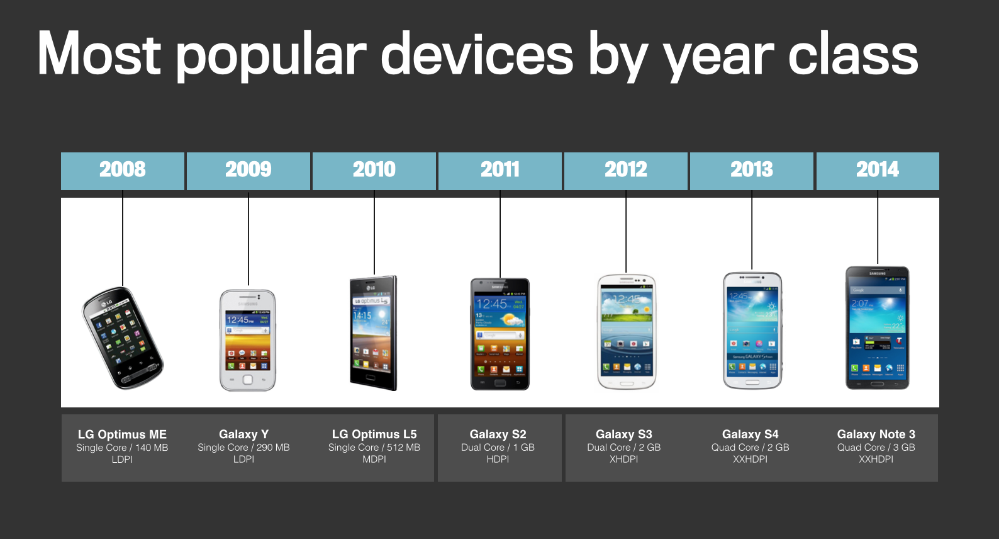
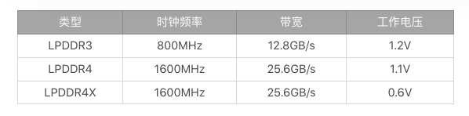
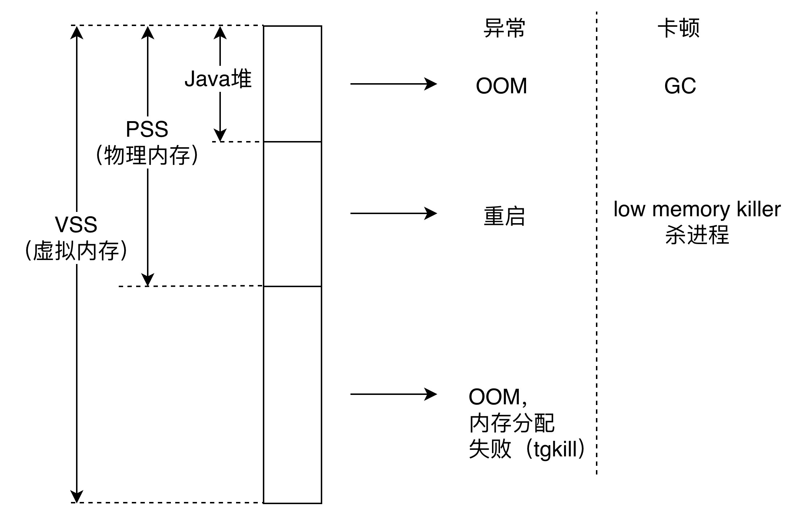
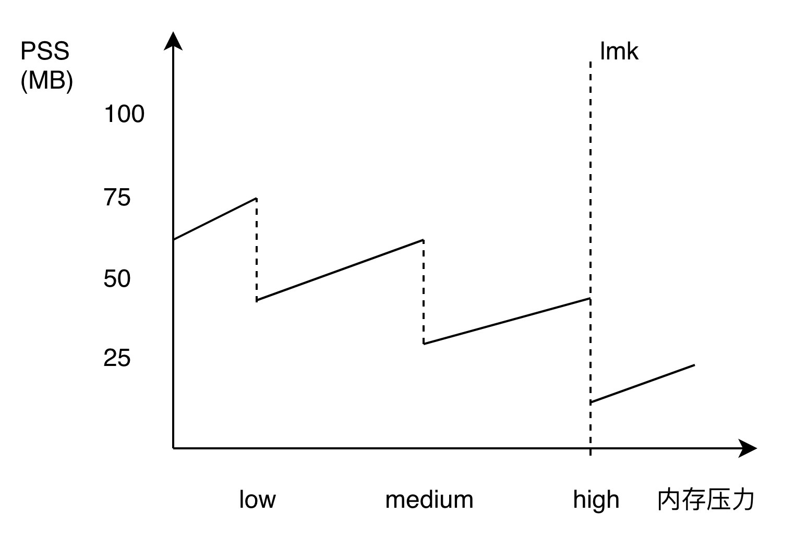
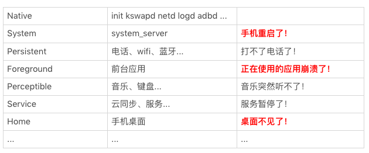

<!DOCTYPE html>
<html xmlns="http://www.w3.org/1999/xhtml">

<head>

    <head>
        <meta http-equiv="Content-Type" content="text/html; charset=UTF-8">
        <meta name="viewport" content="width=device-width, initial-scale=1, maximum-scale=1.0, user-scalable=no">
        <meta http-equiv='content-language' content='zh-cn'>
        <meta name='description' content=03&#32;内存优化（上）：4GB内存时代，再谈内存优化>
        <link rel="icon" href="/static/favicon.png">
        <title>03 内存优化（上）：4GB内存时代，再谈内存优化 </title>
        
        <link rel="stylesheet" href="/static/index.css">
        <link rel="stylesheet" href="/static/highlight.min.css">
        
        
        <meta name="generator" content="Hexo 4.2.0">
        
    </head>

<body>
    

        

            

                <a href="/">
                    
                    技术文章摘抄
                </a>
            

            

                <ul class="uncollapsible">
                    <li><a href="/" class="current-tab">首页</a></li>
                    <li><a href="../">上一级</a></li>
                </ul>
                <ul class="uncollapsible">
                    
                    <li>
                        <a class="menu-item" id="00 导读 如何打造高质量的应用？.md" href="/%e4%b8%93%e6%a0%8f/Android%e5%bc%80%e5%8f%91%e9%ab%98%e6%89%8b%e8%af%be/00%20%e5%af%bc%e8%af%bb%20%e5%a6%82%e4%bd%95%e6%89%93%e9%80%a0%e9%ab%98%e8%b4%a8%e9%87%8f%e7%9a%84%e5%ba%94%e7%94%a8%ef%bc%9f.md">00 导读 如何打造高质量的应用？.md</a>
                    </li>
                    
                    <li>
                        <a class="menu-item" id="00 开篇词 焦虑的移动开发者该如何破局？.md" href="/%e4%b8%93%e6%a0%8f/Android%e5%bc%80%e5%8f%91%e9%ab%98%e6%89%8b%e8%af%be/00%20%e5%bc%80%e7%af%87%e8%af%8d%20%e7%84%a6%e8%99%91%e7%9a%84%e7%a7%bb%e5%8a%a8%e5%bc%80%e5%8f%91%e8%80%85%e8%af%a5%e5%a6%82%e4%bd%95%e7%a0%b4%e5%b1%80%ef%bc%9f.md">00 开篇词 焦虑的移动开发者该如何破局？.md</a>
                    </li>
                    
                    <li>
                        <a class="menu-item" id="01 崩溃优化（上）：关于“崩溃”那些事儿.md" href="/%e4%b8%93%e6%a0%8f/Android%e5%bc%80%e5%8f%91%e9%ab%98%e6%89%8b%e8%af%be/01%20%e5%b4%a9%e6%ba%83%e4%bc%98%e5%8c%96%ef%bc%88%e4%b8%8a%ef%bc%89%ef%bc%9a%e5%85%b3%e4%ba%8e%e2%80%9c%e5%b4%a9%e6%ba%83%e2%80%9d%e9%82%a3%e4%ba%9b%e4%ba%8b%e5%84%bf.md">01 崩溃优化（上）：关于“崩溃”那些事儿.md</a>
                    </li>
                    
                    <li>
                        <a class="menu-item" id="02 崩溃优化（下）：应用崩溃了，你应该如何去分析？.md" href="/%e4%b8%93%e6%a0%8f/Android%e5%bc%80%e5%8f%91%e9%ab%98%e6%89%8b%e8%af%be/02%20%e5%b4%a9%e6%ba%83%e4%bc%98%e5%8c%96%ef%bc%88%e4%b8%8b%ef%bc%89%ef%bc%9a%e5%ba%94%e7%94%a8%e5%b4%a9%e6%ba%83%e4%ba%86%ef%bc%8c%e4%bd%a0%e5%ba%94%e8%af%a5%e5%a6%82%e4%bd%95%e5%8e%bb%e5%88%86%e6%9e%90%ef%bc%9f.md">02 崩溃优化（下）：应用崩溃了，你应该如何去分析？.md</a>
                    </li>
                    
                    <li>
                        <a class="menu-item" id="03 内存优化（上）：4GB内存时代，再谈内存优化.md" href="/%e4%b8%93%e6%a0%8f/Android%e5%bc%80%e5%8f%91%e9%ab%98%e6%89%8b%e8%af%be/03%20%e5%86%85%e5%ad%98%e4%bc%98%e5%8c%96%ef%bc%88%e4%b8%8a%ef%bc%89%ef%bc%9a4GB%e5%86%85%e5%ad%98%e6%97%b6%e4%bb%a3%ef%bc%8c%e5%86%8d%e8%b0%88%e5%86%85%e5%ad%98%e4%bc%98%e5%8c%96.md">03 内存优化（上）：4GB内存时代，再谈内存优化.md</a>
                    </li>
                    
                    <li>
                        <a class="menu-item" id="04 内存优化（下）：内存优化这件事，应该从哪里着手？.md" href="/%e4%b8%93%e6%a0%8f/Android%e5%bc%80%e5%8f%91%e9%ab%98%e6%89%8b%e8%af%be/04%20%e5%86%85%e5%ad%98%e4%bc%98%e5%8c%96%ef%bc%88%e4%b8%8b%ef%bc%89%ef%bc%9a%e5%86%85%e5%ad%98%e4%bc%98%e5%8c%96%e8%bf%99%e4%bb%b6%e4%ba%8b%ef%bc%8c%e5%ba%94%e8%af%a5%e4%bb%8e%e5%93%aa%e9%87%8c%e7%9d%80%e6%89%8b%ef%bc%9f.md">04 内存优化（下）：内存优化这件事，应该从哪里着手？.md</a>
                    </li>
                    
                    <li>
                        <a class="menu-item" id="05 卡顿优化（上）：你要掌握的卡顿分析方法.md" href="/%e4%b8%93%e6%a0%8f/Android%e5%bc%80%e5%8f%91%e9%ab%98%e6%89%8b%e8%af%be/05%20%e5%8d%a1%e9%a1%bf%e4%bc%98%e5%8c%96%ef%bc%88%e4%b8%8a%ef%bc%89%ef%bc%9a%e4%bd%a0%e8%a6%81%e6%8e%8c%e6%8f%a1%e7%9a%84%e5%8d%a1%e9%a1%bf%e5%88%86%e6%9e%90%e6%96%b9%e6%b3%95.md">05 卡顿优化（上）：你要掌握的卡顿分析方法.md</a>
                    </li>
                    
                    <li>
                        <a class="menu-item" id="06 卡顿优化（下）：如何监控应用卡顿？.md" href="/%e4%b8%93%e6%a0%8f/Android%e5%bc%80%e5%8f%91%e9%ab%98%e6%89%8b%e8%af%be/06%20%e5%8d%a1%e9%a1%bf%e4%bc%98%e5%8c%96%ef%bc%88%e4%b8%8b%ef%bc%89%ef%bc%9a%e5%a6%82%e4%bd%95%e7%9b%91%e6%8e%a7%e5%ba%94%e7%94%a8%e5%8d%a1%e9%a1%bf%ef%bc%9f.md">06 卡顿优化（下）：如何监控应用卡顿？.md</a>
                    </li>
                    
                    <li>
                        <a class="menu-item" id="06补充篇 卡顿优化：卡顿现场与卡顿分析.md" href="/%e4%b8%93%e6%a0%8f/Android%e5%bc%80%e5%8f%91%e9%ab%98%e6%89%8b%e8%af%be/06%e8%a1%a5%e5%85%85%e7%af%87%20%e5%8d%a1%e9%a1%bf%e4%bc%98%e5%8c%96%ef%bc%9a%e5%8d%a1%e9%a1%bf%e7%8e%b0%e5%9c%ba%e4%b8%8e%e5%8d%a1%e9%a1%bf%e5%88%86%e6%9e%90.md">06补充篇 卡顿优化：卡顿现场与卡顿分析.md</a>
                    </li>
                    
                    <li>
                        <a class="menu-item" id="07 启动优化（上）：从启动过程看启动速度优化.md" href="/%e4%b8%93%e6%a0%8f/Android%e5%bc%80%e5%8f%91%e9%ab%98%e6%89%8b%e8%af%be/07%20%e5%90%af%e5%8a%a8%e4%bc%98%e5%8c%96%ef%bc%88%e4%b8%8a%ef%bc%89%ef%bc%9a%e4%bb%8e%e5%90%af%e5%8a%a8%e8%bf%87%e7%a8%8b%e7%9c%8b%e5%90%af%e5%8a%a8%e9%80%9f%e5%ba%a6%e4%bc%98%e5%8c%96.md">07 启动优化（上）：从启动过程看启动速度优化.md</a>
                    </li>
                    
                    <li>
                        <a class="menu-item" id="08 启动优化（下）：优化启动速度的进阶方法.md" href="/%e4%b8%93%e6%a0%8f/Android%e5%bc%80%e5%8f%91%e9%ab%98%e6%89%8b%e8%af%be/08%20%e5%90%af%e5%8a%a8%e4%bc%98%e5%8c%96%ef%bc%88%e4%b8%8b%ef%bc%89%ef%bc%9a%e4%bc%98%e5%8c%96%e5%90%af%e5%8a%a8%e9%80%9f%e5%ba%a6%e7%9a%84%e8%bf%9b%e9%98%b6%e6%96%b9%e6%b3%95.md">08 启动优化（下）：优化启动速度的进阶方法.md</a>
                    </li>
                    
                    <li>
                        <a class="menu-item" id="09 I_O优化（上）：开发工程师必备的I_O优化知识.md" href="/%e4%b8%93%e6%a0%8f/Android%e5%bc%80%e5%8f%91%e9%ab%98%e6%89%8b%e8%af%be/09%20I_O%e4%bc%98%e5%8c%96%ef%bc%88%e4%b8%8a%ef%bc%89%ef%bc%9a%e5%bc%80%e5%8f%91%e5%b7%a5%e7%a8%8b%e5%b8%88%e5%bf%85%e5%a4%87%e7%9a%84I_O%e4%bc%98%e5%8c%96%e7%9f%a5%e8%af%86.md">09 I_O优化（上）：开发工程师必备的I_O优化知识.md</a>
                    </li>
                    
                    <li>
                        <a class="menu-item" id="10 I_O优化（中）：不同I_O方式的使用场景是什么？.md" href="/%e4%b8%93%e6%a0%8f/Android%e5%bc%80%e5%8f%91%e9%ab%98%e6%89%8b%e8%af%be/10%20I_O%e4%bc%98%e5%8c%96%ef%bc%88%e4%b8%ad%ef%bc%89%ef%bc%9a%e4%b8%8d%e5%90%8cI_O%e6%96%b9%e5%bc%8f%e7%9a%84%e4%bd%bf%e7%94%a8%e5%9c%ba%e6%99%af%e6%98%af%e4%bb%80%e4%b9%88%ef%bc%9f.md">10 I_O优化（中）：不同I_O方式的使用场景是什么？.md</a>
                    </li>
                    
                    <li>
                        <a class="menu-item" id="11 I_O优化（下）：如何监控线上I_O操作？.md" href="/%e4%b8%93%e6%a0%8f/Android%e5%bc%80%e5%8f%91%e9%ab%98%e6%89%8b%e8%af%be/11%20I_O%e4%bc%98%e5%8c%96%ef%bc%88%e4%b8%8b%ef%bc%89%ef%bc%9a%e5%a6%82%e4%bd%95%e7%9b%91%e6%8e%a7%e7%ba%bf%e4%b8%8aI_O%e6%93%8d%e4%bd%9c%ef%bc%9f.md">11 I_O优化（下）：如何监控线上I_O操作？.md</a>
                    </li>
                    
                    <li>
                        <a class="menu-item" id="12 存储优化（上）：常见的数据存储方法有哪些？.md" href="/%e4%b8%93%e6%a0%8f/Android%e5%bc%80%e5%8f%91%e9%ab%98%e6%89%8b%e8%af%be/12%20%e5%ad%98%e5%82%a8%e4%bc%98%e5%8c%96%ef%bc%88%e4%b8%8a%ef%bc%89%ef%bc%9a%e5%b8%b8%e8%a7%81%e7%9a%84%e6%95%b0%e6%8d%ae%e5%ad%98%e5%82%a8%e6%96%b9%e6%b3%95%e6%9c%89%e5%93%aa%e4%ba%9b%ef%bc%9f.md">12 存储优化（上）：常见的数据存储方法有哪些？.md</a>
                    </li>
                    
                    <li>
                        <a class="menu-item" id="13 存储优化（中）：如何优化数据存储？.md" href="/%e4%b8%93%e6%a0%8f/Android%e5%bc%80%e5%8f%91%e9%ab%98%e6%89%8b%e8%af%be/13%20%e5%ad%98%e5%82%a8%e4%bc%98%e5%8c%96%ef%bc%88%e4%b8%ad%ef%bc%89%ef%bc%9a%e5%a6%82%e4%bd%95%e4%bc%98%e5%8c%96%e6%95%b0%e6%8d%ae%e5%ad%98%e5%82%a8%ef%bc%9f.md">13 存储优化（中）：如何优化数据存储？.md</a>
                    </li>
                    
                    <li>
                        <a class="menu-item" id="14 存储优化（下）：数据库SQLite的使用和优化.md" href="/%e4%b8%93%e6%a0%8f/Android%e5%bc%80%e5%8f%91%e9%ab%98%e6%89%8b%e8%af%be/14%20%e5%ad%98%e5%82%a8%e4%bc%98%e5%8c%96%ef%bc%88%e4%b8%8b%ef%bc%89%ef%bc%9a%e6%95%b0%e6%8d%ae%e5%ba%93SQLite%e7%9a%84%e4%bd%bf%e7%94%a8%e5%92%8c%e4%bc%98%e5%8c%96.md">14 存储优化（下）：数据库SQLite的使用和优化.md</a>
                    </li>
                    
                    <li>
                        <a class="menu-item" id="15 网络优化（上）：移动开发工程师必备的网络优化知识.md" href="/%e4%b8%93%e6%a0%8f/Android%e5%bc%80%e5%8f%91%e9%ab%98%e6%89%8b%e8%af%be/15%20%e7%bd%91%e7%bb%9c%e4%bc%98%e5%8c%96%ef%bc%88%e4%b8%8a%ef%bc%89%ef%bc%9a%e7%a7%bb%e5%8a%a8%e5%bc%80%e5%8f%91%e5%b7%a5%e7%a8%8b%e5%b8%88%e5%bf%85%e5%a4%87%e7%9a%84%e7%bd%91%e7%bb%9c%e4%bc%98%e5%8c%96%e7%9f%a5%e8%af%86.md">15 网络优化（上）：移动开发工程师必备的网络优化知识.md</a>
                    </li>
                    
                    <li>
                        <a class="menu-item" id="16 网络优化（中）：复杂多变的移动网络该如何优化？.md" href="/%e4%b8%93%e6%a0%8f/Android%e5%bc%80%e5%8f%91%e9%ab%98%e6%89%8b%e8%af%be/16%20%e7%bd%91%e7%bb%9c%e4%bc%98%e5%8c%96%ef%bc%88%e4%b8%ad%ef%bc%89%ef%bc%9a%e5%a4%8d%e6%9d%82%e5%a4%9a%e5%8f%98%e7%9a%84%e7%a7%bb%e5%8a%a8%e7%bd%91%e7%bb%9c%e8%af%a5%e5%a6%82%e4%bd%95%e4%bc%98%e5%8c%96%ef%bc%9f.md">16 网络优化（中）：复杂多变的移动网络该如何优化？.md</a>
                    </li>
                    
                    <li>
                        <a class="menu-item" id="17 网络优化（下）：大数据下网络该如何监控？.md" href="/%e4%b8%93%e6%a0%8f/Android%e5%bc%80%e5%8f%91%e9%ab%98%e6%89%8b%e8%af%be/17%20%e7%bd%91%e7%bb%9c%e4%bc%98%e5%8c%96%ef%bc%88%e4%b8%8b%ef%bc%89%ef%bc%9a%e5%a4%a7%e6%95%b0%e6%8d%ae%e4%b8%8b%e7%bd%91%e7%bb%9c%e8%af%a5%e5%a6%82%e4%bd%95%e7%9b%91%e6%8e%a7%ef%bc%9f.md">17 网络优化（下）：大数据下网络该如何监控？.md</a>
                    </li>
                    
                    <li>
                        <a class="menu-item" id="18 耗电优化（上）：从电量优化的演进看耗电分析.md" href="/%e4%b8%93%e6%a0%8f/Android%e5%bc%80%e5%8f%91%e9%ab%98%e6%89%8b%e8%af%be/18%20%e8%80%97%e7%94%b5%e4%bc%98%e5%8c%96%ef%bc%88%e4%b8%8a%ef%bc%89%ef%bc%9a%e4%bb%8e%e7%94%b5%e9%87%8f%e4%bc%98%e5%8c%96%e7%9a%84%e6%bc%94%e8%bf%9b%e7%9c%8b%e8%80%97%e7%94%b5%e5%88%86%e6%9e%90.md">18 耗电优化（上）：从电量优化的演进看耗电分析.md</a>
                    </li>
                    
                    <li>
                        <a class="menu-item" id="19 耗电优化（下）：耗电的优化方法与线上监控.md" href="/%e4%b8%93%e6%a0%8f/Android%e5%bc%80%e5%8f%91%e9%ab%98%e6%89%8b%e8%af%be/19%20%e8%80%97%e7%94%b5%e4%bc%98%e5%8c%96%ef%bc%88%e4%b8%8b%ef%bc%89%ef%bc%9a%e8%80%97%e7%94%b5%e7%9a%84%e4%bc%98%e5%8c%96%e6%96%b9%e6%b3%95%e4%b8%8e%e7%ba%bf%e4%b8%8a%e7%9b%91%e6%8e%a7.md">19 耗电优化（下）：耗电的优化方法与线上监控.md</a>
                    </li>
                    
                    <li>
                        <a class="menu-item" id="20 UI 优化（上）：UI 渲染的几个关键概念.md" href="/%e4%b8%93%e6%a0%8f/Android%e5%bc%80%e5%8f%91%e9%ab%98%e6%89%8b%e8%af%be/20%20UI%20%e4%bc%98%e5%8c%96%ef%bc%88%e4%b8%8a%ef%bc%89%ef%bc%9aUI%20%e6%b8%b2%e6%9f%93%e7%9a%84%e5%87%a0%e4%b8%aa%e5%85%b3%e9%94%ae%e6%a6%82%e5%bf%b5.md">20 UI 优化（上）：UI 渲染的几个关键概念.md</a>
                    </li>
                    
                    <li>
                        <a class="menu-item" id="21 UI 优化（下）：如何优化 UI 渲染？.md" href="/%e4%b8%93%e6%a0%8f/Android%e5%bc%80%e5%8f%91%e9%ab%98%e6%89%8b%e8%af%be/21%20UI%20%e4%bc%98%e5%8c%96%ef%bc%88%e4%b8%8b%ef%bc%89%ef%bc%9a%e5%a6%82%e4%bd%95%e4%bc%98%e5%8c%96%20UI%20%e6%b8%b2%e6%9f%93%ef%bc%9f.md">21 UI 优化（下）：如何优化 UI 渲染？.md</a>
                    </li>
                    
                    <li>
                        <a class="menu-item" id="22 包体积优化（上）：如何减少安装包大小？.md" href="/%e4%b8%93%e6%a0%8f/Android%e5%bc%80%e5%8f%91%e9%ab%98%e6%89%8b%e8%af%be/22%20%e5%8c%85%e4%bd%93%e7%a7%af%e4%bc%98%e5%8c%96%ef%bc%88%e4%b8%8a%ef%bc%89%ef%bc%9a%e5%a6%82%e4%bd%95%e5%87%8f%e5%b0%91%e5%ae%89%e8%a3%85%e5%8c%85%e5%a4%a7%e5%b0%8f%ef%bc%9f.md">22 包体积优化（上）：如何减少安装包大小？.md</a>
                    </li>
                    
                    <li>
                        <a class="menu-item" id="23 包体积优化（下）：资源优化的进阶实践.md" href="/%e4%b8%93%e6%a0%8f/Android%e5%bc%80%e5%8f%91%e9%ab%98%e6%89%8b%e8%af%be/23%20%e5%8c%85%e4%bd%93%e7%a7%af%e4%bc%98%e5%8c%96%ef%bc%88%e4%b8%8b%ef%bc%89%ef%bc%9a%e8%b5%84%e6%ba%90%e4%bc%98%e5%8c%96%e7%9a%84%e8%bf%9b%e9%98%b6%e5%ae%9e%e8%b7%b5.md">23 包体积优化（下）：资源优化的进阶实践.md</a>
                    </li>
                    
                    <li>
                        <a class="menu-item" id="24 想成为Android高手，你需要先搞定这三个问题.md" href="/%e4%b8%93%e6%a0%8f/Android%e5%bc%80%e5%8f%91%e9%ab%98%e6%89%8b%e8%af%be/24%20%e6%83%b3%e6%88%90%e4%b8%baAndroid%e9%ab%98%e6%89%8b%ef%bc%8c%e4%bd%a0%e9%9c%80%e8%a6%81%e5%85%88%e6%90%9e%e5%ae%9a%e8%bf%99%e4%b8%89%e4%b8%aa%e9%97%ae%e9%a2%98.md">24 想成为Android高手，你需要先搞定这三个问题.md</a>
                    </li>
                    
                    <li>
                        <a class="menu-item" id="25 如何提升组织与个人的研发效能？.md" href="/%e4%b8%93%e6%a0%8f/Android%e5%bc%80%e5%8f%91%e9%ab%98%e6%89%8b%e8%af%be/25%20%e5%a6%82%e4%bd%95%e6%8f%90%e5%8d%87%e7%bb%84%e7%bb%87%e4%b8%8e%e4%b8%aa%e4%ba%ba%e7%9a%84%e7%a0%94%e5%8f%91%e6%95%88%e8%83%bd%ef%bc%9f.md">25 如何提升组织与个人的研发效能？.md</a>
                    </li>
                    
                    <li>
                        <a class="menu-item" id="26 关于编译，你需要了解什么？.md" href="/%e4%b8%93%e6%a0%8f/Android%e5%bc%80%e5%8f%91%e9%ab%98%e6%89%8b%e8%af%be/26%20%e5%85%b3%e4%ba%8e%e7%bc%96%e8%af%91%ef%bc%8c%e4%bd%a0%e9%9c%80%e8%a6%81%e4%ba%86%e8%a7%a3%e4%bb%80%e4%b9%88%ef%bc%9f.md">26 关于编译，你需要了解什么？.md</a>
                    </li>
                    
                    <li>
                        <a class="menu-item" id="27 编译插桩的三种方法：AspectJ、ASM、ReDex.md" href="/%e4%b8%93%e6%a0%8f/Android%e5%bc%80%e5%8f%91%e9%ab%98%e6%89%8b%e8%af%be/27%20%e7%bc%96%e8%af%91%e6%8f%92%e6%a1%a9%e7%9a%84%e4%b8%89%e7%a7%8d%e6%96%b9%e6%b3%95%ef%bc%9aAspectJ%e3%80%81ASM%e3%80%81ReDex.md">27 编译插桩的三种方法：AspectJ、ASM、ReDex.md</a>
                    </li>
                    
                    <li>
                        <a class="menu-item" id="28 大数据与AI，如何高效地测试？.md" href="/%e4%b8%93%e6%a0%8f/Android%e5%bc%80%e5%8f%91%e9%ab%98%e6%89%8b%e8%af%be/28%20%e5%a4%a7%e6%95%b0%e6%8d%ae%e4%b8%8eAI%ef%bc%8c%e5%a6%82%e4%bd%95%e9%ab%98%e6%95%88%e5%9c%b0%e6%b5%8b%e8%af%95%ef%bc%9f.md">28 大数据与AI，如何高效地测试？.md</a>
                    </li>
                    
                    <li>
                        <a class="menu-item" id="29 从每月到每天，如何给版本发布提速？.md" href="/%e4%b8%93%e6%a0%8f/Android%e5%bc%80%e5%8f%91%e9%ab%98%e6%89%8b%e8%af%be/29%20%e4%bb%8e%e6%af%8f%e6%9c%88%e5%88%b0%e6%af%8f%e5%a4%a9%ef%bc%8c%e5%a6%82%e4%bd%95%e7%bb%99%e7%89%88%e6%9c%ac%e5%8f%91%e5%b8%83%e6%8f%90%e9%80%9f%ef%bc%9f.md">29 从每月到每天，如何给版本发布提速？.md</a>
                    </li>
                    
                    <li>
                        <a class="menu-item" id="30 数据评估（上）：如何实现高可用的上报组件？.md" href="/%e4%b8%93%e6%a0%8f/Android%e5%bc%80%e5%8f%91%e9%ab%98%e6%89%8b%e8%af%be/30%20%e6%95%b0%e6%8d%ae%e8%af%84%e4%bc%b0%ef%bc%88%e4%b8%8a%ef%bc%89%ef%bc%9a%e5%a6%82%e4%bd%95%e5%ae%9e%e7%8e%b0%e9%ab%98%e5%8f%af%e7%94%a8%e7%9a%84%e4%b8%8a%e6%8a%a5%e7%bb%84%e4%bb%b6%ef%bc%9f.md">30 数据评估（上）：如何实现高可用的上报组件？.md</a>
                    </li>
                    
                    <li>
                        <a class="menu-item" id="31 数据评估（下）：什么是大数据平台？.md" href="/%e4%b8%93%e6%a0%8f/Android%e5%bc%80%e5%8f%91%e9%ab%98%e6%89%8b%e8%af%be/31%20%e6%95%b0%e6%8d%ae%e8%af%84%e4%bc%b0%ef%bc%88%e4%b8%8b%ef%bc%89%ef%bc%9a%e4%bb%80%e4%b9%88%e6%98%af%e5%a4%a7%e6%95%b0%e6%8d%ae%e5%b9%b3%e5%8f%b0%ef%bc%9f.md">31 数据评估（下）：什么是大数据平台？.md</a>
                    </li>
                    
                    <li>
                        <a class="menu-item" id="32 线上疑难问题该如何排查和跟踪？.md" href="/%e4%b8%93%e6%a0%8f/Android%e5%bc%80%e5%8f%91%e9%ab%98%e6%89%8b%e8%af%be/32%20%e7%ba%bf%e4%b8%8a%e7%96%91%e9%9a%be%e9%97%ae%e9%a2%98%e8%af%a5%e5%a6%82%e4%bd%95%e6%8e%92%e6%9f%a5%e5%92%8c%e8%b7%9f%e8%b8%aa%ef%bc%9f.md">32 线上疑难问题该如何排查和跟踪？.md</a>
                    </li>
                    
                    <li>
                        <a class="menu-item" id="33 做一名有高度的移动开发工程师.md" href="/%e4%b8%93%e6%a0%8f/Android%e5%bc%80%e5%8f%91%e9%ab%98%e6%89%8b%e8%af%be/33%20%e5%81%9a%e4%b8%80%e5%90%8d%e6%9c%89%e9%ab%98%e5%ba%a6%e7%9a%84%e7%a7%bb%e5%8a%a8%e5%bc%80%e5%8f%91%e5%b7%a5%e7%a8%8b%e5%b8%88.md">33 做一名有高度的移动开发工程师.md</a>
                    </li>
                    
                    <li>
                        <a class="menu-item" id="34 聊聊重构：优秀的架构都是演进而来的.md" href="/%e4%b8%93%e6%a0%8f/Android%e5%bc%80%e5%8f%91%e9%ab%98%e6%89%8b%e8%af%be/34%20%e8%81%8a%e8%81%8a%e9%87%8d%e6%9e%84%ef%bc%9a%e4%bc%98%e7%a7%80%e7%9a%84%e6%9e%b6%e6%9e%84%e9%83%bd%e6%98%af%e6%bc%94%e8%bf%9b%e8%80%8c%e6%9d%a5%e7%9a%84.md">34 聊聊重构：优秀的架构都是演进而来的.md</a>
                    </li>
                    
                    <li>
                        <a class="menu-item" id="35 Native Hook 技术，天使还是魔鬼？.md" href="/%e4%b8%93%e6%a0%8f/Android%e5%bc%80%e5%8f%91%e9%ab%98%e6%89%8b%e8%af%be/35%20Native%20Hook%20%e6%8a%80%e6%9c%af%ef%bc%8c%e5%a4%a9%e4%bd%bf%e8%bf%98%e6%98%af%e9%ad%94%e9%ac%bc%ef%bc%9f.md">35 Native Hook 技术，天使还是魔鬼？.md</a>
                    </li>
                    
                    <li>
                        <a class="menu-item" id="36 跨平台开发的现状与应用.md" href="/%e4%b8%93%e6%a0%8f/Android%e5%bc%80%e5%8f%91%e9%ab%98%e6%89%8b%e8%af%be/36%20%e8%b7%a8%e5%b9%b3%e5%8f%b0%e5%bc%80%e5%8f%91%e7%9a%84%e7%8e%b0%e7%8a%b6%e4%b8%8e%e5%ba%94%e7%94%a8.md">36 跨平台开发的现状与应用.md</a>
                    </li>
                    
                    <li>
                        <a class="menu-item" id="37 移动开发新大陆：工作三年半，移动开发转型手游开发.md" href="/%e4%b8%93%e6%a0%8f/Android%e5%bc%80%e5%8f%91%e9%ab%98%e6%89%8b%e8%af%be/37%20%e7%a7%bb%e5%8a%a8%e5%bc%80%e5%8f%91%e6%96%b0%e5%a4%a7%e9%99%86%ef%bc%9a%e5%b7%a5%e4%bd%9c%e4%b8%89%e5%b9%b4%e5%8d%8a%ef%bc%8c%e7%a7%bb%e5%8a%a8%e5%bc%80%e5%8f%91%e8%bd%ac%e5%9e%8b%e6%89%8b%e6%b8%b8%e5%bc%80%e5%8f%91.md">37 移动开发新大陆：工作三年半，移动开发转型手游开发.md</a>
                    </li>
                    
                    <li>
                        <a class="menu-item" id="38 移动开发新大陆：Android音视频开发.md" href="/%e4%b8%93%e6%a0%8f/Android%e5%bc%80%e5%8f%91%e9%ab%98%e6%89%8b%e8%af%be/38%20%e7%a7%bb%e5%8a%a8%e5%bc%80%e5%8f%91%e6%96%b0%e5%a4%a7%e9%99%86%ef%bc%9aAndroid%e9%9f%b3%e8%a7%86%e9%a2%91%e5%bc%80%e5%8f%91.md">38 移动开发新大陆：Android音视频开发.md</a>
                    </li>
                    
                    <li>
                        <a class="menu-item" id="39 移动开发新大陆： 边缘智能计算的趋势.md" href="/%e4%b8%93%e6%a0%8f/Android%e5%bc%80%e5%8f%91%e9%ab%98%e6%89%8b%e8%af%be/39%20%e7%a7%bb%e5%8a%a8%e5%bc%80%e5%8f%91%e6%96%b0%e5%a4%a7%e9%99%86%ef%bc%9a%20%e8%be%b9%e7%bc%98%e6%99%ba%e8%83%bd%e8%ae%a1%e7%ae%97%e7%9a%84%e8%b6%8b%e5%8a%bf.md">39 移动开发新大陆： 边缘智能计算的趋势.md</a>
                    </li>
                    
                    <li>
                        <a class="menu-item" id="40 动态化实践，如何选择适合自己的方案？.md" href="/%e4%b8%93%e6%a0%8f/Android%e5%bc%80%e5%8f%91%e9%ab%98%e6%89%8b%e8%af%be/40%20%e5%8a%a8%e6%80%81%e5%8c%96%e5%ae%9e%e8%b7%b5%ef%bc%8c%e5%a6%82%e4%bd%95%e9%80%89%e6%8b%a9%e9%80%82%e5%90%88%e8%87%aa%e5%b7%b1%e7%9a%84%e6%96%b9%e6%a1%88%ef%bc%9f.md">40 动态化实践，如何选择适合自己的方案？.md</a>
                    </li>
                    
                    <li>
                        <a class="menu-item" id="41 聊聊Flutter，面对层出不穷的新技术该如何跟进？.md" href="/%e4%b8%93%e6%a0%8f/Android%e5%bc%80%e5%8f%91%e9%ab%98%e6%89%8b%e8%af%be/41%20%e8%81%8a%e8%81%8aFlutter%ef%bc%8c%e9%9d%a2%e5%af%b9%e5%b1%82%e5%87%ba%e4%b8%8d%e7%a9%b7%e7%9a%84%e6%96%b0%e6%8a%80%e6%9c%af%e8%af%a5%e5%a6%82%e4%bd%95%e8%b7%9f%e8%bf%9b%ef%bc%9f.md">41 聊聊Flutter，面对层出不穷的新技术该如何跟进？.md</a>
                    </li>
                    
                    <li>
                        <a class="menu-item" id="42 Android开发高手课学习心得.md" href="/%e4%b8%93%e6%a0%8f/Android%e5%bc%80%e5%8f%91%e9%ab%98%e6%89%8b%e8%af%be/42%20Android%e5%bc%80%e5%8f%91%e9%ab%98%e6%89%8b%e8%af%be%e5%ad%a6%e4%b9%a0%e5%bf%83%e5%be%97.md">42 Android开发高手课学习心得.md</a>
                    </li>
                    
                    <li>
                        <a class="menu-item" id="Android JVM TI机制详解（内含福利彩蛋）.md" href="/%e4%b8%93%e6%a0%8f/Android%e5%bc%80%e5%8f%91%e9%ab%98%e6%89%8b%e8%af%be/Android%20JVM%20TI%e6%9c%ba%e5%88%b6%e8%af%a6%e8%a7%a3%ef%bc%88%e5%86%85%e5%90%ab%e7%a6%8f%e5%88%a9%e5%bd%a9%e8%9b%8b%ef%bc%89.md">Android JVM TI机制详解（内含福利彩蛋）.md</a>
                    </li>
                    
                    <li>
                        <a class="menu-item" id="Android工程师的“面试指南”.md" href="/%e4%b8%93%e6%a0%8f/Android%e5%bc%80%e5%8f%91%e9%ab%98%e6%89%8b%e8%af%be/Android%e5%b7%a5%e7%a8%8b%e5%b8%88%e7%9a%84%e2%80%9c%e9%9d%a2%e8%af%95%e6%8c%87%e5%8d%97%e2%80%9d.md">Android工程师的“面试指南”.md</a>
                    </li>
                    
                    <li>
                        <a class="menu-item" id="Native下如何获取调用栈？.md" href="/%e4%b8%93%e6%a0%8f/Android%e5%bc%80%e5%8f%91%e9%ab%98%e6%89%8b%e8%af%be/Native%e4%b8%8b%e5%a6%82%e4%bd%95%e8%8e%b7%e5%8f%96%e8%b0%83%e7%94%a8%e6%a0%88%ef%bc%9f.md">Native下如何获取调用栈？.md</a>
                    </li>
                    
                    <li>
                        <a class="menu-item" id="专栏学得苦？可能你还需要一份配套学习书单.md" href="/%e4%b8%93%e6%a0%8f/Android%e5%bc%80%e5%8f%91%e9%ab%98%e6%89%8b%e8%af%be/%e4%b8%93%e6%a0%8f%e5%ad%a6%e5%be%97%e8%8b%a6%ef%bc%9f%e5%8f%af%e8%83%bd%e4%bd%a0%e8%bf%98%e9%9c%80%e8%a6%81%e4%b8%80%e4%bb%bd%e9%85%8d%e5%a5%97%e5%ad%a6%e4%b9%a0%e4%b9%a6%e5%8d%95.md">专栏学得苦？可能你还需要一份配套学习书单.md</a>
                    </li>
                    
                    <li>
                        <a class="menu-item" id="专栏学得苦？可能是方法没找对.md" href="/%e4%b8%93%e6%a0%8f/Android%e5%bc%80%e5%8f%91%e9%ab%98%e6%89%8b%e8%af%be/%e4%b8%93%e6%a0%8f%e5%ad%a6%e5%be%97%e8%8b%a6%ef%bc%9f%e5%8f%af%e8%83%bd%e6%98%af%e6%96%b9%e6%b3%95%e6%b2%a1%e6%89%be%e5%af%b9.md">专栏学得苦？可能是方法没找对.md</a>
                    </li>
                    
                    <li>
                        <a class="menu-item" id="程序员修炼之路 设计能力的提升途径.md" href="/%e4%b8%93%e6%a0%8f/Android%e5%bc%80%e5%8f%91%e9%ab%98%e6%89%8b%e8%af%be/%e7%a8%8b%e5%ba%8f%e5%91%98%e4%bf%ae%e7%82%bc%e4%b9%8b%e8%b7%af%20%e8%ae%be%e8%ae%a1%e8%83%bd%e5%8a%9b%e7%9a%84%e6%8f%90%e5%8d%87%e9%80%94%e5%be%84.md">程序员修炼之路 设计能力的提升途径.md</a>
                    </li>
                    
                    <li>
                        <a class="menu-item" id="练习Sample跑起来 ASM插桩强化练习.md" href="/%e4%b8%93%e6%a0%8f/Android%e5%bc%80%e5%8f%91%e9%ab%98%e6%89%8b%e8%af%be/%e7%bb%83%e4%b9%a0Sample%e8%b7%91%e8%b5%b7%e6%9d%a5%20ASM%e6%8f%92%e6%a1%a9%e5%bc%ba%e5%8c%96%e7%bb%83%e4%b9%a0.md">练习Sample跑起来 ASM插桩强化练习.md</a>
                    </li>
                    
                    <li>
                        <a class="menu-item" id="练习Sample跑起来 唯鹿同学的练习手记 第1辑.md" href="/%e4%b8%93%e6%a0%8f/Android%e5%bc%80%e5%8f%91%e9%ab%98%e6%89%8b%e8%af%be/%e7%bb%83%e4%b9%a0Sample%e8%b7%91%e8%b5%b7%e6%9d%a5%20%e5%94%af%e9%b9%bf%e5%90%8c%e5%ad%a6%e7%9a%84%e7%bb%83%e4%b9%a0%e6%89%8b%e8%ae%b0%20%e7%ac%ac1%e8%be%91.md">练习Sample跑起来 唯鹿同学的练习手记 第1辑.md</a>
                    </li>
                    
                    <li>
                        <a class="menu-item" id="练习Sample跑起来 唯鹿同学的练习手记 第2辑.md" href="/%e4%b8%93%e6%a0%8f/Android%e5%bc%80%e5%8f%91%e9%ab%98%e6%89%8b%e8%af%be/%e7%bb%83%e4%b9%a0Sample%e8%b7%91%e8%b5%b7%e6%9d%a5%20%e5%94%af%e9%b9%bf%e5%90%8c%e5%ad%a6%e7%9a%84%e7%bb%83%e4%b9%a0%e6%89%8b%e8%ae%b0%20%e7%ac%ac2%e8%be%91.md">练习Sample跑起来 唯鹿同学的练习手记 第2辑.md</a>
                    </li>
                    
                    <li>
                        <a class="menu-item" id="练习Sample跑起来 唯鹿同学的练习手记 第3辑.md" href="/%e4%b8%93%e6%a0%8f/Android%e5%bc%80%e5%8f%91%e9%ab%98%e6%89%8b%e8%af%be/%e7%bb%83%e4%b9%a0Sample%e8%b7%91%e8%b5%b7%e6%9d%a5%20%e5%94%af%e9%b9%bf%e5%90%8c%e5%ad%a6%e7%9a%84%e7%bb%83%e4%b9%a0%e6%89%8b%e8%ae%b0%20%e7%ac%ac3%e8%be%91.md">练习Sample跑起来 唯鹿同学的练习手记 第3辑.md</a>
                    </li>
                    
                    <li>
                        <a class="menu-item" id="练习Sample跑起来 热点问题答疑第1期.md" href="/%e4%b8%93%e6%a0%8f/Android%e5%bc%80%e5%8f%91%e9%ab%98%e6%89%8b%e8%af%be/%e7%bb%83%e4%b9%a0Sample%e8%b7%91%e8%b5%b7%e6%9d%a5%20%e7%83%ad%e7%82%b9%e9%97%ae%e9%a2%98%e7%ad%94%e7%96%91%e7%ac%ac1%e6%9c%9f.md">练习Sample跑起来 热点问题答疑第1期.md</a>
                    </li>
                    
                    <li>
                        <a class="menu-item" id="练习Sample跑起来 热点问题答疑第2期.md" href="/%e4%b8%93%e6%a0%8f/Android%e5%bc%80%e5%8f%91%e9%ab%98%e6%89%8b%e8%af%be/%e7%bb%83%e4%b9%a0Sample%e8%b7%91%e8%b5%b7%e6%9d%a5%20%e7%83%ad%e7%82%b9%e9%97%ae%e9%a2%98%e7%ad%94%e7%96%91%e7%ac%ac2%e6%9c%9f.md">练习Sample跑起来 热点问题答疑第2期.md</a>
                    </li>
                    
                    <li>
                        <a class="menu-item" id="练习Sample跑起来 热点问题答疑第3期.md" href="/%e4%b8%93%e6%a0%8f/Android%e5%bc%80%e5%8f%91%e9%ab%98%e6%89%8b%e8%af%be/%e7%bb%83%e4%b9%a0Sample%e8%b7%91%e8%b5%b7%e6%9d%a5%20%e7%83%ad%e7%82%b9%e9%97%ae%e9%a2%98%e7%ad%94%e7%96%91%e7%ac%ac3%e6%9c%9f.md">练习Sample跑起来 热点问题答疑第3期.md</a>
                    </li>
                    
                    <li>
                        <a class="menu-item" id="练习Sample跑起来 热点问题答疑第4期.md" href="/%e4%b8%93%e6%a0%8f/Android%e5%bc%80%e5%8f%91%e9%ab%98%e6%89%8b%e8%af%be/%e7%bb%83%e4%b9%a0Sample%e8%b7%91%e8%b5%b7%e6%9d%a5%20%e7%83%ad%e7%82%b9%e9%97%ae%e9%a2%98%e7%ad%94%e7%96%91%e7%ac%ac4%e6%9c%9f.md">练习Sample跑起来 热点问题答疑第4期.md</a>
                    </li>
                    
                    <li>
                        <a class="menu-item" id="结束语 移动开发的今天和明天.md" href="/%e4%b8%93%e6%a0%8f/Android%e5%bc%80%e5%8f%91%e9%ab%98%e6%89%8b%e8%af%be/%e7%bb%93%e6%9d%9f%e8%af%ad%20%e7%a7%bb%e5%8a%a8%e5%bc%80%e5%8f%91%e7%9a%84%e4%bb%8a%e5%a4%a9%e5%92%8c%e6%98%8e%e5%a4%a9.md">结束语 移动开发的今天和明天.md</a>
                    </li>
                    
                    <li>
                        <a class="menu-item" id="聊聊Framework的学习方法.md" href="/%e4%b8%93%e6%a0%8f/Android%e5%bc%80%e5%8f%91%e9%ab%98%e6%89%8b%e8%af%be/%e8%81%8a%e8%81%8aFramework%e7%9a%84%e5%ad%a6%e4%b9%a0%e6%96%b9%e6%b3%95.md">聊聊Framework的学习方法.md</a>
                    </li>
                    
                    <li><a href="https://lianglianglee.com/assets/%E6%8D%90%E8%B5%A0.md">捐赠</a></li>
                </ul>

            

        

        

            

        

        

            

                

                    

                        
                        <header class="navbar">
                            <section class="navbar-section">
                                <a onclick="open_sidebar()">
                                    <i class="icon icon-menu"></i>
                                </a>
                            </section>
                        </header>
                    

                    

                        

                            
                            
                            
                            

                            <h1 id="title" data-id="03 内存优化（上）：4GB内存时代，再谈内存优化" class="title">03 内存优化（上）：4GB内存时代，再谈内存优化</h1>
                            

在写今天这篇文章前，我又翻了翻三年前我在WeMobileDev公众号写过的<a href="http://mp.weixin.qq.com/s/Z7oMv0IgKWNkhLon_hFakg" target="_blank">《Android内存优化杂谈》</a>，今天再看，对里面的一句话更有感触：“我们并不能将内存优化中用到的所有技巧都一一说明，而且随着Android版本的更替，可能很多方法都会变的过时”。

三年过去了，4GB内存的手机都变成了主流。那内存优化是不是变得不重要了？如今有哪些技巧已经淘汰，而我们又要升级什么技能呢？

今天在4GB内存时代下，我就再来谈谈“内存优化”这个话题。

<h2 id="移动设备发展">移动设备发展</h2>

Facebook有一个叫<a href="https://github.com/facebook/device-year-class" target="_blank">device-year-class</a>的开源库，它会用年份来区分设备的性能。可以看到，2008年的手机只有可怜的140MB内存，而今年的华为Mate 20 Pro手机的内存已经达到了8GB。

内存看起来好像是我们都非常熟悉的概念，那请问问自己，手机内存和PC内存有哪什么差异呢？8GB内存是不是就一定会比4GB内存更好？我想可能很多人都不一定能回答正确。

手机运行内存（RAM）其实相当于我们的PC中的内存，是手机中作为App运行过程中临时性数据暂时存储的内存介质。不过考虑到体积和功耗，手机不使用PC的DDR内存，采用的是LPDDR RAM，全称是“低功耗双倍数据速率内存”，其中LP就是“Lower Power”低功耗的意思。

以LPDDR4为例，带宽 = 时钟频率 × 内存总线位数 ÷ 8，即1600 × 64 ÷ 8 = 12.8GB/s，因为是DDR内存是双倍速率，所以最后的带宽是12.8 × 2 = 25.6GB/s。

目前市面上的手机，主流的运行内存有LPDDR3、LPDDR4以及LPDDR4X。可以看出LPDDR4的性能要比LPDDR3高出一倍，而LPDDR4X相比LPDDR4工作电压更低，所以也比LPDDR4省电20%～40%。当然图中的数据是标准数据，不同的生成厂商会有一些低频或者高频的版本，性能方面高频要好于低频。

那手机内存是否越大越好呢？

如果一个手机使用的是4GB的LPDDR4X内存，另外一个使用的是6GB的LPDDR3内存，那么无疑选择4GB的运行内存手机要更加实用一些。

但是内存并不是一个孤立的概念，它跟操作系统、应用生态这些因素都有关。同样是1GB内存，使用Android 9.0系统会比Android 4.0系统流畅，使用更加封闭、规范的iOS系统也会比“狂野”的Android系统更好。今年发布的iPhone XR和iPhone XS使用的都是LPDDR4X的内存，不过它们分别只有3GB和4GB的大小。

<h2 id="内存问题">内存问题</h2>

在前面所讲的崩溃分析中，我提到过“内存优化”是崩溃优化工作中非常重要的一部分。类似OOM，很多的“异常退出”其实都是由内存问题引起。那么内存究竟能引发什么样的问题呢？

1.两个问题

内存造成的第一个问题是<strong>异常</strong>。在前面的崩溃分析我提到过“异常率”，异常包括OOM、内存分配失败这些崩溃，也包括因为整体内存不足导致应用被杀死、设备重启等问题。不知道你平时是否在工作中注意过，如果我们把用户设备的内存分成2GB以下和2GB以上两部分，你可以试试分别计算他们的异常率或者崩溃率，看看差距会有多大。

内存造成的第二个问题是<strong>卡顿</strong>。Java内存不足会导致频繁GC，这个问题在Dalvik虚拟机会更加明显。而ART虚拟机在内存管理跟回收策略上都做大量优化，内存分配和GC效率相比提升了5～10倍。如果想具体测试GC的性能，例如暂停挂起时间、总耗时、GC吞吐量，我们可以通过发送<strong>SIGQUIT信号获得ANR日志</strong>。

<pre><code>adb shell kill -S QUIT PID
adb pull /data/anr/traces.txt
</code></pre>

它包含一些ANR转储信息以及GC的详细性能信息。

<pre><code>sticky concurrent mark sweep paused:	Sum: 5.491ms 99% C.I. 1.464ms-2.133ms Avg: 1.830ms Max: 2.133ms     // GC 暂停时间

Total time spent in GC: 502.251ms     // GC 总耗时
Mean GC size throughput: 92MB/s       // GC 吞吐量
Mean GC object throughput: 1.54702e+06 objects/s 
</code></pre>

另外我们还可以使用systrace来观察GC的性能耗时，这部分内容在专栏后面会详细讲到。

除了频繁GC造成卡顿之外，物理内存不足时系统会触发low memory killer机制，系统负载过高是造成卡顿的另外一个原因。

2.两个误区

除了内存引起的异常和卡顿，在日常做内存优化和架构设计时，很多同学还非常容易陷入两个误区之中。

<strong>误区一：内存占用越少越好</strong>

VSS、PSS、Java堆内存不足都可能会引起异常和卡顿。有些同学认为内存是洪水猛兽，占用越少应用的性能越好，这种认识在具体的优化过程中很容易“用力过猛”。

应用是否占用了过多的内存，跟设备、系统和当时情况有关，而不是300MB、400MB这样一个绝对的数值。当系统内存充足的时候，我们可以多用一些获得更好的性能。当系统内存不足的时候，希望可以做到<strong>“用时分配，及时释放”</strong>，就像下面这张图一样，当系统内存出现压力时，能够迅速释放各种缓存来减少系统压力。

现在手机已经有6GB和8GB的内存出现了，Android系统也希望去提升内存的利用率，因此我们有必要简单回顾一下Android Bitmap内存分配的变化。

<ul>
<li>
在Android 3.0之前，Bitmap对象放在Java堆，而像素数据是放在Native内存中。如果不手动调用recycle，Bitmap Native内存的回收完全依赖finalize函数回调，熟悉Java的同学应该知道，这个时机不太可控。
</li>

<li>
Android 3.0～Android 7.0将Bitmap对象和像素数据统一放到Java堆中，这样就算我们不调用recycle，Bitmap内存也会随着对象一起被回收。不过Bitmap是内存消耗的大户，把它的内存放到Java堆中似乎不是那么美妙。即使是最新的华为Mate 20，最大的Java堆限制也才到512MB，可能我的物理内存还有5GB，但是应用还是会因为Java堆内存不足导致OOM。Bitmap放到Java堆的另外一个问题会引起大量的GC，对系统内存也没有完全利用起来。
</li>

<li>
有没有一种实现，可以将Bitmap内存放到Native中，也可以做到和对象一起快速释放，同时GC的时候也能考虑这些内存防止被滥用？NativeAllocationRegistry可以一次满足你这三个要求，Android 8.0正是使用这个辅助回收Native内存的机制，来实现像素数据放到Native内存中。Android 8.0还新增了硬件位图Hardware Bitmap，它可以减少图片内存并提升绘制效率。
</li>
</ul>

<strong>误区二：Native内存不用管</strong>

虽然Android 8.0重新将Bitmap内存放回到Native中，那么我们是不是就可以随心所欲地使用图片呢？

答案当然是否定的。正如前面所说当系统物理内存不足时，lmk开始杀进程，从后台、桌面、服务、前台，直到手机重启。系统构想的场景就像下面这张图描述的一样，大家有条不絮的按照优先级排队等着被kill。

low memory killer的设计，是假定我们都遵守Android规范，但并没有考虑到中国国情。国内很多应用就像是打不死的小强，杀死一个拉起五个。频繁的杀死、拉起进程，又会导致system server卡死。当然在Android 8.0以后应用保活变得困难很多，但依然有一些方法可以突破。

既然讲到了将图片的内存放到Native中，我们比较熟悉的是Fresco图片库在Dalvik会把图片放到Native内存中。事实上在Android 5.0～Android 7.0，也能做到相同的效果，只是流程相对复杂一些。

步骤一：通过直接调用libandroid_runtime.so中Bitmap的构造函数，可以得到一张空的Bitmap对象，而它的内存是放到Native堆中。但是不同Android版本的实现有那么一点差异，这里都需要适配。

步骤二：通过系统的方法创建一张普通的Java Bitmap。

步骤三：将Java Bitmap的内容绘制到之前申请的空的Native Bitmap中。

步骤四：将申请的Java Bitmap释放，实现图片内存的“偷龙转凤”。

<pre><code>// 步骤一：申请一张空的 Native Bitmap
Bitmap nativeBitmap = nativeCreateBitmap(dstWidth, dstHeight, nativeConfig, 22);

// 步骤二：申请一张普通的 Java Bitmap
Bitmap srcBitmap = BitmapFactory.decodeResource(res, id);

// 步骤三：使用 Java Bitmap 将内容绘制到 Native Bitmap 中
mNativeCanvas.setBitmap(nativeBitmap);
mNativeCanvas.drawBitmap(srcBitmap, mSrcRect, mDstRect, mPaint);

// 步骤四：释放 Java Bitmap 内存
srcBitmap.recycle();
srcBitmap = null；
</code></pre>

虽然最终图片的内存的确是放到Native中了，不过这个“黑科技”有两个主要问题，一个是兼容性问题，另外一个是频繁申请释放Java Bitmap容易导致内存抖动。

<h2 id="测量方法">测量方法</h2>

在日常开发中，有时候我们需要去排查应用程序中的内存问题。对于系统内存和应用内存的使用情况，你可以参考Android Developer中 <a href="https://developer.android.com/studio/profile/investigate-ram?hl=zh-cn" target="_blank">《调查RAM使用情况》。</a>

<pre><code>adb shell dumpsys meminfo &lt;package_name|pid&gt; [-d]
</code></pre>

<strong>1. Java内存分配</strong>

有些时候我们希望跟踪Java堆内存的使用情况，这个时候最常用的有Allocation Tracker和MAT这两个工具。

在我曾经写过的<a href="http://mp.weixin.qq.com/s/b_lFfL1mDrNVKj_VAcA2ZA" target="_blank">《Android内存申请分析》</a>里，提到过Allocation Tracker的三个缺点。

<ul>
<li>
获取的信息过于分散，中间夹杂着不少其他的信息，很多信息不是应用申请的，可能需要进行不少查找才能定位到具体的问题。
</li>

<li>
跟Traceview一样，无法做到自动化分析，每次都需要开发者手工开始/结束，这对于某些问题的分析可能会造成不便，而且对于批量分析来说也比较困难。
</li>

<li>
虽然在Allocation Tracking的时候，不会对手机本身的运行造成过多的性能影响，但是在停止的时候，直到把数据dump出来之前，经常会把手机完全卡死，如果时间过长甚至会直接ANR。
</li>
</ul>

因此我们希望可以做到脱离Android Studio，实现一个自定义的“Allocation Tracker”，实现对象内存的自动化分析。通过这个工具可以获取所有对象的申请信息（大小、类型、堆栈等），可以找到一段时间内哪些对象占用了大量的内存。

但是这个方法需要考虑的兼容性问题会比较多，在Dalvik和ART中，Allocation Tracker的处理流程差异就非常大。下面是在Dalvik和ART中，Allocation Tacker的开启方式。

<pre><code>// dalvik
bool dvmEnableAllocTracker()
// art
void setAllocTrackingEnabled()
</code></pre>

我们可以用自定义的“Allocation Tracker”来监控Java内存的监控，也可以拓展成实时监控Java内存泄漏。这方面经验不多的同学也不用担心，我在今天的“课后作业”提供了一个自定义的“Allocation Tracker”供你参考。<strong>不过任何一个工具如果只需要做到线下自动化测试，实现起来会相对简单，但想要移植到线上使用，那就要更加关注兼容性、稳定性和性能，付出的努力要远远高于实验室方案。</strong>

在课后作业中我们会提供一个简单的例子，在熟悉Android Studio中Profiler各种工具的实现原理后，我们就可以做各种各样的自定义改造，在后面的文章中也会有大量的例子供你参考和练习。

<strong>2. Native内存分配</strong>

Android的Native内存分析是一直做得非常不好，当然Google在近几个版本也做了大量努力，让整个过程更加简单。

首先Google之前将Valgrind弃用，建议我们使用Chromium的<a href="https://source.android.com/devices/tech/debug/asan.html" target="_blank">AddressSanitize</a> 。遵循<strong>“谁最痛，谁最需要，谁优化”</strong>，所以Chromium出品了一大堆Native相关的工具。Android之前对AddressSanitize支持的不太好，需要root和一大堆的操作，但在Android 8.0之后，我们可以根据这个<a href="https://github.com/google/sanitizers/wiki/AddressSanitizerOnAndroid" target="_blank">指南</a>来使用AddressSanitize。目前AddressSanitize内存泄漏检测只支持x86_64 Linux和OS X系统，不过相信Google很快就可以支持直接在Android上进行检测了。

那我们有没有类似Allocation Tracker那样的Native内存分配工具呢？在这方面，Android目前的支持还不是太好，但Android Developer近来也补充了一些相关的文档，你可以参考<a href="https://source.android.com/devices/tech/debug/native-memory" target="_blank">《调试本地内存使用》</a>。关于Native内存的问题，有两种方法，分别是<strong>Malloc调试</strong>和<strong>Malloc钩子</strong>。

<a href="https://android.googlesource.com/platform/bionic/+/master/libc/malloc_debug/README.md" target="_blank">Malloc调试</a>可以帮助我们去调试Native内存的一些使用问题，例如堆破坏、内存泄漏、非法地址等。Android 8.0之后支持在非root的设备做Native内存调试，不过跟AddressSanitize一样，需要通过<a href="https://developer.android.com/ndk/guides/wrap-script.html" target="_blank">wrap.sh</a>做包装。

<pre><code>adb shell setprop wrap.&lt;APP&gt; '&quot;LIBC_DEBUG_MALLOC_OPTIONS=backtrace logwrapper&quot;'
</code></pre>

<a href="https://android.googlesource.com/platform/bionic/+/master/libc/malloc_hooks/README.md" target="_blank">Malloc钩子</a>是在Android P之后，Android的libc支持拦截在程序执行期间发生的所有分配/释放调用，这样我们就可以构建出自定义的内存检测工具。

<pre><code>adb shell setprop wrap.&lt;APP&gt; '&quot;LIBC_HOOKS_ENABLE=1&quot;'
</code></pre>

但是在使用“Malloc调试”时，感觉整个App都会变卡，有时候还会产生ANR。如何在Android上对应用Native内存分配和泄漏做自动化分析，也是我最近想做的事情。据我了解，微信最近几个月在Native内存泄漏监控上也做了一些尝试，我会在专栏下一期具体讲讲。

<h2 id="总结">总结</h2>

LPDDR5将在明年进入量产阶段，移动内存一直向着更大容量、更低功耗、更高带宽的方向发展。伴随内存的发展，内存优化的挑战和解决方案也不断变化。而内存优化又是性能优化重要的一部分，今天我讲到了很多的异常和卡顿都是因为内存不足引起的，并在最后讲述了如何在日常开发中分析和测量内存的使用情况。

一个好的开发者并不满足于做完需求，我们在设计方案的时候，还需要考虑要使用多少的内存，应该怎么去管理这些内存。在需求完成之后，我们也应该去回归需求的内存情况，是否存在使用不当的地方，是否出现内存泄漏。

<h2 id="课后作业">课后作业</h2>

内存优化是一个非常“古老”的话题，大家在工作中也会遇到各种各样内存相关的问题。今天的课后作业是分享一下你在工作中遇到的内存问题，总结一下通过Sample的练习有什么收获。

在今天文章里我提到，希望可以脱离Android Studio实现一个自定义的Allocation Tracker，这样就可以将它用到自动化分析中。本期的<a href="https://github.com/AndroidAdvanceWithGeektime/Chapter03" target="_blank">Sample</a>就提供了一个自定义的Allocation Tracker实现的示例，目前已经兼容到Android 8.1。你可以用它练习实现自动化的内存分析，有哪些对象占用了大量内存，以及它们是如何导致GC等。

欢迎你点击“请朋友读”，把今天的内容分享给好友，邀请他一起学习。最后别忘了在评论区提交今天的作业，我也为认真完成作业的同学准备了丰厚的“<a href="http://time.geekbang.org/column/article/70250" target="_blank">学习加油礼包</a>”，期待与你一起切磋进步哦。

                        

                        

                            

                            

                            

                            

                        

                    

                

            

            

                

                
© 2019 - 2023 <a href="/cdn-cgi/l/email-protection#5a363636636e6b6b6a6d1a3d373b333674393537" target="_blank">Liangliang Lee</a>.
                    Powered by <a href="https://github.com/gin-gonic/gin" target="_blank">gin</a> and <a
                        href="https://github.com/kaiiiz/hexo-theme-book" target="_blank">hexo-theme-book</a>.

            

        

        
    

</body>

</html>