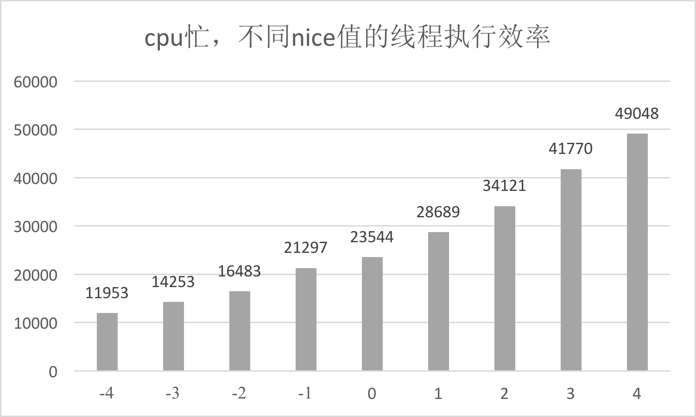
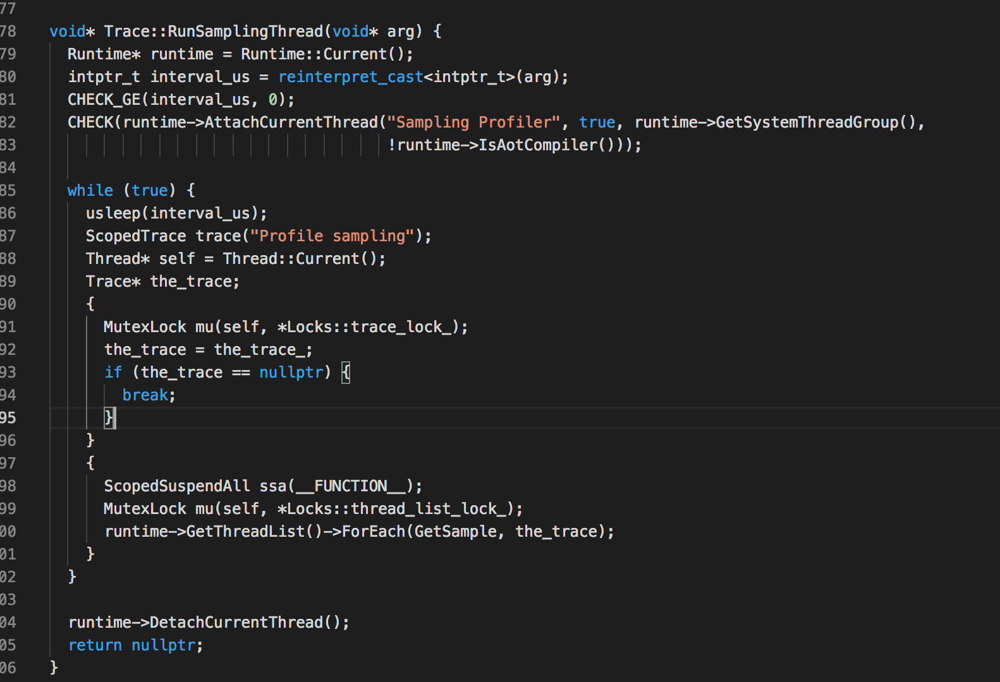
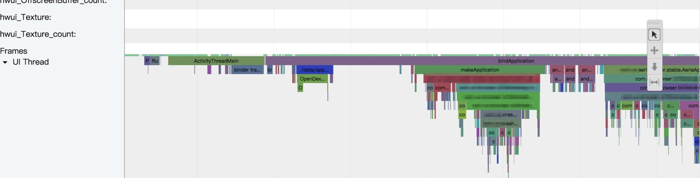
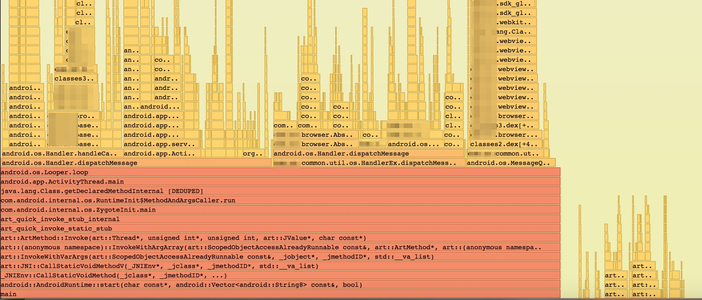
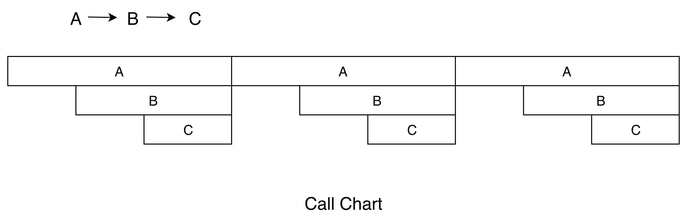
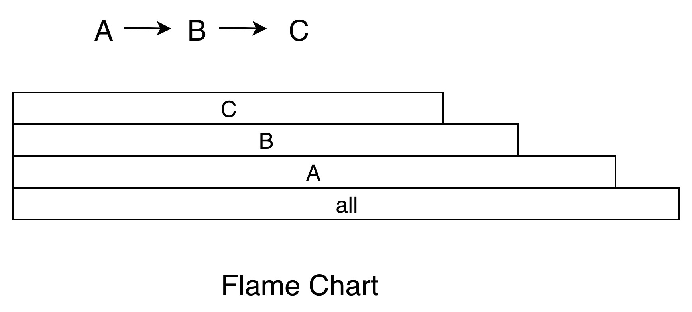

<!DOCTYPE html>
<html xmlns="http://www.w3.org/1999/xhtml">

<head>

    <head>
        <meta http-equiv="Content-Type" content="text/html; charset=UTF-8">
        <meta name="viewport" content="width=device-width, initial-scale=1, maximum-scale=1.0, user-scalable=no">
        <meta http-equiv='content-language' content='zh-cn'>
        <meta name='description' content=05&#32;卡顿优化（上）：你要掌握的卡顿分析方法>
        <link rel="icon" href="/static/favicon.png">
        <title>05 卡顿优化（上）：你要掌握的卡顿分析方法 </title>
        
        <link rel="stylesheet" href="/static/index.css">
        <link rel="stylesheet" href="/static/highlight.min.css">
        
        
        <meta name="generator" content="Hexo 4.2.0">
        
    </head>

<body>
    

        

            

                <a href="/">
                    
                    技术文章摘抄
                </a>
            

            

                <ul class="uncollapsible">
                    <li><a href="/" class="current-tab">首页</a></li>
                    <li><a href="../">上一级</a></li>
                </ul>
                <ul class="uncollapsible">
                    
                    <li>
                        <a class="menu-item" id="00 导读 如何打造高质量的应用？.md" href="/%e4%b8%93%e6%a0%8f/Android%e5%bc%80%e5%8f%91%e9%ab%98%e6%89%8b%e8%af%be/00%20%e5%af%bc%e8%af%bb%20%e5%a6%82%e4%bd%95%e6%89%93%e9%80%a0%e9%ab%98%e8%b4%a8%e9%87%8f%e7%9a%84%e5%ba%94%e7%94%a8%ef%bc%9f.md">00 导读 如何打造高质量的应用？.md</a>
                    </li>
                    
                    <li>
                        <a class="menu-item" id="00 开篇词 焦虑的移动开发者该如何破局？.md" href="/%e4%b8%93%e6%a0%8f/Android%e5%bc%80%e5%8f%91%e9%ab%98%e6%89%8b%e8%af%be/00%20%e5%bc%80%e7%af%87%e8%af%8d%20%e7%84%a6%e8%99%91%e7%9a%84%e7%a7%bb%e5%8a%a8%e5%bc%80%e5%8f%91%e8%80%85%e8%af%a5%e5%a6%82%e4%bd%95%e7%a0%b4%e5%b1%80%ef%bc%9f.md">00 开篇词 焦虑的移动开发者该如何破局？.md</a>
                    </li>
                    
                    <li>
                        <a class="menu-item" id="01 崩溃优化（上）：关于“崩溃”那些事儿.md" href="/%e4%b8%93%e6%a0%8f/Android%e5%bc%80%e5%8f%91%e9%ab%98%e6%89%8b%e8%af%be/01%20%e5%b4%a9%e6%ba%83%e4%bc%98%e5%8c%96%ef%bc%88%e4%b8%8a%ef%bc%89%ef%bc%9a%e5%85%b3%e4%ba%8e%e2%80%9c%e5%b4%a9%e6%ba%83%e2%80%9d%e9%82%a3%e4%ba%9b%e4%ba%8b%e5%84%bf.md">01 崩溃优化（上）：关于“崩溃”那些事儿.md</a>
                    </li>
                    
                    <li>
                        <a class="menu-item" id="02 崩溃优化（下）：应用崩溃了，你应该如何去分析？.md" href="/%e4%b8%93%e6%a0%8f/Android%e5%bc%80%e5%8f%91%e9%ab%98%e6%89%8b%e8%af%be/02%20%e5%b4%a9%e6%ba%83%e4%bc%98%e5%8c%96%ef%bc%88%e4%b8%8b%ef%bc%89%ef%bc%9a%e5%ba%94%e7%94%a8%e5%b4%a9%e6%ba%83%e4%ba%86%ef%bc%8c%e4%bd%a0%e5%ba%94%e8%af%a5%e5%a6%82%e4%bd%95%e5%8e%bb%e5%88%86%e6%9e%90%ef%bc%9f.md">02 崩溃优化（下）：应用崩溃了，你应该如何去分析？.md</a>
                    </li>
                    
                    <li>
                        <a class="menu-item" id="03 内存优化（上）：4GB内存时代，再谈内存优化.md" href="/%e4%b8%93%e6%a0%8f/Android%e5%bc%80%e5%8f%91%e9%ab%98%e6%89%8b%e8%af%be/03%20%e5%86%85%e5%ad%98%e4%bc%98%e5%8c%96%ef%bc%88%e4%b8%8a%ef%bc%89%ef%bc%9a4GB%e5%86%85%e5%ad%98%e6%97%b6%e4%bb%a3%ef%bc%8c%e5%86%8d%e8%b0%88%e5%86%85%e5%ad%98%e4%bc%98%e5%8c%96.md">03 内存优化（上）：4GB内存时代，再谈内存优化.md</a>
                    </li>
                    
                    <li>
                        <a class="menu-item" id="04 内存优化（下）：内存优化这件事，应该从哪里着手？.md" href="/%e4%b8%93%e6%a0%8f/Android%e5%bc%80%e5%8f%91%e9%ab%98%e6%89%8b%e8%af%be/04%20%e5%86%85%e5%ad%98%e4%bc%98%e5%8c%96%ef%bc%88%e4%b8%8b%ef%bc%89%ef%bc%9a%e5%86%85%e5%ad%98%e4%bc%98%e5%8c%96%e8%bf%99%e4%bb%b6%e4%ba%8b%ef%bc%8c%e5%ba%94%e8%af%a5%e4%bb%8e%e5%93%aa%e9%87%8c%e7%9d%80%e6%89%8b%ef%bc%9f.md">04 内存优化（下）：内存优化这件事，应该从哪里着手？.md</a>
                    </li>
                    
                    <li>
                        <a class="menu-item" id="05 卡顿优化（上）：你要掌握的卡顿分析方法.md" href="/%e4%b8%93%e6%a0%8f/Android%e5%bc%80%e5%8f%91%e9%ab%98%e6%89%8b%e8%af%be/05%20%e5%8d%a1%e9%a1%bf%e4%bc%98%e5%8c%96%ef%bc%88%e4%b8%8a%ef%bc%89%ef%bc%9a%e4%bd%a0%e8%a6%81%e6%8e%8c%e6%8f%a1%e7%9a%84%e5%8d%a1%e9%a1%bf%e5%88%86%e6%9e%90%e6%96%b9%e6%b3%95.md">05 卡顿优化（上）：你要掌握的卡顿分析方法.md</a>
                    </li>
                    
                    <li>
                        <a class="menu-item" id="06 卡顿优化（下）：如何监控应用卡顿？.md" href="/%e4%b8%93%e6%a0%8f/Android%e5%bc%80%e5%8f%91%e9%ab%98%e6%89%8b%e8%af%be/06%20%e5%8d%a1%e9%a1%bf%e4%bc%98%e5%8c%96%ef%bc%88%e4%b8%8b%ef%bc%89%ef%bc%9a%e5%a6%82%e4%bd%95%e7%9b%91%e6%8e%a7%e5%ba%94%e7%94%a8%e5%8d%a1%e9%a1%bf%ef%bc%9f.md">06 卡顿优化（下）：如何监控应用卡顿？.md</a>
                    </li>
                    
                    <li>
                        <a class="menu-item" id="06补充篇 卡顿优化：卡顿现场与卡顿分析.md" href="/%e4%b8%93%e6%a0%8f/Android%e5%bc%80%e5%8f%91%e9%ab%98%e6%89%8b%e8%af%be/06%e8%a1%a5%e5%85%85%e7%af%87%20%e5%8d%a1%e9%a1%bf%e4%bc%98%e5%8c%96%ef%bc%9a%e5%8d%a1%e9%a1%bf%e7%8e%b0%e5%9c%ba%e4%b8%8e%e5%8d%a1%e9%a1%bf%e5%88%86%e6%9e%90.md">06补充篇 卡顿优化：卡顿现场与卡顿分析.md</a>
                    </li>
                    
                    <li>
                        <a class="menu-item" id="07 启动优化（上）：从启动过程看启动速度优化.md" href="/%e4%b8%93%e6%a0%8f/Android%e5%bc%80%e5%8f%91%e9%ab%98%e6%89%8b%e8%af%be/07%20%e5%90%af%e5%8a%a8%e4%bc%98%e5%8c%96%ef%bc%88%e4%b8%8a%ef%bc%89%ef%bc%9a%e4%bb%8e%e5%90%af%e5%8a%a8%e8%bf%87%e7%a8%8b%e7%9c%8b%e5%90%af%e5%8a%a8%e9%80%9f%e5%ba%a6%e4%bc%98%e5%8c%96.md">07 启动优化（上）：从启动过程看启动速度优化.md</a>
                    </li>
                    
                    <li>
                        <a class="menu-item" id="08 启动优化（下）：优化启动速度的进阶方法.md" href="/%e4%b8%93%e6%a0%8f/Android%e5%bc%80%e5%8f%91%e9%ab%98%e6%89%8b%e8%af%be/08%20%e5%90%af%e5%8a%a8%e4%bc%98%e5%8c%96%ef%bc%88%e4%b8%8b%ef%bc%89%ef%bc%9a%e4%bc%98%e5%8c%96%e5%90%af%e5%8a%a8%e9%80%9f%e5%ba%a6%e7%9a%84%e8%bf%9b%e9%98%b6%e6%96%b9%e6%b3%95.md">08 启动优化（下）：优化启动速度的进阶方法.md</a>
                    </li>
                    
                    <li>
                        <a class="menu-item" id="09 I_O优化（上）：开发工程师必备的I_O优化知识.md" href="/%e4%b8%93%e6%a0%8f/Android%e5%bc%80%e5%8f%91%e9%ab%98%e6%89%8b%e8%af%be/09%20I_O%e4%bc%98%e5%8c%96%ef%bc%88%e4%b8%8a%ef%bc%89%ef%bc%9a%e5%bc%80%e5%8f%91%e5%b7%a5%e7%a8%8b%e5%b8%88%e5%bf%85%e5%a4%87%e7%9a%84I_O%e4%bc%98%e5%8c%96%e7%9f%a5%e8%af%86.md">09 I_O优化（上）：开发工程师必备的I_O优化知识.md</a>
                    </li>
                    
                    <li>
                        <a class="menu-item" id="10 I_O优化（中）：不同I_O方式的使用场景是什么？.md" href="/%e4%b8%93%e6%a0%8f/Android%e5%bc%80%e5%8f%91%e9%ab%98%e6%89%8b%e8%af%be/10%20I_O%e4%bc%98%e5%8c%96%ef%bc%88%e4%b8%ad%ef%bc%89%ef%bc%9a%e4%b8%8d%e5%90%8cI_O%e6%96%b9%e5%bc%8f%e7%9a%84%e4%bd%bf%e7%94%a8%e5%9c%ba%e6%99%af%e6%98%af%e4%bb%80%e4%b9%88%ef%bc%9f.md">10 I_O优化（中）：不同I_O方式的使用场景是什么？.md</a>
                    </li>
                    
                    <li>
                        <a class="menu-item" id="11 I_O优化（下）：如何监控线上I_O操作？.md" href="/%e4%b8%93%e6%a0%8f/Android%e5%bc%80%e5%8f%91%e9%ab%98%e6%89%8b%e8%af%be/11%20I_O%e4%bc%98%e5%8c%96%ef%bc%88%e4%b8%8b%ef%bc%89%ef%bc%9a%e5%a6%82%e4%bd%95%e7%9b%91%e6%8e%a7%e7%ba%bf%e4%b8%8aI_O%e6%93%8d%e4%bd%9c%ef%bc%9f.md">11 I_O优化（下）：如何监控线上I_O操作？.md</a>
                    </li>
                    
                    <li>
                        <a class="menu-item" id="12 存储优化（上）：常见的数据存储方法有哪些？.md" href="/%e4%b8%93%e6%a0%8f/Android%e5%bc%80%e5%8f%91%e9%ab%98%e6%89%8b%e8%af%be/12%20%e5%ad%98%e5%82%a8%e4%bc%98%e5%8c%96%ef%bc%88%e4%b8%8a%ef%bc%89%ef%bc%9a%e5%b8%b8%e8%a7%81%e7%9a%84%e6%95%b0%e6%8d%ae%e5%ad%98%e5%82%a8%e6%96%b9%e6%b3%95%e6%9c%89%e5%93%aa%e4%ba%9b%ef%bc%9f.md">12 存储优化（上）：常见的数据存储方法有哪些？.md</a>
                    </li>
                    
                    <li>
                        <a class="menu-item" id="13 存储优化（中）：如何优化数据存储？.md" href="/%e4%b8%93%e6%a0%8f/Android%e5%bc%80%e5%8f%91%e9%ab%98%e6%89%8b%e8%af%be/13%20%e5%ad%98%e5%82%a8%e4%bc%98%e5%8c%96%ef%bc%88%e4%b8%ad%ef%bc%89%ef%bc%9a%e5%a6%82%e4%bd%95%e4%bc%98%e5%8c%96%e6%95%b0%e6%8d%ae%e5%ad%98%e5%82%a8%ef%bc%9f.md">13 存储优化（中）：如何优化数据存储？.md</a>
                    </li>
                    
                    <li>
                        <a class="menu-item" id="14 存储优化（下）：数据库SQLite的使用和优化.md" href="/%e4%b8%93%e6%a0%8f/Android%e5%bc%80%e5%8f%91%e9%ab%98%e6%89%8b%e8%af%be/14%20%e5%ad%98%e5%82%a8%e4%bc%98%e5%8c%96%ef%bc%88%e4%b8%8b%ef%bc%89%ef%bc%9a%e6%95%b0%e6%8d%ae%e5%ba%93SQLite%e7%9a%84%e4%bd%bf%e7%94%a8%e5%92%8c%e4%bc%98%e5%8c%96.md">14 存储优化（下）：数据库SQLite的使用和优化.md</a>
                    </li>
                    
                    <li>
                        <a class="menu-item" id="15 网络优化（上）：移动开发工程师必备的网络优化知识.md" href="/%e4%b8%93%e6%a0%8f/Android%e5%bc%80%e5%8f%91%e9%ab%98%e6%89%8b%e8%af%be/15%20%e7%bd%91%e7%bb%9c%e4%bc%98%e5%8c%96%ef%bc%88%e4%b8%8a%ef%bc%89%ef%bc%9a%e7%a7%bb%e5%8a%a8%e5%bc%80%e5%8f%91%e5%b7%a5%e7%a8%8b%e5%b8%88%e5%bf%85%e5%a4%87%e7%9a%84%e7%bd%91%e7%bb%9c%e4%bc%98%e5%8c%96%e7%9f%a5%e8%af%86.md">15 网络优化（上）：移动开发工程师必备的网络优化知识.md</a>
                    </li>
                    
                    <li>
                        <a class="menu-item" id="16 网络优化（中）：复杂多变的移动网络该如何优化？.md" href="/%e4%b8%93%e6%a0%8f/Android%e5%bc%80%e5%8f%91%e9%ab%98%e6%89%8b%e8%af%be/16%20%e7%bd%91%e7%bb%9c%e4%bc%98%e5%8c%96%ef%bc%88%e4%b8%ad%ef%bc%89%ef%bc%9a%e5%a4%8d%e6%9d%82%e5%a4%9a%e5%8f%98%e7%9a%84%e7%a7%bb%e5%8a%a8%e7%bd%91%e7%bb%9c%e8%af%a5%e5%a6%82%e4%bd%95%e4%bc%98%e5%8c%96%ef%bc%9f.md">16 网络优化（中）：复杂多变的移动网络该如何优化？.md</a>
                    </li>
                    
                    <li>
                        <a class="menu-item" id="17 网络优化（下）：大数据下网络该如何监控？.md" href="/%e4%b8%93%e6%a0%8f/Android%e5%bc%80%e5%8f%91%e9%ab%98%e6%89%8b%e8%af%be/17%20%e7%bd%91%e7%bb%9c%e4%bc%98%e5%8c%96%ef%bc%88%e4%b8%8b%ef%bc%89%ef%bc%9a%e5%a4%a7%e6%95%b0%e6%8d%ae%e4%b8%8b%e7%bd%91%e7%bb%9c%e8%af%a5%e5%a6%82%e4%bd%95%e7%9b%91%e6%8e%a7%ef%bc%9f.md">17 网络优化（下）：大数据下网络该如何监控？.md</a>
                    </li>
                    
                    <li>
                        <a class="menu-item" id="18 耗电优化（上）：从电量优化的演进看耗电分析.md" href="/%e4%b8%93%e6%a0%8f/Android%e5%bc%80%e5%8f%91%e9%ab%98%e6%89%8b%e8%af%be/18%20%e8%80%97%e7%94%b5%e4%bc%98%e5%8c%96%ef%bc%88%e4%b8%8a%ef%bc%89%ef%bc%9a%e4%bb%8e%e7%94%b5%e9%87%8f%e4%bc%98%e5%8c%96%e7%9a%84%e6%bc%94%e8%bf%9b%e7%9c%8b%e8%80%97%e7%94%b5%e5%88%86%e6%9e%90.md">18 耗电优化（上）：从电量优化的演进看耗电分析.md</a>
                    </li>
                    
                    <li>
                        <a class="menu-item" id="19 耗电优化（下）：耗电的优化方法与线上监控.md" href="/%e4%b8%93%e6%a0%8f/Android%e5%bc%80%e5%8f%91%e9%ab%98%e6%89%8b%e8%af%be/19%20%e8%80%97%e7%94%b5%e4%bc%98%e5%8c%96%ef%bc%88%e4%b8%8b%ef%bc%89%ef%bc%9a%e8%80%97%e7%94%b5%e7%9a%84%e4%bc%98%e5%8c%96%e6%96%b9%e6%b3%95%e4%b8%8e%e7%ba%bf%e4%b8%8a%e7%9b%91%e6%8e%a7.md">19 耗电优化（下）：耗电的优化方法与线上监控.md</a>
                    </li>
                    
                    <li>
                        <a class="menu-item" id="20 UI 优化（上）：UI 渲染的几个关键概念.md" href="/%e4%b8%93%e6%a0%8f/Android%e5%bc%80%e5%8f%91%e9%ab%98%e6%89%8b%e8%af%be/20%20UI%20%e4%bc%98%e5%8c%96%ef%bc%88%e4%b8%8a%ef%bc%89%ef%bc%9aUI%20%e6%b8%b2%e6%9f%93%e7%9a%84%e5%87%a0%e4%b8%aa%e5%85%b3%e9%94%ae%e6%a6%82%e5%bf%b5.md">20 UI 优化（上）：UI 渲染的几个关键概念.md</a>
                    </li>
                    
                    <li>
                        <a class="menu-item" id="21 UI 优化（下）：如何优化 UI 渲染？.md" href="/%e4%b8%93%e6%a0%8f/Android%e5%bc%80%e5%8f%91%e9%ab%98%e6%89%8b%e8%af%be/21%20UI%20%e4%bc%98%e5%8c%96%ef%bc%88%e4%b8%8b%ef%bc%89%ef%bc%9a%e5%a6%82%e4%bd%95%e4%bc%98%e5%8c%96%20UI%20%e6%b8%b2%e6%9f%93%ef%bc%9f.md">21 UI 优化（下）：如何优化 UI 渲染？.md</a>
                    </li>
                    
                    <li>
                        <a class="menu-item" id="22 包体积优化（上）：如何减少安装包大小？.md" href="/%e4%b8%93%e6%a0%8f/Android%e5%bc%80%e5%8f%91%e9%ab%98%e6%89%8b%e8%af%be/22%20%e5%8c%85%e4%bd%93%e7%a7%af%e4%bc%98%e5%8c%96%ef%bc%88%e4%b8%8a%ef%bc%89%ef%bc%9a%e5%a6%82%e4%bd%95%e5%87%8f%e5%b0%91%e5%ae%89%e8%a3%85%e5%8c%85%e5%a4%a7%e5%b0%8f%ef%bc%9f.md">22 包体积优化（上）：如何减少安装包大小？.md</a>
                    </li>
                    
                    <li>
                        <a class="menu-item" id="23 包体积优化（下）：资源优化的进阶实践.md" href="/%e4%b8%93%e6%a0%8f/Android%e5%bc%80%e5%8f%91%e9%ab%98%e6%89%8b%e8%af%be/23%20%e5%8c%85%e4%bd%93%e7%a7%af%e4%bc%98%e5%8c%96%ef%bc%88%e4%b8%8b%ef%bc%89%ef%bc%9a%e8%b5%84%e6%ba%90%e4%bc%98%e5%8c%96%e7%9a%84%e8%bf%9b%e9%98%b6%e5%ae%9e%e8%b7%b5.md">23 包体积优化（下）：资源优化的进阶实践.md</a>
                    </li>
                    
                    <li>
                        <a class="menu-item" id="24 想成为Android高手，你需要先搞定这三个问题.md" href="/%e4%b8%93%e6%a0%8f/Android%e5%bc%80%e5%8f%91%e9%ab%98%e6%89%8b%e8%af%be/24%20%e6%83%b3%e6%88%90%e4%b8%baAndroid%e9%ab%98%e6%89%8b%ef%bc%8c%e4%bd%a0%e9%9c%80%e8%a6%81%e5%85%88%e6%90%9e%e5%ae%9a%e8%bf%99%e4%b8%89%e4%b8%aa%e9%97%ae%e9%a2%98.md">24 想成为Android高手，你需要先搞定这三个问题.md</a>
                    </li>
                    
                    <li>
                        <a class="menu-item" id="25 如何提升组织与个人的研发效能？.md" href="/%e4%b8%93%e6%a0%8f/Android%e5%bc%80%e5%8f%91%e9%ab%98%e6%89%8b%e8%af%be/25%20%e5%a6%82%e4%bd%95%e6%8f%90%e5%8d%87%e7%bb%84%e7%bb%87%e4%b8%8e%e4%b8%aa%e4%ba%ba%e7%9a%84%e7%a0%94%e5%8f%91%e6%95%88%e8%83%bd%ef%bc%9f.md">25 如何提升组织与个人的研发效能？.md</a>
                    </li>
                    
                    <li>
                        <a class="menu-item" id="26 关于编译，你需要了解什么？.md" href="/%e4%b8%93%e6%a0%8f/Android%e5%bc%80%e5%8f%91%e9%ab%98%e6%89%8b%e8%af%be/26%20%e5%85%b3%e4%ba%8e%e7%bc%96%e8%af%91%ef%bc%8c%e4%bd%a0%e9%9c%80%e8%a6%81%e4%ba%86%e8%a7%a3%e4%bb%80%e4%b9%88%ef%bc%9f.md">26 关于编译，你需要了解什么？.md</a>
                    </li>
                    
                    <li>
                        <a class="menu-item" id="27 编译插桩的三种方法：AspectJ、ASM、ReDex.md" href="/%e4%b8%93%e6%a0%8f/Android%e5%bc%80%e5%8f%91%e9%ab%98%e6%89%8b%e8%af%be/27%20%e7%bc%96%e8%af%91%e6%8f%92%e6%a1%a9%e7%9a%84%e4%b8%89%e7%a7%8d%e6%96%b9%e6%b3%95%ef%bc%9aAspectJ%e3%80%81ASM%e3%80%81ReDex.md">27 编译插桩的三种方法：AspectJ、ASM、ReDex.md</a>
                    </li>
                    
                    <li>
                        <a class="menu-item" id="28 大数据与AI，如何高效地测试？.md" href="/%e4%b8%93%e6%a0%8f/Android%e5%bc%80%e5%8f%91%e9%ab%98%e6%89%8b%e8%af%be/28%20%e5%a4%a7%e6%95%b0%e6%8d%ae%e4%b8%8eAI%ef%bc%8c%e5%a6%82%e4%bd%95%e9%ab%98%e6%95%88%e5%9c%b0%e6%b5%8b%e8%af%95%ef%bc%9f.md">28 大数据与AI，如何高效地测试？.md</a>
                    </li>
                    
                    <li>
                        <a class="menu-item" id="29 从每月到每天，如何给版本发布提速？.md" href="/%e4%b8%93%e6%a0%8f/Android%e5%bc%80%e5%8f%91%e9%ab%98%e6%89%8b%e8%af%be/29%20%e4%bb%8e%e6%af%8f%e6%9c%88%e5%88%b0%e6%af%8f%e5%a4%a9%ef%bc%8c%e5%a6%82%e4%bd%95%e7%bb%99%e7%89%88%e6%9c%ac%e5%8f%91%e5%b8%83%e6%8f%90%e9%80%9f%ef%bc%9f.md">29 从每月到每天，如何给版本发布提速？.md</a>
                    </li>
                    
                    <li>
                        <a class="menu-item" id="30 数据评估（上）：如何实现高可用的上报组件？.md" href="/%e4%b8%93%e6%a0%8f/Android%e5%bc%80%e5%8f%91%e9%ab%98%e6%89%8b%e8%af%be/30%20%e6%95%b0%e6%8d%ae%e8%af%84%e4%bc%b0%ef%bc%88%e4%b8%8a%ef%bc%89%ef%bc%9a%e5%a6%82%e4%bd%95%e5%ae%9e%e7%8e%b0%e9%ab%98%e5%8f%af%e7%94%a8%e7%9a%84%e4%b8%8a%e6%8a%a5%e7%bb%84%e4%bb%b6%ef%bc%9f.md">30 数据评估（上）：如何实现高可用的上报组件？.md</a>
                    </li>
                    
                    <li>
                        <a class="menu-item" id="31 数据评估（下）：什么是大数据平台？.md" href="/%e4%b8%93%e6%a0%8f/Android%e5%bc%80%e5%8f%91%e9%ab%98%e6%89%8b%e8%af%be/31%20%e6%95%b0%e6%8d%ae%e8%af%84%e4%bc%b0%ef%bc%88%e4%b8%8b%ef%bc%89%ef%bc%9a%e4%bb%80%e4%b9%88%e6%98%af%e5%a4%a7%e6%95%b0%e6%8d%ae%e5%b9%b3%e5%8f%b0%ef%bc%9f.md">31 数据评估（下）：什么是大数据平台？.md</a>
                    </li>
                    
                    <li>
                        <a class="menu-item" id="32 线上疑难问题该如何排查和跟踪？.md" href="/%e4%b8%93%e6%a0%8f/Android%e5%bc%80%e5%8f%91%e9%ab%98%e6%89%8b%e8%af%be/32%20%e7%ba%bf%e4%b8%8a%e7%96%91%e9%9a%be%e9%97%ae%e9%a2%98%e8%af%a5%e5%a6%82%e4%bd%95%e6%8e%92%e6%9f%a5%e5%92%8c%e8%b7%9f%e8%b8%aa%ef%bc%9f.md">32 线上疑难问题该如何排查和跟踪？.md</a>
                    </li>
                    
                    <li>
                        <a class="menu-item" id="33 做一名有高度的移动开发工程师.md" href="/%e4%b8%93%e6%a0%8f/Android%e5%bc%80%e5%8f%91%e9%ab%98%e6%89%8b%e8%af%be/33%20%e5%81%9a%e4%b8%80%e5%90%8d%e6%9c%89%e9%ab%98%e5%ba%a6%e7%9a%84%e7%a7%bb%e5%8a%a8%e5%bc%80%e5%8f%91%e5%b7%a5%e7%a8%8b%e5%b8%88.md">33 做一名有高度的移动开发工程师.md</a>
                    </li>
                    
                    <li>
                        <a class="menu-item" id="34 聊聊重构：优秀的架构都是演进而来的.md" href="/%e4%b8%93%e6%a0%8f/Android%e5%bc%80%e5%8f%91%e9%ab%98%e6%89%8b%e8%af%be/34%20%e8%81%8a%e8%81%8a%e9%87%8d%e6%9e%84%ef%bc%9a%e4%bc%98%e7%a7%80%e7%9a%84%e6%9e%b6%e6%9e%84%e9%83%bd%e6%98%af%e6%bc%94%e8%bf%9b%e8%80%8c%e6%9d%a5%e7%9a%84.md">34 聊聊重构：优秀的架构都是演进而来的.md</a>
                    </li>
                    
                    <li>
                        <a class="menu-item" id="35 Native Hook 技术，天使还是魔鬼？.md" href="/%e4%b8%93%e6%a0%8f/Android%e5%bc%80%e5%8f%91%e9%ab%98%e6%89%8b%e8%af%be/35%20Native%20Hook%20%e6%8a%80%e6%9c%af%ef%bc%8c%e5%a4%a9%e4%bd%bf%e8%bf%98%e6%98%af%e9%ad%94%e9%ac%bc%ef%bc%9f.md">35 Native Hook 技术，天使还是魔鬼？.md</a>
                    </li>
                    
                    <li>
                        <a class="menu-item" id="36 跨平台开发的现状与应用.md" href="/%e4%b8%93%e6%a0%8f/Android%e5%bc%80%e5%8f%91%e9%ab%98%e6%89%8b%e8%af%be/36%20%e8%b7%a8%e5%b9%b3%e5%8f%b0%e5%bc%80%e5%8f%91%e7%9a%84%e7%8e%b0%e7%8a%b6%e4%b8%8e%e5%ba%94%e7%94%a8.md">36 跨平台开发的现状与应用.md</a>
                    </li>
                    
                    <li>
                        <a class="menu-item" id="37 移动开发新大陆：工作三年半，移动开发转型手游开发.md" href="/%e4%b8%93%e6%a0%8f/Android%e5%bc%80%e5%8f%91%e9%ab%98%e6%89%8b%e8%af%be/37%20%e7%a7%bb%e5%8a%a8%e5%bc%80%e5%8f%91%e6%96%b0%e5%a4%a7%e9%99%86%ef%bc%9a%e5%b7%a5%e4%bd%9c%e4%b8%89%e5%b9%b4%e5%8d%8a%ef%bc%8c%e7%a7%bb%e5%8a%a8%e5%bc%80%e5%8f%91%e8%bd%ac%e5%9e%8b%e6%89%8b%e6%b8%b8%e5%bc%80%e5%8f%91.md">37 移动开发新大陆：工作三年半，移动开发转型手游开发.md</a>
                    </li>
                    
                    <li>
                        <a class="menu-item" id="38 移动开发新大陆：Android音视频开发.md" href="/%e4%b8%93%e6%a0%8f/Android%e5%bc%80%e5%8f%91%e9%ab%98%e6%89%8b%e8%af%be/38%20%e7%a7%bb%e5%8a%a8%e5%bc%80%e5%8f%91%e6%96%b0%e5%a4%a7%e9%99%86%ef%bc%9aAndroid%e9%9f%b3%e8%a7%86%e9%a2%91%e5%bc%80%e5%8f%91.md">38 移动开发新大陆：Android音视频开发.md</a>
                    </li>
                    
                    <li>
                        <a class="menu-item" id="39 移动开发新大陆： 边缘智能计算的趋势.md" href="/%e4%b8%93%e6%a0%8f/Android%e5%bc%80%e5%8f%91%e9%ab%98%e6%89%8b%e8%af%be/39%20%e7%a7%bb%e5%8a%a8%e5%bc%80%e5%8f%91%e6%96%b0%e5%a4%a7%e9%99%86%ef%bc%9a%20%e8%be%b9%e7%bc%98%e6%99%ba%e8%83%bd%e8%ae%a1%e7%ae%97%e7%9a%84%e8%b6%8b%e5%8a%bf.md">39 移动开发新大陆： 边缘智能计算的趋势.md</a>
                    </li>
                    
                    <li>
                        <a class="menu-item" id="40 动态化实践，如何选择适合自己的方案？.md" href="/%e4%b8%93%e6%a0%8f/Android%e5%bc%80%e5%8f%91%e9%ab%98%e6%89%8b%e8%af%be/40%20%e5%8a%a8%e6%80%81%e5%8c%96%e5%ae%9e%e8%b7%b5%ef%bc%8c%e5%a6%82%e4%bd%95%e9%80%89%e6%8b%a9%e9%80%82%e5%90%88%e8%87%aa%e5%b7%b1%e7%9a%84%e6%96%b9%e6%a1%88%ef%bc%9f.md">40 动态化实践，如何选择适合自己的方案？.md</a>
                    </li>
                    
                    <li>
                        <a class="menu-item" id="41 聊聊Flutter，面对层出不穷的新技术该如何跟进？.md" href="/%e4%b8%93%e6%a0%8f/Android%e5%bc%80%e5%8f%91%e9%ab%98%e6%89%8b%e8%af%be/41%20%e8%81%8a%e8%81%8aFlutter%ef%bc%8c%e9%9d%a2%e5%af%b9%e5%b1%82%e5%87%ba%e4%b8%8d%e7%a9%b7%e7%9a%84%e6%96%b0%e6%8a%80%e6%9c%af%e8%af%a5%e5%a6%82%e4%bd%95%e8%b7%9f%e8%bf%9b%ef%bc%9f.md">41 聊聊Flutter，面对层出不穷的新技术该如何跟进？.md</a>
                    </li>
                    
                    <li>
                        <a class="menu-item" id="42 Android开发高手课学习心得.md" href="/%e4%b8%93%e6%a0%8f/Android%e5%bc%80%e5%8f%91%e9%ab%98%e6%89%8b%e8%af%be/42%20Android%e5%bc%80%e5%8f%91%e9%ab%98%e6%89%8b%e8%af%be%e5%ad%a6%e4%b9%a0%e5%bf%83%e5%be%97.md">42 Android开发高手课学习心得.md</a>
                    </li>
                    
                    <li>
                        <a class="menu-item" id="Android JVM TI机制详解（内含福利彩蛋）.md" href="/%e4%b8%93%e6%a0%8f/Android%e5%bc%80%e5%8f%91%e9%ab%98%e6%89%8b%e8%af%be/Android%20JVM%20TI%e6%9c%ba%e5%88%b6%e8%af%a6%e8%a7%a3%ef%bc%88%e5%86%85%e5%90%ab%e7%a6%8f%e5%88%a9%e5%bd%a9%e8%9b%8b%ef%bc%89.md">Android JVM TI机制详解（内含福利彩蛋）.md</a>
                    </li>
                    
                    <li>
                        <a class="menu-item" id="Android工程师的“面试指南”.md" href="/%e4%b8%93%e6%a0%8f/Android%e5%bc%80%e5%8f%91%e9%ab%98%e6%89%8b%e8%af%be/Android%e5%b7%a5%e7%a8%8b%e5%b8%88%e7%9a%84%e2%80%9c%e9%9d%a2%e8%af%95%e6%8c%87%e5%8d%97%e2%80%9d.md">Android工程师的“面试指南”.md</a>
                    </li>
                    
                    <li>
                        <a class="menu-item" id="Native下如何获取调用栈？.md" href="/%e4%b8%93%e6%a0%8f/Android%e5%bc%80%e5%8f%91%e9%ab%98%e6%89%8b%e8%af%be/Native%e4%b8%8b%e5%a6%82%e4%bd%95%e8%8e%b7%e5%8f%96%e8%b0%83%e7%94%a8%e6%a0%88%ef%bc%9f.md">Native下如何获取调用栈？.md</a>
                    </li>
                    
                    <li>
                        <a class="menu-item" id="专栏学得苦？可能你还需要一份配套学习书单.md" href="/%e4%b8%93%e6%a0%8f/Android%e5%bc%80%e5%8f%91%e9%ab%98%e6%89%8b%e8%af%be/%e4%b8%93%e6%a0%8f%e5%ad%a6%e5%be%97%e8%8b%a6%ef%bc%9f%e5%8f%af%e8%83%bd%e4%bd%a0%e8%bf%98%e9%9c%80%e8%a6%81%e4%b8%80%e4%bb%bd%e9%85%8d%e5%a5%97%e5%ad%a6%e4%b9%a0%e4%b9%a6%e5%8d%95.md">专栏学得苦？可能你还需要一份配套学习书单.md</a>
                    </li>
                    
                    <li>
                        <a class="menu-item" id="专栏学得苦？可能是方法没找对.md" href="/%e4%b8%93%e6%a0%8f/Android%e5%bc%80%e5%8f%91%e9%ab%98%e6%89%8b%e8%af%be/%e4%b8%93%e6%a0%8f%e5%ad%a6%e5%be%97%e8%8b%a6%ef%bc%9f%e5%8f%af%e8%83%bd%e6%98%af%e6%96%b9%e6%b3%95%e6%b2%a1%e6%89%be%e5%af%b9.md">专栏学得苦？可能是方法没找对.md</a>
                    </li>
                    
                    <li>
                        <a class="menu-item" id="程序员修炼之路 设计能力的提升途径.md" href="/%e4%b8%93%e6%a0%8f/Android%e5%bc%80%e5%8f%91%e9%ab%98%e6%89%8b%e8%af%be/%e7%a8%8b%e5%ba%8f%e5%91%98%e4%bf%ae%e7%82%bc%e4%b9%8b%e8%b7%af%20%e8%ae%be%e8%ae%a1%e8%83%bd%e5%8a%9b%e7%9a%84%e6%8f%90%e5%8d%87%e9%80%94%e5%be%84.md">程序员修炼之路 设计能力的提升途径.md</a>
                    </li>
                    
                    <li>
                        <a class="menu-item" id="练习Sample跑起来 ASM插桩强化练习.md" href="/%e4%b8%93%e6%a0%8f/Android%e5%bc%80%e5%8f%91%e9%ab%98%e6%89%8b%e8%af%be/%e7%bb%83%e4%b9%a0Sample%e8%b7%91%e8%b5%b7%e6%9d%a5%20ASM%e6%8f%92%e6%a1%a9%e5%bc%ba%e5%8c%96%e7%bb%83%e4%b9%a0.md">练习Sample跑起来 ASM插桩强化练习.md</a>
                    </li>
                    
                    <li>
                        <a class="menu-item" id="练习Sample跑起来 唯鹿同学的练习手记 第1辑.md" href="/%e4%b8%93%e6%a0%8f/Android%e5%bc%80%e5%8f%91%e9%ab%98%e6%89%8b%e8%af%be/%e7%bb%83%e4%b9%a0Sample%e8%b7%91%e8%b5%b7%e6%9d%a5%20%e5%94%af%e9%b9%bf%e5%90%8c%e5%ad%a6%e7%9a%84%e7%bb%83%e4%b9%a0%e6%89%8b%e8%ae%b0%20%e7%ac%ac1%e8%be%91.md">练习Sample跑起来 唯鹿同学的练习手记 第1辑.md</a>
                    </li>
                    
                    <li>
                        <a class="menu-item" id="练习Sample跑起来 唯鹿同学的练习手记 第2辑.md" href="/%e4%b8%93%e6%a0%8f/Android%e5%bc%80%e5%8f%91%e9%ab%98%e6%89%8b%e8%af%be/%e7%bb%83%e4%b9%a0Sample%e8%b7%91%e8%b5%b7%e6%9d%a5%20%e5%94%af%e9%b9%bf%e5%90%8c%e5%ad%a6%e7%9a%84%e7%bb%83%e4%b9%a0%e6%89%8b%e8%ae%b0%20%e7%ac%ac2%e8%be%91.md">练习Sample跑起来 唯鹿同学的练习手记 第2辑.md</a>
                    </li>
                    
                    <li>
                        <a class="menu-item" id="练习Sample跑起来 唯鹿同学的练习手记 第3辑.md" href="/%e4%b8%93%e6%a0%8f/Android%e5%bc%80%e5%8f%91%e9%ab%98%e6%89%8b%e8%af%be/%e7%bb%83%e4%b9%a0Sample%e8%b7%91%e8%b5%b7%e6%9d%a5%20%e5%94%af%e9%b9%bf%e5%90%8c%e5%ad%a6%e7%9a%84%e7%bb%83%e4%b9%a0%e6%89%8b%e8%ae%b0%20%e7%ac%ac3%e8%be%91.md">练习Sample跑起来 唯鹿同学的练习手记 第3辑.md</a>
                    </li>
                    
                    <li>
                        <a class="menu-item" id="练习Sample跑起来 热点问题答疑第1期.md" href="/%e4%b8%93%e6%a0%8f/Android%e5%bc%80%e5%8f%91%e9%ab%98%e6%89%8b%e8%af%be/%e7%bb%83%e4%b9%a0Sample%e8%b7%91%e8%b5%b7%e6%9d%a5%20%e7%83%ad%e7%82%b9%e9%97%ae%e9%a2%98%e7%ad%94%e7%96%91%e7%ac%ac1%e6%9c%9f.md">练习Sample跑起来 热点问题答疑第1期.md</a>
                    </li>
                    
                    <li>
                        <a class="menu-item" id="练习Sample跑起来 热点问题答疑第2期.md" href="/%e4%b8%93%e6%a0%8f/Android%e5%bc%80%e5%8f%91%e9%ab%98%e6%89%8b%e8%af%be/%e7%bb%83%e4%b9%a0Sample%e8%b7%91%e8%b5%b7%e6%9d%a5%20%e7%83%ad%e7%82%b9%e9%97%ae%e9%a2%98%e7%ad%94%e7%96%91%e7%ac%ac2%e6%9c%9f.md">练习Sample跑起来 热点问题答疑第2期.md</a>
                    </li>
                    
                    <li>
                        <a class="menu-item" id="练习Sample跑起来 热点问题答疑第3期.md" href="/%e4%b8%93%e6%a0%8f/Android%e5%bc%80%e5%8f%91%e9%ab%98%e6%89%8b%e8%af%be/%e7%bb%83%e4%b9%a0Sample%e8%b7%91%e8%b5%b7%e6%9d%a5%20%e7%83%ad%e7%82%b9%e9%97%ae%e9%a2%98%e7%ad%94%e7%96%91%e7%ac%ac3%e6%9c%9f.md">练习Sample跑起来 热点问题答疑第3期.md</a>
                    </li>
                    
                    <li>
                        <a class="menu-item" id="练习Sample跑起来 热点问题答疑第4期.md" href="/%e4%b8%93%e6%a0%8f/Android%e5%bc%80%e5%8f%91%e9%ab%98%e6%89%8b%e8%af%be/%e7%bb%83%e4%b9%a0Sample%e8%b7%91%e8%b5%b7%e6%9d%a5%20%e7%83%ad%e7%82%b9%e9%97%ae%e9%a2%98%e7%ad%94%e7%96%91%e7%ac%ac4%e6%9c%9f.md">练习Sample跑起来 热点问题答疑第4期.md</a>
                    </li>
                    
                    <li>
                        <a class="menu-item" id="结束语 移动开发的今天和明天.md" href="/%e4%b8%93%e6%a0%8f/Android%e5%bc%80%e5%8f%91%e9%ab%98%e6%89%8b%e8%af%be/%e7%bb%93%e6%9d%9f%e8%af%ad%20%e7%a7%bb%e5%8a%a8%e5%bc%80%e5%8f%91%e7%9a%84%e4%bb%8a%e5%a4%a9%e5%92%8c%e6%98%8e%e5%a4%a9.md">结束语 移动开发的今天和明天.md</a>
                    </li>
                    
                    <li>
                        <a class="menu-item" id="聊聊Framework的学习方法.md" href="/%e4%b8%93%e6%a0%8f/Android%e5%bc%80%e5%8f%91%e9%ab%98%e6%89%8b%e8%af%be/%e8%81%8a%e8%81%8aFramework%e7%9a%84%e5%ad%a6%e4%b9%a0%e6%96%b9%e6%b3%95.md">聊聊Framework的学习方法.md</a>
                    </li>
                    
                    <li><a href="https://lianglianglee.com/assets/%E6%8D%90%E8%B5%A0.md">捐赠</a></li>
                </ul>

            

        

        

            

        

        

            

                

                    

                        
                        <header class="navbar">
                            <section class="navbar-section">
                                <a onclick="open_sidebar()">
                                    <i class="icon icon-menu"></i>
                                </a>
                            </section>
                        </header>
                    

                    

                        

                            
                            
                            
                            

                            <h1 id="title" data-id="05 卡顿优化（上）：你要掌握的卡顿分析方法" class="title">05 卡顿优化（上）：你要掌握的卡顿分析方法</h1>
                            

“我的后羿怎么动不了！”，在玩《王者荣耀》的时候最怕遇到团战时卡得跟幻灯片一样。对于应用也是这样，我们经常会听到用户抱怨：“这个应用启动怎么那么慢？”“滑动的时候怎么那么卡？”。

对用户来说，内存占用高、耗费电量、耗费流量可能不容易被发现，但是用户对卡顿特别敏感，很容易直观感受到。另一方面，对于开发者来说，卡顿问题又非常难以排查定位，产生的原因错综复杂，跟CPU、内存、磁盘I/O都可能有关，跟用户当时的系统环境也有很大关系。

那到底该如何定义卡顿呢？在本地有哪些工具可以帮助我们更好地发现和排查问题呢？这些工具之间的差异又是什么呢？今天我来帮你解决这些困惑。

<h2 id="基础知识">基础知识</h2>

在具体讲卡顿工具前，你需要了解一些基础知识，它们主要都和CPU相关。造成卡顿的原因可能有千百种，不过最终都会反映到<strong>CPU时间</strong>上。我们可以把CPU时间分为两种：用户时间和系统时间。用户时间就是执行用户态应用程序代码所消耗的时间；系统时间就是执行内核态系统调用所消耗的时间，包括I/O、锁、中断以及其他系统调用的时间。

<strong>1. CPU性能</strong>

我们先来简单讲讲CPU的性能，考虑到功耗、体积这些因素，移动设备和PC的CPU会有不少的差异。但近年来，手机CPU的性能也在向PC快速靠拢，华为Mate 20的“麒麟980”和iPhone XS的“A12”已经率先使用领先PC的7纳米工艺。

评价一个CPU的性能，需要看主频、核心数、缓存等参数，具体表现出来的是计算能力和指令执行能力，也就是每秒执行的浮点计算数和每秒执行的指令数。

当然还要考虑到架构问题， “麒麟980”采用三级能效架构，2个2.6GHz主频的A76超大核 + 2个1.92GHz主频的A76大核 + 4个1.8GHz主频的A55小核。相比之下，“A12”使用2个性能核心 + 4个能效核心的架构，这样设计主要是为了在日常低负荷工作时，使用低频核心更加节省电量。在开发过程中，我们可以通过下面的方法获得设备的CPU信息。

<pre><code>// 获取 CPU 核心数
cat /sys/devices/system/cpu/possible  

// 获取某个 CPU 的频率
cat /sys/devices/system/cpu/cpu0/cpufreq/cpuinfo_max_freq
</code></pre>

随着机器学习的兴起，现代芯片不仅带有强大的GPU，还配备了专门为神经网络计算打造的NPU（Neural network Processing Unit）。“A12”就使用了八核心的NPU，每秒可执行五万亿次运算。<strong>从CPU到GPU再到AI芯片，随着手机CPU 整体性能的飞跃，医疗诊断、图像超清化等一些AI应用场景也可以在移动端更好地落地。最近边缘计算也越来越多的被提及，我们希望可以更大程度地利用移动端的计算能力来降低高昂的服务器成本。</strong>

也因此在开发过程中，我们需要根据设备CPU性能来“看菜下饭”，例如线程池使用线程数根据CPU的核心数，一些高级的AI功能只在主频比较高或者带有NPU的设备开启。

拓展了那么多再回到前面我讲的CPU时间，也就是用户时间和系统时间。当出现卡顿问题的时候，应该怎么去区分究竟是我们代码的问题，还是系统的问题？用户时间和系统时间可以给我们哪些线索？这里还要集合两个非常重要的指标，可以帮助我们做判断。

<strong>2. 卡顿问题分析指标</strong>

出现卡顿问题后，首先我们应该查看<strong>CPU的使用率</strong>。怎么查呢？我们可以通过<code>/proc/stat</code>得到整个系统的CPU使用情况，通过<code>/proc/[pid]/stat</code>可以得到某个进程的CPU使用情况。

关于stat文件各个属性的含义和CPU使用率的计算，你可以阅读<a href="http://www.samirchen.com/linux-cpu-performance/" target="_blank">《Linux环境下进程的CPU占用率》</a>和<a href="http://man7.org/linux/man-pages/man5/proc.5.html" target="_blank">Linux文档</a>。其中比较重要的字段有：

<pre><code>proc/self/stat:
  utime:       用户时间，反应用户代码执行的耗时  
  stime:       系统时间，反应系统调用执行的耗时
  majorFaults：需要硬盘拷贝的缺页次数
  minorFaults：无需硬盘拷贝的缺页次数
</code></pre>

如果CPU使用率长期大于60% ，表示系统处于繁忙状态，就需要进一步分析用户时间和系统时间的比例。对于普通应用程序，系统时间不会长期高于30%，如果超过这个值，我们就应该进一步检查是I/O过多，还是其他的系统调用问题。

Android是站在Linux巨人的肩膀上，虽然做了不少修改也砍掉了一些工具，但还是保留了很多有用的工具可以协助我们更容易地排查问题，这里我给你介绍几个常用的命令。例如，<strong>top命令</strong>可以帮助我们查看哪个进程是CPU的消耗大户；<strong>vmstat命令</strong>可以实时动态监视操作系统的虚拟内存和CPU活动；<strong>strace命令</strong>可以跟踪某个进程中所有的系统调用。

除了CPU的使用率，我们还需要查看<strong>CPU饱和度</strong>。CPU饱和度反映的是线程排队等待CPU的情况，也就是CPU的负载情况。

CPU饱和度首先会跟应用的线程数有关，如果启动的线程过多，容易导致系统不断地切换执行的线程，把大量的时间浪费在上下文切换，我们知道每一次CPU上下文切换都需要刷新寄存器和计数器，至少需要几十纳秒的时间。

我们可以通过使用<code>vmstat</code>命令或者<code>/proc/[pid]/schedstat</code>文件来查看CPU上下文切换次数，这里特别需要注意<code>nr_involuntary_switches</code>被动切换的次数。

<pre><code>proc/self/sched:
  nr_voluntary_switches：     
  主动上下文切换次数，因为线程无法获取所需资源导致上下文切换，最普遍的是IO。    
  nr_involuntary_switches：   
  被动上下文切换次数，线程被系统强制调度导致上下文切换，例如大量线程在抢占CPU。
  se.statistics.iowait_count：IO 等待的次数
  se.statistics.iowait_sum：  IO 等待的时间
</code></pre>

此外也可以通过uptime命令可以检查CPU在1分钟、5分钟和15分钟内的平均负载。比如一个4核的CPU，如果当前平均负载是8，这意味着每个CPU上有一个线程在运行，还有一个线程在等待。一般平均负载建议控制在“0.7 × 核数”以内。

<pre><code>00:02:39 up 7 days, 46 min,  0 users,  
load average: 13.91, 14.70, 14.32
</code></pre>

另外一个会影响CPU饱和度的是线程优先级，线程优先级会影响Android系统的调度策略，它主要由nice和cgroup类型共同决定。nice值越低，抢占CPU时间片的能力越强。当CPU空闲时，线程的优先级对执行效率的影响并不会特别明显，但在CPU繁忙的时候，线程调度会对执行效率有非常大的影响。

关于线程优先级，你需要注意<strong>是否存在高优先级的线程空等低优先级线程，例如主线程等待某个后台线程的锁</strong>。从应用程序的角度来看，无论是用户时间、系统时间，还是等待CPU的调度，都是程序运行花费的时间。

<h2 id="android卡顿排查工具">Android卡顿排查工具</h2>

可能你会觉得按照上面各种Linux命令组合来排查问题太麻烦了，有没有更简单的、图形化的操作界面呢？Traceview和systrace都是我们比较熟悉的排查卡顿的工具，从实现上这些工具分为两个流派。

第一个流派是instrument。获取一段时间内所有函数的调用过程，可以通过分析这段时间内的函数调用流程，再进一步分析待优化的点。

第二个流派是sample。有选择性或者采用抽样的方式观察某些函数调用过程，可以通过这些有限的信息推测出流程中的可疑点，然后再继续细化分析。

这两种流派有什么差异？我们在什么场景应该选择哪种合适的工具呢？还有没有其他有用的工具可以使用呢？下面我们一一来看。

<strong>1. Traceview</strong>

<a href="https://developer.android.com/studio/profile/generate-trace-logs" target="_blank">Traceview</a>是我第一个使用的性能分析工具，也是吐槽的比较多的工具。它利用Android Runtime函数调用的event事件，将函数运行的耗时和调用关系写入trace文件中。

由此可见，Traceview属于instrument类型，它可以用来查看整个过程有哪些函数调用，但是工具本身带来的性能开销过大，有时无法反映真实的情况。比如一个函数本身的耗时是1秒，开启Traceview后可能会变成5秒，而且这些函数的耗时变化并不是成比例放大。

在Android 5.0之后，新增了<code>startMethodTracingSampling</code>方法，可以使用基于样本的方式进行分析，以减少分析对运行时的性能影响。新增了sample类型后，就需要我们在开销和信息丰富度之间做好权衡。

无论是哪种的Traceview对release包支持的都不太好，例如无法反混淆。其实trace文件的格式十分简单，之前曾经写个一个小工具，支持通过mapping文件反混淆trace。

<strong>2. Nanoscope</strong>

那在instrument类型的性能分析工具里，有没有性能损耗比较小的呢？

答案是有的，Uber开源的<a href="https://github.com/uber/nanoscope" target="_blank">Nanoscope</a>就能达到这个效果。它的实现原理是直接修改Android虚拟机源码，在<code>ArtMethod</code>执行入口和执行结束位置增加埋点代码，将所有的信息先写到内存，等到trace结束后才统一生成结果文件。

在使用过程可以明显感觉到应用不会因为开启Nanoscope而感到卡顿，但是trace结束生成结果文件这一步需要的时间比较长。<strong>另一方面它可以支持分析任意一个应用，可用于做竞品分析。</strong>

但是它也有不少限制：

<ul>
<li>
需要自己刷ROM，并且当前只支持Nexus 6P，或者采用其提供的x86架构的模拟器。
</li>

<li>
默认只支持主线程采集，其他线程需要<a href="https://github.com/uber/nanoscope/wiki/Architecture%3A-Nanoscope-ROM#java-api" target="_blank">代码手动设置</a>。考虑到内存大小的限制，每个线程的内存数组只能支持大约20秒左右的时间段。
</li>
</ul>

Uber写了一系列自动化脚本协助整个流程，使用起来还算简单。Nanoscope作为基本没有性能损耗的instrument工具，它非常适合做启动耗时的自动化分析。

Nanoscope生成的是符合Chrome tracing规范的HTML文件。我们可以通过脚本来实现两个功能：

第一个是反混淆。通过mapping自动反混淆结果文件。

第二个是自动化分析。传入相同的起点和终点，实现两个结果文件的diff，自动分析差异点。

这样我们可以每天定期去跑自动化启动测试，查看是否存在新增的耗时点。<strong>我们有时候为了实现更多定制化功能或者拿到更加丰富的信息，这个时候不得不使用定制ROM的方式。而Nanoscope恰恰是一个很好的工具，可以让我们更方便地实现定制ROM，在后面启动和I/O优化里我还会提到更多类似的案例。</strong>

<strong>3. systrace</strong>

<a href="https://source.android.com/devices/tech/debug/systrace?hl=zh-cn" target="_blank">systrace</a>是Android 4.1新增的性能分析工具。我通常使用systrace跟踪系统的I/O操作、CPU负载、Surface渲染、GC等事件。

systrace利用了Linux的<a href="https://source.android.com/devices/tech/debug/ftrace" target="_blank">ftrace</a>调试工具，相当于在系统各个关键位置都添加了一些性能探针，也就是在代码里加了一些性能监控的埋点。Android在ftrace的基础上封装了<a href="https://android.googlesource.com/platform/frameworks/native/+/master/cmds/atrace/atrace.cpp" target="_blank">atrace</a>，并增加了更多特有的探针，例如Graphics、Activity Manager、Dalvik VM、System Server等。

systrace工具只能监控特定系统调用的耗时情况，所以它是属于sample类型，而且性能开销非常低。但是它不支持应用程序代码的耗时分析，所以在使用时有一些局限性。

由于系统预留了<code>Trace.beginSection</code>接口来监听应用程序的调用耗时，那我们有没有办法在systrace上面自动增加应用程序的耗时分析呢？

划重点了，我们可以通过<strong>编译时给每个函数插桩</strong>的方式来实现，也就是在重要函数的入口和出口分别增加<code>Trace.beginSection</code>和<code>Trace.endSection</code>。当然出于性能的考虑，我们会过滤大部分指令数比较少的函数，这样就实现了在systrace基础上增加应用程序耗时的监控。通过这样方式的好处有：

<ul>
<li>
可以看到整个流程系统和应用程序的调用流程。包括系统关键线程的函数调用，例如渲染耗时、线程锁，GC耗时等。
</li>

<li>
性能损耗可以接受。由于过滤了大部分的短函数，而且没有放大I/O，所以整个运行耗时不到原来的两倍，基本可以反映真实情况。
</li>
</ul>

systrace生成的也是HTML格式的结果，我们利用跟Nanoscope相似方式实现对反混淆的支持。

<strong>4. Simpleperf</strong>

那如果我们想分析Native函数的调用，上面的三个工具都不能满足这个需求。

Android 5.0新增了<a href="https://android.googlesource.com/platform/system/extras/+/master/simpleperf/doc/README.md" target="_blank">Simpleperf</a>性能分析工具，它利用CPU的性能监控单元（PMU）提供的硬件perf事件。使用Simpleperf可以看到所有的Native代码的耗时，有时候一些Android系统库的调用对分析问题有比较大的帮助，例如加载dex、verify class的耗时等。

Simpleperf同时封装了systrace的监控功能，通过Android几个版本的优化，现在Simpleperf比较友好地支持Java代码的性能分析。具体来说分几个阶段：

第一个阶段：在Android M和以前，Simpleperf不支持Java代码分析。

第二个阶段：在Android O和以前，需要手动指定编译OAT文件。

第三个阶段：在Android P和以后，无需做任何事情，Simpleperf就可以支持Java代码分析。

从这个过程可以看到Google还是比较看重这个功能，在Android Studio 3.2也在Profiler中直接支持Simpleperf。

顾名思义，从名字就能看出Simpleperf是属于sample类型，它的性能开销非常低，使用火焰图展示分析结果。

目前除了Nanoscope之外的三个工具都只支持debugable的应用程序，如果想测试release包，需要将测试机器root。对于这个限制，我们在实践中会专门打出debugable的测试包，然后自己实现针对mapping的反混淆功能。<strong>其中Simpleperf的反混淆比较难实现，因为在函数聚合后会抛弃参数，无法直接对生成的HTML文件做处理</strong>。当然我们也可以根据各个工具的实现思路，自己重新打造一套支持非debugable的自动化测试工具。

<strong>选择哪种工具，需要看具体的场景。我来汇总一下，如果需要分析Native代码的耗时，可以选择Simpleperf；如果想分析系统调用，可以选择systrace；如果想分析整个程序执行流程的耗时，可以选择Traceview或者插桩版本的systrace。</strong>

<h2 id="可视化方法">可视化方法</h2>

随着Android版本的演进，Google不仅提供了更多的性能分析工具，而且也在慢慢优化现有工具的体验，使功能更强大、使用门槛更低。而Android Studio则肩负另外一个重任，那就是让开发者使用起来更加简单的，图形界面也更加直观。

在Android Studio 3.2的Profiler中直接集成了几种性能分析工具，其中：

<ul>
<li>
Sample Java Methods的功能类似于Traceview的sample类型。
</li>

<li>
Trace Java Methods的功能类似于Traceview的instrument类型。
</li>

<li>
Trace System Calls的功能类似于systrace。
</li>

<li>
SampleNative (API Level 26+) 的功能类似于Simpleperf。
</li>
</ul>

坦白来说，Profiler界面在某些方面不如这些工具自带的界面，支持配置的参数也不如命令行，不过Profiler的确大大降低了开发者的使用门槛。

另外一个比较大的变化是分析结果的展示方式，这些分析工具都支持了Call Chart和Flame Chart两种展示方式。下面我来讲讲这两种展示方式适合的场景。

<strong>1. Call Chart</strong>

Call Chart是Traceview和systrace默认使用的展示方式。它按照应用程序的函数执行顺序来展示，适合用于分析整个流程的调用。举一个最简单的例子，A函数调用B函数，B函数调用C函数，循环三次，就得到了下面的Call Chart。

Call Chart就像给应用程序做一个心电图，我们可以看到在这一段时间内，各个线程的具体工作，比如是否存在线程间的锁、主线程是否存在长时间的I/O操作、是否存在空闲等。

<strong>2. Flame Chart</strong>

Flame Chart也就是大名鼎鼎的<a href="http://www.brendangregg.com/flamegraphs.html" target="_blank">火焰图</a>。它跟Call Chart不同的是，Flame Chart以一个全局的视野来看待一段时间的调用分布，它就像给应用程序拍X光片，可以很自然地把时间和空间两个维度上的信息融合在一张图上。上面函数调用的例子，换成火焰图的展示结果如下。

当我们不想知道应用程序的整个调用流程，只想直观看出哪些代码路径花费的CPU时间较多时，火焰图就是一个非常好的选择。例如，之前我的一个反序列化实现非常耗时，通过火焰图发现耗时最多的是大量Java字符串的创建和拷贝，通过将核心实现转为Native，最终使性能提升了很多倍。

火焰图还可以使用在各种各样的维度，例如内存、I/O的分析。有些内存可能非常缓慢地泄漏，通过一个内存的火焰图，我们就知道哪些路径申请的内存最多，有了火焰图我们根本不需要分析源代码，也不需要分析整个流程。

最后我想说，每个工具都可以生成不同的展示方式，我们需要根据不同的使用场景选择合适的方式。

<h2 id="总结">总结</h2>

在写今天的文章，也就是分析卡顿的基础知识和四种Android卡顿排查工具时，我越发觉得底层基础知识的重要性。Android底层基于Linux内核，像systrace、Simpleperf也是利用Linux提供的机制实现，因此学习一些Linux的基础知识，对于理解这些工具的工作原理以及排查性能问题，都有很大帮助。

另一方面，虽然很多大厂有专门的性能优化团队，但我觉得鼓励和培养团队里的每一个人都去关注性能问题更加重要。我们在使用性能工具的同时，要学会思考，应该知道它们的原理和局限性。更进一步来说，你还可以尝试去为这些工具做一些优化，从而实现更加完善的方案。

<h2 id="课后作业">课后作业</h2>

当发生ANR的时候，Android系统会打印CPU相关的信息到日志中，使用的是<a href="http://androidxref.com/9.0.0_r3/xref/frameworks/base/core/java/com/android/internal/os/ProcessCpuTracker.java" target="_blank">ProcessCpuTracker.java</a>。但是这样好像并没有权限可以拿到其他应用进程的CPU信息，那能不能换一个思路？

当发现应用的某个进程CPU使用率比较高的时候，可以通过下面几个文件检查该进程下各个线程的CPU使用率，继而统计出该进程各个线程的时间占比。

<pre><code>/proc/[pid]/stat             // 进程CPU使用情况
/proc/[pid]/task/[tid]/stat  // 进程下面各个线程的CPU使用情况
/proc/[pid]/sched            // 进程CPU调度相关
/proc/loadavg                // 系统平均负载，uptime命令对应文件
</code></pre>

如果线程销毁了，它的CPU运行信息也会被删除，所以我们一般只会计算某一段时间内CPU使用率。下面是计算5秒间隔内一个Sample进程的CPU使用示例。<strong>有的时候可能找不到耗时的线程，有可能是有大量生命周期很短的线程，这个时候可以把时间间隔缩短来看看。</strong>

<pre><code>usage: CPU usage 5000ms(from 23:23:33.000 to 23:23:38.000):
System TOTAL: 2.1% user + 16% kernel + 9.2% iowait + 0.2% irq + 0.1% softirq + 72% idle
CPU Core: 8
Load Average: 8.74 / 7.74 / 7.36

Process:com.sample.app 
  50% 23468/com.sample.app(S): 11% user + 38% kernel faults:4965

Threads:
  43% 23493/singleThread(R): 6.5% user + 36% kernel faults：3094
  3.2% 23485/RenderThread(S): 2.1% user + 1% kernel faults：329
  0.3% 23468/.sample.app(S): 0.3% user + 0% kernel faults：6
  0.3% 23479/HeapTaskDaemon(S): 0.3% user + 0% kernel faults：982
  ...
</code></pre>

今天的课后作业是，请你在留言区解读一下上面的信息，分享一下你认为这个示例的瓶颈在什么地方。之后能不能更进一步，自己动手写一个工具，得到一段时间内上面的这些统计信息。同样最终的实现可以通过向<a href="https://github.com/AndroidAdvanceWithGeektime/Chapter05" target="_blank">Sample</a>发送Pull Request。

欢迎你点击“请朋友读”，把今天的内容分享给好友，邀请他一起学习。最后别忘了在评论区提交今天的作业，我也为认真完成作业的同学准备了丰厚的“学习加油礼包”，期待与你一起切磋进步哦。

                        

                        

                            

                            

                            

                            

                        

                    

                

            

            

                

                
© 2019 - 2023 <a href="/cdn-cgi/l/email-protection#c0acacacf9f4f1f1f0f780a7ada1a9aceea3afad" target="_blank">Liangliang Lee</a>.
                    Powered by <a href="https://github.com/gin-gonic/gin" target="_blank">gin</a> and <a
                        href="https://github.com/kaiiiz/hexo-theme-book" target="_blank">hexo-theme-book</a>.

            

        

        
    

</body>

</html>