<!DOCTYPE html>
<html xmlns="http://www.w3.org/1999/xhtml">

<head>

    <head>
        <meta http-equiv="Content-Type" content="text/html; charset=UTF-8">
        <meta name="viewport" content="width=device-width, initial-scale=1, maximum-scale=1.0, user-scalable=no">
        <meta http-equiv='content-language' content='zh-cn'>
        <meta name='description' content=06&#32;卡顿优化（下）：如何监控应用卡顿？>
        <link rel="icon" href="/static/favicon.png">
        <title>06 卡顿优化（下）：如何监控应用卡顿？ </title>
        
        <link rel="stylesheet" href="/static/index.css">
        <link rel="stylesheet" href="/static/highlight.min.css">
        
        
        <meta name="generator" content="Hexo 4.2.0">
        
    </head>

<body>
    

        

            

                <a href="/">
                    
                    技术文章摘抄
                </a>
            

            

                <ul class="uncollapsible">
                    <li><a href="/" class="current-tab">首页</a></li>
                    <li><a href="../">上一级</a></li>
                </ul>
                <ul class="uncollapsible">
                    
                    <li>
                        <a class="menu-item" id="00 导读 如何打造高质量的应用？.md" href="/%e4%b8%93%e6%a0%8f/Android%e5%bc%80%e5%8f%91%e9%ab%98%e6%89%8b%e8%af%be/00%20%e5%af%bc%e8%af%bb%20%e5%a6%82%e4%bd%95%e6%89%93%e9%80%a0%e9%ab%98%e8%b4%a8%e9%87%8f%e7%9a%84%e5%ba%94%e7%94%a8%ef%bc%9f.md">00 导读 如何打造高质量的应用？.md</a>
                    </li>
                    
                    <li>
                        <a class="menu-item" id="00 开篇词 焦虑的移动开发者该如何破局？.md" href="/%e4%b8%93%e6%a0%8f/Android%e5%bc%80%e5%8f%91%e9%ab%98%e6%89%8b%e8%af%be/00%20%e5%bc%80%e7%af%87%e8%af%8d%20%e7%84%a6%e8%99%91%e7%9a%84%e7%a7%bb%e5%8a%a8%e5%bc%80%e5%8f%91%e8%80%85%e8%af%a5%e5%a6%82%e4%bd%95%e7%a0%b4%e5%b1%80%ef%bc%9f.md">00 开篇词 焦虑的移动开发者该如何破局？.md</a>
                    </li>
                    
                    <li>
                        <a class="menu-item" id="01 崩溃优化（上）：关于“崩溃”那些事儿.md" href="/%e4%b8%93%e6%a0%8f/Android%e5%bc%80%e5%8f%91%e9%ab%98%e6%89%8b%e8%af%be/01%20%e5%b4%a9%e6%ba%83%e4%bc%98%e5%8c%96%ef%bc%88%e4%b8%8a%ef%bc%89%ef%bc%9a%e5%85%b3%e4%ba%8e%e2%80%9c%e5%b4%a9%e6%ba%83%e2%80%9d%e9%82%a3%e4%ba%9b%e4%ba%8b%e5%84%bf.md">01 崩溃优化（上）：关于“崩溃”那些事儿.md</a>
                    </li>
                    
                    <li>
                        <a class="menu-item" id="02 崩溃优化（下）：应用崩溃了，你应该如何去分析？.md" href="/%e4%b8%93%e6%a0%8f/Android%e5%bc%80%e5%8f%91%e9%ab%98%e6%89%8b%e8%af%be/02%20%e5%b4%a9%e6%ba%83%e4%bc%98%e5%8c%96%ef%bc%88%e4%b8%8b%ef%bc%89%ef%bc%9a%e5%ba%94%e7%94%a8%e5%b4%a9%e6%ba%83%e4%ba%86%ef%bc%8c%e4%bd%a0%e5%ba%94%e8%af%a5%e5%a6%82%e4%bd%95%e5%8e%bb%e5%88%86%e6%9e%90%ef%bc%9f.md">02 崩溃优化（下）：应用崩溃了，你应该如何去分析？.md</a>
                    </li>
                    
                    <li>
                        <a class="menu-item" id="03 内存优化（上）：4GB内存时代，再谈内存优化.md" href="/%e4%b8%93%e6%a0%8f/Android%e5%bc%80%e5%8f%91%e9%ab%98%e6%89%8b%e8%af%be/03%20%e5%86%85%e5%ad%98%e4%bc%98%e5%8c%96%ef%bc%88%e4%b8%8a%ef%bc%89%ef%bc%9a4GB%e5%86%85%e5%ad%98%e6%97%b6%e4%bb%a3%ef%bc%8c%e5%86%8d%e8%b0%88%e5%86%85%e5%ad%98%e4%bc%98%e5%8c%96.md">03 内存优化（上）：4GB内存时代，再谈内存优化.md</a>
                    </li>
                    
                    <li>
                        <a class="menu-item" id="04 内存优化（下）：内存优化这件事，应该从哪里着手？.md" href="/%e4%b8%93%e6%a0%8f/Android%e5%bc%80%e5%8f%91%e9%ab%98%e6%89%8b%e8%af%be/04%20%e5%86%85%e5%ad%98%e4%bc%98%e5%8c%96%ef%bc%88%e4%b8%8b%ef%bc%89%ef%bc%9a%e5%86%85%e5%ad%98%e4%bc%98%e5%8c%96%e8%bf%99%e4%bb%b6%e4%ba%8b%ef%bc%8c%e5%ba%94%e8%af%a5%e4%bb%8e%e5%93%aa%e9%87%8c%e7%9d%80%e6%89%8b%ef%bc%9f.md">04 内存优化（下）：内存优化这件事，应该从哪里着手？.md</a>
                    </li>
                    
                    <li>
                        <a class="menu-item" id="05 卡顿优化（上）：你要掌握的卡顿分析方法.md" href="/%e4%b8%93%e6%a0%8f/Android%e5%bc%80%e5%8f%91%e9%ab%98%e6%89%8b%e8%af%be/05%20%e5%8d%a1%e9%a1%bf%e4%bc%98%e5%8c%96%ef%bc%88%e4%b8%8a%ef%bc%89%ef%bc%9a%e4%bd%a0%e8%a6%81%e6%8e%8c%e6%8f%a1%e7%9a%84%e5%8d%a1%e9%a1%bf%e5%88%86%e6%9e%90%e6%96%b9%e6%b3%95.md">05 卡顿优化（上）：你要掌握的卡顿分析方法.md</a>
                    </li>
                    
                    <li>
                        <a class="menu-item" id="06 卡顿优化（下）：如何监控应用卡顿？.md" href="/%e4%b8%93%e6%a0%8f/Android%e5%bc%80%e5%8f%91%e9%ab%98%e6%89%8b%e8%af%be/06%20%e5%8d%a1%e9%a1%bf%e4%bc%98%e5%8c%96%ef%bc%88%e4%b8%8b%ef%bc%89%ef%bc%9a%e5%a6%82%e4%bd%95%e7%9b%91%e6%8e%a7%e5%ba%94%e7%94%a8%e5%8d%a1%e9%a1%bf%ef%bc%9f.md">06 卡顿优化（下）：如何监控应用卡顿？.md</a>
                    </li>
                    
                    <li>
                        <a class="menu-item" id="06补充篇 卡顿优化：卡顿现场与卡顿分析.md" href="/%e4%b8%93%e6%a0%8f/Android%e5%bc%80%e5%8f%91%e9%ab%98%e6%89%8b%e8%af%be/06%e8%a1%a5%e5%85%85%e7%af%87%20%e5%8d%a1%e9%a1%bf%e4%bc%98%e5%8c%96%ef%bc%9a%e5%8d%a1%e9%a1%bf%e7%8e%b0%e5%9c%ba%e4%b8%8e%e5%8d%a1%e9%a1%bf%e5%88%86%e6%9e%90.md">06补充篇 卡顿优化：卡顿现场与卡顿分析.md</a>
                    </li>
                    
                    <li>
                        <a class="menu-item" id="07 启动优化（上）：从启动过程看启动速度优化.md" href="/%e4%b8%93%e6%a0%8f/Android%e5%bc%80%e5%8f%91%e9%ab%98%e6%89%8b%e8%af%be/07%20%e5%90%af%e5%8a%a8%e4%bc%98%e5%8c%96%ef%bc%88%e4%b8%8a%ef%bc%89%ef%bc%9a%e4%bb%8e%e5%90%af%e5%8a%a8%e8%bf%87%e7%a8%8b%e7%9c%8b%e5%90%af%e5%8a%a8%e9%80%9f%e5%ba%a6%e4%bc%98%e5%8c%96.md">07 启动优化（上）：从启动过程看启动速度优化.md</a>
                    </li>
                    
                    <li>
                        <a class="menu-item" id="08 启动优化（下）：优化启动速度的进阶方法.md" href="/%e4%b8%93%e6%a0%8f/Android%e5%bc%80%e5%8f%91%e9%ab%98%e6%89%8b%e8%af%be/08%20%e5%90%af%e5%8a%a8%e4%bc%98%e5%8c%96%ef%bc%88%e4%b8%8b%ef%bc%89%ef%bc%9a%e4%bc%98%e5%8c%96%e5%90%af%e5%8a%a8%e9%80%9f%e5%ba%a6%e7%9a%84%e8%bf%9b%e9%98%b6%e6%96%b9%e6%b3%95.md">08 启动优化（下）：优化启动速度的进阶方法.md</a>
                    </li>
                    
                    <li>
                        <a class="menu-item" id="09 I_O优化（上）：开发工程师必备的I_O优化知识.md" href="/%e4%b8%93%e6%a0%8f/Android%e5%bc%80%e5%8f%91%e9%ab%98%e6%89%8b%e8%af%be/09%20I_O%e4%bc%98%e5%8c%96%ef%bc%88%e4%b8%8a%ef%bc%89%ef%bc%9a%e5%bc%80%e5%8f%91%e5%b7%a5%e7%a8%8b%e5%b8%88%e5%bf%85%e5%a4%87%e7%9a%84I_O%e4%bc%98%e5%8c%96%e7%9f%a5%e8%af%86.md">09 I_O优化（上）：开发工程师必备的I_O优化知识.md</a>
                    </li>
                    
                    <li>
                        <a class="menu-item" id="10 I_O优化（中）：不同I_O方式的使用场景是什么？.md" href="/%e4%b8%93%e6%a0%8f/Android%e5%bc%80%e5%8f%91%e9%ab%98%e6%89%8b%e8%af%be/10%20I_O%e4%bc%98%e5%8c%96%ef%bc%88%e4%b8%ad%ef%bc%89%ef%bc%9a%e4%b8%8d%e5%90%8cI_O%e6%96%b9%e5%bc%8f%e7%9a%84%e4%bd%bf%e7%94%a8%e5%9c%ba%e6%99%af%e6%98%af%e4%bb%80%e4%b9%88%ef%bc%9f.md">10 I_O优化（中）：不同I_O方式的使用场景是什么？.md</a>
                    </li>
                    
                    <li>
                        <a class="menu-item" id="11 I_O优化（下）：如何监控线上I_O操作？.md" href="/%e4%b8%93%e6%a0%8f/Android%e5%bc%80%e5%8f%91%e9%ab%98%e6%89%8b%e8%af%be/11%20I_O%e4%bc%98%e5%8c%96%ef%bc%88%e4%b8%8b%ef%bc%89%ef%bc%9a%e5%a6%82%e4%bd%95%e7%9b%91%e6%8e%a7%e7%ba%bf%e4%b8%8aI_O%e6%93%8d%e4%bd%9c%ef%bc%9f.md">11 I_O优化（下）：如何监控线上I_O操作？.md</a>
                    </li>
                    
                    <li>
                        <a class="menu-item" id="12 存储优化（上）：常见的数据存储方法有哪些？.md" href="/%e4%b8%93%e6%a0%8f/Android%e5%bc%80%e5%8f%91%e9%ab%98%e6%89%8b%e8%af%be/12%20%e5%ad%98%e5%82%a8%e4%bc%98%e5%8c%96%ef%bc%88%e4%b8%8a%ef%bc%89%ef%bc%9a%e5%b8%b8%e8%a7%81%e7%9a%84%e6%95%b0%e6%8d%ae%e5%ad%98%e5%82%a8%e6%96%b9%e6%b3%95%e6%9c%89%e5%93%aa%e4%ba%9b%ef%bc%9f.md">12 存储优化（上）：常见的数据存储方法有哪些？.md</a>
                    </li>
                    
                    <li>
                        <a class="menu-item" id="13 存储优化（中）：如何优化数据存储？.md" href="/%e4%b8%93%e6%a0%8f/Android%e5%bc%80%e5%8f%91%e9%ab%98%e6%89%8b%e8%af%be/13%20%e5%ad%98%e5%82%a8%e4%bc%98%e5%8c%96%ef%bc%88%e4%b8%ad%ef%bc%89%ef%bc%9a%e5%a6%82%e4%bd%95%e4%bc%98%e5%8c%96%e6%95%b0%e6%8d%ae%e5%ad%98%e5%82%a8%ef%bc%9f.md">13 存储优化（中）：如何优化数据存储？.md</a>
                    </li>
                    
                    <li>
                        <a class="menu-item" id="14 存储优化（下）：数据库SQLite的使用和优化.md" href="/%e4%b8%93%e6%a0%8f/Android%e5%bc%80%e5%8f%91%e9%ab%98%e6%89%8b%e8%af%be/14%20%e5%ad%98%e5%82%a8%e4%bc%98%e5%8c%96%ef%bc%88%e4%b8%8b%ef%bc%89%ef%bc%9a%e6%95%b0%e6%8d%ae%e5%ba%93SQLite%e7%9a%84%e4%bd%bf%e7%94%a8%e5%92%8c%e4%bc%98%e5%8c%96.md">14 存储优化（下）：数据库SQLite的使用和优化.md</a>
                    </li>
                    
                    <li>
                        <a class="menu-item" id="15 网络优化（上）：移动开发工程师必备的网络优化知识.md" href="/%e4%b8%93%e6%a0%8f/Android%e5%bc%80%e5%8f%91%e9%ab%98%e6%89%8b%e8%af%be/15%20%e7%bd%91%e7%bb%9c%e4%bc%98%e5%8c%96%ef%bc%88%e4%b8%8a%ef%bc%89%ef%bc%9a%e7%a7%bb%e5%8a%a8%e5%bc%80%e5%8f%91%e5%b7%a5%e7%a8%8b%e5%b8%88%e5%bf%85%e5%a4%87%e7%9a%84%e7%bd%91%e7%bb%9c%e4%bc%98%e5%8c%96%e7%9f%a5%e8%af%86.md">15 网络优化（上）：移动开发工程师必备的网络优化知识.md</a>
                    </li>
                    
                    <li>
                        <a class="menu-item" id="16 网络优化（中）：复杂多变的移动网络该如何优化？.md" href="/%e4%b8%93%e6%a0%8f/Android%e5%bc%80%e5%8f%91%e9%ab%98%e6%89%8b%e8%af%be/16%20%e7%bd%91%e7%bb%9c%e4%bc%98%e5%8c%96%ef%bc%88%e4%b8%ad%ef%bc%89%ef%bc%9a%e5%a4%8d%e6%9d%82%e5%a4%9a%e5%8f%98%e7%9a%84%e7%a7%bb%e5%8a%a8%e7%bd%91%e7%bb%9c%e8%af%a5%e5%a6%82%e4%bd%95%e4%bc%98%e5%8c%96%ef%bc%9f.md">16 网络优化（中）：复杂多变的移动网络该如何优化？.md</a>
                    </li>
                    
                    <li>
                        <a class="menu-item" id="17 网络优化（下）：大数据下网络该如何监控？.md" href="/%e4%b8%93%e6%a0%8f/Android%e5%bc%80%e5%8f%91%e9%ab%98%e6%89%8b%e8%af%be/17%20%e7%bd%91%e7%bb%9c%e4%bc%98%e5%8c%96%ef%bc%88%e4%b8%8b%ef%bc%89%ef%bc%9a%e5%a4%a7%e6%95%b0%e6%8d%ae%e4%b8%8b%e7%bd%91%e7%bb%9c%e8%af%a5%e5%a6%82%e4%bd%95%e7%9b%91%e6%8e%a7%ef%bc%9f.md">17 网络优化（下）：大数据下网络该如何监控？.md</a>
                    </li>
                    
                    <li>
                        <a class="menu-item" id="18 耗电优化（上）：从电量优化的演进看耗电分析.md" href="/%e4%b8%93%e6%a0%8f/Android%e5%bc%80%e5%8f%91%e9%ab%98%e6%89%8b%e8%af%be/18%20%e8%80%97%e7%94%b5%e4%bc%98%e5%8c%96%ef%bc%88%e4%b8%8a%ef%bc%89%ef%bc%9a%e4%bb%8e%e7%94%b5%e9%87%8f%e4%bc%98%e5%8c%96%e7%9a%84%e6%bc%94%e8%bf%9b%e7%9c%8b%e8%80%97%e7%94%b5%e5%88%86%e6%9e%90.md">18 耗电优化（上）：从电量优化的演进看耗电分析.md</a>
                    </li>
                    
                    <li>
                        <a class="menu-item" id="19 耗电优化（下）：耗电的优化方法与线上监控.md" href="/%e4%b8%93%e6%a0%8f/Android%e5%bc%80%e5%8f%91%e9%ab%98%e6%89%8b%e8%af%be/19%20%e8%80%97%e7%94%b5%e4%bc%98%e5%8c%96%ef%bc%88%e4%b8%8b%ef%bc%89%ef%bc%9a%e8%80%97%e7%94%b5%e7%9a%84%e4%bc%98%e5%8c%96%e6%96%b9%e6%b3%95%e4%b8%8e%e7%ba%bf%e4%b8%8a%e7%9b%91%e6%8e%a7.md">19 耗电优化（下）：耗电的优化方法与线上监控.md</a>
                    </li>
                    
                    <li>
                        <a class="menu-item" id="20 UI 优化（上）：UI 渲染的几个关键概念.md" href="/%e4%b8%93%e6%a0%8f/Android%e5%bc%80%e5%8f%91%e9%ab%98%e6%89%8b%e8%af%be/20%20UI%20%e4%bc%98%e5%8c%96%ef%bc%88%e4%b8%8a%ef%bc%89%ef%bc%9aUI%20%e6%b8%b2%e6%9f%93%e7%9a%84%e5%87%a0%e4%b8%aa%e5%85%b3%e9%94%ae%e6%a6%82%e5%bf%b5.md">20 UI 优化（上）：UI 渲染的几个关键概念.md</a>
                    </li>
                    
                    <li>
                        <a class="menu-item" id="21 UI 优化（下）：如何优化 UI 渲染？.md" href="/%e4%b8%93%e6%a0%8f/Android%e5%bc%80%e5%8f%91%e9%ab%98%e6%89%8b%e8%af%be/21%20UI%20%e4%bc%98%e5%8c%96%ef%bc%88%e4%b8%8b%ef%bc%89%ef%bc%9a%e5%a6%82%e4%bd%95%e4%bc%98%e5%8c%96%20UI%20%e6%b8%b2%e6%9f%93%ef%bc%9f.md">21 UI 优化（下）：如何优化 UI 渲染？.md</a>
                    </li>
                    
                    <li>
                        <a class="menu-item" id="22 包体积优化（上）：如何减少安装包大小？.md" href="/%e4%b8%93%e6%a0%8f/Android%e5%bc%80%e5%8f%91%e9%ab%98%e6%89%8b%e8%af%be/22%20%e5%8c%85%e4%bd%93%e7%a7%af%e4%bc%98%e5%8c%96%ef%bc%88%e4%b8%8a%ef%bc%89%ef%bc%9a%e5%a6%82%e4%bd%95%e5%87%8f%e5%b0%91%e5%ae%89%e8%a3%85%e5%8c%85%e5%a4%a7%e5%b0%8f%ef%bc%9f.md">22 包体积优化（上）：如何减少安装包大小？.md</a>
                    </li>
                    
                    <li>
                        <a class="menu-item" id="23 包体积优化（下）：资源优化的进阶实践.md" href="/%e4%b8%93%e6%a0%8f/Android%e5%bc%80%e5%8f%91%e9%ab%98%e6%89%8b%e8%af%be/23%20%e5%8c%85%e4%bd%93%e7%a7%af%e4%bc%98%e5%8c%96%ef%bc%88%e4%b8%8b%ef%bc%89%ef%bc%9a%e8%b5%84%e6%ba%90%e4%bc%98%e5%8c%96%e7%9a%84%e8%bf%9b%e9%98%b6%e5%ae%9e%e8%b7%b5.md">23 包体积优化（下）：资源优化的进阶实践.md</a>
                    </li>
                    
                    <li>
                        <a class="menu-item" id="24 想成为Android高手，你需要先搞定这三个问题.md" href="/%e4%b8%93%e6%a0%8f/Android%e5%bc%80%e5%8f%91%e9%ab%98%e6%89%8b%e8%af%be/24%20%e6%83%b3%e6%88%90%e4%b8%baAndroid%e9%ab%98%e6%89%8b%ef%bc%8c%e4%bd%a0%e9%9c%80%e8%a6%81%e5%85%88%e6%90%9e%e5%ae%9a%e8%bf%99%e4%b8%89%e4%b8%aa%e9%97%ae%e9%a2%98.md">24 想成为Android高手，你需要先搞定这三个问题.md</a>
                    </li>
                    
                    <li>
                        <a class="menu-item" id="25 如何提升组织与个人的研发效能？.md" href="/%e4%b8%93%e6%a0%8f/Android%e5%bc%80%e5%8f%91%e9%ab%98%e6%89%8b%e8%af%be/25%20%e5%a6%82%e4%bd%95%e6%8f%90%e5%8d%87%e7%bb%84%e7%bb%87%e4%b8%8e%e4%b8%aa%e4%ba%ba%e7%9a%84%e7%a0%94%e5%8f%91%e6%95%88%e8%83%bd%ef%bc%9f.md">25 如何提升组织与个人的研发效能？.md</a>
                    </li>
                    
                    <li>
                        <a class="menu-item" id="26 关于编译，你需要了解什么？.md" href="/%e4%b8%93%e6%a0%8f/Android%e5%bc%80%e5%8f%91%e9%ab%98%e6%89%8b%e8%af%be/26%20%e5%85%b3%e4%ba%8e%e7%bc%96%e8%af%91%ef%bc%8c%e4%bd%a0%e9%9c%80%e8%a6%81%e4%ba%86%e8%a7%a3%e4%bb%80%e4%b9%88%ef%bc%9f.md">26 关于编译，你需要了解什么？.md</a>
                    </li>
                    
                    <li>
                        <a class="menu-item" id="27 编译插桩的三种方法：AspectJ、ASM、ReDex.md" href="/%e4%b8%93%e6%a0%8f/Android%e5%bc%80%e5%8f%91%e9%ab%98%e6%89%8b%e8%af%be/27%20%e7%bc%96%e8%af%91%e6%8f%92%e6%a1%a9%e7%9a%84%e4%b8%89%e7%a7%8d%e6%96%b9%e6%b3%95%ef%bc%9aAspectJ%e3%80%81ASM%e3%80%81ReDex.md">27 编译插桩的三种方法：AspectJ、ASM、ReDex.md</a>
                    </li>
                    
                    <li>
                        <a class="menu-item" id="28 大数据与AI，如何高效地测试？.md" href="/%e4%b8%93%e6%a0%8f/Android%e5%bc%80%e5%8f%91%e9%ab%98%e6%89%8b%e8%af%be/28%20%e5%a4%a7%e6%95%b0%e6%8d%ae%e4%b8%8eAI%ef%bc%8c%e5%a6%82%e4%bd%95%e9%ab%98%e6%95%88%e5%9c%b0%e6%b5%8b%e8%af%95%ef%bc%9f.md">28 大数据与AI，如何高效地测试？.md</a>
                    </li>
                    
                    <li>
                        <a class="menu-item" id="29 从每月到每天，如何给版本发布提速？.md" href="/%e4%b8%93%e6%a0%8f/Android%e5%bc%80%e5%8f%91%e9%ab%98%e6%89%8b%e8%af%be/29%20%e4%bb%8e%e6%af%8f%e6%9c%88%e5%88%b0%e6%af%8f%e5%a4%a9%ef%bc%8c%e5%a6%82%e4%bd%95%e7%bb%99%e7%89%88%e6%9c%ac%e5%8f%91%e5%b8%83%e6%8f%90%e9%80%9f%ef%bc%9f.md">29 从每月到每天，如何给版本发布提速？.md</a>
                    </li>
                    
                    <li>
                        <a class="menu-item" id="30 数据评估（上）：如何实现高可用的上报组件？.md" href="/%e4%b8%93%e6%a0%8f/Android%e5%bc%80%e5%8f%91%e9%ab%98%e6%89%8b%e8%af%be/30%20%e6%95%b0%e6%8d%ae%e8%af%84%e4%bc%b0%ef%bc%88%e4%b8%8a%ef%bc%89%ef%bc%9a%e5%a6%82%e4%bd%95%e5%ae%9e%e7%8e%b0%e9%ab%98%e5%8f%af%e7%94%a8%e7%9a%84%e4%b8%8a%e6%8a%a5%e7%bb%84%e4%bb%b6%ef%bc%9f.md">30 数据评估（上）：如何实现高可用的上报组件？.md</a>
                    </li>
                    
                    <li>
                        <a class="menu-item" id="31 数据评估（下）：什么是大数据平台？.md" href="/%e4%b8%93%e6%a0%8f/Android%e5%bc%80%e5%8f%91%e9%ab%98%e6%89%8b%e8%af%be/31%20%e6%95%b0%e6%8d%ae%e8%af%84%e4%bc%b0%ef%bc%88%e4%b8%8b%ef%bc%89%ef%bc%9a%e4%bb%80%e4%b9%88%e6%98%af%e5%a4%a7%e6%95%b0%e6%8d%ae%e5%b9%b3%e5%8f%b0%ef%bc%9f.md">31 数据评估（下）：什么是大数据平台？.md</a>
                    </li>
                    
                    <li>
                        <a class="menu-item" id="32 线上疑难问题该如何排查和跟踪？.md" href="/%e4%b8%93%e6%a0%8f/Android%e5%bc%80%e5%8f%91%e9%ab%98%e6%89%8b%e8%af%be/32%20%e7%ba%bf%e4%b8%8a%e7%96%91%e9%9a%be%e9%97%ae%e9%a2%98%e8%af%a5%e5%a6%82%e4%bd%95%e6%8e%92%e6%9f%a5%e5%92%8c%e8%b7%9f%e8%b8%aa%ef%bc%9f.md">32 线上疑难问题该如何排查和跟踪？.md</a>
                    </li>
                    
                    <li>
                        <a class="menu-item" id="33 做一名有高度的移动开发工程师.md" href="/%e4%b8%93%e6%a0%8f/Android%e5%bc%80%e5%8f%91%e9%ab%98%e6%89%8b%e8%af%be/33%20%e5%81%9a%e4%b8%80%e5%90%8d%e6%9c%89%e9%ab%98%e5%ba%a6%e7%9a%84%e7%a7%bb%e5%8a%a8%e5%bc%80%e5%8f%91%e5%b7%a5%e7%a8%8b%e5%b8%88.md">33 做一名有高度的移动开发工程师.md</a>
                    </li>
                    
                    <li>
                        <a class="menu-item" id="34 聊聊重构：优秀的架构都是演进而来的.md" href="/%e4%b8%93%e6%a0%8f/Android%e5%bc%80%e5%8f%91%e9%ab%98%e6%89%8b%e8%af%be/34%20%e8%81%8a%e8%81%8a%e9%87%8d%e6%9e%84%ef%bc%9a%e4%bc%98%e7%a7%80%e7%9a%84%e6%9e%b6%e6%9e%84%e9%83%bd%e6%98%af%e6%bc%94%e8%bf%9b%e8%80%8c%e6%9d%a5%e7%9a%84.md">34 聊聊重构：优秀的架构都是演进而来的.md</a>
                    </li>
                    
                    <li>
                        <a class="menu-item" id="35 Native Hook 技术，天使还是魔鬼？.md" href="/%e4%b8%93%e6%a0%8f/Android%e5%bc%80%e5%8f%91%e9%ab%98%e6%89%8b%e8%af%be/35%20Native%20Hook%20%e6%8a%80%e6%9c%af%ef%bc%8c%e5%a4%a9%e4%bd%bf%e8%bf%98%e6%98%af%e9%ad%94%e9%ac%bc%ef%bc%9f.md">35 Native Hook 技术，天使还是魔鬼？.md</a>
                    </li>
                    
                    <li>
                        <a class="menu-item" id="36 跨平台开发的现状与应用.md" href="/%e4%b8%93%e6%a0%8f/Android%e5%bc%80%e5%8f%91%e9%ab%98%e6%89%8b%e8%af%be/36%20%e8%b7%a8%e5%b9%b3%e5%8f%b0%e5%bc%80%e5%8f%91%e7%9a%84%e7%8e%b0%e7%8a%b6%e4%b8%8e%e5%ba%94%e7%94%a8.md">36 跨平台开发的现状与应用.md</a>
                    </li>
                    
                    <li>
                        <a class="menu-item" id="37 移动开发新大陆：工作三年半，移动开发转型手游开发.md" href="/%e4%b8%93%e6%a0%8f/Android%e5%bc%80%e5%8f%91%e9%ab%98%e6%89%8b%e8%af%be/37%20%e7%a7%bb%e5%8a%a8%e5%bc%80%e5%8f%91%e6%96%b0%e5%a4%a7%e9%99%86%ef%bc%9a%e5%b7%a5%e4%bd%9c%e4%b8%89%e5%b9%b4%e5%8d%8a%ef%bc%8c%e7%a7%bb%e5%8a%a8%e5%bc%80%e5%8f%91%e8%bd%ac%e5%9e%8b%e6%89%8b%e6%b8%b8%e5%bc%80%e5%8f%91.md">37 移动开发新大陆：工作三年半，移动开发转型手游开发.md</a>
                    </li>
                    
                    <li>
                        <a class="menu-item" id="38 移动开发新大陆：Android音视频开发.md" href="/%e4%b8%93%e6%a0%8f/Android%e5%bc%80%e5%8f%91%e9%ab%98%e6%89%8b%e8%af%be/38%20%e7%a7%bb%e5%8a%a8%e5%bc%80%e5%8f%91%e6%96%b0%e5%a4%a7%e9%99%86%ef%bc%9aAndroid%e9%9f%b3%e8%a7%86%e9%a2%91%e5%bc%80%e5%8f%91.md">38 移动开发新大陆：Android音视频开发.md</a>
                    </li>
                    
                    <li>
                        <a class="menu-item" id="39 移动开发新大陆： 边缘智能计算的趋势.md" href="/%e4%b8%93%e6%a0%8f/Android%e5%bc%80%e5%8f%91%e9%ab%98%e6%89%8b%e8%af%be/39%20%e7%a7%bb%e5%8a%a8%e5%bc%80%e5%8f%91%e6%96%b0%e5%a4%a7%e9%99%86%ef%bc%9a%20%e8%be%b9%e7%bc%98%e6%99%ba%e8%83%bd%e8%ae%a1%e7%ae%97%e7%9a%84%e8%b6%8b%e5%8a%bf.md">39 移动开发新大陆： 边缘智能计算的趋势.md</a>
                    </li>
                    
                    <li>
                        <a class="menu-item" id="40 动态化实践，如何选择适合自己的方案？.md" href="/%e4%b8%93%e6%a0%8f/Android%e5%bc%80%e5%8f%91%e9%ab%98%e6%89%8b%e8%af%be/40%20%e5%8a%a8%e6%80%81%e5%8c%96%e5%ae%9e%e8%b7%b5%ef%bc%8c%e5%a6%82%e4%bd%95%e9%80%89%e6%8b%a9%e9%80%82%e5%90%88%e8%87%aa%e5%b7%b1%e7%9a%84%e6%96%b9%e6%a1%88%ef%bc%9f.md">40 动态化实践，如何选择适合自己的方案？.md</a>
                    </li>
                    
                    <li>
                        <a class="menu-item" id="41 聊聊Flutter，面对层出不穷的新技术该如何跟进？.md" href="/%e4%b8%93%e6%a0%8f/Android%e5%bc%80%e5%8f%91%e9%ab%98%e6%89%8b%e8%af%be/41%20%e8%81%8a%e8%81%8aFlutter%ef%bc%8c%e9%9d%a2%e5%af%b9%e5%b1%82%e5%87%ba%e4%b8%8d%e7%a9%b7%e7%9a%84%e6%96%b0%e6%8a%80%e6%9c%af%e8%af%a5%e5%a6%82%e4%bd%95%e8%b7%9f%e8%bf%9b%ef%bc%9f.md">41 聊聊Flutter，面对层出不穷的新技术该如何跟进？.md</a>
                    </li>
                    
                    <li>
                        <a class="menu-item" id="42 Android开发高手课学习心得.md" href="/%e4%b8%93%e6%a0%8f/Android%e5%bc%80%e5%8f%91%e9%ab%98%e6%89%8b%e8%af%be/42%20Android%e5%bc%80%e5%8f%91%e9%ab%98%e6%89%8b%e8%af%be%e5%ad%a6%e4%b9%a0%e5%bf%83%e5%be%97.md">42 Android开发高手课学习心得.md</a>
                    </li>
                    
                    <li>
                        <a class="menu-item" id="Android JVM TI机制详解（内含福利彩蛋）.md" href="/%e4%b8%93%e6%a0%8f/Android%e5%bc%80%e5%8f%91%e9%ab%98%e6%89%8b%e8%af%be/Android%20JVM%20TI%e6%9c%ba%e5%88%b6%e8%af%a6%e8%a7%a3%ef%bc%88%e5%86%85%e5%90%ab%e7%a6%8f%e5%88%a9%e5%bd%a9%e8%9b%8b%ef%bc%89.md">Android JVM TI机制详解（内含福利彩蛋）.md</a>
                    </li>
                    
                    <li>
                        <a class="menu-item" id="Android工程师的“面试指南”.md" href="/%e4%b8%93%e6%a0%8f/Android%e5%bc%80%e5%8f%91%e9%ab%98%e6%89%8b%e8%af%be/Android%e5%b7%a5%e7%a8%8b%e5%b8%88%e7%9a%84%e2%80%9c%e9%9d%a2%e8%af%95%e6%8c%87%e5%8d%97%e2%80%9d.md">Android工程师的“面试指南”.md</a>
                    </li>
                    
                    <li>
                        <a class="menu-item" id="Native下如何获取调用栈？.md" href="/%e4%b8%93%e6%a0%8f/Android%e5%bc%80%e5%8f%91%e9%ab%98%e6%89%8b%e8%af%be/Native%e4%b8%8b%e5%a6%82%e4%bd%95%e8%8e%b7%e5%8f%96%e8%b0%83%e7%94%a8%e6%a0%88%ef%bc%9f.md">Native下如何获取调用栈？.md</a>
                    </li>
                    
                    <li>
                        <a class="menu-item" id="专栏学得苦？可能你还需要一份配套学习书单.md" href="/%e4%b8%93%e6%a0%8f/Android%e5%bc%80%e5%8f%91%e9%ab%98%e6%89%8b%e8%af%be/%e4%b8%93%e6%a0%8f%e5%ad%a6%e5%be%97%e8%8b%a6%ef%bc%9f%e5%8f%af%e8%83%bd%e4%bd%a0%e8%bf%98%e9%9c%80%e8%a6%81%e4%b8%80%e4%bb%bd%e9%85%8d%e5%a5%97%e5%ad%a6%e4%b9%a0%e4%b9%a6%e5%8d%95.md">专栏学得苦？可能你还需要一份配套学习书单.md</a>
                    </li>
                    
                    <li>
                        <a class="menu-item" id="专栏学得苦？可能是方法没找对.md" href="/%e4%b8%93%e6%a0%8f/Android%e5%bc%80%e5%8f%91%e9%ab%98%e6%89%8b%e8%af%be/%e4%b8%93%e6%a0%8f%e5%ad%a6%e5%be%97%e8%8b%a6%ef%bc%9f%e5%8f%af%e8%83%bd%e6%98%af%e6%96%b9%e6%b3%95%e6%b2%a1%e6%89%be%e5%af%b9.md">专栏学得苦？可能是方法没找对.md</a>
                    </li>
                    
                    <li>
                        <a class="menu-item" id="程序员修炼之路 设计能力的提升途径.md" href="/%e4%b8%93%e6%a0%8f/Android%e5%bc%80%e5%8f%91%e9%ab%98%e6%89%8b%e8%af%be/%e7%a8%8b%e5%ba%8f%e5%91%98%e4%bf%ae%e7%82%bc%e4%b9%8b%e8%b7%af%20%e8%ae%be%e8%ae%a1%e8%83%bd%e5%8a%9b%e7%9a%84%e6%8f%90%e5%8d%87%e9%80%94%e5%be%84.md">程序员修炼之路 设计能力的提升途径.md</a>
                    </li>
                    
                    <li>
                        <a class="menu-item" id="练习Sample跑起来 ASM插桩强化练习.md" href="/%e4%b8%93%e6%a0%8f/Android%e5%bc%80%e5%8f%91%e9%ab%98%e6%89%8b%e8%af%be/%e7%bb%83%e4%b9%a0Sample%e8%b7%91%e8%b5%b7%e6%9d%a5%20ASM%e6%8f%92%e6%a1%a9%e5%bc%ba%e5%8c%96%e7%bb%83%e4%b9%a0.md">练习Sample跑起来 ASM插桩强化练习.md</a>
                    </li>
                    
                    <li>
                        <a class="menu-item" id="练习Sample跑起来 唯鹿同学的练习手记 第1辑.md" href="/%e4%b8%93%e6%a0%8f/Android%e5%bc%80%e5%8f%91%e9%ab%98%e6%89%8b%e8%af%be/%e7%bb%83%e4%b9%a0Sample%e8%b7%91%e8%b5%b7%e6%9d%a5%20%e5%94%af%e9%b9%bf%e5%90%8c%e5%ad%a6%e7%9a%84%e7%bb%83%e4%b9%a0%e6%89%8b%e8%ae%b0%20%e7%ac%ac1%e8%be%91.md">练习Sample跑起来 唯鹿同学的练习手记 第1辑.md</a>
                    </li>
                    
                    <li>
                        <a class="menu-item" id="练习Sample跑起来 唯鹿同学的练习手记 第2辑.md" href="/%e4%b8%93%e6%a0%8f/Android%e5%bc%80%e5%8f%91%e9%ab%98%e6%89%8b%e8%af%be/%e7%bb%83%e4%b9%a0Sample%e8%b7%91%e8%b5%b7%e6%9d%a5%20%e5%94%af%e9%b9%bf%e5%90%8c%e5%ad%a6%e7%9a%84%e7%bb%83%e4%b9%a0%e6%89%8b%e8%ae%b0%20%e7%ac%ac2%e8%be%91.md">练习Sample跑起来 唯鹿同学的练习手记 第2辑.md</a>
                    </li>
                    
                    <li>
                        <a class="menu-item" id="练习Sample跑起来 唯鹿同学的练习手记 第3辑.md" href="/%e4%b8%93%e6%a0%8f/Android%e5%bc%80%e5%8f%91%e9%ab%98%e6%89%8b%e8%af%be/%e7%bb%83%e4%b9%a0Sample%e8%b7%91%e8%b5%b7%e6%9d%a5%20%e5%94%af%e9%b9%bf%e5%90%8c%e5%ad%a6%e7%9a%84%e7%bb%83%e4%b9%a0%e6%89%8b%e8%ae%b0%20%e7%ac%ac3%e8%be%91.md">练习Sample跑起来 唯鹿同学的练习手记 第3辑.md</a>
                    </li>
                    
                    <li>
                        <a class="menu-item" id="练习Sample跑起来 热点问题答疑第1期.md" href="/%e4%b8%93%e6%a0%8f/Android%e5%bc%80%e5%8f%91%e9%ab%98%e6%89%8b%e8%af%be/%e7%bb%83%e4%b9%a0Sample%e8%b7%91%e8%b5%b7%e6%9d%a5%20%e7%83%ad%e7%82%b9%e9%97%ae%e9%a2%98%e7%ad%94%e7%96%91%e7%ac%ac1%e6%9c%9f.md">练习Sample跑起来 热点问题答疑第1期.md</a>
                    </li>
                    
                    <li>
                        <a class="menu-item" id="练习Sample跑起来 热点问题答疑第2期.md" href="/%e4%b8%93%e6%a0%8f/Android%e5%bc%80%e5%8f%91%e9%ab%98%e6%89%8b%e8%af%be/%e7%bb%83%e4%b9%a0Sample%e8%b7%91%e8%b5%b7%e6%9d%a5%20%e7%83%ad%e7%82%b9%e9%97%ae%e9%a2%98%e7%ad%94%e7%96%91%e7%ac%ac2%e6%9c%9f.md">练习Sample跑起来 热点问题答疑第2期.md</a>
                    </li>
                    
                    <li>
                        <a class="menu-item" id="练习Sample跑起来 热点问题答疑第3期.md" href="/%e4%b8%93%e6%a0%8f/Android%e5%bc%80%e5%8f%91%e9%ab%98%e6%89%8b%e8%af%be/%e7%bb%83%e4%b9%a0Sample%e8%b7%91%e8%b5%b7%e6%9d%a5%20%e7%83%ad%e7%82%b9%e9%97%ae%e9%a2%98%e7%ad%94%e7%96%91%e7%ac%ac3%e6%9c%9f.md">练习Sample跑起来 热点问题答疑第3期.md</a>
                    </li>
                    
                    <li>
                        <a class="menu-item" id="练习Sample跑起来 热点问题答疑第4期.md" href="/%e4%b8%93%e6%a0%8f/Android%e5%bc%80%e5%8f%91%e9%ab%98%e6%89%8b%e8%af%be/%e7%bb%83%e4%b9%a0Sample%e8%b7%91%e8%b5%b7%e6%9d%a5%20%e7%83%ad%e7%82%b9%e9%97%ae%e9%a2%98%e7%ad%94%e7%96%91%e7%ac%ac4%e6%9c%9f.md">练习Sample跑起来 热点问题答疑第4期.md</a>
                    </li>
                    
                    <li>
                        <a class="menu-item" id="结束语 移动开发的今天和明天.md" href="/%e4%b8%93%e6%a0%8f/Android%e5%bc%80%e5%8f%91%e9%ab%98%e6%89%8b%e8%af%be/%e7%bb%93%e6%9d%9f%e8%af%ad%20%e7%a7%bb%e5%8a%a8%e5%bc%80%e5%8f%91%e7%9a%84%e4%bb%8a%e5%a4%a9%e5%92%8c%e6%98%8e%e5%a4%a9.md">结束语 移动开发的今天和明天.md</a>
                    </li>
                    
                    <li>
                        <a class="menu-item" id="聊聊Framework的学习方法.md" href="/%e4%b8%93%e6%a0%8f/Android%e5%bc%80%e5%8f%91%e9%ab%98%e6%89%8b%e8%af%be/%e8%81%8a%e8%81%8aFramework%e7%9a%84%e5%ad%a6%e4%b9%a0%e6%96%b9%e6%b3%95.md">聊聊Framework的学习方法.md</a>
                    </li>
                    
                    <li><a href="https://lianglianglee.com/assets/%E6%8D%90%E8%B5%A0.md">捐赠</a></li>
                </ul>

            

        

        

            

        

        

            

                

                    

                        
                        <header class="navbar">
                            <section class="navbar-section">
                                <a onclick="open_sidebar()">
                                    <i class="icon icon-menu"></i>
                                </a>
                            </section>
                        </header>
                    

                    

                        

                            
                            
                            
                            

                            <h1 id="title" data-id="06 卡顿优化（下）：如何监控应用卡顿？" class="title">06 卡顿优化（下）：如何监控应用卡顿？</h1>
                            

“我在秒杀iPhone XS的支付页面卡了3秒，最后没抢到”，用户嘶声力竭地反馈了一个卡顿问题。

“莫慌莫慌”，等我打开Android Studio， 用上一讲学到的几个工具分析一下就知道原因了。

“咦，在我这里整个支付过程丝滑般流畅”。这个经历让我明白，卡顿跟崩溃一样需要“现场信息”。因为卡顿的产生也是依赖很多因素，比如用户的系统版本、CPU负载、网络环境、应用数据等。

脱离这个现场，我们本地难以复现，也就很难去解决问题。但是卡顿又非常影响用户体验的，特别是发生在启动、聊天、支付这些关键场景，那我们应该如何去监控线上的卡顿问题，并且保留足够多的现场信息协助我们排查解决问题呢？

<h2 id="卡顿监控">卡顿监控</h2>

前面我讲过监控ANR的方法，不过也提到两个问题：一个是高版本的系统没有权限读取系统的ANR日志；另一个是ANR太依赖系统实现，我们无法灵活控制参数，例如我觉得主线程卡顿3秒用户已经不太能忍受，而默认参数只能监控至少5秒以上的卡顿。

所以现实情况就要求我们需要采用其他的方式来监控是否出现卡顿问题，并且针对特定场景还要监控其他特定的指标。

<strong>1. 消息队列</strong>

我设计的第一套监控卡顿的方案是<strong>基于消息队列实现</strong>，通过替换Looper的Printer实现。在2013年的时候，我写过一个名为WxPerformanceTool的性能监控工具，其中耗时监控就使用了这个方法。后面这个工具在腾讯公共组件做了内部开源，还获得了2013年的年度十佳组件。

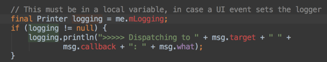

还没庆祝完，很快就有同事跟我吐槽一个问题：线上开启了这个监控模块，快速滑动时平均帧率起码降低5帧。我通过Traceview一看，发现是因为上面图中所示的大量字符串拼接导致性能损耗严重。

后来很快又想到了另外一个方案，可以通过一个监控线程，每隔1秒向主线程消息队列的头部插入一条空消息。假设1秒后这个消息并没有被主线程消费掉，说明阻塞消息运行的时间在0～1秒之间。换句话说，如果我们需要监控3秒卡顿，那在第4次轮询中头部消息依然没有被消费的话，就可以确定主线程出现了一次3秒以上的卡顿。

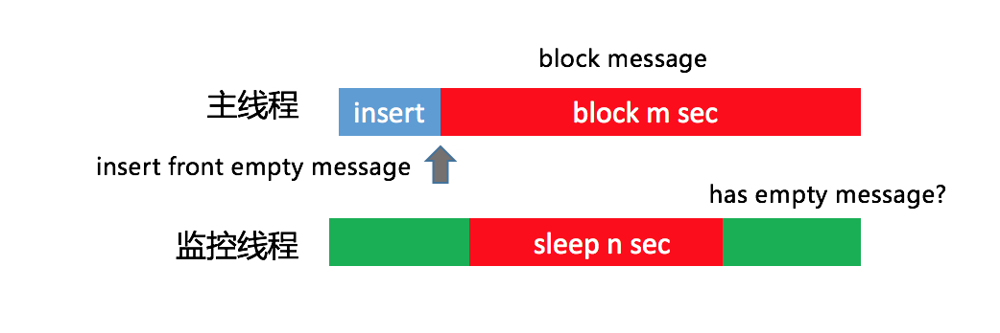

这个方案也存在一定的误差，那就是发送空消息的间隔时间。但这个间隔时间也不能太小，因为监控线程和主线程处理空消息都会带来一些性能损耗，但基本影响不大。

<strong>2. 插桩</strong>

不过在使用了一段时间之后，我感觉还是有那么一点不爽。基于消息队列的卡顿监控并不准确，正在运行的函数有可能并不是真正耗时的函数。这是为什么呢？

我画张图解释起来就清楚了。我们假设一个消息循环里面顺序执行了A、B、C三个函数，当整个消息执行超过3秒时，因为函数A和B已经执行完毕，我们只能得到的正在执行的函数C的堆栈，事实上它可能并不耗时。

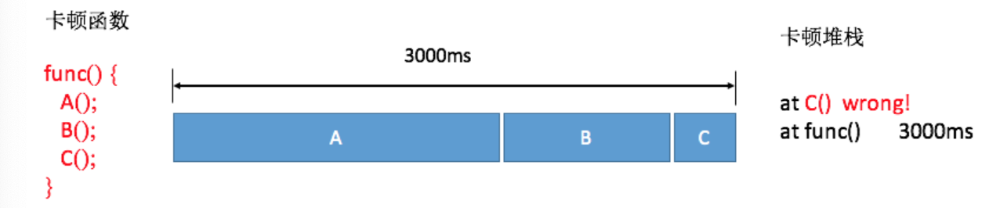

<strong>不过对于线上大数据来说，因为函数A和B相对比较耗时，所以抓取到它们的概率会更大一些，通过后台聚合后捕获到函数A和B的卡顿日志会更多一些。</strong>

这也是我们线上目前依然使用基于消息队列的方法，但是肯定希望可以做到跟Traceview一样，可以拿到整个卡顿过程所有运行函数的耗时，就像下面图中的结果，可以明确知道其实函数A和B才是造成卡顿的主要原因。

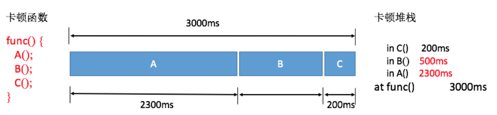

既然这样，那我们能否直接利用Android Runtime函数调用的回调事件，做一个自定义的Traceview++呢？

答案是可以的，但是需要使用Inline Hook技术。我们可以实现类似Nanoscope先写内存的方案，但考虑到兼容性问题，这套方案并没有用到线上。

对于大体量的应用，稳定性是第一考虑因素。那如果在编译过程插桩，兼容性问题肯定是OK的。上一讲讲到systrace可以通过插桩自动生成Trace Tag，我们一样也可以在函数入口和出口加入耗时监控的代码，但是需要考虑的细节有很多。

<ul>
<li>
<strong>避免方法数暴增</strong>。在函数的入口和出口应该插入相同的函数，在编译时提前给代码中每个方法分配一个独立的ID作为参数。
</li>

<li>
<strong>过滤简单的函数</strong>。过滤一些类似直接return、i++这样的简单函数，并且支持黑名单配置。对一些调用非常频繁的函数，需要添加到黑名单中来降低整个方案对性能的损耗。
</li>
</ul>

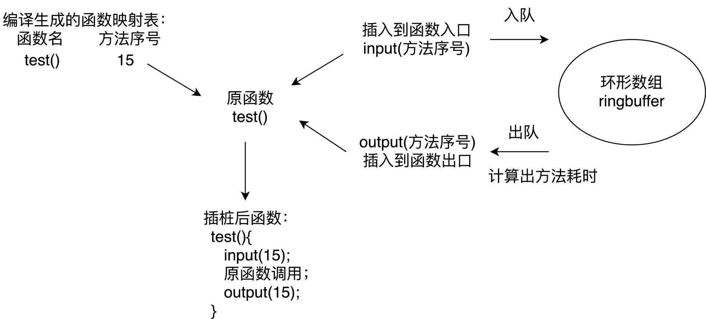

基于性能的考虑，线上只会监控主线程的耗时。微信的Matrix使用的就是这个方案，因为做了大量的优化，所以最终安装包体积只增大1～2%，平均帧率下降也在2帧以内。虽然插桩方案对性能的影响总体还可以接受，但只会在灰度包使用。

插桩方案看起来美好，它也有自己的短板，那就是只能监控应用内自身的函数耗时，无法监控系统的函数调用，整个堆栈看起来好像“缺失了”一部分。

<strong>3. Profilo</strong>

2018年3月，Facebook开源了一个叫<a href="https://github.com/facebookincubator/profilo" target="_blank">Profilo</a>的库，它收集了各大方案的优点，令我眼前一亮。具体来说有以下几点：

<strong>第一，集成atrace功能</strong>。ftrace所有性能埋点数据都会通过trace_marker文件写入内核缓冲区，Profilo通过PLT Hook拦截了写入操作，选择部分关心的事件做分析。这样所有systrace的探针我们都可以拿到，例如四大组件生命周期、锁等待时间、类校验、GC时间等。

<strong>不过大部分的atrace事件都比较笼统，从事件“B|pid|activityStart”，我们并不知道具体是哪个Activity的创建</strong>。同样我们可以统计GC相关事件的耗时，但是也不知道为什么发生了这次GC。

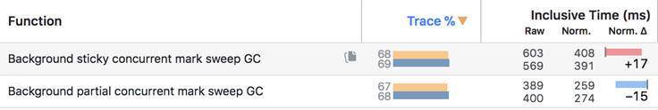

<strong>第二，快速获取Java堆栈</strong>。<strong>很多同学有一个误区，觉得在某个线程不断地获取主线程堆栈是不耗时的。但是事实上获取堆栈的代价是巨大的，它要暂停主线程的运行</strong>。

Profilo的实现非常精妙，它实现类似Native崩溃捕捉的方式快速获取Java堆栈，通过间隔发送SIGPROF信号，整个过程如下图所示。

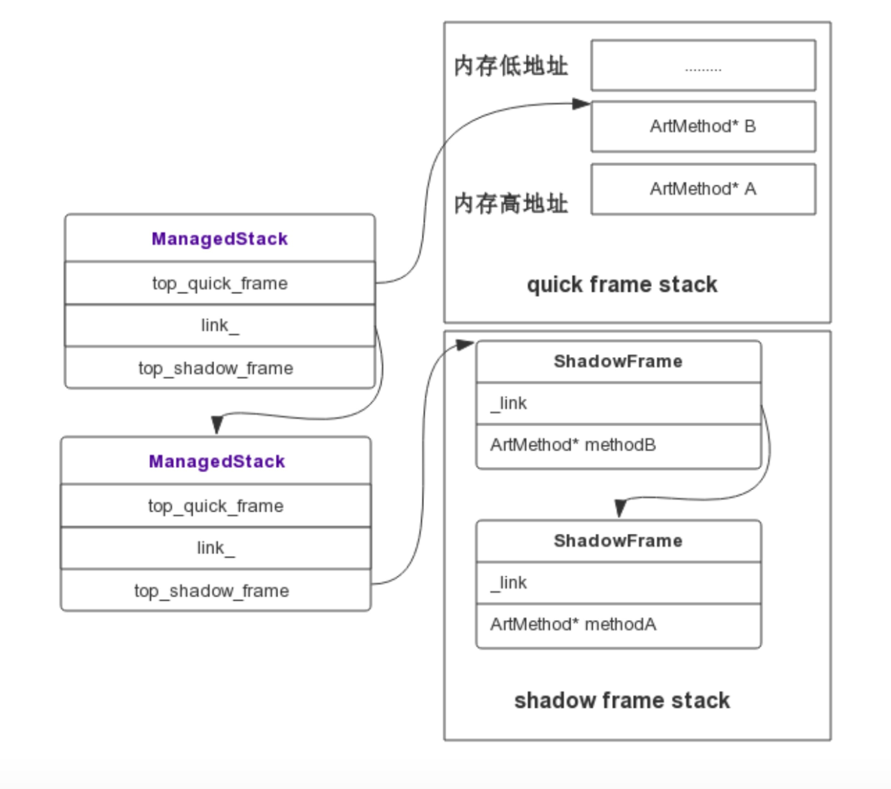

Signal Handler捕获到信号后，拿取到当前正在执行的Thread，通过Thread对象可以获取当前线程的ManagedStack，ManagedStack是一个单链表，它保存了当前的ShadowFrame或者QuickFrame栈指针，先依次遍历ManagedStack链表，然后遍历其内部的ShadowFrame或者QuickFrame还原一个可读的调用栈，从而unwind出当前的Java堆栈。通过这种方式，可以实现线程一边继续跑步，我们还可以帮它做检查，而且耗时基本忽略不计。代码可以参照：<a href="https://github.com/facebookincubator/profilo/blob/master/cpp/profiler/unwindc/android_712/arm/unwinder.h" target="_blank">Profilo::unwind</a>和<a href="http://androidxref.com/7.1.1_r6/xref/art/runtime/stack.cc#772" target="_blank">StackVisitor::WalkStack</a>。

不用插桩、性能基本没有影响、捕捉信息还全，那Profilo不就是完美的化身吗？当然由于它利用了大量的黑科技，兼容性是需要注意的问题。它内部实现有大量函数的Hook，unwind也需要强依赖Android Runtime实现。Facebook已经将Profilo投入到线上使用，但由于目前Profilo快速获取堆栈功能依然不支持Android 8.0和Android 9.0，鉴于稳定性问题，建议采取抽样部分用户的方式来开启该功能。

<strong>先小结一下，不管我们使用哪种卡顿监控方法，最后我们都可以得到卡顿时的堆栈和当时CPU运行的一些信息。大部分的卡顿问题都比较好定位，例如主线程执行一个耗时任务、读一个非常大的文件或者是执行网络请求等。</strong>

<h2 id="其他监控">其他监控</h2>

除了主线程的耗时过长之外，我们还有哪些卡顿问题需要关注呢？

Android Vitals是Google Play官方的性能监控服务，涉及卡顿相关的监控有ANR、启动、帧率三个。尤其是ANR监控，我们应该经常的来看看，主要是Google自己是有权限可以准确监控和上报ANR。

对于启动和帧率，Android Vitals只是上报了应用的区间分布，但是不能归纳出问题。这也是我们做性能优化时比较迷惑的一点，即使发现整体的帧率比过去降低了5帧，也并不知道是哪里造成的，还是要花很大的力气去做二次排查。

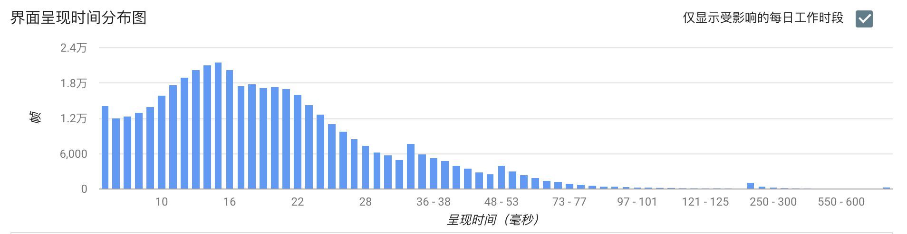

能不能做到跟崩溃、卡顿一样，直接给我一个堆栈，告诉我就是因为这里写的不好导致帧率下降了5帧。退一步说，如果做不到直接告诉我堆栈，能不能告诉我是因为聊天这个页面导致的帧率下降，让我缩小二次排查的范围。

<strong>1. 帧率</strong>

业界都使用Choreographer来监控应用的帧率。跟卡顿不同的是，需要排除掉页面没有操作的情况，我们应该只在<strong>界面存在绘制</strong>的时候才做统计。

那么如何监听界面是否存在绘制行为呢？可以通过addOnDrawListener实现。

<pre><code>getWindow().getDecorView().getViewTreeObserver().addOnDrawListener
</code></pre>

我们经常用平均帧率来衡量界面流畅度，但事实上电影的帧率才24帧，用户对于应用的平均帧率是40帧还是50帧并不一定可以感受出来。对于用户来说，感觉最明显的是连续丢帧情况，Android Vitals将连续丢帧超过700毫秒定义为冻帧，也就是连续丢帧42帧以上。

因此，我们可以统计更有价值的冻帧率。<strong>冻帧率就是计算发生冻帧时间在所有时间的占比</strong>。出现丢帧的时候，我们可以获取当前的页面信息、View信息和操作路径上报后台，降低二次排查的难度。

正如下图一样，我们还可以按照Activity、Fragment或者某个操作定义场景，通过细化不同场景的平均帧率和冻帧率，进一步细化问题排查的范围。

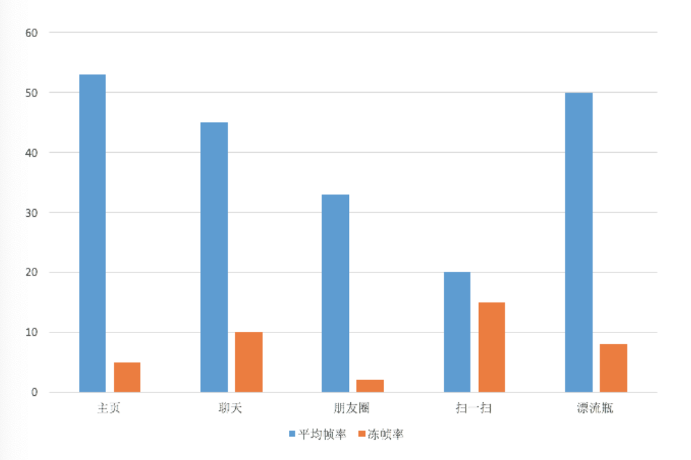

<strong>2. 生命周期监控</strong>

Activity、Service、Receiver组件生命周期的耗时和调用次数也是我们重点关注的性能问题。例如Activity的onCreate()不应该超过1秒，不然会影响用户看到页面的时间。Service和Receiver虽然是后台组件，不过它们生命周期也是占用主线程的，也是我们需要关注的问题。

对于组件生命周期我们应该采用更严格地监控，可以全量上报。在后台我们可以看到各个组件各个生命周期的启动时间和启动次数。

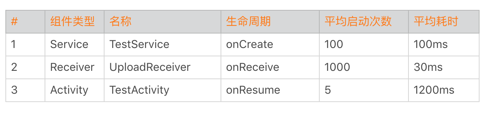

有一次我们发现有两个Service的启动次数是其他的10倍，经过排查发现是因为频繁的互相拉起导致。Receiver也是这样，而且它们都需要经过System Server。曾经有一个日志上报模块通过Broadcast来做跨进程通信，每秒发送几千次请求，导致系统System Server卡死。所以说每个组件各个生命周期的调用次数也是非常有参考价值的指标。

除了四大组件的生命周期，我们还需要监控各个进程生命周期的启动次数和耗时。通过下面的数据，我们可以看出某些进程是否频繁地拉起。

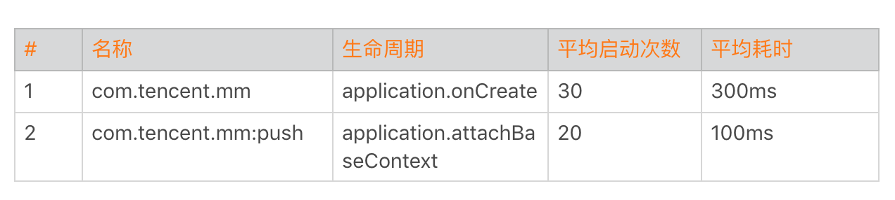

对于生命周期的监控实现，我们可以利用插件化技术Hook的方式。但是Android P之后，我还是不太推荐你使用这种方式。我更推荐使用编译时插桩的方式，<strong>后面我会讲到Aspect、ASM和ReDex三种插桩技术的实现，敬请期待。</strong>

<strong>3. 线程监控</strong>

Java线程管理是很多应用非常头痛的事情，应用启动过程就已经创建了几十上百个线程。而且大部分的线程都没有经过线程池管理，都在自由自在地狂奔着。

另外一方面某些线程优先级或者活跃度比较高，占用了过多的CPU。这会降低主线程UI响应能力，我们需要特别针对这些线程做重点的优化。

对于Java线程，总的来说我会监控以下两点。

<ul>
<li>
线程数量。需要监控线程数量的多少，以及创建线程的方式。例如有没有使用我们特有的线程池，这块可以通过got hook线程的nativeCreate()函数。主要用于进行线程收敛，也就是减少线程数量。
</li>

<li>
线程时间。监控线程的用户时间utime、系统时间stime和优先级。主要是看哪些线程utime+stime时间比较多，占用了过多的CPU。<strong>正如上一期“每课一练”所提到的，可能有一些线程因为生命周期很短导致很难发现，这里我们需要结合线程创建监控。</strong>
</li>
</ul>

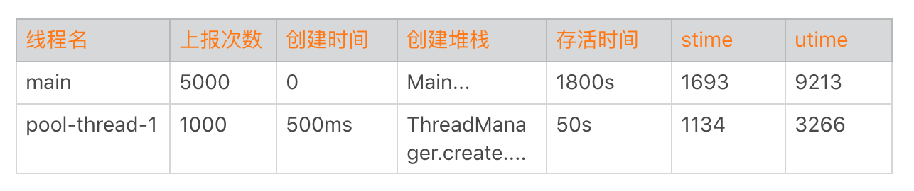

<strong>看到这里可能有同学会比较困惑，卡顿优化的主题就是监控吗？导致卡顿的原因会有很多，比如函数非常耗时、I/O非常慢、线程间的竞争或者锁等。其实很多时候卡顿问题并不难解决，相较解决来说，更困难的是如何快速发现这些卡顿点，以及通过更多的辅助信息找到真正的卡顿原因。</strong>

就跟在本地使用各种卡顿分析工具一样，卡顿优化的难点在于如何把它们移植到线上，以最少的性能代价获得更加丰富的卡顿信息。当然某些卡顿问题可能是I/O、存储或者网络引发的，后面会还有专门的内容来讲这些问题的优化方法。

<h2 id="总结">总结</h2>

今天我们学习了卡顿监控的几种方法。随着技术的深入，我们发现了旧方案的一些缺点，通过不断地迭代和演进，寻找更好的方案。

Facebook的Profilo实现了快速获取Java堆栈，其实它参考的是JVM的AsyncGetCallTrace思路，然后适配Android Runtime的实现。systrace使用的是Linux的ftrace，Simpleperf参考了Linux的perf工具。还是熟悉的配方，还是熟悉的味道，我们很多创新性的东西，其实还是基于Java和Linux十年前的产物。

还是回到我在专栏开篇词说过的，切记不要浮躁，多了解和学习一些底层的技术，对我们的成长会有很大帮助。<strong>日常开发中我们也不能只满足于完成需求就可以了，在实现上应该学会多去思考内存、卡顿这些影响性能的点，我们比别人多想一些、多做一些，自己的进步自然也会更快一些。</strong>

<h2 id="课后作业">课后作业</h2>

看完我分享的卡顿优化的方法后，相信你也肯定还有很多好的思路和方法，今天的课后作业是分享一下你的卡顿优化的“必杀技”，在留言区分享一下今天学习、练习的收获与心得。

<h2 id="课后练习">课后练习</h2>

我在上一期中提到过Linux的ftrace机制，而systrace正是利用这个系统机制实现的。而Profilo更是通过一些黑科技，实现了一个可以用于线上的“systrace”。那它究竟是怎么实现的呢？

通过今天这个<a href="https://github.com/AndroidAdvanceWithGeektime/Chapter06" target="_blank">Sample</a>，你可以学习到它的实现思路。当你对这些底层机制足够熟悉的时候，可能就不局限在本地使用，而是可以将它们搬到线上了。

当然，为了能更好地理解这个Sample，可能你还需要补充一些ftrace和atrace相关的背景知识。你会发现这些的确都是Linux十年前的一些知识，但时至今日它们依然非常有用。

1.<a href="http://www.ibm.com/developerworks/cn/linux/l-cn-ftrace/index.html" target="_blank">ftrace 简介</a>、<a href="http://www.ibm.com/developerworks/cn/linux/l-cn-ftrace1/index.html" target="_blank">ftrace使用（上）</a>、<a href="http://www.ibm.com/developerworks/cn/linux/l-cn-ftrace2/index.html" target="_blank">frace使用（下）</a>。

2.<a href="https://source.android.com/devices/tech/debug/ftrace" target="_blank">atrace介绍</a>、<a href="https://android.googlesource.com/platform/frameworks/native/+/master/cmds/atrace/atrace.cpp" target="_blank">atrace实现</a>。

欢迎你点击“请朋友读”，把今天的内容分享给好友，邀请他一起学习。最后别忘了在评论区提交今天的作业，我也为认真完成作业的同学准备了丰厚的“学习加油礼包”，期待与你一起切磋进步哦。

                        

                        

                            

                            

                            

                            

                        

                    

                

            

            

                

                
© 2019 - 2023 <a href="/cdn-cgi/l/email-protection#0d61616134393c3c3d3a4d6a606c6461236e6260" target="_blank">Liangliang Lee</a>.
                    Powered by <a href="https://github.com/gin-gonic/gin" target="_blank">gin</a> and <a
                        href="https://github.com/kaiiiz/hexo-theme-book" target="_blank">hexo-theme-book</a>.

            

        

        
    

</body>

</html>