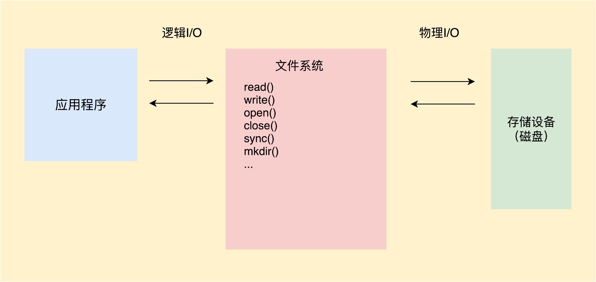
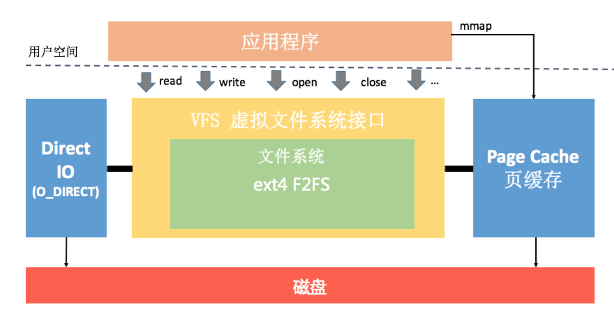
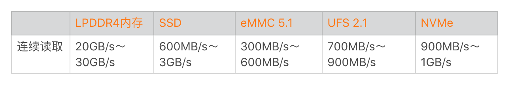
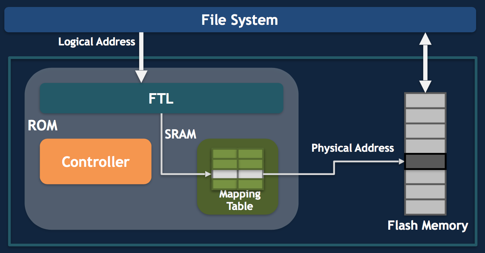
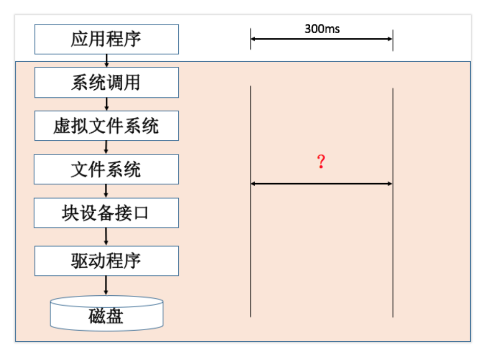
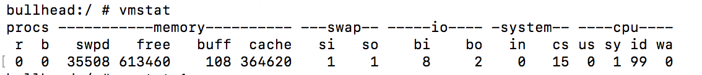

<!DOCTYPE html>
<html xmlns="http://www.w3.org/1999/xhtml">

<head>

    <head>
        <meta http-equiv="Content-Type" content="text/html; charset=UTF-8">
        <meta name="viewport" content="width=device-width, initial-scale=1, maximum-scale=1.0, user-scalable=no">
        <meta http-equiv='content-language' content='zh-cn'>
        <meta name='description' content=09&#32;I_O优化（上）：开发工程师必备的I_O优化知识>
        <link rel="icon" href="/static/favicon.png">
        <title>09 I_O优化（上）：开发工程师必备的I_O优化知识 </title>
        
        <link rel="stylesheet" href="/static/index.css">
        <link rel="stylesheet" href="/static/highlight.min.css">
        
        
        <meta name="generator" content="Hexo 4.2.0">
        
    </head>

<body>
    

        

            

                <a href="/">
                    
                    技术文章摘抄
                </a>
            

            

                <ul class="uncollapsible">
                    <li><a href="/" class="current-tab">首页</a></li>
                    <li><a href="../">上一级</a></li>
                </ul>
                <ul class="uncollapsible">
                    
                    <li>
                        <a class="menu-item" id="00 导读 如何打造高质量的应用？.md" href="/%e4%b8%93%e6%a0%8f/Android%e5%bc%80%e5%8f%91%e9%ab%98%e6%89%8b%e8%af%be/00%20%e5%af%bc%e8%af%bb%20%e5%a6%82%e4%bd%95%e6%89%93%e9%80%a0%e9%ab%98%e8%b4%a8%e9%87%8f%e7%9a%84%e5%ba%94%e7%94%a8%ef%bc%9f.md">00 导读 如何打造高质量的应用？.md</a>
                    </li>
                    
                    <li>
                        <a class="menu-item" id="00 开篇词 焦虑的移动开发者该如何破局？.md" href="/%e4%b8%93%e6%a0%8f/Android%e5%bc%80%e5%8f%91%e9%ab%98%e6%89%8b%e8%af%be/00%20%e5%bc%80%e7%af%87%e8%af%8d%20%e7%84%a6%e8%99%91%e7%9a%84%e7%a7%bb%e5%8a%a8%e5%bc%80%e5%8f%91%e8%80%85%e8%af%a5%e5%a6%82%e4%bd%95%e7%a0%b4%e5%b1%80%ef%bc%9f.md">00 开篇词 焦虑的移动开发者该如何破局？.md</a>
                    </li>
                    
                    <li>
                        <a class="menu-item" id="01 崩溃优化（上）：关于“崩溃”那些事儿.md" href="/%e4%b8%93%e6%a0%8f/Android%e5%bc%80%e5%8f%91%e9%ab%98%e6%89%8b%e8%af%be/01%20%e5%b4%a9%e6%ba%83%e4%bc%98%e5%8c%96%ef%bc%88%e4%b8%8a%ef%bc%89%ef%bc%9a%e5%85%b3%e4%ba%8e%e2%80%9c%e5%b4%a9%e6%ba%83%e2%80%9d%e9%82%a3%e4%ba%9b%e4%ba%8b%e5%84%bf.md">01 崩溃优化（上）：关于“崩溃”那些事儿.md</a>
                    </li>
                    
                    <li>
                        <a class="menu-item" id="02 崩溃优化（下）：应用崩溃了，你应该如何去分析？.md" href="/%e4%b8%93%e6%a0%8f/Android%e5%bc%80%e5%8f%91%e9%ab%98%e6%89%8b%e8%af%be/02%20%e5%b4%a9%e6%ba%83%e4%bc%98%e5%8c%96%ef%bc%88%e4%b8%8b%ef%bc%89%ef%bc%9a%e5%ba%94%e7%94%a8%e5%b4%a9%e6%ba%83%e4%ba%86%ef%bc%8c%e4%bd%a0%e5%ba%94%e8%af%a5%e5%a6%82%e4%bd%95%e5%8e%bb%e5%88%86%e6%9e%90%ef%bc%9f.md">02 崩溃优化（下）：应用崩溃了，你应该如何去分析？.md</a>
                    </li>
                    
                    <li>
                        <a class="menu-item" id="03 内存优化（上）：4GB内存时代，再谈内存优化.md" href="/%e4%b8%93%e6%a0%8f/Android%e5%bc%80%e5%8f%91%e9%ab%98%e6%89%8b%e8%af%be/03%20%e5%86%85%e5%ad%98%e4%bc%98%e5%8c%96%ef%bc%88%e4%b8%8a%ef%bc%89%ef%bc%9a4GB%e5%86%85%e5%ad%98%e6%97%b6%e4%bb%a3%ef%bc%8c%e5%86%8d%e8%b0%88%e5%86%85%e5%ad%98%e4%bc%98%e5%8c%96.md">03 内存优化（上）：4GB内存时代，再谈内存优化.md</a>
                    </li>
                    
                    <li>
                        <a class="menu-item" id="04 内存优化（下）：内存优化这件事，应该从哪里着手？.md" href="/%e4%b8%93%e6%a0%8f/Android%e5%bc%80%e5%8f%91%e9%ab%98%e6%89%8b%e8%af%be/04%20%e5%86%85%e5%ad%98%e4%bc%98%e5%8c%96%ef%bc%88%e4%b8%8b%ef%bc%89%ef%bc%9a%e5%86%85%e5%ad%98%e4%bc%98%e5%8c%96%e8%bf%99%e4%bb%b6%e4%ba%8b%ef%bc%8c%e5%ba%94%e8%af%a5%e4%bb%8e%e5%93%aa%e9%87%8c%e7%9d%80%e6%89%8b%ef%bc%9f.md">04 内存优化（下）：内存优化这件事，应该从哪里着手？.md</a>
                    </li>
                    
                    <li>
                        <a class="menu-item" id="05 卡顿优化（上）：你要掌握的卡顿分析方法.md" href="/%e4%b8%93%e6%a0%8f/Android%e5%bc%80%e5%8f%91%e9%ab%98%e6%89%8b%e8%af%be/05%20%e5%8d%a1%e9%a1%bf%e4%bc%98%e5%8c%96%ef%bc%88%e4%b8%8a%ef%bc%89%ef%bc%9a%e4%bd%a0%e8%a6%81%e6%8e%8c%e6%8f%a1%e7%9a%84%e5%8d%a1%e9%a1%bf%e5%88%86%e6%9e%90%e6%96%b9%e6%b3%95.md">05 卡顿优化（上）：你要掌握的卡顿分析方法.md</a>
                    </li>
                    
                    <li>
                        <a class="menu-item" id="06 卡顿优化（下）：如何监控应用卡顿？.md" href="/%e4%b8%93%e6%a0%8f/Android%e5%bc%80%e5%8f%91%e9%ab%98%e6%89%8b%e8%af%be/06%20%e5%8d%a1%e9%a1%bf%e4%bc%98%e5%8c%96%ef%bc%88%e4%b8%8b%ef%bc%89%ef%bc%9a%e5%a6%82%e4%bd%95%e7%9b%91%e6%8e%a7%e5%ba%94%e7%94%a8%e5%8d%a1%e9%a1%bf%ef%bc%9f.md">06 卡顿优化（下）：如何监控应用卡顿？.md</a>
                    </li>
                    
                    <li>
                        <a class="menu-item" id="06补充篇 卡顿优化：卡顿现场与卡顿分析.md" href="/%e4%b8%93%e6%a0%8f/Android%e5%bc%80%e5%8f%91%e9%ab%98%e6%89%8b%e8%af%be/06%e8%a1%a5%e5%85%85%e7%af%87%20%e5%8d%a1%e9%a1%bf%e4%bc%98%e5%8c%96%ef%bc%9a%e5%8d%a1%e9%a1%bf%e7%8e%b0%e5%9c%ba%e4%b8%8e%e5%8d%a1%e9%a1%bf%e5%88%86%e6%9e%90.md">06补充篇 卡顿优化：卡顿现场与卡顿分析.md</a>
                    </li>
                    
                    <li>
                        <a class="menu-item" id="07 启动优化（上）：从启动过程看启动速度优化.md" href="/%e4%b8%93%e6%a0%8f/Android%e5%bc%80%e5%8f%91%e9%ab%98%e6%89%8b%e8%af%be/07%20%e5%90%af%e5%8a%a8%e4%bc%98%e5%8c%96%ef%bc%88%e4%b8%8a%ef%bc%89%ef%bc%9a%e4%bb%8e%e5%90%af%e5%8a%a8%e8%bf%87%e7%a8%8b%e7%9c%8b%e5%90%af%e5%8a%a8%e9%80%9f%e5%ba%a6%e4%bc%98%e5%8c%96.md">07 启动优化（上）：从启动过程看启动速度优化.md</a>
                    </li>
                    
                    <li>
                        <a class="menu-item" id="08 启动优化（下）：优化启动速度的进阶方法.md" href="/%e4%b8%93%e6%a0%8f/Android%e5%bc%80%e5%8f%91%e9%ab%98%e6%89%8b%e8%af%be/08%20%e5%90%af%e5%8a%a8%e4%bc%98%e5%8c%96%ef%bc%88%e4%b8%8b%ef%bc%89%ef%bc%9a%e4%bc%98%e5%8c%96%e5%90%af%e5%8a%a8%e9%80%9f%e5%ba%a6%e7%9a%84%e8%bf%9b%e9%98%b6%e6%96%b9%e6%b3%95.md">08 启动优化（下）：优化启动速度的进阶方法.md</a>
                    </li>
                    
                    <li>
                        <a class="menu-item" id="09 I_O优化（上）：开发工程师必备的I_O优化知识.md" href="/%e4%b8%93%e6%a0%8f/Android%e5%bc%80%e5%8f%91%e9%ab%98%e6%89%8b%e8%af%be/09%20I_O%e4%bc%98%e5%8c%96%ef%bc%88%e4%b8%8a%ef%bc%89%ef%bc%9a%e5%bc%80%e5%8f%91%e5%b7%a5%e7%a8%8b%e5%b8%88%e5%bf%85%e5%a4%87%e7%9a%84I_O%e4%bc%98%e5%8c%96%e7%9f%a5%e8%af%86.md">09 I_O优化（上）：开发工程师必备的I_O优化知识.md</a>
                    </li>
                    
                    <li>
                        <a class="menu-item" id="10 I_O优化（中）：不同I_O方式的使用场景是什么？.md" href="/%e4%b8%93%e6%a0%8f/Android%e5%bc%80%e5%8f%91%e9%ab%98%e6%89%8b%e8%af%be/10%20I_O%e4%bc%98%e5%8c%96%ef%bc%88%e4%b8%ad%ef%bc%89%ef%bc%9a%e4%b8%8d%e5%90%8cI_O%e6%96%b9%e5%bc%8f%e7%9a%84%e4%bd%bf%e7%94%a8%e5%9c%ba%e6%99%af%e6%98%af%e4%bb%80%e4%b9%88%ef%bc%9f.md">10 I_O优化（中）：不同I_O方式的使用场景是什么？.md</a>
                    </li>
                    
                    <li>
                        <a class="menu-item" id="11 I_O优化（下）：如何监控线上I_O操作？.md" href="/%e4%b8%93%e6%a0%8f/Android%e5%bc%80%e5%8f%91%e9%ab%98%e6%89%8b%e8%af%be/11%20I_O%e4%bc%98%e5%8c%96%ef%bc%88%e4%b8%8b%ef%bc%89%ef%bc%9a%e5%a6%82%e4%bd%95%e7%9b%91%e6%8e%a7%e7%ba%bf%e4%b8%8aI_O%e6%93%8d%e4%bd%9c%ef%bc%9f.md">11 I_O优化（下）：如何监控线上I_O操作？.md</a>
                    </li>
                    
                    <li>
                        <a class="menu-item" id="12 存储优化（上）：常见的数据存储方法有哪些？.md" href="/%e4%b8%93%e6%a0%8f/Android%e5%bc%80%e5%8f%91%e9%ab%98%e6%89%8b%e8%af%be/12%20%e5%ad%98%e5%82%a8%e4%bc%98%e5%8c%96%ef%bc%88%e4%b8%8a%ef%bc%89%ef%bc%9a%e5%b8%b8%e8%a7%81%e7%9a%84%e6%95%b0%e6%8d%ae%e5%ad%98%e5%82%a8%e6%96%b9%e6%b3%95%e6%9c%89%e5%93%aa%e4%ba%9b%ef%bc%9f.md">12 存储优化（上）：常见的数据存储方法有哪些？.md</a>
                    </li>
                    
                    <li>
                        <a class="menu-item" id="13 存储优化（中）：如何优化数据存储？.md" href="/%e4%b8%93%e6%a0%8f/Android%e5%bc%80%e5%8f%91%e9%ab%98%e6%89%8b%e8%af%be/13%20%e5%ad%98%e5%82%a8%e4%bc%98%e5%8c%96%ef%bc%88%e4%b8%ad%ef%bc%89%ef%bc%9a%e5%a6%82%e4%bd%95%e4%bc%98%e5%8c%96%e6%95%b0%e6%8d%ae%e5%ad%98%e5%82%a8%ef%bc%9f.md">13 存储优化（中）：如何优化数据存储？.md</a>
                    </li>
                    
                    <li>
                        <a class="menu-item" id="14 存储优化（下）：数据库SQLite的使用和优化.md" href="/%e4%b8%93%e6%a0%8f/Android%e5%bc%80%e5%8f%91%e9%ab%98%e6%89%8b%e8%af%be/14%20%e5%ad%98%e5%82%a8%e4%bc%98%e5%8c%96%ef%bc%88%e4%b8%8b%ef%bc%89%ef%bc%9a%e6%95%b0%e6%8d%ae%e5%ba%93SQLite%e7%9a%84%e4%bd%bf%e7%94%a8%e5%92%8c%e4%bc%98%e5%8c%96.md">14 存储优化（下）：数据库SQLite的使用和优化.md</a>
                    </li>
                    
                    <li>
                        <a class="menu-item" id="15 网络优化（上）：移动开发工程师必备的网络优化知识.md" href="/%e4%b8%93%e6%a0%8f/Android%e5%bc%80%e5%8f%91%e9%ab%98%e6%89%8b%e8%af%be/15%20%e7%bd%91%e7%bb%9c%e4%bc%98%e5%8c%96%ef%bc%88%e4%b8%8a%ef%bc%89%ef%bc%9a%e7%a7%bb%e5%8a%a8%e5%bc%80%e5%8f%91%e5%b7%a5%e7%a8%8b%e5%b8%88%e5%bf%85%e5%a4%87%e7%9a%84%e7%bd%91%e7%bb%9c%e4%bc%98%e5%8c%96%e7%9f%a5%e8%af%86.md">15 网络优化（上）：移动开发工程师必备的网络优化知识.md</a>
                    </li>
                    
                    <li>
                        <a class="menu-item" id="16 网络优化（中）：复杂多变的移动网络该如何优化？.md" href="/%e4%b8%93%e6%a0%8f/Android%e5%bc%80%e5%8f%91%e9%ab%98%e6%89%8b%e8%af%be/16%20%e7%bd%91%e7%bb%9c%e4%bc%98%e5%8c%96%ef%bc%88%e4%b8%ad%ef%bc%89%ef%bc%9a%e5%a4%8d%e6%9d%82%e5%a4%9a%e5%8f%98%e7%9a%84%e7%a7%bb%e5%8a%a8%e7%bd%91%e7%bb%9c%e8%af%a5%e5%a6%82%e4%bd%95%e4%bc%98%e5%8c%96%ef%bc%9f.md">16 网络优化（中）：复杂多变的移动网络该如何优化？.md</a>
                    </li>
                    
                    <li>
                        <a class="menu-item" id="17 网络优化（下）：大数据下网络该如何监控？.md" href="/%e4%b8%93%e6%a0%8f/Android%e5%bc%80%e5%8f%91%e9%ab%98%e6%89%8b%e8%af%be/17%20%e7%bd%91%e7%bb%9c%e4%bc%98%e5%8c%96%ef%bc%88%e4%b8%8b%ef%bc%89%ef%bc%9a%e5%a4%a7%e6%95%b0%e6%8d%ae%e4%b8%8b%e7%bd%91%e7%bb%9c%e8%af%a5%e5%a6%82%e4%bd%95%e7%9b%91%e6%8e%a7%ef%bc%9f.md">17 网络优化（下）：大数据下网络该如何监控？.md</a>
                    </li>
                    
                    <li>
                        <a class="menu-item" id="18 耗电优化（上）：从电量优化的演进看耗电分析.md" href="/%e4%b8%93%e6%a0%8f/Android%e5%bc%80%e5%8f%91%e9%ab%98%e6%89%8b%e8%af%be/18%20%e8%80%97%e7%94%b5%e4%bc%98%e5%8c%96%ef%bc%88%e4%b8%8a%ef%bc%89%ef%bc%9a%e4%bb%8e%e7%94%b5%e9%87%8f%e4%bc%98%e5%8c%96%e7%9a%84%e6%bc%94%e8%bf%9b%e7%9c%8b%e8%80%97%e7%94%b5%e5%88%86%e6%9e%90.md">18 耗电优化（上）：从电量优化的演进看耗电分析.md</a>
                    </li>
                    
                    <li>
                        <a class="menu-item" id="19 耗电优化（下）：耗电的优化方法与线上监控.md" href="/%e4%b8%93%e6%a0%8f/Android%e5%bc%80%e5%8f%91%e9%ab%98%e6%89%8b%e8%af%be/19%20%e8%80%97%e7%94%b5%e4%bc%98%e5%8c%96%ef%bc%88%e4%b8%8b%ef%bc%89%ef%bc%9a%e8%80%97%e7%94%b5%e7%9a%84%e4%bc%98%e5%8c%96%e6%96%b9%e6%b3%95%e4%b8%8e%e7%ba%bf%e4%b8%8a%e7%9b%91%e6%8e%a7.md">19 耗电优化（下）：耗电的优化方法与线上监控.md</a>
                    </li>
                    
                    <li>
                        <a class="menu-item" id="20 UI 优化（上）：UI 渲染的几个关键概念.md" href="/%e4%b8%93%e6%a0%8f/Android%e5%bc%80%e5%8f%91%e9%ab%98%e6%89%8b%e8%af%be/20%20UI%20%e4%bc%98%e5%8c%96%ef%bc%88%e4%b8%8a%ef%bc%89%ef%bc%9aUI%20%e6%b8%b2%e6%9f%93%e7%9a%84%e5%87%a0%e4%b8%aa%e5%85%b3%e9%94%ae%e6%a6%82%e5%bf%b5.md">20 UI 优化（上）：UI 渲染的几个关键概念.md</a>
                    </li>
                    
                    <li>
                        <a class="menu-item" id="21 UI 优化（下）：如何优化 UI 渲染？.md" href="/%e4%b8%93%e6%a0%8f/Android%e5%bc%80%e5%8f%91%e9%ab%98%e6%89%8b%e8%af%be/21%20UI%20%e4%bc%98%e5%8c%96%ef%bc%88%e4%b8%8b%ef%bc%89%ef%bc%9a%e5%a6%82%e4%bd%95%e4%bc%98%e5%8c%96%20UI%20%e6%b8%b2%e6%9f%93%ef%bc%9f.md">21 UI 优化（下）：如何优化 UI 渲染？.md</a>
                    </li>
                    
                    <li>
                        <a class="menu-item" id="22 包体积优化（上）：如何减少安装包大小？.md" href="/%e4%b8%93%e6%a0%8f/Android%e5%bc%80%e5%8f%91%e9%ab%98%e6%89%8b%e8%af%be/22%20%e5%8c%85%e4%bd%93%e7%a7%af%e4%bc%98%e5%8c%96%ef%bc%88%e4%b8%8a%ef%bc%89%ef%bc%9a%e5%a6%82%e4%bd%95%e5%87%8f%e5%b0%91%e5%ae%89%e8%a3%85%e5%8c%85%e5%a4%a7%e5%b0%8f%ef%bc%9f.md">22 包体积优化（上）：如何减少安装包大小？.md</a>
                    </li>
                    
                    <li>
                        <a class="menu-item" id="23 包体积优化（下）：资源优化的进阶实践.md" href="/%e4%b8%93%e6%a0%8f/Android%e5%bc%80%e5%8f%91%e9%ab%98%e6%89%8b%e8%af%be/23%20%e5%8c%85%e4%bd%93%e7%a7%af%e4%bc%98%e5%8c%96%ef%bc%88%e4%b8%8b%ef%bc%89%ef%bc%9a%e8%b5%84%e6%ba%90%e4%bc%98%e5%8c%96%e7%9a%84%e8%bf%9b%e9%98%b6%e5%ae%9e%e8%b7%b5.md">23 包体积优化（下）：资源优化的进阶实践.md</a>
                    </li>
                    
                    <li>
                        <a class="menu-item" id="24 想成为Android高手，你需要先搞定这三个问题.md" href="/%e4%b8%93%e6%a0%8f/Android%e5%bc%80%e5%8f%91%e9%ab%98%e6%89%8b%e8%af%be/24%20%e6%83%b3%e6%88%90%e4%b8%baAndroid%e9%ab%98%e6%89%8b%ef%bc%8c%e4%bd%a0%e9%9c%80%e8%a6%81%e5%85%88%e6%90%9e%e5%ae%9a%e8%bf%99%e4%b8%89%e4%b8%aa%e9%97%ae%e9%a2%98.md">24 想成为Android高手，你需要先搞定这三个问题.md</a>
                    </li>
                    
                    <li>
                        <a class="menu-item" id="25 如何提升组织与个人的研发效能？.md" href="/%e4%b8%93%e6%a0%8f/Android%e5%bc%80%e5%8f%91%e9%ab%98%e6%89%8b%e8%af%be/25%20%e5%a6%82%e4%bd%95%e6%8f%90%e5%8d%87%e7%bb%84%e7%bb%87%e4%b8%8e%e4%b8%aa%e4%ba%ba%e7%9a%84%e7%a0%94%e5%8f%91%e6%95%88%e8%83%bd%ef%bc%9f.md">25 如何提升组织与个人的研发效能？.md</a>
                    </li>
                    
                    <li>
                        <a class="menu-item" id="26 关于编译，你需要了解什么？.md" href="/%e4%b8%93%e6%a0%8f/Android%e5%bc%80%e5%8f%91%e9%ab%98%e6%89%8b%e8%af%be/26%20%e5%85%b3%e4%ba%8e%e7%bc%96%e8%af%91%ef%bc%8c%e4%bd%a0%e9%9c%80%e8%a6%81%e4%ba%86%e8%a7%a3%e4%bb%80%e4%b9%88%ef%bc%9f.md">26 关于编译，你需要了解什么？.md</a>
                    </li>
                    
                    <li>
                        <a class="menu-item" id="27 编译插桩的三种方法：AspectJ、ASM、ReDex.md" href="/%e4%b8%93%e6%a0%8f/Android%e5%bc%80%e5%8f%91%e9%ab%98%e6%89%8b%e8%af%be/27%20%e7%bc%96%e8%af%91%e6%8f%92%e6%a1%a9%e7%9a%84%e4%b8%89%e7%a7%8d%e6%96%b9%e6%b3%95%ef%bc%9aAspectJ%e3%80%81ASM%e3%80%81ReDex.md">27 编译插桩的三种方法：AspectJ、ASM、ReDex.md</a>
                    </li>
                    
                    <li>
                        <a class="menu-item" id="28 大数据与AI，如何高效地测试？.md" href="/%e4%b8%93%e6%a0%8f/Android%e5%bc%80%e5%8f%91%e9%ab%98%e6%89%8b%e8%af%be/28%20%e5%a4%a7%e6%95%b0%e6%8d%ae%e4%b8%8eAI%ef%bc%8c%e5%a6%82%e4%bd%95%e9%ab%98%e6%95%88%e5%9c%b0%e6%b5%8b%e8%af%95%ef%bc%9f.md">28 大数据与AI，如何高效地测试？.md</a>
                    </li>
                    
                    <li>
                        <a class="menu-item" id="29 从每月到每天，如何给版本发布提速？.md" href="/%e4%b8%93%e6%a0%8f/Android%e5%bc%80%e5%8f%91%e9%ab%98%e6%89%8b%e8%af%be/29%20%e4%bb%8e%e6%af%8f%e6%9c%88%e5%88%b0%e6%af%8f%e5%a4%a9%ef%bc%8c%e5%a6%82%e4%bd%95%e7%bb%99%e7%89%88%e6%9c%ac%e5%8f%91%e5%b8%83%e6%8f%90%e9%80%9f%ef%bc%9f.md">29 从每月到每天，如何给版本发布提速？.md</a>
                    </li>
                    
                    <li>
                        <a class="menu-item" id="30 数据评估（上）：如何实现高可用的上报组件？.md" href="/%e4%b8%93%e6%a0%8f/Android%e5%bc%80%e5%8f%91%e9%ab%98%e6%89%8b%e8%af%be/30%20%e6%95%b0%e6%8d%ae%e8%af%84%e4%bc%b0%ef%bc%88%e4%b8%8a%ef%bc%89%ef%bc%9a%e5%a6%82%e4%bd%95%e5%ae%9e%e7%8e%b0%e9%ab%98%e5%8f%af%e7%94%a8%e7%9a%84%e4%b8%8a%e6%8a%a5%e7%bb%84%e4%bb%b6%ef%bc%9f.md">30 数据评估（上）：如何实现高可用的上报组件？.md</a>
                    </li>
                    
                    <li>
                        <a class="menu-item" id="31 数据评估（下）：什么是大数据平台？.md" href="/%e4%b8%93%e6%a0%8f/Android%e5%bc%80%e5%8f%91%e9%ab%98%e6%89%8b%e8%af%be/31%20%e6%95%b0%e6%8d%ae%e8%af%84%e4%bc%b0%ef%bc%88%e4%b8%8b%ef%bc%89%ef%bc%9a%e4%bb%80%e4%b9%88%e6%98%af%e5%a4%a7%e6%95%b0%e6%8d%ae%e5%b9%b3%e5%8f%b0%ef%bc%9f.md">31 数据评估（下）：什么是大数据平台？.md</a>
                    </li>
                    
                    <li>
                        <a class="menu-item" id="32 线上疑难问题该如何排查和跟踪？.md" href="/%e4%b8%93%e6%a0%8f/Android%e5%bc%80%e5%8f%91%e9%ab%98%e6%89%8b%e8%af%be/32%20%e7%ba%bf%e4%b8%8a%e7%96%91%e9%9a%be%e9%97%ae%e9%a2%98%e8%af%a5%e5%a6%82%e4%bd%95%e6%8e%92%e6%9f%a5%e5%92%8c%e8%b7%9f%e8%b8%aa%ef%bc%9f.md">32 线上疑难问题该如何排查和跟踪？.md</a>
                    </li>
                    
                    <li>
                        <a class="menu-item" id="33 做一名有高度的移动开发工程师.md" href="/%e4%b8%93%e6%a0%8f/Android%e5%bc%80%e5%8f%91%e9%ab%98%e6%89%8b%e8%af%be/33%20%e5%81%9a%e4%b8%80%e5%90%8d%e6%9c%89%e9%ab%98%e5%ba%a6%e7%9a%84%e7%a7%bb%e5%8a%a8%e5%bc%80%e5%8f%91%e5%b7%a5%e7%a8%8b%e5%b8%88.md">33 做一名有高度的移动开发工程师.md</a>
                    </li>
                    
                    <li>
                        <a class="menu-item" id="34 聊聊重构：优秀的架构都是演进而来的.md" href="/%e4%b8%93%e6%a0%8f/Android%e5%bc%80%e5%8f%91%e9%ab%98%e6%89%8b%e8%af%be/34%20%e8%81%8a%e8%81%8a%e9%87%8d%e6%9e%84%ef%bc%9a%e4%bc%98%e7%a7%80%e7%9a%84%e6%9e%b6%e6%9e%84%e9%83%bd%e6%98%af%e6%bc%94%e8%bf%9b%e8%80%8c%e6%9d%a5%e7%9a%84.md">34 聊聊重构：优秀的架构都是演进而来的.md</a>
                    </li>
                    
                    <li>
                        <a class="menu-item" id="35 Native Hook 技术，天使还是魔鬼？.md" href="/%e4%b8%93%e6%a0%8f/Android%e5%bc%80%e5%8f%91%e9%ab%98%e6%89%8b%e8%af%be/35%20Native%20Hook%20%e6%8a%80%e6%9c%af%ef%bc%8c%e5%a4%a9%e4%bd%bf%e8%bf%98%e6%98%af%e9%ad%94%e9%ac%bc%ef%bc%9f.md">35 Native Hook 技术，天使还是魔鬼？.md</a>
                    </li>
                    
                    <li>
                        <a class="menu-item" id="36 跨平台开发的现状与应用.md" href="/%e4%b8%93%e6%a0%8f/Android%e5%bc%80%e5%8f%91%e9%ab%98%e6%89%8b%e8%af%be/36%20%e8%b7%a8%e5%b9%b3%e5%8f%b0%e5%bc%80%e5%8f%91%e7%9a%84%e7%8e%b0%e7%8a%b6%e4%b8%8e%e5%ba%94%e7%94%a8.md">36 跨平台开发的现状与应用.md</a>
                    </li>
                    
                    <li>
                        <a class="menu-item" id="37 移动开发新大陆：工作三年半，移动开发转型手游开发.md" href="/%e4%b8%93%e6%a0%8f/Android%e5%bc%80%e5%8f%91%e9%ab%98%e6%89%8b%e8%af%be/37%20%e7%a7%bb%e5%8a%a8%e5%bc%80%e5%8f%91%e6%96%b0%e5%a4%a7%e9%99%86%ef%bc%9a%e5%b7%a5%e4%bd%9c%e4%b8%89%e5%b9%b4%e5%8d%8a%ef%bc%8c%e7%a7%bb%e5%8a%a8%e5%bc%80%e5%8f%91%e8%bd%ac%e5%9e%8b%e6%89%8b%e6%b8%b8%e5%bc%80%e5%8f%91.md">37 移动开发新大陆：工作三年半，移动开发转型手游开发.md</a>
                    </li>
                    
                    <li>
                        <a class="menu-item" id="38 移动开发新大陆：Android音视频开发.md" href="/%e4%b8%93%e6%a0%8f/Android%e5%bc%80%e5%8f%91%e9%ab%98%e6%89%8b%e8%af%be/38%20%e7%a7%bb%e5%8a%a8%e5%bc%80%e5%8f%91%e6%96%b0%e5%a4%a7%e9%99%86%ef%bc%9aAndroid%e9%9f%b3%e8%a7%86%e9%a2%91%e5%bc%80%e5%8f%91.md">38 移动开发新大陆：Android音视频开发.md</a>
                    </li>
                    
                    <li>
                        <a class="menu-item" id="39 移动开发新大陆： 边缘智能计算的趋势.md" href="/%e4%b8%93%e6%a0%8f/Android%e5%bc%80%e5%8f%91%e9%ab%98%e6%89%8b%e8%af%be/39%20%e7%a7%bb%e5%8a%a8%e5%bc%80%e5%8f%91%e6%96%b0%e5%a4%a7%e9%99%86%ef%bc%9a%20%e8%be%b9%e7%bc%98%e6%99%ba%e8%83%bd%e8%ae%a1%e7%ae%97%e7%9a%84%e8%b6%8b%e5%8a%bf.md">39 移动开发新大陆： 边缘智能计算的趋势.md</a>
                    </li>
                    
                    <li>
                        <a class="menu-item" id="40 动态化实践，如何选择适合自己的方案？.md" href="/%e4%b8%93%e6%a0%8f/Android%e5%bc%80%e5%8f%91%e9%ab%98%e6%89%8b%e8%af%be/40%20%e5%8a%a8%e6%80%81%e5%8c%96%e5%ae%9e%e8%b7%b5%ef%bc%8c%e5%a6%82%e4%bd%95%e9%80%89%e6%8b%a9%e9%80%82%e5%90%88%e8%87%aa%e5%b7%b1%e7%9a%84%e6%96%b9%e6%a1%88%ef%bc%9f.md">40 动态化实践，如何选择适合自己的方案？.md</a>
                    </li>
                    
                    <li>
                        <a class="menu-item" id="41 聊聊Flutter，面对层出不穷的新技术该如何跟进？.md" href="/%e4%b8%93%e6%a0%8f/Android%e5%bc%80%e5%8f%91%e9%ab%98%e6%89%8b%e8%af%be/41%20%e8%81%8a%e8%81%8aFlutter%ef%bc%8c%e9%9d%a2%e5%af%b9%e5%b1%82%e5%87%ba%e4%b8%8d%e7%a9%b7%e7%9a%84%e6%96%b0%e6%8a%80%e6%9c%af%e8%af%a5%e5%a6%82%e4%bd%95%e8%b7%9f%e8%bf%9b%ef%bc%9f.md">41 聊聊Flutter，面对层出不穷的新技术该如何跟进？.md</a>
                    </li>
                    
                    <li>
                        <a class="menu-item" id="42 Android开发高手课学习心得.md" href="/%e4%b8%93%e6%a0%8f/Android%e5%bc%80%e5%8f%91%e9%ab%98%e6%89%8b%e8%af%be/42%20Android%e5%bc%80%e5%8f%91%e9%ab%98%e6%89%8b%e8%af%be%e5%ad%a6%e4%b9%a0%e5%bf%83%e5%be%97.md">42 Android开发高手课学习心得.md</a>
                    </li>
                    
                    <li>
                        <a class="menu-item" id="Android JVM TI机制详解（内含福利彩蛋）.md" href="/%e4%b8%93%e6%a0%8f/Android%e5%bc%80%e5%8f%91%e9%ab%98%e6%89%8b%e8%af%be/Android%20JVM%20TI%e6%9c%ba%e5%88%b6%e8%af%a6%e8%a7%a3%ef%bc%88%e5%86%85%e5%90%ab%e7%a6%8f%e5%88%a9%e5%bd%a9%e8%9b%8b%ef%bc%89.md">Android JVM TI机制详解（内含福利彩蛋）.md</a>
                    </li>
                    
                    <li>
                        <a class="menu-item" id="Android工程师的“面试指南”.md" href="/%e4%b8%93%e6%a0%8f/Android%e5%bc%80%e5%8f%91%e9%ab%98%e6%89%8b%e8%af%be/Android%e5%b7%a5%e7%a8%8b%e5%b8%88%e7%9a%84%e2%80%9c%e9%9d%a2%e8%af%95%e6%8c%87%e5%8d%97%e2%80%9d.md">Android工程师的“面试指南”.md</a>
                    </li>
                    
                    <li>
                        <a class="menu-item" id="Native下如何获取调用栈？.md" href="/%e4%b8%93%e6%a0%8f/Android%e5%bc%80%e5%8f%91%e9%ab%98%e6%89%8b%e8%af%be/Native%e4%b8%8b%e5%a6%82%e4%bd%95%e8%8e%b7%e5%8f%96%e8%b0%83%e7%94%a8%e6%a0%88%ef%bc%9f.md">Native下如何获取调用栈？.md</a>
                    </li>
                    
                    <li>
                        <a class="menu-item" id="专栏学得苦？可能你还需要一份配套学习书单.md" href="/%e4%b8%93%e6%a0%8f/Android%e5%bc%80%e5%8f%91%e9%ab%98%e6%89%8b%e8%af%be/%e4%b8%93%e6%a0%8f%e5%ad%a6%e5%be%97%e8%8b%a6%ef%bc%9f%e5%8f%af%e8%83%bd%e4%bd%a0%e8%bf%98%e9%9c%80%e8%a6%81%e4%b8%80%e4%bb%bd%e9%85%8d%e5%a5%97%e5%ad%a6%e4%b9%a0%e4%b9%a6%e5%8d%95.md">专栏学得苦？可能你还需要一份配套学习书单.md</a>
                    </li>
                    
                    <li>
                        <a class="menu-item" id="专栏学得苦？可能是方法没找对.md" href="/%e4%b8%93%e6%a0%8f/Android%e5%bc%80%e5%8f%91%e9%ab%98%e6%89%8b%e8%af%be/%e4%b8%93%e6%a0%8f%e5%ad%a6%e5%be%97%e8%8b%a6%ef%bc%9f%e5%8f%af%e8%83%bd%e6%98%af%e6%96%b9%e6%b3%95%e6%b2%a1%e6%89%be%e5%af%b9.md">专栏学得苦？可能是方法没找对.md</a>
                    </li>
                    
                    <li>
                        <a class="menu-item" id="程序员修炼之路 设计能力的提升途径.md" href="/%e4%b8%93%e6%a0%8f/Android%e5%bc%80%e5%8f%91%e9%ab%98%e6%89%8b%e8%af%be/%e7%a8%8b%e5%ba%8f%e5%91%98%e4%bf%ae%e7%82%bc%e4%b9%8b%e8%b7%af%20%e8%ae%be%e8%ae%a1%e8%83%bd%e5%8a%9b%e7%9a%84%e6%8f%90%e5%8d%87%e9%80%94%e5%be%84.md">程序员修炼之路 设计能力的提升途径.md</a>
                    </li>
                    
                    <li>
                        <a class="menu-item" id="练习Sample跑起来 ASM插桩强化练习.md" href="/%e4%b8%93%e6%a0%8f/Android%e5%bc%80%e5%8f%91%e9%ab%98%e6%89%8b%e8%af%be/%e7%bb%83%e4%b9%a0Sample%e8%b7%91%e8%b5%b7%e6%9d%a5%20ASM%e6%8f%92%e6%a1%a9%e5%bc%ba%e5%8c%96%e7%bb%83%e4%b9%a0.md">练习Sample跑起来 ASM插桩强化练习.md</a>
                    </li>
                    
                    <li>
                        <a class="menu-item" id="练习Sample跑起来 唯鹿同学的练习手记 第1辑.md" href="/%e4%b8%93%e6%a0%8f/Android%e5%bc%80%e5%8f%91%e9%ab%98%e6%89%8b%e8%af%be/%e7%bb%83%e4%b9%a0Sample%e8%b7%91%e8%b5%b7%e6%9d%a5%20%e5%94%af%e9%b9%bf%e5%90%8c%e5%ad%a6%e7%9a%84%e7%bb%83%e4%b9%a0%e6%89%8b%e8%ae%b0%20%e7%ac%ac1%e8%be%91.md">练习Sample跑起来 唯鹿同学的练习手记 第1辑.md</a>
                    </li>
                    
                    <li>
                        <a class="menu-item" id="练习Sample跑起来 唯鹿同学的练习手记 第2辑.md" href="/%e4%b8%93%e6%a0%8f/Android%e5%bc%80%e5%8f%91%e9%ab%98%e6%89%8b%e8%af%be/%e7%bb%83%e4%b9%a0Sample%e8%b7%91%e8%b5%b7%e6%9d%a5%20%e5%94%af%e9%b9%bf%e5%90%8c%e5%ad%a6%e7%9a%84%e7%bb%83%e4%b9%a0%e6%89%8b%e8%ae%b0%20%e7%ac%ac2%e8%be%91.md">练习Sample跑起来 唯鹿同学的练习手记 第2辑.md</a>
                    </li>
                    
                    <li>
                        <a class="menu-item" id="练习Sample跑起来 唯鹿同学的练习手记 第3辑.md" href="/%e4%b8%93%e6%a0%8f/Android%e5%bc%80%e5%8f%91%e9%ab%98%e6%89%8b%e8%af%be/%e7%bb%83%e4%b9%a0Sample%e8%b7%91%e8%b5%b7%e6%9d%a5%20%e5%94%af%e9%b9%bf%e5%90%8c%e5%ad%a6%e7%9a%84%e7%bb%83%e4%b9%a0%e6%89%8b%e8%ae%b0%20%e7%ac%ac3%e8%be%91.md">练习Sample跑起来 唯鹿同学的练习手记 第3辑.md</a>
                    </li>
                    
                    <li>
                        <a class="menu-item" id="练习Sample跑起来 热点问题答疑第1期.md" href="/%e4%b8%93%e6%a0%8f/Android%e5%bc%80%e5%8f%91%e9%ab%98%e6%89%8b%e8%af%be/%e7%bb%83%e4%b9%a0Sample%e8%b7%91%e8%b5%b7%e6%9d%a5%20%e7%83%ad%e7%82%b9%e9%97%ae%e9%a2%98%e7%ad%94%e7%96%91%e7%ac%ac1%e6%9c%9f.md">练习Sample跑起来 热点问题答疑第1期.md</a>
                    </li>
                    
                    <li>
                        <a class="menu-item" id="练习Sample跑起来 热点问题答疑第2期.md" href="/%e4%b8%93%e6%a0%8f/Android%e5%bc%80%e5%8f%91%e9%ab%98%e6%89%8b%e8%af%be/%e7%bb%83%e4%b9%a0Sample%e8%b7%91%e8%b5%b7%e6%9d%a5%20%e7%83%ad%e7%82%b9%e9%97%ae%e9%a2%98%e7%ad%94%e7%96%91%e7%ac%ac2%e6%9c%9f.md">练习Sample跑起来 热点问题答疑第2期.md</a>
                    </li>
                    
                    <li>
                        <a class="menu-item" id="练习Sample跑起来 热点问题答疑第3期.md" href="/%e4%b8%93%e6%a0%8f/Android%e5%bc%80%e5%8f%91%e9%ab%98%e6%89%8b%e8%af%be/%e7%bb%83%e4%b9%a0Sample%e8%b7%91%e8%b5%b7%e6%9d%a5%20%e7%83%ad%e7%82%b9%e9%97%ae%e9%a2%98%e7%ad%94%e7%96%91%e7%ac%ac3%e6%9c%9f.md">练习Sample跑起来 热点问题答疑第3期.md</a>
                    </li>
                    
                    <li>
                        <a class="menu-item" id="练习Sample跑起来 热点问题答疑第4期.md" href="/%e4%b8%93%e6%a0%8f/Android%e5%bc%80%e5%8f%91%e9%ab%98%e6%89%8b%e8%af%be/%e7%bb%83%e4%b9%a0Sample%e8%b7%91%e8%b5%b7%e6%9d%a5%20%e7%83%ad%e7%82%b9%e9%97%ae%e9%a2%98%e7%ad%94%e7%96%91%e7%ac%ac4%e6%9c%9f.md">练习Sample跑起来 热点问题答疑第4期.md</a>
                    </li>
                    
                    <li>
                        <a class="menu-item" id="结束语 移动开发的今天和明天.md" href="/%e4%b8%93%e6%a0%8f/Android%e5%bc%80%e5%8f%91%e9%ab%98%e6%89%8b%e8%af%be/%e7%bb%93%e6%9d%9f%e8%af%ad%20%e7%a7%bb%e5%8a%a8%e5%bc%80%e5%8f%91%e7%9a%84%e4%bb%8a%e5%a4%a9%e5%92%8c%e6%98%8e%e5%a4%a9.md">结束语 移动开发的今天和明天.md</a>
                    </li>
                    
                    <li>
                        <a class="menu-item" id="聊聊Framework的学习方法.md" href="/%e4%b8%93%e6%a0%8f/Android%e5%bc%80%e5%8f%91%e9%ab%98%e6%89%8b%e8%af%be/%e8%81%8a%e8%81%8aFramework%e7%9a%84%e5%ad%a6%e4%b9%a0%e6%96%b9%e6%b3%95.md">聊聊Framework的学习方法.md</a>
                    </li>
                    
                    <li><a href="https://lianglianglee.com/assets/%E6%8D%90%E8%B5%A0.md">捐赠</a></li>
                </ul>

            

        

        

            

        

        

            

                

                    

                        
                        <header class="navbar">
                            <section class="navbar-section">
                                <a onclick="open_sidebar()">
                                    <i class="icon icon-menu"></i>
                                </a>
                            </section>
                        </header>
                    

                    

                        

                            
                            
                            
                            

                            <h1 id="title" data-id="09 I_O优化（上）：开发工程师必备的I_O优化知识" class="title">09 I_O优化（上）：开发工程师必备的I_O优化知识</h1>
                            
<blockquote>

250GB容量，512MB DDR4缓存，连续读取不超过550MB/s，连续写入不超过520MB/s。

</blockquote>

“双十一”在天猫看到一款固态硬盘有上面的这些介绍，这些数字分别代表了什么意思？

在专栏前面卡顿和启动优化里，我也经常提到I/O优化。可能很多同学觉得I/O优化不就是不在主线程读写大文件吗，真的只有这么简单吗？那你是否考虑过，从应用程序调用read()方法，内核和硬件会做什么样的处理，整个流程可能会出现什么问题？今天请你带着这些疑问，我们一起来看看I/O优化需要的知识。

<h2 id="i-o的基本知识">I/O的基本知识</h2>

在工作中，我发现很多工程师对I/O的认识其实比较模糊，认为I/O就是应用程序执行read()、write()这样的一些操作，并不清楚这些操作背后的整个流程是怎样的。

我画了一张简图，你可以看到整个文件I/O操作由应用程序、文件系统和磁盘共同完成。首先应用程序将I/O命令发送给文件系统，然后文件系统会在合适的时机把I/O操作发给磁盘。

这就好比CPU、内存、磁盘三个小伙伴一起完成接力跑，最终跑完的时间很大程度上取决于最慢的小伙伴。我们知道，CPU和内存相比磁盘是高速设备，整个流程的瓶颈在于磁盘I/O的性能。所以很多时候，文件系统性能比磁盘性能更加重要，为了降低磁盘对应用程序的影响，文件系统需要通过各种各样的手段进行优化。那么接下来，我们首先来看文件系统。

<strong>1. 文件系统</strong>

文件系统，简单来说就是存储和组织数据的方式。比如在iOS 10.3系统以后，苹果使用APFS（Apple File System）替代之前旧的文件系统HFS+。对于Android来说，现在普遍使用的是Linux常用的ext4文件系统。

关于文件系统还需要多说两句，华为在EMUI 5.0以后就使用F2FS取代ext4，Google也在最新的旗舰手机Pixel 3使用了F2FS文件系统。Flash-Friendly File System是三星是专门为NAND闪存芯片开发的文件系统，也做了大量针对闪存的优化。根据华为的测试数据，F2FS文件系统在小文件的随机读写方面比ext4更快，例如随机写可以优化60%，不足之处在于可靠性方面出现过一些问题。我想说的是，随着Google、华为的投入和规模化使用，F2FS系统应该是未来Android的主流文件系统。

还是回到文件系统的I/O。应用程序调用read()方法，系统会通过中断从用户空间进入内核处理流程，然后经过VFS（Virtual File System，虚拟文件系统）、具体文件系统、页缓存Page Cache。下面是Linux一个通用的I/O架构模型。

<ul>
<li>
虚拟文件系统（VFS）。它主要用于实现屏蔽具体的文件系统，为应用程序的操作提供一个统一的接口。这样保证就算厂商把文件系统从ext4切换到F2FS，应用程序也不用做任何修改。
</li>

<li>
文件系统（File System）。ext4、F2FS都是具体文件系统实现，文件元数据如何组织、目录和索引结构如何设计、怎么分配和清理数据，这些都是设计一个文件系统必须要考虑的。<strong>每个文件系统都有适合自己的应用场景，我们不能说F2FS就一定比ext4要好。</strong>F2FS在连续读取大文件上并没有优势，而且会占用更大的空间。只是对一般应用程序来说，随机I/O会更加频繁，特别是在启动的场景。你可以在/proc/filesystems看到系统可以识别的所有文件系统的列表。
</li>

<li>
页缓存（Page Cache）。在启动优化中我已经讲过Page Cache这个概念了，在读文件的时候会，先看它是不是已经在Page Cache中，如果命中就不会去读取磁盘。在Linux 2.4.10之前还有一个单独的Buffer Cache，后来它也合并到Page Cache中的Buffer Page了。
</li>
</ul>

具体来说，Page Cache就像是我们经常使用的数据缓存，是文件系统对数据的缓存，目的是提升内存命中率。Buffer Cache就像我们经常使用的BufferInputStream，是磁盘对数据的缓存，目的是合并部分文件系统的I/O请求、降低磁盘I/O的次数。<strong>需要注意的是，它们既会用在读请求中，也会用到写请求中。</strong>

通过/proc/meminfo文件可以查看缓存的内存占用情况，当手机内存不足的时候，系统会回收它们的内存，这样整体I/O的性能就会有所降低。

<pre><code>MemTotal:    2866492 kB
MemFree:      72192 kB
Buffers:      62708 kB      // Buffer Cache
Cached:      652904 kB      // Page Cache
</code></pre>

<strong>2. 磁盘</strong>

磁盘指的是系统的存储设备，就像小时候我们常听的CD或者电脑使用的机械硬盘，当然还有现在比较流行的SSD固态硬盘。

正如我上面所说，如果发现应用程序要read()的数据没有在页缓存中，这时候就需要真正向磁盘发起I/O请求。这个过程要先经过内核的通用块层、I/O调度层、设备驱动层，最后才会交给具体的硬件设备处理。

<ul>
<li>
通用块层。系统中能够随机访问固定大小数据块（block）的设备称为块设备，CD、硬盘和SSD这些都属于块设备。通用块层主要作用是接收上层发出的磁盘请求，并最终发出I/O请求。它跟VFS的作用类似，让上层不需要关心底层硬件设备的具体实现。
</li>

<li>
I/O调度层。磁盘I/O那么慢，为了降低真正的磁盘I/O，我们不能接收到磁盘请求就立刻交给驱动层处理。所以我们增加了I/O调度层，它会根据设置的调度算法对请求合并和排序。这里比较关键的参数有两个，一个是队列长度，一个是具体的调度算法。我们可以通过下面的文件可以查看对应块设备的队列长度和使用的调度算法。
</li>
</ul>

<pre><code>/sys/block/[disk]/queue/nr_requests      // 队列长度，一般是 128。
/sys/block/[disk]/queue/scheduler        // 调度算法
</code></pre>

<ul>
<li>块设备驱动层。块设备驱动层根据具体的物理设备，选择对应的驱动程序通过操控硬件设备完成最终的I/O请求。例如光盘是靠激光在表面烧录存储、闪存是靠电子擦写存储数据。</li>
</ul>

<h2 id="android-i-o">Android I/O</h2>

前面讲了Linux I/O相关的一些知识，现在我们再来讲讲Android I/O相关的一些知识。

<strong>1. Android闪存</strong>

我们先来简单讲讲手机使用的存储设备，手机使用闪存作为存储设备，也就是我们常说的ROM。

考虑到体积和功耗，我们肯定不能直接把PC的SSD方案用在手机上面。Android手机前几年通常使用eMMC标准，近年来通常会采用性能更好的UFS 2.0/2.1标准，之前沸沸扬扬的某厂商“闪存门”事件就是因为使用eMMC闪存替换了宣传中的UFS闪存。而苹果依然坚持独立自主的道路，在2015年就在iPhone 6s上就引入了MacBook上备受好评的NVMe协议。

最近几年移动硬件的发展非常妖孽，手机存储也朝着体积更小、功耗更低、速度更快、容量更大的方向狂奔。iPhone XS的容量已经达到512GB，连续读取速度可以超过1GB/s，已经比很多的SSD固态硬盘还要快，同时也大大缩小了和内存的速度差距。不过这些都是厂商提供的一些测试数据，特别是对于随机读写的性能相比内存还是差了很多。

上面的数字好像有点抽象，直白地说闪存的性能会影响我们打开微信、游戏加载以及连续自拍的速度。当然闪存性能不仅仅由硬件决定，它跟采用的标准、文件系统的实现也有很大的关系。

<strong>2. 两个疑问</strong>

看到这里可能有些同学会问，知道文件读写的流程、文件系统和磁盘这些基础知识，对我们实际开发有什么作用呢？下面我举两个简单的例子，可能你平时也思考过，不过如果不熟悉I/O的内部机制，你肯定是一知半解。

<strong>疑问一：文件为什么会损坏？</strong>

先说两个客观数据，微信聊天记录使用的SQLite数据库大概有几万分之一的损坏率，系统SharedPreference如果频繁跨进程读写也会有万分之一的损坏率。

在回答文件为什么会损坏前，首先需要先明确一下什么是文件损坏。一个文件的格式或者内容，如果没有按照应用程序写入时的结果都属于文件损坏。它不只是文件格式错误，文件内容丢失可能才是最常出现的，SharedPreference跨进程读写就非常容易出现数据丢失的情况。

再来探讨文件为什么会损坏，我们可以从应用程序、文件系统和磁盘三个角度来审视这个问题。

<ul>
<li>
应用程序。大部分的I/O方法都不是原子操作，文件的跨进程或者多线程写入、使用一个已经关闭的文件描述符fd来操作文件，它们都有可能导致数据被覆盖或者删除。事实上，大部分的文件损坏都是因为应用程序代码设计考虑不当导致的，并不是文件系统或者磁盘的问题。
</li>

<li>
文件系统。虽说内核崩溃或者系统突然断电都有可能导致文件系统损坏，不过文件系统也做了很多的保护措施。例如system分区保证只读不可写，增加异常检查和恢复机制，ext4的fsck、f2fs的fsck.f2fs和checkpoint机制等。
</li>
</ul>

在文件系统这一层，更多是因为断电而导致的写入丢失。为了提升I/O性能，文件系统把数据写入到Page Cache中，然后等待合适的时机才会真正的写入磁盘。当然我们也可以通过fsync、msync这些接口强制写入磁盘，在下一其我会详细介绍直接I/O和缓存I/O。

<ul>
<li>磁盘。手机上使用的闪存是电子式的存储设备，所以在资料传输过程可能会发生电子遗失等现象导致数据错误。不过闪存也会使用ECC、多级编码等多种方式增加数据的可靠性，一般来说出现这种情况的可能性也比较小。</li>
</ul>

闪存寿命也可能会导致数据错误，由于闪存的内部结构和特征，导致它写过的地址必须擦除才能再次写入，而每个块擦除又有次数限制，次数限制是根据采用的存储颗粒，从十万次到几千都有（SLC&gt;MLC&gt;TLC）。

下图是闪存（Flash Memory）的结构图，其中比较重要的是FTL（Flash Translation Layer），它负责物理地址的分配和管理。它需要考虑到每个块的擦除寿命，将擦除次数均衡到所有块上去。当某个块空间不够的时候，它还要通过垃圾回收算法将数据迁移。FTL决定了闪存的使用寿命、性能和可靠性，是闪存技术中最为重要的核心技术之一。

对于手机来说，假设我们的存储大小是128GB，即使闪存的最大擦除次数只有1000次，那也可以写入128TB，但一般来说比较难达到。

<strong>疑问二：I/O有时候为什么会突然很慢？</strong>

手机厂商的数据通常都是出厂数据，我们在使用Android手机的时候也会发现，刚买的时候“如丝般顺滑”的手机，在使用一年之后就会变得卡顿无比。

这是为什么呢？在一些低端机上面，我发现大量跟I/O相关的卡顿。I/O有时候为什么会突然变慢，可能有下面几个原因。

<ul>
<li>
内存不足。当手机内存不足的时候，系统会回收Page Cache和Buffer Cache的内存，大部分的写操作会直接落盘，导致性能低下。
</li>

<li>
写入放大。上面我说到闪存重复写入需要先进行擦除操作，但这个擦除操作的基本单元是block块，一个page页的写入操作将会引起整个块数据的迁移，这就是典型的写入放大现象。低端机或者使用比较久的设备，由于磁盘碎片多、剩余空间少，非常容易出现写入放大的现象。具体来说，闪存读操作最快，在20us左右。写操作慢于读操作，在200us左右。而擦除操作非常耗时，在1ms左右的数量级。当出现写入放大时，因为涉及移动数据，这个时间会更长。
</li>

<li>
由于低端机的CPU和闪存的性能相对也较差，在高负载的情况下容易出现瓶颈。例如eMMC闪存不支持读写并发，当出现写入放大现象时，读操作也会受影响。
</li>
</ul>

系统为了缓解磁盘碎片问题，可以引入fstrim/TRIM机制，在锁屏、充电等一些时机会触发磁盘碎片整理。

<h2 id="i-o的性能评估">I/O的性能评估</h2>

正如下图你所看到的，整个I/O的流程涉及的链路非常长。我们在应用程序中通过打点，发现一个文件读取需要300ms。但是下面每一层可能都有自己的策略和调度算法，因此很难真正的得到每一层的耗时。

在前面的启动优化内容中，我讲过Facebook和支付宝采用编译单独ROM的方法来评估I/O性能。这是一个比较复杂但是有效的做法，我们可以通过定制源码，选择打开感兴趣的日志来追踪I/O的性能。

<strong>1. I/O性能指标</strong>

I/O性能评估中最为核心的指标是吞吐量和IOPS。今天文章开头所说的，“连续读取不超过550MB/s，连续写入不超过520MB/s”，就指的是I/O吞吐量。

还有一个比较重要的指标是IOPS，它指的是每秒可以读写的次数。对于随机读写频繁的应用，例如大量的小文件存储，IOPS是关键的衡量指标。

<strong>2. I/O测量</strong>

如果不采用定制源码的方式，还有哪些方法可以用来测量I/O的性能呢？

<strong>第一种方法：使用proc。</strong>

总的来说，I/O性能会跟很多因素有关，是读还是写、是否是连续、I/O大小等。另外一个对I/O性能影响比较大的因素是负载，I/O性能会随着负载的增加而降低，我们可以通过I/O的等待时间和次数来衡量。

<pre><code>proc/self/schedstat:
  se.statistics.iowait_count：IO 等待的次数
  se.statistics.iowait_sum：  IO 等待的时间
</code></pre>

如果是root的机器，我们可以开启内核的I/O监控，将所有block读写dump到日志文件中，这样可以通过dmesg命令来查看。

<pre><code>echo 1 &gt; /proc/sys/vm/block_dump
dmesg -c grep pid

.sample.io.test(7540): READ block 29262592 on dm-1 (256 sectors)
.sample.io.test(7540): READ block 29262848 on dm-1 (256 sectors)
</code></pre>

<strong>第二种方法：使用strace。</strong>

Linux提供了iostat、iotop等一些相关的命令，不过大部分Anroid设备都不支持。我们可以通过 strace来跟踪I/O相关的系统调用次数和耗时。

<pre><code>strace -ttT -f -p [pid]

read(53, &quot;*****************&quot;\.\.\., 1024) = 1024       &lt;0.000447&gt;
read(53, &quot;*****************&quot;\.\.\., 1024) = 1024       &lt;0.000084&gt;
read(53, &quot;*****************&quot;\.\.\., 1024) = 1024       &lt;0.000059&gt;
</code></pre>

通过上面的日志，你可以看到应用程序在读取文件操作符为53的文件，每次读取1024个字节。第一次读取花了447us，后面两次都使用了100us不到。这跟启动优化提到的“数据重排”是一个原因，文件系统每次读取以block为单位，而block的大小一般是4KB，后面两次的读取是从页缓存得到。

我们也可以通过strace统计一段时间内所有系统调用的耗时概况。不过strace本身也会消耗不少资源，对执行时间也会产生影响。

<pre><code>strace -c -f -p [pid]

% time     seconds  usecs/call     calls    errors  syscall
------ ----------- ----------- --------- --------- ----------------
 97.56    0.041002          21      1987             read
  1.44    0.000605          55        11             write
</code></pre>

从上面的信息你可以看到，读占了97.56%的时间，一共调用了1987次，耗时0.04s，平均每次系统调用21us。同样的道理，<strong>我们也可以计算应用程序某个任务I/O耗时的百分比</strong>。假设一个任务执行了10s，I/O花了9s，那么I/O耗时百分比就是90%。这种情况下，I/O就是我们任务很大的瓶颈，需要去做进一步的优化。

<strong>第三种方法：使用vmstat。</strong>

vmstat的各个字段说明可以参考<a href="https://linuxtools-rst.readthedocs.io/zh_CN/latest/tool/vmstat.html" target="_blank">《vmstat监视内存使用情况》</a>，其中Memory中的buff和cache，I/O中的bi和bo，System中的cs，以及CPU中的sy和wa，这些字段的数值都与I/O行为有关。

我们可以配合<a href="https://www.cnblogs.com/kongzhongqijing/articles/9049336.html" target="_blank">dd命令</a>来配合测试，观察vmstat的输出数据变化。<strong>不过需要注意的是Android里面的dd命令似乎并不支持conv和flag参数。</strong>

<pre><code>//清除Buffer和Cache内存缓存
echo 3 &gt; /proc/sys/vm/drop_caches
//每隔1秒输出1组vmstat数据
vmstat 1

//测试写入速度，写入文件/data/data/test，buffer大小为4K，次数为1000次
dd if=/dev/zero of=/data/data/test bs=4k count=1000
</code></pre>

<h2 id="总结">总结</h2>

在性能优化的过程中，我们关注最多的是CPU和内存，I/O也是性能优化中比较重要的一部分。

今天我们学习I/O处理的整个流程，它包括应用程序、文件系统和磁盘三个部分。不过I/O这个话题真的很大，在课后需要花更多时间学习课后练习中的一些参考资料。

LPDDR5、UFS 3.0很快就要在2019年面世，有些同学会想，随着硬件越来越牛，我们根本就不需要去做优化了。但是一方面考虑到成本的问题，在嵌入式、IoT等一些场景的设备硬件不会太好；另一方面，我们对应用体验的要求也越来越高，沉浸体验（VR）、人工智能（AI）等新功能对硬件的要求也越来越高。所以，应用优化是永恒的，只是在不同的场景下有不同的要求。

<h2 id="课后练习">课后练习</h2>

学习完今天的内容，可能大部分同学会感觉有点陌生、有点茫然。但是没有关系，我们可以在课后补充更多的基础知识，下面的链接是我推荐给你的参考资料。今天的课后作业是，通过今天的学习，在留言区写写你对I/O的理解，以及你都遇到过哪些I/O方面的问题。

1.<a href="https://tech.meituan.com/about_desk_io.html" target="_blank">磁盘I/O那些事</a>

2.<a href="https://www.ibm.com/developerworks/cn/linux/l-cache/index.html" target="_blank">Linux 内核的文件 Cache 管理机制介绍</a>

3.<a href="https://en.wikibooks.org/wiki/The_Linux_Kernel/Storage" target="_blank">The Linux Kernel/Storage</a>

4.<a href="https://www.sohu.com/a/196510603_616364" target="_blank">选eMMC、UFS还是NVMe？ 手机ROM存储传输协议解析</a>

5.<a href="http://0xffffff.org/2017/05/01/41-linux-io/" target="_blank">聊聊Linux IO</a>

6.<a href="http://blog.51cto.com/alanwu/1425566" target="_blank">采用NAND Flash设计存储设备的挑战在哪里?</a>

“实践出真知”，你也可以尝试使用strace和block_dump来观察自己应用的I/O情况，不过有些实验会要求有root的机器。

欢迎你点击“请朋友读”，把今天的内容分享给好友，邀请他一起学习。最后别忘了在评论区提交今天的作业，我也为认真完成作业的同学准备了丰厚的“学习加油礼包”，期待与你一起切磋进步哦。

                        

                        

                            

                            

                            

                            

                        

                    

                

            

            

                

                
© 2019 - 2023 <a href="/cdn-cgi/l/email-protection#86eaeaeabfb2b7b7b6b1c6e1ebe7efeaa8e5e9eb" target="_blank">Liangliang Lee</a>.
                    Powered by <a href="https://github.com/gin-gonic/gin" target="_blank">gin</a> and <a
                        href="https://github.com/kaiiiz/hexo-theme-book" target="_blank">hexo-theme-book</a>.

            

        

        
    

</body>

</html>