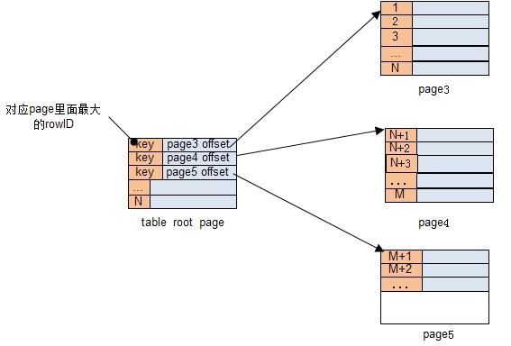
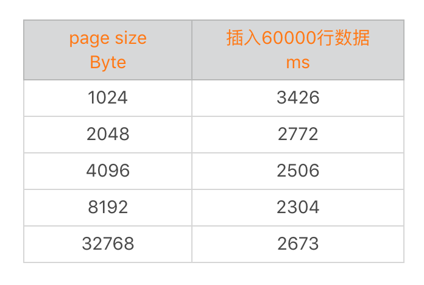
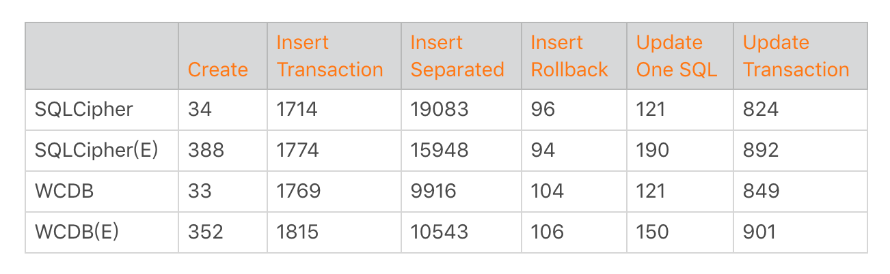
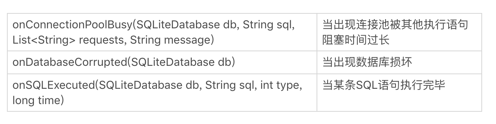
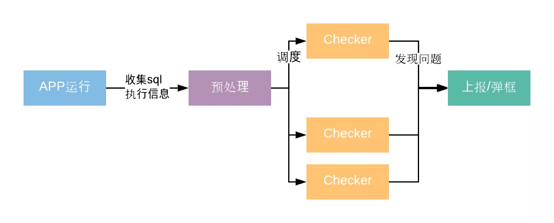

<!DOCTYPE html>
<html xmlns="http://www.w3.org/1999/xhtml">

<head>

    <head>
        <meta http-equiv="Content-Type" content="text/html; charset=UTF-8">
        <meta name="viewport" content="width=device-width, initial-scale=1, maximum-scale=1.0, user-scalable=no">
        <meta http-equiv='content-language' content='zh-cn'>
        <meta name='description' content=14&#32;存储优化（下）：数据库SQLite的使用和优化>
        <link rel="icon" href="/static/favicon.png">
        <title>14 存储优化（下）：数据库SQLite的使用和优化 </title>
        
        <link rel="stylesheet" href="/static/index.css">
        <link rel="stylesheet" href="/static/highlight.min.css">
        
        
        <meta name="generator" content="Hexo 4.2.0">
        
    </head>

<body>
    

        

            

                <a href="/">
                    
                    技术文章摘抄
                </a>
            

            

                <ul class="uncollapsible">
                    <li><a href="/" class="current-tab">首页</a></li>
                    <li><a href="../">上一级</a></li>
                </ul>
                <ul class="uncollapsible">
                    
                    <li>
                        <a class="menu-item" id="00 导读 如何打造高质量的应用？.md" href="/%e4%b8%93%e6%a0%8f/Android%e5%bc%80%e5%8f%91%e9%ab%98%e6%89%8b%e8%af%be/00%20%e5%af%bc%e8%af%bb%20%e5%a6%82%e4%bd%95%e6%89%93%e9%80%a0%e9%ab%98%e8%b4%a8%e9%87%8f%e7%9a%84%e5%ba%94%e7%94%a8%ef%bc%9f.md">00 导读 如何打造高质量的应用？.md</a>
                    </li>
                    
                    <li>
                        <a class="menu-item" id="00 开篇词 焦虑的移动开发者该如何破局？.md" href="/%e4%b8%93%e6%a0%8f/Android%e5%bc%80%e5%8f%91%e9%ab%98%e6%89%8b%e8%af%be/00%20%e5%bc%80%e7%af%87%e8%af%8d%20%e7%84%a6%e8%99%91%e7%9a%84%e7%a7%bb%e5%8a%a8%e5%bc%80%e5%8f%91%e8%80%85%e8%af%a5%e5%a6%82%e4%bd%95%e7%a0%b4%e5%b1%80%ef%bc%9f.md">00 开篇词 焦虑的移动开发者该如何破局？.md</a>
                    </li>
                    
                    <li>
                        <a class="menu-item" id="01 崩溃优化（上）：关于“崩溃”那些事儿.md" href="/%e4%b8%93%e6%a0%8f/Android%e5%bc%80%e5%8f%91%e9%ab%98%e6%89%8b%e8%af%be/01%20%e5%b4%a9%e6%ba%83%e4%bc%98%e5%8c%96%ef%bc%88%e4%b8%8a%ef%bc%89%ef%bc%9a%e5%85%b3%e4%ba%8e%e2%80%9c%e5%b4%a9%e6%ba%83%e2%80%9d%e9%82%a3%e4%ba%9b%e4%ba%8b%e5%84%bf.md">01 崩溃优化（上）：关于“崩溃”那些事儿.md</a>
                    </li>
                    
                    <li>
                        <a class="menu-item" id="02 崩溃优化（下）：应用崩溃了，你应该如何去分析？.md" href="/%e4%b8%93%e6%a0%8f/Android%e5%bc%80%e5%8f%91%e9%ab%98%e6%89%8b%e8%af%be/02%20%e5%b4%a9%e6%ba%83%e4%bc%98%e5%8c%96%ef%bc%88%e4%b8%8b%ef%bc%89%ef%bc%9a%e5%ba%94%e7%94%a8%e5%b4%a9%e6%ba%83%e4%ba%86%ef%bc%8c%e4%bd%a0%e5%ba%94%e8%af%a5%e5%a6%82%e4%bd%95%e5%8e%bb%e5%88%86%e6%9e%90%ef%bc%9f.md">02 崩溃优化（下）：应用崩溃了，你应该如何去分析？.md</a>
                    </li>
                    
                    <li>
                        <a class="menu-item" id="03 内存优化（上）：4GB内存时代，再谈内存优化.md" href="/%e4%b8%93%e6%a0%8f/Android%e5%bc%80%e5%8f%91%e9%ab%98%e6%89%8b%e8%af%be/03%20%e5%86%85%e5%ad%98%e4%bc%98%e5%8c%96%ef%bc%88%e4%b8%8a%ef%bc%89%ef%bc%9a4GB%e5%86%85%e5%ad%98%e6%97%b6%e4%bb%a3%ef%bc%8c%e5%86%8d%e8%b0%88%e5%86%85%e5%ad%98%e4%bc%98%e5%8c%96.md">03 内存优化（上）：4GB内存时代，再谈内存优化.md</a>
                    </li>
                    
                    <li>
                        <a class="menu-item" id="04 内存优化（下）：内存优化这件事，应该从哪里着手？.md" href="/%e4%b8%93%e6%a0%8f/Android%e5%bc%80%e5%8f%91%e9%ab%98%e6%89%8b%e8%af%be/04%20%e5%86%85%e5%ad%98%e4%bc%98%e5%8c%96%ef%bc%88%e4%b8%8b%ef%bc%89%ef%bc%9a%e5%86%85%e5%ad%98%e4%bc%98%e5%8c%96%e8%bf%99%e4%bb%b6%e4%ba%8b%ef%bc%8c%e5%ba%94%e8%af%a5%e4%bb%8e%e5%93%aa%e9%87%8c%e7%9d%80%e6%89%8b%ef%bc%9f.md">04 内存优化（下）：内存优化这件事，应该从哪里着手？.md</a>
                    </li>
                    
                    <li>
                        <a class="menu-item" id="05 卡顿优化（上）：你要掌握的卡顿分析方法.md" href="/%e4%b8%93%e6%a0%8f/Android%e5%bc%80%e5%8f%91%e9%ab%98%e6%89%8b%e8%af%be/05%20%e5%8d%a1%e9%a1%bf%e4%bc%98%e5%8c%96%ef%bc%88%e4%b8%8a%ef%bc%89%ef%bc%9a%e4%bd%a0%e8%a6%81%e6%8e%8c%e6%8f%a1%e7%9a%84%e5%8d%a1%e9%a1%bf%e5%88%86%e6%9e%90%e6%96%b9%e6%b3%95.md">05 卡顿优化（上）：你要掌握的卡顿分析方法.md</a>
                    </li>
                    
                    <li>
                        <a class="menu-item" id="06 卡顿优化（下）：如何监控应用卡顿？.md" href="/%e4%b8%93%e6%a0%8f/Android%e5%bc%80%e5%8f%91%e9%ab%98%e6%89%8b%e8%af%be/06%20%e5%8d%a1%e9%a1%bf%e4%bc%98%e5%8c%96%ef%bc%88%e4%b8%8b%ef%bc%89%ef%bc%9a%e5%a6%82%e4%bd%95%e7%9b%91%e6%8e%a7%e5%ba%94%e7%94%a8%e5%8d%a1%e9%a1%bf%ef%bc%9f.md">06 卡顿优化（下）：如何监控应用卡顿？.md</a>
                    </li>
                    
                    <li>
                        <a class="menu-item" id="06补充篇 卡顿优化：卡顿现场与卡顿分析.md" href="/%e4%b8%93%e6%a0%8f/Android%e5%bc%80%e5%8f%91%e9%ab%98%e6%89%8b%e8%af%be/06%e8%a1%a5%e5%85%85%e7%af%87%20%e5%8d%a1%e9%a1%bf%e4%bc%98%e5%8c%96%ef%bc%9a%e5%8d%a1%e9%a1%bf%e7%8e%b0%e5%9c%ba%e4%b8%8e%e5%8d%a1%e9%a1%bf%e5%88%86%e6%9e%90.md">06补充篇 卡顿优化：卡顿现场与卡顿分析.md</a>
                    </li>
                    
                    <li>
                        <a class="menu-item" id="07 启动优化（上）：从启动过程看启动速度优化.md" href="/%e4%b8%93%e6%a0%8f/Android%e5%bc%80%e5%8f%91%e9%ab%98%e6%89%8b%e8%af%be/07%20%e5%90%af%e5%8a%a8%e4%bc%98%e5%8c%96%ef%bc%88%e4%b8%8a%ef%bc%89%ef%bc%9a%e4%bb%8e%e5%90%af%e5%8a%a8%e8%bf%87%e7%a8%8b%e7%9c%8b%e5%90%af%e5%8a%a8%e9%80%9f%e5%ba%a6%e4%bc%98%e5%8c%96.md">07 启动优化（上）：从启动过程看启动速度优化.md</a>
                    </li>
                    
                    <li>
                        <a class="menu-item" id="08 启动优化（下）：优化启动速度的进阶方法.md" href="/%e4%b8%93%e6%a0%8f/Android%e5%bc%80%e5%8f%91%e9%ab%98%e6%89%8b%e8%af%be/08%20%e5%90%af%e5%8a%a8%e4%bc%98%e5%8c%96%ef%bc%88%e4%b8%8b%ef%bc%89%ef%bc%9a%e4%bc%98%e5%8c%96%e5%90%af%e5%8a%a8%e9%80%9f%e5%ba%a6%e7%9a%84%e8%bf%9b%e9%98%b6%e6%96%b9%e6%b3%95.md">08 启动优化（下）：优化启动速度的进阶方法.md</a>
                    </li>
                    
                    <li>
                        <a class="menu-item" id="09 I_O优化（上）：开发工程师必备的I_O优化知识.md" href="/%e4%b8%93%e6%a0%8f/Android%e5%bc%80%e5%8f%91%e9%ab%98%e6%89%8b%e8%af%be/09%20I_O%e4%bc%98%e5%8c%96%ef%bc%88%e4%b8%8a%ef%bc%89%ef%bc%9a%e5%bc%80%e5%8f%91%e5%b7%a5%e7%a8%8b%e5%b8%88%e5%bf%85%e5%a4%87%e7%9a%84I_O%e4%bc%98%e5%8c%96%e7%9f%a5%e8%af%86.md">09 I_O优化（上）：开发工程师必备的I_O优化知识.md</a>
                    </li>
                    
                    <li>
                        <a class="menu-item" id="10 I_O优化（中）：不同I_O方式的使用场景是什么？.md" href="/%e4%b8%93%e6%a0%8f/Android%e5%bc%80%e5%8f%91%e9%ab%98%e6%89%8b%e8%af%be/10%20I_O%e4%bc%98%e5%8c%96%ef%bc%88%e4%b8%ad%ef%bc%89%ef%bc%9a%e4%b8%8d%e5%90%8cI_O%e6%96%b9%e5%bc%8f%e7%9a%84%e4%bd%bf%e7%94%a8%e5%9c%ba%e6%99%af%e6%98%af%e4%bb%80%e4%b9%88%ef%bc%9f.md">10 I_O优化（中）：不同I_O方式的使用场景是什么？.md</a>
                    </li>
                    
                    <li>
                        <a class="menu-item" id="11 I_O优化（下）：如何监控线上I_O操作？.md" href="/%e4%b8%93%e6%a0%8f/Android%e5%bc%80%e5%8f%91%e9%ab%98%e6%89%8b%e8%af%be/11%20I_O%e4%bc%98%e5%8c%96%ef%bc%88%e4%b8%8b%ef%bc%89%ef%bc%9a%e5%a6%82%e4%bd%95%e7%9b%91%e6%8e%a7%e7%ba%bf%e4%b8%8aI_O%e6%93%8d%e4%bd%9c%ef%bc%9f.md">11 I_O优化（下）：如何监控线上I_O操作？.md</a>
                    </li>
                    
                    <li>
                        <a class="menu-item" id="12 存储优化（上）：常见的数据存储方法有哪些？.md" href="/%e4%b8%93%e6%a0%8f/Android%e5%bc%80%e5%8f%91%e9%ab%98%e6%89%8b%e8%af%be/12%20%e5%ad%98%e5%82%a8%e4%bc%98%e5%8c%96%ef%bc%88%e4%b8%8a%ef%bc%89%ef%bc%9a%e5%b8%b8%e8%a7%81%e7%9a%84%e6%95%b0%e6%8d%ae%e5%ad%98%e5%82%a8%e6%96%b9%e6%b3%95%e6%9c%89%e5%93%aa%e4%ba%9b%ef%bc%9f.md">12 存储优化（上）：常见的数据存储方法有哪些？.md</a>
                    </li>
                    
                    <li>
                        <a class="menu-item" id="13 存储优化（中）：如何优化数据存储？.md" href="/%e4%b8%93%e6%a0%8f/Android%e5%bc%80%e5%8f%91%e9%ab%98%e6%89%8b%e8%af%be/13%20%e5%ad%98%e5%82%a8%e4%bc%98%e5%8c%96%ef%bc%88%e4%b8%ad%ef%bc%89%ef%bc%9a%e5%a6%82%e4%bd%95%e4%bc%98%e5%8c%96%e6%95%b0%e6%8d%ae%e5%ad%98%e5%82%a8%ef%bc%9f.md">13 存储优化（中）：如何优化数据存储？.md</a>
                    </li>
                    
                    <li>
                        <a class="menu-item" id="14 存储优化（下）：数据库SQLite的使用和优化.md" href="/%e4%b8%93%e6%a0%8f/Android%e5%bc%80%e5%8f%91%e9%ab%98%e6%89%8b%e8%af%be/14%20%e5%ad%98%e5%82%a8%e4%bc%98%e5%8c%96%ef%bc%88%e4%b8%8b%ef%bc%89%ef%bc%9a%e6%95%b0%e6%8d%ae%e5%ba%93SQLite%e7%9a%84%e4%bd%bf%e7%94%a8%e5%92%8c%e4%bc%98%e5%8c%96.md">14 存储优化（下）：数据库SQLite的使用和优化.md</a>
                    </li>
                    
                    <li>
                        <a class="menu-item" id="15 网络优化（上）：移动开发工程师必备的网络优化知识.md" href="/%e4%b8%93%e6%a0%8f/Android%e5%bc%80%e5%8f%91%e9%ab%98%e6%89%8b%e8%af%be/15%20%e7%bd%91%e7%bb%9c%e4%bc%98%e5%8c%96%ef%bc%88%e4%b8%8a%ef%bc%89%ef%bc%9a%e7%a7%bb%e5%8a%a8%e5%bc%80%e5%8f%91%e5%b7%a5%e7%a8%8b%e5%b8%88%e5%bf%85%e5%a4%87%e7%9a%84%e7%bd%91%e7%bb%9c%e4%bc%98%e5%8c%96%e7%9f%a5%e8%af%86.md">15 网络优化（上）：移动开发工程师必备的网络优化知识.md</a>
                    </li>
                    
                    <li>
                        <a class="menu-item" id="16 网络优化（中）：复杂多变的移动网络该如何优化？.md" href="/%e4%b8%93%e6%a0%8f/Android%e5%bc%80%e5%8f%91%e9%ab%98%e6%89%8b%e8%af%be/16%20%e7%bd%91%e7%bb%9c%e4%bc%98%e5%8c%96%ef%bc%88%e4%b8%ad%ef%bc%89%ef%bc%9a%e5%a4%8d%e6%9d%82%e5%a4%9a%e5%8f%98%e7%9a%84%e7%a7%bb%e5%8a%a8%e7%bd%91%e7%bb%9c%e8%af%a5%e5%a6%82%e4%bd%95%e4%bc%98%e5%8c%96%ef%bc%9f.md">16 网络优化（中）：复杂多变的移动网络该如何优化？.md</a>
                    </li>
                    
                    <li>
                        <a class="menu-item" id="17 网络优化（下）：大数据下网络该如何监控？.md" href="/%e4%b8%93%e6%a0%8f/Android%e5%bc%80%e5%8f%91%e9%ab%98%e6%89%8b%e8%af%be/17%20%e7%bd%91%e7%bb%9c%e4%bc%98%e5%8c%96%ef%bc%88%e4%b8%8b%ef%bc%89%ef%bc%9a%e5%a4%a7%e6%95%b0%e6%8d%ae%e4%b8%8b%e7%bd%91%e7%bb%9c%e8%af%a5%e5%a6%82%e4%bd%95%e7%9b%91%e6%8e%a7%ef%bc%9f.md">17 网络优化（下）：大数据下网络该如何监控？.md</a>
                    </li>
                    
                    <li>
                        <a class="menu-item" id="18 耗电优化（上）：从电量优化的演进看耗电分析.md" href="/%e4%b8%93%e6%a0%8f/Android%e5%bc%80%e5%8f%91%e9%ab%98%e6%89%8b%e8%af%be/18%20%e8%80%97%e7%94%b5%e4%bc%98%e5%8c%96%ef%bc%88%e4%b8%8a%ef%bc%89%ef%bc%9a%e4%bb%8e%e7%94%b5%e9%87%8f%e4%bc%98%e5%8c%96%e7%9a%84%e6%bc%94%e8%bf%9b%e7%9c%8b%e8%80%97%e7%94%b5%e5%88%86%e6%9e%90.md">18 耗电优化（上）：从电量优化的演进看耗电分析.md</a>
                    </li>
                    
                    <li>
                        <a class="menu-item" id="19 耗电优化（下）：耗电的优化方法与线上监控.md" href="/%e4%b8%93%e6%a0%8f/Android%e5%bc%80%e5%8f%91%e9%ab%98%e6%89%8b%e8%af%be/19%20%e8%80%97%e7%94%b5%e4%bc%98%e5%8c%96%ef%bc%88%e4%b8%8b%ef%bc%89%ef%bc%9a%e8%80%97%e7%94%b5%e7%9a%84%e4%bc%98%e5%8c%96%e6%96%b9%e6%b3%95%e4%b8%8e%e7%ba%bf%e4%b8%8a%e7%9b%91%e6%8e%a7.md">19 耗电优化（下）：耗电的优化方法与线上监控.md</a>
                    </li>
                    
                    <li>
                        <a class="menu-item" id="20 UI 优化（上）：UI 渲染的几个关键概念.md" href="/%e4%b8%93%e6%a0%8f/Android%e5%bc%80%e5%8f%91%e9%ab%98%e6%89%8b%e8%af%be/20%20UI%20%e4%bc%98%e5%8c%96%ef%bc%88%e4%b8%8a%ef%bc%89%ef%bc%9aUI%20%e6%b8%b2%e6%9f%93%e7%9a%84%e5%87%a0%e4%b8%aa%e5%85%b3%e9%94%ae%e6%a6%82%e5%bf%b5.md">20 UI 优化（上）：UI 渲染的几个关键概念.md</a>
                    </li>
                    
                    <li>
                        <a class="menu-item" id="21 UI 优化（下）：如何优化 UI 渲染？.md" href="/%e4%b8%93%e6%a0%8f/Android%e5%bc%80%e5%8f%91%e9%ab%98%e6%89%8b%e8%af%be/21%20UI%20%e4%bc%98%e5%8c%96%ef%bc%88%e4%b8%8b%ef%bc%89%ef%bc%9a%e5%a6%82%e4%bd%95%e4%bc%98%e5%8c%96%20UI%20%e6%b8%b2%e6%9f%93%ef%bc%9f.md">21 UI 优化（下）：如何优化 UI 渲染？.md</a>
                    </li>
                    
                    <li>
                        <a class="menu-item" id="22 包体积优化（上）：如何减少安装包大小？.md" href="/%e4%b8%93%e6%a0%8f/Android%e5%bc%80%e5%8f%91%e9%ab%98%e6%89%8b%e8%af%be/22%20%e5%8c%85%e4%bd%93%e7%a7%af%e4%bc%98%e5%8c%96%ef%bc%88%e4%b8%8a%ef%bc%89%ef%bc%9a%e5%a6%82%e4%bd%95%e5%87%8f%e5%b0%91%e5%ae%89%e8%a3%85%e5%8c%85%e5%a4%a7%e5%b0%8f%ef%bc%9f.md">22 包体积优化（上）：如何减少安装包大小？.md</a>
                    </li>
                    
                    <li>
                        <a class="menu-item" id="23 包体积优化（下）：资源优化的进阶实践.md" href="/%e4%b8%93%e6%a0%8f/Android%e5%bc%80%e5%8f%91%e9%ab%98%e6%89%8b%e8%af%be/23%20%e5%8c%85%e4%bd%93%e7%a7%af%e4%bc%98%e5%8c%96%ef%bc%88%e4%b8%8b%ef%bc%89%ef%bc%9a%e8%b5%84%e6%ba%90%e4%bc%98%e5%8c%96%e7%9a%84%e8%bf%9b%e9%98%b6%e5%ae%9e%e8%b7%b5.md">23 包体积优化（下）：资源优化的进阶实践.md</a>
                    </li>
                    
                    <li>
                        <a class="menu-item" id="24 想成为Android高手，你需要先搞定这三个问题.md" href="/%e4%b8%93%e6%a0%8f/Android%e5%bc%80%e5%8f%91%e9%ab%98%e6%89%8b%e8%af%be/24%20%e6%83%b3%e6%88%90%e4%b8%baAndroid%e9%ab%98%e6%89%8b%ef%bc%8c%e4%bd%a0%e9%9c%80%e8%a6%81%e5%85%88%e6%90%9e%e5%ae%9a%e8%bf%99%e4%b8%89%e4%b8%aa%e9%97%ae%e9%a2%98.md">24 想成为Android高手，你需要先搞定这三个问题.md</a>
                    </li>
                    
                    <li>
                        <a class="menu-item" id="25 如何提升组织与个人的研发效能？.md" href="/%e4%b8%93%e6%a0%8f/Android%e5%bc%80%e5%8f%91%e9%ab%98%e6%89%8b%e8%af%be/25%20%e5%a6%82%e4%bd%95%e6%8f%90%e5%8d%87%e7%bb%84%e7%bb%87%e4%b8%8e%e4%b8%aa%e4%ba%ba%e7%9a%84%e7%a0%94%e5%8f%91%e6%95%88%e8%83%bd%ef%bc%9f.md">25 如何提升组织与个人的研发效能？.md</a>
                    </li>
                    
                    <li>
                        <a class="menu-item" id="26 关于编译，你需要了解什么？.md" href="/%e4%b8%93%e6%a0%8f/Android%e5%bc%80%e5%8f%91%e9%ab%98%e6%89%8b%e8%af%be/26%20%e5%85%b3%e4%ba%8e%e7%bc%96%e8%af%91%ef%bc%8c%e4%bd%a0%e9%9c%80%e8%a6%81%e4%ba%86%e8%a7%a3%e4%bb%80%e4%b9%88%ef%bc%9f.md">26 关于编译，你需要了解什么？.md</a>
                    </li>
                    
                    <li>
                        <a class="menu-item" id="27 编译插桩的三种方法：AspectJ、ASM、ReDex.md" href="/%e4%b8%93%e6%a0%8f/Android%e5%bc%80%e5%8f%91%e9%ab%98%e6%89%8b%e8%af%be/27%20%e7%bc%96%e8%af%91%e6%8f%92%e6%a1%a9%e7%9a%84%e4%b8%89%e7%a7%8d%e6%96%b9%e6%b3%95%ef%bc%9aAspectJ%e3%80%81ASM%e3%80%81ReDex.md">27 编译插桩的三种方法：AspectJ、ASM、ReDex.md</a>
                    </li>
                    
                    <li>
                        <a class="menu-item" id="28 大数据与AI，如何高效地测试？.md" href="/%e4%b8%93%e6%a0%8f/Android%e5%bc%80%e5%8f%91%e9%ab%98%e6%89%8b%e8%af%be/28%20%e5%a4%a7%e6%95%b0%e6%8d%ae%e4%b8%8eAI%ef%bc%8c%e5%a6%82%e4%bd%95%e9%ab%98%e6%95%88%e5%9c%b0%e6%b5%8b%e8%af%95%ef%bc%9f.md">28 大数据与AI，如何高效地测试？.md</a>
                    </li>
                    
                    <li>
                        <a class="menu-item" id="29 从每月到每天，如何给版本发布提速？.md" href="/%e4%b8%93%e6%a0%8f/Android%e5%bc%80%e5%8f%91%e9%ab%98%e6%89%8b%e8%af%be/29%20%e4%bb%8e%e6%af%8f%e6%9c%88%e5%88%b0%e6%af%8f%e5%a4%a9%ef%bc%8c%e5%a6%82%e4%bd%95%e7%bb%99%e7%89%88%e6%9c%ac%e5%8f%91%e5%b8%83%e6%8f%90%e9%80%9f%ef%bc%9f.md">29 从每月到每天，如何给版本发布提速？.md</a>
                    </li>
                    
                    <li>
                        <a class="menu-item" id="30 数据评估（上）：如何实现高可用的上报组件？.md" href="/%e4%b8%93%e6%a0%8f/Android%e5%bc%80%e5%8f%91%e9%ab%98%e6%89%8b%e8%af%be/30%20%e6%95%b0%e6%8d%ae%e8%af%84%e4%bc%b0%ef%bc%88%e4%b8%8a%ef%bc%89%ef%bc%9a%e5%a6%82%e4%bd%95%e5%ae%9e%e7%8e%b0%e9%ab%98%e5%8f%af%e7%94%a8%e7%9a%84%e4%b8%8a%e6%8a%a5%e7%bb%84%e4%bb%b6%ef%bc%9f.md">30 数据评估（上）：如何实现高可用的上报组件？.md</a>
                    </li>
                    
                    <li>
                        <a class="menu-item" id="31 数据评估（下）：什么是大数据平台？.md" href="/%e4%b8%93%e6%a0%8f/Android%e5%bc%80%e5%8f%91%e9%ab%98%e6%89%8b%e8%af%be/31%20%e6%95%b0%e6%8d%ae%e8%af%84%e4%bc%b0%ef%bc%88%e4%b8%8b%ef%bc%89%ef%bc%9a%e4%bb%80%e4%b9%88%e6%98%af%e5%a4%a7%e6%95%b0%e6%8d%ae%e5%b9%b3%e5%8f%b0%ef%bc%9f.md">31 数据评估（下）：什么是大数据平台？.md</a>
                    </li>
                    
                    <li>
                        <a class="menu-item" id="32 线上疑难问题该如何排查和跟踪？.md" href="/%e4%b8%93%e6%a0%8f/Android%e5%bc%80%e5%8f%91%e9%ab%98%e6%89%8b%e8%af%be/32%20%e7%ba%bf%e4%b8%8a%e7%96%91%e9%9a%be%e9%97%ae%e9%a2%98%e8%af%a5%e5%a6%82%e4%bd%95%e6%8e%92%e6%9f%a5%e5%92%8c%e8%b7%9f%e8%b8%aa%ef%bc%9f.md">32 线上疑难问题该如何排查和跟踪？.md</a>
                    </li>
                    
                    <li>
                        <a class="menu-item" id="33 做一名有高度的移动开发工程师.md" href="/%e4%b8%93%e6%a0%8f/Android%e5%bc%80%e5%8f%91%e9%ab%98%e6%89%8b%e8%af%be/33%20%e5%81%9a%e4%b8%80%e5%90%8d%e6%9c%89%e9%ab%98%e5%ba%a6%e7%9a%84%e7%a7%bb%e5%8a%a8%e5%bc%80%e5%8f%91%e5%b7%a5%e7%a8%8b%e5%b8%88.md">33 做一名有高度的移动开发工程师.md</a>
                    </li>
                    
                    <li>
                        <a class="menu-item" id="34 聊聊重构：优秀的架构都是演进而来的.md" href="/%e4%b8%93%e6%a0%8f/Android%e5%bc%80%e5%8f%91%e9%ab%98%e6%89%8b%e8%af%be/34%20%e8%81%8a%e8%81%8a%e9%87%8d%e6%9e%84%ef%bc%9a%e4%bc%98%e7%a7%80%e7%9a%84%e6%9e%b6%e6%9e%84%e9%83%bd%e6%98%af%e6%bc%94%e8%bf%9b%e8%80%8c%e6%9d%a5%e7%9a%84.md">34 聊聊重构：优秀的架构都是演进而来的.md</a>
                    </li>
                    
                    <li>
                        <a class="menu-item" id="35 Native Hook 技术，天使还是魔鬼？.md" href="/%e4%b8%93%e6%a0%8f/Android%e5%bc%80%e5%8f%91%e9%ab%98%e6%89%8b%e8%af%be/35%20Native%20Hook%20%e6%8a%80%e6%9c%af%ef%bc%8c%e5%a4%a9%e4%bd%bf%e8%bf%98%e6%98%af%e9%ad%94%e9%ac%bc%ef%bc%9f.md">35 Native Hook 技术，天使还是魔鬼？.md</a>
                    </li>
                    
                    <li>
                        <a class="menu-item" id="36 跨平台开发的现状与应用.md" href="/%e4%b8%93%e6%a0%8f/Android%e5%bc%80%e5%8f%91%e9%ab%98%e6%89%8b%e8%af%be/36%20%e8%b7%a8%e5%b9%b3%e5%8f%b0%e5%bc%80%e5%8f%91%e7%9a%84%e7%8e%b0%e7%8a%b6%e4%b8%8e%e5%ba%94%e7%94%a8.md">36 跨平台开发的现状与应用.md</a>
                    </li>
                    
                    <li>
                        <a class="menu-item" id="37 移动开发新大陆：工作三年半，移动开发转型手游开发.md" href="/%e4%b8%93%e6%a0%8f/Android%e5%bc%80%e5%8f%91%e9%ab%98%e6%89%8b%e8%af%be/37%20%e7%a7%bb%e5%8a%a8%e5%bc%80%e5%8f%91%e6%96%b0%e5%a4%a7%e9%99%86%ef%bc%9a%e5%b7%a5%e4%bd%9c%e4%b8%89%e5%b9%b4%e5%8d%8a%ef%bc%8c%e7%a7%bb%e5%8a%a8%e5%bc%80%e5%8f%91%e8%bd%ac%e5%9e%8b%e6%89%8b%e6%b8%b8%e5%bc%80%e5%8f%91.md">37 移动开发新大陆：工作三年半，移动开发转型手游开发.md</a>
                    </li>
                    
                    <li>
                        <a class="menu-item" id="38 移动开发新大陆：Android音视频开发.md" href="/%e4%b8%93%e6%a0%8f/Android%e5%bc%80%e5%8f%91%e9%ab%98%e6%89%8b%e8%af%be/38%20%e7%a7%bb%e5%8a%a8%e5%bc%80%e5%8f%91%e6%96%b0%e5%a4%a7%e9%99%86%ef%bc%9aAndroid%e9%9f%b3%e8%a7%86%e9%a2%91%e5%bc%80%e5%8f%91.md">38 移动开发新大陆：Android音视频开发.md</a>
                    </li>
                    
                    <li>
                        <a class="menu-item" id="39 移动开发新大陆： 边缘智能计算的趋势.md" href="/%e4%b8%93%e6%a0%8f/Android%e5%bc%80%e5%8f%91%e9%ab%98%e6%89%8b%e8%af%be/39%20%e7%a7%bb%e5%8a%a8%e5%bc%80%e5%8f%91%e6%96%b0%e5%a4%a7%e9%99%86%ef%bc%9a%20%e8%be%b9%e7%bc%98%e6%99%ba%e8%83%bd%e8%ae%a1%e7%ae%97%e7%9a%84%e8%b6%8b%e5%8a%bf.md">39 移动开发新大陆： 边缘智能计算的趋势.md</a>
                    </li>
                    
                    <li>
                        <a class="menu-item" id="40 动态化实践，如何选择适合自己的方案？.md" href="/%e4%b8%93%e6%a0%8f/Android%e5%bc%80%e5%8f%91%e9%ab%98%e6%89%8b%e8%af%be/40%20%e5%8a%a8%e6%80%81%e5%8c%96%e5%ae%9e%e8%b7%b5%ef%bc%8c%e5%a6%82%e4%bd%95%e9%80%89%e6%8b%a9%e9%80%82%e5%90%88%e8%87%aa%e5%b7%b1%e7%9a%84%e6%96%b9%e6%a1%88%ef%bc%9f.md">40 动态化实践，如何选择适合自己的方案？.md</a>
                    </li>
                    
                    <li>
                        <a class="menu-item" id="41 聊聊Flutter，面对层出不穷的新技术该如何跟进？.md" href="/%e4%b8%93%e6%a0%8f/Android%e5%bc%80%e5%8f%91%e9%ab%98%e6%89%8b%e8%af%be/41%20%e8%81%8a%e8%81%8aFlutter%ef%bc%8c%e9%9d%a2%e5%af%b9%e5%b1%82%e5%87%ba%e4%b8%8d%e7%a9%b7%e7%9a%84%e6%96%b0%e6%8a%80%e6%9c%af%e8%af%a5%e5%a6%82%e4%bd%95%e8%b7%9f%e8%bf%9b%ef%bc%9f.md">41 聊聊Flutter，面对层出不穷的新技术该如何跟进？.md</a>
                    </li>
                    
                    <li>
                        <a class="menu-item" id="42 Android开发高手课学习心得.md" href="/%e4%b8%93%e6%a0%8f/Android%e5%bc%80%e5%8f%91%e9%ab%98%e6%89%8b%e8%af%be/42%20Android%e5%bc%80%e5%8f%91%e9%ab%98%e6%89%8b%e8%af%be%e5%ad%a6%e4%b9%a0%e5%bf%83%e5%be%97.md">42 Android开发高手课学习心得.md</a>
                    </li>
                    
                    <li>
                        <a class="menu-item" id="Android JVM TI机制详解（内含福利彩蛋）.md" href="/%e4%b8%93%e6%a0%8f/Android%e5%bc%80%e5%8f%91%e9%ab%98%e6%89%8b%e8%af%be/Android%20JVM%20TI%e6%9c%ba%e5%88%b6%e8%af%a6%e8%a7%a3%ef%bc%88%e5%86%85%e5%90%ab%e7%a6%8f%e5%88%a9%e5%bd%a9%e8%9b%8b%ef%bc%89.md">Android JVM TI机制详解（内含福利彩蛋）.md</a>
                    </li>
                    
                    <li>
                        <a class="menu-item" id="Android工程师的“面试指南”.md" href="/%e4%b8%93%e6%a0%8f/Android%e5%bc%80%e5%8f%91%e9%ab%98%e6%89%8b%e8%af%be/Android%e5%b7%a5%e7%a8%8b%e5%b8%88%e7%9a%84%e2%80%9c%e9%9d%a2%e8%af%95%e6%8c%87%e5%8d%97%e2%80%9d.md">Android工程师的“面试指南”.md</a>
                    </li>
                    
                    <li>
                        <a class="menu-item" id="Native下如何获取调用栈？.md" href="/%e4%b8%93%e6%a0%8f/Android%e5%bc%80%e5%8f%91%e9%ab%98%e6%89%8b%e8%af%be/Native%e4%b8%8b%e5%a6%82%e4%bd%95%e8%8e%b7%e5%8f%96%e8%b0%83%e7%94%a8%e6%a0%88%ef%bc%9f.md">Native下如何获取调用栈？.md</a>
                    </li>
                    
                    <li>
                        <a class="menu-item" id="专栏学得苦？可能你还需要一份配套学习书单.md" href="/%e4%b8%93%e6%a0%8f/Android%e5%bc%80%e5%8f%91%e9%ab%98%e6%89%8b%e8%af%be/%e4%b8%93%e6%a0%8f%e5%ad%a6%e5%be%97%e8%8b%a6%ef%bc%9f%e5%8f%af%e8%83%bd%e4%bd%a0%e8%bf%98%e9%9c%80%e8%a6%81%e4%b8%80%e4%bb%bd%e9%85%8d%e5%a5%97%e5%ad%a6%e4%b9%a0%e4%b9%a6%e5%8d%95.md">专栏学得苦？可能你还需要一份配套学习书单.md</a>
                    </li>
                    
                    <li>
                        <a class="menu-item" id="专栏学得苦？可能是方法没找对.md" href="/%e4%b8%93%e6%a0%8f/Android%e5%bc%80%e5%8f%91%e9%ab%98%e6%89%8b%e8%af%be/%e4%b8%93%e6%a0%8f%e5%ad%a6%e5%be%97%e8%8b%a6%ef%bc%9f%e5%8f%af%e8%83%bd%e6%98%af%e6%96%b9%e6%b3%95%e6%b2%a1%e6%89%be%e5%af%b9.md">专栏学得苦？可能是方法没找对.md</a>
                    </li>
                    
                    <li>
                        <a class="menu-item" id="程序员修炼之路 设计能力的提升途径.md" href="/%e4%b8%93%e6%a0%8f/Android%e5%bc%80%e5%8f%91%e9%ab%98%e6%89%8b%e8%af%be/%e7%a8%8b%e5%ba%8f%e5%91%98%e4%bf%ae%e7%82%bc%e4%b9%8b%e8%b7%af%20%e8%ae%be%e8%ae%a1%e8%83%bd%e5%8a%9b%e7%9a%84%e6%8f%90%e5%8d%87%e9%80%94%e5%be%84.md">程序员修炼之路 设计能力的提升途径.md</a>
                    </li>
                    
                    <li>
                        <a class="menu-item" id="练习Sample跑起来 ASM插桩强化练习.md" href="/%e4%b8%93%e6%a0%8f/Android%e5%bc%80%e5%8f%91%e9%ab%98%e6%89%8b%e8%af%be/%e7%bb%83%e4%b9%a0Sample%e8%b7%91%e8%b5%b7%e6%9d%a5%20ASM%e6%8f%92%e6%a1%a9%e5%bc%ba%e5%8c%96%e7%bb%83%e4%b9%a0.md">练习Sample跑起来 ASM插桩强化练习.md</a>
                    </li>
                    
                    <li>
                        <a class="menu-item" id="练习Sample跑起来 唯鹿同学的练习手记 第1辑.md" href="/%e4%b8%93%e6%a0%8f/Android%e5%bc%80%e5%8f%91%e9%ab%98%e6%89%8b%e8%af%be/%e7%bb%83%e4%b9%a0Sample%e8%b7%91%e8%b5%b7%e6%9d%a5%20%e5%94%af%e9%b9%bf%e5%90%8c%e5%ad%a6%e7%9a%84%e7%bb%83%e4%b9%a0%e6%89%8b%e8%ae%b0%20%e7%ac%ac1%e8%be%91.md">练习Sample跑起来 唯鹿同学的练习手记 第1辑.md</a>
                    </li>
                    
                    <li>
                        <a class="menu-item" id="练习Sample跑起来 唯鹿同学的练习手记 第2辑.md" href="/%e4%b8%93%e6%a0%8f/Android%e5%bc%80%e5%8f%91%e9%ab%98%e6%89%8b%e8%af%be/%e7%bb%83%e4%b9%a0Sample%e8%b7%91%e8%b5%b7%e6%9d%a5%20%e5%94%af%e9%b9%bf%e5%90%8c%e5%ad%a6%e7%9a%84%e7%bb%83%e4%b9%a0%e6%89%8b%e8%ae%b0%20%e7%ac%ac2%e8%be%91.md">练习Sample跑起来 唯鹿同学的练习手记 第2辑.md</a>
                    </li>
                    
                    <li>
                        <a class="menu-item" id="练习Sample跑起来 唯鹿同学的练习手记 第3辑.md" href="/%e4%b8%93%e6%a0%8f/Android%e5%bc%80%e5%8f%91%e9%ab%98%e6%89%8b%e8%af%be/%e7%bb%83%e4%b9%a0Sample%e8%b7%91%e8%b5%b7%e6%9d%a5%20%e5%94%af%e9%b9%bf%e5%90%8c%e5%ad%a6%e7%9a%84%e7%bb%83%e4%b9%a0%e6%89%8b%e8%ae%b0%20%e7%ac%ac3%e8%be%91.md">练习Sample跑起来 唯鹿同学的练习手记 第3辑.md</a>
                    </li>
                    
                    <li>
                        <a class="menu-item" id="练习Sample跑起来 热点问题答疑第1期.md" href="/%e4%b8%93%e6%a0%8f/Android%e5%bc%80%e5%8f%91%e9%ab%98%e6%89%8b%e8%af%be/%e7%bb%83%e4%b9%a0Sample%e8%b7%91%e8%b5%b7%e6%9d%a5%20%e7%83%ad%e7%82%b9%e9%97%ae%e9%a2%98%e7%ad%94%e7%96%91%e7%ac%ac1%e6%9c%9f.md">练习Sample跑起来 热点问题答疑第1期.md</a>
                    </li>
                    
                    <li>
                        <a class="menu-item" id="练习Sample跑起来 热点问题答疑第2期.md" href="/%e4%b8%93%e6%a0%8f/Android%e5%bc%80%e5%8f%91%e9%ab%98%e6%89%8b%e8%af%be/%e7%bb%83%e4%b9%a0Sample%e8%b7%91%e8%b5%b7%e6%9d%a5%20%e7%83%ad%e7%82%b9%e9%97%ae%e9%a2%98%e7%ad%94%e7%96%91%e7%ac%ac2%e6%9c%9f.md">练习Sample跑起来 热点问题答疑第2期.md</a>
                    </li>
                    
                    <li>
                        <a class="menu-item" id="练习Sample跑起来 热点问题答疑第3期.md" href="/%e4%b8%93%e6%a0%8f/Android%e5%bc%80%e5%8f%91%e9%ab%98%e6%89%8b%e8%af%be/%e7%bb%83%e4%b9%a0Sample%e8%b7%91%e8%b5%b7%e6%9d%a5%20%e7%83%ad%e7%82%b9%e9%97%ae%e9%a2%98%e7%ad%94%e7%96%91%e7%ac%ac3%e6%9c%9f.md">练习Sample跑起来 热点问题答疑第3期.md</a>
                    </li>
                    
                    <li>
                        <a class="menu-item" id="练习Sample跑起来 热点问题答疑第4期.md" href="/%e4%b8%93%e6%a0%8f/Android%e5%bc%80%e5%8f%91%e9%ab%98%e6%89%8b%e8%af%be/%e7%bb%83%e4%b9%a0Sample%e8%b7%91%e8%b5%b7%e6%9d%a5%20%e7%83%ad%e7%82%b9%e9%97%ae%e9%a2%98%e7%ad%94%e7%96%91%e7%ac%ac4%e6%9c%9f.md">练习Sample跑起来 热点问题答疑第4期.md</a>
                    </li>
                    
                    <li>
                        <a class="menu-item" id="结束语 移动开发的今天和明天.md" href="/%e4%b8%93%e6%a0%8f/Android%e5%bc%80%e5%8f%91%e9%ab%98%e6%89%8b%e8%af%be/%e7%bb%93%e6%9d%9f%e8%af%ad%20%e7%a7%bb%e5%8a%a8%e5%bc%80%e5%8f%91%e7%9a%84%e4%bb%8a%e5%a4%a9%e5%92%8c%e6%98%8e%e5%a4%a9.md">结束语 移动开发的今天和明天.md</a>
                    </li>
                    
                    <li>
                        <a class="menu-item" id="聊聊Framework的学习方法.md" href="/%e4%b8%93%e6%a0%8f/Android%e5%bc%80%e5%8f%91%e9%ab%98%e6%89%8b%e8%af%be/%e8%81%8a%e8%81%8aFramework%e7%9a%84%e5%ad%a6%e4%b9%a0%e6%96%b9%e6%b3%95.md">聊聊Framework的学习方法.md</a>
                    </li>
                    
                    <li><a href="https://lianglianglee.com/assets/%E6%8D%90%E8%B5%A0.md">捐赠</a></li>
                </ul>

            

        

        

            

        

        

            

                

                    

                        
                        <header class="navbar">
                            <section class="navbar-section">
                                <a onclick="open_sidebar()">
                                    <i class="icon icon-menu"></i>
                                </a>
                            </section>
                        </header>
                    

                    

                        

                            
                            
                            
                            

                            <h1 id="title" data-id="14 存储优化（下）：数据库SQLite的使用和优化" class="title">14 存储优化（下）：数据库SQLite的使用和优化</h1>
                            

我们先来复习一下前面讲到的存储方法的使用场景：少量的Key Value数据可以直接使用SharedPreferences，稍微复杂一些的数据类型也可以通过序列化成JSON或者Protocol Buffers保存，并且在开发中获取或者修改数据也很简单。

不过这几种方法可以覆盖所有的存储场景吗？数据量在几百上千条这个量级时它们的性能还可以接受，但如果是几万条的微信聊天记录呢？而且如何实现快速地对某几个联系人的数据做增删改查呢？

对于大数据的存储场景，我们需要考虑稳定性、性能和<strong>可扩展性</strong>，这个时候就要轮到今天的“主角”数据库登场了。讲存储优化一定绕不开数据库，而数据库这个主题又非常大，我也知道不少同学学数据库的过程是从入门到放弃。那么考虑到我们大多是从事移动开发的工作，今天我就来讲讲移动端数据库SQLite的使用和优化。

<h2 id="sqlite的那些事儿">SQLite的那些事儿</h2>

虽然市面上有很多的数据库，但受限于库体积和存储空间，适合移动端使用的还真不多。当然使用最广泛的还是我们今天的主角SQLite，但同样还是有一些其他不错的选择，例如创业团队的<a href="https://github.com/realm/realm-java" target="_blank">Realm</a>、Google的<a href="https://github.com/google/leveldb" target="_blank">LevelDB</a>等。

在国内那么多的移动团队中，微信对SQLite的研究可以算是最深入的。这其实是业务诉求导向的，用户聊天记录只会在本地保存，一旦出现数据损坏或者丢失，对用户来说都是不可挽回的。另一方面，微信有很大一批的重度用户，他们有几千个联系人、几千个群聊天，曾经做过一个统计，有几百万用户的数据库竟然大于1GB。对于这批用户，如何保证他们可以正常地使用微信是一个非常大的挑战。

所以当时微信专门开展了一个重度用户优化的专项。一开始的时候我们集中在SQLite使用上的优化，例如表结构、索引等。但很快就发现由于系统版本的不同，SQLite的实现也有所差异，经常会出现一些兼容性问题，并且也考虑到加密的诉求，我们决定单独引入自己的SQLite版本。

“源码在手，天下我有”，从此开启了一条研究数据库的“不归路”。那时我们投入了几个人专门去深入研究SQLite的源码，从SQLite的PRAGMA编译选项、<a href="https://mp.weixin.qq.com/s?__biz=MzAwNDY1ODY2OQ==&amp;mid=2649286603&amp;idx=1&amp;sn=d243dd27f2c6614631241cd00570e853&amp;chksm=8334c349b4434a5fd81809d656bfad6072f075d098cb5663a85823e94fc2363edd28758ab882&amp;mpshare=1&amp;scene=1&amp;srcid=0609GLAeaGGmI4zCHTc2U9ZX#rd" target="_blank">Cursor实现优化</a>，到SQLite源码的优化，最后打造出从实验室到线上的整个监控体系。

在2017年，我们开源了内部使用的SQLite数据库<a href="https://github.com/Tencent/wcdb/wiki" target="_blank">WCDB</a>。这里多说两句，看一个开源项目是否靠谱，就看这个项目对产品本身有多重要。微信开源坚持内部与外部使用同一个版本，虽然我现在已经离开了微信团队，但还是欢迎有需要的同学使用WCDB。

在开始学习前我要提醒你，SQLite的优化同样也很难通过一两篇文章就把每个细节都讲清楚。今天的内容我选择了一些比较重要的知识点，并且为你准备了大量的参考资料，遇到陌生或者不懂的地方需要结合参考资料反复学习。

<strong>1. ORM</strong>

坦白说可能很多BAT的高级开发工程师都不完全了解SQLite的内部机制，也不能正确地写出高效的SQL语句。大部分应用为了提高开发效率，会引入ORM框架。ORM（Object Relational Mapping）也就是对象关系映射，用面向对象的概念把数据库中表和对象关联起来，可以让我们不用关心数据库底层的实现。

Android中最常用的ORM框架有开源<a href="https://github.com/greenrobot/greenDAO" target="_blank">greenDAO</a>和Google官方的<a href="https://developer.android.com/training/data-storage/room/" target="_blank">Room</a>，那使用ORM框架会带来什么问题呢？

使用ORM框架真的非常简单，但是简易性是需要牺牲部分执行效率为代价的，具体的损耗跟ORM框架写得好不好很有关系。但可能更大的问题是让很多的开发者的思维固化，最后可能连简单的SQL语句都不会写了。

那我们的应用是否应该引入ORM框架呢？可能程序员天生追求偷懒，为了提高开发效率，应用的确应该引入ORM框架。<strong>但是这不能是我们可以不去学习数据库基础知识的理由，只有理解底层的一些机制，我们才能更加得心应手地解决疑难的问题</strong>。

考虑到可以更好的与Android Jetpack的组件互动，<a href="https://github.com/Tencent/wcdb/wiki/Android-WCDB-%E4%BD%BF%E7%94%A8-Room-ORM-%E4%B8%8E%E6%95%B0%E6%8D%AE%E7%BB%91%E5%AE%9A" target="_blank">WCDB选择Room作为ORM框架</a>。

<strong>2. 进程与线程并发</strong>

如果我们在项目中有使用SQLite，那么下面这个<a href="https://developer.android.com/reference/android/database/sqlite/SQLiteDatabaseLockedException" target="_blank">SQLiteDatabaseLockedException</a>就是经常会出现的一个问题。

<pre><code>android.database.sqlite.SQLiteDatabaseLockedException: database is locked
  at android.database.sqlite.SQLiteDatabase.dbopen
  at android.database.sqlite.SQLiteDatabase.openDatabase
  at android.database.sqlite.SQLiteDatabase.openDatabase
</code></pre>

SQLiteDatabaseLockedException归根到底是因为并发导致，而SQLite的并发有两个维度，一个是多进程并发，一个是多线程并发。下面我们分别来讲一下它们的关键点。

<strong>多进程并发</strong>

SQLite默认是支持多进程并发操作的，它通过文件锁来控制多进程的并发。SQLite锁的粒度并没有非常细，它针对的是整个DB文件，内部有5个状态，具体你可以参考下面的文章。

<ul>
<li>
官方文档：<a href="https://www.sqlite.org/lockingv3.html" target="_blank">SQLite locking</a>
</li>

<li>
SQLite源码分析：<a href="http://huili.github.io/lockandimplement/machining.html" target="_blank">SQLite锁机制简介</a>
</li>

<li>
<a href="https://www.cnblogs.com/cchust/p/4761814.html" target="_blank">SQLite封锁机制</a>
</li>
</ul>

简单来说，多进程可以同时获取SHARED锁来读取数据，但是只有一个进程可以获取EXCLUSIVE锁来写数据库。对于iOS来说可能没有多进程访问数据库的场景，可以把locking_mode的默认值改为EXCLUSIVE。

<pre><code>PRAGMA locking_mode = EXCLUSIVE
</code></pre>

在EXCLUSIVE模式下，数据库连接在断开前都不会释放SQLite文件的锁，从而避免不必要的冲突，提高数据库访问的速度。

<strong>多线程并发</strong>

相比多进程，多线程的数据库访问可能会更加常见。SQLite支持多线程并发模式，需要开启下面的配置，当然系统SQLite会默认开启多线程<a href="https://sqlite.org/threadsafe.html" target="_blank">Multi-thread模式</a>。

<pre><code>PRAGMA SQLITE_THREADSAFE = 2
</code></pre>

<strong>跟多进程的锁机制一样，为了实现简单，SQLite锁的粒度都是数据库文件级别，并没有实现表级甚至行级的锁</strong>。还有需要说明的是，<strong>同一个句柄同一时间只有一个线程在操作</strong>，这个时候我们需要打开连接池Connection Pool。

如果使用WCDB在初始化的时候可以指定连接池的大小，在微信中我们设置的大小是4。

<pre><code>public static SQLiteDatabase openDatabase (String path, 
                    SQLiteDatabase.CursorFactory factory, 
                    int flags, 
                    DatabaseErrorHandler errorHandler, 
                    int poolSize)
</code></pre>

跟多进程类似，多线程可以同时读取数据库数据，但是写数据库依然是互斥的。SQLite提供了Busy Retry的方案，即发生阻塞时会触发Busy Handler，此时可以让线程休眠一段时间后，重新尝试操作，你可以参考<a href="https://mp.weixin.qq.com/s/8FjDqPtXWWqOInsiV79Chg" target="_blank">《微信iOS SQLite源码优化实践》</a>这篇文章。

为了进一步提高并发性能，我们还可以打开<a href="https://www.sqlite.org/wal.html" target="_blank">WAL</a>（Write-Ahead Logging）模式。WAL模式会将修改的数据单独写到一个WAL文件中，同时也会引入了WAL日志文件锁。通过WAL模式读和写可以完全地并发执行，不会互相阻塞。

<pre><code>PRAGMA schema.journal_mode = WAL
</code></pre>

<strong>但是需要注意的是，写之间是仍然不能并发</strong>。如果出现多个写并发的情况，依然有可能会出现SQLiteDatabaseLockedException。这个时候我们可以让应用中捕获这个异常，然后等待一段时间再重试。

<pre><code>} catch (SQLiteDatabaseLockedException e) {
    if (sqliteLockedExceptionTimes &lt; (tryTimes - 1)) {
        try {
            Thread.sleep(100);
        } catch (InterruptedException e1) {
        }
    }
    sqliteLockedExceptionTimes++；
}
</code></pre>

<strong>总的来说通过连接池与WAL模式，我们可以很大程度上增加SQLite的读写并发，大大减少由于并发导致的等待耗时，建议大家在应用中可以尝试开启。</strong>

<strong>3. 查询优化</strong>

说到数据库的查询优化，你第一个想到的肯定是建索引，那我就先来讲讲SQLite的索引优化。

<strong>索引优化</strong>

正确使用索引在大部分的场景可以大大降低查询速度，微信的数据库优化也是通过索引开始。下面是索引使用非常简单的一个例子，我们先从索引表找到数据对应的rowid，然后再从原数据表直接通过rowid查询结果。

关于SQLite索引的原理网上有很多文章，在这里我推荐一些参考资料给你：

<ul>
<li>
<a href="https://www.cnblogs.com/huahuahu/p/sqlite-suo-yin-de-yuan-li-ji-ying-yong.html" target="_blank">SQLite索引的原理</a>
</li>

<li>
官方文档：<a href="https://www.sqlite.org/queryplanner.html#searching" target="_blank">Query Planning</a>
</li>

<li>
<a href="http://blog.codinglabs.org/articles/theory-of-mysql-index.html" target="_blank">MySQL索引背后的数据结构及算法原理</a>
</li>
</ul>

这里的关键在于如何正确的建立索引，很多时候我们以为已经建立了索引，但事实上并没有真正生效。例如使用了BETWEEN、LIKE、OR这些操作符、使用表达式或者case when等。更详细的规则可参考官方文档<a href="http://www.sqlite.org/optoverview.html" target="_blank">The SQLite Query Optimizer Overview</a>，下面是一个通过优化转换达到使用索引目的的例子。

<pre><code>BETWEEN：myfiedl索引无法生效
SELECT * FROM mytable WHERE myfield BETWEEN 10 and 20;
转换成：myfiedl索引可以生效
SELECT * FROM mytable WHERE myfield &gt;= 10 AND myfield &lt;= 20;
</code></pre>

建立索引是有代价的，需要一直维护索引表的更新。比如对于一个很小的表来说就没必要建索引；如果一个表经常是执行插入更新操作，那么也需要节制的建立索引。总的来说有几个原则：

<ul>
<li>
建立正确的索引。这里不仅需要确保索引在查询中真正生效，我们还希望可以选择最高效的索引。如果一个表建立太多的索引，那么在查询的时候SQLite可能不会选择最好的来执行。
</li>

<li>
单列索引、多列索引与复合索引的选择。索引要综合数据表中不同的查询与排序语句一起考虑，如果查询结果集过大，还是希望可以通过复合索引直接在索引表返回查询结果。
</li>

<li>
索引字段的选择。整型类型索引效率会远高于字符串索引，而对于主键SQLite会默认帮我们建立索引，所以主键尽量不要用复杂字段。
</li>
</ul>

<strong>总的来说索引优化是SQLite优化中最简单同时也是最有效的，但是它并不是简单的建一个索引就可以了，有的时候我们需要进一步调整查询语句甚至是表的结构，这样才能达到最好的效果。</strong>

<strong>页大小与缓存大小</strong>

在I/O文件系统中，我讲过数据库就像一个小文件系统一样，事实上它内部也有页和缓存的概念。

对于SQLite的DB文件来说，页（page）是最小的存储单位，如下图所示每个表对应的数据在整个DB文件中都是通过一个一个的页存储，属于同一个表不同的页以B树（B-tree）的方式组织索引，每一个表都是一棵B树。

跟文件系统的页缓存（Page Cache）一样，SQLite会将读过的页缓存起来，用来加快下一次读取速度。页大小默认是1024Byte，缓存大小默认是1000页。更多的编译参数你可以查看官方文档<a href="https://sqlite.org/pragma.html#pragma_journal_mode" target="_blank">PRAGMA Statements</a>。

<pre><code>PRAGMA page_size = 1024
PRAGMA cache_size = 1000
</code></pre>

每个页永远只存放一个表或者一组索引的数据，即不可能同一个页存放多个表或索引的数据，表在整个DB文件的第一个页就是这棵B树的根页。继续以上图为例，如果想查询rowID为N+2的数据，我们首先要从sqlite_master查找出table的root page的位置，然后读取root page、page4这两个页，所以一共会需要3次I/O。

从上表可以看到，增大page size并不能不断地提升性能，在拐点以后可能还会有副作用。我们可以通过PRAGMA改变默认page size的大小，也可以再创建DB文件的时候进行设置。但是需要注意如果存在老的数据，需要调用vacuum对数据表对应的节点重新计算分配大小。

在微信的内部测试中，如果使用4KB的page size性能提升可以在5%～10%。但是考虑到历史数据的迁移成本，最终还是使用1024Byte。<strong>所以这里建议大家在新建数据库的时候，就提前选择4KB作为默认的page size以获得更好的性能。</strong>

<strong>其他优化</strong>

关于SQLite的使用优化还有很多很多，下面我简单提几个点。

<ul>
<li>
慎用“<code>select*</code>”，需要使用多少列，就选取多少列。
</li>

<li>
正确地使用事务。
</li>

<li>
预编译与参数绑定，缓存被编译后的SQL语句。
</li>

<li>
对于blob或超大的Text列，可能会超出一个页的大小，导致出现超大页。建议将这些列单独拆表，或者放到表字段的后面。
</li>

<li>
定期整理或者清理无用或可删除的数据，例如朋友圈数据库会删除比较久远的数据，如果用户访问到这部分数据，重新从网络拉取即可。
</li>
</ul>

在日常的开发中，我们都应该对这些知识有所了解，再来复习一下上面学到的SQLite优化方法。<strong>通过引进ORM，可以大大的提升我们的开发效率。通过WAL模式和连接池，可以提高SQLite的并发性能。通过正确的建立索引，可以提升SQLite的查询速度。通过调整默认的页大小和缓存大小，可以提升SQLite的整体性能。</strong>

<h2 id="sqlite的其他特性">SQLite的其他特性</h2>

除了SQLite的优化经验，我在微信的工作中还积累了很多使用的经验，下面我挑选了几个比较重要的经验把它分享给你。

<strong>1. 损坏与恢复</strong>

微信中SQLite的损耗率在1/20000～1/10000左右，虽然看起来很低，不过意考虑到微信的体量，这个问题还是不容忽视的。特别是如果某些大佬的聊天记录丢失，我们团队都会承受超大的压力。

创新是为了解决焦虑，技术都是逼出来的。对于SQLite损坏与恢复的研究，可以说是微信投入比较大的一块。关于SQLite数据库的损耗与修复，以及微信在这里的优化成果，你可以参考下面这些资料。

<ul>
<li>
<a href="https://sqlite.org/howtocorrupt.html" target="_blank">How To Corrupt An SQLite Database File</a>
</li>

<li>
<a href="https://mp.weixin.qq.com/s/N1tuHTyg3xVfbaSd4du-tw" target="_blank">微信 SQLite 数据库修复实践</a>
</li>

<li>
<a href="https://mp.weixin.qq.com/s/Ln7kNOn3zx589ACmn5ESQA" target="_blank">微信移动端数据库组件WCDB系列（二） — 数据库修复三板斧</a>
</li>

<li>
<a href="https://github.com/Tencent/wcdb/wiki/Android%E6%95%B0%E6%8D%AE%E5%BA%93%E4%BF%AE%E5%A4%8D" target="_blank">WCDB Android数据库修复</a>
</li>
</ul>

<strong>2. 加密与安全</strong>

数据库的安全主要有两个方面，一个是防注入，一个是加密。防注入可以通过静态安全扫描的方式，而加密一般会使用SQLCipher支持。

SQLite的加解密都是以页为单位，默认会使用AES算法加密，加/解密的耗时跟选用的密钥长度有关。下面是<a href="https://github.com/Tencent/wcdb/wiki/Android-Benchmark" target="_blank">WCDB Android Benchmark</a>的数据，详细的信息请查看链接里的说明，从结论来说对Create来说影响会高达到10倍。

关于WCDB加解密的使用，你可以参考<a href="https://mp.weixin.qq.com/s/NFnYEXSxAaHBqpi7WofSPQ" target="_blank">《微信移动数据库组件WCDB（四） — Android 特性篇》</a>。

<strong>3. 全文搜索</strong>

微信的全文搜索也是一个技术导向的项目，最开始的时候性能并不是很理想，经常会被人“批斗”。经过几个版本的优化迭代，目前看效果还是非常不错的。

关于全文搜索，你可以参考这些资料：

<ul>
<li>
<a href="https://sqlite.org/fts3.html" target="_blank">SQLite FTS3 and FTS4 Extensions</a>
</li>

<li>
<a href="https://mp.weixin.qq.com/s/AhYECT3HVyn1ikB0YQ-UVg" target="_blank">微信全文搜索优化之路</a>
</li>

<li>
<a href="https://mp.weixin.qq.com/s/GCznwCtjJ2XUszyMcbNz8Q" target="_blank">移动客户端多音字搜索</a>
</li>
</ul>

<strong>关于SQLite的这些特性，我们需要根据自己的项目情况综合考虑。假如某个数据库存储的数据并不重要，这个时候万分之一的数据损坏率我们并不会关心。同样是否需要使用数据库加密，也要根据存储的数据是不是敏感内容。</strong>

<h2 id="sqlite的监控">SQLite的监控</h2>

首先我想说，正确使用索引，正确使用事务。对于大型项目来说，参与的开发人员可能有几十几百人，开发人员水平参差不齐，很难保证每个人都可以正确而高效地使用SQLite，所以这次时候需要建立完善的监控体系。

<strong>1. 本地测试</strong>

作为一名靠谱的开发工程师，我们每写一个SQL语句，都应该先在本地测试。我们可以通过 EXPLAIN QUERY PLAN测试SQL语句的查询计划，是全表扫描还是使用了索引，以及具体使用了哪个索引等。

<pre><code>sqlite&gt; EXPLAIN QUERY PLAN SELECT * FROM t1 WHERE a=1 AND b&gt;2;
QUERY PLAN
|--SEARCH TABLE t1 USING INDEX i2 (a=? AND b&gt;?)
</code></pre>

关于SQLite命令行与EXPLAIN QUERY PLAN的使用，可以参考<a href="https://sqlite.org/cli.html" target="_blank">Command Line Shell For SQLite</a>以及<a href="https://sqlite.org/eqp.html" target="_blank">EXPLAIN QUERY PLAN</a>。

<strong>2. 耗时监控</strong>

本地测试过于依赖开发人员的自觉性，所以很多时候我们依然需要建立线上大数据的监控。因为微信集成了自己的SQLite源码，所以可以非常方便地增加自己想要的监控模块。

WCDB增加了<a href="https://tencent.github.io/wcdb/references/android/reference/com/tencent/wcdb/database/SQLiteTrace.html" target="_blank">SQLiteTrace</a>的监控模块，有以下三个接口：

我们可以通过这些接口监控数据库busy、损耗以及执行耗时。针对耗时比较长的SQL语句，需要进一步检查是SQL语句写得不好，还是需要建立索引。

<strong>3. 智能监控</strong>

对于查询结果的监控只是我们监控演进的第二阶段，在这个阶段我们依然需要人工介入分析，而且需要比较有经验的人员负责。

我们希望SQL语句的分析可以做到智能化，是完全不需要门槛的。微信开源的Matrix里面就有一个智能化分析SQLite语句的工具：<a href="https://mp.weixin.qq.com/s/laUgOmAcMiZIOfM2sWrQgw" target="_blank">Matrix SQLiteLint – SQLite 使用质量检测</a>。<strong>它根据分析SQL语句的语法树，结合我们日常数据库使用的经验，抽象出索引使用不当、<code>select*</code>等六大问题。</strong>

可能有同学会感叹为什么微信的人可以想到这样的方式，事实上这个思路在MySQL中是非常常见的做法。美团也开源了它们内部的SQL优化工具SQLAdvisor，你可以参考这些资料：

<ul>
<li>
<a href="https://tech.meituan.com/SQL_parser_used_in_mtdp.html" target="_blank">SQL解析在美团的应用</a>
</li>

<li>
<a href="https://tech.meituan.com/sqladvisor_pr.html" target="_blank">美团点评SQL优化工具SQLAdvisor开源</a>
</li>
</ul>

<h2 id="总结">总结</h2>

数据库存储是一个开发人员的基本功，清楚SQLite的底层机制对我们的工作会有很大的指导意义。

掌握了SQLite数据库并发的机制，在某些时候我们可以更好地决策应该拆数据表还是拆数据库。新建一个数据库好处是可以隔离其他库并发或者损坏的情况，而坏处是数据库初始化耗时以及更多内存的占用。一般来说，单独的业务都会使用独立数据库，例如专门的下载数据库、朋友圈数据库、聊天数据库。但是数据库也不宜太多，我们可以有一个公共数据库，用来存放一些相对不是太大的数据。

在了解SQLite数据库损坏的原理和概率以后，我们可以根据数据的重要程度决定是否要引入恢复机制。我还讲了如何实现数据库加密以及对性能的影响，我们可以根据数据的敏感程度决定是否要引入加密。

最后我再强调一下，SQLite优化真的是一个很大的话题，在课后你还需要结合参考资料再进一步反复学习，才能把今天的内容理解透彻。

<h2 id="课后作业">课后作业</h2>

在你的应用中是否使用数据库存储呢，使用了哪种数据库？是否使用ORM？在使用数据库过程中你有哪些疑问或者经验呢？欢迎留言跟我和其他同学一起讨论。

如果你的应用也在使用SQLite存储，今天的课后练习是尝试接入WCDB，对比测试系统默认SQLite的性能。尝试接入<a href="https://github.com/Tencent/matrix/tree/master/matrix/matrix-android/matrix-sqlite-lint" target="_blank">Matrix SQLiteLint</a>，查看是否存在不合理的SQLite使用。

除了今天文章中的参考资料，我还给希望进阶的同学准备了下面的资料，欢迎有兴趣的同学继续深入学习。

<ul>
<li>
<a href="https://sqlite.org/docs.html" target="_blank">SQLite官方文档</a>
</li>

<li>
<a href="http://huili.github.io/sqlite/sqliteintro.html" target="_blank">SQLite源码分析</a>
</li>

<li>
<a href="https://github.com/AndroidAdvanceWithGeektime/Chapter14/blob/master/%E5%85%A8%E9%9D%A2%E8%A7%A3%E6%9E%90SQLite.pdf" target="_blank">全面解析SQLite</a>
</li>

<li>
图书《SQLite权威指南（第2版）》
</li>
</ul>

欢迎你点击“请朋友读”，把今天的内容分享给好友，邀请他一起学习。最后别忘了在评论区提交今天的作业，我也为认真完成作业的同学准备了丰厚的“学习加油礼包”，期待与你一起切磋进步哦。

                        

                        

                            

                            

                            

                            

                        

                    

                

            

            

                

                
© 2019 - 2023 <a href="/cdn-cgi/l/email-protection#dfb3b3b3e6ebeeeeefe89fb8b2beb6b3f1bcb0b2" target="_blank">Liangliang Lee</a>.
                    Powered by <a href="https://github.com/gin-gonic/gin" target="_blank">gin</a> and <a
                        href="https://github.com/kaiiiz/hexo-theme-book" target="_blank">hexo-theme-book</a>.

            

        

        
    

</body>

</html>