<!DOCTYPE html>
<html xmlns="http://www.w3.org/1999/xhtml">

<head>

    <head>
        <meta http-equiv="Content-Type" content="text/html; charset=UTF-8">
        <meta name="viewport" content="width=device-width, initial-scale=1, maximum-scale=1.0, user-scalable=no">
        <meta http-equiv='content-language' content='zh-cn'>
        <meta name='description' content=16&#32;网络优化（中）：复杂多变的移动网络该如何优化？>
        <link rel="icon" href="/static/favicon.png">
        <title>16 网络优化（中）：复杂多变的移动网络该如何优化？ </title>
        
        <link rel="stylesheet" href="/static/index.css">
        <link rel="stylesheet" href="/static/highlight.min.css">
        
        
        <meta name="generator" content="Hexo 4.2.0">
        
    </head>

<body>
    

        

            

                <a href="/">
                    
                    技术文章摘抄
                </a>
            

            

                <ul class="uncollapsible">
                    <li><a href="/" class="current-tab">首页</a></li>
                    <li><a href="../">上一级</a></li>
                </ul>
                <ul class="uncollapsible">
                    
                    <li>
                        <a class="menu-item" id="00 导读 如何打造高质量的应用？.md" href="/%e4%b8%93%e6%a0%8f/Android%e5%bc%80%e5%8f%91%e9%ab%98%e6%89%8b%e8%af%be/00%20%e5%af%bc%e8%af%bb%20%e5%a6%82%e4%bd%95%e6%89%93%e9%80%a0%e9%ab%98%e8%b4%a8%e9%87%8f%e7%9a%84%e5%ba%94%e7%94%a8%ef%bc%9f.md">00 导读 如何打造高质量的应用？.md</a>
                    </li>
                    
                    <li>
                        <a class="menu-item" id="00 开篇词 焦虑的移动开发者该如何破局？.md" href="/%e4%b8%93%e6%a0%8f/Android%e5%bc%80%e5%8f%91%e9%ab%98%e6%89%8b%e8%af%be/00%20%e5%bc%80%e7%af%87%e8%af%8d%20%e7%84%a6%e8%99%91%e7%9a%84%e7%a7%bb%e5%8a%a8%e5%bc%80%e5%8f%91%e8%80%85%e8%af%a5%e5%a6%82%e4%bd%95%e7%a0%b4%e5%b1%80%ef%bc%9f.md">00 开篇词 焦虑的移动开发者该如何破局？.md</a>
                    </li>
                    
                    <li>
                        <a class="menu-item" id="01 崩溃优化（上）：关于“崩溃”那些事儿.md" href="/%e4%b8%93%e6%a0%8f/Android%e5%bc%80%e5%8f%91%e9%ab%98%e6%89%8b%e8%af%be/01%20%e5%b4%a9%e6%ba%83%e4%bc%98%e5%8c%96%ef%bc%88%e4%b8%8a%ef%bc%89%ef%bc%9a%e5%85%b3%e4%ba%8e%e2%80%9c%e5%b4%a9%e6%ba%83%e2%80%9d%e9%82%a3%e4%ba%9b%e4%ba%8b%e5%84%bf.md">01 崩溃优化（上）：关于“崩溃”那些事儿.md</a>
                    </li>
                    
                    <li>
                        <a class="menu-item" id="02 崩溃优化（下）：应用崩溃了，你应该如何去分析？.md" href="/%e4%b8%93%e6%a0%8f/Android%e5%bc%80%e5%8f%91%e9%ab%98%e6%89%8b%e8%af%be/02%20%e5%b4%a9%e6%ba%83%e4%bc%98%e5%8c%96%ef%bc%88%e4%b8%8b%ef%bc%89%ef%bc%9a%e5%ba%94%e7%94%a8%e5%b4%a9%e6%ba%83%e4%ba%86%ef%bc%8c%e4%bd%a0%e5%ba%94%e8%af%a5%e5%a6%82%e4%bd%95%e5%8e%bb%e5%88%86%e6%9e%90%ef%bc%9f.md">02 崩溃优化（下）：应用崩溃了，你应该如何去分析？.md</a>
                    </li>
                    
                    <li>
                        <a class="menu-item" id="03 内存优化（上）：4GB内存时代，再谈内存优化.md" href="/%e4%b8%93%e6%a0%8f/Android%e5%bc%80%e5%8f%91%e9%ab%98%e6%89%8b%e8%af%be/03%20%e5%86%85%e5%ad%98%e4%bc%98%e5%8c%96%ef%bc%88%e4%b8%8a%ef%bc%89%ef%bc%9a4GB%e5%86%85%e5%ad%98%e6%97%b6%e4%bb%a3%ef%bc%8c%e5%86%8d%e8%b0%88%e5%86%85%e5%ad%98%e4%bc%98%e5%8c%96.md">03 内存优化（上）：4GB内存时代，再谈内存优化.md</a>
                    </li>
                    
                    <li>
                        <a class="menu-item" id="04 内存优化（下）：内存优化这件事，应该从哪里着手？.md" href="/%e4%b8%93%e6%a0%8f/Android%e5%bc%80%e5%8f%91%e9%ab%98%e6%89%8b%e8%af%be/04%20%e5%86%85%e5%ad%98%e4%bc%98%e5%8c%96%ef%bc%88%e4%b8%8b%ef%bc%89%ef%bc%9a%e5%86%85%e5%ad%98%e4%bc%98%e5%8c%96%e8%bf%99%e4%bb%b6%e4%ba%8b%ef%bc%8c%e5%ba%94%e8%af%a5%e4%bb%8e%e5%93%aa%e9%87%8c%e7%9d%80%e6%89%8b%ef%bc%9f.md">04 内存优化（下）：内存优化这件事，应该从哪里着手？.md</a>
                    </li>
                    
                    <li>
                        <a class="menu-item" id="05 卡顿优化（上）：你要掌握的卡顿分析方法.md" href="/%e4%b8%93%e6%a0%8f/Android%e5%bc%80%e5%8f%91%e9%ab%98%e6%89%8b%e8%af%be/05%20%e5%8d%a1%e9%a1%bf%e4%bc%98%e5%8c%96%ef%bc%88%e4%b8%8a%ef%bc%89%ef%bc%9a%e4%bd%a0%e8%a6%81%e6%8e%8c%e6%8f%a1%e7%9a%84%e5%8d%a1%e9%a1%bf%e5%88%86%e6%9e%90%e6%96%b9%e6%b3%95.md">05 卡顿优化（上）：你要掌握的卡顿分析方法.md</a>
                    </li>
                    
                    <li>
                        <a class="menu-item" id="06 卡顿优化（下）：如何监控应用卡顿？.md" href="/%e4%b8%93%e6%a0%8f/Android%e5%bc%80%e5%8f%91%e9%ab%98%e6%89%8b%e8%af%be/06%20%e5%8d%a1%e9%a1%bf%e4%bc%98%e5%8c%96%ef%bc%88%e4%b8%8b%ef%bc%89%ef%bc%9a%e5%a6%82%e4%bd%95%e7%9b%91%e6%8e%a7%e5%ba%94%e7%94%a8%e5%8d%a1%e9%a1%bf%ef%bc%9f.md">06 卡顿优化（下）：如何监控应用卡顿？.md</a>
                    </li>
                    
                    <li>
                        <a class="menu-item" id="06补充篇 卡顿优化：卡顿现场与卡顿分析.md" href="/%e4%b8%93%e6%a0%8f/Android%e5%bc%80%e5%8f%91%e9%ab%98%e6%89%8b%e8%af%be/06%e8%a1%a5%e5%85%85%e7%af%87%20%e5%8d%a1%e9%a1%bf%e4%bc%98%e5%8c%96%ef%bc%9a%e5%8d%a1%e9%a1%bf%e7%8e%b0%e5%9c%ba%e4%b8%8e%e5%8d%a1%e9%a1%bf%e5%88%86%e6%9e%90.md">06补充篇 卡顿优化：卡顿现场与卡顿分析.md</a>
                    </li>
                    
                    <li>
                        <a class="menu-item" id="07 启动优化（上）：从启动过程看启动速度优化.md" href="/%e4%b8%93%e6%a0%8f/Android%e5%bc%80%e5%8f%91%e9%ab%98%e6%89%8b%e8%af%be/07%20%e5%90%af%e5%8a%a8%e4%bc%98%e5%8c%96%ef%bc%88%e4%b8%8a%ef%bc%89%ef%bc%9a%e4%bb%8e%e5%90%af%e5%8a%a8%e8%bf%87%e7%a8%8b%e7%9c%8b%e5%90%af%e5%8a%a8%e9%80%9f%e5%ba%a6%e4%bc%98%e5%8c%96.md">07 启动优化（上）：从启动过程看启动速度优化.md</a>
                    </li>
                    
                    <li>
                        <a class="menu-item" id="08 启动优化（下）：优化启动速度的进阶方法.md" href="/%e4%b8%93%e6%a0%8f/Android%e5%bc%80%e5%8f%91%e9%ab%98%e6%89%8b%e8%af%be/08%20%e5%90%af%e5%8a%a8%e4%bc%98%e5%8c%96%ef%bc%88%e4%b8%8b%ef%bc%89%ef%bc%9a%e4%bc%98%e5%8c%96%e5%90%af%e5%8a%a8%e9%80%9f%e5%ba%a6%e7%9a%84%e8%bf%9b%e9%98%b6%e6%96%b9%e6%b3%95.md">08 启动优化（下）：优化启动速度的进阶方法.md</a>
                    </li>
                    
                    <li>
                        <a class="menu-item" id="09 I_O优化（上）：开发工程师必备的I_O优化知识.md" href="/%e4%b8%93%e6%a0%8f/Android%e5%bc%80%e5%8f%91%e9%ab%98%e6%89%8b%e8%af%be/09%20I_O%e4%bc%98%e5%8c%96%ef%bc%88%e4%b8%8a%ef%bc%89%ef%bc%9a%e5%bc%80%e5%8f%91%e5%b7%a5%e7%a8%8b%e5%b8%88%e5%bf%85%e5%a4%87%e7%9a%84I_O%e4%bc%98%e5%8c%96%e7%9f%a5%e8%af%86.md">09 I_O优化（上）：开发工程师必备的I_O优化知识.md</a>
                    </li>
                    
                    <li>
                        <a class="menu-item" id="10 I_O优化（中）：不同I_O方式的使用场景是什么？.md" href="/%e4%b8%93%e6%a0%8f/Android%e5%bc%80%e5%8f%91%e9%ab%98%e6%89%8b%e8%af%be/10%20I_O%e4%bc%98%e5%8c%96%ef%bc%88%e4%b8%ad%ef%bc%89%ef%bc%9a%e4%b8%8d%e5%90%8cI_O%e6%96%b9%e5%bc%8f%e7%9a%84%e4%bd%bf%e7%94%a8%e5%9c%ba%e6%99%af%e6%98%af%e4%bb%80%e4%b9%88%ef%bc%9f.md">10 I_O优化（中）：不同I_O方式的使用场景是什么？.md</a>
                    </li>
                    
                    <li>
                        <a class="menu-item" id="11 I_O优化（下）：如何监控线上I_O操作？.md" href="/%e4%b8%93%e6%a0%8f/Android%e5%bc%80%e5%8f%91%e9%ab%98%e6%89%8b%e8%af%be/11%20I_O%e4%bc%98%e5%8c%96%ef%bc%88%e4%b8%8b%ef%bc%89%ef%bc%9a%e5%a6%82%e4%bd%95%e7%9b%91%e6%8e%a7%e7%ba%bf%e4%b8%8aI_O%e6%93%8d%e4%bd%9c%ef%bc%9f.md">11 I_O优化（下）：如何监控线上I_O操作？.md</a>
                    </li>
                    
                    <li>
                        <a class="menu-item" id="12 存储优化（上）：常见的数据存储方法有哪些？.md" href="/%e4%b8%93%e6%a0%8f/Android%e5%bc%80%e5%8f%91%e9%ab%98%e6%89%8b%e8%af%be/12%20%e5%ad%98%e5%82%a8%e4%bc%98%e5%8c%96%ef%bc%88%e4%b8%8a%ef%bc%89%ef%bc%9a%e5%b8%b8%e8%a7%81%e7%9a%84%e6%95%b0%e6%8d%ae%e5%ad%98%e5%82%a8%e6%96%b9%e6%b3%95%e6%9c%89%e5%93%aa%e4%ba%9b%ef%bc%9f.md">12 存储优化（上）：常见的数据存储方法有哪些？.md</a>
                    </li>
                    
                    <li>
                        <a class="menu-item" id="13 存储优化（中）：如何优化数据存储？.md" href="/%e4%b8%93%e6%a0%8f/Android%e5%bc%80%e5%8f%91%e9%ab%98%e6%89%8b%e8%af%be/13%20%e5%ad%98%e5%82%a8%e4%bc%98%e5%8c%96%ef%bc%88%e4%b8%ad%ef%bc%89%ef%bc%9a%e5%a6%82%e4%bd%95%e4%bc%98%e5%8c%96%e6%95%b0%e6%8d%ae%e5%ad%98%e5%82%a8%ef%bc%9f.md">13 存储优化（中）：如何优化数据存储？.md</a>
                    </li>
                    
                    <li>
                        <a class="menu-item" id="14 存储优化（下）：数据库SQLite的使用和优化.md" href="/%e4%b8%93%e6%a0%8f/Android%e5%bc%80%e5%8f%91%e9%ab%98%e6%89%8b%e8%af%be/14%20%e5%ad%98%e5%82%a8%e4%bc%98%e5%8c%96%ef%bc%88%e4%b8%8b%ef%bc%89%ef%bc%9a%e6%95%b0%e6%8d%ae%e5%ba%93SQLite%e7%9a%84%e4%bd%bf%e7%94%a8%e5%92%8c%e4%bc%98%e5%8c%96.md">14 存储优化（下）：数据库SQLite的使用和优化.md</a>
                    </li>
                    
                    <li>
                        <a class="menu-item" id="15 网络优化（上）：移动开发工程师必备的网络优化知识.md" href="/%e4%b8%93%e6%a0%8f/Android%e5%bc%80%e5%8f%91%e9%ab%98%e6%89%8b%e8%af%be/15%20%e7%bd%91%e7%bb%9c%e4%bc%98%e5%8c%96%ef%bc%88%e4%b8%8a%ef%bc%89%ef%bc%9a%e7%a7%bb%e5%8a%a8%e5%bc%80%e5%8f%91%e5%b7%a5%e7%a8%8b%e5%b8%88%e5%bf%85%e5%a4%87%e7%9a%84%e7%bd%91%e7%bb%9c%e4%bc%98%e5%8c%96%e7%9f%a5%e8%af%86.md">15 网络优化（上）：移动开发工程师必备的网络优化知识.md</a>
                    </li>
                    
                    <li>
                        <a class="menu-item" id="16 网络优化（中）：复杂多变的移动网络该如何优化？.md" href="/%e4%b8%93%e6%a0%8f/Android%e5%bc%80%e5%8f%91%e9%ab%98%e6%89%8b%e8%af%be/16%20%e7%bd%91%e7%bb%9c%e4%bc%98%e5%8c%96%ef%bc%88%e4%b8%ad%ef%bc%89%ef%bc%9a%e5%a4%8d%e6%9d%82%e5%a4%9a%e5%8f%98%e7%9a%84%e7%a7%bb%e5%8a%a8%e7%bd%91%e7%bb%9c%e8%af%a5%e5%a6%82%e4%bd%95%e4%bc%98%e5%8c%96%ef%bc%9f.md">16 网络优化（中）：复杂多变的移动网络该如何优化？.md</a>
                    </li>
                    
                    <li>
                        <a class="menu-item" id="17 网络优化（下）：大数据下网络该如何监控？.md" href="/%e4%b8%93%e6%a0%8f/Android%e5%bc%80%e5%8f%91%e9%ab%98%e6%89%8b%e8%af%be/17%20%e7%bd%91%e7%bb%9c%e4%bc%98%e5%8c%96%ef%bc%88%e4%b8%8b%ef%bc%89%ef%bc%9a%e5%a4%a7%e6%95%b0%e6%8d%ae%e4%b8%8b%e7%bd%91%e7%bb%9c%e8%af%a5%e5%a6%82%e4%bd%95%e7%9b%91%e6%8e%a7%ef%bc%9f.md">17 网络优化（下）：大数据下网络该如何监控？.md</a>
                    </li>
                    
                    <li>
                        <a class="menu-item" id="18 耗电优化（上）：从电量优化的演进看耗电分析.md" href="/%e4%b8%93%e6%a0%8f/Android%e5%bc%80%e5%8f%91%e9%ab%98%e6%89%8b%e8%af%be/18%20%e8%80%97%e7%94%b5%e4%bc%98%e5%8c%96%ef%bc%88%e4%b8%8a%ef%bc%89%ef%bc%9a%e4%bb%8e%e7%94%b5%e9%87%8f%e4%bc%98%e5%8c%96%e7%9a%84%e6%bc%94%e8%bf%9b%e7%9c%8b%e8%80%97%e7%94%b5%e5%88%86%e6%9e%90.md">18 耗电优化（上）：从电量优化的演进看耗电分析.md</a>
                    </li>
                    
                    <li>
                        <a class="menu-item" id="19 耗电优化（下）：耗电的优化方法与线上监控.md" href="/%e4%b8%93%e6%a0%8f/Android%e5%bc%80%e5%8f%91%e9%ab%98%e6%89%8b%e8%af%be/19%20%e8%80%97%e7%94%b5%e4%bc%98%e5%8c%96%ef%bc%88%e4%b8%8b%ef%bc%89%ef%bc%9a%e8%80%97%e7%94%b5%e7%9a%84%e4%bc%98%e5%8c%96%e6%96%b9%e6%b3%95%e4%b8%8e%e7%ba%bf%e4%b8%8a%e7%9b%91%e6%8e%a7.md">19 耗电优化（下）：耗电的优化方法与线上监控.md</a>
                    </li>
                    
                    <li>
                        <a class="menu-item" id="20 UI 优化（上）：UI 渲染的几个关键概念.md" href="/%e4%b8%93%e6%a0%8f/Android%e5%bc%80%e5%8f%91%e9%ab%98%e6%89%8b%e8%af%be/20%20UI%20%e4%bc%98%e5%8c%96%ef%bc%88%e4%b8%8a%ef%bc%89%ef%bc%9aUI%20%e6%b8%b2%e6%9f%93%e7%9a%84%e5%87%a0%e4%b8%aa%e5%85%b3%e9%94%ae%e6%a6%82%e5%bf%b5.md">20 UI 优化（上）：UI 渲染的几个关键概念.md</a>
                    </li>
                    
                    <li>
                        <a class="menu-item" id="21 UI 优化（下）：如何优化 UI 渲染？.md" href="/%e4%b8%93%e6%a0%8f/Android%e5%bc%80%e5%8f%91%e9%ab%98%e6%89%8b%e8%af%be/21%20UI%20%e4%bc%98%e5%8c%96%ef%bc%88%e4%b8%8b%ef%bc%89%ef%bc%9a%e5%a6%82%e4%bd%95%e4%bc%98%e5%8c%96%20UI%20%e6%b8%b2%e6%9f%93%ef%bc%9f.md">21 UI 优化（下）：如何优化 UI 渲染？.md</a>
                    </li>
                    
                    <li>
                        <a class="menu-item" id="22 包体积优化（上）：如何减少安装包大小？.md" href="/%e4%b8%93%e6%a0%8f/Android%e5%bc%80%e5%8f%91%e9%ab%98%e6%89%8b%e8%af%be/22%20%e5%8c%85%e4%bd%93%e7%a7%af%e4%bc%98%e5%8c%96%ef%bc%88%e4%b8%8a%ef%bc%89%ef%bc%9a%e5%a6%82%e4%bd%95%e5%87%8f%e5%b0%91%e5%ae%89%e8%a3%85%e5%8c%85%e5%a4%a7%e5%b0%8f%ef%bc%9f.md">22 包体积优化（上）：如何减少安装包大小？.md</a>
                    </li>
                    
                    <li>
                        <a class="menu-item" id="23 包体积优化（下）：资源优化的进阶实践.md" href="/%e4%b8%93%e6%a0%8f/Android%e5%bc%80%e5%8f%91%e9%ab%98%e6%89%8b%e8%af%be/23%20%e5%8c%85%e4%bd%93%e7%a7%af%e4%bc%98%e5%8c%96%ef%bc%88%e4%b8%8b%ef%bc%89%ef%bc%9a%e8%b5%84%e6%ba%90%e4%bc%98%e5%8c%96%e7%9a%84%e8%bf%9b%e9%98%b6%e5%ae%9e%e8%b7%b5.md">23 包体积优化（下）：资源优化的进阶实践.md</a>
                    </li>
                    
                    <li>
                        <a class="menu-item" id="24 想成为Android高手，你需要先搞定这三个问题.md" href="/%e4%b8%93%e6%a0%8f/Android%e5%bc%80%e5%8f%91%e9%ab%98%e6%89%8b%e8%af%be/24%20%e6%83%b3%e6%88%90%e4%b8%baAndroid%e9%ab%98%e6%89%8b%ef%bc%8c%e4%bd%a0%e9%9c%80%e8%a6%81%e5%85%88%e6%90%9e%e5%ae%9a%e8%bf%99%e4%b8%89%e4%b8%aa%e9%97%ae%e9%a2%98.md">24 想成为Android高手，你需要先搞定这三个问题.md</a>
                    </li>
                    
                    <li>
                        <a class="menu-item" id="25 如何提升组织与个人的研发效能？.md" href="/%e4%b8%93%e6%a0%8f/Android%e5%bc%80%e5%8f%91%e9%ab%98%e6%89%8b%e8%af%be/25%20%e5%a6%82%e4%bd%95%e6%8f%90%e5%8d%87%e7%bb%84%e7%bb%87%e4%b8%8e%e4%b8%aa%e4%ba%ba%e7%9a%84%e7%a0%94%e5%8f%91%e6%95%88%e8%83%bd%ef%bc%9f.md">25 如何提升组织与个人的研发效能？.md</a>
                    </li>
                    
                    <li>
                        <a class="menu-item" id="26 关于编译，你需要了解什么？.md" href="/%e4%b8%93%e6%a0%8f/Android%e5%bc%80%e5%8f%91%e9%ab%98%e6%89%8b%e8%af%be/26%20%e5%85%b3%e4%ba%8e%e7%bc%96%e8%af%91%ef%bc%8c%e4%bd%a0%e9%9c%80%e8%a6%81%e4%ba%86%e8%a7%a3%e4%bb%80%e4%b9%88%ef%bc%9f.md">26 关于编译，你需要了解什么？.md</a>
                    </li>
                    
                    <li>
                        <a class="menu-item" id="27 编译插桩的三种方法：AspectJ、ASM、ReDex.md" href="/%e4%b8%93%e6%a0%8f/Android%e5%bc%80%e5%8f%91%e9%ab%98%e6%89%8b%e8%af%be/27%20%e7%bc%96%e8%af%91%e6%8f%92%e6%a1%a9%e7%9a%84%e4%b8%89%e7%a7%8d%e6%96%b9%e6%b3%95%ef%bc%9aAspectJ%e3%80%81ASM%e3%80%81ReDex.md">27 编译插桩的三种方法：AspectJ、ASM、ReDex.md</a>
                    </li>
                    
                    <li>
                        <a class="menu-item" id="28 大数据与AI，如何高效地测试？.md" href="/%e4%b8%93%e6%a0%8f/Android%e5%bc%80%e5%8f%91%e9%ab%98%e6%89%8b%e8%af%be/28%20%e5%a4%a7%e6%95%b0%e6%8d%ae%e4%b8%8eAI%ef%bc%8c%e5%a6%82%e4%bd%95%e9%ab%98%e6%95%88%e5%9c%b0%e6%b5%8b%e8%af%95%ef%bc%9f.md">28 大数据与AI，如何高效地测试？.md</a>
                    </li>
                    
                    <li>
                        <a class="menu-item" id="29 从每月到每天，如何给版本发布提速？.md" href="/%e4%b8%93%e6%a0%8f/Android%e5%bc%80%e5%8f%91%e9%ab%98%e6%89%8b%e8%af%be/29%20%e4%bb%8e%e6%af%8f%e6%9c%88%e5%88%b0%e6%af%8f%e5%a4%a9%ef%bc%8c%e5%a6%82%e4%bd%95%e7%bb%99%e7%89%88%e6%9c%ac%e5%8f%91%e5%b8%83%e6%8f%90%e9%80%9f%ef%bc%9f.md">29 从每月到每天，如何给版本发布提速？.md</a>
                    </li>
                    
                    <li>
                        <a class="menu-item" id="30 数据评估（上）：如何实现高可用的上报组件？.md" href="/%e4%b8%93%e6%a0%8f/Android%e5%bc%80%e5%8f%91%e9%ab%98%e6%89%8b%e8%af%be/30%20%e6%95%b0%e6%8d%ae%e8%af%84%e4%bc%b0%ef%bc%88%e4%b8%8a%ef%bc%89%ef%bc%9a%e5%a6%82%e4%bd%95%e5%ae%9e%e7%8e%b0%e9%ab%98%e5%8f%af%e7%94%a8%e7%9a%84%e4%b8%8a%e6%8a%a5%e7%bb%84%e4%bb%b6%ef%bc%9f.md">30 数据评估（上）：如何实现高可用的上报组件？.md</a>
                    </li>
                    
                    <li>
                        <a class="menu-item" id="31 数据评估（下）：什么是大数据平台？.md" href="/%e4%b8%93%e6%a0%8f/Android%e5%bc%80%e5%8f%91%e9%ab%98%e6%89%8b%e8%af%be/31%20%e6%95%b0%e6%8d%ae%e8%af%84%e4%bc%b0%ef%bc%88%e4%b8%8b%ef%bc%89%ef%bc%9a%e4%bb%80%e4%b9%88%e6%98%af%e5%a4%a7%e6%95%b0%e6%8d%ae%e5%b9%b3%e5%8f%b0%ef%bc%9f.md">31 数据评估（下）：什么是大数据平台？.md</a>
                    </li>
                    
                    <li>
                        <a class="menu-item" id="32 线上疑难问题该如何排查和跟踪？.md" href="/%e4%b8%93%e6%a0%8f/Android%e5%bc%80%e5%8f%91%e9%ab%98%e6%89%8b%e8%af%be/32%20%e7%ba%bf%e4%b8%8a%e7%96%91%e9%9a%be%e9%97%ae%e9%a2%98%e8%af%a5%e5%a6%82%e4%bd%95%e6%8e%92%e6%9f%a5%e5%92%8c%e8%b7%9f%e8%b8%aa%ef%bc%9f.md">32 线上疑难问题该如何排查和跟踪？.md</a>
                    </li>
                    
                    <li>
                        <a class="menu-item" id="33 做一名有高度的移动开发工程师.md" href="/%e4%b8%93%e6%a0%8f/Android%e5%bc%80%e5%8f%91%e9%ab%98%e6%89%8b%e8%af%be/33%20%e5%81%9a%e4%b8%80%e5%90%8d%e6%9c%89%e9%ab%98%e5%ba%a6%e7%9a%84%e7%a7%bb%e5%8a%a8%e5%bc%80%e5%8f%91%e5%b7%a5%e7%a8%8b%e5%b8%88.md">33 做一名有高度的移动开发工程师.md</a>
                    </li>
                    
                    <li>
                        <a class="menu-item" id="34 聊聊重构：优秀的架构都是演进而来的.md" href="/%e4%b8%93%e6%a0%8f/Android%e5%bc%80%e5%8f%91%e9%ab%98%e6%89%8b%e8%af%be/34%20%e8%81%8a%e8%81%8a%e9%87%8d%e6%9e%84%ef%bc%9a%e4%bc%98%e7%a7%80%e7%9a%84%e6%9e%b6%e6%9e%84%e9%83%bd%e6%98%af%e6%bc%94%e8%bf%9b%e8%80%8c%e6%9d%a5%e7%9a%84.md">34 聊聊重构：优秀的架构都是演进而来的.md</a>
                    </li>
                    
                    <li>
                        <a class="menu-item" id="35 Native Hook 技术，天使还是魔鬼？.md" href="/%e4%b8%93%e6%a0%8f/Android%e5%bc%80%e5%8f%91%e9%ab%98%e6%89%8b%e8%af%be/35%20Native%20Hook%20%e6%8a%80%e6%9c%af%ef%bc%8c%e5%a4%a9%e4%bd%bf%e8%bf%98%e6%98%af%e9%ad%94%e9%ac%bc%ef%bc%9f.md">35 Native Hook 技术，天使还是魔鬼？.md</a>
                    </li>
                    
                    <li>
                        <a class="menu-item" id="36 跨平台开发的现状与应用.md" href="/%e4%b8%93%e6%a0%8f/Android%e5%bc%80%e5%8f%91%e9%ab%98%e6%89%8b%e8%af%be/36%20%e8%b7%a8%e5%b9%b3%e5%8f%b0%e5%bc%80%e5%8f%91%e7%9a%84%e7%8e%b0%e7%8a%b6%e4%b8%8e%e5%ba%94%e7%94%a8.md">36 跨平台开发的现状与应用.md</a>
                    </li>
                    
                    <li>
                        <a class="menu-item" id="37 移动开发新大陆：工作三年半，移动开发转型手游开发.md" href="/%e4%b8%93%e6%a0%8f/Android%e5%bc%80%e5%8f%91%e9%ab%98%e6%89%8b%e8%af%be/37%20%e7%a7%bb%e5%8a%a8%e5%bc%80%e5%8f%91%e6%96%b0%e5%a4%a7%e9%99%86%ef%bc%9a%e5%b7%a5%e4%bd%9c%e4%b8%89%e5%b9%b4%e5%8d%8a%ef%bc%8c%e7%a7%bb%e5%8a%a8%e5%bc%80%e5%8f%91%e8%bd%ac%e5%9e%8b%e6%89%8b%e6%b8%b8%e5%bc%80%e5%8f%91.md">37 移动开发新大陆：工作三年半，移动开发转型手游开发.md</a>
                    </li>
                    
                    <li>
                        <a class="menu-item" id="38 移动开发新大陆：Android音视频开发.md" href="/%e4%b8%93%e6%a0%8f/Android%e5%bc%80%e5%8f%91%e9%ab%98%e6%89%8b%e8%af%be/38%20%e7%a7%bb%e5%8a%a8%e5%bc%80%e5%8f%91%e6%96%b0%e5%a4%a7%e9%99%86%ef%bc%9aAndroid%e9%9f%b3%e8%a7%86%e9%a2%91%e5%bc%80%e5%8f%91.md">38 移动开发新大陆：Android音视频开发.md</a>
                    </li>
                    
                    <li>
                        <a class="menu-item" id="39 移动开发新大陆： 边缘智能计算的趋势.md" href="/%e4%b8%93%e6%a0%8f/Android%e5%bc%80%e5%8f%91%e9%ab%98%e6%89%8b%e8%af%be/39%20%e7%a7%bb%e5%8a%a8%e5%bc%80%e5%8f%91%e6%96%b0%e5%a4%a7%e9%99%86%ef%bc%9a%20%e8%be%b9%e7%bc%98%e6%99%ba%e8%83%bd%e8%ae%a1%e7%ae%97%e7%9a%84%e8%b6%8b%e5%8a%bf.md">39 移动开发新大陆： 边缘智能计算的趋势.md</a>
                    </li>
                    
                    <li>
                        <a class="menu-item" id="40 动态化实践，如何选择适合自己的方案？.md" href="/%e4%b8%93%e6%a0%8f/Android%e5%bc%80%e5%8f%91%e9%ab%98%e6%89%8b%e8%af%be/40%20%e5%8a%a8%e6%80%81%e5%8c%96%e5%ae%9e%e8%b7%b5%ef%bc%8c%e5%a6%82%e4%bd%95%e9%80%89%e6%8b%a9%e9%80%82%e5%90%88%e8%87%aa%e5%b7%b1%e7%9a%84%e6%96%b9%e6%a1%88%ef%bc%9f.md">40 动态化实践，如何选择适合自己的方案？.md</a>
                    </li>
                    
                    <li>
                        <a class="menu-item" id="41 聊聊Flutter，面对层出不穷的新技术该如何跟进？.md" href="/%e4%b8%93%e6%a0%8f/Android%e5%bc%80%e5%8f%91%e9%ab%98%e6%89%8b%e8%af%be/41%20%e8%81%8a%e8%81%8aFlutter%ef%bc%8c%e9%9d%a2%e5%af%b9%e5%b1%82%e5%87%ba%e4%b8%8d%e7%a9%b7%e7%9a%84%e6%96%b0%e6%8a%80%e6%9c%af%e8%af%a5%e5%a6%82%e4%bd%95%e8%b7%9f%e8%bf%9b%ef%bc%9f.md">41 聊聊Flutter，面对层出不穷的新技术该如何跟进？.md</a>
                    </li>
                    
                    <li>
                        <a class="menu-item" id="42 Android开发高手课学习心得.md" href="/%e4%b8%93%e6%a0%8f/Android%e5%bc%80%e5%8f%91%e9%ab%98%e6%89%8b%e8%af%be/42%20Android%e5%bc%80%e5%8f%91%e9%ab%98%e6%89%8b%e8%af%be%e5%ad%a6%e4%b9%a0%e5%bf%83%e5%be%97.md">42 Android开发高手课学习心得.md</a>
                    </li>
                    
                    <li>
                        <a class="menu-item" id="Android JVM TI机制详解（内含福利彩蛋）.md" href="/%e4%b8%93%e6%a0%8f/Android%e5%bc%80%e5%8f%91%e9%ab%98%e6%89%8b%e8%af%be/Android%20JVM%20TI%e6%9c%ba%e5%88%b6%e8%af%a6%e8%a7%a3%ef%bc%88%e5%86%85%e5%90%ab%e7%a6%8f%e5%88%a9%e5%bd%a9%e8%9b%8b%ef%bc%89.md">Android JVM TI机制详解（内含福利彩蛋）.md</a>
                    </li>
                    
                    <li>
                        <a class="menu-item" id="Android工程师的“面试指南”.md" href="/%e4%b8%93%e6%a0%8f/Android%e5%bc%80%e5%8f%91%e9%ab%98%e6%89%8b%e8%af%be/Android%e5%b7%a5%e7%a8%8b%e5%b8%88%e7%9a%84%e2%80%9c%e9%9d%a2%e8%af%95%e6%8c%87%e5%8d%97%e2%80%9d.md">Android工程师的“面试指南”.md</a>
                    </li>
                    
                    <li>
                        <a class="menu-item" id="Native下如何获取调用栈？.md" href="/%e4%b8%93%e6%a0%8f/Android%e5%bc%80%e5%8f%91%e9%ab%98%e6%89%8b%e8%af%be/Native%e4%b8%8b%e5%a6%82%e4%bd%95%e8%8e%b7%e5%8f%96%e8%b0%83%e7%94%a8%e6%a0%88%ef%bc%9f.md">Native下如何获取调用栈？.md</a>
                    </li>
                    
                    <li>
                        <a class="menu-item" id="专栏学得苦？可能你还需要一份配套学习书单.md" href="/%e4%b8%93%e6%a0%8f/Android%e5%bc%80%e5%8f%91%e9%ab%98%e6%89%8b%e8%af%be/%e4%b8%93%e6%a0%8f%e5%ad%a6%e5%be%97%e8%8b%a6%ef%bc%9f%e5%8f%af%e8%83%bd%e4%bd%a0%e8%bf%98%e9%9c%80%e8%a6%81%e4%b8%80%e4%bb%bd%e9%85%8d%e5%a5%97%e5%ad%a6%e4%b9%a0%e4%b9%a6%e5%8d%95.md">专栏学得苦？可能你还需要一份配套学习书单.md</a>
                    </li>
                    
                    <li>
                        <a class="menu-item" id="专栏学得苦？可能是方法没找对.md" href="/%e4%b8%93%e6%a0%8f/Android%e5%bc%80%e5%8f%91%e9%ab%98%e6%89%8b%e8%af%be/%e4%b8%93%e6%a0%8f%e5%ad%a6%e5%be%97%e8%8b%a6%ef%bc%9f%e5%8f%af%e8%83%bd%e6%98%af%e6%96%b9%e6%b3%95%e6%b2%a1%e6%89%be%e5%af%b9.md">专栏学得苦？可能是方法没找对.md</a>
                    </li>
                    
                    <li>
                        <a class="menu-item" id="程序员修炼之路 设计能力的提升途径.md" href="/%e4%b8%93%e6%a0%8f/Android%e5%bc%80%e5%8f%91%e9%ab%98%e6%89%8b%e8%af%be/%e7%a8%8b%e5%ba%8f%e5%91%98%e4%bf%ae%e7%82%bc%e4%b9%8b%e8%b7%af%20%e8%ae%be%e8%ae%a1%e8%83%bd%e5%8a%9b%e7%9a%84%e6%8f%90%e5%8d%87%e9%80%94%e5%be%84.md">程序员修炼之路 设计能力的提升途径.md</a>
                    </li>
                    
                    <li>
                        <a class="menu-item" id="练习Sample跑起来 ASM插桩强化练习.md" href="/%e4%b8%93%e6%a0%8f/Android%e5%bc%80%e5%8f%91%e9%ab%98%e6%89%8b%e8%af%be/%e7%bb%83%e4%b9%a0Sample%e8%b7%91%e8%b5%b7%e6%9d%a5%20ASM%e6%8f%92%e6%a1%a9%e5%bc%ba%e5%8c%96%e7%bb%83%e4%b9%a0.md">练习Sample跑起来 ASM插桩强化练习.md</a>
                    </li>
                    
                    <li>
                        <a class="menu-item" id="练习Sample跑起来 唯鹿同学的练习手记 第1辑.md" href="/%e4%b8%93%e6%a0%8f/Android%e5%bc%80%e5%8f%91%e9%ab%98%e6%89%8b%e8%af%be/%e7%bb%83%e4%b9%a0Sample%e8%b7%91%e8%b5%b7%e6%9d%a5%20%e5%94%af%e9%b9%bf%e5%90%8c%e5%ad%a6%e7%9a%84%e7%bb%83%e4%b9%a0%e6%89%8b%e8%ae%b0%20%e7%ac%ac1%e8%be%91.md">练习Sample跑起来 唯鹿同学的练习手记 第1辑.md</a>
                    </li>
                    
                    <li>
                        <a class="menu-item" id="练习Sample跑起来 唯鹿同学的练习手记 第2辑.md" href="/%e4%b8%93%e6%a0%8f/Android%e5%bc%80%e5%8f%91%e9%ab%98%e6%89%8b%e8%af%be/%e7%bb%83%e4%b9%a0Sample%e8%b7%91%e8%b5%b7%e6%9d%a5%20%e5%94%af%e9%b9%bf%e5%90%8c%e5%ad%a6%e7%9a%84%e7%bb%83%e4%b9%a0%e6%89%8b%e8%ae%b0%20%e7%ac%ac2%e8%be%91.md">练习Sample跑起来 唯鹿同学的练习手记 第2辑.md</a>
                    </li>
                    
                    <li>
                        <a class="menu-item" id="练习Sample跑起来 唯鹿同学的练习手记 第3辑.md" href="/%e4%b8%93%e6%a0%8f/Android%e5%bc%80%e5%8f%91%e9%ab%98%e6%89%8b%e8%af%be/%e7%bb%83%e4%b9%a0Sample%e8%b7%91%e8%b5%b7%e6%9d%a5%20%e5%94%af%e9%b9%bf%e5%90%8c%e5%ad%a6%e7%9a%84%e7%bb%83%e4%b9%a0%e6%89%8b%e8%ae%b0%20%e7%ac%ac3%e8%be%91.md">练习Sample跑起来 唯鹿同学的练习手记 第3辑.md</a>
                    </li>
                    
                    <li>
                        <a class="menu-item" id="练习Sample跑起来 热点问题答疑第1期.md" href="/%e4%b8%93%e6%a0%8f/Android%e5%bc%80%e5%8f%91%e9%ab%98%e6%89%8b%e8%af%be/%e7%bb%83%e4%b9%a0Sample%e8%b7%91%e8%b5%b7%e6%9d%a5%20%e7%83%ad%e7%82%b9%e9%97%ae%e9%a2%98%e7%ad%94%e7%96%91%e7%ac%ac1%e6%9c%9f.md">练习Sample跑起来 热点问题答疑第1期.md</a>
                    </li>
                    
                    <li>
                        <a class="menu-item" id="练习Sample跑起来 热点问题答疑第2期.md" href="/%e4%b8%93%e6%a0%8f/Android%e5%bc%80%e5%8f%91%e9%ab%98%e6%89%8b%e8%af%be/%e7%bb%83%e4%b9%a0Sample%e8%b7%91%e8%b5%b7%e6%9d%a5%20%e7%83%ad%e7%82%b9%e9%97%ae%e9%a2%98%e7%ad%94%e7%96%91%e7%ac%ac2%e6%9c%9f.md">练习Sample跑起来 热点问题答疑第2期.md</a>
                    </li>
                    
                    <li>
                        <a class="menu-item" id="练习Sample跑起来 热点问题答疑第3期.md" href="/%e4%b8%93%e6%a0%8f/Android%e5%bc%80%e5%8f%91%e9%ab%98%e6%89%8b%e8%af%be/%e7%bb%83%e4%b9%a0Sample%e8%b7%91%e8%b5%b7%e6%9d%a5%20%e7%83%ad%e7%82%b9%e9%97%ae%e9%a2%98%e7%ad%94%e7%96%91%e7%ac%ac3%e6%9c%9f.md">练习Sample跑起来 热点问题答疑第3期.md</a>
                    </li>
                    
                    <li>
                        <a class="menu-item" id="练习Sample跑起来 热点问题答疑第4期.md" href="/%e4%b8%93%e6%a0%8f/Android%e5%bc%80%e5%8f%91%e9%ab%98%e6%89%8b%e8%af%be/%e7%bb%83%e4%b9%a0Sample%e8%b7%91%e8%b5%b7%e6%9d%a5%20%e7%83%ad%e7%82%b9%e9%97%ae%e9%a2%98%e7%ad%94%e7%96%91%e7%ac%ac4%e6%9c%9f.md">练习Sample跑起来 热点问题答疑第4期.md</a>
                    </li>
                    
                    <li>
                        <a class="menu-item" id="结束语 移动开发的今天和明天.md" href="/%e4%b8%93%e6%a0%8f/Android%e5%bc%80%e5%8f%91%e9%ab%98%e6%89%8b%e8%af%be/%e7%bb%93%e6%9d%9f%e8%af%ad%20%e7%a7%bb%e5%8a%a8%e5%bc%80%e5%8f%91%e7%9a%84%e4%bb%8a%e5%a4%a9%e5%92%8c%e6%98%8e%e5%a4%a9.md">结束语 移动开发的今天和明天.md</a>
                    </li>
                    
                    <li>
                        <a class="menu-item" id="聊聊Framework的学习方法.md" href="/%e4%b8%93%e6%a0%8f/Android%e5%bc%80%e5%8f%91%e9%ab%98%e6%89%8b%e8%af%be/%e8%81%8a%e8%81%8aFramework%e7%9a%84%e5%ad%a6%e4%b9%a0%e6%96%b9%e6%b3%95.md">聊聊Framework的学习方法.md</a>
                    </li>
                    
                    <li><a href="https://lianglianglee.com/assets/%E6%8D%90%E8%B5%A0.md">捐赠</a></li>
                </ul>

            

        

        

            

        

        

            

                

                    

                        
                        <header class="navbar">
                            <section class="navbar-section">
                                <a onclick="open_sidebar()">
                                    <i class="icon icon-menu"></i>
                                </a>
                            </section>
                        </header>
                    

                    

                        

                            
                            
                            
                            

                            <h1 id="title" data-id="16 网络优化（中）：复杂多变的移动网络该如何优化？" class="title">16 网络优化（中）：复杂多变的移动网络该如何优化？</h1>
                            

在PC互联网时代，网络优化已经是一项非常复杂的工作。对于移动网络来说，弱网络、网络切换、网络劫持这些问题更加突出，网络优化这项工作也变得更加艰巨。

那作为一名移动开发者，面对复杂多变的移动网络我们该如何去优化呢？可能也有人会说，我只要用好AFNetworking/OkHttp这些成熟网络库就可以了，并不需要额外去做什么优化。那你确定你真的能用好这些网络库吗？它们内部是怎样实现的、有哪些差异点、哪个网络库更好呢？

虽然我们可能只是客户端App开发人员，但在关于网络优化还是可以做很多事情的，很多大型的应用也做了很多的实践。今天我们一起来看一下，如何让我们的应用在各种的网络条件下都能“快人一步”。

<h2 id="移动端优化">移动端优化</h2>

回想上一期我给出的网络架构图，一个数据包从手机出发要经过无线网络、核心网络以及外部网络（互联网），才能到达我们的服务器。那整个网络请求的速度会跟哪些因素有关呢？

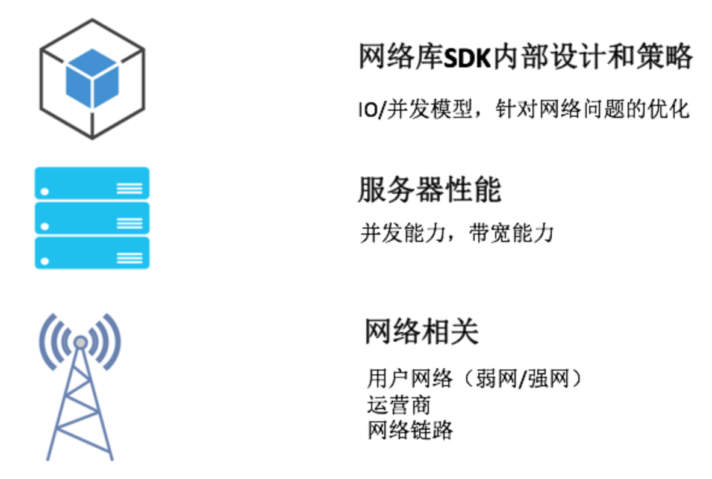

从上面这张图上看，客户端网络库实现、服务器性能以及网络链路的质量都是影响网络请求速度的因素。下面我们先从客户端的网络库说过，看看应该如何进行网络优化。

<strong>1. 何为网络优化</strong>

在讲怎么去优化网络之前，我想先明确一下所谓的网络优化，究竟指的是什么？在我看来，核心内容有以下三个：

<ul>
<li>
<strong>速度</strong>。在网络正常或者良好的时候，怎样更好地利用带宽，进一步提升网络请求速度。
</li>

<li>
<strong>弱网络</strong>。移动端网络复杂多变，在出现网络连接不稳定的时候，怎样最大程度保证网络的连通性。
</li>

<li>
<strong>安全</strong>。网络安全不容忽视，怎样有效防止被第三方劫持、窃听甚至篡改。
</li>
</ul>

除了这三个问题，我们可能还会关心网络请求造成的耗电、流量问题，这两块内容我们在后面会统一地讲，今天就不再展开。

那对于速度、弱网络以及安全的优化，又该从哪些方面入手呢？首先你需要先搞清楚一个网络请求的整个过程。

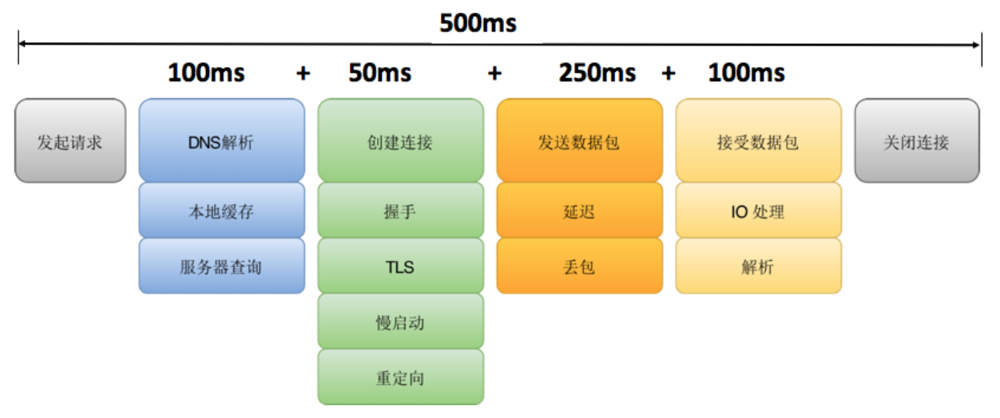

从图上看到，整个网络请求主要分为几个步骤，而整个请求的耗时可以细分到每一个步骤里面。

<ul>
<li>
<strong>DNS解析</strong>。通过DNS服务器，拿到对应域名的IP地址。在这个步骤，我们比较关注DNS解析耗时情况、运营商LocalDNS的劫持、DNS调度这些问题。
</li>

<li>
<strong>创建连接</strong>。跟服务器建立连接，这里包括TCP三次握手、TLS密钥协商等工作。多个IP/端口该如何选择、是否要使用HTTPS、能否可以减少甚至省下创建连接的时间，这些问题都是我们优化的关键。
</li>

<li>
<strong>发送/接收数据</strong>。在成功建立连接之后，就可以愉快地跟服务器交互，进行组装数据、发送数据、接收数据、解析数据。我们关注的是，如何根据网络状况将带宽利用好，怎么样快速地侦测到网络延时，在弱网络下如何调整包大小等问题。
</li>

<li>
<strong>关闭连接</strong>。连接的关闭看起来非常简单，其实这里的水也很深。这里主要关注主动关闭和被动关闭两种情况，一般我们都希望客户端可以主动关闭连接。
</li>
</ul>

所谓的网络优化，就是围绕速度、弱网络、安全这三个核心内容，减少每一个步骤的耗时，打造快速、稳定且安全的高质量网络。

<strong>2. 何为网络库</strong>

在实际的开发工作中，我们很少会像《UNIX网络编程》那样直接去操作底层的网络接口，一般都会使用网络库。Square出品的<a href="https://github.com/square/okhttp" target="_blank">OkHttp</a>是目前最流行的Android网络库，它还被Google加入到Android系统内部，为广大开发者提供网络服务。

那网络库究竟承担着一个什么样的角色呢？在我看来，它屏蔽了下层复杂的网络接口，让我们可以更高效地使用网络请求。

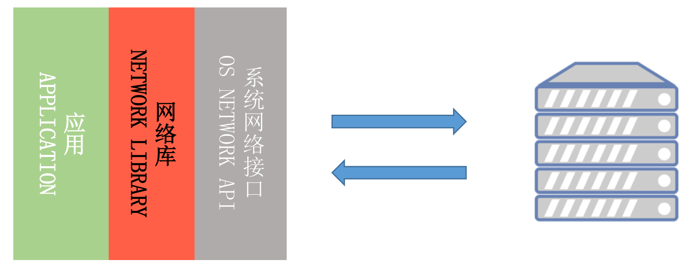

如上图所示，一个网络库的核心作用主要有以下三点：

<ul>
<li>
<strong>统一编程接口</strong>。无论是同步还是异步请求，接口都非常简单易用。同时我们可以统一做策略管理，统一进行流解析（JSON、XML、Protocol Buffers）等。
</li>

<li>
<strong>全局网络控制</strong>。在网络库内部我们可以做统一的网络调度、流量监控以及容灾管理等工作。
</li>

<li>
<strong>高性能</strong>。既然我们把所有的网络请求都交给了网络库，那网络库是否实现高性能就至关重要。既然要实现高性能，那我会非常关注速度，CPU、内存、I/O的使用，以及失败率、崩溃率、协议的兼容性等方面。
</li>
</ul>

不同的网络库实现差别很大，比较关键有这几个模块：

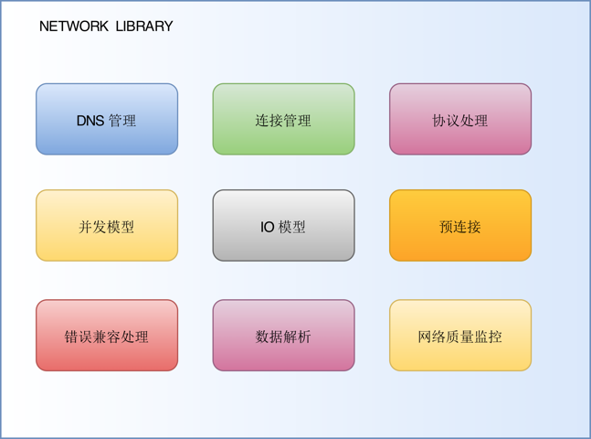

那网络库实现到底哪家强？接下来我们一起来对比OkHttp、Chromium的<a href="https://chromium.googlesource.com/chromium/src/+/master/components/cronet/" target="_blank">Cronet</a>以及微信<a href="https://github.com/Tencent/mars" target="_blank">Mars</a>这三个网络库的内部实现。

<strong>3. 高质量网络库</strong>

据我了解业内的<a href="https://www.infoq.cn/article/mogujie-app-chromium-network-layer?useSponsorshipSuggestions=true%2F" target="_blank">蘑菇街</a>、头条、UC浏览器都在Chromium网络库上做了二次开发，而微信Mars在弱网络方面做了大量优化，拼多多、虎牙、链家、美丽说这些应用都在使用Mars。

下面我们一起来对比一下各个网络库的核心实现。对于参与网络库相关工作来说，我的经验还算是比较丰富的。在微信的时候曾经参与过Mars的开发，目前也在基于Chromium网络库做二次开发。

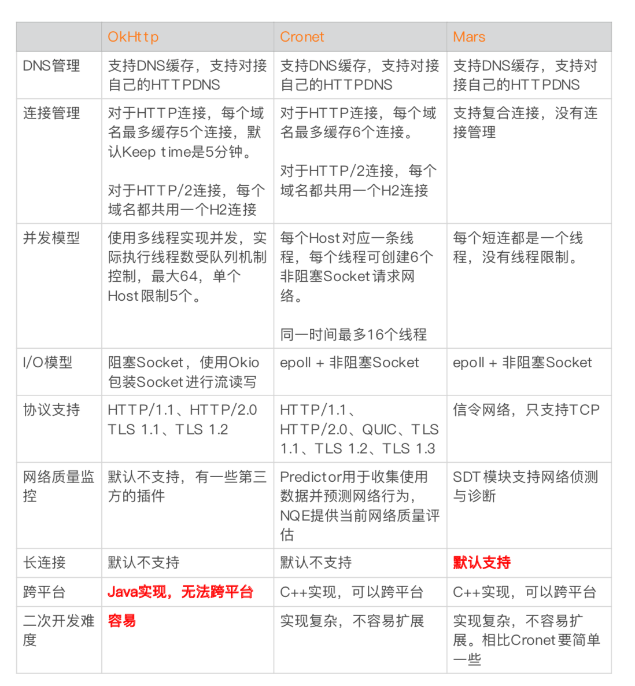

为什么我从来没使用过OkHttp？主要因为它并不支持跨平台，对于大型应用来说跨平台是非常重要的。我们不希望所有的优化Android和iOS都要各自去实现一套，不仅浪费人力而且还容易出问题。

对于Mars来说，它是一个跨平台的Socket层解决方案，并不支持完整的HTTP协议，所以Mars从严格意义上来讲并不是一个完整的网络库。但是它在弱网络和连接上做了大量的优化，并且支持长连接。关于Mars的网络多优化的更多细节，你可以参考<a href="https://github.com/Tencent/mars/wiki" target="_blank">Wiki</a>右侧的文章列表。

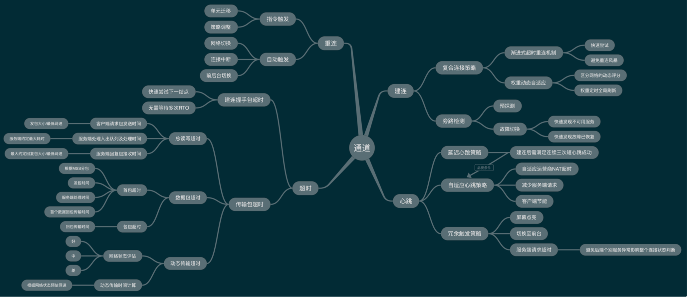

Chromium网络库作为标准的网络库，基本上可以说是找不到太大的缺点。而且我们可以享受Google后续网络优化的成果，类似TLS 1.3、QUIC支持等。

但是它针对弱网络场景没有做太多定制的优化，也不支持长连接。事实上目前我在Chromium网络库的二次开发主要工作也是补齐弱网络优化与长连接这两个短板。

<h2 id="大网络平台">大网络平台</h2>

对于大公司来说，我们不能只局限在客户端网络库的双端统一上。网络优化不仅仅是客户端的事情，所以我们有了统一的网络中台，它负责提供前后台一整套的网络解决方案。

阿里的<a href="https://www.infoq.cn/article/taobao-mobile-terminal-access-gateway-infrastructure" target="_blank">ACCS</a>、蚂蚁的<a href="https://mp.weixin.qq.com/s/nz8Z3Uj9840KHluWjwyelw" target="_blank">mPaaS</a>、携程的<a href="https://www.infoq.cn/article/how-ctrip-improves-app-networking-performance" target="_blank">网络服务</a>都是公司级的网络中台服务，这样所有的网络优化可以让整个集团的所有接入应用受益。

下图是mPaaS的网络架构图，所有网络请求都会先经过统一的接入层，再转发到业务服务器。这样我们可以在业务服务器无感知的情况下，在接入层做各种各样的网络优化。

<strong>1. HTTPDNS</strong>

DNS的解析是我们网络请求的第一项工作，默认我们使用运营商的LocalDNS服务。这块耗时在3G网络下可能是200～300ms，4G网络也需要100ms。

解析慢并不是默认LocalDNS最大的“原罪”，它还存在一些其他问题：

<ul>
<li>
<strong>稳定性</strong>。UDP协议，无状态，容易域名劫持（难复现、难定位、难解决），每天至少几百万个域名被劫持，一年至少十次大规模事件。
</li>

<li>
<strong>准确性</strong>。LocalDNS调度经常出现不准确，比如北京的用户调度到广东IP，移动的运营商调度到电信的IP，跨运营商调度会导致访问慢，甚至访问不了。
</li>

<li>
<strong>及时性</strong>。运营商可能会修改DNS的TTL，导致DNS修改生效延迟。不同运营商的服务实现不一致，我们也很难保证DNS解析的耗时。
</li>
</ul>

为了解决这些问题，就有了HTTPDNS。简单来说自己做域名解析的工作，通过HTTP请求后台去拿到域名对应的IP地址，直接解决上述所有问题。

微信有自己部署的NEWDNS，阿里云和腾讯云也有提供自己的HTTPDNS服务。对于大网络平台来说，我们会有统一的HTTPDNS服务，并将它和运维系统打通。在传统的DNS基础上，还会增加精准的流量调度、网络拨测/灰度、网络容灾等功能。

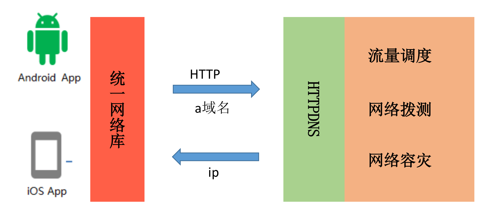

关于HTTPDNS的更多知识，你可以参考百度的<a href="https://mp.weixin.qq.com/s/iaPtSF-twWz-AN66UJUBDg" target="_blank">《DNS优化》</a>。对客户端来说，我们可以通过预请求的方法，提前拿到一批域名的IP，不过这里需要注意IPv4与IPv6协议栈的选择问题。

<strong>2. 连接复用</strong>

在DNS解析之后，我们来到了创建连接这个环节。创建连接要经过TCP三次握手、TLS密钥协商，连接建立的代价是非常大的。这里我们主要的优化思路是复用连接，这样不用每次请求都重新建立连接。

在前面我就讲过连接管理，网络库并不会立刻把连接释放，而是放到连接池中。这时如果有另一个请求的域名和端口是一样的，就直接拿出连接池中的连接进行发送和接收数据，少了建立连接的耗时。

这里我们利用HTTP协议里的keep-alive，而HTTP/2.0的多路复用则可以进一步的提升连接复用率。它复用的这条连接支持同时处理多条请求，所有请求都可以并发在这条连接上进行。

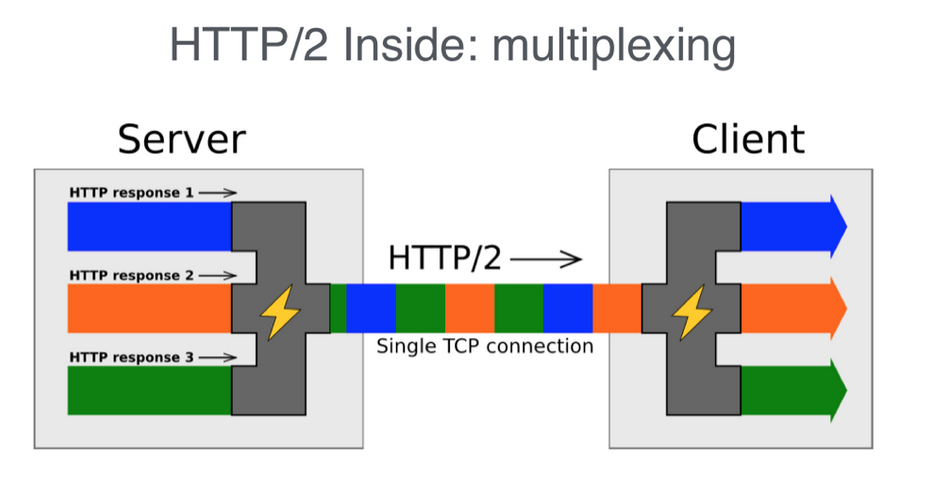

虽然H2十分强大，不过这里还有两个问题需要解决。一个是同一条H2连接只支持同一个域名，一个是后端支持HTTP/2.0需要额外的改造。这个时候我们只需要在统一接入层做改造，接入层将数据转换到HTTP/1.1再转发到对应域名的服务器。

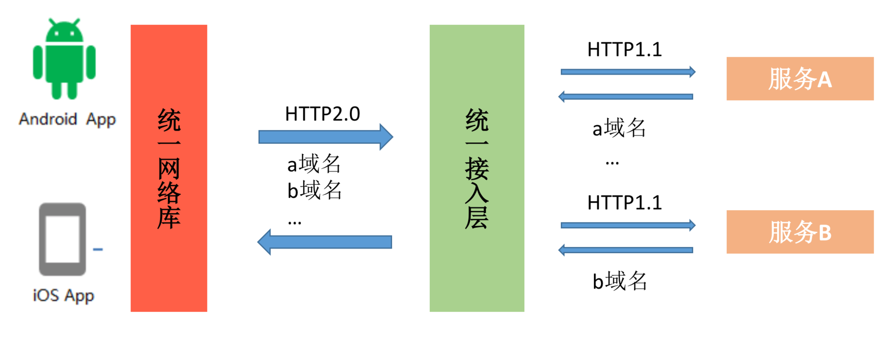

这样所有的服务都不用做任何改造就可以享受HTTP/2.0的所有优化，不过这里需要注意的是H2的多路复用在本质上依然是同一条TCP连接，如果所有的域名的请求都集中在某一条连接中，在网络拥塞的时候容易出现TCP队首阻塞问题。

对于客户端网络库来说，无论OkHttp还是Chromium网络库对于HTTP/2.0的连接，同一个域名只会保留一条连接。对于一些第三方请求，特别是文件下载以及视频播放这些场景可能会遇到对方服务器单连接限速的问题。在这种情况下我们可以通过修改网络库实现，也可以简单的通过禁用HTTP/2.0协议解决。

<strong>3. 压缩与加密</strong>

<strong>压缩</strong>

讲完连接，我们再来看看发送和接收的优化。我第一时间想到的还是减少传输的数据量，也就是我们常说的数据压缩。首先对于HTTP请求来说，数据主要包括三个部分：

<ul>
<li>
请求URL
</li>

<li>
请求header
</li>

<li>
请求body
</li>
</ul>

对于header来说，如果使用HTTP/2.0连接本身的<a href="https://imququ.com/post/header-compression-in-http2.html" target="_blank">头部压缩</a>技术，因此需要压缩的主要是请求URL和请求body。

对于请求URL来说，一般会带很多的公共参数，这些参数大部分都是不变的。这样不变的参数客户端只需要上传一次即可，其他请求我们可以在接入层中进行参数扩展。

对于请求body来说，一方面是数据通信协议的选择，在网络传输中目前最流行的两种数据序列化方式是JSON和Protocol Buffers。正如我之前所说的一样，Protocol Buffers使用起来更加复杂一些，但在数据压缩率、序列化与反序列化速度上面都有很大的优势。

另外一方面是压缩算法的选择，通用的压缩算法主要是如gzip，Google的<a href="https://github.com/google/brotli" target="_blank">Brotli</a>或者Facebook的<a href="https://github.com/facebook/zstd" target="_blank">Z-standard</a>都是压缩率更高的算法。其中如果Z-standard通过业务数据样本训练出适合的字典，是目前压缩率表现最好的算法。但是各个业务维护字典的成本比较大，这个时候我们的大网络平台的统一接入层又可以大显神威了。

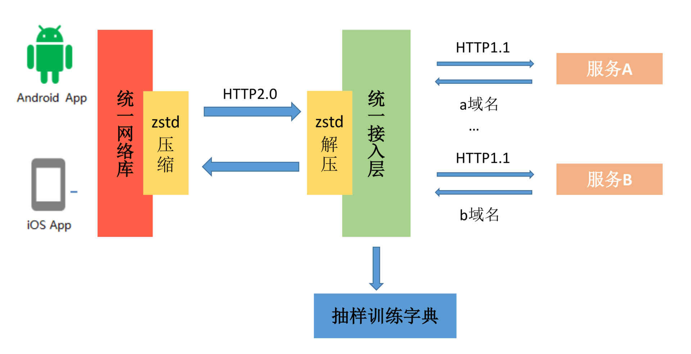

例如我们可以抽样1%的请求数据用来训练字典，字典的下发与更新都由统一接入层负责，业务并不需要关心。

当然针对特定数据我们还有其他的压缩方法，例如针对图片我们可以使用webp、hevc、<a href="https://mp.weixin.qq.com/s/JcBNT2aKTmLXRD9zIOPe6g" target="_blank">SharpP</a>等压缩率更高的格式。另外一方面，基于AI的<a href="http://imgtec.eetrend.com/d6-imgtec/blog/2017-08/10143.html" target="_blank">图片超清化</a>也是一大神器，QQ空间通过这个技术节约了大量的带宽成本。

<strong>安全</strong>

数据安全也是网络重中之重的一个环节，在大网络平台中我们都是基于HTTPS的HTTP/2通道，已经有了TLS加密。如果大家不熟悉TLS的基础知识，可以参考微信后台一个小伙伴写的<a href="https://blog.helong.info/blog/2015/09/07/tls-protocol-analysis-and-crypto-protocol-design/" target="_blank">《TLS协议分析》</a>。

但是HTTPS带来的代价也是不小的，它需要2-RTT的协商成本，在弱网络下时延不可接受。同时后台服务解密的成本也十分高昂，在大型企业中需要单独的集群来做这个事情。

HTTPS的优化有下面几个思路：

<ul>
<li>
<strong>连接复用率</strong>。通过多个域名共用同一个HTTP/2连接、长连接等方式提升连接复用率。
</li>

<li>
<strong>减少握手次数</strong>。<a href="https://zhuanlan.zhihu.com/p/44980381" target="_blank">TLS 1.3</a>可以实现0-RTT协商，事实上在TLS 1.3 release之前，微信的<a href="https://mp.weixin.qq.com/s/tvngTp6NoTZ15Yc206v8fQ" target="_blank">mmtls</a>、Facebook的<a href="https://mp.weixin.qq.com/s?__biz=MzI4MTY5NTk4Ng==&amp;mid=2247489465&amp;idx=1&amp;sn=a54e3fe78fc559458fa47104845e764b&amp;source=41#wechat_redirect" target="_blank">fizz</a>、阿里的SlightSSL都已在企业内部大规模部署。
</li>

<li>
<strong>性能提升</strong>。使用ecc证书代替RSA，服务端签名的性能可以提升4～10倍，但是客户端校验性能降低了约20倍，从10微秒级降低到100微秒级。另外一方面可以通过Session Ticket会话复用，节省一个RTT耗时。
</li>
</ul>

使用HTTPS之后，整个通道是不是就一定高枕无忧呢？如果客户端设置了代理，TLS加密的数据可以被解开并可能被利用 。这个时候我们可以在客户端将“<a href="https://sec.xiaomi.com/article/48" target="_blank">证书锁定</a>”（Certificate Pinning），为了老版本兼容和证书替换的灵活性，建议锁定根证书。

我们也可以对传输内容做二次加密，这块在统一接入层实现，业务服务器也同样无需关心这个流程。需要注意的是二次加密会增加客户端与服务器的处理耗时，我们需要在安全性与性能之间做一个取舍。

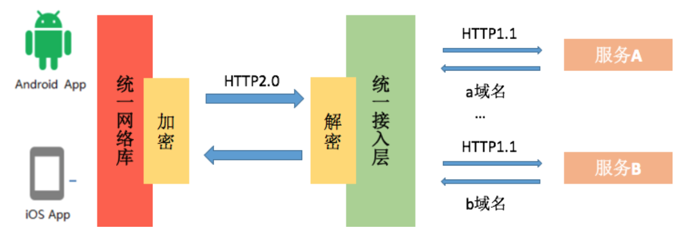

<strong>4. 其他优化</strong>

关于网络优化的手段还有很多，一些方案可能是需要用钱堆出来的，比如部署跨国的专线、加速点，多IDC就近接入等。

除此之外，使用<a href="https://toutiao.io/posts/6gb8ih/preview" target="_blank">CDN服务</a>、<a href="https://mp.weixin.qq.com/s?__biz=MzI4MTY5NTk4Ng==&amp;mid=2247489182&amp;idx=1&amp;sn=e892855fd315ed2f1395f05b765f9c4e&amp;source=41#wechat_redirect" target="_blank">P2P技术</a>也是比较常用的手段，特别在直播这类场景。总的来说，网络优化我们需要综合用户体验、带宽成本以及硬件成本等多个因素来考虑。

下面为你献上一张高质量网络的全景大图。

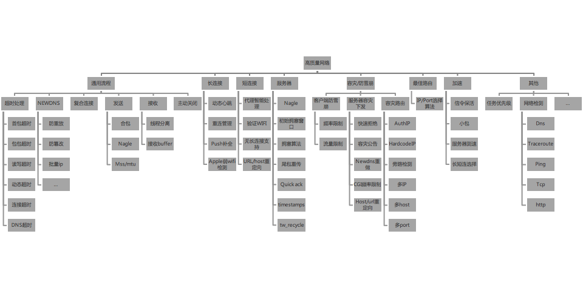

<h2 id="quic与ipv6">QUIC与IPv6</h2>

今天已经讲得很多了，可能还有小伙伴比较关心最近一些比较前沿的技术，我简单讲一下QUIC和IPv6。

<strong>1. QUIC</strong>

QUIC协议由Google在2013年实现，在2018年基于QUIC协议的HTTP更被确认为<a href="https://zh.wikipedia.org/wiki/HTTP/3" target="_blank">HTTP/3</a>。在连接复用中我说过HTTP/2 + TCP会存在队首阻塞的问题，基于UDP的QUIC才是终极解决方案。

如下图所示，你可以把QUIC简单理解为HTTP/2.0 + TLS 1.3 + UDP。

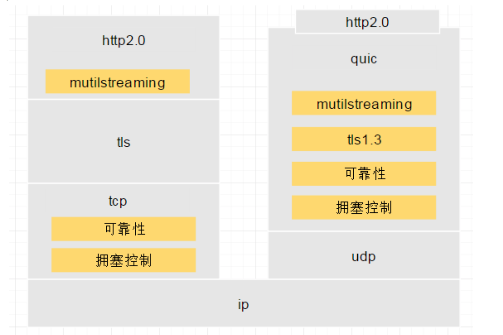

事实上，它还有着其他的很多优势：

<ul>
<li>
<strong>灵活控制拥塞协议</strong>。如果想对TCP内部的拥塞控制算法等模块进行优化和升级，整体周期是相对较长的。对于UDP来说，我们不需要操作系统支持，随时可改，例如可以直接使用Google的<a href="https://queue.acm.org/detail.cfm?id=3022184" target="_blank">BBR算法</a>。
</li>

<li>
<strong>“真”连接复用</strong>。不仅解决了队首阻塞的问题，在客户端网络切换的时候也不需要重连，用户使用App的体验会更加流畅。
</li>
</ul>

既然QUIC那么好，为什么我们在生产环境没有全部切换成QUIC呢？那是因为有很多坑还没有踩完，目前发现的主要问题还有：

<ul>
<li>
<strong>创建连接成功率</strong>。主要是UDP的穿透性问题，NAT局域网路由、交换机、防火墙等会禁止UDP 443通行，目前QUIC在国内建连的成功率大约在95%左右。
</li>

<li>
<strong>运营商支持</strong>。运营商针对UDP通道支持不足，表现也不稳定。例如QoS限速丢包，有些小的运营商甚至还直接不支持UDP包。
</li>
</ul>

尽管有这样那样的问题，但是QUIC一定是未来。当然，通过大网络平台的统一接入层，我们业务基本无需做什么修改。目前据我了解，<a href="https://archstat.com/infoQ/archSummit/2018%E6%9E%B6%E6%9E%84%E5%B8%88%E5%90%88%E9%9B%86/AS%E6%B7%B1%E5%9C%B32018-%E3%80%8AQUIC%E5%8D%8F%E8%AE%AE%E5%9C%A8%E8%85%BE%E8%AE%AF%E7%9A%84%E5%AE%9E%E8%B7%B5%E5%92%8C%E4%BC%98%E5%8C%96%E3%80%8B-%E7%BD%97%E6%88%90.pdf" target="_blank">腾讯</a>、<a href="https://github.com/thinkpiggy/qcon2018ppt/blob/master/QUIC%E5%9C%A8%E6%89%8B%E6%9C%BA%E5%BE%AE%E5%8D%9A%E4%B8%AD%E7%9A%84%E5%BA%94%E7%94%A8%E5%AE%9E%E8%B7%B5.pdf" target="_blank">微博</a>、<a href="https://mp.weixin.qq.com/s/QhaFKuxTf3mrbF-eWIkZTw" target="_blank">阿里</a>都在内部逐步加大QUIC的流量，具体细节可以参考我给出的链接。

<strong>2. IPv6</strong>

运维人员都会深深的感觉到IP资源的珍贵，而致力于解决这个问题的IPv6却在中国一直非常沉寂。根据<a href="https://www.ipv6ready.org.cn/public/download/ipv6.pdf" target="_blank">《2017年IPV6支持度报告》</a>，在中国只有0.38%的用户使用v6。

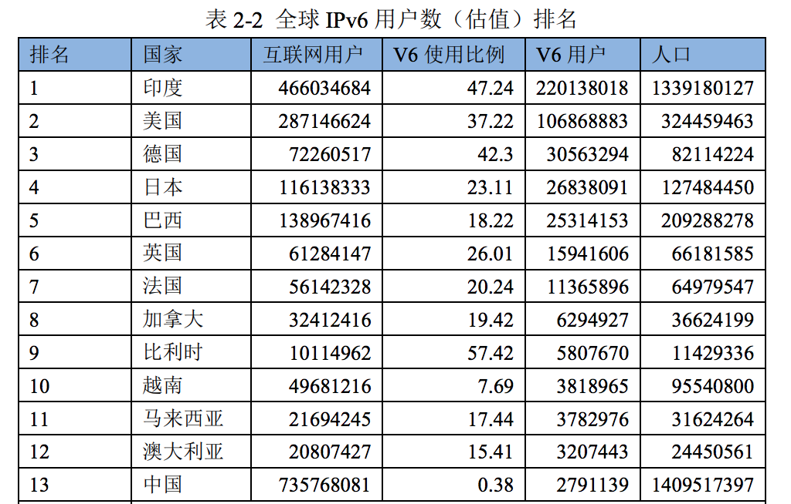

IPv6不仅针对IoT技术，对万物互联的时代有着非常大的意义。而且它对网络性能也有正向的作用，在印度经过我们测试，使用IPv6网络相比IPv4连接耗时可以降低10%～20%。推行IPv6后，无穷无尽的IP地址意味着可以告别各种NAT，P2P、QUIC的连接也不再是问题。

在过去的一年，无论是<a href="https://mp.weixin.qq.com/s/RXICO_3W2cxTYk0UV40GLQ" target="_blank">阿里云</a>还是<a href="https://mp.weixin.qq.com/s/ufV7mZWHPfLNE1-QxWmEfQ" target="_blank">腾讯云</a>都做了大量IPv6的工作。当然主要也是接入层的改造，尽量不需要业务服务做太多修改。

<h2 id="总结">总结</h2>

移动技术发展到今天，跨终端和跨技术栈的联合优化会变得越来越普遍。有的时候我们需要跳出客户端开发的视角，从更高的维度去思考整个大网络平台。当然网络优化的水还是非常深的，有时候我们需要对协议层也有比较深入的研究，也要经常关注国外的一些新的研究成果。

2018年随着工信部发布《推进互联网协议第六版（IPv6）规模部署行动计划》的通知，所有的云提供商需要在2020年完成IPv6的支持。QUIC在2018年被定为HTTP/3草案，同时3GPP也将QUIC列入5G核心网协议第二阶段标准（3GPP Release 16）。

随着5G、QUIC与IPv6未来在中国的普及，网络优化永不止步，它们将推动我们继续努力去做更多尝试，让用户可以有更好的网络体验。

<h2 id="课后作业">课后作业</h2>

你的应用使用的是哪个网络库？对于网络优化，你还有哪些实践经验？欢迎留言跟我和其他同学一起讨论。

网络优化是一个很大的话题，在课后你还需要进一步扩展学习。除了今天文章里给出的链接，这里还提供一些参考资料给你：

<ul>
<li>
<a href="https://github.com/WeMobileDev/article/blob/master/%E5%BE%AE%E4%BF%A1%E5%AE%A2%E6%88%B7%E7%AB%AF%E6%80%8E%E6%A0%B7%E5%BA%94%E5%AF%B9%E5%BC%B1%E7%BD%91%E7%BB%9C.pdf" target="_blank">微信客户端怎样应对弱网络</a>
</li>

<li>
<a href="http://img.bigdatabugs.com/ArchSummit%E5%8C%97%E4%BA%AC-%E3%80%8A%E9%98%BF%E9%87%8C%E4%BA%BF%E7%BA%A7%E6%97%A5%E6%B4%BB%E7%BD%91%E5%85%B3%E9%80%9A%E9%81%93%E6%9E%B6%E6%9E%84%E6%BC%94%E8%BF%9B%E3%80%8B-%E6%B4%AA%E6%B5%B7%EF%BC%88%E5%AD%A4%E6%98%9F%EF%BC%89@www.bigDataBugs.com.pdf" target="_blank">阿里亿级日活网关通道架构演进</a>
</li>

<li>
<a href="https://github.com/aozhimin/awesome-iOS-resource/blob/master/Conferences/%E9%98%BF%E9%87%8C%E5%B7%B4%E5%B7%B4HTTP%202.0%E5%AE%9E%E8%B7%B5%E5%8F%8A%E6%97%A0%E7%BA%BF%E9%80%9A%E4%BF%A1%E5%8D%8F%E8%AE%AE%E7%9A%84%E6%BC%94%E8%BF%9B%E4%B9%8B%E8%B7%AF.pdf" target="_blank">阿里巴巴HTTP 2.0实践及无线通信协议的演进之路</a>
</li>
</ul>

欢迎你点击“请朋友读”，把今天的内容分享给好友，邀请他一起学习。最后别忘了在评论区提交今天的作业，我也为认真完成作业的同学准备了丰厚的“学习加油礼包”，期待与你一起切磋进步哦。

                        

                        

                            

                            

                            

                            

                        

                    

                

            

            

                

                
© 2019 - 2023 <a href="/cdn-cgi/l/email-protection#731f1f1f4a474242434433141e121a1f5d101c1e" target="_blank">Liangliang Lee</a>.
                    Powered by <a href="https://github.com/gin-gonic/gin" target="_blank">gin</a> and <a
                        href="https://github.com/kaiiiz/hexo-theme-book" target="_blank">hexo-theme-book</a>.

            

        

        
    

</body>

</html>