<!DOCTYPE html>
<html xmlns="http://www.w3.org/1999/xhtml">

<head>

    <head>
        <meta http-equiv="Content-Type" content="text/html; charset=UTF-8">
        <meta name="viewport" content="width=device-width, initial-scale=1, maximum-scale=1.0, user-scalable=no">
        <meta http-equiv='content-language' content='zh-cn'>
        <meta name='description' content=20&#32;UI&#32;优化（上）：UI&#32;渲染的几个关键概念>
        <link rel="icon" href="/static/favicon.png">
        <title>20 UI 优化（上）：UI 渲染的几个关键概念 </title>
        
        <link rel="stylesheet" href="/static/index.css">
        <link rel="stylesheet" href="/static/highlight.min.css">
        
        
        <meta name="generator" content="Hexo 4.2.0">
        
    </head>

<body>
    

        

            

                <a href="/">
                    
                    技术文章摘抄
                </a>
            

            

                <ul class="uncollapsible">
                    <li><a href="/" class="current-tab">首页</a></li>
                    <li><a href="../">上一级</a></li>
                </ul>
                <ul class="uncollapsible">
                    
                    <li>
                        <a class="menu-item" id="00 导读 如何打造高质量的应用？.md" href="/%e4%b8%93%e6%a0%8f/Android%e5%bc%80%e5%8f%91%e9%ab%98%e6%89%8b%e8%af%be/00%20%e5%af%bc%e8%af%bb%20%e5%a6%82%e4%bd%95%e6%89%93%e9%80%a0%e9%ab%98%e8%b4%a8%e9%87%8f%e7%9a%84%e5%ba%94%e7%94%a8%ef%bc%9f.md">00 导读 如何打造高质量的应用？.md</a>
                    </li>
                    
                    <li>
                        <a class="menu-item" id="00 开篇词 焦虑的移动开发者该如何破局？.md" href="/%e4%b8%93%e6%a0%8f/Android%e5%bc%80%e5%8f%91%e9%ab%98%e6%89%8b%e8%af%be/00%20%e5%bc%80%e7%af%87%e8%af%8d%20%e7%84%a6%e8%99%91%e7%9a%84%e7%a7%bb%e5%8a%a8%e5%bc%80%e5%8f%91%e8%80%85%e8%af%a5%e5%a6%82%e4%bd%95%e7%a0%b4%e5%b1%80%ef%bc%9f.md">00 开篇词 焦虑的移动开发者该如何破局？.md</a>
                    </li>
                    
                    <li>
                        <a class="menu-item" id="01 崩溃优化（上）：关于“崩溃”那些事儿.md" href="/%e4%b8%93%e6%a0%8f/Android%e5%bc%80%e5%8f%91%e9%ab%98%e6%89%8b%e8%af%be/01%20%e5%b4%a9%e6%ba%83%e4%bc%98%e5%8c%96%ef%bc%88%e4%b8%8a%ef%bc%89%ef%bc%9a%e5%85%b3%e4%ba%8e%e2%80%9c%e5%b4%a9%e6%ba%83%e2%80%9d%e9%82%a3%e4%ba%9b%e4%ba%8b%e5%84%bf.md">01 崩溃优化（上）：关于“崩溃”那些事儿.md</a>
                    </li>
                    
                    <li>
                        <a class="menu-item" id="02 崩溃优化（下）：应用崩溃了，你应该如何去分析？.md" href="/%e4%b8%93%e6%a0%8f/Android%e5%bc%80%e5%8f%91%e9%ab%98%e6%89%8b%e8%af%be/02%20%e5%b4%a9%e6%ba%83%e4%bc%98%e5%8c%96%ef%bc%88%e4%b8%8b%ef%bc%89%ef%bc%9a%e5%ba%94%e7%94%a8%e5%b4%a9%e6%ba%83%e4%ba%86%ef%bc%8c%e4%bd%a0%e5%ba%94%e8%af%a5%e5%a6%82%e4%bd%95%e5%8e%bb%e5%88%86%e6%9e%90%ef%bc%9f.md">02 崩溃优化（下）：应用崩溃了，你应该如何去分析？.md</a>
                    </li>
                    
                    <li>
                        <a class="menu-item" id="03 内存优化（上）：4GB内存时代，再谈内存优化.md" href="/%e4%b8%93%e6%a0%8f/Android%e5%bc%80%e5%8f%91%e9%ab%98%e6%89%8b%e8%af%be/03%20%e5%86%85%e5%ad%98%e4%bc%98%e5%8c%96%ef%bc%88%e4%b8%8a%ef%bc%89%ef%bc%9a4GB%e5%86%85%e5%ad%98%e6%97%b6%e4%bb%a3%ef%bc%8c%e5%86%8d%e8%b0%88%e5%86%85%e5%ad%98%e4%bc%98%e5%8c%96.md">03 内存优化（上）：4GB内存时代，再谈内存优化.md</a>
                    </li>
                    
                    <li>
                        <a class="menu-item" id="04 内存优化（下）：内存优化这件事，应该从哪里着手？.md" href="/%e4%b8%93%e6%a0%8f/Android%e5%bc%80%e5%8f%91%e9%ab%98%e6%89%8b%e8%af%be/04%20%e5%86%85%e5%ad%98%e4%bc%98%e5%8c%96%ef%bc%88%e4%b8%8b%ef%bc%89%ef%bc%9a%e5%86%85%e5%ad%98%e4%bc%98%e5%8c%96%e8%bf%99%e4%bb%b6%e4%ba%8b%ef%bc%8c%e5%ba%94%e8%af%a5%e4%bb%8e%e5%93%aa%e9%87%8c%e7%9d%80%e6%89%8b%ef%bc%9f.md">04 内存优化（下）：内存优化这件事，应该从哪里着手？.md</a>
                    </li>
                    
                    <li>
                        <a class="menu-item" id="05 卡顿优化（上）：你要掌握的卡顿分析方法.md" href="/%e4%b8%93%e6%a0%8f/Android%e5%bc%80%e5%8f%91%e9%ab%98%e6%89%8b%e8%af%be/05%20%e5%8d%a1%e9%a1%bf%e4%bc%98%e5%8c%96%ef%bc%88%e4%b8%8a%ef%bc%89%ef%bc%9a%e4%bd%a0%e8%a6%81%e6%8e%8c%e6%8f%a1%e7%9a%84%e5%8d%a1%e9%a1%bf%e5%88%86%e6%9e%90%e6%96%b9%e6%b3%95.md">05 卡顿优化（上）：你要掌握的卡顿分析方法.md</a>
                    </li>
                    
                    <li>
                        <a class="menu-item" id="06 卡顿优化（下）：如何监控应用卡顿？.md" href="/%e4%b8%93%e6%a0%8f/Android%e5%bc%80%e5%8f%91%e9%ab%98%e6%89%8b%e8%af%be/06%20%e5%8d%a1%e9%a1%bf%e4%bc%98%e5%8c%96%ef%bc%88%e4%b8%8b%ef%bc%89%ef%bc%9a%e5%a6%82%e4%bd%95%e7%9b%91%e6%8e%a7%e5%ba%94%e7%94%a8%e5%8d%a1%e9%a1%bf%ef%bc%9f.md">06 卡顿优化（下）：如何监控应用卡顿？.md</a>
                    </li>
                    
                    <li>
                        <a class="menu-item" id="06补充篇 卡顿优化：卡顿现场与卡顿分析.md" href="/%e4%b8%93%e6%a0%8f/Android%e5%bc%80%e5%8f%91%e9%ab%98%e6%89%8b%e8%af%be/06%e8%a1%a5%e5%85%85%e7%af%87%20%e5%8d%a1%e9%a1%bf%e4%bc%98%e5%8c%96%ef%bc%9a%e5%8d%a1%e9%a1%bf%e7%8e%b0%e5%9c%ba%e4%b8%8e%e5%8d%a1%e9%a1%bf%e5%88%86%e6%9e%90.md">06补充篇 卡顿优化：卡顿现场与卡顿分析.md</a>
                    </li>
                    
                    <li>
                        <a class="menu-item" id="07 启动优化（上）：从启动过程看启动速度优化.md" href="/%e4%b8%93%e6%a0%8f/Android%e5%bc%80%e5%8f%91%e9%ab%98%e6%89%8b%e8%af%be/07%20%e5%90%af%e5%8a%a8%e4%bc%98%e5%8c%96%ef%bc%88%e4%b8%8a%ef%bc%89%ef%bc%9a%e4%bb%8e%e5%90%af%e5%8a%a8%e8%bf%87%e7%a8%8b%e7%9c%8b%e5%90%af%e5%8a%a8%e9%80%9f%e5%ba%a6%e4%bc%98%e5%8c%96.md">07 启动优化（上）：从启动过程看启动速度优化.md</a>
                    </li>
                    
                    <li>
                        <a class="menu-item" id="08 启动优化（下）：优化启动速度的进阶方法.md" href="/%e4%b8%93%e6%a0%8f/Android%e5%bc%80%e5%8f%91%e9%ab%98%e6%89%8b%e8%af%be/08%20%e5%90%af%e5%8a%a8%e4%bc%98%e5%8c%96%ef%bc%88%e4%b8%8b%ef%bc%89%ef%bc%9a%e4%bc%98%e5%8c%96%e5%90%af%e5%8a%a8%e9%80%9f%e5%ba%a6%e7%9a%84%e8%bf%9b%e9%98%b6%e6%96%b9%e6%b3%95.md">08 启动优化（下）：优化启动速度的进阶方法.md</a>
                    </li>
                    
                    <li>
                        <a class="menu-item" id="09 I_O优化（上）：开发工程师必备的I_O优化知识.md" href="/%e4%b8%93%e6%a0%8f/Android%e5%bc%80%e5%8f%91%e9%ab%98%e6%89%8b%e8%af%be/09%20I_O%e4%bc%98%e5%8c%96%ef%bc%88%e4%b8%8a%ef%bc%89%ef%bc%9a%e5%bc%80%e5%8f%91%e5%b7%a5%e7%a8%8b%e5%b8%88%e5%bf%85%e5%a4%87%e7%9a%84I_O%e4%bc%98%e5%8c%96%e7%9f%a5%e8%af%86.md">09 I_O优化（上）：开发工程师必备的I_O优化知识.md</a>
                    </li>
                    
                    <li>
                        <a class="menu-item" id="10 I_O优化（中）：不同I_O方式的使用场景是什么？.md" href="/%e4%b8%93%e6%a0%8f/Android%e5%bc%80%e5%8f%91%e9%ab%98%e6%89%8b%e8%af%be/10%20I_O%e4%bc%98%e5%8c%96%ef%bc%88%e4%b8%ad%ef%bc%89%ef%bc%9a%e4%b8%8d%e5%90%8cI_O%e6%96%b9%e5%bc%8f%e7%9a%84%e4%bd%bf%e7%94%a8%e5%9c%ba%e6%99%af%e6%98%af%e4%bb%80%e4%b9%88%ef%bc%9f.md">10 I_O优化（中）：不同I_O方式的使用场景是什么？.md</a>
                    </li>
                    
                    <li>
                        <a class="menu-item" id="11 I_O优化（下）：如何监控线上I_O操作？.md" href="/%e4%b8%93%e6%a0%8f/Android%e5%bc%80%e5%8f%91%e9%ab%98%e6%89%8b%e8%af%be/11%20I_O%e4%bc%98%e5%8c%96%ef%bc%88%e4%b8%8b%ef%bc%89%ef%bc%9a%e5%a6%82%e4%bd%95%e7%9b%91%e6%8e%a7%e7%ba%bf%e4%b8%8aI_O%e6%93%8d%e4%bd%9c%ef%bc%9f.md">11 I_O优化（下）：如何监控线上I_O操作？.md</a>
                    </li>
                    
                    <li>
                        <a class="menu-item" id="12 存储优化（上）：常见的数据存储方法有哪些？.md" href="/%e4%b8%93%e6%a0%8f/Android%e5%bc%80%e5%8f%91%e9%ab%98%e6%89%8b%e8%af%be/12%20%e5%ad%98%e5%82%a8%e4%bc%98%e5%8c%96%ef%bc%88%e4%b8%8a%ef%bc%89%ef%bc%9a%e5%b8%b8%e8%a7%81%e7%9a%84%e6%95%b0%e6%8d%ae%e5%ad%98%e5%82%a8%e6%96%b9%e6%b3%95%e6%9c%89%e5%93%aa%e4%ba%9b%ef%bc%9f.md">12 存储优化（上）：常见的数据存储方法有哪些？.md</a>
                    </li>
                    
                    <li>
                        <a class="menu-item" id="13 存储优化（中）：如何优化数据存储？.md" href="/%e4%b8%93%e6%a0%8f/Android%e5%bc%80%e5%8f%91%e9%ab%98%e6%89%8b%e8%af%be/13%20%e5%ad%98%e5%82%a8%e4%bc%98%e5%8c%96%ef%bc%88%e4%b8%ad%ef%bc%89%ef%bc%9a%e5%a6%82%e4%bd%95%e4%bc%98%e5%8c%96%e6%95%b0%e6%8d%ae%e5%ad%98%e5%82%a8%ef%bc%9f.md">13 存储优化（中）：如何优化数据存储？.md</a>
                    </li>
                    
                    <li>
                        <a class="menu-item" id="14 存储优化（下）：数据库SQLite的使用和优化.md" href="/%e4%b8%93%e6%a0%8f/Android%e5%bc%80%e5%8f%91%e9%ab%98%e6%89%8b%e8%af%be/14%20%e5%ad%98%e5%82%a8%e4%bc%98%e5%8c%96%ef%bc%88%e4%b8%8b%ef%bc%89%ef%bc%9a%e6%95%b0%e6%8d%ae%e5%ba%93SQLite%e7%9a%84%e4%bd%bf%e7%94%a8%e5%92%8c%e4%bc%98%e5%8c%96.md">14 存储优化（下）：数据库SQLite的使用和优化.md</a>
                    </li>
                    
                    <li>
                        <a class="menu-item" id="15 网络优化（上）：移动开发工程师必备的网络优化知识.md" href="/%e4%b8%93%e6%a0%8f/Android%e5%bc%80%e5%8f%91%e9%ab%98%e6%89%8b%e8%af%be/15%20%e7%bd%91%e7%bb%9c%e4%bc%98%e5%8c%96%ef%bc%88%e4%b8%8a%ef%bc%89%ef%bc%9a%e7%a7%bb%e5%8a%a8%e5%bc%80%e5%8f%91%e5%b7%a5%e7%a8%8b%e5%b8%88%e5%bf%85%e5%a4%87%e7%9a%84%e7%bd%91%e7%bb%9c%e4%bc%98%e5%8c%96%e7%9f%a5%e8%af%86.md">15 网络优化（上）：移动开发工程师必备的网络优化知识.md</a>
                    </li>
                    
                    <li>
                        <a class="menu-item" id="16 网络优化（中）：复杂多变的移动网络该如何优化？.md" href="/%e4%b8%93%e6%a0%8f/Android%e5%bc%80%e5%8f%91%e9%ab%98%e6%89%8b%e8%af%be/16%20%e7%bd%91%e7%bb%9c%e4%bc%98%e5%8c%96%ef%bc%88%e4%b8%ad%ef%bc%89%ef%bc%9a%e5%a4%8d%e6%9d%82%e5%a4%9a%e5%8f%98%e7%9a%84%e7%a7%bb%e5%8a%a8%e7%bd%91%e7%bb%9c%e8%af%a5%e5%a6%82%e4%bd%95%e4%bc%98%e5%8c%96%ef%bc%9f.md">16 网络优化（中）：复杂多变的移动网络该如何优化？.md</a>
                    </li>
                    
                    <li>
                        <a class="menu-item" id="17 网络优化（下）：大数据下网络该如何监控？.md" href="/%e4%b8%93%e6%a0%8f/Android%e5%bc%80%e5%8f%91%e9%ab%98%e6%89%8b%e8%af%be/17%20%e7%bd%91%e7%bb%9c%e4%bc%98%e5%8c%96%ef%bc%88%e4%b8%8b%ef%bc%89%ef%bc%9a%e5%a4%a7%e6%95%b0%e6%8d%ae%e4%b8%8b%e7%bd%91%e7%bb%9c%e8%af%a5%e5%a6%82%e4%bd%95%e7%9b%91%e6%8e%a7%ef%bc%9f.md">17 网络优化（下）：大数据下网络该如何监控？.md</a>
                    </li>
                    
                    <li>
                        <a class="menu-item" id="18 耗电优化（上）：从电量优化的演进看耗电分析.md" href="/%e4%b8%93%e6%a0%8f/Android%e5%bc%80%e5%8f%91%e9%ab%98%e6%89%8b%e8%af%be/18%20%e8%80%97%e7%94%b5%e4%bc%98%e5%8c%96%ef%bc%88%e4%b8%8a%ef%bc%89%ef%bc%9a%e4%bb%8e%e7%94%b5%e9%87%8f%e4%bc%98%e5%8c%96%e7%9a%84%e6%bc%94%e8%bf%9b%e7%9c%8b%e8%80%97%e7%94%b5%e5%88%86%e6%9e%90.md">18 耗电优化（上）：从电量优化的演进看耗电分析.md</a>
                    </li>
                    
                    <li>
                        <a class="menu-item" id="19 耗电优化（下）：耗电的优化方法与线上监控.md" href="/%e4%b8%93%e6%a0%8f/Android%e5%bc%80%e5%8f%91%e9%ab%98%e6%89%8b%e8%af%be/19%20%e8%80%97%e7%94%b5%e4%bc%98%e5%8c%96%ef%bc%88%e4%b8%8b%ef%bc%89%ef%bc%9a%e8%80%97%e7%94%b5%e7%9a%84%e4%bc%98%e5%8c%96%e6%96%b9%e6%b3%95%e4%b8%8e%e7%ba%bf%e4%b8%8a%e7%9b%91%e6%8e%a7.md">19 耗电优化（下）：耗电的优化方法与线上监控.md</a>
                    </li>
                    
                    <li>
                        <a class="menu-item" id="20 UI 优化（上）：UI 渲染的几个关键概念.md" href="/%e4%b8%93%e6%a0%8f/Android%e5%bc%80%e5%8f%91%e9%ab%98%e6%89%8b%e8%af%be/20%20UI%20%e4%bc%98%e5%8c%96%ef%bc%88%e4%b8%8a%ef%bc%89%ef%bc%9aUI%20%e6%b8%b2%e6%9f%93%e7%9a%84%e5%87%a0%e4%b8%aa%e5%85%b3%e9%94%ae%e6%a6%82%e5%bf%b5.md">20 UI 优化（上）：UI 渲染的几个关键概念.md</a>
                    </li>
                    
                    <li>
                        <a class="menu-item" id="21 UI 优化（下）：如何优化 UI 渲染？.md" href="/%e4%b8%93%e6%a0%8f/Android%e5%bc%80%e5%8f%91%e9%ab%98%e6%89%8b%e8%af%be/21%20UI%20%e4%bc%98%e5%8c%96%ef%bc%88%e4%b8%8b%ef%bc%89%ef%bc%9a%e5%a6%82%e4%bd%95%e4%bc%98%e5%8c%96%20UI%20%e6%b8%b2%e6%9f%93%ef%bc%9f.md">21 UI 优化（下）：如何优化 UI 渲染？.md</a>
                    </li>
                    
                    <li>
                        <a class="menu-item" id="22 包体积优化（上）：如何减少安装包大小？.md" href="/%e4%b8%93%e6%a0%8f/Android%e5%bc%80%e5%8f%91%e9%ab%98%e6%89%8b%e8%af%be/22%20%e5%8c%85%e4%bd%93%e7%a7%af%e4%bc%98%e5%8c%96%ef%bc%88%e4%b8%8a%ef%bc%89%ef%bc%9a%e5%a6%82%e4%bd%95%e5%87%8f%e5%b0%91%e5%ae%89%e8%a3%85%e5%8c%85%e5%a4%a7%e5%b0%8f%ef%bc%9f.md">22 包体积优化（上）：如何减少安装包大小？.md</a>
                    </li>
                    
                    <li>
                        <a class="menu-item" id="23 包体积优化（下）：资源优化的进阶实践.md" href="/%e4%b8%93%e6%a0%8f/Android%e5%bc%80%e5%8f%91%e9%ab%98%e6%89%8b%e8%af%be/23%20%e5%8c%85%e4%bd%93%e7%a7%af%e4%bc%98%e5%8c%96%ef%bc%88%e4%b8%8b%ef%bc%89%ef%bc%9a%e8%b5%84%e6%ba%90%e4%bc%98%e5%8c%96%e7%9a%84%e8%bf%9b%e9%98%b6%e5%ae%9e%e8%b7%b5.md">23 包体积优化（下）：资源优化的进阶实践.md</a>
                    </li>
                    
                    <li>
                        <a class="menu-item" id="24 想成为Android高手，你需要先搞定这三个问题.md" href="/%e4%b8%93%e6%a0%8f/Android%e5%bc%80%e5%8f%91%e9%ab%98%e6%89%8b%e8%af%be/24%20%e6%83%b3%e6%88%90%e4%b8%baAndroid%e9%ab%98%e6%89%8b%ef%bc%8c%e4%bd%a0%e9%9c%80%e8%a6%81%e5%85%88%e6%90%9e%e5%ae%9a%e8%bf%99%e4%b8%89%e4%b8%aa%e9%97%ae%e9%a2%98.md">24 想成为Android高手，你需要先搞定这三个问题.md</a>
                    </li>
                    
                    <li>
                        <a class="menu-item" id="25 如何提升组织与个人的研发效能？.md" href="/%e4%b8%93%e6%a0%8f/Android%e5%bc%80%e5%8f%91%e9%ab%98%e6%89%8b%e8%af%be/25%20%e5%a6%82%e4%bd%95%e6%8f%90%e5%8d%87%e7%bb%84%e7%bb%87%e4%b8%8e%e4%b8%aa%e4%ba%ba%e7%9a%84%e7%a0%94%e5%8f%91%e6%95%88%e8%83%bd%ef%bc%9f.md">25 如何提升组织与个人的研发效能？.md</a>
                    </li>
                    
                    <li>
                        <a class="menu-item" id="26 关于编译，你需要了解什么？.md" href="/%e4%b8%93%e6%a0%8f/Android%e5%bc%80%e5%8f%91%e9%ab%98%e6%89%8b%e8%af%be/26%20%e5%85%b3%e4%ba%8e%e7%bc%96%e8%af%91%ef%bc%8c%e4%bd%a0%e9%9c%80%e8%a6%81%e4%ba%86%e8%a7%a3%e4%bb%80%e4%b9%88%ef%bc%9f.md">26 关于编译，你需要了解什么？.md</a>
                    </li>
                    
                    <li>
                        <a class="menu-item" id="27 编译插桩的三种方法：AspectJ、ASM、ReDex.md" href="/%e4%b8%93%e6%a0%8f/Android%e5%bc%80%e5%8f%91%e9%ab%98%e6%89%8b%e8%af%be/27%20%e7%bc%96%e8%af%91%e6%8f%92%e6%a1%a9%e7%9a%84%e4%b8%89%e7%a7%8d%e6%96%b9%e6%b3%95%ef%bc%9aAspectJ%e3%80%81ASM%e3%80%81ReDex.md">27 编译插桩的三种方法：AspectJ、ASM、ReDex.md</a>
                    </li>
                    
                    <li>
                        <a class="menu-item" id="28 大数据与AI，如何高效地测试？.md" href="/%e4%b8%93%e6%a0%8f/Android%e5%bc%80%e5%8f%91%e9%ab%98%e6%89%8b%e8%af%be/28%20%e5%a4%a7%e6%95%b0%e6%8d%ae%e4%b8%8eAI%ef%bc%8c%e5%a6%82%e4%bd%95%e9%ab%98%e6%95%88%e5%9c%b0%e6%b5%8b%e8%af%95%ef%bc%9f.md">28 大数据与AI，如何高效地测试？.md</a>
                    </li>
                    
                    <li>
                        <a class="menu-item" id="29 从每月到每天，如何给版本发布提速？.md" href="/%e4%b8%93%e6%a0%8f/Android%e5%bc%80%e5%8f%91%e9%ab%98%e6%89%8b%e8%af%be/29%20%e4%bb%8e%e6%af%8f%e6%9c%88%e5%88%b0%e6%af%8f%e5%a4%a9%ef%bc%8c%e5%a6%82%e4%bd%95%e7%bb%99%e7%89%88%e6%9c%ac%e5%8f%91%e5%b8%83%e6%8f%90%e9%80%9f%ef%bc%9f.md">29 从每月到每天，如何给版本发布提速？.md</a>
                    </li>
                    
                    <li>
                        <a class="menu-item" id="30 数据评估（上）：如何实现高可用的上报组件？.md" href="/%e4%b8%93%e6%a0%8f/Android%e5%bc%80%e5%8f%91%e9%ab%98%e6%89%8b%e8%af%be/30%20%e6%95%b0%e6%8d%ae%e8%af%84%e4%bc%b0%ef%bc%88%e4%b8%8a%ef%bc%89%ef%bc%9a%e5%a6%82%e4%bd%95%e5%ae%9e%e7%8e%b0%e9%ab%98%e5%8f%af%e7%94%a8%e7%9a%84%e4%b8%8a%e6%8a%a5%e7%bb%84%e4%bb%b6%ef%bc%9f.md">30 数据评估（上）：如何实现高可用的上报组件？.md</a>
                    </li>
                    
                    <li>
                        <a class="menu-item" id="31 数据评估（下）：什么是大数据平台？.md" href="/%e4%b8%93%e6%a0%8f/Android%e5%bc%80%e5%8f%91%e9%ab%98%e6%89%8b%e8%af%be/31%20%e6%95%b0%e6%8d%ae%e8%af%84%e4%bc%b0%ef%bc%88%e4%b8%8b%ef%bc%89%ef%bc%9a%e4%bb%80%e4%b9%88%e6%98%af%e5%a4%a7%e6%95%b0%e6%8d%ae%e5%b9%b3%e5%8f%b0%ef%bc%9f.md">31 数据评估（下）：什么是大数据平台？.md</a>
                    </li>
                    
                    <li>
                        <a class="menu-item" id="32 线上疑难问题该如何排查和跟踪？.md" href="/%e4%b8%93%e6%a0%8f/Android%e5%bc%80%e5%8f%91%e9%ab%98%e6%89%8b%e8%af%be/32%20%e7%ba%bf%e4%b8%8a%e7%96%91%e9%9a%be%e9%97%ae%e9%a2%98%e8%af%a5%e5%a6%82%e4%bd%95%e6%8e%92%e6%9f%a5%e5%92%8c%e8%b7%9f%e8%b8%aa%ef%bc%9f.md">32 线上疑难问题该如何排查和跟踪？.md</a>
                    </li>
                    
                    <li>
                        <a class="menu-item" id="33 做一名有高度的移动开发工程师.md" href="/%e4%b8%93%e6%a0%8f/Android%e5%bc%80%e5%8f%91%e9%ab%98%e6%89%8b%e8%af%be/33%20%e5%81%9a%e4%b8%80%e5%90%8d%e6%9c%89%e9%ab%98%e5%ba%a6%e7%9a%84%e7%a7%bb%e5%8a%a8%e5%bc%80%e5%8f%91%e5%b7%a5%e7%a8%8b%e5%b8%88.md">33 做一名有高度的移动开发工程师.md</a>
                    </li>
                    
                    <li>
                        <a class="menu-item" id="34 聊聊重构：优秀的架构都是演进而来的.md" href="/%e4%b8%93%e6%a0%8f/Android%e5%bc%80%e5%8f%91%e9%ab%98%e6%89%8b%e8%af%be/34%20%e8%81%8a%e8%81%8a%e9%87%8d%e6%9e%84%ef%bc%9a%e4%bc%98%e7%a7%80%e7%9a%84%e6%9e%b6%e6%9e%84%e9%83%bd%e6%98%af%e6%bc%94%e8%bf%9b%e8%80%8c%e6%9d%a5%e7%9a%84.md">34 聊聊重构：优秀的架构都是演进而来的.md</a>
                    </li>
                    
                    <li>
                        <a class="menu-item" id="35 Native Hook 技术，天使还是魔鬼？.md" href="/%e4%b8%93%e6%a0%8f/Android%e5%bc%80%e5%8f%91%e9%ab%98%e6%89%8b%e8%af%be/35%20Native%20Hook%20%e6%8a%80%e6%9c%af%ef%bc%8c%e5%a4%a9%e4%bd%bf%e8%bf%98%e6%98%af%e9%ad%94%e9%ac%bc%ef%bc%9f.md">35 Native Hook 技术，天使还是魔鬼？.md</a>
                    </li>
                    
                    <li>
                        <a class="menu-item" id="36 跨平台开发的现状与应用.md" href="/%e4%b8%93%e6%a0%8f/Android%e5%bc%80%e5%8f%91%e9%ab%98%e6%89%8b%e8%af%be/36%20%e8%b7%a8%e5%b9%b3%e5%8f%b0%e5%bc%80%e5%8f%91%e7%9a%84%e7%8e%b0%e7%8a%b6%e4%b8%8e%e5%ba%94%e7%94%a8.md">36 跨平台开发的现状与应用.md</a>
                    </li>
                    
                    <li>
                        <a class="menu-item" id="37 移动开发新大陆：工作三年半，移动开发转型手游开发.md" href="/%e4%b8%93%e6%a0%8f/Android%e5%bc%80%e5%8f%91%e9%ab%98%e6%89%8b%e8%af%be/37%20%e7%a7%bb%e5%8a%a8%e5%bc%80%e5%8f%91%e6%96%b0%e5%a4%a7%e9%99%86%ef%bc%9a%e5%b7%a5%e4%bd%9c%e4%b8%89%e5%b9%b4%e5%8d%8a%ef%bc%8c%e7%a7%bb%e5%8a%a8%e5%bc%80%e5%8f%91%e8%bd%ac%e5%9e%8b%e6%89%8b%e6%b8%b8%e5%bc%80%e5%8f%91.md">37 移动开发新大陆：工作三年半，移动开发转型手游开发.md</a>
                    </li>
                    
                    <li>
                        <a class="menu-item" id="38 移动开发新大陆：Android音视频开发.md" href="/%e4%b8%93%e6%a0%8f/Android%e5%bc%80%e5%8f%91%e9%ab%98%e6%89%8b%e8%af%be/38%20%e7%a7%bb%e5%8a%a8%e5%bc%80%e5%8f%91%e6%96%b0%e5%a4%a7%e9%99%86%ef%bc%9aAndroid%e9%9f%b3%e8%a7%86%e9%a2%91%e5%bc%80%e5%8f%91.md">38 移动开发新大陆：Android音视频开发.md</a>
                    </li>
                    
                    <li>
                        <a class="menu-item" id="39 移动开发新大陆： 边缘智能计算的趋势.md" href="/%e4%b8%93%e6%a0%8f/Android%e5%bc%80%e5%8f%91%e9%ab%98%e6%89%8b%e8%af%be/39%20%e7%a7%bb%e5%8a%a8%e5%bc%80%e5%8f%91%e6%96%b0%e5%a4%a7%e9%99%86%ef%bc%9a%20%e8%be%b9%e7%bc%98%e6%99%ba%e8%83%bd%e8%ae%a1%e7%ae%97%e7%9a%84%e8%b6%8b%e5%8a%bf.md">39 移动开发新大陆： 边缘智能计算的趋势.md</a>
                    </li>
                    
                    <li>
                        <a class="menu-item" id="40 动态化实践，如何选择适合自己的方案？.md" href="/%e4%b8%93%e6%a0%8f/Android%e5%bc%80%e5%8f%91%e9%ab%98%e6%89%8b%e8%af%be/40%20%e5%8a%a8%e6%80%81%e5%8c%96%e5%ae%9e%e8%b7%b5%ef%bc%8c%e5%a6%82%e4%bd%95%e9%80%89%e6%8b%a9%e9%80%82%e5%90%88%e8%87%aa%e5%b7%b1%e7%9a%84%e6%96%b9%e6%a1%88%ef%bc%9f.md">40 动态化实践，如何选择适合自己的方案？.md</a>
                    </li>
                    
                    <li>
                        <a class="menu-item" id="41 聊聊Flutter，面对层出不穷的新技术该如何跟进？.md" href="/%e4%b8%93%e6%a0%8f/Android%e5%bc%80%e5%8f%91%e9%ab%98%e6%89%8b%e8%af%be/41%20%e8%81%8a%e8%81%8aFlutter%ef%bc%8c%e9%9d%a2%e5%af%b9%e5%b1%82%e5%87%ba%e4%b8%8d%e7%a9%b7%e7%9a%84%e6%96%b0%e6%8a%80%e6%9c%af%e8%af%a5%e5%a6%82%e4%bd%95%e8%b7%9f%e8%bf%9b%ef%bc%9f.md">41 聊聊Flutter，面对层出不穷的新技术该如何跟进？.md</a>
                    </li>
                    
                    <li>
                        <a class="menu-item" id="42 Android开发高手课学习心得.md" href="/%e4%b8%93%e6%a0%8f/Android%e5%bc%80%e5%8f%91%e9%ab%98%e6%89%8b%e8%af%be/42%20Android%e5%bc%80%e5%8f%91%e9%ab%98%e6%89%8b%e8%af%be%e5%ad%a6%e4%b9%a0%e5%bf%83%e5%be%97.md">42 Android开发高手课学习心得.md</a>
                    </li>
                    
                    <li>
                        <a class="menu-item" id="Android JVM TI机制详解（内含福利彩蛋）.md" href="/%e4%b8%93%e6%a0%8f/Android%e5%bc%80%e5%8f%91%e9%ab%98%e6%89%8b%e8%af%be/Android%20JVM%20TI%e6%9c%ba%e5%88%b6%e8%af%a6%e8%a7%a3%ef%bc%88%e5%86%85%e5%90%ab%e7%a6%8f%e5%88%a9%e5%bd%a9%e8%9b%8b%ef%bc%89.md">Android JVM TI机制详解（内含福利彩蛋）.md</a>
                    </li>
                    
                    <li>
                        <a class="menu-item" id="Android工程师的“面试指南”.md" href="/%e4%b8%93%e6%a0%8f/Android%e5%bc%80%e5%8f%91%e9%ab%98%e6%89%8b%e8%af%be/Android%e5%b7%a5%e7%a8%8b%e5%b8%88%e7%9a%84%e2%80%9c%e9%9d%a2%e8%af%95%e6%8c%87%e5%8d%97%e2%80%9d.md">Android工程师的“面试指南”.md</a>
                    </li>
                    
                    <li>
                        <a class="menu-item" id="Native下如何获取调用栈？.md" href="/%e4%b8%93%e6%a0%8f/Android%e5%bc%80%e5%8f%91%e9%ab%98%e6%89%8b%e8%af%be/Native%e4%b8%8b%e5%a6%82%e4%bd%95%e8%8e%b7%e5%8f%96%e8%b0%83%e7%94%a8%e6%a0%88%ef%bc%9f.md">Native下如何获取调用栈？.md</a>
                    </li>
                    
                    <li>
                        <a class="menu-item" id="专栏学得苦？可能你还需要一份配套学习书单.md" href="/%e4%b8%93%e6%a0%8f/Android%e5%bc%80%e5%8f%91%e9%ab%98%e6%89%8b%e8%af%be/%e4%b8%93%e6%a0%8f%e5%ad%a6%e5%be%97%e8%8b%a6%ef%bc%9f%e5%8f%af%e8%83%bd%e4%bd%a0%e8%bf%98%e9%9c%80%e8%a6%81%e4%b8%80%e4%bb%bd%e9%85%8d%e5%a5%97%e5%ad%a6%e4%b9%a0%e4%b9%a6%e5%8d%95.md">专栏学得苦？可能你还需要一份配套学习书单.md</a>
                    </li>
                    
                    <li>
                        <a class="menu-item" id="专栏学得苦？可能是方法没找对.md" href="/%e4%b8%93%e6%a0%8f/Android%e5%bc%80%e5%8f%91%e9%ab%98%e6%89%8b%e8%af%be/%e4%b8%93%e6%a0%8f%e5%ad%a6%e5%be%97%e8%8b%a6%ef%bc%9f%e5%8f%af%e8%83%bd%e6%98%af%e6%96%b9%e6%b3%95%e6%b2%a1%e6%89%be%e5%af%b9.md">专栏学得苦？可能是方法没找对.md</a>
                    </li>
                    
                    <li>
                        <a class="menu-item" id="程序员修炼之路 设计能力的提升途径.md" href="/%e4%b8%93%e6%a0%8f/Android%e5%bc%80%e5%8f%91%e9%ab%98%e6%89%8b%e8%af%be/%e7%a8%8b%e5%ba%8f%e5%91%98%e4%bf%ae%e7%82%bc%e4%b9%8b%e8%b7%af%20%e8%ae%be%e8%ae%a1%e8%83%bd%e5%8a%9b%e7%9a%84%e6%8f%90%e5%8d%87%e9%80%94%e5%be%84.md">程序员修炼之路 设计能力的提升途径.md</a>
                    </li>
                    
                    <li>
                        <a class="menu-item" id="练习Sample跑起来 ASM插桩强化练习.md" href="/%e4%b8%93%e6%a0%8f/Android%e5%bc%80%e5%8f%91%e9%ab%98%e6%89%8b%e8%af%be/%e7%bb%83%e4%b9%a0Sample%e8%b7%91%e8%b5%b7%e6%9d%a5%20ASM%e6%8f%92%e6%a1%a9%e5%bc%ba%e5%8c%96%e7%bb%83%e4%b9%a0.md">练习Sample跑起来 ASM插桩强化练习.md</a>
                    </li>
                    
                    <li>
                        <a class="menu-item" id="练习Sample跑起来 唯鹿同学的练习手记 第1辑.md" href="/%e4%b8%93%e6%a0%8f/Android%e5%bc%80%e5%8f%91%e9%ab%98%e6%89%8b%e8%af%be/%e7%bb%83%e4%b9%a0Sample%e8%b7%91%e8%b5%b7%e6%9d%a5%20%e5%94%af%e9%b9%bf%e5%90%8c%e5%ad%a6%e7%9a%84%e7%bb%83%e4%b9%a0%e6%89%8b%e8%ae%b0%20%e7%ac%ac1%e8%be%91.md">练习Sample跑起来 唯鹿同学的练习手记 第1辑.md</a>
                    </li>
                    
                    <li>
                        <a class="menu-item" id="练习Sample跑起来 唯鹿同学的练习手记 第2辑.md" href="/%e4%b8%93%e6%a0%8f/Android%e5%bc%80%e5%8f%91%e9%ab%98%e6%89%8b%e8%af%be/%e7%bb%83%e4%b9%a0Sample%e8%b7%91%e8%b5%b7%e6%9d%a5%20%e5%94%af%e9%b9%bf%e5%90%8c%e5%ad%a6%e7%9a%84%e7%bb%83%e4%b9%a0%e6%89%8b%e8%ae%b0%20%e7%ac%ac2%e8%be%91.md">练习Sample跑起来 唯鹿同学的练习手记 第2辑.md</a>
                    </li>
                    
                    <li>
                        <a class="menu-item" id="练习Sample跑起来 唯鹿同学的练习手记 第3辑.md" href="/%e4%b8%93%e6%a0%8f/Android%e5%bc%80%e5%8f%91%e9%ab%98%e6%89%8b%e8%af%be/%e7%bb%83%e4%b9%a0Sample%e8%b7%91%e8%b5%b7%e6%9d%a5%20%e5%94%af%e9%b9%bf%e5%90%8c%e5%ad%a6%e7%9a%84%e7%bb%83%e4%b9%a0%e6%89%8b%e8%ae%b0%20%e7%ac%ac3%e8%be%91.md">练习Sample跑起来 唯鹿同学的练习手记 第3辑.md</a>
                    </li>
                    
                    <li>
                        <a class="menu-item" id="练习Sample跑起来 热点问题答疑第1期.md" href="/%e4%b8%93%e6%a0%8f/Android%e5%bc%80%e5%8f%91%e9%ab%98%e6%89%8b%e8%af%be/%e7%bb%83%e4%b9%a0Sample%e8%b7%91%e8%b5%b7%e6%9d%a5%20%e7%83%ad%e7%82%b9%e9%97%ae%e9%a2%98%e7%ad%94%e7%96%91%e7%ac%ac1%e6%9c%9f.md">练习Sample跑起来 热点问题答疑第1期.md</a>
                    </li>
                    
                    <li>
                        <a class="menu-item" id="练习Sample跑起来 热点问题答疑第2期.md" href="/%e4%b8%93%e6%a0%8f/Android%e5%bc%80%e5%8f%91%e9%ab%98%e6%89%8b%e8%af%be/%e7%bb%83%e4%b9%a0Sample%e8%b7%91%e8%b5%b7%e6%9d%a5%20%e7%83%ad%e7%82%b9%e9%97%ae%e9%a2%98%e7%ad%94%e7%96%91%e7%ac%ac2%e6%9c%9f.md">练习Sample跑起来 热点问题答疑第2期.md</a>
                    </li>
                    
                    <li>
                        <a class="menu-item" id="练习Sample跑起来 热点问题答疑第3期.md" href="/%e4%b8%93%e6%a0%8f/Android%e5%bc%80%e5%8f%91%e9%ab%98%e6%89%8b%e8%af%be/%e7%bb%83%e4%b9%a0Sample%e8%b7%91%e8%b5%b7%e6%9d%a5%20%e7%83%ad%e7%82%b9%e9%97%ae%e9%a2%98%e7%ad%94%e7%96%91%e7%ac%ac3%e6%9c%9f.md">练习Sample跑起来 热点问题答疑第3期.md</a>
                    </li>
                    
                    <li>
                        <a class="menu-item" id="练习Sample跑起来 热点问题答疑第4期.md" href="/%e4%b8%93%e6%a0%8f/Android%e5%bc%80%e5%8f%91%e9%ab%98%e6%89%8b%e8%af%be/%e7%bb%83%e4%b9%a0Sample%e8%b7%91%e8%b5%b7%e6%9d%a5%20%e7%83%ad%e7%82%b9%e9%97%ae%e9%a2%98%e7%ad%94%e7%96%91%e7%ac%ac4%e6%9c%9f.md">练习Sample跑起来 热点问题答疑第4期.md</a>
                    </li>
                    
                    <li>
                        <a class="menu-item" id="结束语 移动开发的今天和明天.md" href="/%e4%b8%93%e6%a0%8f/Android%e5%bc%80%e5%8f%91%e9%ab%98%e6%89%8b%e8%af%be/%e7%bb%93%e6%9d%9f%e8%af%ad%20%e7%a7%bb%e5%8a%a8%e5%bc%80%e5%8f%91%e7%9a%84%e4%bb%8a%e5%a4%a9%e5%92%8c%e6%98%8e%e5%a4%a9.md">结束语 移动开发的今天和明天.md</a>
                    </li>
                    
                    <li>
                        <a class="menu-item" id="聊聊Framework的学习方法.md" href="/%e4%b8%93%e6%a0%8f/Android%e5%bc%80%e5%8f%91%e9%ab%98%e6%89%8b%e8%af%be/%e8%81%8a%e8%81%8aFramework%e7%9a%84%e5%ad%a6%e4%b9%a0%e6%96%b9%e6%b3%95.md">聊聊Framework的学习方法.md</a>
                    </li>
                    
                    <li><a href="https://lianglianglee.com/assets/%E6%8D%90%E8%B5%A0.md">捐赠</a></li>
                </ul>

            

        

        

            

        

        

            

                

                    

                        
                        <header class="navbar">
                            <section class="navbar-section">
                                <a onclick="open_sidebar()">
                                    <i class="icon icon-menu"></i>
                                </a>
                            </section>
                        </header>
                    

                    

                        

                            
                            
                            
                            

                            <h1 id="title" data-id="20 UI 优化（上）：UI 渲染的几个关键概念" class="title">20 UI 优化（上）：UI 渲染的几个关键概念</h1>
                            

在开始今天的学习前，我祝各位同学新春快乐、工作顺利、身体健康、阖家幸福，绍文给您拜年啦！

<blockquote>

每个做UI的Android开发，上辈子都是折翼的天使。

</blockquote>

多年来，有那么一群苦逼的Android开发，他们饱受碎片化之苦，面对着各式各样的手机屏幕尺寸和分辨率，还要与“凶残”的产品和UI设计师过招，日复一日、年复一年的做着UI适配和优化工作，蹉跎着青春的岁月。更加不幸的是，最近两年这个趋势似乎还愈演愈烈：刘海屏、全面屏，还有即将推出的柔性折叠屏，UI适配将变得越来越复杂。

UI优化究竟指的是什么呢？我认为所谓的UI优化，应该包含两个方面：一个是效率的提升，我们可以非常高效地把UI的设计图转化成应用界面，并且保证UI界面在不同尺寸和分辨率的手机上都是一致的；另一个是性能的提升，在正确实现复杂、炫酷的UI设计的同时，需要保证用户有流畅的体验。

那如何将我们从无穷无尽的UI适配中拯救出来呢？

<h2 id="ui渲染的背景知识">UI渲染的背景知识</h2>

究竟什么是UI渲染呢？Android的图形渲染框架十分复杂，不同版本的差异也比较大。但是无论怎么样，它们都是为了将我们代码中的View或者元素显示到屏幕中。

而屏幕作为直接面对用户的手机硬件，类似厚度、色彩、功耗等都是厂家非常关注的。从功能机小小的黑白屏，到现在超大的全面屏，我们先来看手机屏幕的发展历程。

<strong>1. 屏幕与适配</strong>

作为消费者来说，通常会比较关注屏幕的尺寸、分辨率以及厚度这些指标。Android的碎片化问题令人痛心疾首，屏幕的差异正是碎片化问题的“中心”。屏幕的尺寸从3英寸到10英寸，分辨率从320到1920应有尽有，对我们UI适配造成很大困难。

除此之外，材质也是屏幕至关重要的一个评判因素。目前智能手机主流的屏幕可分为两大类：一种是LCD（Liquid Crystal Display），即液晶显示器；另一种是OLED（Organic Light-Emitting Diode的）即有机发光二极管。

最新的旗舰机例如iPhone XS Max和华为Mate 20 Pro使用的都是OLED屏幕。相比LCD屏幕，OLED屏幕在色彩、可弯曲程度、厚度以及耗电都有优势。正因为这些优势，全面屏、曲面屏以及未来的柔性折叠屏，使用的都是OLED材质。关于OLED与LCD的具体差别，你可以参考<a href="https://www.zhihu.com/question/22263252" target="_blank">《OLED和LCD区别》</a>和<a href="http://mobile.zol.com.cn/680/6805742.html" target="_blank">《手机屏幕的前世今生，可能比你想的还精彩》</a>。今年柔性折叠屏肯定是最大的热点，不过OLED的单价成本要比LCD高很多。

对于屏幕碎片化的问题，Android推荐使用dp作为尺寸单位来适配UI，因此每个Android开发都应该很清楚px、dp、dpi、ppi、density这些概念。

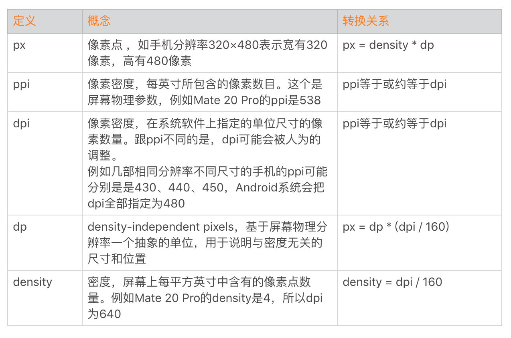

通过dp加上自适应布局可以基本解决屏幕碎片化的问题，也是Android推荐使用的<a href="https://developer.android.com/guide/practices/screens_support?hl=zh-cn" target="_blank">屏幕兼容性</a>适配方案。但是它会存在两个比较大的问题：

<ul>
<li>
不一致性。因为dpi与实际ppi的差异性，导致在相同分辨率的手机上，控件的实际大小会有所不同。
</li>

<li>
效率。设计师的设计稿都是以px为单位的，开发人员为了UI适配，需要手动通过百分比估算出dp值。
</li>
</ul>

除了直接dp适配之外，目前业界比较常用的UI适配方法主要有下面几种：

<ul>
<li>
限制符适配方案。主要有宽高限定符与smallestWidth限定符适配方案，具体可以参考<a href="https://mp.weixin.qq.com/s?__biz=MzAxMTI4MTkwNQ==&amp;mid=2650826034&amp;idx=1&amp;sn=5e86768d7abc1850b057941cdd003927&amp;chksm=80b7b1acb7c038ba8912b9a09f7e0d41eef13ec0cea19462e47c4e4fe6a08ab760fec864c777&amp;scene=21#wechat_redirect" target="_blank">《Android 目前稳定高效的UI适配方案》</a><a href="https://mp.weixin.qq.com/s?__biz=MzAxMTI4MTkwNQ==&amp;mid=2650826381&amp;idx=1&amp;sn=5b71b7f1654b04a55fca25b0e90a4433&amp;chksm=80b7b213b7c03b0598f6014bfa2f7de12e1f32ca9f7b7fc49a2cf0f96440e4a7897d45c788fb&amp;scene=21#wechat_redirect" target="_blank">《smallestWidth 限定符适配方案》</a>。
</li>

<li>
今日头条适配方案。通过反射修正系统的density值，具体可以参考<a href="https://mp.weixin.qq.com/s?__biz=MzI1MzYzMjE0MQ==&amp;mid=2247484502&amp;idx=2&amp;sn=a60ea223de4171dd2022bc2c71e09351&amp;scene=21#wechat_redirect" target="_blank">《一种极低成本的Android屏幕适配方式》</a><a href="https://mp.weixin.qq.com/s/oSBUA7QKMWZURm1AHMyubA" target="_blank">《今日头条适配方案》</a>。
</li>
</ul>

<strong>2. CPU与GPU</strong>

除了屏幕，UI渲染还依赖两个核心的硬件：CPU与GPU。UI组件在绘制到屏幕之前，都需要经过Rasterization（栅格化）操作，而栅格化操作又是一个非常耗时的操作。GPU（Graphic Processing Unit ）也就是图形处理器，它主要用于处理图形运算，可以帮助我们加快栅格化操作。

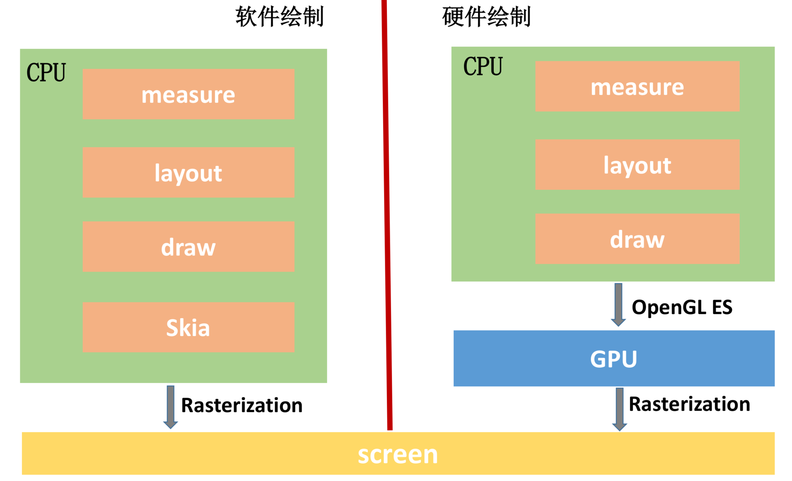

你可以从图上看到，软件绘制使用的是Skia库，它是一款能在低端设备如手机上呈现高质量的2D跨平台图形框架，类似Chrome、Flutter内部使用的都是Skia库。

<strong>3. OpenGL与Vulkan</strong>

对于硬件绘制，我们通过调用OpenGL ES接口利用GPU完成绘制。<a href="https://developer.android.com/guide/topics/graphics/opengl" target="_blank">OpenGL</a>是一个跨平台的图形API，它为2D/3D图形处理硬件指定了标准软件接口。而OpenGL ES是OpenGL的子集，专为嵌入式设备设计。

在官方<a href="https://developer.android.com/guide/topics/graphics/hardware-accel" target="_blank">硬件加速的文档</a>中，可以看到很多API都有相应的Android API level限制。

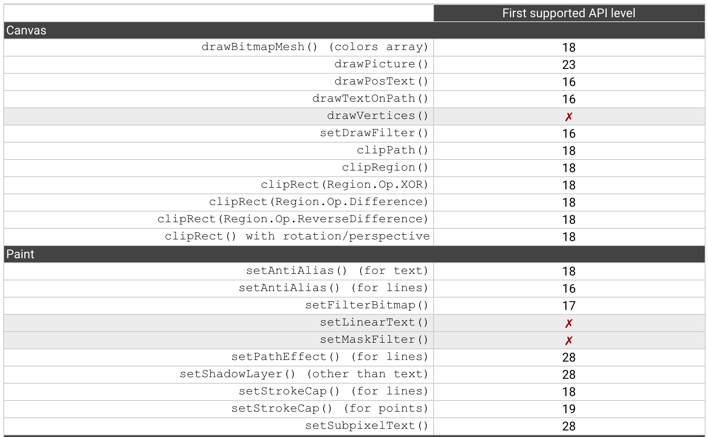

这是为什么呢？其实这主要是受<a href="https://www.khronos.org/opengles/" target="_blank">OpenGL ES</a>版本与系统支持的限制，直到最新的Android P，有3个API是仍然没有支持。对于不支持的API，我们需要使用软件绘制模式，渲染的性能将会大大降低。

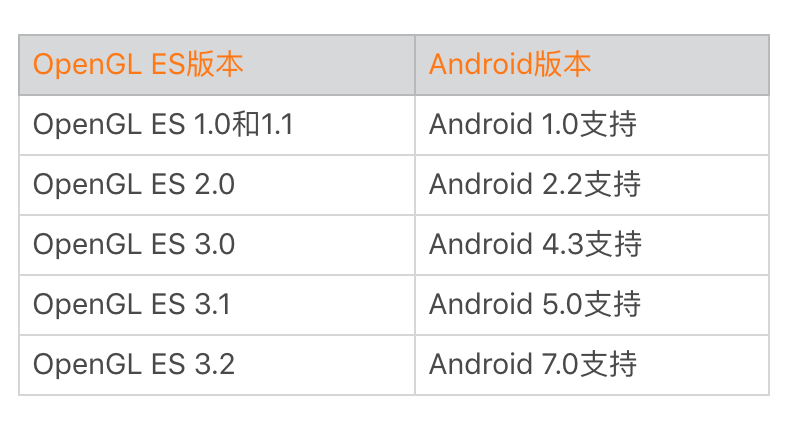

Android 7.0把OpenGL ES升级到最新的3.2版本同时，还添加了对<a href="https://source.android.com/devices/graphics/arch-vulkan" target="_blank">Vulkan</a>的支持。Vulkan是用于高性能3D图形的低开销、跨平台 API。相比OpenGL ES，Vulkan在改善功耗、多核优化提升绘图调用上有着非常明显的<a href="https://zhuanlan.zhihu.com/p/20712354" target="_blank">优势</a>。

在国内，“王者荣耀”是比较早适配Vulkan的游戏，虽然目前兼容性还有一些问题，但是Vulkan版本的王者荣耀在流畅性和帧数稳定性都有大幅度提升，即使是战况最激烈的团战阶段，也能够稳定保持在55～60帧。

<h2 id="android渲染的演进">Android渲染的演进</h2>

跟耗电一样，Android的UI渲染性能也是Google长期以来非常重视的，基本每次Google I/O都会花很多篇幅讲这一块。每个开发者都希望自己的应用或者游戏可以做到60 fps如丝般顺滑，不过相比iOS系统，Android的渲染性能一直被人诟病。

Android系统为了弥补跟iOS的差距，在每个版本都做了大量的优化。在了解Android的渲染之前，需要先了解一下Android图形系统的<a href="https://source.android.com/devices/graphics" target="_blank">整体架构</a>，以及它包含的主要组件。

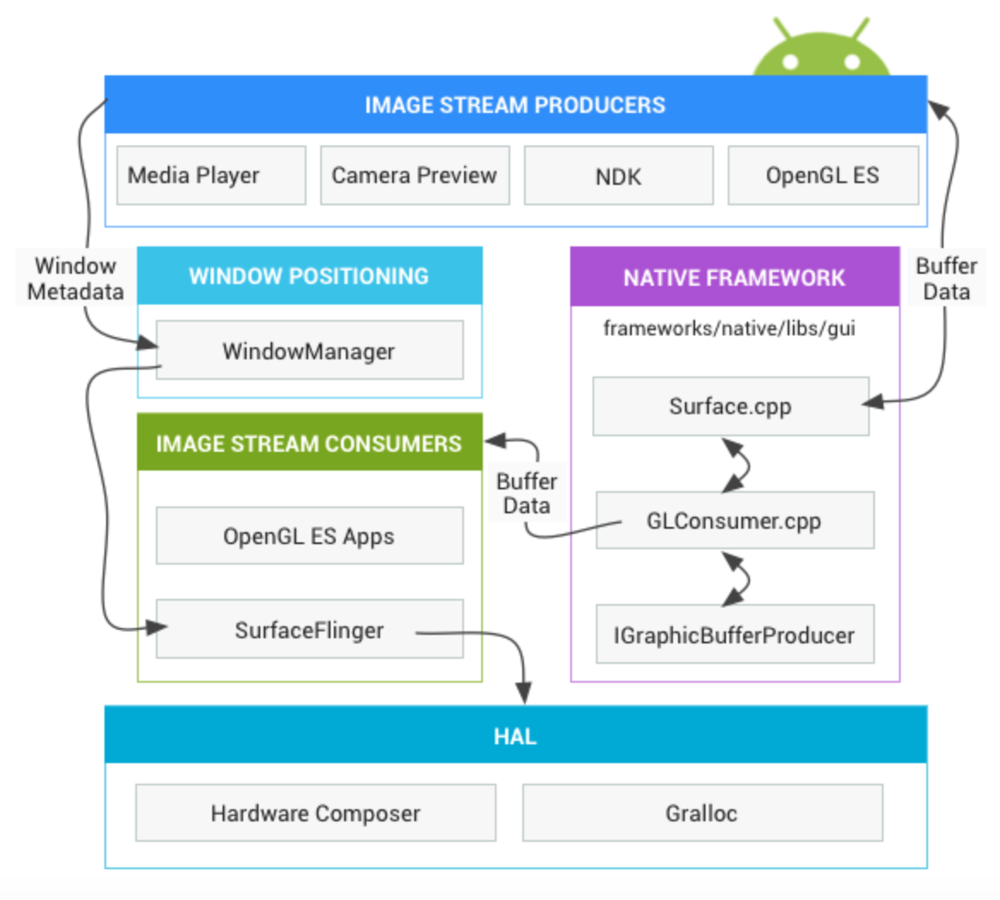

我曾经在一篇文章看过一个生动的比喻，如果把应用程序图形渲染过程当作一次绘画过程，那么绘画过程中Android的各个图形组件的作用是：

<ul>
<li>
画笔：Skia或者OpenGL。我们可以用Skia画笔绘制2D图形，也可以用OpenGL来绘制2D/3D图形。正如前面所说，前者使用CPU绘制，后者使用GPU绘制。
</li>

<li>
画纸：Surface。所有的元素都在Surface这张画纸上进行绘制和渲染。在Android中，Window是View的容器，每个窗口都会关联一个Surface。而WindowManager则负责管理这些窗口，并且把它们的数据传递给SurfaceFlinger。
</li>

<li>
画板：Graphic Buffer。Graphic Buffer缓冲用于应用程序图形的绘制，在Android 4.1之前使用的是双缓冲机制；在Android 4.1之后，使用的是三缓冲机制。
</li>

<li>
显示：SurfaceFlinger。它将WindowManager提供的所有Surface，通过硬件合成器Hardware Composer合成并输出到显示屏。
</li>
</ul>

接下来我将通过Android渲染演进分析的方法，帮你进一步加深对Android渲染的理解。

<strong>1. Android 4.0：开启硬件加速</strong>

在Android 3.0之前，或者没有启用硬件加速时，系统都会使用软件方式来渲染UI。

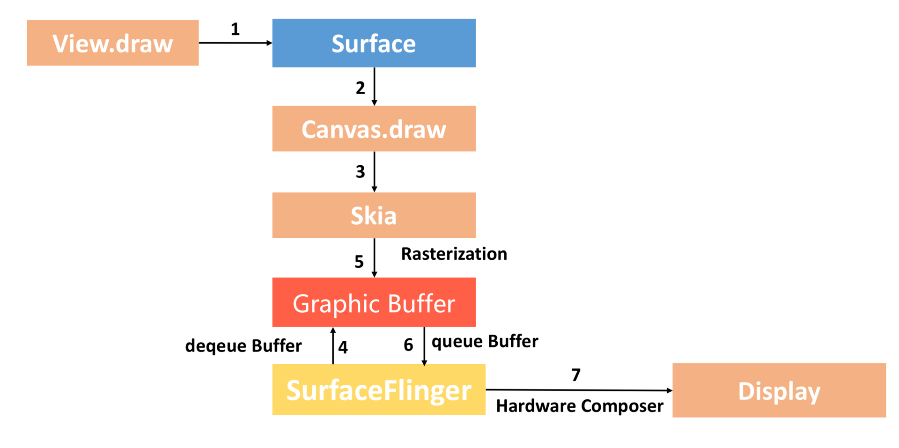

整个流程如上图所示：

<ul>
<li>
Surface。每个View都由某一个窗口管理，而每一个窗口都关联有一个Surface。
</li>

<li>
Canvas。通过Surface的lock函数获得一个Canvas，Canvas可以简单理解为Skia底层接口的封装。
</li>

<li>
Graphic Buffer。SurfaceFlinger会帮我们托管一个<a href="https://source.android.com/devices/graphics/arch-bq-gralloc" target="_blank">BufferQueue</a>，我们从BufferQueue中拿到Graphic Buffer，然后通过Canvas以及Skia将绘制内容栅格化到上面。
</li>

<li>
SurfaceFlinger。通过Swap Buffer把Front Graphic Buffer的内容交给SurfaceFinger，最后硬件合成器Hardware Composer合成并输出到显示屏。
</li>
</ul>

整个渲染流程是不是非常简单？但是正如我前面所说，CPU对于图形处理并不是那么高效，这个过程完全没有利用到GPU的高性能。

<strong>硬件加速绘制</strong>

所以从Androd 3.0开始，Android开始支持硬件加速，到Android 4.0时，默认开启硬件加速。

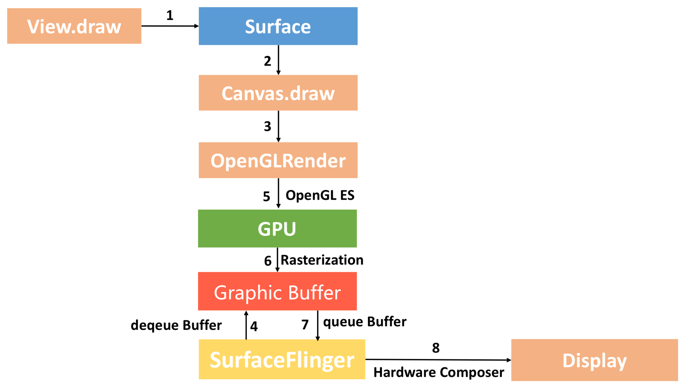

硬件加速绘制与软件绘制整个流程差异非常大，最核心就是我们通过GPU完成Graphic Buffer的内容绘制。此外硬件绘制还引入了一个DisplayList的概念，每个View内部都有一个DisplayList，当某个View需要重绘时，将它标记为Dirty。

当需要重绘时，仅仅只需要重绘一个View的DisplayList，而不是像软件绘制那样需要向上递归。这样可以大大减少绘图的操作数量，因而提高了渲染效率。

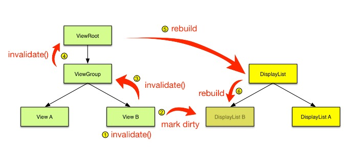

<strong>2. Android 4.1：Project Butter</strong>

优化是无止境的，Google在2012年的I/O大会上宣布了Project Butter黄油计划，并且在Android 4.1中正式开启了这个机制。

Project Butter主要包含两个组成部分，一个是VSYNC，一个是Triple Buffering。

<strong>VSYNC信号</strong>

在讲文件I/O跟网络I/O的时候，我讲到过中断的概念。对于Android 4.0，CPU可能会因为在忙别的事情，导致没来得及处理UI绘制。

为解决这个问题，Project Buffer引入了<a href="https://source.android.com/devices/graphics/implement-vsync" target="_blank">VSYNC</a>，它类似于时钟中断。每收到VSYNC中断，CPU会立即准备Buffer数据，由于大部分显示设备刷新频率都是60Hz（一秒刷新60次），也就是说一帧数据的准备工作都要在16ms内完成。

这样应用总是在VSYNC边界上开始绘制，而SurfaceFlinger总是VSYNC边界上进行合成。这样可以消除卡顿，并提升图形的视觉表现。

<strong>三缓冲机制Triple Buffering</strong>

在Android 4.1之前，Android使用双缓冲机制。怎么理解呢？一般来说，不同的View或者Activity它们都会共用一个Window，也就是共用同一个Surface。

而每个Surface都会有一个BufferQueue缓存队列，但是这个队列会由SurfaceFlinger管理，通过匿名共享内存机制与App应用层交互。

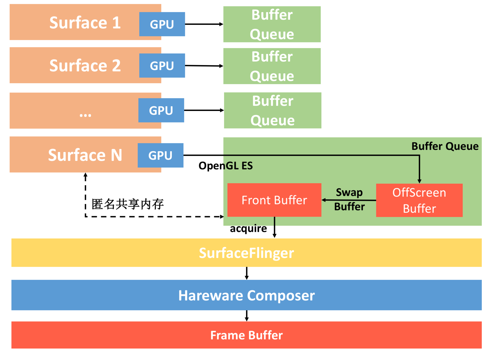

整个流程如下：

<ul>
<li>
每个Surface对应的BufferQueue内部都有两个Graphic Buffer ，一个用于绘制一个用于显示。我们会把内容先绘制到离屏缓冲区（OffScreen Buffer），在需要显示时，才把离屏缓冲区的内容通过Swap Buffer复制到Front Graphic Buffer中。
</li>

<li>
这样SurfaceFlinge就拿到了某个Surface最终要显示的内容，但是同一时间我们可能会有多个Surface。这里面可能是不同应用的Surface，也可能是同一个应用里面类似SurefaceView和TextureView，它们都会有自己单独的Surface。
</li>

<li>
这个时候SurfaceFlinger把所有Surface要显示的内容统一交给Hareware Composer，它会根据位置、Z-Order顺序等信息合成为最终屏幕需要显示的内容，而这个内容会交给系统的帧缓冲区Frame Buffer来显示（Frame Buffer是非常底层的，可以理解为屏幕显示的抽象）。
</li>
</ul>

如果你理解了双缓冲机制的原理，那就非常容易理解什么是三缓冲区了。如果只有两个Graphic Buffer缓存区A和B，如果CPU/GPU绘制过程较长，超过了一个VSYNC信号周期，因为缓冲区B中的数据还没有准备完成，所以只能继续展示A缓冲区的内容，这样缓冲区A和B都分别被显示设备和GPU占用，CPU无法准备下一帧的数据。

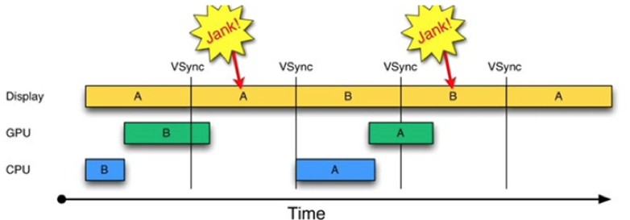

如果再提供一个缓冲区，CPU、GPU和显示设备都能使用各自的缓冲区工作，互不影响。简单来说，三缓冲机制就是在双缓冲机制基础上增加了一个Graphic Buffer缓冲区，这样可以最大限度的利用空闲时间，带来的坏处是多使用的了一个Graphic Buffer所占用的内存。

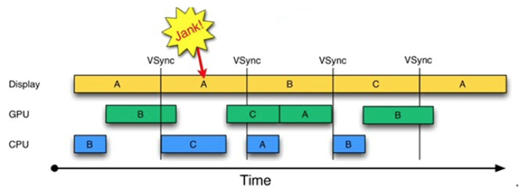

对于VSYNC信号和Triple Buffering更详细的介绍，可以参考<a href="https://blog.csdn.net/innost/article/details/8272867" target="_blank">《Android Project Butter分析》</a>。

<strong>数据测量</strong>

“工欲善其事，必先利其器”，Project Butter在优化UI渲染性能的同时，也希望可以帮助我们更好地排查UI相关的问题。

在Android 4.1，新增了Systrace性能数据采样和分析工具。在卡顿和启动优化中，我们已经使用过Systrace很多次了，也可以用它来检测每一帧的渲染情况。

Tracer for OpenGL ES也是Android 4.1新增加的工具，它可逐帧、逐函数的记录App用OpenGL ES的绘制过程。它提供了每个OpenGL函数调用的消耗时间，所以很多时候用来做性能分析。但因为其强大的记录功能，在分析渲染问题时，当Traceview、Systrace都显得棘手时，还找不到渲染问题所在时，此时这个工具就会派上用场了。

在Android 4.2，系统增加了检测绘制过度工具，具体的使用方法可以参考<a href="https://developer.android.com/studio/profile/inspect-gpu-rendering" target="_blank">《检查GPU渲染速度和绘制过度》</a>。

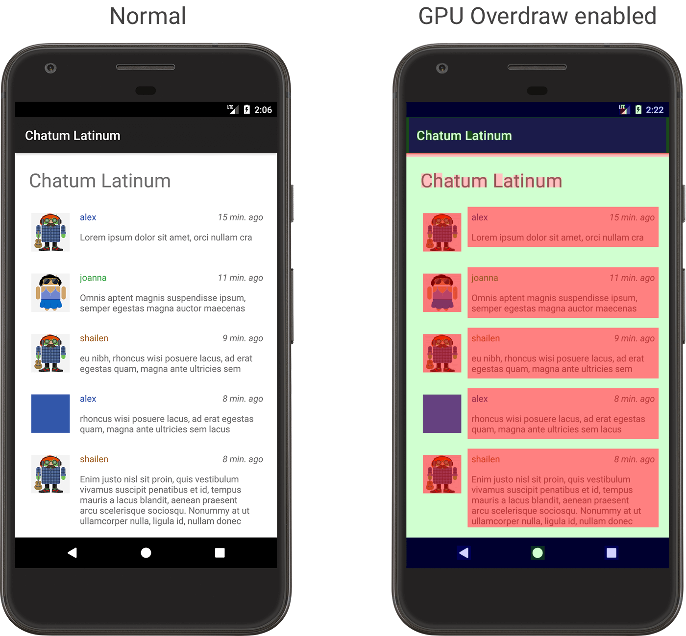

<strong>3. Android 5.0：RenderThread</strong>

经过Project Butter黄油计划之后，Android的渲染性能有了很大的改善。但是不知道你有没有注意到一个问题，虽然我们利用了GPU的图形高性能运算，但是从计算DisplayList，到通过GPU绘制到Frame Buffer，整个计算和绘制都在UI主线程中完成。

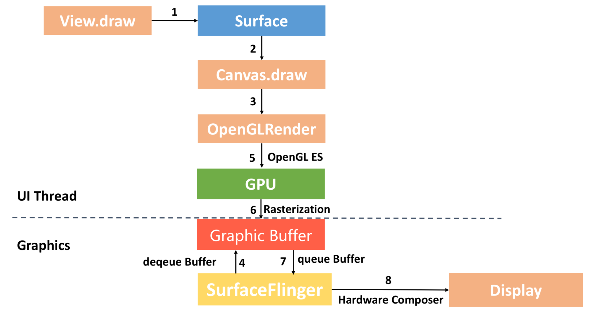

UI主线程“既当爹又当妈”，任务过于繁重。如果整个渲染过程比较耗时，可能造成无法响应用户的操作，进而出现卡顿。GPU对图形的绘制渲染能力更胜一筹，如果使用GPU并在不同线程绘制渲染图形，那么整个流程会更加顺畅。

正因如此，在Android 5.0引入了两个比较大的改变。一个是引入了RenderNode的概念，它对DisplayList及一些View显示属性做了进一步封装。另一个是引入了RenderThread，所有的GL命令执行都放到这个线程上，渲染线程在RenderNode中存有渲染帧的所有信息，可以做一些属性动画，这样即便主线程有耗时操作的时候也可以保证动画流畅。

在官方文档 <a href="https://developer.android.com/studio/profile/inspect-gpu-rendering" target="_blank">《检查 GPU 渲染速度和绘制过度》</a>中，我们还可以开启Profile GPU Rendering检查。在Android 6.0之后，会输出下面的计算和绘制每个阶段的耗时：

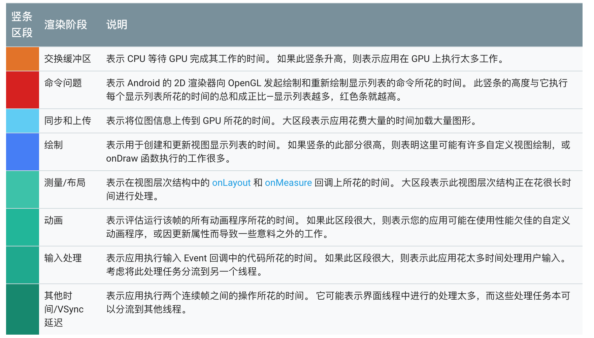

如果我们把上面的步骤转化线程模型，可以得到下面的流水线模型。CPU将数据同步（sync）给GPU之后，一般不会阻塞等待GPU渲染完毕，而是通知结束后就返回。而RenderThread承担了比较多的绘制工作，分担了主线程很多压力，提高了UI线程的响应速度。

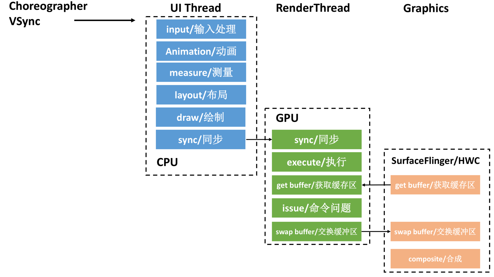

<strong>4. 未来</strong>

在Android 6.0的时候，Android在gxinfo添加了更详细的信息；在Android 7.0又对HWUI进行了一些重构，而且支持了Vulkan；在Android P支持了Vulkun 1.1。我相信在未来不久的Android Q，更好地支持Vulkan将是一个必然的方向。

总的来说，UI渲染的优化必然会朝着两个方向。一个是进一步压榨硬件的性能，让UI可以更加流畅。一个是改进或者增加更多的分析工具，帮助我们更容易地发现以及定位问题。

<h2 id="总结">总结</h2>

今天我们通过Android渲染的演进历程，一步一步加深对Android渲染机制的理解，这对我们UI渲染优化工作会有很大的帮助。

但是凡事都要两面看，硬件加速绘制虽然极大地提高了Android系统显示和刷新的速度，但它也存在那么一些问题。一方面是内存消耗，OpenGL API调用以及Graphic Buffer缓冲区会占用至少几MB的内存，而实际上会占用更多一些。不过最严重的还是兼容性问题，部分绘制函数不支持是其中一部分原因，更可怕的是硬件加速绘制流程本身的Bug。由于Android每个版本对渲染模块都做了一些重构，在某些场景经常会出现一些莫名其妙的问题。

例如每个应用总有那么一些libhwui.so相关的崩溃，曾经这个崩溃占我们总崩溃的20%以上。我们内部花了整整一个多月，通过发了几十个灰度，使用了Inline Hook、GOT Hook等各种手段。最后才定位到问题的原因是系统内部RenderThread与主线程数据同步的Bug，并通过规避的方法得以解决。

<h2 id="课后作业">课后作业</h2>

人们都说iOS系统更加流畅，对于Android的UI渲染你了解多少呢？在日常工作中，你是使用哪种方式做UI适配的，觉得目前在渲染方面最大的痛点是什么？欢迎留言跟我和其他同学一起讨论。

在UI渲染这方面，其实我也并不是非常资深，针对文中所讲的，如果你有更好的思路和想法，一定给我留言，欢迎留下你的想法。

Android渲染架构非常庞大，而且演进得也非常快。如果你还有哪些不理解的地方，可以进一步阅读下面的参考资料：

<ul>
<li>
2018 Google I/O：<a href="https://www.youtube.com/watch?v=zdQRIYOST64" target="_blank">Drawn out: how Android renders</a>
</li>

<li>
官方文档：<a href="https://source.android.com/devices/graphics" target="_blank">Android 图形架构</a>
</li>

<li>
浏览器渲染：<a href="https://mp.weixin.qq.com/s/QoFrdmxdRJG5ETQp5Ua3-A" target="_blank">一颗像素的诞生</a>
</li>

<li>
<a href="https://blog.csdn.net/qian520ao/article/details/81144167" target="_blank">Android 屏幕绘制机制及硬件加速</a>
</li>

<li>
<a href="http://hukai.me/android-performance-render/" target="_blank">Android性能优化之渲染篇</a>
</li>
</ul>

欢迎你点击“请朋友读”，把今天的内容分享给好友，邀请他一起学习。最后别忘了在评论区提交今天的作业，我也为认真完成作业的同学准备了丰厚的“学习加油礼包”，期待与你一起切磋进步哦。

                        

                        

                            

                            

                            

                            

                        

                    

                

            

            

                

                
© 2019 - 2023 <a href="/cdn-cgi/l/email-protection#325e5e5e0b060303020572555f535b5e1c515d5f" target="_blank">Liangliang Lee</a>.
                    Powered by <a href="https://github.com/gin-gonic/gin" target="_blank">gin</a> and <a
                        href="https://github.com/kaiiiz/hexo-theme-book" target="_blank">hexo-theme-book</a>.

            

        

        
    

</body>

</html>