<!DOCTYPE html>
<html xmlns="http://www.w3.org/1999/xhtml">

<head>

    <head>
        <meta http-equiv="Content-Type" content="text/html; charset=UTF-8">
        <meta name="viewport" content="width=device-width, initial-scale=1, maximum-scale=1.0, user-scalable=no">
        <meta http-equiv='content-language' content='zh-cn'>
        <meta name='description' content=21&#32;UI&#32;优化（下）：如何优化&#32;UI&#32;渲染？>
        <link rel="icon" href="/static/favicon.png">
        <title>21 UI 优化（下）：如何优化 UI 渲染？ </title>
        
        <link rel="stylesheet" href="/static/index.css">
        <link rel="stylesheet" href="/static/highlight.min.css">
        
        
        <meta name="generator" content="Hexo 4.2.0">
        
    </head>

<body>
    

        

            

                <a href="/">
                    
                    技术文章摘抄
                </a>
            

            

                <ul class="uncollapsible">
                    <li><a href="/" class="current-tab">首页</a></li>
                    <li><a href="../">上一级</a></li>
                </ul>
                <ul class="uncollapsible">
                    
                    <li>
                        <a class="menu-item" id="00 导读 如何打造高质量的应用？.md" href="/%e4%b8%93%e6%a0%8f/Android%e5%bc%80%e5%8f%91%e9%ab%98%e6%89%8b%e8%af%be/00%20%e5%af%bc%e8%af%bb%20%e5%a6%82%e4%bd%95%e6%89%93%e9%80%a0%e9%ab%98%e8%b4%a8%e9%87%8f%e7%9a%84%e5%ba%94%e7%94%a8%ef%bc%9f.md">00 导读 如何打造高质量的应用？.md</a>
                    </li>
                    
                    <li>
                        <a class="menu-item" id="00 开篇词 焦虑的移动开发者该如何破局？.md" href="/%e4%b8%93%e6%a0%8f/Android%e5%bc%80%e5%8f%91%e9%ab%98%e6%89%8b%e8%af%be/00%20%e5%bc%80%e7%af%87%e8%af%8d%20%e7%84%a6%e8%99%91%e7%9a%84%e7%a7%bb%e5%8a%a8%e5%bc%80%e5%8f%91%e8%80%85%e8%af%a5%e5%a6%82%e4%bd%95%e7%a0%b4%e5%b1%80%ef%bc%9f.md">00 开篇词 焦虑的移动开发者该如何破局？.md</a>
                    </li>
                    
                    <li>
                        <a class="menu-item" id="01 崩溃优化（上）：关于“崩溃”那些事儿.md" href="/%e4%b8%93%e6%a0%8f/Android%e5%bc%80%e5%8f%91%e9%ab%98%e6%89%8b%e8%af%be/01%20%e5%b4%a9%e6%ba%83%e4%bc%98%e5%8c%96%ef%bc%88%e4%b8%8a%ef%bc%89%ef%bc%9a%e5%85%b3%e4%ba%8e%e2%80%9c%e5%b4%a9%e6%ba%83%e2%80%9d%e9%82%a3%e4%ba%9b%e4%ba%8b%e5%84%bf.md">01 崩溃优化（上）：关于“崩溃”那些事儿.md</a>
                    </li>
                    
                    <li>
                        <a class="menu-item" id="02 崩溃优化（下）：应用崩溃了，你应该如何去分析？.md" href="/%e4%b8%93%e6%a0%8f/Android%e5%bc%80%e5%8f%91%e9%ab%98%e6%89%8b%e8%af%be/02%20%e5%b4%a9%e6%ba%83%e4%bc%98%e5%8c%96%ef%bc%88%e4%b8%8b%ef%bc%89%ef%bc%9a%e5%ba%94%e7%94%a8%e5%b4%a9%e6%ba%83%e4%ba%86%ef%bc%8c%e4%bd%a0%e5%ba%94%e8%af%a5%e5%a6%82%e4%bd%95%e5%8e%bb%e5%88%86%e6%9e%90%ef%bc%9f.md">02 崩溃优化（下）：应用崩溃了，你应该如何去分析？.md</a>
                    </li>
                    
                    <li>
                        <a class="menu-item" id="03 内存优化（上）：4GB内存时代，再谈内存优化.md" href="/%e4%b8%93%e6%a0%8f/Android%e5%bc%80%e5%8f%91%e9%ab%98%e6%89%8b%e8%af%be/03%20%e5%86%85%e5%ad%98%e4%bc%98%e5%8c%96%ef%bc%88%e4%b8%8a%ef%bc%89%ef%bc%9a4GB%e5%86%85%e5%ad%98%e6%97%b6%e4%bb%a3%ef%bc%8c%e5%86%8d%e8%b0%88%e5%86%85%e5%ad%98%e4%bc%98%e5%8c%96.md">03 内存优化（上）：4GB内存时代，再谈内存优化.md</a>
                    </li>
                    
                    <li>
                        <a class="menu-item" id="04 内存优化（下）：内存优化这件事，应该从哪里着手？.md" href="/%e4%b8%93%e6%a0%8f/Android%e5%bc%80%e5%8f%91%e9%ab%98%e6%89%8b%e8%af%be/04%20%e5%86%85%e5%ad%98%e4%bc%98%e5%8c%96%ef%bc%88%e4%b8%8b%ef%bc%89%ef%bc%9a%e5%86%85%e5%ad%98%e4%bc%98%e5%8c%96%e8%bf%99%e4%bb%b6%e4%ba%8b%ef%bc%8c%e5%ba%94%e8%af%a5%e4%bb%8e%e5%93%aa%e9%87%8c%e7%9d%80%e6%89%8b%ef%bc%9f.md">04 内存优化（下）：内存优化这件事，应该从哪里着手？.md</a>
                    </li>
                    
                    <li>
                        <a class="menu-item" id="05 卡顿优化（上）：你要掌握的卡顿分析方法.md" href="/%e4%b8%93%e6%a0%8f/Android%e5%bc%80%e5%8f%91%e9%ab%98%e6%89%8b%e8%af%be/05%20%e5%8d%a1%e9%a1%bf%e4%bc%98%e5%8c%96%ef%bc%88%e4%b8%8a%ef%bc%89%ef%bc%9a%e4%bd%a0%e8%a6%81%e6%8e%8c%e6%8f%a1%e7%9a%84%e5%8d%a1%e9%a1%bf%e5%88%86%e6%9e%90%e6%96%b9%e6%b3%95.md">05 卡顿优化（上）：你要掌握的卡顿分析方法.md</a>
                    </li>
                    
                    <li>
                        <a class="menu-item" id="06 卡顿优化（下）：如何监控应用卡顿？.md" href="/%e4%b8%93%e6%a0%8f/Android%e5%bc%80%e5%8f%91%e9%ab%98%e6%89%8b%e8%af%be/06%20%e5%8d%a1%e9%a1%bf%e4%bc%98%e5%8c%96%ef%bc%88%e4%b8%8b%ef%bc%89%ef%bc%9a%e5%a6%82%e4%bd%95%e7%9b%91%e6%8e%a7%e5%ba%94%e7%94%a8%e5%8d%a1%e9%a1%bf%ef%bc%9f.md">06 卡顿优化（下）：如何监控应用卡顿？.md</a>
                    </li>
                    
                    <li>
                        <a class="menu-item" id="06补充篇 卡顿优化：卡顿现场与卡顿分析.md" href="/%e4%b8%93%e6%a0%8f/Android%e5%bc%80%e5%8f%91%e9%ab%98%e6%89%8b%e8%af%be/06%e8%a1%a5%e5%85%85%e7%af%87%20%e5%8d%a1%e9%a1%bf%e4%bc%98%e5%8c%96%ef%bc%9a%e5%8d%a1%e9%a1%bf%e7%8e%b0%e5%9c%ba%e4%b8%8e%e5%8d%a1%e9%a1%bf%e5%88%86%e6%9e%90.md">06补充篇 卡顿优化：卡顿现场与卡顿分析.md</a>
                    </li>
                    
                    <li>
                        <a class="menu-item" id="07 启动优化（上）：从启动过程看启动速度优化.md" href="/%e4%b8%93%e6%a0%8f/Android%e5%bc%80%e5%8f%91%e9%ab%98%e6%89%8b%e8%af%be/07%20%e5%90%af%e5%8a%a8%e4%bc%98%e5%8c%96%ef%bc%88%e4%b8%8a%ef%bc%89%ef%bc%9a%e4%bb%8e%e5%90%af%e5%8a%a8%e8%bf%87%e7%a8%8b%e7%9c%8b%e5%90%af%e5%8a%a8%e9%80%9f%e5%ba%a6%e4%bc%98%e5%8c%96.md">07 启动优化（上）：从启动过程看启动速度优化.md</a>
                    </li>
                    
                    <li>
                        <a class="menu-item" id="08 启动优化（下）：优化启动速度的进阶方法.md" href="/%e4%b8%93%e6%a0%8f/Android%e5%bc%80%e5%8f%91%e9%ab%98%e6%89%8b%e8%af%be/08%20%e5%90%af%e5%8a%a8%e4%bc%98%e5%8c%96%ef%bc%88%e4%b8%8b%ef%bc%89%ef%bc%9a%e4%bc%98%e5%8c%96%e5%90%af%e5%8a%a8%e9%80%9f%e5%ba%a6%e7%9a%84%e8%bf%9b%e9%98%b6%e6%96%b9%e6%b3%95.md">08 启动优化（下）：优化启动速度的进阶方法.md</a>
                    </li>
                    
                    <li>
                        <a class="menu-item" id="09 I_O优化（上）：开发工程师必备的I_O优化知识.md" href="/%e4%b8%93%e6%a0%8f/Android%e5%bc%80%e5%8f%91%e9%ab%98%e6%89%8b%e8%af%be/09%20I_O%e4%bc%98%e5%8c%96%ef%bc%88%e4%b8%8a%ef%bc%89%ef%bc%9a%e5%bc%80%e5%8f%91%e5%b7%a5%e7%a8%8b%e5%b8%88%e5%bf%85%e5%a4%87%e7%9a%84I_O%e4%bc%98%e5%8c%96%e7%9f%a5%e8%af%86.md">09 I_O优化（上）：开发工程师必备的I_O优化知识.md</a>
                    </li>
                    
                    <li>
                        <a class="menu-item" id="10 I_O优化（中）：不同I_O方式的使用场景是什么？.md" href="/%e4%b8%93%e6%a0%8f/Android%e5%bc%80%e5%8f%91%e9%ab%98%e6%89%8b%e8%af%be/10%20I_O%e4%bc%98%e5%8c%96%ef%bc%88%e4%b8%ad%ef%bc%89%ef%bc%9a%e4%b8%8d%e5%90%8cI_O%e6%96%b9%e5%bc%8f%e7%9a%84%e4%bd%bf%e7%94%a8%e5%9c%ba%e6%99%af%e6%98%af%e4%bb%80%e4%b9%88%ef%bc%9f.md">10 I_O优化（中）：不同I_O方式的使用场景是什么？.md</a>
                    </li>
                    
                    <li>
                        <a class="menu-item" id="11 I_O优化（下）：如何监控线上I_O操作？.md" href="/%e4%b8%93%e6%a0%8f/Android%e5%bc%80%e5%8f%91%e9%ab%98%e6%89%8b%e8%af%be/11%20I_O%e4%bc%98%e5%8c%96%ef%bc%88%e4%b8%8b%ef%bc%89%ef%bc%9a%e5%a6%82%e4%bd%95%e7%9b%91%e6%8e%a7%e7%ba%bf%e4%b8%8aI_O%e6%93%8d%e4%bd%9c%ef%bc%9f.md">11 I_O优化（下）：如何监控线上I_O操作？.md</a>
                    </li>
                    
                    <li>
                        <a class="menu-item" id="12 存储优化（上）：常见的数据存储方法有哪些？.md" href="/%e4%b8%93%e6%a0%8f/Android%e5%bc%80%e5%8f%91%e9%ab%98%e6%89%8b%e8%af%be/12%20%e5%ad%98%e5%82%a8%e4%bc%98%e5%8c%96%ef%bc%88%e4%b8%8a%ef%bc%89%ef%bc%9a%e5%b8%b8%e8%a7%81%e7%9a%84%e6%95%b0%e6%8d%ae%e5%ad%98%e5%82%a8%e6%96%b9%e6%b3%95%e6%9c%89%e5%93%aa%e4%ba%9b%ef%bc%9f.md">12 存储优化（上）：常见的数据存储方法有哪些？.md</a>
                    </li>
                    
                    <li>
                        <a class="menu-item" id="13 存储优化（中）：如何优化数据存储？.md" href="/%e4%b8%93%e6%a0%8f/Android%e5%bc%80%e5%8f%91%e9%ab%98%e6%89%8b%e8%af%be/13%20%e5%ad%98%e5%82%a8%e4%bc%98%e5%8c%96%ef%bc%88%e4%b8%ad%ef%bc%89%ef%bc%9a%e5%a6%82%e4%bd%95%e4%bc%98%e5%8c%96%e6%95%b0%e6%8d%ae%e5%ad%98%e5%82%a8%ef%bc%9f.md">13 存储优化（中）：如何优化数据存储？.md</a>
                    </li>
                    
                    <li>
                        <a class="menu-item" id="14 存储优化（下）：数据库SQLite的使用和优化.md" href="/%e4%b8%93%e6%a0%8f/Android%e5%bc%80%e5%8f%91%e9%ab%98%e6%89%8b%e8%af%be/14%20%e5%ad%98%e5%82%a8%e4%bc%98%e5%8c%96%ef%bc%88%e4%b8%8b%ef%bc%89%ef%bc%9a%e6%95%b0%e6%8d%ae%e5%ba%93SQLite%e7%9a%84%e4%bd%bf%e7%94%a8%e5%92%8c%e4%bc%98%e5%8c%96.md">14 存储优化（下）：数据库SQLite的使用和优化.md</a>
                    </li>
                    
                    <li>
                        <a class="menu-item" id="15 网络优化（上）：移动开发工程师必备的网络优化知识.md" href="/%e4%b8%93%e6%a0%8f/Android%e5%bc%80%e5%8f%91%e9%ab%98%e6%89%8b%e8%af%be/15%20%e7%bd%91%e7%bb%9c%e4%bc%98%e5%8c%96%ef%bc%88%e4%b8%8a%ef%bc%89%ef%bc%9a%e7%a7%bb%e5%8a%a8%e5%bc%80%e5%8f%91%e5%b7%a5%e7%a8%8b%e5%b8%88%e5%bf%85%e5%a4%87%e7%9a%84%e7%bd%91%e7%bb%9c%e4%bc%98%e5%8c%96%e7%9f%a5%e8%af%86.md">15 网络优化（上）：移动开发工程师必备的网络优化知识.md</a>
                    </li>
                    
                    <li>
                        <a class="menu-item" id="16 网络优化（中）：复杂多变的移动网络该如何优化？.md" href="/%e4%b8%93%e6%a0%8f/Android%e5%bc%80%e5%8f%91%e9%ab%98%e6%89%8b%e8%af%be/16%20%e7%bd%91%e7%bb%9c%e4%bc%98%e5%8c%96%ef%bc%88%e4%b8%ad%ef%bc%89%ef%bc%9a%e5%a4%8d%e6%9d%82%e5%a4%9a%e5%8f%98%e7%9a%84%e7%a7%bb%e5%8a%a8%e7%bd%91%e7%bb%9c%e8%af%a5%e5%a6%82%e4%bd%95%e4%bc%98%e5%8c%96%ef%bc%9f.md">16 网络优化（中）：复杂多变的移动网络该如何优化？.md</a>
                    </li>
                    
                    <li>
                        <a class="menu-item" id="17 网络优化（下）：大数据下网络该如何监控？.md" href="/%e4%b8%93%e6%a0%8f/Android%e5%bc%80%e5%8f%91%e9%ab%98%e6%89%8b%e8%af%be/17%20%e7%bd%91%e7%bb%9c%e4%bc%98%e5%8c%96%ef%bc%88%e4%b8%8b%ef%bc%89%ef%bc%9a%e5%a4%a7%e6%95%b0%e6%8d%ae%e4%b8%8b%e7%bd%91%e7%bb%9c%e8%af%a5%e5%a6%82%e4%bd%95%e7%9b%91%e6%8e%a7%ef%bc%9f.md">17 网络优化（下）：大数据下网络该如何监控？.md</a>
                    </li>
                    
                    <li>
                        <a class="menu-item" id="18 耗电优化（上）：从电量优化的演进看耗电分析.md" href="/%e4%b8%93%e6%a0%8f/Android%e5%bc%80%e5%8f%91%e9%ab%98%e6%89%8b%e8%af%be/18%20%e8%80%97%e7%94%b5%e4%bc%98%e5%8c%96%ef%bc%88%e4%b8%8a%ef%bc%89%ef%bc%9a%e4%bb%8e%e7%94%b5%e9%87%8f%e4%bc%98%e5%8c%96%e7%9a%84%e6%bc%94%e8%bf%9b%e7%9c%8b%e8%80%97%e7%94%b5%e5%88%86%e6%9e%90.md">18 耗电优化（上）：从电量优化的演进看耗电分析.md</a>
                    </li>
                    
                    <li>
                        <a class="menu-item" id="19 耗电优化（下）：耗电的优化方法与线上监控.md" href="/%e4%b8%93%e6%a0%8f/Android%e5%bc%80%e5%8f%91%e9%ab%98%e6%89%8b%e8%af%be/19%20%e8%80%97%e7%94%b5%e4%bc%98%e5%8c%96%ef%bc%88%e4%b8%8b%ef%bc%89%ef%bc%9a%e8%80%97%e7%94%b5%e7%9a%84%e4%bc%98%e5%8c%96%e6%96%b9%e6%b3%95%e4%b8%8e%e7%ba%bf%e4%b8%8a%e7%9b%91%e6%8e%a7.md">19 耗电优化（下）：耗电的优化方法与线上监控.md</a>
                    </li>
                    
                    <li>
                        <a class="menu-item" id="20 UI 优化（上）：UI 渲染的几个关键概念.md" href="/%e4%b8%93%e6%a0%8f/Android%e5%bc%80%e5%8f%91%e9%ab%98%e6%89%8b%e8%af%be/20%20UI%20%e4%bc%98%e5%8c%96%ef%bc%88%e4%b8%8a%ef%bc%89%ef%bc%9aUI%20%e6%b8%b2%e6%9f%93%e7%9a%84%e5%87%a0%e4%b8%aa%e5%85%b3%e9%94%ae%e6%a6%82%e5%bf%b5.md">20 UI 优化（上）：UI 渲染的几个关键概念.md</a>
                    </li>
                    
                    <li>
                        <a class="menu-item" id="21 UI 优化（下）：如何优化 UI 渲染？.md" href="/%e4%b8%93%e6%a0%8f/Android%e5%bc%80%e5%8f%91%e9%ab%98%e6%89%8b%e8%af%be/21%20UI%20%e4%bc%98%e5%8c%96%ef%bc%88%e4%b8%8b%ef%bc%89%ef%bc%9a%e5%a6%82%e4%bd%95%e4%bc%98%e5%8c%96%20UI%20%e6%b8%b2%e6%9f%93%ef%bc%9f.md">21 UI 优化（下）：如何优化 UI 渲染？.md</a>
                    </li>
                    
                    <li>
                        <a class="menu-item" id="22 包体积优化（上）：如何减少安装包大小？.md" href="/%e4%b8%93%e6%a0%8f/Android%e5%bc%80%e5%8f%91%e9%ab%98%e6%89%8b%e8%af%be/22%20%e5%8c%85%e4%bd%93%e7%a7%af%e4%bc%98%e5%8c%96%ef%bc%88%e4%b8%8a%ef%bc%89%ef%bc%9a%e5%a6%82%e4%bd%95%e5%87%8f%e5%b0%91%e5%ae%89%e8%a3%85%e5%8c%85%e5%a4%a7%e5%b0%8f%ef%bc%9f.md">22 包体积优化（上）：如何减少安装包大小？.md</a>
                    </li>
                    
                    <li>
                        <a class="menu-item" id="23 包体积优化（下）：资源优化的进阶实践.md" href="/%e4%b8%93%e6%a0%8f/Android%e5%bc%80%e5%8f%91%e9%ab%98%e6%89%8b%e8%af%be/23%20%e5%8c%85%e4%bd%93%e7%a7%af%e4%bc%98%e5%8c%96%ef%bc%88%e4%b8%8b%ef%bc%89%ef%bc%9a%e8%b5%84%e6%ba%90%e4%bc%98%e5%8c%96%e7%9a%84%e8%bf%9b%e9%98%b6%e5%ae%9e%e8%b7%b5.md">23 包体积优化（下）：资源优化的进阶实践.md</a>
                    </li>
                    
                    <li>
                        <a class="menu-item" id="24 想成为Android高手，你需要先搞定这三个问题.md" href="/%e4%b8%93%e6%a0%8f/Android%e5%bc%80%e5%8f%91%e9%ab%98%e6%89%8b%e8%af%be/24%20%e6%83%b3%e6%88%90%e4%b8%baAndroid%e9%ab%98%e6%89%8b%ef%bc%8c%e4%bd%a0%e9%9c%80%e8%a6%81%e5%85%88%e6%90%9e%e5%ae%9a%e8%bf%99%e4%b8%89%e4%b8%aa%e9%97%ae%e9%a2%98.md">24 想成为Android高手，你需要先搞定这三个问题.md</a>
                    </li>
                    
                    <li>
                        <a class="menu-item" id="25 如何提升组织与个人的研发效能？.md" href="/%e4%b8%93%e6%a0%8f/Android%e5%bc%80%e5%8f%91%e9%ab%98%e6%89%8b%e8%af%be/25%20%e5%a6%82%e4%bd%95%e6%8f%90%e5%8d%87%e7%bb%84%e7%bb%87%e4%b8%8e%e4%b8%aa%e4%ba%ba%e7%9a%84%e7%a0%94%e5%8f%91%e6%95%88%e8%83%bd%ef%bc%9f.md">25 如何提升组织与个人的研发效能？.md</a>
                    </li>
                    
                    <li>
                        <a class="menu-item" id="26 关于编译，你需要了解什么？.md" href="/%e4%b8%93%e6%a0%8f/Android%e5%bc%80%e5%8f%91%e9%ab%98%e6%89%8b%e8%af%be/26%20%e5%85%b3%e4%ba%8e%e7%bc%96%e8%af%91%ef%bc%8c%e4%bd%a0%e9%9c%80%e8%a6%81%e4%ba%86%e8%a7%a3%e4%bb%80%e4%b9%88%ef%bc%9f.md">26 关于编译，你需要了解什么？.md</a>
                    </li>
                    
                    <li>
                        <a class="menu-item" id="27 编译插桩的三种方法：AspectJ、ASM、ReDex.md" href="/%e4%b8%93%e6%a0%8f/Android%e5%bc%80%e5%8f%91%e9%ab%98%e6%89%8b%e8%af%be/27%20%e7%bc%96%e8%af%91%e6%8f%92%e6%a1%a9%e7%9a%84%e4%b8%89%e7%a7%8d%e6%96%b9%e6%b3%95%ef%bc%9aAspectJ%e3%80%81ASM%e3%80%81ReDex.md">27 编译插桩的三种方法：AspectJ、ASM、ReDex.md</a>
                    </li>
                    
                    <li>
                        <a class="menu-item" id="28 大数据与AI，如何高效地测试？.md" href="/%e4%b8%93%e6%a0%8f/Android%e5%bc%80%e5%8f%91%e9%ab%98%e6%89%8b%e8%af%be/28%20%e5%a4%a7%e6%95%b0%e6%8d%ae%e4%b8%8eAI%ef%bc%8c%e5%a6%82%e4%bd%95%e9%ab%98%e6%95%88%e5%9c%b0%e6%b5%8b%e8%af%95%ef%bc%9f.md">28 大数据与AI，如何高效地测试？.md</a>
                    </li>
                    
                    <li>
                        <a class="menu-item" id="29 从每月到每天，如何给版本发布提速？.md" href="/%e4%b8%93%e6%a0%8f/Android%e5%bc%80%e5%8f%91%e9%ab%98%e6%89%8b%e8%af%be/29%20%e4%bb%8e%e6%af%8f%e6%9c%88%e5%88%b0%e6%af%8f%e5%a4%a9%ef%bc%8c%e5%a6%82%e4%bd%95%e7%bb%99%e7%89%88%e6%9c%ac%e5%8f%91%e5%b8%83%e6%8f%90%e9%80%9f%ef%bc%9f.md">29 从每月到每天，如何给版本发布提速？.md</a>
                    </li>
                    
                    <li>
                        <a class="menu-item" id="30 数据评估（上）：如何实现高可用的上报组件？.md" href="/%e4%b8%93%e6%a0%8f/Android%e5%bc%80%e5%8f%91%e9%ab%98%e6%89%8b%e8%af%be/30%20%e6%95%b0%e6%8d%ae%e8%af%84%e4%bc%b0%ef%bc%88%e4%b8%8a%ef%bc%89%ef%bc%9a%e5%a6%82%e4%bd%95%e5%ae%9e%e7%8e%b0%e9%ab%98%e5%8f%af%e7%94%a8%e7%9a%84%e4%b8%8a%e6%8a%a5%e7%bb%84%e4%bb%b6%ef%bc%9f.md">30 数据评估（上）：如何实现高可用的上报组件？.md</a>
                    </li>
                    
                    <li>
                        <a class="menu-item" id="31 数据评估（下）：什么是大数据平台？.md" href="/%e4%b8%93%e6%a0%8f/Android%e5%bc%80%e5%8f%91%e9%ab%98%e6%89%8b%e8%af%be/31%20%e6%95%b0%e6%8d%ae%e8%af%84%e4%bc%b0%ef%bc%88%e4%b8%8b%ef%bc%89%ef%bc%9a%e4%bb%80%e4%b9%88%e6%98%af%e5%a4%a7%e6%95%b0%e6%8d%ae%e5%b9%b3%e5%8f%b0%ef%bc%9f.md">31 数据评估（下）：什么是大数据平台？.md</a>
                    </li>
                    
                    <li>
                        <a class="menu-item" id="32 线上疑难问题该如何排查和跟踪？.md" href="/%e4%b8%93%e6%a0%8f/Android%e5%bc%80%e5%8f%91%e9%ab%98%e6%89%8b%e8%af%be/32%20%e7%ba%bf%e4%b8%8a%e7%96%91%e9%9a%be%e9%97%ae%e9%a2%98%e8%af%a5%e5%a6%82%e4%bd%95%e6%8e%92%e6%9f%a5%e5%92%8c%e8%b7%9f%e8%b8%aa%ef%bc%9f.md">32 线上疑难问题该如何排查和跟踪？.md</a>
                    </li>
                    
                    <li>
                        <a class="menu-item" id="33 做一名有高度的移动开发工程师.md" href="/%e4%b8%93%e6%a0%8f/Android%e5%bc%80%e5%8f%91%e9%ab%98%e6%89%8b%e8%af%be/33%20%e5%81%9a%e4%b8%80%e5%90%8d%e6%9c%89%e9%ab%98%e5%ba%a6%e7%9a%84%e7%a7%bb%e5%8a%a8%e5%bc%80%e5%8f%91%e5%b7%a5%e7%a8%8b%e5%b8%88.md">33 做一名有高度的移动开发工程师.md</a>
                    </li>
                    
                    <li>
                        <a class="menu-item" id="34 聊聊重构：优秀的架构都是演进而来的.md" href="/%e4%b8%93%e6%a0%8f/Android%e5%bc%80%e5%8f%91%e9%ab%98%e6%89%8b%e8%af%be/34%20%e8%81%8a%e8%81%8a%e9%87%8d%e6%9e%84%ef%bc%9a%e4%bc%98%e7%a7%80%e7%9a%84%e6%9e%b6%e6%9e%84%e9%83%bd%e6%98%af%e6%bc%94%e8%bf%9b%e8%80%8c%e6%9d%a5%e7%9a%84.md">34 聊聊重构：优秀的架构都是演进而来的.md</a>
                    </li>
                    
                    <li>
                        <a class="menu-item" id="35 Native Hook 技术，天使还是魔鬼？.md" href="/%e4%b8%93%e6%a0%8f/Android%e5%bc%80%e5%8f%91%e9%ab%98%e6%89%8b%e8%af%be/35%20Native%20Hook%20%e6%8a%80%e6%9c%af%ef%bc%8c%e5%a4%a9%e4%bd%bf%e8%bf%98%e6%98%af%e9%ad%94%e9%ac%bc%ef%bc%9f.md">35 Native Hook 技术，天使还是魔鬼？.md</a>
                    </li>
                    
                    <li>
                        <a class="menu-item" id="36 跨平台开发的现状与应用.md" href="/%e4%b8%93%e6%a0%8f/Android%e5%bc%80%e5%8f%91%e9%ab%98%e6%89%8b%e8%af%be/36%20%e8%b7%a8%e5%b9%b3%e5%8f%b0%e5%bc%80%e5%8f%91%e7%9a%84%e7%8e%b0%e7%8a%b6%e4%b8%8e%e5%ba%94%e7%94%a8.md">36 跨平台开发的现状与应用.md</a>
                    </li>
                    
                    <li>
                        <a class="menu-item" id="37 移动开发新大陆：工作三年半，移动开发转型手游开发.md" href="/%e4%b8%93%e6%a0%8f/Android%e5%bc%80%e5%8f%91%e9%ab%98%e6%89%8b%e8%af%be/37%20%e7%a7%bb%e5%8a%a8%e5%bc%80%e5%8f%91%e6%96%b0%e5%a4%a7%e9%99%86%ef%bc%9a%e5%b7%a5%e4%bd%9c%e4%b8%89%e5%b9%b4%e5%8d%8a%ef%bc%8c%e7%a7%bb%e5%8a%a8%e5%bc%80%e5%8f%91%e8%bd%ac%e5%9e%8b%e6%89%8b%e6%b8%b8%e5%bc%80%e5%8f%91.md">37 移动开发新大陆：工作三年半，移动开发转型手游开发.md</a>
                    </li>
                    
                    <li>
                        <a class="menu-item" id="38 移动开发新大陆：Android音视频开发.md" href="/%e4%b8%93%e6%a0%8f/Android%e5%bc%80%e5%8f%91%e9%ab%98%e6%89%8b%e8%af%be/38%20%e7%a7%bb%e5%8a%a8%e5%bc%80%e5%8f%91%e6%96%b0%e5%a4%a7%e9%99%86%ef%bc%9aAndroid%e9%9f%b3%e8%a7%86%e9%a2%91%e5%bc%80%e5%8f%91.md">38 移动开发新大陆：Android音视频开发.md</a>
                    </li>
                    
                    <li>
                        <a class="menu-item" id="39 移动开发新大陆： 边缘智能计算的趋势.md" href="/%e4%b8%93%e6%a0%8f/Android%e5%bc%80%e5%8f%91%e9%ab%98%e6%89%8b%e8%af%be/39%20%e7%a7%bb%e5%8a%a8%e5%bc%80%e5%8f%91%e6%96%b0%e5%a4%a7%e9%99%86%ef%bc%9a%20%e8%be%b9%e7%bc%98%e6%99%ba%e8%83%bd%e8%ae%a1%e7%ae%97%e7%9a%84%e8%b6%8b%e5%8a%bf.md">39 移动开发新大陆： 边缘智能计算的趋势.md</a>
                    </li>
                    
                    <li>
                        <a class="menu-item" id="40 动态化实践，如何选择适合自己的方案？.md" href="/%e4%b8%93%e6%a0%8f/Android%e5%bc%80%e5%8f%91%e9%ab%98%e6%89%8b%e8%af%be/40%20%e5%8a%a8%e6%80%81%e5%8c%96%e5%ae%9e%e8%b7%b5%ef%bc%8c%e5%a6%82%e4%bd%95%e9%80%89%e6%8b%a9%e9%80%82%e5%90%88%e8%87%aa%e5%b7%b1%e7%9a%84%e6%96%b9%e6%a1%88%ef%bc%9f.md">40 动态化实践，如何选择适合自己的方案？.md</a>
                    </li>
                    
                    <li>
                        <a class="menu-item" id="41 聊聊Flutter，面对层出不穷的新技术该如何跟进？.md" href="/%e4%b8%93%e6%a0%8f/Android%e5%bc%80%e5%8f%91%e9%ab%98%e6%89%8b%e8%af%be/41%20%e8%81%8a%e8%81%8aFlutter%ef%bc%8c%e9%9d%a2%e5%af%b9%e5%b1%82%e5%87%ba%e4%b8%8d%e7%a9%b7%e7%9a%84%e6%96%b0%e6%8a%80%e6%9c%af%e8%af%a5%e5%a6%82%e4%bd%95%e8%b7%9f%e8%bf%9b%ef%bc%9f.md">41 聊聊Flutter，面对层出不穷的新技术该如何跟进？.md</a>
                    </li>
                    
                    <li>
                        <a class="menu-item" id="42 Android开发高手课学习心得.md" href="/%e4%b8%93%e6%a0%8f/Android%e5%bc%80%e5%8f%91%e9%ab%98%e6%89%8b%e8%af%be/42%20Android%e5%bc%80%e5%8f%91%e9%ab%98%e6%89%8b%e8%af%be%e5%ad%a6%e4%b9%a0%e5%bf%83%e5%be%97.md">42 Android开发高手课学习心得.md</a>
                    </li>
                    
                    <li>
                        <a class="menu-item" id="Android JVM TI机制详解（内含福利彩蛋）.md" href="/%e4%b8%93%e6%a0%8f/Android%e5%bc%80%e5%8f%91%e9%ab%98%e6%89%8b%e8%af%be/Android%20JVM%20TI%e6%9c%ba%e5%88%b6%e8%af%a6%e8%a7%a3%ef%bc%88%e5%86%85%e5%90%ab%e7%a6%8f%e5%88%a9%e5%bd%a9%e8%9b%8b%ef%bc%89.md">Android JVM TI机制详解（内含福利彩蛋）.md</a>
                    </li>
                    
                    <li>
                        <a class="menu-item" id="Android工程师的“面试指南”.md" href="/%e4%b8%93%e6%a0%8f/Android%e5%bc%80%e5%8f%91%e9%ab%98%e6%89%8b%e8%af%be/Android%e5%b7%a5%e7%a8%8b%e5%b8%88%e7%9a%84%e2%80%9c%e9%9d%a2%e8%af%95%e6%8c%87%e5%8d%97%e2%80%9d.md">Android工程师的“面试指南”.md</a>
                    </li>
                    
                    <li>
                        <a class="menu-item" id="Native下如何获取调用栈？.md" href="/%e4%b8%93%e6%a0%8f/Android%e5%bc%80%e5%8f%91%e9%ab%98%e6%89%8b%e8%af%be/Native%e4%b8%8b%e5%a6%82%e4%bd%95%e8%8e%b7%e5%8f%96%e8%b0%83%e7%94%a8%e6%a0%88%ef%bc%9f.md">Native下如何获取调用栈？.md</a>
                    </li>
                    
                    <li>
                        <a class="menu-item" id="专栏学得苦？可能你还需要一份配套学习书单.md" href="/%e4%b8%93%e6%a0%8f/Android%e5%bc%80%e5%8f%91%e9%ab%98%e6%89%8b%e8%af%be/%e4%b8%93%e6%a0%8f%e5%ad%a6%e5%be%97%e8%8b%a6%ef%bc%9f%e5%8f%af%e8%83%bd%e4%bd%a0%e8%bf%98%e9%9c%80%e8%a6%81%e4%b8%80%e4%bb%bd%e9%85%8d%e5%a5%97%e5%ad%a6%e4%b9%a0%e4%b9%a6%e5%8d%95.md">专栏学得苦？可能你还需要一份配套学习书单.md</a>
                    </li>
                    
                    <li>
                        <a class="menu-item" id="专栏学得苦？可能是方法没找对.md" href="/%e4%b8%93%e6%a0%8f/Android%e5%bc%80%e5%8f%91%e9%ab%98%e6%89%8b%e8%af%be/%e4%b8%93%e6%a0%8f%e5%ad%a6%e5%be%97%e8%8b%a6%ef%bc%9f%e5%8f%af%e8%83%bd%e6%98%af%e6%96%b9%e6%b3%95%e6%b2%a1%e6%89%be%e5%af%b9.md">专栏学得苦？可能是方法没找对.md</a>
                    </li>
                    
                    <li>
                        <a class="menu-item" id="程序员修炼之路 设计能力的提升途径.md" href="/%e4%b8%93%e6%a0%8f/Android%e5%bc%80%e5%8f%91%e9%ab%98%e6%89%8b%e8%af%be/%e7%a8%8b%e5%ba%8f%e5%91%98%e4%bf%ae%e7%82%bc%e4%b9%8b%e8%b7%af%20%e8%ae%be%e8%ae%a1%e8%83%bd%e5%8a%9b%e7%9a%84%e6%8f%90%e5%8d%87%e9%80%94%e5%be%84.md">程序员修炼之路 设计能力的提升途径.md</a>
                    </li>
                    
                    <li>
                        <a class="menu-item" id="练习Sample跑起来 ASM插桩强化练习.md" href="/%e4%b8%93%e6%a0%8f/Android%e5%bc%80%e5%8f%91%e9%ab%98%e6%89%8b%e8%af%be/%e7%bb%83%e4%b9%a0Sample%e8%b7%91%e8%b5%b7%e6%9d%a5%20ASM%e6%8f%92%e6%a1%a9%e5%bc%ba%e5%8c%96%e7%bb%83%e4%b9%a0.md">练习Sample跑起来 ASM插桩强化练习.md</a>
                    </li>
                    
                    <li>
                        <a class="menu-item" id="练习Sample跑起来 唯鹿同学的练习手记 第1辑.md" href="/%e4%b8%93%e6%a0%8f/Android%e5%bc%80%e5%8f%91%e9%ab%98%e6%89%8b%e8%af%be/%e7%bb%83%e4%b9%a0Sample%e8%b7%91%e8%b5%b7%e6%9d%a5%20%e5%94%af%e9%b9%bf%e5%90%8c%e5%ad%a6%e7%9a%84%e7%bb%83%e4%b9%a0%e6%89%8b%e8%ae%b0%20%e7%ac%ac1%e8%be%91.md">练习Sample跑起来 唯鹿同学的练习手记 第1辑.md</a>
                    </li>
                    
                    <li>
                        <a class="menu-item" id="练习Sample跑起来 唯鹿同学的练习手记 第2辑.md" href="/%e4%b8%93%e6%a0%8f/Android%e5%bc%80%e5%8f%91%e9%ab%98%e6%89%8b%e8%af%be/%e7%bb%83%e4%b9%a0Sample%e8%b7%91%e8%b5%b7%e6%9d%a5%20%e5%94%af%e9%b9%bf%e5%90%8c%e5%ad%a6%e7%9a%84%e7%bb%83%e4%b9%a0%e6%89%8b%e8%ae%b0%20%e7%ac%ac2%e8%be%91.md">练习Sample跑起来 唯鹿同学的练习手记 第2辑.md</a>
                    </li>
                    
                    <li>
                        <a class="menu-item" id="练习Sample跑起来 唯鹿同学的练习手记 第3辑.md" href="/%e4%b8%93%e6%a0%8f/Android%e5%bc%80%e5%8f%91%e9%ab%98%e6%89%8b%e8%af%be/%e7%bb%83%e4%b9%a0Sample%e8%b7%91%e8%b5%b7%e6%9d%a5%20%e5%94%af%e9%b9%bf%e5%90%8c%e5%ad%a6%e7%9a%84%e7%bb%83%e4%b9%a0%e6%89%8b%e8%ae%b0%20%e7%ac%ac3%e8%be%91.md">练习Sample跑起来 唯鹿同学的练习手记 第3辑.md</a>
                    </li>
                    
                    <li>
                        <a class="menu-item" id="练习Sample跑起来 热点问题答疑第1期.md" href="/%e4%b8%93%e6%a0%8f/Android%e5%bc%80%e5%8f%91%e9%ab%98%e6%89%8b%e8%af%be/%e7%bb%83%e4%b9%a0Sample%e8%b7%91%e8%b5%b7%e6%9d%a5%20%e7%83%ad%e7%82%b9%e9%97%ae%e9%a2%98%e7%ad%94%e7%96%91%e7%ac%ac1%e6%9c%9f.md">练习Sample跑起来 热点问题答疑第1期.md</a>
                    </li>
                    
                    <li>
                        <a class="menu-item" id="练习Sample跑起来 热点问题答疑第2期.md" href="/%e4%b8%93%e6%a0%8f/Android%e5%bc%80%e5%8f%91%e9%ab%98%e6%89%8b%e8%af%be/%e7%bb%83%e4%b9%a0Sample%e8%b7%91%e8%b5%b7%e6%9d%a5%20%e7%83%ad%e7%82%b9%e9%97%ae%e9%a2%98%e7%ad%94%e7%96%91%e7%ac%ac2%e6%9c%9f.md">练习Sample跑起来 热点问题答疑第2期.md</a>
                    </li>
                    
                    <li>
                        <a class="menu-item" id="练习Sample跑起来 热点问题答疑第3期.md" href="/%e4%b8%93%e6%a0%8f/Android%e5%bc%80%e5%8f%91%e9%ab%98%e6%89%8b%e8%af%be/%e7%bb%83%e4%b9%a0Sample%e8%b7%91%e8%b5%b7%e6%9d%a5%20%e7%83%ad%e7%82%b9%e9%97%ae%e9%a2%98%e7%ad%94%e7%96%91%e7%ac%ac3%e6%9c%9f.md">练习Sample跑起来 热点问题答疑第3期.md</a>
                    </li>
                    
                    <li>
                        <a class="menu-item" id="练习Sample跑起来 热点问题答疑第4期.md" href="/%e4%b8%93%e6%a0%8f/Android%e5%bc%80%e5%8f%91%e9%ab%98%e6%89%8b%e8%af%be/%e7%bb%83%e4%b9%a0Sample%e8%b7%91%e8%b5%b7%e6%9d%a5%20%e7%83%ad%e7%82%b9%e9%97%ae%e9%a2%98%e7%ad%94%e7%96%91%e7%ac%ac4%e6%9c%9f.md">练习Sample跑起来 热点问题答疑第4期.md</a>
                    </li>
                    
                    <li>
                        <a class="menu-item" id="结束语 移动开发的今天和明天.md" href="/%e4%b8%93%e6%a0%8f/Android%e5%bc%80%e5%8f%91%e9%ab%98%e6%89%8b%e8%af%be/%e7%bb%93%e6%9d%9f%e8%af%ad%20%e7%a7%bb%e5%8a%a8%e5%bc%80%e5%8f%91%e7%9a%84%e4%bb%8a%e5%a4%a9%e5%92%8c%e6%98%8e%e5%a4%a9.md">结束语 移动开发的今天和明天.md</a>
                    </li>
                    
                    <li>
                        <a class="menu-item" id="聊聊Framework的学习方法.md" href="/%e4%b8%93%e6%a0%8f/Android%e5%bc%80%e5%8f%91%e9%ab%98%e6%89%8b%e8%af%be/%e8%81%8a%e8%81%8aFramework%e7%9a%84%e5%ad%a6%e4%b9%a0%e6%96%b9%e6%b3%95.md">聊聊Framework的学习方法.md</a>
                    </li>
                    
                    <li><a href="https://lianglianglee.com/assets/%E6%8D%90%E8%B5%A0.md">捐赠</a></li>
                </ul>

            

        

        

            

        

        

            

                

                    

                        
                        <header class="navbar">
                            <section class="navbar-section">
                                <a onclick="open_sidebar()">
                                    <i class="icon icon-menu"></i>
                                </a>
                            </section>
                        </header>
                    

                    

                        

                            
                            
                            
                            

                            <h1 id="title" data-id="21 UI 优化（下）：如何优化 UI 渲染？" class="title">21 UI 优化（下）：如何优化 UI 渲染？</h1>
                            

孔子曰：“温故而知新”，在学习如何优化UI渲染之前，我们先来回顾一下在“卡顿优化”中学到的知识。关于卡顿优化，我们学习了4种本地排查卡顿的工具，以及多种线上监控卡顿、帧率的方法。为什么要回顾卡顿优化呢？那是因为UI渲染也会造成卡顿，并且肯定会有同学疑惑卡顿优化和UI优化的区别是什么。

在Android系统的VSYNC信号到达时，如果UI线程被某个耗时任务堵塞，长时间无法对UI进行渲染，这时就会出现卡顿。但是这种情形并不是我们今天讨论的重点，UI优化要解决的核心是由于渲染性能本身造成用户感知的卡顿，它可以认为是卡顿优化的一个子集。

从设计师和产品的角度，他们希望应用可以用丰富的图形元素、更炫酷的动画来实现流畅的用户体验。但是Android系统很有可能无法及时完成这些复杂的界面渲染操作，这个时候就会出现掉帧。也正因如此我才希望做UI优化，因为我们有更高的要求，希望它能达到流畅画面所需要的60 fps。这里需要说的是，即使40 fps用户可能不会感到明显的卡顿，但我们也仍需要去做进一步的优化。

那么接下来我们就来看看，如何让我们的UI渲染达到60 fps？有哪些方法可以帮助我们优化UI渲染性能？

<h2 id="ui渲染测量">UI渲染测量</h2>

通过上一期的学习，你应该已经掌握了一些UI测试和问题定位的工具。

<ul>
<li>
测试工具：Profile GPU Rendering和Show GPU Overdraw，具体的使用方法你可以参考<a href="https://developer.android.com/studio/profile/inspect-gpu-rendering" target="_blank">《检查GPU渲染速度和绘制过度》</a>。
</li>

<li>
问题定位工具：Systrace和Tracer for OpenGL ES，具体使用方法可以参考<a href="https://developer.android.com/topic/performance/vitals/render" target="_blank">《Slow rendering》</a>。
</li>
</ul>

在Android Studio 3.1之后，Android推荐使用<a href="https://github.com/google/gapid" target="_blank">Graphics API Debugger</a>（GAPID）来替代Tracer for OpenGL ES工具。GAPID可以说是升级版，它不仅可以跨平台，而且功能更加强大，支持Vulkan与回放。

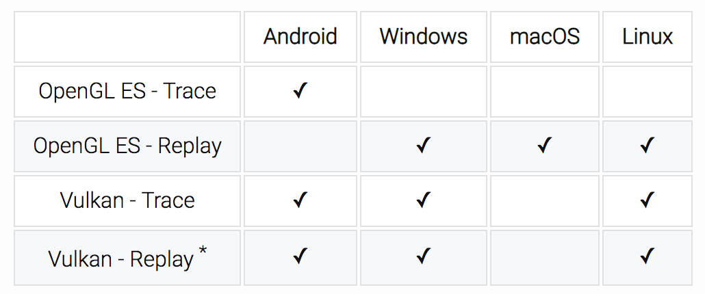

通过上面的几个工具，我们可以初步判断应用UI渲染的性能是否达标，例如是否经常出现掉帧、掉帧主要发生在渲染的哪一个阶段、是否存在Overdraw等。

虽然这些图形化界面工具非常好用，但是它们难以用在自动化测试场景中，那有哪些测量方法可以用于自动化测量UI渲染性能呢？

<strong>1. gfxinfo</strong>

<a href="https://developer.android.com/training/testing/performance" target="_blank">gfx</a><a href="https://developer.android.com/training/testing/performance" target="_blank">info</a>可以输出包含各阶段发生的动画以及帧相关的性能信息，具体命令如下：

<pre><code>adb shell dumpsys gfxinfo 包名
</code></pre>

除了渲染的性能之外，gfxinfo还可以拿到渲染相关的内存和View hierarchy信息。在Android 6.0之后，gxfinfo命令新增了framestats参数，可以拿到最近120帧每个绘制阶段的耗时信息。

<pre><code>adb shell dumpsys gfxinfo 包名 framestats
</code></pre>

通过这个命令我们可以实现自动化统计应用的帧率，更进一步还可以实现自定义的“Profile GPU Rendering”工具，在出现掉帧的时候，自动统计分析是哪个阶段的耗时增长最快，同时给出相应的<a href="https://developer.android.com/topic/performance/rendering/profile-gpu" target="_blank">建议</a>。

<strong>2. SurfaceFlinger</strong>

除了耗时，我们还比较关心渲染使用的内存。上一期我讲过，在Android 4.1以后每个Surface都会有三个Graphic Buffer，那如何查看Graphic Buffer占用的内存，系统是怎么样管理这部分的内存的呢？

你可以通过下面的命令拿到系统SurfaceFlinger相关的信息：

<pre><code>adb shell dumpsys SurfaceFlinger
</code></pre>

下面以今日头条为例，应用使用了三个Graphic Buffer缓冲区，当前用在显示的第二个Graphic Buffer，大小是1080 x 1920。现在我们也可以更好地理解三缓冲机制，你可以看到这三个Graphic Buffer的确是在交替使用。

<pre><code>+ Layer 0x793c9d0c00 (com.ss.***。news/com.**.MainActivity)
   //序号            //状态           //对象        //大小
  &gt;[02:0x794080f600] state=ACQUIRED, 0x794081bba0 [1080x1920:1088,  1]
   [00:0x793e76ca00] state=FREE    , 0x793c8a2640 [1080x1920:1088,  1]
   [01:0x793e76c800] state=FREE    , 0x793c9ebf60 [1080x1920:1088,  1]
</code></pre>

继续往下看，你可以看到这三个Buffer分别占用的内存：

<pre><code>Allocated buffers:
0x793c8a2640: 8160.00 KiB | 1080 (1088) x 1920 | 1 | 0x20000900 
0x793c9ebf60: 8160.00 KiB | 1080 (1088) x 1920 | 1 | 0x20000900 
0x794081bba0: 8160.00 KiB | 1080 (1088) x 1920 | 1 | 0x20000900
</code></pre>

这部分的内存其实真的不小，特别是现在手机的分辨率越来越大，而且还很多情况应用会有其他的Surface存在，例如使用了<a href="https://developer.android.com/reference/android/view/SurfaceView" target="_blank">SurfaceView</a>或者<a href="https://developer.android.com/reference/android/view/TextureView" target="_blank">TextureView</a>等。

那系统是怎么样管理这部分内存的呢？当应用退到后台的时候，系统会将这些内存回收，也就不会再把它们计算到应用的内存占用中。

<pre><code>+ Layer 0x793c9d0c00 (com.ss.***。news/com.**.MainActivity)
   [00:0x0] state=FREE    
   [01:0x0] state=FREE    
   [02:0x0] state=FREE
</code></pre>

那么如何快速地判别UI实现是否符合设计稿？如何更高效地实现UI自动化测试？这些问题你可以先思考一下，我们将在后面“高效测试”中再详细展开。

<h2 id="ui优化的常用手段">UI优化的常用手段</h2>

让我们再重温一下UI渲染的阶段流程图，我们的目标是实现60 fps，这意味着渲染的所有操作都必须在16 ms（= 1000 ms／60 fps）内完成。

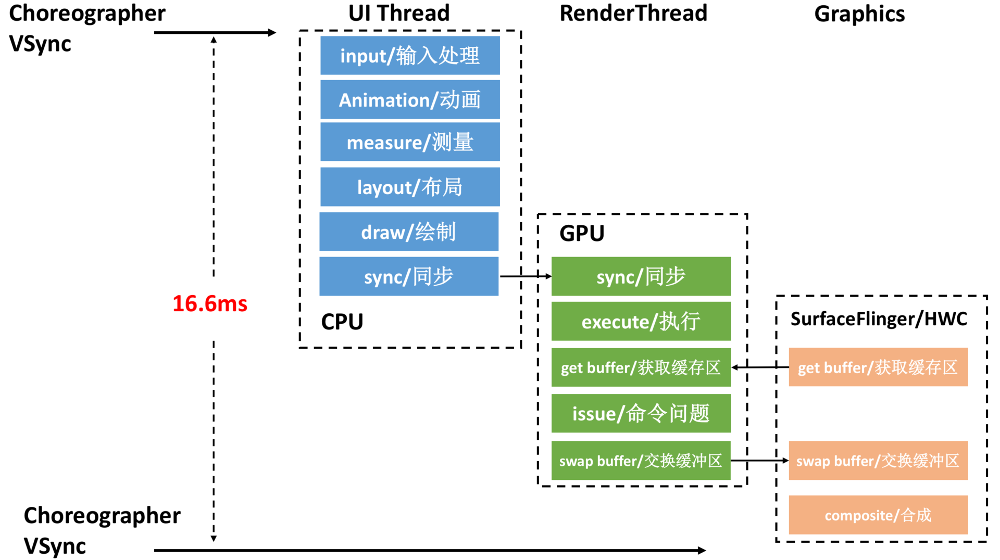

所谓的UI优化，就是拆解渲染的各个阶段的耗时，找到瓶颈的地方，再加以优化。接下来我们一起来看看UI优化的一些常用的手段。

<strong>1. 尽量使用硬件加速</strong>

通过上一期学习，相信你也发自内心地认同硬件加速绘制的性能是远远高于软件绘制的。所以说UI优化的第一个手段就是保证渲染尽量使用硬件加速。

有哪些情况我们不能使用硬件加速呢？之所以不能使用硬件加速，是因为硬件加速不能支持所有的Canvas API，具体API兼容列表可以见<a href="https://developer.android.com/guide/topics/graphics/hardware-accel#drawing-support" target="_blank">drawing-support</a>文档。如果使用了不支持的API，系统就需要通过CPU软件模拟绘制，这也是渐变、磨砂、圆角等效果渲染性能比较低的原因。

SVG也是一个非常典型的例子，SVG有很多指令硬件加速都不支持。但我们可以用一个取巧的方法，提前将这些SVG转换成Bitmap缓存起来，这样系统就可以更好地使用硬件加速绘制。同理，对于其他圆角、渐变等场景，我们也可以改为Bitmap实现。

这种取巧方法实现的关键在于如何提前生成Bitmap，以及Bitmap的内存需要如何管理。你可以参考一下市面常用的图片库实现。

<strong>2. Create View优化</strong>

观察渲染的流水线时，有没有同学发现缺少一个非常重要的环节，那就是View创建的耗时。请不要忘记，View的创建也是在UI线程里，对于一些非常复杂的界面，这部分的耗时不容忽视。

在优化之前我们先来分解一下View创建的耗时，可能会包括各种XML的随机读的I/O时间、解析XML的时间、生成对象的时间（Framework会大量使用到反射）。

相应的，我们来看看这个阶段有哪些优化方式。

<strong>使用代码创建</strong>

使用XML进行UI编写可以说是十分方便，可以在Android Studio中实时预览到界面。如果我们要对一个界面进行极致优化，就可以使用代码进行编写界面。

但是这种方式对开发效率来说简直是灾难，因此我们可以使用一些开源的XML转换为Java代码的工具，例如<a href="https://github.com/iReaderAndroid/X2C" target="_blank">X2C</a>。但坦白说，还是有不少情况是不支持直接转换的。

所以我们需要兼容性能与开发效率，我建议只在对性能要求非常高，但修改又不非常频繁的场景才使用这个方式。

<strong>异步创建</strong>

那我们能不能在线程提前创建View，实现UI的预加载吗？尝试过的同学都会发现系统会抛出下面这个异常：

<pre><code>java.lang.RuntimeException: Can't create handler inside thread that has not called Looper.prepare()      
  at android.os.Handler.&lt;init&gt;(Handler.java:121)
</code></pre>

事实上，我们可以通过又一个非常取巧的方式来实现。在使用线程创建UI的时候，先把线程的Looper的MessageQueue替换成UI线程Looper的Queue。

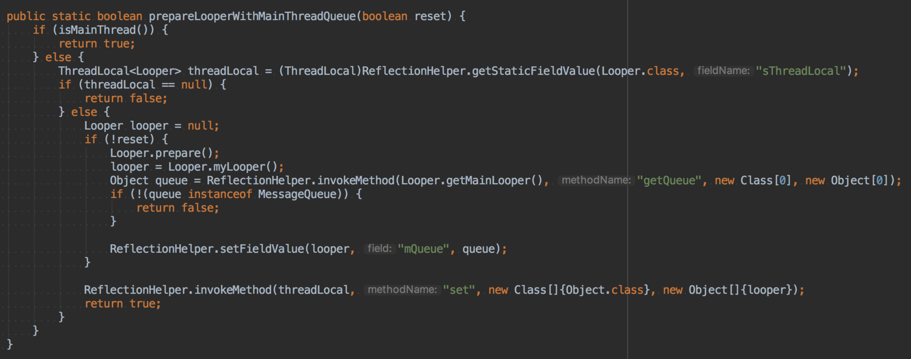

不过需要注意的是，在创建完View后我们需要把线程的Looper恢复成原来的。

<strong>View重用</strong>

正常来说，View会随着Activity的销毁而同时销毁。ListView、RecycleView通过View的缓存与重用大大地提升渲染性能。因此我们可以参考它们的思想，实现一套可以在不同Activity或者Fragment使用的View缓存机制。

但是这里需要保证所有进入缓存池的View都已经“净身出户”，不会保留之前的状态。微信曾经就因为这个缓存，导致出现不同的用户聊天记录错乱。

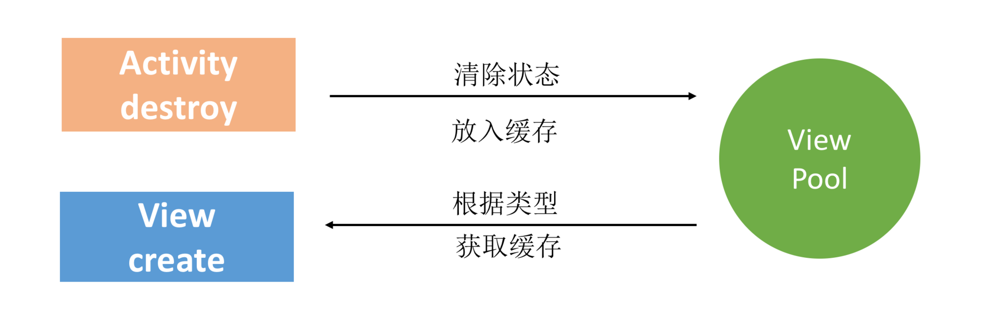

<strong>3. measure/layout优化</strong>

渲染流程中measure和layout也是需要CPU在主线程执行的，对于这块内容网上有很多优化的文章，一般的常规方法有：

<ul>
<li>
<strong>减少UI布局层次</strong>。例如尽量扁平化，使用<code>&lt;ViewStub&gt;</code> <code>&lt;Merge&gt;</code>等优化。
</li>

<li>
<strong>优化layout的开销</strong>。尽量不使用RelativeLayout或者基于weighted LinearLayout，它们layout的开销非常巨大。这里我推荐使用ConstraintLayout替代RelativeLayout或者weighted LinearLayout。
</li>

<li>
<strong>背景优化</strong>。尽量不要重复去设置背景，这里需要注意的是主题背景（theme)， theme默认会是一个纯色背景，如果我们自定义了界面的背景，那么主题的背景我们来说是无用的。但是由于主题背景是设置在DecorView中，所以这里会带来重复绘制，也会带来绘制性能损耗。
</li>
</ul>

对于measure和layout，我们能不能像Create View一样实现线程的预布局呢？这样可以大大地提升首次显示的性能。

Textview是系统控件中非常强大也非常重要的一个控件，强大的背后就代表着需要做很多计算。在2018年的Google I/O大会，发布了<a href="https://developer.android.com/reference/android/text/PrecomputedText" target="_blank">PrecomputedText</a>并已经集成在Jetpack中，它给我们提供了接口，可以异步进行measure和layout，不必在主线程中执行。

<h2 id="ui优化的进阶手段">UI优化的进阶手段</h2>

那对于其他的控件我们是不是也可以采用相同的方式？接下来我们一起来看看近两年新框架的做法，我来介绍一下Facebook的一个开源库Litho以及Google开源的Flutter。

<strong>1. Litho：异步布局</strong>

<a href="https://github.com/facebook/litho" target="_blank">Litho</a>是Facebook开源的声明式Android UI渲染框架，它是基于另外一个Facebook开源的布局引擎<a href="https://github.com/facebook/yoga" target="_blank">Yoga</a>开发的。

Litho本身非常强大，内部做了很多非常不错的优化。下面我来简单介绍一下它是如何优化UI的。

<strong>异步布局</strong>-
一般来说的Android所有的控件绘制都要遵守measure -&gt; layout -&gt; draw的流水线，并且这些都发生在主线程中。

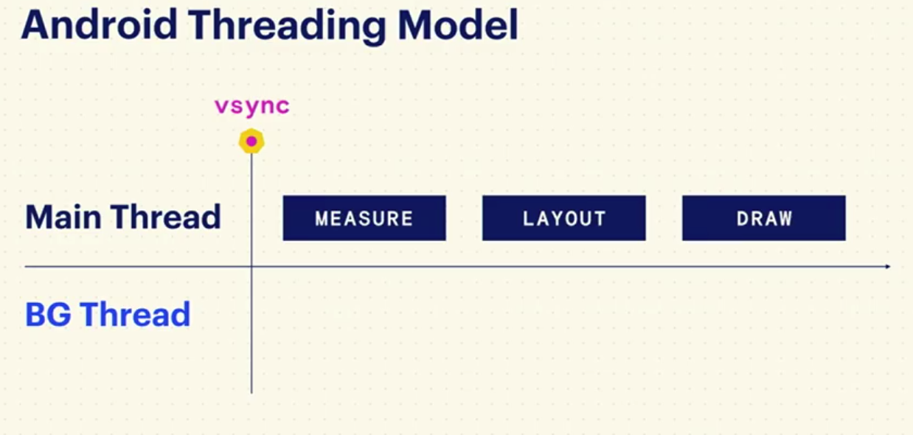

Litho如我前面提到的PrecomputedText一样，把measure和layout都放到了后台线程，只留下了必须要在主线程完成的draw，这大大降低了UI线程的负载。它的渲染流水线如下：

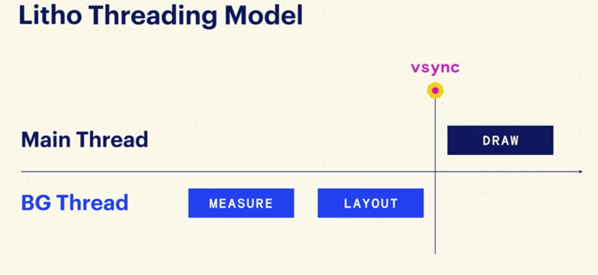

<strong>界面扁平化</strong>

前面也提到过，降低UI的层级是一个非常通用的优化方法。你肯定会想，有没有一种方法可以直接降低UI的层级，而不通过代码的改变呢？Litho就给了我们一种方案，由于Litho使用了自有的布局引擎（Yoga)，在布局阶段就可以检测不必要的层级、减少ViewGroups，来实现UI扁平化。比如下面这样图，上半部分是我们一般编写这个界面的方法，下半部分是Litho编写的界面，可以看到只有一层层级。

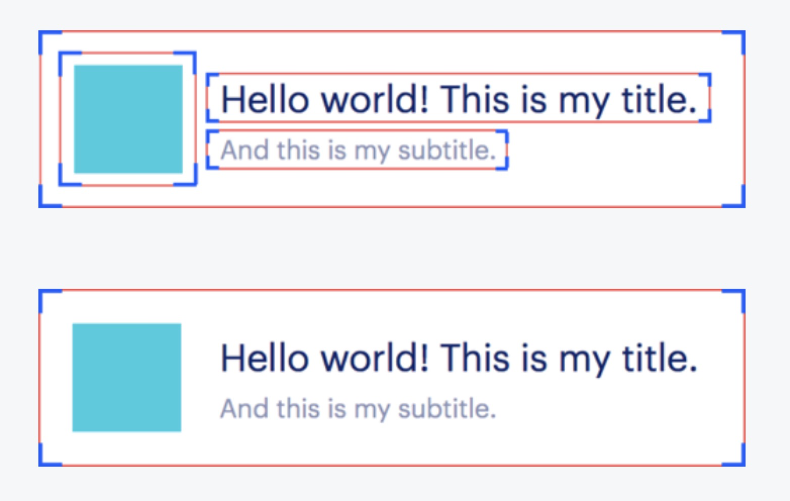

<strong>优化RecyclerView</strong>-
Litho还优化了RecyclerView中UI组件的缓存和回收方法。原生的RecyclerView或者ListView是按照viewType来进行缓存和回收，但如果一个RecyclerView/ListView中出现viewType过多，会使缓存形同虚设。但Litho是按照text、image和video独立回收的，这可以提高缓存命中率、降低内存使用率、提高滚动帧率。

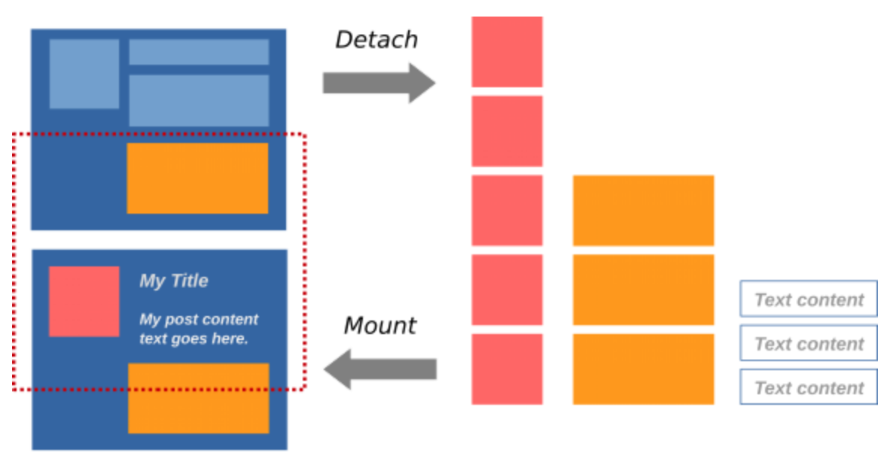

Litho虽然强大，但也有自己的缺点。它为了实现measure/layout异步化，使用了类似react单向数据流设计，这一定程度上加大了UI开发的复杂性。并且Litho的UI代码是使用Java/Kotlin来进行编写，无法做到在AS中预览。

如果你没有计划完全迁移到Litho，我建议可以优先使用Litho中的RecyclerCollectionComponent和Sections来优化自己的RecyelerView的性能。

<strong>2. Flutter：自己的布局 + 渲染引擎</strong>

如下图所示，Litho虽然通过使用自己的布局引擎Yoga，一定程度上突破了系统的一些限制，但是在draw之后依然走的系统的渲染机制。

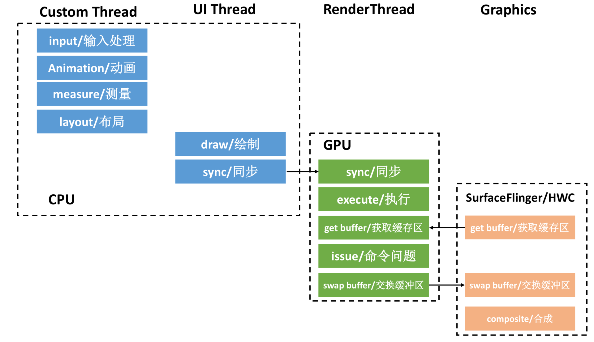

那我们能不能再往底层深入，把系统的渲染也同时接管过来？Flutter正是这样的框架，它也是最近十分火爆的一个新框架，这里我也简单介绍一下。

<a href="https://github.com/flutter/flutter" target="_blank">Flutter</a>是Google推出并开源的移动应用开发框架，开发者可以通过Dart语言开发App，一套代码同时运行在iOS和Android平台。

我们先整体看一下Flutter的架构，在Android上Flutter完全没有基于系统的渲染引擎，而是把Skia引擎直接集成进了App中，这使得Flutter App就像一个游戏App。并且直接使用了Dart虚拟机，可以说是一套跳脱出Android的方案，所以Flutter也可以很容易实现跨平台。

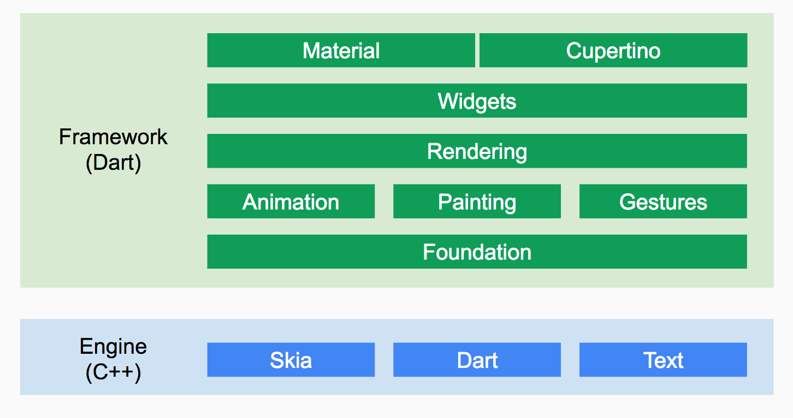

开发Flutter应用总的来说简化了线程模型，框架给我们抽象出各司其职的Runner，包括UI、GPU、I/O、Platform Runner。Android平台上面每一个引擎实例启动的时候会为UI Runner、GPU Runner、I/O Runner各自创建一个新的线程，所有Engine实例共享同一个Platform Runner和线程。

由于本期我们主要讨论UI渲染相关的内容，我来着重分析一下Flutter的渲染步骤，相关的具体知识你可以阅读<a href="https://tech.meituan.com/2018/08/09/waimai-flutter-practice.html" target="_blank">《Flutter原理与实践》</a>。

<ul>
<li>
首先UI Runner会执行root isolate（可以简单理解为main函数。需要简单解释一下isolate的概念，isolate是Dart虚拟机中一种执行并发代码实现，Dart虚拟机实现了Actor的并发模型，与大名鼎鼎的Erlang使用了类似的并发模型。如果不太了解Actor的同学，可以简单认为isolate就是Dart虚拟机的“线程”，Root isolate会通知引擎有帧要渲染）。
</li>

<li>
Flutter引擎得到通知后，会告知系统我们要同步VSYNC。
</li>

<li>
得到GPU的VSYNC信号后，对UI Widgets进行Layout并生成一个Layer Tree。
</li>

<li>
然后Layer Tree会交给GPU Runner进行合成和栅格化。
</li>

<li>
GPU Runner使用Skia库绘制相关图形。
</li>
</ul>

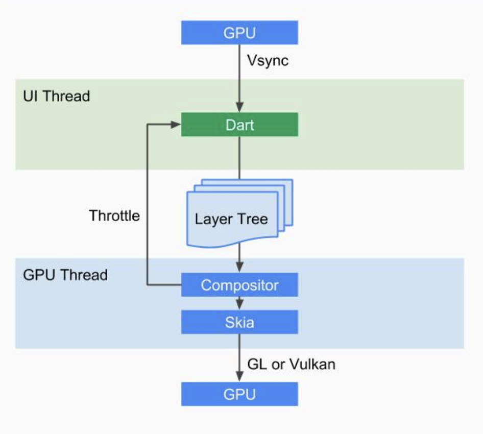

Flutter也采用了类似Litho、React属性不可变，单向数据流的方案。这已经成为现代UI渲染引擎的标配。这样做的好处是可以将视图与数据分离。

总体来说Flutter吸取和各个优秀前端框架的精华，还“加持”了强大的Dart虚拟机和Skia渲染引擎，可以说是一个非常优秀的框架，闲鱼、今日头条等很多应用部分功能已经使用Flutter开发。结合Google最新的Fuchsia操作系统，它会不会是一个颠覆Android的开发框架？我们在专栏后面会单独详细讨论Flutter。

<strong>3. RenderThread与RenderScript</strong>

在Android 5.0，系统增加了RenderThread，对于ViewPropertyAnimator和CircularReveal动画，我们可以使用<a href="https://mp.weixin.qq.com/s/o-e0MvrJbVS_0HHHRf43zQ" target="_blank">RenderThead实现动画的异步渲染</a>。当主线程阻塞的时候，普通动画会出现明显的丢帧卡顿，而使用RenderThread渲染的动画即使阻塞了主线程仍不受影响。

现在越来越多的应用会使用一些高级图片或者视频编辑功能，例如图片的高斯模糊、放大、锐化等。拿日常我们使用最多的“扫一扫”这个场景来看，这里涉及大量的图片变换操作，例如缩放、裁剪、二值化以及降噪等。

图片的变换涉及大量的计算任务，而根据我们上一期的学习，这个时候使用GPU是更好的选择。那如何进一步压榨系统GPU的性能呢？

我们可以通过<a href="https://developer.android.com/guide/topics/renderscript/compute" target="_blank">RenderScript</a>，它是Android操作系统上的一套API。它基于异构计算思想，专门用于密集型计算。RenderScript提供了三个基本工具：一个硬件无关的通用计算API；一个类似于CUDA、OpenCL和GLSL的计算API；一个类<a href="https://zh.wikipedia.org/wiki/C99" target="_blank">C99</a>的脚本语言。允许开发者以较少的代码实现功能复杂且性能优越的应用程序。

如何将它们应用到我们的项目中？你可以参考下面的一些实践方案：

<ul>
<li>
<a href="https://www.jianshu.com/p/b72da42e1463" target="_blank">RenderScript渲染利器</a>
</li>

<li>
<a href="http://www.jcodecraeer.com/a/anzhuokaifa/androidkaifa/2016/0504/4205.html?utm_source=itdadao&amp;utm_medium=referral" target="_blank">RenderScript :简单而快速的图像处理</a>
</li>

<li>
<a href="http://yifeng.studio/2016/10/20/android-renderscript-blur/" target="_blank">Android RenderScript 简单高效实现图片的高斯模糊效果</a>
</li>
</ul>

<h2 id="总结">总结</h2>

回顾一下UI优化的所有手段，我们会发现它存在这样一个脉络：

<strong>1. 在系统的框架下优化</strong>。布局优化、使用代码创建、View缓存等都是这个思路，我们希望减少甚至省下渲染流水线里某个阶段的耗时。

<strong>2. 利用系统新的特性</strong>。使用硬件加速、RenderThread、RenderScript都是这个思路，通过系统一些新的特性，最大限度压榨出性能。

<strong>3. 突破系统的限制</strong>。由于Android系统碎片化非常严重，很多好的特性可能低版本系统并不支持。而且系统需要支持所有的场景，在一些特定场景下它无法实现最优解。这个时候，我们希望可以突破系统的条条框框，例如Litho突破了布局，Flutter则更进一步，把渲染也接管过来了。

回顾一下过去所有的UI优化，第一阶段的优化我们在系统的束缚下也可以达到非常不错的效果。不过越到后面越容易出现瓶颈，这个时候我们就需要进一步往底层走，可以对整个架构有更大的掌控力，需要造自己的“轮子”。

对于UI优化的另一个思考是效率，目前Android Studio对设计并不友好，例如不支持Sketch插件和AE插件。<a href="https://github.com/airbnb/lottie-android" target="_blank">Lottie</a>是一个非常好的案例，它很大提升了开发人员写动画的效率。

“设计师和产品，你们长大了，要学会自己写UI了”。在未来，我们希望UI界面与适配可以实现自动化，或者干脆把它交还给设计师和产品。

<h2 id="课后作业">课后作业</h2>

在你平时的工作中，做过哪些UI优化的工作，有没有什么“大招”跟其他同学分享？对于Litho, Flutter，你又有什么看法？欢迎留言跟我和其他同学一起讨论。

今天还有两个课后小作业，尝试使用Litho和Flutter这两个框架。

1.使用Litho实现一个信息流界面。

2.使用Flutter写一个Hello World，分析安装包的体积。

欢迎你点击“请朋友读”，把今天的内容分享给好友，邀请他一起学习。最后别忘了在评论区提交今天的作业，我也为认真完成作业的同学准备了丰厚的“学习加油礼包”，期待与你一起切磋进步哦。

                        

                        

                            

                            

                            

                            

                        

                    

                

            

            

                

                
© 2019 - 2023 <a href="/cdn-cgi/l/email-protection#026e6e6e3b363333323542656f636b6e2c616d6f" target="_blank">Liangliang Lee</a>.
                    Powered by <a href="https://github.com/gin-gonic/gin" target="_blank">gin</a> and <a
                        href="https://github.com/kaiiiz/hexo-theme-book" target="_blank">hexo-theme-book</a>.

            

        

        
    

</body>

</html>