<!DOCTYPE html>
<html xmlns="http://www.w3.org/1999/xhtml">

<head>

    <head>
        <meta http-equiv="Content-Type" content="text/html; charset=UTF-8">
        <meta name="viewport" content="width=device-width, initial-scale=1, maximum-scale=1.0, user-scalable=no">
        <meta http-equiv='content-language' content='zh-cn'>
        <meta name='description' content=26&#32;关于编译，你需要了解什么？>
        <link rel="icon" href="/static/favicon.png">
        <title>26 关于编译，你需要了解什么？ </title>
        
        <link rel="stylesheet" href="/static/index.css">
        <link rel="stylesheet" href="/static/highlight.min.css">
        
        
        <meta name="generator" content="Hexo 4.2.0">
        
    </head>

<body>
    

        

            

                <a href="/">
                    
                    技术文章摘抄
                </a>
            

            

                <ul class="uncollapsible">
                    <li><a href="/" class="current-tab">首页</a></li>
                    <li><a href="../">上一级</a></li>
                </ul>
                <ul class="uncollapsible">
                    
                    <li>
                        <a class="menu-item" id="00 导读 如何打造高质量的应用？.md" href="/%e4%b8%93%e6%a0%8f/Android%e5%bc%80%e5%8f%91%e9%ab%98%e6%89%8b%e8%af%be/00%20%e5%af%bc%e8%af%bb%20%e5%a6%82%e4%bd%95%e6%89%93%e9%80%a0%e9%ab%98%e8%b4%a8%e9%87%8f%e7%9a%84%e5%ba%94%e7%94%a8%ef%bc%9f.md">00 导读 如何打造高质量的应用？.md</a>
                    </li>
                    
                    <li>
                        <a class="menu-item" id="00 开篇词 焦虑的移动开发者该如何破局？.md" href="/%e4%b8%93%e6%a0%8f/Android%e5%bc%80%e5%8f%91%e9%ab%98%e6%89%8b%e8%af%be/00%20%e5%bc%80%e7%af%87%e8%af%8d%20%e7%84%a6%e8%99%91%e7%9a%84%e7%a7%bb%e5%8a%a8%e5%bc%80%e5%8f%91%e8%80%85%e8%af%a5%e5%a6%82%e4%bd%95%e7%a0%b4%e5%b1%80%ef%bc%9f.md">00 开篇词 焦虑的移动开发者该如何破局？.md</a>
                    </li>
                    
                    <li>
                        <a class="menu-item" id="01 崩溃优化（上）：关于“崩溃”那些事儿.md" href="/%e4%b8%93%e6%a0%8f/Android%e5%bc%80%e5%8f%91%e9%ab%98%e6%89%8b%e8%af%be/01%20%e5%b4%a9%e6%ba%83%e4%bc%98%e5%8c%96%ef%bc%88%e4%b8%8a%ef%bc%89%ef%bc%9a%e5%85%b3%e4%ba%8e%e2%80%9c%e5%b4%a9%e6%ba%83%e2%80%9d%e9%82%a3%e4%ba%9b%e4%ba%8b%e5%84%bf.md">01 崩溃优化（上）：关于“崩溃”那些事儿.md</a>
                    </li>
                    
                    <li>
                        <a class="menu-item" id="02 崩溃优化（下）：应用崩溃了，你应该如何去分析？.md" href="/%e4%b8%93%e6%a0%8f/Android%e5%bc%80%e5%8f%91%e9%ab%98%e6%89%8b%e8%af%be/02%20%e5%b4%a9%e6%ba%83%e4%bc%98%e5%8c%96%ef%bc%88%e4%b8%8b%ef%bc%89%ef%bc%9a%e5%ba%94%e7%94%a8%e5%b4%a9%e6%ba%83%e4%ba%86%ef%bc%8c%e4%bd%a0%e5%ba%94%e8%af%a5%e5%a6%82%e4%bd%95%e5%8e%bb%e5%88%86%e6%9e%90%ef%bc%9f.md">02 崩溃优化（下）：应用崩溃了，你应该如何去分析？.md</a>
                    </li>
                    
                    <li>
                        <a class="menu-item" id="03 内存优化（上）：4GB内存时代，再谈内存优化.md" href="/%e4%b8%93%e6%a0%8f/Android%e5%bc%80%e5%8f%91%e9%ab%98%e6%89%8b%e8%af%be/03%20%e5%86%85%e5%ad%98%e4%bc%98%e5%8c%96%ef%bc%88%e4%b8%8a%ef%bc%89%ef%bc%9a4GB%e5%86%85%e5%ad%98%e6%97%b6%e4%bb%a3%ef%bc%8c%e5%86%8d%e8%b0%88%e5%86%85%e5%ad%98%e4%bc%98%e5%8c%96.md">03 内存优化（上）：4GB内存时代，再谈内存优化.md</a>
                    </li>
                    
                    <li>
                        <a class="menu-item" id="04 内存优化（下）：内存优化这件事，应该从哪里着手？.md" href="/%e4%b8%93%e6%a0%8f/Android%e5%bc%80%e5%8f%91%e9%ab%98%e6%89%8b%e8%af%be/04%20%e5%86%85%e5%ad%98%e4%bc%98%e5%8c%96%ef%bc%88%e4%b8%8b%ef%bc%89%ef%bc%9a%e5%86%85%e5%ad%98%e4%bc%98%e5%8c%96%e8%bf%99%e4%bb%b6%e4%ba%8b%ef%bc%8c%e5%ba%94%e8%af%a5%e4%bb%8e%e5%93%aa%e9%87%8c%e7%9d%80%e6%89%8b%ef%bc%9f.md">04 内存优化（下）：内存优化这件事，应该从哪里着手？.md</a>
                    </li>
                    
                    <li>
                        <a class="menu-item" id="05 卡顿优化（上）：你要掌握的卡顿分析方法.md" href="/%e4%b8%93%e6%a0%8f/Android%e5%bc%80%e5%8f%91%e9%ab%98%e6%89%8b%e8%af%be/05%20%e5%8d%a1%e9%a1%bf%e4%bc%98%e5%8c%96%ef%bc%88%e4%b8%8a%ef%bc%89%ef%bc%9a%e4%bd%a0%e8%a6%81%e6%8e%8c%e6%8f%a1%e7%9a%84%e5%8d%a1%e9%a1%bf%e5%88%86%e6%9e%90%e6%96%b9%e6%b3%95.md">05 卡顿优化（上）：你要掌握的卡顿分析方法.md</a>
                    </li>
                    
                    <li>
                        <a class="menu-item" id="06 卡顿优化（下）：如何监控应用卡顿？.md" href="/%e4%b8%93%e6%a0%8f/Android%e5%bc%80%e5%8f%91%e9%ab%98%e6%89%8b%e8%af%be/06%20%e5%8d%a1%e9%a1%bf%e4%bc%98%e5%8c%96%ef%bc%88%e4%b8%8b%ef%bc%89%ef%bc%9a%e5%a6%82%e4%bd%95%e7%9b%91%e6%8e%a7%e5%ba%94%e7%94%a8%e5%8d%a1%e9%a1%bf%ef%bc%9f.md">06 卡顿优化（下）：如何监控应用卡顿？.md</a>
                    </li>
                    
                    <li>
                        <a class="menu-item" id="06补充篇 卡顿优化：卡顿现场与卡顿分析.md" href="/%e4%b8%93%e6%a0%8f/Android%e5%bc%80%e5%8f%91%e9%ab%98%e6%89%8b%e8%af%be/06%e8%a1%a5%e5%85%85%e7%af%87%20%e5%8d%a1%e9%a1%bf%e4%bc%98%e5%8c%96%ef%bc%9a%e5%8d%a1%e9%a1%bf%e7%8e%b0%e5%9c%ba%e4%b8%8e%e5%8d%a1%e9%a1%bf%e5%88%86%e6%9e%90.md">06补充篇 卡顿优化：卡顿现场与卡顿分析.md</a>
                    </li>
                    
                    <li>
                        <a class="menu-item" id="07 启动优化（上）：从启动过程看启动速度优化.md" href="/%e4%b8%93%e6%a0%8f/Android%e5%bc%80%e5%8f%91%e9%ab%98%e6%89%8b%e8%af%be/07%20%e5%90%af%e5%8a%a8%e4%bc%98%e5%8c%96%ef%bc%88%e4%b8%8a%ef%bc%89%ef%bc%9a%e4%bb%8e%e5%90%af%e5%8a%a8%e8%bf%87%e7%a8%8b%e7%9c%8b%e5%90%af%e5%8a%a8%e9%80%9f%e5%ba%a6%e4%bc%98%e5%8c%96.md">07 启动优化（上）：从启动过程看启动速度优化.md</a>
                    </li>
                    
                    <li>
                        <a class="menu-item" id="08 启动优化（下）：优化启动速度的进阶方法.md" href="/%e4%b8%93%e6%a0%8f/Android%e5%bc%80%e5%8f%91%e9%ab%98%e6%89%8b%e8%af%be/08%20%e5%90%af%e5%8a%a8%e4%bc%98%e5%8c%96%ef%bc%88%e4%b8%8b%ef%bc%89%ef%bc%9a%e4%bc%98%e5%8c%96%e5%90%af%e5%8a%a8%e9%80%9f%e5%ba%a6%e7%9a%84%e8%bf%9b%e9%98%b6%e6%96%b9%e6%b3%95.md">08 启动优化（下）：优化启动速度的进阶方法.md</a>
                    </li>
                    
                    <li>
                        <a class="menu-item" id="09 I_O优化（上）：开发工程师必备的I_O优化知识.md" href="/%e4%b8%93%e6%a0%8f/Android%e5%bc%80%e5%8f%91%e9%ab%98%e6%89%8b%e8%af%be/09%20I_O%e4%bc%98%e5%8c%96%ef%bc%88%e4%b8%8a%ef%bc%89%ef%bc%9a%e5%bc%80%e5%8f%91%e5%b7%a5%e7%a8%8b%e5%b8%88%e5%bf%85%e5%a4%87%e7%9a%84I_O%e4%bc%98%e5%8c%96%e7%9f%a5%e8%af%86.md">09 I_O优化（上）：开发工程师必备的I_O优化知识.md</a>
                    </li>
                    
                    <li>
                        <a class="menu-item" id="10 I_O优化（中）：不同I_O方式的使用场景是什么？.md" href="/%e4%b8%93%e6%a0%8f/Android%e5%bc%80%e5%8f%91%e9%ab%98%e6%89%8b%e8%af%be/10%20I_O%e4%bc%98%e5%8c%96%ef%bc%88%e4%b8%ad%ef%bc%89%ef%bc%9a%e4%b8%8d%e5%90%8cI_O%e6%96%b9%e5%bc%8f%e7%9a%84%e4%bd%bf%e7%94%a8%e5%9c%ba%e6%99%af%e6%98%af%e4%bb%80%e4%b9%88%ef%bc%9f.md">10 I_O优化（中）：不同I_O方式的使用场景是什么？.md</a>
                    </li>
                    
                    <li>
                        <a class="menu-item" id="11 I_O优化（下）：如何监控线上I_O操作？.md" href="/%e4%b8%93%e6%a0%8f/Android%e5%bc%80%e5%8f%91%e9%ab%98%e6%89%8b%e8%af%be/11%20I_O%e4%bc%98%e5%8c%96%ef%bc%88%e4%b8%8b%ef%bc%89%ef%bc%9a%e5%a6%82%e4%bd%95%e7%9b%91%e6%8e%a7%e7%ba%bf%e4%b8%8aI_O%e6%93%8d%e4%bd%9c%ef%bc%9f.md">11 I_O优化（下）：如何监控线上I_O操作？.md</a>
                    </li>
                    
                    <li>
                        <a class="menu-item" id="12 存储优化（上）：常见的数据存储方法有哪些？.md" href="/%e4%b8%93%e6%a0%8f/Android%e5%bc%80%e5%8f%91%e9%ab%98%e6%89%8b%e8%af%be/12%20%e5%ad%98%e5%82%a8%e4%bc%98%e5%8c%96%ef%bc%88%e4%b8%8a%ef%bc%89%ef%bc%9a%e5%b8%b8%e8%a7%81%e7%9a%84%e6%95%b0%e6%8d%ae%e5%ad%98%e5%82%a8%e6%96%b9%e6%b3%95%e6%9c%89%e5%93%aa%e4%ba%9b%ef%bc%9f.md">12 存储优化（上）：常见的数据存储方法有哪些？.md</a>
                    </li>
                    
                    <li>
                        <a class="menu-item" id="13 存储优化（中）：如何优化数据存储？.md" href="/%e4%b8%93%e6%a0%8f/Android%e5%bc%80%e5%8f%91%e9%ab%98%e6%89%8b%e8%af%be/13%20%e5%ad%98%e5%82%a8%e4%bc%98%e5%8c%96%ef%bc%88%e4%b8%ad%ef%bc%89%ef%bc%9a%e5%a6%82%e4%bd%95%e4%bc%98%e5%8c%96%e6%95%b0%e6%8d%ae%e5%ad%98%e5%82%a8%ef%bc%9f.md">13 存储优化（中）：如何优化数据存储？.md</a>
                    </li>
                    
                    <li>
                        <a class="menu-item" id="14 存储优化（下）：数据库SQLite的使用和优化.md" href="/%e4%b8%93%e6%a0%8f/Android%e5%bc%80%e5%8f%91%e9%ab%98%e6%89%8b%e8%af%be/14%20%e5%ad%98%e5%82%a8%e4%bc%98%e5%8c%96%ef%bc%88%e4%b8%8b%ef%bc%89%ef%bc%9a%e6%95%b0%e6%8d%ae%e5%ba%93SQLite%e7%9a%84%e4%bd%bf%e7%94%a8%e5%92%8c%e4%bc%98%e5%8c%96.md">14 存储优化（下）：数据库SQLite的使用和优化.md</a>
                    </li>
                    
                    <li>
                        <a class="menu-item" id="15 网络优化（上）：移动开发工程师必备的网络优化知识.md" href="/%e4%b8%93%e6%a0%8f/Android%e5%bc%80%e5%8f%91%e9%ab%98%e6%89%8b%e8%af%be/15%20%e7%bd%91%e7%bb%9c%e4%bc%98%e5%8c%96%ef%bc%88%e4%b8%8a%ef%bc%89%ef%bc%9a%e7%a7%bb%e5%8a%a8%e5%bc%80%e5%8f%91%e5%b7%a5%e7%a8%8b%e5%b8%88%e5%bf%85%e5%a4%87%e7%9a%84%e7%bd%91%e7%bb%9c%e4%bc%98%e5%8c%96%e7%9f%a5%e8%af%86.md">15 网络优化（上）：移动开发工程师必备的网络优化知识.md</a>
                    </li>
                    
                    <li>
                        <a class="menu-item" id="16 网络优化（中）：复杂多变的移动网络该如何优化？.md" href="/%e4%b8%93%e6%a0%8f/Android%e5%bc%80%e5%8f%91%e9%ab%98%e6%89%8b%e8%af%be/16%20%e7%bd%91%e7%bb%9c%e4%bc%98%e5%8c%96%ef%bc%88%e4%b8%ad%ef%bc%89%ef%bc%9a%e5%a4%8d%e6%9d%82%e5%a4%9a%e5%8f%98%e7%9a%84%e7%a7%bb%e5%8a%a8%e7%bd%91%e7%bb%9c%e8%af%a5%e5%a6%82%e4%bd%95%e4%bc%98%e5%8c%96%ef%bc%9f.md">16 网络优化（中）：复杂多变的移动网络该如何优化？.md</a>
                    </li>
                    
                    <li>
                        <a class="menu-item" id="17 网络优化（下）：大数据下网络该如何监控？.md" href="/%e4%b8%93%e6%a0%8f/Android%e5%bc%80%e5%8f%91%e9%ab%98%e6%89%8b%e8%af%be/17%20%e7%bd%91%e7%bb%9c%e4%bc%98%e5%8c%96%ef%bc%88%e4%b8%8b%ef%bc%89%ef%bc%9a%e5%a4%a7%e6%95%b0%e6%8d%ae%e4%b8%8b%e7%bd%91%e7%bb%9c%e8%af%a5%e5%a6%82%e4%bd%95%e7%9b%91%e6%8e%a7%ef%bc%9f.md">17 网络优化（下）：大数据下网络该如何监控？.md</a>
                    </li>
                    
                    <li>
                        <a class="menu-item" id="18 耗电优化（上）：从电量优化的演进看耗电分析.md" href="/%e4%b8%93%e6%a0%8f/Android%e5%bc%80%e5%8f%91%e9%ab%98%e6%89%8b%e8%af%be/18%20%e8%80%97%e7%94%b5%e4%bc%98%e5%8c%96%ef%bc%88%e4%b8%8a%ef%bc%89%ef%bc%9a%e4%bb%8e%e7%94%b5%e9%87%8f%e4%bc%98%e5%8c%96%e7%9a%84%e6%bc%94%e8%bf%9b%e7%9c%8b%e8%80%97%e7%94%b5%e5%88%86%e6%9e%90.md">18 耗电优化（上）：从电量优化的演进看耗电分析.md</a>
                    </li>
                    
                    <li>
                        <a class="menu-item" id="19 耗电优化（下）：耗电的优化方法与线上监控.md" href="/%e4%b8%93%e6%a0%8f/Android%e5%bc%80%e5%8f%91%e9%ab%98%e6%89%8b%e8%af%be/19%20%e8%80%97%e7%94%b5%e4%bc%98%e5%8c%96%ef%bc%88%e4%b8%8b%ef%bc%89%ef%bc%9a%e8%80%97%e7%94%b5%e7%9a%84%e4%bc%98%e5%8c%96%e6%96%b9%e6%b3%95%e4%b8%8e%e7%ba%bf%e4%b8%8a%e7%9b%91%e6%8e%a7.md">19 耗电优化（下）：耗电的优化方法与线上监控.md</a>
                    </li>
                    
                    <li>
                        <a class="menu-item" id="20 UI 优化（上）：UI 渲染的几个关键概念.md" href="/%e4%b8%93%e6%a0%8f/Android%e5%bc%80%e5%8f%91%e9%ab%98%e6%89%8b%e8%af%be/20%20UI%20%e4%bc%98%e5%8c%96%ef%bc%88%e4%b8%8a%ef%bc%89%ef%bc%9aUI%20%e6%b8%b2%e6%9f%93%e7%9a%84%e5%87%a0%e4%b8%aa%e5%85%b3%e9%94%ae%e6%a6%82%e5%bf%b5.md">20 UI 优化（上）：UI 渲染的几个关键概念.md</a>
                    </li>
                    
                    <li>
                        <a class="menu-item" id="21 UI 优化（下）：如何优化 UI 渲染？.md" href="/%e4%b8%93%e6%a0%8f/Android%e5%bc%80%e5%8f%91%e9%ab%98%e6%89%8b%e8%af%be/21%20UI%20%e4%bc%98%e5%8c%96%ef%bc%88%e4%b8%8b%ef%bc%89%ef%bc%9a%e5%a6%82%e4%bd%95%e4%bc%98%e5%8c%96%20UI%20%e6%b8%b2%e6%9f%93%ef%bc%9f.md">21 UI 优化（下）：如何优化 UI 渲染？.md</a>
                    </li>
                    
                    <li>
                        <a class="menu-item" id="22 包体积优化（上）：如何减少安装包大小？.md" href="/%e4%b8%93%e6%a0%8f/Android%e5%bc%80%e5%8f%91%e9%ab%98%e6%89%8b%e8%af%be/22%20%e5%8c%85%e4%bd%93%e7%a7%af%e4%bc%98%e5%8c%96%ef%bc%88%e4%b8%8a%ef%bc%89%ef%bc%9a%e5%a6%82%e4%bd%95%e5%87%8f%e5%b0%91%e5%ae%89%e8%a3%85%e5%8c%85%e5%a4%a7%e5%b0%8f%ef%bc%9f.md">22 包体积优化（上）：如何减少安装包大小？.md</a>
                    </li>
                    
                    <li>
                        <a class="menu-item" id="23 包体积优化（下）：资源优化的进阶实践.md" href="/%e4%b8%93%e6%a0%8f/Android%e5%bc%80%e5%8f%91%e9%ab%98%e6%89%8b%e8%af%be/23%20%e5%8c%85%e4%bd%93%e7%a7%af%e4%bc%98%e5%8c%96%ef%bc%88%e4%b8%8b%ef%bc%89%ef%bc%9a%e8%b5%84%e6%ba%90%e4%bc%98%e5%8c%96%e7%9a%84%e8%bf%9b%e9%98%b6%e5%ae%9e%e8%b7%b5.md">23 包体积优化（下）：资源优化的进阶实践.md</a>
                    </li>
                    
                    <li>
                        <a class="menu-item" id="24 想成为Android高手，你需要先搞定这三个问题.md" href="/%e4%b8%93%e6%a0%8f/Android%e5%bc%80%e5%8f%91%e9%ab%98%e6%89%8b%e8%af%be/24%20%e6%83%b3%e6%88%90%e4%b8%baAndroid%e9%ab%98%e6%89%8b%ef%bc%8c%e4%bd%a0%e9%9c%80%e8%a6%81%e5%85%88%e6%90%9e%e5%ae%9a%e8%bf%99%e4%b8%89%e4%b8%aa%e9%97%ae%e9%a2%98.md">24 想成为Android高手，你需要先搞定这三个问题.md</a>
                    </li>
                    
                    <li>
                        <a class="menu-item" id="25 如何提升组织与个人的研发效能？.md" href="/%e4%b8%93%e6%a0%8f/Android%e5%bc%80%e5%8f%91%e9%ab%98%e6%89%8b%e8%af%be/25%20%e5%a6%82%e4%bd%95%e6%8f%90%e5%8d%87%e7%bb%84%e7%bb%87%e4%b8%8e%e4%b8%aa%e4%ba%ba%e7%9a%84%e7%a0%94%e5%8f%91%e6%95%88%e8%83%bd%ef%bc%9f.md">25 如何提升组织与个人的研发效能？.md</a>
                    </li>
                    
                    <li>
                        <a class="menu-item" id="26 关于编译，你需要了解什么？.md" href="/%e4%b8%93%e6%a0%8f/Android%e5%bc%80%e5%8f%91%e9%ab%98%e6%89%8b%e8%af%be/26%20%e5%85%b3%e4%ba%8e%e7%bc%96%e8%af%91%ef%bc%8c%e4%bd%a0%e9%9c%80%e8%a6%81%e4%ba%86%e8%a7%a3%e4%bb%80%e4%b9%88%ef%bc%9f.md">26 关于编译，你需要了解什么？.md</a>
                    </li>
                    
                    <li>
                        <a class="menu-item" id="27 编译插桩的三种方法：AspectJ、ASM、ReDex.md" href="/%e4%b8%93%e6%a0%8f/Android%e5%bc%80%e5%8f%91%e9%ab%98%e6%89%8b%e8%af%be/27%20%e7%bc%96%e8%af%91%e6%8f%92%e6%a1%a9%e7%9a%84%e4%b8%89%e7%a7%8d%e6%96%b9%e6%b3%95%ef%bc%9aAspectJ%e3%80%81ASM%e3%80%81ReDex.md">27 编译插桩的三种方法：AspectJ、ASM、ReDex.md</a>
                    </li>
                    
                    <li>
                        <a class="menu-item" id="28 大数据与AI，如何高效地测试？.md" href="/%e4%b8%93%e6%a0%8f/Android%e5%bc%80%e5%8f%91%e9%ab%98%e6%89%8b%e8%af%be/28%20%e5%a4%a7%e6%95%b0%e6%8d%ae%e4%b8%8eAI%ef%bc%8c%e5%a6%82%e4%bd%95%e9%ab%98%e6%95%88%e5%9c%b0%e6%b5%8b%e8%af%95%ef%bc%9f.md">28 大数据与AI，如何高效地测试？.md</a>
                    </li>
                    
                    <li>
                        <a class="menu-item" id="29 从每月到每天，如何给版本发布提速？.md" href="/%e4%b8%93%e6%a0%8f/Android%e5%bc%80%e5%8f%91%e9%ab%98%e6%89%8b%e8%af%be/29%20%e4%bb%8e%e6%af%8f%e6%9c%88%e5%88%b0%e6%af%8f%e5%a4%a9%ef%bc%8c%e5%a6%82%e4%bd%95%e7%bb%99%e7%89%88%e6%9c%ac%e5%8f%91%e5%b8%83%e6%8f%90%e9%80%9f%ef%bc%9f.md">29 从每月到每天，如何给版本发布提速？.md</a>
                    </li>
                    
                    <li>
                        <a class="menu-item" id="30 数据评估（上）：如何实现高可用的上报组件？.md" href="/%e4%b8%93%e6%a0%8f/Android%e5%bc%80%e5%8f%91%e9%ab%98%e6%89%8b%e8%af%be/30%20%e6%95%b0%e6%8d%ae%e8%af%84%e4%bc%b0%ef%bc%88%e4%b8%8a%ef%bc%89%ef%bc%9a%e5%a6%82%e4%bd%95%e5%ae%9e%e7%8e%b0%e9%ab%98%e5%8f%af%e7%94%a8%e7%9a%84%e4%b8%8a%e6%8a%a5%e7%bb%84%e4%bb%b6%ef%bc%9f.md">30 数据评估（上）：如何实现高可用的上报组件？.md</a>
                    </li>
                    
                    <li>
                        <a class="menu-item" id="31 数据评估（下）：什么是大数据平台？.md" href="/%e4%b8%93%e6%a0%8f/Android%e5%bc%80%e5%8f%91%e9%ab%98%e6%89%8b%e8%af%be/31%20%e6%95%b0%e6%8d%ae%e8%af%84%e4%bc%b0%ef%bc%88%e4%b8%8b%ef%bc%89%ef%bc%9a%e4%bb%80%e4%b9%88%e6%98%af%e5%a4%a7%e6%95%b0%e6%8d%ae%e5%b9%b3%e5%8f%b0%ef%bc%9f.md">31 数据评估（下）：什么是大数据平台？.md</a>
                    </li>
                    
                    <li>
                        <a class="menu-item" id="32 线上疑难问题该如何排查和跟踪？.md" href="/%e4%b8%93%e6%a0%8f/Android%e5%bc%80%e5%8f%91%e9%ab%98%e6%89%8b%e8%af%be/32%20%e7%ba%bf%e4%b8%8a%e7%96%91%e9%9a%be%e9%97%ae%e9%a2%98%e8%af%a5%e5%a6%82%e4%bd%95%e6%8e%92%e6%9f%a5%e5%92%8c%e8%b7%9f%e8%b8%aa%ef%bc%9f.md">32 线上疑难问题该如何排查和跟踪？.md</a>
                    </li>
                    
                    <li>
                        <a class="menu-item" id="33 做一名有高度的移动开发工程师.md" href="/%e4%b8%93%e6%a0%8f/Android%e5%bc%80%e5%8f%91%e9%ab%98%e6%89%8b%e8%af%be/33%20%e5%81%9a%e4%b8%80%e5%90%8d%e6%9c%89%e9%ab%98%e5%ba%a6%e7%9a%84%e7%a7%bb%e5%8a%a8%e5%bc%80%e5%8f%91%e5%b7%a5%e7%a8%8b%e5%b8%88.md">33 做一名有高度的移动开发工程师.md</a>
                    </li>
                    
                    <li>
                        <a class="menu-item" id="34 聊聊重构：优秀的架构都是演进而来的.md" href="/%e4%b8%93%e6%a0%8f/Android%e5%bc%80%e5%8f%91%e9%ab%98%e6%89%8b%e8%af%be/34%20%e8%81%8a%e8%81%8a%e9%87%8d%e6%9e%84%ef%bc%9a%e4%bc%98%e7%a7%80%e7%9a%84%e6%9e%b6%e6%9e%84%e9%83%bd%e6%98%af%e6%bc%94%e8%bf%9b%e8%80%8c%e6%9d%a5%e7%9a%84.md">34 聊聊重构：优秀的架构都是演进而来的.md</a>
                    </li>
                    
                    <li>
                        <a class="menu-item" id="35 Native Hook 技术，天使还是魔鬼？.md" href="/%e4%b8%93%e6%a0%8f/Android%e5%bc%80%e5%8f%91%e9%ab%98%e6%89%8b%e8%af%be/35%20Native%20Hook%20%e6%8a%80%e6%9c%af%ef%bc%8c%e5%a4%a9%e4%bd%bf%e8%bf%98%e6%98%af%e9%ad%94%e9%ac%bc%ef%bc%9f.md">35 Native Hook 技术，天使还是魔鬼？.md</a>
                    </li>
                    
                    <li>
                        <a class="menu-item" id="36 跨平台开发的现状与应用.md" href="/%e4%b8%93%e6%a0%8f/Android%e5%bc%80%e5%8f%91%e9%ab%98%e6%89%8b%e8%af%be/36%20%e8%b7%a8%e5%b9%b3%e5%8f%b0%e5%bc%80%e5%8f%91%e7%9a%84%e7%8e%b0%e7%8a%b6%e4%b8%8e%e5%ba%94%e7%94%a8.md">36 跨平台开发的现状与应用.md</a>
                    </li>
                    
                    <li>
                        <a class="menu-item" id="37 移动开发新大陆：工作三年半，移动开发转型手游开发.md" href="/%e4%b8%93%e6%a0%8f/Android%e5%bc%80%e5%8f%91%e9%ab%98%e6%89%8b%e8%af%be/37%20%e7%a7%bb%e5%8a%a8%e5%bc%80%e5%8f%91%e6%96%b0%e5%a4%a7%e9%99%86%ef%bc%9a%e5%b7%a5%e4%bd%9c%e4%b8%89%e5%b9%b4%e5%8d%8a%ef%bc%8c%e7%a7%bb%e5%8a%a8%e5%bc%80%e5%8f%91%e8%bd%ac%e5%9e%8b%e6%89%8b%e6%b8%b8%e5%bc%80%e5%8f%91.md">37 移动开发新大陆：工作三年半，移动开发转型手游开发.md</a>
                    </li>
                    
                    <li>
                        <a class="menu-item" id="38 移动开发新大陆：Android音视频开发.md" href="/%e4%b8%93%e6%a0%8f/Android%e5%bc%80%e5%8f%91%e9%ab%98%e6%89%8b%e8%af%be/38%20%e7%a7%bb%e5%8a%a8%e5%bc%80%e5%8f%91%e6%96%b0%e5%a4%a7%e9%99%86%ef%bc%9aAndroid%e9%9f%b3%e8%a7%86%e9%a2%91%e5%bc%80%e5%8f%91.md">38 移动开发新大陆：Android音视频开发.md</a>
                    </li>
                    
                    <li>
                        <a class="menu-item" id="39 移动开发新大陆： 边缘智能计算的趋势.md" href="/%e4%b8%93%e6%a0%8f/Android%e5%bc%80%e5%8f%91%e9%ab%98%e6%89%8b%e8%af%be/39%20%e7%a7%bb%e5%8a%a8%e5%bc%80%e5%8f%91%e6%96%b0%e5%a4%a7%e9%99%86%ef%bc%9a%20%e8%be%b9%e7%bc%98%e6%99%ba%e8%83%bd%e8%ae%a1%e7%ae%97%e7%9a%84%e8%b6%8b%e5%8a%bf.md">39 移动开发新大陆： 边缘智能计算的趋势.md</a>
                    </li>
                    
                    <li>
                        <a class="menu-item" id="40 动态化实践，如何选择适合自己的方案？.md" href="/%e4%b8%93%e6%a0%8f/Android%e5%bc%80%e5%8f%91%e9%ab%98%e6%89%8b%e8%af%be/40%20%e5%8a%a8%e6%80%81%e5%8c%96%e5%ae%9e%e8%b7%b5%ef%bc%8c%e5%a6%82%e4%bd%95%e9%80%89%e6%8b%a9%e9%80%82%e5%90%88%e8%87%aa%e5%b7%b1%e7%9a%84%e6%96%b9%e6%a1%88%ef%bc%9f.md">40 动态化实践，如何选择适合自己的方案？.md</a>
                    </li>
                    
                    <li>
                        <a class="menu-item" id="41 聊聊Flutter，面对层出不穷的新技术该如何跟进？.md" href="/%e4%b8%93%e6%a0%8f/Android%e5%bc%80%e5%8f%91%e9%ab%98%e6%89%8b%e8%af%be/41%20%e8%81%8a%e8%81%8aFlutter%ef%bc%8c%e9%9d%a2%e5%af%b9%e5%b1%82%e5%87%ba%e4%b8%8d%e7%a9%b7%e7%9a%84%e6%96%b0%e6%8a%80%e6%9c%af%e8%af%a5%e5%a6%82%e4%bd%95%e8%b7%9f%e8%bf%9b%ef%bc%9f.md">41 聊聊Flutter，面对层出不穷的新技术该如何跟进？.md</a>
                    </li>
                    
                    <li>
                        <a class="menu-item" id="42 Android开发高手课学习心得.md" href="/%e4%b8%93%e6%a0%8f/Android%e5%bc%80%e5%8f%91%e9%ab%98%e6%89%8b%e8%af%be/42%20Android%e5%bc%80%e5%8f%91%e9%ab%98%e6%89%8b%e8%af%be%e5%ad%a6%e4%b9%a0%e5%bf%83%e5%be%97.md">42 Android开发高手课学习心得.md</a>
                    </li>
                    
                    <li>
                        <a class="menu-item" id="Android JVM TI机制详解（内含福利彩蛋）.md" href="/%e4%b8%93%e6%a0%8f/Android%e5%bc%80%e5%8f%91%e9%ab%98%e6%89%8b%e8%af%be/Android%20JVM%20TI%e6%9c%ba%e5%88%b6%e8%af%a6%e8%a7%a3%ef%bc%88%e5%86%85%e5%90%ab%e7%a6%8f%e5%88%a9%e5%bd%a9%e8%9b%8b%ef%bc%89.md">Android JVM TI机制详解（内含福利彩蛋）.md</a>
                    </li>
                    
                    <li>
                        <a class="menu-item" id="Android工程师的“面试指南”.md" href="/%e4%b8%93%e6%a0%8f/Android%e5%bc%80%e5%8f%91%e9%ab%98%e6%89%8b%e8%af%be/Android%e5%b7%a5%e7%a8%8b%e5%b8%88%e7%9a%84%e2%80%9c%e9%9d%a2%e8%af%95%e6%8c%87%e5%8d%97%e2%80%9d.md">Android工程师的“面试指南”.md</a>
                    </li>
                    
                    <li>
                        <a class="menu-item" id="Native下如何获取调用栈？.md" href="/%e4%b8%93%e6%a0%8f/Android%e5%bc%80%e5%8f%91%e9%ab%98%e6%89%8b%e8%af%be/Native%e4%b8%8b%e5%a6%82%e4%bd%95%e8%8e%b7%e5%8f%96%e8%b0%83%e7%94%a8%e6%a0%88%ef%bc%9f.md">Native下如何获取调用栈？.md</a>
                    </li>
                    
                    <li>
                        <a class="menu-item" id="专栏学得苦？可能你还需要一份配套学习书单.md" href="/%e4%b8%93%e6%a0%8f/Android%e5%bc%80%e5%8f%91%e9%ab%98%e6%89%8b%e8%af%be/%e4%b8%93%e6%a0%8f%e5%ad%a6%e5%be%97%e8%8b%a6%ef%bc%9f%e5%8f%af%e8%83%bd%e4%bd%a0%e8%bf%98%e9%9c%80%e8%a6%81%e4%b8%80%e4%bb%bd%e9%85%8d%e5%a5%97%e5%ad%a6%e4%b9%a0%e4%b9%a6%e5%8d%95.md">专栏学得苦？可能你还需要一份配套学习书单.md</a>
                    </li>
                    
                    <li>
                        <a class="menu-item" id="专栏学得苦？可能是方法没找对.md" href="/%e4%b8%93%e6%a0%8f/Android%e5%bc%80%e5%8f%91%e9%ab%98%e6%89%8b%e8%af%be/%e4%b8%93%e6%a0%8f%e5%ad%a6%e5%be%97%e8%8b%a6%ef%bc%9f%e5%8f%af%e8%83%bd%e6%98%af%e6%96%b9%e6%b3%95%e6%b2%a1%e6%89%be%e5%af%b9.md">专栏学得苦？可能是方法没找对.md</a>
                    </li>
                    
                    <li>
                        <a class="menu-item" id="程序员修炼之路 设计能力的提升途径.md" href="/%e4%b8%93%e6%a0%8f/Android%e5%bc%80%e5%8f%91%e9%ab%98%e6%89%8b%e8%af%be/%e7%a8%8b%e5%ba%8f%e5%91%98%e4%bf%ae%e7%82%bc%e4%b9%8b%e8%b7%af%20%e8%ae%be%e8%ae%a1%e8%83%bd%e5%8a%9b%e7%9a%84%e6%8f%90%e5%8d%87%e9%80%94%e5%be%84.md">程序员修炼之路 设计能力的提升途径.md</a>
                    </li>
                    
                    <li>
                        <a class="menu-item" id="练习Sample跑起来 ASM插桩强化练习.md" href="/%e4%b8%93%e6%a0%8f/Android%e5%bc%80%e5%8f%91%e9%ab%98%e6%89%8b%e8%af%be/%e7%bb%83%e4%b9%a0Sample%e8%b7%91%e8%b5%b7%e6%9d%a5%20ASM%e6%8f%92%e6%a1%a9%e5%bc%ba%e5%8c%96%e7%bb%83%e4%b9%a0.md">练习Sample跑起来 ASM插桩强化练习.md</a>
                    </li>
                    
                    <li>
                        <a class="menu-item" id="练习Sample跑起来 唯鹿同学的练习手记 第1辑.md" href="/%e4%b8%93%e6%a0%8f/Android%e5%bc%80%e5%8f%91%e9%ab%98%e6%89%8b%e8%af%be/%e7%bb%83%e4%b9%a0Sample%e8%b7%91%e8%b5%b7%e6%9d%a5%20%e5%94%af%e9%b9%bf%e5%90%8c%e5%ad%a6%e7%9a%84%e7%bb%83%e4%b9%a0%e6%89%8b%e8%ae%b0%20%e7%ac%ac1%e8%be%91.md">练习Sample跑起来 唯鹿同学的练习手记 第1辑.md</a>
                    </li>
                    
                    <li>
                        <a class="menu-item" id="练习Sample跑起来 唯鹿同学的练习手记 第2辑.md" href="/%e4%b8%93%e6%a0%8f/Android%e5%bc%80%e5%8f%91%e9%ab%98%e6%89%8b%e8%af%be/%e7%bb%83%e4%b9%a0Sample%e8%b7%91%e8%b5%b7%e6%9d%a5%20%e5%94%af%e9%b9%bf%e5%90%8c%e5%ad%a6%e7%9a%84%e7%bb%83%e4%b9%a0%e6%89%8b%e8%ae%b0%20%e7%ac%ac2%e8%be%91.md">练习Sample跑起来 唯鹿同学的练习手记 第2辑.md</a>
                    </li>
                    
                    <li>
                        <a class="menu-item" id="练习Sample跑起来 唯鹿同学的练习手记 第3辑.md" href="/%e4%b8%93%e6%a0%8f/Android%e5%bc%80%e5%8f%91%e9%ab%98%e6%89%8b%e8%af%be/%e7%bb%83%e4%b9%a0Sample%e8%b7%91%e8%b5%b7%e6%9d%a5%20%e5%94%af%e9%b9%bf%e5%90%8c%e5%ad%a6%e7%9a%84%e7%bb%83%e4%b9%a0%e6%89%8b%e8%ae%b0%20%e7%ac%ac3%e8%be%91.md">练习Sample跑起来 唯鹿同学的练习手记 第3辑.md</a>
                    </li>
                    
                    <li>
                        <a class="menu-item" id="练习Sample跑起来 热点问题答疑第1期.md" href="/%e4%b8%93%e6%a0%8f/Android%e5%bc%80%e5%8f%91%e9%ab%98%e6%89%8b%e8%af%be/%e7%bb%83%e4%b9%a0Sample%e8%b7%91%e8%b5%b7%e6%9d%a5%20%e7%83%ad%e7%82%b9%e9%97%ae%e9%a2%98%e7%ad%94%e7%96%91%e7%ac%ac1%e6%9c%9f.md">练习Sample跑起来 热点问题答疑第1期.md</a>
                    </li>
                    
                    <li>
                        <a class="menu-item" id="练习Sample跑起来 热点问题答疑第2期.md" href="/%e4%b8%93%e6%a0%8f/Android%e5%bc%80%e5%8f%91%e9%ab%98%e6%89%8b%e8%af%be/%e7%bb%83%e4%b9%a0Sample%e8%b7%91%e8%b5%b7%e6%9d%a5%20%e7%83%ad%e7%82%b9%e9%97%ae%e9%a2%98%e7%ad%94%e7%96%91%e7%ac%ac2%e6%9c%9f.md">练习Sample跑起来 热点问题答疑第2期.md</a>
                    </li>
                    
                    <li>
                        <a class="menu-item" id="练习Sample跑起来 热点问题答疑第3期.md" href="/%e4%b8%93%e6%a0%8f/Android%e5%bc%80%e5%8f%91%e9%ab%98%e6%89%8b%e8%af%be/%e7%bb%83%e4%b9%a0Sample%e8%b7%91%e8%b5%b7%e6%9d%a5%20%e7%83%ad%e7%82%b9%e9%97%ae%e9%a2%98%e7%ad%94%e7%96%91%e7%ac%ac3%e6%9c%9f.md">练习Sample跑起来 热点问题答疑第3期.md</a>
                    </li>
                    
                    <li>
                        <a class="menu-item" id="练习Sample跑起来 热点问题答疑第4期.md" href="/%e4%b8%93%e6%a0%8f/Android%e5%bc%80%e5%8f%91%e9%ab%98%e6%89%8b%e8%af%be/%e7%bb%83%e4%b9%a0Sample%e8%b7%91%e8%b5%b7%e6%9d%a5%20%e7%83%ad%e7%82%b9%e9%97%ae%e9%a2%98%e7%ad%94%e7%96%91%e7%ac%ac4%e6%9c%9f.md">练习Sample跑起来 热点问题答疑第4期.md</a>
                    </li>
                    
                    <li>
                        <a class="menu-item" id="结束语 移动开发的今天和明天.md" href="/%e4%b8%93%e6%a0%8f/Android%e5%bc%80%e5%8f%91%e9%ab%98%e6%89%8b%e8%af%be/%e7%bb%93%e6%9d%9f%e8%af%ad%20%e7%a7%bb%e5%8a%a8%e5%bc%80%e5%8f%91%e7%9a%84%e4%bb%8a%e5%a4%a9%e5%92%8c%e6%98%8e%e5%a4%a9.md">结束语 移动开发的今天和明天.md</a>
                    </li>
                    
                    <li>
                        <a class="menu-item" id="聊聊Framework的学习方法.md" href="/%e4%b8%93%e6%a0%8f/Android%e5%bc%80%e5%8f%91%e9%ab%98%e6%89%8b%e8%af%be/%e8%81%8a%e8%81%8aFramework%e7%9a%84%e5%ad%a6%e4%b9%a0%e6%96%b9%e6%b3%95.md">聊聊Framework的学习方法.md</a>
                    </li>
                    
                    <li><a href="https://lianglianglee.com/assets/%E6%8D%90%E8%B5%A0.md">捐赠</a></li>
                </ul>

            

        

        

            

        

        

            

                

                    

                        
                        <header class="navbar">
                            <section class="navbar-section">
                                <a onclick="open_sidebar()">
                                    <i class="icon icon-menu"></i>
                                </a>
                            </section>
                        </header>
                    

                    

                        

                            
                            
                            
                            

                            <h1 id="title" data-id="26 关于编译，你需要了解什么？" class="title">26 关于编译，你需要了解什么？</h1>
                            

作为Android工程师，我们每天都会经历无数次编译；而对于大型项目来说，每次编译就意味着要花去一杯咖啡的时间。可能我讲具体的数字你会更有体会，当时我在微信时，全量编译Debug包需要5分钟，而编译Release包更是要超过15分钟。

如果每次编译可以减少1分钟，对微信整个Android团队来说就可以节约1200分钟（团队40人 × 每天编译30次 × 1分钟）。所以说优化编译速度，对于提升整个团队的开发效率是非常重要的。

那应该怎么样优化编译速度呢？微信、Google、Facebook等国内外大厂都做了哪些努力呢？除了编译速度之外，关于编译你还需要了解哪些知识呢？

<h2 id="关于编译">关于编译</h2>

虽然我们每天都在编译，那到底什么是编译呢？

你可以把编译简单理解为，将高级语言转化为机器或者虚拟机所能识别的低级语言的过程。对于Android来说，这个过程就是把Java或者Kotlin转变为Android虚拟机运行的<a href="https://source.android.com/devices/tech/dalvik/dalvik-bytecode" target="_blank">Dalvik字节码</a>的过程。

编译的整个过程会涉及词法分析、语法分析 、语义检查和代码优化等步骤。对于底层编译原理感兴趣的同学，你可以挑战一下编译原理的三大经典巨作：<a href="https://www.itcodemonkey.com/article/3521.html" target="_blank">龙书、虎书、鲸鱼书</a>。

但今天我们的重点不是底层的编译原理，而是希望一起讨论Android编译需要解决的问题是什么，目前又遇到了哪些挑战，以及国内外大厂又给出了什么样的解决方案。

<strong>1. Android编译的基础知识</strong>

无论是微信的编译优化，还是Tinker项目，都涉及比较多的编译相关知识，因此我在Android编译方面研究颇多，经验也比较丰富。Android的编译构建流程主要包括代码、资源以及Native Library三部分，整个流程可以参考官方文档的<a href="https://developer.android.com/studio/build/?hl=zh-cn" target="_blank">构建流程图</a>。

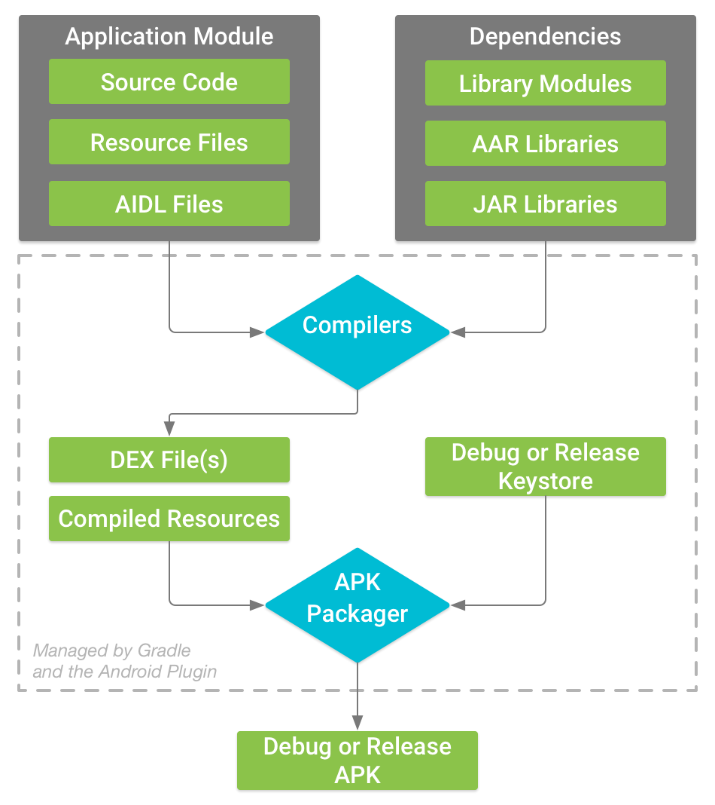

<a href="https://docs.gradle.org/current/userguide/userguide.html" target="_blank">Gradle</a>是Android官方的编译工具，它也是GitHub上的一个<a href="https://github.com/gradle/gradle" target="_blank">开源项目</a>。从Gradle的<a href="https://gradle.org/releases/" target="_blank">更新日志</a>可以看到，当前这个项目还更新得非常频繁，基本上每一两个月都会有新的版本。对于Gradle，我感觉最痛苦的还是Gradle Plugin的编写，主要是因为Gradle在这方面没有完善的文档，因此一般都只能靠看源码或者<a href="https://fucknmb.com/2017/07/05/%E5%8F%88%E6%8E%8C%E6%8F%A1%E4%BA%86%E4%B8%80%E9%A1%B9%E6%96%B0%E6%8A%80%E8%83%BD-%E6%96%AD%E7%82%B9%E8%B0%83%E8%AF%95Gradle%E6%8F%92%E4%BB%B6/" target="_blank">断点调试</a>的方法。

但是编译实在太重要了，每个公司的情况又各不相同，必须强行造一套自己的“轮子”。已经开源的项目有Facebook的<a href="https://github.com/facebook/buck" target="_blank">Buck</a>以及Google的<a href="https://github.com/bazelbuild/bazel" target="_blank">Bazel</a>。

为什么要自己“造轮子”呢？主要有下面几个原因：

<ul>
<li>
<strong>统一编译工具</strong>。Facebook、Google都有专门的团队负责编译工作，他们希望内部的所有项目都使用同一套构建工具，这里包括Android、Java、iOS、Go、C++等。编译工具的统一优化，所有项目都会受益。
</li>

<li>
<strong>代码组织管理架构</strong>。Facebook和Google的代码管理有一个非常特别的地方，就是整个公司的所有项目都放到同一个仓库里面。因此整个仓库非常庞大，所以他们也不会使用Git。目前Google使用的是<a href="http://www.ruanyifeng.com/blog/2016/07/google-monolithic-source-repository.html" target="_blank">Piper</a>，Facebook是基于<a href="https://www.mercurial-scm.org/" target="_blank">HG</a>修改的，也是一种基于分布式的文件系统。
</li>

<li>
<strong>极致的性能追求</strong>。Buck和Bazel的性能的确比Gradle更好，内部包含它们的各种编译优化。但是它们或多或少都有一些定制的味道，例如对Maven、JCenter这样的外部依赖支持的也不是太好。
</li>
</ul>

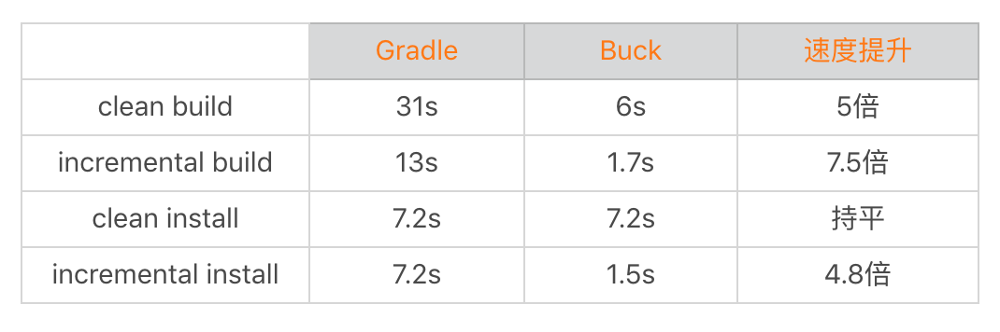

“程序员最痛恨写文档，还有别人不写文档”，所以它们的文档也是比较少的，如果想做二次定制开发会感到很痛苦。如果你想把编译工具切换到Buck和Bazel，需要下很大的决心，而且还需要考虑和其他上下游项目的协作。当然即使我们不去直接使用，它们内部的优化思路也非常值得我们学习和参考。

Gradle、Buck、Bazel都是以更快的编译速度、更强大的代码优化为目标，我们下面一起来看看它们做了哪些努力。

<strong>2. 编译速度</strong>

回想一下我们的Android开发生涯，在编译这件事情上面究竟浪费了多少时间和生命。正如前面我所说，编译速度对团队效率非常重要。

关于编译速度，我们最关心的可能还是编译Debug包的速度，尤其是<strong>增量编译</strong>（incremental build）的速度，希望可以做到更加快速的调试。正如下图所示，我们每次代码验证都要经过编译和安装两个步骤。

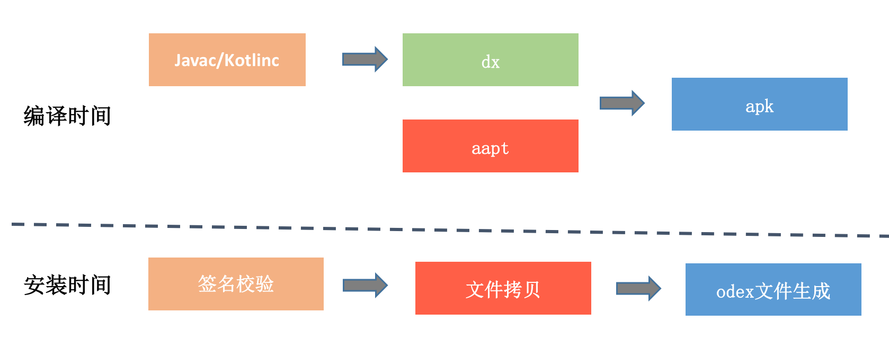

<ul>
<li>
<strong>编译时间</strong>。把Java或者Kotlin代码编译为“.class“文件，然后通过dx编译为Dex文件。对于增量编译，我们希望编译尽可能少的代码和资源，最理想情况是只编译变化的部分。但是由于代码之间的依赖，大部分情况这并不可行。这个时候我们只能退而求其次，希望编译更少的模块。<a href="https://developer.android.com/studio/build/dependencies" target="_blank">Android Plugin 3.0</a>使用Implementation代替Compile，正是为了优化依赖关系。
</li>

<li>
<strong>安装时间</strong>。我们要先经过签名校验，校验成功后会有一大堆的文件拷贝工作，例如APK文件、Library文件、Dex文件等。之后我们还需要编译Odex文件，这个过程特别是在Android 5.0和6.0会非常耗时。对于增量编译，最好的优化是直接应用新的代码，无需重新安装新的APK。
</li>
</ul>

对于增量编译，我先来讲讲Gradle的官方方案<a href="https://developer.android.com/studio/run/?hl=zh-cn" target="_blank">Instant Run</a>。在Android Plugin 2.3之前，它使用的Multidex实现。在Android Plugin 2.3之后，它使用Android 5.0新增的Split APK机制。

如下图所示，资源和Manifest都放在Base APK中， 在Base APK中代码只有Instant Run框架，应用的本身的代码都在Split APK中。

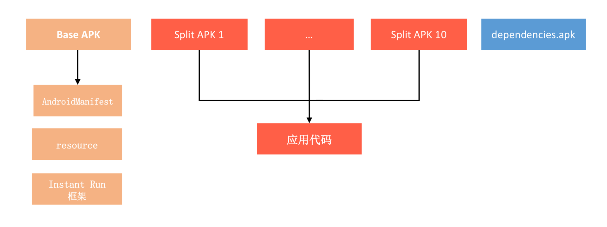

Instant Run有三种模式，如果是热交换和温交换，我们都无需重新安装新的Split APK，它们的区别在于是否重启Activity。对于冷交换，我们需要通过<code>adb install-multiple -r -t</code>重新安装改变的Split APK，应用也需要重启。

虽然无论哪一种模式，我们都不需要重新安装Base APK。这让Instant Run看起来是不是很不错，但是在大型项目里面，它的性能依然非常糟糕，主要原因是：

<ul>
<li>
<strong>多进程问题</strong>。“The app was restarted since it uses multiple processes”，如果应用存在多进程，热交换和温交换都不能生效。因为大部分应用都会存在多进程的情况，Instant Run的速度也就大打折扣。
</li>

<li>
<strong>Split APK安装问题</strong>。虽然Split APK的安装不会生成Odex文件，但是这里依然会有签名校验和文件拷贝（APK安装的乒乓机制）。这个时间需要几秒到几十秒，是不能接受的。
</li>

<li>
<strong>javac问题</strong>。在Gradle 4.6之前，如果项目中运用了Annotation Processor。那不好意思，本次修改以及它依赖的模块都需要全量javac，而这个过程是非常慢的，可能会需要几十秒。这个问题直到<a href="https://docs.gradle.org/current/userguide/java_plugin.html#sec:incremental_annotation_processing" target="_blank">Gradle 4.7</a>才解决，关于这个问题原因的讨论你可以参考这个<a href="https://github.com/gradle/gradle/issues/1320" target="_blank">Issue</a>。
</li>
</ul>

你还可以看看这一个Issue：“<a href="https://github.com/gradle/gradle/issues/2767" target="_blank">full rebuild if a class contains a constant</a>”，假设修改的类中包含一个“public static final”的变量，那同样也不好意思，本次修改以及它依赖的模块都需要全量javac。这是为什么呢？因为常量池是会直接把值编译到其他类中，Gradle并不知道有哪些类可能使用了这个常量。

询问Gradle的工作人员，他们出给的解决方案是下面这个：

<pre><code>// 原来的常量定义:
public static final int MAGIC = 23

// 将常量定义替换成方法: 
public static int magic() {
  return 23;
}
</code></pre>

对于大型项目来说，这肯定是不可行的。正如我在Issue中所写的一样，无论我们是不是真正改到这个常量，Gradle都会无脑的全量javac，这样肯定是不对的。事实上，我们可以通过比对这次代码修改，看看是否有真正改变某一个常量的值。

但是可能用过阿里的<a href="https://github.com/alibaba/freeline" target="_blank">Freeline</a>或者蘑菇街的<a href="https://tech.meili-inc.com/233-233?from=timeline&amp;isappinstalled=0" target="_blank">极速编译</a>的同学会有疑问，它们的方案为什么不会遇到Annotation和常量的问题？

事实上，它们的方案在大部分情况比Instant Run更快，那是因为牺牲了正确性。也就是说它们为了追求更快的速度，直接忽略了Annotation和常量改变可能带来错误的编译产物。Instant Run作为官方方案，它优先保证的是100%的正确性。

<strong>当然Google的人也发现了Instant Run的种种问题，在Android Studio 3.5之后，对于Android 8.0以后的设备将会使用新的方案“<a href="https://androidstudio.googleblog.com/2019/01/android-studio-35-canary-1-available.html" target="_blank">Apply Changes</a>”代替Instant Run。目前我还没找到关于这套方案更多的资料，不过我认为应该是抛弃了Split APK机制</strong>。

一直以来，我心目中都有一套理想的编译方案，这套方案安装的Base APK依然只是一个壳APK，真正的业务代码放到Assets的ClassesN.dex中。

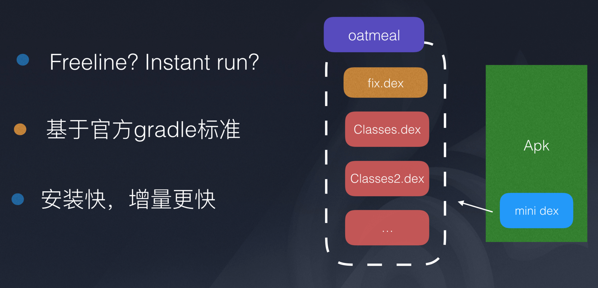

<ul>
<li>
<strong>无需安装</strong>。依然使用类似Tinker热修复的方法，每次只把修改以及依赖的类插入到pathclassloader的最前方就可以，不熟悉的同学可以参考<a href="https://mp.weixin.qq.com/s/-NmkSwZu83HAmzKPawdTqQ" target="_blank">《微信Android热补丁实践演进之路》</a>中的Qzone方案。
</li>

<li>
<strong>Oatmeal</strong>。为了解决首次运行时Assets中ClassesN.dex的Odex耗时问题，我们可以使用“安装包优化“中讲过的ReDex中的黑科技：Oatmeal。它可以在100毫秒以内生成一个完全解释执行的Odex文件。
</li>

<li>
<strong>关闭JIT</strong>。我们通过在AndroidManifest指定<a href="https://developer.android.com/guide/topics/manifest/application-element?hl=zh-cn#vmSafeMode" target="_blank">android:vmSafeMode=“true”</a>，关闭虚拟机的JIT优化，这样也就不会出现Tinker在<a href="https://mp.weixin.qq.com/s/h9BHnEkV0RMx0yIW1wpw9g" target="_blank">Android N混合编译遇到的问题</a>。
</li>
</ul>

这套方案应该可以完全解决Instant Run当前的各种问题，我也希望对编译优化感兴趣的同学可以自行实现这一套方案，并能开源出来。

对于编译速度的优化，我还有几个建议：

<ul>
<li>
<strong>更换编译机器</strong>。对于实力雄厚的公司，直接更换Mac或者其他更给力的设备作为编译机，这种方式是最简单的。
</li>

<li>
<strong>Build Cache</strong>。可以将大部分不常改变的项目拆离出去，并使用<a href="https://docs.gradle.com/enterprise/tutorials/caching/" target="_blank">远端Cache</a>模式保留编译后的缓存。
</li>

<li>
<strong>升级Gradle和SDK Build Tools</strong>。我们应该及时去升级最新的编译工具链，享受Google的最新优化成果。
</li>

<li>
<strong>使用Buck</strong>。无论是Buck的exopackage，还是代码的增量编译，Buck都更加高效。但我前面也说过，一个大型项目如果要切换到Buck，其实顾虑还是比较多的。在2014年初微信就接入了Buck，但是因为跟其他项目协作的问题，导致在2015年切换回Gradle方案。相比之下，<strong>可能目前最热的Flutter中<a href="https://juejin.im/post/5bc80ef7f265da0a857aa924" target="_blank">Hot Reload</a>秒级编译功能会更有吸引力</strong>。
</li>
</ul>

当然最近几个Android Studio版本，Google也做了大量的其他优化，例如使用<a href="https://developer.android.com/studio/command-line/aapt2" target="_blank">AAPT2</a>替代了AAPT来编译Android资源。AAPT2实现了资源的增量编译，它将资源的编译拆分成Compile和Link两个步骤。前者资源文件以二进制形式编译Flat格式，后者合并所有的文件再打包。

除了AAPT2，Google还引入了d8和R8，下面分别是Google提供的一些测试数据。

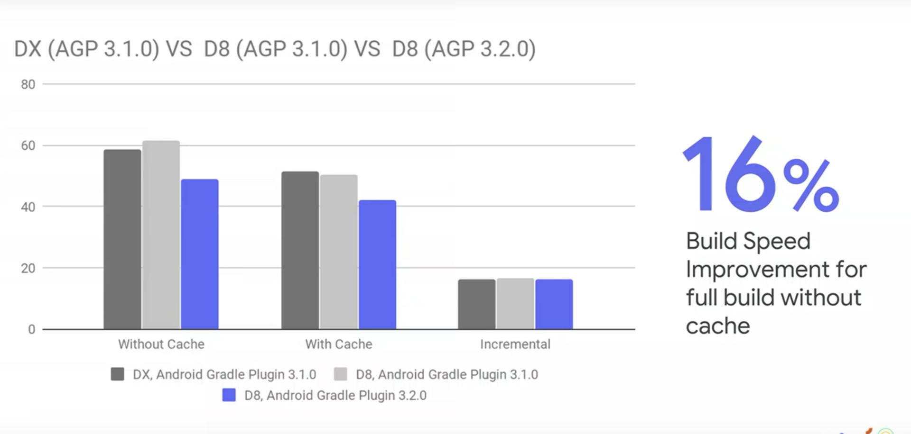-
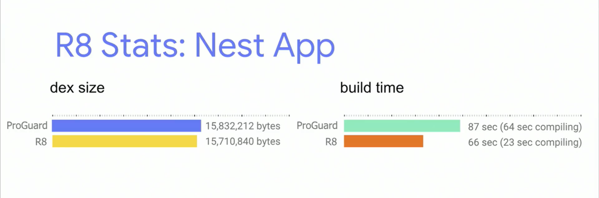

那什么是d8和R8呢？除了编译速度的优化，它们还有哪些其他的作用？

<strong>3. 代码优化</strong>

对于Debug包编译，我们更关心速度。但是对于Release包来说，代码的优化更加重要，因为我们会更加在意应用的性能。

下面我就分别讲讲ProGuard、d8、R8和ReDex这四种我们可能会用到的代码优化工具。

<strong>ProGuard</strong>

在微信Release包12分钟的编译过程里，单独ProGuard就需要花费8分钟。尽管ProGuard真的很慢，但是基本每个项目都会使用到它。加入了ProGuard之后，应用的构建过程流程如下：

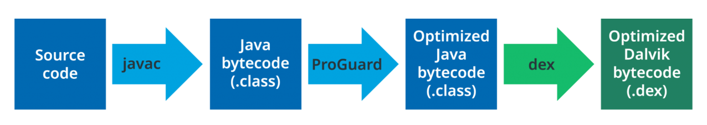

ProGuard主要有混淆、裁剪、优化这三大功能，它的整个处理流程是：

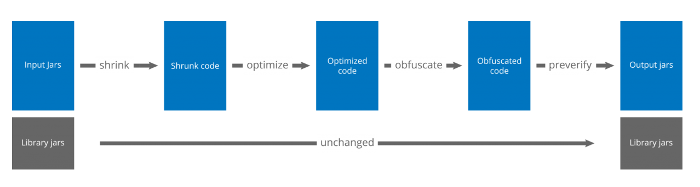

其中优化包括内联、修饰符、合并类和方法等30多种，具体介绍与使用方法你可以参考<a href="https://www.guardsquare.com/en/products/proguard/manual/usage/optimizations" target="_blank">官方文档</a>。

<strong>d8</strong>

Android Studio 3.0推出了<a href="https://developer.android.com/studio/command-line/d8" target="_blank">d8</a>，并在3.1正式成为默认工具。它的作用是将“.class”文件编译为Dex文件，取代之前的dx工具。

d8除了更快的编译速度之外，还有一个优化是减少生成的Dex大小。根据Google的测试结果，大约会有3%～5%的优化。

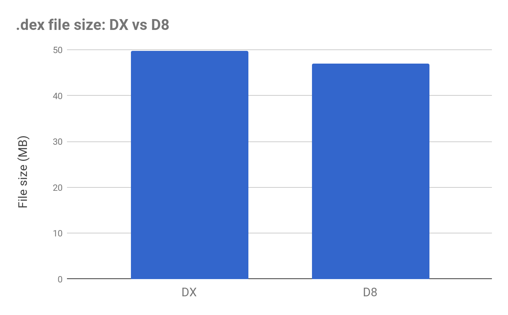

<strong>R8</strong>

R8在Android Studio 3.1中引入，它的志向更加高远，它的目标是取代ProGuard和d8。我们可以直接使用R8把“.class”文件变成Dex。

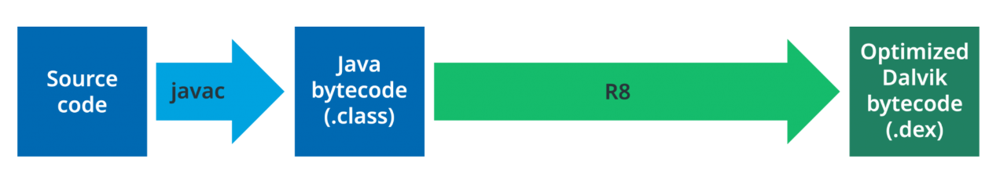

同时，R8还支持ProGuard中混淆、裁剪、优化这三大功能。由于目前R8依然处于实验阶段，网上的介绍资料并不多，你可以参考下面这些资料：

<ul>
<li>ProGuard和R8对比：<a href="https://www.guardsquare.com/en/blog/proguard-and-r8" target="_blank">ProGuard and R8: a comparison of optimizers</a>。</li>
<li>Jake Wharton大神的博客最近有很多R8相关的文章：<a href="https://jakewharton.com/blog/" target="_blank">https://jakewharton.com/blog/</a>。</li>
</ul>

R8的最终目的跟d8一样，一个是加快编译速度，一个是更强大的代码优化。

<strong>ReDex</strong>

如果说R8是未来想取代的ProGuard的工具，那Facebook的内部使用的<a href="https://github.com/facebook/redex" target="_blank">ReDex</a>其实已经做到了。

Facebook内部的很多项目都已经全部切换到ReDex，不再使用ProGuard了。跟ProGuard不同的是，它直接输入的对象是Dex，而不是“.class”文件，也就是它是直接针对最终产物的优化，所见即所得。

在前面的文章中，我已经不止一次提到ReDex这个项目，因为它里面的功能实在是太强大了，具体可以参考专栏前面的文章<a href="https://time.geekbang.org/column/article/81202" target="_blank">《包体积优化（上）：如何减少安装包大小？》</a>。

<ul>
<li>Interdex：类重排和文件重排、Dex分包优化。</li>
<li>Oatmeal：直接生成的Odex文件。</li>
<li>StripDebugInfo：去除Dex中的Debug信息。</li>
</ul>

此外，ReDex中例如<a href="https://github.com/facebook/redex/tree/master/opt/type-erasure" target="_blank">Type Erasure</a>和去除代码中的<a href="https://github.com/facebook/redex/tree/master/opt/access-marking" target="_blank">Aceess方法</a>也是非常不错的功能，它们无论对包体积还是应用的运行速度都有帮助，因此我也鼓励你去研究和实践一下它们的用法和效果。但是ReDex的文档也是万年不更新的，而且里面掺杂了一些Facebook内部定制的逻辑，所以它用起来的确非常不方便。目前我主要还是直接研究它的源码，参考它的原理，然后再直接单独实现。

事实上，Buck里面其实也还有很多好用的东西，但是文档里面依然什么都没有提到，所以还是需要“read the source code”。

<ul>
<li>Library Merge和Relinker</li>
<li>多语言拆分</li>
<li>分包支持</li>
<li>ReDex支持</li>
</ul>

<h2 id="持续交付">持续交付</h2>

Gradle、Buck、Bazel它们代表的都是狭义上的编译，我认为广义的编译应该包括打包构建、Code Review、代码工程管理、代码扫描等流程，也就是业界最近经常提起的持续集成。

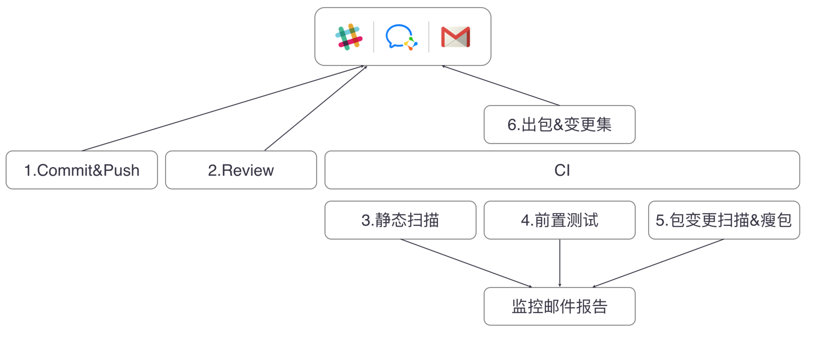

目前最常用的持续集成工具有Jenkins、GitLab CI、Travis CI等，GitHub也有提供自己的持续集成服务。每个大公司都有自己的持续集成方案，例如腾讯的RDM、阿里的摩天轮、大众点评的<a href="https://tech.meituan.com/2018/07/12/mci.html" target="_blank">MCI</a>等。

下面我来简单讲一下我对持续集成的一些经验和看法：

<ul>
<li>
<strong>自定义代码检查</strong>。每个公司都会有自己的编码规范，代码检查的目的在于防止不符合规范的代码提交到远程仓库中。比如微信就定义了一套代码规范，并且写了专门的插件来检测。例如日志规范、不能直接使用new Thread、new Handler等，而且违反者将会得到一定的惩罚。自定义代码检测可以通过完全自己实现或者扩展Findbugs插件，例如美团它们就利用Findbugs实现了<a href="https://tech.meituan.com/2017/08/17/android-code-arbiter.html" target="_blank">Android漏洞扫描工具Code Arbiter</a>。
</li>

<li>
<strong>第三方代码检查</strong>。业界比较常用的代码扫描工具有收费的Coverity，以及Facebook开源的<a href="https://github.com/facebook/infer" target="_blank">Infer</a>，例如空指针、多线程问题、资源泄漏等很多问题都可以扫描出来。除了增加检测流程，我最大的体会是需要同时增加人员的培训。我遇到很多开发者为了解决扫描出来的问题，空指针就直接判空、多线程就直接加锁，最后可能会造成更加严重的问题。
</li>

<li>
<strong>Code Review</strong>。关于Code Review，集成GitLab、Phabricator或者Gerrit都是不错的选择。我们一定要重视Code Review，这也是给其他人展示我们“伟大”代码的机会。而且我们自己应该是第一个Code Reviewer，在给别人Review之前，自己先以第三者的角度审视一次代码。这样先通过自己这一关的考验，既尊重了别人的时间，也可以为自己树立良好的技术品牌。
</li>
</ul>

持续集成涉及的流程有很多，你需要结合自己团队的现状。如果只是一味地去增加流程，有时候可能适得其反。

<h2 id="总结">总结</h2>

在Android 8.0，Google引入了<a href="https://source.android.com/devices/tech/dalvik/improvements" target="_blank">Dexlayout</a>库实现类和方法的重排，Facebook的Buck也第一时间引入了AAPT2。ReDex、d8、R8其实都是相辅相成，可以看到Google也在摄取社区的知识，但同时我们也会从Google的新技术发展里寻求思路。

我在写今天的内容时还有另外一个体会，Google为了解决Android编译速度的问题，花了大量的力气结果却不尽如人意。我想说如果我们敢于跳出系统的制约，可能才会彻底解决这个问题，正如在Flutter上面就可以完美实现秒级编译。其实做人、做事也是如此，我们经常会陷入局部最优解的困局，或者走进“思维怪圈”，这时如果能跳出路径依赖，从更高的维度重新思考、审视全局，得到的体会可能会完全不一样。

<h2 id="课后作业">课后作业</h2>

在你的工作中，遇到过哪些编译问题？有没有做过具体优化编译速度的工作？对于编译，你还有哪些疑问？欢迎留言跟我和其他同学一起讨论。

对于Android Build System，可以说每年都会有不少的变化，也有很多新的东西出来。所以我们应该保持敏感度，你会发现很多工具都非常有用，例如Desugar、Dexlayout、JVM TI、App Bundle等。

今天的课后作业是，请你观看2018年Google I/O编译工具相关的视频，在留言中写下自己的心得体会。

<ul>
<li>
<a href="http://v.youku.com/v_show/id_XMzYwMDQ3MDk2OA==.html?spm=a2h0k.11417342.soresults.dtitle" target="_blank">What’s new with the Android build system (Google I/O &lsquo;18)</a>
</li>

<li>
<a href="http://v.youku.com/v_show/id_XMzU5ODExNzQzMg==.html?spm=a2h0k.11417342.soresults.dtitle" target="_blank">What’s new in Android development tools</a>
</li>
</ul>

欢迎你点击“请朋友读”，把今天的内容分享给好友，邀请他一起学习。最后别忘了在评论区提交今天的作业，我也为认真完成作业的同学准备了丰厚的“学习加油礼包”，期待与你一起切磋进步哦。

                        

                        

                            

                            

                            

                            

                        

                    

                

            

            

                

                
© 2019 - 2023 <a href="/cdn-cgi/l/email-protection#8ce0e0e0b5b8bdbdbcbbccebe1ede5e0a2efe3e1" target="_blank">Liangliang Lee</a>.
                    Powered by <a href="https://github.com/gin-gonic/gin" target="_blank">gin</a> and <a
                        href="https://github.com/kaiiiz/hexo-theme-book" target="_blank">hexo-theme-book</a>.

            

        

        
    

</body>

</html>