<!DOCTYPE html>
<html xmlns="http://www.w3.org/1999/xhtml">

<head>

    <head>
        <meta http-equiv="Content-Type" content="text/html; charset=UTF-8">
        <meta name="viewport" content="width=device-width, initial-scale=1, maximum-scale=1.0, user-scalable=no">
        <meta http-equiv='content-language' content='zh-cn'>
        <meta name='description' content=27&#32;编译插桩的三种方法：AspectJ、ASM、ReDex>
        <link rel="icon" href="/static/favicon.png">
        <title>27 编译插桩的三种方法：AspectJ、ASM、ReDex </title>
        
        <link rel="stylesheet" href="/static/index.css">
        <link rel="stylesheet" href="/static/highlight.min.css">
        
        
        <meta name="generator" content="Hexo 4.2.0">
        
    </head>

<body>
    

        

            

                <a href="/">
                    
                    技术文章摘抄
                </a>
            

            

                <ul class="uncollapsible">
                    <li><a href="/" class="current-tab">首页</a></li>
                    <li><a href="../">上一级</a></li>
                </ul>
                <ul class="uncollapsible">
                    
                    <li>
                        <a class="menu-item" id="00 导读 如何打造高质量的应用？.md" href="/%e4%b8%93%e6%a0%8f/Android%e5%bc%80%e5%8f%91%e9%ab%98%e6%89%8b%e8%af%be/00%20%e5%af%bc%e8%af%bb%20%e5%a6%82%e4%bd%95%e6%89%93%e9%80%a0%e9%ab%98%e8%b4%a8%e9%87%8f%e7%9a%84%e5%ba%94%e7%94%a8%ef%bc%9f.md">00 导读 如何打造高质量的应用？.md</a>
                    </li>
                    
                    <li>
                        <a class="menu-item" id="00 开篇词 焦虑的移动开发者该如何破局？.md" href="/%e4%b8%93%e6%a0%8f/Android%e5%bc%80%e5%8f%91%e9%ab%98%e6%89%8b%e8%af%be/00%20%e5%bc%80%e7%af%87%e8%af%8d%20%e7%84%a6%e8%99%91%e7%9a%84%e7%a7%bb%e5%8a%a8%e5%bc%80%e5%8f%91%e8%80%85%e8%af%a5%e5%a6%82%e4%bd%95%e7%a0%b4%e5%b1%80%ef%bc%9f.md">00 开篇词 焦虑的移动开发者该如何破局？.md</a>
                    </li>
                    
                    <li>
                        <a class="menu-item" id="01 崩溃优化（上）：关于“崩溃”那些事儿.md" href="/%e4%b8%93%e6%a0%8f/Android%e5%bc%80%e5%8f%91%e9%ab%98%e6%89%8b%e8%af%be/01%20%e5%b4%a9%e6%ba%83%e4%bc%98%e5%8c%96%ef%bc%88%e4%b8%8a%ef%bc%89%ef%bc%9a%e5%85%b3%e4%ba%8e%e2%80%9c%e5%b4%a9%e6%ba%83%e2%80%9d%e9%82%a3%e4%ba%9b%e4%ba%8b%e5%84%bf.md">01 崩溃优化（上）：关于“崩溃”那些事儿.md</a>
                    </li>
                    
                    <li>
                        <a class="menu-item" id="02 崩溃优化（下）：应用崩溃了，你应该如何去分析？.md" href="/%e4%b8%93%e6%a0%8f/Android%e5%bc%80%e5%8f%91%e9%ab%98%e6%89%8b%e8%af%be/02%20%e5%b4%a9%e6%ba%83%e4%bc%98%e5%8c%96%ef%bc%88%e4%b8%8b%ef%bc%89%ef%bc%9a%e5%ba%94%e7%94%a8%e5%b4%a9%e6%ba%83%e4%ba%86%ef%bc%8c%e4%bd%a0%e5%ba%94%e8%af%a5%e5%a6%82%e4%bd%95%e5%8e%bb%e5%88%86%e6%9e%90%ef%bc%9f.md">02 崩溃优化（下）：应用崩溃了，你应该如何去分析？.md</a>
                    </li>
                    
                    <li>
                        <a class="menu-item" id="03 内存优化（上）：4GB内存时代，再谈内存优化.md" href="/%e4%b8%93%e6%a0%8f/Android%e5%bc%80%e5%8f%91%e9%ab%98%e6%89%8b%e8%af%be/03%20%e5%86%85%e5%ad%98%e4%bc%98%e5%8c%96%ef%bc%88%e4%b8%8a%ef%bc%89%ef%bc%9a4GB%e5%86%85%e5%ad%98%e6%97%b6%e4%bb%a3%ef%bc%8c%e5%86%8d%e8%b0%88%e5%86%85%e5%ad%98%e4%bc%98%e5%8c%96.md">03 内存优化（上）：4GB内存时代，再谈内存优化.md</a>
                    </li>
                    
                    <li>
                        <a class="menu-item" id="04 内存优化（下）：内存优化这件事，应该从哪里着手？.md" href="/%e4%b8%93%e6%a0%8f/Android%e5%bc%80%e5%8f%91%e9%ab%98%e6%89%8b%e8%af%be/04%20%e5%86%85%e5%ad%98%e4%bc%98%e5%8c%96%ef%bc%88%e4%b8%8b%ef%bc%89%ef%bc%9a%e5%86%85%e5%ad%98%e4%bc%98%e5%8c%96%e8%bf%99%e4%bb%b6%e4%ba%8b%ef%bc%8c%e5%ba%94%e8%af%a5%e4%bb%8e%e5%93%aa%e9%87%8c%e7%9d%80%e6%89%8b%ef%bc%9f.md">04 内存优化（下）：内存优化这件事，应该从哪里着手？.md</a>
                    </li>
                    
                    <li>
                        <a class="menu-item" id="05 卡顿优化（上）：你要掌握的卡顿分析方法.md" href="/%e4%b8%93%e6%a0%8f/Android%e5%bc%80%e5%8f%91%e9%ab%98%e6%89%8b%e8%af%be/05%20%e5%8d%a1%e9%a1%bf%e4%bc%98%e5%8c%96%ef%bc%88%e4%b8%8a%ef%bc%89%ef%bc%9a%e4%bd%a0%e8%a6%81%e6%8e%8c%e6%8f%a1%e7%9a%84%e5%8d%a1%e9%a1%bf%e5%88%86%e6%9e%90%e6%96%b9%e6%b3%95.md">05 卡顿优化（上）：你要掌握的卡顿分析方法.md</a>
                    </li>
                    
                    <li>
                        <a class="menu-item" id="06 卡顿优化（下）：如何监控应用卡顿？.md" href="/%e4%b8%93%e6%a0%8f/Android%e5%bc%80%e5%8f%91%e9%ab%98%e6%89%8b%e8%af%be/06%20%e5%8d%a1%e9%a1%bf%e4%bc%98%e5%8c%96%ef%bc%88%e4%b8%8b%ef%bc%89%ef%bc%9a%e5%a6%82%e4%bd%95%e7%9b%91%e6%8e%a7%e5%ba%94%e7%94%a8%e5%8d%a1%e9%a1%bf%ef%bc%9f.md">06 卡顿优化（下）：如何监控应用卡顿？.md</a>
                    </li>
                    
                    <li>
                        <a class="menu-item" id="06补充篇 卡顿优化：卡顿现场与卡顿分析.md" href="/%e4%b8%93%e6%a0%8f/Android%e5%bc%80%e5%8f%91%e9%ab%98%e6%89%8b%e8%af%be/06%e8%a1%a5%e5%85%85%e7%af%87%20%e5%8d%a1%e9%a1%bf%e4%bc%98%e5%8c%96%ef%bc%9a%e5%8d%a1%e9%a1%bf%e7%8e%b0%e5%9c%ba%e4%b8%8e%e5%8d%a1%e9%a1%bf%e5%88%86%e6%9e%90.md">06补充篇 卡顿优化：卡顿现场与卡顿分析.md</a>
                    </li>
                    
                    <li>
                        <a class="menu-item" id="07 启动优化（上）：从启动过程看启动速度优化.md" href="/%e4%b8%93%e6%a0%8f/Android%e5%bc%80%e5%8f%91%e9%ab%98%e6%89%8b%e8%af%be/07%20%e5%90%af%e5%8a%a8%e4%bc%98%e5%8c%96%ef%bc%88%e4%b8%8a%ef%bc%89%ef%bc%9a%e4%bb%8e%e5%90%af%e5%8a%a8%e8%bf%87%e7%a8%8b%e7%9c%8b%e5%90%af%e5%8a%a8%e9%80%9f%e5%ba%a6%e4%bc%98%e5%8c%96.md">07 启动优化（上）：从启动过程看启动速度优化.md</a>
                    </li>
                    
                    <li>
                        <a class="menu-item" id="08 启动优化（下）：优化启动速度的进阶方法.md" href="/%e4%b8%93%e6%a0%8f/Android%e5%bc%80%e5%8f%91%e9%ab%98%e6%89%8b%e8%af%be/08%20%e5%90%af%e5%8a%a8%e4%bc%98%e5%8c%96%ef%bc%88%e4%b8%8b%ef%bc%89%ef%bc%9a%e4%bc%98%e5%8c%96%e5%90%af%e5%8a%a8%e9%80%9f%e5%ba%a6%e7%9a%84%e8%bf%9b%e9%98%b6%e6%96%b9%e6%b3%95.md">08 启动优化（下）：优化启动速度的进阶方法.md</a>
                    </li>
                    
                    <li>
                        <a class="menu-item" id="09 I_O优化（上）：开发工程师必备的I_O优化知识.md" href="/%e4%b8%93%e6%a0%8f/Android%e5%bc%80%e5%8f%91%e9%ab%98%e6%89%8b%e8%af%be/09%20I_O%e4%bc%98%e5%8c%96%ef%bc%88%e4%b8%8a%ef%bc%89%ef%bc%9a%e5%bc%80%e5%8f%91%e5%b7%a5%e7%a8%8b%e5%b8%88%e5%bf%85%e5%a4%87%e7%9a%84I_O%e4%bc%98%e5%8c%96%e7%9f%a5%e8%af%86.md">09 I_O优化（上）：开发工程师必备的I_O优化知识.md</a>
                    </li>
                    
                    <li>
                        <a class="menu-item" id="10 I_O优化（中）：不同I_O方式的使用场景是什么？.md" href="/%e4%b8%93%e6%a0%8f/Android%e5%bc%80%e5%8f%91%e9%ab%98%e6%89%8b%e8%af%be/10%20I_O%e4%bc%98%e5%8c%96%ef%bc%88%e4%b8%ad%ef%bc%89%ef%bc%9a%e4%b8%8d%e5%90%8cI_O%e6%96%b9%e5%bc%8f%e7%9a%84%e4%bd%bf%e7%94%a8%e5%9c%ba%e6%99%af%e6%98%af%e4%bb%80%e4%b9%88%ef%bc%9f.md">10 I_O优化（中）：不同I_O方式的使用场景是什么？.md</a>
                    </li>
                    
                    <li>
                        <a class="menu-item" id="11 I_O优化（下）：如何监控线上I_O操作？.md" href="/%e4%b8%93%e6%a0%8f/Android%e5%bc%80%e5%8f%91%e9%ab%98%e6%89%8b%e8%af%be/11%20I_O%e4%bc%98%e5%8c%96%ef%bc%88%e4%b8%8b%ef%bc%89%ef%bc%9a%e5%a6%82%e4%bd%95%e7%9b%91%e6%8e%a7%e7%ba%bf%e4%b8%8aI_O%e6%93%8d%e4%bd%9c%ef%bc%9f.md">11 I_O优化（下）：如何监控线上I_O操作？.md</a>
                    </li>
                    
                    <li>
                        <a class="menu-item" id="12 存储优化（上）：常见的数据存储方法有哪些？.md" href="/%e4%b8%93%e6%a0%8f/Android%e5%bc%80%e5%8f%91%e9%ab%98%e6%89%8b%e8%af%be/12%20%e5%ad%98%e5%82%a8%e4%bc%98%e5%8c%96%ef%bc%88%e4%b8%8a%ef%bc%89%ef%bc%9a%e5%b8%b8%e8%a7%81%e7%9a%84%e6%95%b0%e6%8d%ae%e5%ad%98%e5%82%a8%e6%96%b9%e6%b3%95%e6%9c%89%e5%93%aa%e4%ba%9b%ef%bc%9f.md">12 存储优化（上）：常见的数据存储方法有哪些？.md</a>
                    </li>
                    
                    <li>
                        <a class="menu-item" id="13 存储优化（中）：如何优化数据存储？.md" href="/%e4%b8%93%e6%a0%8f/Android%e5%bc%80%e5%8f%91%e9%ab%98%e6%89%8b%e8%af%be/13%20%e5%ad%98%e5%82%a8%e4%bc%98%e5%8c%96%ef%bc%88%e4%b8%ad%ef%bc%89%ef%bc%9a%e5%a6%82%e4%bd%95%e4%bc%98%e5%8c%96%e6%95%b0%e6%8d%ae%e5%ad%98%e5%82%a8%ef%bc%9f.md">13 存储优化（中）：如何优化数据存储？.md</a>
                    </li>
                    
                    <li>
                        <a class="menu-item" id="14 存储优化（下）：数据库SQLite的使用和优化.md" href="/%e4%b8%93%e6%a0%8f/Android%e5%bc%80%e5%8f%91%e9%ab%98%e6%89%8b%e8%af%be/14%20%e5%ad%98%e5%82%a8%e4%bc%98%e5%8c%96%ef%bc%88%e4%b8%8b%ef%bc%89%ef%bc%9a%e6%95%b0%e6%8d%ae%e5%ba%93SQLite%e7%9a%84%e4%bd%bf%e7%94%a8%e5%92%8c%e4%bc%98%e5%8c%96.md">14 存储优化（下）：数据库SQLite的使用和优化.md</a>
                    </li>
                    
                    <li>
                        <a class="menu-item" id="15 网络优化（上）：移动开发工程师必备的网络优化知识.md" href="/%e4%b8%93%e6%a0%8f/Android%e5%bc%80%e5%8f%91%e9%ab%98%e6%89%8b%e8%af%be/15%20%e7%bd%91%e7%bb%9c%e4%bc%98%e5%8c%96%ef%bc%88%e4%b8%8a%ef%bc%89%ef%bc%9a%e7%a7%bb%e5%8a%a8%e5%bc%80%e5%8f%91%e5%b7%a5%e7%a8%8b%e5%b8%88%e5%bf%85%e5%a4%87%e7%9a%84%e7%bd%91%e7%bb%9c%e4%bc%98%e5%8c%96%e7%9f%a5%e8%af%86.md">15 网络优化（上）：移动开发工程师必备的网络优化知识.md</a>
                    </li>
                    
                    <li>
                        <a class="menu-item" id="16 网络优化（中）：复杂多变的移动网络该如何优化？.md" href="/%e4%b8%93%e6%a0%8f/Android%e5%bc%80%e5%8f%91%e9%ab%98%e6%89%8b%e8%af%be/16%20%e7%bd%91%e7%bb%9c%e4%bc%98%e5%8c%96%ef%bc%88%e4%b8%ad%ef%bc%89%ef%bc%9a%e5%a4%8d%e6%9d%82%e5%a4%9a%e5%8f%98%e7%9a%84%e7%a7%bb%e5%8a%a8%e7%bd%91%e7%bb%9c%e8%af%a5%e5%a6%82%e4%bd%95%e4%bc%98%e5%8c%96%ef%bc%9f.md">16 网络优化（中）：复杂多变的移动网络该如何优化？.md</a>
                    </li>
                    
                    <li>
                        <a class="menu-item" id="17 网络优化（下）：大数据下网络该如何监控？.md" href="/%e4%b8%93%e6%a0%8f/Android%e5%bc%80%e5%8f%91%e9%ab%98%e6%89%8b%e8%af%be/17%20%e7%bd%91%e7%bb%9c%e4%bc%98%e5%8c%96%ef%bc%88%e4%b8%8b%ef%bc%89%ef%bc%9a%e5%a4%a7%e6%95%b0%e6%8d%ae%e4%b8%8b%e7%bd%91%e7%bb%9c%e8%af%a5%e5%a6%82%e4%bd%95%e7%9b%91%e6%8e%a7%ef%bc%9f.md">17 网络优化（下）：大数据下网络该如何监控？.md</a>
                    </li>
                    
                    <li>
                        <a class="menu-item" id="18 耗电优化（上）：从电量优化的演进看耗电分析.md" href="/%e4%b8%93%e6%a0%8f/Android%e5%bc%80%e5%8f%91%e9%ab%98%e6%89%8b%e8%af%be/18%20%e8%80%97%e7%94%b5%e4%bc%98%e5%8c%96%ef%bc%88%e4%b8%8a%ef%bc%89%ef%bc%9a%e4%bb%8e%e7%94%b5%e9%87%8f%e4%bc%98%e5%8c%96%e7%9a%84%e6%bc%94%e8%bf%9b%e7%9c%8b%e8%80%97%e7%94%b5%e5%88%86%e6%9e%90.md">18 耗电优化（上）：从电量优化的演进看耗电分析.md</a>
                    </li>
                    
                    <li>
                        <a class="menu-item" id="19 耗电优化（下）：耗电的优化方法与线上监控.md" href="/%e4%b8%93%e6%a0%8f/Android%e5%bc%80%e5%8f%91%e9%ab%98%e6%89%8b%e8%af%be/19%20%e8%80%97%e7%94%b5%e4%bc%98%e5%8c%96%ef%bc%88%e4%b8%8b%ef%bc%89%ef%bc%9a%e8%80%97%e7%94%b5%e7%9a%84%e4%bc%98%e5%8c%96%e6%96%b9%e6%b3%95%e4%b8%8e%e7%ba%bf%e4%b8%8a%e7%9b%91%e6%8e%a7.md">19 耗电优化（下）：耗电的优化方法与线上监控.md</a>
                    </li>
                    
                    <li>
                        <a class="menu-item" id="20 UI 优化（上）：UI 渲染的几个关键概念.md" href="/%e4%b8%93%e6%a0%8f/Android%e5%bc%80%e5%8f%91%e9%ab%98%e6%89%8b%e8%af%be/20%20UI%20%e4%bc%98%e5%8c%96%ef%bc%88%e4%b8%8a%ef%bc%89%ef%bc%9aUI%20%e6%b8%b2%e6%9f%93%e7%9a%84%e5%87%a0%e4%b8%aa%e5%85%b3%e9%94%ae%e6%a6%82%e5%bf%b5.md">20 UI 优化（上）：UI 渲染的几个关键概念.md</a>
                    </li>
                    
                    <li>
                        <a class="menu-item" id="21 UI 优化（下）：如何优化 UI 渲染？.md" href="/%e4%b8%93%e6%a0%8f/Android%e5%bc%80%e5%8f%91%e9%ab%98%e6%89%8b%e8%af%be/21%20UI%20%e4%bc%98%e5%8c%96%ef%bc%88%e4%b8%8b%ef%bc%89%ef%bc%9a%e5%a6%82%e4%bd%95%e4%bc%98%e5%8c%96%20UI%20%e6%b8%b2%e6%9f%93%ef%bc%9f.md">21 UI 优化（下）：如何优化 UI 渲染？.md</a>
                    </li>
                    
                    <li>
                        <a class="menu-item" id="22 包体积优化（上）：如何减少安装包大小？.md" href="/%e4%b8%93%e6%a0%8f/Android%e5%bc%80%e5%8f%91%e9%ab%98%e6%89%8b%e8%af%be/22%20%e5%8c%85%e4%bd%93%e7%a7%af%e4%bc%98%e5%8c%96%ef%bc%88%e4%b8%8a%ef%bc%89%ef%bc%9a%e5%a6%82%e4%bd%95%e5%87%8f%e5%b0%91%e5%ae%89%e8%a3%85%e5%8c%85%e5%a4%a7%e5%b0%8f%ef%bc%9f.md">22 包体积优化（上）：如何减少安装包大小？.md</a>
                    </li>
                    
                    <li>
                        <a class="menu-item" id="23 包体积优化（下）：资源优化的进阶实践.md" href="/%e4%b8%93%e6%a0%8f/Android%e5%bc%80%e5%8f%91%e9%ab%98%e6%89%8b%e8%af%be/23%20%e5%8c%85%e4%bd%93%e7%a7%af%e4%bc%98%e5%8c%96%ef%bc%88%e4%b8%8b%ef%bc%89%ef%bc%9a%e8%b5%84%e6%ba%90%e4%bc%98%e5%8c%96%e7%9a%84%e8%bf%9b%e9%98%b6%e5%ae%9e%e8%b7%b5.md">23 包体积优化（下）：资源优化的进阶实践.md</a>
                    </li>
                    
                    <li>
                        <a class="menu-item" id="24 想成为Android高手，你需要先搞定这三个问题.md" href="/%e4%b8%93%e6%a0%8f/Android%e5%bc%80%e5%8f%91%e9%ab%98%e6%89%8b%e8%af%be/24%20%e6%83%b3%e6%88%90%e4%b8%baAndroid%e9%ab%98%e6%89%8b%ef%bc%8c%e4%bd%a0%e9%9c%80%e8%a6%81%e5%85%88%e6%90%9e%e5%ae%9a%e8%bf%99%e4%b8%89%e4%b8%aa%e9%97%ae%e9%a2%98.md">24 想成为Android高手，你需要先搞定这三个问题.md</a>
                    </li>
                    
                    <li>
                        <a class="menu-item" id="25 如何提升组织与个人的研发效能？.md" href="/%e4%b8%93%e6%a0%8f/Android%e5%bc%80%e5%8f%91%e9%ab%98%e6%89%8b%e8%af%be/25%20%e5%a6%82%e4%bd%95%e6%8f%90%e5%8d%87%e7%bb%84%e7%bb%87%e4%b8%8e%e4%b8%aa%e4%ba%ba%e7%9a%84%e7%a0%94%e5%8f%91%e6%95%88%e8%83%bd%ef%bc%9f.md">25 如何提升组织与个人的研发效能？.md</a>
                    </li>
                    
                    <li>
                        <a class="menu-item" id="26 关于编译，你需要了解什么？.md" href="/%e4%b8%93%e6%a0%8f/Android%e5%bc%80%e5%8f%91%e9%ab%98%e6%89%8b%e8%af%be/26%20%e5%85%b3%e4%ba%8e%e7%bc%96%e8%af%91%ef%bc%8c%e4%bd%a0%e9%9c%80%e8%a6%81%e4%ba%86%e8%a7%a3%e4%bb%80%e4%b9%88%ef%bc%9f.md">26 关于编译，你需要了解什么？.md</a>
                    </li>
                    
                    <li>
                        <a class="menu-item" id="27 编译插桩的三种方法：AspectJ、ASM、ReDex.md" href="/%e4%b8%93%e6%a0%8f/Android%e5%bc%80%e5%8f%91%e9%ab%98%e6%89%8b%e8%af%be/27%20%e7%bc%96%e8%af%91%e6%8f%92%e6%a1%a9%e7%9a%84%e4%b8%89%e7%a7%8d%e6%96%b9%e6%b3%95%ef%bc%9aAspectJ%e3%80%81ASM%e3%80%81ReDex.md">27 编译插桩的三种方法：AspectJ、ASM、ReDex.md</a>
                    </li>
                    
                    <li>
                        <a class="menu-item" id="28 大数据与AI，如何高效地测试？.md" href="/%e4%b8%93%e6%a0%8f/Android%e5%bc%80%e5%8f%91%e9%ab%98%e6%89%8b%e8%af%be/28%20%e5%a4%a7%e6%95%b0%e6%8d%ae%e4%b8%8eAI%ef%bc%8c%e5%a6%82%e4%bd%95%e9%ab%98%e6%95%88%e5%9c%b0%e6%b5%8b%e8%af%95%ef%bc%9f.md">28 大数据与AI，如何高效地测试？.md</a>
                    </li>
                    
                    <li>
                        <a class="menu-item" id="29 从每月到每天，如何给版本发布提速？.md" href="/%e4%b8%93%e6%a0%8f/Android%e5%bc%80%e5%8f%91%e9%ab%98%e6%89%8b%e8%af%be/29%20%e4%bb%8e%e6%af%8f%e6%9c%88%e5%88%b0%e6%af%8f%e5%a4%a9%ef%bc%8c%e5%a6%82%e4%bd%95%e7%bb%99%e7%89%88%e6%9c%ac%e5%8f%91%e5%b8%83%e6%8f%90%e9%80%9f%ef%bc%9f.md">29 从每月到每天，如何给版本发布提速？.md</a>
                    </li>
                    
                    <li>
                        <a class="menu-item" id="30 数据评估（上）：如何实现高可用的上报组件？.md" href="/%e4%b8%93%e6%a0%8f/Android%e5%bc%80%e5%8f%91%e9%ab%98%e6%89%8b%e8%af%be/30%20%e6%95%b0%e6%8d%ae%e8%af%84%e4%bc%b0%ef%bc%88%e4%b8%8a%ef%bc%89%ef%bc%9a%e5%a6%82%e4%bd%95%e5%ae%9e%e7%8e%b0%e9%ab%98%e5%8f%af%e7%94%a8%e7%9a%84%e4%b8%8a%e6%8a%a5%e7%bb%84%e4%bb%b6%ef%bc%9f.md">30 数据评估（上）：如何实现高可用的上报组件？.md</a>
                    </li>
                    
                    <li>
                        <a class="menu-item" id="31 数据评估（下）：什么是大数据平台？.md" href="/%e4%b8%93%e6%a0%8f/Android%e5%bc%80%e5%8f%91%e9%ab%98%e6%89%8b%e8%af%be/31%20%e6%95%b0%e6%8d%ae%e8%af%84%e4%bc%b0%ef%bc%88%e4%b8%8b%ef%bc%89%ef%bc%9a%e4%bb%80%e4%b9%88%e6%98%af%e5%a4%a7%e6%95%b0%e6%8d%ae%e5%b9%b3%e5%8f%b0%ef%bc%9f.md">31 数据评估（下）：什么是大数据平台？.md</a>
                    </li>
                    
                    <li>
                        <a class="menu-item" id="32 线上疑难问题该如何排查和跟踪？.md" href="/%e4%b8%93%e6%a0%8f/Android%e5%bc%80%e5%8f%91%e9%ab%98%e6%89%8b%e8%af%be/32%20%e7%ba%bf%e4%b8%8a%e7%96%91%e9%9a%be%e9%97%ae%e9%a2%98%e8%af%a5%e5%a6%82%e4%bd%95%e6%8e%92%e6%9f%a5%e5%92%8c%e8%b7%9f%e8%b8%aa%ef%bc%9f.md">32 线上疑难问题该如何排查和跟踪？.md</a>
                    </li>
                    
                    <li>
                        <a class="menu-item" id="33 做一名有高度的移动开发工程师.md" href="/%e4%b8%93%e6%a0%8f/Android%e5%bc%80%e5%8f%91%e9%ab%98%e6%89%8b%e8%af%be/33%20%e5%81%9a%e4%b8%80%e5%90%8d%e6%9c%89%e9%ab%98%e5%ba%a6%e7%9a%84%e7%a7%bb%e5%8a%a8%e5%bc%80%e5%8f%91%e5%b7%a5%e7%a8%8b%e5%b8%88.md">33 做一名有高度的移动开发工程师.md</a>
                    </li>
                    
                    <li>
                        <a class="menu-item" id="34 聊聊重构：优秀的架构都是演进而来的.md" href="/%e4%b8%93%e6%a0%8f/Android%e5%bc%80%e5%8f%91%e9%ab%98%e6%89%8b%e8%af%be/34%20%e8%81%8a%e8%81%8a%e9%87%8d%e6%9e%84%ef%bc%9a%e4%bc%98%e7%a7%80%e7%9a%84%e6%9e%b6%e6%9e%84%e9%83%bd%e6%98%af%e6%bc%94%e8%bf%9b%e8%80%8c%e6%9d%a5%e7%9a%84.md">34 聊聊重构：优秀的架构都是演进而来的.md</a>
                    </li>
                    
                    <li>
                        <a class="menu-item" id="35 Native Hook 技术，天使还是魔鬼？.md" href="/%e4%b8%93%e6%a0%8f/Android%e5%bc%80%e5%8f%91%e9%ab%98%e6%89%8b%e8%af%be/35%20Native%20Hook%20%e6%8a%80%e6%9c%af%ef%bc%8c%e5%a4%a9%e4%bd%bf%e8%bf%98%e6%98%af%e9%ad%94%e9%ac%bc%ef%bc%9f.md">35 Native Hook 技术，天使还是魔鬼？.md</a>
                    </li>
                    
                    <li>
                        <a class="menu-item" id="36 跨平台开发的现状与应用.md" href="/%e4%b8%93%e6%a0%8f/Android%e5%bc%80%e5%8f%91%e9%ab%98%e6%89%8b%e8%af%be/36%20%e8%b7%a8%e5%b9%b3%e5%8f%b0%e5%bc%80%e5%8f%91%e7%9a%84%e7%8e%b0%e7%8a%b6%e4%b8%8e%e5%ba%94%e7%94%a8.md">36 跨平台开发的现状与应用.md</a>
                    </li>
                    
                    <li>
                        <a class="menu-item" id="37 移动开发新大陆：工作三年半，移动开发转型手游开发.md" href="/%e4%b8%93%e6%a0%8f/Android%e5%bc%80%e5%8f%91%e9%ab%98%e6%89%8b%e8%af%be/37%20%e7%a7%bb%e5%8a%a8%e5%bc%80%e5%8f%91%e6%96%b0%e5%a4%a7%e9%99%86%ef%bc%9a%e5%b7%a5%e4%bd%9c%e4%b8%89%e5%b9%b4%e5%8d%8a%ef%bc%8c%e7%a7%bb%e5%8a%a8%e5%bc%80%e5%8f%91%e8%bd%ac%e5%9e%8b%e6%89%8b%e6%b8%b8%e5%bc%80%e5%8f%91.md">37 移动开发新大陆：工作三年半，移动开发转型手游开发.md</a>
                    </li>
                    
                    <li>
                        <a class="menu-item" id="38 移动开发新大陆：Android音视频开发.md" href="/%e4%b8%93%e6%a0%8f/Android%e5%bc%80%e5%8f%91%e9%ab%98%e6%89%8b%e8%af%be/38%20%e7%a7%bb%e5%8a%a8%e5%bc%80%e5%8f%91%e6%96%b0%e5%a4%a7%e9%99%86%ef%bc%9aAndroid%e9%9f%b3%e8%a7%86%e9%a2%91%e5%bc%80%e5%8f%91.md">38 移动开发新大陆：Android音视频开发.md</a>
                    </li>
                    
                    <li>
                        <a class="menu-item" id="39 移动开发新大陆： 边缘智能计算的趋势.md" href="/%e4%b8%93%e6%a0%8f/Android%e5%bc%80%e5%8f%91%e9%ab%98%e6%89%8b%e8%af%be/39%20%e7%a7%bb%e5%8a%a8%e5%bc%80%e5%8f%91%e6%96%b0%e5%a4%a7%e9%99%86%ef%bc%9a%20%e8%be%b9%e7%bc%98%e6%99%ba%e8%83%bd%e8%ae%a1%e7%ae%97%e7%9a%84%e8%b6%8b%e5%8a%bf.md">39 移动开发新大陆： 边缘智能计算的趋势.md</a>
                    </li>
                    
                    <li>
                        <a class="menu-item" id="40 动态化实践，如何选择适合自己的方案？.md" href="/%e4%b8%93%e6%a0%8f/Android%e5%bc%80%e5%8f%91%e9%ab%98%e6%89%8b%e8%af%be/40%20%e5%8a%a8%e6%80%81%e5%8c%96%e5%ae%9e%e8%b7%b5%ef%bc%8c%e5%a6%82%e4%bd%95%e9%80%89%e6%8b%a9%e9%80%82%e5%90%88%e8%87%aa%e5%b7%b1%e7%9a%84%e6%96%b9%e6%a1%88%ef%bc%9f.md">40 动态化实践，如何选择适合自己的方案？.md</a>
                    </li>
                    
                    <li>
                        <a class="menu-item" id="41 聊聊Flutter，面对层出不穷的新技术该如何跟进？.md" href="/%e4%b8%93%e6%a0%8f/Android%e5%bc%80%e5%8f%91%e9%ab%98%e6%89%8b%e8%af%be/41%20%e8%81%8a%e8%81%8aFlutter%ef%bc%8c%e9%9d%a2%e5%af%b9%e5%b1%82%e5%87%ba%e4%b8%8d%e7%a9%b7%e7%9a%84%e6%96%b0%e6%8a%80%e6%9c%af%e8%af%a5%e5%a6%82%e4%bd%95%e8%b7%9f%e8%bf%9b%ef%bc%9f.md">41 聊聊Flutter，面对层出不穷的新技术该如何跟进？.md</a>
                    </li>
                    
                    <li>
                        <a class="menu-item" id="42 Android开发高手课学习心得.md" href="/%e4%b8%93%e6%a0%8f/Android%e5%bc%80%e5%8f%91%e9%ab%98%e6%89%8b%e8%af%be/42%20Android%e5%bc%80%e5%8f%91%e9%ab%98%e6%89%8b%e8%af%be%e5%ad%a6%e4%b9%a0%e5%bf%83%e5%be%97.md">42 Android开发高手课学习心得.md</a>
                    </li>
                    
                    <li>
                        <a class="menu-item" id="Android JVM TI机制详解（内含福利彩蛋）.md" href="/%e4%b8%93%e6%a0%8f/Android%e5%bc%80%e5%8f%91%e9%ab%98%e6%89%8b%e8%af%be/Android%20JVM%20TI%e6%9c%ba%e5%88%b6%e8%af%a6%e8%a7%a3%ef%bc%88%e5%86%85%e5%90%ab%e7%a6%8f%e5%88%a9%e5%bd%a9%e8%9b%8b%ef%bc%89.md">Android JVM TI机制详解（内含福利彩蛋）.md</a>
                    </li>
                    
                    <li>
                        <a class="menu-item" id="Android工程师的“面试指南”.md" href="/%e4%b8%93%e6%a0%8f/Android%e5%bc%80%e5%8f%91%e9%ab%98%e6%89%8b%e8%af%be/Android%e5%b7%a5%e7%a8%8b%e5%b8%88%e7%9a%84%e2%80%9c%e9%9d%a2%e8%af%95%e6%8c%87%e5%8d%97%e2%80%9d.md">Android工程师的“面试指南”.md</a>
                    </li>
                    
                    <li>
                        <a class="menu-item" id="Native下如何获取调用栈？.md" href="/%e4%b8%93%e6%a0%8f/Android%e5%bc%80%e5%8f%91%e9%ab%98%e6%89%8b%e8%af%be/Native%e4%b8%8b%e5%a6%82%e4%bd%95%e8%8e%b7%e5%8f%96%e8%b0%83%e7%94%a8%e6%a0%88%ef%bc%9f.md">Native下如何获取调用栈？.md</a>
                    </li>
                    
                    <li>
                        <a class="menu-item" id="专栏学得苦？可能你还需要一份配套学习书单.md" href="/%e4%b8%93%e6%a0%8f/Android%e5%bc%80%e5%8f%91%e9%ab%98%e6%89%8b%e8%af%be/%e4%b8%93%e6%a0%8f%e5%ad%a6%e5%be%97%e8%8b%a6%ef%bc%9f%e5%8f%af%e8%83%bd%e4%bd%a0%e8%bf%98%e9%9c%80%e8%a6%81%e4%b8%80%e4%bb%bd%e9%85%8d%e5%a5%97%e5%ad%a6%e4%b9%a0%e4%b9%a6%e5%8d%95.md">专栏学得苦？可能你还需要一份配套学习书单.md</a>
                    </li>
                    
                    <li>
                        <a class="menu-item" id="专栏学得苦？可能是方法没找对.md" href="/%e4%b8%93%e6%a0%8f/Android%e5%bc%80%e5%8f%91%e9%ab%98%e6%89%8b%e8%af%be/%e4%b8%93%e6%a0%8f%e5%ad%a6%e5%be%97%e8%8b%a6%ef%bc%9f%e5%8f%af%e8%83%bd%e6%98%af%e6%96%b9%e6%b3%95%e6%b2%a1%e6%89%be%e5%af%b9.md">专栏学得苦？可能是方法没找对.md</a>
                    </li>
                    
                    <li>
                        <a class="menu-item" id="程序员修炼之路 设计能力的提升途径.md" href="/%e4%b8%93%e6%a0%8f/Android%e5%bc%80%e5%8f%91%e9%ab%98%e6%89%8b%e8%af%be/%e7%a8%8b%e5%ba%8f%e5%91%98%e4%bf%ae%e7%82%bc%e4%b9%8b%e8%b7%af%20%e8%ae%be%e8%ae%a1%e8%83%bd%e5%8a%9b%e7%9a%84%e6%8f%90%e5%8d%87%e9%80%94%e5%be%84.md">程序员修炼之路 设计能力的提升途径.md</a>
                    </li>
                    
                    <li>
                        <a class="menu-item" id="练习Sample跑起来 ASM插桩强化练习.md" href="/%e4%b8%93%e6%a0%8f/Android%e5%bc%80%e5%8f%91%e9%ab%98%e6%89%8b%e8%af%be/%e7%bb%83%e4%b9%a0Sample%e8%b7%91%e8%b5%b7%e6%9d%a5%20ASM%e6%8f%92%e6%a1%a9%e5%bc%ba%e5%8c%96%e7%bb%83%e4%b9%a0.md">练习Sample跑起来 ASM插桩强化练习.md</a>
                    </li>
                    
                    <li>
                        <a class="menu-item" id="练习Sample跑起来 唯鹿同学的练习手记 第1辑.md" href="/%e4%b8%93%e6%a0%8f/Android%e5%bc%80%e5%8f%91%e9%ab%98%e6%89%8b%e8%af%be/%e7%bb%83%e4%b9%a0Sample%e8%b7%91%e8%b5%b7%e6%9d%a5%20%e5%94%af%e9%b9%bf%e5%90%8c%e5%ad%a6%e7%9a%84%e7%bb%83%e4%b9%a0%e6%89%8b%e8%ae%b0%20%e7%ac%ac1%e8%be%91.md">练习Sample跑起来 唯鹿同学的练习手记 第1辑.md</a>
                    </li>
                    
                    <li>
                        <a class="menu-item" id="练习Sample跑起来 唯鹿同学的练习手记 第2辑.md" href="/%e4%b8%93%e6%a0%8f/Android%e5%bc%80%e5%8f%91%e9%ab%98%e6%89%8b%e8%af%be/%e7%bb%83%e4%b9%a0Sample%e8%b7%91%e8%b5%b7%e6%9d%a5%20%e5%94%af%e9%b9%bf%e5%90%8c%e5%ad%a6%e7%9a%84%e7%bb%83%e4%b9%a0%e6%89%8b%e8%ae%b0%20%e7%ac%ac2%e8%be%91.md">练习Sample跑起来 唯鹿同学的练习手记 第2辑.md</a>
                    </li>
                    
                    <li>
                        <a class="menu-item" id="练习Sample跑起来 唯鹿同学的练习手记 第3辑.md" href="/%e4%b8%93%e6%a0%8f/Android%e5%bc%80%e5%8f%91%e9%ab%98%e6%89%8b%e8%af%be/%e7%bb%83%e4%b9%a0Sample%e8%b7%91%e8%b5%b7%e6%9d%a5%20%e5%94%af%e9%b9%bf%e5%90%8c%e5%ad%a6%e7%9a%84%e7%bb%83%e4%b9%a0%e6%89%8b%e8%ae%b0%20%e7%ac%ac3%e8%be%91.md">练习Sample跑起来 唯鹿同学的练习手记 第3辑.md</a>
                    </li>
                    
                    <li>
                        <a class="menu-item" id="练习Sample跑起来 热点问题答疑第1期.md" href="/%e4%b8%93%e6%a0%8f/Android%e5%bc%80%e5%8f%91%e9%ab%98%e6%89%8b%e8%af%be/%e7%bb%83%e4%b9%a0Sample%e8%b7%91%e8%b5%b7%e6%9d%a5%20%e7%83%ad%e7%82%b9%e9%97%ae%e9%a2%98%e7%ad%94%e7%96%91%e7%ac%ac1%e6%9c%9f.md">练习Sample跑起来 热点问题答疑第1期.md</a>
                    </li>
                    
                    <li>
                        <a class="menu-item" id="练习Sample跑起来 热点问题答疑第2期.md" href="/%e4%b8%93%e6%a0%8f/Android%e5%bc%80%e5%8f%91%e9%ab%98%e6%89%8b%e8%af%be/%e7%bb%83%e4%b9%a0Sample%e8%b7%91%e8%b5%b7%e6%9d%a5%20%e7%83%ad%e7%82%b9%e9%97%ae%e9%a2%98%e7%ad%94%e7%96%91%e7%ac%ac2%e6%9c%9f.md">练习Sample跑起来 热点问题答疑第2期.md</a>
                    </li>
                    
                    <li>
                        <a class="menu-item" id="练习Sample跑起来 热点问题答疑第3期.md" href="/%e4%b8%93%e6%a0%8f/Android%e5%bc%80%e5%8f%91%e9%ab%98%e6%89%8b%e8%af%be/%e7%bb%83%e4%b9%a0Sample%e8%b7%91%e8%b5%b7%e6%9d%a5%20%e7%83%ad%e7%82%b9%e9%97%ae%e9%a2%98%e7%ad%94%e7%96%91%e7%ac%ac3%e6%9c%9f.md">练习Sample跑起来 热点问题答疑第3期.md</a>
                    </li>
                    
                    <li>
                        <a class="menu-item" id="练习Sample跑起来 热点问题答疑第4期.md" href="/%e4%b8%93%e6%a0%8f/Android%e5%bc%80%e5%8f%91%e9%ab%98%e6%89%8b%e8%af%be/%e7%bb%83%e4%b9%a0Sample%e8%b7%91%e8%b5%b7%e6%9d%a5%20%e7%83%ad%e7%82%b9%e9%97%ae%e9%a2%98%e7%ad%94%e7%96%91%e7%ac%ac4%e6%9c%9f.md">练习Sample跑起来 热点问题答疑第4期.md</a>
                    </li>
                    
                    <li>
                        <a class="menu-item" id="结束语 移动开发的今天和明天.md" href="/%e4%b8%93%e6%a0%8f/Android%e5%bc%80%e5%8f%91%e9%ab%98%e6%89%8b%e8%af%be/%e7%bb%93%e6%9d%9f%e8%af%ad%20%e7%a7%bb%e5%8a%a8%e5%bc%80%e5%8f%91%e7%9a%84%e4%bb%8a%e5%a4%a9%e5%92%8c%e6%98%8e%e5%a4%a9.md">结束语 移动开发的今天和明天.md</a>
                    </li>
                    
                    <li>
                        <a class="menu-item" id="聊聊Framework的学习方法.md" href="/%e4%b8%93%e6%a0%8f/Android%e5%bc%80%e5%8f%91%e9%ab%98%e6%89%8b%e8%af%be/%e8%81%8a%e8%81%8aFramework%e7%9a%84%e5%ad%a6%e4%b9%a0%e6%96%b9%e6%b3%95.md">聊聊Framework的学习方法.md</a>
                    </li>
                    
                    <li><a href="https://lianglianglee.com/assets/%E6%8D%90%E8%B5%A0.md">捐赠</a></li>
                </ul>

            

        

        

            

        

        

            

                

                    

                        
                        <header class="navbar">
                            <section class="navbar-section">
                                <a onclick="open_sidebar()">
                                    <i class="icon icon-menu"></i>
                                </a>
                            </section>
                        </header>
                    

                    

                        

                            
                            
                            
                            

                            <h1 id="title" data-id="27 编译插桩的三种方法：AspectJ、ASM、ReDex" class="title">27 编译插桩的三种方法：AspectJ、ASM、ReDex</h1>
                            

只要简单回顾一下前面课程的内容你就会发现，在启动耗时分析、网络监控、耗电监控中已经不止一次用到编译插桩的技术了。那什么是编译插桩呢？顾名思义，所谓的编译插桩就是在代码编译期间修改已有的代码或者生成新代码。

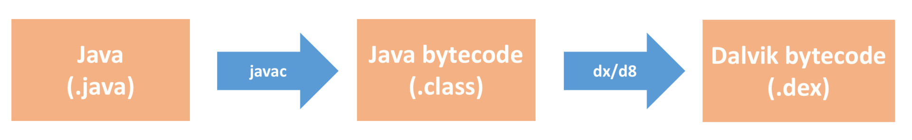

如上图所示，请你回忆一下Java代码的编译流程，思考一下插桩究竟是在编译流程中的哪一步工作？除了我们之前使用的一些场景，它还有哪些常见的应用场景？在实际工作中，我们应该怎样更好地使用它？现在都有哪些常用的编译插桩方法？今天我们一起来解决这些问题。

<h2 id="编译插桩的基础知识">编译插桩的基础知识</h2>

不知道你有没有注意到，在编译期间修改和生成代码其实是很常见的行为，无论是Dagger、ButterKnife这些APT（Annotation Processing Tool）注解生成框架，还是新兴的Kotlin语言<a href="https://github.com/JetBrains/kotlin/tree/v1.2.30/compiler/backend/src/org/jetbrains/kotlin/codegen" target="_blank">编译器</a>，它们都用到了编译插桩的技术。

下面我们一起来看看还有哪些场景会用到编译插桩技术。

<strong>1. 编译插桩的应用场景</strong>

编译插桩技术非常有趣，同样也很有价值，掌握它之后，可以完成一些其他技术很难实现或无法完成的任务。学会这项技术以后，我们就可以随心所欲地操控代码，满足不同场景的需求。

<ul>
<li>
<strong>代码生成</strong>。除了Dagger、ButterKnife这些常用的注解生成框架，Protocol Buffers、数据库ORM框架也都会在编译过程生成代码。代码生成隔离了复杂的内部实现，让开发更加简单高效，而且也减少了手工重复的劳动量，降低了出错的可能性。
</li>

<li>
<strong>代码监控</strong>。除了网络监控和耗电监控，我们可以利用编译插桩技术实现各种各样的性能监控。为什么不直接在源码中实现监控功能呢？首先我们不一定有第三方SDK的源码，其次某些调用点可能会非常分散，例如想监控代码中所有new Thread()调用，通过源码的方式并不那么容易实现。
</li>

<li>
<strong>代码修改</strong>。我们在这个场景拥有无限的发挥空间，例如某些第三方SDK库没有源码，我们可以给它内部的一个崩溃函数增加try catch，或者说替换它的图片库等。我们也可以通过代码修改实现无痕埋点，就像网易的<a href="https://neyoufan.github.io/2017/07/11/android/%E7%BD%91%E6%98%93HubbleData%E4%B9%8BAndroid%E6%97%A0%E5%9F%8B%E7%82%B9%E5%AE%9E%E8%B7%B5/" target="_blank">HubbleData</a>、51信用卡的<a href="https://mp.weixin.qq.com/s/P95ATtgT2pgx4bSLCAzi3Q" target="_blank">埋点实践</a>。
</li>

<li>
<strong>代码分析</strong>。上一期我讲到持续集成，里面的自定义代码检查就可以使用编译插桩技术实现。例如检查代码中的new Thread()调用、检查代码中的一些敏感权限使用等。事实上，Findbugs这些第三方的代码检查工具也同样使用的是编译插桩技术实现。
</li>
</ul>

“一千个人眼中有一千个哈姆雷特”，通过编译插桩技术，你可以大胆发挥自己的想象力，做一些对提升团队质量和效能有帮助的事情。

那从技术实现上看，编译插桩是从代码编译的哪个流程介入的呢？我们可以把它分为两类：

<ul>
<li><strong>Java文件</strong>。类似APT、AndroidAnnotation这些代码生成的场景，它们生成的都是Java文件，是在编译的最开始介入。</li>
</ul>

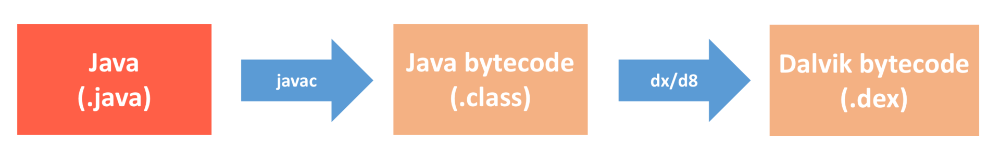

<ul>
<li><strong>字节码（Bytecode）</strong>。对于代码监控、代码修改以及代码分析这三个场景，一般采用操作字节码的方式。可以操作“.class”的Java字节码，也可以操作“.dex”的Dalvik字节码，这取决于我们使用的插桩方法。</li>
</ul>

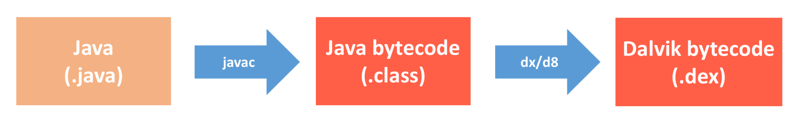

相对于Java文件方式，字节码操作方式功能更加强大，应用场景也更广，但是它的使用复杂度更高，所以今天我主要来讲如何通过操作字节码实现编译插桩的功能。

<strong>2. 字节码</strong>

对于Java平台，Java虚拟机运行的是Class文件，内部对应的是Java字节码。而针对Android这种嵌入式平台，为了优化性能，Android虚拟机运行的是<a href="https://source.android.com/devices/tech/dalvik/dex-format" target="_blank">Dex文件</a>，Google专门为其设计了一种Dalvik字节码，虽然增加了指令长度但却缩减了指令的数量，执行也更为快速。

那这两种字节码格式有什么不同呢？下面我们先来看一个非常简单的Java类。

<pre><code>public class Sample {
    public void test() {
        System.out.print(&quot;I am a test sample!&quot;);
    }
}
</code></pre>

通过下面几个命令，我们可以生成和查看这个Sample.java类的Java字节码和Dalvik字节码。

<pre><code>javac Sample.java   // 生成Sample.class，也就是Java字节码
javap -v Sample     // 查看Sample类的Java字节码

//通过Java字节码，生成Dalvik字节码
dx --dex --output=Sample.dex Sample.class   

dexdump -d Sample.dex   // 查看Sample.dex的Dalvik的字节码
</code></pre>

你可以直观地看到Java字节码和Dalvik字节码的差别。

它们的格式和指令都有很明显的差异。关于Java字节码的介绍，你可以参考<a href="https://docs.oracle.com/javase/specs/jvms/se11/html/index.html" target="_blank">JVM文档</a>。对于Dalvik字节码来说，你可以参考Android的<a href="https://source.android.com/devices/tech/dalvik/dalvik-bytecode" target="_blank">官方文档</a>。它们的主要区别有：

<ul>
<li><strong>体系结构</strong>。Java虚拟机是基于栈实现，而Android虚拟机是基于寄存器实现。在ARM平台，寄存器实现性能会高于栈实现。</li>
</ul>

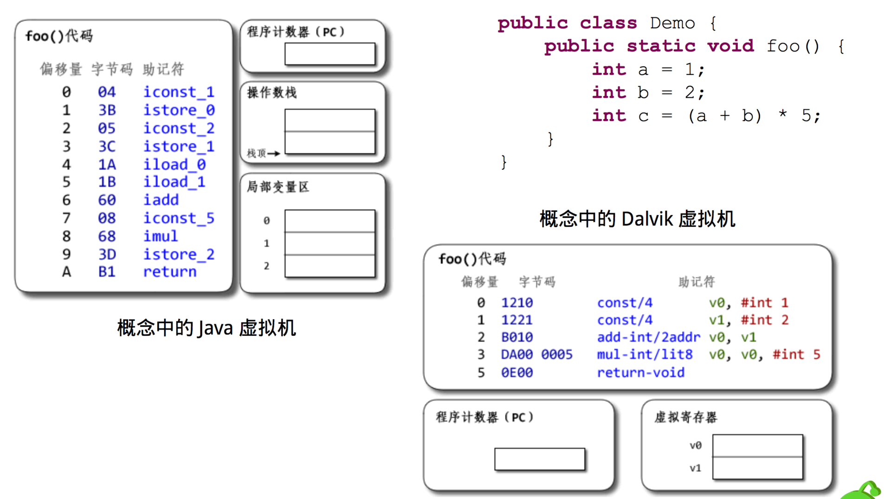

<ul>
<li>
<strong>格式结构</strong>。对于Class文件，每个文件都会有自己单独的常量池以及其他一些公共字段。对于Dex文件，整个Dex中的所有Class共用同一个常量池和公共字段，所以整体结构更加紧凑，因此也大大减少了体积。
</li>

<li>
<strong>指令优化</strong>。Dalvik字节码对大量的指令专门做了精简和优化，如下图所示，相同的代码Java字节码需要100多条，而Dalvik字节码只需要几条。
</li>
</ul>

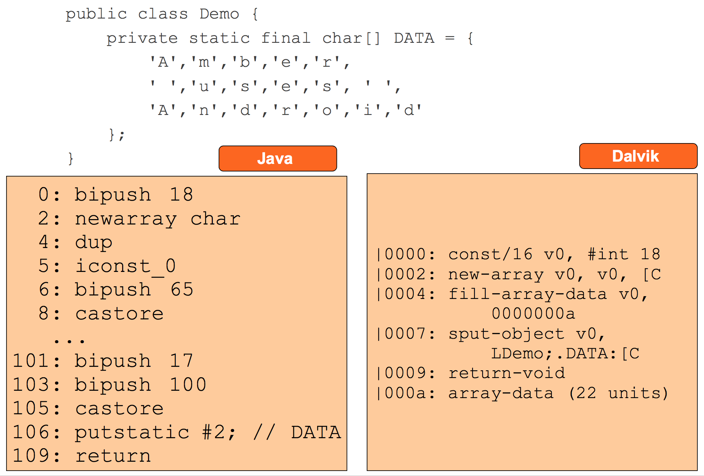

关于Java字节码和Dalvik字节码的更多介绍，你可以参考下面的资料：

<ul>
<li>
<a href="https://github.com/AndroidAdvanceWithGeektime/Chapter27/blob/master/doucments/Dalvik%20and%20ART.pdf" target="_blank">Dalvik and ART</a>
</li>

<li>
<a href="https://github.com/AndroidAdvanceWithGeektime/Chapter27/blob/master/doucments/Understanding%20the%20Davlik%20Virtual%20Machine.pdf" target="_blank">Understanding the Davlik Virtual Machine</a>
</li>
</ul>

<h2 id="编译插桩的三种方法">编译插桩的三种方法</h2>

AspectJ和ASM框架的输入和输出都是Class文件，它们是我们最常用的Java字节码处理框架。

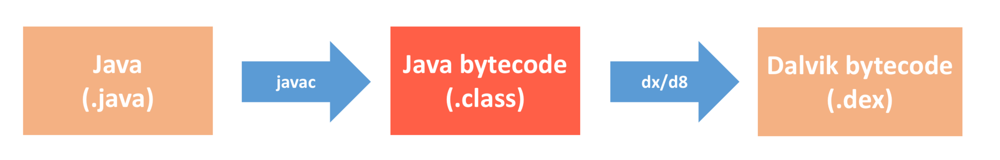

<strong>1. AspectJ</strong>

<a href="https://www.eclipse.org/aspectj/" target="_blank">AspectJ</a>是Java中流行的AOP（aspect-oriented programming）编程扩展框架，网上很多文章说它处理的是Java文件，其实并不正确，它内部也是通过字节码处理技术实现的代码注入。

从底层实现上来看，AspectJ内部使用的是<a href="https://github.com/apache/commons-bcel" target="_blank">BCEL</a>框架来完成的，不过这个库在最近几年没有更多的开发进展，官方也建议切换到ObjectWeb的ASM框架。关于BCEL的使用，你可以参考<a href="https://www.ibm.com/developerworks/cn/java/j-dyn0414/index.html" target="_blank">《用BCEL设计字节码》</a>这篇文章。

从使用上来看，作为字节码处理元老，AspectJ的框架的确有自己的一些优势。

<ul>
<li>
<strong>成熟稳定</strong>。从字节码的格式和各种指令规则来看，字节码处理不是那么简单，如果处理出错，就会导致程序编译或者运行过程出问题。而AspectJ作为从2001年发展至今的框架，它已经很成熟，一般不用考虑插入的字节码正确性的问题。
</li>

<li>
<strong>使用简单</strong>。AspectJ功能强大而且使用非常简单，使用者完全不需要理解任何Java字节码相关的知识，就可以使用自如。它可以在方法（包括构造方法）被调用的位置、在方法体（包括构造方法）的内部、在读写变量的位置、在静态代码块内部、在异常处理的位置等前后，插入自定义的代码，或者直接将原位置的代码替换为自定义的代码。
</li>
</ul>

在专栏前面文章里我提过360的性能监控框架<a href="https://github.com/Qihoo360/ArgusAPM" target="_blank">ArgusAPM</a>，它就是使用AspectJ实现性能的监控，其中<a href="https://github.com/Qihoo360/ArgusAPM/blob/master/argus-apm/argus-apm-aop/src/main/java/com/argusapm/android/aop/TraceActivity.java" target="_blank">TraceActivity</a>是为了监控Application和Activity的生命周期。

<pre><code>// 在Application onCreate执行的时候调用applicationOnCreate方法
@Pointcut(&quot;execution(* android.app.Application.onCreate(android.content.Context)) &amp;&amp; args(context)&quot;)
public void applicationOnCreate(Context context) {

}
// 在调用applicationOnCreate方法之后调用applicationOnCreateAdvice方法
@After(&quot;applicationOnCreate(context)&quot;)
public void applicationOnCreateAdvice(Context context) {
    AH.applicationOnCreate(context);
}
</code></pre>

你可以看到，我们完全不需要关心底层Java字节码的处理流程，就可以轻松实现编译插桩功能。关于AspectJ的文章网上有很多，不过最全面的还是官方文档，你可以参考<a href="https://github.com/AndroidAdvanceWithGeektime/Chapter27/blob/master/AspectJ%E7%A8%8B%E5%BA%8F%E8%AE%BE%E8%AE%A1%E6%8C%87%E5%8D%97.pdf" target="_blank">《AspectJ程序设计指南》</a>和<a href="https://www.eclipse.org/aspectj/doc/next/adk15notebook/index.html" target="_blank">The AspectJ 5 Development Kit Developer’s Notebook</a>，这里我就不详细描述了。

但是从AspectJ的使用说明里也可以看出它的一些劣势，它的功能无法满足我们某些场景的需要。

<ul>
<li>
<strong>切入点固定</strong>。AspectJ只能在一些固定的切入点来进行操作，如果想要进行更细致的操作则无法完成，它不能针对一些特定规则的字节码序列做操作。
</li>

<li>
<strong>正则表达式</strong>。AspectJ的匹配规则是类似正则表达式的规则，比如匹配Activity生命周期的onXXX方法，如果有自定义的其他以on开头的方法也会匹配到。
</li>

<li>
<strong>性能较低</strong>。AspectJ在实现时会包装自己的一些类，逻辑比较复杂，不仅生成的字节码比较大，而且对原函数的性能也会有所影响。
</li>
</ul>

我举专栏第7期启动耗时<a href="https://github.com/AndroidAdvanceWithGeektime/Chapter07" target="_blank">Sample</a>的例子，我们希望在所有的方法调用前后都增加Trace的函数。如果选择使用AspectJ，那么实现真的非常简单。

<pre><code>@Before(&quot;execution(* **(..))&quot;)
public void before(JoinPoint joinPoint) {
    Trace.beginSection(joinPoint.getSignature().toString());
}

@After(&quot;execution(* **(..))&quot;)
public void after() {
    Trace.endSection();
}
</code></pre>

但你可以看到经过AspectJ的字节码处理，它并不会直接把Trace函数直接插入到代码中，而是经过一系列自己的封装。如果想针对所有的函数都做插桩，AspectJ会带来不少的性能影响。

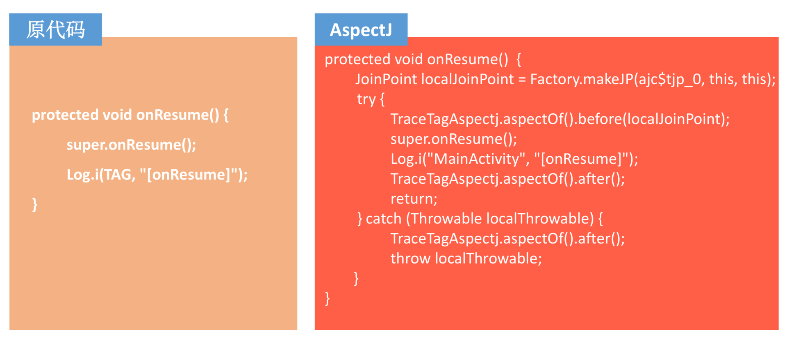

不过大部分情况，我们可能只会插桩某一小部分函数，这样AspectJ带来的性能影响就可以忽略不计了。如果想在Android中直接使用AspectJ，还是比较麻烦的。这里我推荐你直接使用沪江的<a href="https://github.com/HujiangTechnology/gradle_plugin_android_aspectjx" target="_blank">AspectJX</a>框架，它不仅使用更加简便一些，而且还扩展了排除某些类和JAR包的能力。如果你想通过Annotation注解方式接入，我推荐使用Jake Wharton大神写的<a href="https://github.com/JakeWharton/hugo" target="_blank">Hugo</a>项目。

虽然AspectJ使用方便，但是在使用的时候不注意的话还是会产生一些意想不到的异常。比如使用Around Advice需要注意方法返回值的问题，在Hugo里的处理方法是将joinPoint.proceed()的返回值直接返回，同时也需要注意<a href="https://www.eclipse.org/aspectj/doc/released/progguide/semantics-advice.html" target="_blank">Advice Precedence</a>的情况。

<strong>2. ASM</strong>

如果说AspectJ只能满足50%的字节码处理场景，那<a href="http://asm.ow2.org/" target="_blank">ASM</a>就是一个可以实现100%场景的Java字节码操作框架，它的功能也非常强大。使用ASM操作字节码主要的特点有：

<ul>
<li>
<strong>操作灵活</strong>。操作起来很灵活，可以根据需求自定义修改、插入、删除。
</li>

<li>
<strong>上手难</strong>。上手比较难，需要对Java字节码有比较深入的了解。
</li>
</ul>

为了使用简单，相比于BCEL框架，ASM的优势是提供了一个Visitor模式的访问接口（Core API），使用者可以不用关心字节码的格式，只需要在每个Visitor的位置关心自己所修改的结构即可。但是这种模式的缺点是，一般只能在一些简单场景里实现字节码的处理。

事实上，专栏第7期启动耗时的Sample内部就是使用ASM的Core API，具体你可以参考<a href="https://github.com/AndroidAdvanceWithGeektime/Chapter07/blob/master/systrace-gradle-plugin/src/main/java/com/geektime/systrace/MethodTracer.java#L259" target="_blank">MethodTracer</a>类的实现。从最终效果上来看，ASM字节码处理后的效果如下。

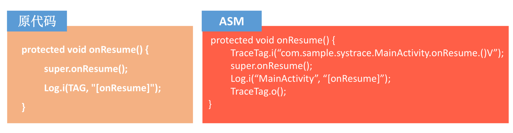

相比AspectJ，ASM更加直接高效。但是对于一些复杂情况，我们可能需要使用另外一种Tree API来完成对Class文件更直接的修改，因此这时候你要掌握一些必不可少的Java字节码知识。

此外，我们还需要对Java虚拟机的运行机制有所了解，前面我就讲到Java虚拟机是基于栈实现。那什么是Java虚拟机的栈呢？，引用《Java虚拟机规范》里对Java虚拟机栈的描述：

<blockquote>

每一条Java虚拟机线程都有自己私有的Java虚拟机栈，这个栈与线程同时创建，用于存储栈帧（Stack Frame）。

</blockquote>

正如这句话所描述的，每个线程都有自己的栈，所以在多线程应用程序中多个线程就会有多个栈，每个栈都有自己的栈帧。

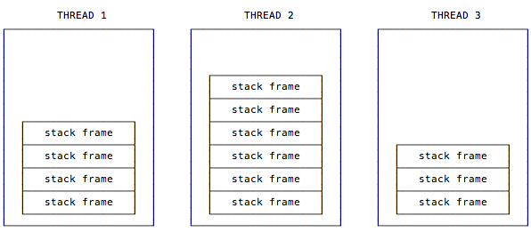

如下图所示，我们可以简单认为栈帧包含3个重要的内容：本地变量表（Local Variable Array）、操作数栈（Operand Stack）和常量池引用（Constant Pool Reference）。

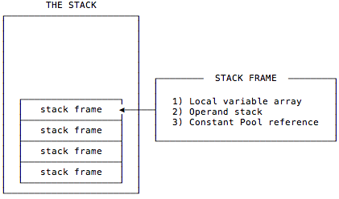

<ul>
<li>
<strong>本地变量表</strong>。在使用过程中，可以认为本地变量表是存放临时数据的，并且本地变量表有个很重要的功能就是用来传递方法调用时的参数，当调用方法的时候，参数会依次传递到本地变量表中从0开始的位置上，并且如果调用的方法是实例方法，那么我们可以通过第0个本地变量中获取当前实例的引用，也就是this所指向的对象。
</li>

<li>
<strong>操作数栈</strong>。可以认为操作数栈是一个用于存放指令执行所需要的数据的位置，指令从操作数栈中取走数据并将操作结果重新入栈。
</li>
</ul>

由于本地变量表的最大数和操作数栈的最大深度是在编译时就确定的，所以在使用ASM进行字节码操作后需要调用ASM提供的visitMaxs方法来设置maxLocal和maxStack数。不过，ASM为了方便用户使用，已经提供了自动计算的方法，在实例化ClassWriter操作类的时候传入COMPUTE_MAXS后，ASM就会自动计算本地变量表和操作数栈。

<pre><code>ClassWriter(ClassWriter.COMPUTE_MAXS)
</code></pre>

下面以一个简单的“1+2“为例，它的操作数以LIFO（后进先出）的方式进行操作。

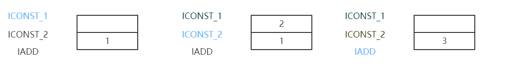

ICONST_1将int类型1推送栈顶，ICONST_2将int类型2推送栈顶，IADD指令将栈顶两个int类型的值相加后将结果推送至栈顶。操作数栈的最大深度也是由编译期决定的，很多时候ASM修改后的代码会增加操作数栈最大深度。不过ASM已经提供了动态计算的方法，但同时也会带来一些性能上的损耗。

在具体的字节码处理过程中，特别需要注意的是本地变量表和操作数栈的数据交换和try catch blcok的处理。

<ul>
<li><strong>数据交换</strong>。如下图所示，在经过IADD指令操作后，又通过ISTORE 0指令将栈顶int值存入第1个本地变量中，用于临时保存，在最后的加法过程中，将0和1位置的本地变量取出压入操作数栈中供IADD指令使用。关于本地变量和操作数栈数据交互的指令，你可以参考虚拟机规范，里面提供了一系列根据不同数据类型的指令。</li>
</ul>

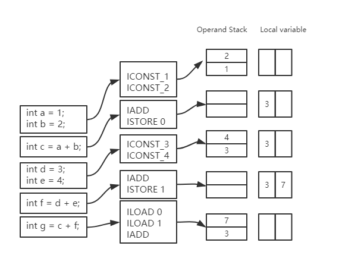

<ul>
<li><strong>异常处理</strong>。在字节码操作过程中需要特别注意异常处理对操作数栈的影响，如果在try和catch之间抛出了一个可捕获的异常，那么当前的操作数栈会被清空，并将异常对象压入这个空栈中，执行过程在catch处继续。幸运的是，如果生成了错误的字节码，编译器可以辨别出该情况并导致编译异常，ASM中也提供了<a href="https://asm.ow2.io/javadoc/org/objectweb/asm/util/CheckClassAdapter.html" target="_blank">字节码Verify</a>的接口，可以在修改完成后验证一下字节码是否正常。</li>
</ul>

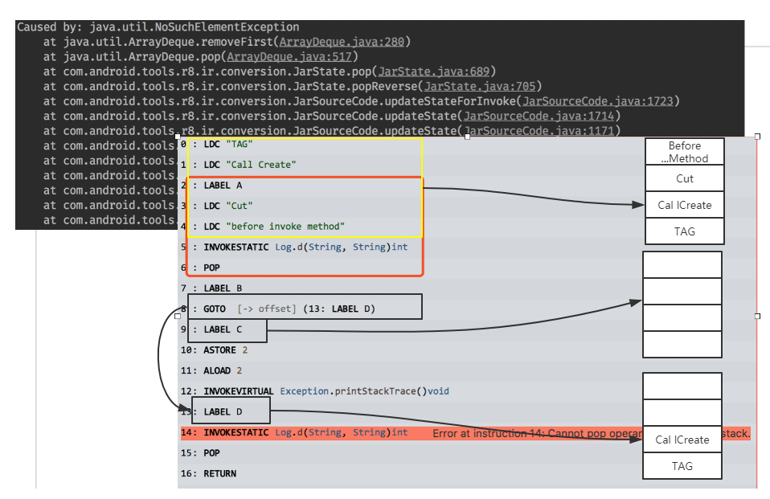

如果想在一个方法执行完成后增加代码，ASM相对也要简单很多，可以在字节码中出现的每一条RETURN系或者ATHROW的指令前，增加处理的逻辑即可。

<strong>3. ReDex</strong>

ReDex不仅只是作为一款Dex优化工具，它也提供了很多的小工具和文档里没有提到的一些新奇功能。比如在ReDex里提供了一个简单的Method Tracing和Block Tracing工具，这个工具可以在所有方法或者指定方法前面插入一段跟踪代码。

官方提供了一个例子，用来展示这个工具的使用，具体请查看<a href="https://github.com/facebook/redex/blob/5d0d4f429198a56c83c013b26b1093d80edc842b/test/instr/InstrumentTest.config" target="_blank">InstrumentTest</a>。这个例子会将<a href="https://github.com/facebook/redex/blob/5d0d4f429198a56c83c013b26b1093d80edc842b/test/instr/InstrumentAnalysis.java" target="_blank">InstrumentAnalysis</a>的onMethodBegin方法插入到除黑名单以外的所有方法的开头位置。具体配置如下：

<pre><code>&quot;InstrumentPass&quot; : {
    &quot;analysis_class_name&quot;:      &quot;Lcom/facebook/redextest/InstrumentAnalysis;&quot;,  //存在桩代码的类
    &quot;analysis_method_name&quot;: &quot;onMethodBegin&quot;,    //存在桩代码的方法
    &quot;instrumentation_strategy&quot;: &quot;simple_method_tracing&quot;
,   //插入策略，有两种方案，一种是在方法前面插入simple_method_tracing，一种是在CFG 的Block前后插入basic_block_tracing
}
</code></pre>

ReDex的这个功能并不是完整的AOP工具，但它提供了一系列指令生成API和Opcode插入API，我们可以参照这个功能实现自己的字节码注入工具，这个功能的代码在<a href="https://github.com/facebook/redex/blob/master/opt/instrument/Instrument.cpp" target="_blank">Instrument.cpp</a>中。

这个类已经将各种字节码特殊情况处理得相对比较完善，我们可以直接构造一段Opcode调用其提供的Insert接口即可完成代码的插入，而不用过多考虑可能会出现的异常情况。不过这个类提供的功能依然耦合了ReDex的业务，所以我们需要提取有用的代码加以使用。

由于Dalvik字节码发展时间尚短，而且因为Dex格式更加紧凑，修改起来往往牵一发而动全身。并且Dalvik字节码的处理相比Java字节码会更加复杂一些，所以直接操作Dalvik字节码的工具并不是很多。

市面上大部分需要直接修改Dex的情况是做逆向，很多同学都采用手动书写Smali代码然后编译回去。这里我总结了一些修改Dalvik字节码的库。

<ul>
<li>
<a href="https://gitlab.ow2.org/asm/asmdex" target="_blank">ASMDEX</a>，开发者是ASM库的开发者，但很久未更新了。
</li>

<li>
<a href="https://android.googlesource.com/platform/tools/dexter/+/refs/heads/master" target="_blank">Dexter</a>，Google官方开发的Dex操作库，更新很频繁，但使用起来很复杂。
</li>

<li>
<a href="https://github.com/linkedin/dexmaker" target="_blank">Dexmaker</a>，用来生成Dalvik字节码的代码。
</li>

<li>
<a href="https://github.com/Sable/soot" target="_blank">Soot</a>，修改Dex的方法很另类，是先将Dalvik字节码转成一种Jimple three-address code，然后插入Jimple Opcode后再转回Dalvik字节码，具体可以参考<a href="https://raw.githubusercontent.com/wiki/Sable/soot/code/androidinstr/AndroidInstrument.java_.txt" target="_blank">例子</a>。
</li>
</ul>

<h2 id="总结">总结</h2>

今天我介绍了几种比较有代表性的框架来讲解编译插桩相关的内容。代码生成、代码监控、代码魔改以及代码分析，编译插桩技术无所不能，因此需要我们充分发挥想象力。

对于一些常见的应用场景，前辈们付出了大量的努力将它们工具化、API化，让我们不需要懂得底层字节码原理就可以轻松使用。但是如果真要想达到随心所欲的境界，即使有类似ASM工具的帮助，也还是需要我们对底层字节码有比较深的理解和认识。

当然你也可以成为“前辈”，将这些场景沉淀下来，提供给后人使用。但有的时候“能力限制想象力”，如果能力不够，即使想象力到位也无可奈何。

<h2 id="课后作业">课后作业</h2>

你使用过哪些编译插桩相关的工具？使用编译插桩实现过什么功能？欢迎留言跟我和其他同学一起讨论。

今天的课后作业是重温专栏<a href="https://github.com/AndroidAdvanceWithGeektime/Chapter07" target="_blank">第7期练习Sample</a>的实现原理，看看它内部是如何使用ASM完成TAG的插桩。在今天的<a href="https://github.com/AndroidAdvanceWithGeektime/Chapter27" target="_blank">Sample</a>里，我也提供了一个使用AspectJ实现的版本。想要彻底学会编译插桩的确不容易，单单写一个高效的Gradle Plugin就不那么简单。

除了上面的两个Sample，我也推荐你认真看看下面的一些参考资料和项目。

<ul>
<li>
<a href="https://mp.weixin.qq.com/s?__biz=MzA5MzI3NjE2MA==&amp;mid=2650244795&amp;idx=1&amp;sn=cdfc4acec8b0d2b5c82fd9d884f32f09&amp;chksm=886377d4bf14fec2fc822cd2b3b6069c36cb49ea2814d9e0e2f4a6713f4e86dfc0b1bebf4d39&amp;mpshare=1&amp;scene=1&amp;srcid=1217NjDpKNvdgalsqBQLJXjX%23rd" target="_blank">一起玩转Android项目中的字节码</a>
</li>

<li>
<a href="https://www.infoq.cn/article/Living-Matrix-Bytecode-Manipulation" target="_blank">字节码操纵技术探秘</a>
</li>

<li>
<a href="https://asm.ow2.io/developer-guide.html" target="_blank">ASM 6 Developer Guide</a>
</li>

<li>
<a href="http://blog.hakugyokurou.net/?p=409" target="_blank">Java字节码(Bytecode)与ASM简单说明</a>
</li>

<li>
<a href="https://github.com/AndroidAdvanceWithGeektime/Chapter27/blob/master/doucments/Dalvik%20and%20ART.pdf" target="_blank">Dalvik and ART</a>
</li>

<li>
<a href="https://github.com/AndroidAdvanceWithGeektime/Chapter27/blob/master/doucments/Understanding%20the%20Davlik%20Virtual%20Machine.pdf" target="_blank">Understanding the Davlik Virtual Machine</a>
</li>

<li>
基于ASM的字节码处理工具：<a href="https://github.com/Leaking/Hunter/blob/master/README_ch.md" target="_blank">Hunter</a>和<a href="https://github.com/BryanSharp/hibeaver" target="_blank">Hibeaver</a>
</li>

<li>
基于Javassist的字节码处理工具：<a href="https://github.com/didi/DroidAssist/blob/master/README_CN.md" target="_blank">DroidAssist</a>
</li>
</ul>

欢迎你点击“请朋友读”，把今天的内容分享给好友，邀请他一起学习。最后别忘了在评论区提交今天的作业，我也为认真完成作业的同学准备了丰厚的“学习加油礼包”，期待与你一起切磋进步哦。

                        

                        

                            

                            

                            

                            

                        

                    

                

            

            

                

                
© 2019 - 2023 <a href="/cdn-cgi/l/email-protection#29454545101d1818191e694e44484045074a4644" target="_blank">Liangliang Lee</a>.
                    Powered by <a href="https://github.com/gin-gonic/gin" target="_blank">gin</a> and <a
                        href="https://github.com/kaiiiz/hexo-theme-book" target="_blank">hexo-theme-book</a>.

            

        

        
    

</body>

</html>