<!DOCTYPE html>
<html xmlns="http://www.w3.org/1999/xhtml">

<head>

    <head>
        <meta http-equiv="Content-Type" content="text/html; charset=UTF-8">
        <meta name="viewport" content="width=device-width, initial-scale=1, maximum-scale=1.0, user-scalable=no">
        <meta http-equiv='content-language' content='zh-cn'>
        <meta name='description' content=35&#32;Native&#32;Hook&#32;技术，天使还是魔鬼？>
        <link rel="icon" href="/static/favicon.png">
        <title>35 Native Hook 技术，天使还是魔鬼？ </title>
        
        <link rel="stylesheet" href="/static/index.css">
        <link rel="stylesheet" href="/static/highlight.min.css">
        
        
        <meta name="generator" content="Hexo 4.2.0">
        
    </head>

<body>
    

        

            

                <a href="/">
                    
                    技术文章摘抄
                </a>
            

            

                <ul class="uncollapsible">
                    <li><a href="/" class="current-tab">首页</a></li>
                    <li><a href="../">上一级</a></li>
                </ul>
                <ul class="uncollapsible">
                    
                    <li>
                        <a class="menu-item" id="00 导读 如何打造高质量的应用？.md" href="/%e4%b8%93%e6%a0%8f/Android%e5%bc%80%e5%8f%91%e9%ab%98%e6%89%8b%e8%af%be/00%20%e5%af%bc%e8%af%bb%20%e5%a6%82%e4%bd%95%e6%89%93%e9%80%a0%e9%ab%98%e8%b4%a8%e9%87%8f%e7%9a%84%e5%ba%94%e7%94%a8%ef%bc%9f.md">00 导读 如何打造高质量的应用？.md</a>
                    </li>
                    
                    <li>
                        <a class="menu-item" id="00 开篇词 焦虑的移动开发者该如何破局？.md" href="/%e4%b8%93%e6%a0%8f/Android%e5%bc%80%e5%8f%91%e9%ab%98%e6%89%8b%e8%af%be/00%20%e5%bc%80%e7%af%87%e8%af%8d%20%e7%84%a6%e8%99%91%e7%9a%84%e7%a7%bb%e5%8a%a8%e5%bc%80%e5%8f%91%e8%80%85%e8%af%a5%e5%a6%82%e4%bd%95%e7%a0%b4%e5%b1%80%ef%bc%9f.md">00 开篇词 焦虑的移动开发者该如何破局？.md</a>
                    </li>
                    
                    <li>
                        <a class="menu-item" id="01 崩溃优化（上）：关于“崩溃”那些事儿.md" href="/%e4%b8%93%e6%a0%8f/Android%e5%bc%80%e5%8f%91%e9%ab%98%e6%89%8b%e8%af%be/01%20%e5%b4%a9%e6%ba%83%e4%bc%98%e5%8c%96%ef%bc%88%e4%b8%8a%ef%bc%89%ef%bc%9a%e5%85%b3%e4%ba%8e%e2%80%9c%e5%b4%a9%e6%ba%83%e2%80%9d%e9%82%a3%e4%ba%9b%e4%ba%8b%e5%84%bf.md">01 崩溃优化（上）：关于“崩溃”那些事儿.md</a>
                    </li>
                    
                    <li>
                        <a class="menu-item" id="02 崩溃优化（下）：应用崩溃了，你应该如何去分析？.md" href="/%e4%b8%93%e6%a0%8f/Android%e5%bc%80%e5%8f%91%e9%ab%98%e6%89%8b%e8%af%be/02%20%e5%b4%a9%e6%ba%83%e4%bc%98%e5%8c%96%ef%bc%88%e4%b8%8b%ef%bc%89%ef%bc%9a%e5%ba%94%e7%94%a8%e5%b4%a9%e6%ba%83%e4%ba%86%ef%bc%8c%e4%bd%a0%e5%ba%94%e8%af%a5%e5%a6%82%e4%bd%95%e5%8e%bb%e5%88%86%e6%9e%90%ef%bc%9f.md">02 崩溃优化（下）：应用崩溃了，你应该如何去分析？.md</a>
                    </li>
                    
                    <li>
                        <a class="menu-item" id="03 内存优化（上）：4GB内存时代，再谈内存优化.md" href="/%e4%b8%93%e6%a0%8f/Android%e5%bc%80%e5%8f%91%e9%ab%98%e6%89%8b%e8%af%be/03%20%e5%86%85%e5%ad%98%e4%bc%98%e5%8c%96%ef%bc%88%e4%b8%8a%ef%bc%89%ef%bc%9a4GB%e5%86%85%e5%ad%98%e6%97%b6%e4%bb%a3%ef%bc%8c%e5%86%8d%e8%b0%88%e5%86%85%e5%ad%98%e4%bc%98%e5%8c%96.md">03 内存优化（上）：4GB内存时代，再谈内存优化.md</a>
                    </li>
                    
                    <li>
                        <a class="menu-item" id="04 内存优化（下）：内存优化这件事，应该从哪里着手？.md" href="/%e4%b8%93%e6%a0%8f/Android%e5%bc%80%e5%8f%91%e9%ab%98%e6%89%8b%e8%af%be/04%20%e5%86%85%e5%ad%98%e4%bc%98%e5%8c%96%ef%bc%88%e4%b8%8b%ef%bc%89%ef%bc%9a%e5%86%85%e5%ad%98%e4%bc%98%e5%8c%96%e8%bf%99%e4%bb%b6%e4%ba%8b%ef%bc%8c%e5%ba%94%e8%af%a5%e4%bb%8e%e5%93%aa%e9%87%8c%e7%9d%80%e6%89%8b%ef%bc%9f.md">04 内存优化（下）：内存优化这件事，应该从哪里着手？.md</a>
                    </li>
                    
                    <li>
                        <a class="menu-item" id="05 卡顿优化（上）：你要掌握的卡顿分析方法.md" href="/%e4%b8%93%e6%a0%8f/Android%e5%bc%80%e5%8f%91%e9%ab%98%e6%89%8b%e8%af%be/05%20%e5%8d%a1%e9%a1%bf%e4%bc%98%e5%8c%96%ef%bc%88%e4%b8%8a%ef%bc%89%ef%bc%9a%e4%bd%a0%e8%a6%81%e6%8e%8c%e6%8f%a1%e7%9a%84%e5%8d%a1%e9%a1%bf%e5%88%86%e6%9e%90%e6%96%b9%e6%b3%95.md">05 卡顿优化（上）：你要掌握的卡顿分析方法.md</a>
                    </li>
                    
                    <li>
                        <a class="menu-item" id="06 卡顿优化（下）：如何监控应用卡顿？.md" href="/%e4%b8%93%e6%a0%8f/Android%e5%bc%80%e5%8f%91%e9%ab%98%e6%89%8b%e8%af%be/06%20%e5%8d%a1%e9%a1%bf%e4%bc%98%e5%8c%96%ef%bc%88%e4%b8%8b%ef%bc%89%ef%bc%9a%e5%a6%82%e4%bd%95%e7%9b%91%e6%8e%a7%e5%ba%94%e7%94%a8%e5%8d%a1%e9%a1%bf%ef%bc%9f.md">06 卡顿优化（下）：如何监控应用卡顿？.md</a>
                    </li>
                    
                    <li>
                        <a class="menu-item" id="06补充篇 卡顿优化：卡顿现场与卡顿分析.md" href="/%e4%b8%93%e6%a0%8f/Android%e5%bc%80%e5%8f%91%e9%ab%98%e6%89%8b%e8%af%be/06%e8%a1%a5%e5%85%85%e7%af%87%20%e5%8d%a1%e9%a1%bf%e4%bc%98%e5%8c%96%ef%bc%9a%e5%8d%a1%e9%a1%bf%e7%8e%b0%e5%9c%ba%e4%b8%8e%e5%8d%a1%e9%a1%bf%e5%88%86%e6%9e%90.md">06补充篇 卡顿优化：卡顿现场与卡顿分析.md</a>
                    </li>
                    
                    <li>
                        <a class="menu-item" id="07 启动优化（上）：从启动过程看启动速度优化.md" href="/%e4%b8%93%e6%a0%8f/Android%e5%bc%80%e5%8f%91%e9%ab%98%e6%89%8b%e8%af%be/07%20%e5%90%af%e5%8a%a8%e4%bc%98%e5%8c%96%ef%bc%88%e4%b8%8a%ef%bc%89%ef%bc%9a%e4%bb%8e%e5%90%af%e5%8a%a8%e8%bf%87%e7%a8%8b%e7%9c%8b%e5%90%af%e5%8a%a8%e9%80%9f%e5%ba%a6%e4%bc%98%e5%8c%96.md">07 启动优化（上）：从启动过程看启动速度优化.md</a>
                    </li>
                    
                    <li>
                        <a class="menu-item" id="08 启动优化（下）：优化启动速度的进阶方法.md" href="/%e4%b8%93%e6%a0%8f/Android%e5%bc%80%e5%8f%91%e9%ab%98%e6%89%8b%e8%af%be/08%20%e5%90%af%e5%8a%a8%e4%bc%98%e5%8c%96%ef%bc%88%e4%b8%8b%ef%bc%89%ef%bc%9a%e4%bc%98%e5%8c%96%e5%90%af%e5%8a%a8%e9%80%9f%e5%ba%a6%e7%9a%84%e8%bf%9b%e9%98%b6%e6%96%b9%e6%b3%95.md">08 启动优化（下）：优化启动速度的进阶方法.md</a>
                    </li>
                    
                    <li>
                        <a class="menu-item" id="09 I_O优化（上）：开发工程师必备的I_O优化知识.md" href="/%e4%b8%93%e6%a0%8f/Android%e5%bc%80%e5%8f%91%e9%ab%98%e6%89%8b%e8%af%be/09%20I_O%e4%bc%98%e5%8c%96%ef%bc%88%e4%b8%8a%ef%bc%89%ef%bc%9a%e5%bc%80%e5%8f%91%e5%b7%a5%e7%a8%8b%e5%b8%88%e5%bf%85%e5%a4%87%e7%9a%84I_O%e4%bc%98%e5%8c%96%e7%9f%a5%e8%af%86.md">09 I_O优化（上）：开发工程师必备的I_O优化知识.md</a>
                    </li>
                    
                    <li>
                        <a class="menu-item" id="10 I_O优化（中）：不同I_O方式的使用场景是什么？.md" href="/%e4%b8%93%e6%a0%8f/Android%e5%bc%80%e5%8f%91%e9%ab%98%e6%89%8b%e8%af%be/10%20I_O%e4%bc%98%e5%8c%96%ef%bc%88%e4%b8%ad%ef%bc%89%ef%bc%9a%e4%b8%8d%e5%90%8cI_O%e6%96%b9%e5%bc%8f%e7%9a%84%e4%bd%bf%e7%94%a8%e5%9c%ba%e6%99%af%e6%98%af%e4%bb%80%e4%b9%88%ef%bc%9f.md">10 I_O优化（中）：不同I_O方式的使用场景是什么？.md</a>
                    </li>
                    
                    <li>
                        <a class="menu-item" id="11 I_O优化（下）：如何监控线上I_O操作？.md" href="/%e4%b8%93%e6%a0%8f/Android%e5%bc%80%e5%8f%91%e9%ab%98%e6%89%8b%e8%af%be/11%20I_O%e4%bc%98%e5%8c%96%ef%bc%88%e4%b8%8b%ef%bc%89%ef%bc%9a%e5%a6%82%e4%bd%95%e7%9b%91%e6%8e%a7%e7%ba%bf%e4%b8%8aI_O%e6%93%8d%e4%bd%9c%ef%bc%9f.md">11 I_O优化（下）：如何监控线上I_O操作？.md</a>
                    </li>
                    
                    <li>
                        <a class="menu-item" id="12 存储优化（上）：常见的数据存储方法有哪些？.md" href="/%e4%b8%93%e6%a0%8f/Android%e5%bc%80%e5%8f%91%e9%ab%98%e6%89%8b%e8%af%be/12%20%e5%ad%98%e5%82%a8%e4%bc%98%e5%8c%96%ef%bc%88%e4%b8%8a%ef%bc%89%ef%bc%9a%e5%b8%b8%e8%a7%81%e7%9a%84%e6%95%b0%e6%8d%ae%e5%ad%98%e5%82%a8%e6%96%b9%e6%b3%95%e6%9c%89%e5%93%aa%e4%ba%9b%ef%bc%9f.md">12 存储优化（上）：常见的数据存储方法有哪些？.md</a>
                    </li>
                    
                    <li>
                        <a class="menu-item" id="13 存储优化（中）：如何优化数据存储？.md" href="/%e4%b8%93%e6%a0%8f/Android%e5%bc%80%e5%8f%91%e9%ab%98%e6%89%8b%e8%af%be/13%20%e5%ad%98%e5%82%a8%e4%bc%98%e5%8c%96%ef%bc%88%e4%b8%ad%ef%bc%89%ef%bc%9a%e5%a6%82%e4%bd%95%e4%bc%98%e5%8c%96%e6%95%b0%e6%8d%ae%e5%ad%98%e5%82%a8%ef%bc%9f.md">13 存储优化（中）：如何优化数据存储？.md</a>
                    </li>
                    
                    <li>
                        <a class="menu-item" id="14 存储优化（下）：数据库SQLite的使用和优化.md" href="/%e4%b8%93%e6%a0%8f/Android%e5%bc%80%e5%8f%91%e9%ab%98%e6%89%8b%e8%af%be/14%20%e5%ad%98%e5%82%a8%e4%bc%98%e5%8c%96%ef%bc%88%e4%b8%8b%ef%bc%89%ef%bc%9a%e6%95%b0%e6%8d%ae%e5%ba%93SQLite%e7%9a%84%e4%bd%bf%e7%94%a8%e5%92%8c%e4%bc%98%e5%8c%96.md">14 存储优化（下）：数据库SQLite的使用和优化.md</a>
                    </li>
                    
                    <li>
                        <a class="menu-item" id="15 网络优化（上）：移动开发工程师必备的网络优化知识.md" href="/%e4%b8%93%e6%a0%8f/Android%e5%bc%80%e5%8f%91%e9%ab%98%e6%89%8b%e8%af%be/15%20%e7%bd%91%e7%bb%9c%e4%bc%98%e5%8c%96%ef%bc%88%e4%b8%8a%ef%bc%89%ef%bc%9a%e7%a7%bb%e5%8a%a8%e5%bc%80%e5%8f%91%e5%b7%a5%e7%a8%8b%e5%b8%88%e5%bf%85%e5%a4%87%e7%9a%84%e7%bd%91%e7%bb%9c%e4%bc%98%e5%8c%96%e7%9f%a5%e8%af%86.md">15 网络优化（上）：移动开发工程师必备的网络优化知识.md</a>
                    </li>
                    
                    <li>
                        <a class="menu-item" id="16 网络优化（中）：复杂多变的移动网络该如何优化？.md" href="/%e4%b8%93%e6%a0%8f/Android%e5%bc%80%e5%8f%91%e9%ab%98%e6%89%8b%e8%af%be/16%20%e7%bd%91%e7%bb%9c%e4%bc%98%e5%8c%96%ef%bc%88%e4%b8%ad%ef%bc%89%ef%bc%9a%e5%a4%8d%e6%9d%82%e5%a4%9a%e5%8f%98%e7%9a%84%e7%a7%bb%e5%8a%a8%e7%bd%91%e7%bb%9c%e8%af%a5%e5%a6%82%e4%bd%95%e4%bc%98%e5%8c%96%ef%bc%9f.md">16 网络优化（中）：复杂多变的移动网络该如何优化？.md</a>
                    </li>
                    
                    <li>
                        <a class="menu-item" id="17 网络优化（下）：大数据下网络该如何监控？.md" href="/%e4%b8%93%e6%a0%8f/Android%e5%bc%80%e5%8f%91%e9%ab%98%e6%89%8b%e8%af%be/17%20%e7%bd%91%e7%bb%9c%e4%bc%98%e5%8c%96%ef%bc%88%e4%b8%8b%ef%bc%89%ef%bc%9a%e5%a4%a7%e6%95%b0%e6%8d%ae%e4%b8%8b%e7%bd%91%e7%bb%9c%e8%af%a5%e5%a6%82%e4%bd%95%e7%9b%91%e6%8e%a7%ef%bc%9f.md">17 网络优化（下）：大数据下网络该如何监控？.md</a>
                    </li>
                    
                    <li>
                        <a class="menu-item" id="18 耗电优化（上）：从电量优化的演进看耗电分析.md" href="/%e4%b8%93%e6%a0%8f/Android%e5%bc%80%e5%8f%91%e9%ab%98%e6%89%8b%e8%af%be/18%20%e8%80%97%e7%94%b5%e4%bc%98%e5%8c%96%ef%bc%88%e4%b8%8a%ef%bc%89%ef%bc%9a%e4%bb%8e%e7%94%b5%e9%87%8f%e4%bc%98%e5%8c%96%e7%9a%84%e6%bc%94%e8%bf%9b%e7%9c%8b%e8%80%97%e7%94%b5%e5%88%86%e6%9e%90.md">18 耗电优化（上）：从电量优化的演进看耗电分析.md</a>
                    </li>
                    
                    <li>
                        <a class="menu-item" id="19 耗电优化（下）：耗电的优化方法与线上监控.md" href="/%e4%b8%93%e6%a0%8f/Android%e5%bc%80%e5%8f%91%e9%ab%98%e6%89%8b%e8%af%be/19%20%e8%80%97%e7%94%b5%e4%bc%98%e5%8c%96%ef%bc%88%e4%b8%8b%ef%bc%89%ef%bc%9a%e8%80%97%e7%94%b5%e7%9a%84%e4%bc%98%e5%8c%96%e6%96%b9%e6%b3%95%e4%b8%8e%e7%ba%bf%e4%b8%8a%e7%9b%91%e6%8e%a7.md">19 耗电优化（下）：耗电的优化方法与线上监控.md</a>
                    </li>
                    
                    <li>
                        <a class="menu-item" id="20 UI 优化（上）：UI 渲染的几个关键概念.md" href="/%e4%b8%93%e6%a0%8f/Android%e5%bc%80%e5%8f%91%e9%ab%98%e6%89%8b%e8%af%be/20%20UI%20%e4%bc%98%e5%8c%96%ef%bc%88%e4%b8%8a%ef%bc%89%ef%bc%9aUI%20%e6%b8%b2%e6%9f%93%e7%9a%84%e5%87%a0%e4%b8%aa%e5%85%b3%e9%94%ae%e6%a6%82%e5%bf%b5.md">20 UI 优化（上）：UI 渲染的几个关键概念.md</a>
                    </li>
                    
                    <li>
                        <a class="menu-item" id="21 UI 优化（下）：如何优化 UI 渲染？.md" href="/%e4%b8%93%e6%a0%8f/Android%e5%bc%80%e5%8f%91%e9%ab%98%e6%89%8b%e8%af%be/21%20UI%20%e4%bc%98%e5%8c%96%ef%bc%88%e4%b8%8b%ef%bc%89%ef%bc%9a%e5%a6%82%e4%bd%95%e4%bc%98%e5%8c%96%20UI%20%e6%b8%b2%e6%9f%93%ef%bc%9f.md">21 UI 优化（下）：如何优化 UI 渲染？.md</a>
                    </li>
                    
                    <li>
                        <a class="menu-item" id="22 包体积优化（上）：如何减少安装包大小？.md" href="/%e4%b8%93%e6%a0%8f/Android%e5%bc%80%e5%8f%91%e9%ab%98%e6%89%8b%e8%af%be/22%20%e5%8c%85%e4%bd%93%e7%a7%af%e4%bc%98%e5%8c%96%ef%bc%88%e4%b8%8a%ef%bc%89%ef%bc%9a%e5%a6%82%e4%bd%95%e5%87%8f%e5%b0%91%e5%ae%89%e8%a3%85%e5%8c%85%e5%a4%a7%e5%b0%8f%ef%bc%9f.md">22 包体积优化（上）：如何减少安装包大小？.md</a>
                    </li>
                    
                    <li>
                        <a class="menu-item" id="23 包体积优化（下）：资源优化的进阶实践.md" href="/%e4%b8%93%e6%a0%8f/Android%e5%bc%80%e5%8f%91%e9%ab%98%e6%89%8b%e8%af%be/23%20%e5%8c%85%e4%bd%93%e7%a7%af%e4%bc%98%e5%8c%96%ef%bc%88%e4%b8%8b%ef%bc%89%ef%bc%9a%e8%b5%84%e6%ba%90%e4%bc%98%e5%8c%96%e7%9a%84%e8%bf%9b%e9%98%b6%e5%ae%9e%e8%b7%b5.md">23 包体积优化（下）：资源优化的进阶实践.md</a>
                    </li>
                    
                    <li>
                        <a class="menu-item" id="24 想成为Android高手，你需要先搞定这三个问题.md" href="/%e4%b8%93%e6%a0%8f/Android%e5%bc%80%e5%8f%91%e9%ab%98%e6%89%8b%e8%af%be/24%20%e6%83%b3%e6%88%90%e4%b8%baAndroid%e9%ab%98%e6%89%8b%ef%bc%8c%e4%bd%a0%e9%9c%80%e8%a6%81%e5%85%88%e6%90%9e%e5%ae%9a%e8%bf%99%e4%b8%89%e4%b8%aa%e9%97%ae%e9%a2%98.md">24 想成为Android高手，你需要先搞定这三个问题.md</a>
                    </li>
                    
                    <li>
                        <a class="menu-item" id="25 如何提升组织与个人的研发效能？.md" href="/%e4%b8%93%e6%a0%8f/Android%e5%bc%80%e5%8f%91%e9%ab%98%e6%89%8b%e8%af%be/25%20%e5%a6%82%e4%bd%95%e6%8f%90%e5%8d%87%e7%bb%84%e7%bb%87%e4%b8%8e%e4%b8%aa%e4%ba%ba%e7%9a%84%e7%a0%94%e5%8f%91%e6%95%88%e8%83%bd%ef%bc%9f.md">25 如何提升组织与个人的研发效能？.md</a>
                    </li>
                    
                    <li>
                        <a class="menu-item" id="26 关于编译，你需要了解什么？.md" href="/%e4%b8%93%e6%a0%8f/Android%e5%bc%80%e5%8f%91%e9%ab%98%e6%89%8b%e8%af%be/26%20%e5%85%b3%e4%ba%8e%e7%bc%96%e8%af%91%ef%bc%8c%e4%bd%a0%e9%9c%80%e8%a6%81%e4%ba%86%e8%a7%a3%e4%bb%80%e4%b9%88%ef%bc%9f.md">26 关于编译，你需要了解什么？.md</a>
                    </li>
                    
                    <li>
                        <a class="menu-item" id="27 编译插桩的三种方法：AspectJ、ASM、ReDex.md" href="/%e4%b8%93%e6%a0%8f/Android%e5%bc%80%e5%8f%91%e9%ab%98%e6%89%8b%e8%af%be/27%20%e7%bc%96%e8%af%91%e6%8f%92%e6%a1%a9%e7%9a%84%e4%b8%89%e7%a7%8d%e6%96%b9%e6%b3%95%ef%bc%9aAspectJ%e3%80%81ASM%e3%80%81ReDex.md">27 编译插桩的三种方法：AspectJ、ASM、ReDex.md</a>
                    </li>
                    
                    <li>
                        <a class="menu-item" id="28 大数据与AI，如何高效地测试？.md" href="/%e4%b8%93%e6%a0%8f/Android%e5%bc%80%e5%8f%91%e9%ab%98%e6%89%8b%e8%af%be/28%20%e5%a4%a7%e6%95%b0%e6%8d%ae%e4%b8%8eAI%ef%bc%8c%e5%a6%82%e4%bd%95%e9%ab%98%e6%95%88%e5%9c%b0%e6%b5%8b%e8%af%95%ef%bc%9f.md">28 大数据与AI，如何高效地测试？.md</a>
                    </li>
                    
                    <li>
                        <a class="menu-item" id="29 从每月到每天，如何给版本发布提速？.md" href="/%e4%b8%93%e6%a0%8f/Android%e5%bc%80%e5%8f%91%e9%ab%98%e6%89%8b%e8%af%be/29%20%e4%bb%8e%e6%af%8f%e6%9c%88%e5%88%b0%e6%af%8f%e5%a4%a9%ef%bc%8c%e5%a6%82%e4%bd%95%e7%bb%99%e7%89%88%e6%9c%ac%e5%8f%91%e5%b8%83%e6%8f%90%e9%80%9f%ef%bc%9f.md">29 从每月到每天，如何给版本发布提速？.md</a>
                    </li>
                    
                    <li>
                        <a class="menu-item" id="30 数据评估（上）：如何实现高可用的上报组件？.md" href="/%e4%b8%93%e6%a0%8f/Android%e5%bc%80%e5%8f%91%e9%ab%98%e6%89%8b%e8%af%be/30%20%e6%95%b0%e6%8d%ae%e8%af%84%e4%bc%b0%ef%bc%88%e4%b8%8a%ef%bc%89%ef%bc%9a%e5%a6%82%e4%bd%95%e5%ae%9e%e7%8e%b0%e9%ab%98%e5%8f%af%e7%94%a8%e7%9a%84%e4%b8%8a%e6%8a%a5%e7%bb%84%e4%bb%b6%ef%bc%9f.md">30 数据评估（上）：如何实现高可用的上报组件？.md</a>
                    </li>
                    
                    <li>
                        <a class="menu-item" id="31 数据评估（下）：什么是大数据平台？.md" href="/%e4%b8%93%e6%a0%8f/Android%e5%bc%80%e5%8f%91%e9%ab%98%e6%89%8b%e8%af%be/31%20%e6%95%b0%e6%8d%ae%e8%af%84%e4%bc%b0%ef%bc%88%e4%b8%8b%ef%bc%89%ef%bc%9a%e4%bb%80%e4%b9%88%e6%98%af%e5%a4%a7%e6%95%b0%e6%8d%ae%e5%b9%b3%e5%8f%b0%ef%bc%9f.md">31 数据评估（下）：什么是大数据平台？.md</a>
                    </li>
                    
                    <li>
                        <a class="menu-item" id="32 线上疑难问题该如何排查和跟踪？.md" href="/%e4%b8%93%e6%a0%8f/Android%e5%bc%80%e5%8f%91%e9%ab%98%e6%89%8b%e8%af%be/32%20%e7%ba%bf%e4%b8%8a%e7%96%91%e9%9a%be%e9%97%ae%e9%a2%98%e8%af%a5%e5%a6%82%e4%bd%95%e6%8e%92%e6%9f%a5%e5%92%8c%e8%b7%9f%e8%b8%aa%ef%bc%9f.md">32 线上疑难问题该如何排查和跟踪？.md</a>
                    </li>
                    
                    <li>
                        <a class="menu-item" id="33 做一名有高度的移动开发工程师.md" href="/%e4%b8%93%e6%a0%8f/Android%e5%bc%80%e5%8f%91%e9%ab%98%e6%89%8b%e8%af%be/33%20%e5%81%9a%e4%b8%80%e5%90%8d%e6%9c%89%e9%ab%98%e5%ba%a6%e7%9a%84%e7%a7%bb%e5%8a%a8%e5%bc%80%e5%8f%91%e5%b7%a5%e7%a8%8b%e5%b8%88.md">33 做一名有高度的移动开发工程师.md</a>
                    </li>
                    
                    <li>
                        <a class="menu-item" id="34 聊聊重构：优秀的架构都是演进而来的.md" href="/%e4%b8%93%e6%a0%8f/Android%e5%bc%80%e5%8f%91%e9%ab%98%e6%89%8b%e8%af%be/34%20%e8%81%8a%e8%81%8a%e9%87%8d%e6%9e%84%ef%bc%9a%e4%bc%98%e7%a7%80%e7%9a%84%e6%9e%b6%e6%9e%84%e9%83%bd%e6%98%af%e6%bc%94%e8%bf%9b%e8%80%8c%e6%9d%a5%e7%9a%84.md">34 聊聊重构：优秀的架构都是演进而来的.md</a>
                    </li>
                    
                    <li>
                        <a class="menu-item" id="35 Native Hook 技术，天使还是魔鬼？.md" href="/%e4%b8%93%e6%a0%8f/Android%e5%bc%80%e5%8f%91%e9%ab%98%e6%89%8b%e8%af%be/35%20Native%20Hook%20%e6%8a%80%e6%9c%af%ef%bc%8c%e5%a4%a9%e4%bd%bf%e8%bf%98%e6%98%af%e9%ad%94%e9%ac%bc%ef%bc%9f.md">35 Native Hook 技术，天使还是魔鬼？.md</a>
                    </li>
                    
                    <li>
                        <a class="menu-item" id="36 跨平台开发的现状与应用.md" href="/%e4%b8%93%e6%a0%8f/Android%e5%bc%80%e5%8f%91%e9%ab%98%e6%89%8b%e8%af%be/36%20%e8%b7%a8%e5%b9%b3%e5%8f%b0%e5%bc%80%e5%8f%91%e7%9a%84%e7%8e%b0%e7%8a%b6%e4%b8%8e%e5%ba%94%e7%94%a8.md">36 跨平台开发的现状与应用.md</a>
                    </li>
                    
                    <li>
                        <a class="menu-item" id="37 移动开发新大陆：工作三年半，移动开发转型手游开发.md" href="/%e4%b8%93%e6%a0%8f/Android%e5%bc%80%e5%8f%91%e9%ab%98%e6%89%8b%e8%af%be/37%20%e7%a7%bb%e5%8a%a8%e5%bc%80%e5%8f%91%e6%96%b0%e5%a4%a7%e9%99%86%ef%bc%9a%e5%b7%a5%e4%bd%9c%e4%b8%89%e5%b9%b4%e5%8d%8a%ef%bc%8c%e7%a7%bb%e5%8a%a8%e5%bc%80%e5%8f%91%e8%bd%ac%e5%9e%8b%e6%89%8b%e6%b8%b8%e5%bc%80%e5%8f%91.md">37 移动开发新大陆：工作三年半，移动开发转型手游开发.md</a>
                    </li>
                    
                    <li>
                        <a class="menu-item" id="38 移动开发新大陆：Android音视频开发.md" href="/%e4%b8%93%e6%a0%8f/Android%e5%bc%80%e5%8f%91%e9%ab%98%e6%89%8b%e8%af%be/38%20%e7%a7%bb%e5%8a%a8%e5%bc%80%e5%8f%91%e6%96%b0%e5%a4%a7%e9%99%86%ef%bc%9aAndroid%e9%9f%b3%e8%a7%86%e9%a2%91%e5%bc%80%e5%8f%91.md">38 移动开发新大陆：Android音视频开发.md</a>
                    </li>
                    
                    <li>
                        <a class="menu-item" id="39 移动开发新大陆： 边缘智能计算的趋势.md" href="/%e4%b8%93%e6%a0%8f/Android%e5%bc%80%e5%8f%91%e9%ab%98%e6%89%8b%e8%af%be/39%20%e7%a7%bb%e5%8a%a8%e5%bc%80%e5%8f%91%e6%96%b0%e5%a4%a7%e9%99%86%ef%bc%9a%20%e8%be%b9%e7%bc%98%e6%99%ba%e8%83%bd%e8%ae%a1%e7%ae%97%e7%9a%84%e8%b6%8b%e5%8a%bf.md">39 移动开发新大陆： 边缘智能计算的趋势.md</a>
                    </li>
                    
                    <li>
                        <a class="menu-item" id="40 动态化实践，如何选择适合自己的方案？.md" href="/%e4%b8%93%e6%a0%8f/Android%e5%bc%80%e5%8f%91%e9%ab%98%e6%89%8b%e8%af%be/40%20%e5%8a%a8%e6%80%81%e5%8c%96%e5%ae%9e%e8%b7%b5%ef%bc%8c%e5%a6%82%e4%bd%95%e9%80%89%e6%8b%a9%e9%80%82%e5%90%88%e8%87%aa%e5%b7%b1%e7%9a%84%e6%96%b9%e6%a1%88%ef%bc%9f.md">40 动态化实践，如何选择适合自己的方案？.md</a>
                    </li>
                    
                    <li>
                        <a class="menu-item" id="41 聊聊Flutter，面对层出不穷的新技术该如何跟进？.md" href="/%e4%b8%93%e6%a0%8f/Android%e5%bc%80%e5%8f%91%e9%ab%98%e6%89%8b%e8%af%be/41%20%e8%81%8a%e8%81%8aFlutter%ef%bc%8c%e9%9d%a2%e5%af%b9%e5%b1%82%e5%87%ba%e4%b8%8d%e7%a9%b7%e7%9a%84%e6%96%b0%e6%8a%80%e6%9c%af%e8%af%a5%e5%a6%82%e4%bd%95%e8%b7%9f%e8%bf%9b%ef%bc%9f.md">41 聊聊Flutter，面对层出不穷的新技术该如何跟进？.md</a>
                    </li>
                    
                    <li>
                        <a class="menu-item" id="42 Android开发高手课学习心得.md" href="/%e4%b8%93%e6%a0%8f/Android%e5%bc%80%e5%8f%91%e9%ab%98%e6%89%8b%e8%af%be/42%20Android%e5%bc%80%e5%8f%91%e9%ab%98%e6%89%8b%e8%af%be%e5%ad%a6%e4%b9%a0%e5%bf%83%e5%be%97.md">42 Android开发高手课学习心得.md</a>
                    </li>
                    
                    <li>
                        <a class="menu-item" id="Android JVM TI机制详解（内含福利彩蛋）.md" href="/%e4%b8%93%e6%a0%8f/Android%e5%bc%80%e5%8f%91%e9%ab%98%e6%89%8b%e8%af%be/Android%20JVM%20TI%e6%9c%ba%e5%88%b6%e8%af%a6%e8%a7%a3%ef%bc%88%e5%86%85%e5%90%ab%e7%a6%8f%e5%88%a9%e5%bd%a9%e8%9b%8b%ef%bc%89.md">Android JVM TI机制详解（内含福利彩蛋）.md</a>
                    </li>
                    
                    <li>
                        <a class="menu-item" id="Android工程师的“面试指南”.md" href="/%e4%b8%93%e6%a0%8f/Android%e5%bc%80%e5%8f%91%e9%ab%98%e6%89%8b%e8%af%be/Android%e5%b7%a5%e7%a8%8b%e5%b8%88%e7%9a%84%e2%80%9c%e9%9d%a2%e8%af%95%e6%8c%87%e5%8d%97%e2%80%9d.md">Android工程师的“面试指南”.md</a>
                    </li>
                    
                    <li>
                        <a class="menu-item" id="Native下如何获取调用栈？.md" href="/%e4%b8%93%e6%a0%8f/Android%e5%bc%80%e5%8f%91%e9%ab%98%e6%89%8b%e8%af%be/Native%e4%b8%8b%e5%a6%82%e4%bd%95%e8%8e%b7%e5%8f%96%e8%b0%83%e7%94%a8%e6%a0%88%ef%bc%9f.md">Native下如何获取调用栈？.md</a>
                    </li>
                    
                    <li>
                        <a class="menu-item" id="专栏学得苦？可能你还需要一份配套学习书单.md" href="/%e4%b8%93%e6%a0%8f/Android%e5%bc%80%e5%8f%91%e9%ab%98%e6%89%8b%e8%af%be/%e4%b8%93%e6%a0%8f%e5%ad%a6%e5%be%97%e8%8b%a6%ef%bc%9f%e5%8f%af%e8%83%bd%e4%bd%a0%e8%bf%98%e9%9c%80%e8%a6%81%e4%b8%80%e4%bb%bd%e9%85%8d%e5%a5%97%e5%ad%a6%e4%b9%a0%e4%b9%a6%e5%8d%95.md">专栏学得苦？可能你还需要一份配套学习书单.md</a>
                    </li>
                    
                    <li>
                        <a class="menu-item" id="专栏学得苦？可能是方法没找对.md" href="/%e4%b8%93%e6%a0%8f/Android%e5%bc%80%e5%8f%91%e9%ab%98%e6%89%8b%e8%af%be/%e4%b8%93%e6%a0%8f%e5%ad%a6%e5%be%97%e8%8b%a6%ef%bc%9f%e5%8f%af%e8%83%bd%e6%98%af%e6%96%b9%e6%b3%95%e6%b2%a1%e6%89%be%e5%af%b9.md">专栏学得苦？可能是方法没找对.md</a>
                    </li>
                    
                    <li>
                        <a class="menu-item" id="程序员修炼之路 设计能力的提升途径.md" href="/%e4%b8%93%e6%a0%8f/Android%e5%bc%80%e5%8f%91%e9%ab%98%e6%89%8b%e8%af%be/%e7%a8%8b%e5%ba%8f%e5%91%98%e4%bf%ae%e7%82%bc%e4%b9%8b%e8%b7%af%20%e8%ae%be%e8%ae%a1%e8%83%bd%e5%8a%9b%e7%9a%84%e6%8f%90%e5%8d%87%e9%80%94%e5%be%84.md">程序员修炼之路 设计能力的提升途径.md</a>
                    </li>
                    
                    <li>
                        <a class="menu-item" id="练习Sample跑起来 ASM插桩强化练习.md" href="/%e4%b8%93%e6%a0%8f/Android%e5%bc%80%e5%8f%91%e9%ab%98%e6%89%8b%e8%af%be/%e7%bb%83%e4%b9%a0Sample%e8%b7%91%e8%b5%b7%e6%9d%a5%20ASM%e6%8f%92%e6%a1%a9%e5%bc%ba%e5%8c%96%e7%bb%83%e4%b9%a0.md">练习Sample跑起来 ASM插桩强化练习.md</a>
                    </li>
                    
                    <li>
                        <a class="menu-item" id="练习Sample跑起来 唯鹿同学的练习手记 第1辑.md" href="/%e4%b8%93%e6%a0%8f/Android%e5%bc%80%e5%8f%91%e9%ab%98%e6%89%8b%e8%af%be/%e7%bb%83%e4%b9%a0Sample%e8%b7%91%e8%b5%b7%e6%9d%a5%20%e5%94%af%e9%b9%bf%e5%90%8c%e5%ad%a6%e7%9a%84%e7%bb%83%e4%b9%a0%e6%89%8b%e8%ae%b0%20%e7%ac%ac1%e8%be%91.md">练习Sample跑起来 唯鹿同学的练习手记 第1辑.md</a>
                    </li>
                    
                    <li>
                        <a class="menu-item" id="练习Sample跑起来 唯鹿同学的练习手记 第2辑.md" href="/%e4%b8%93%e6%a0%8f/Android%e5%bc%80%e5%8f%91%e9%ab%98%e6%89%8b%e8%af%be/%e7%bb%83%e4%b9%a0Sample%e8%b7%91%e8%b5%b7%e6%9d%a5%20%e5%94%af%e9%b9%bf%e5%90%8c%e5%ad%a6%e7%9a%84%e7%bb%83%e4%b9%a0%e6%89%8b%e8%ae%b0%20%e7%ac%ac2%e8%be%91.md">练习Sample跑起来 唯鹿同学的练习手记 第2辑.md</a>
                    </li>
                    
                    <li>
                        <a class="menu-item" id="练习Sample跑起来 唯鹿同学的练习手记 第3辑.md" href="/%e4%b8%93%e6%a0%8f/Android%e5%bc%80%e5%8f%91%e9%ab%98%e6%89%8b%e8%af%be/%e7%bb%83%e4%b9%a0Sample%e8%b7%91%e8%b5%b7%e6%9d%a5%20%e5%94%af%e9%b9%bf%e5%90%8c%e5%ad%a6%e7%9a%84%e7%bb%83%e4%b9%a0%e6%89%8b%e8%ae%b0%20%e7%ac%ac3%e8%be%91.md">练习Sample跑起来 唯鹿同学的练习手记 第3辑.md</a>
                    </li>
                    
                    <li>
                        <a class="menu-item" id="练习Sample跑起来 热点问题答疑第1期.md" href="/%e4%b8%93%e6%a0%8f/Android%e5%bc%80%e5%8f%91%e9%ab%98%e6%89%8b%e8%af%be/%e7%bb%83%e4%b9%a0Sample%e8%b7%91%e8%b5%b7%e6%9d%a5%20%e7%83%ad%e7%82%b9%e9%97%ae%e9%a2%98%e7%ad%94%e7%96%91%e7%ac%ac1%e6%9c%9f.md">练习Sample跑起来 热点问题答疑第1期.md</a>
                    </li>
                    
                    <li>
                        <a class="menu-item" id="练习Sample跑起来 热点问题答疑第2期.md" href="/%e4%b8%93%e6%a0%8f/Android%e5%bc%80%e5%8f%91%e9%ab%98%e6%89%8b%e8%af%be/%e7%bb%83%e4%b9%a0Sample%e8%b7%91%e8%b5%b7%e6%9d%a5%20%e7%83%ad%e7%82%b9%e9%97%ae%e9%a2%98%e7%ad%94%e7%96%91%e7%ac%ac2%e6%9c%9f.md">练习Sample跑起来 热点问题答疑第2期.md</a>
                    </li>
                    
                    <li>
                        <a class="menu-item" id="练习Sample跑起来 热点问题答疑第3期.md" href="/%e4%b8%93%e6%a0%8f/Android%e5%bc%80%e5%8f%91%e9%ab%98%e6%89%8b%e8%af%be/%e7%bb%83%e4%b9%a0Sample%e8%b7%91%e8%b5%b7%e6%9d%a5%20%e7%83%ad%e7%82%b9%e9%97%ae%e9%a2%98%e7%ad%94%e7%96%91%e7%ac%ac3%e6%9c%9f.md">练习Sample跑起来 热点问题答疑第3期.md</a>
                    </li>
                    
                    <li>
                        <a class="menu-item" id="练习Sample跑起来 热点问题答疑第4期.md" href="/%e4%b8%93%e6%a0%8f/Android%e5%bc%80%e5%8f%91%e9%ab%98%e6%89%8b%e8%af%be/%e7%bb%83%e4%b9%a0Sample%e8%b7%91%e8%b5%b7%e6%9d%a5%20%e7%83%ad%e7%82%b9%e9%97%ae%e9%a2%98%e7%ad%94%e7%96%91%e7%ac%ac4%e6%9c%9f.md">练习Sample跑起来 热点问题答疑第4期.md</a>
                    </li>
                    
                    <li>
                        <a class="menu-item" id="结束语 移动开发的今天和明天.md" href="/%e4%b8%93%e6%a0%8f/Android%e5%bc%80%e5%8f%91%e9%ab%98%e6%89%8b%e8%af%be/%e7%bb%93%e6%9d%9f%e8%af%ad%20%e7%a7%bb%e5%8a%a8%e5%bc%80%e5%8f%91%e7%9a%84%e4%bb%8a%e5%a4%a9%e5%92%8c%e6%98%8e%e5%a4%a9.md">结束语 移动开发的今天和明天.md</a>
                    </li>
                    
                    <li>
                        <a class="menu-item" id="聊聊Framework的学习方法.md" href="/%e4%b8%93%e6%a0%8f/Android%e5%bc%80%e5%8f%91%e9%ab%98%e6%89%8b%e8%af%be/%e8%81%8a%e8%81%8aFramework%e7%9a%84%e5%ad%a6%e4%b9%a0%e6%96%b9%e6%b3%95.md">聊聊Framework的学习方法.md</a>
                    </li>
                    
                    <li><a href="https://lianglianglee.com/assets/%E6%8D%90%E8%B5%A0.md">捐赠</a></li>
                </ul>

            

        

        

            

        

        

            

                

                    

                        
                        <header class="navbar">
                            <section class="navbar-section">
                                <a onclick="open_sidebar()">
                                    <i class="icon icon-menu"></i>
                                </a>
                            </section>
                        </header>
                    

                    

                        

                            
                            
                            
                            

                            <h1 id="title" data-id="35 Native Hook 技术，天使还是魔鬼？" class="title">35 Native Hook 技术，天使还是魔鬼？</h1>
                            

相信一直坚持学习专栏的同学对Hook一定不会陌生，在前面很多期里我无数次提到Hook。可能有不少同学对于Hook还是“懵懵懂懂”，那今天我们从来头了解一下什么是Hook。

Hook直译过来就是“钩子”的意思，是指截获进程对某个API函数的调用，使得API的执行流程转向我们实现的代码片段，从而实现我们所需要得功能，这里的功能可以是监控、修复系统漏洞，也可以是劫持或者其他恶意行为。

相信许多新手第一次接触Hook时会觉得这项技术十分神秘，只能被少数高手、黑客所掌握，那Hook是不是真的难以掌握？希望今天的文章可以打消你的顾虑。

<h2 id="native-hook的不同流派">Native Hook的不同流派</h2>

对于Native Hook技术，我们比较熟悉的有GOT/PLT Hook、Trap Hook以及Inline Hook，下面我来逐个讲解这些Hook技术的实现原理和优劣比较。

<strong>1. GOT/PLT Hook</strong>

在<a href="https://github.com/AndroidAdvanceWithGeektime/Chapter06-plus" target="_blank">Chapter06-plus</a>中，我们使用了PLT Hook技术来获取线程创建的堆栈。先来回顾一下它的整个流程，我们将libart.so中的外部函数pthread_create替换成自己的方法pthread_create_hook。

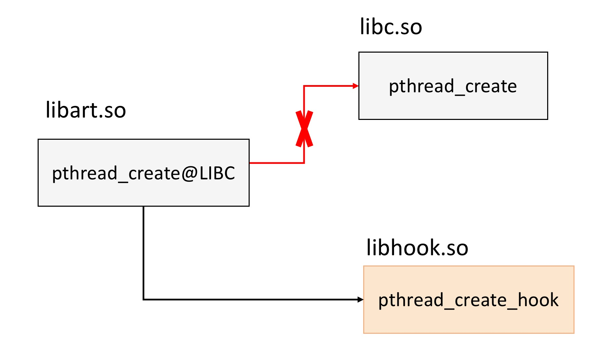

你可以发现，GOT/PLT Hook主要是用于替换某个SO的外部调用，通过将外部函数调用跳转成我们的目标函数。GOT/PLT Hook可以说是一个非常经典的Hook方法，它非常稳定，可以达到部署到生产环境的标准。

那GOT/PLT Hook的实现原理究竟是什么呢？你需要先对SO库文件的ELF文件格式和动态链接过程有所了解。

<strong>ELF格式</strong>

ELF（Executableand Linking Format）是可执行和链接格式，它是一个开放标准，各种UNIX系统的可执行文件大多采用ELF格式。虽然ELF文件本身就支持三种不同的类型（重定位、执行、共享），不同的视图下格式稍微不同，不过它有一个统一的结构，这个结构如下图所示。

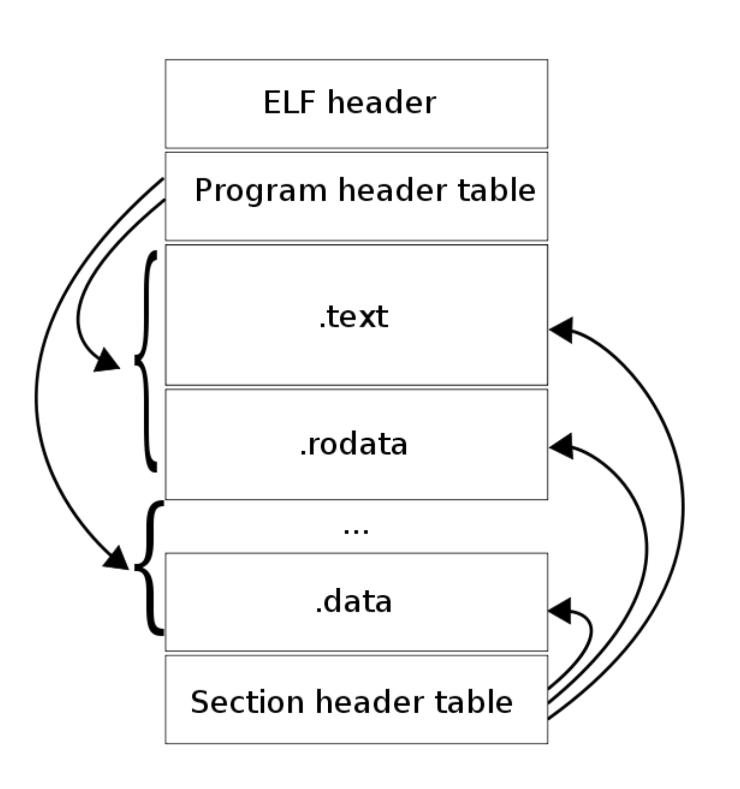

网上介绍ELF格式的文章非常多，你可以参考<a href="https://felixzhang00.github.io/2016/12/24/2016-12-24-ELF%E6%96%87%E4%BB%B6%E8%A3%85%E8%BD%BD%E9%93%BE%E6%8E%A5%E8%BF%87%E7%A8%8B%E5%8F%8Ahook%E5%8E%9F%E7%90%86/" target="_blank">《ELF文件格式解析》</a>。顾名思义，对于GOT/PLT Hook来说，我们主要关心“.plt”和“.got”这两个节区：

<ul>
<li>
<strong>.plt</strong>。该节保存过程链接表（Procedure Linkage Table）。
</li>

<li>
<strong>.got</strong>。该节保存着全局的偏移量表。
</li>
</ul>

我们也可以使用<code>readelf -S</code>来查看ELF文件的具体信息。

<strong>链接过程</strong>

接下来我们再来看看动态链接的过程，当需要使用一个Native库（.so文件）的时候，我们需要调用<code>dlopen(&quot;libname.so&quot;)</code>来加载这个库。

在我们调用了<code>dlopen(&quot;libname.so&quot;)</code>之后，系统首先会检查缓存中已加载的ELF文件列表。如果未加载则执行加载过程，如果已加载则计数加一，忽略该调用。然后系统会用从libname.so的<code>dynamic</code>节区中读取其所依赖的库，按照相同的加载逻辑，把未在缓存中的库加入加载列表。

你可以使用下面这个命令来查看一个库的依赖：

<pre><code>readelf -d &lt;library&gt; | grep NEEDED
</code></pre>

下面我们大概了解一下系统是如何加载的ELF文件的。

<ul>
<li>
读ELF的程序头部表，把所有PT_LOAD的节区mmap到内存中。
</li>

<li>
从“.dynamic”中读取各信息项，计算并保存所有节区的虚拟地址，然后执行重定位操作。
</li>

<li>
最后ELF加载成功，引用计数加一。
</li>
</ul>

但是这里有一个关键点，在ELF文件格式中我们只有函数的绝对地址。如果想在系统中运行，这里需要经过<strong>重定位</strong>。这其实是一个比较复杂的问题，因为不同机器的CPU架构、加载顺序不同，导致我们只能在运行时计算出这个值。不过还好动态加载器（/system/bin/linker）会帮助我们解决这个问题。

如果你理解了动态链接的过程，我们再回头来思考一下“.got”和“.plt”它们的具体含义。

<ul>
<li>
<strong>The Global Offset Table (GOT)</strong>。简单来说就是在数据段的地址表，假定我们有一些代码段的指令引用一些地址变量，编译器会引用GOT表来替代直接引用绝对地址，因为绝对地址在编译期是无法知道的，只有重定位后才会得到 ，GOT自己本身将会包含函数引用的绝对地址。
</li>

<li>
<strong>The Procedure Linkage Table (PLT)</strong>。PLT不同于GOT，它位于代码段，动态库的每一个外部函数都会在PLT中有一条记录，每一条PLT记录都是一小段可执行代码。 一般来说，外部代码都是在调用PLT表里的记录，然后PLT的相应记录会负责调用实际的函数。我们一般把这种设定叫作“<a href="https://en.wikipedia.org/wiki/Trampoline_%28computing%29" target="_blank">蹦床</a>”（Trampoline）。
</li>
</ul>

PLT和GOT记录是一一对应的，并且GOT表第一次解析后会包含调用函数的实际地址。既然这样，那PLT的意义究竟是什么呢？PLT从某种意义上赋予我们一种懒加载的能力。当动态库首次被加载时，所有的函数地址并没有被解析。下面让我们结合图来具体分析一下首次函数调用，请注意图中黑色箭头为跳转，紫色为指针。

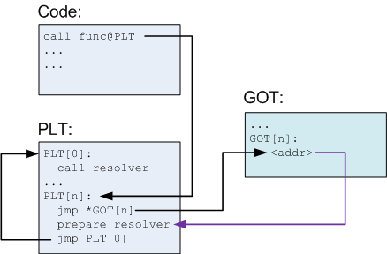

<ul>
<li>
我们在代码中调用func，编译器会把这个转化为func@plt，并在PLT表插入一条记录。
</li>

<li>
PLT表中第一条（或者说第0条）PLT[0]是一条特殊记录，它是用来帮助我们解析地址的。通常在类Linux系统，这个的实现会位于动态加载器，就是专栏前面文章提到的/system/bin/linker。
</li>

<li>
其余的PLT记录都均包含以下信息：

<ul>
<li>
跳转GOT表的指令（jmp *GOT[n]）。
</li>

<li>
为上面提到的第0条解析地址函数准备参数。
</li>

<li>
调用PLT[0]，这里resovler的实际地址是存储在GOT[2] 。
</li>
</ul></li>

<li>
在解析前GOT[n]会直接指向jmp *GOT[n]的下一条指令。在解析完成后，我们就得到了func的实际地址，动态加载器会将这个地址填入GOT[n]，然后调用func。
</li>
</ul>

如果对上面的这个调用流程还有疑问，你可以参考<a href="https://www.jianshu.com/p/0ac63c3744dd" target="_blank">《GOT表和PLT表》</a>这篇文章，它里面有一张图非常清晰。

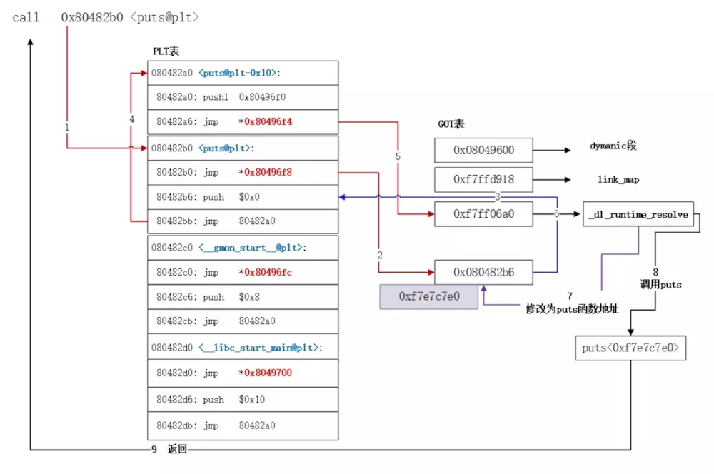

当第一次调用发生后，之后再调用函数func就高效简单很多。首先调用PLT[n]，然后执行jmp *GOT[n]。GOT[n]直接指向func，这样就高效的完成了函数调用。

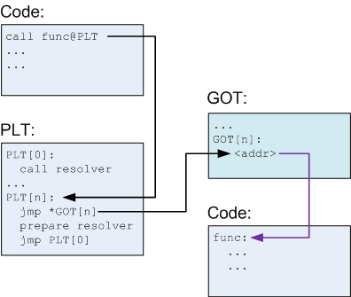

总结一下，因为很多函数可能在程序执行完时都不会被用到，比如错误处理函数或一些用户很少用到的功能模块等，那么一开始把所有函数都链接好实际就是一种浪费。为了提升动态链接的性能，我们可以使用PLT来实现延迟绑定的功能。

对于函数运行的实际地址，我们依然需要通过GOT表得到，整个简化过程如下：

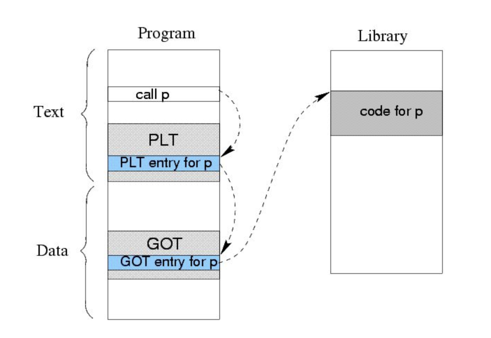

看到这里，相信你已经有了如何Hack这一过程的初步想法。这里业界通常会根据修改PLT记录或者GOT记录区分为GOT Hook和PLT Hook，但其本质原理十分接近。

<strong>GOT/PLT Hook实践</strong>

GOT/PLT Hook看似简单，但是实现起来也是有一些坑的，需要考虑兼容性的情况。一般来说，推荐使用业界的成熟方案。

<ul>
<li>
微信Matrix开源库的<a href="https://github.com/Tencent/matrix/tree/master/matrix/matrix-android/matrix-android-commons/src/main/cpp/elf_hook" target="_blank">ELF Hook</a>，它使用的是GOT Hook，主要使用它来做性能监控。
</li>

<li>
爱奇艺开源的的<a href="https://github.com/iqiyi/xHook" target="_blank">xHook</a>，它使用的也是GOT Hook。
</li>

<li>
Facebook的<a href="https://github.com/facebookincubator/profilo/tree/master/deps/plthooks" target="_blank">PLT Hook</a>。
</li>
</ul>

如果不想深入它内部的原理，我们只需要直接使用这些开源的优秀方案就可以了。因为这种Hook方式非常成熟稳定，除了Hook线程的创建，我们还有很多其他的使用范例。

<ul>
<li>
“I/O优化”中使用<a href="https://github.com/Tencent/matrix/tree/master/matrix/matrix-android/matrix-io-canary" target="_blank">matrix-io-canary</a> Hook文件的操作。
</li>

<li>
“网络优化”中使用Hook了Socket的相关操作，具体你可以参考<a href="https://github.com/AndroidAdvanceWithGeektime/Chapter17" target="_blank">Chapter17</a>。
</li>
</ul>

这种Hook方法也不是万能的，因为它只能替换导入函数的方式。有时候我们不一定可以找到这样的外部调用函数。如果想Hook函数的内部调用，这个时候就需要用到我们的Trap Hook或者Inline Hook了。

<strong>2. Trap Hook</strong>

对于函数内部的Hook，你可以先从头想一下，会发现调试器就具备一切Hook框架具有的能力，可以在目标函数前断住程序，修改内存、程序段，继续执行。相信很多同学都会使用调试器，但是对调试器如何工作却知之甚少。下面让我们先了解一下软件调试器是如何工作的。

<strong>ptrace</strong>

一般软件调试器都是通过ptrace系统调用和SIGTRAP配合来进行断点调试，首先我们来了解一下什么是ptrace，它又是如何断住程序运行，然后修改相关执行步骤的。

所谓合格的底层程序员，对于未知知识的了解，第一步就是使用<code>man</code>命令来查看系统文档。

<blockquote>

The ptrace() system call provides a means by which one process (the “tracer”) may observe and control the execution of another process (the “tracee”), and examine and change the tracee’s memory and registers. It is primarily used to implement breakpoint debugging and system call tracing.

</blockquote>

这段话直译过来就是，ptrace提供了一种让一个程序（tracer）观察或者控制另一个程序（tracee）执行流程，以及修改被控制程序内存和寄存器的方法，主要用于实现调试断点和系统调用跟踪。

我们再来简单了解一下调试器（GDB/LLDB）是如何使用ptrace的。首先调试器会基于要调试进程是否已启动，来决定是使用fork或者attach到目标进程。当调试器与目标程序绑定后，目标程序的任何signal（除SIGKILL）都会被调试器做先拦截，调试器会有机会对相关信号进行处理，然后再把执行权限交由目标程序继续执行。可以你已经想到了，这其实已经达到了Hook的目的。

<strong>如何Hook</strong>

但更进一步思考，如果我们不需要修改内存或者做类似调试器一样复杂的交互，我们完全可以不依赖ptrace，只需要接收相关signal即可。这时我们就想到了句柄（signal handler）。对！我们完全可以主动raise signal，然后使用signal handler来实现类似的Hook效果。

业界也有不少人将Trap Hook叫作断点Hook，它的原理就是在需要Hook的地方想办法触发断点，并捕获异常。一般我们会利用SIGTRAP或者SIGKILL（非法指令异常）这两种信号。下面以SIGTRAP信号为例，具体的实现步骤如下。

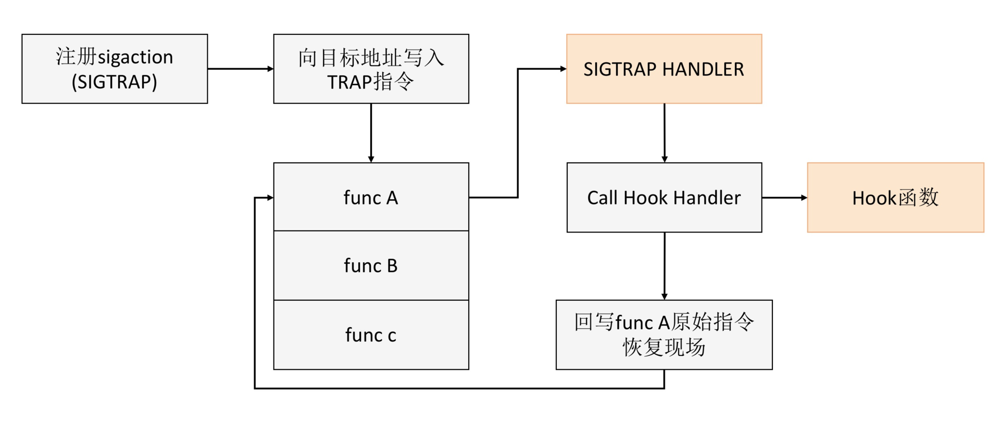

<ul>
<li>
注册信号接收句柄（signal handler），不同的体系结构可能会选取不同的信号，我们这里用SIGTRAP。
</li>

<li>
在我们需要Hook得部分插入Trap指令。
</li>

<li>
系统调用Trap指令，进入内核模式，调用我们已经在开始注册好的信号接收句柄（signal handler）。
</li>

<li>
执行我们信号接收句柄（signal handler），这里需要注意，所有在信号接收句柄（signal handler）执行的代码需要保证<a href="http://man7.org/linux/man-pages/man7/signal-safety.7.html" target="_blank">async-signal-safe</a>。这里我们可以简单的只把信号接收句柄当作蹦床，使用logjmp跳出这个需要async-signal-safe（正如我在“崩溃分析”所说的，部分函数在signal回调中使用并不安全）的环境，然后再执行我们Hook的代码。
</li>

<li>
在执行完Hook的函数后，我们需要恢复现场。这里如果我们想继续调用原来的函数A，那直接回写函数A的原始指令并恢复寄存器状态。
</li>
</ul>

<strong>Trap Hook实践</strong>

Trap Hook兼容性非常好，它也可以在生产环境中大规模使用。但是它最大的问题是效率比较低，不适合Hook非常频繁调用的函数。

对于Trap Hook的实践方案，在“<a href="https://time.geekbang.org/column/article/72642" target="_blank">卡顿优化（下）</a>”中，我提到过Facebook的<a href="https://github.com/facebookincubator/profilo" target="_blank">Profilo</a>，它就是通过定期发送SIGPROF信号来实现卡顿监控的。

<strong>3. Inline Hook</strong>

跟Trap Hook一样，Inline Hook也是函数内部调用的Hook。它直接将函数开始（Prologue）处的指令更替为跳转指令，使得原函数直接跳转到Hook的目标函数函数，并保留原函数的调用接口以完成后续再调用回来的目的。

与GOT/PLT Hook相比，Inline Hook可以不受GOT/PLT表的限制，几乎可以Hook任何函数。不过其实现十分复杂，我至今没有见过可以用在生产环境的实现。并且在ARM体系结构下，无法对叶子函数和很短的函数进行Hook。

在深入“邪恶的”细节前，我们需要先对Inline Hook的大体流程有一个简单的了解。

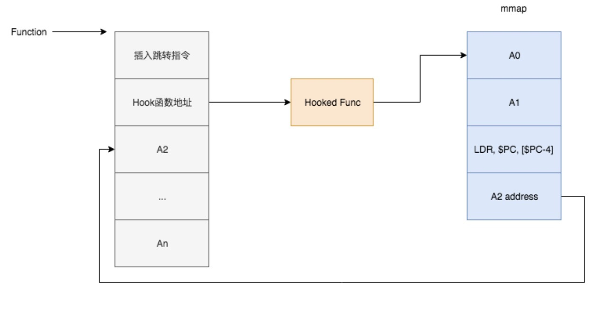

如图所示，Inline Hook的基本思路就是在已有的代码段中插入跳转指令，把代码的执行流程转向我们实现的Hook函数中，然后再进行指令修复，并跳转回原函数继续执行。这段描述看起来是不是十分简单而且清晰？

对于Trap Hook，我们只需要在目标地址前插入特殊指令，并且在执行结束后把原始指令写回去就可以了。但是对Inline Hook来说，它是直接进行指令级的复写与修复。怎么理解呢？就相当于我们在运行过程中要去做ASM的字节码修改。

当然Inline Hook远远比ASM操作更加复杂，因为它还涉及不同CPU架构带来的指令集适配问题，我们需要根据不同指令集来分别进行指令复写与跳转。

下面我先来简单说明一下Android常见的CPU架构和指令集：

<ul>
<li>
<strong>x86和MIPS架构</strong>。这两个架构已经基本没有多少用户了，我们可以直接忽视。一般来说我们只关心主流的ARM体系架构就可以了。
</li>

<li>
<strong>ARMv5和ARMv7架构</strong>。它的指令集分为4字节对齐的定长的ARM指令集和2字节对齐的变长Thumb/Thumb-2指令集。Thumb-2指令集虽为2字节对齐，但指令集本身有16位也有32位。其中ARMv5使用的是16位的Thumb16，在ARMv7使用的是32位的Thumb32。<strong>不过目前ARMv5也基本没有多少用户了，我们也可以放弃Thumb16指令集的适配</strong>。
</li>

<li>
<strong>ARMv8架构</strong>。64位的ARMv8架构可以兼容运行32位，所以它在ARM32和Thumb32指令集的基础上，增加了ARM64指令集。关于它们具体差异，你可以查看<a href="http://infocenter.arm.com/help/index.jsp?topic=/com.arm.doc.dui0801b/IBAIEGDJ.html" target="_blank">ARM的官方文档</a>。
</li>
</ul>

ARM64目前我还没有适配，不过Google Play要求所有应用在2019年8月1日之前需要支持64位，所以今年上半年也要折腾一下。但它们的原理基本类似，下面我以最主流的ARMv7架构为例，为你庖丁解牛Inline Hook。

<strong>ARM32指令集</strong>

ARMv7中有一种广为流传的<code>$PC=$PC+8</code>的说法。这是指ARMv7中的三级流水线（取指、解码、执行），换句话说<code>$PC</code>寄存器总是指向正在取指的指令，而不是指向正在执行的指令。取指总会比执行快2个指令，在ARM32指令集下2个指令的长度为8个字节，所以<code>$PC</code>寄存器的值总是比当前指令地址要大8。

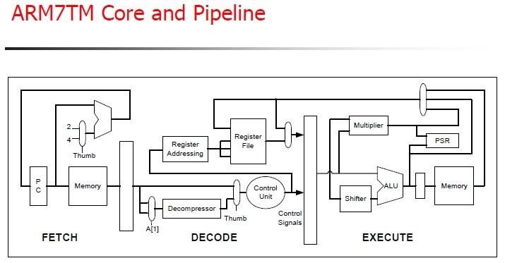

是不是感觉有些复杂，其实这是为了引出ARM指令集的常用跳转方法：

<pre><code>LDR PC, [PC, #-4] ;0xE51FF004
$TRAMPOLIN_ADDR
</code></pre>

在了解了三级流水线以后，就不会对这个PC-4有什么疑惑了。

按照我们前面描述的Inline Hook的基本步骤，首先插入跳转指令，跳入我们的蹦床（Trampoline），执行我们实现的Hook后函数。这里还有一个“邪恶的”细节，由于指令执行是依赖当前运行环境的，即所有寄存器的值，而我们插入新的指令是有可能更改寄存器的状态的，所以我们要保存当前全部的寄存器状态到栈中，使用BLX指令跳转执行Hook后函数，执行完成后，再从栈中恢复所有的寄存器，最后才能像未Hook一样继续执行原先函数。

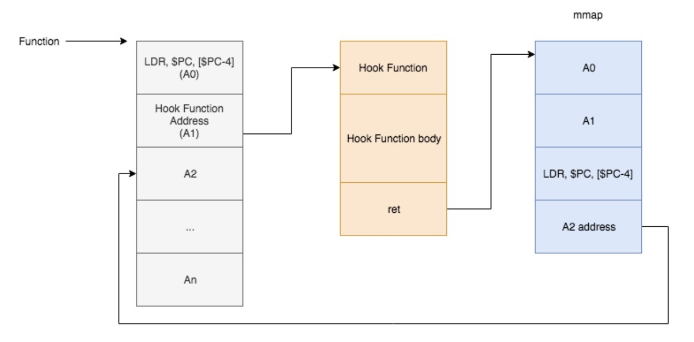

在执行完Hook后的函数后，我们需要跳转回原先的函数继续执行。这里不要忘记我们在一开始覆盖的LDR指令，我们需要先执行被我们复写的指令，然后再使用如下指令，继续执行原先函数。

<pre><code>LDR PC, [PC, #-4]
HOOKED_ADDR+8
</code></pre>

是不是有一种大功告成的感觉？其实这里还有一个巨大的坑在等着我们，那就是<strong>指令修复</strong>。前面我提到保存并恢复了寄存器原有的状态，已达到可以继续像原有程序一样的继续执行。但仅仅是恢复寄存器就足够么？显然答案是否定的，虽然寄存器被我们完美恢复了，但是2条备份的指令被移动到了新的地址。当执行它们的时候，<code>$PC</code>寄存器的值是与原先不同的。这条指令的操作如果涉及<code>$PC</code>的值，那么它们将会执行出完全不同的结果。

到这里我就不对指令修复再深入解析了，感兴趣的同学可以在留言区进行讨论。

<strong>Inline Hook实践</strong>

对于Inline Hook，虽然它功能非常强大，而且执行效率也很高，但是业界目前还没有一套完全稳定可靠的开源方案。Inline Hook一般会使用在自动化测试或者线上疑难问题的定位，例如“UI优化”中说到libhwui.so崩溃问题的定位，我们就是利用Inline Hook去收集系统信息。

业界也有一些不错的参考方案：

<ul>
<li>
<a href="http://www.cydiasubstrate.com/" target="_blank">Cydia Substrate</a>。在<a href="https://github.com/AndroidAdvanceWithGeektime/Chapter03" target="_blank">Chapter3</a>中，我们就使用它来Hook系统的内存分配函数。
</li>

<li>
<a href="https://github.com/crmulliner/adbi" target="_blank">adbi</a>。支付宝在<a href="https://juejin.im/post/5be1077d518825171140dbfa" target="_blank">GC抑制</a>中使用的Hook框架，不过已经好几年没有更新了。
</li>
</ul>

<h2 id="各个流派的优缺点比较">各个流派的优缺点比较</h2>

最后我们再来总结一下不同的Hook方式的优缺点：

1.GOT/PLT Hook是一个比较中庸的方案，有较好的性能，中等的实现难度，但其只能Hook动态库之间的调用的函数，并且无法Hook未导出的私有函数，而且只存在安装与卸载2种状态，一旦安装就会Hook所有函数调用。

2.Trap Hook最为稳定，但由于需要切换运行模式（R0/R3），且依赖内核的信号机制，导致性能很差。

3.Inline Hook是一个非常激进的方案，有很好的性能，并且也没有PLT作用域的限制，可以说是一个非常灵活、完美的方案。但其实现难度极高，我至今也没有看到可以部署在生产环境的Inline Hook方案，因为涉及指令修复，需要编译器的各种优化。

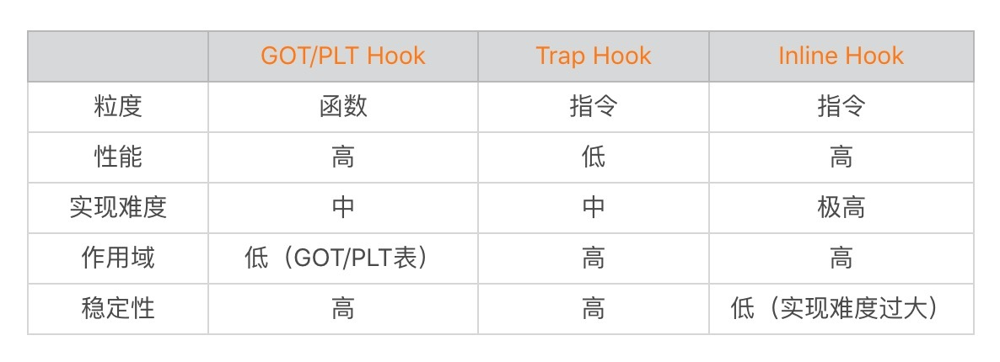

但是需要注意，无论是哪一种Hook都只能Hook到应用自身的进程，我们无法替换系统或其他应用进程的函数执行。

<h2 id="总结">总结</h2>

总的来说Native Hook是一门非常底层的技术，它会涉及库文件编译、加载、链接等方方面面的知识，而且很多底层知识是与Android甚至移动平台无关的。

在这一领域，做安全的同学可能会更有发言权，我来讲可能班门弄斧了。不过希望通过这篇文章，让你对看似黑科技的Hook有一个大体的了解，希望可以在自己的平时的工作中使用Hook来完成一些看似不可能的任务，比如修复系统Bug、线上监控Native内存分配等。

<h2 id="课后作业">课后作业</h2>

今天的信息量是不是有点大？关于Native Hook，你对它有什么看法，还有哪些疑问？欢迎留言跟我和其他同学一起讨论。

Native Hook技术的确非常复杂，即使我们不懂得它的内部原理，我们也应该学会使用成熟的开源框架去实现一些功能。当然对于想进一步深入研究的同学，推荐你学习下面这些资料。

<ul>
<li>
<a href="https://docs.oracle.com/cd/E37934_01/pdf/E36754.pdf" target="_blank">链接程序和库指南</a>
</li>

<li>
<a href="https://item.jd.com/10067200.html" target="_blank">程序员的自我修养：链接、装载与库</a>
</li>

<li>
<a href="https://item.jd.com/42971729145.html" target="_blank">链接器和加载器 Linkers and Loaders</a>
</li>

<li>
<a href="https://item.jd.com/12240585.html" target="_blank">Linux二进制分析 Learning Linux Binary Analysis</a>
</li>
</ul>

如果你对调试器的研究也非常有兴趣，强烈推荐<a href="https://eli.thegreenplace.net/" target="_blank">Eli Bendersky</a>写的博客，里面有一系列非常优秀的底层知识文章。其中一些关于debugger的，感兴趣的同学可以去阅读，并亲手实现一个简单的调试器。

<ul>
<li>
<a href="https://eli.thegreenplace.net/2011/01/23/how-debuggers-work-part-1" target="_blank">how-debuggers-work-part-1</a>
</li>

<li>
<a href="https://eli.thegreenplace.net/2011/01/27/how-debuggers-work-part-2-breakpoints" target="_blank">how-debuggers-work-part-2-breakpoints</a>
</li>

<li>
<a href="https://eli.thegreenplace.net/2011/02/07/how-debuggers-work-part-3-debugging-information" target="_blank">how-debuggers-work-part-3-debugging-information</a>
</li>
</ul>

欢迎你点击“请朋友读”，把今天的内容分享给好友，邀请他一起学习。最后别忘了在评论区提交今天的作业，我也为认真完成作业的同学准备了丰厚的“学习加油礼包”，期待与你一起切磋进步哦。

                        

                        

                            

                            

                            

                            

                        

                    

                

            

            

                

                
© 2019 - 2023 <a href="/cdn-cgi/l/email-protection#d1bdbdbde8e5e0e0e1e691b6bcb0b8bdffb2bebc" target="_blank">Liangliang Lee</a>.
                    Powered by <a href="https://github.com/gin-gonic/gin" target="_blank">gin</a> and <a
                        href="https://github.com/kaiiiz/hexo-theme-book" target="_blank">hexo-theme-book</a>.

            

        

        
    

</body>

</html>