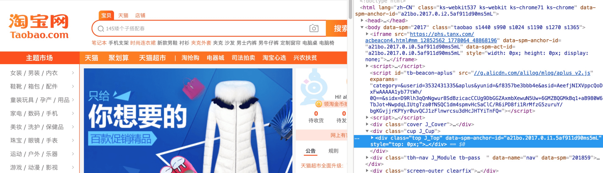
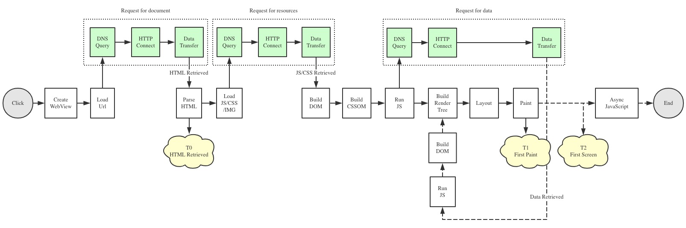
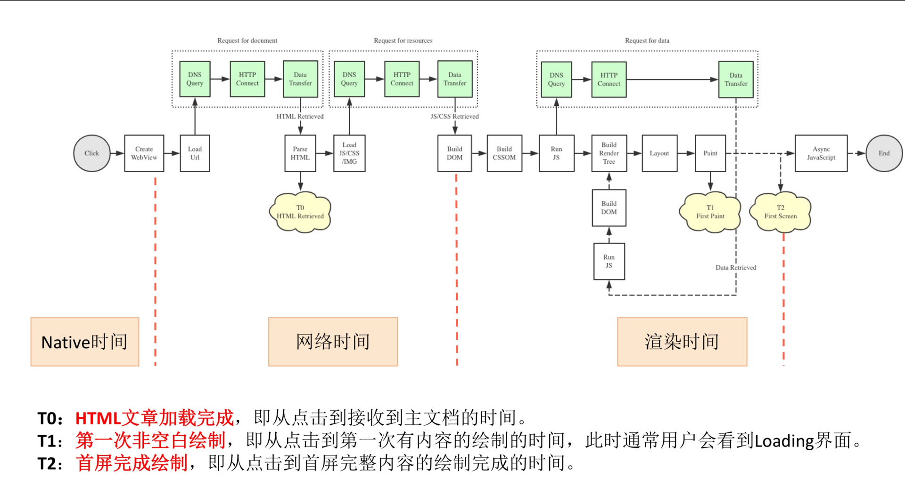
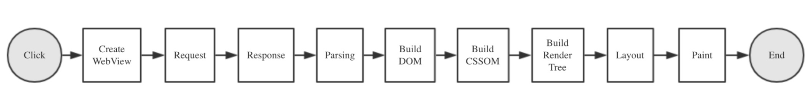
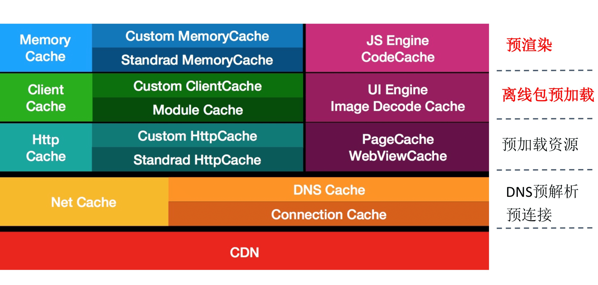
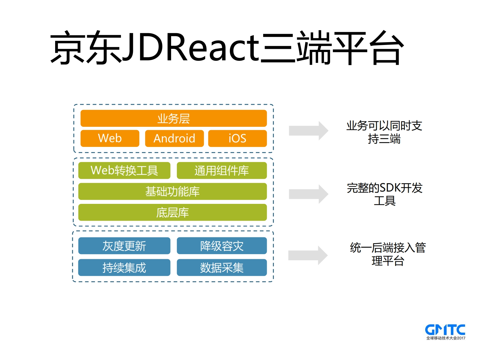
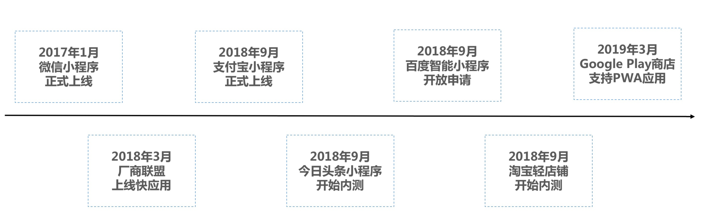
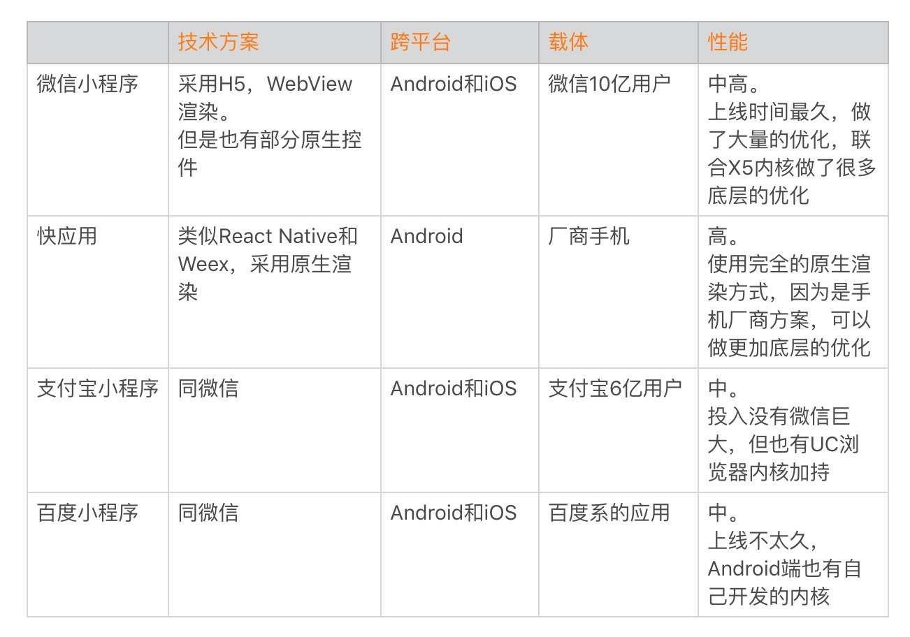
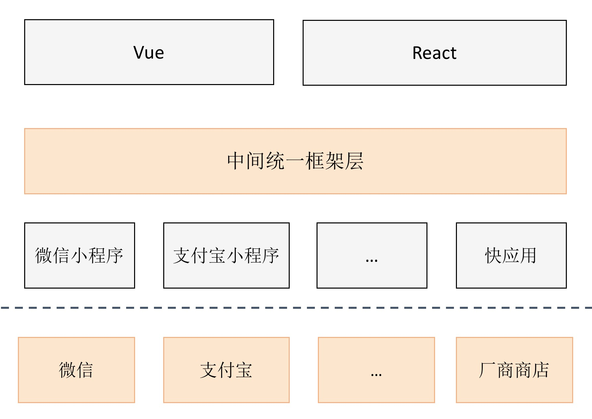
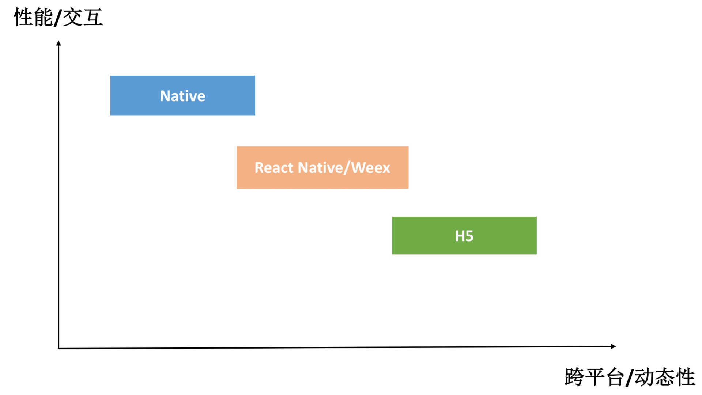

<!DOCTYPE html>
<html xmlns="http://www.w3.org/1999/xhtml">

<head>

    <head>
        <meta http-equiv="Content-Type" content="text/html; charset=UTF-8">
        <meta name="viewport" content="width=device-width, initial-scale=1, maximum-scale=1.0, user-scalable=no">
        <meta http-equiv='content-language' content='zh-cn'>
        <meta name='description' content=36&#32;跨平台开发的现状与应用>
        <link rel="icon" href="/static/favicon.png">
        <title>36 跨平台开发的现状与应用 </title>
        
        <link rel="stylesheet" href="/static/index.css">
        <link rel="stylesheet" href="/static/highlight.min.css">
        
        
        <meta name="generator" content="Hexo 4.2.0">
        
    </head>

<body>
    

        

            

                <a href="/">
                    
                    技术文章摘抄
                </a>
            

            

                <ul class="uncollapsible">
                    <li><a href="/" class="current-tab">首页</a></li>
                    <li><a href="../">上一级</a></li>
                </ul>
                <ul class="uncollapsible">
                    
                    <li>
                        <a class="menu-item" id="00 导读 如何打造高质量的应用？.md" href="/%e4%b8%93%e6%a0%8f/Android%e5%bc%80%e5%8f%91%e9%ab%98%e6%89%8b%e8%af%be/00%20%e5%af%bc%e8%af%bb%20%e5%a6%82%e4%bd%95%e6%89%93%e9%80%a0%e9%ab%98%e8%b4%a8%e9%87%8f%e7%9a%84%e5%ba%94%e7%94%a8%ef%bc%9f.md">00 导读 如何打造高质量的应用？.md</a>
                    </li>
                    
                    <li>
                        <a class="menu-item" id="00 开篇词 焦虑的移动开发者该如何破局？.md" href="/%e4%b8%93%e6%a0%8f/Android%e5%bc%80%e5%8f%91%e9%ab%98%e6%89%8b%e8%af%be/00%20%e5%bc%80%e7%af%87%e8%af%8d%20%e7%84%a6%e8%99%91%e7%9a%84%e7%a7%bb%e5%8a%a8%e5%bc%80%e5%8f%91%e8%80%85%e8%af%a5%e5%a6%82%e4%bd%95%e7%a0%b4%e5%b1%80%ef%bc%9f.md">00 开篇词 焦虑的移动开发者该如何破局？.md</a>
                    </li>
                    
                    <li>
                        <a class="menu-item" id="01 崩溃优化（上）：关于“崩溃”那些事儿.md" href="/%e4%b8%93%e6%a0%8f/Android%e5%bc%80%e5%8f%91%e9%ab%98%e6%89%8b%e8%af%be/01%20%e5%b4%a9%e6%ba%83%e4%bc%98%e5%8c%96%ef%bc%88%e4%b8%8a%ef%bc%89%ef%bc%9a%e5%85%b3%e4%ba%8e%e2%80%9c%e5%b4%a9%e6%ba%83%e2%80%9d%e9%82%a3%e4%ba%9b%e4%ba%8b%e5%84%bf.md">01 崩溃优化（上）：关于“崩溃”那些事儿.md</a>
                    </li>
                    
                    <li>
                        <a class="menu-item" id="02 崩溃优化（下）：应用崩溃了，你应该如何去分析？.md" href="/%e4%b8%93%e6%a0%8f/Android%e5%bc%80%e5%8f%91%e9%ab%98%e6%89%8b%e8%af%be/02%20%e5%b4%a9%e6%ba%83%e4%bc%98%e5%8c%96%ef%bc%88%e4%b8%8b%ef%bc%89%ef%bc%9a%e5%ba%94%e7%94%a8%e5%b4%a9%e6%ba%83%e4%ba%86%ef%bc%8c%e4%bd%a0%e5%ba%94%e8%af%a5%e5%a6%82%e4%bd%95%e5%8e%bb%e5%88%86%e6%9e%90%ef%bc%9f.md">02 崩溃优化（下）：应用崩溃了，你应该如何去分析？.md</a>
                    </li>
                    
                    <li>
                        <a class="menu-item" id="03 内存优化（上）：4GB内存时代，再谈内存优化.md" href="/%e4%b8%93%e6%a0%8f/Android%e5%bc%80%e5%8f%91%e9%ab%98%e6%89%8b%e8%af%be/03%20%e5%86%85%e5%ad%98%e4%bc%98%e5%8c%96%ef%bc%88%e4%b8%8a%ef%bc%89%ef%bc%9a4GB%e5%86%85%e5%ad%98%e6%97%b6%e4%bb%a3%ef%bc%8c%e5%86%8d%e8%b0%88%e5%86%85%e5%ad%98%e4%bc%98%e5%8c%96.md">03 内存优化（上）：4GB内存时代，再谈内存优化.md</a>
                    </li>
                    
                    <li>
                        <a class="menu-item" id="04 内存优化（下）：内存优化这件事，应该从哪里着手？.md" href="/%e4%b8%93%e6%a0%8f/Android%e5%bc%80%e5%8f%91%e9%ab%98%e6%89%8b%e8%af%be/04%20%e5%86%85%e5%ad%98%e4%bc%98%e5%8c%96%ef%bc%88%e4%b8%8b%ef%bc%89%ef%bc%9a%e5%86%85%e5%ad%98%e4%bc%98%e5%8c%96%e8%bf%99%e4%bb%b6%e4%ba%8b%ef%bc%8c%e5%ba%94%e8%af%a5%e4%bb%8e%e5%93%aa%e9%87%8c%e7%9d%80%e6%89%8b%ef%bc%9f.md">04 内存优化（下）：内存优化这件事，应该从哪里着手？.md</a>
                    </li>
                    
                    <li>
                        <a class="menu-item" id="05 卡顿优化（上）：你要掌握的卡顿分析方法.md" href="/%e4%b8%93%e6%a0%8f/Android%e5%bc%80%e5%8f%91%e9%ab%98%e6%89%8b%e8%af%be/05%20%e5%8d%a1%e9%a1%bf%e4%bc%98%e5%8c%96%ef%bc%88%e4%b8%8a%ef%bc%89%ef%bc%9a%e4%bd%a0%e8%a6%81%e6%8e%8c%e6%8f%a1%e7%9a%84%e5%8d%a1%e9%a1%bf%e5%88%86%e6%9e%90%e6%96%b9%e6%b3%95.md">05 卡顿优化（上）：你要掌握的卡顿分析方法.md</a>
                    </li>
                    
                    <li>
                        <a class="menu-item" id="06 卡顿优化（下）：如何监控应用卡顿？.md" href="/%e4%b8%93%e6%a0%8f/Android%e5%bc%80%e5%8f%91%e9%ab%98%e6%89%8b%e8%af%be/06%20%e5%8d%a1%e9%a1%bf%e4%bc%98%e5%8c%96%ef%bc%88%e4%b8%8b%ef%bc%89%ef%bc%9a%e5%a6%82%e4%bd%95%e7%9b%91%e6%8e%a7%e5%ba%94%e7%94%a8%e5%8d%a1%e9%a1%bf%ef%bc%9f.md">06 卡顿优化（下）：如何监控应用卡顿？.md</a>
                    </li>
                    
                    <li>
                        <a class="menu-item" id="06补充篇 卡顿优化：卡顿现场与卡顿分析.md" href="/%e4%b8%93%e6%a0%8f/Android%e5%bc%80%e5%8f%91%e9%ab%98%e6%89%8b%e8%af%be/06%e8%a1%a5%e5%85%85%e7%af%87%20%e5%8d%a1%e9%a1%bf%e4%bc%98%e5%8c%96%ef%bc%9a%e5%8d%a1%e9%a1%bf%e7%8e%b0%e5%9c%ba%e4%b8%8e%e5%8d%a1%e9%a1%bf%e5%88%86%e6%9e%90.md">06补充篇 卡顿优化：卡顿现场与卡顿分析.md</a>
                    </li>
                    
                    <li>
                        <a class="menu-item" id="07 启动优化（上）：从启动过程看启动速度优化.md" href="/%e4%b8%93%e6%a0%8f/Android%e5%bc%80%e5%8f%91%e9%ab%98%e6%89%8b%e8%af%be/07%20%e5%90%af%e5%8a%a8%e4%bc%98%e5%8c%96%ef%bc%88%e4%b8%8a%ef%bc%89%ef%bc%9a%e4%bb%8e%e5%90%af%e5%8a%a8%e8%bf%87%e7%a8%8b%e7%9c%8b%e5%90%af%e5%8a%a8%e9%80%9f%e5%ba%a6%e4%bc%98%e5%8c%96.md">07 启动优化（上）：从启动过程看启动速度优化.md</a>
                    </li>
                    
                    <li>
                        <a class="menu-item" id="08 启动优化（下）：优化启动速度的进阶方法.md" href="/%e4%b8%93%e6%a0%8f/Android%e5%bc%80%e5%8f%91%e9%ab%98%e6%89%8b%e8%af%be/08%20%e5%90%af%e5%8a%a8%e4%bc%98%e5%8c%96%ef%bc%88%e4%b8%8b%ef%bc%89%ef%bc%9a%e4%bc%98%e5%8c%96%e5%90%af%e5%8a%a8%e9%80%9f%e5%ba%a6%e7%9a%84%e8%bf%9b%e9%98%b6%e6%96%b9%e6%b3%95.md">08 启动优化（下）：优化启动速度的进阶方法.md</a>
                    </li>
                    
                    <li>
                        <a class="menu-item" id="09 I_O优化（上）：开发工程师必备的I_O优化知识.md" href="/%e4%b8%93%e6%a0%8f/Android%e5%bc%80%e5%8f%91%e9%ab%98%e6%89%8b%e8%af%be/09%20I_O%e4%bc%98%e5%8c%96%ef%bc%88%e4%b8%8a%ef%bc%89%ef%bc%9a%e5%bc%80%e5%8f%91%e5%b7%a5%e7%a8%8b%e5%b8%88%e5%bf%85%e5%a4%87%e7%9a%84I_O%e4%bc%98%e5%8c%96%e7%9f%a5%e8%af%86.md">09 I_O优化（上）：开发工程师必备的I_O优化知识.md</a>
                    </li>
                    
                    <li>
                        <a class="menu-item" id="10 I_O优化（中）：不同I_O方式的使用场景是什么？.md" href="/%e4%b8%93%e6%a0%8f/Android%e5%bc%80%e5%8f%91%e9%ab%98%e6%89%8b%e8%af%be/10%20I_O%e4%bc%98%e5%8c%96%ef%bc%88%e4%b8%ad%ef%bc%89%ef%bc%9a%e4%b8%8d%e5%90%8cI_O%e6%96%b9%e5%bc%8f%e7%9a%84%e4%bd%bf%e7%94%a8%e5%9c%ba%e6%99%af%e6%98%af%e4%bb%80%e4%b9%88%ef%bc%9f.md">10 I_O优化（中）：不同I_O方式的使用场景是什么？.md</a>
                    </li>
                    
                    <li>
                        <a class="menu-item" id="11 I_O优化（下）：如何监控线上I_O操作？.md" href="/%e4%b8%93%e6%a0%8f/Android%e5%bc%80%e5%8f%91%e9%ab%98%e6%89%8b%e8%af%be/11%20I_O%e4%bc%98%e5%8c%96%ef%bc%88%e4%b8%8b%ef%bc%89%ef%bc%9a%e5%a6%82%e4%bd%95%e7%9b%91%e6%8e%a7%e7%ba%bf%e4%b8%8aI_O%e6%93%8d%e4%bd%9c%ef%bc%9f.md">11 I_O优化（下）：如何监控线上I_O操作？.md</a>
                    </li>
                    
                    <li>
                        <a class="menu-item" id="12 存储优化（上）：常见的数据存储方法有哪些？.md" href="/%e4%b8%93%e6%a0%8f/Android%e5%bc%80%e5%8f%91%e9%ab%98%e6%89%8b%e8%af%be/12%20%e5%ad%98%e5%82%a8%e4%bc%98%e5%8c%96%ef%bc%88%e4%b8%8a%ef%bc%89%ef%bc%9a%e5%b8%b8%e8%a7%81%e7%9a%84%e6%95%b0%e6%8d%ae%e5%ad%98%e5%82%a8%e6%96%b9%e6%b3%95%e6%9c%89%e5%93%aa%e4%ba%9b%ef%bc%9f.md">12 存储优化（上）：常见的数据存储方法有哪些？.md</a>
                    </li>
                    
                    <li>
                        <a class="menu-item" id="13 存储优化（中）：如何优化数据存储？.md" href="/%e4%b8%93%e6%a0%8f/Android%e5%bc%80%e5%8f%91%e9%ab%98%e6%89%8b%e8%af%be/13%20%e5%ad%98%e5%82%a8%e4%bc%98%e5%8c%96%ef%bc%88%e4%b8%ad%ef%bc%89%ef%bc%9a%e5%a6%82%e4%bd%95%e4%bc%98%e5%8c%96%e6%95%b0%e6%8d%ae%e5%ad%98%e5%82%a8%ef%bc%9f.md">13 存储优化（中）：如何优化数据存储？.md</a>
                    </li>
                    
                    <li>
                        <a class="menu-item" id="14 存储优化（下）：数据库SQLite的使用和优化.md" href="/%e4%b8%93%e6%a0%8f/Android%e5%bc%80%e5%8f%91%e9%ab%98%e6%89%8b%e8%af%be/14%20%e5%ad%98%e5%82%a8%e4%bc%98%e5%8c%96%ef%bc%88%e4%b8%8b%ef%bc%89%ef%bc%9a%e6%95%b0%e6%8d%ae%e5%ba%93SQLite%e7%9a%84%e4%bd%bf%e7%94%a8%e5%92%8c%e4%bc%98%e5%8c%96.md">14 存储优化（下）：数据库SQLite的使用和优化.md</a>
                    </li>
                    
                    <li>
                        <a class="menu-item" id="15 网络优化（上）：移动开发工程师必备的网络优化知识.md" href="/%e4%b8%93%e6%a0%8f/Android%e5%bc%80%e5%8f%91%e9%ab%98%e6%89%8b%e8%af%be/15%20%e7%bd%91%e7%bb%9c%e4%bc%98%e5%8c%96%ef%bc%88%e4%b8%8a%ef%bc%89%ef%bc%9a%e7%a7%bb%e5%8a%a8%e5%bc%80%e5%8f%91%e5%b7%a5%e7%a8%8b%e5%b8%88%e5%bf%85%e5%a4%87%e7%9a%84%e7%bd%91%e7%bb%9c%e4%bc%98%e5%8c%96%e7%9f%a5%e8%af%86.md">15 网络优化（上）：移动开发工程师必备的网络优化知识.md</a>
                    </li>
                    
                    <li>
                        <a class="menu-item" id="16 网络优化（中）：复杂多变的移动网络该如何优化？.md" href="/%e4%b8%93%e6%a0%8f/Android%e5%bc%80%e5%8f%91%e9%ab%98%e6%89%8b%e8%af%be/16%20%e7%bd%91%e7%bb%9c%e4%bc%98%e5%8c%96%ef%bc%88%e4%b8%ad%ef%bc%89%ef%bc%9a%e5%a4%8d%e6%9d%82%e5%a4%9a%e5%8f%98%e7%9a%84%e7%a7%bb%e5%8a%a8%e7%bd%91%e7%bb%9c%e8%af%a5%e5%a6%82%e4%bd%95%e4%bc%98%e5%8c%96%ef%bc%9f.md">16 网络优化（中）：复杂多变的移动网络该如何优化？.md</a>
                    </li>
                    
                    <li>
                        <a class="menu-item" id="17 网络优化（下）：大数据下网络该如何监控？.md" href="/%e4%b8%93%e6%a0%8f/Android%e5%bc%80%e5%8f%91%e9%ab%98%e6%89%8b%e8%af%be/17%20%e7%bd%91%e7%bb%9c%e4%bc%98%e5%8c%96%ef%bc%88%e4%b8%8b%ef%bc%89%ef%bc%9a%e5%a4%a7%e6%95%b0%e6%8d%ae%e4%b8%8b%e7%bd%91%e7%bb%9c%e8%af%a5%e5%a6%82%e4%bd%95%e7%9b%91%e6%8e%a7%ef%bc%9f.md">17 网络优化（下）：大数据下网络该如何监控？.md</a>
                    </li>
                    
                    <li>
                        <a class="menu-item" id="18 耗电优化（上）：从电量优化的演进看耗电分析.md" href="/%e4%b8%93%e6%a0%8f/Android%e5%bc%80%e5%8f%91%e9%ab%98%e6%89%8b%e8%af%be/18%20%e8%80%97%e7%94%b5%e4%bc%98%e5%8c%96%ef%bc%88%e4%b8%8a%ef%bc%89%ef%bc%9a%e4%bb%8e%e7%94%b5%e9%87%8f%e4%bc%98%e5%8c%96%e7%9a%84%e6%bc%94%e8%bf%9b%e7%9c%8b%e8%80%97%e7%94%b5%e5%88%86%e6%9e%90.md">18 耗电优化（上）：从电量优化的演进看耗电分析.md</a>
                    </li>
                    
                    <li>
                        <a class="menu-item" id="19 耗电优化（下）：耗电的优化方法与线上监控.md" href="/%e4%b8%93%e6%a0%8f/Android%e5%bc%80%e5%8f%91%e9%ab%98%e6%89%8b%e8%af%be/19%20%e8%80%97%e7%94%b5%e4%bc%98%e5%8c%96%ef%bc%88%e4%b8%8b%ef%bc%89%ef%bc%9a%e8%80%97%e7%94%b5%e7%9a%84%e4%bc%98%e5%8c%96%e6%96%b9%e6%b3%95%e4%b8%8e%e7%ba%bf%e4%b8%8a%e7%9b%91%e6%8e%a7.md">19 耗电优化（下）：耗电的优化方法与线上监控.md</a>
                    </li>
                    
                    <li>
                        <a class="menu-item" id="20 UI 优化（上）：UI 渲染的几个关键概念.md" href="/%e4%b8%93%e6%a0%8f/Android%e5%bc%80%e5%8f%91%e9%ab%98%e6%89%8b%e8%af%be/20%20UI%20%e4%bc%98%e5%8c%96%ef%bc%88%e4%b8%8a%ef%bc%89%ef%bc%9aUI%20%e6%b8%b2%e6%9f%93%e7%9a%84%e5%87%a0%e4%b8%aa%e5%85%b3%e9%94%ae%e6%a6%82%e5%bf%b5.md">20 UI 优化（上）：UI 渲染的几个关键概念.md</a>
                    </li>
                    
                    <li>
                        <a class="menu-item" id="21 UI 优化（下）：如何优化 UI 渲染？.md" href="/%e4%b8%93%e6%a0%8f/Android%e5%bc%80%e5%8f%91%e9%ab%98%e6%89%8b%e8%af%be/21%20UI%20%e4%bc%98%e5%8c%96%ef%bc%88%e4%b8%8b%ef%bc%89%ef%bc%9a%e5%a6%82%e4%bd%95%e4%bc%98%e5%8c%96%20UI%20%e6%b8%b2%e6%9f%93%ef%bc%9f.md">21 UI 优化（下）：如何优化 UI 渲染？.md</a>
                    </li>
                    
                    <li>
                        <a class="menu-item" id="22 包体积优化（上）：如何减少安装包大小？.md" href="/%e4%b8%93%e6%a0%8f/Android%e5%bc%80%e5%8f%91%e9%ab%98%e6%89%8b%e8%af%be/22%20%e5%8c%85%e4%bd%93%e7%a7%af%e4%bc%98%e5%8c%96%ef%bc%88%e4%b8%8a%ef%bc%89%ef%bc%9a%e5%a6%82%e4%bd%95%e5%87%8f%e5%b0%91%e5%ae%89%e8%a3%85%e5%8c%85%e5%a4%a7%e5%b0%8f%ef%bc%9f.md">22 包体积优化（上）：如何减少安装包大小？.md</a>
                    </li>
                    
                    <li>
                        <a class="menu-item" id="23 包体积优化（下）：资源优化的进阶实践.md" href="/%e4%b8%93%e6%a0%8f/Android%e5%bc%80%e5%8f%91%e9%ab%98%e6%89%8b%e8%af%be/23%20%e5%8c%85%e4%bd%93%e7%a7%af%e4%bc%98%e5%8c%96%ef%bc%88%e4%b8%8b%ef%bc%89%ef%bc%9a%e8%b5%84%e6%ba%90%e4%bc%98%e5%8c%96%e7%9a%84%e8%bf%9b%e9%98%b6%e5%ae%9e%e8%b7%b5.md">23 包体积优化（下）：资源优化的进阶实践.md</a>
                    </li>
                    
                    <li>
                        <a class="menu-item" id="24 想成为Android高手，你需要先搞定这三个问题.md" href="/%e4%b8%93%e6%a0%8f/Android%e5%bc%80%e5%8f%91%e9%ab%98%e6%89%8b%e8%af%be/24%20%e6%83%b3%e6%88%90%e4%b8%baAndroid%e9%ab%98%e6%89%8b%ef%bc%8c%e4%bd%a0%e9%9c%80%e8%a6%81%e5%85%88%e6%90%9e%e5%ae%9a%e8%bf%99%e4%b8%89%e4%b8%aa%e9%97%ae%e9%a2%98.md">24 想成为Android高手，你需要先搞定这三个问题.md</a>
                    </li>
                    
                    <li>
                        <a class="menu-item" id="25 如何提升组织与个人的研发效能？.md" href="/%e4%b8%93%e6%a0%8f/Android%e5%bc%80%e5%8f%91%e9%ab%98%e6%89%8b%e8%af%be/25%20%e5%a6%82%e4%bd%95%e6%8f%90%e5%8d%87%e7%bb%84%e7%bb%87%e4%b8%8e%e4%b8%aa%e4%ba%ba%e7%9a%84%e7%a0%94%e5%8f%91%e6%95%88%e8%83%bd%ef%bc%9f.md">25 如何提升组织与个人的研发效能？.md</a>
                    </li>
                    
                    <li>
                        <a class="menu-item" id="26 关于编译，你需要了解什么？.md" href="/%e4%b8%93%e6%a0%8f/Android%e5%bc%80%e5%8f%91%e9%ab%98%e6%89%8b%e8%af%be/26%20%e5%85%b3%e4%ba%8e%e7%bc%96%e8%af%91%ef%bc%8c%e4%bd%a0%e9%9c%80%e8%a6%81%e4%ba%86%e8%a7%a3%e4%bb%80%e4%b9%88%ef%bc%9f.md">26 关于编译，你需要了解什么？.md</a>
                    </li>
                    
                    <li>
                        <a class="menu-item" id="27 编译插桩的三种方法：AspectJ、ASM、ReDex.md" href="/%e4%b8%93%e6%a0%8f/Android%e5%bc%80%e5%8f%91%e9%ab%98%e6%89%8b%e8%af%be/27%20%e7%bc%96%e8%af%91%e6%8f%92%e6%a1%a9%e7%9a%84%e4%b8%89%e7%a7%8d%e6%96%b9%e6%b3%95%ef%bc%9aAspectJ%e3%80%81ASM%e3%80%81ReDex.md">27 编译插桩的三种方法：AspectJ、ASM、ReDex.md</a>
                    </li>
                    
                    <li>
                        <a class="menu-item" id="28 大数据与AI，如何高效地测试？.md" href="/%e4%b8%93%e6%a0%8f/Android%e5%bc%80%e5%8f%91%e9%ab%98%e6%89%8b%e8%af%be/28%20%e5%a4%a7%e6%95%b0%e6%8d%ae%e4%b8%8eAI%ef%bc%8c%e5%a6%82%e4%bd%95%e9%ab%98%e6%95%88%e5%9c%b0%e6%b5%8b%e8%af%95%ef%bc%9f.md">28 大数据与AI，如何高效地测试？.md</a>
                    </li>
                    
                    <li>
                        <a class="menu-item" id="29 从每月到每天，如何给版本发布提速？.md" href="/%e4%b8%93%e6%a0%8f/Android%e5%bc%80%e5%8f%91%e9%ab%98%e6%89%8b%e8%af%be/29%20%e4%bb%8e%e6%af%8f%e6%9c%88%e5%88%b0%e6%af%8f%e5%a4%a9%ef%bc%8c%e5%a6%82%e4%bd%95%e7%bb%99%e7%89%88%e6%9c%ac%e5%8f%91%e5%b8%83%e6%8f%90%e9%80%9f%ef%bc%9f.md">29 从每月到每天，如何给版本发布提速？.md</a>
                    </li>
                    
                    <li>
                        <a class="menu-item" id="30 数据评估（上）：如何实现高可用的上报组件？.md" href="/%e4%b8%93%e6%a0%8f/Android%e5%bc%80%e5%8f%91%e9%ab%98%e6%89%8b%e8%af%be/30%20%e6%95%b0%e6%8d%ae%e8%af%84%e4%bc%b0%ef%bc%88%e4%b8%8a%ef%bc%89%ef%bc%9a%e5%a6%82%e4%bd%95%e5%ae%9e%e7%8e%b0%e9%ab%98%e5%8f%af%e7%94%a8%e7%9a%84%e4%b8%8a%e6%8a%a5%e7%bb%84%e4%bb%b6%ef%bc%9f.md">30 数据评估（上）：如何实现高可用的上报组件？.md</a>
                    </li>
                    
                    <li>
                        <a class="menu-item" id="31 数据评估（下）：什么是大数据平台？.md" href="/%e4%b8%93%e6%a0%8f/Android%e5%bc%80%e5%8f%91%e9%ab%98%e6%89%8b%e8%af%be/31%20%e6%95%b0%e6%8d%ae%e8%af%84%e4%bc%b0%ef%bc%88%e4%b8%8b%ef%bc%89%ef%bc%9a%e4%bb%80%e4%b9%88%e6%98%af%e5%a4%a7%e6%95%b0%e6%8d%ae%e5%b9%b3%e5%8f%b0%ef%bc%9f.md">31 数据评估（下）：什么是大数据平台？.md</a>
                    </li>
                    
                    <li>
                        <a class="menu-item" id="32 线上疑难问题该如何排查和跟踪？.md" href="/%e4%b8%93%e6%a0%8f/Android%e5%bc%80%e5%8f%91%e9%ab%98%e6%89%8b%e8%af%be/32%20%e7%ba%bf%e4%b8%8a%e7%96%91%e9%9a%be%e9%97%ae%e9%a2%98%e8%af%a5%e5%a6%82%e4%bd%95%e6%8e%92%e6%9f%a5%e5%92%8c%e8%b7%9f%e8%b8%aa%ef%bc%9f.md">32 线上疑难问题该如何排查和跟踪？.md</a>
                    </li>
                    
                    <li>
                        <a class="menu-item" id="33 做一名有高度的移动开发工程师.md" href="/%e4%b8%93%e6%a0%8f/Android%e5%bc%80%e5%8f%91%e9%ab%98%e6%89%8b%e8%af%be/33%20%e5%81%9a%e4%b8%80%e5%90%8d%e6%9c%89%e9%ab%98%e5%ba%a6%e7%9a%84%e7%a7%bb%e5%8a%a8%e5%bc%80%e5%8f%91%e5%b7%a5%e7%a8%8b%e5%b8%88.md">33 做一名有高度的移动开发工程师.md</a>
                    </li>
                    
                    <li>
                        <a class="menu-item" id="34 聊聊重构：优秀的架构都是演进而来的.md" href="/%e4%b8%93%e6%a0%8f/Android%e5%bc%80%e5%8f%91%e9%ab%98%e6%89%8b%e8%af%be/34%20%e8%81%8a%e8%81%8a%e9%87%8d%e6%9e%84%ef%bc%9a%e4%bc%98%e7%a7%80%e7%9a%84%e6%9e%b6%e6%9e%84%e9%83%bd%e6%98%af%e6%bc%94%e8%bf%9b%e8%80%8c%e6%9d%a5%e7%9a%84.md">34 聊聊重构：优秀的架构都是演进而来的.md</a>
                    </li>
                    
                    <li>
                        <a class="menu-item" id="35 Native Hook 技术，天使还是魔鬼？.md" href="/%e4%b8%93%e6%a0%8f/Android%e5%bc%80%e5%8f%91%e9%ab%98%e6%89%8b%e8%af%be/35%20Native%20Hook%20%e6%8a%80%e6%9c%af%ef%bc%8c%e5%a4%a9%e4%bd%bf%e8%bf%98%e6%98%af%e9%ad%94%e9%ac%bc%ef%bc%9f.md">35 Native Hook 技术，天使还是魔鬼？.md</a>
                    </li>
                    
                    <li>
                        <a class="menu-item" id="36 跨平台开发的现状与应用.md" href="/%e4%b8%93%e6%a0%8f/Android%e5%bc%80%e5%8f%91%e9%ab%98%e6%89%8b%e8%af%be/36%20%e8%b7%a8%e5%b9%b3%e5%8f%b0%e5%bc%80%e5%8f%91%e7%9a%84%e7%8e%b0%e7%8a%b6%e4%b8%8e%e5%ba%94%e7%94%a8.md">36 跨平台开发的现状与应用.md</a>
                    </li>
                    
                    <li>
                        <a class="menu-item" id="37 移动开发新大陆：工作三年半，移动开发转型手游开发.md" href="/%e4%b8%93%e6%a0%8f/Android%e5%bc%80%e5%8f%91%e9%ab%98%e6%89%8b%e8%af%be/37%20%e7%a7%bb%e5%8a%a8%e5%bc%80%e5%8f%91%e6%96%b0%e5%a4%a7%e9%99%86%ef%bc%9a%e5%b7%a5%e4%bd%9c%e4%b8%89%e5%b9%b4%e5%8d%8a%ef%bc%8c%e7%a7%bb%e5%8a%a8%e5%bc%80%e5%8f%91%e8%bd%ac%e5%9e%8b%e6%89%8b%e6%b8%b8%e5%bc%80%e5%8f%91.md">37 移动开发新大陆：工作三年半，移动开发转型手游开发.md</a>
                    </li>
                    
                    <li>
                        <a class="menu-item" id="38 移动开发新大陆：Android音视频开发.md" href="/%e4%b8%93%e6%a0%8f/Android%e5%bc%80%e5%8f%91%e9%ab%98%e6%89%8b%e8%af%be/38%20%e7%a7%bb%e5%8a%a8%e5%bc%80%e5%8f%91%e6%96%b0%e5%a4%a7%e9%99%86%ef%bc%9aAndroid%e9%9f%b3%e8%a7%86%e9%a2%91%e5%bc%80%e5%8f%91.md">38 移动开发新大陆：Android音视频开发.md</a>
                    </li>
                    
                    <li>
                        <a class="menu-item" id="39 移动开发新大陆： 边缘智能计算的趋势.md" href="/%e4%b8%93%e6%a0%8f/Android%e5%bc%80%e5%8f%91%e9%ab%98%e6%89%8b%e8%af%be/39%20%e7%a7%bb%e5%8a%a8%e5%bc%80%e5%8f%91%e6%96%b0%e5%a4%a7%e9%99%86%ef%bc%9a%20%e8%be%b9%e7%bc%98%e6%99%ba%e8%83%bd%e8%ae%a1%e7%ae%97%e7%9a%84%e8%b6%8b%e5%8a%bf.md">39 移动开发新大陆： 边缘智能计算的趋势.md</a>
                    </li>
                    
                    <li>
                        <a class="menu-item" id="40 动态化实践，如何选择适合自己的方案？.md" href="/%e4%b8%93%e6%a0%8f/Android%e5%bc%80%e5%8f%91%e9%ab%98%e6%89%8b%e8%af%be/40%20%e5%8a%a8%e6%80%81%e5%8c%96%e5%ae%9e%e8%b7%b5%ef%bc%8c%e5%a6%82%e4%bd%95%e9%80%89%e6%8b%a9%e9%80%82%e5%90%88%e8%87%aa%e5%b7%b1%e7%9a%84%e6%96%b9%e6%a1%88%ef%bc%9f.md">40 动态化实践，如何选择适合自己的方案？.md</a>
                    </li>
                    
                    <li>
                        <a class="menu-item" id="41 聊聊Flutter，面对层出不穷的新技术该如何跟进？.md" href="/%e4%b8%93%e6%a0%8f/Android%e5%bc%80%e5%8f%91%e9%ab%98%e6%89%8b%e8%af%be/41%20%e8%81%8a%e8%81%8aFlutter%ef%bc%8c%e9%9d%a2%e5%af%b9%e5%b1%82%e5%87%ba%e4%b8%8d%e7%a9%b7%e7%9a%84%e6%96%b0%e6%8a%80%e6%9c%af%e8%af%a5%e5%a6%82%e4%bd%95%e8%b7%9f%e8%bf%9b%ef%bc%9f.md">41 聊聊Flutter，面对层出不穷的新技术该如何跟进？.md</a>
                    </li>
                    
                    <li>
                        <a class="menu-item" id="42 Android开发高手课学习心得.md" href="/%e4%b8%93%e6%a0%8f/Android%e5%bc%80%e5%8f%91%e9%ab%98%e6%89%8b%e8%af%be/42%20Android%e5%bc%80%e5%8f%91%e9%ab%98%e6%89%8b%e8%af%be%e5%ad%a6%e4%b9%a0%e5%bf%83%e5%be%97.md">42 Android开发高手课学习心得.md</a>
                    </li>
                    
                    <li>
                        <a class="menu-item" id="Android JVM TI机制详解（内含福利彩蛋）.md" href="/%e4%b8%93%e6%a0%8f/Android%e5%bc%80%e5%8f%91%e9%ab%98%e6%89%8b%e8%af%be/Android%20JVM%20TI%e6%9c%ba%e5%88%b6%e8%af%a6%e8%a7%a3%ef%bc%88%e5%86%85%e5%90%ab%e7%a6%8f%e5%88%a9%e5%bd%a9%e8%9b%8b%ef%bc%89.md">Android JVM TI机制详解（内含福利彩蛋）.md</a>
                    </li>
                    
                    <li>
                        <a class="menu-item" id="Android工程师的“面试指南”.md" href="/%e4%b8%93%e6%a0%8f/Android%e5%bc%80%e5%8f%91%e9%ab%98%e6%89%8b%e8%af%be/Android%e5%b7%a5%e7%a8%8b%e5%b8%88%e7%9a%84%e2%80%9c%e9%9d%a2%e8%af%95%e6%8c%87%e5%8d%97%e2%80%9d.md">Android工程师的“面试指南”.md</a>
                    </li>
                    
                    <li>
                        <a class="menu-item" id="Native下如何获取调用栈？.md" href="/%e4%b8%93%e6%a0%8f/Android%e5%bc%80%e5%8f%91%e9%ab%98%e6%89%8b%e8%af%be/Native%e4%b8%8b%e5%a6%82%e4%bd%95%e8%8e%b7%e5%8f%96%e8%b0%83%e7%94%a8%e6%a0%88%ef%bc%9f.md">Native下如何获取调用栈？.md</a>
                    </li>
                    
                    <li>
                        <a class="menu-item" id="专栏学得苦？可能你还需要一份配套学习书单.md" href="/%e4%b8%93%e6%a0%8f/Android%e5%bc%80%e5%8f%91%e9%ab%98%e6%89%8b%e8%af%be/%e4%b8%93%e6%a0%8f%e5%ad%a6%e5%be%97%e8%8b%a6%ef%bc%9f%e5%8f%af%e8%83%bd%e4%bd%a0%e8%bf%98%e9%9c%80%e8%a6%81%e4%b8%80%e4%bb%bd%e9%85%8d%e5%a5%97%e5%ad%a6%e4%b9%a0%e4%b9%a6%e5%8d%95.md">专栏学得苦？可能你还需要一份配套学习书单.md</a>
                    </li>
                    
                    <li>
                        <a class="menu-item" id="专栏学得苦？可能是方法没找对.md" href="/%e4%b8%93%e6%a0%8f/Android%e5%bc%80%e5%8f%91%e9%ab%98%e6%89%8b%e8%af%be/%e4%b8%93%e6%a0%8f%e5%ad%a6%e5%be%97%e8%8b%a6%ef%bc%9f%e5%8f%af%e8%83%bd%e6%98%af%e6%96%b9%e6%b3%95%e6%b2%a1%e6%89%be%e5%af%b9.md">专栏学得苦？可能是方法没找对.md</a>
                    </li>
                    
                    <li>
                        <a class="menu-item" id="程序员修炼之路 设计能力的提升途径.md" href="/%e4%b8%93%e6%a0%8f/Android%e5%bc%80%e5%8f%91%e9%ab%98%e6%89%8b%e8%af%be/%e7%a8%8b%e5%ba%8f%e5%91%98%e4%bf%ae%e7%82%bc%e4%b9%8b%e8%b7%af%20%e8%ae%be%e8%ae%a1%e8%83%bd%e5%8a%9b%e7%9a%84%e6%8f%90%e5%8d%87%e9%80%94%e5%be%84.md">程序员修炼之路 设计能力的提升途径.md</a>
                    </li>
                    
                    <li>
                        <a class="menu-item" id="练习Sample跑起来 ASM插桩强化练习.md" href="/%e4%b8%93%e6%a0%8f/Android%e5%bc%80%e5%8f%91%e9%ab%98%e6%89%8b%e8%af%be/%e7%bb%83%e4%b9%a0Sample%e8%b7%91%e8%b5%b7%e6%9d%a5%20ASM%e6%8f%92%e6%a1%a9%e5%bc%ba%e5%8c%96%e7%bb%83%e4%b9%a0.md">练习Sample跑起来 ASM插桩强化练习.md</a>
                    </li>
                    
                    <li>
                        <a class="menu-item" id="练习Sample跑起来 唯鹿同学的练习手记 第1辑.md" href="/%e4%b8%93%e6%a0%8f/Android%e5%bc%80%e5%8f%91%e9%ab%98%e6%89%8b%e8%af%be/%e7%bb%83%e4%b9%a0Sample%e8%b7%91%e8%b5%b7%e6%9d%a5%20%e5%94%af%e9%b9%bf%e5%90%8c%e5%ad%a6%e7%9a%84%e7%bb%83%e4%b9%a0%e6%89%8b%e8%ae%b0%20%e7%ac%ac1%e8%be%91.md">练习Sample跑起来 唯鹿同学的练习手记 第1辑.md</a>
                    </li>
                    
                    <li>
                        <a class="menu-item" id="练习Sample跑起来 唯鹿同学的练习手记 第2辑.md" href="/%e4%b8%93%e6%a0%8f/Android%e5%bc%80%e5%8f%91%e9%ab%98%e6%89%8b%e8%af%be/%e7%bb%83%e4%b9%a0Sample%e8%b7%91%e8%b5%b7%e6%9d%a5%20%e5%94%af%e9%b9%bf%e5%90%8c%e5%ad%a6%e7%9a%84%e7%bb%83%e4%b9%a0%e6%89%8b%e8%ae%b0%20%e7%ac%ac2%e8%be%91.md">练习Sample跑起来 唯鹿同学的练习手记 第2辑.md</a>
                    </li>
                    
                    <li>
                        <a class="menu-item" id="练习Sample跑起来 唯鹿同学的练习手记 第3辑.md" href="/%e4%b8%93%e6%a0%8f/Android%e5%bc%80%e5%8f%91%e9%ab%98%e6%89%8b%e8%af%be/%e7%bb%83%e4%b9%a0Sample%e8%b7%91%e8%b5%b7%e6%9d%a5%20%e5%94%af%e9%b9%bf%e5%90%8c%e5%ad%a6%e7%9a%84%e7%bb%83%e4%b9%a0%e6%89%8b%e8%ae%b0%20%e7%ac%ac3%e8%be%91.md">练习Sample跑起来 唯鹿同学的练习手记 第3辑.md</a>
                    </li>
                    
                    <li>
                        <a class="menu-item" id="练习Sample跑起来 热点问题答疑第1期.md" href="/%e4%b8%93%e6%a0%8f/Android%e5%bc%80%e5%8f%91%e9%ab%98%e6%89%8b%e8%af%be/%e7%bb%83%e4%b9%a0Sample%e8%b7%91%e8%b5%b7%e6%9d%a5%20%e7%83%ad%e7%82%b9%e9%97%ae%e9%a2%98%e7%ad%94%e7%96%91%e7%ac%ac1%e6%9c%9f.md">练习Sample跑起来 热点问题答疑第1期.md</a>
                    </li>
                    
                    <li>
                        <a class="menu-item" id="练习Sample跑起来 热点问题答疑第2期.md" href="/%e4%b8%93%e6%a0%8f/Android%e5%bc%80%e5%8f%91%e9%ab%98%e6%89%8b%e8%af%be/%e7%bb%83%e4%b9%a0Sample%e8%b7%91%e8%b5%b7%e6%9d%a5%20%e7%83%ad%e7%82%b9%e9%97%ae%e9%a2%98%e7%ad%94%e7%96%91%e7%ac%ac2%e6%9c%9f.md">练习Sample跑起来 热点问题答疑第2期.md</a>
                    </li>
                    
                    <li>
                        <a class="menu-item" id="练习Sample跑起来 热点问题答疑第3期.md" href="/%e4%b8%93%e6%a0%8f/Android%e5%bc%80%e5%8f%91%e9%ab%98%e6%89%8b%e8%af%be/%e7%bb%83%e4%b9%a0Sample%e8%b7%91%e8%b5%b7%e6%9d%a5%20%e7%83%ad%e7%82%b9%e9%97%ae%e9%a2%98%e7%ad%94%e7%96%91%e7%ac%ac3%e6%9c%9f.md">练习Sample跑起来 热点问题答疑第3期.md</a>
                    </li>
                    
                    <li>
                        <a class="menu-item" id="练习Sample跑起来 热点问题答疑第4期.md" href="/%e4%b8%93%e6%a0%8f/Android%e5%bc%80%e5%8f%91%e9%ab%98%e6%89%8b%e8%af%be/%e7%bb%83%e4%b9%a0Sample%e8%b7%91%e8%b5%b7%e6%9d%a5%20%e7%83%ad%e7%82%b9%e9%97%ae%e9%a2%98%e7%ad%94%e7%96%91%e7%ac%ac4%e6%9c%9f.md">练习Sample跑起来 热点问题答疑第4期.md</a>
                    </li>
                    
                    <li>
                        <a class="menu-item" id="结束语 移动开发的今天和明天.md" href="/%e4%b8%93%e6%a0%8f/Android%e5%bc%80%e5%8f%91%e9%ab%98%e6%89%8b%e8%af%be/%e7%bb%93%e6%9d%9f%e8%af%ad%20%e7%a7%bb%e5%8a%a8%e5%bc%80%e5%8f%91%e7%9a%84%e4%bb%8a%e5%a4%a9%e5%92%8c%e6%98%8e%e5%a4%a9.md">结束语 移动开发的今天和明天.md</a>
                    </li>
                    
                    <li>
                        <a class="menu-item" id="聊聊Framework的学习方法.md" href="/%e4%b8%93%e6%a0%8f/Android%e5%bc%80%e5%8f%91%e9%ab%98%e6%89%8b%e8%af%be/%e8%81%8a%e8%81%8aFramework%e7%9a%84%e5%ad%a6%e4%b9%a0%e6%96%b9%e6%b3%95.md">聊聊Framework的学习方法.md</a>
                    </li>
                    
                    <li><a href="https://lianglianglee.com/assets/%E6%8D%90%E8%B5%A0.md">捐赠</a></li>
                </ul>

            

        

        

            

        

        

            

                

                    

                        
                        <header class="navbar">
                            <section class="navbar-section">
                                <a onclick="open_sidebar()">
                                    <i class="icon icon-menu"></i>
                                </a>
                            </section>
                        </header>
                    

                    

                        

                            
                            
                            
                            

                            <h1 id="title" data-id="36 跨平台开发的现状与应用" class="title">36 跨平台开发的现状与应用</h1>
                            

在2016年，我参加了两场移动技术大会，在当时的GMTC大会上，原生开发看起来如日中天。

转眼到了2017年，HTML5性能越来越好，Facebook的React Native、阿里的Weex等跨平台方案在越来越多的公司中实践，微信小程序更是给了原生开发最沉重的一击，许多小公司可能不再需要开发自己的应用。

“Write once, run anywhere”，人们对跨平台开发的尝试从来没有停止过。特别在这个终端碎片化的时代，一份代码可以在同一个平台不同的系统版本，甚至在不同的平台上运行，对开发者的吸引力越来越大。

回想一下，HTML5与Native开发的斗争已经持续快十年了，那它们的现状是怎样的呢？React Native和Weex方案有哪些优势，又存在什么问题？小程序是不是真的可以一统江湖？焦虑的Native开发又应该如何在这个潮流之下谋发展呢？

<h2 id="跨平台开发的现状">跨平台开发的现状</h2>

从2017年开始，GMTC“移动技术大会”就更名为“大前端技术大会”。从现在看来，前端开发和Native开发并没有谁取代谁，而是正在融合，融合之后的产物就是所谓的“大前端”。为了顺应这种趋势，很多大公司的组织架构也做了相应的调整，把前端团队和iOS、Android一起合并为大前端团队。

移动Web技术、React Native和Weex、小程序，它们是目前最常用到的跨平台开发方案，下面我们一起来看看它们的应用现状。<strong>当然对于今年最为火热的Flutter技术，专栏后面我会花专门的篇幅去介绍。</strong>

<strong>1. Web</strong>

从桌面时代开始，以浏览器为载体的Web技术就具备跨平台、动态更新、扩展性强等优点。随着移动设备性能的增强，Web页面的性能也逐渐变得可以接受。客户端中出现越来越多的内嵌Web页面，很多应用也会把一些功能模块改为Web实现。

<strong>浏览器内核</strong>

一个Web页面是由HTML + CSS + JavaScript组成，通过浏览器内核执行并渲染成开发者预期的界面。

浏览器内核主要包括两大块功能，它们分别是：

<ul>
<li>
<strong>浏览器引擎</strong>。浏览器引擎负责处理HTML和CSS，遵照的是W3C标准。
</li>

<li>
<strong>JavaScript引擎</strong>。JS引擎负责处理JS，遵照的是ECMAScript标准。
</li>
</ul>

它们两者互相独立但又有非常紧密的结合，而且在不同浏览器内核中的实现也是不太一样的。但随着微软的Edge宣布将内核切换成Chromium，目前这个战场主要就剩下苹果和Google两个玩家，它们的浏览器引擎分别是Webkit和Blink（其实Blink也是fork自Webkit），JS引擎分别是<a href="https://trac.webkit.org/wiki/JavaScriptCore" target="_blank">JavaScriptCore</a>和<a href="https://v8.dev/" target="_blank">V8</a>。

对于浏览器的渲染流程，可能很多Android开发并没有前端同学熟悉。一般来说，HTML、CSS、JS以及页面用到的一些其他资源（图片、视频、字体等）都需要从网络下载。而HTML会被解析成DOM，CSS会被解析成CSSOM，JS会由JS引擎执行，最后整合DOM和CSSOM之后合成为一棵Render Tree。

当然整个浏览器的渲染流程不是三言两语就可以说清楚的，下面是我找的一些不错的参考资料，感兴趣的同学可以深入学习：

<ul>
<li>
浏览器渲染：<a href="https://mp.weixin.qq.com/s/QoFrdmxdRJG5ETQp5Ua3-A" target="_blank">一颗像素的诞生</a>；强烈推荐看PPT： <a href="https://docs.google.com/presentation/d/1boPxbgNrTU0ddsc144rcXayGA_WF53k96imRH8Mp34Y/edit#slide=id.g25ae9c179b_0_75" target="_blank">Life of a Pixel</a>
</li>

<li>
浏览器引擎：<a href="https://hacks.mozilla.org/2017/05/quantum-up-close-what-is-a-browser-engine/" target="_blank">What is a browser engine?</a>
</li>

<li>
浏览器系列教程：<a href="https://www.html5rocks.com/en/tutorials/internals/howbrowserswork/" target="_blank">How Browsers Work: Behind the scenes of modern web browsers</a>
</li>

<li>
Google Web开发者官网：<a href="https://developers.google.cn/web/updates/2019/02/rendering-on-the-web" target="_blank">Rendering on the Web</a>
</li>
</ul>

<strong>虽然<a href="https://www.chromium.org/Home" target="_blank">Chromium</a>是开源的，但是因为它的复杂性，国内对它有深入研究的人非常少，而拥有定制修改能力的人更是少之又少。因此这块需要投入大量的人力物力，国内比较有名的是UC浏览器的U4内核以及腾讯浏览器的X5内核。</strong>

<strong>性能现状</strong>

基于WebView的H5跨平台方案，优点确实非常明显。但是性能是它目前最大的问题，主要表现在以下两个方面：

<ul>
<li>
<strong>启动白屏时间</strong>。WebView是一个非常重量级的控件，无论是WebView的初始化，还是整个渲染流程都非常耗时。这导致界面启动的时候会出现一段白屏时间，体验非常糟糕。
</li>

<li>
<strong>响应流畅度</strong>。由于单线程、历史包袱等原因，页面的渲染和JavaScript的执行效率都不如原生。在一些重交互或者动画复杂的场景，H5的性能还无法满足诉求。
</li>
</ul>

所以在移动端H5主要应用在一些交互不太复杂的场景，一般来说即使帧率不如原生，但也基本符合要求。从我个人的感受来看，H5当前最大的问题在于启动的白屏时间。

对于Android界面启动的过程，我们在窗口动画还没结束的时候，大部分时候就已经完成了页面的渲染。启动一个Activity界面，我们一般要求在300毫秒以内。

回顾一下浏览器内核渲染的流程，我们其实可以把整个过程拆成三个部分：

<ul>
<li>
<strong>Native时间</strong>。主要是Activity、WebView创建以及WebView初始化的时间。虽然首次创建WebView的时间会长一些，但总体Native时间是可控的。
</li>

<li>
<strong>网络时间</strong>。这里包括DNS、TCP、SSL的建连时间和下载主文档的时间。当解析主文档的时候，也需要同步去下载主文档依赖的CSS和JS资源，以及必要的数据。
</li>

<li>
<strong>渲染时间</strong>。浏览器内核构建Render Tree、Layout并渲染到屏幕的时间。
</li>
</ul>

如上图所示，我们会更加关心用户看到完整的页面的时间T2，这里可以用<strong>T2秒开率</strong>作为启动速度的衡量标准。

<strong>优化方法</strong>

Native界面的T2秒开率做到90%以上并不困难，相比之下大部分没有经过优化的Web页面的T2秒开率可能都在40%以下，差距还是非常明显的。

那又应该如何去优化呢？从前端的角度来看，常用的优化方法有：

<ul>
<li>
<strong>加快请求速度</strong>。整个启动过程中，网络时间是最不可控的。这里的优化方法有很多，例如预解析DNS、减少域名数、减少HTTP请求数、CDN分发、请求复用、懒加载、Gzip压缩、图片格式压缩。
</li>

<li>
<strong>代码优化</strong>。主文档的大小越小越好（<a href="https://aosabook.org/en/posa/high-performance-networking-in-chrome.html" target="_blank">要求小于15KB</a>），这里要求我们对HTML、CSS以及JS进行代码优化。以JS为例，前端的库和框架真的太多了，可能一不小心就引入了各种的依赖框架。对于核心页面，我们要求只能使用原生JS或者非常轻量级的JS框架，例如使用只有几KB的Preact代替庞大的React框架。
</li>

<li>
<strong>SSR</strong>。对于浏览器的渲染流程，我上面描述的是CSR渲染模式，在这种模式下，服务器只返回页面的基本框架。事实上还有一种非常流行的<a href="https://developers.google.cn/web/updates/2019/02/rendering-on-the-web" target="_blank">SSR（Server Side Rendering）</a>渲染模式，服务器可以一次性生成直接进行渲染的HTML。这样在T2之前，我们可以做到只有一个网络请求，但是带来的代价就是服务器计算资源的增加。一般来说，我们会在服务器前置CDN来解决访问量的问题。
</li>
</ul>

通过上面的这些优化，特别是SSR这个“终极大招”，页面的T2秒开率达到70%并不是非常困难的事情。

前端同学能做的都已经做了，接下来我们还可以做些什么呢？这个时候就需要客户端开发登场了。

<ul>
<li>
<strong>WebView预创建</strong>。提前创建和初始化WebView，以及实现WebView的复用，这块大约可以节省100～200毫秒。
</li>

<li>
<strong>缓存</strong>。H5是有多级的缓存机制，例如Memory Cache存放在内存中，一般资源响应回来就会放进去，页面关闭就会释放。Client Cache也就是客户端缓存，例如我们最常用的离线包方案，提前将需要网络请求的数据下发到客户端，通过拦截浏览器的资源请求实现加载。<a href="https://developers.google.cn/web/fundamentals/performance/optimizing-content-efficiency/http-caching" target="_blank">Http Cache</a>是我们比较熟悉的缓存机制，而Net Cache就是指DNS解析结果的缓存，或预连接的缓存等。
</li>
</ul>

从性能上看，Memory Cache &gt; Client Cache &gt;= Http Cache &gt; Net Cache。所谓的缓存，就是在用户真正点击打开页面之前，提前把数据、资源下载到本地内存或者磁盘中，并放到内核相应的缓存中。例如即使我们使用了SSR，也可以在用户点击之前，提前把服务器渲染好的HTML下载好，这样用户真正打开页面的时候，可以做到完全没有网络请求。

通过预请求的优化，即使比较复杂的页面，T2秒开率也可以达到80%以上。但是既然是预请求就会有命中率的问题，服务器也增加了没有真正命中的请求数。所以在客户端性能和服务器压力之间，我们需要找到一个平衡点。

那还有没有进一步优化的空间？这个时候需要我们进一步往底层走，需要我们有定制修改甚至优化内核的能力。例如很多接口官方的浏览器内核可能并没有暴露，而腾讯和UC的内核里面都会有很多的特殊接口。

<ul>
<li>
<strong>托管所有网络请求</strong>。我们不仅可以托管浏览器的Get请求，其他的所有Post请求也能接管，这样我们可以做非常多的定制化优化。
</li>

<li>
<strong>私有接口</strong>。我们可以暴露很多浏览器的一些非公开接口。以预渲染为例，我可以指定在内存直接渲染某个页面，当用户真正打开的时候，只需要直接做刷新就可以了，实现真正的“秒开”。
</li>

<li>
<strong>兼容性和安全</strong>。Android的碎片化导致浏览器内核的兼容性实在令人头疼，而且旧版本内核还存在不少的安全漏洞。在应用自带浏览器内核可以解决这些问题，而且高版本的内核特性也会更加完善，例如支持TLS 1.3、QUIC等。但是带来的代价是安装包增大20MB左右，当然我们也可以采用动态下载的方式。
</li>
</ul>

定制的自有页面 + 定制的浏览器内核 + 极致的优化，即使是比较复杂的页面T2秒开率也可以达到90%以上，平均T2时间可以做到400毫秒以下。

<strong>2. React Native和Weex</strong>

基于WebView的H5跨平台方案，经过近乎疯狂的性能优化，看起来性能真的不错了。但是对于一些交互和动画复杂的场景（例如左右滑屏、手势），性能还是无法满足要求。

Facebook在2015年开源了<a href="https://github.com/facebook/react-native" target="_blank">React Native</a>，它抛弃了WebView，利用JavaScriptCore来做桥接，将JavaScript调用转为Native调用。也就是说，React Native最终会生成对应的自定义原生控件，走的是系统原生的渲染流程。

而阿里在2016年也开源了<a href="https://github.com/apache/incubator-weex" target="_blank">Weex</a>，它的思路跟React Native很像，但是上层DSL使用的是Vue。对于Weex和React Native的架构介绍，网上的文章非常多，例如<a href="https://www.infoq.cn/article/9*CZfjFghPVqZJlc7ScM?utm_medium=hao.caibaojian.com&amp;utm_source=hao.caibaojian.com" target="_blank">《大前端的下一站何去何从？》</a>和<a href="https://yq.aliyun.com/articles/444881?spm=a2c4e.11163080.searchblog.9.2eba2ec1hzUpLo" target="_blank">《Weex技术演进》</a>。

但是世上哪有十全十美的方案？React Native/Weex方案为了能达到接近原生开发的性能和交互体验，必然要在跨平台和动态性上面做出了牺牲。

React Native和Weex向上对接了前端生态，向下对接了原生渲染，看起来是非常完美的方案。但是前端和客户端，客户端中的Android和iOS，它们的差异并不那么容易抹平，强行融合就会遇到各种各样的坑。

“React Native从入门到放弃”是很多开发者的心声，去年Airbnb、Udacity都相继<a href="https://infoq.cn/article/2018/07/Udacity-Abandon-React-Native" target="_blank">宣布放弃使用React Native</a>。React Native/Weex并没有彻底解决跨平台的问题，而且考虑到对外分享和降级容灾的需要，我们依然需要开发一个H5版本的页面。

为了解决这个问题，React Native的使用者需要引入一层非常重的中间层，期望在这个中间层中帮助我们去抹平这些差异。例如京东的<a href="https://infoq.cn/article/jd-618-ReactNative-jingdong-practise" target="_blank">JDReact</a>、携程的<a href="https://s.qunarzz.com/ymfe_conf/ppt/2017autumn_ctrip_liaoliqiang.pdf" target="_blank">Ctrip React Native</a>。

既然React Native和Weex在跨平台上面做了牺牲，那它的性能和交互是不是能直接对齐Native开发呢？非常遗憾， 目前它们的性能我觉得主要还有两个瓶颈。

<ul>
<li>
<strong>JS的执行时间</strong>。React Native和Weex使用的<a href="https://trac.webkit.org/wiki/JavaScriptCore" target="_blank">JavaScriptCore</a>引擎，虽然它每年都在进步，但是JS是解释性的动态语言，它的执行效率相比AOT编译后的Java，性能依然会在几倍以上的差距。
</li>

<li>
<strong>跨语言的通信成本</strong>。既然要对接前端和原生两个生态，就无法避免JS -&gt; C++ -&gt; Java/Objective-C 之间频繁的通信和转换，所以这里面会涉及各种序列化，对性能的影响比较大。
</li>
</ul>

虽然相比H5方案在性能方面有了很大的提升，但是React Native和Weex也要面对启动时间慢、帧率不如原生的性能问题。它属于一种比较中庸的方案，当然也会有自己的应用场景。例如一些二级页面（例如淘宝的分会场），它们的业务也比较重要，但是交互不会特别复杂，同时希望保持一定的动态化能力。

当然，Facebook已经意识到React Native的种种性能问题，目前正在疯狂重构中，希望让React Native更加轻量化、更适应混合开发，接近甚至达到原生的体验。Facebook现在透漏的信息并不多，感兴趣的同学可以参考<a href="https://mp.weixin.qq.com/s/dXZTqXOSi3fiOesDJ7gsFQ" target="_blank">《庖丁解牛！深入剖析React Native下一代架构重构》</a>。

<strong>3. 小程序</strong>

2017年初，张小龙宣布微信小程序诞生。如今小程序已经走过了两年，在这两年间，小程序的生态也在健康的发展。

每一个应用都有成为超级App的梦想，各个大厂纷纷推出自己的小程序框架：微信、厂商、支付宝、今日头条、百度、淘宝、<a href="https://www.infoq.cn/article/XTE9WzSL11iHmW*WBozi" target="_blank">Google Play</a>，小程序这个战场已然是“七国大乱战”。

但是小程序并不属于一种跨平台开发方案，大家更看重的是它的渠道优势，考虑如何通过微信、支付宝这些全民App获得更多的流量和用户。从技术上看，小程序的框架技术也是开放的，我们可以采用H5方案，也可以采用React Native和Weex，甚至是Flutter。

从实践上看，我们一起来看看已经正式上线的微信小程序、快应用、支付宝小程序以及百度小程序的差异（技术方面大家公开得并不多，可以参考<a href="https://mp.weixin.qq.com/s/VD0K47KdD-E5EYlnNz2Cbw" target="_blank">《支付宝小程序框架》</a>）。

我们可以看到除了独树一帜的快应用，其他小程序的技术方案基本都跟随了微信。但是考虑到H5在一些场景的性能问题，利用浏览器内核提供的同层渲染能力，在WebView之上支持一些原生的控件。如果哪一天微信小程序支持了所有的原生控件，那也就成为了另外一套React Native/Weex方案。

“神仙打架，百姓遭殃”，如果我们想从所有的小程序厂商上面获得流量，那就要开发七个不同的小程序。不过幸运的是，支付宝小程序和快应用也希望已有的微信小程序能快速迁移到自己平台上，所以它们的DSL设计都参考了微信的语法，可以说微信推出的DSL已然成为了事实标准。

如上图所示，我们希望有一套可以整合所有小程序框架的解决方案，一次开发就可以生成不同的小程序。滴滴的<a href="https://mp.weixin.qq.com/s/YtBXUATwI1pnuF6W69KJYA" target="_blank">Chameleon</a>和京东的<a href="https://mp.weixin.qq.com/s/H4W1SD-E5_KhuR1CNfrD2g" target="_blank">Taro</a>都致力于解决这个问题，目前它们都已经在GitHub上开源。

<h2 id="跨平台开发的应用">跨平台开发的应用</h2>

从移动开发诞生之初，跨平台就已经是大家前赴后继不断追求的目标。我们可以看看nwind在2015年写的一篇文章<a href="http://fex.baidu.com/blog/2015/05/cross-mobile/" target="_blank">《聊聊移动端跨平台开发的各种技术》</a>。如今四年过去了，大部分观点依然成立，并且从最后Dart的介绍中，我们甚至可以看到现在Flutter的雏形。

<strong>1. 跨平台开发的场景</strong>

Android、iOS、PC，不同的平台人们的操作习惯、喜好都不尽相同。对于大公司来说，完全的跨平台开发可能是一个伪命题，不同的平台应用的UI和交互都不太一样。

那我们对跨平台苦苦追寻了那么多年，希望得什么呢？以我的经验来看，跨平台主要的应用场景有：

<ul>
<li>
<strong>部分业务</strong>。某个业务或者页面的跨平台共享，有的时候我们还希望可以做到跨应用。例如“全民答题”的时候，可以看到这个功能可以运行在头条系的各个应用中。一个公司共用同一套跨平台方案有非常重大的意义，业务可以在不同的应用中尝试。
</li>

<li>
<strong>核心功能</strong>。C++才是生命力最顽强的跨平台方案，大公司也将越来越多的核心模块往底层迁移，例如网络库、数据上报、加解密、音视频等。
</li>
</ul>

<strong>2. 跨平台开发对比</strong>

H5的跨平台方案只要投入不太高的开发成本，就能开发出性能、功能还不错的应用。但是如果想做到极致优化，很容易发现开发者可控的东西实在比较少，性能和功能都依赖浏览器的支持。

这个时候如果想走得更远，我们不仅需要了解浏览器的内部机制，可能还需要具备定制、修改浏览器内核的能力，这也是阿里、腾讯、头条和百度都要组建内核团队的原因。

原生开发则相反，刚开始要投入很高的开发成本，但是一旦开始有产出之后，开发者能够有更的发挥空间，而React Native和Weex方案更是希望打造兼顾跨平台、开发成本以及性能的全方位解决方案。

从目前来看，每一种方案都有着自己的使用场景，无论是React Natve还是H5，都无法完全取代Native开发。当然这里也有一个例外，那就是如果我们不再开发应用，全面投向小程序。小程序跟原生开发的竞争，更多的是在渠道层面的竞争。

<h2 id="总结">总结</h2>

现在好像有个观点说“Android开发没人要”，大家都想转去做大前端开发，是不是真的是这样呢？事实上，无论我们使用哪一种跨平台方案，它们最终都要运行在Android平台上。崩溃、内存、卡顿、耗电这些问题依然存在，而且可能会更加复杂。而且从H5极致体验优化的例子来看，很多优化是需要深入研究平台特性和系统底层机制，我们在“高质量开发”中学到的底层和系统相关的知识依然很重要。

对开发者来说，唯一不变的就是学习能力。掌握了学习能力和钻研的精神，就能够应对这些趋势变化。无论移动开发未来如何变化，哪怕有一天AI真的能够自动写代码，具备应变能力的人也丝毫不会惧怕的。

<h2 id="课后作业">课后作业</h2>

跨平台开发也是一个很大很大的话题，今天我只能算是抛砖引玉。对于跨平台开发，你有什么看法？在你的应用中，使用了哪种跨平台开发方式？欢迎留言跟我和其他同学一起讨论。

欢迎你点击“请朋友读”，把今天的内容分享给好友，邀请他一起学习。我也为认真思考、积极分享的同学准备了丰厚的“学习加油礼包”，期待与你一起切磋进步哦。

                        

                        

                            

                            

                            

                            

                        

                    

                

            

            

                

                
© 2019 - 2023 <a href="/cdn-cgi/l/email-protection#a8c4c4c4919c9999989fe8cfc5c9c1c486cbc7c5" target="_blank">Liangliang Lee</a>.
                    Powered by <a href="https://github.com/gin-gonic/gin" target="_blank">gin</a> and <a
                        href="https://github.com/kaiiiz/hexo-theme-book" target="_blank">hexo-theme-book</a>.

            

        

        
    

</body>

</html>