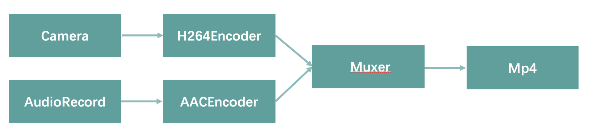
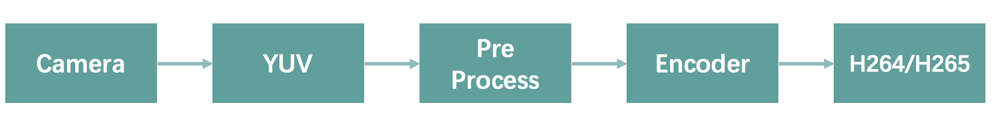
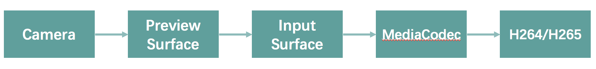
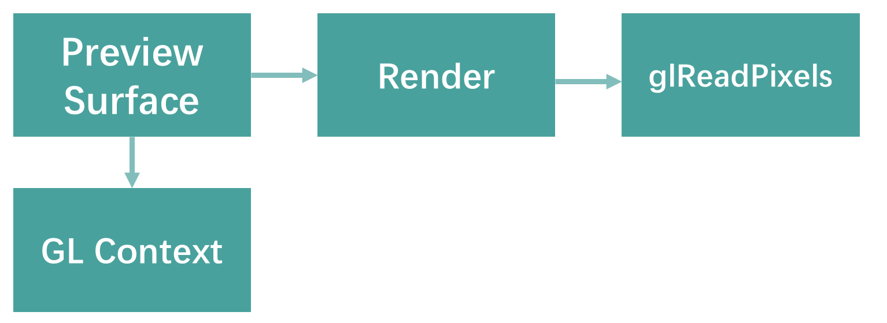
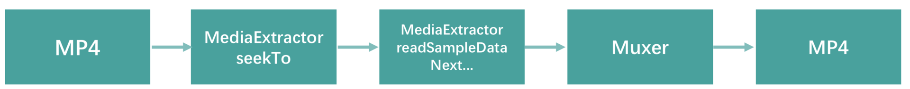
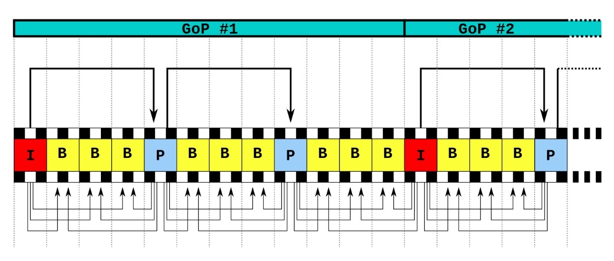
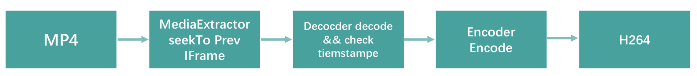
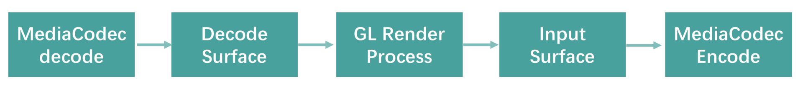
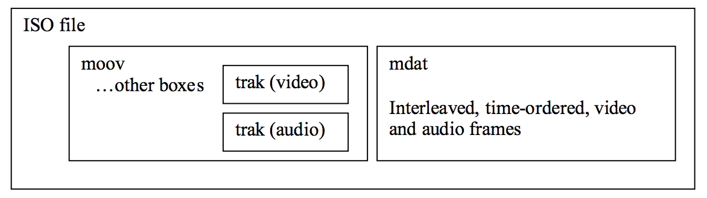

<!DOCTYPE html>
<html xmlns="http://www.w3.org/1999/xhtml">

<head>

    <head>
        <meta http-equiv="Content-Type" content="text/html; charset=UTF-8">
        <meta name="viewport" content="width=device-width, initial-scale=1, maximum-scale=1.0, user-scalable=no">
        <meta http-equiv='content-language' content='zh-cn'>
        <meta name='description' content=38&#32;移动开发新大陆：Android音视频开发>
        <link rel="icon" href="/static/favicon.png">
        <title>38 移动开发新大陆：Android音视频开发 </title>
        
        <link rel="stylesheet" href="/static/index.css">
        <link rel="stylesheet" href="/static/highlight.min.css">
        
        
        <meta name="generator" content="Hexo 4.2.0">
        
    </head>

<body>
    

        

            

                <a href="/">
                    
                    技术文章摘抄
                </a>
            

            

                <ul class="uncollapsible">
                    <li><a href="/" class="current-tab">首页</a></li>
                    <li><a href="../">上一级</a></li>
                </ul>
                <ul class="uncollapsible">
                    
                    <li>
                        <a class="menu-item" id="00 导读 如何打造高质量的应用？.md" href="/%e4%b8%93%e6%a0%8f/Android%e5%bc%80%e5%8f%91%e9%ab%98%e6%89%8b%e8%af%be/00%20%e5%af%bc%e8%af%bb%20%e5%a6%82%e4%bd%95%e6%89%93%e9%80%a0%e9%ab%98%e8%b4%a8%e9%87%8f%e7%9a%84%e5%ba%94%e7%94%a8%ef%bc%9f.md">00 导读 如何打造高质量的应用？.md</a>
                    </li>
                    
                    <li>
                        <a class="menu-item" id="00 开篇词 焦虑的移动开发者该如何破局？.md" href="/%e4%b8%93%e6%a0%8f/Android%e5%bc%80%e5%8f%91%e9%ab%98%e6%89%8b%e8%af%be/00%20%e5%bc%80%e7%af%87%e8%af%8d%20%e7%84%a6%e8%99%91%e7%9a%84%e7%a7%bb%e5%8a%a8%e5%bc%80%e5%8f%91%e8%80%85%e8%af%a5%e5%a6%82%e4%bd%95%e7%a0%b4%e5%b1%80%ef%bc%9f.md">00 开篇词 焦虑的移动开发者该如何破局？.md</a>
                    </li>
                    
                    <li>
                        <a class="menu-item" id="01 崩溃优化（上）：关于“崩溃”那些事儿.md" href="/%e4%b8%93%e6%a0%8f/Android%e5%bc%80%e5%8f%91%e9%ab%98%e6%89%8b%e8%af%be/01%20%e5%b4%a9%e6%ba%83%e4%bc%98%e5%8c%96%ef%bc%88%e4%b8%8a%ef%bc%89%ef%bc%9a%e5%85%b3%e4%ba%8e%e2%80%9c%e5%b4%a9%e6%ba%83%e2%80%9d%e9%82%a3%e4%ba%9b%e4%ba%8b%e5%84%bf.md">01 崩溃优化（上）：关于“崩溃”那些事儿.md</a>
                    </li>
                    
                    <li>
                        <a class="menu-item" id="02 崩溃优化（下）：应用崩溃了，你应该如何去分析？.md" href="/%e4%b8%93%e6%a0%8f/Android%e5%bc%80%e5%8f%91%e9%ab%98%e6%89%8b%e8%af%be/02%20%e5%b4%a9%e6%ba%83%e4%bc%98%e5%8c%96%ef%bc%88%e4%b8%8b%ef%bc%89%ef%bc%9a%e5%ba%94%e7%94%a8%e5%b4%a9%e6%ba%83%e4%ba%86%ef%bc%8c%e4%bd%a0%e5%ba%94%e8%af%a5%e5%a6%82%e4%bd%95%e5%8e%bb%e5%88%86%e6%9e%90%ef%bc%9f.md">02 崩溃优化（下）：应用崩溃了，你应该如何去分析？.md</a>
                    </li>
                    
                    <li>
                        <a class="menu-item" id="03 内存优化（上）：4GB内存时代，再谈内存优化.md" href="/%e4%b8%93%e6%a0%8f/Android%e5%bc%80%e5%8f%91%e9%ab%98%e6%89%8b%e8%af%be/03%20%e5%86%85%e5%ad%98%e4%bc%98%e5%8c%96%ef%bc%88%e4%b8%8a%ef%bc%89%ef%bc%9a4GB%e5%86%85%e5%ad%98%e6%97%b6%e4%bb%a3%ef%bc%8c%e5%86%8d%e8%b0%88%e5%86%85%e5%ad%98%e4%bc%98%e5%8c%96.md">03 内存优化（上）：4GB内存时代，再谈内存优化.md</a>
                    </li>
                    
                    <li>
                        <a class="menu-item" id="04 内存优化（下）：内存优化这件事，应该从哪里着手？.md" href="/%e4%b8%93%e6%a0%8f/Android%e5%bc%80%e5%8f%91%e9%ab%98%e6%89%8b%e8%af%be/04%20%e5%86%85%e5%ad%98%e4%bc%98%e5%8c%96%ef%bc%88%e4%b8%8b%ef%bc%89%ef%bc%9a%e5%86%85%e5%ad%98%e4%bc%98%e5%8c%96%e8%bf%99%e4%bb%b6%e4%ba%8b%ef%bc%8c%e5%ba%94%e8%af%a5%e4%bb%8e%e5%93%aa%e9%87%8c%e7%9d%80%e6%89%8b%ef%bc%9f.md">04 内存优化（下）：内存优化这件事，应该从哪里着手？.md</a>
                    </li>
                    
                    <li>
                        <a class="menu-item" id="05 卡顿优化（上）：你要掌握的卡顿分析方法.md" href="/%e4%b8%93%e6%a0%8f/Android%e5%bc%80%e5%8f%91%e9%ab%98%e6%89%8b%e8%af%be/05%20%e5%8d%a1%e9%a1%bf%e4%bc%98%e5%8c%96%ef%bc%88%e4%b8%8a%ef%bc%89%ef%bc%9a%e4%bd%a0%e8%a6%81%e6%8e%8c%e6%8f%a1%e7%9a%84%e5%8d%a1%e9%a1%bf%e5%88%86%e6%9e%90%e6%96%b9%e6%b3%95.md">05 卡顿优化（上）：你要掌握的卡顿分析方法.md</a>
                    </li>
                    
                    <li>
                        <a class="menu-item" id="06 卡顿优化（下）：如何监控应用卡顿？.md" href="/%e4%b8%93%e6%a0%8f/Android%e5%bc%80%e5%8f%91%e9%ab%98%e6%89%8b%e8%af%be/06%20%e5%8d%a1%e9%a1%bf%e4%bc%98%e5%8c%96%ef%bc%88%e4%b8%8b%ef%bc%89%ef%bc%9a%e5%a6%82%e4%bd%95%e7%9b%91%e6%8e%a7%e5%ba%94%e7%94%a8%e5%8d%a1%e9%a1%bf%ef%bc%9f.md">06 卡顿优化（下）：如何监控应用卡顿？.md</a>
                    </li>
                    
                    <li>
                        <a class="menu-item" id="06补充篇 卡顿优化：卡顿现场与卡顿分析.md" href="/%e4%b8%93%e6%a0%8f/Android%e5%bc%80%e5%8f%91%e9%ab%98%e6%89%8b%e8%af%be/06%e8%a1%a5%e5%85%85%e7%af%87%20%e5%8d%a1%e9%a1%bf%e4%bc%98%e5%8c%96%ef%bc%9a%e5%8d%a1%e9%a1%bf%e7%8e%b0%e5%9c%ba%e4%b8%8e%e5%8d%a1%e9%a1%bf%e5%88%86%e6%9e%90.md">06补充篇 卡顿优化：卡顿现场与卡顿分析.md</a>
                    </li>
                    
                    <li>
                        <a class="menu-item" id="07 启动优化（上）：从启动过程看启动速度优化.md" href="/%e4%b8%93%e6%a0%8f/Android%e5%bc%80%e5%8f%91%e9%ab%98%e6%89%8b%e8%af%be/07%20%e5%90%af%e5%8a%a8%e4%bc%98%e5%8c%96%ef%bc%88%e4%b8%8a%ef%bc%89%ef%bc%9a%e4%bb%8e%e5%90%af%e5%8a%a8%e8%bf%87%e7%a8%8b%e7%9c%8b%e5%90%af%e5%8a%a8%e9%80%9f%e5%ba%a6%e4%bc%98%e5%8c%96.md">07 启动优化（上）：从启动过程看启动速度优化.md</a>
                    </li>
                    
                    <li>
                        <a class="menu-item" id="08 启动优化（下）：优化启动速度的进阶方法.md" href="/%e4%b8%93%e6%a0%8f/Android%e5%bc%80%e5%8f%91%e9%ab%98%e6%89%8b%e8%af%be/08%20%e5%90%af%e5%8a%a8%e4%bc%98%e5%8c%96%ef%bc%88%e4%b8%8b%ef%bc%89%ef%bc%9a%e4%bc%98%e5%8c%96%e5%90%af%e5%8a%a8%e9%80%9f%e5%ba%a6%e7%9a%84%e8%bf%9b%e9%98%b6%e6%96%b9%e6%b3%95.md">08 启动优化（下）：优化启动速度的进阶方法.md</a>
                    </li>
                    
                    <li>
                        <a class="menu-item" id="09 I_O优化（上）：开发工程师必备的I_O优化知识.md" href="/%e4%b8%93%e6%a0%8f/Android%e5%bc%80%e5%8f%91%e9%ab%98%e6%89%8b%e8%af%be/09%20I_O%e4%bc%98%e5%8c%96%ef%bc%88%e4%b8%8a%ef%bc%89%ef%bc%9a%e5%bc%80%e5%8f%91%e5%b7%a5%e7%a8%8b%e5%b8%88%e5%bf%85%e5%a4%87%e7%9a%84I_O%e4%bc%98%e5%8c%96%e7%9f%a5%e8%af%86.md">09 I_O优化（上）：开发工程师必备的I_O优化知识.md</a>
                    </li>
                    
                    <li>
                        <a class="menu-item" id="10 I_O优化（中）：不同I_O方式的使用场景是什么？.md" href="/%e4%b8%93%e6%a0%8f/Android%e5%bc%80%e5%8f%91%e9%ab%98%e6%89%8b%e8%af%be/10%20I_O%e4%bc%98%e5%8c%96%ef%bc%88%e4%b8%ad%ef%bc%89%ef%bc%9a%e4%b8%8d%e5%90%8cI_O%e6%96%b9%e5%bc%8f%e7%9a%84%e4%bd%bf%e7%94%a8%e5%9c%ba%e6%99%af%e6%98%af%e4%bb%80%e4%b9%88%ef%bc%9f.md">10 I_O优化（中）：不同I_O方式的使用场景是什么？.md</a>
                    </li>
                    
                    <li>
                        <a class="menu-item" id="11 I_O优化（下）：如何监控线上I_O操作？.md" href="/%e4%b8%93%e6%a0%8f/Android%e5%bc%80%e5%8f%91%e9%ab%98%e6%89%8b%e8%af%be/11%20I_O%e4%bc%98%e5%8c%96%ef%bc%88%e4%b8%8b%ef%bc%89%ef%bc%9a%e5%a6%82%e4%bd%95%e7%9b%91%e6%8e%a7%e7%ba%bf%e4%b8%8aI_O%e6%93%8d%e4%bd%9c%ef%bc%9f.md">11 I_O优化（下）：如何监控线上I_O操作？.md</a>
                    </li>
                    
                    <li>
                        <a class="menu-item" id="12 存储优化（上）：常见的数据存储方法有哪些？.md" href="/%e4%b8%93%e6%a0%8f/Android%e5%bc%80%e5%8f%91%e9%ab%98%e6%89%8b%e8%af%be/12%20%e5%ad%98%e5%82%a8%e4%bc%98%e5%8c%96%ef%bc%88%e4%b8%8a%ef%bc%89%ef%bc%9a%e5%b8%b8%e8%a7%81%e7%9a%84%e6%95%b0%e6%8d%ae%e5%ad%98%e5%82%a8%e6%96%b9%e6%b3%95%e6%9c%89%e5%93%aa%e4%ba%9b%ef%bc%9f.md">12 存储优化（上）：常见的数据存储方法有哪些？.md</a>
                    </li>
                    
                    <li>
                        <a class="menu-item" id="13 存储优化（中）：如何优化数据存储？.md" href="/%e4%b8%93%e6%a0%8f/Android%e5%bc%80%e5%8f%91%e9%ab%98%e6%89%8b%e8%af%be/13%20%e5%ad%98%e5%82%a8%e4%bc%98%e5%8c%96%ef%bc%88%e4%b8%ad%ef%bc%89%ef%bc%9a%e5%a6%82%e4%bd%95%e4%bc%98%e5%8c%96%e6%95%b0%e6%8d%ae%e5%ad%98%e5%82%a8%ef%bc%9f.md">13 存储优化（中）：如何优化数据存储？.md</a>
                    </li>
                    
                    <li>
                        <a class="menu-item" id="14 存储优化（下）：数据库SQLite的使用和优化.md" href="/%e4%b8%93%e6%a0%8f/Android%e5%bc%80%e5%8f%91%e9%ab%98%e6%89%8b%e8%af%be/14%20%e5%ad%98%e5%82%a8%e4%bc%98%e5%8c%96%ef%bc%88%e4%b8%8b%ef%bc%89%ef%bc%9a%e6%95%b0%e6%8d%ae%e5%ba%93SQLite%e7%9a%84%e4%bd%bf%e7%94%a8%e5%92%8c%e4%bc%98%e5%8c%96.md">14 存储优化（下）：数据库SQLite的使用和优化.md</a>
                    </li>
                    
                    <li>
                        <a class="menu-item" id="15 网络优化（上）：移动开发工程师必备的网络优化知识.md" href="/%e4%b8%93%e6%a0%8f/Android%e5%bc%80%e5%8f%91%e9%ab%98%e6%89%8b%e8%af%be/15%20%e7%bd%91%e7%bb%9c%e4%bc%98%e5%8c%96%ef%bc%88%e4%b8%8a%ef%bc%89%ef%bc%9a%e7%a7%bb%e5%8a%a8%e5%bc%80%e5%8f%91%e5%b7%a5%e7%a8%8b%e5%b8%88%e5%bf%85%e5%a4%87%e7%9a%84%e7%bd%91%e7%bb%9c%e4%bc%98%e5%8c%96%e7%9f%a5%e8%af%86.md">15 网络优化（上）：移动开发工程师必备的网络优化知识.md</a>
                    </li>
                    
                    <li>
                        <a class="menu-item" id="16 网络优化（中）：复杂多变的移动网络该如何优化？.md" href="/%e4%b8%93%e6%a0%8f/Android%e5%bc%80%e5%8f%91%e9%ab%98%e6%89%8b%e8%af%be/16%20%e7%bd%91%e7%bb%9c%e4%bc%98%e5%8c%96%ef%bc%88%e4%b8%ad%ef%bc%89%ef%bc%9a%e5%a4%8d%e6%9d%82%e5%a4%9a%e5%8f%98%e7%9a%84%e7%a7%bb%e5%8a%a8%e7%bd%91%e7%bb%9c%e8%af%a5%e5%a6%82%e4%bd%95%e4%bc%98%e5%8c%96%ef%bc%9f.md">16 网络优化（中）：复杂多变的移动网络该如何优化？.md</a>
                    </li>
                    
                    <li>
                        <a class="menu-item" id="17 网络优化（下）：大数据下网络该如何监控？.md" href="/%e4%b8%93%e6%a0%8f/Android%e5%bc%80%e5%8f%91%e9%ab%98%e6%89%8b%e8%af%be/17%20%e7%bd%91%e7%bb%9c%e4%bc%98%e5%8c%96%ef%bc%88%e4%b8%8b%ef%bc%89%ef%bc%9a%e5%a4%a7%e6%95%b0%e6%8d%ae%e4%b8%8b%e7%bd%91%e7%bb%9c%e8%af%a5%e5%a6%82%e4%bd%95%e7%9b%91%e6%8e%a7%ef%bc%9f.md">17 网络优化（下）：大数据下网络该如何监控？.md</a>
                    </li>
                    
                    <li>
                        <a class="menu-item" id="18 耗电优化（上）：从电量优化的演进看耗电分析.md" href="/%e4%b8%93%e6%a0%8f/Android%e5%bc%80%e5%8f%91%e9%ab%98%e6%89%8b%e8%af%be/18%20%e8%80%97%e7%94%b5%e4%bc%98%e5%8c%96%ef%bc%88%e4%b8%8a%ef%bc%89%ef%bc%9a%e4%bb%8e%e7%94%b5%e9%87%8f%e4%bc%98%e5%8c%96%e7%9a%84%e6%bc%94%e8%bf%9b%e7%9c%8b%e8%80%97%e7%94%b5%e5%88%86%e6%9e%90.md">18 耗电优化（上）：从电量优化的演进看耗电分析.md</a>
                    </li>
                    
                    <li>
                        <a class="menu-item" id="19 耗电优化（下）：耗电的优化方法与线上监控.md" href="/%e4%b8%93%e6%a0%8f/Android%e5%bc%80%e5%8f%91%e9%ab%98%e6%89%8b%e8%af%be/19%20%e8%80%97%e7%94%b5%e4%bc%98%e5%8c%96%ef%bc%88%e4%b8%8b%ef%bc%89%ef%bc%9a%e8%80%97%e7%94%b5%e7%9a%84%e4%bc%98%e5%8c%96%e6%96%b9%e6%b3%95%e4%b8%8e%e7%ba%bf%e4%b8%8a%e7%9b%91%e6%8e%a7.md">19 耗电优化（下）：耗电的优化方法与线上监控.md</a>
                    </li>
                    
                    <li>
                        <a class="menu-item" id="20 UI 优化（上）：UI 渲染的几个关键概念.md" href="/%e4%b8%93%e6%a0%8f/Android%e5%bc%80%e5%8f%91%e9%ab%98%e6%89%8b%e8%af%be/20%20UI%20%e4%bc%98%e5%8c%96%ef%bc%88%e4%b8%8a%ef%bc%89%ef%bc%9aUI%20%e6%b8%b2%e6%9f%93%e7%9a%84%e5%87%a0%e4%b8%aa%e5%85%b3%e9%94%ae%e6%a6%82%e5%bf%b5.md">20 UI 优化（上）：UI 渲染的几个关键概念.md</a>
                    </li>
                    
                    <li>
                        <a class="menu-item" id="21 UI 优化（下）：如何优化 UI 渲染？.md" href="/%e4%b8%93%e6%a0%8f/Android%e5%bc%80%e5%8f%91%e9%ab%98%e6%89%8b%e8%af%be/21%20UI%20%e4%bc%98%e5%8c%96%ef%bc%88%e4%b8%8b%ef%bc%89%ef%bc%9a%e5%a6%82%e4%bd%95%e4%bc%98%e5%8c%96%20UI%20%e6%b8%b2%e6%9f%93%ef%bc%9f.md">21 UI 优化（下）：如何优化 UI 渲染？.md</a>
                    </li>
                    
                    <li>
                        <a class="menu-item" id="22 包体积优化（上）：如何减少安装包大小？.md" href="/%e4%b8%93%e6%a0%8f/Android%e5%bc%80%e5%8f%91%e9%ab%98%e6%89%8b%e8%af%be/22%20%e5%8c%85%e4%bd%93%e7%a7%af%e4%bc%98%e5%8c%96%ef%bc%88%e4%b8%8a%ef%bc%89%ef%bc%9a%e5%a6%82%e4%bd%95%e5%87%8f%e5%b0%91%e5%ae%89%e8%a3%85%e5%8c%85%e5%a4%a7%e5%b0%8f%ef%bc%9f.md">22 包体积优化（上）：如何减少安装包大小？.md</a>
                    </li>
                    
                    <li>
                        <a class="menu-item" id="23 包体积优化（下）：资源优化的进阶实践.md" href="/%e4%b8%93%e6%a0%8f/Android%e5%bc%80%e5%8f%91%e9%ab%98%e6%89%8b%e8%af%be/23%20%e5%8c%85%e4%bd%93%e7%a7%af%e4%bc%98%e5%8c%96%ef%bc%88%e4%b8%8b%ef%bc%89%ef%bc%9a%e8%b5%84%e6%ba%90%e4%bc%98%e5%8c%96%e7%9a%84%e8%bf%9b%e9%98%b6%e5%ae%9e%e8%b7%b5.md">23 包体积优化（下）：资源优化的进阶实践.md</a>
                    </li>
                    
                    <li>
                        <a class="menu-item" id="24 想成为Android高手，你需要先搞定这三个问题.md" href="/%e4%b8%93%e6%a0%8f/Android%e5%bc%80%e5%8f%91%e9%ab%98%e6%89%8b%e8%af%be/24%20%e6%83%b3%e6%88%90%e4%b8%baAndroid%e9%ab%98%e6%89%8b%ef%bc%8c%e4%bd%a0%e9%9c%80%e8%a6%81%e5%85%88%e6%90%9e%e5%ae%9a%e8%bf%99%e4%b8%89%e4%b8%aa%e9%97%ae%e9%a2%98.md">24 想成为Android高手，你需要先搞定这三个问题.md</a>
                    </li>
                    
                    <li>
                        <a class="menu-item" id="25 如何提升组织与个人的研发效能？.md" href="/%e4%b8%93%e6%a0%8f/Android%e5%bc%80%e5%8f%91%e9%ab%98%e6%89%8b%e8%af%be/25%20%e5%a6%82%e4%bd%95%e6%8f%90%e5%8d%87%e7%bb%84%e7%bb%87%e4%b8%8e%e4%b8%aa%e4%ba%ba%e7%9a%84%e7%a0%94%e5%8f%91%e6%95%88%e8%83%bd%ef%bc%9f.md">25 如何提升组织与个人的研发效能？.md</a>
                    </li>
                    
                    <li>
                        <a class="menu-item" id="26 关于编译，你需要了解什么？.md" href="/%e4%b8%93%e6%a0%8f/Android%e5%bc%80%e5%8f%91%e9%ab%98%e6%89%8b%e8%af%be/26%20%e5%85%b3%e4%ba%8e%e7%bc%96%e8%af%91%ef%bc%8c%e4%bd%a0%e9%9c%80%e8%a6%81%e4%ba%86%e8%a7%a3%e4%bb%80%e4%b9%88%ef%bc%9f.md">26 关于编译，你需要了解什么？.md</a>
                    </li>
                    
                    <li>
                        <a class="menu-item" id="27 编译插桩的三种方法：AspectJ、ASM、ReDex.md" href="/%e4%b8%93%e6%a0%8f/Android%e5%bc%80%e5%8f%91%e9%ab%98%e6%89%8b%e8%af%be/27%20%e7%bc%96%e8%af%91%e6%8f%92%e6%a1%a9%e7%9a%84%e4%b8%89%e7%a7%8d%e6%96%b9%e6%b3%95%ef%bc%9aAspectJ%e3%80%81ASM%e3%80%81ReDex.md">27 编译插桩的三种方法：AspectJ、ASM、ReDex.md</a>
                    </li>
                    
                    <li>
                        <a class="menu-item" id="28 大数据与AI，如何高效地测试？.md" href="/%e4%b8%93%e6%a0%8f/Android%e5%bc%80%e5%8f%91%e9%ab%98%e6%89%8b%e8%af%be/28%20%e5%a4%a7%e6%95%b0%e6%8d%ae%e4%b8%8eAI%ef%bc%8c%e5%a6%82%e4%bd%95%e9%ab%98%e6%95%88%e5%9c%b0%e6%b5%8b%e8%af%95%ef%bc%9f.md">28 大数据与AI，如何高效地测试？.md</a>
                    </li>
                    
                    <li>
                        <a class="menu-item" id="29 从每月到每天，如何给版本发布提速？.md" href="/%e4%b8%93%e6%a0%8f/Android%e5%bc%80%e5%8f%91%e9%ab%98%e6%89%8b%e8%af%be/29%20%e4%bb%8e%e6%af%8f%e6%9c%88%e5%88%b0%e6%af%8f%e5%a4%a9%ef%bc%8c%e5%a6%82%e4%bd%95%e7%bb%99%e7%89%88%e6%9c%ac%e5%8f%91%e5%b8%83%e6%8f%90%e9%80%9f%ef%bc%9f.md">29 从每月到每天，如何给版本发布提速？.md</a>
                    </li>
                    
                    <li>
                        <a class="menu-item" id="30 数据评估（上）：如何实现高可用的上报组件？.md" href="/%e4%b8%93%e6%a0%8f/Android%e5%bc%80%e5%8f%91%e9%ab%98%e6%89%8b%e8%af%be/30%20%e6%95%b0%e6%8d%ae%e8%af%84%e4%bc%b0%ef%bc%88%e4%b8%8a%ef%bc%89%ef%bc%9a%e5%a6%82%e4%bd%95%e5%ae%9e%e7%8e%b0%e9%ab%98%e5%8f%af%e7%94%a8%e7%9a%84%e4%b8%8a%e6%8a%a5%e7%bb%84%e4%bb%b6%ef%bc%9f.md">30 数据评估（上）：如何实现高可用的上报组件？.md</a>
                    </li>
                    
                    <li>
                        <a class="menu-item" id="31 数据评估（下）：什么是大数据平台？.md" href="/%e4%b8%93%e6%a0%8f/Android%e5%bc%80%e5%8f%91%e9%ab%98%e6%89%8b%e8%af%be/31%20%e6%95%b0%e6%8d%ae%e8%af%84%e4%bc%b0%ef%bc%88%e4%b8%8b%ef%bc%89%ef%bc%9a%e4%bb%80%e4%b9%88%e6%98%af%e5%a4%a7%e6%95%b0%e6%8d%ae%e5%b9%b3%e5%8f%b0%ef%bc%9f.md">31 数据评估（下）：什么是大数据平台？.md</a>
                    </li>
                    
                    <li>
                        <a class="menu-item" id="32 线上疑难问题该如何排查和跟踪？.md" href="/%e4%b8%93%e6%a0%8f/Android%e5%bc%80%e5%8f%91%e9%ab%98%e6%89%8b%e8%af%be/32%20%e7%ba%bf%e4%b8%8a%e7%96%91%e9%9a%be%e9%97%ae%e9%a2%98%e8%af%a5%e5%a6%82%e4%bd%95%e6%8e%92%e6%9f%a5%e5%92%8c%e8%b7%9f%e8%b8%aa%ef%bc%9f.md">32 线上疑难问题该如何排查和跟踪？.md</a>
                    </li>
                    
                    <li>
                        <a class="menu-item" id="33 做一名有高度的移动开发工程师.md" href="/%e4%b8%93%e6%a0%8f/Android%e5%bc%80%e5%8f%91%e9%ab%98%e6%89%8b%e8%af%be/33%20%e5%81%9a%e4%b8%80%e5%90%8d%e6%9c%89%e9%ab%98%e5%ba%a6%e7%9a%84%e7%a7%bb%e5%8a%a8%e5%bc%80%e5%8f%91%e5%b7%a5%e7%a8%8b%e5%b8%88.md">33 做一名有高度的移动开发工程师.md</a>
                    </li>
                    
                    <li>
                        <a class="menu-item" id="34 聊聊重构：优秀的架构都是演进而来的.md" href="/%e4%b8%93%e6%a0%8f/Android%e5%bc%80%e5%8f%91%e9%ab%98%e6%89%8b%e8%af%be/34%20%e8%81%8a%e8%81%8a%e9%87%8d%e6%9e%84%ef%bc%9a%e4%bc%98%e7%a7%80%e7%9a%84%e6%9e%b6%e6%9e%84%e9%83%bd%e6%98%af%e6%bc%94%e8%bf%9b%e8%80%8c%e6%9d%a5%e7%9a%84.md">34 聊聊重构：优秀的架构都是演进而来的.md</a>
                    </li>
                    
                    <li>
                        <a class="menu-item" id="35 Native Hook 技术，天使还是魔鬼？.md" href="/%e4%b8%93%e6%a0%8f/Android%e5%bc%80%e5%8f%91%e9%ab%98%e6%89%8b%e8%af%be/35%20Native%20Hook%20%e6%8a%80%e6%9c%af%ef%bc%8c%e5%a4%a9%e4%bd%bf%e8%bf%98%e6%98%af%e9%ad%94%e9%ac%bc%ef%bc%9f.md">35 Native Hook 技术，天使还是魔鬼？.md</a>
                    </li>
                    
                    <li>
                        <a class="menu-item" id="36 跨平台开发的现状与应用.md" href="/%e4%b8%93%e6%a0%8f/Android%e5%bc%80%e5%8f%91%e9%ab%98%e6%89%8b%e8%af%be/36%20%e8%b7%a8%e5%b9%b3%e5%8f%b0%e5%bc%80%e5%8f%91%e7%9a%84%e7%8e%b0%e7%8a%b6%e4%b8%8e%e5%ba%94%e7%94%a8.md">36 跨平台开发的现状与应用.md</a>
                    </li>
                    
                    <li>
                        <a class="menu-item" id="37 移动开发新大陆：工作三年半，移动开发转型手游开发.md" href="/%e4%b8%93%e6%a0%8f/Android%e5%bc%80%e5%8f%91%e9%ab%98%e6%89%8b%e8%af%be/37%20%e7%a7%bb%e5%8a%a8%e5%bc%80%e5%8f%91%e6%96%b0%e5%a4%a7%e9%99%86%ef%bc%9a%e5%b7%a5%e4%bd%9c%e4%b8%89%e5%b9%b4%e5%8d%8a%ef%bc%8c%e7%a7%bb%e5%8a%a8%e5%bc%80%e5%8f%91%e8%bd%ac%e5%9e%8b%e6%89%8b%e6%b8%b8%e5%bc%80%e5%8f%91.md">37 移动开发新大陆：工作三年半，移动开发转型手游开发.md</a>
                    </li>
                    
                    <li>
                        <a class="menu-item" id="38 移动开发新大陆：Android音视频开发.md" href="/%e4%b8%93%e6%a0%8f/Android%e5%bc%80%e5%8f%91%e9%ab%98%e6%89%8b%e8%af%be/38%20%e7%a7%bb%e5%8a%a8%e5%bc%80%e5%8f%91%e6%96%b0%e5%a4%a7%e9%99%86%ef%bc%9aAndroid%e9%9f%b3%e8%a7%86%e9%a2%91%e5%bc%80%e5%8f%91.md">38 移动开发新大陆：Android音视频开发.md</a>
                    </li>
                    
                    <li>
                        <a class="menu-item" id="39 移动开发新大陆： 边缘智能计算的趋势.md" href="/%e4%b8%93%e6%a0%8f/Android%e5%bc%80%e5%8f%91%e9%ab%98%e6%89%8b%e8%af%be/39%20%e7%a7%bb%e5%8a%a8%e5%bc%80%e5%8f%91%e6%96%b0%e5%a4%a7%e9%99%86%ef%bc%9a%20%e8%be%b9%e7%bc%98%e6%99%ba%e8%83%bd%e8%ae%a1%e7%ae%97%e7%9a%84%e8%b6%8b%e5%8a%bf.md">39 移动开发新大陆： 边缘智能计算的趋势.md</a>
                    </li>
                    
                    <li>
                        <a class="menu-item" id="40 动态化实践，如何选择适合自己的方案？.md" href="/%e4%b8%93%e6%a0%8f/Android%e5%bc%80%e5%8f%91%e9%ab%98%e6%89%8b%e8%af%be/40%20%e5%8a%a8%e6%80%81%e5%8c%96%e5%ae%9e%e8%b7%b5%ef%bc%8c%e5%a6%82%e4%bd%95%e9%80%89%e6%8b%a9%e9%80%82%e5%90%88%e8%87%aa%e5%b7%b1%e7%9a%84%e6%96%b9%e6%a1%88%ef%bc%9f.md">40 动态化实践，如何选择适合自己的方案？.md</a>
                    </li>
                    
                    <li>
                        <a class="menu-item" id="41 聊聊Flutter，面对层出不穷的新技术该如何跟进？.md" href="/%e4%b8%93%e6%a0%8f/Android%e5%bc%80%e5%8f%91%e9%ab%98%e6%89%8b%e8%af%be/41%20%e8%81%8a%e8%81%8aFlutter%ef%bc%8c%e9%9d%a2%e5%af%b9%e5%b1%82%e5%87%ba%e4%b8%8d%e7%a9%b7%e7%9a%84%e6%96%b0%e6%8a%80%e6%9c%af%e8%af%a5%e5%a6%82%e4%bd%95%e8%b7%9f%e8%bf%9b%ef%bc%9f.md">41 聊聊Flutter，面对层出不穷的新技术该如何跟进？.md</a>
                    </li>
                    
                    <li>
                        <a class="menu-item" id="42 Android开发高手课学习心得.md" href="/%e4%b8%93%e6%a0%8f/Android%e5%bc%80%e5%8f%91%e9%ab%98%e6%89%8b%e8%af%be/42%20Android%e5%bc%80%e5%8f%91%e9%ab%98%e6%89%8b%e8%af%be%e5%ad%a6%e4%b9%a0%e5%bf%83%e5%be%97.md">42 Android开发高手课学习心得.md</a>
                    </li>
                    
                    <li>
                        <a class="menu-item" id="Android JVM TI机制详解（内含福利彩蛋）.md" href="/%e4%b8%93%e6%a0%8f/Android%e5%bc%80%e5%8f%91%e9%ab%98%e6%89%8b%e8%af%be/Android%20JVM%20TI%e6%9c%ba%e5%88%b6%e8%af%a6%e8%a7%a3%ef%bc%88%e5%86%85%e5%90%ab%e7%a6%8f%e5%88%a9%e5%bd%a9%e8%9b%8b%ef%bc%89.md">Android JVM TI机制详解（内含福利彩蛋）.md</a>
                    </li>
                    
                    <li>
                        <a class="menu-item" id="Android工程师的“面试指南”.md" href="/%e4%b8%93%e6%a0%8f/Android%e5%bc%80%e5%8f%91%e9%ab%98%e6%89%8b%e8%af%be/Android%e5%b7%a5%e7%a8%8b%e5%b8%88%e7%9a%84%e2%80%9c%e9%9d%a2%e8%af%95%e6%8c%87%e5%8d%97%e2%80%9d.md">Android工程师的“面试指南”.md</a>
                    </li>
                    
                    <li>
                        <a class="menu-item" id="Native下如何获取调用栈？.md" href="/%e4%b8%93%e6%a0%8f/Android%e5%bc%80%e5%8f%91%e9%ab%98%e6%89%8b%e8%af%be/Native%e4%b8%8b%e5%a6%82%e4%bd%95%e8%8e%b7%e5%8f%96%e8%b0%83%e7%94%a8%e6%a0%88%ef%bc%9f.md">Native下如何获取调用栈？.md</a>
                    </li>
                    
                    <li>
                        <a class="menu-item" id="专栏学得苦？可能你还需要一份配套学习书单.md" href="/%e4%b8%93%e6%a0%8f/Android%e5%bc%80%e5%8f%91%e9%ab%98%e6%89%8b%e8%af%be/%e4%b8%93%e6%a0%8f%e5%ad%a6%e5%be%97%e8%8b%a6%ef%bc%9f%e5%8f%af%e8%83%bd%e4%bd%a0%e8%bf%98%e9%9c%80%e8%a6%81%e4%b8%80%e4%bb%bd%e9%85%8d%e5%a5%97%e5%ad%a6%e4%b9%a0%e4%b9%a6%e5%8d%95.md">专栏学得苦？可能你还需要一份配套学习书单.md</a>
                    </li>
                    
                    <li>
                        <a class="menu-item" id="专栏学得苦？可能是方法没找对.md" href="/%e4%b8%93%e6%a0%8f/Android%e5%bc%80%e5%8f%91%e9%ab%98%e6%89%8b%e8%af%be/%e4%b8%93%e6%a0%8f%e5%ad%a6%e5%be%97%e8%8b%a6%ef%bc%9f%e5%8f%af%e8%83%bd%e6%98%af%e6%96%b9%e6%b3%95%e6%b2%a1%e6%89%be%e5%af%b9.md">专栏学得苦？可能是方法没找对.md</a>
                    </li>
                    
                    <li>
                        <a class="menu-item" id="程序员修炼之路 设计能力的提升途径.md" href="/%e4%b8%93%e6%a0%8f/Android%e5%bc%80%e5%8f%91%e9%ab%98%e6%89%8b%e8%af%be/%e7%a8%8b%e5%ba%8f%e5%91%98%e4%bf%ae%e7%82%bc%e4%b9%8b%e8%b7%af%20%e8%ae%be%e8%ae%a1%e8%83%bd%e5%8a%9b%e7%9a%84%e6%8f%90%e5%8d%87%e9%80%94%e5%be%84.md">程序员修炼之路 设计能力的提升途径.md</a>
                    </li>
                    
                    <li>
                        <a class="menu-item" id="练习Sample跑起来 ASM插桩强化练习.md" href="/%e4%b8%93%e6%a0%8f/Android%e5%bc%80%e5%8f%91%e9%ab%98%e6%89%8b%e8%af%be/%e7%bb%83%e4%b9%a0Sample%e8%b7%91%e8%b5%b7%e6%9d%a5%20ASM%e6%8f%92%e6%a1%a9%e5%bc%ba%e5%8c%96%e7%bb%83%e4%b9%a0.md">练习Sample跑起来 ASM插桩强化练习.md</a>
                    </li>
                    
                    <li>
                        <a class="menu-item" id="练习Sample跑起来 唯鹿同学的练习手记 第1辑.md" href="/%e4%b8%93%e6%a0%8f/Android%e5%bc%80%e5%8f%91%e9%ab%98%e6%89%8b%e8%af%be/%e7%bb%83%e4%b9%a0Sample%e8%b7%91%e8%b5%b7%e6%9d%a5%20%e5%94%af%e9%b9%bf%e5%90%8c%e5%ad%a6%e7%9a%84%e7%bb%83%e4%b9%a0%e6%89%8b%e8%ae%b0%20%e7%ac%ac1%e8%be%91.md">练习Sample跑起来 唯鹿同学的练习手记 第1辑.md</a>
                    </li>
                    
                    <li>
                        <a class="menu-item" id="练习Sample跑起来 唯鹿同学的练习手记 第2辑.md" href="/%e4%b8%93%e6%a0%8f/Android%e5%bc%80%e5%8f%91%e9%ab%98%e6%89%8b%e8%af%be/%e7%bb%83%e4%b9%a0Sample%e8%b7%91%e8%b5%b7%e6%9d%a5%20%e5%94%af%e9%b9%bf%e5%90%8c%e5%ad%a6%e7%9a%84%e7%bb%83%e4%b9%a0%e6%89%8b%e8%ae%b0%20%e7%ac%ac2%e8%be%91.md">练习Sample跑起来 唯鹿同学的练习手记 第2辑.md</a>
                    </li>
                    
                    <li>
                        <a class="menu-item" id="练习Sample跑起来 唯鹿同学的练习手记 第3辑.md" href="/%e4%b8%93%e6%a0%8f/Android%e5%bc%80%e5%8f%91%e9%ab%98%e6%89%8b%e8%af%be/%e7%bb%83%e4%b9%a0Sample%e8%b7%91%e8%b5%b7%e6%9d%a5%20%e5%94%af%e9%b9%bf%e5%90%8c%e5%ad%a6%e7%9a%84%e7%bb%83%e4%b9%a0%e6%89%8b%e8%ae%b0%20%e7%ac%ac3%e8%be%91.md">练习Sample跑起来 唯鹿同学的练习手记 第3辑.md</a>
                    </li>
                    
                    <li>
                        <a class="menu-item" id="练习Sample跑起来 热点问题答疑第1期.md" href="/%e4%b8%93%e6%a0%8f/Android%e5%bc%80%e5%8f%91%e9%ab%98%e6%89%8b%e8%af%be/%e7%bb%83%e4%b9%a0Sample%e8%b7%91%e8%b5%b7%e6%9d%a5%20%e7%83%ad%e7%82%b9%e9%97%ae%e9%a2%98%e7%ad%94%e7%96%91%e7%ac%ac1%e6%9c%9f.md">练习Sample跑起来 热点问题答疑第1期.md</a>
                    </li>
                    
                    <li>
                        <a class="menu-item" id="练习Sample跑起来 热点问题答疑第2期.md" href="/%e4%b8%93%e6%a0%8f/Android%e5%bc%80%e5%8f%91%e9%ab%98%e6%89%8b%e8%af%be/%e7%bb%83%e4%b9%a0Sample%e8%b7%91%e8%b5%b7%e6%9d%a5%20%e7%83%ad%e7%82%b9%e9%97%ae%e9%a2%98%e7%ad%94%e7%96%91%e7%ac%ac2%e6%9c%9f.md">练习Sample跑起来 热点问题答疑第2期.md</a>
                    </li>
                    
                    <li>
                        <a class="menu-item" id="练习Sample跑起来 热点问题答疑第3期.md" href="/%e4%b8%93%e6%a0%8f/Android%e5%bc%80%e5%8f%91%e9%ab%98%e6%89%8b%e8%af%be/%e7%bb%83%e4%b9%a0Sample%e8%b7%91%e8%b5%b7%e6%9d%a5%20%e7%83%ad%e7%82%b9%e9%97%ae%e9%a2%98%e7%ad%94%e7%96%91%e7%ac%ac3%e6%9c%9f.md">练习Sample跑起来 热点问题答疑第3期.md</a>
                    </li>
                    
                    <li>
                        <a class="menu-item" id="练习Sample跑起来 热点问题答疑第4期.md" href="/%e4%b8%93%e6%a0%8f/Android%e5%bc%80%e5%8f%91%e9%ab%98%e6%89%8b%e8%af%be/%e7%bb%83%e4%b9%a0Sample%e8%b7%91%e8%b5%b7%e6%9d%a5%20%e7%83%ad%e7%82%b9%e9%97%ae%e9%a2%98%e7%ad%94%e7%96%91%e7%ac%ac4%e6%9c%9f.md">练习Sample跑起来 热点问题答疑第4期.md</a>
                    </li>
                    
                    <li>
                        <a class="menu-item" id="结束语 移动开发的今天和明天.md" href="/%e4%b8%93%e6%a0%8f/Android%e5%bc%80%e5%8f%91%e9%ab%98%e6%89%8b%e8%af%be/%e7%bb%93%e6%9d%9f%e8%af%ad%20%e7%a7%bb%e5%8a%a8%e5%bc%80%e5%8f%91%e7%9a%84%e4%bb%8a%e5%a4%a9%e5%92%8c%e6%98%8e%e5%a4%a9.md">结束语 移动开发的今天和明天.md</a>
                    </li>
                    
                    <li>
                        <a class="menu-item" id="聊聊Framework的学习方法.md" href="/%e4%b8%93%e6%a0%8f/Android%e5%bc%80%e5%8f%91%e9%ab%98%e6%89%8b%e8%af%be/%e8%81%8a%e8%81%8aFramework%e7%9a%84%e5%ad%a6%e4%b9%a0%e6%96%b9%e6%b3%95.md">聊聊Framework的学习方法.md</a>
                    </li>
                    
                    <li><a href="https://lianglianglee.com/assets/%E6%8D%90%E8%B5%A0.md">捐赠</a></li>
                </ul>

            

        

        

            

        

        

            

                

                    

                        
                        <header class="navbar">
                            <section class="navbar-section">
                                <a onclick="open_sidebar()">
                                    <i class="icon icon-menu"></i>
                                </a>
                            </section>
                        </header>
                    

                    

                        

                            
                            
                            
                            

                            <h1 id="title" data-id="38 移动开发新大陆：Android音视频开发" class="title">38 移动开发新大陆：Android音视频开发</h1>
                            
<blockquote>

你好，我是张绍文。俊杰目前负责微信的音视频开发工作，无论是我们平常经常使用到的小视频，还是最新推出的即刻视频，都是出自他手。俊杰在音视频方面有非常丰富的经验，今天有幸请到他来给我们分享他个人对Android音视频开发的心得和体会。

在日常生活中，视频类应用占据了我们越来越多的时间，各大公司也纷纷杀入这个战场，不管是抖音、快手等短视频类型，虎牙、斗鱼等直播类型，腾讯视频、爱奇艺、优酷等长视频类型，还是Vue、美拍等视频编辑美颜类型，总有一款适合你。

未来随着5G普及以及网络资费的下降，音视频的前景是非常广阔的。但是另一方面，无论是音视频的编解码和播放器、视频编辑和美颜的各种算法，还是视频与人工智能的结合（<a href="https://mp.weixin.qq.com/s/ZtsqF7bBODFymEaYFG6KAg" target="_blank">AI剪片</a>、视频修复、超清化等），它们都涉及了方方面面的底层知识，学习曲线比较陡峭，门槛相对比较高，所以也造成了目前各大公司音视频相关人才的紧缺。如果你对音视频开发感兴趣，我也非常建议你去往这个方向尝试，我个人是非常看好音视频开发这个领域的。

当然音视频开发的经验是靠着一次又一次的“填坑”成长起来的，下面我们一起来看看俊杰同学关于音视频的认识和思考。

</blockquote>

大家好，我是周俊杰，现在在微信从事Android多媒体开发。应绍文的邀请，分享一些我关于Android音视频开发的心得和体会。

不管作为开发者还是用户，现在我们每天都会接触到各种各样的短视频、直播类的App，与之相关的音视频方向的开发也变得越来越重要。但是对于大多数Android开发者来说，从事Android音视频相关的开发可能目前还算是个小众领域，虽然可能目前深入这个领域的开发者还不是太多，但这个方向涉及的知识点可一点都不少。

<h2 id="音视频的基础知识">音视频的基础知识</h2>

<strong>1. 音视频相关的概念</strong>

说到音视频，先从我们熟悉也陌生的视频格式说起。

对于我们来说，最常见的视频格式就是<a href="https://zh.wikipedia.org/zh-cn/MP4" target="_blank">MP4</a>格式，这是一个通用的容器格式。所谓容器格式，就意味内部要有对应的数据流用来承载内容。而且既然是一个视频，那必然有音轨和视轨，而音轨、视轨本身也有对应的格式。常见的音轨、视轨格式包括：

<ul>
<li>
视轨：<a href="https://zh.wikipedia.org/wiki/%E9%AB%98%E6%95%88%E7%8E%87%E8%A7%86%E9%A2%91%E7%BC%96%E7%A0%81" target="_blank">H.265(HEVC)</a>、<a href="https://zh.wikipedia.org/wiki/H.264/MPEG-4_AVC" target="_blank">H.264</a>。其中，目前大部分Android手机都支持H.264格式的直接硬件编码和解码；对于H.265来说，Android 5.0以上的机器就支持直接硬件解码了，但是对于硬件编码，目前只有一部分高端芯片可以支持，例如高通的8xx系列、华为的98x系列。对于视轨编码来说，分辨率越大性能消耗也就越大，编码所需的时间就越长。
</li>

<li>
音轨：<a href="https://zh.wikipedia.org/wiki/%E9%80%B2%E9%9A%8E%E9%9F%B3%E8%A8%8A%E7%B7%A8%E7%A2%BC" target="_blank">AAC</a>。这是一种历史悠久音频编码格式，Android手机基本可以直接硬件编解码，几乎很少遇到兼容性问题。可以说作为视频的音轨格式，AAC已经非常成熟了。
</li>
</ul>

对于编码本身，上面提到的这些格式都是<a href="https://zh.wikipedia.org/zh-hans/%E6%9C%89%E6%8D%9F%E6%95%B0%E6%8D%AE%E5%8E%8B%E7%BC%A9" target="_blank">有损编码</a>，因此压缩编码本身还需要一个衡量压缩之后，数据量多少的指标，这个标准就是<a href="https://zh.wikipedia.org/wiki/%E6%AF%94%E7%89%B9%E7%8E%87#%E5%A4%9A%E5%AA%92%E4%BD%93%E7%9A%84%E6%AF%94%E7%89%B9%E7%8E%87" target="_blank">码率</a>。同一个压缩格式下，码率越高质量也就越好。更多Android本身支持的编解码格式，你可以参考<a href="https://developer.android.com/guide/topics/media/media-formats" target="_blank">官方文档</a>。

小结一下，要拍摄一个MP4视频，我们需要将视轨 + 音轨分别编码，然后作为MP4的数据流，再合成出一个MP4文件。

<strong>2. 音视频编码的流程</strong>

接下来，我们再来看看一个视频是怎么拍摄出来的。首先，既然是拍摄，少不了跟摄像头、麦克风打交道。从流程来说，以H.264/AAC编码为例，录制视频的总体流程是：

我们分别从摄像头/录音设备采集数据，将数据送入编码器，分别编码出视轨/音轨之后，再送入合成器（MediaRemuxer或者类似mp4v2、FFmpeg之类的处理库），最终输出MP4文件。接下来，我主要以视轨为例，来介绍下编码的流程。

首先，直接使用系统的<a href="https://developer.android.com/reference/android/media/MediaRecorder" target="_blank">MediaRecorder</a>录制整个视频，这是最简单的方法，直接就能输出MP4文件。但是这个接口可定制化很差，比如我们想录制一个正方形的视频，除非摄像头本身支持宽高一致的分辨率，否则只能后期处理或者各种Hack。另外，在实际App中，除非对视频要求不是特别高，一般也不会直接使用MediaRecorder。

视轨的处理是录制视频中相对比较复杂的部分，输入源头是Camera的数据，最终输出是编码的H.264/H.265数据。下面我来介绍两种处理模型。

第一种方法是利用Camera获取摄像头输出的原始数据接口（例如onPreviewFrame），经过预处理，例如缩放、裁剪之后，送入编码器，输出H.264/H.265。

摄像头输出的原始数据格式为NV21，这是<a href="https://zh.wikipedia.org/wiki/YUV" target="_blank">YUV</a>颜色格式的一种。区别于RGB颜色，YUV数据格式占用空间更少，在视频编码领域使用十分广泛。

一般来说，因为摄像头直接输出的NV21格式大小跟最终视频不一定匹配，而且编码器往往也要求输入另外一种YUV格式（一般来说是YUV420P），因此在获取到NV21颜色格式之后，还需要进行各种缩放、裁剪之类的操作，一般会使用<a href="https://www.ffmpeg.org/" target="_blank">FFmpeg</a>、<a href="https://chromium.googlesource.com/libyuv/libyuv/" target="_blank">libyuv</a>这样的库处理YUV数据。

最后会将数据送入到编码器。在视频编码器的选择上，我们可以直接选择系统的MediaCodec，利用手机本身的硬件编码能力。但如果对最终输出的视频大小要求比较严格的话，使用的码率会偏低，这种情况下大部分手机的硬件编码器输出的画质可能会比较差。另外一种常见的选择是利用<a href="https://www.videolan.org/developers/x264.html" target="_blank">x264</a>来进行编码，画质表现相对较好，但是比起硬件编码器，速度会慢很多，因此在实际使用时最好根据场景进行选择。

除了直接处理摄像头原始数据以外，还有一种常见的处理模型，利用Surface作为编码器的输入源。

对于Android摄像头的预览，需要设置一张Surface/SurfaceTexture来作为摄像头预览数据的输出，而MediaCodec在API 18+之后，可以通过<a href="https://developer.android.com/reference/android/media/MediaCodec#createInputSurface" target="_blank">createInputSurface</a>来创建一张Surface作为编码器的输入。这里所说的另外一种方式就是，将摄像头预览Surface的内容，输出到MediaCodec的InputSurface上。

而在编码器的选择上，虽然InputSurface是通过MediaCodec来创建的，乍看之下似乎只能通过MediaCodec来进行编码，无法使用x264来编码，但利用PreviewSurface，我们可以创建一个OpenGL的上下文，这样所有绘制的内容，都可以通过glReadPixel来获取，然后再讲读取数据转换成YUV再输入到x264即可（另外，如果是在GLES 3.0的环境，我们还可以利用<a href="http://www.songho.ca/opengl/gl_pbo.html" target="_blank">PBO</a>来加速glReadPixles的速度）。

由于这里我们创建了一个OpenGL的上下文，对于目前的视频类App来说，还有各种各样的滤镜和美颜效果，实际上都可以基于OpenGL来实现。

而至于这种方式录制视频具体实现代码，你可以参考下grafika中<a href="https://github.com/google/grafika/blob/master/app/src/main/java/com/android/grafika/CameraCaptureActivity.java" target="_blank">示例</a>。

<h2 id="视频处理">视频处理</h2>

<strong>1. 视频编辑</strong>

在当下视频类App中，你可以见到各种视频裁剪、视频编辑的功能，例如：

<ul>
<li>
裁剪视频的一部分。
</li>

<li>
多个视频进行拼接。
</li>
</ul>

对于视频裁剪、拼接来说，Android直接提供了<a href="https://developer.android.com/reference/android/media/MediaExtractor" target="_blank">MediaExtractor</a>的接口，结合seek以及对应读取帧数据readSampleData的接口，我们可以直接获取对应时间戳的帧的内容，这样读取出来的是已经编码好的数据，因此无需重新编码，直接可以输入合成器再次合成为MP4。

我们只需要seek到需要裁剪原视频的时间戳，然后一直读取sampleData，送入MediaMuxer即可，这是视频裁剪最简单的实现方式。

但在实践时会发现，<a href="https://developer.android.com/reference/android/media/MediaExtractor#seekTo" target="_blank">seekTo</a>并不会对所有时间戳都生效。比如说，一个<strong>4min</strong>左右的视频，我们想要seek到大概<strong>2min</strong>左右的位置，然后从这个位置读取数据，但实际调用seekTo到2min这个位置之后，再从MediaExtractor读取数据，你会发现实际获取的数据上可能是从2min这里前面一点或者后面一点位置的内容。这是因为MediaExtractor这个接口只能seek到视频<a href="https://zh.wikipedia.org/wiki/%E9%97%9C%E9%8D%B5%E6%A0%BC#%E8%A6%96%E8%A8%8A%E7%B7%A8%E8%BC%AF%E7%9A%84%E9%97%9C%E9%8D%B5%E6%A0%BC" target="_blank">关键帧</a>的位置，而我们想要的位置并不一定有关键帧。这个问题还是要回到视频编码，在视频编码时两个关键帧之间是有一定间隔距离的。

如上图所示，关键帧被成为<strong>I帧</strong>，可以被认为是一帧没有被压缩的画面，解码的时候无需要依赖其他视频帧。但是在两个关键帧之间，还存在这<strong>B帧</strong>、<strong>P帧</strong>这样的压缩帧，需要依赖其他帧才能完整解码出一个画面。至于两个关键帧之间的间隔，被称为一个<a href="https://zh.wikipedia.org/wiki/%E5%9C%96%E5%83%8F%E7%BE%A4%E7%B5%84" target="_blank">GOP</a> ，在GOP内的帧，MediaExtractor是无法直接seek到的，因为这个类不负责解码，只能seek到前后的关键帧。但如果GOP过大，就会导致视频编辑非常不精准了（实际上部分手机的ROM有改动，实现的MediaExtractor也能精确seek）。

既然如此，那要实现精确裁剪也就只能去依赖解码器了。解码器本身能够解出所有帧的内容，在引入解帧之后，整个裁剪的流程就变成了下面的样子。

我们需要先seek到需要位置的前一I帧上，然后送入解码器，解码器解除一帧之后，判断当前帧的<a href="https://en.wikipedia.org/wiki/Presentation_timestamp" target="_blank">PTS</a>是否在需要的时间戳范围内，如果是的话，再将数据送入编码器，重新编码再次得到H.264视轨数据，然后合成MP4文件。

上面是基础的视频裁剪流程，对于视频拼接，也是类似得到多段H.264数据之后，才一同送入合成器。

另外，在实际视频编辑中，我们还会添加不少视频特效和滤镜。前面在视频拍摄的场景下，我们利用Surface作为MediaCodec的输入源，并且利用Surface创建了OpenGL的上下文。而MediaCodec作为解码器的时候，也可以在<a href="https://developer.android.com/reference/android/media/MediaCodec#configure" target="_blank">configure</a>的时候，指定一张Surface作为其解码的输出。大部分视频特效都是可以通过OpenGL来实现的，因此要实现视频特效，一般的流程是下面这样的。

我们将解码之后的渲染交给OpenGL，然后输出到编码器的InputSurface上，来实现整套编码流程。

<strong>2. 视频播放</strong>

任何视频类App都会涉及视频播放，从录制、剪辑再到播放，构成完整的视频体验。对于要播放一个MP4文件，最简单的方式莫过于直接使用系统的<a href="https://developer.android.com/reference/android/media/MediaPlayer" target="_blank">MediaPlayer</a>，只需要简单几行代码，就能直接播放视频。对于本地视频播放来说，这是最简单的实现方式，但实际上我们可能会有更复杂的需求：

<ul>
<li>
需要播放的视频可能本身并不在本地，很多可能都是网络视频，有边下边播的需求。
</li>

<li>
播放的视频可能是作为视频编辑的一部分，在剪辑时需要实时预览视频特效。
</li>
</ul>

对于第二种场景，我们可以简单配置播放视频的View为一个GLSurfaceView，有了OpenGL的环境，我们就可以在这上实现各种特效、滤镜的效果了。而对于视频编辑常见的快进、倒放之类的播放配置，MediaPlayer也有直接的接口可以设置。

更为常见的是第一种场景，例如一个视频流界面，大部分视频都是在线视频，虽然MediaPlayer也能实现在线视频播放，但实际使用下来，会有两个问题：

<ul>
<li>
通过设置MediaPlayer视频URL方式下载下来的视频，被放到了一个私有的位置，App不容易直接访问，这样会导致我们没法做视频预加载，而且之前已经播放完、缓冲完的视频，也不能重复利用原有缓冲内容。
</li>

<li>
同视频剪辑直接使用MediaExtractor返回的数据问题一样，MediaPlayer同样无法精确seek，只能seek到有关键帧的地方。
</li>
</ul>

对于第一个问题，我们可以通过视频URL代理下载的方式来解决，通过本地使用Local HTTP Server的方式代理下载到一个指定的地方。现在开源社区已经有很成熟的项目实现，例如<a href="http://AndroidVideoCache" target="_blank">AndroidVideoCache</a>。

而对于第二个问题来说，没法精确seek的问题在有些App上是致命的，产品可能无法接受这样的体验。那同视频编辑一样，我们只能直接基于MediaCodec来自行实现播放器，这部分内容就比较复杂了。当然你也可以直接使用Google开源的<a href="https://github.com/google/ExoPlayer" target="_blank">ExoPlayer</a>，简单又快捷，而且也能支持设置在线视频URL。

看似所有问题都有了解决方案，是不是就万事大吉了呢？

常见的网络边下边播视频的格式都是MP4，但有些视频直接上传到服务器上的时候，我们会发现无论是使用MediaPlayer还是ExoPlayer，似乎都只能等待到整个视频都下载完才能开始播放，没有达到边下边播的体验。这个问题的原因实际上是因为MP4的格式导致的，具体来看，是跟MP4<a href="http://l.web.umkc.edu/lizhu/teaching/2016sp.video-communication/ref/mp4.pdf" target="_blank">格式</a>中的moov有关。

MP4格式中有一个叫作moov的地方存储这当前MP4文件的元信息，包括当前MP4文件的音轨视轨格式、视频长度、播放速率、视轨关键帧位置偏移量等重要信息，MP4文件在线播放的时候，需要moov中的信息才能解码音轨视轨。

而上述问题发生的原因在于，当moov在MP4文件尾部的时候，播放器没有足够的信息来进行解码，因此视频变得需要直接下载完之后才能解码播放。因此，要实现MP4文件的边下边播，则需要将moov放到文件头部。目前来说，业界已经有非常成熟的工具，<a href="https://ffmpeg.org/ffmpeg-formats.html#Options-8" target="_blank">FFmpeg</a>跟<a href="https://code.google.com/archive/p/mp4v2/" target="_blank">mp4v2</a>都可以将一个MP4文件的moov提前放到文件头部。例如使用FFmpeg，则是如下命令：

<pre><code>ffmpeg -i input.mp4 -movflags faststart -acodec copy -vcodec copy output.mp4
</code></pre>

使用<code>-movflags faststart</code>，我们就可以把视频文件中的moov提前了。

另外，如果想要检测一个MP4的moov是否在前面，可以使用类似<a href="http://atomicparsley.sourceforge.net/" target="_blank">AtomicParsley</a>的工具来检测。

在视频播放的实践中，除了MP4格式来作为边下边播的格式以外，还有更多的场景需要使用其他格式，例如m3u8、FLV之类，业界在客户端中常见的实现包括<a href="https://github.com/bilibili/ijkplayer" target="_blank">ijkplayer</a>、<a href="https://github.com/google/ExoPlayer" target="_blank">ExoPlayer</a>，有兴趣的同学可以参考下它们的实现。

<h2 id="音视频开发的学习之路">音视频开发的学习之路</h2>

音视频相关开发涉及面很广，今天我也只是简单介绍一下其中基本的架构，如果想继续深入这个领域发展，从我个人学习的经历来看，想要成为一名合格的开发者，除了基础的Android开发知识以外，还要深入学习，我认为还需要掌握下面的技术栈。

<strong>语言</strong>

<ul>
<li>
C/C++：音视频开发经常需要跟底层代码打交道，掌握C/C++是必须的技能。这方面资料很多，相信我们都能找到。
</li>

<li>
ARM NEON汇编：这是一项进阶技能，在视频编解码、各种帧处理低下时很多都是利用NEON汇编加速，例如FFmpeg/libyuv底层都大量利用了NEON汇编来加速处理过程。虽说它不是必备技能，但有兴趣也可以多多了解，具体资料可以参考ARM社区的<a href="https://community.arm.com/processors/b/blog/posts/coding-for-neon---part-1-load-and-stores" target="_blank">教程</a>。
</li>
</ul>

<strong>框架</strong>

<ul>
<li>
<a href="https://ffmpeg.org/" target="_blank">FFmpeg</a>：可以说是业界最出名的音视频处理框架了，几乎囊括音视频开发的所有流程，可以说是必备技能。
</li>

<li>
<a href="https://chromium.googlesource.com/libyuv/libyuv/" target="_blank">libyuv</a>：Google开源的YUV帧处理库，因为摄像头输出、编解码输入输出也是基于YUV格式，所以也经常需要这个库来操作数据（FFmpeg也有提供了这个库里面所有的功能，在<a href="https://www.ffmpeg.org/doxygen/2.7/swscale_8h.html" target="_blank">libswscale</a>都可以找到类似的实现。不过这个库性能更好，也是基于NEON汇编加速）。
</li>

<li>
<a href="https://www.videolan.org/developers/x264.html" target="_blank">libx264</a>/<a href="http://x265.org/" target="_blank">libx265</a>：目前业界最为广泛使用的H.264/H.265软编解码库。移动平台上虽然可以使用硬编码，但很多时候出于兼容性或画质的考虑，因为不少低端的Android机器，在低码率的场景下还是软编码的画质会更好，最终可能还是得考虑使用软编解码。
</li>

<li>
<a href="https://www.khronos.org/opengles/" target="_blank">OpenGL ES</a>：当今，大部分视频特效、美颜算法的处理，最终渲染都是基于GLES来实现的，因此想要深入音视频的开发，GLES是必备的知识。另外，除了GLES以外，<a href="https://www.khronos.org/vulkan/" target="_blank">Vulkan</a>也是近几年开始发展起来的一个更高性能的图形API，但目前来看，使用还不是特别广泛。
</li>

<li>
<a href="https://github.com/google/ExoPlayer" target="_blank">ExoPlayer</a>/<a href="https://github.com/bilibili/ijkplayer" target="_blank">ijkplayer</a>：一个完整的视频类App肯定会涉及视频播放的体验，这两个库可以说是当下业界最为常用的视频播放器了，支持众多格式、协议，如果你想要深入学习视频播放处理，它们几乎也算是必备技能。
</li>
</ul>

从实际需求出发，基于上述技术栈，我们可以从下面两条路径来深入学习。

<strong>1. 视频相关特效开发</strong>

直播、小视频相关App目前越来越多，几乎每个App相关的特效，往往都是利用OpenGL本身来实现。对于一些简单的特效，可以使用类似<a href="https://en.wikipedia.org/wiki/3D_lookup_table" target="_blank">Color Look Up Table</a>的技术，通过修改素材配合Shader来查找颜色替换就能实现。如果要继续学习更加复杂的滤镜，推荐你可以去<a href="https://www.shadertoy.com/" target="_blank">shadertoy</a>学习参考，上面有非常多Shader的例子。

而美颜、美型相关的效果，特别是美型，需要利用人脸识别获取到关键点，对人脸纹理进行三角划分，然后再通过Shader中放大、偏移对应关键点纹理坐标来实现。如果想要深入视频特效类的开发，我推荐可以多学习OpenGL相关的知识，这里会涉及很多优化点。

<strong>2. 视频编码压缩算法</strong>

H.264/H.265都是非常成熟的视频编码标准，如何利用这些视频编码标准，在保证视频质量的前提下，将视频大小最小化，从而节省带宽，这就需要对视频编码标准本身要有非常深刻的理解。这可能是一个门槛相对较高的方向，我也尚处学习阶段，有兴趣的同学可以阅读相关编码标准的文档。

欢迎你点击“请朋友读”，把今天的内容分享给好友，邀请他一起学习。我也为认真思考、积极分享的同学准备了丰厚的“学习加油礼包”，期待与你一起切磋进步哦。

                        

                        

                            

                            

                            

                            

                        

                    

                

            

            

                

                
© 2019 - 2023 <a href="/cdn-cgi/l/email-protection#c0acacacf9f4f1f1f0f780a7ada1a9aceea3afad" target="_blank">Liangliang Lee</a>.
                    Powered by <a href="https://github.com/gin-gonic/gin" target="_blank">gin</a> and <a
                        href="https://github.com/kaiiiz/hexo-theme-book" target="_blank">hexo-theme-book</a>.

            

        

        
    

</body>

</html>