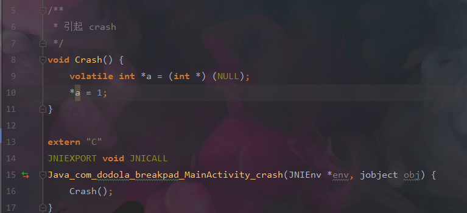
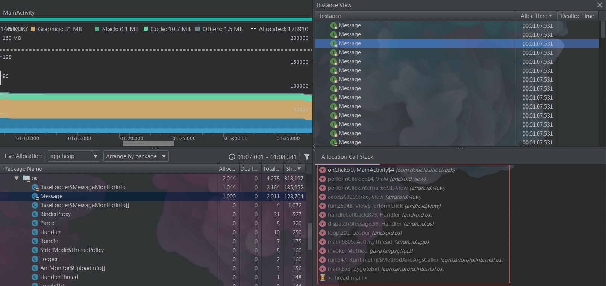
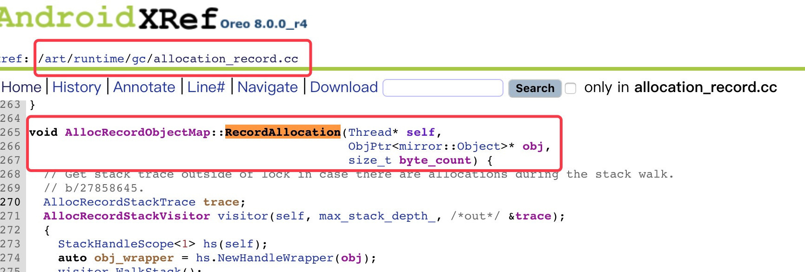
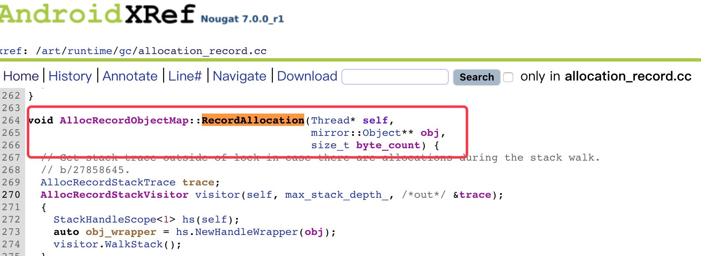
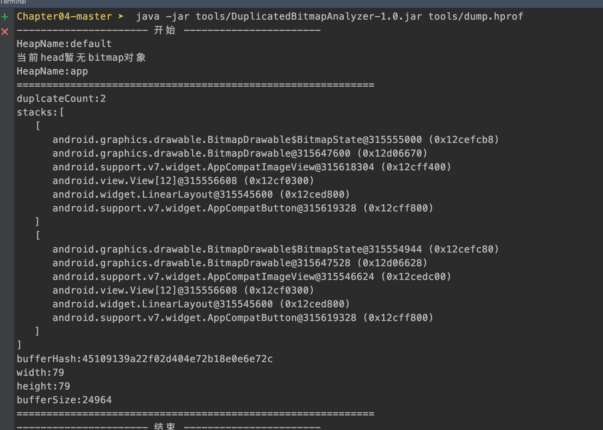
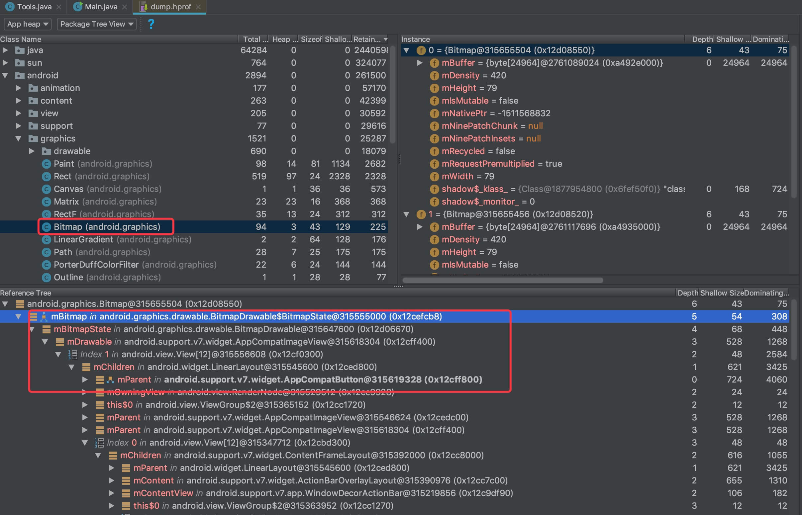

<!DOCTYPE html>
<html xmlns="http://www.w3.org/1999/xhtml">

<head>

    <head>
        <meta http-equiv="Content-Type" content="text/html; charset=UTF-8">
        <meta name="viewport" content="width=device-width, initial-scale=1, maximum-scale=1.0, user-scalable=no">
        <meta http-equiv='content-language' content='zh-cn'>
        <meta name='description' content=练习Sample跑起来&#32;唯鹿同学的练习手记&#32;第1辑>
        <link rel="icon" href="/static/favicon.png">
        <title>练习Sample跑起来 唯鹿同学的练习手记 第1辑 </title>
        
        <link rel="stylesheet" href="/static/index.css">
        <link rel="stylesheet" href="/static/highlight.min.css">
        
        
        <meta name="generator" content="Hexo 4.2.0">
        
    </head>

<body>
    

        

            

                <a href="/">
                    
                    技术文章摘抄
                </a>
            

            

                <ul class="uncollapsible">
                    <li><a href="/" class="current-tab">首页</a></li>
                    <li><a href="../">上一级</a></li>
                </ul>
                <ul class="uncollapsible">
                    
                    <li>
                        <a class="menu-item" id="00 导读 如何打造高质量的应用？.md" href="/%e4%b8%93%e6%a0%8f/Android%e5%bc%80%e5%8f%91%e9%ab%98%e6%89%8b%e8%af%be/00%20%e5%af%bc%e8%af%bb%20%e5%a6%82%e4%bd%95%e6%89%93%e9%80%a0%e9%ab%98%e8%b4%a8%e9%87%8f%e7%9a%84%e5%ba%94%e7%94%a8%ef%bc%9f.md">00 导读 如何打造高质量的应用？.md</a>
                    </li>
                    
                    <li>
                        <a class="menu-item" id="00 开篇词 焦虑的移动开发者该如何破局？.md" href="/%e4%b8%93%e6%a0%8f/Android%e5%bc%80%e5%8f%91%e9%ab%98%e6%89%8b%e8%af%be/00%20%e5%bc%80%e7%af%87%e8%af%8d%20%e7%84%a6%e8%99%91%e7%9a%84%e7%a7%bb%e5%8a%a8%e5%bc%80%e5%8f%91%e8%80%85%e8%af%a5%e5%a6%82%e4%bd%95%e7%a0%b4%e5%b1%80%ef%bc%9f.md">00 开篇词 焦虑的移动开发者该如何破局？.md</a>
                    </li>
                    
                    <li>
                        <a class="menu-item" id="01 崩溃优化（上）：关于“崩溃”那些事儿.md" href="/%e4%b8%93%e6%a0%8f/Android%e5%bc%80%e5%8f%91%e9%ab%98%e6%89%8b%e8%af%be/01%20%e5%b4%a9%e6%ba%83%e4%bc%98%e5%8c%96%ef%bc%88%e4%b8%8a%ef%bc%89%ef%bc%9a%e5%85%b3%e4%ba%8e%e2%80%9c%e5%b4%a9%e6%ba%83%e2%80%9d%e9%82%a3%e4%ba%9b%e4%ba%8b%e5%84%bf.md">01 崩溃优化（上）：关于“崩溃”那些事儿.md</a>
                    </li>
                    
                    <li>
                        <a class="menu-item" id="02 崩溃优化（下）：应用崩溃了，你应该如何去分析？.md" href="/%e4%b8%93%e6%a0%8f/Android%e5%bc%80%e5%8f%91%e9%ab%98%e6%89%8b%e8%af%be/02%20%e5%b4%a9%e6%ba%83%e4%bc%98%e5%8c%96%ef%bc%88%e4%b8%8b%ef%bc%89%ef%bc%9a%e5%ba%94%e7%94%a8%e5%b4%a9%e6%ba%83%e4%ba%86%ef%bc%8c%e4%bd%a0%e5%ba%94%e8%af%a5%e5%a6%82%e4%bd%95%e5%8e%bb%e5%88%86%e6%9e%90%ef%bc%9f.md">02 崩溃优化（下）：应用崩溃了，你应该如何去分析？.md</a>
                    </li>
                    
                    <li>
                        <a class="menu-item" id="03 内存优化（上）：4GB内存时代，再谈内存优化.md" href="/%e4%b8%93%e6%a0%8f/Android%e5%bc%80%e5%8f%91%e9%ab%98%e6%89%8b%e8%af%be/03%20%e5%86%85%e5%ad%98%e4%bc%98%e5%8c%96%ef%bc%88%e4%b8%8a%ef%bc%89%ef%bc%9a4GB%e5%86%85%e5%ad%98%e6%97%b6%e4%bb%a3%ef%bc%8c%e5%86%8d%e8%b0%88%e5%86%85%e5%ad%98%e4%bc%98%e5%8c%96.md">03 内存优化（上）：4GB内存时代，再谈内存优化.md</a>
                    </li>
                    
                    <li>
                        <a class="menu-item" id="04 内存优化（下）：内存优化这件事，应该从哪里着手？.md" href="/%e4%b8%93%e6%a0%8f/Android%e5%bc%80%e5%8f%91%e9%ab%98%e6%89%8b%e8%af%be/04%20%e5%86%85%e5%ad%98%e4%bc%98%e5%8c%96%ef%bc%88%e4%b8%8b%ef%bc%89%ef%bc%9a%e5%86%85%e5%ad%98%e4%bc%98%e5%8c%96%e8%bf%99%e4%bb%b6%e4%ba%8b%ef%bc%8c%e5%ba%94%e8%af%a5%e4%bb%8e%e5%93%aa%e9%87%8c%e7%9d%80%e6%89%8b%ef%bc%9f.md">04 内存优化（下）：内存优化这件事，应该从哪里着手？.md</a>
                    </li>
                    
                    <li>
                        <a class="menu-item" id="05 卡顿优化（上）：你要掌握的卡顿分析方法.md" href="/%e4%b8%93%e6%a0%8f/Android%e5%bc%80%e5%8f%91%e9%ab%98%e6%89%8b%e8%af%be/05%20%e5%8d%a1%e9%a1%bf%e4%bc%98%e5%8c%96%ef%bc%88%e4%b8%8a%ef%bc%89%ef%bc%9a%e4%bd%a0%e8%a6%81%e6%8e%8c%e6%8f%a1%e7%9a%84%e5%8d%a1%e9%a1%bf%e5%88%86%e6%9e%90%e6%96%b9%e6%b3%95.md">05 卡顿优化（上）：你要掌握的卡顿分析方法.md</a>
                    </li>
                    
                    <li>
                        <a class="menu-item" id="06 卡顿优化（下）：如何监控应用卡顿？.md" href="/%e4%b8%93%e6%a0%8f/Android%e5%bc%80%e5%8f%91%e9%ab%98%e6%89%8b%e8%af%be/06%20%e5%8d%a1%e9%a1%bf%e4%bc%98%e5%8c%96%ef%bc%88%e4%b8%8b%ef%bc%89%ef%bc%9a%e5%a6%82%e4%bd%95%e7%9b%91%e6%8e%a7%e5%ba%94%e7%94%a8%e5%8d%a1%e9%a1%bf%ef%bc%9f.md">06 卡顿优化（下）：如何监控应用卡顿？.md</a>
                    </li>
                    
                    <li>
                        <a class="menu-item" id="06补充篇 卡顿优化：卡顿现场与卡顿分析.md" href="/%e4%b8%93%e6%a0%8f/Android%e5%bc%80%e5%8f%91%e9%ab%98%e6%89%8b%e8%af%be/06%e8%a1%a5%e5%85%85%e7%af%87%20%e5%8d%a1%e9%a1%bf%e4%bc%98%e5%8c%96%ef%bc%9a%e5%8d%a1%e9%a1%bf%e7%8e%b0%e5%9c%ba%e4%b8%8e%e5%8d%a1%e9%a1%bf%e5%88%86%e6%9e%90.md">06补充篇 卡顿优化：卡顿现场与卡顿分析.md</a>
                    </li>
                    
                    <li>
                        <a class="menu-item" id="07 启动优化（上）：从启动过程看启动速度优化.md" href="/%e4%b8%93%e6%a0%8f/Android%e5%bc%80%e5%8f%91%e9%ab%98%e6%89%8b%e8%af%be/07%20%e5%90%af%e5%8a%a8%e4%bc%98%e5%8c%96%ef%bc%88%e4%b8%8a%ef%bc%89%ef%bc%9a%e4%bb%8e%e5%90%af%e5%8a%a8%e8%bf%87%e7%a8%8b%e7%9c%8b%e5%90%af%e5%8a%a8%e9%80%9f%e5%ba%a6%e4%bc%98%e5%8c%96.md">07 启动优化（上）：从启动过程看启动速度优化.md</a>
                    </li>
                    
                    <li>
                        <a class="menu-item" id="08 启动优化（下）：优化启动速度的进阶方法.md" href="/%e4%b8%93%e6%a0%8f/Android%e5%bc%80%e5%8f%91%e9%ab%98%e6%89%8b%e8%af%be/08%20%e5%90%af%e5%8a%a8%e4%bc%98%e5%8c%96%ef%bc%88%e4%b8%8b%ef%bc%89%ef%bc%9a%e4%bc%98%e5%8c%96%e5%90%af%e5%8a%a8%e9%80%9f%e5%ba%a6%e7%9a%84%e8%bf%9b%e9%98%b6%e6%96%b9%e6%b3%95.md">08 启动优化（下）：优化启动速度的进阶方法.md</a>
                    </li>
                    
                    <li>
                        <a class="menu-item" id="09 I_O优化（上）：开发工程师必备的I_O优化知识.md" href="/%e4%b8%93%e6%a0%8f/Android%e5%bc%80%e5%8f%91%e9%ab%98%e6%89%8b%e8%af%be/09%20I_O%e4%bc%98%e5%8c%96%ef%bc%88%e4%b8%8a%ef%bc%89%ef%bc%9a%e5%bc%80%e5%8f%91%e5%b7%a5%e7%a8%8b%e5%b8%88%e5%bf%85%e5%a4%87%e7%9a%84I_O%e4%bc%98%e5%8c%96%e7%9f%a5%e8%af%86.md">09 I_O优化（上）：开发工程师必备的I_O优化知识.md</a>
                    </li>
                    
                    <li>
                        <a class="menu-item" id="10 I_O优化（中）：不同I_O方式的使用场景是什么？.md" href="/%e4%b8%93%e6%a0%8f/Android%e5%bc%80%e5%8f%91%e9%ab%98%e6%89%8b%e8%af%be/10%20I_O%e4%bc%98%e5%8c%96%ef%bc%88%e4%b8%ad%ef%bc%89%ef%bc%9a%e4%b8%8d%e5%90%8cI_O%e6%96%b9%e5%bc%8f%e7%9a%84%e4%bd%bf%e7%94%a8%e5%9c%ba%e6%99%af%e6%98%af%e4%bb%80%e4%b9%88%ef%bc%9f.md">10 I_O优化（中）：不同I_O方式的使用场景是什么？.md</a>
                    </li>
                    
                    <li>
                        <a class="menu-item" id="11 I_O优化（下）：如何监控线上I_O操作？.md" href="/%e4%b8%93%e6%a0%8f/Android%e5%bc%80%e5%8f%91%e9%ab%98%e6%89%8b%e8%af%be/11%20I_O%e4%bc%98%e5%8c%96%ef%bc%88%e4%b8%8b%ef%bc%89%ef%bc%9a%e5%a6%82%e4%bd%95%e7%9b%91%e6%8e%a7%e7%ba%bf%e4%b8%8aI_O%e6%93%8d%e4%bd%9c%ef%bc%9f.md">11 I_O优化（下）：如何监控线上I_O操作？.md</a>
                    </li>
                    
                    <li>
                        <a class="menu-item" id="12 存储优化（上）：常见的数据存储方法有哪些？.md" href="/%e4%b8%93%e6%a0%8f/Android%e5%bc%80%e5%8f%91%e9%ab%98%e6%89%8b%e8%af%be/12%20%e5%ad%98%e5%82%a8%e4%bc%98%e5%8c%96%ef%bc%88%e4%b8%8a%ef%bc%89%ef%bc%9a%e5%b8%b8%e8%a7%81%e7%9a%84%e6%95%b0%e6%8d%ae%e5%ad%98%e5%82%a8%e6%96%b9%e6%b3%95%e6%9c%89%e5%93%aa%e4%ba%9b%ef%bc%9f.md">12 存储优化（上）：常见的数据存储方法有哪些？.md</a>
                    </li>
                    
                    <li>
                        <a class="menu-item" id="13 存储优化（中）：如何优化数据存储？.md" href="/%e4%b8%93%e6%a0%8f/Android%e5%bc%80%e5%8f%91%e9%ab%98%e6%89%8b%e8%af%be/13%20%e5%ad%98%e5%82%a8%e4%bc%98%e5%8c%96%ef%bc%88%e4%b8%ad%ef%bc%89%ef%bc%9a%e5%a6%82%e4%bd%95%e4%bc%98%e5%8c%96%e6%95%b0%e6%8d%ae%e5%ad%98%e5%82%a8%ef%bc%9f.md">13 存储优化（中）：如何优化数据存储？.md</a>
                    </li>
                    
                    <li>
                        <a class="menu-item" id="14 存储优化（下）：数据库SQLite的使用和优化.md" href="/%e4%b8%93%e6%a0%8f/Android%e5%bc%80%e5%8f%91%e9%ab%98%e6%89%8b%e8%af%be/14%20%e5%ad%98%e5%82%a8%e4%bc%98%e5%8c%96%ef%bc%88%e4%b8%8b%ef%bc%89%ef%bc%9a%e6%95%b0%e6%8d%ae%e5%ba%93SQLite%e7%9a%84%e4%bd%bf%e7%94%a8%e5%92%8c%e4%bc%98%e5%8c%96.md">14 存储优化（下）：数据库SQLite的使用和优化.md</a>
                    </li>
                    
                    <li>
                        <a class="menu-item" id="15 网络优化（上）：移动开发工程师必备的网络优化知识.md" href="/%e4%b8%93%e6%a0%8f/Android%e5%bc%80%e5%8f%91%e9%ab%98%e6%89%8b%e8%af%be/15%20%e7%bd%91%e7%bb%9c%e4%bc%98%e5%8c%96%ef%bc%88%e4%b8%8a%ef%bc%89%ef%bc%9a%e7%a7%bb%e5%8a%a8%e5%bc%80%e5%8f%91%e5%b7%a5%e7%a8%8b%e5%b8%88%e5%bf%85%e5%a4%87%e7%9a%84%e7%bd%91%e7%bb%9c%e4%bc%98%e5%8c%96%e7%9f%a5%e8%af%86.md">15 网络优化（上）：移动开发工程师必备的网络优化知识.md</a>
                    </li>
                    
                    <li>
                        <a class="menu-item" id="16 网络优化（中）：复杂多变的移动网络该如何优化？.md" href="/%e4%b8%93%e6%a0%8f/Android%e5%bc%80%e5%8f%91%e9%ab%98%e6%89%8b%e8%af%be/16%20%e7%bd%91%e7%bb%9c%e4%bc%98%e5%8c%96%ef%bc%88%e4%b8%ad%ef%bc%89%ef%bc%9a%e5%a4%8d%e6%9d%82%e5%a4%9a%e5%8f%98%e7%9a%84%e7%a7%bb%e5%8a%a8%e7%bd%91%e7%bb%9c%e8%af%a5%e5%a6%82%e4%bd%95%e4%bc%98%e5%8c%96%ef%bc%9f.md">16 网络优化（中）：复杂多变的移动网络该如何优化？.md</a>
                    </li>
                    
                    <li>
                        <a class="menu-item" id="17 网络优化（下）：大数据下网络该如何监控？.md" href="/%e4%b8%93%e6%a0%8f/Android%e5%bc%80%e5%8f%91%e9%ab%98%e6%89%8b%e8%af%be/17%20%e7%bd%91%e7%bb%9c%e4%bc%98%e5%8c%96%ef%bc%88%e4%b8%8b%ef%bc%89%ef%bc%9a%e5%a4%a7%e6%95%b0%e6%8d%ae%e4%b8%8b%e7%bd%91%e7%bb%9c%e8%af%a5%e5%a6%82%e4%bd%95%e7%9b%91%e6%8e%a7%ef%bc%9f.md">17 网络优化（下）：大数据下网络该如何监控？.md</a>
                    </li>
                    
                    <li>
                        <a class="menu-item" id="18 耗电优化（上）：从电量优化的演进看耗电分析.md" href="/%e4%b8%93%e6%a0%8f/Android%e5%bc%80%e5%8f%91%e9%ab%98%e6%89%8b%e8%af%be/18%20%e8%80%97%e7%94%b5%e4%bc%98%e5%8c%96%ef%bc%88%e4%b8%8a%ef%bc%89%ef%bc%9a%e4%bb%8e%e7%94%b5%e9%87%8f%e4%bc%98%e5%8c%96%e7%9a%84%e6%bc%94%e8%bf%9b%e7%9c%8b%e8%80%97%e7%94%b5%e5%88%86%e6%9e%90.md">18 耗电优化（上）：从电量优化的演进看耗电分析.md</a>
                    </li>
                    
                    <li>
                        <a class="menu-item" id="19 耗电优化（下）：耗电的优化方法与线上监控.md" href="/%e4%b8%93%e6%a0%8f/Android%e5%bc%80%e5%8f%91%e9%ab%98%e6%89%8b%e8%af%be/19%20%e8%80%97%e7%94%b5%e4%bc%98%e5%8c%96%ef%bc%88%e4%b8%8b%ef%bc%89%ef%bc%9a%e8%80%97%e7%94%b5%e7%9a%84%e4%bc%98%e5%8c%96%e6%96%b9%e6%b3%95%e4%b8%8e%e7%ba%bf%e4%b8%8a%e7%9b%91%e6%8e%a7.md">19 耗电优化（下）：耗电的优化方法与线上监控.md</a>
                    </li>
                    
                    <li>
                        <a class="menu-item" id="20 UI 优化（上）：UI 渲染的几个关键概念.md" href="/%e4%b8%93%e6%a0%8f/Android%e5%bc%80%e5%8f%91%e9%ab%98%e6%89%8b%e8%af%be/20%20UI%20%e4%bc%98%e5%8c%96%ef%bc%88%e4%b8%8a%ef%bc%89%ef%bc%9aUI%20%e6%b8%b2%e6%9f%93%e7%9a%84%e5%87%a0%e4%b8%aa%e5%85%b3%e9%94%ae%e6%a6%82%e5%bf%b5.md">20 UI 优化（上）：UI 渲染的几个关键概念.md</a>
                    </li>
                    
                    <li>
                        <a class="menu-item" id="21 UI 优化（下）：如何优化 UI 渲染？.md" href="/%e4%b8%93%e6%a0%8f/Android%e5%bc%80%e5%8f%91%e9%ab%98%e6%89%8b%e8%af%be/21%20UI%20%e4%bc%98%e5%8c%96%ef%bc%88%e4%b8%8b%ef%bc%89%ef%bc%9a%e5%a6%82%e4%bd%95%e4%bc%98%e5%8c%96%20UI%20%e6%b8%b2%e6%9f%93%ef%bc%9f.md">21 UI 优化（下）：如何优化 UI 渲染？.md</a>
                    </li>
                    
                    <li>
                        <a class="menu-item" id="22 包体积优化（上）：如何减少安装包大小？.md" href="/%e4%b8%93%e6%a0%8f/Android%e5%bc%80%e5%8f%91%e9%ab%98%e6%89%8b%e8%af%be/22%20%e5%8c%85%e4%bd%93%e7%a7%af%e4%bc%98%e5%8c%96%ef%bc%88%e4%b8%8a%ef%bc%89%ef%bc%9a%e5%a6%82%e4%bd%95%e5%87%8f%e5%b0%91%e5%ae%89%e8%a3%85%e5%8c%85%e5%a4%a7%e5%b0%8f%ef%bc%9f.md">22 包体积优化（上）：如何减少安装包大小？.md</a>
                    </li>
                    
                    <li>
                        <a class="menu-item" id="23 包体积优化（下）：资源优化的进阶实践.md" href="/%e4%b8%93%e6%a0%8f/Android%e5%bc%80%e5%8f%91%e9%ab%98%e6%89%8b%e8%af%be/23%20%e5%8c%85%e4%bd%93%e7%a7%af%e4%bc%98%e5%8c%96%ef%bc%88%e4%b8%8b%ef%bc%89%ef%bc%9a%e8%b5%84%e6%ba%90%e4%bc%98%e5%8c%96%e7%9a%84%e8%bf%9b%e9%98%b6%e5%ae%9e%e8%b7%b5.md">23 包体积优化（下）：资源优化的进阶实践.md</a>
                    </li>
                    
                    <li>
                        <a class="menu-item" id="24 想成为Android高手，你需要先搞定这三个问题.md" href="/%e4%b8%93%e6%a0%8f/Android%e5%bc%80%e5%8f%91%e9%ab%98%e6%89%8b%e8%af%be/24%20%e6%83%b3%e6%88%90%e4%b8%baAndroid%e9%ab%98%e6%89%8b%ef%bc%8c%e4%bd%a0%e9%9c%80%e8%a6%81%e5%85%88%e6%90%9e%e5%ae%9a%e8%bf%99%e4%b8%89%e4%b8%aa%e9%97%ae%e9%a2%98.md">24 想成为Android高手，你需要先搞定这三个问题.md</a>
                    </li>
                    
                    <li>
                        <a class="menu-item" id="25 如何提升组织与个人的研发效能？.md" href="/%e4%b8%93%e6%a0%8f/Android%e5%bc%80%e5%8f%91%e9%ab%98%e6%89%8b%e8%af%be/25%20%e5%a6%82%e4%bd%95%e6%8f%90%e5%8d%87%e7%bb%84%e7%bb%87%e4%b8%8e%e4%b8%aa%e4%ba%ba%e7%9a%84%e7%a0%94%e5%8f%91%e6%95%88%e8%83%bd%ef%bc%9f.md">25 如何提升组织与个人的研发效能？.md</a>
                    </li>
                    
                    <li>
                        <a class="menu-item" id="26 关于编译，你需要了解什么？.md" href="/%e4%b8%93%e6%a0%8f/Android%e5%bc%80%e5%8f%91%e9%ab%98%e6%89%8b%e8%af%be/26%20%e5%85%b3%e4%ba%8e%e7%bc%96%e8%af%91%ef%bc%8c%e4%bd%a0%e9%9c%80%e8%a6%81%e4%ba%86%e8%a7%a3%e4%bb%80%e4%b9%88%ef%bc%9f.md">26 关于编译，你需要了解什么？.md</a>
                    </li>
                    
                    <li>
                        <a class="menu-item" id="27 编译插桩的三种方法：AspectJ、ASM、ReDex.md" href="/%e4%b8%93%e6%a0%8f/Android%e5%bc%80%e5%8f%91%e9%ab%98%e6%89%8b%e8%af%be/27%20%e7%bc%96%e8%af%91%e6%8f%92%e6%a1%a9%e7%9a%84%e4%b8%89%e7%a7%8d%e6%96%b9%e6%b3%95%ef%bc%9aAspectJ%e3%80%81ASM%e3%80%81ReDex.md">27 编译插桩的三种方法：AspectJ、ASM、ReDex.md</a>
                    </li>
                    
                    <li>
                        <a class="menu-item" id="28 大数据与AI，如何高效地测试？.md" href="/%e4%b8%93%e6%a0%8f/Android%e5%bc%80%e5%8f%91%e9%ab%98%e6%89%8b%e8%af%be/28%20%e5%a4%a7%e6%95%b0%e6%8d%ae%e4%b8%8eAI%ef%bc%8c%e5%a6%82%e4%bd%95%e9%ab%98%e6%95%88%e5%9c%b0%e6%b5%8b%e8%af%95%ef%bc%9f.md">28 大数据与AI，如何高效地测试？.md</a>
                    </li>
                    
                    <li>
                        <a class="menu-item" id="29 从每月到每天，如何给版本发布提速？.md" href="/%e4%b8%93%e6%a0%8f/Android%e5%bc%80%e5%8f%91%e9%ab%98%e6%89%8b%e8%af%be/29%20%e4%bb%8e%e6%af%8f%e6%9c%88%e5%88%b0%e6%af%8f%e5%a4%a9%ef%bc%8c%e5%a6%82%e4%bd%95%e7%bb%99%e7%89%88%e6%9c%ac%e5%8f%91%e5%b8%83%e6%8f%90%e9%80%9f%ef%bc%9f.md">29 从每月到每天，如何给版本发布提速？.md</a>
                    </li>
                    
                    <li>
                        <a class="menu-item" id="30 数据评估（上）：如何实现高可用的上报组件？.md" href="/%e4%b8%93%e6%a0%8f/Android%e5%bc%80%e5%8f%91%e9%ab%98%e6%89%8b%e8%af%be/30%20%e6%95%b0%e6%8d%ae%e8%af%84%e4%bc%b0%ef%bc%88%e4%b8%8a%ef%bc%89%ef%bc%9a%e5%a6%82%e4%bd%95%e5%ae%9e%e7%8e%b0%e9%ab%98%e5%8f%af%e7%94%a8%e7%9a%84%e4%b8%8a%e6%8a%a5%e7%bb%84%e4%bb%b6%ef%bc%9f.md">30 数据评估（上）：如何实现高可用的上报组件？.md</a>
                    </li>
                    
                    <li>
                        <a class="menu-item" id="31 数据评估（下）：什么是大数据平台？.md" href="/%e4%b8%93%e6%a0%8f/Android%e5%bc%80%e5%8f%91%e9%ab%98%e6%89%8b%e8%af%be/31%20%e6%95%b0%e6%8d%ae%e8%af%84%e4%bc%b0%ef%bc%88%e4%b8%8b%ef%bc%89%ef%bc%9a%e4%bb%80%e4%b9%88%e6%98%af%e5%a4%a7%e6%95%b0%e6%8d%ae%e5%b9%b3%e5%8f%b0%ef%bc%9f.md">31 数据评估（下）：什么是大数据平台？.md</a>
                    </li>
                    
                    <li>
                        <a class="menu-item" id="32 线上疑难问题该如何排查和跟踪？.md" href="/%e4%b8%93%e6%a0%8f/Android%e5%bc%80%e5%8f%91%e9%ab%98%e6%89%8b%e8%af%be/32%20%e7%ba%bf%e4%b8%8a%e7%96%91%e9%9a%be%e9%97%ae%e9%a2%98%e8%af%a5%e5%a6%82%e4%bd%95%e6%8e%92%e6%9f%a5%e5%92%8c%e8%b7%9f%e8%b8%aa%ef%bc%9f.md">32 线上疑难问题该如何排查和跟踪？.md</a>
                    </li>
                    
                    <li>
                        <a class="menu-item" id="33 做一名有高度的移动开发工程师.md" href="/%e4%b8%93%e6%a0%8f/Android%e5%bc%80%e5%8f%91%e9%ab%98%e6%89%8b%e8%af%be/33%20%e5%81%9a%e4%b8%80%e5%90%8d%e6%9c%89%e9%ab%98%e5%ba%a6%e7%9a%84%e7%a7%bb%e5%8a%a8%e5%bc%80%e5%8f%91%e5%b7%a5%e7%a8%8b%e5%b8%88.md">33 做一名有高度的移动开发工程师.md</a>
                    </li>
                    
                    <li>
                        <a class="menu-item" id="34 聊聊重构：优秀的架构都是演进而来的.md" href="/%e4%b8%93%e6%a0%8f/Android%e5%bc%80%e5%8f%91%e9%ab%98%e6%89%8b%e8%af%be/34%20%e8%81%8a%e8%81%8a%e9%87%8d%e6%9e%84%ef%bc%9a%e4%bc%98%e7%a7%80%e7%9a%84%e6%9e%b6%e6%9e%84%e9%83%bd%e6%98%af%e6%bc%94%e8%bf%9b%e8%80%8c%e6%9d%a5%e7%9a%84.md">34 聊聊重构：优秀的架构都是演进而来的.md</a>
                    </li>
                    
                    <li>
                        <a class="menu-item" id="35 Native Hook 技术，天使还是魔鬼？.md" href="/%e4%b8%93%e6%a0%8f/Android%e5%bc%80%e5%8f%91%e9%ab%98%e6%89%8b%e8%af%be/35%20Native%20Hook%20%e6%8a%80%e6%9c%af%ef%bc%8c%e5%a4%a9%e4%bd%bf%e8%bf%98%e6%98%af%e9%ad%94%e9%ac%bc%ef%bc%9f.md">35 Native Hook 技术，天使还是魔鬼？.md</a>
                    </li>
                    
                    <li>
                        <a class="menu-item" id="36 跨平台开发的现状与应用.md" href="/%e4%b8%93%e6%a0%8f/Android%e5%bc%80%e5%8f%91%e9%ab%98%e6%89%8b%e8%af%be/36%20%e8%b7%a8%e5%b9%b3%e5%8f%b0%e5%bc%80%e5%8f%91%e7%9a%84%e7%8e%b0%e7%8a%b6%e4%b8%8e%e5%ba%94%e7%94%a8.md">36 跨平台开发的现状与应用.md</a>
                    </li>
                    
                    <li>
                        <a class="menu-item" id="37 移动开发新大陆：工作三年半，移动开发转型手游开发.md" href="/%e4%b8%93%e6%a0%8f/Android%e5%bc%80%e5%8f%91%e9%ab%98%e6%89%8b%e8%af%be/37%20%e7%a7%bb%e5%8a%a8%e5%bc%80%e5%8f%91%e6%96%b0%e5%a4%a7%e9%99%86%ef%bc%9a%e5%b7%a5%e4%bd%9c%e4%b8%89%e5%b9%b4%e5%8d%8a%ef%bc%8c%e7%a7%bb%e5%8a%a8%e5%bc%80%e5%8f%91%e8%bd%ac%e5%9e%8b%e6%89%8b%e6%b8%b8%e5%bc%80%e5%8f%91.md">37 移动开发新大陆：工作三年半，移动开发转型手游开发.md</a>
                    </li>
                    
                    <li>
                        <a class="menu-item" id="38 移动开发新大陆：Android音视频开发.md" href="/%e4%b8%93%e6%a0%8f/Android%e5%bc%80%e5%8f%91%e9%ab%98%e6%89%8b%e8%af%be/38%20%e7%a7%bb%e5%8a%a8%e5%bc%80%e5%8f%91%e6%96%b0%e5%a4%a7%e9%99%86%ef%bc%9aAndroid%e9%9f%b3%e8%a7%86%e9%a2%91%e5%bc%80%e5%8f%91.md">38 移动开发新大陆：Android音视频开发.md</a>
                    </li>
                    
                    <li>
                        <a class="menu-item" id="39 移动开发新大陆： 边缘智能计算的趋势.md" href="/%e4%b8%93%e6%a0%8f/Android%e5%bc%80%e5%8f%91%e9%ab%98%e6%89%8b%e8%af%be/39%20%e7%a7%bb%e5%8a%a8%e5%bc%80%e5%8f%91%e6%96%b0%e5%a4%a7%e9%99%86%ef%bc%9a%20%e8%be%b9%e7%bc%98%e6%99%ba%e8%83%bd%e8%ae%a1%e7%ae%97%e7%9a%84%e8%b6%8b%e5%8a%bf.md">39 移动开发新大陆： 边缘智能计算的趋势.md</a>
                    </li>
                    
                    <li>
                        <a class="menu-item" id="40 动态化实践，如何选择适合自己的方案？.md" href="/%e4%b8%93%e6%a0%8f/Android%e5%bc%80%e5%8f%91%e9%ab%98%e6%89%8b%e8%af%be/40%20%e5%8a%a8%e6%80%81%e5%8c%96%e5%ae%9e%e8%b7%b5%ef%bc%8c%e5%a6%82%e4%bd%95%e9%80%89%e6%8b%a9%e9%80%82%e5%90%88%e8%87%aa%e5%b7%b1%e7%9a%84%e6%96%b9%e6%a1%88%ef%bc%9f.md">40 动态化实践，如何选择适合自己的方案？.md</a>
                    </li>
                    
                    <li>
                        <a class="menu-item" id="41 聊聊Flutter，面对层出不穷的新技术该如何跟进？.md" href="/%e4%b8%93%e6%a0%8f/Android%e5%bc%80%e5%8f%91%e9%ab%98%e6%89%8b%e8%af%be/41%20%e8%81%8a%e8%81%8aFlutter%ef%bc%8c%e9%9d%a2%e5%af%b9%e5%b1%82%e5%87%ba%e4%b8%8d%e7%a9%b7%e7%9a%84%e6%96%b0%e6%8a%80%e6%9c%af%e8%af%a5%e5%a6%82%e4%bd%95%e8%b7%9f%e8%bf%9b%ef%bc%9f.md">41 聊聊Flutter，面对层出不穷的新技术该如何跟进？.md</a>
                    </li>
                    
                    <li>
                        <a class="menu-item" id="42 Android开发高手课学习心得.md" href="/%e4%b8%93%e6%a0%8f/Android%e5%bc%80%e5%8f%91%e9%ab%98%e6%89%8b%e8%af%be/42%20Android%e5%bc%80%e5%8f%91%e9%ab%98%e6%89%8b%e8%af%be%e5%ad%a6%e4%b9%a0%e5%bf%83%e5%be%97.md">42 Android开发高手课学习心得.md</a>
                    </li>
                    
                    <li>
                        <a class="menu-item" id="Android JVM TI机制详解（内含福利彩蛋）.md" href="/%e4%b8%93%e6%a0%8f/Android%e5%bc%80%e5%8f%91%e9%ab%98%e6%89%8b%e8%af%be/Android%20JVM%20TI%e6%9c%ba%e5%88%b6%e8%af%a6%e8%a7%a3%ef%bc%88%e5%86%85%e5%90%ab%e7%a6%8f%e5%88%a9%e5%bd%a9%e8%9b%8b%ef%bc%89.md">Android JVM TI机制详解（内含福利彩蛋）.md</a>
                    </li>
                    
                    <li>
                        <a class="menu-item" id="Android工程师的“面试指南”.md" href="/%e4%b8%93%e6%a0%8f/Android%e5%bc%80%e5%8f%91%e9%ab%98%e6%89%8b%e8%af%be/Android%e5%b7%a5%e7%a8%8b%e5%b8%88%e7%9a%84%e2%80%9c%e9%9d%a2%e8%af%95%e6%8c%87%e5%8d%97%e2%80%9d.md">Android工程师的“面试指南”.md</a>
                    </li>
                    
                    <li>
                        <a class="menu-item" id="Native下如何获取调用栈？.md" href="/%e4%b8%93%e6%a0%8f/Android%e5%bc%80%e5%8f%91%e9%ab%98%e6%89%8b%e8%af%be/Native%e4%b8%8b%e5%a6%82%e4%bd%95%e8%8e%b7%e5%8f%96%e8%b0%83%e7%94%a8%e6%a0%88%ef%bc%9f.md">Native下如何获取调用栈？.md</a>
                    </li>
                    
                    <li>
                        <a class="menu-item" id="专栏学得苦？可能你还需要一份配套学习书单.md" href="/%e4%b8%93%e6%a0%8f/Android%e5%bc%80%e5%8f%91%e9%ab%98%e6%89%8b%e8%af%be/%e4%b8%93%e6%a0%8f%e5%ad%a6%e5%be%97%e8%8b%a6%ef%bc%9f%e5%8f%af%e8%83%bd%e4%bd%a0%e8%bf%98%e9%9c%80%e8%a6%81%e4%b8%80%e4%bb%bd%e9%85%8d%e5%a5%97%e5%ad%a6%e4%b9%a0%e4%b9%a6%e5%8d%95.md">专栏学得苦？可能你还需要一份配套学习书单.md</a>
                    </li>
                    
                    <li>
                        <a class="menu-item" id="专栏学得苦？可能是方法没找对.md" href="/%e4%b8%93%e6%a0%8f/Android%e5%bc%80%e5%8f%91%e9%ab%98%e6%89%8b%e8%af%be/%e4%b8%93%e6%a0%8f%e5%ad%a6%e5%be%97%e8%8b%a6%ef%bc%9f%e5%8f%af%e8%83%bd%e6%98%af%e6%96%b9%e6%b3%95%e6%b2%a1%e6%89%be%e5%af%b9.md">专栏学得苦？可能是方法没找对.md</a>
                    </li>
                    
                    <li>
                        <a class="menu-item" id="程序员修炼之路 设计能力的提升途径.md" href="/%e4%b8%93%e6%a0%8f/Android%e5%bc%80%e5%8f%91%e9%ab%98%e6%89%8b%e8%af%be/%e7%a8%8b%e5%ba%8f%e5%91%98%e4%bf%ae%e7%82%bc%e4%b9%8b%e8%b7%af%20%e8%ae%be%e8%ae%a1%e8%83%bd%e5%8a%9b%e7%9a%84%e6%8f%90%e5%8d%87%e9%80%94%e5%be%84.md">程序员修炼之路 设计能力的提升途径.md</a>
                    </li>
                    
                    <li>
                        <a class="menu-item" id="练习Sample跑起来 ASM插桩强化练习.md" href="/%e4%b8%93%e6%a0%8f/Android%e5%bc%80%e5%8f%91%e9%ab%98%e6%89%8b%e8%af%be/%e7%bb%83%e4%b9%a0Sample%e8%b7%91%e8%b5%b7%e6%9d%a5%20ASM%e6%8f%92%e6%a1%a9%e5%bc%ba%e5%8c%96%e7%bb%83%e4%b9%a0.md">练习Sample跑起来 ASM插桩强化练习.md</a>
                    </li>
                    
                    <li>
                        <a class="menu-item" id="练习Sample跑起来 唯鹿同学的练习手记 第1辑.md" href="/%e4%b8%93%e6%a0%8f/Android%e5%bc%80%e5%8f%91%e9%ab%98%e6%89%8b%e8%af%be/%e7%bb%83%e4%b9%a0Sample%e8%b7%91%e8%b5%b7%e6%9d%a5%20%e5%94%af%e9%b9%bf%e5%90%8c%e5%ad%a6%e7%9a%84%e7%bb%83%e4%b9%a0%e6%89%8b%e8%ae%b0%20%e7%ac%ac1%e8%be%91.md">练习Sample跑起来 唯鹿同学的练习手记 第1辑.md</a>
                    </li>
                    
                    <li>
                        <a class="menu-item" id="练习Sample跑起来 唯鹿同学的练习手记 第2辑.md" href="/%e4%b8%93%e6%a0%8f/Android%e5%bc%80%e5%8f%91%e9%ab%98%e6%89%8b%e8%af%be/%e7%bb%83%e4%b9%a0Sample%e8%b7%91%e8%b5%b7%e6%9d%a5%20%e5%94%af%e9%b9%bf%e5%90%8c%e5%ad%a6%e7%9a%84%e7%bb%83%e4%b9%a0%e6%89%8b%e8%ae%b0%20%e7%ac%ac2%e8%be%91.md">练习Sample跑起来 唯鹿同学的练习手记 第2辑.md</a>
                    </li>
                    
                    <li>
                        <a class="menu-item" id="练习Sample跑起来 唯鹿同学的练习手记 第3辑.md" href="/%e4%b8%93%e6%a0%8f/Android%e5%bc%80%e5%8f%91%e9%ab%98%e6%89%8b%e8%af%be/%e7%bb%83%e4%b9%a0Sample%e8%b7%91%e8%b5%b7%e6%9d%a5%20%e5%94%af%e9%b9%bf%e5%90%8c%e5%ad%a6%e7%9a%84%e7%bb%83%e4%b9%a0%e6%89%8b%e8%ae%b0%20%e7%ac%ac3%e8%be%91.md">练习Sample跑起来 唯鹿同学的练习手记 第3辑.md</a>
                    </li>
                    
                    <li>
                        <a class="menu-item" id="练习Sample跑起来 热点问题答疑第1期.md" href="/%e4%b8%93%e6%a0%8f/Android%e5%bc%80%e5%8f%91%e9%ab%98%e6%89%8b%e8%af%be/%e7%bb%83%e4%b9%a0Sample%e8%b7%91%e8%b5%b7%e6%9d%a5%20%e7%83%ad%e7%82%b9%e9%97%ae%e9%a2%98%e7%ad%94%e7%96%91%e7%ac%ac1%e6%9c%9f.md">练习Sample跑起来 热点问题答疑第1期.md</a>
                    </li>
                    
                    <li>
                        <a class="menu-item" id="练习Sample跑起来 热点问题答疑第2期.md" href="/%e4%b8%93%e6%a0%8f/Android%e5%bc%80%e5%8f%91%e9%ab%98%e6%89%8b%e8%af%be/%e7%bb%83%e4%b9%a0Sample%e8%b7%91%e8%b5%b7%e6%9d%a5%20%e7%83%ad%e7%82%b9%e9%97%ae%e9%a2%98%e7%ad%94%e7%96%91%e7%ac%ac2%e6%9c%9f.md">练习Sample跑起来 热点问题答疑第2期.md</a>
                    </li>
                    
                    <li>
                        <a class="menu-item" id="练习Sample跑起来 热点问题答疑第3期.md" href="/%e4%b8%93%e6%a0%8f/Android%e5%bc%80%e5%8f%91%e9%ab%98%e6%89%8b%e8%af%be/%e7%bb%83%e4%b9%a0Sample%e8%b7%91%e8%b5%b7%e6%9d%a5%20%e7%83%ad%e7%82%b9%e9%97%ae%e9%a2%98%e7%ad%94%e7%96%91%e7%ac%ac3%e6%9c%9f.md">练习Sample跑起来 热点问题答疑第3期.md</a>
                    </li>
                    
                    <li>
                        <a class="menu-item" id="练习Sample跑起来 热点问题答疑第4期.md" href="/%e4%b8%93%e6%a0%8f/Android%e5%bc%80%e5%8f%91%e9%ab%98%e6%89%8b%e8%af%be/%e7%bb%83%e4%b9%a0Sample%e8%b7%91%e8%b5%b7%e6%9d%a5%20%e7%83%ad%e7%82%b9%e9%97%ae%e9%a2%98%e7%ad%94%e7%96%91%e7%ac%ac4%e6%9c%9f.md">练习Sample跑起来 热点问题答疑第4期.md</a>
                    </li>
                    
                    <li>
                        <a class="menu-item" id="结束语 移动开发的今天和明天.md" href="/%e4%b8%93%e6%a0%8f/Android%e5%bc%80%e5%8f%91%e9%ab%98%e6%89%8b%e8%af%be/%e7%bb%93%e6%9d%9f%e8%af%ad%20%e7%a7%bb%e5%8a%a8%e5%bc%80%e5%8f%91%e7%9a%84%e4%bb%8a%e5%a4%a9%e5%92%8c%e6%98%8e%e5%a4%a9.md">结束语 移动开发的今天和明天.md</a>
                    </li>
                    
                    <li>
                        <a class="menu-item" id="聊聊Framework的学习方法.md" href="/%e4%b8%93%e6%a0%8f/Android%e5%bc%80%e5%8f%91%e9%ab%98%e6%89%8b%e8%af%be/%e8%81%8a%e8%81%8aFramework%e7%9a%84%e5%ad%a6%e4%b9%a0%e6%96%b9%e6%b3%95.md">聊聊Framework的学习方法.md</a>
                    </li>
                    
                    <li><a href="https://lianglianglee.com/assets/%E6%8D%90%E8%B5%A0.md">捐赠</a></li>
                </ul>

            

        

        

            

        

        

            

                

                    

                        
                        <header class="navbar">
                            <section class="navbar-section">
                                <a onclick="open_sidebar()">
                                    <i class="icon icon-menu"></i>
                                </a>
                            </section>
                        </header>
                    

                    

                        

                            
                            
                            
                            

                            <h1 id="title" data-id="练习Sample跑起来 唯鹿同学的练习手记 第1辑" class="title">练习Sample跑起来 唯鹿同学的练习手记 第1辑</h1>
                            
<blockquote>

你好，我是张绍文，今天我要跟你分享唯鹿同学完成专栏课后练习作业的“手记”。专栏承诺会为坚持完成练习作业的同学送出GMTC大会门票，唯鹿同学通过自己的努力和坚持，为自己赢得了GMTC大会的门票。

如果你还没开始练习，我强烈建议你花一些时间在练习上，因为每个练习的Sample都是我和学习委员花费很多精力精心准备的，为的是让你在学习完后可以有机会上手实践，帮你尽快消化专栏里的知识并为自己所用。

</blockquote>

大家好，我是唯鹿，来自西安，从事Android开发也有近5年的时间了，目前在做智慧社区方面的业务。我自己坚持写博客已经有三年多的时间了，希望分享自己在工作、学习中的收获。

先说说我学习专栏的方法，专栏更新当天我就会去学习，但是难度真的不小。我对自己的要求并不是看一遍就要搞明白，而是遇见不懂的地方立马查阅资料，要做到大体了解整篇内容。之后在周末的时候我会集中去做Sample练习，一边复习本周发布的内容，一边用写博客的方式记录练习的结果。

后面我计划专栏结束后再多看、多练习几遍，不断查漏补缺。说真的，我很喜欢《Android开发高手课》的难度，让我在完成练习作业时有种翻越高山的快感。最后，希望同学们一起坚持，享受翻越高山带来的成就感。

最近在学习张绍文老师的《Android开发高手课》。课后作业可不是一般的难，最近几天抽空练习了一下，结合老师给的步骤和其他同学的经验，完成了前5课的内容。

我整理总结了一下，分享出来，希望可以帮到一起学习的同学（当然希望大家尽量靠自己解决问题）。

<a href="https://github.com/AndroidAdvanceWithGeektime/Chapter01" target="_blank"><strong>Chapter01</strong></a>

<blockquote>

例子里集成了Breakpad来获取发生Native Crash时候的系统信息和线程堆栈信息。通过一个简单的Native崩溃捕获过程，完成minidump文件的生成和解析，在实践中加深对Breakpad工作机制的认识。

</blockquote>

直接运行项目，按照README.md的步骤操作就行。

中间有个问题，老师提供的minidump_stackwalker工具在macOS 10.14以上无法成功执行，因为没有libstdc++.6.dylib库，所以我就下载Breakpad源码重新编译了一遍。

使用minidump_stackwalker工具来根据minidump文件生成堆栈跟踪log，得到的crashLog.txt文件如下：

<pre><code>Operating system: Android
                  0.0.0 Linux 4.9.112-perf-gb92eddd #1 SMP PREEMPT Tue Jan 1 21:35:06 CST 2019 aarch64
CPU: arm64  // 注意点1
     8 CPUs

GPU: UNKNOWN

Crash reason:  SIGSEGV /SEGV_MAPERR
Crash address: 0x0
Process uptime: not available

Thread 0 (crashed)
 0  libcrash-lib.so + 0x600 // 注意点2
     x0 = 0x00000078e0ce8460    x1 = 0x0000007fd4000314
     x2 = 0x0000007fd40003b0    x3 = 0x00000078e0237134
     x4 = 0x0000007fd40005d0    x5 = 0x00000078dca14200
     x6 = 0x0000007fd4000160    x7 = 0x00000078c8987e18
     x8 = 0x0000000000000000    x9 = 0x0000000000000001
    x10 = 0x0000000000430000   x11 = 0x00000078e05ef688
    x12 = 0x00000079664ab050   x13 = 0x0ad046ab5a65bfdf
    x14 = 0x000000796650c000   x15 = 0xffffffffffffffff
    x16 = 0x00000078c83defe8   x17 = 0x00000078c83ce5ec
    x18 = 0x0000000000000001   x19 = 0x00000078e0c14c00
    x20 = 0x0000000000000000   x21 = 0x00000078e0c14c00
    x22 = 0x0000007fd40005e0   x23 = 0x00000078c89fa661
    x24 = 0x0000000000000004   x25 = 0x00000079666cc5e0
    x26 = 0x00000078e0c14ca0   x27 = 0x0000000000000001
    x28 = 0x0000007fd4000310    fp = 0x0000007fd40002e0
     lr = 0x00000078c83ce624    sp = 0x0000007fd40002c0
     pc = 0x00000078c83ce600
    Found by: given as instruction pointer in context
 1  libcrash-lib.so + 0x620
     fp = 0x0000007fd4000310    lr = 0x00000078e051c7e4
     sp = 0x0000007fd40002f0    pc = 0x00000078c83ce624
    Found by: previous frame's frame pointer
 2  libart.so + 0x55f7e0
     fp = 0x130c0cf800000001    lr = 0x00000079666cc5e0
     sp = 0x0000007fd4000320    pc = 0x00000078e051c7e4
    Found by: previous frame's frame pointer
......
</code></pre>

下来是符号解析，可以使用NDK中提供的<code>addr2line</code>来根据地址进行一个符号反解的过程，该工具在<code>$NDK_HOME/toolchains/arm-linux-androideabi-4.9/prebuilt/darwin-x86_64/bin/arm-linux-androideabi-addr2line</code>。

注意：此处要注意一下平台，如果是ARM 64位的so，解析是需要使用aarch64-linux-android-4.9下的工具链。

因为我的是ARM 64位的so。所以使用aarch64-linux-android-4.9，libcrash-lib.so在<code>app/build/intermediates/cmake/debug/obj/arm64-v8a</code>下，<code>0x600</code>为错误位置符号。

<pre><code>aarch64-linux-android-addr2line -f -C -e libcrash-lib.so 0x600
</code></pre>

输出结果如下：

<pre><code>Crash()
/Users/weilu/Downloads/Chapter01-master/sample/.externalNativeBuild/cmake/debug/arm64-v8a/../../../../src/main/cpp/crash.cpp:10
</code></pre>

可以看到输出结果与下图错误位置一致（第10行）。

<a href="https://github.com/AndroidAdvanceWithGeektime/Chapter02" target="_blank"><strong>Chapter02</strong></a>

<blockquote>

该例子主要演示了如何通过关闭FinalizerWatchdogDaemon来减少TimeoutException的触发。

</blockquote>

在我的上一篇博客：<a href="https://blog.csdn.net/qq_17766199/article/details/84789495#t1" target="_blank">安卓开发中遇到的奇奇怪怪的问题（三）</a>中有说明，就不重复赘述了。

<a href="https://github.com/AndroidAdvanceWithGeektime/Chapter03" target="_blank"><strong>Chapter03</strong></a>

<blockquote>

项目使用了Inline Hook来拦截内存对象分配时候的RecordAllocation函数，通过拦截该接口可以快速获取到当时分配对象的类名和分配的内存大小。

在初始化的时候我们设置了一个分配对象数量的最大值，如果从start开始对象分配数量超过最大值就会触发内存dump，然后清空alloc对象列表，重新计算。该功能和Android Studio里的Allocation Tracker类似，只不过可以在代码级别更细粒度的进行控制。可以精确到方法级别。

</blockquote>

项目直接跑起来后，点击开始记录，然后点击5次生成1000对象按钮。生成对象代码如下：

<pre><code>for (int i = 0; i &lt; 1000; i++) {
     Message msg = new Message();
     msg.what = i;
}
</code></pre>

因为代码从点击开始记录开始，触发到5000的数据就dump到文件中，点击5次后就会在<code>sdcard/crashDump</code>下生成一个时间戳命名的文件。项目根目录下调用命令：

<pre><code>java -jar tools/DumpPrinter-1.0.jar dump文件路径 &gt; dump_log.txt
</code></pre>

然后就可以在dump_log.txt中看到解析出来的数据：

<pre><code>Found 5000 records:
....
tid=4509 android.graphics.drawable.RippleForeground (112 bytes)
    android.graphics.drawable.RippleDrawable.tryRippleEnter (RippleDrawable.java:569)
    android.graphics.drawable.RippleDrawable.setRippleActive (RippleDrawable.java:276)
    android.graphics.drawable.RippleDrawable.onStateChange (RippleDrawable.java:266)
    android.graphics.drawable.Drawable.setState (Drawable.java:778)
    android.view.View.drawableStateChanged (View.java:21137)
    android.widget.TextView.drawableStateChanged (TextView.java:5289)
    android.support.v7.widget.AppCompatButton.drawableStateChanged (AppCompatButton.java:155)
    android.view.View.refreshDrawableState (View.java:21214)
    android.view.View.setPressed (View.java:10583)
    android.view.View.setPressed (View.java:10561)
    android.view.View.onTouchEvent (View.java:13865)
    android.widget.TextView.onTouchEvent (TextView.java:10070)
    android.view.View.dispatchTouchEvent (View.java:12533)
    android.view.ViewGroup.dispatchTransformedTouchEvent (ViewGroup.java:3032)
    android.view.ViewGroup.dispatchTouchEvent (ViewGroup.java:2662)
    android.view.ViewGroup.dispatchTransformedTouchEvent (ViewGroup.java:3032)
tid=4515 int[] (104 bytes)
tid=4509 android.os.BaseLooper$MessageMonitorInfo (88 bytes)
    android.os.Message.&lt;init&gt; (Message.java:123)
    com.dodola.alloctrack.MainActivity$4.onClick (MainActivity.java:70)
    android.view.View.performClick (View.java:6614)
    android.view.View.performClickInternal (View.java:6591)
    android.view.View.access$3100 (View.java:786)
    android.view.View$PerformClick.run (View.java:25948)
    android.os.Handler.handleCallback (Handler.java:873)
    android.os.Handler.dispatchMessage (Handler.java:99)
    android.os.Looper.loop (Looper.java:201)
    android.app.ActivityThread.main (ActivityThread.java:6806)
    java.lang.reflect.Method.invoke (Native method)
    com.android.internal.os.RuntimeInit$MethodAndArgsCaller.run (RuntimeInit.java:547)
    com.android.internal.os.ZygoteInit.main (ZygoteInit.java:873)
......
</code></pre>

我们用Android Profiler查找一个Message对象对比一下，一模一样。

简单看一下Hook代码：

<pre><code>void hookFunc() {
    LOGI(&quot;start hookFunc&quot;);
    void *handle = ndk_dlopen(&quot;libart.so&quot;, RTLD_LAZY | RTLD_GLOBAL);

    if (!handle) {
        LOGE(&quot;libart.so open fail&quot;);
        return;
    }
    void *hookRecordAllocation26 = ndk_dlsym(handle,
                                             &quot;_ZN3art2gc20AllocRecordObjectMap16RecordAllocationEPNS_6ThreadEPNS_6ObjPtrINS_6mirror6ObjectEEEj&quot;);

    void *hookRecordAllocation24 = ndk_dlsym(handle,
                                             &quot;_ZN3art2gc20AllocRecordObjectMap16RecordAllocationEPNS_6ThreadEPPNS_6mirror6ObjectEj&quot;);

    void *hookRecordAllocation23 = ndk_dlsym(handle,
                                             &quot;_ZN3art3Dbg16RecordAllocationEPNS_6ThreadEPNS_6mirror5ClassEj&quot;);

    void *hookRecordAllocation22 = ndk_dlsym(handle,
                                             &quot;_ZN3art3Dbg16RecordAllocationEPNS_6mirror5ClassEj&quot;);

    if (hookRecordAllocation26 != nullptr) {
        LOGI(&quot;Finish get symbol26&quot;);
        MSHookFunction(hookRecordAllocation26, (void *) &amp;newArtRecordAllocation26,
                       (void **) &amp;oldArtRecordAllocation26);

    } else if (hookRecordAllocation24 != nullptr) {
        LOGI(&quot;Finish get symbol24&quot;);
        MSHookFunction(hookRecordAllocation26, (void *) &amp;newArtRecordAllocation26,
                       (void **) &amp;oldArtRecordAllocation26);

    } else if (hookRecordAllocation23 != NULL) {
        LOGI(&quot;Finish get symbol23&quot;);
        MSHookFunction(hookRecordAllocation23, (void *) &amp;newArtRecordAllocation23,
                       (void **) &amp;oldArtRecordAllocation23);
    } else {
        LOGI(&quot;Finish get symbol22&quot;);
        if (hookRecordAllocation22 == NULL) {
            LOGI(&quot;error find hookRecordAllocation22&quot;);
            return;
        } else {
            MSHookFunction(hookRecordAllocation22, (void *) &amp;newArtRecordAllocation22,
                           (void **) &amp;oldArtRecordAllocation22);
        }
    }
    dlclose(handle);
}
</code></pre>

使用了Inline Hook方案Substrate来拦截内存对象分配时候libart.so的RecordAllocation函数。首先如果我们要hook一个函数，需要知道这个函数的地址。我们也看到了代码中这个地址判断了四种不同系统。这里有一个<a href="http://demangler.com/" target="_blank">网页版的解析工具</a>可以快速获取。下面以8.0为例。

我在8.0的源码中找到了对应的方法：

7.0方法就明显不同：

我也同时参看了9.0的代码，发现没有变化，所以我的测试机是9.0的也没有问题。

Hook新内存对象分配处理代码：

<pre><code>static bool newArtRecordAllocationDoing24(Class *type, size_t byte_count) {

    allocObjectCount++;
	//根据 class 获取类名
    char *typeName = GetDescriptor(type, &amp;a);
    //达到 max
    if (allocObjectCount &gt; setAllocRecordMax) {
        CMyLock lock(g_Lock);//此处需要 loc 因为对象分配的时候不知道在哪个线程，不 lock 会导致重复 dump
        allocObjectCount = 0;

        // dump alloc 里的对象转换成 byte 数据
        jbyteArray allocData = getARTAllocationData();
        // 将alloc数据写入文件
        SaveAllocationData saveData{allocData};
        saveARTAllocationData(saveData);
        resetARTAllocRecord();
        LOGI(&quot;===========CLEAR ALLOC MAPS=============&quot;);

        lock.Unlock();
    }
    return true;
}
</code></pre>

<a href="https://github.com/AndroidAdvanceWithGeektime/Chapter04" target="_blank"><strong>Chapter04</strong></a>

<blockquote>

通过分析内存文件hprof快速判断内存中是否存在重复的图片，并且将这些重复图片的PNG、堆栈等信息输出。

</blockquote>

首先是获取我们需要分析的hprof文件，我们加载两张相同的图片：

<pre><code>Bitmap bitmap1 = BitmapFactory.decodeResource(getResources(), R.mipmap.test);
 Bitmap bitmap2 = BitmapFactory.decodeResource(getResources(), R.mipmap.test);

 imageView1.setImageBitmap(bitmap1);
 imageView2.setImageBitmap(bitmap2);
</code></pre>

生成hprof文件

<pre><code>// 手动触发GC
 Runtime.getRuntime().gc();
 System.runFinalization();
 Debug.dumpHprofData(file.getAbsolutePath());
</code></pre>

接下来就是利用<a href="https://github.com/square/haha" target="_blank">HAHA库</a>进行文件分析的核心代码：

<pre><code>// 打开hprof文件
final HeapSnapshot heapSnapshot = new HeapSnapshot(hprofFile);
// 获得snapshot
final Snapshot snapshot = heapSnapshot.getSnapshot();
// 获得Bitmap Class
final ClassObj bitmapClass = snapshot.findClass(&quot;android.graphics.Bitmap&quot;);
// 获得heap, 只需要分析app和default heap即可
Collection&lt;Heap&gt; heaps = snapshot.getHeaps();

for (Heap heap : heaps) {
    // 只需要分析app和default heap即可
    if (!heap.getName().equals(&quot;app&quot;) &amp;&amp; !heap.getName().equals(&quot;default&quot;)) {
        continue;
    }
    for (ClassObj clazz : bitmapClasses) {
        //从heap中获得所有的Bitmap实例
        List&lt;Instance&gt; bitmapInstances = clazz.getHeapInstances(heap.getId());
		//从Bitmap实例中获得buffer数组,宽高信息等。
        ArrayInstance buffer = HahaHelper.fieldValue(((ClassInstance) bitmapInstance).getValues(), &quot;mBuffer&quot;);
        int bitmapHeight = fieldValue(bitmapInstance, &quot;mHeight&quot;);
        int bitmapWidth = fieldValue(bitmapInstance, &quot;mWidth&quot;);
        // 引用链信息
        while (bitmapInstance.getNextInstanceToGcRoot() != null) {
            print(instance.getNextInstanceToGcRoot());
            instance = instance.getNextInstanceToGcRoot();
        }
        // 根据hashcode来进行重复判断
        
    }
}
</code></pre>

最终的输出结果：

我们用Studio打开hprof文件对比一下：

可以看到信息是一摸一样的。对于更优处理引用链的信息，可以参看<a href="https://github.com/square/leakcanary" target="_blank">LeakCanary</a>源码的实现。

我已经将上面的代码打成JAR包，可以直接调用：

<pre><code>//调用方法：
java -jar tools/DuplicatedBitmapAnalyzer-1.0.jar hprof文件路径
</code></pre>

详细的代码我提交到了<a href="https://github.com/simplezhli/Chapter04" target="_blank">Github</a>，供大家参考。

<a href="https://github.com/AndroidAdvanceWithGeektime/Chapter05" target="_blank"><strong>Chapter05</strong></a>

<blockquote>

尝试模仿<a href="http://androidxref.com/9.0.0_r3/xref/frameworks/base/core/java/com/android/internal/os/ProcessCpuTracker.java" target="_blank">ProcessCpuTracker.java</a>拿到一段时间内各个线程的耗时占比。

</blockquote>

<pre><code>usage: CPU usage 5000ms(from 23:23:33.000 to 23:23:38.000):
 System TOTAL: 2.1% user + 16% kernel + 9.2% iowait + 0.2% irq + 0.1% softirq + 72% idle
 CPU Core: 8
 Load Average: 8.74 / 7.74 / 7.36

 Process:com.sample.app 
   50% 23468/com.sample.app(S): 11% user + 38% kernel faults:4965

 Threads:
   43% 23493/singleThread(R): 6.5% user + 36% kernel faults：3094
   3.2% 23485/RenderThread(S): 2.1% user + 1% kernel faults：329
   0.3% 23468/.sample.app(S): 0.3% user + 0% kernel faults：6
   0.3% 23479/HeapTaskDaemon(S): 0.3% user + 0% kernel faults：982
  ...
</code></pre>

因为了解Linux不多，所以看这个有点懵逼。好在课代表孙鹏飞同学解答了相关问题，看懂了上面信息，同时学习到了一些Linux知识。

<pre><code>private void testIO() {
        Thread thread = new Thread(new Runnable() {
            @Override
            public void run() {
                File f = new File(getFilesDir(), &quot;aee.txt&quot;);
				FileOutputStream fos = new FileOutputStream(f);
				byte[] data = new byte[1024 * 4 * 3000];// 此处分配一个 12mb 大小的 byte 数组
	
				for (int i = 0; i &lt; 30; i++) {// 由于 IO cache 机制的原因所以此处写入多次 cache，触发 dirty writeback 到磁盘中
    				Arrays.fill(data, (byte) i);// 当执行到此处的时候产生 minor fault，并且产生 User cpu useage
    				fos.write(data);
				}
				fos.flush();
				fos.close();

            }
        });
        thread.setName(&quot;SingleThread&quot;);
        thread.start();
    }
</code></pre>

上述代码就是导致的问题罪魁祸首，这种密集I/O操作集中在SingleThread线程中处理，导致发生了3094次faults、36% kernel，完全没有很好利用到8核CPU。

最后，通过检测CPU的使用率，可以更好地避免卡顿现象，防止ANR的发生。

前前后后用了两三天的时间，远远没有当初想的顺利，感觉身体被掏空。中间也爬了不少坑，虽然没有太深入实现代码，但是中间的体验过程也是收获不小。所以总不能因为难就放弃了，先做到力所能及的部分，让自己动起来！

<strong>参考</strong>

<ul>
<li>
<a href="https://time.geekbang.org/column/article/73068" target="_blank">练习Sample跑起来 | 热点问题答疑第1期</a>
</li>

<li>
<a href="https://time.geekbang.org/column/article/75440" target="_blank">练习Sample跑起来 | 热点问题答疑第2期</a>
</li>
</ul>

                        

                        

                            

                            

                            

                            

                        

                    

                

            

            

                

                
© 2019 - 2023 <a href="/cdn-cgi/l/email-protection#91fdfdfda8a5a0a0a1a6d1f6fcf0f8fdbff2fefc" target="_blank">Liangliang Lee</a>.
                    Powered by <a href="https://github.com/gin-gonic/gin" target="_blank">gin</a> and <a
                        href="https://github.com/kaiiiz/hexo-theme-book" target="_blank">hexo-theme-book</a>.

            

        

        
    

</body>

</html>