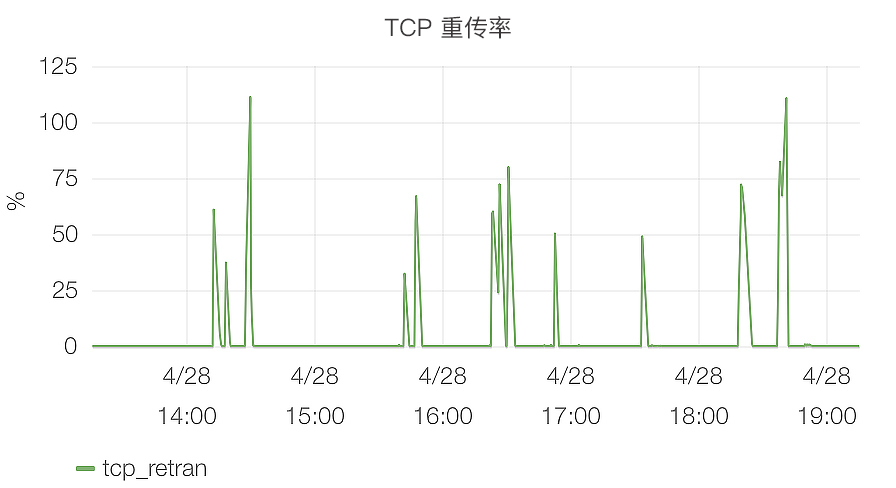

# 开篇词 | 如何让Linux内核更好地服务应用程序？
你好，我是邵亚方，欢迎加入我的课程，和我一起学习Linux内核知识。

从2010年接触Linux内核到现在，因为工作的关系，我参与解决了大量直接与生产环境相关的性能问题。前些年，我还在蘑菇街的时候，那会蘑菇街的业务增长速度非常快。你知道，业务增长了，随之而来的肯定就是服务的稳定性挑战了，比如TCP重传该怎么分析、怎么在运⾏时不打断任务的情况下排查内存泄漏问题、CPU sys利⽤率⾼怎么快速解决，这都是实实在在的问题，你会就会，不会就是不会。

以我们常见的TCP重传为例，如果你熟悉的话，服务器上一般都会有TCP重传率的监控，如下图所示：



就像图片显示的那样，这么高的TCP重传率，必然会导致系统QPS减小，所以你不敢含糊，得赶紧找问题出在哪里。但真正排查的时候，你会发现不知道从哪里开始，因为发生重传时的现场信息并没有记录下来。之所以没有记录下来这些现场信息，是因为记录的成本太昂贵了。如果你排查过网络问题，你应该知道，网络数据量是非常大的，即使只记录TCP头部信息也是非常大的存储开销，而且信息记录的过程也会带来较多的性能开销。

为了解决这类问题，我们团队就针对TCP重传的监控做了很多的改进，这些改进可以在不对业务性能造成明显影响的情况下，提升团队定位和分析问题的效率。我们记录的TCP重传现场信息如下所示：

<!-- [[[read_end]]] -->

```
    18:21:58 10.17.130.19:20612 124.74.250.144:44  SYN_SENT   
    18:22:00 10.17.130.19:20612 124.74.250.144:443 SYN_SENT   
    18:23:21 10.17.130.19:20716 124.74.250.144:443 SYN_SENT   
    18:23:23 10.17.130.19:20716 124.74.250.144:443 SYN_SENT   
    18:24:39 10.17.130.19:20796 124.74.250.144:443 SYN_SENT   
    18:24:41 10.17.130.19:20796 124.74.250.144:443 SYN_SENT   
    18:25:43 10.17.130.19:20861 124.74.250.144:443 SYN_SENT   
    18:25:45 10.17.130.19:20861 124.74.250.144:443 SYN_SENT   
    18:27:23 10.17.130.19:20973 124.74.250.144:443 SYN_SENT   
    18:27:25 10.17.130.19:20973 124.74.250.144:443 SYN_SENT
    

```

通过上面这些信息，你能很简单地看到，TCP重传是发生在哪些服务器（IP地址）之间，哪些业务上（服务端口），以及为什么会重传（SYN\_SENT）。你看，这样效率不就高了吗？具体我们是怎么做的，后面咱们课程里我会详细和你说。

其实在我看来，对于类似TCP重传这样复杂稳定性问题的定位，除了从开发⼈员的视⻆来分析外，更是需要能够从系统、从内核的视⻆来分析，只有这样，你才能够追本溯源、一劳永逸地解决问题。

而大家之所以觉得这些问题难，本质上还是对Linux内核理解不到位。比如说，我接触过的业务开发者们，基本上都被业务的性能毛刺困扰过，但是很多人在分析这些性能毛刺时，只能分析到哪些系统调用引起的毛刺，而一些业务专家，却可以再往底层看是什么系统资源引起的业务毛刺。再比如，当发生TCP重传时，有人可以从tcpdump里面的信息看到是哪个TCP连接进行重传，然而高手们却可以通过这些信息看到为什么会发生重传。

能够深入到Linux内核层分析问题的这些人，**他们看问题能直击本质，定位、分析问题的能力强，往往能解决别人解决不了的问题**，所以他们基本上也是各自领域的翘楚。

然而，大部分做应用的开发者往往会忽略对Linux内核的学习，这并不难理解，毕竟本职工作更多是在业务代码的优化和调配上，在互联网公司普遍“996”工作的大环境下，很难有精力和时间去深入到内核层面学习。而且，Linux内核本身就是很复杂的，这种复杂度不仅让应用开发者望而却步，也让很多内核初学者知难而退。

就拿我自己来说吧，我为了学习好Linux内核，就啃过非常多中英文的技术书籍，比如：

* 为了理解应用程序是如何使用Linux内核的，我把[《Unix环境高级编程》](https://book.douban.com/subject/25900403/)这本书读了很多遍；
* 为了掌握系统体系结构，我仔细读完了[《深入理解计算机系统》](https://book.douban.com/subject/26912767/)和[《支撑处理器的技术》](https://book.douban.com/subject/20271450/)；
* 为了理解应用程序在Linux上是如何编译的，我深入阅读了[《An Introduction to GCC》](https://book.douban.com/subject/1787854/)以及[《Linkers and Loaders》](https://book.douban.com/subject/1436811/)；
* 为了掌握Linux设备驱动的运行原理，我阅读了[《Linux设备驱动程序》](https://book.douban.com/subject/1723151/)这本书，然后，我才开始深入阅读[《深入理解Linux内核》](https://book.douban.com/subject/2287506/)这本Linux内核开发者的入门书籍；
* 在学习过程中，为了更好的掌握内存子系统，我阅读了[《深入理解Linux虚拟内存管理》](https://book.douban.com/subject/1865724/)；
* 为了掌握网络子系统，我阅读了[《TCP/IP Illustrated, Volume 1: The Protocols》](https://book.douban.com/subject/1088054/)以及[《TCP/IP Architecture, Design and Implementation in Linux》](https://book.douban.com/subject/3397220/)；
* 为了熟悉其他操作系统的设计原理，我阅读了[《The Design and Implementation of the FreeBSD Operating System》](https://book.douban.com/subject/1456525/)来学习FreeBSD；
* 为了更好的分析Linux内核问题，我读了[《Debug Hacks : 深入调试的技术和工具》](https://book.douban.com/subject/6799412/)和[《Systems Performance : Enterprise and the Cloud》](https://book.douban.com/subject/24840375/)。
* 为了更好的和国外开发者做交流，我又阅读了大量的英文原版书籍来提升自己的英语水平，上面我列的这些书名为英文的就是其中部分原版技术书籍。

不可否认，如果想系统学习Linux内核，成本是非常高的。不过话说回来，如果你不是内核开发者，也确实没有必要去搞懂它的每个细节，去掌握它的每一个机制，去理解它所有的优秀设计思想。

在我看来，一个优秀的软件，或者一个优秀的代码，**存在的本质是为了解决我们遇到的实实在在的问题，更好地满足我们实际的需求。**

也就是说，你能通过掌握的Linux内核知识，解决实际应用层的问题就够了，这也是我开设这门课的初衷。我希望能把自己多年的Linux内核学习和实践经验，通过**“解决问题，满足需求”**的方式传递给你，让Linux内核更好地服务你的应用程序。

为了更好地达到这个目的，我会从一些生产环境中比较常见的问题入手，带你去了解：你的应用程序是怎么跟系统资源打交道的？你的业务类型应该要选择什么样的配置才会更好？出了棘手的问题该如何一步步地去排查？

那么，从系统资源的维度，我们需要关注的问题可以分为四类，分别是磁盘I/O、内存、网络I/O、CPU。那在这系列课程中，我会带你从这四大类中的典型问题入手，深入学习其中的：**Page Cache管理问题、内存泄漏问题、TCP重传问题、内核态CPU利用率飙高问题**。这也对应着我们课程的四个模块。

掌握了这四类典型问题以及其分析思路，你会对磁盘I/O、内存、网络I/O和CPU这四类服务器上最基础的资源有更加深入的理解，在遇到其他问题时也能够触类旁通，从此再也不用回避一些棘手的系统问题。

为了方便你循序渐进地学习，我们的每个模块都会按照基础篇、案例篇和分析篇的方式来呈现。

在**Page Cache管理**这个模块中，我会重点分析如何更好地利用Page Cache来减少无谓的I/O开销，Page Cache管理不当会引起的一些问题，以及如何去分析和解决这类问题。

在**内存泄漏**这个模块中，我会重点分析应用程序都是如何从系统中申请内存以及如何释放的。通过内存泄露这类案例来带你了解应用程序使用内存的细节，以及如果内存使用不当会引发的一些问题。当然，我也会带你去观察、分析和解决这类问题。

在**TCP重传**这个模块中，我会重点分析TCP连接的建立、传输以及断开的过程。这个过程究竟会受哪些配置项的影响？如果配置不当会引起什么网络问题？然后我会从TCP重传这类具体案例出发，来带你认识你必须要去掌握的一些网络细节知识，以及遇到网络相关的问题时，你该如何去分析和解决它。

在**内核态CPU利用率飙高**这个模块中，我会分析应用程序该如何高效地使用CPU，以及哪些情况下会导致CPU的使用很低效：比如内核态CPU利用率过高就是一个很低效的表现。那么，针对内核态CPU利用率高的这个案例，我会侧重讲解哪些Linux内核的特性或者系统配置项会引起这种问题，以及如何分析和解决具体的问题。

在每个模块的最后，我都会总结一下这些常见问题的一般分析思路，让你在面对类型问题时能够有一个大致的分析方向。

当然，这个课不仅仅是针对应用开发者和运维，对于内核开发者，特别是不那么资深的内核开发者也会很有帮助，它可以帮助你更好地理解业务。Linux内核本质上是给业务服务的，理解好了业务，你才能更好地实现内核特性。就像我给Linux内核提交一些patch时，maintainer们总是会喜欢问这个问题：“What is your real life usecase \?” 结合业务，不盲目设计，也不要过度设计，这是每一个Linux内核开发都需要谨记的。

这个课程，**除了教你如何更好地学习Linux内核之外，也会带你批判性地来看Linux内核。**

Linux内核从Linus在1991年发布第一版开始，迄今已发展了近30年，代码行数也从最开始的1万行代码发展到了现在的几千万行代码，这么复杂甚至有点臃肿的工程，肯定是存在Bug的，而且也存在很多糟糕的设计。所以，你在平时工作中遇到的很多费解的现象， 也有可能是Linux内核缺陷，我们在这个课程里也会带你认识这些随处可见的缺陷。

在你遇到有些疑惑的地方，或者你觉得Linux内核哪里不够好时，你可以大胆地去质疑它，去向精通Linux内核的人求助，或者向Linux社区求助，正是因为你的这些需求，我们才能把Linux内核建设的更好更强大。虽然Linus本人是个稍微有点脾气的人，但是整体上Linux社区是很友好的，不论你遇到什么样子的难题，总有人能够解答你的疑问，甚至引导你该如何更好地改进Linux内核。

最后，我来大概介绍一下我在Linux内核领域的工作经历吧。我从2010年开始，在华为正式从事Linux内核的开发工作，然后又经历了外企（Juniper Networks），也经历了互联网企业（蘑菇街）以及现在所在的某知名互联网企业。

不同的企业风格，不同的业务场景，但是它们对Linux内核都有着相同的诉求：**更好更稳定。**

这些不同的业务场景，也丰富了我对Linux内核的认识，我也逐渐感受到Linux内核在处理更多以及更新的业务场景下的不足之处，所以我也慢慢地参与到Linux内核社区中来改进Linux内核。

我目前主要是活跃在Linux内核的内存管理子系统\( linux-mm\@kvack.org \)，如果你有关注这个邮件列表的话，会经常看到我的名字\(Yafang Shao \< laoar.shao\@gmail.com >\)。如果你在工作中遇到Linux内核相关的问题，也可以直接发送邮件给我，不过因为平时工作要“996”，我大概率只能在周末才会有精力来回复你。当然，也欢迎你在这个课程下留言提问，我看到都会第一时间处理。

在最后，我再次温馨地提醒你一下，Linux底层知识的学习并不是一蹴而就的，想要很好地掌握它是会花很多时间的。但是，如果有经验丰富的人带你来学习，你的学习时间会大大缩短，你的学习成本也会降低很多。我相信，通过这个系列课程的学习，你不仅可以很好地掌握必备的Linux基础知识，也能够从中学习到很多解决实际问题的技巧，以及避免去踩很多已经被别人踩过的坑。

好了，最后欢迎你与我讨论，你现在的工作中有遇到哪些困惑吗？你对Linux内核理解到什么程度了呢？你可以把自己当下的起点或者疑惑记录下来，等全部学完这个课程再来回顾，相信你会有不一样的体会。