* cpu从内存获取数据的时候，都是以Cache Line来进行的，哪怕你只取一个bit，CPU也是给你取一个Cache Line然后放到各级缓存里存起来。

* TLB miss造成的后果可比物理地址cache miss后果要严重一些，最多可能需要进行5次内存IO才行。hugepage大内存页，将会大大减少页表项的数量，所以自然也会降低TLB cache miss。

* **进程IO阻塞，或者在进程时间片到了**，都会引发进程上下文切换。

  * 1、切换页表全局目录pgd
  * 2、切换内核态堆栈
  * 3、切换各种寄存器(ip、bp、sp、cr3)
  * 4、刷新TLB
  * 5、调度器的代码执行

* 进程上下文切换是从用户进程A切换到了用户进程B。
* 而软中断切换是从用户进程A切换到了内核线程ksoftirqd上。而ksoftirqd作为一个内核控制路径，其处理程序比一个用户进程要轻量，所以中断上下文切换开销相对比进程切换要少一些。

* 软中断和系统调用一样，都是CPU停止掉当前用户态上下文，保存工作现场，然后陷入到内核态继续工作。二者的唯一区别是系统调用是切换到同进程的内核态上下文，而软中断是则是切换到了另外一个内核进程ksoftirqd上。

* 进程上下文切换次数

  > grep ctxt /proc/pid/status

* 系统调用开销

  > strace -cp pid

* 软中断

  > cat /proc/softirq

* 上下文切换开销:
  进程上下文(3-5us) > 中断上下文(3.4us) > 系统调用上下文(200ns-15us)

### semaphore

##### 内部结构：

* spinlock
* cout
* wait_list

##### 关键函数：

* down (加锁)

  count大于0的时候，count减一，可以执行临界区代码。

  count为0时，将当前进程挂到wait_list上，设置当前进程不可中断的休眠状态，schedule调度让出cpu。

* up(解锁)

  wait_list为空的时候，count加一。

  wait_list不为空的时候，取出第一个进程，wake_up唤醒该进程，执行临界区代码。

### spinlock

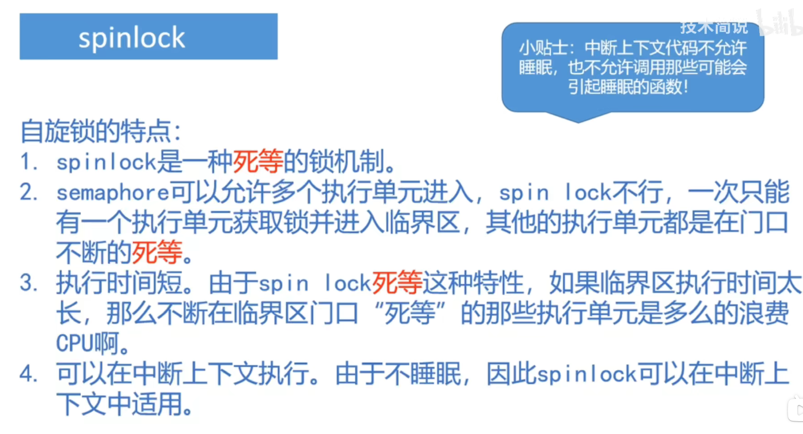

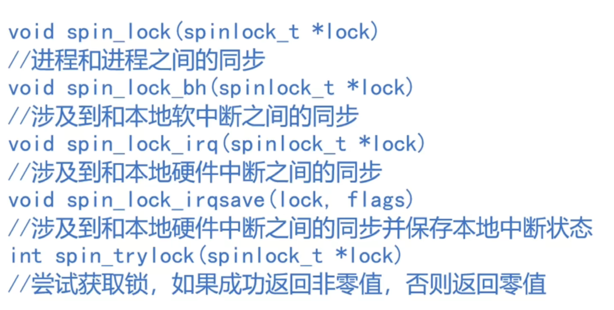

 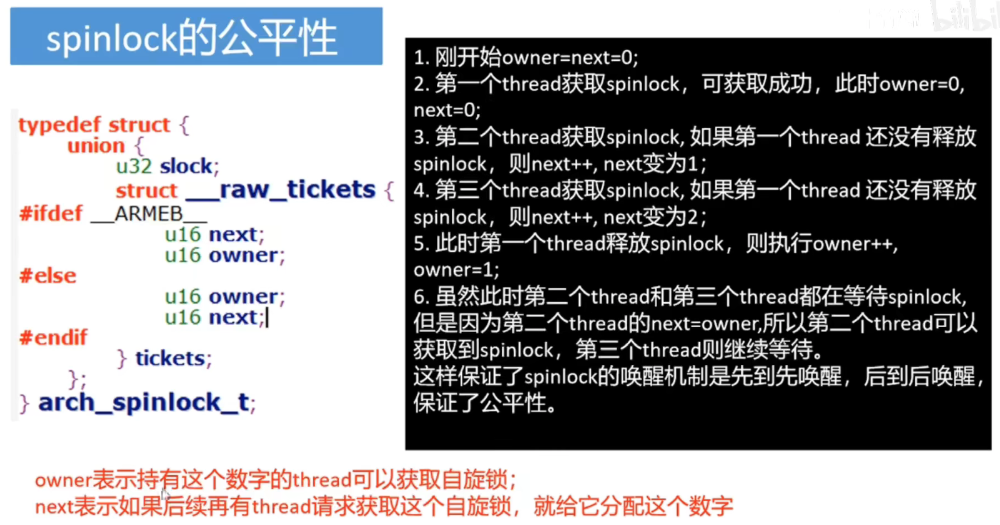

arch_spin_lock函数的作用：

* 1、实现对next的独占访问，next = next+1

* 2、while循环等待owner==next，return后得到该锁

### rwlock

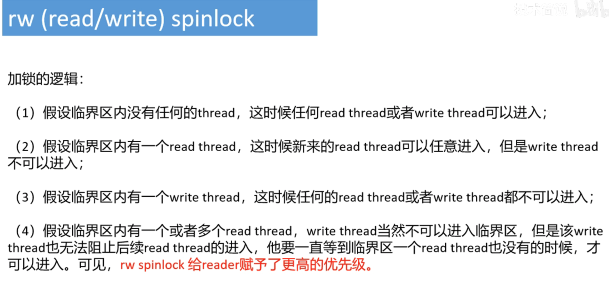

### seqlock

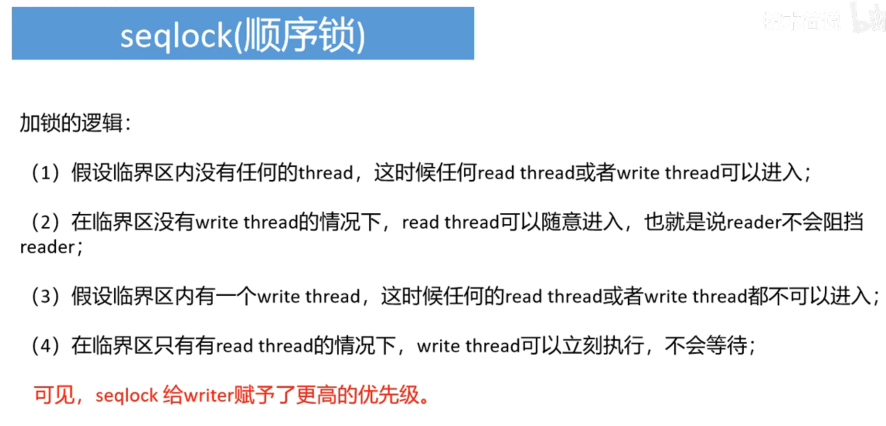

### 各种锁总结

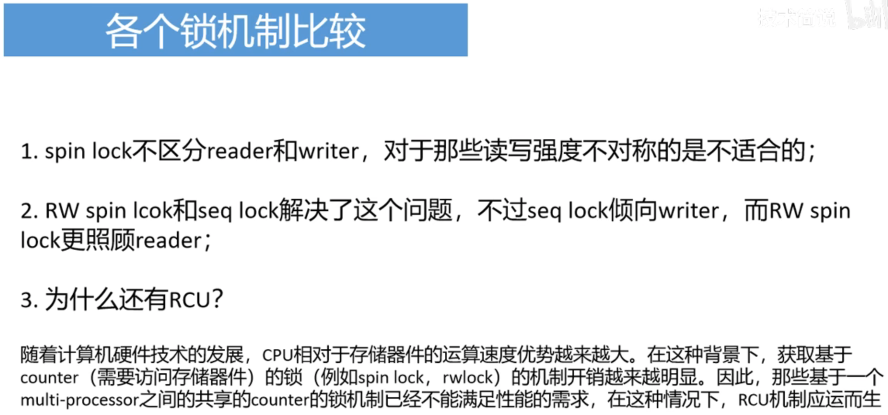

### 用户栈和内核栈

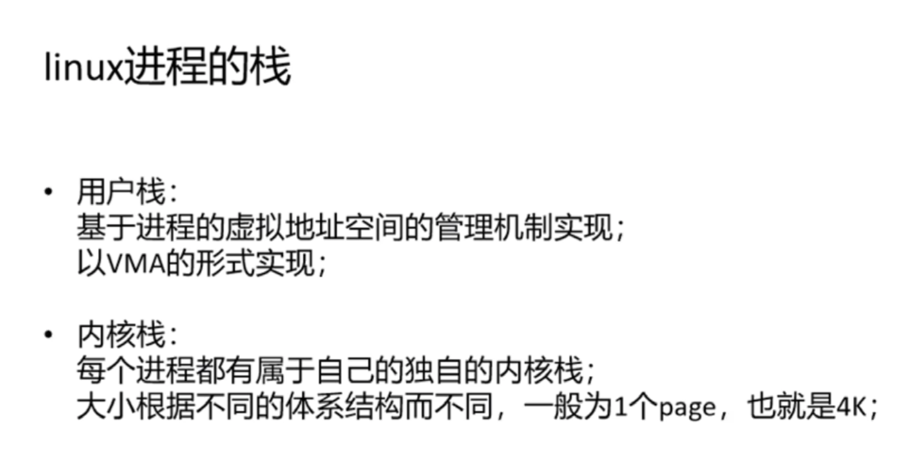

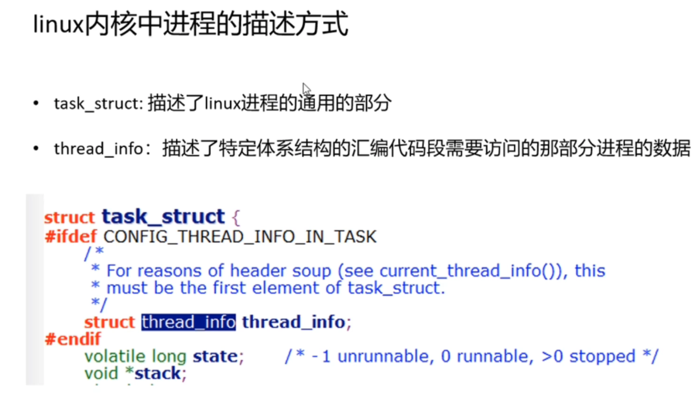

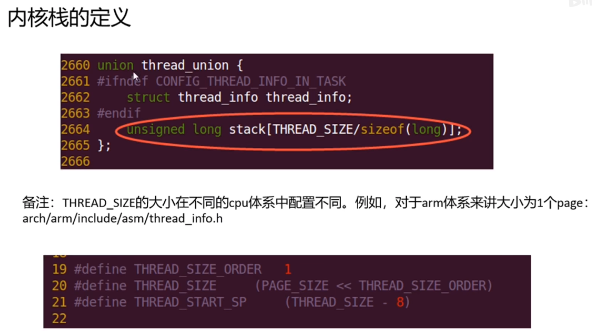

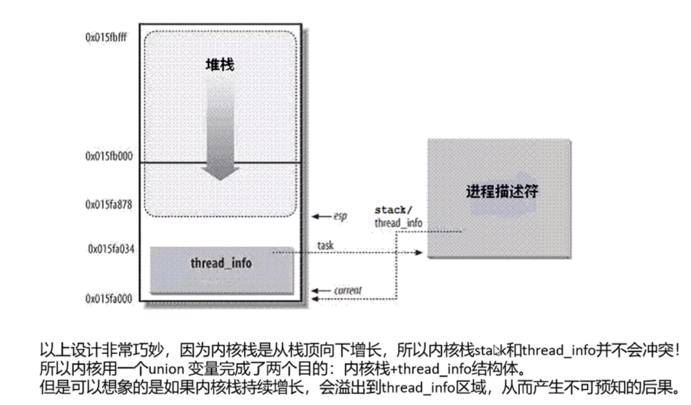

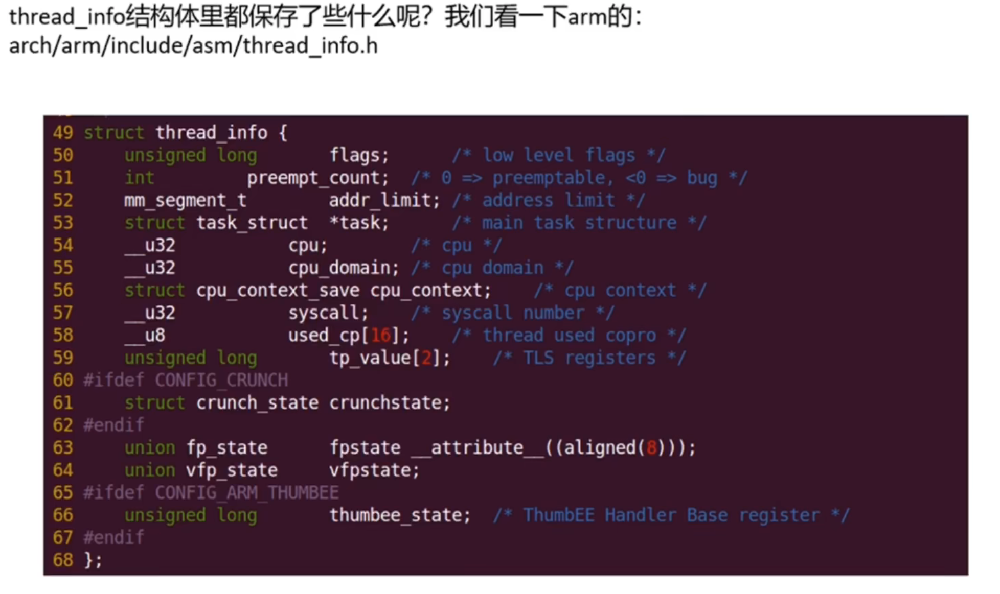

### 进程上下文和中断上下文

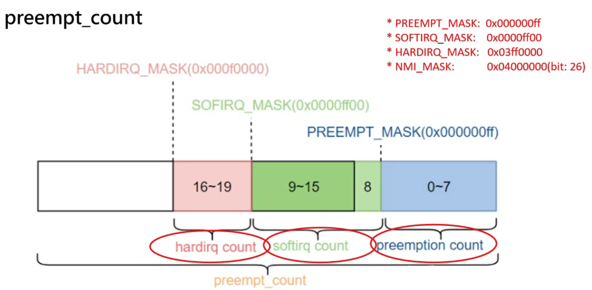

根据当前内核栈的栈顶指针sp，通过与THREAD_SIZE 对其的方式找到内核栈的首地址，也就是thread_info的首地址 

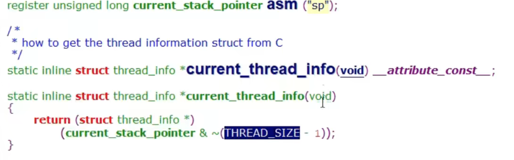

然后通过thread_info获取到preempt_count，然后跟对应的mask比较判断现在是处于什么上下文

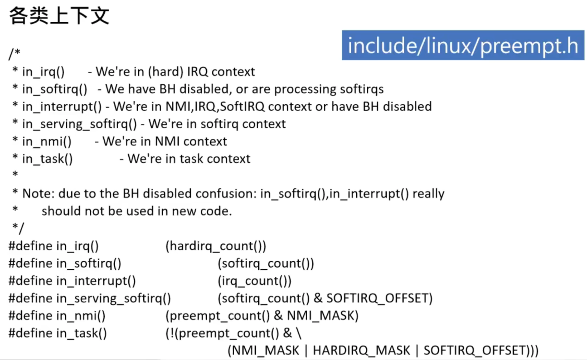

##### hardirq

irq_enter()：进入硬中断上下文，对应的hardirq_count加一

irq_exit()：退出硬中断上下文，对应的hardirq_count减 一

##### softirq

local_bh_disable 进入软中断上下文，对应的softirq_count加一

local_bh_enable 退出软中断上下文，对应的softirq_count减一

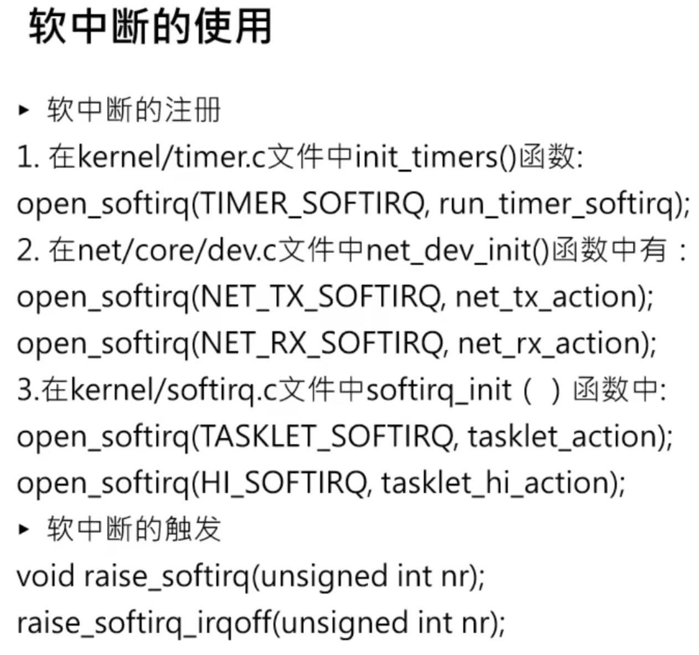

pre-cpu变量，每个cpu只能看见自己的__softirq_pending变量副本，这样哪个cpu触发软中断，就由哪个cpu执行软中断。

最终都是通过调用do_softirq检查有哪些未处理的软中断，去调用对应的action函数去执行。

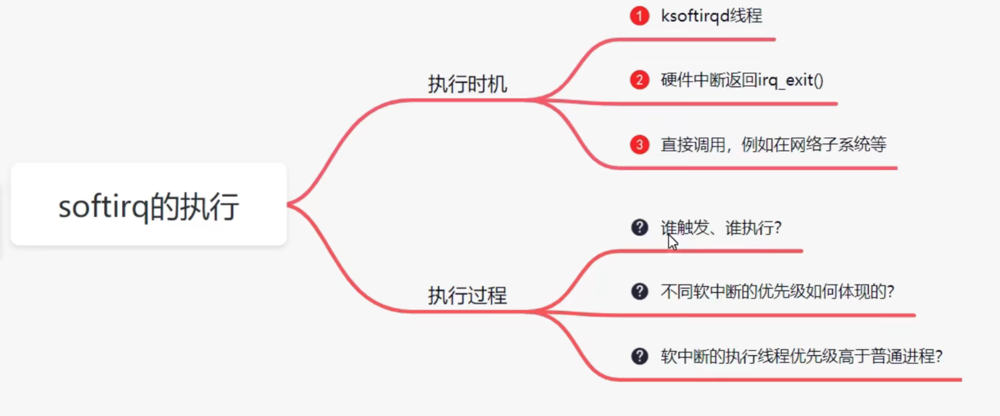
