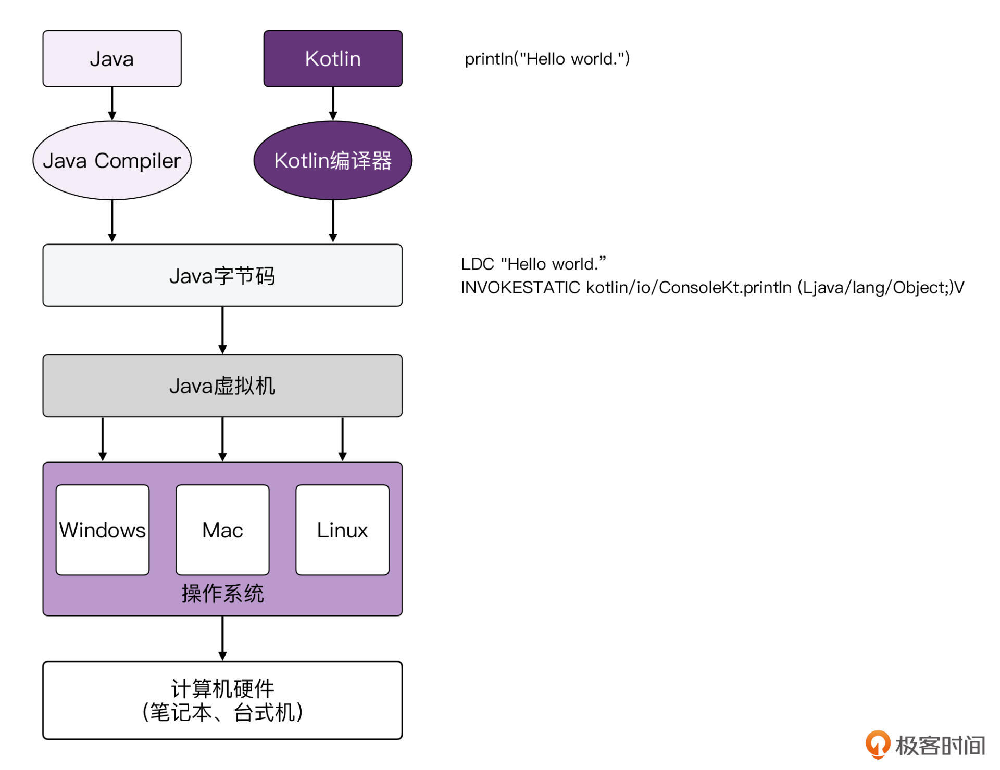
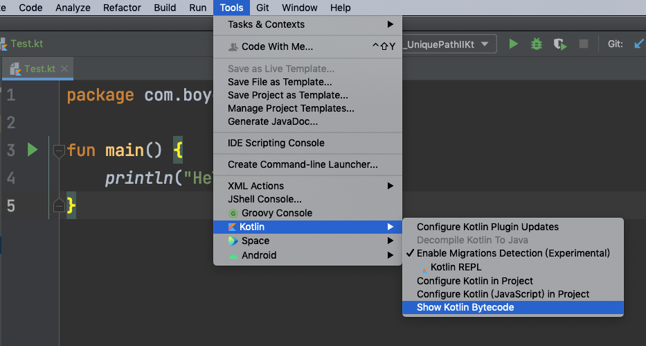
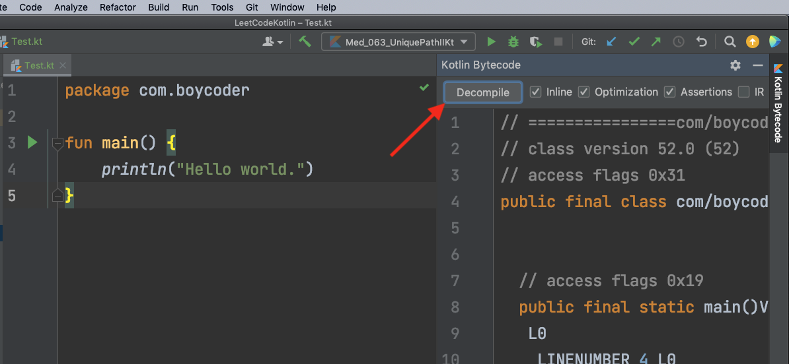
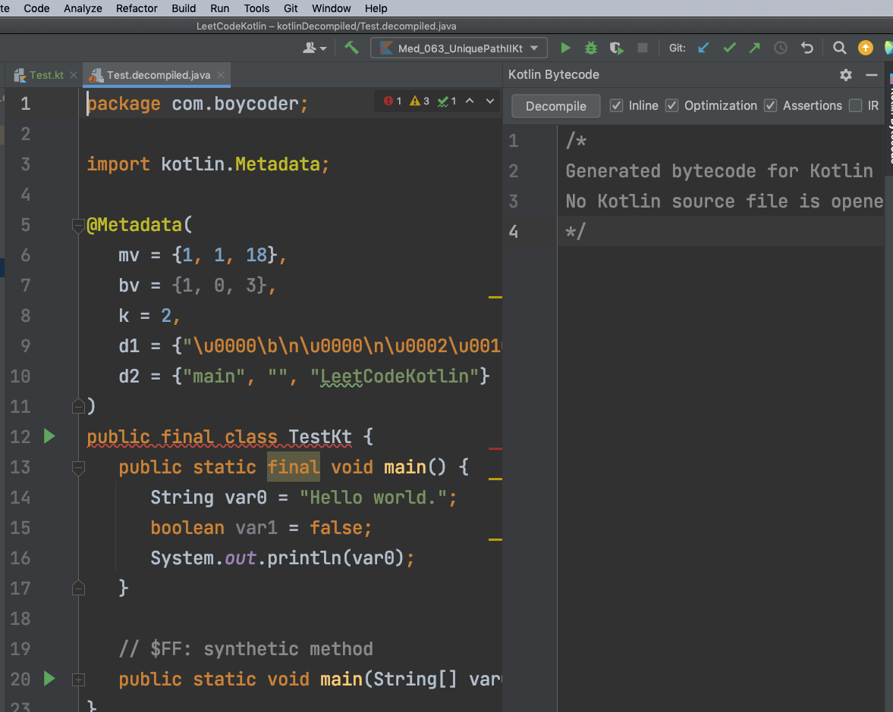
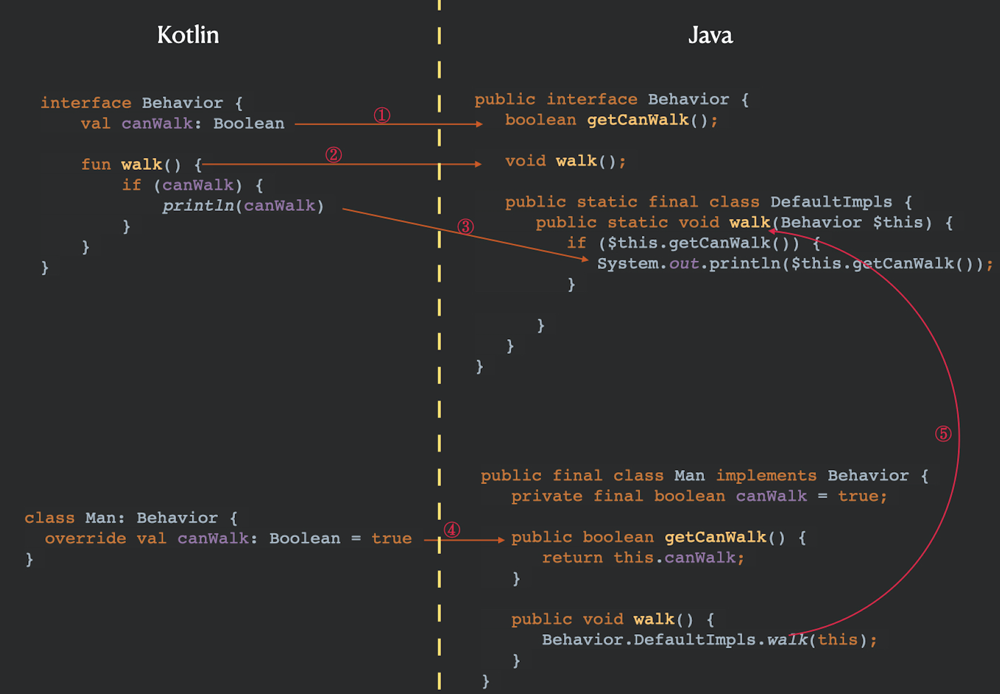

# 03 | Kotlin原理：编译器在幕后干了哪些“好事”？
你好，我是朱涛。

在前面两节课里，我们学了不少Kotlin的语法，其中有些语法是和Java类似的，比如数字类型、字符串；也有些语法是Kotlin所独有的，比如数据类、密封类。另外，我们还知道Kotlin和Java完全兼容，它们可以同时出现在一个代码工程当中，并且可以互相调用。

但是，这样就会引出一个问题：**Java是如何识别Kotlin的独有语法的呢？**比如，Java如何能够认识Kotlin里的“数据类”？

这就要从整个Kotlin的实现机制说起了。

所以，今天这节课，我会从Kotlin的编译流程出发，来带你探索这门语言的底层原理。在这个过程中，你会真正地理解，Kotlin是如何在实现灵活、简洁的语法的同时，还做到了兼容Java语言的。并且你在日后的学习和工作中，也可以根据今天所学的内容，来快速理解Kotlin的其他新特性。

## Kotlin的编译流程

在介绍Kotlin的原理细节之前，我们先从宏观上看看它是如何运行在电脑上的，这其实就涉及到它的编译流程。

那么首先，你需要知道一件事情：你写出的Kotlin代码，电脑是无法直接理解的。即使是最简单的`println("Hello world.")`，你将这行代码告诉电脑，它也是无法直接运行的。这是因为，Kotlin的语法是基于人类语言设计的，电脑没有人的思维，它只能理解二进制的0和1，不能理解println到底是什么东西。

<!-- [[[read_end]]] -->

因此，Kotlin的代码在运行之前，要先经过编译（Compile）。举个例子，假如我们现在有一个简单的Hello World程序：

```
    println("Hello world.")
    

```

经过编译以后，它会变成类似这样的东西：

```
    LDC "Hello world."
    INVOKESTATIC kotlin/io/ConsoleKt.println (Ljava/lang/Object;)V
    

```

上面两行代码，其实是Java的字节码。对，你没看错，**Kotlin代码经过编译后，最终会变成Java字节码**。这给人的感觉就像是：我说了一句中文，编译器将其翻译成了英文。而Kotlin和Java能够兼容的原因也在于此，**Java和Kotlin本质上是在用同一种语言进行沟通。**

英语被看作人类世界的通用语言，那么Kotlin和Java用的是什么语言呢？没错，它们用的就是Java字节码。Java字节码并不是为人类设计的语言，它是专门给JVM执行的。

JVM，也被称作Java虚拟机，它拿到字节码后就可以解析出字节码的含义，并且在电脑里输出打印“`Hello World.`”。所以，你可以先把Java虚拟机理解为一种执行环境。回想我们在[第一节课](https://time.geekbang.org/column/article/472154)开头所安装的JDK，就是为了安装Java的编译器和Java的运行环境。

不过现在，你可能会有点晕头转向，还是没有搞清楚Kotlin的这个编译流程具体是怎么回事儿，也不清楚Kotlin和Java之间到底是什么关系。别着急，我们一起来看看下面这张图：



这张图的内容其实非常直观，让我们从上到下，将整个过程再梳理一遍。

首先，我们写的Kotlin代码，编译器会以一定的规则将其翻译成Java字节码。这种字节码是专门为JVM而设计的，它的语法思想和汇编代码有点接近。

接着，JVM拿到字节码以后，会根据特定的语法来解析其中的内容，理解其中的含义，并且让字节码运行起来。

**那么，JVM到底是如何让字节码运行起来的呢？**其实，JVM是建立在操作系统之上的一层抽象运行环境。举个简单的例子，Windows系统当中的程序是无法直接在Mac上面运行的。但是，我们写的Java程序却能同时在Windows、Mac、Linux系统上运行，这就是因为JVM在其中起了作用。

JVM定义了一套字节码规范，只要是符合这种规范的，都可以在JVM当中运行。至于JVM是如何跟不同的操作系统打交道的，我们不管。

还有一个更形象的例子，**JVM就像是一个精通多国语言的翻译**，我们只需要让JVM理解要做的事情，不管去哪个国家都不用关心，翻译会帮我们搞定剩下的事情。

最后，是计算机硬件。常见的计算机硬件包括台式机和笔记本电脑，这就是我们所熟知的东西了。

## 如何研究Kotlin？

在了解了Kotlin的编译流程之后，其实我们很容易就能想到办法了。

第一种思路，**直接研究Kotlin编译后的字节码**。如果我们能学会Java字节码的语法规则，那么就可以从字节码的层面去分析Kotlin的实现细节了。不过，这种方法明显吃力不讨好，即使我们学会了Java字节码的语法规则，对于一些稍微复杂一点的代码，我们分析起来也会十分吃力。

因此，我们可以尝试另一种思路：**将Kotlin转换成字节码后，再将字节码反编译成等价的Java代码**。最终，我们去分析等价的Java代码，通过这样的方式来理解Kotlin的实现细节。虽然这种方式不及字节码那样深入底层，但它的好处是足够直观，也方便我们去分析更复杂的代码逻辑。

这个过程看起来会有点绕，让我们用一个流程图来表示：


我们将其分为两个部分来看。先看红色虚线框外面的图，这是一个典型的Kotlin编译流程，Kotlin代码变成了字节码。另一个部分，是红色虚线框内部的图，我们用反编译器将Java字节码翻译成Java代码。经过这样一个流程后，我们就能得到和Kotlin等价的Java代码。

而这样，我们也可以得出这样一个结论，Kotlin的“`println`”和Java的“`System.out.println`”是等价的。

```
    println("Hello world.") /*
              编译
               ↓            */    
    LDC "Hello world."
    INVOKESTATIC kotlin/io/ConsoleKt.println (Ljava/lang/Object;)V  /*
             反编译
               ↓            */
    String var0 = "Hello world.";
    System.out.println(var0);
    

```

好了，思想和流程我们都清楚了，具体我们应该要怎么做呢？有以下几个步骤。

第一步，打开我们要研究的Kotlin代码。


第二步，依次点击菜单栏：Tools \-> Kotlin \-> Show Kotlin Bytecode。



这时候，我们在右边的窗口中就可以看见Kotlin对应的字节码了。但这并不是我们想要的，所以要继续操作，将字节码转换成Java代码。

第三步，点击画面右边的“Decompile”按钮。



最后，我们就能看见反编译出来的Java文件“Test\_decompiled.java”。显而易见，main函数中的代码和我们前面所展示的是一致的：



OK，在知道如何研究Kotlin原理后，让我们来看一些实际的例子吧！

## Kotlin里到底有没有“原始类型”？

不知道你还记不记得，之前我在[第1讲](https://time.geekbang.org/column/article/472154)中给你留过一个思考题：

> 虽然Kotlin在语法层面摒弃了“原始类型”，但有的时候为了性能考虑，我们确实需要用“原始类型”。这时候我们应该怎么办？

那么现在，我们已经知道了Kotlin与Java直接存在某种对应关系，所以要弄清楚这个问题，我们只需要知道“Kotlin的Long”与“Java long/Long”是否存在某种联系就可以了。

> **注意：Java当中的long是原始类型，而Long是对象类型（包装类型）。**

说做就做，我们以Kotlin的Long类型为例。

```
    // kotlin 代码
    
    // 用 val 定义可为空、不可为空的Long，并且赋值
    val a: Long = 1L
    val b: Long? = 2L
    
    // 用 var 定义可为空、不可为空的Long，并且赋值
    var c: Long = 3L
    var d: Long? = 4L
    
    // 用 var 定义可为空的Long，先赋值，然后改为null
    var e: Long? = 5L
    e = null
    
    // 用 val 定义可为空的Long，直接赋值null
    val f: Long? = null
    
    // 用 var 定义可为空的Long，先赋值null，然后赋值数字
    var g: Long? = null
    g = 6L
    

```

这段代码的思路，其实就是将Kotlin的Long类型可能的使用情况都列举出来，然后去研究代码对应的Java反编译代码，如下所示：

```
    // 反编译后的 Java 代码
    
    long a = 1L;
    long b = 2L;
    
    long c = 3L;
    long d = 4L;
    
    Long e = 5L;
    e = (Long)null;
    
    Long f = (Long)null;
    
    Long g = (Long)null;
    g = 6L;
    

```

可以看到，最终a、b、c、d被Kotlin转换成了Java的原始类型long；而e、f、g被转换成了Java里的包装类型Long。这里我们就来逐步分析一下：

* 对于变量a、c来说，它们两个的类型是不可为空的，所以无论如何都不能为null，对于这种情况，Kotlin编译器会直接将它们优化成原始类型。
* 对于变量b、d来说，它们两个的类型虽然是可能为空的，但是它的值不为null，并且，编译器对上下文分析后发现，这两个变量也没有在别的地方被修改。这种情况，Kotlin编译器也会将它们优化成原始类型。
* 对于变量e、f、g来说，不论它们是val还是var，只要它们被赋值过null，那么，Kotlin就无法对它们进行优化了。这背后的原因也很简单，Java的原始类型不是对象，只有对象才能被赋值为null。

我们可以用以下两个规律，来总结下Kotlin对基础类型的转换规则：

* 只要基础类型的变量可能为空，那么这个变量就会被转换成Java的包装类型。
* 反之，只要基础类型的变量不可能为空，那么这个变量就会被转换成Java的原始类型。

好，接着我们再来看看另外一个例子。

## 接口语法的局限性

我在上节课，带你了解了Kotlin面向对象编程中的“接口”这个概念，其中我给你留了一个问题，就是：

> 接口的“成员属性”，是Kotlin独有的。请问它的局限性在哪？

那么在这里，我们就通过这个问题，来分析下Kotlin接口语法的实现原理，从而找出它的局限性。下面给出的，是一段接口代码示例：

```
    // Kotlin 代码
    
    interface Behavior {
        // 接口内可以有成员属性
        val canWalk: Boolean
    
        // 接口方法的默认实现
        fun walk() {
            if (canWalk) {
                println(canWalk)
            }
        }
    }
    
    private fun testInterface() {
        val man = Man()
        man.walk()
    }
    

```

那么，要解答这个问题，我们也要弄清楚Kotlin的这两个特性，转换成对应的Java代码是什么样的。

```
    // 等价的 Java 代码
    
    public interface Behavior {
       // 接口属性变成了方法
       boolean getCanWalk();
    
       // 方法默认实现消失了
       void walk();
    
       // 多了一个静态内部类
       public static final class DefaultImpls {
          public static void walk(Behavior $this) {
             if ($this.getCanWalk()) {
                boolean var1 = $this.getCanWalk();
                System.out.println(var1);
             }
          }
       }
    }
    

```

从上面的Java代码中我们能看出来，Kotlin接口的“默认属性”canWalk，本质上并不是一个真正的属性，当它转换成Java以后，就变成了一个普通的接口方法getCanWalk\(\)。

另外，Kotlin接口的“方法默认实现”，它本质上也没有直接提供实现的代码。对应的，它只是在接口当中定义了一个静态内部类“DefaultImpls”，然后将默认实现的代码放到了静态内部类当中去了。

**我们能看到，Kotlin的新特性，最终被转换成了一种Java能认识的语法。**

我们再具体来看看接口使用的细节：

```
    // Kotlin 代码
    
    class Man: Behavior {
        override val canWalk: Boolean = true
    }
    

```

以上代码中，我们定义了一个Man类，它实现了Behavior接口，与此同时它也重写了canWalk属性。另外，由于Behavior接口的walk\(\)方法已经有了默认实现，所以Man可以不必实现walk\(\)方法。

那么，**Man类反编译成Java后，会变成什么样子呢？**

```
    // 等价的 Java 代码
    
    public final class Man implements Behavior {
       private final boolean canWalk = true;
    
       public boolean getCanWalk() {
          // 关键点 ①
          return this.canWalk;
       }
    
       public void walk() {
          // 关键点 ②
          Behavior.DefaultImpls.walk(this);
       }
    }
    

```

可以看到，Man类里的getCanWalk\(\)实现了接口当中的方法，从注释①那里我们注意到，getCanWalk\(\)返回的还是它内部私有的canWalk属性，这就跟Kotlin当中的逻辑“override val canWalk: Boolean = true”对应上了。

另外，对于Man类当中的walk\(\)方法，它将执行流程交给了“Behavior.DefaultImpls.walk\(\)”，并将this作为参数传了进去。这里的逻辑，就可以跟Kotlin接口当中的默认方法逻辑对应上来了。

看完这一堆的代码之后，你的脑子可能会有点乱，我们用一张图来总结一下前面的内容吧：



以上图中一共有5个箭头，它们揭示了Kotlin接口新特性的实现原理，让我们一个个来分析：

* 箭头①，代表Kotlin接口属性，实际上会被当中接口方法来看待。
* 箭头②，代表Kotlin接口默认实现，实际上还是一个普通的方法。
* 箭头③，代表Kotlin接口默认实现的逻辑是被放在DefaultImpls当中的，它成了静态内部类当中的一个静态方法DefaultImpls.walk\(\)。
* 箭头④，代表Kotlin接口的实现类必须要重写接口当中的属性，同时，它仍然还是一个方法。
* 箭头⑤，即使Kotlin里的Man类没有实现walk\(\)方法，但是从Java的角度看，它仍然存在walk\(\)方法，并且，walk\(\)方法将它的执行流程转交给了DefaultImpls.walk\(\)，并将this传入了进去。这样，接口默认方法的逻辑就可以成功执行了。

到这里，我们的答案就呼之欲出了。Kotlin接口当中的属性，在它被真正实现之前，本质上并不是一个真正的属性。因此，Kotlin接口当中的属性，它既不能真正存储任何状态，也不能被赋予初始值，因为**它本质上还是一个接口方法**。

## 小结

到这里，你应该就明白了：你写的Kotlin代码，最终都会被Kotlin编译器进行一次统一的翻译，把它们变成Java能理解的格式。Kotlin的编译器，在这个过程当中就像是一个藏在幕后的翻译官。

可以说，Kotlin的每一个语法，最终都会被翻译成对应的Java字节码。但如果你不去反编译，你甚至感觉不到它在幕后做的那些事情。而正是因为Kotlin编译器在背后做的这些翻译工作，才可以让我们写出的Kotlin代码更加简洁、更加安全。

我们举一些更具体的例子：

* 类型推导，我们写Kotlin代码的时候省略的变量类型，最终被编译器补充回来了。
* 原始类型，虽然Kotlin没有原始类型，但编译器会根据每一个变量的可空性将它们转换成“原始类型”或者“包装类型”。
* 字符串模板，编译器最终会将它们转换成Java拼接的形式。
* when表达式，编译器最终会将它们转换成类似switch case的语句。
* 类默认public，Kotlin当中被我们省略掉public，最终会被编译器补充。
* 嵌套类默认static，我们在Kotlin当中的嵌套类，默认会被添加static关键字，将其变成静态内部类，防止不必要的内存泄漏。
* 数据类，Kotlin当中简单的一行代码“data class Person\(val name: String, val age: Int\)”，编译器帮我们自动生成很多方法：getter\(\)、setter\(\)、equals\(\)、hashCode\(\)、toString\(\)、componentN\(\)、copy\(\)。


最后，我们还需要思考一个问题：**Kotlin编译器一直在幕后帮忙做着翻译的好事，那它有没有可能“好心办坏事”？**这个悬念留着，我们在第8讲再探讨。

## 思考题

在上节课当中，我们曾提到过，为Person类增加isAdult属性，我们要通过自定义getter来实现，比如说：

```
    class Person(val name: String, var age: Int) {
        val isAdult
            get() = age >= 18
    }
    

```

而下面这种写法则是错误的：

```
    class Person(val name: String, var age: Int) {
        val isAdult = age >= 18
    }
    

```

请运用今天学到的知识来分析这个问题背后的原因。欢迎你在留言区分享你的答案和思路，我们下节课再见。