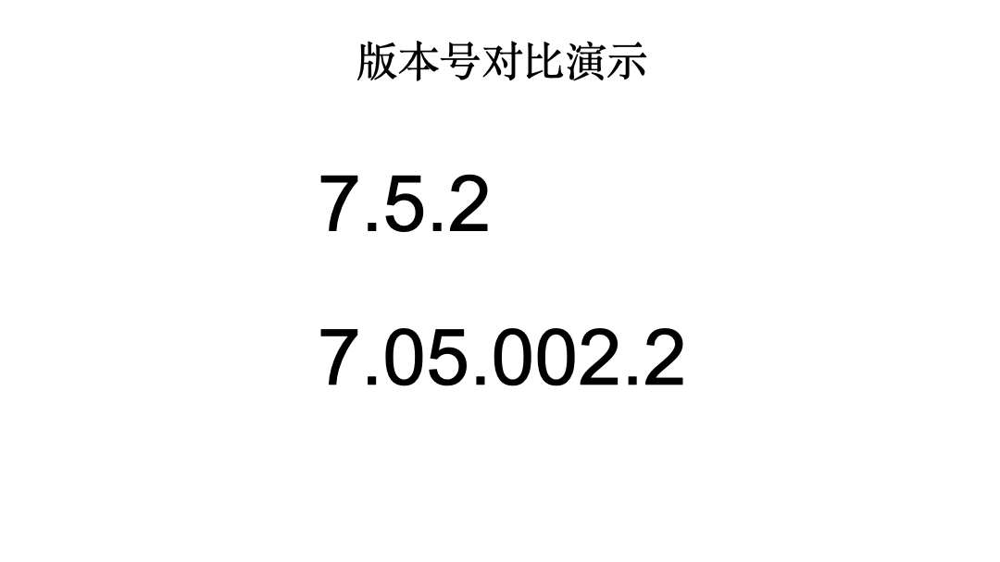
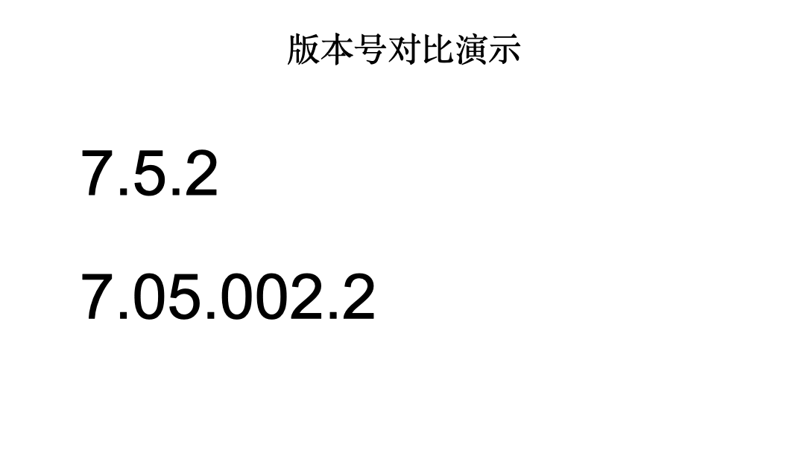

# 春节刷题计划（二）| 一题三解，搞定版本号判断
你好，我是朱涛。今天是除夕夜，先祝你虎年春节快乐！

在上节刷题课中，我给你留了一个作业，那就是：用Kotlin来完成 [LeetCode的165号题《版本号判断》](https://leetcode-cn.com/problems/compare-version-numbers/)。那么今天这节课，我就来讲讲我的解题思路，希望能给你带来一些启发。

这道题目其实跟我们平时的工作息息相关。给你两个字符串代表的版本号，需要你判断哪个版本号是新的，哪个版本号是旧的。比如，2.0与1.0对比的话，2.0肯定是新版本，1.0肯定是旧版本。对吧？

不过，这里面还有一些问题需要留意，这些都是我们在正式写代码之前要弄清楚的。

* 首先，版本号是可能以0开头的。比如0.1、1.01，这些都是合理的版本号。
* 另外，如果是以0开头的话，1个0和多个0，它们是等价的，比如1.01、1.001、1.00001之间就是等价的，也就是说这几个版本号其实是相等的。
* 还有，1.0、1.0.0、1.0.0.0它们之间也是等价的，也就是说这几个版本号也是相等的。

## 思路一

好了，理解了题意以后，我们就可以开始写代码了，LeetCode上面给了我们一个待实现的方法，大致如下：

```
    fun compareVersion(version1: String, version2: String): Int {
        // 待完善
    }
    

```
<!-- [[[read_end]]] -->

分析完题目以后，也许你已经发现了，这道题目其实并不需要什么特殊的数据结构和算法基础，这是一道单纯的“模拟题”。我们脑子里是如何对比两个版本号的，我们的代码就可以怎么写。  
下面我做了一个动图，展示了版本号对比的整体流程。



我们可以看到，这个对比的流程，大致可以分为以下几个步骤。

* 第一步，将版本号的字符串用“点号”进行分割，得到两个字符串的列表。
* 第二步，同时遍历这两个列表，将列表中的每一个元素转换成整数，比如，当遍历到第二位的时候，5、05这两个字符串，都会转换成数字5。这里**有个细节**，那就是当版本号的长度不一样的时候，比如，遍历到7.05.002.2的最后一位时，7.5.2其实已经越界了，这时候我们需要进行补零，然后再转换成数字。
* 第三步，根据转换后的数字进行对比，如果两者相等的话，我们就继续遍历下一位。如果不相等的话，我们就能直接返回对比的结果了。
* 第四步，如果两个版本号都遍历到了末尾，仍然没有对比出大小的差异，那么我们就认为这两个版本号相等，返回0即可。

所以，按照上面的思路，我们可以把compareVersion\(\)这个函数分为以下几个部分：

```
    fun compareVersion(version1: String, version2: String): Int {
        // ① 使用“.”，分割 version1 和 version2，得到list1、list2
        // ② 同时遍历list1、list2，取出的元素v1、v2，并将其转换成整数，这里注意补零操作
        // ③ 对比v1、v2的大小，如果它们两者不一样，我们就可以终止流程，直接返回结果。
        // ④ 当遍历完list1、list2后仍然没有判断出大小话，说明两个版本号其实是相等的，这时候应该返回0
    }
    

```

那么接下来，其实就很简单了。我们只需要将注释里面的自然语言，用代码写出来就行了。具体代码如下：

```
    fun compareVersion(version1: String, version2: String): Int {
        // ① 分割
        val list1 = version1.split(".")
        val list2 = version2.split(".")
    
        var i = 0
        while (i < list1.size || i < list2.size) {
            // ② 遍历元素
            val v1 = list1.getOrNull(i)?.toInt()?:0
            val v2 = list2.getOrNull(i)?.toInt()?:0
    
            // ③ 对比
            if (v1 != v2) {
                return v1.compareTo(v2)
            }
            i++
        }
    
        // ④ 相等
        return 0
    }
    

```

在上面的代码中，有两个地方需要格外注意。

**一个是while循环的条件**。由于list1、list2的长度可能是不一样的，所以，我们的循环条件是：list1、list2当中只要有一个没有遍历完的话，我们就要继续遍历。

还有一个需要注意的地方，**getOrNull\(i\)，这是Kotlin独有的库函数**。使用这个方法，我们不必担心越界问题，当index越界以后，这个方法会返回null，在这里我们把它跟 [Elvis表达式](https://time.geekbang.org/column/article/472154)结合起来，就实现了自动补零操作。这也体现出了Kotlin表达式语法的优势。

好，到这里，我们就用第一种思路实现了版本号对比的算法。下面我们再来看看第二种思路。

## 思路二

前面的思路，我们是使用的Kotlin的库函数split\(\)进行分割，然后对列表进行遍历来判断的版本号。其实，这种思路还可以**进一步优化**，那就是我们自己遍历字符串，来模拟split的过程，然后在遍历过程中，我们顺便就把比对的工作一起做完了。

思路二的整体过程比较绕，我同样是制作了一个动图来描述这个算法的整体流程：


以上的整体算法过程，是典型的“**双指针**”思想。运用这样的思想，我们大致可以写出下面这样的代码：

```
    fun compareVersion(version1: String, version2: String): Int {
        val length1 = version1.length
        val length2 = version2.length
    
        // ①
        var i = 0
        var j = 0
        // ②
        while (i < length1 || j < length2) {
            // ③
            var x = 0
            while (i < length1 && version1[i] != '.') {
                x = x * 10 + version1[i].toInt() - '0'.toInt()
                i++
            }
            i++
    
            // ④
            var y = 0
            while (j < length2 && version2[j] != '.') {
                y = y * 10 + version2[j].toInt() - '0'.toInt()
                j++
            }
            j++
    
            // ⑤
            if (x != y) {
                return x.compareTo(y)
            }
        }
        // ⑥
        return 0
    }
    

```

这段代码一共有6个注释，我们来一个个解释。

* 注释①，代表的就是我们遍历两个版本号的index，双指针，指的就是它们两个。
* 注释②，最外层的while循环，其实就是为了确保双指针可以遍历到两个字符串的末尾。你注意下这里的循环条件，只要version1、version2当中有一个没到末尾，就会继续遍历。
* 注释③，这里就是在遍历version1，一直到字符串末尾，或者遇到“点号”。在同一个循环当中，我们会对x的值进行累加，这个做法其实就是把字符串的数字转换成十进制的数字。
* 注释④，这里和注释③的逻辑一样，只是遍历的对象是version2。
* 注释⑤，这里会对累加出来的x、y进行对比，不相同的话，我们就可以返回结果了。
* 注释⑥，如果遍历到末尾还没有结果，这就说明version1、version2相等。

现在，我们就已经用Kotlin写出了两个题解，使用的思路都是命令式的编程方式。也许你会好奇，**这个问题能用函数式的思路来实现吗？**

答案当然是可以的！

## 思路三

我们在前面就提到过，Kotlin是支持多范式的，我们可以根据实际场景来灵活选择编程范式。那么在这里，我们可以借鉴一下前面第一种解法的思路。

其实，想要解决这个问题，我们只要能把version1、version2转换成两个整数的列表，就可以很好地进行对比了。我制作了一个动图，方便你理解：



根据这个流程，我们可以大致写出下面这样的代码：

```
    fun compareVersion(version1: String, version2: String): Int =
        version1.split(".")
            .zipLongest(version2.split("."), "0") // ①
            .onEach { // ②
                with(it) {
                    if (first != second) {
                        return first.compareTo(second)
                    }
                }
            }.run { return 0 }
    

```

这段代码看起来很简洁，核心的逻辑在两个方法当中，我分别用注释标注了。

* 注释①，zipLongest\(\)这个方法，它的作用是将version1、version2对应的列表合并到一起，它返回值的类型是List\<Pair\<Int, Int>>。
* 注释②，onEach\(\)，其实它是一个高阶函数，它的作用就是遍历List当中的每一个Pair，将其中的整型版本号拿出来对比，如果不一样，就可以直接返回结果。

现在，你可能会感慨，这代码看起来真香啊！这个嘛……别高兴得太早。虽然Kotlin支持基础的zip语法，但它目前还不支持zipLongest\(\)这么高级的操作符。

那么这该怎么办呢？我们只能自己来实现zipLongest\(\)了！为了让前面的代码通过编译，我们必须要自己动手实现下面三个扩展函数。

```
    private fun Iterable<String>.zipLongest(
        other: Iterable<String>,
        default: String
    ): List<Pair<Int, Int>> {
        val first = iterator()
        val second = other.iterator()
        val list = ArrayList<Pair<Int, Int>>(minOf(collectionSizeOrDefault(10), other.collectionSizeOrDefault(10)))
        while (first.hasNext() || second.hasNext()) {
            val v1 = (first.nextOrNull() ?: default).toInt()
            val v2 = (second.nextOrNull() ?: default).toInt()
            list.add(Pair(v1, v2))
        }
        return list
    }
    
    private fun <T> Iterable<T>.collectionSizeOrDefault(default: Int): Int =
            if (this is Collection<*>) this.size else default
    
    private fun <T> Iterator<T>.nextOrNull(): T? = if (hasNext()) next() else null
    
    // Pair 是Kotlin标准库提供的一个数据类
    // 专门用于存储两个成员的数据
    // 提交代码的时候，Pair不需要拷贝进去
    public data class Pair<out A, out B>(
        public val first: A,
        public val second: B
    ) : Serializable {
        public override fun toString(): String = "($first, $second)"
    }
    

```

这三个扩展函数实现起来还是比较简单的，zipLongest\(\)其实就是合并了两个字符串列表，然后将它们按照index合并成Pair，另外那两个扩展函数都只是起了辅助作用。

这样，我们把前面的代码一起粘贴到LeetCode当中，其实代码是可以通过的。不过呢，我们的代码当中其实还有一个**比较深的嵌套**，看起来不是很顺眼：

```
    fun compareVersion(version1: String, version2: String): Int =
        version1.split(".")
            .zipLongest(version2.split("."), "0")
            .onEach {
                // 这里的嵌套比较深
                with(it) {
                    if (first != second) {
                        return first.compareTo(second)
                    }
                }
            }.run { return 0 }
    

```

你可以注意到，在onEach当中，有一个代码块，它有两层嵌套，这看起来有点丑陋。那么，我们能不能对它进一步优化呢？

当然是可以的。

这里，我们只需要想办法让onEach当中的Lambda，变成[带接收者的函数类型](https://time.geekbang.org/column/article/476637)即可。具体做法就是，我们自己实现一个新的onEachWithReceiver\(\)的高阶函数。

```
    //                                                        注意这里
    //                                                           ↓
    inline fun <T, C : Iterable<T>> C.onEachWithReceiver(action: T.() -> Unit): C {
        return apply { for (element in this) action(element) }
    }
    
    //                                                   注意这里
    // Kotlin库函数当中的onEach                                ↓
    public inline fun <T, C : Iterable<T>> C.onEach(action: (T) -> Unit): C {
        return apply { for (element in this) action(element) }
    }
    

```

上面的代码展示了onEach\(\)和onEachWithReceiver\(\)之间的差别，可以看到，它们两个的函数体其实没有任何变化，区别只是action的函数类型而已。

所以在这里，借助onEachWithReceiver\(\)，就可以进一步简化我们的代码：

```
    fun compareVersion(version1: String, version2: String): Int =
        version1.split(".")
            .zipLongest(version2.split("."), "0")
            .onEachWithReceiver {
                // 减少了一层嵌套
                if (first != second) {
                    return first.compareTo(second)
                }
            }.run { return 0 }
    

```

在这段代码中，我们把onEach\(\)改成了onEachWithReceiver\(\)，因为它里面的Lambda是带有接收者，原本的Pair对象变成了this对象，这样，我们就可以直接使用first、second来访问Pair当中的成员了。

现在，就让我们来看看整体的代码吧：

```
    fun compareVersion(version1: String, version2: String): Int =
        version1.split(".")
            .zipLongest(version2.split("."), "0")
            .onEachWithReceiver {
                if (first != second) {
                    return first.compareTo(second)
                }
            }.run { return 0 }
    
    private inline fun <T, C : Iterable<T>> C.onEachWithReceiver(action: T.() -> Unit): C {
        return apply { for (element in this) action(element) }
    }
    
    private fun <T> Iterable<T>.collectionSizeOrDefault(default: Int): Int =
        if (this is Collection<*>) this.size else default
    
    private fun <T> Iterator<T>.nextOrNull(): T? = if (hasNext()) next() else null
    
    private fun Iterable<String>.zipLongest(
        other: Iterable<String>,
        default: String
    ): List<Pair<Int, Int>> {
        val first = iterator()
        val second = other.iterator()
        val list = ArrayList<Pair<Int, Int>>(minOf(collectionSizeOrDefault(10), other.collectionSizeOrDefault(10)))
        while (first.hasNext() || second.hasNext()) {
            val v1 = (first.nextOrNull() ?: default).toInt()
            val v2 = (second.nextOrNull() ?: default).toInt()
            list.add(Pair(v1, v2))
        }
        return list
    }
    

```

好了，这就是我们的第三种思路。看完这三种思路以后，你会更倾向于哪种思路呢？

## 小结

这节课，我们使用了三种思路，实现了[LeetCode的165号题《版本号判断》](https://leetcode-cn.com/problems/compare-version-numbers/)。其中，前两种思路，是命令式的编程方式，第三种是偏函数式的方式。在我看来呢，这三种方式各有优劣。

* 思路一，代码逻辑比较清晰，代码量小，时间复杂度、空间复杂度较差。
* 思路二，代码逻辑比较复杂，代码量稍大，时间复杂度、空间复杂度非常好。
* 思路三，代码主逻辑非常清晰，代码量大，时间复杂度、空间复杂度较差。

第三个思路其实还有一个额外的优势，那就是，我们自己实现的扩展函数，可以用于以后解决其他问题。这就相当于沉淀出了有用的工具。

## 小作业

好，最后，我还是给你留一个小作业，请你用Kotlin来完成[LeetCode的640号题《求解方程》](https://leetcode-cn.com/problems/solve-the-equation/)。这道题目我同样会在下节课给出答案解析。

欢迎继续给我留言，我们下节课再见。