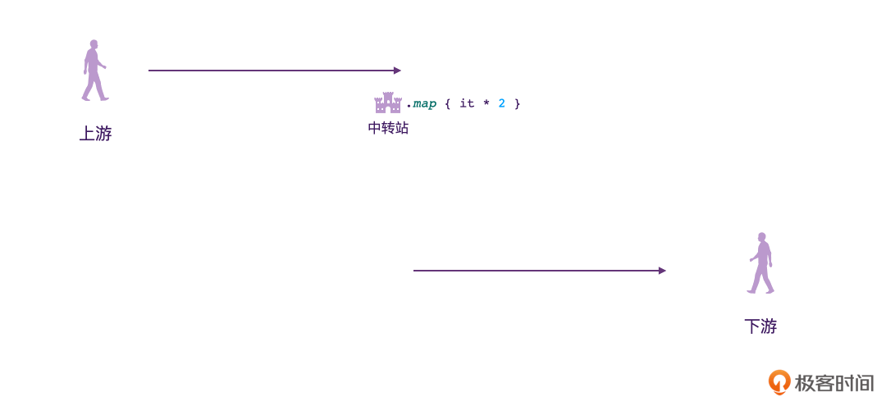
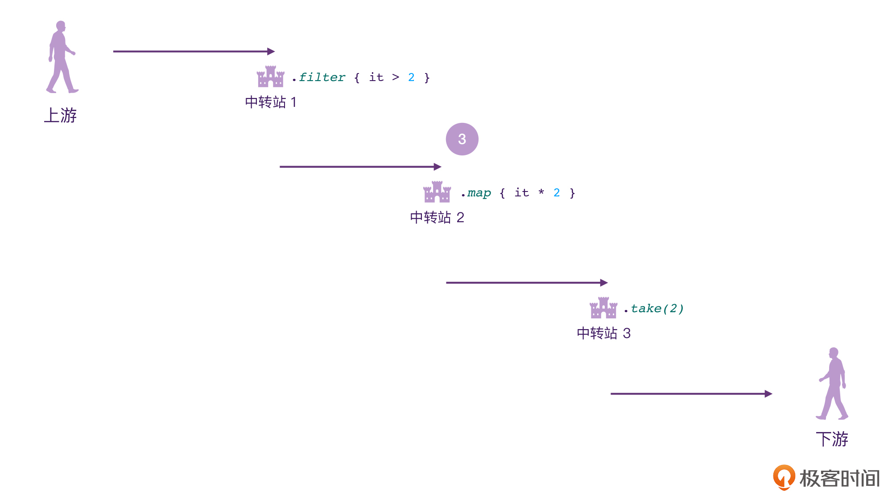
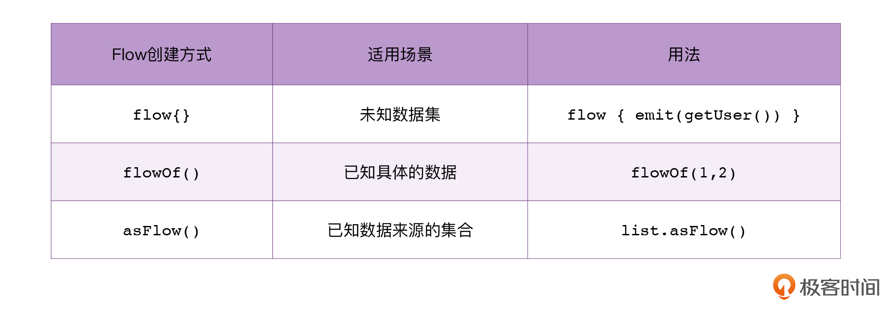
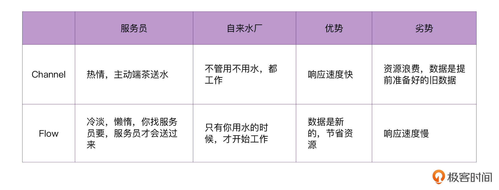
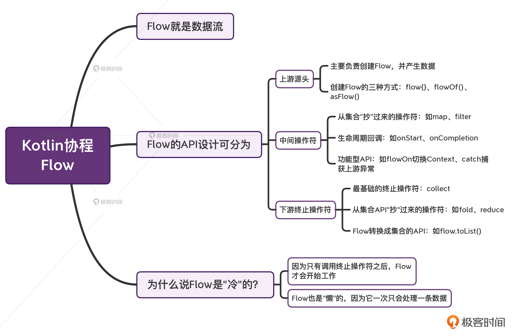

# 20 | Flow：为什么说Flow是“冷”的？
你好，我是朱涛。今天我们来学习Kotlin协程Flow的基础知识。

Flow，可以说是在Kotlin协程当中自成体系的知识点。**Flow极其强大、极其灵活**，在它出现之前，业界还有很多质疑Kotlin协程的声音，认为Kotlin的挂起函数、结构化并发，并不足以形成核心竞争力，在异步、并发任务的领域，RxJava可以做得更好。

但是，随着2019年Kotlin推出Flow以后，这样的质疑声就渐渐没有了。有了Flow以后，Kotlin的协程已经没有明显的短板了。简单的异步场景，我们可以直接使用挂起函数、launch、async；至于复杂的异步场景，我们就可以使用Flow。

实际上，在很多技术领域，Flow已经开始占领RxJava原本的领地，在Android领域，Flow甚至还要取代原本LiveData的地位。因为，Flow是真的香啊！

接下来，我们就一起来学习Flow。

## Flow就是“数据流”

Flow这个单词有“流”的意思，比如Cash Flow代表了“现金流”；Traffic Flow代表了“车流”；Flow在Kotlin协程当中，其实就是“数据流”的意思。因为Flow当中“流淌”的，都是数据。

为了帮你建立思维模型，我做了一个动图，来描述Flow的行为模式。

<!-- [[[read_end]]] -->



可以看到，Flow和我们上节课学习的Channel不一样，Flow并不是只有“发送”“接收”两个行为，它当中流淌的数据是**可以在中途改变**的。

Flow的数据发送方，我们称之为“上游”；数据接收方称之为“下游”。跟现实生活中一样，上下游其实也是相对的概念。比如我们可以看到下面的图，对于中转站2来说，中转站1就相当于它的上游。



另外我们也可以看到，在发送方、接收方的中间，是可以有多个“中转站”的。在这些中转站里，我们就可以对数据进行一些处理了。

其实，Flow这样的数据模型，在现实生活中也存在，比如说长江，它有发源地和下游，中间还有很多大坝、水电站，甚至还有一些污水净化厂。

好，相信你现在对Flow已经有比较清晰的概念了。下面我们来看一段代码：

```
    // 代码段1
    
    fun main() = runBlocking {
        flow {                  // 上游，发源地
            emit(1)             // 挂起函数
            emit(2)
            emit(3)
            emit(4)
            emit(5)
        }.filter { it > 2 }     // 中转站1
            .map { it * 2 }     // 中转站2
            .take(2)            // 中转站3
            .collect{           // 下游
                println(it)
            }
    }
    
    /*
    输出结果：                       
    6
    8
    */
    

```

如果你结合着之前的图片来分析这段代码的话，相信马上就能分析出它的执行结果。因为Flow的这种**链式调用**的API，本身就非常符合人的阅读习惯。

而且，Flow写出来的代码非常清晰易懂，我们可以对照前面的示意图来看一下：


说实话，Flow这样代码模式，谁不爱呢？我们可以来简单分析一下：

* **flow\{\}**，是一个高阶函数，它的作用就是创建一个新的Flow。在它的Lambda当中，我们可以使用 **emit\(\)** 这个挂起函数往下游发送数据，这里的emit其实就是“发射”“发送”的意思。上游创建了一个“数据流”，同时也要负责发送数据。这跟现实生活也是一样的：长江里的水从上游产生，这是天经地义的。所以，对于上游而言，只需要创建Flow，然后发送数据即可，其他的都交给中转站和下游。
* **filter\{\}、map\{\}、take\(2\)**，它们是**中间操作符**，就像中转站一样，它们的作用就是对数据进行处理，这很好理解。Flow最大的优势，就是它的操作符跟集合操作符高度一致。只要你会用List、Sequence，那你就可以快速上手Flow的操作符，这中间几乎没有额外的学习成本。
* **collect\{\}**，也被称为**终止操作符**或者**末端操作符**，它的作用其实只有一个：终止Flow数据流，并且接收这些数据。

除了使用flow\{\} 创建Flow以外，我们还可以使用 **flowOf\(\)** 这个函数。所以，从某种程度上讲，Flow跟Kotlin的集合其实也是有一些相似之处的。

```
    // 代码段2
    
    fun main() = runBlocking {
        flowOf(1, 2, 3, 4, 5).filter { it > 2 }
            .map { it * 2 }
            .take(2)
            .collect {
                println(it)
            }
    
        listOf(1, 2, 3, 4, 5).filter { it > 2 }
            .map { it * 2 }
            .take(2)
            .forEach {
                println(it)
            }
    }
    
    /*
    输出结果
    6
    8
    6
    8
    */
    

```

从上面的代码中，我们可以看到Flow API与集合API之间的共性。listOf创建List，flowOf创建Flow。遍历List，我们使用forEach\{\}；遍历Flow，我们使用collect\{\}。

在某些场景下，我们甚至可以把Flow当做集合来使用，或者反过来，把集合当做Flow来用。

```
    // 代码段3
    
    fun main() = runBlocking {
        // Flow转List
        flowOf(1, 2, 3, 4, 5)
            .toList()
            .filter { it > 2 }
            .map { it * 2 }
            .take(2)
            .forEach {
                println(it)
            }
    
        // List转Flow
        listOf(1, 2, 3, 4, 5)
            .asFlow()
            .filter { it > 2 }
            .map { it * 2 }
            .take(2)
            .collect {
                println(it)
            }
    }
    
    /*
    输出结果
    6
    8
    6
    8
    */
    

```

在这段代码中，我们使用了Flow.toList\(\)、List.asFlow\(\)这两个扩展函数，让数据在List、Flow之间来回转换，而其中的代码甚至不需要做多少改变。

到这里，我其实已经给你介绍了三种创建Flow的方式，我来帮你总结一下。



好，现在我们就对Flow有一个整体的认识了，我们知道它的API总体分为三个部分：上游、中间操作、下游。其中对于上游来说，一般有三种创建方式，这些我们也都需要好好掌握。

那么接下来，我们重点看看中间操作符。

## 中间操作符

中间操作符（Intermediate Operators），除了之前提到的map、filter、take这种从集合那边“抄”来的操作符之外，还有一些特殊的操作符需要我们特别注意。这些操作符跟Kotlin集合API是没关系的，**它们是专门为Flow设计的**。我们一个个来看。

### Flow生命周期

在Flow的中间操作符当中，**onStart、onCompletion**这两个是比较特殊的。它们是以操作符的形式存在，但实际上的作用，是监听生命周期回调。

onStart，它的作用是注册一个监听事件：当flow启动以后，它就会被回调。具体我们可以看下面这个例子：

```
    // 代码段4
    fun main() = runBlocking {
        flowOf(1, 2, 3, 4, 5)
            .filter {
                println("filter: $it")
                it > 2
            }
            .map {
                println("map: $it")
                it * 2
            }
            .take(2)
            .onStart { println("onStart") } // 注意这里
            .collect {
                println("collect: $it")
            }
    }
    
    /*
    输出结果
    onStart
    filter: 1
    filter: 2
    filter: 3
    map: 3
    collect: 6
    filter: 4
    map: 4
    collect: 8
    */
    

```

可以看到，onStart的执行顺序，并不是严格按照上下游来执行的。虽然onStart的位置是处于下游，而filter、map、take是上游，但onStart是最先执行的。因为它本质上是一个回调，不是一个数据处理的中间站。

相应的，filter、map、take这类操作符，它们的执行顺序是跟它们的位置相关的。最终的执行结果，也会受到位置变化的影响。

```
    // 代码段5
    fun main() = runBlocking {
        flowOf(1, 2, 3, 4, 5)
            .take(2) // 注意这里
            .filter {
                println("filter: $it")
                it > 2
            }
            .map {
                println("map: $it")
                it * 2
            }
            .onStart { println("onStart") }
            .collect {
                println("collect: $it")
            }
    }
    /*
    输出结果
    onStart
    filter: 1
    filter: 2
    */
    

```

可见，在以上代码中，我们将take\(2\)的位置挪到了上游的起始位置，这时候程序的执行结果就完全变了。

OK，理解了onStart以后，onCompletion也就很好理解了。

```
    // 代码段6
    fun main() = runBlocking {
        flowOf(1, 2, 3, 4, 5)
            .onCompletion { println("onCompletion") } // 注意这里
            .filter {
                println("filter: $it")
                it > 2
            }
            .take(2)
            .collect {
                println("collect: $it")
            }
    }
    
    /*
    输出结果
    filter: 1
    filter: 2
    filter: 3
    collect: 3
    filter: 4
    collect: 4
    onCompletion
    */
    

```

和onStart类似，onCompletion的执行顺序，跟它在Flow当中的位置无关。onCompletion只会在Flow数据流执行完毕以后，才会回调。

还记得在[第16讲](https://time.geekbang.org/column/article/487930)里，我们提到的Job.invokeOnCompletion\{\} 这个生命周期回调吗？在这里，Flow.onCompletion\{\} 也是类似的，onCompletion\{\} 在面对以下三种情况时都会进行回调：

* 情况1，Flow正常执行完毕；
* 情况2，Flow当中出现异常；
* 情况3，Flow被取消。

对于情况1，我们已经在上面的代码中验证过了。接下来，我们看看后面两种情况：

```
    // 代码段7
    fun main() = runBlocking {
        launch {
            flow {
                emit(1)
                emit(2)
                emit(3)
            }.onCompletion { println("onCompletion first: $it") }
                .collect {
                    println("collect: $it")
                    if (it == 2) {
                        cancel()            // 1
                        println("cancel")
                    }
                }
        }
    
        delay(100L)
    
        flowOf(4, 5, 6)
            .onCompletion { println("onCompletion second: $it") }
            .collect {
                println("collect: $it")
                // 仅用于测试，生产环境不应该这么创建异常
                throw IllegalStateException() // 2
            }
    }
    
    /*
    collect: 1
    collect: 2
    cancel
    onCompletion first: JobCancellationException: // 3
    collect: 4
    onCompletion second: IllegalStateException    // 4
    */
    

```

在上面的注释1当中，我们在collect\{\} 里调用了cancel方法，这会取消掉整个Flow，这时候，flow\{\} 当中剩下的代码将不会再被执行。最后，onCompletion也会被调用，同时，请你留意注释3，这里还会带上对应的异常信息JobCancellationException。

同样的，根据注释2、4，我们也能分析出一样的结果。

而且从上面的代码里，我们也可以看到，当Flow当中发生异常以后，Flow就会终止。那么对于这样的问题，我们该如何处理呢？

下面我就带你来看看，Flow当中如何处理异常。

### catch异常处理

前面我已经介绍过，Flow主要有三个部分：上游、中间操作、下游。那么，Flow当中的异常，也可以根据这个标准来进行分类，也就是异常发生的位置。

对于发生在上游、中间操作这两个阶段的异常，我们可以直接使用 **catch** 这个操作符来进行捕获和进一步处理。如下所示：

```
    // 代码段8
    fun main() = runBlocking {
        val flow = flow {
            emit(1)
            emit(2)
            throw IllegalStateException()
            emit(3)
        }
    
        flow.map { it * 2 }
            .catch { println("catch: $it") } // 注意这里
            .collect {
                println(it)
            }
    }
    /*
    输出结果：
    2
    4
    catch: java.lang.IllegalStateException
    */
    

```

所以，catch这个操作符，其实就相当于我们平时使用的try-catch的意思。只是说，后者是用于普通的代码，而前者是用于Flow数据流的，两者的核心理念是一样的。不过，考虑到Flow具有上下游的特性，catch这个操作符的作用是**和它的位置强相关**的。

**catch的作用域，仅限于catch的上游。**换句话说，发生在catch上游的异常，才会被捕获，发生在catch下游的异常，则不会被捕获。为此，我们可以换一个写法：

```
    // 代码段9
    fun main() = runBlocking {
        val flow = flow {
            emit(1)
            emit(2)
            emit(3)
        }
    
        flow.map { it * 2 }
            .catch { println("catch: $it") }
            .filter { it / 0 > 1}  // 故意制造异常
            .collect {
                println(it)
            }
    }
    
    /*
    输出结果
    Exception in thread "main" ArithmeticException: / by zero
    */
    

```

从上面代码的执行结果里，我们可以看到，catch对于发生在它下游的异常是无能为力的。这一点，借助我们之前的思维模型来思考，也是非常符合直觉的。比如说，长江上面的污水处理厂，当然只能处理它上游的水，而对于发生在下游的污染，是无能为力的。

那么，发生在上游源头，还有发生在中间操作的异常，处理起来其实很容易，我们只需要留意catch的作用域即可。最后就是发生在下游末尾处的异常了。

如果你回过头去看代码段7当中的异常，会发现它也是一个典型的“发生在下游的异常”，所以对于这种情况，我们就不能用catch操作符了。那么最简单的办法，其实是使用 **try-catch**，把collect\{\} 当中可能出现问题的代码包裹起来。比如像下面这样：

```
    // 代码段10
    
    fun main() = runBlocking {
        flowOf(4, 5, 6)
            .onCompletion { println("onCompletion second: $it") }
            .collect {
                try {
                    println("collect: $it")
                    throw IllegalStateException()
                } catch (e: Exception) {
                    println("Catch $e")
                }
            }
    }
    

```

所以，针对Flow当中的异常处理，我们主要有两种手段：一个是catch操作符，它主要用于上游异常的捕获；而try-catch这种传统的方式，更多的是应用于下游异常的捕获。

> 提示：关于更多协程异常处理的话题，我们会在第23讲深入介绍。

### 切换Context：flowOn、launchIn

前面我们介绍过，Flow非常适合复杂的异步任务。在大部分的异步任务当中，我们都需要频繁切换工作的线程。对于耗时任务，我们需要线程池当中执行，对于UI任务，我们需要在主线程执行。

而在Flow当中，我们借助 **flowOn** 这一个操作符，就可以灵活实现以上的需求。

```
    // 代码段11
    fun main() = runBlocking {
        val flow = flow {
            logX("Start")
            emit(1)
            logX("Emit: 1")
            emit(2)
            logX("Emit: 2")
            emit(3)
            logX("Emit: 3")
        }
    
        flow.filter {
                logX("Filter: $it")
                it > 2
            }
            .flowOn(Dispatchers.IO)  // 注意这里
            .collect {
                logX("Collect $it")
            }
    }
    
    /*
    输出结果
    ================================
    Start
    Thread:DefaultDispatcher-worker-1 @coroutine#2
    ================================
    ================================
    Filter: 1
    Thread:DefaultDispatcher-worker-1 @coroutine#2
    ================================
    ================================
    Emit: 1
    Thread:DefaultDispatcher-worker-1 @coroutine#2
    ================================
    ================================
    Filter: 2
    Thread:DefaultDispatcher-worker-1 @coroutine#2
    ================================
    ================================
    Emit: 2
    Thread:DefaultDispatcher-worker-1 @coroutine#2
    ================================
    ================================
    Filter: 3
    Thread:DefaultDispatcher-worker-1 @coroutine#2
    ================================
    ================================
    Emit: 3
    Thread:DefaultDispatcher-worker-1 @coroutine#2
    ================================
    ================================
    Collect 3
    Thread:main @coroutine#1
    ================================
    

```

flowOn操作符也是和它的位置强相关的。它的作用域跟前面的catch类似：**flowOn仅限于它的上游。**

在上面的代码中，flowOn的上游，就是flow\{\}、filter\{\} 当中的代码，所以，它们的代码全都运行在DefaultDispatcher这个线程池当中。只有collect\{\} 当中的代码是运行在main线程当中的。

对应的，如果你挪动一下上面代码中flowOn的位置，会发现执行结果就会不一样，比如这样：

```
    // 代码段12
    flow.flowOn(Dispatchers.IO) // 注意这里
        .filter {
            logX("Filter: $it")
            it > 2
        }
        .collect {
            logX("Collect $it")
        }
    /*
    输出结果：
    filter当中的代码会执行在main线程
    */
    

```

这里的代码执行结果，我们很容易就能推测出来，因为flowOn的作用域仅限于上游，所以它只会让flow\{\} 当中的代码运行在DefaultDispatcher当中，剩下的代码则执行在main线程。

但是到这里，我们就会遇到一个类似catch的困境：如果想要指定collect当中的Context，该怎么办呢？

我们能想到的最简单的办法，就是用前面学过的：**withContext\{\}**。

```
    // 代码段13
    
    // 不推荐
    flow.flowOn(Dispatchers.IO)
        .filter {
            logX("Filter: $it")
            it > 2
        }
        .collect {
            withContext(mySingleDispatcher) {
                logX("Collect $it")
            }
        }
    /*
    输出结果：
    collect{}将运行在MySingleThread
    filter{}运行在main
    flow{}运行在DefaultDispatcher
    */
    

```

在上面的代码中，我们直接在collect\{\} 里使用了withContext\{\}，所以它的执行就交给了MySingleThread。不过，有的时候，我们想要改变除了flowOn以外所有代码的Context。比如，我们希望collect\{\}、filter\{\} 都运行在MySingleThread。

那么这时候，我们可以考虑使用withContext\{\} **进一步扩大包裹的范围**，就像下面这样：

```
    // 代码段14
    
    // 不推荐
    withContext(mySingleDispatcher) {
        flow.flowOn(Dispatchers.IO)
            .filter {
                logX("Filter: $it")
                it > 2
            }
            .collect{
                logX("Collect $it")
            }
    }
    
    /*
    输出结果：
    collect{}将运行在MySingleThread
    filter{}运行在MySingleThread
    flow{}运行在DefaultDispatcher
    */
    

```

不过，这种写法终归是有些丑陋，因此，Kotlin官方还为我们提供了另一个操作符，**launchIn**。

我们来看看这个操作符是怎么用的：

```
    // 代码段15
    val scope = CoroutineScope(mySingleDispatcher)
    flow.flowOn(Dispatchers.IO)
        .filter {
            logX("Filter: $it")
            it > 2
        }
        .onEach {
            logX("onEach $it")
        }
        .launchIn(scope)
    
    /*
    输出结果：
    onEach{}将运行在MySingleThread
    filter{}运行在MySingleThread
    flow{}运行在DefaultDispatcher
    */
    

```

可以看到，在这段代码中，我们不再直接使用collect\{\}，而是借助了onEach\{\} 来实现类似collect\{\} 的功能。同时我们在最后使用了launchIn\(scope\)，把它上游的代码都分发到指定的线程当中。

如果你去看launchIn的源代码的话，你会发现它的定义极其简单：

```
    // 代码段16
    public fun <T> Flow<T>.launchIn(scope: CoroutineScope): Job = scope.launch {
        collect() // tail-call
    }
    

```

由此可见，launchIn从严格意义来讲，应该算是一个下游的终止操作符，因为它本质上是调用了collect\(\)。

因此，上面的代码段16，也会等价于下面的写法：

```
    // 代码段17
    fun main() = runBlocking {
        val scope = CoroutineScope(mySingleDispatcher)
        val flow = flow {
            logX("Start")
            emit(1)
            logX("Emit: 1")
            emit(2)
            logX("Emit: 2")
            emit(3)
            logX("Emit: 3")
        }
            .flowOn(Dispatchers.IO)
            .filter {
                logX("Filter: $it")
                it > 2
            }
            .onEach {
                logX("onEach $it")
            }
            
        scope.launch { // 注意这里
            flow.collect()
        }
        
        delay(100L)
    }
    

```

所以，总的来说，对于Flow当中的线程切换，我们可以使用flowOn、launchIn、withContext，但其实，flowOn、launchIn就已经可以满足需求了。

另外，由于Flow当中直接使用withContext是很容易引发其他问题的，因此，**withContext在Flow当中是不被推荐的，即使要用，也应该谨慎再谨慎**。

> 提示：针对Flow当中withContext引发的问题，我会在这节课的思考题里给出具体案例。

## 下游：终止操作符

最后，我们就到了下游阶段，我们来看看终止操作符（Terminal Operators）的含义和使用。

> 这里的Terminal，其实有终止、末尾、终点的意思。

在Flow当中，终止操作符的意思就是终止整个Flow流程的操作符。这里的“终止”，其实是跟前面的“中间”操作符对应的。

具体来说，就是在filter操作符的后面，还可以继续添加其他的操作符，比如说map，因为filter本身就是一个“中间”操作符。但是，collect操作符之后，我们无法继续使用map之类的操作，因为collect是一个“终止”操作符，代表Flow数据流的终止。

Flow里面，最常见的终止操作符就是collect。除此之外，还有一些从集合当中“抄”过来的操作符，也是Flow的终止操作符。比如first\(\)、single\(\)、fold\{\}、reduce\{\}。

另外，当我们尝试将Flow转换成集合的时候，它本身也就意味着Flow数据流的终止。比如说，我们前面用过的toList：

```
    // 代码段18
    fun main() = runBlocking {
        // Flow转List
        flowOf(1, 2, 3, 4, 5)
            .toList()           // 注意这里
            .filter { it > 2 }
            .map { it * 2 }
            .take(2)
            .forEach {
                println(it)
            }
    }
    

```

在上面的代码中，当我们调用了toList\(\)以后，往后所有的操作符，都不再是Flow的API调用了，虽然它们的名字没有变，filter、map，这些都只是集合的API。所以，严格意义上讲，toList也算是一个终止操作符。

## 为什么说Flow是“冷”的？

现在我们就算是把Flow这个API给搞清楚了，但还有一个疑问我们没解决，就是这节课的标题：为什么说Flow是“冷”的？

实际上，如果你理解了上节课Channel为什么是“热”的，那你就一定可以理解Flow为什么是“冷”的。我们可以模仿上节课的Channel代码，写一段Flow的代码，两相对比之下其实马上就能发现它们之间的差异了。

```
    // 代码段19
    
    fun main() = runBlocking {
        // 冷数据流
        val flow = flow {
            (1..3).forEach {
                println("Before send $it")
                emit(it)
                println("Send $it")
            }
        }
    
        // 热数据流
        val channel = produce<Int>(capacity = 0) {
            (1..3).forEach {
                println("Before send $it")
                send(it)
                println("Send $it")
            }
        }
    
        println("end")
    }
    
    /*
    输出结果：
    end
    Before send 1
    // Flow 当中的代码并未执行
    */
    

```

我们知道，Channel之所以被认为是“热”的原因，是因为**不管有没有接收方，发送方都会工作**。那么对应的，Flow被认为是“冷”的原因，就是因为**只有调用终止操作符之后，Flow才会开始工作。**

### Flow 还是“懒”的

其实，如果你去仔细调试过代码段1的话，应该就已经发现了，Flow不仅是“冷”的，它还是“懒”的。为了暴露出它的这个特点，我们稍微改造一下代码段1，然后加一些日志进来。

```
    // 代码段20
    
    fun main() = runBlocking {
        flow {
            println("emit: 3")
            emit(3)
            println("emit: 4")
            emit(4)
            println("emit: 5")
            emit(5)
        }.filter {
            println("filter: $it")
            it > 2
        }.map {
            println("map: $it")
            it * 2
        }.collect {
            println("collect: $it")
        }
    }
    /*
    输出结果：
    emit: 3
    filter: 3
    map: 3
    collect: 6
    emit: 4
    filter: 4
    map: 4
    collect: 8
    emit: 5
    filter: 5
    map: 5
    collect: 10
    */
    

```

通过上面的运行结果，我们可以发现，Flow一次只会处理一条数据。虽然它也是Flow“冷”的一种表现，但这个特性准确来说是“懒”。

如果你结合上节课“服务员端茶送水”的场景来思考的话，Flow不仅是一个“冷淡”的服务员，还是一个“懒惰”的服务员：明明饭桌上有3个人需要喝水，但服务员偏偏不一次性上3杯水，而是要这3个人，每个人都叫服务员一次，服务员才会一杯一杯地送3杯水过来。

对比Channel的思维模型来看的话：



> 提示：Flow默认情况下是“懒惰”的，但也可以通过配置让它“勤快”起来。

## 思考与实战

我们都知道，Flow非常适合复杂的异步任务场景。借助它的flowOn、launchIn，我们可以写出非常灵活的代码。比如说，在Android、Swing之类的UI平台之上，我们可以这样写：

```
    // 代码段21
    
    fun main() = runBlocking {
        fun loadData() = flow {
            repeat(3){
                delay(100L)
                emit(it)
                logX("emit $it")
            }
        }
    
        // 模拟Android、Swing的UI
        val uiScope = CoroutineScope(mySingleDispatcher)
    
        loadData()
            .map { it * 2 }
            .flowOn(Dispatchers.IO) // 1，耗时任务
            .onEach {
                logX("onEach $it")
            }
            .launchIn(uiScope)      // 2，UI任务
    
        delay(1000L)
    }
    

```

这段代码很容易理解，我们让耗时任务在IO线程池执行，更新UI则在UI线程。

如果结合我们前面学过的Flow操作符，我们还可以设计出更加有意思的代码：

```
    // 代码段22
    
    fun main() = runBlocking {
        fun loadData() = flow {
            repeat(3) {
                delay(100L)
                emit(it)
                logX("emit $it")
            }
        }
        fun updateUI(it: Int) {}
        fun showLoading() { println("Show loading") }
        fun hideLoading() { println("Hide loading") }
    
        val uiScope = CoroutineScope(mySingleDispatcher)
    
        loadData()
            .onStart { showLoading() }          // 显示加载弹窗
            .map { it * 2 }
            .flowOn(Dispatchers.IO)
            .catch { throwable ->
                println(throwable)
                hideLoading()                   // 隐藏加载弹窗
                emit(-1)                   // 发生异常以后，指定默认值
            }
            .onEach { updateUI(it) }            // 更新UI界面 
            .onCompletion { hideLoading() }     // 隐藏加载弹窗
            .launchIn(uiScope)
    
        delay(10000L)
    }
    

```

在以上代码中，我们通过监听onStart、onCompletion的回调事件，就可以实现Loading弹窗的显示和隐藏。而对于出现异常的情况，我们也可以在catch\{\} 当中调用emit\(\)，给出一个默认值，这样就可以有效防止UI界面出现空白。

不得不说，以上代码的可读性是非常好的。

## 小结

这节课的内容到这里就差不多结束了，我们来做一个简单的总结。

* Flow，就是**数据流**。整个Flow的API设计，可以大致分为三个部分，上游的源头、中间操作符、下游终止操作符。
* 对于**上游源头**来说，它主要负责：创建Flow，并且产生数据。而创建Flow，主要有三种方式：flow\{\}、flowOf\(\)、asFlow\(\)。
* 对于**中间操作符**来说，它也分为几大类。第一类是从集合“抄”过来的操作符，比如map、filter；第二类是生命周期回调，比如onStart、onCompletion；第三类是功能型API，比如说flowOn切换Context、catch捕获上游的异常。
* 对于**下游的终止操作符**，也是分为三大类。首先，就是collect这个最基础的终止操作符；其次，就是从集合API“抄”过来的操作符，比如fold、reduce；最后，就是Flow转换成集合的API，比如说flow.toList\(\)。

你也要清楚为什么我们说“Flow是冷的”的原因，以及它对比Channel的优势和劣势。另外在课程里，我们还探索了Flow在Android里的实际应用场景，当我们将Flow与它的操作符灵活组合到一起的时候，就可以设计出可读性非常好的代码。



其实，Flow本身就是一个非常大的话题，能讲的知识点实在太多了。但考虑到咱们课程学习需要循序渐进，现阶段我只是从中挑选一些最重要、最关键的知识点来讲。更多Flow的高阶用法，等我们学完协程篇、源码篇之后，我会再考虑增加一些更高阶的内容进来。

## 思考题

前面我曾提到过，Flow当中直接使用withContext\{\}，是很容易出现问题的，下面代码是其中的一种。请问你能解释其中的缘由吗？Kotlin官方为什么要这么设计？

```
    // 代码段23
    
    fun main() = runBlocking {
        flow {
            withContext(Dispatchers.IO) {
                emit(1)
            }
        }.map { it * 2 }
            .collect()
    }
    
    /*
    输出结果
    IllegalStateException: Flow invariant is violated
    */
    

```

这个问题的答案，我会在第32讲介绍Flow源码的时候给出详细的解释。