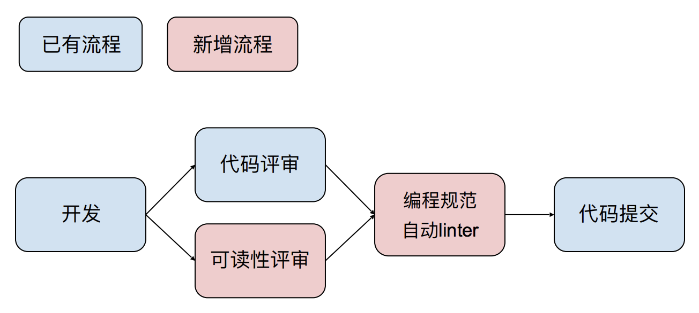

---
date: "2019-06-23"
---  
      
# 26 | 活都来不及干了，还有空注意代码风格？！
你好，我是蔡元楠，是极客时间《大规模数据处理实战》的作者。今天是我第二次受邀来我们专栏分享了，很高兴再次见到你。今天我分享的主题是：活都来不及干了，还有空注意代码风格吗？！

许多来Google参观的人，用完洗手间后，都会惊奇而略带羞涩地问：“你们马桶前面的门上，贴着的Python编程规范，是用来搞笑的吗？”

这事儿还真不是搞笑，Google对编码规范的要求极其严格。今天，我们就来聊聊编程规范这件事儿。

对于编程规范（style guide） 的认知，很多人可能只停留在第一阶段：知道编程规范有用，整个公司都要求使用驼峰式命名。而后面的阶段，比如为什么和怎么做，就并不了解了。

但在Google，对于编程规范的信仰，可能超出很多人的想象，我给你简单介绍几点。

1.  每一个语言都有专门的委员会（Style Committee）制定全公司强制的编程规范，和负责在编程风格争议时的仲裁人（Style Arbiters）。
2.  在每个语言相应的编程规范群里，每天都有大量的讨论和辩论。新达成的共识会被写出“大字报”张贴在厕所里，以至于每个人甚至来访者都能用坐着的时候那零碎的5分钟阅读。
3.  每一个代码提交，类似于Git里diff的概念，都需要至少两次代码评审（code review），一次针对业务逻辑，一次针对可读性（readability review）。所谓的可读性评审，着重在代码风格规范上。只有通过考核的人，才能够成为可读性评审人（readability reviewer）。
4.  有大量的开发自动化工具，确保以上的准则得到强制实施。例如，代码提交前会有linter做静态规则检查，不通过是无法提交代码的。

<!-- [[[read_end]]] -->

看到这里，不知道你有怎样的感受？我自己十分认同这样的工程师文化，所以今天，我会给你介绍清楚两点：

* Python的编程规范为什么重要，这对于业务开发来说，究竟有没有帮助？
* 有哪些流程和工具，可以整合到已有的开发流程中，让你的编程规范强制自动执行呢？

在讲解过程中，我会适时引用两个条例来举例，分别是：

* 《8号Python增强规范》（Python Enhacement Proposal #8），以下简称PEP8；
* 《Google Python 风格规范》（Google Python Style Guide），以下简称Google Style，这是源自Google内部的风格规范。公开发布的社区版本，是为了让Google旗下所有Python开源项目的编程风格统一。（<http://google.github.io/styleguide/pyguide.html>）

相对来说，Google Style是比PEP8更严格的一个编程规范。因为PEP8的受众是个人和小团队开发者，而Google Style能够胜任大团队，企业级，百万行级别代码库。他们的内容，后面我也会简单说明。

## 统一的编程规范为什么重要？

用一句话来概括，统一的编程规范能提高开发效率。而开发效率，关乎三类对象，也就是阅读者、编程者和机器。他们的优先级是**阅读者的体验 >> 编程者的体验 >> 机器的体验**。

### 阅读者的体验>>编程者的体验

写过代码的人可能都有体会，在我们的实际工作中，真正在打字的时间，远比阅读或者debug的时间要少。事实正是如此，研究表明，软件工程中80\%的时间都在阅读代码。所以，为了提高开发效率，我们要优化的，不是你的**打字时间**，而是**团队阅读的体验**。

其实，不少的编程规范，本来就是为了优化读者体验而存在的。举个例子，对于命名原则，我想很多人应该都有所理解，PEP8第38条规定命名必须有意义，不能是无意义的单字母。

有些人可能会说，啊，编程规范好烦哟，变量名一定要我写完整，打起来好累。但是当你作为阅读者时，一定能分辨下面两种代码的可读性不同：

```
    # 错误示例
    if (a <= 0):
       return
    elif (a > b):
       return
    else:
      b -= a
    
    # 正确示例
    if (transfer_amount <= 0):
       raise Exception('...')
    elif (transfer_amount > balance):
       raise Exception('...')
    else:
      balance -= transfer_amount
    

```

再举一个例子，Google Style 2.2条规定，Python代码中的import对象，只能是package或者module。

```
    # 错误示例
    from mypkg import Obj
    from mypkg import my_func
    
    my_func([1, 2, 3])
    
    # 正确示例
    import numpy as np
    import mypkg
    
    np.array([6, 7, 8])
    

```

以上错误示例在语法上完全合法（因为没有符号冲突name collisions），但是对于读者来讲，它们的可读性太差了。因为my\_func这样的名字，如果没有一个package name提供上下文语境，读者很难单独通过my\_func这个名字来推测它的可能功能，也很难在debug时根据package name找到可能的问题。

反观正确示例，虽然array是如此大众脸的名字，但因为有了numpy这个package的暗示，读者可以一下子反应过来，哦，这是一个numpy array。不过这里要注意区别，这个例子和符号冲突（name collisions）是正交（orthogonal）的两个概念，即使没有符号冲突，我们也要遵循这样的import规范。

### 编程者的体验 >> 机器的体验

说完了阅读者的体验，再来聊聊编程者的体验。我常常见到的一个错误倾向，是过度简化自己的代码，包括我自己也有这样的问题。一个典型的例子，就是盲目地使用Python的list comprehension。

```
    # 错误示例
    result = [(x, y) for x in range(10) for y in range(5) if x * y > 10]
    

```

我敢打赌，一定很少有人能一口气写出来这么复杂的list comprehension。这不仅容易累着自己，也让阅读者看得很累。其实，如果你用一个简单的for loop，会让这段代码更加简洁明了，自己也更为轻松。

```
    # 正确示例
    result = []
    for x in range(10):
      for y in range(5):
         if x * y > 10:
           result.append((x, y))
    

```

### 机器的体验也很重要

讲完了编程者和阅读者的重要性，我们不能忽视了机器的体验。我们最终希望代码能正确、高效地在电脑上执行。但是，一些危险的编程风格，不仅会影响程序正确性，也容易成为代码效率的瓶颈。

我们先来看看 is 和 == 的使用区别。你能看出下面的代码的运行结果吗？

```
    # 错误示例
    x = 27
    y = 27
    print(x is y)
    
    x = 721
    y = 721
    print(x is y)
    

```

看起来is是比较内存地址，那么两个结果应该都是一样的，可是实际上打印出来的，却分别是True和False！

原因是在CPython（Python的C实现）的实现中，把-5到256的整数做成了singleton，也就是说，这个区间里的数字都会引用同一块内存区域，所以上面的27和下面的27会指向同一个地址，运行结果为True。

但是-5到256之外的数字，会因为你的重新定义而被重新分配内存，所以两个721会指向不同的内存地址，结果也就是False了。

所以，即使你已经清楚，is比较对象的内存地址，你也应该在代码风格中，避免去用is比较两个Python整数的地址。

```
    # 正确示例
    x = 27
    y = 27
    print(x == y)
    
    x = 721
    y = 721
    print(x == y)
    

```

看完这个例子，我们再看==在比较值的时候，是否总能如你所愿呢？同样的，你可以自己先判断一下运行结果。

```
    # 错误示例
    x = MyObject()
    print(x == None)
    

```

打印结果是False吗？不一定。因为对于类来说，==的结果，取决于它的\_\_eq\_\_\(\)方法的具体实现。MyObject的作者完全可能这样实现：

```
    class MyObject(object):
     def __eq__(self, other):
       if other:
         return self.field == other.field
       return True
    

```

正确的是在代码风格中，当你和None比较时候永远使用 is:

```
    # 正确示例
    x = MyObject()
    print(x is None)
    

```

上面两个例子，我简单介绍了通过编程风格的限制，让is 和 == 的使用更安全。不过，光注意这两点就可以了吗？不要忘记，Python中还有隐式布尔转换。比如：

```
    # 错误示例
    def pay(name, salary=None):
     if not salary:
       salary = 11
     print(name, "is compensated", salary, "dollars")
    

```

如果有人调用 pay\(“Andrew”, 0\) ，会打印什么呢？“Andrew is compensated 11 dollars”。当你明确想要比较对象是否是None时，一定要显式地用 is None。

```
    # 正确示例
    def pay(name, salary=None):
     if salary is not None:
       salary = 11
     print(name, "is compensated", salary, "dollars")
    

```

这就是为什么，PEP8和Google Style都特别强调了，何时使用is， 何时使用 ==，何时使用隐式布尔转换。

不规范的编程习惯也会导致程序效率问题，我们看下面的代码有什么问题：

```
    # 错误示例
    adict = {i: i * 2 for i in xrange(10000000)}
    
    for key in adict.keys():
       print("{0} = {1}".format(key, adict[key]))
    

```

keys\(\)方法会在遍历前生成一个临时的列表，导致上面的代码消耗大量内存并且运行缓慢。正确的方式，是使用默认的iterator。默认的iterator不会分配新内存，也就不会造成上面的性能问题:

```
    # 正确示例
    for key in adict:
    

```

这也就是为什么Google Style 2.8对于遍历方式的选择作出了限制。

相信读到这里，对于代码风格规范的重要性，你已经有了进一步的理解。如果能够做到下一步，会让你和你的团队脱胎换骨，那就是和开发流程的完全整合。

## 整合进开发流程的自动化工具

前面我们已经提到了，编程规范的终极目标是提高开发效率。显然，如果每次写代码，都需要你在代码规范上额外花很多时间的话，就达不到我们的初衷了。

首先，你需要根据你的具体工作环境，选择或者制定适合自己公司/团队的规范。市面上可以参考的规范，也就是我在开头提到的那两个，PEP8和Google Style。

没有放之四海而皆准的规范，你需要因地制宜。例如在Google，因为历史原因C加加不使用异常，引入异常对整个代码库带来的风险已经远大于它的益处，所以在它的C加加代码规范中，禁止使用异常。

其次，一旦确定了整个团队同意的代码规范，就一定要强制执行。停留在口头和大脑的共识，只是水中月镜中花。如何执行呢？**靠强制代码评审和强制静态或者动态linter**。

当然，需要注意的是，我这里“强制”的意思，不是说如果不做就罚款。那就太low了，完全没有极客精神。我指的“强制”，是把共识写进代码里，让机器来自动化这些流程。比如：

* 在代码评审工具里，添加必须的编程规范环节；
* 把团队确定的代码规范写进Pylint里（<https://www.pylint.org/>），能够在每份代码提交前自动检查，不通过的代码无法提交。

整合之后，你的团队工作流程就会变成这样：



## 总结

学到这里，相信你对代码风格的重要性有了全新的认识。代码风格之所以重要，是因为它关乎阅读者的体验、编程者的体验和执行代码的机器体验。

当然，仅仅意识到代码风格重要，是远远不够的。我还具体分享了一些自动化代码风格检查的切实方法，比如强制代码评审和强制静态或者动态linter。总之还是那句话，我们强调编程规范，最终一定是为了提高开发效率，而不是做额外功。

## 思考题

在你个人或者团队的项目经验中，是否也因为编程规范的问题，踩过坑或者吵过架呢？欢迎留言和我分享，也欢迎你把这篇文章分享出去。