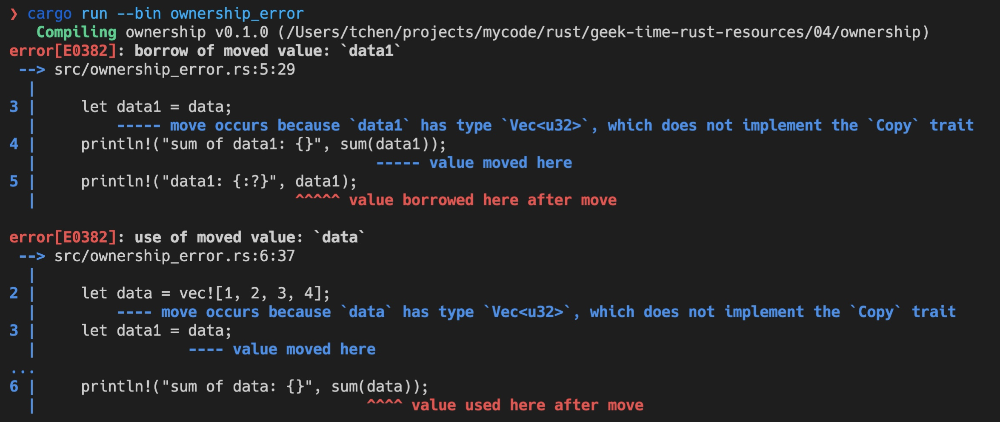
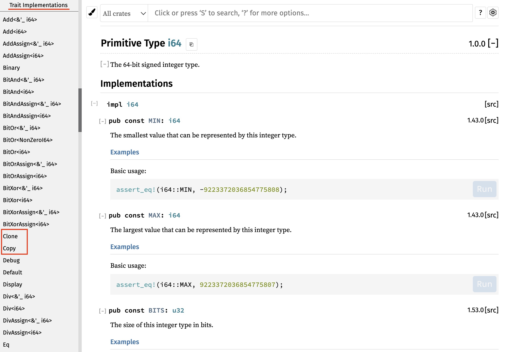
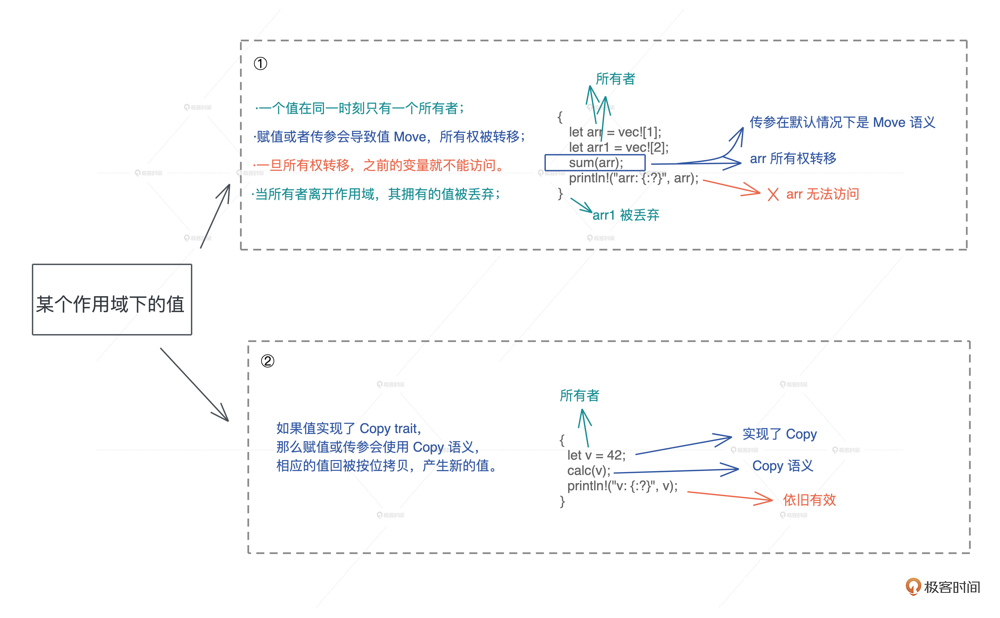

---
date: "2019-06-23"
---  
      
# 07｜所有权：值的生杀大权到底在谁手上？
你好，我是陈天。

完成了上周的“get hands dirty”挑战，相信你对 Rust 的魅力已经有了感性的认知，是不是开始信心爆棚地尝试写小项目了。

但当你写的代码变多，编译器似乎开始和自己作对了，一些感觉没有问题的代码，编译器却总是莫名其妙报错。

那么从今天起我们重归理性，一起来研究 Rust 学习过程中最难啃的硬骨头：所有权和生命周期。为什么要从这个知识点开始呢？因为，**所有权和生命周期是 Rust 和其它编程语言的主要区别，也是 Rust 其它知识点的基础**。

很多 Rust 初学者在这个地方没弄明白，一知半解地继续学习，结果越学越吃力，最后在实际上手写代码的时候就容易栽跟头，编译总是报错，丧失了对 Rust 的信心。

其实所有权和生命周期之所以这么难学明白，除了其与众不同的解决内存安全问题的角度外，另一个很大的原因是，目前的资料对初学者都不友好，上来就讲 Copy / Move 语义怎么用，而没有讲明白**为什么要这样用**。

所以这一讲我们换个思路，从一个变量使用堆栈的行为开始，探究 Rust 设计所有权和生命周期的用意，帮你从根上解决这些编译问题。

## 变量在函数调用时发生了什么

首先，我们来看一看，在我们熟悉的大多数编程语言中，变量在函数调用时究竟会发生什么、存在什么问题。

<!-- [[[read_end]]] -->

看这段代码，main\(\) 函数中定义了一个动态数组 data 和一个值 v，然后将其传递给函数 find\_pos，在 data 中查找 v 是否存在，存在则返回 v 在 data 中的下标，不存在返回 None（[代码1](https://play.rust-lang.org/?version=stable&mode=debug&edition=2018&gist=b8ab613d39f4ab0a771c1186c04a8220)）：

```
    fn main() {
        let data = vec![10, 42, 9, 8];
        let v = 42;
        if let Some(pos) = find_pos(data, v) {
            println!("Found {} at {}", v, pos);
        }
    }
    
    fn find_pos(data: Vec<u32>, v: u32) -> Option<usize> {
        for (pos, item) in data.iter().enumerate() {
            if *item == v {
                return Some(pos);
            }
        }
        
        None
    }
    

```

这段代码不难理解，要再强调一下的是，**动态数组因为大小在编译期无法确定，所以放在堆上，并且在栈上有一个包含了长度和容量的胖指针指向堆上的内存**。

在调用 find\_pos\(\) 时，main\(\) 函数中的局部变量 data 和 v 作为参数传递给了 find\_pos\(\)，所以它们会被放在 find\_pos\(\) 的参数区。


按照大多数编程语言的做法，现在堆上的内存就有了两个引用。不光如此，我们每把 data 作为参数传递一次，堆上的内存就会多一次引用。

但是，这些引用究竟会做什么操作，我们不得而知，也无从限制；而且堆上的内存究竟什么时候能释放，尤其在多个调用栈引用时，很难厘清，取决于最后一个引用什么时候结束。所以，这样一个看似简单的函数调用，给内存管理带来了极大麻烦。

对于堆内存多次引用的问题，我们先来看大多数语言的方案：

* **C/C加加 要求开发者手工处理**，非常不便。这需要我们在写代码时高度自律，按照前人总结的最佳实践来操作。但人必然会犯错，一个不慎就会导致内存安全问题，要么内存泄露，要么使用已释放内存，导致程序崩溃。
* **Java 等语言使用追踪式 GC**，通过定期扫描堆上数据还有没有人引用，来替开发者管理堆内存，不失为一种解决之道，但 GC 带来的 STW 问题让语言的使用场景受限，性能损耗也不小。
* **ObjC/Swift 使用自动引用计数（ARC）**，在编译时自动添加维护引用计数的代码，减轻开发者维护堆内存的负担。但同样地，它也会有不小的运行时性能损耗。

现存方案都是从管理引用的角度思考的，有各自的弊端。我们回顾刚才梳理的函数调用过程，从源头上看，本质问题是堆上内存会被随意引用，那么换个角度，我们是不是可以限制引用行为本身呢？

## Rust 的解决思路

这个想法打开了新的大门，Rust就是这样另辟蹊径的。

在 Rust 以前，引用是一种随意的、可以隐式产生的、对权限没有界定的行为，比如 C 里到处乱飞的指针、Java 中随处可见的按引用传参，它们可读可写，权限极大。而 Rust 决定限制开发者随意引用的行为。

其实作为开发者，我们在工作中常常能体会到：**恰到好处的限制，反而会释放无穷的创意和生产力**。最典型的就是各种开发框架，比如 React、Ruby on Rails 等，他们限制了开发者使用语言的行为，却极大地提升了生产力。

好，思路我们已经有了，具体怎么实现来限制数据的引用行为呢？

要回答这个问题，我们需要先来回答：谁真正拥有数据或者说值的生杀大权，这种权利可以共享还是需要独占？

### 所有权和 Move 语义

照旧我们先尝试回答一下，对于值的生杀大权可以共享还是需要独占这一问题，我们大概都会觉得，一个值最好只有一个拥有者，因为所有权共享，势必会带来使用和释放上的不明确，走回 追踪式 GC 或者 ARC 的老路。

那么如何保证独占呢？具体实现其实是有些困难的，因为太多情况需要考虑。比如说一个变量被赋给另一个变量、作为参数传给另一个函数，或者作为返回值从函数返回，都可能造成这个变量的拥有者不唯一。怎么办？

对此，Rust 给出了如下规则：

* **一个值只能被一个变量所拥有，这个变量被称为所有者**（Each value in Rust has a variable that’s called its _owner_）。
* **一个值同一时刻只能有一个所有者**（There can only be one owner at a time），也就是说不能有两个变量拥有相同的值。所以对应刚才说的变量赋值、参数传递、函数返回等行为，旧的所有者会把值的所有权转移给新的所有者，以便保证单一所有者的约束。
* **当所有者离开作用域，其拥有的值被丢弃**（When the owner goes out of scope, the value will be dropped），内存得到释放。

这三条规则很好理解，核心就是保证单一所有权。其中第二条规则讲的所有权转移是 Move 语义，Rust 从 C加加 那里学习和借鉴了这个概念。

第三条规则中的作用域（scope）是一个新概念，我简单说明一下，它指一个代码块（block），在 Rust 中，一对花括号括起来的代码区就是一个作用域。举个例子，如果一个变量被定义在 if \{\} 内，那么 if 语句结束，这个变量的作用域就结束了，其值会被丢弃；同样的，函数里定义的变量，在离开函数时会被丢弃。

在这三条所有权规则的约束下，我们看开头的引用问题是如何解决的：  


原先 main\(\) 函数中的 data，被移动到 find\_pos\(\) 后，就失效了，编译器会保证 main\(\) 函数随后的代码无法访问这个变量，这样，就确保了堆上的内存依旧只有唯一的引用。

看这个图，你可能会有一个小小的疑问：main\(\) 函数传递给 find\_pos\(\) 函数的另一个参数 v，也会被移动吧？为什么图上并没有标灰？咱们暂且将这个疑问放到一边，等这一讲学完，相信你会有答案的。

现在，我们来写段代码加深一下对所有权的理解。

在这段代码里，先创建了一个不可变数据 data，然后将 data 赋值给 data1。按照所有权的规则，赋值之后，data 指向的值被移动给了 data1，它自己便不可访问了。而随后，data1 作为参数被传给函数 sum\(\)，在 main\(\) 函数下，data1 也不可访问了。

但是后续的代码依旧试图访问 data1 和 data，所以，这段代码应该会有两处错误（[代码2](https://play.rust-lang.org/?version=stable&mode=debug&edition=2018&gist=3d76a275e808fac6fcc88e21e0a0a05b)）：

```
    fn main() {
        let data = vec![1, 2, 3, 4];
        let data1 = data;
        println!("sum of data1: {}", sum(data1));
        println!("data1: {:?}", data1); // error1
        println!("sum of data: {}", sum(data)); // error2
    }
    
    fn sum(data: Vec<u32>) -> u32 {
        data.iter().fold(0, |acc, x| acc + x)
    }
    

```

运行时，编译器也确实捕获到了这两个错误，并清楚地告诉我们不能使用已经移动过的变量：



如果我们要在把 data1 传给 sum\(\)，同时，还想让 main\(\) 能够访问 data，该怎么办？

我们可以调用 `data.clone()` 把 data 复制一份出来给 data1，这样，在堆上就有 `vec![1,2,3,4]` 两个互不影响且可以独立释放的副本，如下图所示：


可以看到，**所有权规则，解决了谁真正拥有数据的生杀大权问题，让堆上数据的多重引用不复存在，这是它最大的优势**。

但是，这也会让代码变复杂，尤其是一些只存储在栈上的简单数据，如果要避免所有权转移之后不能访问的情况，我们就需要手动复制，会非常麻烦，效率也不高。

Rust 考虑到了这一点，提供了两种方案：

1.  如果你不希望值的所有权被转移，在 Move 语义外，Rust 提供了 **Copy 语义**。如果一个数据结构实现了 [Copy trait](https://doc.rust-lang.org/std/marker/trait.Copy.html)，那么它就会使用 Copy 语义。这样，在你赋值或者传参时，值会自动按位拷贝（浅拷贝）。
2.  如果你不希望值的所有权被转移，又无法使用 Copy 语义，那你可以**“借用”数据**，我们下一讲会详细讨论“借用”。

我们先看今天要讲的第一种方案：Copy 语义。

### Copy 语义和 Copy trait

符合 Copy 语义的类型，**在你赋值或者传参时，值会自动按位拷贝**。这句话不难理解，那在Rust中是具体怎么实现的呢？

我们再仔细看看刚才代码编译器给出的错误，你会发现，它抱怨 data 的类型 `Vec<u32>`没有实现 Copy trait，在赋值或者函数调用的时候无法 Copy，于是就按默认使用 Move 语义。而 Move 之后，原先的变量 data 无法访问，所以出错。


换句话说，当你要移动一个值，如果值的类型实现了 Copy trait，就会自动使用 Copy 语义进行拷贝，否则使用 Move 语义进行移动。

讲到这里，我插一句，在学习 Rust 的时候，你可以根据编译器详细的错误说明来尝试修改代码，使编译通过，在这个过程中，你可以用 Stack Overflow 搜索错误信息，进一步学习自己不了解的知识点。我也非常建议你根据上图中的错误代码 E0382 使用 `rustc \--explain E0382` 探索更详细的信息。

好，回归正文，那在 Rust 中，什么数据结构实现了 Copy trait 呢？ 你可以通过下面的代码快速验证一个数据结构是否实现了 Copy trait（[验证代码](https://play.rust-lang.org/?version=stable&mode=debug&edition=2018&gist=457cc3107aea384268dcd4db7406351c)）：

```
    fn is_copy<T: Copy>() {}
    
    fn types_impl_copy_trait() {
        is_copy::<bool>();
        is_copy::<char>();
    
        // all iXX and uXX, usize/isize, fXX implement Copy trait
        is_copy::<i8>();
        is_copy::<u64>();
        is_copy::<i64>();
        is_copy::<usize>();
    
        // function (actually a pointer) is Copy
        is_copy::<fn()>();
    
        // raw pointer is Copy
        is_copy::<*const String>();
        is_copy::<*mut String>();
    
        // immutable reference is Copy
        is_copy::<&[Vec<u8>]>();
        is_copy::<&String>();
    
        // array/tuple with values which is Copy is Copy
        is_copy::<[u8; 4]>();
        is_copy::<(&str, &str)>();
    }
    
    fn types_not_impl_copy_trait() {
        // unsized or dynamic sized type is not Copy
        is_copy::<str>();
        is_copy::<[u8]>();
        is_copy::<Vec<u8>>();
        is_copy::<String>();
    
        // mutable reference is not Copy
        is_copy::<&mut String>();
    
        // array / tuple with values that not Copy is not Copy
        is_copy::<[Vec<u8>; 4]>();
        is_copy::<(String, u32)>();
    }
    
    fn main() {
        types_impl_copy_trait();
        types_not_impl_copy_trait();
    }
    

```

推荐你动手运行这段代码，并仔细阅读编译器错误，加深印象。我也总结一下：

* 原生类型，包括函数、不可变引用和裸指针实现了 Copy；
* 数组和元组，如果其内部的数据结构实现了 Copy，那么它们也实现了 Copy；
* 可变引用没有实现 Copy；
* 非固定大小的数据结构，没有实现 Copy。

另外，[官方文档介绍 Copy trait 的页面](https://doc.rust-lang.org/std/marker/trait.Copy.html)包含了 Rust 标准库中实现 Copy trait 的所有数据结构。你也可以在访问某个数据结构的时候，查看其文档的 Trait implementation 部分，看看它是否实现了 Copy trait。



## 小结

今天我们学习了 Rust 的单一所有权模式、Move 语义、Copy 语义，我整理一下关键信息，方便你再回顾一遍。

* 所有权：一个值只能被一个变量所拥有，且同一时刻只能有一个所有者，当所有者离开作用域，其拥有的值被丢弃，内存得到释放。
* Move 语义：赋值或者传参会导致值 Move，所有权被转移，一旦所有权转移，之前的变量就不能访问。
* Copy 语义：如果值实现了 Copy trait，那么赋值或传参会使用 Copy 语义，相应的值会被按位拷贝（浅拷贝），产生新的值。



通过单一所有权模式，Rust 解决了堆内存过于灵活、不容易安全高效地释放的问题，不过所有权模型也引入了很多新的概念，比如今天讲的 Move / Copy 语义。

由于是全新的概念，我们学习起来有一定的难度，但是你只要抓住了核心点：**Rust 通过单一所有权来限制任意引用的行为**，就不难理解这些新概念背后的设计意义。

下一讲我们会继续学习Rust的所有权和生命周期，在不希望值的所有权被转移，又无法使用 Copy 语义的情况下，如何“借用”数据……

## 思考题

今天的思考题有两道，第一道题巩固学习收获。另外第二道题如果你还记得，在文中，我提出了一个小问题，让你暂时搁置，今天学完之后就有答案了，现在你有想法了吗？欢迎留言分享出来，我们一起讨论。

1.  在 Rust 下，分配在堆上的数据结构可以引用栈上的数据么？为什么？
2.  main\(\) 函数传递给 find\_pos\(\) 函数的另一个参数 v，也会被移动吧？为什么图上并没有将其标灰？

欢迎在留言区分享你的思考。今天是你 Rust 学习的第七次打卡，感谢你的收听，如果你觉得有收获，也欢迎你分享给身边的朋友，邀他一起讨论。

## 参考资料

trait 是 Rust 用于定义数据结构行为的接口。如果一个数据结构实现了 Copy trait，那么它在赋值、函数调用以及函数返回时会执行 Copy 语义，值会被按位拷贝一份（浅拷贝），而非移动。你可以看关于 [Copy trait](https://doc.rust-lang.org/std/marker/trait.Copy.html) 的资料。