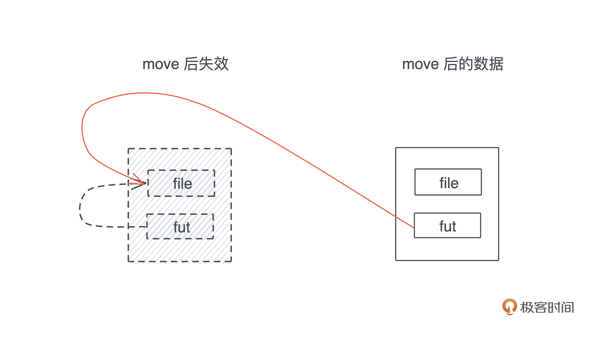
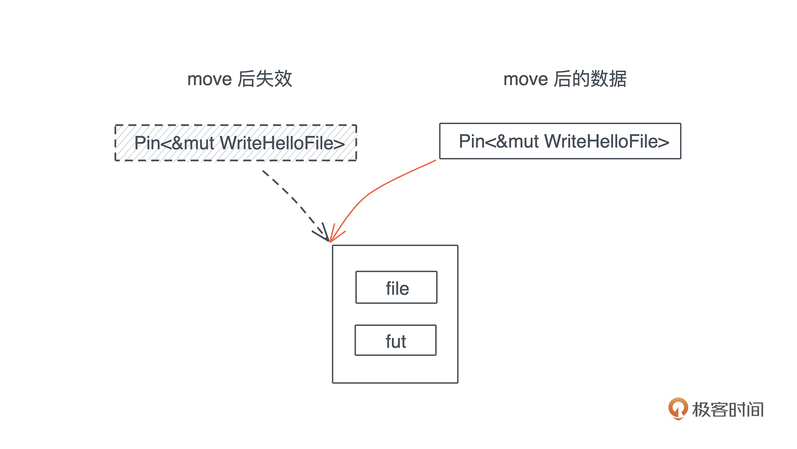
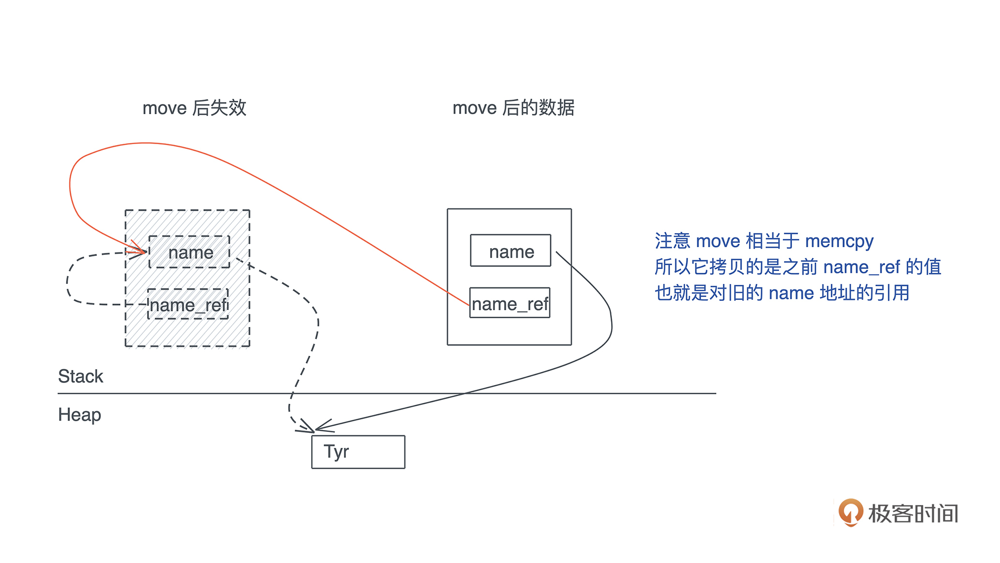
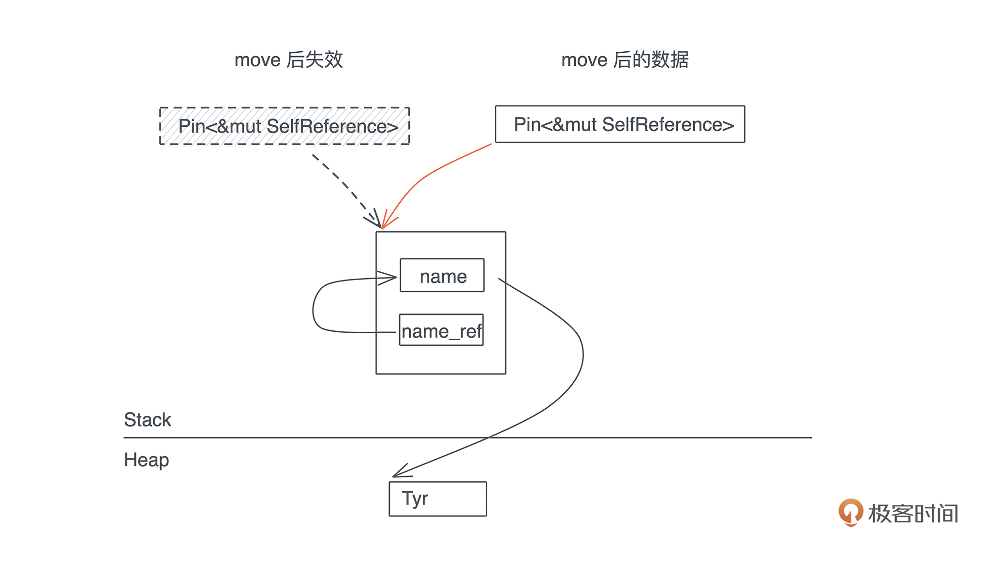
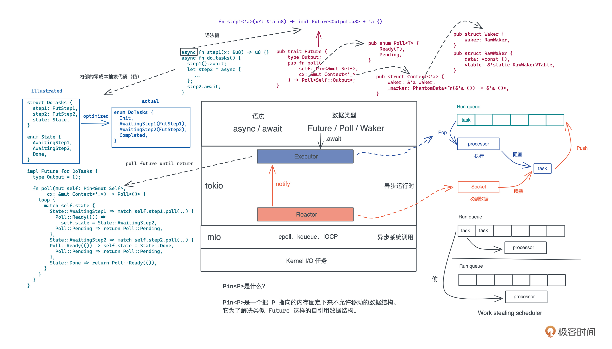

---
date: "2019-06-23"
---  
      
# 39｜异步处理：async/await内部是怎么实现的？
你好，我是陈天。

学完上一讲，我们对 Future 和 async/await 的基本概念有一个比较扎实的理解了，知道在什么情况下该使用 Future、什么情况下该使用 Thread，以及 executor 和 reactor 是怎么联动最终让 Future 得到了一个结果。

然而，我们并不清楚为什么 async fn 或者 async block 就能够产生 Future，也并不明白 Future 是怎么被 executor 处理的。今天我们就继续深入下去，看看 async/await 这两个关键词究竟施了什么样的魔法，能够让一切如此简单又如此自然地运转起来。

提前说明一下，我们会继续围绕着 Future 这个简约却又并不简单的接口，来探讨一些原理性的东西，主要是 Context 和 Pin这两个结构：

```
    pub trait Future {
        type Output;
        fn poll(self: Pin<&mut Self>, cx: &mut Context<'_>) -> Poll<Self::Output>;
    }
    

```

这堂课的内容即便没有完全弄懂，也并不影响你使用 async/await。如果精力有限，你可以不用理解所有细节，只要抓住这些问题产生的原因，以及解决方案的思路即可。

## Waker 的调用机制

<!-- [[[read_end]]] -->

先来看这个接口的 Context 是个什么东西。

上节课我们简单讲过 executor 通过调用 poll 方法来让 Future 继续往下执行，如果 poll 方法返回 Poll::Pending，就阻塞 Future，直到 reactor 收到了某个事件，然后调用 Waker.wake\(\) 把 Future 唤醒。这个 Waker 是哪来的呢？

其实，它隐含在 Context 中：

```
    pub struct Context<'a> {
        waker: &'a Waker,
        _marker: PhantomData<fn(&'a ()) -> &'a ()>,
    }
    

```

所以，Context 就是 Waker 的一个封装。

如果你去看 Waker 的定义和相关的代码，会发现它非常抽象，内部使用了一个 vtable 来允许各种各样的 waker 的行为：

```
    pub struct RawWakerVTable {
        clone: unsafe fn(*const ()) -> RawWaker,
        wake: unsafe fn(*const ()),
        wake_by_ref: unsafe fn(*const ()),
        drop: unsafe fn(*const ()),
    }
    

```

这种手工生成 vtable 的做法，我们[之前](https://time.geekbang.org/column/article/424017)阅读 bytes 的源码已经见识过了，它可以最大程度兼顾效率和灵活性。

Rust 自身并不提供异步运行时，它只在标准库里规定了一些基本的接口，至于怎么实现，可以由各个运行时（如 tokio）自行决定。**所以在标准库中，你只会看到这些接口的定义，以及“高层”接口的实现**，比如 Waker 下的 wake 方法，只是调用了 vtable 里的 wake\(\) 而已：

```
    impl Waker {
        /// Wake up the task associated with this `Waker`.
        #[inline]
        pub fn wake(self) {
            // The actual wakeup call is delegated through a virtual function call
            // to the implementation which is defined by the executor.
            let wake = self.waker.vtable.wake;
            let data = self.waker.data;
    
            // Don't call `drop` -- the waker will be consumed by `wake`.
            crate::mem::forget(self);
    
            // SAFETY: This is safe because `Waker::from_raw` is the only way
            // to initialize `wake` and `data` requiring the user to acknowledge
            // that the contract of `RawWaker` is upheld.
            unsafe { (wake)(data) };
        }
        ...
    }
    

```

如果你想顺藤摸瓜找到 vtable 是怎么设置的，却发现一切线索都悄无声息地中断了，那是因为，具体的实现并不在标准库中，而是在第三方的异步运行时里，比如 tokio。

不过，虽然我们开发时会使用 tokio，但阅读、理解代码时，我建议看 futures 库，比如 waker vtable 的[定义](https://github.com/rust-lang/futures-rs/blob/master/futures-task/src/waker.rs)。futures 库还有一个简单的 executor，也非常适合进一步通过代码理解 executor 的原理。

## async究竟生成了什么？

我们接下来看 Pin。这是一个奇怪的数据结构，正常数据结构的方法都是直接使用 self / \&self / \&mut self，可是 poll\(\) 却使用了 Pin\<\&mut self>，为什么？

为了讲明白 Pin，我们得往前追踪一步，看看产生 Future的一个 async block/fn 内部究竟生成了什么样的代码？来看下面这个简单的 async 函数：

```
    async fn write_hello_file_async(name: &str) -> anyhow::Result<()> {
        let mut file = fs::File::create(name).await?;
        file.write_all(b"hello world!").await?;
    
        Ok(())
    }
    

```

首先它创建一个文件，然后往这个文件里写入 “hello world\!”。这个函数有两个 await，创建文件的时候会异步创建，写入文件的时候会异步写入。最终，整个函数对外返回一个 Future。

其它人可以这样调用：

```
    write_hello_file_async("/tmp/hello").await?;
    

```

我们知道，executor 处理 Future 时，会不断地调用它的 poll\(\) 方法，于是，上面那句实际上相当于：

```
    match write_hello_file_async.poll(cx) {
        Poll::Ready(result) => return result,
        Poll::Pending => return Poll::Pending
    }
    

```

这是单个 await 的处理方法，那更加复杂的，一个函数中有若干个 await，该怎么处理呢？以前面`write_hello_file_async` 函数的内部实现为例，显然，我们只有在处理完 create\(\)，才能处理 write\_all\(\)，所以，应该是类似这样的代码：

```
    let fut = fs::File::create(name);
    match fut.poll(cx) {
        Poll::Ready(Ok(file)) => {
            let fut = file.write_all(b"hello world!");
            match fut.poll(cx) {
                Poll::Ready(result) => return result,
                Poll::Pending => return Poll::Pending,
            }
        }
        Poll::Pending => return Poll::Pending,
    }
    

```

但是，前面说过，async 函数返回的是一个 Future，所以，还需要把这样的代码封装在一个 Future 的实现里，对外提供出去。因此，我们需要实现一个数据结构，把内部的状态保存起来，并为这个数据结构实现 Future。比如：

```
    enum WriteHelloFile {
        // 初始阶段，用户提供文件名
        Init(String),
        // 等待文件创建，此时需要保存 Future 以便多次调用
        // 这是伪代码，impl Future 不能用在这里
        AwaitingCreate(impl Future<Output = Result<fs::File, std::io::Error>>),
        // 等待文件写入，此时需要保存 Future 以便多次调用
        AwaitingWrite(impl Future<Output = Result<(), std::io::Error>>),
        // Future 处理完毕
        Done,
    }
    
    impl WriteHelloFile {
        pub fn new(name: impl Into<String>) -> Self {
            Self::Init(name.into())
        }
    }
    
    impl Future for WriteHelloFile {
        type Output = Result<(), std::io::Error>;
    
        fn poll(self: Pin<&mut Self>, cx: &mut Context<'_>) -> Poll<Self::Output> {
            todo!()
        }
    }
    
    fn write_hello_file_async(name: &str) -> WriteHelloFile {
        WriteHelloFile::new(name)
    }
    

```

这样，我们就把刚才的 write\_hello\_file\_async 异步函数，转化成了一个返回 WriteHelloFile Future 的函数。来看这个 Future 如何实现（详细注释了）：

```
    impl Future for WriteHelloFile {
        type Output = Result<(), std::io::Error>;
    
        fn poll(self: Pin<&mut Self>, cx: &mut Context<'_>) -> Poll<Self::Output> {
            let this = self.get_mut();
            loop {
                match this {
                    // 如果状态是 Init，那么就生成 create Future，把状态切换到 AwaitingCreate
                    WriteHelloFile::Init(name) => {
                        let fut = fs::File::create(name);
                        *self = WriteHelloFile::AwaitingCreate(fut);
                    }
                    // 如果状态是 AwaitingCreate，那么 poll create Future
                    // 如果返回 Poll::Ready(Ok(_))，那么创建 write Future
                    // 并把状态切换到 Awaiting
                    WriteHelloFile::AwaitingCreate(fut) => match fut.poll(cx) {
                        Poll::Ready(Ok(file)) => {
                            let fut = file.write_all(b"hello world!");
                            *self = WriteHelloFile::AwaitingWrite(fut);
                        }
                        Poll::Ready(Err(e)) => return Poll::Ready(Err(e)),
                        Poll::Pending => return Poll::Pending,
                    },
                    // 如果状态是 AwaitingWrite，那么 poll write Future
                    // 如果返回 Poll::Ready(_)，那么状态切换到 Done，整个 Future 执行成功
                    WriteHelloFile::AwaitingWrite(fut) => match fut.poll(cx) {
                        Poll::Ready(result) => {
                            *self = WriteHelloFile::Done;
                            return Poll::Ready(result);
                        }
                        Poll::Pending => return Poll::Pending,
                    },
                    // 整个 Future 已经执行完毕
                    WriteHelloFile::Done => return Poll::Ready(Ok(())),
                }
            }
        }
    }
    

```

这个 Future 完整实现的内部结构 ，其实就是一个状态机的迁移。

这段（伪）代码和之前异步函数是等价的：

```
    async fn write_hello_file_async(name: &str) -> anyhow::Result<()> {
        let mut file = fs::File::create(name).await?;
        file.write_all(b"hello world!").await?;
    
        Ok(())
    }
    

```

**Rust 在编译 async fn 或者 async block 时，就会生成类似的状态机的实现**。你可以看到，看似简单的异步处理，内部隐藏了一套并不难理解、但是写起来很生硬很啰嗦的状态机管理代码。

好搞明白这个问题，回到pin 。刚才我们手写状态机代码的过程，能帮你理解为什么会需要 Pin 这个问题。

### 为什么需要 Pin？

在上面实现 Future 的状态机中，我们引用了 file 这样一个局部变量：

```
    WriteHelloFile::AwaitingCreate(fut) => match fut.poll(cx) {
        Poll::Ready(Ok(file)) => {
            let fut = file.write_all(b"hello world!");
            *self = WriteHelloFile::AwaitingWrite(fut);
        }
        Poll::Ready(Err(e)) => return Poll::Ready(Err(e)),
        Poll::Pending => return Poll::Pending,
    }
    

```

这个代码是有问题的，file 被 fut 引用，但 file 会在这个作用域被丢弃。所以，我们需要把它保存在数据结构中：

```
    enum WriteHelloFile {
        // 初始阶段，用户提供文件名
        Init(String),
        // 等待文件创建，此时需要保存 Future 以便多次调用
        AwaitingCreate(impl Future<Output = Result<fs::File, std::io::Error>>),
        // 等待文件写入，此时需要保存 Future 以便多次调用
        AwaitingWrite(AwaitingWriteData),
        // Future 处理完毕
        Done,
    }
    
    struct AwaitingWriteData {
        fut: impl Future<Output = Result<(), std::io::Error>>,
        file: fs::File,
    }
    

```

可以生成一个 AwaitingWriteData 数据结构，把 file 和 fut 都放进去，然后在 WriteHelloFile 中引用它。此时，在同一个数据结构内部，fut 指向了对 file 的引用，这样的数据结构，叫**自引用结构（Self-Referential Structure）**。

自引用结构有一个很大的问题是：一旦它被移动，原本的指针就会指向旧的地址。  


所以需要有某种机制来保证这种情况不会发生。Pin 就是为这个目的而设计的一个数据结构，我们可以 Pin 住指向一个 Future 的指针，看文稿中 Pin 的声明：

```
    pub struct Pin<P> {
        pointer: P,
    }
    
    impl<P: Deref> Deref for Pin<P> {
        type Target = P::Target;
        fn deref(&self) -> &P::Target {
            Pin::get_ref(Pin::as_ref(self))
        }
    }
    
    impl<P: DerefMut<Target: Unpin>> DerefMut for Pin<P> {
        fn deref_mut(&mut self) -> &mut P::Target {
            Pin::get_mut(Pin::as_mut(self))
        }
    }
    

```

Pin 拿住的是**一个可以解引用成 T 的指针类型 P**，而不是直接拿原本的类型 T。所以，对于 Pin 而言，你看到的都是 Pin\<Box\<T>>、Pin\<\&mut T>，但不会是 Pin\<T>。因为 Pin 的目的是，把 T 的内存位置锁住，从而避免移动后自引用类型带来的引用失效问题。  


这样数据结构可以正常访问，但是你**无法直接**拿到原来的数据结构进而移动它。

### 自引用数据结构

当然，自引用数据结构并非只在异步代码里出现，只不过异步代码在内部生成用状态机表述的 Future 时，很容易产生自引用结构。我们看一个和 Future 无关的例子（[代码](https://play.rust-lang.org/?version=stable&mode=debug&edition=2021&gist=84d31bad09e9cf0824e07b64fa7930fb)）：

```
    #[derive(Debug)]
    struct SelfReference {
        name: String,
        // 在初始化后指向 name
        name_ptr: *const String,
    }
    
    impl SelfReference {
        pub fn new(name: impl Into<String>) -> Self {
            SelfReference {
                name: name.into(),
                name_ptr: std::ptr::null(),
            }
        }
    
        pub fn init(&mut self) {
            self.name_ptr = &self.name as *const String;
        }
    
        pub fn print_name(&self) {
            println!(
                "struct {:p}: (name: {:p} name_ptr: {:p}), name: {}, name_ref: {}",
                self,
                &self.name,
                self.name_ptr,
                self.name,
                // 在使用 ptr 是需要 unsafe
                // SAFETY: 这里 name_ptr 潜在不安全，会指向旧的位置
                unsafe { &*self.name_ptr },
            );
        }
    }
    
    fn main() {
        let data = move_creates_issue();
        println!("data: {:?}", data);
        // 如果把下面这句注释掉，程序运行会直接 segment error
        // data.print_name();
        print!("\\n");
        mem_swap_creates_issue();
    }
    
    fn move_creates_issue() -> SelfReference {
        let mut data = SelfReference::new("Tyr");
        data.init();
    
        // 不 move，一切正常
        data.print_name();
    
        let data = move_it(data);
    
        // move 之后，name_ref 指向的位置是已经失效的地址
        // 只不过现在 move 前的地址还没被回收挪作它用
        data.print_name();
        data
    }
    
    fn mem_swap_creates_issue() {
        let mut data1 = SelfReference::new("Tyr");
        data1.init();
    
        let mut data2 = SelfReference::new("Lindsey");
        data2.init();
    
        data1.print_name();
        data2.print_name();
    
        std::mem::swap(&mut data1, &mut data2);
        data1.print_name();
        data2.print_name();
    }
    
    fn move_it(data: SelfReference) -> SelfReference {
        data
    }
    

```

我们创建了一个自引用结构 SelfReference，它里面的 name\_ref 指向了 name。正常使用它时，没有任何问题，但一旦对这个结构做 move 操作，name\_ref 指向的位置还会是 move 前 name 的地址，这就引发了问题。看下图：  


同样的，如果我们使用 std::mem:swap，也会出现类似的问题，一旦 swap，两个数据的内容交换，然而，由于 name\_ref 指向的地址还是旧的，所以整个指针体系都混乱了：  


看代码的输出，辅助你理解：

```
    struct 0x7ffeea91d6e8: (name: 0x7ffeea91d6e8 name_ptr: 0x7ffeea91d6e8), name: Tyr, name_ref: Tyr
    struct 0x7ffeea91d760: (name: 0x7ffeea91d760 name_ptr: 0x7ffeea91d6e8), name: Tyr, name_ref: Tyr
    data: SelfReference { name: "Tyr", name_ptr: 0x7ffeea91d6e8 }
    
    struct 0x7ffeea91d6f0: (name: 0x7ffeea91d6f0 name_ptr: 0x7ffeea91d6f0), name: Tyr, name_ref: Tyr
    struct 0x7ffeea91d710: (name: 0x7ffeea91d710 name_ptr: 0x7ffeea91d710), name: Lindsey, name_ref: Lindsey
    struct 0x7ffeea91d6f0: (name: 0x7ffeea91d6f0 name_ptr: 0x7ffeea91d710), name: Lindsey, name_ref: Tyr
    struct 0x7ffeea91d710: (name: 0x7ffeea91d710 name_ptr: 0x7ffeea91d6f0), name: Tyr, name_ref: Lindsey
    

```

可以看到，swap 之后，name\_ref 指向的内容确实和 name 不一样了。这就是自引用结构带来的问题。

你也许会奇怪，不是说 move 也会出问题么？为什么第二行打印 name\_ref 还是指向了 “Tyr”？这是因为 move 后，之前的内存失效，但是内存地址还没有被挪作它用，所以还能正常显示 “Tyr”。**但这样的内存访问是不安全的**，如果你把 main 中这句代码注释掉，程序就会 crash：

```
    fn main() {
        let data = move_creates_issue();
        println!("data: {:?}", data);
        // 如果把下面这句注释掉，程序运行会直接 segment error
        // data.print_name();
        print!("\\n");
        mem_swap_creates_issue();
    }
    

```

现在你应该了解到在 Rust 下，自引用类型带来的潜在危害了吧。

所以，Pin 的出现，对解决这类问题很关键，如果你试图移动被 Pin 住的数据结构，要么，编译器会通过编译错误阻止你；要么，你强行使用 unsafe Rust，自己负责其安全性。我们来看使用 Pin 后如何避免移动带来的问题：

```
    use std::{marker::PhantomPinned, pin::Pin};
    
    #[derive(Debug)]
    struct SelfReference {
        name: String,
        // 在初始化后指向 name
        name_ptr: *const String,
        // PhantomPinned 占位符
        _marker: PhantomPinned,
    }
    
    impl SelfReference {
        pub fn new(name: impl Into<String>) -> Self {
            SelfReference {
                name: name.into(),
                name_ptr: std::ptr::null(),
                _marker: PhantomPinned,
            }
        }
    
        pub fn init(self: Pin<&mut Self>) {
            let name_ptr = &self.name as *const String;
            // SAFETY: 这里并不会把任何数据从 &mut SelfReference 中移走
            let this = unsafe { self.get_unchecked_mut() };
            this.name_ptr = name_ptr;
        }
    
        pub fn print_name(self: Pin<&Self>) {
            println!(
                "struct {:p}: (name: {:p} name_ptr: {:p}), name: {}, name_ref: {}",
                self,
                &self.name,
                self.name_ptr,
                self.name,
                // 在使用 ptr 是需要 unsafe
                // SAFETY: 因为数据不会移动，所以这里 name_ptr 是安全的
                unsafe { &*self.name_ptr },
            );
        }
    }
    
    fn main() {
        move_creates_issue();
    }
    
    fn move_creates_issue() {
        let mut data = SelfReference::new("Tyr");
        let mut data = unsafe { Pin::new_unchecked(&mut data) };
        SelfReference::init(data.as_mut());
    
        // 不 move，一切正常
        data.as_ref().print_name();
    
        // 现在只能拿到 pinned 后的数据，所以 move 不了之前
        move_pinned(data.as_mut());
        println!("{:?} ({:p})", data, &data);
    
        // 你无法拿回 Pin 之前的 SelfReference 结构，所以调用不了 move_it
        // move_it(data);
    }
    
    fn move_pinned(data: Pin<&mut SelfReference>) {
        println!("{:?} ({:p})", data, &data);
    }
    
    #[allow(dead_code)]
    fn move_it(data: SelfReference) {
        println!("{:?} ({:p})", data, &data);
    }
    

```

由于数据结构被包裹在 Pin 内部，所以在函数间传递时，变化的只是指向 data 的 Pin：  


学习了Pin，不知道你有没有想起 Unpin 。

### 那么，Unpin 是做什么的？

我们在介绍[主要的系统 trait](https://time.geekbang.org/column/article/421324) 时，曾经提及 Unpin 这个 marker trait：

```
    pub auto trait Unpin {}
    

```

Pin 是为了让某个数据结构无法合法地移动，而 Unpin 则相当于声明数据结构是可以移动的，它的作用类似于 Send / Sync，通过类型约束来告诉编译器哪些行为是合法的、哪些不是。

在 Rust 中，绝大多数数据结构都是可以移动的，所以它们都自动实现了 [Unpin](https://doc.rust-lang.org/std/marker/trait.Unpin.html)。即便这些结构被 Pin 包裹，它们依旧可以进行移动，比如：

```
    use std::mem;
    use std::pin::Pin;
    
    let mut string = "this".to_string();
    let mut pinned_string = Pin::new(&mut string);
    
    // We need a mutable reference to call `mem::replace`.
    // We can obtain such a reference by (implicitly) invoking `Pin::deref_mut`,
    // but that is only possible because `String` implements `Unpin`.
    mem::replace(&mut *pinned_string, "other".to_string());
    

```

当我们不希望一个数据结构被移动，可以使用 \!Unpin。在 Rust 里，实现了 \!Unpin 的，除了内部结构（比如 Future），主要就是 PhantomPinned：

```
    pub struct PhantomPinned;
    impl !Unpin for PhantomPinned {}
    

```

所以，如果你希望你的数据结构不能被移动，可以为其添加 PhantomPinned 字段来隐式声明 \!Unpin。

当数据结构满足 Unpin 时，创建 Pin 以及使用 Pin（主要是 DerefMut）都可以使用安全接口，否则，需要使用 unsafe 接口：

```
    // 如果实现了 Unpin，可以通过安全接口创建和进行 DerefMut
    impl<P: Deref<Target: Unpin>> Pin<P> {
        pub const fn new(pointer: P) -> Pin<P> {
            // SAFETY: the value pointed to is `Unpin`, and so has no requirements
            // around pinning.
            unsafe { Pin::new_unchecked(pointer) }
        }
        pub const fn into_inner(pin: Pin<P>) -> P {
            pin.pointer
        }
    }
    
    impl<P: DerefMut<Target: Unpin>> DerefMut for Pin<P> {
        fn deref_mut(&mut self) -> &mut P::Target {
            Pin::get_mut(Pin::as_mut(self))
        }
    }
    
    // 如果没有实现 Unpin，只能通过 unsafe 接口创建，不能使用 DerefMut
    impl<P: Deref> Pin<P> {
        pub const unsafe fn new_unchecked(pointer: P) -> Pin<P> {
            Pin { pointer }
        }
    
        pub const unsafe fn into_inner_unchecked(pin: Pin<P>) -> P {
            pin.pointer
        }
    }
    

```

## async 产生的 Future 究竟是什么类型？

现在，我们对 Future 的接口有了一个完整的认识，也知道 async 关键字的背后都发生了什么事情：

```
    pub trait Future {
        type Output;
        fn poll(self: Pin<&mut Self>, cx: &mut Context<'_>) -> Poll<Self::Output>;
    }
    

```

那么，当你写一个 async fn 或者使用了一个 async block 时，究竟得到了一个什么类型的数据呢？比如：

```
    let fut = async { 42 };
    

```

你肯定能拍着胸脯说，这个我知道，不就是 impl Future\<Output = i32> 么？

对，但是 impl Future 不是一个具体的类型啊，我们讲过，它相当于 T: Future，那么这个 T 究竟是什么呢？我们来写段代码探索一下（[代码](https://play.rust-lang.org/?version=stable&mode=debug&edition=2021&gist=40efb64c5e424e00e6fa57655c5357a1)）：

```
    fn main() {
        let fut = async { 42 };
    
        println!("type of fut is: {}", get_type_name(&fut));
    }
    
    fn get_type_name<T>(_: &T) -> &'static str {
        std::any::type_name::<T>()
    }
    

```

它的输出如下：

```
    type of fut is: core::future::from_generator::GenFuture<xxx::main::{{closure}}>
    

```

哈，我们似乎发现了新大陆，实现 Future trait 的是一个叫 GenFuture 的结构，它内部有一个闭包。猜测这个闭包是 `async { 42 }` 产生的？

我们看 GenFuture 的定义（感兴趣可以在 Rust 源码中搜 from\_generator），可以看到它是一个泛型结构，内部数据 T 要满足 Generator trait：

```
    struct GenFuture<T: Generator<ResumeTy, Yield = ()>>(T);
    
    pub trait Generator<R = ()> {
        type Yield;
        type Return;
        fn resume(
            self: Pin<&mut Self>, 
            arg: R
        ) -> GeneratorState<Self::Yield, Self::Return>;
    }
    

```

[Generator](https://doc.rust-lang.org/std/ops/trait.Generator.html) 是 Rust nightly 的一个 trait，还没有进入到标准库。大致看看官网展示的例子，它是怎么用的：

```
    #![feature(generators, generator_trait)]
    
    use std::ops::{Generator, GeneratorState};
    use std::pin::Pin;
    
    fn main() {
        let mut generator = || {
            yield 1;
            return "foo"
        };
    
        match Pin::new(&mut generator).resume(()) {
            GeneratorState::Yielded(1) => {}
            _ => panic!("unexpected return from resume"),
        }
        match Pin::new(&mut generator).resume(()) {
            GeneratorState::Complete("foo") => {}
            _ => panic!("unexpected return from resume"),
        }
    }
    

```

可以看到，如果你创建一个闭包，里面有 yield 关键字，就会得到一个 Generator。如果你在 Python 中使用过 yield，二者其实非常类似。因为 Generator 是一个还没进入到稳定版的功能，大致了解一下就行，以后等它的 API 稳定后再仔细研究。

## 小结

这一讲我们深入地探讨了 Future 接口各个部分Context、Pin/Unpin的含义，以及 async/await 这样漂亮的接口之下会产生什么样子的代码。

对照下面这张图，我们回顾一下过去两讲的内容：  


并发任务运行在 Future 这样的协程上时，async/await是产生和运行并发任务的手段，async 定义一个可以并发执行的Future任务，await 触发这个任务并发执行。具体来说：

当我们使用 async 关键字时，它会产生一个 impl Future 的结果。对于一个 async block 或者 async fn 来说，内部的每个 await 都会被编译器捕捉，并成为返回的 Future 的 poll\(\) 方法的内部状态机的一个状态。

Rust 的 Future 需要异步运行时来运行 Future，以 tokio 为例，它的 executor 会从 run queue 中取出 Future 进行 poll\(\)，当 poll\(\) 返回 Pending 时，这个 Future 会被挂起，直到 reactor 得到了某个事件，唤醒这个 Future，将其添加回 run queue 等待下次执行。

tokio 一般会在每个物理线程（或者 CPU core）下运行一个线程，每个线程有自己的 run queue 来处理 Future。为了提供最大的吞吐量，tokio 实现了 work stealing scheduler，这样，当某个线程下没有可执行的 Future，它会从其它线程的 run queue 中“偷”一个执行。

## 思考题

如果一个数据结构 T: \!Unpin，我们为其生成 Box\<T>，那么 Box\<T> 是 Unpin 还是 \!Unpin 的？

欢迎在留言区分享你的学习感悟和思考。

### 拓展阅读

观看 Jon Gjengset 的 [The Why, What, and How of Pinning in Rust](https://www.youtube.com/watch?v=DkMwYxfSYNQ&ab_channel=JonGjengset)，进一步了解 Pin 和 Unpin。

感谢你的收听，如果你觉得有收获，也欢迎你分享给身边的朋友，邀他一起讨论。恭喜你完成了Rust学习的第39次打卡，我们下节课见。