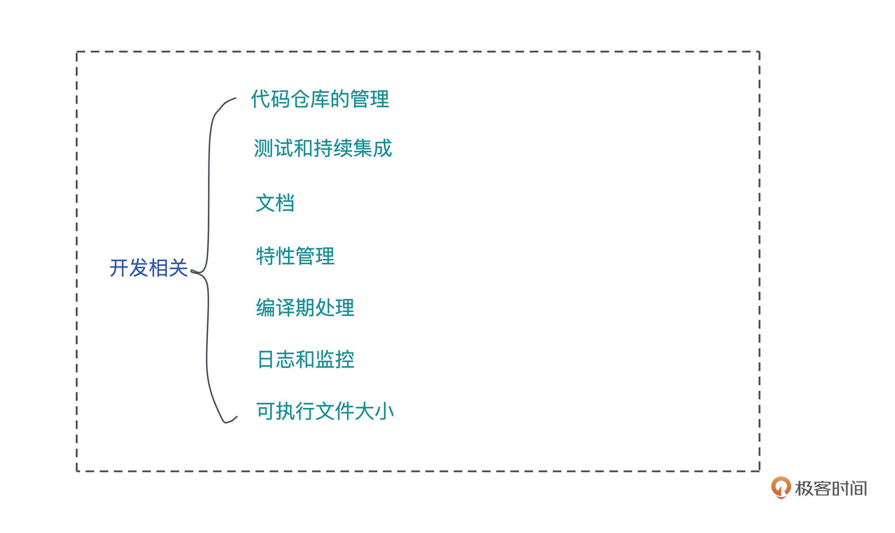
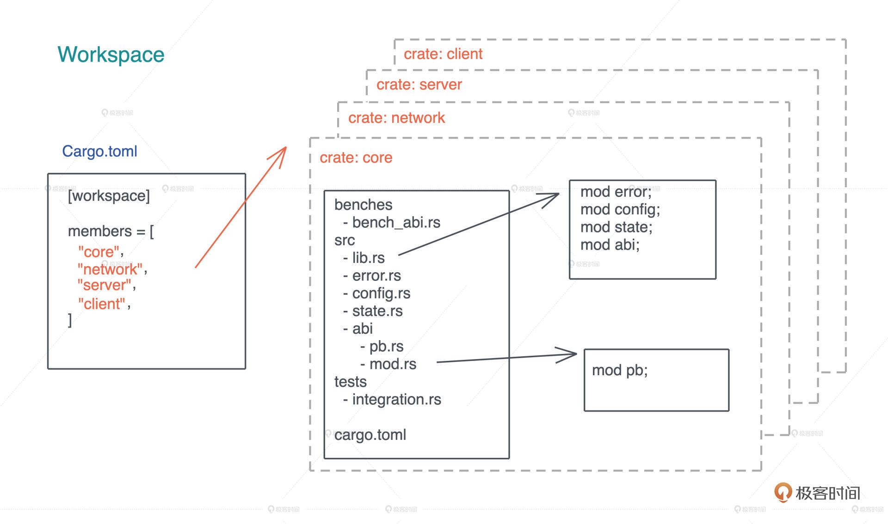
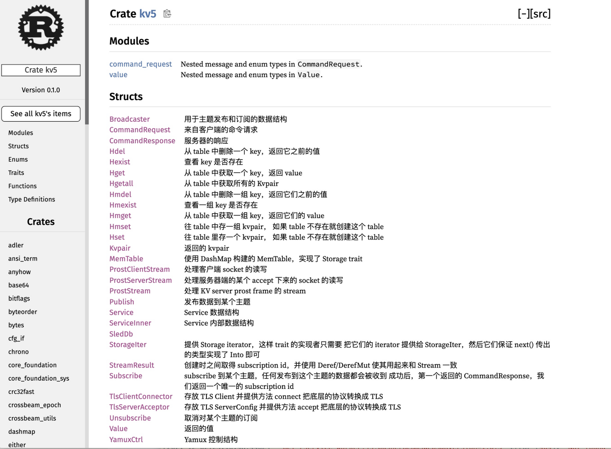
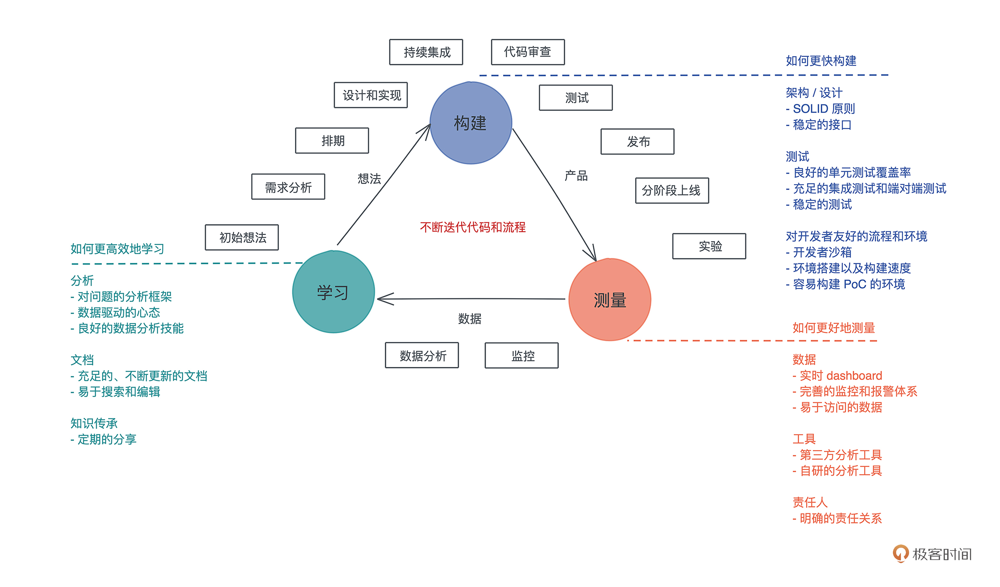

---
date: "2019-06-23"
---  
      
# 43｜生产环境：真实世界下的一个Rust项目包含哪些要素？
你好，我是陈天。

随着我们的实战项目 KV server 接近尾声，课程也到了收官阶段。掌握一门语言的特性，能写出应用这些特性解决一些小问题的代码，算是初窥门径，就像在游泳池里练习冲浪；真正想把语言融会贯通，还要靠大风大浪中的磨练。所以接下来的三篇文章，我们会偏重了解真实的 Rust 应用环境，看看如何用 Rust 构建复杂的软件系统。

今天，我们首先来学习真实世界下的一个 Rust 项目，应该包含哪些要素。主要介绍和开发阶段相关的内容，包括：代码仓库的管理、测试和持续集成、文档、特性管理、编译期处理、日志和监控，最后会顺便介绍一下如何控制 Rust 代码编译出的可执行文件的大小。



## 代码仓库的管理

我们先从一个代码仓库的结构和管理入手。之前介绍过，Rust 支持 workspace，可以在一个 workspace 下放置很多 crates。不知道你有没有发现，这门课程在GitHub 上的 repo，就把每节课的代码组织成一个个 crate，放在同一个 workspace 中。



在构建应用程序或者服务的时候，我们要尽量把各个模块划分清楚，然后用不同的 crate 实现它们。这样，一来增量编译的效率更高（没有改动的 crate 无需重编），二来可以通过 crate 强制为模块划分边界，明确公开的接口和私有接口。

<!-- [[[read_end]]] -->

一般而言，除了代码仓库的根目录有 [README.md](http://README.md) 外，workspace 下的每个 crate 也最好要有 [README.md](http://README.md) 以及 examples，让使用者可以很清晰地理解如何使用这个 crate。如果你的项目的构建过程不是简单通过 cargo build 完成的，建议提供 Makefile 或者类似的脚本来自动化本地构建的流程。

当我们往代码仓库里提交代码时，应该要在本地走一遍基本的检查，包括代码风格检查、编译检查、静态检查，以及单元测试，这样可以最大程度保证每个提交都是完备的，没有基本错误的代码。

如果你使用 Git 来管理代码仓库，那么可以使用 pre-commit hook。一般来说，我们不必自己撰写 pre-commit hook 脚本，可以使用 [pre-commit](https://pre-commit.com/) 这个工具。下面是我在 [tyrchen/geektime-rust](https://github.com/tyrchen/geektime-rust) 中使用的 pre-commit 配置，供你参考：

```
    ❯ cat .pre-commit-config.yaml
    fail_fast: false
    repos:
      - repo: <https://github.com/pre-commit/pre-commit-hooks>
        rev: v2.3.0
        hooks:
          - id: check-byte-order-marker
          - id: check-case-conflict
          - id: check-merge-conflict
          - id: check-symlinks
          - id: check-yaml
          - id: end-of-file-fixer
          - id: mixed-line-ending
          - id: trailing-whitespace
      - repo: <https://github.com/psf/black>
        rev: 19.3b0
        hooks:
          - id: black
      - repo: local
        hooks:
          - id: cargo-fmt
            name: cargo fmt
            description: Format files with rustfmt.
            entry: bash -c 'cargo fmt -- --check'
            language: rust
            files: \\.rs$
            args: []
          - id: cargo-check
            name: cargo check
            description: Check the package for errors.
            entry: bash -c 'cargo check --all'
            language: rust
            files: \\.rs$
            pass_filenames: false
          - id: cargo-clippy
            name: cargo clippy
            description: Lint rust sources
            entry: bash -c 'cargo clippy --all-targets --all-features --tests --benches -- -D warnings'
            language: rust
            files: \\.rs$
            pass_filenames: false
          - id: cargo-test
            name: cargo test
            description: unit test for the project
            entry: bash -c 'cargo test --all-features --all'
            language: rust
            files: \\.rs$
            pass_filenames: false
    

```

你在根目录生成 .pre-commit-config.yaml 后，运行 pre-commit install，以后 git commit 时就会自动做这一系列的检查，保证提交代码的最基本的正确性。

除此之外，你的代码仓库在根目录下最好还声明一个 deny.toml，使用 [cargo-deny](https://github.com/EmbarkStudios/cargo-deny) 来确保你使用的第三方依赖没有不该出现的授权（比如不使用任何 GPL/APGL 的代码）、没有可疑的来源（比如不是来自某个 fork 的 GitHub repo 下的 commit），以及没有包含有安全漏洞的版本。

cargo-deny 对于生产环境下的代码非常重要，因为现代软件依赖太多，依赖树过于庞杂，靠人眼是很难审查出问题的。通过使用 cargo-deny，我们可以避免很多有风险的第三方库。

## 测试和持续集成

在课程里，我们不断地在项目中强调单元测试的重要性。单元测试除了是软件质量保证的必要手段外，还是接口设计和迭代的最佳辅助工具。

良好的架构、清晰的接口隔离，必然会让单元测试变得容易直观；而写起来别扭，甚至感觉很难撰写的单元测试，则是在警告你软件的架构或者设计出了问题：**要么是模块之间耦合性太强（状态纠缠不清），要么是接口设计得很难使用**。

在 Rust 下撰写单元测试非常直观，测试代码和模块代码放在同一个文件里，很容易阅读和互相印证。我们之前已经写过大量这类的单元测试。

不过还有一种单元测试是和文档放在一起的，doctest，如果你在学习这门课的过程中已经习惯遇到问题就去看源代码的话，会看到很多类似这样的 doctest，比如下面的 [HashMap::get](https://doc.rust-lang.org/src/std/collections/hash/map.rs.html#713-737) 方法的 doctest：

```
    /// Returns a reference to the value corresponding to the key.
    ///
    /// The key may be any borrowed form of the map's key type, but
    /// [`Hash`] and [`Eq`] on the borrowed form *must* match those for
    /// the key type.
    ///
    /// # Examples
    ///
    /// ```
    /// use std::collections::HashMap;
    ///
    /// let mut map = HashMap::new();
    /// map.insert(1, "a");
    /// assert_eq!(map.get(&1), Some(&"a"));
    /// assert_eq!(map.get(&2), None);
    /// ```
    #[stable(feature = "rust1", since = "1.0.0")]
    #[inline]
    pub fn get<Q: ?Sized>(&self, k: &Q) -> Option<&V>
    where
        K: Borrow<Q>,
        Q: Hash + Eq,
    {
        self.base.get(k)
    }
    

```

在之前的代码中，虽然我们没有明确介绍文档注释，但想必你已经知道，可以通过 “///” 来撰写数据结构、trait、方法和函数的文档注释。

这样的注释可以用 markdown 格式撰写，之后通过 “cargo doc” 编译成类似你在 [docs.rs](http://docs.rs) 下看到的文档。其中，markdown 里的代码就会被编译成 doctest，然后在 “cargo test” 中进行测试。

除了单元测试，我们往往还需要集成测试和性能测试。在后续 KV server 的实现过程中，我们会引入集成测试来测试服务器的基本功能，以及性能测试来测试 pub/sub 的性能。这个在遇到的时候再详细介绍。

在一个项目的早期，引入持续集成非常必要，哪怕还没有全面的测试覆盖。

如果说 pre-commit 是每个人提交代码的一道守卫，避免一些基本的错误进入到代码库，让大家在团队协作做代码审阅时，不至于还需要关注基本的代码格式；那么，**持续集成就是在团队协作过程中的一道守卫，保证添加到 PR 里或者合并到 master 下的代码，在特定的环境下，也是没有问题的**。

如果你用 GitHub 来管理代码仓库，可以使用 github workflow 来进行持续集成，比如下面是一个最基本的 Rust github workflow 的定义：

```
    ❯ cat .github/workflows/build.yml
    name: build
    
    on:
      push:
        branches:
          - master
      pull_request:
        branches:
          - master
    
    jobs:
      build-rust:
        strategy:
          matrix:
            platform: [ubuntu-latest, windows-latest]
        runs-on: ${{ matrix.platform }}
        steps:
          - uses: actions/checkout@v2
          - name: Cache cargo registry
            uses: actions/cache@v1
            with:
              path: ~/.cargo/registry
              key: ${{ runner.os }}-cargo-registry
          - name: Cache cargo index
            uses: actions/cache@v1
            with:
              path: ~/.cargo/git
              key: ${{ runner.os }}-cargo-index
          - name: Cache cargo build
            uses: actions/cache@v1
            with:
              path: target
              key: ${{ runner.os }}-cargo-build-target
          - name: Install stable
            uses: actions-rs/toolchain@v1
            with:
              profile: minimal
              toolchain: stable
              override: true
          - name: Check code format
            run: cargo fmt -- --check
          - name: Check the package for errors
            run: cargo check --all
          - name: Lint rust sources
            run: cargo clippy --all-targets --all-features --tests --benches -- -D warnings
          - name: Run tests
            run: cargo test --all-features -- --test-threads=1 --nocapture
          - name: Generate docs
            run: cargo doc --all-features --no-deps
    

```

我们会处理代码格式，做基本的静态检查、单元测试和集成测试，以及生成文档。

## 文档

前面说了，Rust 代码的文档注释可以用 “///” 来标注。对于我们上一讲 KV server 的代码，可以运行 “cargo doc” 来生成对应的文档。

注意，在 cargo doc 时，不光你自己撰写的 crate 的文档会被生成，所有在依赖里使用到的 crate 的文档也会一并生成，所以如果你想在没有网的情况下，参考某些引用了的 crate 文档，可以看本地生成的文档。下图是上一讲的 KV server 文档的截图：



大多数时候，你只需要使用 “///” 来撰写文档就够用了，不过如果你需要撰写 crate 级别的文档，也就是会显示在 crate 文档主页上的内容，可以在 [lib.rs](http://lib.rs) 或者 [main.rs](http://main.rs) 的开头用 “//\!”，比如：

```
    //! 这是 crate 文档
    

```

如果你想强迫自己要撰写每个公共接口的文档，保持系统有良好的文档覆盖，那么可以使用 `![deny(missing_docs)]`。这样，任何时候只要你忘记撰写文档，都会产生编译错误。如果你觉得编译错误太严格，也可以用编译报警：`![warn(missing_docs]`。之前我们阅读过 bytes crate 的源码，可以再回过头来看看它的 [lib.rs 的开头](https://github.com/tokio-rs/bytes/blob/master/src/lib.rs)。  
在介绍测试的时候，我们提到了文档测试。

在文档中撰写样例代码并保证这个样例代码可以正常运行非常重要，因为使用者在看你的 crate 文档时，往往先会参考你的样例代码，了解接口如何使用。大部分时候，你的样例代码该怎么写就怎么写，**但是，在进行异步处理和错误处理时，需要稍微做一些额外工作**。

我们来看一个文档里异步处理的例子（[代码](https://play.rust-lang.org/?version=stable&mode=debug&edition=2021&gist=70dad7f47ea1c6d58454e6bc5e2cabb9)）：

```
    use std::task::Poll;
    use futures::{prelude::*, stream::poll_fn};
    
    /// fibnacci 算法
    /// 示例：
    /// ```
    /// use futures::prelude::*;
    /// use playground::fib; // playground crate 名字叫 playground
    /// # futures::executor::block_on(async {
    /// let mut st = fib(10);
    /// assert_eq!(Some(2), st.next().await);
    /// # });
    /// ```
    pub fn fib(mut n: usize) -> impl Stream<Item = i32> {
        let mut a = 1;
        let mut b = 1;
        poll_fn(move |_cx| -> Poll<Option<i32>> {
            if n == 0 {
                return Poll::Ready(None);
            }
            n -= 1;
            let c = a + b;
            a = b;
            b = c;
            Poll::Ready(Some(b))
        })
    }
    

```

注意这段代码中的这两句注释：

```
    /// # futures::executor::block_on(async {
    /// ...
    /// # });
    

```

在 `///` 后出现了 `#`，代表这句话不会出现在示例中，但会被包括在生成的测试代码中。之所以需要 `block_on`，是因为调用我们的测试代码时，需要使用 await，所以需要使用异步运行时来运行它。

实际上，这个的文档测试相当于：

```
    fn main() {
        fn _doctest_main_xxx() {
            use futures::prelude::*;
            use playground::fib; // playground crate 名字叫 playground
    
            futures::executor::block_on(async {
                let mut st = fib(10);
                assert_eq!(Some(2), st.next().await);
            });
        }
        _doctest_main_xxx()
    }
    

```

我们再来看一个文档中做错误处理的例子（[代码](https://play.rust-lang.org/?version=stable&mode=debug&edition=2021&gist=ffe46d7ee705ba3a8b570c5ca9f547a2)）：

```
    use std::io;
    use std::fs;
    
    /// 写入文件
    /// 示例：
    /// ```
    /// use playground::write_file;
    /// write_file("/tmp/dummy_test", "hello world")?;
    /// # Ok::<_, std::io::Error>(())
    /// ```
    pub fn write_file(name: &str, contents: &str) -> Result<(), io::Error> {
        fs::write(name, contents)
    }
    

```

这个例子中，我们使用 `?` 进行了错误处理，所以需要最后补一句 `Ok::<_, io::Error>` 来明确返回的错误类型。

如果你想了解更多有关 Rust 文档的内容，可以看 [rustdoc book](https://doc.rust-lang.org/stable/rustdoc/)。

## 特性管理

作为一门编译型语言，Rust 支持条件编译。

通过条件编译，我们可以在同一个 crate 中支持不同的特性（feature），以满足不同的需求。比如 reqwest，它默认使用异步接口，但如果你需要同步接口，你可以使用它的 “blocking” 特性。

在生产环境中合理地使用特性，可以让 crate 的核心功能引入较少的依赖，而只有在启动某个特性的时候，才使用某些依赖，这样可以让最终编译出来的库或者可执行文件尽可能地小。

特性作为高级工具，并不在我们这个课程的范围内，感兴趣的话，你可以看 [cargo book](https://doc.rust-lang.org/cargo/reference/features.html) 深入了解如何在你的 crate 中使用特性，以及在代码撰写过程中，如何使用相应的宏来做条件编译。

## 编译期处理

在开发软件系统的时候，我们需要考虑哪些事情需要放在编译期处理，哪些事情放在加载期处理，哪些事情放在运行期处理。

有些事情，我们不一定要放在运行期才进行处理，可以在编译期就做一些预处理，让数据能够以更好的形式在运行期被使用。

比如在做中文繁简转换的时候，可以预先把单字对照表从文件中读取出来，处理成 `Vec<(char, char)>`，然后生成 bincode 存入到可执行文件中。我们看这个例子（[代码](https://github.com/tyrchen/fast2s/blob/master/build.rs)）：

```
    use std::io::{self, BufRead};
    use std::{env, fs::File, path::Path};
    
    fn main() {
        // 如果 build.rs 或者繁简对照表文件变化，则重新编译
        println!("cargo:rerun-if-changed=build.rs");
        println!("cargo:rerun-if-changed=src/t2s.txt");
    
        // 生成 OUT_DIR/map.bin 供 lib.rs 访问
        let out_dir = env::var_os("OUT_DIR").unwrap();
        let out_file = Path::new(&out_dir).join("map.bin");
        let f = File::create(&out_file).unwrap();
        let v = get_kv("src/t2s.txt");
        bincode::serialize_into(f, &v).unwrap();
    }
    
    // 把 split 出来的 &str 转换成 char
    fn s2c(s: &str) -> char {
        let mut chars = s.chars();
        let c = chars.next().unwrap();
        assert!(chars.next().is_none());
        assert!(c.len_utf8() == 3);
        c
    }
    
    // 读取文件，把每一行繁简对照的字符串转换成 Vec<(char, char)>
    fn get_kv(filename: &str) -> Vec<(char, char)> {
        let f = File::open(filename).unwrap();
        let lines = io::BufReader::new(f).lines();
        let mut v = Vec::with_capacity(4096);
        for line in lines {
            let line = line.unwrap();
            let kv: Vec<_> = line.split(' ').collect();
            v.push((s2c(kv[0]), s2c(kv[1])));
        }
    
        v
    }
    

```

通过这种方式，我们在编译期额外花费了一些时间，却让运行期的代码和工作大大简化（[代码](https://github.com/tyrchen/fast2s/blob/master/src/special.rs#L8)）：

```
    static MAP_DATA: &[u8] = include_bytes!(concat!(env!("OUT_DIR"), "/map.bin"));
    
    lazy_static! {
        /// state machine for the translation
        static ref MAP: HashMap<char, char> = {
            let data: Vec<(char, char)> = bincode::deserialize(MAP_DATA).unwrap();
            data.into_iter().collect()
        };
        ...
    }
    

```

## 日志和监控

我们目前撰写的项目，都还只有少量的日志。但对于生产环境下的项目来说，这远远不够。我们需要详尽的、不同级别的日志。

这样，当系统在运行过程中出现问题时，我们可以通过日志得到足够的线索，从而找到问题的源头，进而解决问题。而且在一个分布式系统下，我们往往还需要把收集到的日志集中起来，进行过滤和查询。

除了日志，我们还需要收集系统的行为数据和性能指标，来了解系统运行时的状态。

Rust 有不错的对 [prometheus](https://prometheus.io/) 的支持，比如 [rust-prometheus](https://docs.rs/prometheus/latest/prometheus/) 可以帮助你方便地收集和发送各种指标；而 opentelemetry-rust 更是除了支持 [prometheus](https://github.com/open-telemetry/opentelemetry-rust) 外，还支持很多其他商业/非商业的监控工具，比如 datadog，比如 jaeger。

之后我们还会有一讲来让 KV server 更好地处理日志和监控，并且用 jaeger 进行性能分析，找到代码中的性能问题。

## 可执行文件大小

最后，我们来谈谈可执行文件的大小。

绝大多数使用场景，我们使用 `cargo build \--release` 就够了，生成的 release build 可以用在生产环境下，但有些情况，比如嵌入式环境，或者用 Rust 构建提供给 Android/iOS 的包时，需要可执行文件或者库文件尽可能小，避免浪费文件系统的空间，或者网络流量。

此时，我们需要一些额外的手段来优化文件尺寸。你可以参考 [min-sized-rust](https://github.com/johnthagen/min-sized-rust) 提供的方法进行处理。

## 小结

今天我们蜻蜓点水讨论了，把一个 Rust 项目真正应用在生产环境下，需要考虑的诸多问题。之后会围绕着 KV server 来实践这一讲中我们聊到的内容。  


做一个业余项目和做一个实际的、要在生产环境中运行的项目有很大不同。业余项目我们主要关注需求是不是得到了妥善的实现，主要关注的是构建的流程；而在实际项目中，我们除了需要关注构建，还有测量和学习的完整开发流程。



看这张图，一个项目的整体开发流程相信是你所熟悉，包括初始想法、需求分析、排期、设计和实现、持续集成、代码审查、测试、发布、分阶段上线、实验、监控、数据分析等部分，我把它贯穿到精益创业（Lean Startup）“构建 \- 测量 \- 学习”（Build \- Measure \- Learn）的三个环节中。

今天介绍的代码仓库的管理、测试和持续集成、文档、日志和监控，和这个流程中的很多环节都有关系，你可以对照着自己公司的开发流程，想一想如何在这些流程中更好地使用 Rust。

### 思考题

在上面完整开发流程图中，今天只涉及了主要的部分。你可以结合自己现有工作的流程，思考一下如果把 Rust 引入到你的工作中，哪些流程能够很好地适配，哪些流程还需要额外的工作？

欢迎在留言区分享你的思考，感谢你的收听，如果觉得有收获，也欢迎你分享给身边的朋友，邀他一起讨论。你完成了Rust学习的第43次打卡啦，我们下节课见。