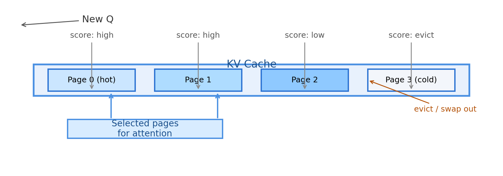
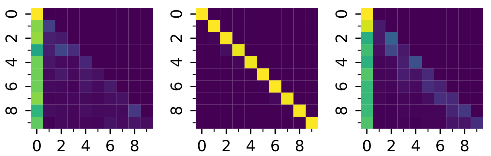
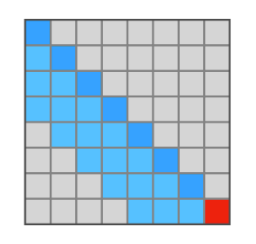
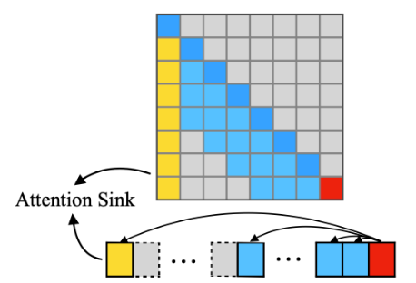
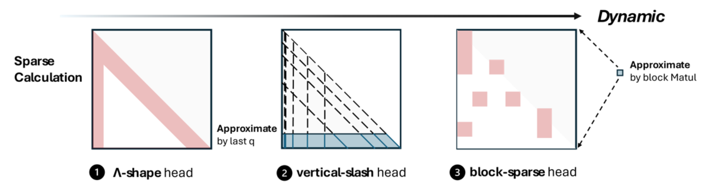
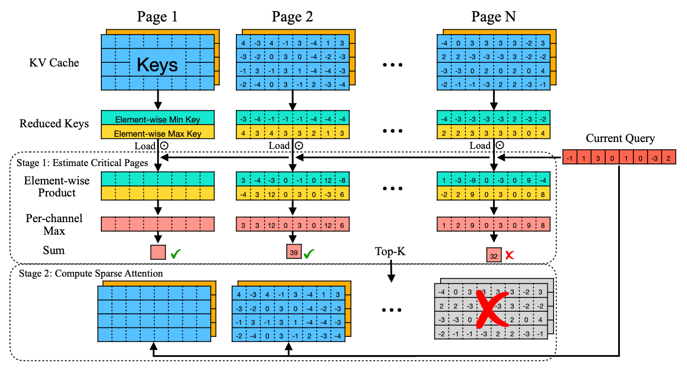
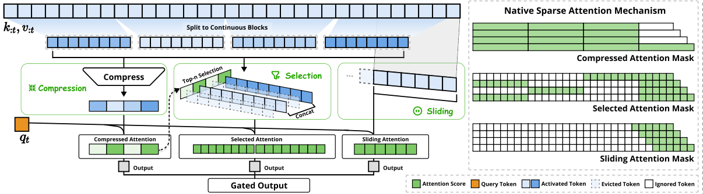
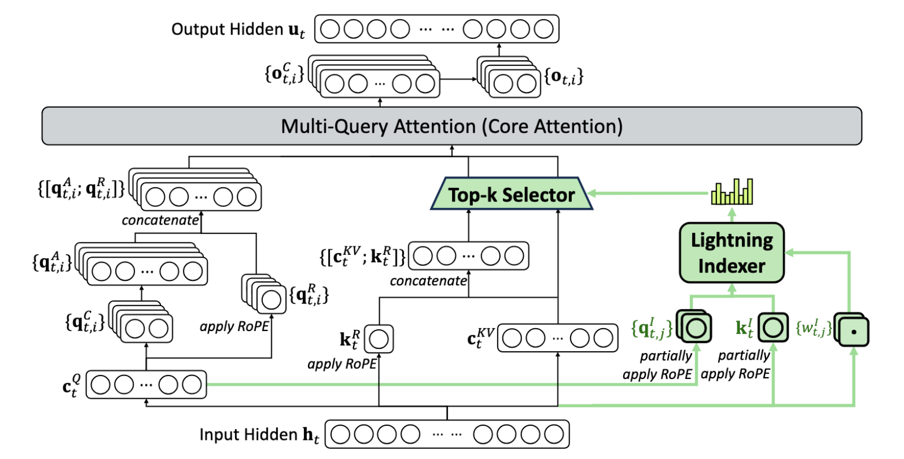
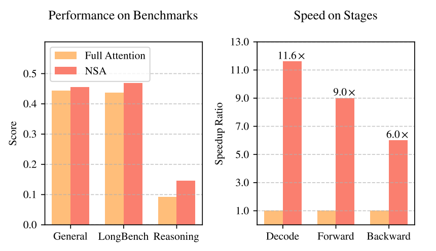

# **LLM智能应用开发**

第12讲: 大语言模型解析 IX
Sparse Attention

---

# 模型推理计算开销优化

* KV-cache
* Sparse Attention

---

## KV Cache 快速回顾

* 推理分为 **prefill**（一次性编码完整上下文）与 **decode**（逐 token 生成）两个阶段
* Prefill 计算得到前缀的 $K, V$，在 decode 阶段不再重复计算，直接复用
* 目标：用时间换空间，减少重复的矩阵乘法，显著提升长序列生成速度

---

### 为什么要用 KV Cache？

* 不使用 KV Cache：每生成一个新 token，都要重新计算历史 tokens 的 $K, V$，复杂度 $O(s^2)$
* 使用 KV Cache：支持历史 $K, V$ 复用，只计算当前 $q$ 的注意力，复杂度降到 $O(s)$

<video src="https://cdn-uploads.huggingface.co/production/uploads/6527e89a8808d80ccff88b7a/DP2zDJTAU-yHrxVRh5GUt.mp4"
       controls
       width="40%"
       poster="">
  Your browser does not support the video tag.
</video>

---

### KV Cache 的存储与开销

* 对于批大小 $b$，层数 $l$，头数 $h$，序列长度 $s$，头维度 $d$：
  $$
  \text{KV\_memory} \approx b \times l \times h \times s \times d \times 2 \times \text{dtype\_size}
  $$
* dtype 通常为 FP16/BF16
* 缓存越大，显存消耗越高，存储和计算均为$O(s)$级别的开销

---

### KV Cache 的局限与联系

* 生成很长文本时，KV Cache 会线性增长，显存/带宽和计算仍是瓶颈
* 需要引入 **稀疏、压缩、分页、淘汰** 等机制，避免盲目保留全部历史 $K, V$
  * 存储：采用 FP8/INT 量化或 PagedAttention 等方案可进一步压缩
  * 计算：Sparse Attention

---

### Paged Attention（KV 分页）
<!-- 
 -->

* 将 KV Cache 划分为固定大小的 pages，便于增删/复用
* Prefill 阶段写入 page；Decode 阶段按需加载/替换，按 page 维度做预取和缓存
* 好处：降低碎片化，方便淘汰冷门上下文，也为后续「只取部分 KV」的策略打基础

---

### Paged Attention 实践（以 vLLM/PageAttention 为例）

* Page 大小：通常 16~32 个 token，便于做向量化和预取
* 分配与复用：prefill 阶段连续分配，decode 阶段按 page 回收/重用，减少内存碎片
* 热度排序：维护 page-level 的访问计数/最近访问信息，优先保留“热” page，淘汰“冷” page
* 计算路径：对当前 Q 先筛 page（如根据局部得分或启发式），仅对入选 page 内的 token 做注意力，从分页直接过渡到 Sparse Attention

---
<!-- 
### Paged Attention Demo（视频）

<video src="https://cdn-uploads.huggingface.co/production/uploads/6527e89a8808d80ccff88b7a/DP2zDJTAU-yHrxVRh5GUt.mp4"
       controls
       width="100%"
       poster="../images/2025/l12/paged_attention.png">
  Your browser does not support the video tag.
</video>

（注：此视频仅在 HTML 播放，PDF/PNG 导出不支持播放）

--- -->

### 从 KV Cache 到 Sparse Attention

* KV Cache 解决了「重复计算」问题，但没有解决「计算哪些 KV」问题
* Sparse Attention 的核心：在 decode 时只对少量关键 KV 计算注意力，直接减少乘法/softmax 的计算量
* 因为 KV 已分页/可索引，我们可以：
  * 依据启发式/激活分数挑选“热点” page/token
  * 对“冷门” page/token 做淘汰或压缩（量化/池化）
* 结果：显存占用、带宽和计算量一起下降，长上下文推理更快更稳

---

## 背景与动机

### 回顾 Self-Attention 机制

$$
A = Softmax(\frac{QK^T}{\sqrt{d}})V
$$

其中 $Q$ shape: [bs, nh, q_len, hd], $KV$ shape: [bs, nh, kv_len, hd]，

若记 $s$ 为序列长度，则 $q\_len \in O(s), kv\_len \in O(s)$，

因此 Attention 的计算复杂度是 $O(s^2)$。

---

### 长文本场景

在输入序列较长的应用场景中，例如：
* 生成长文档总结
* 大规模代码分析
* 多文档问答
* 多轮对话
  
平方级的复杂度导致 Self-Attention 计算速度显著变慢，限制了大模型在这些场景中的广泛应用。

---

### 思考

本质上，计算 Self-Attention 的过程就是让所有 token “注意” 其他所有 token 的过程。

联想：平时我们在阅读文章时，并不会一个字一个字地理解，往往是通读一遍抓住关键词，就能掌握大致意思。

🔍 **问题：真的需要每个 token 都“注意”所有其他 token 吗？**

---

### 观察

在 llama3 模型上输入 "A is B. C is D. A is" 并设置 max_new_tokens=1 (prefill) 得到以下 Attention Heatmap（部分），其中颜色由暗到亮（由紫到黄）表示激活值从小到大（0-1）。

---

### 稀疏性（Sparsity）

在 Self-Attention 计算过程中:
* **现象**：注意力矩阵中，大部分权重接近 0;
* **启发**：可以只保留最关键的连接参与计算；
* **目标**：减少无用计算，提高效率。

---

## Sparse Attention

Sparse Attention 可以如下表述：

$$
\hat{A} = Softmax(\frac{QK_{s'}^T}{\sqrt{d}})V_{s'}
$$

其中 $K_{s'}, V_{s'}$ 均为从完整 $KV$ 中筛选出来的部分 $KV$，且 ${s'} \ll s$。

例如，对于 $s=8k$ 的输入，可以取 ${s'}=2k$，稀疏比例达到 $\frac{1}{4}$，由此将计算量降低到 $\frac{1}{16}$。

---

### Sparse Attention 分类

1. 根据如何筛选关键 token：
   * Static pattern
   * Dynamic pattern
2. 根据是否需要训练：
   * Training-free
   * Training-based

由于训练需要消耗大量资源，学术界主要聚焦在 Training-free 或只要简单训练的方法上；而部分大模型厂商（如 DeepSeek）正在尝试 Training-based Sparse Attention。

---

### Static pattern 方法简介

1. Sliding windows: 维护一个固定大小的窗口，保留最近的 tokens 参与计算，其余全部丢弃。

   * 优点：实现简单，计算复杂度降低到 $O(k)$；
   * 缺点：精度损失较大，尤其是在长度超过预训练长度后大幅下降。

---

### Static pattern 方法简介

2. Attention sinks: [StreamingLLM](https://arxiv.org/abs/2309.17453) 发现注意力权重往往会集中在首 token 上，将这一现象称为 attention sinks。基于该发现，StreamingLLM 在 sliding window 的基础上进一步保留 attention sinks，降低了长文本场景下稀疏导致的精度损失。

---

### Static pattern 方法简介

总体上看，这些固定的模式往往不能适应文本生成中变化的关键 token，或多或少会有较显著的精度损失。

---

### Dynamic pattern 方法简介

1. [MInference](https://arxiv.org/abs/2407.02490) 通过观察注意力矩阵，总结出三种常见模式，根据输入动态选择最合适的模式，从而加速 prefill 阶段：

---

### Dynamic pattern 方法简介

2. [Quest](https://arxiv.org/abs/2406.10774) 采用分页设计，估计每个 KV page 与当前 Q 的相似度，动态选择最相似（激活值最高）的 pages 参与计算：

---

### Dynamic pattern 方法简介

* 优点：相较于 static pattern，dynamic pattern 类的方法精度更高；

* 缺点：由于计算最合适的 tokens 会引入一定 overhead，综合下来会比简单的 static pattern 方法慢（但是相比 dense attention 还是有加速效果）;同时，如何设计选择算法也依赖经验（启发式）。

---

### Training-based 方法简介

1. [NSA](https://arxiv.org/pdf/2502.11089) 通过门控机制融合了粗粒度 token 压缩、细粒度的 token 选择和滑动窗口这三个模块的输出，从而达到稀疏效果。

---

### Training-based 方法简介

2. [DSA](https://github.com/deepseek-ai/DeepSeek-V3.2-Exp/blob/main/DeepSeek_V3_2.pdf) 主要在 [MLA](https://arxiv.org/abs/2412.19437) 的基础上加上了稀疏模块（绿色部分）。本质上，Lightning Indexer 利用量化后（FP8）的 qk 计算 attention，根据这一轻量计算选择与 Q 最相似的 K。

---

### Training-based 方法简介

总体而言，Training-based 方法由于其成本高，当前大模型厂商少有投入。但从 DeepSeek 公布的效果来看(NSA)，训练后的原生 Sparse Attention 精度几乎无损甚至能反超 Dense Attention，推理速度也更快。

