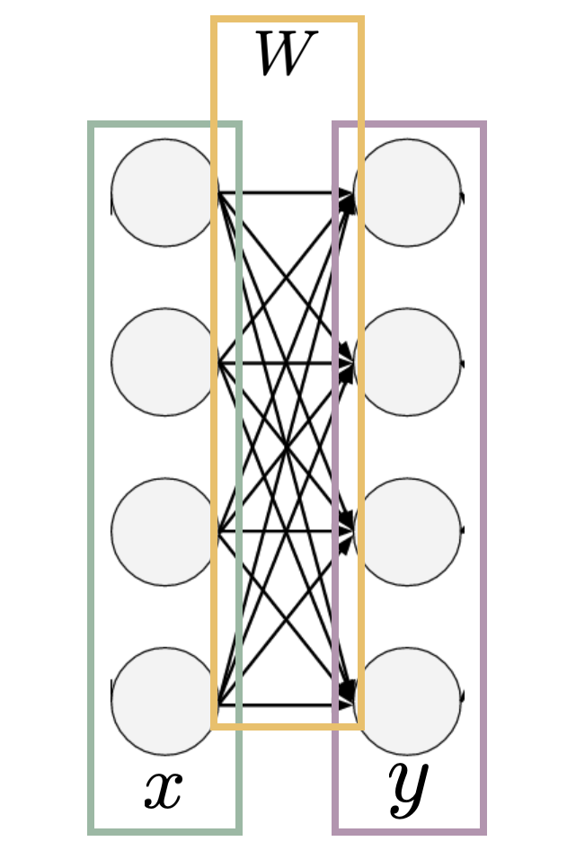
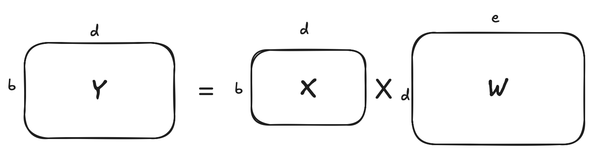
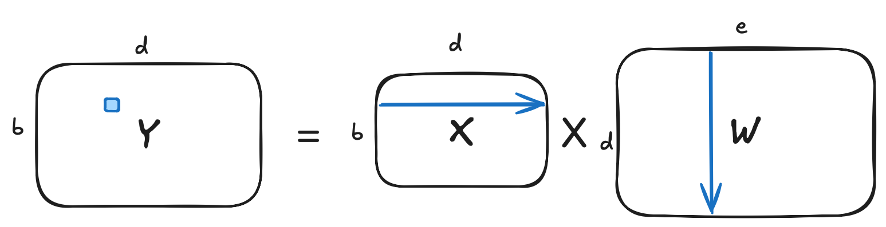

<style>
img[alt~="center"] {
  display: block;
  margin: 0 auto;
}
a[href='red'] {
    color: red;
    pointer-events: none;
    cursor: default;
    text-decoration: none;
}
</style>


# **大语言模型基础：从零到一实现之路**

第2讲: 特征空间的变换1
前反向运行视角理解深度学习模型

<!-- https://marp.app/ -->

---

# 深度学习任务的核心

* 按照目标场景的需要去理解“世界”
<div style="display:contents;" data-marpit-fragment>
这是何物


</div>

---

# 这是何物第二关


<p align="center">
  
  
</p>

---

# 这是何物第三关


<div style="display:contents;" data-marpit-fragment>
我可不想被发律师函（手动狗头）
</div>


---


# 理解世界的方式

* 人如何理解世界: 通过外延观察=>自动构建内涵
  
* 内涵: 一个概念的内涵是指它的“内容”或“定义”，即该概念所包含的性质、特征或条件
  * “人”: 有理性、社会性和自我意识的生物
* 外延: 一个概念的外延是指它所指代的所有对象的集合，或者说它所涵盖的实际事物的范围
  * “人”: 是所有的人类个体，如亚里士多德、牛顿、爱因斯坦

---

# 模型学习的核心

模型如何理解世界: 通过外延观察=>自动构建内涵

<div style="display:contents;" data-marpit-fragment>

那如何把上面的概念落到实处呢？

将世界“特征化”，基于特征化后的向量，通过函数计算完成具体的任务
$Y=f(X)=XW+b$

</div>

* 模型理解世界的过程
  * 设定任务目标
  * 收集外延: 数据集
  * 构建内涵: 学习特征

---

# 深度学习的特点

表示学习(representation learning)


---

# 深度学习模型


---

# 深度学习模型


典型结构
* 前n-1层(堆叠)
  * 输入: 特征表示
  * 输出: 特征表示
* 第n层
  * 输入: 特征表示
  * 输出: 任务目标

---

# 深度学习模型的线性层

$Y=f(X)=XW+b$
* $X$和$Y$: 特征表示
  * $X$: 当前层输入/前一层输出
  * $Y$: 当前层输出/后一层输入
* $W,b$: 当前层参数
    * 表示空间变换函数




---

# 线性层的计算

输入$X$：b个样本，每个样本表示在一个d维的空间中
函数$f(X)$：函数将表示在d维空间中的样本变换到e维的空间中
输出$Y$：$f(X)$的输出，b个样本，每个样本表示在一个e维的空间中





---

# 空间变换的具体实现

理论上：运用线性代数中的矩阵乘法



---

## 矩阵乘法的复杂度分析

- 计算 $Y = XW$ 时，每个元素 $y_{ij}$ 是一个 **点积**：  
  $$
  y_{ij} = \sum_{k=1}^{d} x_{ik} \cdot w_{kj}
  $$
- 每个 $y_{ij}$ 需要 $O(d)$ 次乘加运算  
- 总共有 $b \times e$ 个元素，$O(b\cdot d \cdot e)$


---

# 矩阵乘法的优化思路
- 内存局部性 (Blocking)
  - 数据按小块（tile）加载到cache中，避免反复访问大矩阵
- 向量化计算 (Tiling)
  - 一次处理多个数据 (SIMD/SIMT)，例如一次性做 8 个乘加
- 并行化
  - 多核CPU：不同线程处理不同矩阵块
  - GPU：上万线程同时处理小块矩阵

<!-- ---

# GPU 上的矩阵乘法

- GPU 将矩阵划分为很多小块（thread block）
- 每个 block 在显存和共享内存之间做高速数据交换
- CUDA 核函数中：
  - 每个线程负责计算 $Y$ 中的一个或一小片元素
  - 通过 warp/wavefront 协同提高吞吐 -->

---

# PyTorch手搓乘法

承载数据的基本类型：Tensor。那什么是 Tensor？

- Tensor可理解为多维数组
- 在 PyTorch 中是最基础的数据结构  
- 类似 NumPy 的 ndarray，但有两个关键特性：
  - 支持在GPU上高效计算  
  - 支持自动求导(autograd)

---

## Tensor 的维度

- 标量 (Scalar)：0 维张量  
- 向量 (Vector)：1 维张量
- 矩阵 (Matrix)：2 维张量，常用与模型参数W
- 高维 Tensor：常用于输入输出(Input/Output)/激活(Activation)

```python
  torch.tensor(3.14)   # shape = []
  torch.tensor([1, 2, 3])   # shape = [3]
  torch.tensor([[1, 2], [3, 4]])   # shape = [2, 2]
  x = torch.randn(2, 3, 4, 5) # shape = [2, 3, 4, 5]
  ```

---

# PyTorch手搓乘法

- 操作数有了，那操作符呢？
- 矩阵乘法 (Matrix multiplication)
  - Operator @
  - torch.matmul, tensor.matmul
- 元素乘法 (element-wise multiplication)
  - Operator \*
  - torch.mul, tensor.mul
- 高阶的: 
  - torch.einsum

---

# 编码时间

矩阵乘
```python
y = x@w
y = x.matmul(w)
y = torch.matmul(x, w)
```
元素乘
```python
y = x*w
y = x.mul(w)
y = torch.mul(x, w)
```

---

# einsum

- torch.einsum (equation, tensor list)
  - equation: 使用 **爱因斯坦求和约定 (Einstein Summation Convention)** 描述张量运算 (基于tensor下标)
  - tensor list: input
- 优点：直观，代码可读性强


---

# einsum 表达式
矩阵乘法$Y = XW$的数学形式：  
  $$
  Y_{be} = \sum_{d} X_{bd} \cdot W_{de}
  $$
einsum 表达式
  ```python
  import torch

  X = torch.randn(2, 3)   # B=2, D=3
  W = torch.randn(3, 4)   # D=3, E=4
  Y = torch.einsum("bd,de->be", X, W)
  print(Y.shape)  # torch.Size([2, 4])
```

---

# 批量矩阵乘
- 数学形式：
$$
Y_{b i j} = \sum_{k} A_{b i k} \cdot B_{b k j}
$$
- einsum 表达式：
```python
A = torch.randn(10, 3, 4)   # batch=10
B = torch.randn(10, 4, 5)

Y = torch.einsum("bik,bkj->bij", A, B)
print(Y.shape)  # torch.Size([10, 3, 5])
```

---

# 构建最基础/核心的模型"积木"

线性层 (torch.nn.Linear): $Y=XW$

* torch.nn.Linear(in_features, out_features, bias=True, device=None, dtype=None)
  * in_features: size of each input sample
  * out_features: size of each output sample

* PyTorch中的输入/输出: 都是tensor
  * input: $(∗,H_{in})$
  * output: $(∗,H_{out})$
  
---

# "积木"nn.Linear的要素


```
self.in_features = in_features
self.out_features = out_features
self.weight = Parameter(torch.empty((out_features, in_features), **factory_kwargs))
```
* weight: W
  * 与in_features和out_features共同规约了输入输出部分维度的尺寸
  * 实现了从一个空间到另一个空间的变换
  
---

# "积木"nn.Linear的要素

```python
def forward(self, input: Tensor) -> Tensor:
        return F.linear(input, self.weight, self.bias)
```

* 计算方法forward: 定义输入到输出的计算过程
  * nn.Linear的forward: 实现$Y=XW$


---

# nn.Linear的使用

Torch docs中的官方示例
```python
m = nn.Linear(20, 30)
input = torch.randn(128, 20)
output = m(input)
print(output.size())
```

---

# 新手村之积木堆叠

```python
m1 = nn.Linear(20, 30)
m2 = nn.Linear(30, 40)
x = torch.randn(128, 20)
y1 = m1(x)
y2 = m2(y1)
```
* 基于nn.Linear实现以下函数组合
  * $Y_1 = XW_1$
  * $Y_2 = Y_1W_2$
  
---

# 思考：这样的输入行么？

```python
x = torch.randn(128, 4096, 30, 20)
y = m1(x)
y = m2(y)
```
---

# 多种多样的积木

* 线性层(Linear layer), 卷积层(Convolutional layer), 池化层(Pooling layer), 各类正则化(XNorm layer)
* 自定义layer
  * Attention layer, Transformer Block, Decoder Layer, ...