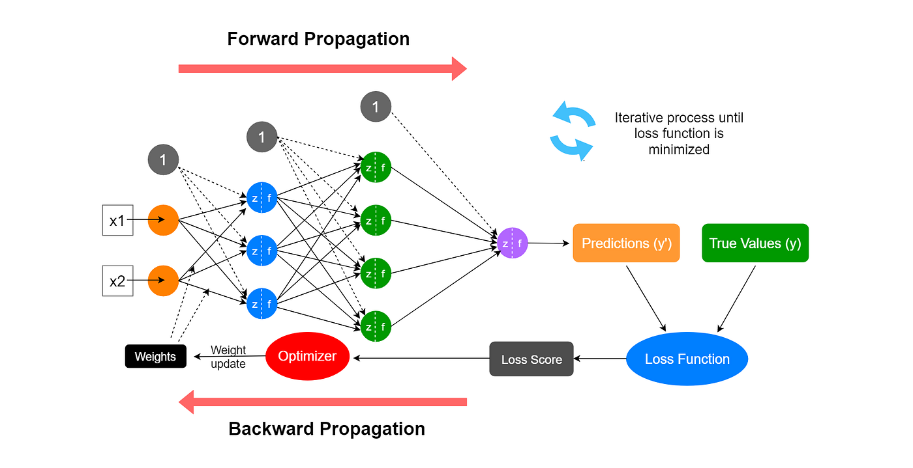

<style>
img[alt~="center"] {
  display: block;
  margin: 0 auto;
}
a[href='red'] {
    color: red;
    pointer-events: none;
    cursor: default;
    text-decoration: none;
}
</style>


# **大语言模型基础：从零到一实现之路**

第3讲: 特征空间的变换2
前反向运行视角理解深度学习模型

<!-- https://marp.app/ -->

---

# 反向传播：深度学习的关键

* 前向传播：从输入到输出，计算预测结果
* 反向传播：从输出到输入，计算梯度，更新参数
* 核心思想：通过链式法则计算复合函数的导数

---



---

# 为什么需要反向传播？

* **目标**：找到使损失函数最小的参数
* **方法**：梯度下降，需要计算损失函数对每个参数的梯度
* **挑战**：深度学习模型是复合函数，直接计算梯度困难
* **解决**：反向传播算法，高效计算所有参数的梯度

---

### 模型的训练/学习
<!--  -->

* 假设，构建模型$f$，其参数为$\theta$
* 目标: 设计一种可用来度量基于$\theta$的模型预测结果和真实结果差距的度量，差距越小，模型越接近需估计的函数$f^*$
  * $J(\theta)=\frac{1}{n}\sum_{X\in \mathcal{X}}(f^*(X)-f(X;\theta))^2$
* 学习方法：梯度下降，寻找合适的$\theta$ (被称之**训练模型**)
<div style="display:contents;" data-marpit-fragment>


</div>


---

# 模型的训练/学习 

* 目标: $J(\theta)=\frac{1}{n}\sum_{X\in \mathcal{X}}(Y-f(X;\theta))^2$

<div style="display:contents;" data-marpit-fragment>

1. 猜个$\theta$, 根据输入$X$，计算$\hat{Y}=f(X;\theta)$
2. 评估误差: $Y$和$\hat{Y}$的误差(loss)
3. 根据误差，更新$\theta$: $\theta=\theta -\lambda\cdot\Delta\theta$


</div>

---


---

# 训练模型(搜索/开发参数)

优化目标: $J(\theta)=\frac{1}{n}\sum_{X\in \mathcal{X}}(f^*(X)-f(X;\theta))^2$

梯度下降法 (Gradient descent): 求偏导(partial derivative)
* $f^*(X)$通常以真值(groundtruth)体现，因此$\frac{\partial}{\partial \theta}J(\theta)$重点关注$f(X;\theta)$
  * $f(X)=XW$ --> $\frac{\partial}{\partial \theta}f(X)=\frac{\partial}{\partial \theta}(XW)$ 
  * 通常深度学习模型$f(X)$为复合函数，可利用链式法则求偏导

* 核心算法: 反向传播(backpropagation)
  * 核心步骤: 针对优化目标$J(\theta)$按层“回退”，一层一层求偏导


---

# 反向传播(backpropagation)

* 假设深度学习模型为$f(X)=XW$的复合函数
  * $y=f_3(f_2(f_1(X)))$
* 优化目标$J(\theta)$的偏导$\frac{\partial}{\partial \theta}J$的核心为$\frac{\partial}{\partial \theta}y=\frac{\partial}{\partial \theta}f_3(f_2(f_1(X)))$
* 链式法则展开:
  * $\frac{\partial J}{\partial \theta_{f_1}} = \frac{\partial J}{\partial y}\cdot \frac{\partial y}{\partial f_3}\cdot \frac{\partial f_3}{\partial f_2}\cdot \frac{\partial f_2}{\partial f_1} \cdot \frac{\partial f_1}{\partial \theta_{f_1}}$

* 偏导的构建
  * 传统手工实现 v.s. 基于计算图的autograd

---

# 计算图：模型计算的DAG图

* **节点**：表示变量(input, weight等)和操作（各种运算等）
* **边**：表示数据的传递
* **前向传播**：沿着边的方向计算
* **反向传播**：沿着边的反方向计算梯度


---

# 举个例子：线性层的反向传播

线性层：$z = x \cdot w + b$
损失函数: $loss = \text{CrossEntropy}(z, y)$
**前向传播**：
- 输入：$x$, 参数：$w$, $b$
- 输出：$z = x \cdot w + b$, 输出的grad: $\frac{\partial loss}{\partial z}$
**反向传播**（链式法则）：
- $\frac{\partial loss}{\partial w} = \frac{\partial loss}{\partial z} \cdot \frac{\partial z}{\partial w} = x \cdot \frac{\partial loss}{\partial z}$
- $\frac{\partial loss}{\partial b} = \frac{\partial loss}{\partial z} \cdot \frac{\partial z}{\partial b} = \frac{\partial loss}{\partial z} \cdot 1 = \frac{\partial loss}{\partial z}$
- $\frac{\partial loss}{\partial x} = \frac{\partial loss}{\partial z} \cdot \frac{\partial z}{\partial x} = \frac{\partial loss}{\partial z} \cdot w^{\top}$

其中 $\frac{\partial loss}{\partial z}$ 是损失函数对输出的梯度，由损失函数的具体形式决定。

---

# 自动求导：PyTorch的核心特性

* **计算图**：PyTorch自动构建计算图
  * 基于`nn.Module`,`Tensor`以及用户实现的`forward`方法
* **梯度追踪**：在PyTorch中，Tensor对象设置`requires_grad=True`即可启用对该`Tensor`的梯度计算
* **反向传播**：`backward()` 自动计算梯度

---

# Autograd的无感知使用

```python
optimizer = torch.optim.SGD(net.parameters(), lr=0.01)

for epoch in range(100):
    # 前向传播
    y = net(x)
    loss = criterion(y, target)
    
    # 反向传播
    optimizer.zero_grad()  # 清零梯度
    loss.backward()        # 计算梯度
    optimizer.step()       # 更新参数
```

---

# Autograd 概览（动态计算图）

- 动态计算图: 前向时即时构图，`requires_grad=True` 的参与者会被追踪。
  - 叶子节点: 叶子是直接由用户创建且需梯度的tensor，其梯度累积在 `.grad`
  - 非叶子节点：由运算生成的新tensor，比如`z=x+y`, z中包含`grad_fn`，是用于记录的Function对象，描述生成该tensor的运算方式，以及反向传播时如何计算梯度

---


```python
import torch

x = torch.ones(2, 2, requires_grad=True)
y = x + 2
z = y * y * 3
out = z.mean()

print(x.grad_fn)  # None，因为x是叶子张量
print(y.grad_fn)  # <AddBackward0>，表示 y = x + 2
print(z.grad_fn)  # <MulBackward0>，表示 z = y * y * 3
print(out.grad_fn) # <MeanBackward0>，表示 mean 操作
```

- y.grad_fn = <AddBackward0>：说明`y`是通过`加法操作`得到的。
- z.grad_fn = <MulBackward0>：说明`z`是通过`乘法操作`得到的。
- out.grad_fn = <MeanBackward0>：说明最终输出是`均值操作`的结果。

---

### 计算图抽象示意

      out = z.mean()        (grad_fn = MeanBackward0)
                ^
                |
           z = y*y*3        (grad_fn = MulBackward0)
                ^
                |
             y = x+2        (grad_fn = AddBackward0)
                ^
                |
                x           (leaf, requires_grad=True, grad_fn=None)

---

#### 常见反向节点名称对照（PyTorch）

- AddmmBackward: 对应 addmm 的反向（矩阵乘 + 偏置相加），是 `nn.Linear`/`F.linear` 的核心反向
  - 典型梯度: $dX = G\,W,\; dW = X^\top G$，其中 $G=\partial L/\partial Y$
  - 可能显示为 `AddmmBackward0` 等后缀变体
- TBackward: 对应 `transpose` 的反向，是线性层实现里常见的辅助节点（例如 `W.t()`）。反传中将梯度再转回原始维度
- AccumulateGrad: 不是算子反向，而是“叶子张量梯度累加”节点。把传来的梯度写入叶子张量（如 `Linear.weight/bias` 或 `requires_grad=True` 的输入）的 `.grad` 中，并按步累加

---

# 反向传播的启动过程

当执行`out.backward()`时，PyTorch 会从`out.grad_fn`出发，沿着计算图往回追踪，调用每个`grad_fn`对应的`backward()`方法，逐步计算出各个叶子节点（比如参数`x`）的梯度。

几个注意点：
- 叶子张量（用户定义的变量）的`grad_fn`一般是`None`。
- 如果一个张量是通过in-place操作得到的，因为这可能会影响计算图的正确性，所以`grad_fn`会变成`AccumulateGrad`或者触发警告。
- 在调用`.detach()`或`.data`时，得到的新张量也不会有`grad_fn`，因为它被认为是从计算图中“断开”了。

---

# 工程视角看Autograd：你需要知道的

- 动态计算图：前向即时构图；非叶子张量有 `grad_fn`，叶子张量的梯度写入 `.grad`。
- 基于向量-雅可比积(VJP)：`backward()` 等价逐层执行 $v^\top J$ 的向量-雅可比积；工程上无需显式构造雅可比矩阵即可完成训练。
  - 原理提示：背后采用“反向模式自动微分”（向量-雅可比积，VJP）实现高效梯度计算；想深入可参考 PyTorch Autograd 文档：https://pytorch.org/docs/stable/autograd.html


---

# 工程视角看Autograd：你需要知道的

- 标量 backward：对标量输出使用 `y.backward()`
  - 反向传播需要一个起点，对标量来说，就是1
  - 例如`y=model(x)`，假设`y.shape=[batch,dim]`，直接调用`y.backward()`会报错，因为torch内部不知道到底该对哪个方向做反向传播
- 非标量 backward：对非标量输出使用 `y.backward(gradient=v)`，`v` 与 `y` 同形(shape)表示上游`grad`权重。


---

# 工程视角看Autograd：你需要知道的

- 线性层$Y=XW$的backward：设上游梯度 $G=\partial L/\partial Y$
  - $dX = G\,W^\top$，$dW = X^\top G$
  - 计算图常见节点：`AddmmBackward`（Linear/F.linear 反向）、`TBackward`（转置辅助）、`AccumulateGrad`（叶子梯度累积）。
- 训练循环要点：`zero_grad()` 防梯度累积；参数更新放优化器或 `no_grad()`；避免对中间结果原地修改。

---

# 工程视角看Autograd：你需要知道的

- 高阶/多次反向：按需使用 `create_graph=True` 与 `retain_graph=True`；默认一次反向后释放图。
- 性能与调试：AMP、梯度检查点、`torch.compile`；结合 hooks 与 notebook 的图打印定位梯度流。

注：理论上可把 Autograd 看成“雅可比链式法则”的高效实现，理解这一点即可，不必掌握雅可比的形式化定义再上手工程实践。

---

# Hook 示例

```python
h = []
def log_grad(grad):
    h.append((grad.mean().item(), grad.norm().item()))

out = net(x)
out.register_hook(log_grad)    # 观察上游梯度
loss = criterion(out, y)
loss.backward()
```

---


# 梯度累积与清零

- `.grad` 默认累加；训练循环应先清零再 `backward()`。
<!-- - `model.zero_grad(set_to_none=True)` 降低显存碎片与加速。 -->
```python
optimizer.zero_grad(set_to_none=True)
loss.backward()
optimizer.step()
```

---

# 高阶梯度与图保留

- 二阶/高阶导: `create_graph=True` 构建可微分的反向图。
- 多次反传: 若复用同一前向，需 `retain_graph=True`。
```python
g = torch.autograd.grad(loss, params, create_graph=True)
g2 = torch.autograd.grad(sum(p.sum() for p in g), params)
```

---

# 分离与禁用追踪

- `x.detach()`：把张量从当前计算图中分离，后续关于该结果的计算不会把梯度回传到被分离的分支。与原张量共享存储（谨慎原地写）。
  - 用途：
    - 截断梯度（冻结某分支、teacher 模型前向等）。
    - 缓存中间结果重复使用但不参与训练。


---
# 分离与禁用追踪
注意事项：
- 不要在训练前向外层包 `no_grad`/`inference_mode`，否则无法计算梯度。
- `detach()` 会打断梯度流，误用会让模型学不动；仅在确需截断时使用。
- 分离张量与原张量共享存储，避免原地写引入隐性错误。


---


- `with torch.no_grad():`：上下文内不记录计算图，不分配 `grad_fn`/中间量，因此这些计算不参与 `loss.backward()`。
  - 与反向的关系：在该上下文中产生的新张量，即使参与后续损失计算，梯度也不会通过它们回传（因为没有构图）。
  - 用途：
    - 纯推理/验证（配合 `model.eval()`）。
    - 统计/后处理（如 metrics、argmax/topk）。
    - 无梯度的参数更新（如 EMA、手写优化步骤）。

---

- `with torch.inference_mode()`：面向**纯推理/部署**的模式
  - 与反向的关系：不构图
    - 跳过版本计数与视图跟踪，进一步减少元数据与一致性检查的开销；可视为只读、无梯度的快速前向
  - 适用场景：离线/在线推理、模型服务、导出前的快速验证

---
| 特性 | `no_grad` | `inference_mode` | 说明 |
|---|---|---|---|
| 构图 | 关闭 | 关闭 | 两者都不记录计算图 |
| 版本计数/视图跟踪 | 保留 | 跳过 | `inference_mode` 更省内存/检查更少 |
| 内存/速度 | 省 | 更省/更快 | 大模型推理建议 `inference_mode` |
| 训练期使用 | 可用于局部（如指标、EMA） | 不建议 | `inference_mode` 仅用于纯推理 |
| 原地修改检测 | 有检查 | 检查更少/可能被绕过 | 训练期更安全用 `no_grad` |

---

# A0简介：问题设定

- 线性变换: $Y = XW$
- 形状: $X \in \mathbb{R}^{B\times H\times D}$，$W \in \mathbb{R}^{D\times E}$，$Y \in \mathbb{R}^{B\times H\times E}$
- 损失: `Loss = (Y**2).sum()`（标量，便于直接反传）

---

# A0简介：梯度推导

- 上游: $G = \partial Loss/\partial Y = 2Y \in \mathbb{R}^{B\times H\times E}$
- 参数: 合并批序 $N=B\times H$
  - $dW = \operatorname{reshape}(X,N,D)^\top\,\operatorname{reshape}(G,N,E) \in \mathbb{R}^{D\times E}$
  - 若有偏置 $b \in \mathbb{R}^{E}$，$db = G\,.\operatorname{sum}(\text{dim}=(0,1))$
- 输入: $dX = G\,W^\top \;\to\; \mathbb{R}^{B\times H\times D}$

---

### A0简介：代码

```python
import torch
torch.manual_seed(0)
B,H,D,E = 2,3,4,5
X = torch.randn(B,H,D, dtype=torch.float64, requires_grad=True)
W = torch.randn(D,E,   dtype=torch.float64, requires_grad=True)

Y = X @ W
Loss = (Y**2).sum()
Loss.backward()
grad_X_auto, grad_W_auto = X.grad.clone(), W.grad.clone()

G  = 2 * Y.detach()
dW = X.detach().reshape(-1,D).T @ G.reshape(-1,E)
dX = torch.matmul(G, W.detach().T)

assert torch.allclose(grad_W_auto, dW, rtol=1e-6, atol=1e-6)
assert torch.allclose(grad_X_auto, dX, rtol=1e-6, atol=1e-6)
```

---

# A0简介：调试清单

- 形状与展平: `contiguous()` 后再 `view/reshape`，避免 stride 问题。
- 广播与偏置: `db` 对非通道维求和；检查维度顺序。
- 梯度累积: 多次 `backward()` 会累加 `.grad`，对比前先 `zero_grad()`。
- 数值校验: 用双精度与 `torch.autograd.gradcheck`。
- 观测工具: `tensor.register_hook` 打印关键梯度的均值/范数。
