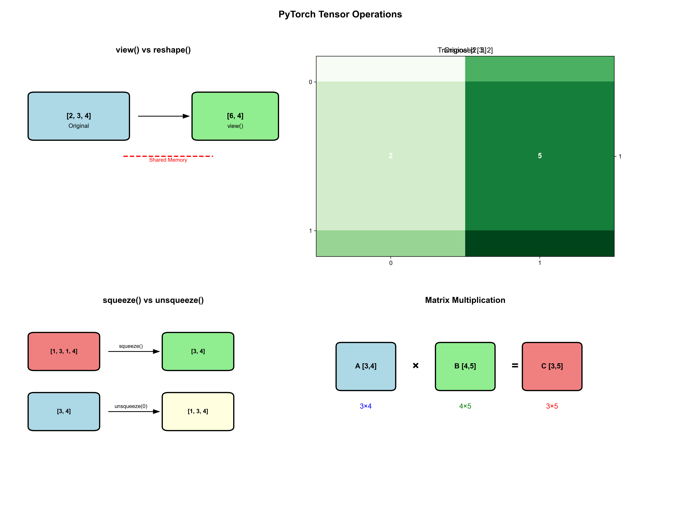
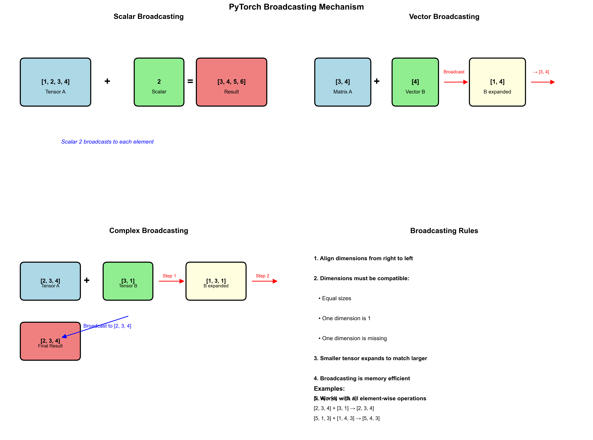

<style>
img[alt~="center"] {
  display: block;
  margin: 0 auto;
}
a[href='red'] {
    color: red;
    pointer-events: none;
    cursor: default;
    text-decoration: none;
}
</style>

<style>
img[alt~="right"] {
  display: block;
  margin:auto;
}
a[href='red'] {
    color: red;
    pointer-events: none;
    cursor: default;
    text-decoration: none;
}
</style>


# **LLM智能应用开发**

第4讲: 大语言模型解析 I
基于HF LlaMA实现的讲解

Input/Positional Embedding

<!-- https://marp.app/ -->

---

# LLM结构的学习路径

* LLM结构解析(开源LlaMA)
* 自定义数据集构造
* 自定义损失函数和模型训练/微调

---

# Transformer经典结构


* Encoder-decoder结构
* 输入部分
  * Input embedding
  * Positional embedding
* Transformer部分
  * Attention
  * Feed forward


---

# LlaMA的模型结构


---

# HF LlaMA模型结构

```python
LlamaForCausalLM(
  (model): LlamaModel(
    (embed_tokens): Embedding(128256, 2048)
    (layers): ModuleList(
      (0-15): 16 x LlamaDecoderLayer(
        (self_attn): LlamaAttention
        (mlp): LlamaMLP
        (input_layernorm): LlamaRMSNorm
        (post_attention_layernorm): LlamaRMSNorm
    )
    (norm): LlamaRMSNorm((2048,), eps=1e-05)
    (rotary_emb): LlamaRotaryEmbedding()
  )
  (lm_head): Linear(in_features=2048, out_features=128256, bias=False)
)
```


---

# LlamaDecoderLayer内部结构

```python
(self_attn): LlamaAttention(
  (q_proj): Linear(in_features=2048, out_features=2048, bias=False)
  (k_proj): Linear(in_features=2048, out_features=512, bias=False)
  (v_proj): Linear(in_features=2048, out_features=512, bias=False)
  (o_proj): Linear(in_features=2048, out_features=2048, bias=False)
  (rotary_emb): LlamaRotaryEmbedding()
)
(mlp): LlamaMLP(
  (gate_proj): Linear(in_features=2048, out_features=8192, bias=False)
  (up_proj): Linear(in_features=2048, out_features=8192, bias=False)
  (down_proj): Linear(in_features=8192, out_features=2048, bias=False)
  (act_fn): SiLU()
)
(input_layernorm): LlamaRMSNorm((2048,), eps=1e-05)
(post_attention_layernorm): LlamaRMSNorm((2048,), eps=1e-05)
```

---

### Qwen3-0.6B模型结构

```python
Qwen3ForCausalLM(
  (model): Qwen3Model(
    (embed_tokens): Embedding(151936, 1024)
    (layers): ModuleList(
      (0-27): 28 x Qwen3DecoderLayer(
        (self_attn): Qwen3Attention()
        (mlp): Qwen3MLP()
        (input_layernorm): Qwen3RMSNorm((1024,), eps=1e-06)
        (post_attention_layernorm): Qwen3RMSNorm((1024,), eps=1e-06)
      )
    )
    (norm): Qwen3RMSNorm((1024,), eps=1e-06)
    (rotary_emb): Qwen3RotaryEmbedding()
  )
  (lm_head): Linear(in_features=1024, out_features=151936, bias=False)
)
```

---

**Qwen3Attention内部结构**
```python
(q_proj): Linear(in_features=1024, out_features=2048, bias=False)
(k_proj): Linear(in_features=1024, out_features=1024, bias=False)
(v_proj): Linear(in_features=1024, out_features=1024, bias=False)
(o_proj): Linear(in_features=2048, out_features=1024, bias=False)
(q_norm): Qwen3RMSNorm((128,), eps=1e-06)
(k_norm): Qwen3RMSNorm((128,), eps=1e-06)
```
**Qwen3MLP内部结构**
```python
(gate_proj): Linear(in_features=1024, out_features=3072, bias=False)
(up_proj): Linear(in_features=1024, out_features=3072, bias=False)
(down_proj): Linear(in_features=3072, out_features=1024, bias=False)
(act_fn): SiLU()
```


---


# 本次课程关注


- 目前，流行结构多为Decoder-only
- **输入部分**
  - **Input embedding**
  - **Positional embedding**
- Transformer部分
  - Attention 
  - Feed forward 


---

# Input embedding

```python
(embed_tokens): Embedding(128256, 2048)
```

* embedding：将自然语言翻译为index
* 每个index对应一个embedding
  * embedding需训练
* 例如：
  * 用户给LLM的输入: "你好，请介绍下南京大学"
  * LLM经过预训练的embedding: [[0.2234234,-0.28178,...], [...]]

<div style="display:contents;" data-marpit-fragment>
翻译过程：一般由tokenizer实现
</div>

---

# Input embedding原理


"语言是文明的载体，对人类而言是这样，对LLM而言也是这样"


<div style="display:contents;" data-marpit-fragment>


这是"南京大学"


</div>

---

# Input embedding原理

这也是"南京大学"


---

# Input embedding原理

<!-- <p align="center">
  

  
</p> -->

这也是“南京大学”：南大的(部分)特征

<p align="center">
  
</p>

---

# Input embedding原理

**Input embedding**：构建表达自然语言**特征**的**表示 (representation)**

<p align="center">
  
</p>

---

# 为LLM构建词汇表

* 自然语言是离散的，LLM词汇表依然延续离散的模式构建
* 如何分词: 'Hello, world!'
  * word-based: | hello | , | world | ! |
  * character-based: h|e|l|l|o|,|w|o|r|l|d|!
  * subword-based tokenization
    * 基本原则：常用“词”不拆分，一般词分解为有意义的子词(subword)
    * 来试试[Tiktokenizer](https://tiktokenizer.vercel.app/?model=meta-llama%2FMeta-Llama-3-8B)

---

# Tokenization方式

* Byte-level BPE (GPT2)
* WordPiece (BERT)
* SentencePiece (Multilingual models)

* Tokenizer in LlaMA3
  * BPE model based on [tiktoken](https://github.com/openai/tiktoken)


---

# 来试试LlaMA3的Tokenizer

一般每个LLM会自带tokenizer，用以下方式加载模型对应的tokenizer
```python
from transformers import AutoTokenizer
tokenizer = AutoTokenizer.from_pretrained(model_id)
```

* 使用方法
  * `tokenizer(input)` - 完整编码，返回字典
  * `tokenizer.tokenize(input)` - 只分词，返回字符串列表
  * `tokenizer.encode(input)` - 编码为ID，可选择特殊符号
  * `tokenizer.decode(input)` - 解码ID为文本

## Tokenizer方法详解

### 1. tokenize() - 分词方法
```python
text = "南京大学是一所优秀的大学"
tokens = tokenizer.tokenize(text)
print(tokens)  # ['南', '京', '大', '学', '是', '一', '所', '优', '秀', '的', '大', '学']
```
- 只做分词，不添加特殊符号
- 返回字符串token列表
- 用于查看分词效果

### 2. encode() - 编码方法
```python
# 不添加特殊符号
ids = tokenizer.encode(text, add_special_tokens=False)
print(ids)  # [59563, 47653, 102667, ...]

# 添加特殊符号（默认）
ids_with_special = tokenizer.encode(text, add_special_tokens=True)
print(ids_with_special)  # [128000, 59563, 47653, ..., 128001]
```
- 将文本转换为token ID
- `add_special_tokens=True`：添加BOS/EOS等特殊符号
- 返回整数列表

### 3. tokenizer() - 完整编码方法
```python
encoded = tokenizer(text)
print(encoded)
# {'input_ids': [128000, 59563, 47653, 102667, 128001], 
#  'attention_mask': [1, 1, 1, 1, 1]}
```
- 返回包含`input_ids`和`attention_mask`的字典
- 支持批量处理、padding、truncation等参数
- 最常用的方法

### 4. decode() - 解码方法
```python
decoded = tokenizer.decode(encoded['input_ids'])
print(decoded)  # "南京大学是一所优秀的大学"

# 跳过特殊符号
decoded_clean = tokenizer.decode(encoded['input_ids'], skip_special_tokens=True)
print(decoded_clean)  # "南京大学是一所优秀的大学"
```
- 将token ID转换回文本
- `skip_special_tokens=True`：去除特殊符号

### 5. 批量处理
```python
texts = ["你好", "南京大学", "人工智能"]
batch_encoded = tokenizer(texts, padding=True, truncation=True, return_tensors="pt")
print(batch_encoded['input_ids'].shape)  # torch.Size([3, max_length])
```


---

# 位置编码 (Positional embeddings)


**位置编码：用来标记每个词的位置**

* Sinusoidal PE
  * Attention is all you need时代的位置编码
* Rotary PE(旋转位置编码)
  * 基于论文[RoFormer](https://arxiv.org/abs/2104.09864)

---

# 位置编码的初衷

* Attention模块计算的是每个token的注意力分数
  * 衡量token与token之间的相关性
* 位置编码用来标记每个token的位置
  * 让LLM更好的建模不同位置的token之间的关系

---

# 绝对位置编码

直接在每个token的embedding上线性叠加位置编码: $x_i + p_i$，其中$p_i$为可训练的向量

<div style="display:contents;" data-marpit-fragment>

Sinusoidal PE: Attention is all you need


</div>

<div style="display:contents;" data-marpit-fragment>

灵感来源：通过周期性建模位置编码

</div>

---

# 位置编码与序数编码的关联

* 序数表示次序，位置编码的用意也在于此。例如从小就学的序数编码：
  * 十进制: 1 2 3 4 5 6 7 8 9 10, ...
  * 二进制: 0, 1, 10, 11, 100, 101, 110, 111, 1000, 1001, ...
* **但是**：
  * LLM中的token embedding为向量,如何构造型为向量的位置编码？

---

# 序数的周期性

十进制本身是周期性的，二进制也是周期性的


---


# Sinusodial PE

构建n维的位置编码，每一维用不同的周期函数刻画取值


---

# 旋转位置编码（Rotary PE）


<div style="display:contents;" data-marpit-fragment>

“叠加旋转位置编码的方式由加法改乘法”

</div>

<div style="display:contents;" data-marpit-fragment>

假设两个token的embedding为$x_m$和$x_n$，$m$和$n$分别代表两个token的位置，目标找到一个等价的位置编码方式，使得下述等式成立：


</div>

<div style="display:contents;" data-marpit-fragment>

[RoFormer](https://arxiv.org/abs/2104.09864)提出Rotary PE，在embedding维度为2的情况下：


</div>

---

# Rotary PE的2D理解

回忆下欧拉公式：$e^{ix}=cos(x)+isin(x)$

<div style="display:contents;" data-marpit-fragment>


</div>

<div style="display:contents;" data-marpit-fragment>

因此，上述函数$f$和$g$中的指数函数$e^{ix}$具体表示为 

</div>


---

# RoPE实现

RoPE的2D实现


RoPE的n维实现


---


# Rotary PE的可视化展示


---

# RoPE在LlaMA中的构建

不同于经典Transformers结构，只对输入的token做位置编码的叠加

LlaMA中的RoPE在Transformer的每一层都会对Q和K进行位置编码的叠加


---

# 补充内容：PyTorch Tensor操作详解

在深度学习中，tensor操作是构建模型的基础。理解各种tensor操作对于实现LLM等复杂模型至关重要。

<!--  -->

---

# Tensor操作分类

* **形状变换操作**
  * `view()` / `reshape()` - 改变tensor形状
  * `transpose()` / `permute()` - 转置和维度重排
  * `squeeze()` / `unsqueeze()` - 压缩/扩展维度
* **数学运算操作**
  * `matmul()` / `@` - 矩阵乘法
  * `bmm()` - 批量矩阵乘法
  * `einsum()` - 爱因斯坦求和约定
* 存储连续：`contiguous()`


---

# Tensor操作分类

* **索引和切片操作**
  * `gather()` / `scatter()` - 按索引收集/分散
  * `index_select()` - 按索引选择
  * `masked_select()` - 按掩码选择

---

# 形状变换操作：view vs reshape

## 基本原理

* **`view()`**: 返回与原tensor共享存储的新视图，要求tensor在内存中连续
* **`reshape()`**: 如果可能则返回view，否则返回副本

---


## 代码示例

```python
# view() - 要求tensor连续
x = torch.randn(2, 3, 4)
y = x.view(6, 4)  # 成功：2*3=6

# 如果tensor不连续，view()会报错
x_transposed = x.transpose(0, 1)  # 不连续
# y = x_transposed.view(12, 2)  # 报错！

# reshape() - 自动处理连续性问题
y = x_transposed.reshape(12, 2)  # 成功：自动处理
```

---

# 转置操作：transpose vs permute

transpose() - 交换两个维度

```python
x = torch.randn(2, 3, 4, 5)
y = x.transpose(1, 3)  # 交换维度1和3
print(x.shape)  # torch.Size([2, 3, 4, 5])
print(y.shape)  # torch.Size([2, 5, 4, 3])
```
permute() - 重新排列所有维度

```python
x = torch.randn(2, 3, 4, 5)
y = x.permute(0, 3, 1, 2)  # 重新排列维度
print(x.shape)  # torch.Size([2, 3, 4, 5])
print(y.shape)  # torch.Size([2, 5, 3, 4])
```

---

# 维度操作：squeeze vs unsqueeze

squeeze() - 移除大小为1的维度

```python
x = torch.randn(1, 3, 1, 4)
y = x.squeeze()  # 移除所有大小为1的维度
z = x.squeeze(0)  # 只移除第0维
print(x.shape)  # torch.Size([1, 3, 1, 4])
print(y.shape)  # torch.Size([3, 4])
print(z.shape)  # torch.Size([3, 1, 4])
```

---
# 维度操作：squeeze vs unsqueeze

unsqueeze() - 在指定位置插入大小为1的维度

```python
x = torch.randn(3, 4)
y = x.unsqueeze(0)  # 在第0维插入
z = x.unsqueeze(-1)  # 在最后一维插入
print(x.shape)  # torch.Size([3, 4])
print(y.shape)  # torch.Size([1, 3, 4])
print(z.shape)  # torch.Size([3, 4, 1])
```

---

# Broadcasting（广播）机制

<!--  -->


Broadcasting是PyTorch中一种强大的机制，允许不同形状的tensor进行运算。它遵循以下规则：

1. **从右向左对齐维度**：从最后一个维度开始比较
2. **维度兼容性**：两个维度要么相等，要么其中一个为1，要么其中一个不存在
3. **自动扩展**：较小的tensor会在不兼容的维度上自动扩展

---

## Broadcasting规则示例

```python
# 示例1: 标量与tensor
a = torch.tensor([1, 2, 3])
b = 2
c = a + b  # [3, 4, 5] - 标量自动广播到每个元素

# 示例2: 不同形状的tensor
A = torch.randn(3, 4)      # [3, 4]
B = torch.randn(4)         # [4]
C = A + B                  # [3, 4] - B自动扩展为[1, 4]然后[3, 4]

# 示例3: 更复杂的广播
A = torch.randn(2, 3, 4)   # [2, 3, 4]
B = torch.randn(3, 1)      # [3, 1]
C = A + B                  # [2, 3, 4] - B扩展为[1, 3, 1]然后[2, 3, 4]
```

---

## Broadcasting在深度学习中的应用

```python
# 1. 添加偏置项
x = torch.randn(32, 128)  # [batch_size, features]
bias = torch.randn(128)   # [features]
y = x + bias              # 每个样本都加上相同的偏置

# 2. 注意力机制中的mask
scores = torch.randn(2, 8, 8)  # [batch, seq_len, seq_len]
mask = torch.tensor([1, 1, 1, 0, 0, 0, 0, 0])  # [seq_len]
masked_scores = scores + mask.unsqueeze(0).unsqueeze(0)  # 广播到[2, 8, 8]

# 3. 批量归一化
x = torch.randn(32, 64, 28, 28)  # [batch, channels, height, width]
mean = torch.mean(x, dim=(0, 2, 3), keepdim=True)  # [1, 64, 1, 1]
normalized = (x - mean) / torch.std(x, dim=(0, 2, 3), keepdim=True)
```

---

# 矩阵乘法操作

不同矩阵乘法的使用场景

* **`torch.matmul()` / `@`**: 通用矩阵乘法，支持广播
* **`torch.bmm()`**: 批量矩阵乘法，专门用于3D tensor
* **`torch.mm()`**: 2D矩阵乘法

```python
# 批量矩阵乘法
A_batch = torch.randn(2, 3, 4)
B_batch = torch.randn(2, 4, 5)
C_batch = torch.bmm(A_batch, B_batch)
print(C_batch.shape)  # torch.Size([2, 3, 5])
```

---

# 爱因斯坦求和约定 (einsum)

einsum提供了一种简洁的方式来表达复杂的tensor操作：

```python
# 矩阵乘法: C[i,j] = sum_k A[i,k] * B[k,j]
A = torch.randn(3, 4)
B = torch.randn(4, 5)
C = torch.einsum('ik,kj->ij', A, B)
# 批量矩阵乘法
A_batch = torch.randn(2, 3, 4)
B_batch = torch.randn(2, 4, 5)
C_batch = torch.einsum('bik,bkj->bij', A_batch, B_batch)
# 注意力机制中的QK^T计算
Q = torch.randn(2, 8, 64)  # [batch, seq_len, d_model]
K = torch.randn(2, 8, 64)
scores = torch.einsum('bqd,bkd->bqk', Q, K)
```

---

# 索引和选择操作

gather() - 按索引收集元素

```python
# 在指定维度上按索引收集元素
x = torch.randn(3, 4)
indices = torch.tensor([0, 2, 1])
y = torch.gather(x, 1, indices.unsqueeze(1))
print(x)
print(y)  # 每行按indices选择元素
```

---

## scatter() - 按索引分散元素

```python
# 将元素分散到指定位置
x = torch.zeros(3, 4)
values = torch.randn(3, 2)
indices = torch.tensor([[0, 2], [1, 3], [0, 1]])
x.scatter_(1, indices, values)
print(x)
```

---

# 拓展阅读&参考文档

[Hugging Face](https://huggingface.co/transformers/model_doc/llama.html)
[Accelerating a Hugging Face Llama 2 and Llama 3 models with Transformer Engine](https://docs.nvidia.com/deeplearning/transformer-engine/user-guide/examples/te_llama/tutorial_accelerate_hf_llama_with_te.html)

RoPE部分
[Transformer升级之路：10、RoPE是一种β进制编码. 苏剑林](https://kexue.fm/archives/9675)
[RoFormer: Enhanced Transformer with Rotary Position Embedding](https://arxiv.org/pdf/2104.09864)

PyTorch Tensor操作
[PyTorch官方文档 - Tensor操作](https://pytorch.org/docs/stable/torch.html#tensor-operations)
[Einops库 - 更优雅的tensor操作](https://github.com/arogozhnikov/einops)


