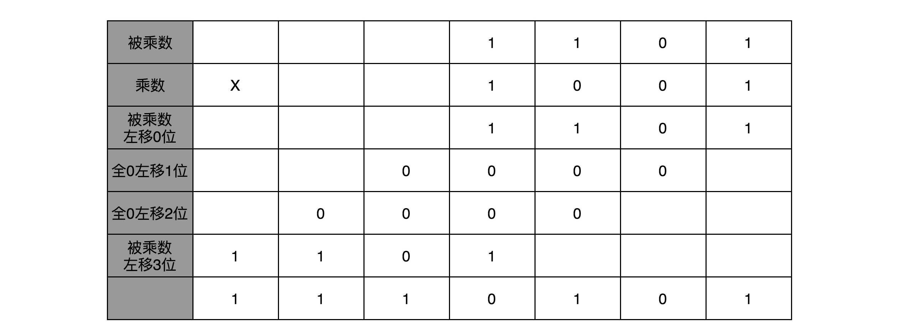
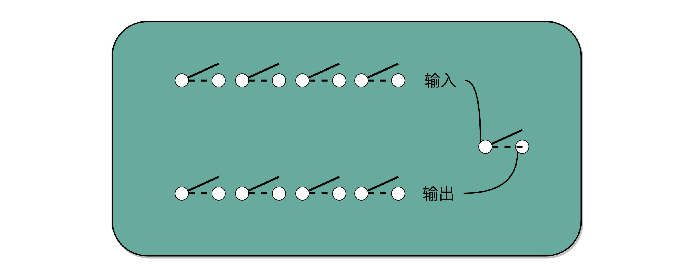
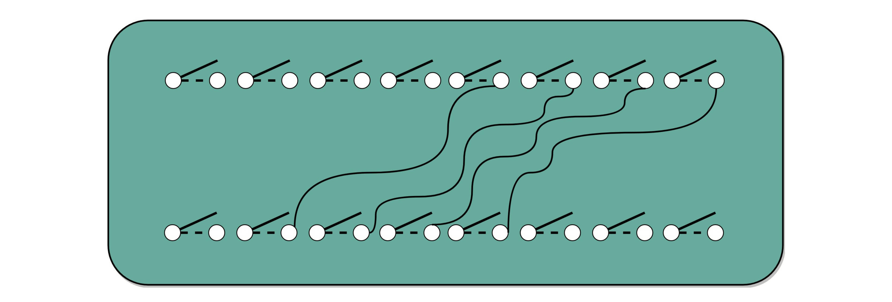
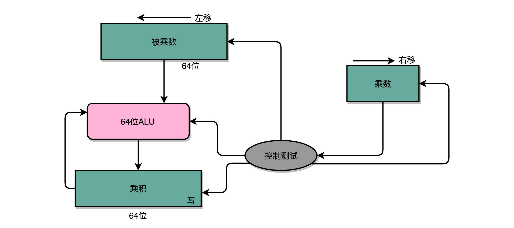
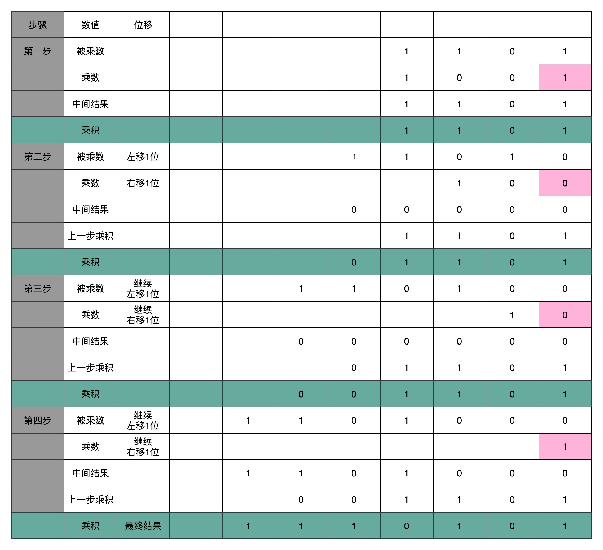
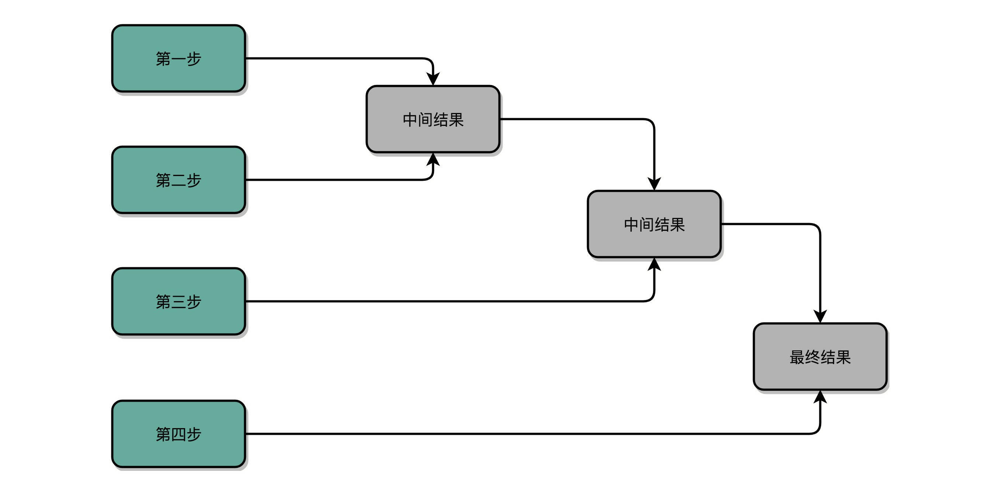
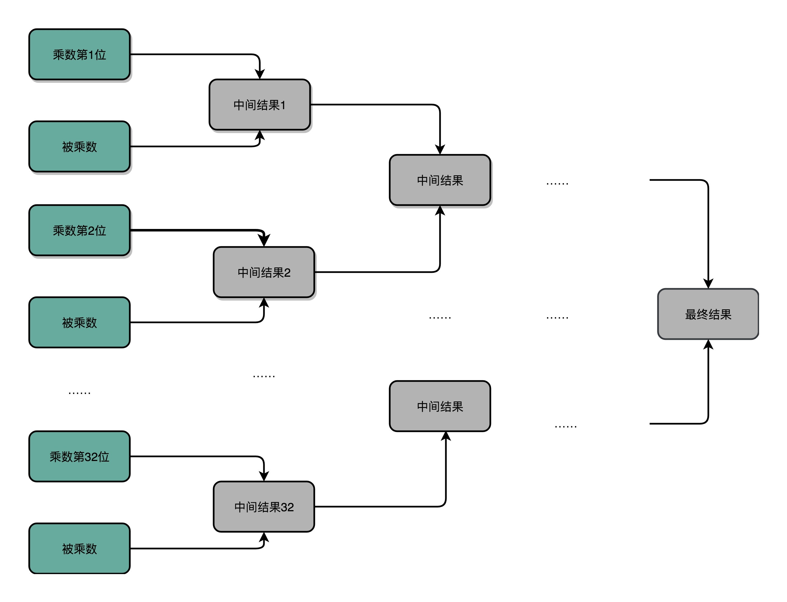
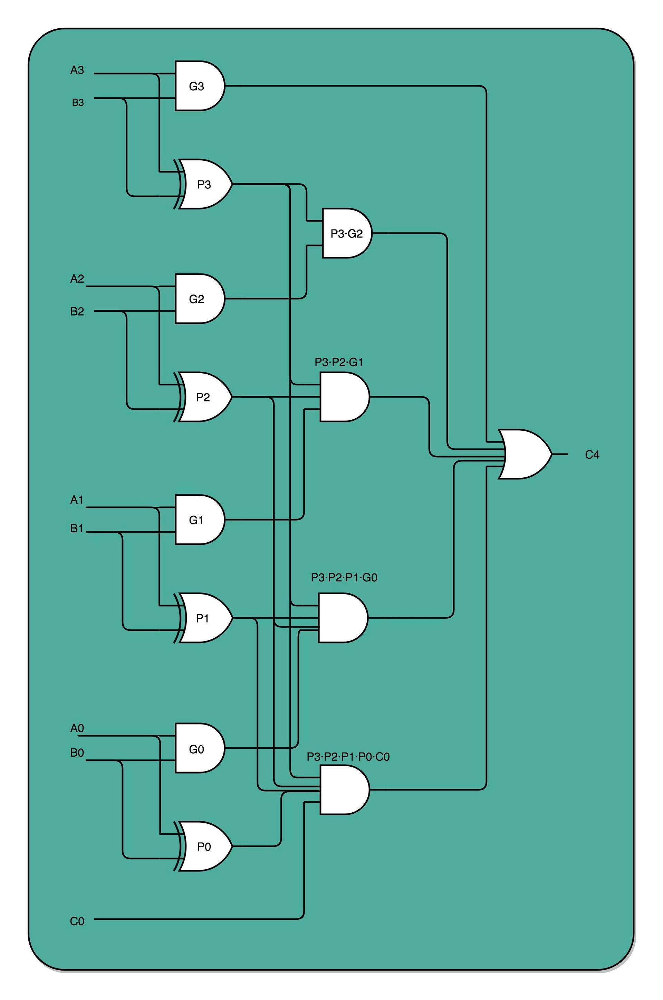

# 14 | 乘法器：如何像搭乐高一样搭电路（下）？
和学习小学数学一样，学完了加法之后，我们自然而然就要来学习乘法。既然是退回到小学，我们就把问题搞得简单一点，先来看两个4位数的乘法。这里的4位数，当然还是一个二进制数。我们是人类而不是电路，自然还是用列竖式的方式来进行计算。

十进制中的13乘以9，计算的结果应该是117。我们通过转换成二进制，然后列竖式的办法，来看看整个计算的过程是怎样的。

## 顺序乘法的实现过程

从列出竖式的过程中，你会发现，二进制的乘法有个很大的优点，就是这个过程你不需要背九九乘法口诀表了。因为单个位置上，乘数只能是0或者1，所以实际的乘法，就退化成了位移和加法。

在13×9这个例子里面，被乘数13表示成二进制是1101，乘数9在二进制里面是1001。最右边的个位是1，所以个位乘以被乘数，就是把被乘数1101复制下来。因为二位和四位都是0，所以乘以被乘数都是0，那么保留下来的都是0000。乘数的八位是1，我们仍然需要把被乘数1101复制下来。不过这里和个位位置的单纯复制有一点小小的差别，那就是要把复制好的结果向左侧移三位，然后把四位单独进行乘法加位移的结果，再加起来，我们就得到了最终的计算结果。

对应到我们之前讲的数字电路和ALU，你可以看到，最后一步的加法，我们可以用上一讲的加法器来实现。乘法因为只有“0”和“1”两种情况，所以可以做成输入输出都是4个开关，中间用1个开关，同时来控制这8个开关的方式，这就实现了二进制下的单位的乘法。

<!-- [[[read_end]]] -->

我们可以用一个开关来决定，下面的输出是完全复制输入，还是将输出全部设置为0

至于位移也不麻烦，我们只要不是直接连线，把正对着的开关之间进行接通，而是斜着错开位置去接就好了。如果要左移一位，就错开一位接线；如果要左移两位，就错开两位接线。

把对应的线路错位连接，就可以起到位移的作用

这样，你会发现，我们并不需要引入任何新的、更复杂的电路，仍然用最基础的电路，只要用不同的接线方式，就能够实现一个“列竖式”的乘法。而且，因为二进制下，只有0和1，也就是开关的开和闭这两种情况，所以我们的计算机也不需要去“背诵”九九乘法口诀表，不需要单独实现一个更复杂的电路，就能够实现乘法。

为了节约一点开关，也就是晶体管的数量。实际上，像13×9这样两个四位数的乘法，我们不需要把四次单位乘法的结果，用四组独立的开关单独都记录下来，然后再把这四个数加起来。因为这样做，需要很多组开关，如果我们计算一个32位的整数乘法，就要32组开关，太浪费晶体管了。如果我们顺序地来计算，只需要一组开关就好了。

我们先拿乘数最右侧的个位乘以被乘数，然后把结果写入用来存放计算结果的开关里面，然后，把被乘数左移一位，把乘数右移一位，仍然用乘数去乘以被乘数，然后把结果加到刚才的结果上。反复重复这一步骤，直到不能再左移和右移位置。这样，乘数和被乘数就像两列相向而驶的列车，仅仅需要简单的加法器、一个可以左移一位的电路和一个右移一位的电路，就能完成整个乘法。

乘法器硬件结构示意图

你看这里画的乘法器硬件结构示意图。这里的控制测试，其实就是通过一个时钟信号，来控制左移、右移以及重新计算乘法和加法的时机。我们还是以计算13×9，也就是二进制的1101×1001来具体看。

这个计算方式虽然节约电路了，但是也有一个很大的缺点，那就是慢。

你应该很容易就能发现，在这个乘法器的实现过程里，我们其实就是把乘法展开，变成了“**加法+位移**”来实现。我们用的是4位数，所以要进行4组“位移+加法”的操作。而且这4组操作还不能同时进行。因为**下一组的加法要依赖上一组的加法后的计算结果，下一组的位移也要依赖上一组的位移的结果。这样，整个算法是“顺序”的，每一组加法或者位移的运算都需要一定的时间**。

所以，最终这个乘法的计算速度，其实和我们要计算的数的位数有关。比如，这里的4位，就需要4次加法。而我们的现代CPU常常要用32位或者是64位来表示整数，那么对应就需要32次或者64次加法。比起4位数，要多花上8倍乃至16倍的时间。

换个我们在算法和数据结构中的术语来说就是，这样的一个顺序乘法器硬件进行计算的时间复杂度是 O\(N\)。这里的N，就是乘法的数里面的**位数**。

## 并行加速方法

那么，我们有没有办法，把时间复杂度上降下来呢？研究数据结构和算法的时候，我们总是希望能够把O\(N\)的时间复杂度，降低到O\(logN\)。办法还真的有。和软件开发里面改算法一样，在涉及CPU和电路的时候，我们可以改电路。

32位数虽然是32次加法，但是我们可以让很多加法同时进行。回到这一讲开始，我们把位移和乘法的计算结果加到中间结果里的方法，32位整数的乘法，其实就变成了32个整数相加。

前面顺序乘法器硬件的实现办法，就好像体育比赛里面的**单败淘汰赛**。只有一个擂台会存下最新的计算结果。每一场新的比赛就来一个新的选手，实现一次加法，实现完了剩下的还是原来那个守擂的，直到其余31个选手都上来比过一场。如果一场比赛需要一天，那么一共要比31场，也就是31天。

目前的乘法实现就像是单败淘汰赛

加速的办法，就是把比赛变成像世界杯足球赛那样的淘汰赛，32个球队捉对厮杀，同时开赛。这样一天一下子就淘汰了16支队，也就是说，32个数两两相加后，你可以得到16个结果。后面的比赛也是一样同时开赛捉对厮杀。只需要5天，也就是O\(log2N\)的时间，就能得到计算的结果。但是这种方式要求我们得有16个球场。因为在淘汰赛的第一轮，我们需要16场比赛同时进行。对应到我们CPU的硬件上，就是需要更多的晶体管开关，来放下中间计算结果。

通过并联更多的ALU，加上更多的寄存器，我们也能加速乘法

## 电路并行

上面我们说的并行加速的办法，看起来还是有点儿笨。我们回头来做一个抽象的思考。之所以我们的计算会慢，核心原因其实是“顺序”计算，也就是说，要等前面的计算结果完成之后，我们才能得到后面的计算结果。

最典型的例子就是我们上一讲讲的加法器。每一个全加器，都要等待上一个全加器，把对应的进入输入结果算出来，才能算下一位的输出。位数越多，越往高位走，等待前面的步骤就越多，这个等待的时间有个专门的名词，叫作**门延迟**（Gate Delay）。

每通过一个门电路，我们就要等待门电路的计算结果，就是一层的门电路延迟，我们一般给它取一个“T”作为符号。一个全加器，其实就已经有了3T的延迟（进位需要经过3个门电路）。而4位整数，最高位的计算需要等待前面三个全加器的进位结果，也就是要等9T的延迟。如果是64位整数，那就要变成63×3=189T的延迟。这可不是个小数字啊！

除了门延迟之外，还有一个问题就是**时钟频率**。在上面的顺序乘法计算里面，如果我们想要用更少的电路，计算的中间结果需要保存在寄存器里面，然后等待下一个时钟周期的到来，控制测试信号才能进行下一次移位和加法，这个延迟比上面的门延迟更可观。

那么，我们有什么办法可以解决这个问题呢？实际上，在我们进行加法的时候，如果相加的两个数是确定的，那高位是否会进位其实也是确定的。对于我们人来说，我们本身去做计算都是顺序执行的，所以要一步一步计算进位。但是，计算机是连结的各种线路。我们不用让计算机模拟人脑的思考方式，来连结线路。

那怎么才能把线路连结得复杂一点，让高位和低位的计算同时出结果呢？怎样才能让高位不需要等待低位的进位结果，而是把低位的所有输入信号都放进来，直接计算出高位的计算结果和进位结果呢？

我们只要把进位部分的电路完全展开就好了。我们的半加器到全加器，再到加法器，都是用最基础的门电路组合而成的。门电路的计算逻辑，可以像我们做数学里面的多项式乘法一样完全展开。在展开之后呢，我们可以把原来需要较少的，但是有较多层前后计算依赖关系的门电路，展开成需要较多的，但是依赖关系更少的门电路。

我在这里画了一个示意图，展示了一下我们加法器。如果我们完全展开电路，高位的进位和计算结果，可以和低位的计算结果同时获得。这个的核心原因是电路是天然并行的，一个输入信号，可以同时传播到所有接通的线路当中。

C4是前4位的计算结果是否进位的门电路表示

如果一个4位整数最高位是否进位，展开门电路图，你会发现，我们只需要3T的延迟就可以拿到是否进位的计算结果。而对于64位的整数，也不会增加门延迟，只是从上往下复制这个电路，接入更多的信号而已。看到没？我们通过把电路变复杂，就解决了延迟的问题。

这个优化，本质上是利用了电路天然的并行性。电路只要接通，输入的信号自动传播到了所有接通的线路里面，这其实也是硬件和软件最大的不同。

无论是这里把对应的门电路逻辑进行完全展开以减少门延迟，还是上面的乘法通过并行计算多个位的乘法，都是把我们完成一个计算的电路变复杂了。而电路变复杂了，也就意味着晶体管变多了。

之前很多同学在我们讨论计算机的性能问题的时候，都提到，为什么晶体管的数量增加可以优化计算机的计算性能。实际上，这里的门电路展开和上面的并行计算乘法都是很好的例子。我们通过更多的晶体管，就可以拿到更低的门延迟，以及用更少的时钟周期完成一个计算指令。

## 总结延伸

讲到这里，相信你已经发现，我们通过之前两讲的ALU和门电路，搭建出来了乘法器。如果愿意的话，我们可以把很多在生活中不得不顺序执行的事情，通过简单地连结一下线路，就变成并行执行了。这是因为，硬件电路有一个很大的特点，那就是信号都是实时传输的。

我们也看到了，通过精巧地设计电路，用较少的门电路和寄存器，就能够计算完成乘法这样相对复杂的运算。是用更少更简单的电路，但是需要更长的门延迟和时钟周期；还是用更复杂的电路，但是更短的门延迟和时钟周期来计算一个复杂的指令，这之间的权衡，其实就是计算机体系结构中RISC和CISC的经典历史路线之争。

## 推荐阅读

如果还有什么细节你觉得还没有彻底弄明白，我推荐你看一看《计算机组成与设计：硬件/软件接口》的3.3节。

## 课后思考

这一讲里，我为你讲解了乘法器是怎么实现的。那么，请你想一想，如果我们想要用电路实现一个除法器，应该怎么做呢？需要注意一下，除法器除了要计算除法的商之外，还要计算出对应的余数。

欢迎你在留言区写下你的思考和疑问，和大家一起探讨。你也可以把今天的文章分享给你朋友，和他一起学习和进步。