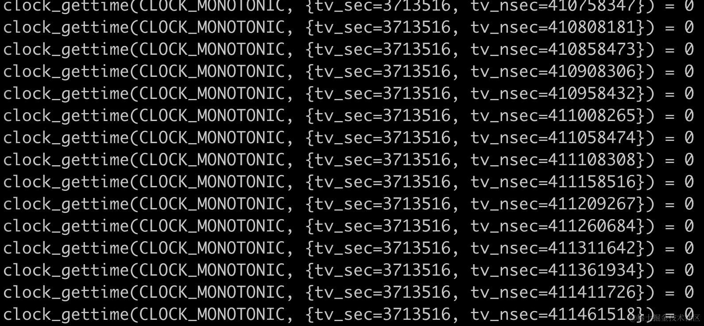
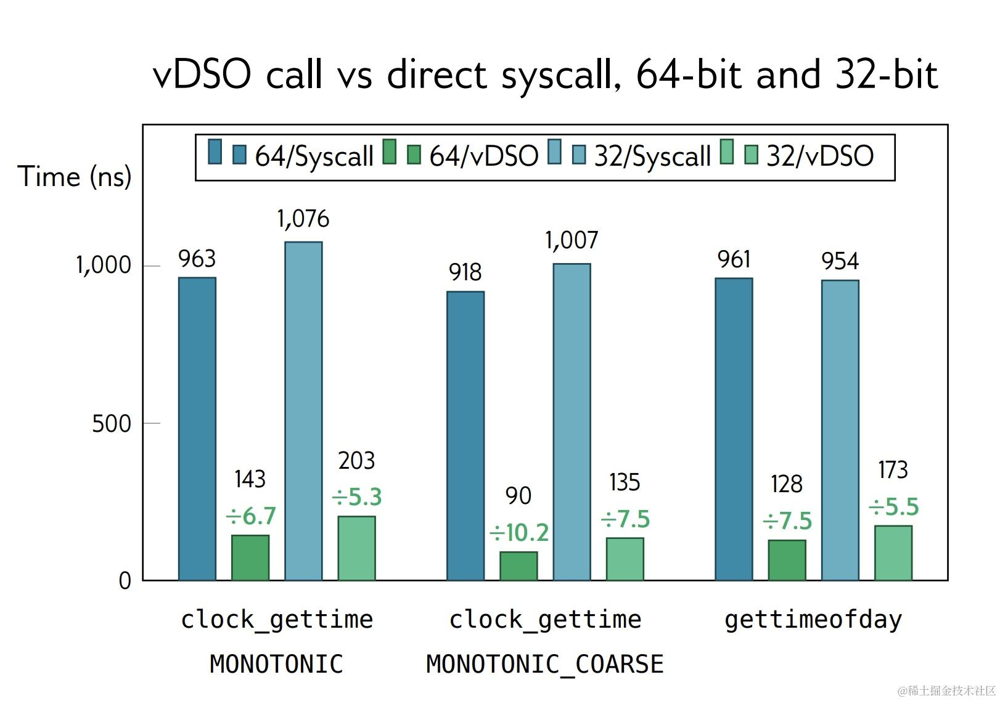
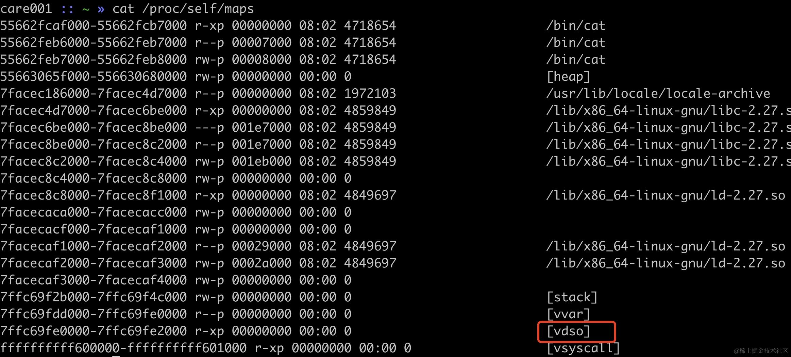

之前遇到一个压测的性能问题，同一个程序在测试环境和线上环境性能差异非常明显，在线上环境性能表现正常，在测试环境标准糟糕。通过对比分析 strace，性能糟糕的测试环境出现了大量的 clock\_gettime 系统调用，在线上环境则一个都没有。



先来写一个最简单的 demo，把问题最小化。

```c
#include <stdio.h>
#include <time.h>


void test_clock(clockid_t clk_id) {
    struct timespec ts;
    clock_gettime(clk_id, &ts);
    printf("ts: %ld.%ld\n", ts.tv_sec, ts.tv_nsec);
}

int main() {
    test_clock(CLOCK_MONOTONIC);
    return 0;
}
```

在测试环境，执行上面的代码，会看到一次 clock\_gettime 系统调用。

```c
arch_prctl(ARCH_SET_FS, 0x7fa2bb504500) = 0
mprotect(0x7fa2bb2f7000, 16384, PROT_READ) = 0
mprotect(0x55da27264000, 4096, PROT_READ) = 0
mprotect(0x7fa2bb52a000, 4096, PROT_READ) = 0
munmap(0x7fa2bb505000, 147788)          = 0

// 注意下面这行
clock_gettime(CLOCK_MONOTONIC, {tv_sec=3718291, tv_nsec=861670636}) = 0

fstat(1, {st_mode=S_IFCHR|0620, st_rdev=makedev(136, 2), ...}) = 0
brk(NULL)                               = 0x55da27389000
brk(0x55da273aa000)                     = 0x55da273aa000
write(1, "ts: 3718291.861670636\n", 22ts: 3718291.861670636
) = 22
```

在线上环境，看不到 clock\_gettime 系统调用。

```powershell
arch_prctl(ARCH_SET_FS, 0x7f6502b6a500) = 0
mprotect(0x7f650295d000, 16384, PROT_READ) = 0
mprotect(0x563430661000, 4096, PROT_READ) = 0
mprotect(0x7f6502b90000, 4096, PROT_READ) = 0
munmap(0x7f6502b6b000, 147788)          = 0
fstat(1, {st_mode=S_IFCHR|0620, st_rdev=makedev(136, 2), ...}) = 0
brk(NULL)                               = 0x563431a7a000
brk(0x563431a9b000)                     = 0x563431a9b000
write(1, "ts: 3718229.622093740\n", 22ts: 3718229.622093740
) = 22
exit_group(0)                           = ?
```


## clock\_gettime 系统调用

下面我们就来对这个问题做详细的分析。

先来看看 `clock_gettime` 系统调用，clock\_gettime 是 Linux 提供的一个系统调用，用来获取当前的时间。我们在统计代码的执行耗时的时候，经常会用一个 start 记录当前时间，用 end 记录记录结束时间，底层就是调用的 clock\_gettime 来实现的。它的函数原型如下：

```c
#include <time.h>

int clock_gettime(clockid_t clk_id, struct timespec *tp);

struct timespec {
        time_t   tv_sec;        /* seconds */
        long     tv_nsec;       /* nanoseconds */
};
```


其中 clk\_id 用来指定获取时间的时钟 ID，常用的时钟 ID 如下：

*   CLOCK\_REALTIME：系统实时时间，从系统启动时开始计算。
*   CLOCK\_MONOTONIC：单调时钟，提供从系统启动开始就**不断递增**的时间值，非常适合用于测量时间间隔。
*   CLOCK\_MONOTONIC\_COARSE：与 CLOCK\_MONOTONIC 类似，精度不高但效率更高。

经过查看，我们代码中用的是 `CLOCK_MONOTONIC` 这个时钟 ID，那现在就有几个问题我们需要理解清楚。

*   为什么在线上环境通过 strace 看不到 `clock_gettime` 系统调用？
*   为什么线上环境和测试环境有差异？

这就要提到跟系统调用息息相关的 `vdso`。


## 系统调用与 vDSO

我们都知道，系统调用的开销是很大的，涉及到上下文切换、高速缓存被刷新等。为了优化系统调用，内核开发者提供了 vDSO（全名：Virtual Dynamic Shared Object）技术，将小部分系统调用映射到用户空间来处理，而无需陷入内核态。

在我的机器上这一小部分是：

```c
__vdso_clock_gettime
__vdso_gettimeofday
__vdso_getcpu
__vdso_time
__vdso_clock_getres
```

文末会介绍如何查看自己机器支持的 vdso 函数列表。

有很多前辈已经做过使用 vDSO 与直接系统调用的性能对比，下图数据出自： <https://blog.linuxplumbersconf.org/2016/ocw/system/presentations/3711/original/LPC_vDSO.pdf> 。



接下来我们来看看 vDSO 的底层实现原理。在 Linux 内核初始化时，会将 vDSO 的代码部分和数据部分映射到内核空间。当进程启动时，内核会将 vDSO 映射到该进程的用户空间地址。

可以通过 ldd 来查看可执行文件所依赖的动态库：


可以看到，除了 vdso.so，其它的动态链接库都有对应的 so 路径，这是符合预期的，因为 vDSO 是虚拟出来动态映射到用户进程内存空间的。通过 `/proc/{pid}/maps` 可以查看。



那为什么 clock\_gettime 在 vDSO 中却没有直接在用户态返回，而是还是执行了系统调用呢？

这就需要去看源码了：

```c
int __vdso_clock_gettime(clockid_t clock, struct timespec *ts)
{
	switch (clock) {
	case CLOCK_REALTIME:
		if (do_realtime(ts) == VCLOCK_NONE)
			goto fallback;
		break;

	// 我们在这里
	case CLOCK_MONOTONIC: 
		if (do_monotonic(ts) == VCLOCK_NONE)
			goto fallback;
		break;
	case CLOCK_REALTIME_COARSE:
		do_realtime_coarse(ts);
		break;
	case CLOCK_MONOTONIC_COARSE:
		do_monotonic_coarse(ts);
		break;
	default:
		goto fallback;
	}

	return 0;
fallback:
	return vdso_fallback_gettime(clock, ts);
}
```

可以看到，CLOCK\_MONOTONIC 时钟 ID 会调用 `do_monotonic` 函数，如果返回`VCLOCK_NONE`，说明无法在`vDSO`中获取时间，则跳转到 fallback 分支。

fallback 分支就是一段汇编去执行系统调用 clock\_gettime：

```c
static long vdso_fallback_gettime(long clock, struct timespec *ts)
{
	long ret;
	asm ("syscall" : "=a" (ret), "=m" (*ts) :
	     "0" (__NR_clock_gettime), "D" (clock), "S" (ts) :
	     "memory", "rcx", "r11");
	return ret;
}
```

很明显，我们的测试环境就是走到了 fallback 流程，导致每次都调用了系统调用。

那一定是 `do_monotonic` 返回了 `VCLOCK_NONE`，在 `arch/x86/include/asm/clocksource.h` 定义了 vclock\_mode，可以看到 VCLOCK\_NONE = 0 表示不支持 vDSO 时钟模式。

```c
#define VCLOCK_NONE	0	/* No vDSO clock available.		*/
#define VCLOCK_TSC	1	/* vDSO should use vread_tsc.		*/
#define VCLOCK_PVCLOCK	2	/* vDSO should use vread_pvclock.	*/
#define VCLOCK_HVCLOCK	3	/* vDSO should use vread_hvclock.	*/
#define VCLOCK_MAX	3

```

我们继续看 do\_monotonic 函数是如何返回 mode 的，它的逻辑就是读取 vclock\_mode 字段。

```c
static int do_monotonic(struct timespec *ts)
{
	unsigned long seq;
	u64 ns;
	int mode;

	do {
		seq = gtod_read_begin(gtod);
		// 获取时钟源的 vclock_mode
		mode = gtod->vclock_mode; 		//		...
	} while (unlikely(gtod_read_retry(gtod, seq)));

	return mode;
}
```

通过阅读源码可以知道，linux 定义了很多时钟源，比如最常见和默认的 tsc，它的 vclock\_mode 为 `VCLOCK_TSC`：

```c
static struct clocksource clocksource_tsc = {
	.name                   = "tsc",
	.rating                 = 300,
	.read                   = read_tsc,
	.mask                   = CLOCKSOURCE_MASK(64),
	.flags                  = CLOCK_SOURCE_IS_CONTINUOUS |
				  CLOCK_SOURCE_VALID_FOR_HRES |
				  CLOCK_SOURCE_MUST_VERIFY,
	//注意这里的 vclock_mode
	.archdata               = { .vclock_mode = VCLOCK_TSC },
	.resume			= tsc_resume,
	.mark_unstable		= tsc_cs_mark_unstable,
	.tick_stable		= tsc_cs_tick_stable,
	.list			= LIST_HEAD_INIT(clocksource_tsc.list),
};
```

我们来对比一下测试和线上的时钟源，发现测试环境用的居然是 hpet 时钟源，线上的则是 tsc。

```powershell
// 测试环境
$ cat /sys/devices/system/clocksource/clocksource0/current_clocksource
hpet

// 线上环境
$ cat /sys/devices/system/clocksource/clocksource0/current_clocksource
tsc
```

而 hpet 时钟源却没有设置 vclock\_mode，默认值为 0 也就是 VCLOCK\_NONE。

```c
static struct clocksource clocksource_hpet = {
	.name		= "hpet",
	.rating		= 250,
	.read		= read_hpet,
	.mask		= CLOCKSOURCE_MASK(64),
	.flags		= CLOCK_SOURCE_IS_CONTINUOUS,
};
```

这下就真相大白了，因为测试环境不知为何原因时钟源被设置为了 hpet，这个时钟源在 CLOCK\_MONOTONIC 时钟 ID 的情况下会 fallback 到默认的系统调用，导致大量的系统调用的出现。


## 为什么使用 vDSO 性能那么好

为了弄清楚这个问题，我们来看看，vDSO 对应的 .so 里面到底是个啥。首先我们需要先关掉地址随机化：

```powershell
sysctl -w kernel.randomize_va_space=0
```

然后随便找一个常驻进程，比如 top，然后查看它的内存布局：

```powershell

$ cat /proc/30891/maps

7ffff7fc9000-7ffff7fd2000 rw-p 00000000 00:00 0
7ffff7ff7000-7ffff7ffa000 r--p 00000000 00:00 0                          [vvar]
7ffff7ffa000-7ffff7ffc000 r-xp 00000000 00:00 0                          [vdso]
7ffff7ffc000-7ffff7ffd000 r--p 00029000 08:02 4849697                    /lib/x86_64-linux-gnu/ld-2.27.so
7ffff7ffd000-7ffff7ffe000 rw-p 0002a000 08:02 4849697                    /lib/x86_64-linux-gnu/ld-2.27.so
```

可以看到 vdso 映射在起始地址为 7ffff7ffa000，长度为 8k 的内存区域中。我们使用 dd 来把内存 dump 出来。

```powershell
$ dd if=/proc/30891/mem of=./vdso_dump.so skip=140737354113024  bs=1 count=8192
```

使用 file 命令查看这个文件，可以看到这个是一个动态链接库。

```powershell
vdso_dump.so: ELF 64-bit LSB shared object, x86-64, version 1 (SYSV), dynamically linked, BuildID[sha1]=894e501654e58c6b801f54b3d1df3111efb2978a, stripped
```

然后使用 readelf 查看这个 so 文件的符号表，可以看到这个 vdso 支持的函数列表。

```powershell
$ readelf -Ws  ./vdso_dump.so                                                                                     130 ↵

Symbol table '.dynsym' contains 10 entries:
   Num:    Value          Size Type    Bind   Vis      Ndx Name
     0: 0000000000000000     0 NOTYPE  LOCAL  DEFAULT  UND
     1: 0000000000000a30   773 FUNC    WEAK   DEFAULT   12 clock_gettime@@LINUX_2.6
     2: 0000000000000d40   450 FUNC    GLOBAL DEFAULT   12 __vdso_gettimeofday@@LINUX_2.6
     3: 0000000000000d40   450 FUNC    WEAK   DEFAULT   12 gettimeofday@@LINUX_2.6
     4: 0000000000000f10    21 FUNC    GLOBAL DEFAULT   12 __vdso_time@@LINUX_2.6
     5: 0000000000000f10    21 FUNC    WEAK   DEFAULT   12 time@@LINUX_2.6
     6: 0000000000000a30   773 FUNC    GLOBAL DEFAULT   12 __vdso_clock_gettime@@LINUX_2.6
     7: 0000000000000000     0 OBJECT  GLOBAL DEFAULT  ABS LINUX_2.6
     8: 0000000000000f30    42 FUNC    GLOBAL DEFAULT   12 __vdso_getcpu@@LINUX_2.6
     9: 0000000000000f30    42 FUNC    WEAK   DEFAULT   12 getcpu@@LINUX_2.6
```

里面就可以看到熟悉的 \_\_vdso\_clock\_gettime 函数。

接下来就可以使用 objdump 来查看这几个 vDSO 函数的汇编代码，因为 clock\_gettime 函数需要处理参数，根据 clockid 做不同的处理，较为复杂，我们这里的目的也不是为了弄清楚具体的汇编原理，而是理解 vDSO 为什么可以不走系统调用就可以内核态的数据。我们挑其中最简单的 `__vdso_time` 函数的汇编来看，为什么 vDSO 可以不用系统调用就可以拿到系统的时间。

```c
#include <time.h>
time_t time(time_t * tloc);
```

对应的 vdso\_time 汇编代码如下：

```powershell
0000000000000f10 <__vdso_time@@LINUX_2.6>:
 f10:	55                   	push   %rbp
 f11:	48 85 ff             	test   %rdi,%rdi
 f14:	48 8b 05 8d c1 ff ff 	mov    -0x3e73(%rip),%rax        # ffffffffffffd0a8 <__vdso_getcpu@@LINUX_2.6+0xffffffffffffc178>
 f1b:	48 89 e5             	mov    %rsp,%rbp
 f1e:	74 03                	je     f23 <__vdso_time@@LINUX_2.6+0x13>
 f20:	48 89 07             	mov    %rax,(%rdi)
 f23:	5d                   	pop    %rbp
 f24:	c3                   	retq
```


如果只保留核心的逻辑，就是从 `0xffffffffffffd0a8` 处读取内容，让如 RAX 寄存器，然后 RAX 作为函数返回值退出。

本质来说就是 linux 内核把当前的系统时间映射到了 `-0x3e73(%rip)` 这个地址处。

我们甚至可以写一个代码自己去读这个地址。

这里的地址可以这么计算，这块 so 内存地址的首地址 addr\_base `0x7ffff7ffa000`，
RIP 寄存器总是指向当前执行指令的下一条指令（mov %rsp,%rbp）的地址（也就是 addr\_base + 0xf1b），-0x3e73(%rip) 的值就是

```powershell
0x7ffff7ffa000 + 0xf1b - 0x3e73 = 0x7ffff7ff70a8
```

拿到这个值我们就可以在代码中直接去读取了。下面是一个简单的示例，通过两种方式去拿时间，一种是通过地址直接去读取，一种是通过 time 函数去获取。

```c
#include <time.h>
#include <stdio.h>

int main(int argc, char *argv[]) {
    unsigned long *p = (unsigned long *) 0x7ffff7ff70a8;
    time_t t = time(0);
    printf("time by func: %ld\n", t);
    printf("time by addr: %lu\n", *p);
}
```

编译运行上面的代码：

```powershell
$ ./a.out
time by func: 1712029080
time by addr: 1712029080
```

可以看到两种方式获取到的时间是一样的。这下我相信你应该清楚了，在这个场景下， vDSO 的本质其实就是内核把本该你用 syscall 去获取的时间，直接映射到了用户内存空间的某个地方，用户程序直接去读这个地址值就可以了，在高频调用的场景下，这种优化效果是非常明显的。

## CLOCK\_MONOTONIC 对比 CLOCK\_MONOTONIC\_COARSE

前面我们提到 CLOCK\_MONOTONIC\_COARSE 是一个精度比 CLOCK\_MONOTONIC 低，但性能更好的单调时钟 ID，下面来实际对比一下。

```c
#include <stdio.h>
#include <time.h>


void test_clock(clockid_t clk_id) {
    struct timespec ts;
    clock_gettime(clk_id, &ts);
    printf("ts: %ld.%ld\n", ts.tv_sec, ts.tv_nsec);
}

int main() {
    test_clock(CLOCK_MONOTONIC);
    test_clock(CLOCK_MONOTONIC_COARSE);
    return 0;
}
```

编译运行，用 strace 查看，在 tsc 时钟源下，这两个都没有走系统调用，直接 vDSO 就返回了，性能上差异比较小。我实际用 benchmark 测试过，CLOCK\_MONOTONIC\_COARSE 略快一点点。


但是如果这个时候改为 hpet 时钟，差异就很明显了。

```powershell
sudo sh -c "echo hpet > /sys/devices/system/clocksource/clocksource0/current_clocksource"
```

strace 查看，可以看到 hpet 时钟下，CLOCK\_MONOTONIC 走了 syscall，而 CLOCK\_MONOTONIC\_COARSE 没有走 syscall，这个时候再来对比性能。


可以看到此时 CLOCK\_MONOTONIC 因为走了 syscall，比之前慢了 180 倍。


## 小结

在时间的获取上，我们需要特别关注系统及其当前的时钟，使用的时钟 ID（CLOCK\_MONOTONIC VS CLOCK\_MONOTONIC\_COARSE），去甄别到底有没有走 vDSO，如果没有走 vDSO，那么在高频调用的场景下，可能会有严重的性能损失。
