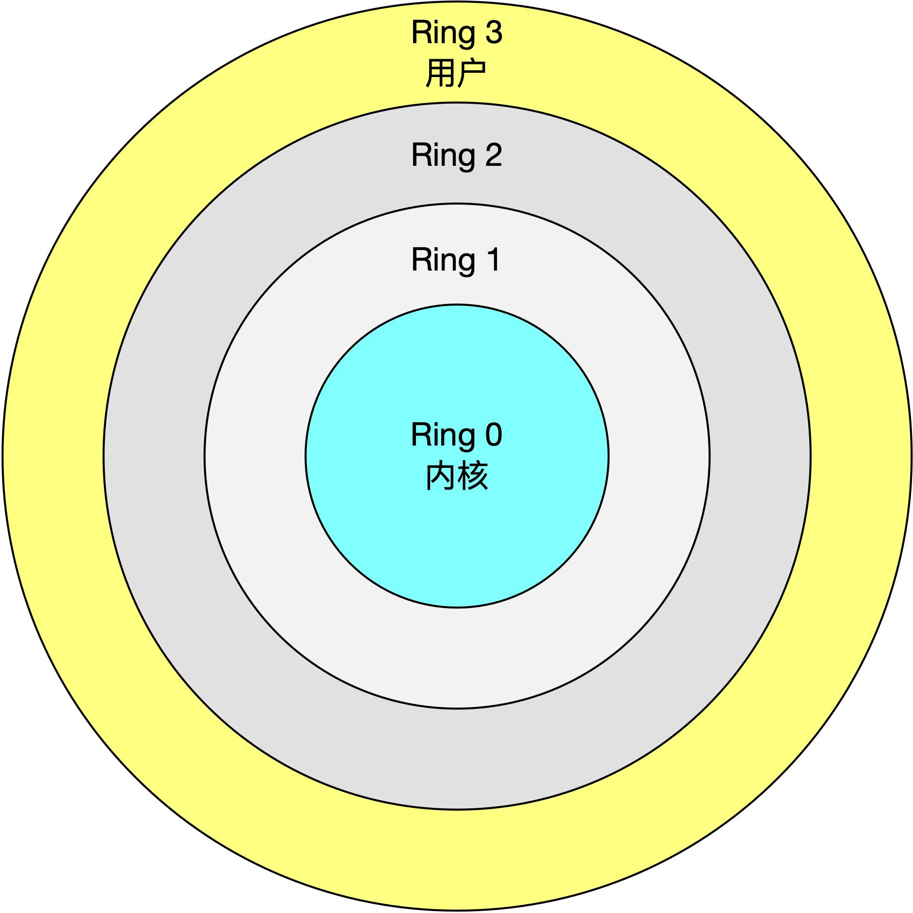
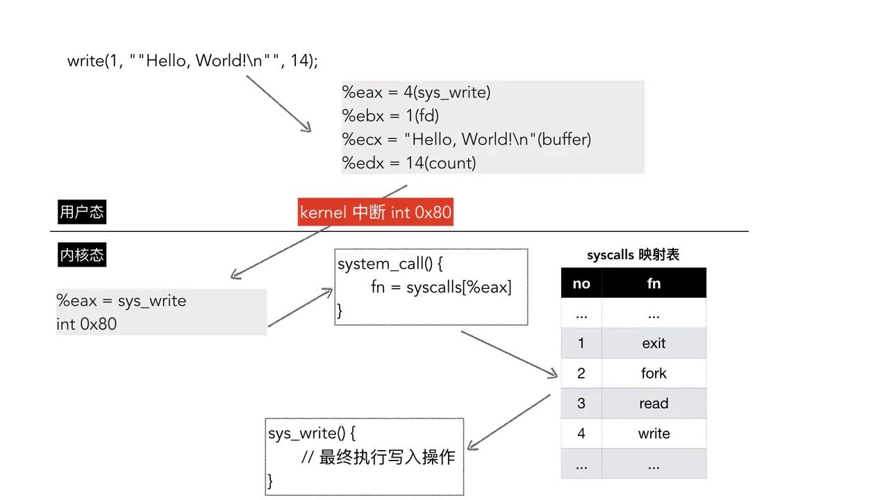

## 系统调用是什么

在 Linux 中，按照特权等级，进程的运行空间被划分为了用户空间和内核空间，引入了保护环（Protection Ring）的概念，根据执行的权限等级，通常分为 Ring 0-3 四个级别，如下所示：



内核空间运行在 Ring 0，具有最高的权限，可以访问所有的资源。用户空间运行在 Ring 3，不能直接访问内存等硬件资源。如果想要访问内核空间的资源，就需要通过系统调用（System Call）来实现。

比如应用程序读取一个磁盘文件、打印一行日志到终端、分配一块内存等都需要通过系统调用来完成。

在 Linux 上可以通过 strace 命令来跟踪进程执行的系统调用，比如 `cat /dev/null` 的 strace 结果如下所示：

```powershell
$ strace cat /dev/null

...
open("/dev/null", O_RDONLY)             = 3
fstat(3, {st_mode=S_IFCHR|0666, st_rdev=makedev(1, 3), ...}) = 0
fadvise64(3, 0, 0, POSIX_FADV_SEQUENTIAL) = 0
read(3, "", 65536)                      = 0
...
```

上面输出中 open、fstat、read 等都是 cat 命令执行过程中使用的系统调用。


## 传统系统调用：传说中的 int 0x80 指令

传统的 x86-32 平台预留了一个特殊的软中断号 128 (0x80)，通过执行一条中断指令 `int 0x80`，就可以使得用户空间的程序进入内核执行特定的系统调用。

这里的 int 是 interrupt（中断）的缩写，不是表示整数 integer，这个值是在 glibc 里的 `sysdeps/unix/sysv/linux/i386/sysdep.h` 定义的。

```c
# define ENTER_KERNEL int $0x80
```

`int 0x80` 指令解决了怎么触发系统调用的问题，除此之外还需要两个最基本的信息：

- 内核怎么知道要执行哪一个系统调用？
- 系统调用的参数怎么传值？

Linux 做了一个约定，使用 %EAX 寄存器存储系统调用编号，另外使用额外六个寄存器存储传入系统调用的参数，这几个寄存器是：

* %EBX arg1
* %ECX arg2
* %EDX arg3
* %ESI arg4
* %EDI arg5
* %EBP arg6


有了这些基础，我们来尝试用汇编实现一个程序，输出 "Hello, World!" 到终端。

为了搞清楚如何在终端中输出字符串，我们先来写一段 C 语言的实现：

```c
#include <stdio.h>

int main() {
    char *str = "Hello, World!\n";
    printf("%s", str);
}
```

这段代码非常好懂，那更接近底层一点的写法是：


更接近系统调用层的写法是：

```c
#include <unistd.h>

int main() {
    int stdout_fd = 1;
    char* str = "Hello, World!\n";
    int length =  14;
    write(stdout_fd, str, length);
}
```


Unix 的设计哲学，一切皆文件，一个程序运行以后都至少包含三个文件描述符（file descriptor，简称 fd）：

- 标准输入 stdin(0)
- 标准输出 stdout(1)
- 错误输出 stderr(2)

在终端执行程序输出字符串，实际上就是往标准输出 stdout 文件描述符写数据，stdout 的 fd 值等于 1。

write 是一个系统调用，把数据写入到文件，它的函数签名如下：

```c
ssize_t	 write(int fd, void * buffer, size_t count)
```

第一个参数 fd 表示要写入的文件描述符，第二个参数 buffer 表示要写入文件中数据的内存地址，第三个参数表示从 buffer 写入文件的数据字节数。因此，在标准输出中输出"Hello, World!\n"实际上是调用 write 系统调用，往 fd 为 1 的文件描述符写入 14 个字节的字符串。

编译并执行上面的 C 代码，就可以看到输出了 "Hello, World!" 字符串：

```powershell
gcc main.c -o main
./main 

Hello, World!
```

有了上面的基本概念，我们来看用汇编如何来实现。

```powershell
.section .data

msg:
    .ascii "Hello, World!\n"

.section .text
.globl _start

_start:
    movl $4,   %eax # write 系统调用的编号 4
    movl $1,   %ebx # write 的第 1 个参数 fd: 1
    movl $msg, %ecx # write 的第 2 个参数 buffer: "Hello, World!\n"
    movl $14,  %edx # write 的第 3个参数 count: 14
    int $0x80       # 执行系统调用: write(fd, buffer, count)

    movl $0,   %ebx # exit 的第一个参数 0
    movl $1,   %eax # exit 系统调用编号 1
    int $0x80       # 执行系统调用: exit(status)
```

在汇编中，任何以点（.）开头的都不会被直接翻译为机器指令，`.section` 将汇编代码划分为多个段，`.section .data`是数据段的开始，数据段中存储后面程序需要用到的数据，相当于一个全局变量。在数据段中，我们定义了一个 msg，ascii 编码表示的内容是 "Hello, World!\n"。

接下来的 `.section .text` 表示是文本段的开始，文本段是存放程序指令的地方。

接下来的指令是 `.globl _start`，这里并没有拼错，不是 global，`_start` 是一个标签。接下来是真正的汇编指令部分了。

前面介绍过，执行 write 系统调用时，`eax `寄存器存储 write 的系统调用号 4，`ebx`存储标准输出的 fd，`ecx`存储着输出 buffer 的地址。`edx` 存储字节数。所以看到 `_start`便签后有四个 movl 指令，movl 指令的格式是：

```
movl src dst
```

比如`movl $4, %eax`指令是将常量 4 存储到寄存器 `eax` 中，数字 4 前面的 $ 表示「立即寻址」，汇编的其它寻址方式这里先不展开，只需要知道立即寻址是本身就包含要访问的数据。

接下来指令是 `int $0x80`，这是一条中断触发指令，把执行流程交给内核继续处理，应用程序不用关心内核是如何处理的，内核处理完会把执行流程还给应用程序，同时根据执行成功与否设置全局变量 errno 的值。一般情况下，在 linux 上系统调用成功会返回非负值，发送错误时会返回负值。

接下来的指令实际上执行 exit(0) 退出程序，指令和逻辑与之前的一样，不再赘述。

下面来编译和执行上面的汇编代码。在 Linux 上，可以使用 as 和 ld 汇编和链接程序：

```powershell
as $helloworld.s -o helloworld.o
ld $helloworld.o -o helloworld

./helloworld
Hello, World!
```


通过这个例子，我们就非常清晰地看清楚了系统调用过程以及寄存器是如何传值的。详细的过程如下图所示：



内核使用一个 sys_call_table 数组来存储系统调用编号和实现函数之间的对应关系。

内核通过 %eax 寄存器获取系统调用编号，然后在这个数组中查找对应的处理函数，这里为 sys_write，通过其他寄存器存储的参数，就可以完成此次函数调用了。


## 快速系统调用

传统系统调用采用软中断的方式，效率不是很高，后面就推出了新的称为快速系统调用（Fast System Call）的方式，32 位系统和 64 位系统指令不太一样：

- 32 位：sysenter 和 sysexit。
- 64 位：syscall 和 sysret。

接下来的内容我们只介绍 64 位系统的指令。

上面的说明了触发系统调用使用什么指令，还需要弄清楚如何传值：

- 系统调用编号的存储使用 %rax 寄存器；
- 使用 %rdi、%rsi、%rdx、%r10、%r8、%r9 寄存器存储系统调用的参数。

同前面一样，我们还是以输出 "Hello, World!" 字符串到终端为例，汇编的代码如下：

```powershell
.section .data

msg:
    .ascii "Hello, World!\n"

.section .text
.globl _start

_start:
    movq $1,   %rax # write 系统调用本身的数字标识：1
    movq $1,   %rdi # write 的第 1 个参数 fd: 1
    movq $msg, %rsi # write 的第 2 个参数 buffer: "Hello, World!\n"
    movq $14,  %rdx # write 的第 3个参数 count: 14
    syscall         # 执行系统调用: write(fd, buffer, count)

    movq $0,   %rdi # status: 0
    movq $60,  %rax # 函数: exit
    syscall         # 执行系统调用: exit(status)
```

编译运行上面的程序：

```powershell
as helloworld_v2.s -o helloworld_v2.o
ld helloworld_v2.o -o helloworld_v2

./helloworld
Hello, World!
```

需要注意的是 64 位与 32 位系统的系统的系统编号值是不一样的，64 位系统 write 系统调用的变化是 1，在 32 为系统上这个值为 4。


## 使用 GDB 来探究系统调用

mmap 系统调用有六个参数，我们就拿 mmap 系统调用来验证寄存器与传值。测试代码如下：

```c
#include <stdio.h>
#include <fcntl.h>
#include <stdlib.h>
#include <fcntl.h>
#include <sys/mman.h>

int main() {
    struct stat file_stat;
    int src_fd = open("/home/ya/watch.sh", O_RDONLY);
    fstat(src_fd, &file_stat);
    int file_len = file_stat.st_size;
    char *src = mmap(NULL, file_len, PROT_READ, MAP_PRIVATE, src_fd, 0);
    printf("%p\n", src);
    return 0;
}
```

编译这个程序，然后使用 gdb 调试运行：

```powershell
$ gcc -g syscall_test.c  
$ gdb a.out
```

先断点到 12 行，也就是 mmap 之前，然后运行到断点处。

```powershell
(gdb) b 12
Breakpoint 1 at 0x40064f: file syscall_test.c, line 12
(gdb) r
Starting program: /home/ya/dev/linux_study/process/syscall/a.out

Breakpoint 1, main () at syscall_test.c:12
12	    char *src = mmap(NULL, file_len, PROT_READ, MAP_PRIVATE, src_fd, 0);
```

然后断点到 glibc 的 __mmap 方法上，然后输出 c，执行到断点处。

```powershell
(gdb) b __mmap
Breakpoint 2 at 0x7ffff7b05d10: __mmap. (2 locations)

(gdb) c
Continuing.

Breakpoint 2, __mmap (addr=0x0, len=11, prot=1, flags=2, fd=7, offset=0) at ../sysdeps/unix/sysv/linux/wordsize-64/mmap.c:32
```

在 gdb 中输入 disas 查看汇编代码，在当前汇编指令不远处出现了 syscall，这个就是真正执行系统调用的地方。

```powershell
Dump of assembler code for function __mmap:
=> 0x00007ffff7b05d10 <+0>:	push   %r15
   ...
   0x00007ffff7b05d31 <+33>:	mov    %r13,%r9
   0x00007ffff7b05d34 <+36>:	mov    %r14,%r8
   0x00007ffff7b05d37 <+39>:	movslq %r12d,%r10
   0x00007ffff7b05d3a <+42>:	mov    %r15,%rdx
   0x00007ffff7b05d3d <+45>:	mov    %rbp,%rsi
   0x00007ffff7b05d40 <+48>:	mov    %rbx,%rdi
   0x00007ffff7b05d43 <+51>:	mov    $0x9,%eax
   0x00007ffff7b05d48 <+56>:	syscall
   ...
```

然后断点到 syscall 汇编代码处，执行 c 运行到此次。

```powershell
(gdb) b *0x00007ffff7b05d48
(gdb) c
Continuing.
```

此时已经是执行系统调用前的最后一步了，可以使用 gdb 来查看各个寄存器的状态。

```powershell
(gdb) p $rax
$1 = 9
(gdb) p $rdi
$2 = 0
(gdb) p $rsi
$3 = 11
(gdb) p $rdx
$4 = 1
(gdb) p $r10
$5 = 2
(gdb) p $r8
$6 = 7
(gdb) p $r9
$7 = 0
```

mmap 系统调用对应的函数是 sys_mmap，它的函数签名如下：

```c
long sys_mmap(unsigned long addr, unsigned long len,
			unsigned long prot, unsigned long flags,
			unsigned long fd, off_t pgoff);
```

其中 rax 寄存器的值为 mmap 系统调用的编号 9。

rdi 是第一个参数 addr，这里为 0，也就是 NULL。rsi 是第二个参数 len，这里值为 11，表示文件真实的大小 11 字节。

rdx 是第三个参数 prot，这里为 1，表示 PROT_READ(0x1)，它在内核中的定义如下：

```c
#define PROT_READ	0x1		/* page can be read */
#define PROT_WRITE	0x2		/* page can be written */
#define PROT_EXEC	0x4		/* page can be executed */
```

r10 是第四个参数 flags，这里为 2，表示 MAP_PRIVATE(0x02)，它在内核中的定义如下：

```c
#define MAP_SHARED	0x01		/* Share changes */
#define MAP_PRIVATE	0x02		/* Changes are private */
#define MAP_TYPE	0x0f		/* Mask for type of mapping */
#define MAP_FIXED	0x10		/* Interpret addr exactly */
```

r8 是第五个参数 fd，这里为 7，表示 `/home/ya/watch.sh` 文件的文件句柄，可以通过 `/proc/<pid>/fd` 来进行确认。

```powershell
$ ls -l /proc/11835/fd

lrwx------. 1 ya ya 64 Dec 11 07:15 0 -> /dev/pts/5
lrwx------. 1 ya ya 64 Dec 11 07:30 1 -> /dev/pts/5
lrwx------. 1 ya ya 64 Dec 11 07:30 2 -> /dev/pts/5
...
lr-x------. 1 ya ya 64 Dec 11 07:30 7 -> /home/ya/watch.sh
```

r9 是第六个参数 pgoff，这里的 offset 值为 0。

通过 gdb，我们就再次验证了 syscall 系统调用的调用方式。


## 一些问题


### 只是用 6 个寄存器传值，会不会有超过 6 个参数的情况？

不存在这个问题，目前已有的系统调用最多也只有 6 个参数，反正 linux 自己定规则，大家必须遵守。

### 系统调用涉及 CPU 上下文切换吗？

答案是肯定的，一次系统调用的过程，会发生了两次 CPU 上下文切换。一次是保存用户态的线程（寄存器、程序计数器），然后执行内核空间代码。系统调用结束后还需要恢复用户态现场，切换回用户空间代码处继续执行。 


