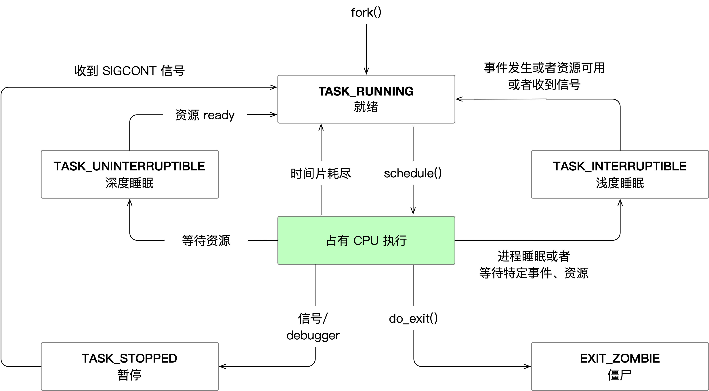
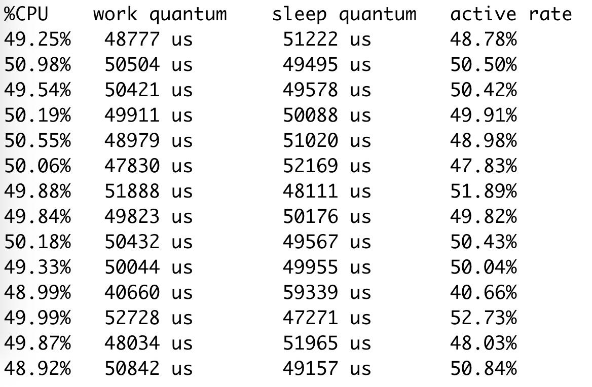
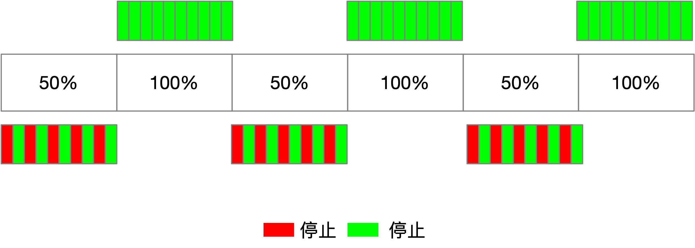
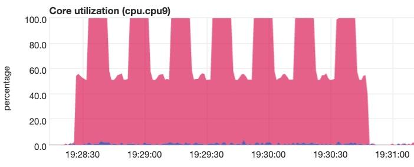

## 进程状态一览

在 task_struct 结构体里，有一个 state 变量，标识了进程的状态值，完整的状态值见内核源码 `include/linux/sched.h` 头文件。

常见的有下面这些状态：

- TASK_RUNNING
- TASK_INTERRUPTIBLE
- TASK_UNINTERRUPTIBLE
- TASK_STOPPED
- TASK_TRACED
- EXIT_ZOMBIE
- EXIT_DEAD

进程状态和切换如下图所示：




使用 ps 命令可以查看进程的状态：

```powershell
$ ps -e -o pid,state,command

  PID S COMMAND
27102 S sshd: ya [priv]
27222 S sshd: ya@pts/1 
```

ps 输出中对应的状态如下：

* D    uninterruptible sleep (usually IO)
* R    running or runnable (on run queue)
* S    interruptible sleep (waiting for an event to complete)
* T    stopped by job control signal
* t    stopped by debugger during the tracing
* W    paging (not valid since the 2.6.xx kernel)
* X    dead (should never be seen)
* Z    defunct ("zombie") process, terminated but not reaped by its parent

ps 命令默认显示的是进程中主线程的状态，如果想要查看所有线程的状态，可以加上 `-T` 参数。

使用 top 命令也可以查看进程的状态，同 ps 一样，也是对应 S 列。top 命令默认显示的是进程中主线程的状态，如果想要查看所有线程的状态，可以加上 `-H` 参数。


接下来我们来看看详细看看这几个状态。


### TASK_RUNNING 状态

TASK_RUNNING 并不意味着进程已经分配了 CPU 资源正在运行，而是指进程处于可运行状态。处于这个状态的进程有可能获得了 CPU 时间片正在执行，也有可能没有获得时间片在就绪队列中等待分配时间片。

比如，我们执行一个跑满 CPU 的单线程程序：

```powershell
$ sha256sum /dev/zero
```

使用 ps 查看进程的状态如下：

```powershell
$ ps -T -e -o pid,state,command
  PID S COMMAND
 1549 R sha256sum /dev/zero
```

S 那一列是 "R"，表示进程处于 TASK_RUNNING 状态。


### TASK_INTERRUPTIBLE 状态

TASK_INTERRUPTIBLE 指的是可中断的睡眠状态，比如等定时器、等锁、网络 IO 等都是属于 TASK_INTERRUPTIBLE 状态，启动 sleep 命令：

```powershell
$ sleep 1000
```

然后查看进程状态：

```powershell
$ ps -T -e -o pid,state,command

  PID S COMMAND
 1744 S sleep 1000
```

S 那一列是 "S"，表示进程处于 TASK_INTERRUPTIBLE 状态。


### TASK_UNINTERRUPTIBLE 状态

这个状态又被称为 D 状态，表示不可中断的睡眠状态，与 TASK_INTERRUPTIBLE 不同的是，这是一种深度睡眠状态，不能被信号唤醒，连 `kill -9` 也不行。后面有一个小节专门介绍，这里先不展开。


### TASK_STOPPED 状态

当一个程序在终端中前台执行时，按下 Ctrl+Z 可以挂起作业，比如我们在终端中执行 sleep 10000 命令，然后输入 Ctrl+Z，终端中会打印出被停止的命令。

```powershell
$ sleep 10000

^Z
[1]  + 25729 suspended  sleep 10000
```

按下 Ctrl+Z 实际上是发送了 SIGSTOP 信号给 sleep 进程，使其进入了 TASK_STOPPED 状态，top 命令的输出如下：

```powershell

  PID USER      PR  NI    VIRT    RES    SHR S  %CPU %MEM     TIME+ COMMAND
25729 ya        20   0  107956    628    528 T   0.0  0.0   0:00.00 sleep
```

此时的 S 列显示的是 "T"，表示进程处于 TASK_STOPPED 状态，而且是因为 job control 信号导致进入了 TASK_STOPPED 状态。

同样我们可以用 systemtap 来验证这一说法，在内核函数 do_signal_stop 插入探针。

```c
probe kernel.function("do_signal_stop@kernel/signal.c").call {
       printf ("enter do_signal_stop, process name: %s\n",execname())
       print_backtrace()
}
```

重新运行 sleep 10000 ，然后按下 Ctrl + Z，此时 systemtap 的输出如下所示：

```powershell
$ sudo stap process_state.stp
                            
enter do_signal_stop, process name: sleep
 0xffffffff8109cc30 : do_signal_stop+0x0/0x270 [kernel]
 0xffffffff8102a467 : do_signal+0x57/0x6c0 [kernel]
 0xffffffff8102ab2f : do_notify_resume+0x5f/0xb0 [kernel]
 0xffffffff816b527d : int_signal+0x12/0x17 [kernel]
```


挂起的程序可以使用 fg 命令在前台恢复执行或使用 bg 命令在后台恢复执行。这两种方式实际上是发送 SIGCONT 信号来恢复被停止的作业。


```powershell
$ fg

[1]  + 25729 continued  sleep 1000
```

#### cpulimit 实现原理

cpulimit 工具利用 SIGSTOP、SIGCONT 两个信号实现控制 CPU 的使用率，它的原理是给进程设置一个 CPU 占用上限，并检测进程是否超过这个阈值，如果超过了则发送 SIGSTOP 信号给这个进程，让进程挂起一段时间。

接下来我们来跑一个单线程跑满 100% CPU 的程序，这里从 `/dev/zero` 不停地读取数据计算 sha256，如下所示：

```powershell
sha256sum /dev/zero
```

运行这行命令以后，CPU 占用率会跑到 100%。


接下来用 cpulimit 给进程设置 50% 的 CPU 占用率：

```powershell
cpulimit -l 50 -p 6482 -v
```
通过观察 top 命令可以看到，sha256sum 进程的状态也在不停的在 T 和 R
之间切换，top 命令输出中的 R 表示 running 状态，T 表示被作业控制信号信号停止状态。


cpulimit 命令输出的结果如下所示：




理解了这个原理，我们可以写一段脚本用 cpulimit 初略模拟一个 CPU 方波：

```powershell
pid=`pidof sha256sum`
while true;
do
	cpulimit -b -p $pid -l 50
	sleep 10
	kill -9 `pidof cpulimit`
	sleep 10
done
```

这段脚本的原理是使用 cpulimit 命令，让进程 10s 保持 50%，接下来的 10s 保持 100%，循环往复，如下图所示：




运行上面的脚本对应的 CPU 使用率曲线图如下所示：




### TASK_TRACED 状态

TASK_TRACED 本质上也是一种 STOP 状态，只是它是因为被调试程序所停止。比如我们用 gdb 启动 sleep：

```
$ gdb --args sleep 1000
(gdb) b main
Breakpoint 1 at 0x401510

(gdb) r
Starting program: /usr/bin/sleep 1000

Breakpoint 1, 0x0000000000401510 in main ()
```

使用 ps 查看进程状态如下：

```powershell
$ ps -T -e -o pid,state,command

  PID S COMMAND
 2738 t /usr/bin/sleep 1000
```

S 那一列是 "t"，表示进程处于 TASK_TRACED 状态。


### EXIT_ZOMBIE 状态

EXIT_ZOMBIE 表示僵尸状态的进程，僵尸进程是指进程实际上已经死亡，但是父进程还没调用 waitpid 回收它。下面是一段测试代码：


```c
#include <stdio.h>
#include <unistd.h>
int main() {
    pid_t pid;
    pid = fork();
    if (pid < 0) {
        printf("%s\n", "fork error");
    } else if (pid == 0) {
        printf("%s\n", "enter child process");
    } else {
        // enter parent process
        getchar();
    }
    return 0;
}
```

编译运行上面的代码，使用 ps 查看进程状态，子进程就变为了僵尸进程。

```powershell
$ ps -T -e -o pid,state,command | grep a.out
 5475 S ./a.out
 5476 Z [a.out] <defunct>
```

S 那一列是 "Z"，表示进程处于 EXIT_ZOMBIE 状态。

> 关于僵尸进程后面还有一个独立的小节介绍，这里先不展开。


### EXIT_DEAD 状态

EXIT_DEAD 状态的进程是只父进程已经发起了 waitpid 但进程还没有完全移除之前的状态，一般很难观测到。

