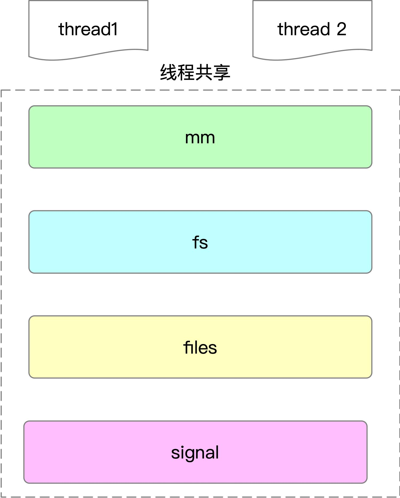
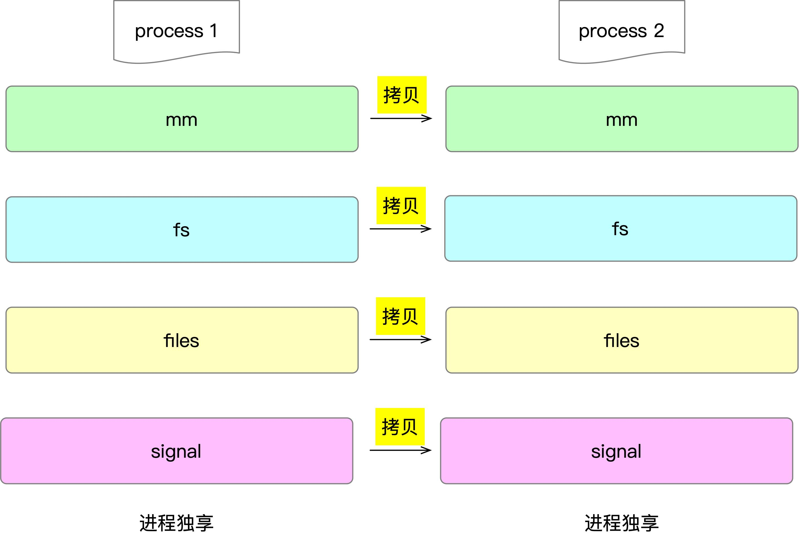
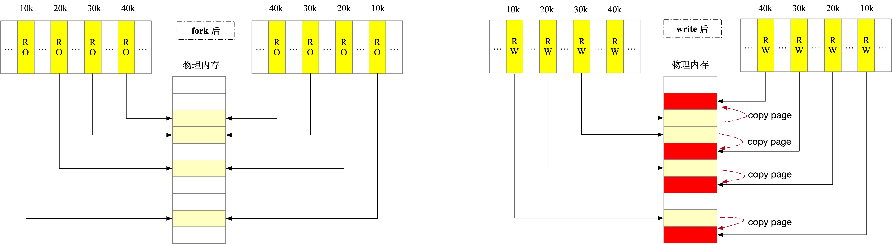
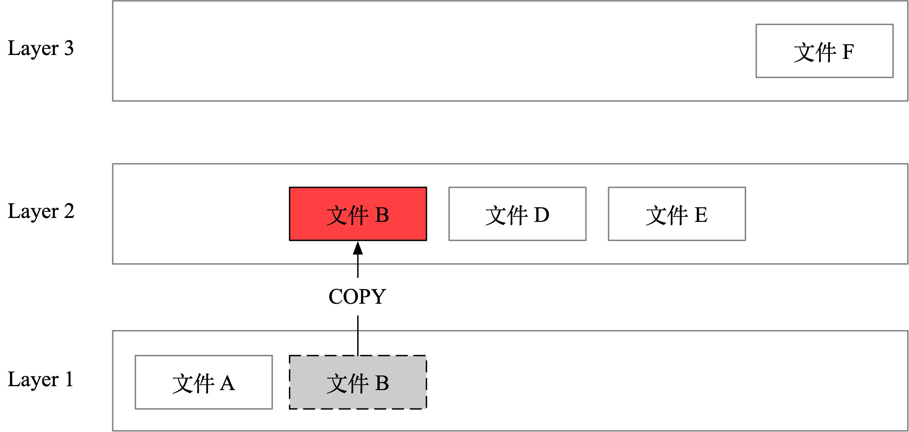

对于线程和进程，我们有一个概念：`进程是资源的封装单位，线程是调度单元`，那这句话到底是什么意思呢？前面介绍过进程和线程在内核中都是一个 task_struct，那这两者到底的区别和联系是什么？

## 系统调用 clone

在上层看来，进程和线程的区别确实有天壤之别，两者的创建、管理方式都非常不一样。在 linux 内核中，不管是进程还是线程都是使用同一个系统调用 clone，接下来我们先来看看 clone 的使用。为了表述的方便，接下来暂时用进程来表示进程和线程的概念。

clone 函数的函数签名如下：

```c
int clone(int (*fn)(void *),
          void *child_stack,
          int flags,
          void *arg, ...
          /* pid_t *ptid, struct user_desc *tls, pid_t *ctid */ );
```

参数释义如下：

- 第一个参数 fn 表示 clone 生成的子进程会调用 fn 指定的函数，参数由第四个参数 arg 指定。
- child_stack 表示生成的子进程的栈空间。
- flags 参数非常关键，正是这个参数区分了生成的子进程与父进程如何共享资源（内存、打开文件描述符等）。
- 剩下的参数，ptid、tls、ctid 与线程实现有关，这里先不展开。

接下来我们来看一个实际的例子，看看 flag 对新生成的「进程」行为的影响。


### clone 系统调用

接下来演示 CLONE_VM 参数对父子进程行为的影响，下面的程序当运行参数包含 "clone_vm" 时，给 clone 函数的 flags 会增加 CLONE_VM。代码如下：

```c
static int child_func(void *arg) {
    char *buf = (char *)arg;
    // 修改 buf 内容
    strcpy(buf, "hello from child");
    return 0;
}

const int STACK_SIZE = 256 * 1024;
int main(int argc, char **argv) {
    char *stack = malloc(STACK_SIZE);

    int clone_flags = 0;
    // 如果第一个参数是 clone_vm，则给 clone_flags 增加 CLONE_VM 标记
    if (argc > 1 && !strcmp(argv[1], "clone_vm")) {
        clone_flags |= CLONE_VM;
    }
    char buf[] = "msg from parent";
   
    if (clone(child_func, stack + STACK_SIZE, clone_flags, buf) == -1) {
        exit(1);
    }
    sleep(1);
    printf("in parent, buf:\"%s\"\n", buf);
    return 0;
}
```

上面的代码在 clone 调用时，将父进程的 buf 指针传递到 child 进程中，当不带任何参数时，CLONE_VM 标记没有被设置，表示不共享虚拟内存，父子进程的内存完全独立，子进程的内存是父进程内存的拷贝，子进程对 buf 内存的写入只是修改自己的内存副本，父进程看不到这一修改。

编译运行结果如下：

```powershell
$ ./clone_test

in parent, buf:"msg from parent"
```

可以看到 child 进程对 buf 的修改，父进程并没有生效。

再来看看运行时增加 clone_vm 参数时结果：

```powershell
$ ./clone_test clone_vm                                                                                                                             

in parent, buf:"hello from child"
```
可以看到这次 child 进程对 buf 修改，父进程生效了。当设置了 CLONE_VM 标记时，父子进程会共享内存，子进程对 buf 内存的修改也会直接影响到父进程。

讲这个例子是为后面介绍进程和线程的区别打下基础，接下来我们来看看进程和线程的本质区别是什么。


### 线程与 clone系统调用

接下来我们来看，当创建一个线程时，到底发生了什么。

```c
#include <pthread.h>
#include <unistd.h>
#include <stdio.h>

void *run(void *args) {
    sleep(10000);
}
int main() {
    pthread_t t1;
    pthread_create(&t1, NULL, run, NULL);
    pthread_join(t1, NULL);
    return 0;
}
```

使用 gcc 编译上面的代码：

```powershell
gcc -o thread_test thread_test.c -lpthread
```

然后使用 strace 执行 thread_test，系统调用如下所示：

```c
mmap(NULL, 8392704, PROT_READ|PROT_WRITE, MAP_PRIVATE|MAP_ANONYMOUS|MAP_STACK, -1, 0) = 0x7f93daf02000
// ...
clone(
    child_stack=0x7f93db701fb0, 
    flags=CLONE_VM|CLONE_FS|CLONE_FILES|CLONE_SIGHAND|CLONE_THREAD|CLONE_SYSVSEM|CLONE_SETTLS|CLONE_PARENT_SETTID|CLONE_CHILD_CLEARTID, // ...
) = 26063
```

比较重要的是下面这些 flags 参数：

| 标记          | 含义                     |
| ------------- | ------------------------ |
| CLONE_VM      | 共享虚拟内存             |
| CLONE_FS      | 共享与文件系统相关的属性 |
| CLONE_FILES   | 共享打开文件描述符表     |
| CLONE_SIGHAND | 共享对信号的处置         |
| CLONE_THREAD  | 置于父进程所属的线程组中 |


可以看到，线程创建的本质是共享进程的虚拟内存、文件系统属性、打开的文件列表、信号处理，以及将生成的线程加入父进程所属的线程组中，如下图所示：



接下来我们看看进程与 clone 之间的关系。


### 进程与 clone 系统调用

以下面的代码为例：

```c
pid_t gettid() {
    return syscall(__NR_gettid);
}
int main() {
    pid_t pid;
    pid = fork();
    if (pid == 0) {
        printf("in child,  pid: %d, tid:%d\n", getpid(), gettid());
    } else {
        printf("in parent, pid: %d, tid:%d\n", getpid(), gettid());
    }
    return 0;
}
```

使用 strace 运行输出结果如下：

```powershell
clone(child_stack=NULL, 
flags=CLONE_CHILD_CLEARTID|CLONE_CHILD_SETTID|SIGCHLD, 
child_tidptr=0x7f75b83b4a10) = 16274
```

可以看到 fork 创建进程对应 clone 使用的 flags 中唯一需要值得注意的 flag 是 SIGCHLD，当设置这个 flag 以后，子进程退出时，系统会给父进程发送 SIGCHLD 信号，让父进程使用 wait 等函数获取到子进程退出的原因。

可以看到 fork 调用中，父子进程没有共享内存、打开文件等资源，这样契合进程是资源的封装单位这个说法，资源独立是进程的显著特征。

我们多次强调，进程是资源的封装单位，父子进程作为不同的进程，他们对外表现出来的是数据段和堆栈是完全独立的，但是子进程又拥有和父进程一样的堆、栈、数据段，这就需要从父进程拷贝一份到子进程，如下图所示：




如果 fork 创建子进程需要复制父进程所有的数据，那代价是非常高的，fork 的一个典型的应用场景是 Redis 的 RDB 快照生成，比如一个有几百 G 的 Redis 服务，光拷贝这么多堆内存就需要耗费很多时间。

除此之外，很多场景中 fork 以后子进程马上会调用 exec，这会替换父进程的代码段，并重新初始化其数据段、堆栈空间，如果子进程完全拷贝了父进程的数据，就非常浪费了。


现代的 Unix 系统都是采用写时拷贝技术（copy-on-write，CoW）来解决这个问题。父进程和子进程共享同一份数据，直到其中一个对数据进行修改，就会进行分裂，执行真正的拷贝。

那这个技术是如何实现的？


## 写时复制在进程 fork 中的应用

内核会将父子进程中共享的区域标记为只读（RO），当有父子进程有一方写入时，会产生一个 Minor 缺页异常（pagefault），CPU 得知这个消息以后，会判断 pagefault 的真正原因，随后进行拷贝。


口说无凭，接下来我们来用实验证实确实发生了 pagefault。

有下面这一段简单的 C 语言代码：

```c
#include <unistd.h>
#include <stdio.h>
#include<string.h>

int main(int argc, char *argv[]) {
    int msg[1024 * 100] = {0};
    memset(msg, 0, sizeof(msg));

    int pid;
    pid = fork();

    if (pid == 0) {
        // 
        getchar();
        sleep(2);
        msg[1024 * 10] = 1;
        sleep(1);
        msg[1024 * 20] = 1;
        sleep(1);
        msg[1024 * 30] = 1;
        sleep(1);
        msg[1024 * 40] = 1;
        sleep(2);
        printf("adress msg[1024 * 10]: %-10lx\n", (unsigned long)(msg + 1024 * 10));
        printf("adress msg[1024 * 20]: %-10lx\n", (unsigned long)(msg + 1024 * 20));
        printf("adress msg[1024 * 30]: %-10lx\n", (unsigned long)(msg + 1024 * 30));
        printf("adress msg[1024 * 40]: %-10lx\n", (unsigned long)(msg + 1024 * 40));
        sleep(10000);
    } else {
        sleep(10000);
    }
}
```

这段程序在 fork 生成的子进程中，首先执行 getchar() 等待终端的输入，使我们有机会来得及获取父进程和子进程 pid 以便后续 systemtap 使用。接下来每个 1s 修改一次 msg 数组的值，然后在 systemtap 中观察 pagefault 的变化。

systemtap 的脚本如下所示：

```c
#! /usr/bin/env stap
global fault_begin_time_map // 记录 pagefault 发生的时间
global fault_address_map    // 记录 pagefault 发生的地址
global fault_access_map     // 记录 pagefault 是不是 write access

probe begin { printf("cow pagefault probe begin...\n") }

probe vm.pagefault {
  if (pid() == target() || ppid() == target()) {
      pid = pid() 
      fault_begin_time_map[pid] = gettimeofday_s()
      // address 表示发生 pagefault 时的地址
      fault_address_map[pid] = address 
      // write_access 表示这次 pagefault 是不是一次 write access, 1 表示 write，0 表示 read
      fault_access_map[pid] = write_access
  } 
} 
                
probe vm.pagefault.return {
  if(pid() == target() || ppid() == target()) { 
      pid = pid() 
      if (!(pid in fault_begin_time_map)) next 
      if (vm_fault_contains(fault_type, VM_FAULT_MINOR)) {
        fault_type_desc = "MINOR" 
      } else if (vm_fault_contains(fault_type, VM_FAULT_MAJOR)) {
        fault_type_desc = "MAJOR" 
      } else {
        next
      } 
      printf("[%s] pid:%d, address:%p access:%s, type:%s\n",
          ctime(fault_begin_time_map[pid]), // time
          pid,                              // pid
          fault_address_map[pid],           // address
          fault_access_map[pid] ? "w" : "r",// write、read access
          fault_type_desc                   // minor、major
      )
                                                                                                                  
      delete fault_begin_time_map[pid]
      delete fault_address_map[pid]
      delete fault_access_map[pid]
  }
}
```
对于上面的脚本，有几个点需要解释一下：

- stap 脚本执行时使用 `-x pid` 可以指定感兴趣的 pid，在脚本中可以用 target() 方法获取执行传入的 pid。
- systemtap 为 pagefault 实现了方便探针方法 vm.pagefault 和 vm.pagefault.return。在 `probe vm.pagefault` 方法中可以方便地获取 address、write_access 的值，在 `probe vm.pagefault.return` 可以获取 fault_type 的值。

详细的实验步骤如下：

1. 编译运行 cow.c，这时父进程会 fork 一个子进程，同时子进程处于阻塞等待 stdin 终端输入的状态，使用 ps 命令获取当前的子进程 pid。

2. 执行 systemtap 脚本：

```powershell
sudo stap -g cow_pagefault.stp -x child_pid
```

3. 在 cow 运行的终端输入enter，然后子进程开始对 msg 数组的 write 赋值。


这时 cow 程序输出的修改的四次地址如下所示：

```powershell
adress msg[1024 * 10]: 7ffe0cdefb40
adress msg[1024 * 20]: 7ffe0cdf9b40
adress msg[1024 * 30]: 7ffe0ce03b40
adress msg[1024 * 40]: 7ffe0ce0db40
```


systemtap 的输出如下所示，对比 address 可以知道刚好是这四次发生了四次 write 的 MINOR pagefault。

```powershell
...
[Sun May 10 11:35:00 2020] pid:12420, address:0x7ffe0cdefb40 access:w, type:MINOR
[Sun May 10 11:35:01 2020] pid:12420, address:0x7ffe0cdf9b40 access:w, type:MINOR
[Sun May 10 11:35:02 2020] pid:12420, address:0x7ffe0ce03b40 access:w, type:MINOR
[Sun May 10 11:35:03 2020] pid:12420, address:0x7ffe0ce0db40 access:w, type:MINOR
...
```

这个过程如下所示：



子进程和父进程任何一方执行一次修改，都会触发一次写时复制分裂。

Docker 中也使用了 COW 技术来处理镜像分层，如果某一层只是使用了下层的文件，没有修改，则 docker 不会拷贝文件到那一层，直接使用即可。如果某一层修改了下层的文件，docker 会首先从下层拷贝文件到上层，然后进行修改。

以下图为例：



Layer 1 包含 A、B 两个文件，Layer 2 修改了文件 B，则会将文件 B 赋值到 Layer 2，然后对其进行修改。这样做的好处是只有在文件有修改时，才执行真正的拷贝操作，在镜像构建时更加快速。

除了 docker 的这种使用方式，COW 在文件系统等领域也有不少的应用场景，比如大名鼎鼎的 Btrfs 文件系统就使用了 COW 技术来进行构建。

至此，我们就清楚了进程和线程的本质区别和联系是什么。

