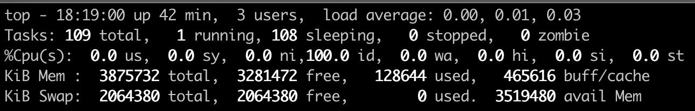
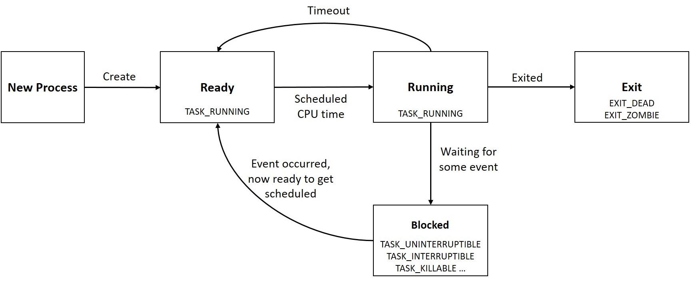
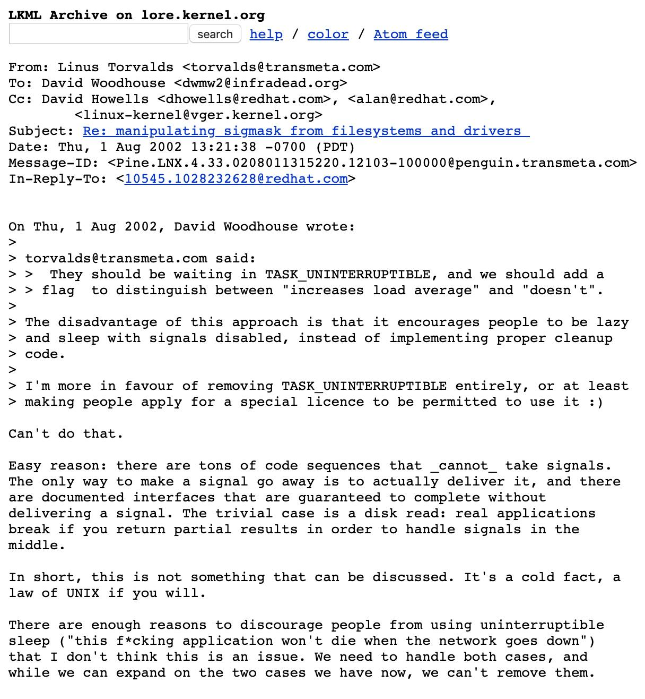
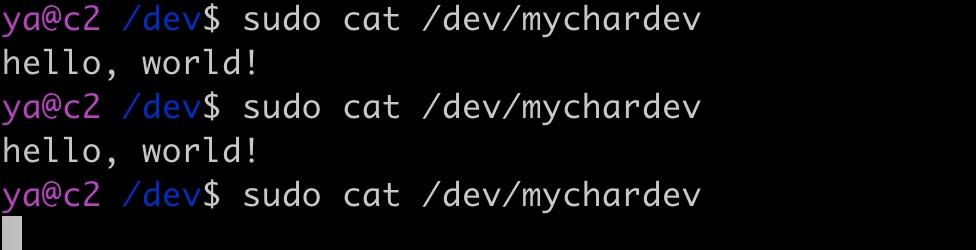
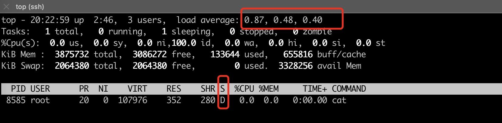
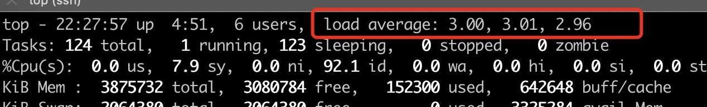

这篇文章聊聊 Linux 中 D 状态的进程与平均负载的关系，通过阅读本文，你会了解到这些东西。

- D 状态的进程是什么？
- 如何编写内核模块模拟 D 状态进程？
- Linus 对 D 状态进程的看法。
- 平均负载的概念。

在 top 和 uptime 命令输出中的第一行有一个 load average 字段，由三个数字表示，依次表示过去 1 分钟、5 分钟、15 分钟的平均负载（Load Average），如下图所示：



值得注意的是，平均负载并不是指 CPU 的负载，这也比较好理解，毕竟系统资源并不是只有 CPU 这一个。简单来看，平均负载是指单位时间内，系统处于`可运行状态`和`不可中断状态`的平均进程数，也就是平均活跃进程数。

> 实际的计算比较复杂，感兴趣的同学可以查看源码： https://github.com/torvalds/linux/blob/master/kernel/sched/loadavg.c 。

从直观的角度理解，如果平均负载为 2，在 4 核的机器上，表示有 50% 的 CPU 空闲；在 2 核的机器上，表示刚好没有 CPU 空闲，如果是单核的机器，那表明 CPU 竞争激烈，有一半的进程竞争不到 CPU。

进程运行的几种状态如下图所示：



当使用 fork() 等系统调用来创建一个新进程时，新进程的状态是 Ready 状态，在 linux 中，就绪态的进程也属于 `TASK_RUNNING` 状态，这个时候只是还没有拿到 CPU 的使用权。

图中 Ready 和 Running 状态的进程都属于「可运行状态」的进程，对应 top 命令中 R 标记。

处于 Running 状态的进程在等待某些事件或资源时会进入 Blocked 状态。可中断的进程（TASK_INTERRUPTIBLE）可以被信号和 wakeup 唤醒，重新进入 Ready 就绪状态，对应于 top 中标记为 S 的进程。

那不可中断（TASK_UNINTERRUPTIBLE）状态到底是个什么鬼？


## D 状态的进程

TASK_UNINTERRUPTIBLE 在 top 命令中显示为 D 标记，也就是大名鼎鼎的 「D 状态」进程。顾名思义，处于 TASK_UNINTERRUPTIBLE 状态的进程不能被信号唤醒，只能由 wakeup 唤醒。既然 TASK_UNINTERRUPTIBLE 不能被信号唤醒，自然也不会响应 kill 命令，就算是必杀 kill -9 也不例外。

“不可中断”指的是当前正处于内核中的关键流程，不可以被打断，比较常见的是读取磁盘文件的过程中被打断去处理信号，读到的内容就是不完整的。

从侧面来看，磁盘的驱动是工作在内核中的，如果磁盘出现了故障，磁盘读不到数据，内核就陷入了很尴尬的两难局面，这个锅只能自己扛着，将进程标记为不可中断，谁让磁盘驱动是跑在内核中呢。

之前有人给大神 Linus 发信希望移除 TASK_UNINTERRUPTIBLE 这个状态，Linus 在 kernel.org 邮件组中专门回答过为什么 D 状态的进程必不可少，链接： https://lore.kernel.org/lkml/Pine.LNX.4.33.0208011315220.12103-100000@penguin.transmeta.com/ ，我截了一个图放在了下面。



如果只是这些问题，倒也平平无奇，不关我们什么事，但是需要注意的是 D 状态的进程会增加系统的平均负载。

下面我们来演示一下，如何通过编写一个系统内核模块，实现一个设备驱动文件，稳定复现展示 D 状态的进程，然后观察系统负载的变化。


## 内核模块编写

编写一个内核模块非常简单，新建一个 my_char_dev.c 文件，基本的框架如下所示：

```c
int my_module_init(void) {
    printk("my module loaded\n");
    return 0;
}
void my_module_exit(void) {
    printk("my module unloaded\n");
}

module_init(my_module_init);
module_exit(my_module_exit);
MODULE_LICENSE("GPL");
MODULE_AUTHOR("Arthur.Zhang");
MODULE_DESCRIPTION("A simple char device driver");
```

module_init 和 module_exit 用来定义内核模块的加载和卸载函数入口。printk 用于打印内核打印，使用 dmesg 可以查看输出的信息。

然后编写一个 Makefile 文件，如下所示：

```powershell
obj-m += my_char_dev.o
all:
	make -C /lib/modules/$(shell uname -r)/build M=$(PWD) modules
clean:
	make -C /lib/modules/$(shell uname -r)/build M=$(PWD) clean
insmod:
	sudo insmod my_char_dev.ko
rmmod:
	sudo rmmod my_char_dev.ko
```

执行 make 编译上面的文件，会生成一个 my_char_dev.ko 文件，随后使用 insmod 加载这个内核模块：

```powershell
sudo insmod my_char_dev.ko
```

然后使用 dmesg -T 就可以看到调用了 module_init 回调函数，打印了内核模块加载成功语句。

```powershell
[Wed Apr 22 02:52:07 2020] my module loaded
```

使用 rmmod 可以卸载这个模块：

```powershell
sudo rmmod my_char_dev.ko
```

同样使用 dmesg -T ，可以看到调用了 module_exit 回调函数。

```powershell
[Wed Apr 22 02:54:46 2020] my module unloaded
```

接下来实现画马的最后一步，给这个内核模块添加字符设备读取写入的逻辑：


也来添加一下其他的细节，代码如下所示：

```c
#define DEVICE_NAME "mychardev"
int major_num;

struct file_operations fops = {
    .owner = THIS_MODULE,
    .open = my_device_open,
    .release = my_device_release,
    .read = my_device_read,
    .write = my_device_write,
};

/**
 * 内核模块初始化
 */
int my_module_init(void) {
  printk("my module loaded\n");
  // register_chrdev 函数的 major 参数如果等于 0，则表示采用系统动态分配的主设备号
  major_num = register_chrdev(0, DEVICE_NAME, &fops);
  if (major_num < 0) {
    printk("Registering char device failed with %d\n", major_num);
    return major_num;
  }
  // 接下来使用 class_create 和 device_create 自动创建 /dev/mychardev 设备文件
  my_class_class = class_create(THIS_MODULE, DEVICE_NAME);
  device_create(my_class_class, NULL, MKDEV(major_num, 0), NULL, DEVICE_NAME);
  return 0;
}

/**
 * 内核模块卸载
 */
void my_module_exit(void) {
  device_destroy(my_class_class, MKDEV(major_num, 0));
  class_destroy(my_class_class);
  unregister_chrdev(major_num, DEVICE_NAME);
  printk("my module unloaded\n");
}
```

这里首先在内核模块初始化回调中使用 register_chrdev 函数注册一个字符设备驱动，随后使用 class_create 和 device_create 函数创建 /dev/mychardev 设备文件。同时定义了这个设备文件的 open、release、read、write 处理函数。

```c
static int my_device_open(struct inode *inode, struct file *file) {
  printk("%s\n", __func__);
  return 0;
}

static int my_device_release(struct inode *inode, struct file *file) {
  printk("%s\n", __func__);
  return 0;
}

static ssize_t my_device_read(struct file *file,
                              char *buffer, size_t length, loff_t *offset) {
  printk("%s %u\n", __func__, length);
  return 0;
}

static ssize_t my_device_write(struct file *file,
                               const char *buffer, size_t length, loff_t *offset) {
  printk("%s %u\n", __func__, length);
  return length;
}
```

重现编译生成新的 ko 文件，加载运行，会生成一个 /dev/mychardev 设备驱动文件，如下所示：

```powershell
$ ls -l /dev/mychardev
crw-------. 1 root root 245, 0 Apr 22 20:07 /dev/mychardev
```

接下来可以使用 cat 和 echo 对这个设备文件进行读写：

```powershell
sudo cat /dev/mychardev

dmesg 输出
[Wed Apr 22 02:07:31 2020] my_device_open
[Wed Apr 22 02:07:31 2020] my_device_read 65536
[Wed Apr 22 02:07:31 2020] my_device_release

sudo sh -c  "echo hello > /dev/mychardev"
[Wed Apr 22 02:09:20 2020] my_device_open
[Wed Apr 22 02:09:20 2020] my_device_write 6
[Wed Apr 22 02:09:20 2020] my_device_release
```

接下来，我们做细微的调整，让 cat 输出 "hello, world!"，修改代码如下所示：

```c
static char msg[] = "hello, world!\n";
char *p;

/**
 * 设备文件打开的回调
 */
static int my_device_open(struct inode *inode, struct file *file) {
  printk("%s\n", __func__);
  p = msg;
  return 0;
}

/**
 * 处理 cat 等读取该设备文件的逻辑，返回 "hello, world!" 字符串到用户终端输出
 */
static ssize_t my_device_read(struct file *file,
                              char *buffer, size_t length, loff_t *offset) {
  printk("%s %u\n", __func__, length);

  int bytes_read = 0;
  if (*p == 0) return 0;
  while (length && *p) {
    put_user(*(p++), buffer++);
    length--;
    bytes_read++;
  }
  return bytes_read;
}
```

这时，使用 cat 就可以在终端中看到输出的 "hello, world!" 字符串了，如下所示：

```powershell
$ sudo cat /dev/mychardev
hello, world!
```

接下来我们来进入主题，在用户读取 2 次以后将状态设置为 TASK_UNINTERRUPTIBLE，修改 my_device_open 的代码：

```c
static int my_device_open(struct inode *inode, struct file *file) {
  printk("%s\n", __func__);

  // 使用一个静态的局部变量，记录设备文件打开的次数, 每次 cat，这个 counter 加一
  static int counter = 0;
  if (counter == 2) {
    __set_current_state(TASK_UNINTERRUPTIBLE);    //改变进程状态为睡眠
    schedule();
  }

  p = msg;
  ++counter;
  return 0;
}
```

再次编译加载这个文件，执行几次 cat，会发现在第 3 次的时候，cat 阻塞没有输出，如下所示：



使用 top 命令查看 cat 进程的状态：



可以看到 cat 进程的状态为 D，CPU 占用为 0%，但是系统的 load average 在持续升高，运行一段时间会稳定到达 1，如下所示：


如果再启动两个 cat，那么 load average 会升高到 3，如下所示：



到这里我们就非常快速地模拟了 D 状态，以及观察了 D 状态对系统的 load average 的影响。希望能给你提供一些不一样的方式，加深你对平均负载的理解。


## D 状态可以被杀死的假象

一种常见的 D 状态进程可以被杀死的场景是，使用 vfork 函数生成子进程，但是子进程没有调用 exit 或者 execve 函数，着这种情况下，父进程处于 TASK_UNINTERRUPTIBLE 状态，也就是 D 状态。

```c
#include <unistd.h>

void main() {
    if (!vfork()) {
        sleep(100);
    }
}
```

编译运行上面的代码，使用 ps 查看进程的状态结果如下：

```powershell
USER       PID %CPU %MEM    VSZ   RSS TTY      STAT START   TIME COMMAND
ya        4304  0.0  0.0   4212   348 pts/0    D+   08:20   0:00 ./a.out
ya        4305  0.0  0.0   4212   348 pts/0    S+   08:20   0:00 ./a.out
```

可以看到这里 PID 为 4304 的父进程处于 D 状态。


## 思考

一般来说，IO 设备的读写是比较快的，如果 IO 设备出现瓶颈，势必会造成大量的进程处于等待 IO 的状态，这种情况下，虽然不关 CPU 什么事，整个系统的处理能力其实已经出现的很大的瓶颈，所以把 D 状态的进程算在平均负载里也还算合理。当系统 load average 比较高时，首先我们需要去甄别，到底是 CPU 的问题还是 IO 的问题。

> 项目源码地址：https://github.com/arthur-zhang/helloworld-char-device
