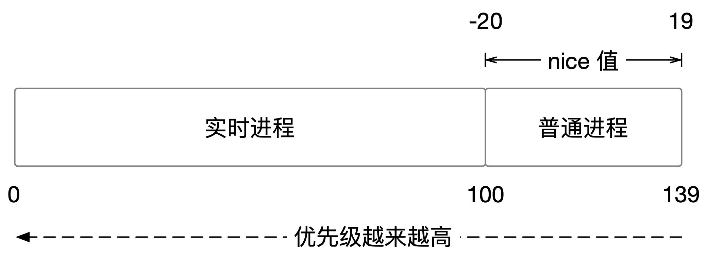

在 Linux 中，进程生而不平等，按照调度的方式不同，可以分为「实时进程」和「普通进程」两种。内核中根据进程的优先级来区分普通进程与实时进程，在内核中，Linux 中进程优先级范围为 0～139，数值越小，优先级越高，0 为最高优先级，139 为最低优先级。

实时进程的优先级高于普通进程，实时进程的优先级取值为 0～99，普通进程优先级范围为 100～139，如下图所示：



对应于这两种不同类型的进程，Linux 提供了不同的调度策略，常见的几种调度策略如下所示：

- SCHED_NORMAL：普通进程调度策略。
- SCHED_FIFO：First in first out 实时调度策略。
- SCHED_RR：Round Robin 实时调度策略。
- SCHED_BATCH：保留。
- SCHED_IDLE：idle 进程调度策略。

SCHED_NORMAL 属于非实时的调度策略，用于普通的进程调度，而 SCHED_FIFO 和 SCHED_RR 属于实时进程调度策略。最后的 SCHED_BATCH 和 SCHED_IDLE 这两个我们这里不做过多的介绍。


## 实时调度算法 SCHED_FIFO、SCHED_RR

SCHED_FIFO 和 SCHED_RR 这两个属于实时的调度算法，这两个调度算法的区别在于同等优先级下的策略。

- SCHED_FIFO 是一种 run to completion 的算法，采用先进先出的策略，获得 CPU 控制权的进程会一直执行直到主动放弃 CPU 或者被更高优先级的实时进程抢占。
- SCHED_RR 采用 round robin 的策略，比 SCHED_FIFO 多维护了一个时间片，相同优先级之间的进程能够轮流执行，每次执行的实际是一个固定的时间片。在我的 Centos 7 系统上，这个固定的时间片值为 100ms，Linux 3.9 版本以后可以通过 `/proc/sys/kernel/sched_rr_timeslice_ms` 修改这个默认值。

不同的优先级的实时进程之间，严格按照优先级的顺序来执行，优先级高的进程不执行完，优先级低的进程没有机会执行。高优先级的进程可以抢占低优先级的进程。


## 实时进程不让出 CPU 是不是普通进程完全没机会？

前面我们说到实时进程的优先级高于所有的普通进程，这样是非常危险的，万一实时进程以为代码缺陷进入到一个 while(1) 死循环，是不是普通进程完全没有机会运行？

如果是这样的话，想用 kill 杀死实时进程都做不到，因为 kill 命令这个普通进程也是需要抢到 CPU 控制权才可以执行的。

为了解决这个问题，从 Linux 2.6.25 开始，Linux 的调度器为非实时的进程预留了 5% 的 CPU 时间片，避免某死循环实时进程完全占满了 CPU。这个特性通过两个 kernel 的参数进行配置：

```powershell
$ sysctl -a | grep sched_rt_
 
kernel.sched_rt_period_us = 1000000
kernel.sched_rt_runtime_us = 950000
```

sched_rt_period_us 的默认值为 1000000 us，也就是 1s，sched_rt_runtime_us 的默认值为 950000 us，也就是 950ms，也就是每 1s 中，实时进程最多只能跑 950ms，剩下的 50ms 留给普通进程。如果你想让实时的进程能够跑满 100% 的 CPU 时间，可以将 sched_rt_runtime_us 设置为 -1，表示不限制实时进程。

为了能更直观地理解这个限制，我们来做一个实验，实验所用的虚拟机是双核。还是以之前用的 busy 程序为例，源码见：https://github.com/arthur-zhang/cs-internal-material 。

启动一个 busy 进程，使用 `-j2` 参数让其内部运行两个死循环线程：

```powershell
./busy -j2
```

这个时候，busy 进程的两个线程会基本跑满 200% 的 CPU，如下所示：

```powershell
$ top

  PID USER      PR  NI    VIRT    RES    SHR S  %CPU %MEM     TIME+ COMMAND
10407 ya        20   0   22900    380    300 S 199.7  0.0   0:32.83 busy
```


这时，通过 chrt 修改 busy 的调度策略为实时的调度策略 SCHED_FIFO。

```powershell
$ sudo chrt -a -p -f 20 10407
```

这个时候 busy 进程的 CPU 利用率反而下降稳定在 190% 左右。

```powershell
$ top

  PID USER      PR  NI    VIRT    RES    SHR S  %CPU %MEM     TIME+ COMMAND
10407 ya       -21   0   22900    384    300 S 189.4  0.0   3:54.02 busy
```

这就是因为有 sched_rt_period_us 和 sched_rt_runtime_us 两个值的限制，导致了双核机器上的实时进程最多只能跑满 200% * 0.95 = 190% 的 CPU。

如果这个时候，将 sched_rt_runtime_us 的值改 -1：

```powershell
$ sudo sysctl -w kernel.sched_rt_runtime_us=-1
```

那么恭喜你，整个系统失去了响应。busy 进程的优先级高，且没有留给普通进程运行的 CPU 时间，连 kill 都没有机会，因为要执行 kill，需要 fork 一个进程，拿到时间片执行 kill 的逻辑。


## 验证调度策略的更多实验

接下来，我们来用更多的实验来验证实时调度算法特性带来的一些现象。


### 实验一：实时进程吃肉，普通进程喝汤

启动两个 `busy -j2` 进程，把其中一个进程调度策略改为 fifo，查看两个进程的 CPU 占用情况，实验环境为双核 Centos7。

刚启动完两个进程，两个进程平分 CPU，占用都在 100%。

```powershell
$ ./busy -j2  # pid: 11245
$ ./busy -j2  # pid: 11446

$ top

  PID USER      PR  NI    VIRT    RES    SHR S  %CPU %MEM     TIME+ COMMAND
11245 ya        20   0   22900    384    300 S 100.0  0.0   1:22.39 busy
11446 ya        20   0   22900    380    300 S  99.7  0.0   1:04.32 busy
```

接下来调整进程 11245 的调度策略为 FIFO。

```powershell
$ sudo chrt -a -p -f 20 11245
```

再次用 top 查看 CPU 占用情况。

```powershell
$ top

  PID USER      PR  NI    VIRT    RES    SHR S  %CPU %MEM     TIME+ COMMAND
11245 ya       -21   0   22900    384    300 S 189.4  0.0   2:45.18 busy
11446 ya        20   0   22900    380    300 S   9.0  0.0   2:06.08 busy
```

进程 11245 是实时进程，它不跑完其它的普通进程几乎没有机会跑，实时进程因为有 sched_rt_period_us 和 sched_rt_runtime_us 两个值的限制，导致最多能占到 95% 的总 CPU 资源，在双核机器上也就是 190% 的 CPU 占用。

实时进程吃肉，普通进程只能喝喝汤。普通进程 11446 只能用一下实时进程没跑完的 5% 的 CPU 资源，top 里的 %CPU 资源最多能到 10%(5%*2)。


### 实验二：FIFO 不同优先级的进程会怎么跑

启动两个 `busy -j2` 进程，把两个进程调度策略都改为 fifo，只是它们的优先级不一样。

```powershell
$ sudo chrt -a -p -f 20 11245
$ sudo chrt -a -p -f 50 11446
```

再次用 top 查看 CPU 占用情况。

```powershell
$ top

  PID USER      PR  NI    VIRT    RES    SHR S  %CPU %MEM     TIME+ COMMAND
11446 ya       -51   0   22900    380    300 S 190.0  0.0   3:18.65 busy
11245 ya       -21   0   22900    384    300 S   0.0  0.0  26:45.75 busy
```

可以看到此时两个实时进程的 CPU 占用一个为 190%，一个为 0%。这是因为 FIFO 的调度策略是一种 run to completion 的算法，高优先级的不跑完，低优先级的没有机会执行，所以高优先级的 11446 会跑满实时进程的 95% 的 CPU 资源，低优先级的 11245 没有任何执行的机会，CPU 占用永远是 0%，比普通进程能喝点汤还要惨。

也许这就是传说中的官大一级压死人。


### RR 不同优先级的进程会怎么跑

把上面中的 FIFO 换成 RR 实验结果也是一样的。

```powershell
$ sudo chrt -a -p -r 20 11245
$ sudo chrt -a -p -r 50 11446
```

RR 只是在相同优先级之间的进程能够轮流执行，不同优先级还是严格按照优先级高的先执行的规则，优先级高的不跑完，优先级低的没机会。


### RR 相同优先级怎么跑

将上面进程改为 RR，优先级都改为 50：

```powershell
$ sudo chrt -a -p -r 50 11245
$ sudo chrt -a -p -r 50 11446
```

使用 top 查看，可以看到各占了接近 95% 的 CPU：

```powershell
$ top

  PID USER      PR  NI    VIRT    RES    SHR S  %CPU %MEM     TIME+ COMMAND
11245 ya       -51   0   22900    384    300 S  95.3  0.0  28:56.90 busy
11446 ya       -51   0   22900    380    300 S  94.0  0.0  54:47.21 busy
```

相同优先级的 RR 调度算法，使得这两个进程轮换执行，平分了实时进程的 190% 的 CPU。


## chrt 工具介绍

在 Linux 中，chrt 命令可以用来获取或修改指定进程（线程）的实时调度策略和优先级，chrt 的用法如下：

```powershell
chrt [options] [prio] [pid | command ...]
```

查看进程调度策略和优先级的方法如下，`-p` 或者 `--pid` 参数用来指定进程（线程）pid。以 sleep 命令为例，如下所示：

```powershell
$ sleep 100

$ pidof sleep                                                                                                    
25663
```

可以使用下面的命令根据 pid 来查看这个进程的实时调度策略：

```powershell
$ chrt -p 25663

pid 25663's current scheduling policy: SCHED_OTHER
pid 25663's current scheduling priority: 0
```

可以看到这里的 sleep 进程的调度策略是 SCHED_OTHER，也就是普通进程调度策略，实时的进程优先级为 0，也可以看出这不是一个实时调度进程。


使用 `chrt -m` 可以查看不同调度策略的支持的最大、最小优先级。

```powershell
$ chrt -m

SCHED_OTHER min/max priority	: 0/0
SCHED_FIFO min/max priority	: 1/99
SCHED_RR min/max priority	: 1/99
SCHED_BATCH min/max priority	: 0/0
SCHED_IDLE min/max priority	: 0/0
SCHED_DEADLINE min/max priority : 0/0
```

可以通过 -f、-r、-o 选项设置进程的调度策略：

- -f(--fifo) 设置 SCHED_FIFO 调度策略；    
- -r(--rr) 设置 SCHED_RR 调度策略；        
- -o(--other) 设置 SCHED_OTHER 调度策略。     


可以使用下面的命令将 sleep 进程的调度策略修改为 fifo，优先级变为 50：

```powershell
$ chrt -f -a -p 50 26285
```

再次执行 chrt 命令查看 sleep 的调度策略和优先级，如下所示：

```powershell
$ chrt -p 26285                                                                                                  
pid 26285's current scheduling policy: SCHED_FIFO
pid 26285's current scheduling priority: 50
```

通过执行上面的命令，就把 sleep 进程的调度策略改为了 SCHED_FIFO，优先级改为了 50。

chrt -p 后面可以指定进程优先级，不过 chrt 这里的优先级是值越大，优先级越高，与内核中的值越小优先级越高是刚好相反的。

