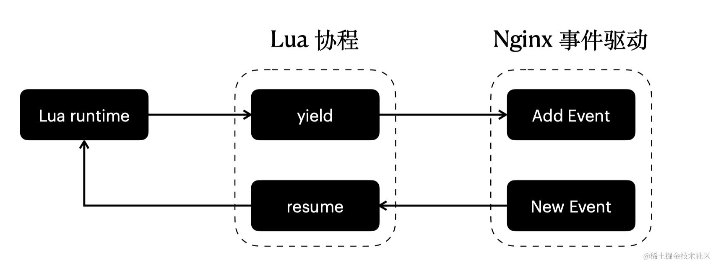

## 协程的基本概念

在当今主流的编程语言中，如 Go、Python、Rust、Lua 等，协程已成为异步编程模型的标配。就连 Java 这样曾经被认为有些臃肿的语言，也在积极拥抱协程。尤其是在 Go 语言中，协程更是被视为一等公民，Go 刻意淡化了线程的概念，转而重点强调协程。而在 OpenResty 项目中，Lua 协程和 Nginx 事件驱动被完美结合，构建了一个庞大的网关应用生态。



协程使得开发人员能够用看似同步的方式编写异步代码，使得异步逻辑更加易于理解和维护。这在 I/O 密集型应用中尤其有用，可以显著提升程序性能。

根据是否需要为每个协程分配独立的调用栈，协程可以分为 “有栈协程（Stackful Coroutine）” 和 “无栈协程（Stackless Coroutine）” 两类。

- 有栈协程会为每个协程实例分配独立的调用栈。比如微信的 libco 库会给每个协程分配 128KB 的栈，而 Golang 的 goroutine 则会给每个协程分配 2KB 的初始栈。拥有独立调用栈的好处是，协程可以在任意函数调用点挂起和恢复，调度器可以在任意时刻剥夺和转移协程的执行权。

- 无栈协程则不会分配独立的调用栈，通常是通过状态机的方式来保存和恢复执行现场。由于省去了栈的开销，无栈协程的内存占用通常更小。但其缺点是，协程只能在特定的挂起点（yield point）让出执行权，而无法在任意函数调用处挂起。


## 用 ucontext 手撸一个协程库

ucontext 是 POSIX 标准中的一套用户态协程 API，Go 语言的带头人 Russ Cox 在 Go 语言诞生前，曾用 ucontext 实现过一个轻量级协程库 libtask（<http://swtch.com/libtask/>），这个 libtask 正是使用 ucontext 来实现的。

`ucontext_t` 结构体用于保存协程的执行上下文，包括程序计数器 PC、堆栈指针 SP、通用寄存器等 CPU 现场。`ucontext_t` 结构体的定义如下：

```c
/* Userlevel context.  */
typedef struct ucontext_t
  {
    // 指向下一个上下文的指针，当当前上下文终止时，控制流将转移到这个指针指向的上下文
    struct ucontext_t *uc_link; 
    // 用于表示上下文使用的栈
    stack_t uc_stack;
    // 处理器的状态，比如寄存器
    mcontext_t uc_mcontext; 
    ...
} ucontext_t;
```

这个结构体保存了一个执行上下文的完整状态，包括程序计数器、堆栈指针和寄存器等。

ucontext API 主要包含以下几个关键函数：

*   `getcontext()`：这个函数用于获取当前的执行上下文，并将其保存在一个`ucontext_t`类型的变量中。
*   `setcontext()`：此函数用于恢复一个执行上下文，该上下文是之前通过`getcontext()`或其他方式获取的。调用`setcontext()`会立即切换到新的上下文执行。
*   `makecontext()`：用于修改一个已经通过`getcontext()`获取的上下文，设置一个新的堆栈和函数入口点。这使得可以创建新的执行流程。
*   `swapcontext()`：将当前的执行上下文保存到一个`ucontext_t`变量中，并恢复另一个上下文。这实现了上下文之间的切换。

ucontext 提供的功能有点类似于 setjmp()和 longjmp()，但更为通用和强大。

接下来我们通过一系列代码示例，来逐步构建一个简单的协程库。首先是利用 getcontext 和 setcontext 实现协程的挂起与恢复：

```c
#include <stdio.h>
#include <ucontext.h>
#include <unistd.h>

int main(int argc, const char *argv[]) {
    // 声明了一个 ucontext_t 类型的变量 
    ucontext_t context;
    // 存储当前 context 信息
    getcontext(&context);
    puts("Hello world");
    sleep(1);
    // 恢复之前的上下文
    setcontext(&context);
    return 0;
}
```

这段代码虽然没有 for 循环，但是实际上形成了一个无限循环，每秒打印一行 "Hello world" 到标准输出。

```powershell
$ gcc ucontext_test.c
$ ./a.out 
Hello world
Hello world
Hello world
Hello world
...
```

它的原理是：

1.  getcontext 获取当前的执行上下文，并将其保存在 context 中。此时 context 包含了函数调用 getcontext 时的堆栈、寄存器状态等。
2.  打印"Hello world"，然后 sleep 1 秒。
3.  setcontext 恢复 context 保存的上下文，于是程序“穿越”回第 2 步，反复执行。

接下看一下如何使用 ucontext 实现切换到其他函数执行，代码如下：

```c
#include <stdio.h>
#include <ucontext.h>
#include <unistd.h>

void foo(void) {
    printf("[coroutine] foo\n");
}

int main(void) {
    ucontext_t context;
    char stack[1024];

    // 初始化 ucontext_t
    getcontext(&context);
    context.uc_stack.ss_sp = stack;
    context.uc_stack.ss_size = sizeof(stack);
    context.uc_link = NULL;
    // 为 context 设置入口函数 foo
    makecontext(&context, foo, 0);
    printf("[main] Hello world\n");
    sleep(1);
    // 切换到 context 中执行
    setcontext(&context);
    return 0;
}
```

这里我们给 context 设置了新的栈地址，然后通过 makecontext 给 context 设置了入口函数 foo，在打印完 "\[main] Hello world" 以后睡眠 1s，然后通过 setcontext 切换到新的 context 执行，上面代码编译运行的结果如下：

```powershell
$ ./a.out 
[main] Hello world
[coroutine] foo
```

接下来我们来看看使用 ucontext 来实现多个函数的切换：

```c
#include <stdio.h>
#include <ucontext.h>
#include <unistd.h>

void foo(void) {
    printf("[coroutine] foo\n");
}

void bar(void) {
    printf("[coroutine] bar\n");
}

int main(void) {
    ucontext_t context1, context2;
    char stack1[1024];
    char stack2[1024];

    getcontext(&context1);
    context1.uc_stack.ss_sp = stack1;
    context1.uc_stack.ss_size = sizeof(stack1);
    context1.uc_link = NULL; // 结束运行
    makecontext(&context1, foo, 0); // context1 执行的函数为 foo

    getcontext(&context2);
    context2.uc_stack.ss_sp = stack2;
    context2.uc_stack.ss_size = sizeof(stack2);
    context2.uc_link = &context1; // 执行完切换到 context1
    makecontext(&context2, bar, 0); // context2 执行的函数为 bar

    printf("[main] Hello world\n");
    sleep(1);
    setcontext(&context2); // 切换到 context2 开始执行

    return 0;
}
```

这里先构造了两个 context，然后通过 setcontext 切换到 context2 执行，也就是执行 bar 方法，context2 执行结束后切换到 context1，也就是执行 foo 方法。因为 context1 的 uc\_link 字段为 NULL，foo 运行完以后进程就退出了。

这段代码运行以后的结果如下：

```powershell
$ ./a.out
[main] Hello world
[coroutine] bar
[coroutine] foo
```


接下面我们来介绍 `swapcontext` 的用法，
它的作用是将当前的执行上下文保存到一个`ucontext_t`变量中，并恢复另一个上下文，这样就实现了线程内的上下文之间的切换。

```c
#include <stdio.h>
#include <ucontext.h>

static ucontext_t ctx[3];

static void foo(void) {
    printf("[coroutine] start foo\n");
    // 将当前 context 保存到 ctx[1]，切换到 bar 继续执行
    swapcontext(&ctx[1], &ctx[2]);
    printf("[coroutine] finish foo\n");
}

static void bar(void) {
    printf("[coroutine] start bar\n");
    // 将当前 context 保存到 ctx[2]，切换到 foo 继续执行
    swapcontext(&ctx[2], &ctx[1]);
    printf("[coroutine] finish bar\n");
}

int main(void) {
    char stack1[1024];
    char stack2[1024];

    getcontext(&ctx[1]);
    ctx[1].uc_stack.ss_sp = stack1;
    ctx[1].uc_stack.ss_size = sizeof(stack1);
    ctx[1].uc_link = &ctx[0]; // 执行完切换到 ctx[0]
    makecontext(&ctx[1], foo, 0);

    getcontext(&ctx[2]);
    ctx[2].uc_stack.ss_sp = stack2;
    ctx[2].uc_stack.ss_size = sizeof(stack2);
    ctx[2].uc_link = &ctx[1];
    makecontext(&ctx[2], bar, 0);

    // 将当前 context 保存到 ctx[0]，切换到 ctx[2]
    swapcontext(&ctx[0], &ctx[2]);
    printf("[main] finish\n");
    return 0;
}
```

过程如下：

*   首先构造了 ctx\[1]、ctx\[2]，并设置对应的入口函数和运行堆栈。
*   通过 `swapcontext`，将当前 context 保存到 ctx\[0]，切换到 ctx\[2]，开始执行 bar。
*   在 bar 函数中执行完 `printf("[coroutine] start bar\n");` 后切换到 ctx\[1]，开始执行 foo。
*   foo 执行完 `printf("[coroutine] start foo\n");` 切换到 ctx\[2] 的 bar 函数继续执行。
*   bar 接下来执行 `printf("[coroutine] finish bar\n");`，此时 bar 函数已经运行结束，此时通过 `ctx[2].uc_link` 我们得知需要跳转到 ctx\[1] 继续执行。
*   接下来 foo 函数继续执行 `printf("[coroutine] finish foo\n")`。
*   foo 运行结束以后切换到 ctx\[0]，继续执行 main 函数中的 `printf("[main] finish\n");`。

编译运行上面的代码输出结果如下：

```powershell
$ ./a.out              
[coroutine] start bar
[coroutine] start foo
[coroutine] finish bar
[coroutine] finish foo
[main] finish
```


## 手搓汇编实现

前面我们看到了如何使用 ucontext 实现协程的切换，接下来我们手写一段汇编来实现协程的切换，来进一步理解协程切换的原理。

x86-64 体系下有 16 个通用目的寄存器 `RAX, RBX, RCX, RDX, ESI, EDI, RBP, RSP, R8, R9, R10, R11, R12, R13, R14, R15`，其中：

*   RAX 作为函数返回值；
*   RDI, RSI, RDX, RCX, R8, R9 这 6 个寄存器作为函数参数；
*   RBX,RBP, R12, R13, R14, R15 需要保存；
*   RSP 是栈顶指针；
*   R10, R11 不是 Parameter Registers，也不是 Callee Saved Registers，切换的时候不⽤存。

因此，我们需要自己保存的是 RBX、R12、R13、R14、R15。

首先，我们来写一个 `cpu_context` 结构体来存储协程运行时的 cpu 上下文，也就是各种寄存器等，以便切换和恢复时使用。

```c
struct cpu_context {
    /**
     * r12
     * r13
     * r14
     * r15
     * retaddr
     * rsp
     * rbx
     * rbp
     */
    void *reg[8];
};
```

接下面我们定义协程的结构体 `coroutine`：

```c
typedef void(*my_func)(void *);

struct coroutine {
    struct cpu_context context;
    char stack[STACK_SIZE];
    my_func func;
};
```

从这里的定义我们可以再次理解，有栈协程本质就是由 cpu 上下文、运行堆栈、入口函数组成三部分组成。

有了协程，我们还需要一个协程调度器 schedule，用来从待运行队列中找到协程运行。为了支持协程级别的 sleep，这里我们简单使用一个优先级队列来处理到期的 coroutine。

```c
struct schedule {
    struct cpu_context main_context; // main context
    struct coroutine *current; // 当前正在运行的 coroutine
    struct pqueue_t *queue; // 待运行队列
};
```

接下来会 schedule 实现 new、resume、yield 方法：

```c
struct coroutine *coroutine_new(struct schedule *sched, my_func func) {
    struct coroutine *c = malloc(sizeof(struct coroutine));
    c->func = func;
    c->context.reg[4] = func;
    c->context.reg[5] = c->stack + STACK_SIZE;
    return c;
}

void coroutine_resume(struct schedule *sched, struct coroutine *co) {
    sched->current = co;
    swap_context(&sched->main_context, &co->context);
}

void coroutine_yield(struct schedule *sched) {
    swap_context(&sched->current->context, &sched->main_context);
}
```

我们就可以这样创建一个协程，入口函数是 foo：

    struct coroutine *c1 = coroutine_new(_sched, foo);


手写汇编版本的 `swap_context` 我们最后详细介绍。接下来定义一个 `delay_task` 表示延时任务。

```c
struct delay_task {
    long expire;
    struct coroutine *coroutine;
    int pos;
};
```

那么协程版本的 sleep 的实现如下：

```c
void delay(int ms) {
    struct delay_task *task = malloc(sizeof(struct delay_task));
    task->expire = ms + now();
    task->coroutine = _sched->current;
    pqueue_insert(_sched->queue, task);
    coroutine_yield(_sched);
}
```

delay 的实现就是往优先级队列中插入一个 delay\_task 任务，然后 coroutine\_yield 切换回 main context。

接下来实现一个 eventloop 函数，来驱动延时任务的处理。

```c
void eventloop() {
    while (1) {
        usleep(1000);
        while (pqueue_size(_sched->queue) > 0) {
            node_t *top_item = pqueue_peek(_sched->queue);
            if (top_item == NULL) {
                usleep(1000);
                continue;
            }
            if (now() > top_item->expire) {
                top_item = pqueue_pop(_sched->queue);
                struct coroutine *c = top_item->coroutine;
                free(top_item);
                coroutine_resume(_sched, c);
            } else {
                break;
            }
        }
    }
}
```

这里的逻辑就是不停地从优先级队列中找最先到期的延时任务，然后恢复 delay 任务所在的协程继续运行。

一个简单的使用示例如下：

```c
void foo() {
    while (1) {
        static int i = 0;
        printf("[foo] run: %ld, i:%d\n", now() / 1000, ++i);
        delay(3000);
    }
}

void bar() {
    while (1) {
        printf("[bar] run: %ld\n", now() / 1000);
        delay(1000);
    }
}

int main() {

    _sched = coroutine_init();

    struct coroutine *c1 = coroutine_new(_sched, foo);
    struct coroutine *c2 = coroutine_new(_sched, bar);

    coroutine_resume(_sched, c1);
    coroutine_resume(_sched, c2);

    printf("%s\n", "in main");

    eventloop();
    return 0;
}
```

这里先是创建了一个协程调度器 \_sched，然后新建了两个协程 c1 和 c2，入口函数分别是 foo 和 bar，接下运行 c1 和 c2 协程。

foo 和 bar 的逻辑是在 while 循环中不停地调用 delay 让出执行权。这段代码编译运行的结果如下：

```powershell
[foo] run: 1705374553, i:3
[bar] run: 1705374553
[bar] run: 1705374554
[bar] run: 1705374555
[foo] run: 1705374556, i:4
[bar] run: 1705374556
[bar] run: 1705374557
[bar] run: 1705374558
```

因为睡眠的时间不同，输出结果就是 foo 打印一次，bar 打印三次。

最后我们来看最复杂的手写汇编部分，核心的汇编代码如下：

```c
void swap_context(void *from_co, void *to_co) asm ("swap_context");
/*
*
1.before swap_context:
------
xxx
------  <-rsp

2. after call:
------
xxx
------
retaddr
------  <-rsp
*/
__asm__ (
"swap_context:\n\t"
/*
r12 r13 r14 r15 rip rsp rbx rbp
0   8   10  18  20  28  30  38
*/
// 根据 x86_64的传参规范，RDI, RSI, RDX, RCX, R8, R9 传递前六个参数
// swap_context(void *from_co, void *to_co)
// rdi->from_co | rsi->to_co
// 这个时候刚调用 swap_context 函数，rsp 正指向 retaddr, 将 rsp 先临时保存在 rdx 中，rcx、rdx 这两个寄存器不用保存
"mov 0x00(%rsp), %rdx\n\t"
// 将之前 RSP 的地址保存到 rcx 中
"lea 0x08(%rsp), %rcx\n\t"

// 保存所需的寄存器到 from_co 结构体
"mov %r12, 0x00(%rdi)\n\t" // r12 -> from_co[0]
"mov %r13, 0x08(%rdi)\n\t" // r13 -> from_co[1]
"mov %r14, 0x10(%rdi)\n\t" // r14 -> from_co[2]
"mov %r15, 0x18(%rdi)\n\t" // r15 -> from_co[3]
"mov %rdx, 0x20(%rdi)\n\t" // rdx -> from_co[4]  [retaddr]
"mov %rcx, 0x28(%rdi)\n\t" // rcx -> from_co[5]  [rsp]
"mov %rbx, 0x30(%rdi)\n\t" // rbx -> from_co[6]
"mov %rbp, 0x38(%rdi)\n\t" // rbp -> from_co[7]

// 从 to_co 结构体中恢复 cpu 上下文
"mov 0x00(%rsi), %r12\n\t" // r12 <- to_co[0]
"mov 0x08(%rsi), %r13\n\t" // r13 <- to_co[1]
"mov 0x10(%rsi), %r14\n\t" // r14 <- to_co[2]
"mov 0x18(%rsi), %r15\n\t" // r15 <- to_co[3]
"mov 0x20(%rsi), %rax\n\t" // rax <- to_co[4]  [retaddr]
"mov 0x28(%rsi), %rcx\n\t" // rcx <- to_co[5]  [rsp]
"mov 0x30(%rsi), %rbx\n\t" // rbx <- to_co[6]
"mov 0x38(%rsi), %rbp\n\t" // rbp <- to_co[7]

"mov %rcx, %rsp\n\t"       // rsp
"jmpq *%rax\n\t"
);
```

一开始我们使用定义了一个内联汇编函数 `swap_context`：

```powershell
__asm__ (
"swap_context:\n\t"
```

根据 x86\_64的传参规范，RDI, RSI, RDX, RCX, R8, R9 传递前六个参数，根据 swap\_context 的函数入参可以知道，rdi 寄存器存储 from\_co 指针，rsi 寄存器存 to\_co 指针。

这个时候刚调用 swap\_context 函数，rsp 正指向 retaddr， rcx、rdx 这两个寄存器不用保存且暂时没有使用，可以先拿来用一下，将 rsp 先临时保存在 rdx 中。

*   `mov 0x00(%rsp), %rdx\n\t`：将 RSP 指向的地址（函数返回地址）赋值到 RDX 寄存器。

*   `lea 0x08(%rsp), %rcx\n\t`：将 RSP+8 的地址加载到 RCX 寄存器，也就是将之前 RSP 的地址保存到 rcx 中

从 `"mov %r12, 0x00(%rdi)\n\t"` 接下来的 8 个 mov 指令将 R12, R13, R14, R15, RDX, RCX, RBX 和 RBP 寄存器的值保存到 from\_co 结构体中。

从 `"mov 0x00(%rsi), %r12\n\t"` 接下来的 8 个 mov 从 to\_co 结构体中恢复 cpu 上下文，这些指令将 to\_co 指向的内存位置中的值加载到 R12, R13, R14, R15, RAX, RCX, RBX 和 RBP 寄存器。

`"mov %rcx, %rsp\n\t"` 将 RCX 寄存器的值（即新上下文的堆栈指针）赋值到 RSP 寄存器，更新堆栈指针到新的上下文。

`"jmpq *%rax\n\t"` 跳转到 RAX 寄存器指向的地址。这里的 RAX 寄存器包含了 to\_co 结构体中保存的返回地址，实现了上下文的切换。


## 小结

本文首先介绍了协程的基本概念和分类，然后重点讲解了如何利用 ucontext API 来实现一个简单的用户态协程库。我们先用一系列示例代码展示了 getcontext、setcontext、makecontext 和 swapcontext 等 API 的基本用法。

后面通过手写汇编的方式来实现一个拙劣的协程库，我们可以更深入地理解协程的工作原理。
