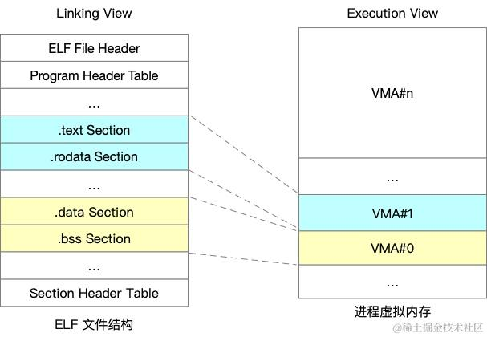
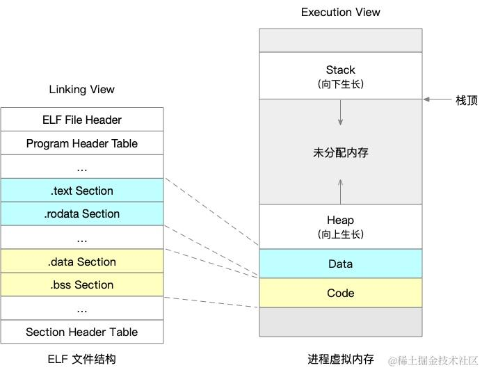

ELF 可执行文件由多个 Section 组成，但操作系统在加载可执行文件时并不关心 ELF 的 Section，而是关注加载后的段（Segment）的权限。

ELF 的各 Section 可以大致分为三类：

*   代表只读、可执行权限段的 .text Section；
*   代表可读可写段的 .data 和 .bss Section；
*   代表只读数据段的 .rodata Section。

为了减少加载后内存对齐带来的浪费以及内存碎片，ELF 引入了 Segment 的概念。一个 Segment 包含一个或多个属性相似的 Section，例如 .data 和 .bss 会合并到一个 Segment，.text 和 .rodata 也会合并到一个 Segment。

可以通过 `readelf -l` 命令查看 ELF 的 Segment 信息，包括每个 Segment 的虚拟地址、物理地址、文件大小、内存大小、权限等。

```powershell
readelf -l a.out                                                                      

Elf file type is EXEC (Executable file)
Entry point 0x400440
There are 9 program headers, starting at offset 64

Program Headers:
  Type           Offset             VirtAddr           PhysAddr
                 FileSiz            MemSiz              Flags  Align
  LOAD           0x0000000000000000 0x0000000000400000 0x0000000000400000
                 0x000000000000076c 0x000000000000076c  R E    200000
  LOAD           0x0000000000000e10 0x0000000000600e10 0x0000000000600e10
                 0x0000000000000230 0x0000000000000638  RW     200000
...
 Section to Segment mapping:
  Segment Sections...
   00     
   01     .interp 
   02     .interp .note.ABI-tag .note.gnu.build-id .gnu.hash .dynsym .dynstr .gnu.version .gnu.version_r .rela.dyn .rela.plt .init .plt .text .fini .rodata .eh_frame_hdr .eh_frame 
   03     .init_array .fini_array .jcr .dynamic .got .got.plt .data .bss 
   04     .dynamic 
   ..
```


## Linux 进程的虚拟内存布局

在 Linux 中，进程的虚拟内存因为不同的用途，也被划分为了多个区域，这些区域不会重叠，一个合法的虚拟地址一定会落在某一个区域中，这样的区域被称为虚拟内存区域（VMA，virtual memory areas）。VMA 其实是对一块连续线性的虚拟地址空间的抽象，每块 VMA 都有自己的地址范围和权限。

ELF 在真正装载执行时，只读及只读可执行的 Section 被映射到一块虚拟内存区域，如下图中的 VMA#0，可读可写的 Section 被映射到一块虚拟内存区域，比如图中的 VMA#1。



Linux 中常见的有下面三种查看进程内存布局的方式：

*   pmap -x `<pid>`
*   cat /proc/`<pid>`/maps
*   cat /proc/`<pid>`/smaps

以前面代码为例，增加了一些打印：

```c
#include <stdio.h>
char a[1000];       // .bss
static long b;      // .bss
int c = 100;        // .data
static int d = 200; // .data
const int bar = 299;

int main() {
    static int x = 200; // .data
    static int y;       // .bss
    char *str = "hello";
    int i = 1;
    printf("a: %p\n", &a);
    printf("b: %p\n", &b);
    printf("c: %p\n", &c);
    printf("d: %p\n", &d);
    printf("x: %p\n", &x);
    printf("y: %p\n", &y);
    printf("bar: %p\n", &bar);
    printf("hello: %p\n", str);
    printf("main: %p\n", &main);
    printf("i:%p\n", &i);
    printf("str: %p\n", &str);

    getchar();
    return 0;
}
```

编译运行的结果如下：

```powershell
$ ./a.out                                                                               

a: 0x601080
b: 0x601068
c: 0x601044
d: 0x601048
x: 0x60104c
y: 0x601070
bar: 0x400790
hello: 0x400794
main: 0x4005cd
m: 0x7ffff7eec010
i:0x7fffffffe23c
str: 0x7fffffffe240
```

对应进程的 pmap 的结果如下：

```powershell
$ pmap -x `pidof a.out`

Address           Kbytes     RSS   Dirty Mode  Mapping
0000000000400000       4       4       0 r-x-- a.out
0000000000600000       4       4       4 r---- a.out
0000000000601000       4       4       4 rw--- a.out
00007ffff7a0d000    1804     280       0 r-x-- libc-2.17.so
00007ffff7bd0000    2048       0       0 ----- libc-2.17.so
00007ffff7dd0000      16      16      16 r---- libc-2.17.so
00007ffff7dd4000       8       8       8 rw--- libc-2.17.so
00007ffff7dd6000      20      12      12 rw---   [ anon ]
00007ffff7ddb000     136     108       0 r-x-- ld-2.17.so
00007ffff7eec000    1040      16      16 rw---   [ anon ]
00007ffff7ff7000      12       8       8 rw---   [ anon ]
00007ffff7ffa000       8       4       0 r-x--   [ anon ]
00007ffff7ffc000       4       4       4 r---- ld-2.17.so
00007ffff7ffd000       4       4       4 rw--- ld-2.17.so
00007ffff7ffe000       4       4       4 rw---   [ anon ]
00007ffffffde000     132      12      12 rw---   [ stack ]
ffffffffff600000       4       0       0 r-x--   [ anon ]
---------------- ------- ------- -------
total kB            5252     488      92
```

pmap 输出的每一行代表一个 VMA，从 pmap 的输出可以看到：

*   a、b、c、d、x、y 这六个变量的地址落在了起始地址为 0000000000601000 的内存区域内，这个区域的权限是 R+W。
*   常量 bar、"hello" 字符串（str 指针指向的地址）、main 函数指针都落在了起始地址为 0000000000400000 的区域内，这个区域的权限是 R+X。
*   堆区的指针 m 指向的地址落在了起始地址为 00007ffff7eec000 的区域内，如下所示。

<!---->

```powershell
Address           Kbytes     RSS   Dirty Mode  Mapping
00007ffff7eec000    1040      16      16 rw---   [ anon ]
```

至于为什么大小是 1040 而不是 1024K，我们后面会介绍到。这部分的权限是 R+W，因为没有文件背景，所以属于匿名虚拟内存映射区域，通过 Mappping 那一栏的 anon 也可以看出来。这部分就是我们常说的 heap，堆区。

*   i、m、str 这三个变量分配在栈上的，它们的地址都落在起始地址为 00007ffffffde000 开始的区域内。

<!---->

```powershell
Address           Kbytes     RSS   Dirty Mode  Mapping
00007ffffffde000     132      12      12 rw---   [ stack ]
```

通过这个例子，我们可以看到 Linux 进程的内存分布，主要分为下面四个大的部分：

*   Code VMA：只读、可执行；
*   Data VMA：可读写；
*   Heap VMA：可读写，从低地址向高地址增长；
*   Stack VMA：可读写，从高地址向低地址增长。

简化过的示意映射图如下所示：



后面对堆区和栈区，我们还会有非常详细的介绍，这里先不展开。

## 使用 GDB 查看变量的内存布局

除了用代码中打印的方式，还可以使用 gdb 的方式来查看变量的内存布局。

```powershell
gdb --pid `pidof a.out`
(gdb)
```

在 GDB 中，可以使用 p/x 命令查看变量的地址：

```powershell
(gdb) p/x &a
$3 = 0x601060

(gdb) p/x &b
$4 = 0x601048

p/x &main
$16 = 0x40052d
```

通过 GDB，可以更方便地调试和查看程序的内存布局。

## 小结

我们在排查一些黑盒应用的内存占用异常时，往往是通过先分析是在那一块区域的内存在增长或者占用过大，然后进行进一步的分析，需要用到本文中的 ELF 文件的 Segment 和 Section 以及 Linux 进程的虚拟内存布局的深入理解。
