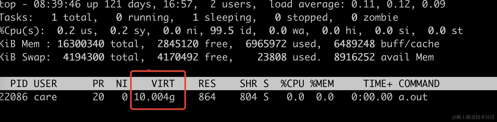
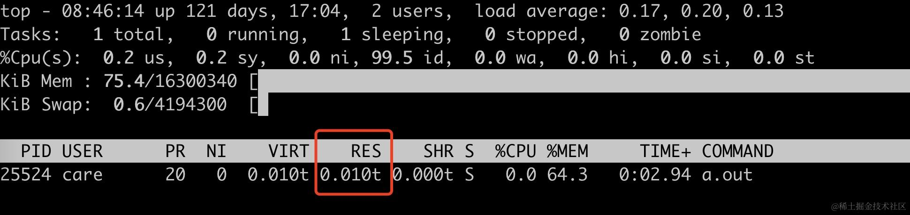
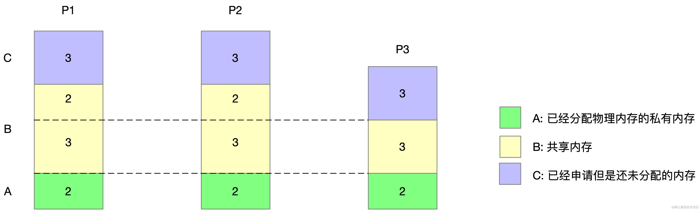
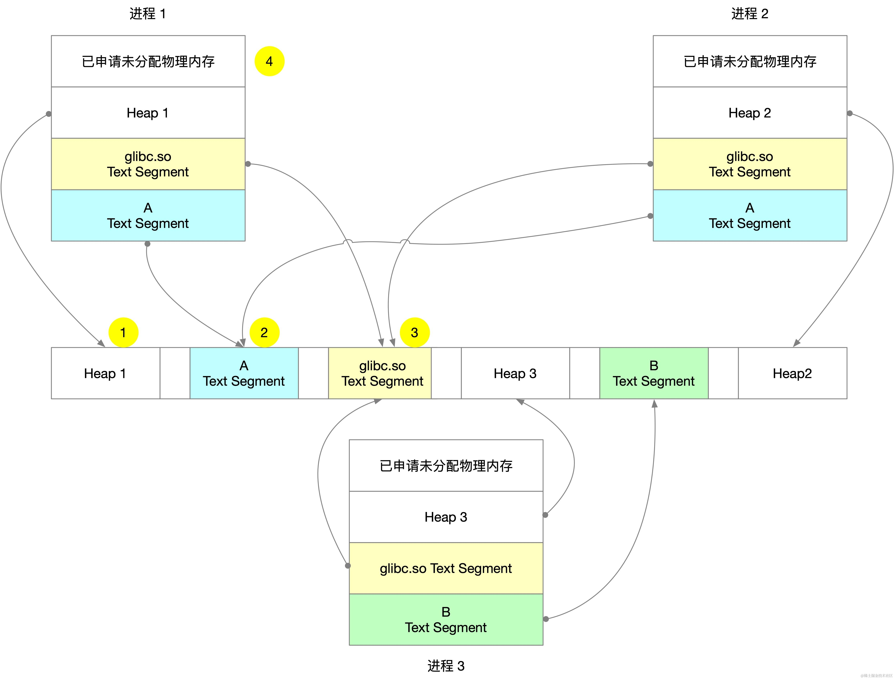

在 Linux 系统中, 进程是资源分配和调度的基本单位。了解进程的内存使用情况, 对于系统管理和性能优化至关重要，但 linux 下的内存占用比较复杂，怎么评估一个进程占用多少内存是有很多争议的，这篇文章将介绍 Linux 中几种常见的进程内存占用计算方式, 包括 VSS、RSS、PSS 和 USS, 并通过示例说明它们的区别和使用场景。

在 Linux 系统中, 计算进程的内存占用有多种方式, 常见的有以下四种:

*   VSS(Virtual Set Size): 虚拟内存集大小
*   RSS(Resident Set Size): 常驻内存集大小
*   PSS(Proportional Set Size): 比例内存集大小
*   USS(Unique Set Size): 独占内存集大小

接下来我们详细探讨这些计算方式的含义及其应用场景。

### VSS（Virtual Set Size）

VSS（Virtual Set Size）包括已分配但尚未实际使用的内存区域。由于 VSS 包含了未实际使用的内存，因此其参考价值较低。下面是一个 C 的 demo 来演示分配大量的内存但不实际访问这些内存情况下 vss 的特点。

```c
#include <stdio.h>
#include <stdlib.h>
#include <unistd.h>

int main() {
    // 定义要分配的内存大小（例如，10GB）
    size_t size = 10L * 1024 * 1024 * 1024;

    // 分配内存
    char *buffer = (char *)malloc(size);
    if (buffer == NULL) {
        perror("malloc");
        return 1;
    }

//    for (size_t i = 0; i < size; i += 4096) {
//        buffer [i] = 0;
//    }

    printf("Allocated and touched %zu bytes of memory. PID: %d\n", size, getpid());
    printf("Press Enter to exit...\n");
    getchar();

    free(buffer);
    return 0;
}
```

编译运行后通过 top 命令可以看到 VSS 的内存达到了 10G，但是驻留内存 RES 使用才使用才只有 864KB。



### RSS（Resident Set Size）

RSS 驻留内存，表示进程实际使用的物理内存。把上面代码中注释的代码重新启用，touch 分配出来的 10G 内存，再次运行，我们可以看到此时驻留内存的大小为 10G。



不过用 RSS 来衡量进程的内存消耗不一定很精确。如果进程所占用的内存不一定只有它一个进程消耗的，比如它依赖了共享库，同一个文件运行多次代码段是相同的，这些其只需要被加载一次到内存即可，无论把这部分内存消耗算在哪个进程上都不合理，进而引入了下面的 PSS。

我们经常会看到有一些 benchmark 的报告，为了展现他们的程序内存占用有多小，可能会从 RSS 中减去共享的内存部分，来当做进程实际的内存大小。

### PSS（Proportional Set Size）

为了更合理地评估进程的内存消耗, 引入了 PSS 的概念。PSS 与 RSS 的区别在于, 对于共享内存的计算是按比例分摊的。

假设进程 A 有 50KB 的 unshared 的内存（私有内存），B 有 300KB 的 unshared 的内存，进程 A 和 B 有 100KB 共享的内存，则 A 和 B 的 PSS 计算方式如下。

*   PSS(A) = 50KB + 100KB/2 = 100KB
*   PSS(B) = 300KB + 100KB/2 = 350KB

再来看一个更复杂的例子，如下图所示，有 P1、P2、P3 三个进程，A 区域表示已经分配物理内存的私有内存，B 区域表示共享的内存，C 表示已经申请但是还未分配物理内存的区域。



则三个进程的 PSS 计算方法如下：

| 进程 | PSS               |
| ---- | ----------------- |
| P(1) | 2 + 3/3 + 2/2 = 4 |
| P(2) | 2 + 3/3 + 2/2 = 4 |
| P(3) | 2 + 3/3 = 3       |

可见, 共享内存 3 被 3 个进程均分, 共享内存 2 被 2 个进程均分, 再加上各自的私有内存, 就得出了每个进程的 PSS。一般情况下, PSS 是评估进程内存占用比较合理的指标。

### USS（Unique Set Size）

USS 是进程独占的物理内存，如果进程退出 USS 就是进程返还给系统的内存大小。

以下图的例子为例：



可执行文件 A 运行两次对应进程 1 和 2，可执行文件 B 运行对应进程 3，这三个可执行文件都依赖了 glibc.so 这个共享库。

则进程 1 的 VSS 为 1 + 2 + 3 + 4，RSS 为 1 + 2 + 3，PSS 为 1 + 2/2 + 3/3，USS 为 1。

## 查看内存占用的工具

在 Linux 中, 我们可以使用 smem 工具来查看进程的 RSS、PSS、USS 等内存指标。smem 需要单独安装，也可以在官网下载 <https://www.selenic.com/smem/> 。

```powershell
yum install smem 
```

执行 smem 的结果如下所示。

```powershell
$ smem
  PID User     Command                         Swap      USS      PSS      RSS
27467 ya       sleep 1000                         0       92      120      608
29915 ya       sleep 1990000                      0       92      120      608
...
```

使用 smem 也可以生成饼状图，这里不展开说明，可以查看官网的使用方法。

除了使用 smem 还可以使用 procrank 这个工具。

```powershell
$ procrank -h
Usage: procrank [ -W ] [ -v | -r | -p | -u | -s | -h ]
    -v  Sort by VSS.
    -r  Sort by RSS.
    -p  Sort by PSS.
    -u  Sort by USS.
    -s  Sort by swap.
        (Default sort order is PSS.)
    ...
```

procrank 的一个示例输出如下。

```powershell
  PID           Vss           Rss           Pss           Uss  cmdline
  683       547492K        14128K        13378K        13092K  /usr/sbin/NetworkManager
  943       562760K        13348K        13277K        13272K  /usr/bin/python
```

以上就是 Linux 进程内存占用的几种计算方式及其区别。在实践中, 我们需要根据具体场景选择合适的内存指标, 用正确的工具去度量和优化进程的内存使用。

## 小结

Linux 提供了多种进程内存占用的度量指标, 它们反映了不同的内存使用特征:

*   VSS 反映进程虚拟内存总需求, 包括未分配的部分, 通常并无实际参考价值。
*   RSS 反映进程实际使用的物理内存, 但对共享内存的重复计算会导致高估。
*   PSS 通过按比例分摊共享内存的方式, 较为合理地评估了进程内存占用。
*   USS 则仅计算进程独占的内存, 代表进程退出后将返还给系统的内存数量。

我们在日常工作中一般图简单会直接用 RSS 来表示进程的内存占用，如果在做一些性能对比的时候，可能需要你对这些概念有更深刻的了解，得到更正确的判断。
