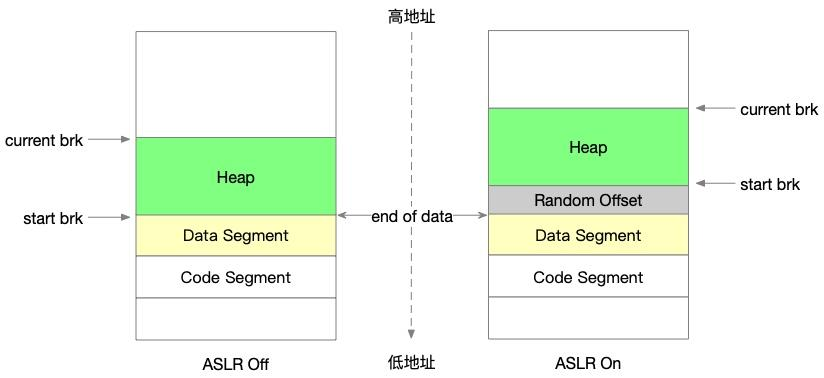
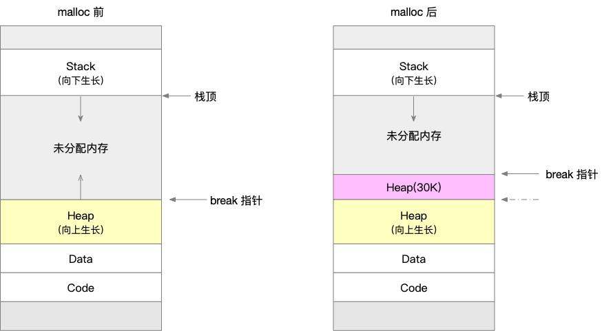

前面提到，malloc 是 libc 标准库提供的内存分配函数，它不是系统调用，真正隐藏在 malloc 背后的是 brk 和 mmap 两个系统调用。


## brk 系统调用

虚拟内存中，堆段开始的位置用一个称为 brk（program break）的指针来标识。在地址空间分布随机化（Address Space Layout Randomization，ASLR）关闭的情形下，数据段结束的位置和堆段开始的位置相同。在 ASLR 开启的情况下，堆段开始的位置为数据段结束的位置加上一段随机数。



brk 系统调用的名字也是这么来的，使用 malloc 申请 30K 内存，只需要将 brk 指针上抬 30KB 大小即可，前后 brk 指针和堆的申请如下所示：




brk 系统调用还有一个类似的函数 sbrk，不过它接受的参数不是一个地址，而是地址变化的增量。这两个函数的函数定义如下：

```c
#include <unistd.h>

int brk(void *addr);

void *sbrk(intptr_t increment);
```


brk 通过传递的 addr 参数值来重新设置 program break，成功则返回 0，否则返回 -1。addr 的值大于当前 program break，则分配内存，小于则是释放内存。

sbrk 将 program break 在原有地址上增加从参数 increment 传入的大小，成功则返回新分配内存起始位置的指针，也就是前一个 program break 的值。调用 sbrk(0) 返回 program break 的当前位置.


不过 sbrk 不是系统调用，可以看到是 brk 系统调用的一个简单封装，sbrk(n) 可以用 brk 简单表示为下面这样：

```c
void *oldbrk = brk(NULL);
brk(oldbrk + n)
```

> 小观点：堆与数据段的关系

换一个角度来理解，heap 不就是数据段的延伸吗？brk 通过调整 program break 来延伸和收缩内存，实际上就是在扩大和缩小数据段。

接下面来演示 brk、sbrk 的用法：

```c
#include <stdio.h>
#include <unistd.h>

int main() {
    void *init_brk = sbrk(0);
    printf("current brk: %p\n", init_brk);
    getchar();

    brk(init_brk + 8192); // brk 增加 8k，相当于申请 8k 内存

    printf("current brk: %p\n", sbrk(0));
    getchar();

    brk(init_brk); // brk 回退到初始位置，相当于释放内存

    printf("current brk: %p\n", sbrk(0));
    getchar();
    return 0;
}
```

编译运行上面的程序，首先会打印当前的 brk 地址 0x602000：

```powershell
$ ./a.out
current brk: 0x602000
```

使用 /proc/pid/maps 查看当前进程的内存分布如下：

```powershell
$ cat /proc/`pidof a.out`/maps

00400000-00401000 r-xp 00000000 fd:02 267798                             a.out
00600000-00601000 r--p 00000000 fd:02 267798                             a.out
00601000-00602000 rw-p 00001000 fd:02 267798                             a.out
7ffff7a0d000-7ffff7bd0000 r-xp 00000000 fd:00 393902                     /usr/lib64/libc-2.17.so
...
```

第三行的内存区域是数据段，权限是可读可写，此时的 brk 指针的值刚好等于数据段的结束地址 0x602000。

接下来键入 enter，此时会调用 brk 申请 8k 内存，终端输出如下所示：

```powershell
$ ./a.out 
current brk: 0x602000
current brk: 0x604000
```

内存分布如下：

```powershell
00400000-00401000 r-xp 00000000 fd:02 267798                             a.out
00600000-00601000 r--p 00000000 fd:02 267798                             a.out
00601000-00602000 rw-p 00001000 fd:02 267798                             a.out
00602000-00604000 rw-p 00000000 00:00 0                                  [heap]
7ffff7a0d000-7ffff7bd0000 r-xp 00000000 fd:00 393902                     /usr/lib64/libc-2.17.so
```

可以看到进程的内存多出了一块起始地址为 0x602000，长度为 8KB 的内存区域。

接下来再次输入 enter，此时会重新调用 brk 回收内存，此时的 program break 又回到了 0x602000，如下所示：

```powershell
$ ./a.out 
current brk: 0x602000
current brk: 0x604000
current brk: 0x602000
```

此时内存分布里的已经没有之前申请的 8k 内存区域了。

```powershell
00400000-00401000 r-xp 00000000 fd:02 267798                             a.out
00600000-00601000 r--p 00000000 fd:02 267798                             a.out
00601000-00602000 rw-p 00001000 fd:02 267798                             a.out
7ffff7a0d000-7ffff7bd0000 r-xp 00000000 fd:00 393902                     /usr/lib64/libc-2.17.so
```


## mmap 系统调用

mmap 是在进程的虚拟内存空间分配一块区域作为内存映射。根据是否有文件背景，映射可以分为下面两种：

- **文件背景内存映射**：将一个文件的部分或全部内容直接映射到虚拟内存空间，可以通过访问内存的方式读取、修改文件的内容。
- **匿名内存映射**：这种情况的内存映射没有对应的文件，使用 malloc 触发的 mmap 系统调用属于这种情况。

mmap 的函数定义如下：

```c
#include <sys/mman.h>

void *mmap(void *addr, size_t length, int prot, int flags, int fd, off_t offset);
```
- addr 是指定映射的内存地址，如果指定为 NULL，内核就会为映射选一个合适的开始地址。
- length 是要映射的内存的大小。
- prot 是一个权限位掩码，可以是 PROT_NONE 或者 PROT_READ、PROT_WRITE、PROT_EXEC 的组合。
- flags 参数也是一个位掩码，用来表示是私有映射、公有映射等。
- fd、offset 用于文件背景的映射，匿名映射可以不考虑这两个值。


mmap 对应的内存释放函数是 munmap，签名如下所示：

```c
#include <sys/mman.h>

int munmap(void *addr, size_t length);
```


其中 addr 是待解除映射的地址范围的起始地址，length 参数是一个非负整数，表示待解除映射区域的大小。


接下来看一个实际的例子：

```c
#include <stdio.h>
#include <sys/mman.h>

int main() {
    printf("before mmap\n");
    getchar();

    char *addr = mmap(NULL, (size_t)8192 * 1024,
                      PROT_READ | PROT_WRITE, MAP_PRIVATE | MAP_ANONYMOUS, -1, 0);
    printf("after mmap, addr: %p\n", addr);
    getchar();

    munmap(addr, (size_t)8192 * 1024);
    printf("after munmap\n");
    getchar();

    return 0;
}
```

编译运行上面的程序，程序的内存布局如下：

```powershell
00400000-00401000 r-xp 00000000 fd:02 267798                             a.out
00600000-00601000 r--p 00000000 fd:02 267798                             a.out
00601000-00602000 rw-p 00001000 fd:02 267798                             a.out
7ffff7a0d000-7ffff7bd0000 r-xp 00000000 fd:00 393902                     /usr/lib64/libc-2.17.so
```

输入 enter，此时会调用 mmap 进行内存，打印申请内存的首地址。

```powershell
$ ./a.out
before mmap
after mmap, addr: 0x7ffff720d000
```

再次查看内存布局：

```powershell
00400000-00401000 r-xp 00000000 fd:02 267798                             /home/ya/dev/linux_study/memory/malloc/a.out
00600000-00601000 r--p 00000000 fd:02 267798                             /home/ya/dev/linux_study/memory/malloc/a.out
00601000-00602000 rw-p 00001000 fd:02 267798                             /home/ya/dev/linux_study/memory/malloc/a.out
7ffff720d000-7ffff7a0d000 rw-p 00000000 00:00 0
7ffff7a0d000-7ffff7bd0000 r-xp 00000000 fd:00 393902                     /usr/lib64/libc-2.17.so
```

可以看到当前多了一块起始地位为 0x7ffff720d000 内存区域，这块长度为 8MB。

```powershell
0x7ffff7a0d000-0x7ffff720d000 = 8,388,608 = 8MB
```

然后继续输入 enter，此时会调用 munmap 解除内存映射。

```powershell
$ ./a.out
before mmap
after mmap, addr: 0x7ffff720d000
after munmap
```

查看 /proc/pid/maps 文件会发现刚才映射的内存区域已经消失了，这里不再赘述。


