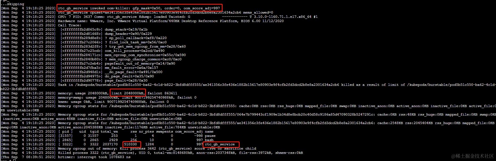

接下来我们要来看进程 OOM，为了能说清楚 OOM 的问题，需要先介绍两个概：overcommit 和 swappiness。


## Overcommit：malloc 内存可以有多大

我的实验的 Centos7 环境的物理内存是 2G，那 malloc 申请 5G 内存可以吗？

来做一个实验，将之前的代码做一些修改。

```c
#include <stdlib.h>
#include <stdio.h>
#include <string.h>
int main() {
    char *p = malloc(5 * 1024 * 1024 * 1024L);
    if (p == NULL) {
        printf("malloc failed\n");
    } else {
        printf("Address of p is: %p\n", p);
    }
    getchar();
    return 0;
}
```

编译运行上面的程序，发现 malloc 居然失败了。

```powershell
$ gcc malloc_test_01.c;./a.out                                                                                                              
malloc failed
```

这就涉及到 Linux 内存分配的 Overcommit 机制，一般来说进程实际使用的内存比申请的内存要小，malloc 申请的内存只有在真正使用的时候才分配，内核参数 vm.overcommit\_memory 用来控制是否允许申请超过当前可用物理内存的行为。

*   0：表示 OVERCOMMIT\_GUESS，也被称为启发式（Heuristic）overcommit，默认的策略是这种。
*   1：表示 OVERCOMMIT\_ALWAYS，也就是对申请来者不拒。
*   2：禁止 OVERCOMMIT\_NEVER，也就是禁止 overcommit。

指定 OVERCOMMIT\_GUESS 其实就是让内核自己根据当前情况进行判断，会检查 buddy 系统里多少 free 的内存、可被交换回磁盘的文件 page cache、空闲交换分区 swap 等可回收的页面区。如果申请分配的值大于这个值就会申请失败。

当指定 OVERCOMMIT\_ALWAYS 时，内存申请总是会成功，这个时候 Linux 就只能指望应用程序善良。

OVERCOMMIT\_NEVER 是最严格的 overcommit 策略，它的 overcommit 阈值是计算出来的，计算的源码如下：

```c
unsigned long vm_commit_limit(void)
{
	unsigned long allowed;

	if (sysctl_overcommit_kbytes)
		allowed = sysctl_overcommit_kbytes >> (PAGE_SHIFT - 10);
	else
		allowed = ((totalram_pages - hugetlb_total_pages())
			   * sysctl_overcommit_ratio / 100);
	allowed += total_swap_pages;

	return allowed;
}
```

sysctl\_overcommit\_kbytes 默认值为 0，会走 else 的逻辑，默认在没有开启 huge pge 的情况下 hugetlb\_total\_pages 函数返回值也为 0，sysctl\_overcommit\_ratio 的默认值为 50，简化过的计算如下：

```powershell
CommitLimit = totalram_pages * 0.5 + total_swap_pages;
```

也就是 CommitLimit 为物理内存的 1/2 加上 SWAP 分区的大小。CommitLimit 的值可以通过查看 /proc/meminfo 文件得到。

```powershell
$ cat /proc/meminfo  | grep -i commit
CommitLimit:     3004104 kB
Committed_AS:     987600 kB
```

## swap

在 Linux 中一个进程使用的内存分为下面两种：

*   第一种是有文件背景的内存页（File-backed page），比如代码段、mmap 读写的文件等，这部分内存页可以在内存紧张的情况下将脏页写入到磁盘，然后释放这部分内存，下次访问时再从文件重新读取。

*   第二种是没有文件背景的内存页，也叫匿名内存页（Anonymous Page），比如 Stack、malloc 的内存等，这部分内存页没有对应的磁盘文件。这些内存不能直接回收，放着不用又很浪费。在内存紧张的情况下，可以交换到 swapfile 或者硬盘的 swap 分区。

swap 可以通过 swapoff 和 swapon 命令关闭和打开。

```powershell
swapoff -a
swapon -a
```

除此之外，可以通过 vm.swappiness 参数来选择更倾向于回收文件背景内存页还是匿名内存页，通过 vm.min\_free\_kbytes 参数来调整系统定期回收内存的阈值，这部分内容在后面会单独介绍，这里先不展开。

我们用代码来演示一下匿名内存页的 swap，我的机器的物理内存是 2G，空闲的内存在 1G 多一点。swap 的大小大概是 2G，如下所示：

```powershell
$ free -m
              total        used        free      shared  buff/cache   available
Mem:           1835         474        1216          32         143        1183
Swap:          2015           0        2015
```

可以看到，这个时候 swap 使用的的大小为 0。

接下来写一个简单的测试程序，如下所示：

```c
#include <stdlib.h>
#include <stdio.h>
#include <string.h>
#define GB (1024 * 1024 * 1024)
int main() {
    size_t size = 1L * GB;
    char *p = calloc(1, size);
    printf("p=%p\n", p);
    getchar();
    return 0;
}
```

上面的代码申请了 1GB 的内存并将其内存初始化为 0，编译运行上面的代码：

```powershell
gcc swap_test.c 
./a.out 
```

使用 top 查看内存的占用：

```powershell
  PID USER      PR  NI    VIRT    RES    SHR S  %CPU %MEM     TIME+ COMMAND
12311 ya        20   0 1028.1m 1.000g   0.3m S   0.0 55.8   0:00.24 a.out
```

可以看到此时的消耗的物理内存大小是 1G。然后新开一个终端再次执行 a.out ：

```powershell
  PID USER      PR  NI    VIRT    RES    SHR S  %CPU %MEM     TIME+ COMMAND
12364 ya        20   0 1028.1m 1.000g   0.0m S   0.0 55.8   0:00.79 a.out
12311 ya        20   0 1028.1m 522.5m   0.0m S   0.0 28.5   0:00.24 a.out
```

可以看到第一个运行的 a.out 内存占用 RES 只有 528.7 M 了，少的这部分内存被 swap 到了交换分区。

再开一个终端执行 a.out，可以看到第一次运行的进程 12311 所有的匿名页全部都被交换出去了，RES 等于 0。

```powershell
  PID USER      PR  NI    VIRT    RES    SHR S  %CPU %MEM     TIME+ COMMAND
12430 ya        20   0 1028.1m 1.000g   0.1m S   0.0 55.8   0:00.88 a.out
12364 ya        20   0 1028.1m 505.4m   0.0m S   0.0 27.5   0:00.79 a.out
12311 ya        20   0 1052800      0      0 S   0.0  0.0   0:00.24 a.out
```

我们还可以通过 sar 等工具观测 swap 使用变化的的过程，其中 -r 参数表示显示内存使用的情况，-S 表示显示 Swap 使用情况。

```powershell
sar -r -S 1

07:23:37 AM kbswpfree kbswpused  %swpused  kbswpcad   %swpcad
07:23:38 AM   2064380         0      0.00         0      0.00
07:23:40 AM   1592240    472140     22.87    196900     41.70
07:23:41 AM   1415132    649248     31.45     11688      1.80
07:23:53 AM    970236   1094144     53.00     25328      2.31
07:23:54 AM    487428   1576952     76.39     51028      3.24
07:23:55 AM    284204   1780176     86.23     75988      4.27
```

swpused 列表示已经使用的 swap 区域的百分比，可以看到三次 a.out 运行过程中，swap 区域使用在不断增大。

## OOM

有了上面 overcommit 和 swap 相关的知识，接下来看看 OOM 相关的内容。为了方便，这里关闭了 swap，同时将 overcommit 设置为 1（OVERCOMMIT\_ALWAYS）。

```powershell
sysctl -w vm.overcommit_memory=1
swapoff -a
```

测试程序如下：

```c
#include <stdlib.h>
#include <stdio.h>
#include <string.h>
#define GB (1024 * 1024 * 1024)
#define MB (1024 * 1024)
int main() {
    size_t size = 3L * GB;
    char *p = malloc(size);
    if (p == NULL) {
        printf("%s\n", "malloc failed");
        return -1;
    }
    int i;
    for (i = 0; i < size; ++i) {
        if ((i % (100 * MB)) == 0) {
            printf("written %d MB \n", i / MB);
        }
        p[i] = 'a';
    }
    getchar();
    return 0;
}
```

编译运行上面的程序，输出结果如下所示：

```powershell
written 0 MB 
written 100 MB 
written 200 MB 
...
written 1400 MB 
written 1500 MB 
written 1600 MB 
[1]    3219 killed     ./a.out
```

程序内存分配到一定 1600M 多一点的时候就被系统杀掉了，通过 dmesg 可以查看 OOM 的信息。

```powershell
$ dmesg -T

[Thu Oct 15 10:59:35 2020] a.out invoked oom-killer: gfp_mask=0x280da, order=0, oom_score_adj=0
...
[Thu Oct 15 10:59:35 2020] Out of memory: Kill process 3312 (a.out) score 882 or sacrifice child
```

### OOM killer

决定内核怎么决定杀死哪一个进程的代码逻辑被称为 OOM Killer，它会给每个进程打分，这个得分被称为 oom\_score。Linux 内存紧张时，OOM Killer 会遍历所有的进程，找到最高愤分数的进程将其杀掉。

oom\_score 的值可以通过 /proc/<pid>/oom\_score 的值来获取。如下所示：

```powershell
$ cat /proc/15633/oom_score
559
```

可以看到进程号为 15633 进程的 oom\_score 值为 559。

oom\_score 计算的逻辑位于 `mm/oom_kill.c` 的 oom\_badness 方法中，oom score 取决于下面这几个因素：

*   进程 rss、pagetable、swap 区域使用的大小；
*   Root 特权用户进程减去 3% 的分数；
*   加上 oom\_score\_adj，oom\_score\_adj 我们待会再讲。

分数的计算方式是百分比乘十（percent-times-ten），也就是说，如果一个进程内存消耗了系统所有的内存，那么它的打分就是 1000。如果一个进程消耗的内存为 0，那么它的打分为 0。

除了通过内存的消耗，Linux 还提供了 oom\_score\_adj 选项来让用户可以对分数进行修正、可以通过修改 `/proc/{pid}/oom_score_adj` 来实现，它的值的范围是 -1000\~1000，它的定义如下：

```c
#define OOM_SCORE_ADJ_MIN	(-1000)
#define OOM_SCORE_ADJ_MAX	1000
```

进程的 oom\_score\_adj 的值设置得越大，同等情况下打分越高，越有可能被杀死。当
oom\_score\_adj 被设定为最小值 -1000 时，badness 函数返回 0，也就是进程永远不会被 OOM-Killer 杀死。

我们可以通过调整 oom\_score\_adj 的值动态观察最终的打分结果，当前有一个进程打分为 559，然后将 oom\_score\_adj 的值为改为 500，接下来再来查看 oom\_score 的值。

```powershell
$ cat /proc/20846/oom_score
559

$ echo 500 > /proc/20846/oom_score_adj

$ cat /proc/20846/oom_score
1058
```

可以看到 oom\_score\_adj 增加了 500，oom\_score 的值也增加了 499，至于为什么不是整 500，是因为 oom\_score 在计算中会转为千分制的形式，会有一些精度的丢失。

### oom\_score\_adj 可以随意更改吗

那如果有一个进程比较鸡贼，启动完就去把自己的 oom\_score\_adj 改为 -1000，这个时候 oom\_score 变为 0，就算这个时候它占了最多的内存，Linux 也不会去杀掉它，而是去杀一些占用内存很小的其它进程，收效胜微，很有可能马上就会再次出发 OOM-Killer。

我们来实验一下：

```powershell
$ echo 500 > /proc/`pidof a.out`/oom_score_adj  // success

$ echo 1000 > /proc/`pidof a.out`/oom_score_adj // success

$ echo -500 > /proc/`pidof a.out`/oom_score_adj // fail
echo: write error: permission denied
```

可以看到在尝试将 oom\_score\_adj 改为 -500 的时候提示无权限。接下来用 sudo 进行修改：

```powershell
$ sudo echo -500 > /proc/`pidof a.out`/oom_score_adj // success
```

接下来用普通用户再去修改 -400、-200 就没有问题。

```powershell
$ echo -400 > /proc/`pidof a.out`/oom_score_adj
$ echo -200 > /proc/`pidof a.out`/oom_score_adj
```

如果想改为 -600 还是会提示无权限。

Linux 就是在进程的结构体里记录了 oom\_score\_adj 出现过的最小值，如果设置比这个小的值，就会需要 root 权限，与 oom\_score\_adj 当前是什么值无关。

## 如何看 OOM 日志

下面是一个线上的 OOM 日志，为什么 oom 日志中的 rss 看起来显示很小，但还是被杀了。total\_vm:2037170k，实际 rss：510330k，limit 是 2G，但是容器被 oom 干掉了，比如这个名为 rtc 的程序：



通过源码分析： https://elixir.bootlin.com/linux/v3.10.108/source/mm/oom_kill.c#L343

*   rss：它表示的是进程当前使用的物理内存的数量，**以 4k 一页为单位**。比如上面 rtc 的日志中，rtc 程序的内存 510330\*4KB=2041320KB，已经超过了 cgroup 的上限，所以此 rtc 进程被杀。
*   nr\_ptes：内存页表占用的内存页数，一般比较小，可以忽略。

源码如下：

```c
/**
 * dump_tasks - dump current memory state of all system tasks
 * @memcg: current's memory controller, if constrained
 * @nodemask: nodemask passed to page allocator for mempolicy ooms
 *
 * Dumps the current memory state of all eligible tasks.  Tasks not in the same
 * memcg, not in the same cpuset, or bound to a disjoint set of mempolicy nodes
 * are not shown.
 * State information includes task's pid, uid, tgid, vm size, rss, nr_ptes,
 * swapents, oom_score_adj value, and name.
 */
static void dump_tasks(const struct mem_cgroup *memcg, const nodemask_t *nodemask)
{
	struct task_struct *p;
	struct task_struct *task;

	pr_info("[ pid ]   uid  tgid total_vm      rss nr_ptes swapents oom_score_adj name\n");
	rcu_read_lock();
	for_each_process(p) {
		if (oom_unkillable_task(p, memcg, nodemask))
			continue;

		task = find_lock_task_mm(p);
		if (!task) {
			/*
			 * This is a kthread or all of p's threads have already
			 * detached their mm's.  There's no need to report
			 * them; they can't be oom killed anyway.
			 */
			continue;
		}

		pr_info("[%5d] %5d %5d %8lu %8lu %7lu %8lu         %5hd %s\n",
			task->pid, from_kuid(&init_user_ns, task_uid(task)),
			task->tgid, task->mm->total_vm, get_mm_rss(task->mm),
			task->mm->nr_ptes,
			get_mm_counter(task->mm, MM_SWAPENTS),
			task->signal->oom_score_adj, task->comm);
		task_unlock(task);
	}
	rcu_read_unlock();
}


static inline unsigned long get_mm_rss(struct mm_struct *mm)
{
	return get_mm_counter(mm, MM_FILEPAGES) + // 有文件背景的内存页面数量，mmap 等
		get_mm_counter(mm, MM_ANONPAGES); // 匿名内存页面数量
}

static inline unsigned long get_mm_counter(struct mm_struct *mm, int member)
{
	long val = atomic_long_read(&mm->rss_stat.count[member]);
	return (unsigned long)val;
}
```

rss\_stat 是一个结构体，用于跟踪进程（或线程）的 RSS（Resident Set Size）统计信息。

```c
struct mm_rss_stat {
	atomic_long_t count[NR_MM_COUNTERS];
};
```

其中，`NR_MM_COUNTERS` 是一个枚举，表示了不同类型的内存计数器。常见的计数器包括（但不限于）：

*   **`MM_FILEPAGES`**: 映射到文件的页面数量。
*   **`MM_ANONPAGES`**: 匿名页面的数量，这些页面不是映射到任何文件的。
*   **`MM_SWAPENTS`**: 进程使用的交换条目数。
*   **`MM_SHMEMPAGES`**: 共享内存的页面数量。

每个计数器对应的值表示了进程当前使用的该类页面的数量。例如，count\[MM\_ANONPAGES] 将表示进程使用的匿名页面的数量。

看 oom 日志中时，要注意，到底是已经帮你算好的 kb 还是，内存页面的数量 X 4KB。
