这个小节的主要内容是 malloc 和 free 的底层原理，与人类的三个终极问题一样，本节也想搞清楚内存从哪里申请来，释放以后去了哪里。


## Linux 内存管理有三个层面

Linux 内存管理有三个层面：第一层是我们的用户管理层，比如我们自己程序的内存池，mysql 的 bufferpool；第二层是 C 的运行时库，这部分代码是对内核的一个包装，方便上层应用更方便地开发；再下一层就是我们的内核层了。

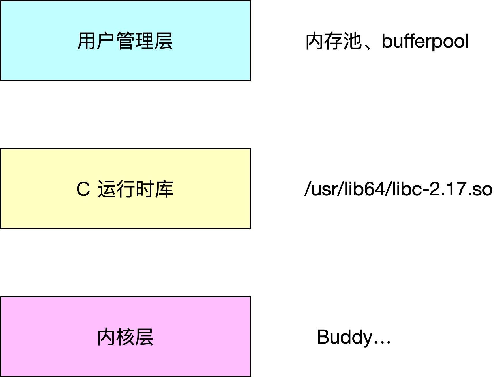

我们今天要重点介绍的就是中间那一层，这一层是由一个 libc 的库来实现的，接下来详细看看看 libc 内存管理是如何做的。

Linux 内存管理的核心思想就是分层管理、批发零售、隐藏内部细节。我们还需要铭记在心的是 libc 中堆的管理是针对小内存分配释放来设计的，为了编程接口上的统一，大内存也是支持的。


我们先来看内存申请释放的两个函数，malloc 和 free，这两个函数的定义如下：

```c
#include <stdlib.h>

void *malloc(size_t size);
void free(void *ptr);

```

前面介绍的 brk 和 mmap 是两个底层的系统调用可以分配内存，那为什么要需要 glibc 再封装一层，实现一个内存分配器呢？


## Linux 中的内存分配器 

内存的申请和释放特别频繁，如果每次都去执行系统调用，开销会很大。所以内存分配器想到的第一个解决办法是缓存，申请内存时，向操作系统多批发一点，慢慢零售给用户进程，释放时暂时不归还给操作系统，在内部标记为空闲即可，libc 就是一个内存的二道贩子。

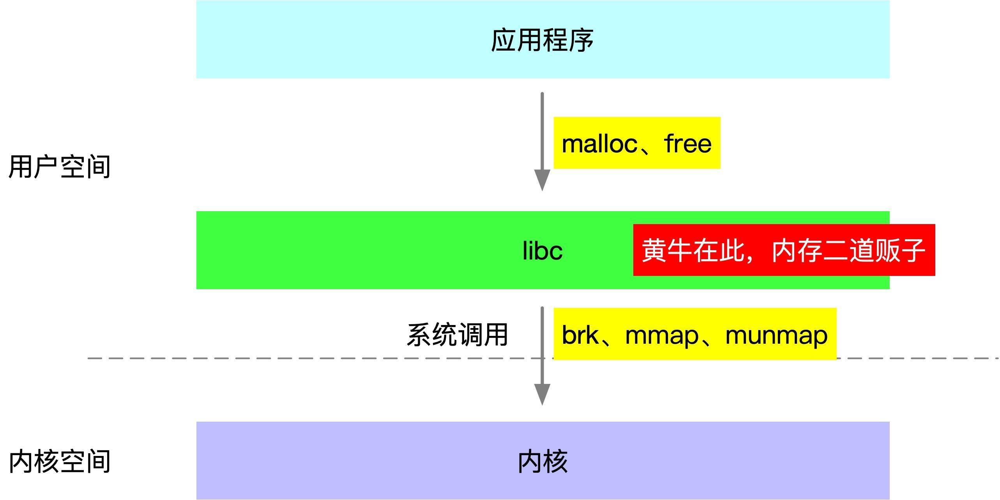

实现内存分配器还有一个原因是为了编程上的统一，比如有些时候用 brk，有些时候用 mmap，不太友好，brk 在多线程下还需要进行加锁，用一个 malloc 就很香。

对于上层应用而言，主要是跟内存分配器打交道，Linux 默认的内存分配器是 ptmalloc2，是 glibc 中一个模块。比较出名的还有下面这几个：


- dlmalloc：dlmalloc 是 Doug Lea 实现的，名字中的 dl 是作者的名字缩写。
- ptmalloc2：是 dlmalloc 的一个扩展版本，支持多线程。
- jemalloc：FreeBSD/Firefox 在使用 jemalloc，在多线程情况下的有很多高性能以及有效地减少了内存碎片的产生。
- tcmalloc：Google 出品， Golang 中就使用了类似的算法进行内存分配，在对抗内存碎片、在多核处理器方面表现很好。

这些内存分配器致力于解决两个问题：多线程下锁的粒度问题，是全局锁，还是局部锁还是无锁。第二个问题是小内存回收和内存碎片问题，比如 jemalloc 在内存碎片上有显著的优势。


接下来我们来看 Linux 默认的内存分配器 ptmalloc，我总结了一下它有关的四个核心概念：`Arena`、`Heap`、`Chunk`、`Bins`。


## ptmalloc 的核心概念

### 内存分配的主战场 Arena

先来看 Arena，Arena 的中文翻译的意思是主战场、舞台，对应在内存分配这里，指的是内存分配的主战场。


Arena 的出现首先用来解决多线程下全局锁的问题，它的思路是尽可能地让一个线程独占一个 Arena，同时一个线程会申请一个或多个堆，释放的内存又会进入回收站，Arena 就是用来管理这些堆和回收站的。

Arena 的数据结构长啥样？它是一个结构体，可以用下面的图来表示：

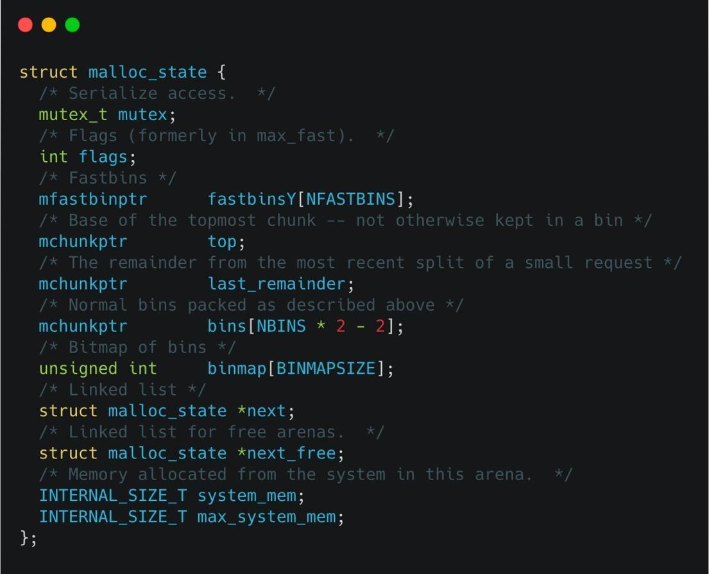


它是一个单向循环链表，使用 mutex 锁来处理多线程竞争，释放的小块内存会放在 bins 的结构中。

前面提到，Arena 会尽量让一个线程独占一个锁，那如果我有几千个线程，会生成几千个 Arena 吗？显然是不会的，所有跟线程有关的瓶颈问题，最后都会走到 CPU 核数的限制这里来，分配区的个数也是有上限的，64 位系统下，分配区的个数大小是 cpu 核数的八倍，多个 Arena 组成单向循环链表。

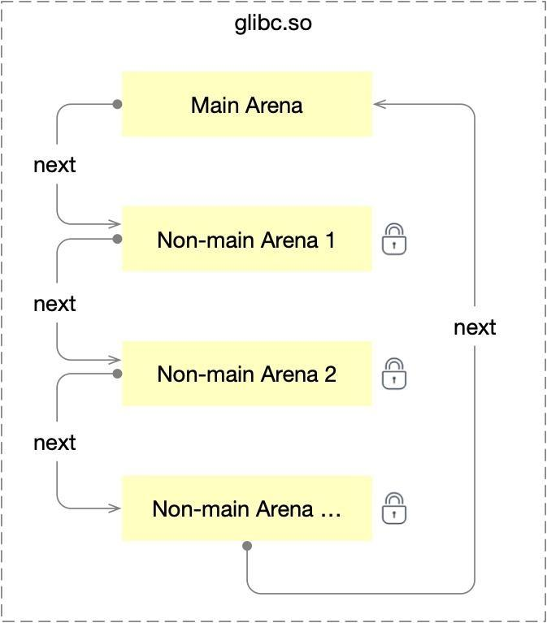

我们可以写个代码来打印 Arena 的信息。它的原理是对于一个确定的程序，main_arena 的地址是一个位于 glibc 库的确定的地址，我们在 gdb 调试工具中可以打印这个地址。也可以使用 ptype 命令来查看这个地址对应的结构信息，如下图所示：


有了这个基础，我们就可以写一个 do while 来遍历这个循环链表了。我们把 main_arena 的地址转为 malloc_state 的指针，然后 do while 遍历，直到遍历到链表头。
​
```c
struct malloc_state {
    int mutex;
    int flags;
​
    void *fastbinsY[NFASTBINS];
    struct malloc_chunk *top;
    struct malloc_chunk *last_remainder;
    struct malloc_chunk *bins[NBINS * 2 - 2];
    unsigned int binmap[4];
    struct malloc_state *next;
    struct malloc_state *next_free;
​
    size_t system_mem;
    size_t max_system_mem;
};
​
void print_arenas(struct malloc_state *main_arena) {
    struct malloc_state *ar_ptr = main_arena;
    int i = 0;
    do {
        printf("arena[%02d] %p\n", i++, ar_ptr);
        ar_ptr = ar_ptr->next;
    } while (ar_ptr != main_arena);
}
​
#define MAIN_ARENA_ADDR 0x7ffff7bb8760
​
int main() {
    ...
    print_arenas((void*)MAIN_ARENA_ADDR);
    return 0;
}
```

输出结果如下：

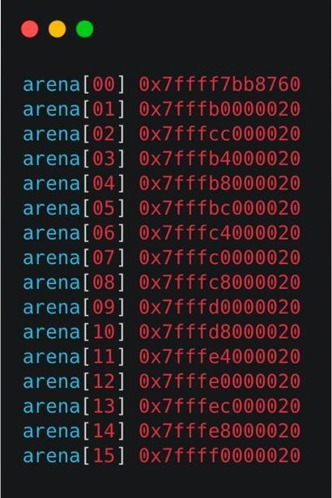

#### 主分配区与非主分配区

那为什么还要区分一个主分配，一个非主分配区呢？

这有点像皇上和王爷的关系，主分配区只有一个，它还有一个特权，可以使用靠近 DATA 段的 Heap 区，它通过调整 brk 指针来申请释放内存。

从某种意义上来讲，Heap 区不过是 DATA 段的扩展而已，主分配区内存分配的示意图如下：


非主分配区呢？它更像是一个分封在外地，自主创业的王爷，它想要内存时就使用 mmap 批发大块内存（64M）作为子堆（Sub Heap），然后再慢慢零售给上层应用。

一个 64M 用完，再开辟一个新的，多个子堆之间也是使用链表相连，一个 Arena 可以有多个子堆。在接下的内容中，我们还会继续详细介绍。

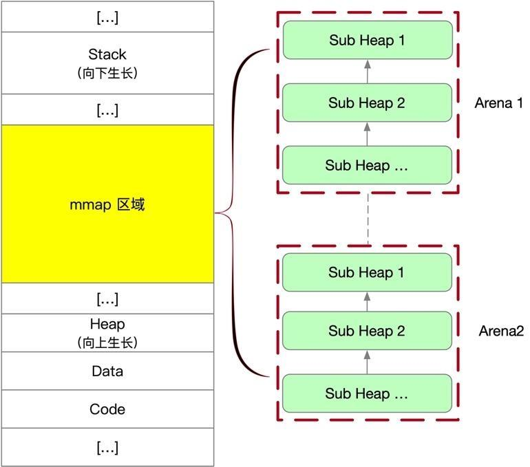

### 大块连续内存集散地 Heap

接下来我们来看 ptmalloc2 的第二个核心概念，heap 用来表示大块连续的内存区域。

主分配区的 heap 没有什么好讲的，我们这里重点看「非主分配」的子堆（也称为模拟堆），前面提到过，非主分配批发大块内存进行切割零售的。

那如何理解切割零售这句话呢？它的实现也非常简单，先申请一块 64M 大小的不可读不可写不可执行（PROT_NONE）的内存区域，需要内存时使用 mprotect 把一块内存区域的权限改为可读可写（R+W）即可，这块内存区域就可以分配给上层应用了。

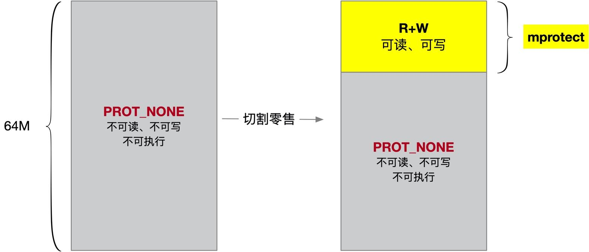

以我们前面 java 进程的内存布局为例：

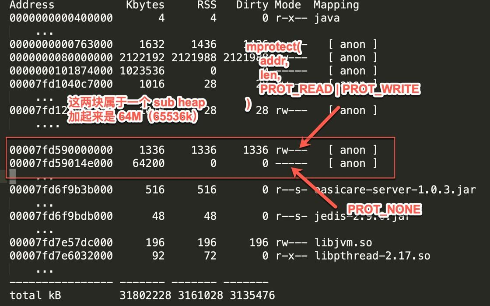

这中间的两块内存区域是属于一个子堆，它们加起来的大小是 64M，然后其中有一块 1.3M 大小的内存区域就是使用 mprotrect 分配出去的，剩下的 63M 左右的区域，是不可读不可写不可执行的待分配区域。

知道这个有什么用呢？太有用了，你在 google 里所有 Java 堆外内存等问题，有很大可能性会搜到 Linux 神奇的 64M 内存问题。有了这里的知识，你就比较清楚到底这 64M 内存问题是什么了。


与前面的 Arena 一样，我们同样可以在代码中，遍历所有 Arena 的所有的 heap 列表，代码如下所示：

```c
struct heap_info {
    struct malloc_state *ar_ptr;
    struct heap_info *prev;
    size_t size;
    size_t mprotect_size;
    char pad[0];
};

void dump_non_main_subheaps(struct malloc_state *main_arena) {
    struct malloc_state *ar_ptr = main_arena->next;
    int i = 0;
    while (ar_ptr != main_arena) {
        printf("arena[%d]\n", ++i);
        struct heap_info *heap = heap_for_ptr(ar_ptr->top);
        do {
            printf("arena:%p, heap: %p, size: %d\n", heap->ar_ptr, heap, heap->size);
            heap = heap->prev;
        } while (heap != NULL);
        ar_ptr = ar_ptr->next;
    }
}

#define MAIN_ARENA_ADDR 0x7ffff7bb8760
dump_non_main_subheaps((void*)MAIN_ARENA_ADDR);
```

### 堆的基本数据结构 Chunk

接下来我们来看分配的基本单元 chunk，chunk 的字面意思是「厚块、厚片」，chunk 是 glibc 中内存分配的基础单元。以一个简单的例子来开头。

有下面这四种不同类型的 chunk。

- Allocated chunk：已分配的堆块。
- Free chunk：空闲的堆块。
- Top chunk：也是空闲堆块，位于 arena 的顶部。
- Last Remainder chunk：本节不做介绍。

#### 多出来的 0x10 字节

这里我们挑选第一种 chunk 来做详细的介绍。接下来我们来做一个实验，看看 malloc 分配的内存区块的大小情况，代码如下：

```c
#include <stdio.h>
#include <stdlib.h>
#include <unistd.h>

int main(void) {
    void *p;

    p = malloc(1024);
    printf("%p\n", p);

    p = malloc(1024);
    printf("%p\n", p);
    
    p = malloc(1024);
    printf("%p\n", p);
    
    getchar();
    return (EXIT_SUCCESS);
}
```

这段代码分配了三次 1k 大小的内存，内存地址是：

```powershell
./malloc_test
                                                                              
0x602010
0x602420
0x602830
```

pmap 输出的结果如下所示：

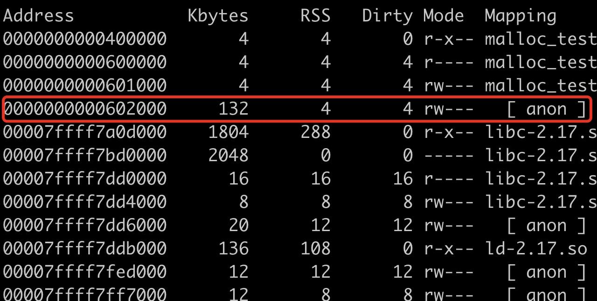

可以看到第一次分配的内存区域地址 0x602010 在这块内存区域的基址(0x602000)偏移量 16(0x10) 的地方。

再来看第二次分配的内存区域地址 0x602420 与 0x602010 的差值是 1,040 = 1024 + 16(0x10)。

第三次分配的内存以此类推是一样的，每次都空了 0x10 个字节。

为什么会多出来 0x10 字节呢？我们先按下不表。

再来回看 malloc 和 free，那我们不禁问自己一个问题，free 函数的参数只有一个指针，它是怎么知道要释放多少内存的呢？

```c
#include <stdlib.h>

void *malloc(size_t size);
void free(void *ptr);
```

#### Chunk 的内部结构

香港作家张小娴说过，「凡事皆有代价，快乐的代价便是痛苦」。为了存储 1k 的数据，实际上还需要一些数据来记录这块内存的元数据。这块额外的数据被称为 chunk header，长度为 16 字节。这就是我们前面看到的多出来 0x10 字节。

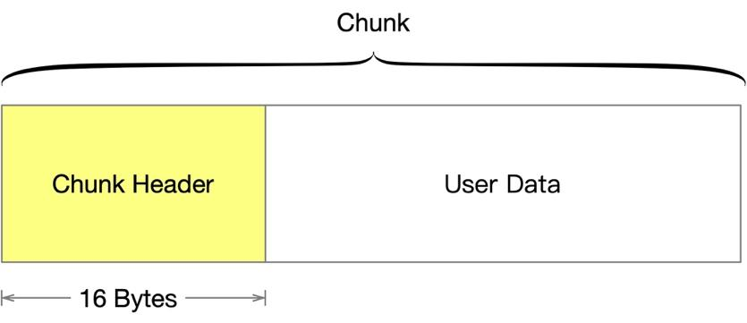

这种通过在实际数据前面添加 head 方式使用的非常普遍，比如 java 中 new Integer(1024)，实际存储的数据大小远不止 4 字节，它有一个巨大无比的对象头，里面存储了对象的 hashcode，经过了几次 GC，有没有被当做锁同步。

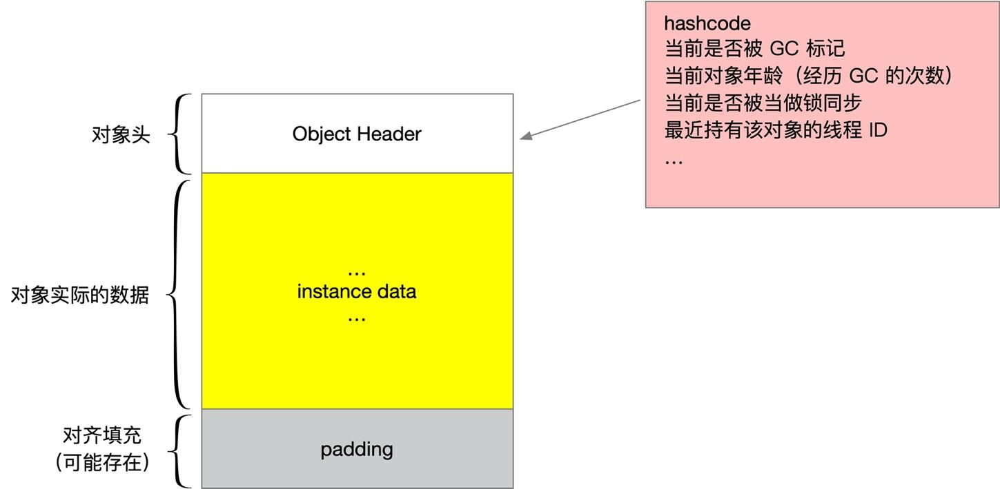

害，说 java 臃肿并不是没有道理。

我们继续来看这个 16 字节的 header 里面到底存储了什么，它的结构示意图如下所示：

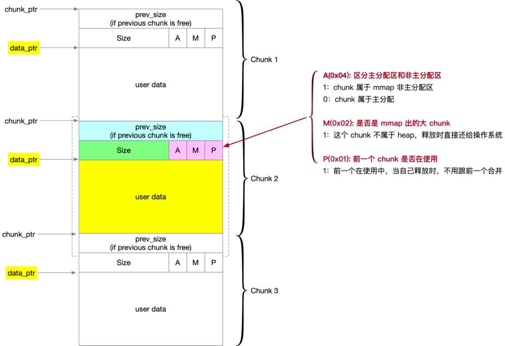

它分为两部分，前 8 字节表示前一个 chunk 块的大小，接下来的 8 字节表示当前 chunk 块的大小。


因为 64 位系统中内存分配都会 4 字节对齐，实际上最低 3 位对内存大小没有什么意义，最低 3 位被借用来表示特殊含义。最低三位的含义如下：

- A：表示该 chunk 属于主分配区或者非主分配区，主分配区这个值为 0，非主分配区为 1。
- M：表示当前 chunk 是从哪个内存区域获得的内存。M 为 1 表示该 chunk 是从 mmap 映射区域分配的大的 chunk 块。
- P：表示前一个块是否在使用中，P 为 0 则表示前一个 chunk 为空闲，这时 chunk 的第一个域 prev_size 才有效。P 为 1 表示上一个 chunk 处于使用状态。这个标记为的主要作用是判断 free 的时候能否与上一个 chunk 块进行合并。

从 glibc 源码中可以看得更清楚一些：

```c
#define PREV_INUSE 0x1
/* extract inuse bit of previous chunk */
#define prev_inuse(p)       ((p)->size & PREV_INUSE)

#define IS_MMAPPED 0x2
/* check for mmap()'ed chunk */
#define chunk_is_mmapped(p) ((p)->size & IS_MMAPPED)

#define NON_MAIN_ARENA 0x4
/* check for chunk from non-main arena */
#define chunk_non_main_arena(p) ((p)->size & NON_MAIN_ARENA)

#define SIZE_BITS (PREV_INUSE|IS_MMAPPED|NON_MAIN_ARENA)
/* Get size, ignoring use bits */
#define chunksize(p)         ((p)->size & ~(SIZE_BITS))
```

可以使用 gdb 查看这三个内存地址往前 0x10 字节开始的 32 字节区域。

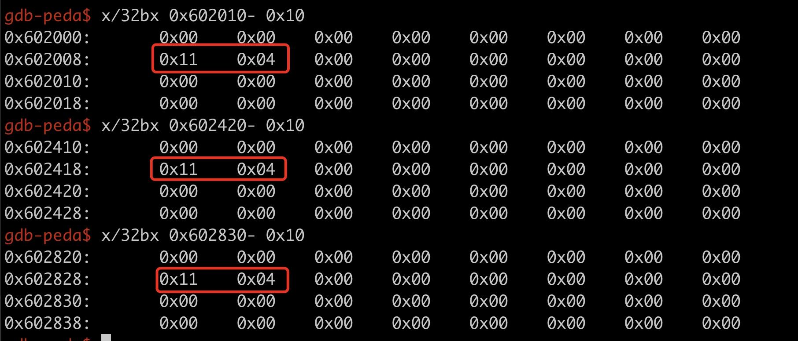

可以看到实际上存储的是 0x0411（1041），为什么是 0x0411 呢？

因为当一个 chunk 正在被使用时，它的下一个 chunk 的 prev_size 是没有意义的，这 8 个字节可以被这个当前 chunk 使用。别奇怪，就是这么抠。

所以，一个使用中的 chunk 额外的开销就是自身 16 字节的头部大小减去下一个 chunk 可使用 8 字节，也就是 8 字节。

请求大小为 req 的内存，实际 chunk 的大小为 req + 8，然后还有一点要记住，64 位系统中，chunk 的大小要对齐到 2*sizeof(size_t)，也就是 16B。

当用户请求 1024 字节的内存，实际分配的 chunk 大小为 1024 + 8，对齐到 16B，就变为了 1040。

size 的最低三位为 b001，A = 0 表示这个chunk 不属于主分配区，M = 0，表示是从 heap 区域分配的，P = 1 表示前一个 chunk 在使用中。


所以，最后 size of chunk 的值为：

```powershell
0x0400 + 0x10 + 0x01 = 0x0411
```

接下来我们来看看，其它两个标记位被使用的情况，也就是分配在非主分配区，使用 mmap 分配的情况，代码如下：

```c
#include <stdio.h>
#include <stdlib.h>
#include <pthread.h>

void *foo(void *args) {
    char *addr = (char *)malloc(128 * 1024);
    printf("addr: %p\n", addr);
}

int main() {
    pthread_t t;
    pthread_create(&t, NULL, foo, NULL);
    pthread_join(t, NULL);
    getchar();
    return 0;
}
```

与前面的类似，使用 gdb 查看 addr 前 16 字节开始的内存情况，如下所示：

```powershell
(gdb) x/32bx 0x7ffff00008c0 - 0x10
0x7ffff00008b0: 0x00    0x00    0x00    0x00    0x00    0x00    0x00    0x00
0x7ffff00008b8: 0x15    0x00    0x02    0x00    0x00    0x00    0x00    0x00
0x7ffff00008c0: 0x00    0x00    0x00    0x00    0x00    0x00    0x00    0x00
0x7ffff00008c8: 0x00    0x00    0x00    0x00    0x00    0x00    0x00    0x00
```

根据前面的介绍，AMP 标记为 0x05(b101)，size 为 0x020010。

- A = 1 表示这个一个非主线程在非主分配器分配的 chunk。
- M = 0 表示这个 chunk 从堆块中 top chunk 分裂，而不是由 mmap 分配。
- P = 1 表示前一个 chunk 在使用中，因为这时该堆块第一个 chunk，前一个默认标记位为用中


#### chunk prev_size 的复用

当一个 chunk 正在被使用时，它的下一个 chunk 的 prev_size 是没有意义的，这 8 个字节可以被这个当前 chunk 使用。别奇怪，就是这么抠。接下来我们来看看 chunk 中 prev_size 的复用。测试的代码如下：

```c
#include <stdlib.h>
#include <string.h>
void main() {
    char *p1, *p2;
    p1 = (char *)malloc(sizeof(char) * 18); // 0x602010
    p2 = (char *)malloc(sizeof(char) * 1);  // 0x602030
    memcpy(p1, "111111111111111111", 18);
}
```

编译这个源文件，然后使用 gdb 调试单步运行，查看 p1、p2 的地址：

```powershell

p/x p1
$2 = 0x602010

(gdb) p/x p2
$3 = 0x602030
```

然后输出 p1、p2 附近的内存区域：

```powershell
(gdb) x/64bx p1-0x10
0x602000:       0x00    0x00    0x00    0x00    0x00    0x00    0x00    0x00
0x602008:       0x21    0x00    0x00    0x00    0x00    0x00    0x00    0x00
0x602010:       0x31    0x31    0x31    0x31    0x31    0x31    0x31    0x31
0x602018:       0x31    0x31    0x31    0x31    0x31    0x31    0x31    0x31
0x602020:       0x31    0x31    0x00    0x00    0x00    0x00    0x00    0x00
0x602028:       0x21    0x00    0x00    0x00    0x00    0x00    0x00    0x00
0x602030:       0x00    0x00    0x00    0x00    0x00    0x00    0x00    0x00
0x602038:       0x00    0x00    0x00    0x00    0x00    0x00    0x00    0x00

```
布局如下图所示：

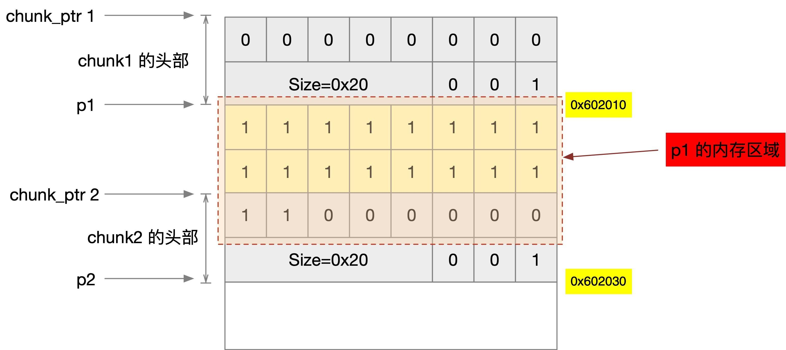


malloc 的大小需要按照一定的规则对齐：

- 在 32 位系统上，按照 size+4 对齐 0x10；
- 在 64 位系统上，按照 size+8 对齐 0x20。

因此，p1 对应的 chunk 的大小计算是 18 + 8 然后对齐到 16 字节，所以等于 0x20(32)，又因为低三位为 b001，最终的 size 值为 0x21。
下一个 chunk 的 prev_size 没有作用，可以被 p1 的 chunk 复用来存储用户的数据，可以看到 p1 的最后两个 1 是存储在下一个 chunk 的 prev_size 区域的。

> 小贴士：实际内存申请的空间与用户请求申请的空间往往是不一样的

原因下面这几个：

- chunk 有额外的 16 字节的头部开销；
- chunk 大小要对齐到 2 * sizeof(size_t)，也就是 16 字节；
- 当前 chunk 在使用时，下一个 chunk 的 8 字节的 prev_size 区域是可以被当前 chunk 使用的。

其它几种 chunk 的结构可以用类似的方式来进行调试验证，这里不展开说明。

我们接下来看最后一个概念，小块内存的回收站 Bins。


### 堆空闲块管理结构 bin

bin 的字面意思是「垃圾箱」。内存在应用调用 free 释放以后 chunk 不一定会立刻归还给系统，而是就被 glibc 这个二道贩子截胡。这也是为了效率的考量，当用户下次请求分配内存时，ptmalloc2 会先尝试从空闲 chunk 内存池中找到一个合适的内存区域返回给应用，这样就避免了频繁的 brk、mmap 系统调用。


#### bin 的两种类型

内存的回收站分为两大类，第一类是普通的 bin，一类是 fastbin。

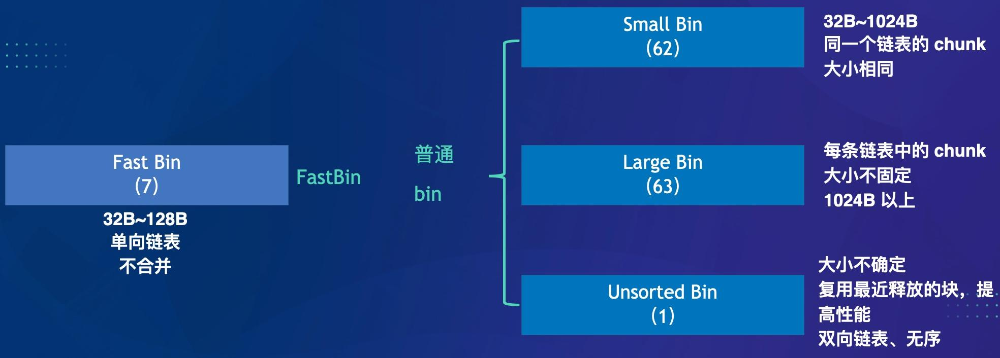


fastbin 采用单向链表，每条链表的中空闲 chunk 大小是确定的，插入删除都在队尾进行。

普通 bin 根据回收的内存大小又分为了 small、large 和 unsorted 三种，采用双向链表存储，它们之间最大的区别就是它们存储的 chunk 块的大小范围不一样。

普通 bin 采用双向链表存储，以数组形式定义，共 254 个元素，两个数组元素组成一个 bin，通过 fd、bk 组成双向循环链表，结构有点像九连环玩具。


所以普通 bin 的总个数是 254/2 = 127 个。其中 unsorted bin 只有 1 个，small 有 62 个，large bin 有 63 个，还有一个暂未使用，如下图所示：


这些 bin 的介绍如下。

- bin0 目前没有使用。
- bin1 是 `unsorted bin`，主要用于存放刚刚释放的 chunk 堆块以及大堆块分配后剩余的堆块，大小没有限制。
- bin2~bin63 是 `small bins`，用于维护 < 1024B 的 chunk 内存块，同一条 small bin 链中的 chunk 具有相同的大小，都为 `index * 16`，比如 bin2 对应的链表的 chunk 大小都是 32(0x20)，bin3 对应的链表的 chunk 大小为 48(0x30)。备注：淘宝的 pdf 图中有点问题，pdf 中的 `size * 8`，看源码，应该是 `*16` 才对。
- bin64~bin126 是 `large bins`，用于维护 > 1024B 的堆块，同一条链表中的堆块大小不一定相同。

#### small bin 的内部结构

其中 smallbin 用于维护 <= 1024B 的 chunk 内存块。同一条 small bin 链中的 chunk 具有相同的大小，都为 index * 16，结构如下图所示：

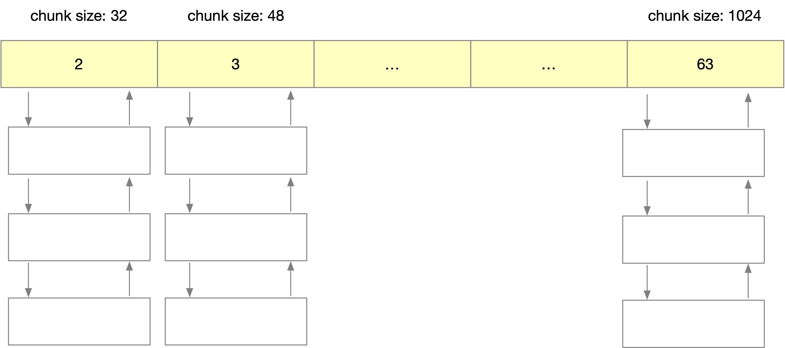

#### large bin 的内部结构

largebin 中同一条链中的 chunk 具有「不同」的大小：

- 分为 6 组；
- 每组的 bin 数量依次为 33、15、8、4、2、1，每条链表中的最大 chunk 大小公差依次为 64B、 512B、4096B、32768B、262144B 等。

结构如下图所示：


#### unsorted bin 的内部结构

unsorted bin 只有一条双向链表，它的特点如下：

- 双向链表管理空闲 chunk，空闲 chunk 不排序；
- 大于 128B 的内存 chunk 回收时先放到 unsorted bin。

它的结构如下图所示：

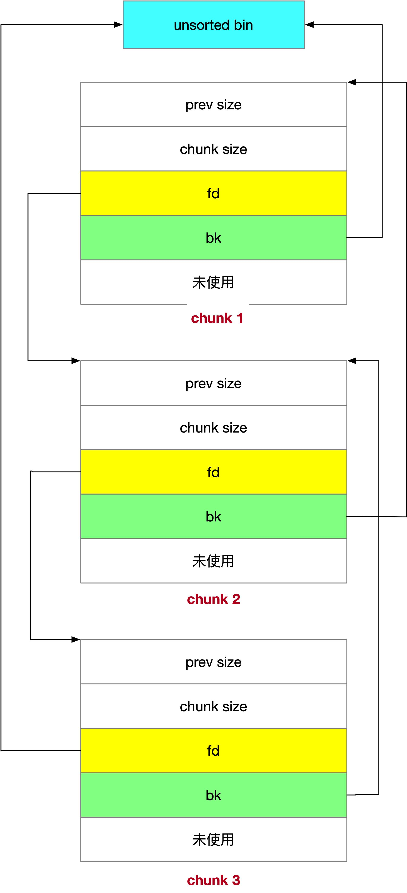

下面是所有普通 bin 的概览图：


#### fast bin 的内部结构

说完了普通 bin，我们来详细看看 FastBin。

FastBin 专门用来提高小内存的分配效率，它的结构如下：

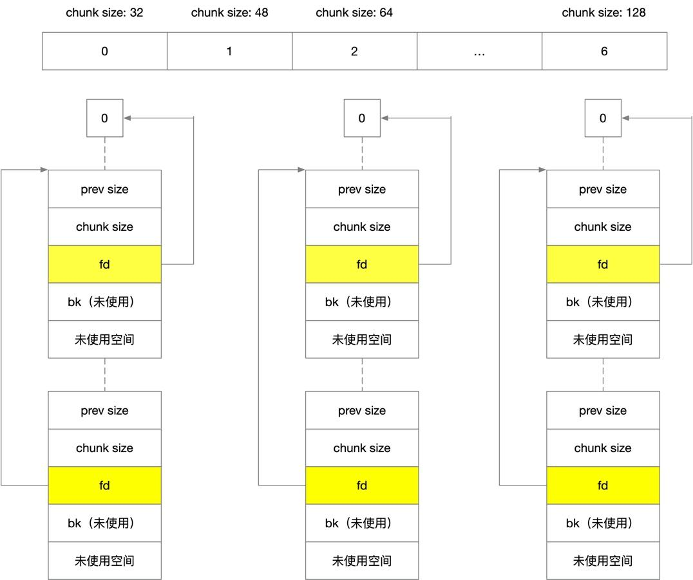

它有下面这些特性：

- 小于 128B 的内存分配会先在 Fast Bin 中查找。
- 单向链表，每条链表中的 chunk 大小相同，有 7 个 chunk 空闲链表，每个 bin 的 chunk 大小依次为 32B，48B，64B，80B，96B，112B，128B。
- 因为是单向链表，fastbin 中的 bk 指针没有用到，第一个 chunk 的 fd 指针指向特殊的 0 地址。
- P 标记始终为 1，一般情况下不合并。
- FIFO，添加和删除都从队尾进行。

Fast bins 可以看作是 small bins 的一小部分 cache。


## 内存的申请与释放

有了前面的知识，我们就可以来回答分享一开头的问题，内存从哪里来。大块内存申请没有特别多可以讲的，直接 mmap 系统调用申请一块，释放的时候也直接还给操作系统。

小块内存的申请就复杂很多了，原则就是先在 chunk 回收站中找，找到了是最好，就直接返回了，不用再去向内核申请。它是怎么做的呢？

首先会根据传入的大小计算真正 chunk 的大小，根据这个大小看看在不在 fastbin 的区间里，如果有的话，从 fastbin 直接返回，如果不在则尝试 smallbin，然后如果 smallbin 里没有则会触发一次合并，然后从 unsorted bin 里查找，还没有则会从 Large Bin 查找，如果没有再去切割 top 块，top 块也没有了，则会重新申请 heap 或者调整 heap 的大小。

如下图所示：

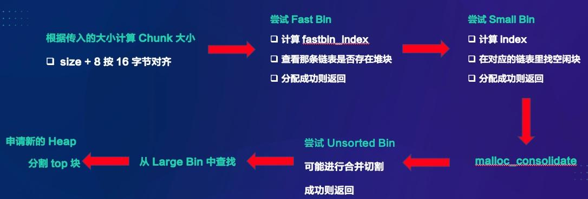

接下来我们来回答最后一个问题，内存 free 以后去了哪里，根据不同的大小，有不同的处理策略。

- 符合 fastbin 的超小块内存直接放入 fastbin 单链表，快速释放。画外音就是这么点空间，值得我处理半天吗？
- 超大块内存，直接还给内核不进入 bin 的管理逻辑。画外音就是大客户要特殊处理，毕竟大客户是少数情况。
- 大部分是介于中间的，释放的时候首先会被放入 unsorted bin。根据情况合并、迁移空闲块，靠近 top 则更新 top chunk。这才是人生常态啊。


到这里，我们 glibc 的内存申请和释放原理就介绍的差不多了，如果想了解更深入的信息，可以去调试 glibc 的源码。
