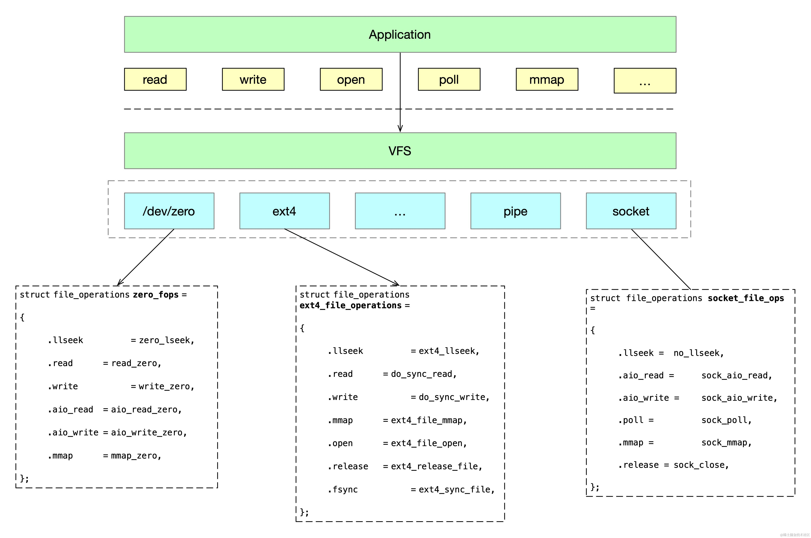
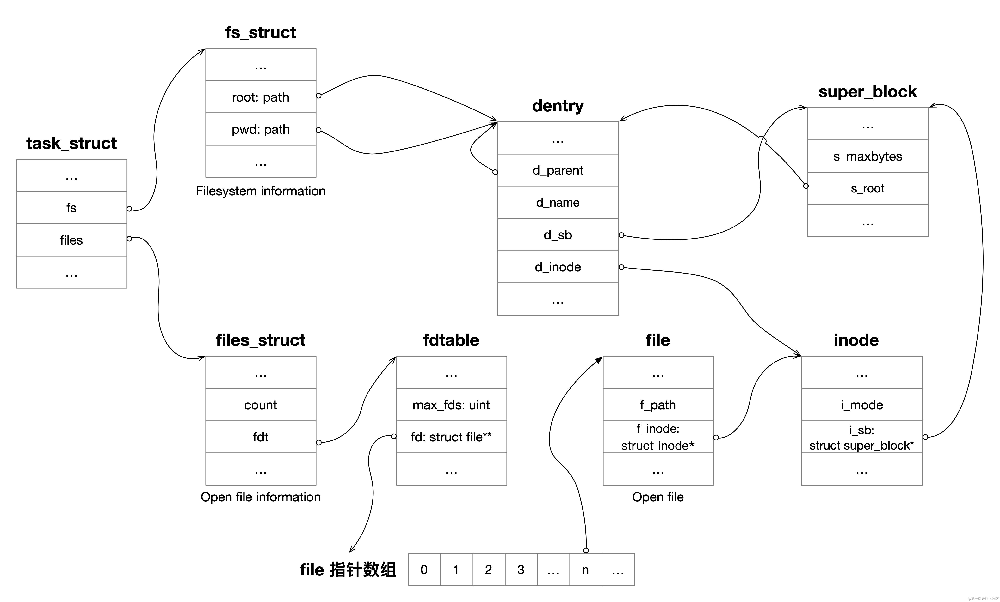

Unix/Linux 操作系统以其独特的哲学理念著称于世 —— “一切皆文件”。这一思想不仅将传统的文本文件纳入其范畴，而且还扩展到了文件目录、socket 套接字、管道、打印机、鼠标键盘等设备和资源。

这种设计的核心在于提供一个统一、简洁的界面，用以处理各种各样的输入输出操作。在这一哲学的指导下，Unix/Linux 系统不需要特别的接口或复杂的协议来处理不同类型的数据和资源。无论是对普通文件的读写，还是对复杂设备如打印机和键盘的操作，都可以通过基础的系统调用如 open、read、write、close 等来完成。

虚拟文件系统（Virtual File System，简称 VFS）在这一体系中扮演着至关重要的角色。作为一个中间层的抽象，VFS 为各类文件系统和存储资源提供了一个统一的接口。




## VFS 数据结构

VFS 定义了一组通用的数据结构来规范各种文件系统，屏蔽底层的实现差异，这些数据结构包括：

*   struct super\_block
*   struct inode
*   struct dentry
*   struct file


## super\_block（超级块）

当一个文件系统被挂载到 Linux 系统上时，内核都会创建一个 `super_block` 结构体来存储该文件系统的元信息。这个结构包含了文件系统的各种属性和操作方法，super\_block 结构体的源码定义在 `<linux/fs.h>`

```c
struct super_block {
	struct list_head	s_list;		// 超级块双向链表
	dev_t			s_dev;		// 设备标识
	unsigned long		s_blocksize; // 块大小
	loff_t			s_maxbytes; // 最大文件 size
	struct file_system_type	* s_type; // 文件系统类型
	const struct super_operations	*s_op; // 函数集合
	unsigned long		s_flags; // 挂载标志
	struct dentry		*s_root; // 挂载目录
	// ...
}
```

其中关键的字段如下：

*   s\_list 的类型为 `list_head`，用来组成双向链表，这个双向链表存储的是已挂载的 `superblock` 列表。
*   s\_dev 是设备标识。
*   s\_type 是一个 struct file\_system\_type 类型的指针，表示文件系统类型，指明了文件系统是 ext4、NFS 还是其他类型。
*   s\_op 是指向 `super_operations` 结构的指针，该结构包含了操作此文件系统超级块的函数集合，比如读取、写入、同步等。
*   s\_flags 包含各种标志，例如只读等，用于表示文件系统的状态。
*   s\_root 指向文件系统根目录的 dentry 结构的指针。

接下了我们来看 `super_operations` 结构体，定义在 `include/linux/fs.h` 文件中。

```c
struct super_operations {
   	struct inode *(*alloc_inode)(struct super_block *sb);
	void (*destroy_inode)(struct inode *);

   	void (*dirty_inode) (struct inode *, int flags);
	int (*write_inode) (struct inode *, struct writeback_control *wbc);
	int (*drop_inode) (struct inode *);
	void (*evict_inode) (struct inode *);
	void (*put_super) (struct super_block *);
	int (*sync_fs)(struct super_block *sb, int wait);
	int (*statfs) (struct dentry *, struct kstatfs *);
	int (*remount_fs) (struct super_block *, int *, char *);
	void (*umount_begin) (struct super_block *);
	...
};
```

它的核心函数介绍如下：

*   alloc\_inode：用于为一个新的 inode 分配内存。
*   destroy\_inode：用于销毁给定的 inode 对象并释放为该 inode 分配的资源。
*   dirty\_inode：当 inode 被修改时，VFS（虚拟文件系统）会调用此函数来标记一个“脏”inode。
*   write\_inode：VFS 调用此方法是为了将 inode 写入磁盘。
*   put\_super：这个函数在 VFS 需要释放超级块时被调用。
*   sync\_fs：同步文件系统调用。
*   statfs：获取 VFS 的文件系统统计信息。
*   remount\_fs：当需要重新挂载文件系统时调用此函数。
*   umount\_begin：当 VFS 正在卸载文件系统时调用此函数。

这些函数为文件系统提供了管理和操作的方法。不同的文件系统会提供这些函数的不同实现，以体现其各自的内部机制和特点。

有了 super\_block 和 super\_operations 这两个结构，我们已经知道了如何管理文件系统，但是管理的对象是什么呢？


## inode

inode 是索引节点（index node）的简写，inode 结构体表示一个具体的文件或者目录。每个 inode 包含了与相应文件或目录相关的元数据，比如文件权限、文件所属的用户、访问和修改时间等。

以下是 inode 结构体的一些关键字段及其含义：

```c
struct inode {
    umode_t			i_mode; // 文件类型和访问权限
    unsigned short		i_opflags; // open flag
    kuid_t			i_uid; // 所属用户 id
    kgid_t			i_gid; // 所属用户组 id
    unsigned int		i_flags; // inode flag
    const struct inode_operations	*i_op; // inode 函数集合，定义了创建、查找、删除等操作
    struct super_block	*i_sb; // 指向所属文件系统 super_block 的指针
    unsigned long		i_ino; // inode 号
    atomic_t		i_count; // 引用计数，表示有多少个地方引用了这个 inode。
    struct timespec64 i_atime;
    struct timespec64 i_mtime;
    struct timespec64 i_ctime;
    ...
}
```

跟 super\_block 一样，inode 也有对应的操作函数集合：

```c
struct inode_operations {
	struct dentry * (*lookup) (struct inode *,struct dentry *, unsigned int);
	int (*readlink) (struct dentry *, char __user *,int);
	int (*create) (struct inode *,struct dentry *, umode_t, bool);
	int (*link) (struct dentry *,struct inode *,struct dentry *);
	int (*unlink) (struct inode *,struct dentry *);
	int (*symlink) (struct inode *,struct dentry *,const char *);
	int (*mkdir) (struct inode *,struct dentry *,umode_t);
	int (*rmdir) (struct inode *,struct dentry *);
	int (*rename) (struct inode *, struct dentry *,
			struct inode *, struct dentry *, unsigned int);
	...
}
```

当 VFS 需要操作一个 inode 时，会调用具体文件系统的函数实现。

下面是我们调试 linux 内核得到的一个实际的 inode 数据：

```powershell
$ ls -i /tmp/x/y/z/test.txt
   7753 /tmp/x/y/z/test.txt
   
$(gdb) p *inode
$7 = {
    i_mode = 33188,
    i_opflags = 13,
    i_op = 0xffffffff820158c0 <shmem_inode_operations>,
    i_sb = 0xffff8880062bc800,
    i_ino = 7753,
    i_size = 6,
    i_atime = {
        tv_sec = 1705544475,
        tv_nsec = 561752392
    },
    i_mtime = {
        tv_sec = 1705544485,
        tv_nsec = 873751968
    },
    i_ctime = {
        tv_sec = 1705544485,
        tv_nsec = 873751968
    },
    ...
}
```


## dentry

当用户使用 open() 使用文件路径来打开文件时比如 /tmp/x/y/z/test.txt，VFS 需要找到 test.txt 的 inode，但在此之前，VFS 需要解析文件路径，层层进行目录查找。

为了高效地查找和转换文件路径，VFS 使用了一种特殊的数据结构，称为 dentry。
dentry（目录项）是 directory entry 的简写，不过不要被它的名字欺骗了，dentry 不是只表示目录，不论是普通文件还是目录，都会有一个对应的 dentry。

dentry 对象包含文件或目录的字符串名称、指向其 inode 的指针以及指向父目录 dentry 的指针。在文件查找路径中，每个目录和文件都会生成一个 dentry 实例。以文件 "/tmp/x/y/z/test.txt" 为例，VFS 会为 root 生成一个 dentry，为 tmp,x,y,z 目录各生成一个 dentry，最后为文件 test.txt 生成一个 dentry。

下面这是一个使用 GDB 调试 qemu 中打印的 dentry 的层级关系：

```powershell
(gdb) p dentry.d_name.name
$26 = (const unsigned char *) 0xffff8880065946f8 "test.txt"
(gdb) p dentry.d_parent.d_name.name
$27 = (const unsigned char *) 0xffff888006594878 "z"
(gdb) p dentry.d_parent.d_parent.d_name.name
$28 = (const unsigned char *) 0xffff888006654e78 "y"
(gdb) p dentry.d_parent.d_parent.d_parent.d_name.name
$29 = (const unsigned char *) 0xffff888006654cf8 "x"
(gdb) p dentry.d_parent.d_parent.d_parent.d_parent.d_name.name
$30 = (const unsigned char *) 0xffff888006594db8 "/"
(gdb) p dentry.d_parent.d_parent.d_parent.d_parent.d_parent.d_name.name
$31 = (const unsigned char *) 0xffff888006594db8 "/"
```

可以看到 dentry 可以一直递归直到找到 root 路径。

dentry 在内核中的定义如下：

```c
struct dentry {
	struct dentry *d_parent;	/* parent directory */
	struct qstr d_name;
	struct inode *d_inode;		/* Where the name belongs to - NULL is
					 * negative */
	/* Ref lookup also touches following */
	const struct dentry_operations *d_op;
	unsigned long d_time;		/* used by d_revalidate */
	struct list_head d_child;	/* child of parent list */
	struct list_head d_subdirs;	/* our children */
	...
}
```

其中关键的字段如下：

*   d\_parent 指向父目录 dentry 的指针。
*   d\_name 表示当前目录项的名字。
*   d\_inode 表示当前目录项对应的 indoe。
*   d\_op 表示 dentry 的操作函数集合。
*   d\_flags: 各种标志，指示 dentry 的状态。

需要注意的是 dentry 只存在于内存中，不会存储在磁盘。dentry 主要作为一种缓存机制，用于加速文件系统的访问，因此 dentry 有时也被称为目录项缓存（dentry cache），它也是被定义在名为 `include/linux/dcache.h` 的文件中。

dentry 缓存通过减少对磁盘的直接访问次数，加快了文件查找和访问过程。当用户访问特定路径的文件时，内核首先在 dentry 缓存中查找，如果找到了相应的 dentry，就可以直接获取到相关 inode，从而快速响应请求。这种机制在处理深层次目录结构或高访问频率的文件系统操作时尤其有效。

管理是有成本的，inode、dentry 本身需要消耗内存，我们可以通过 `/proc/slabinfo` 文件获取系统 dentry 和 inode 的内存消耗大小。

```powershell
$ sudo cat /proc/slabinfo | grep -E '^#|dentry|inode'

# name            <active_objs> <num_objs> <objsize> <objperslab> <pagesperslab> : tunables <limit> <batchcount> <sharedfactor> : slabdata <active_slabs> <num_slabs> <sharedavail>
ovl_inode            299    299    696   23    4 : tunables    0    0    0 : slabdata     13     13      0
btrfs_inode            0      0   1152   28    8 : tunables    0    0    0 : slabdata      0      0      0
mqueue_inode_cache    170    170    960   34    8 : tunables    0    0    0 : slabdata      5      5      0
fuse_inode         10054  10062    832   39    8 : tunables    0    0    0 : slabdata    258    258      0
ecryptfs_inode_cache      0      0   1024   32    8 : tunables    0    0    0 : slabdata      0      0      0
fat_inode_cache       64     84    752   21    4 : tunables    0    0    0 : slabdata      4      4      0
squashfs_inode_cache  13148  14053    704   23    4 : tunables    0    0    0 : slabdata    611    611      0
ext4_inode_cache  420730 427141   1096   29    8 : tunables    0    0    0 : slabdata  14729  14729      0
hugetlbfs_inode_cache    425    425    632   25    4 : tunables    0    0    0 : slabdata     17     17      0
sock_inode_cache    8512   8602    704   23    4 : tunables    0    0    0 : slabdata    374    374      0
shmem_inode_cache   5846   6094    720   22    4 : tunables    0    0    0 : slabdata    277    277      0
proc_inode_cache   16570  17848    688   23    4 : tunables    0    0    0 : slabdata    776    776      0
inode_cache       1813027 1814930    616   26    4 : tunables    0    0    0 : slabdata  69805  69805      0
dentry            2293066 2545452    192   21    1 : tunables    0    0    0 : slabdata 121212 121212      0
```

其中最后一行 dentry 表示目录项缓存，倒数第二行 inode\_cache 表示 VFS inode缓存，剩下的是各种文件系统的索引节点缓存，比如 ext4、shmem 等。

这里 192 是单个 dentry 的大小（以字节为单位），而 2293066 是当前活跃的 dentry 数量。因此，所有 dentry 的总大小大约是 2293066 \* 192 字节，也就是 419.87 MB。

在性能分析中，我们更多会使用 `slabtop` 命令来查看不同类型缓存占用的内存，它的可读性更好。

```powershell
$ sudo slabtop

 Active / Total Objects (% used)    : 22655356 / 31816142 (71.2%)
 Active / Total Slabs (% used)      : 997220 / 997220 (100.0%)
 Active / Total Caches (% used)     : 90 / 127 (70.9%)
 Active / Total Size (% used)       : 4684670.19K / 5853805.69K (80.0%)
 Minimum / Average / Maximum Object : 0.01K / 0.18K / 23.00K

  OBJS ACTIVE  USE OBJ SIZE  SLABS OBJ/SLAB CACHE SIZE NAME
18151770 10478447   0%    0.13K 605059       30   2420236K kernfs_node_cache
4676224 3782274   0%    0.06K  73066       64    292264K kmalloc-64
2551185 2295973   0%    0.19K 121485       21    485940K dentry
1817868 1816082   0%    0.60K  69918       26   1118688K inode_cache
1040325 907988   0%    0.10K  26675       39    106700K buffer_head
988288 960840   0%    0.57K  35296       28    564736K radix_tree_node
441600 282754   0%    0.03K   3450      128     13800K kmalloc-32
427373 420752   0%    1.07K  14737       29    471584K ext4_inode_cache
```

可以看到，在我的系统上，inode 和 dentry 占用的内存还是挺大的，加起来有差不多 1.5G。


## 打开文件

应用程序不会直接跟 super\_block、inode、dentry 打交道，而是需要一个数据结构来表示文件 fd、文件路径、读写偏移量，这个数据结构就是（`struct file`）打开文件。当用户进程每打开一个文件就会创建一个 file 实例。它的定义如下：


```c
struct file {
	struct path		f_path; // 文件路径
	struct inode		*f_inode;	// 文件 inode
	const struct file_operations	*f_op; // 文件操作集合


	unsigned int 		f_flags; // 文件打开时传递的标志，如 O_RDONLY（只读打开）、O_NONBLOCK（非阻塞模式打开）等
	fmode_t			f_mode;       // 打开模式，例如只读、只写或读写
	struct mutex		f_pos_lock; // 读写位置锁
	loff_t			f_pos; // 表示文件的当前读/写位置（偏移量）。每次读写操作后，这个位置都会更新
	...
} 
```

打开文件在还会在后面的文章中详细介绍，这里先不展开说明。

它们之间的关系如下图所示：


