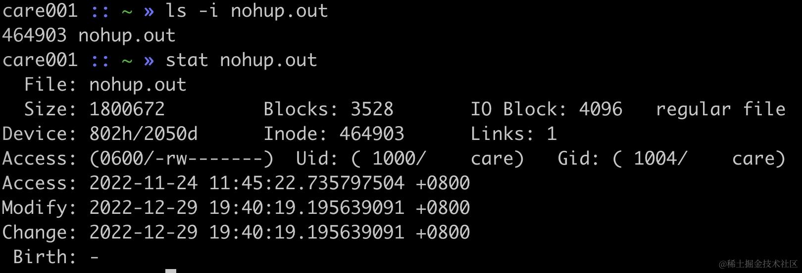
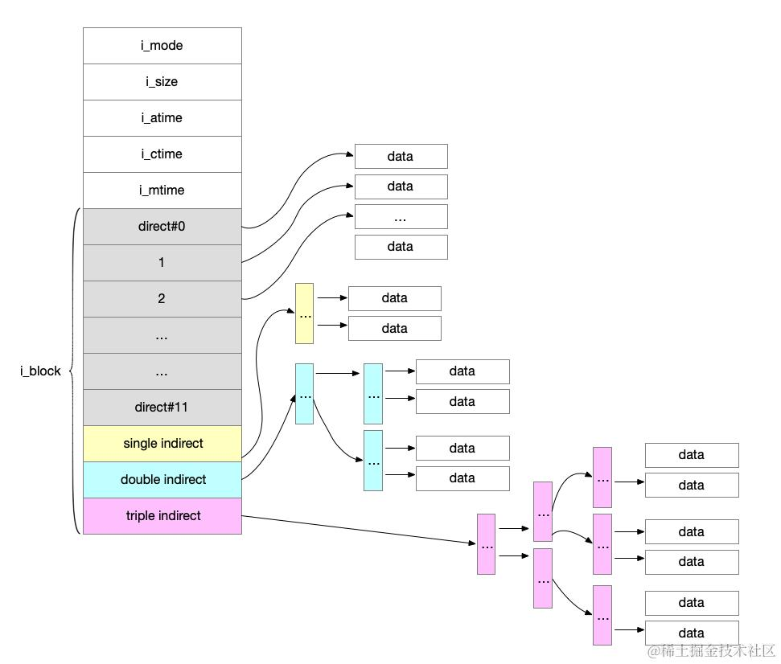
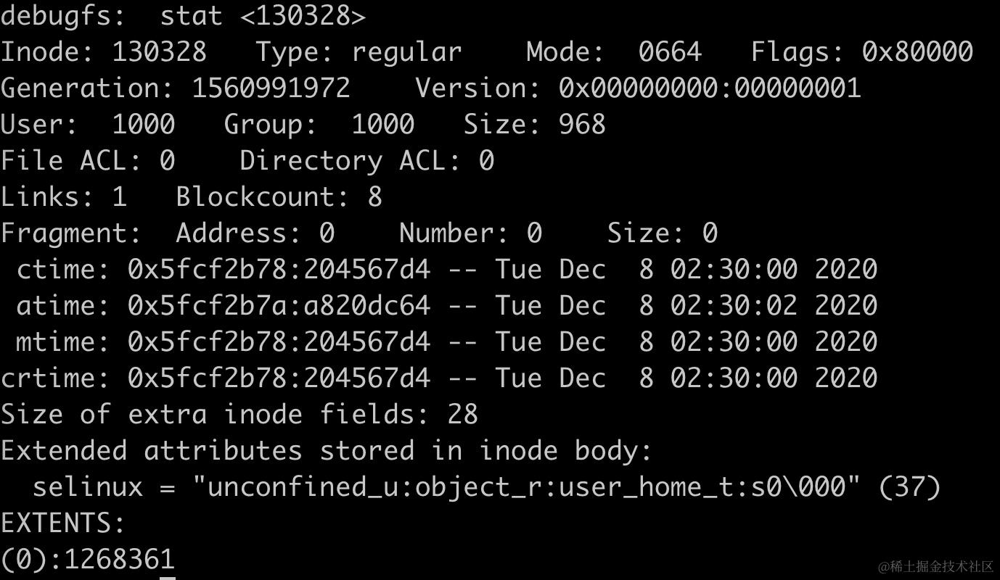
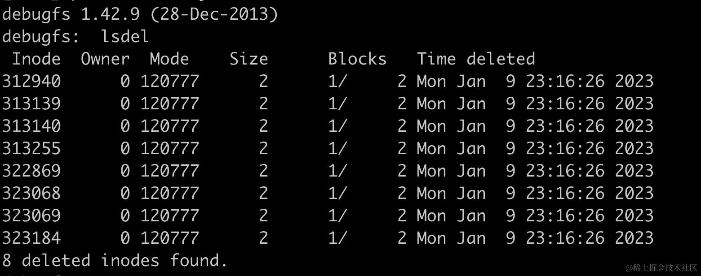

## 什么是 inode？

为了存储一个文件，除了本身的文件内容块，还需要一个地方来存储文件相关的元信息信息。承载这些文件元数据的数据结构就是 inode（index node），inode 包含了文件元信息，比如文件的所有者、权限、修改时间戳等。

可以使用 `ls -i` 查看一个文件的 inode 号，也使用 stat 命令可以查看文件的 inode 信息。



## inode 的内部细节

inode 中包含的信息非常多，重要的有下面这些：

*   文件的 size
*   文件权限（读、写、执行权限）
*   文件的 owner 和 group
*   文件的时间戳（创建时间戳、最后访问时间、最后修改时间）
*   文件数据 block 的位置

`inode` 内核数据结构比较复杂，部分字段如下：

以 ext4 的 inode 为例，它的结构如下所示。

```c
/*
 * Constants relative to the data blocks
 */
#define	EXT4_NDIR_BLOCKS		12
#define	EXT4_IND_BLOCK			EXT4_NDIR_BLOCKS
#define	EXT4_DIND_BLOCK			(EXT4_IND_BLOCK + 1)
#define	EXT4_TIND_BLOCK			(EXT4_DIND_BLOCK + 1)
#define	EXT4_N_BLOCKS			(EXT4_TIND_BLOCK + 1)
/*
 * Structure of an inode on the disk
 */
struct ext4_inode {
	__le16	i_mode;		/* File mode */
	__le16	i_uid;		/* Low 16 bits of Owner Uid */
	__le32	i_size_lo;	/* Size in bytes */
	__le32	i_atime;	/* Access time */
	__le32	i_ctime;	/* Inode Change time */
	__le32	i_mtime;	/* Modification time */
	__le32	i_dtime;	/* Deletion Time */
	__le16	i_gid;		/* Low 16 bits of Group Id */
	__le16	i_links_count;	/* Links count */
	__le32	i_blocks_lo;	/* Blocks count */
	__le32	i_flags;	/* File flags */
	union {
		struct {
			__le32  l_i_version;
		} linux1;
		struct {
			__u32  h_i_translator;
		} hurd1;
		struct {
			__u32  m_i_reserved1;
		} masix1;
	} osd1;				/* OS dependent 1 */
	__le32	i_block[EXT4_N_BLOCKS];/* Pointers to blocks */
```

其中 `i_mode` 表示文件读写权限，`i_atime`(access time) 表示最后一次访问文件的时间，`i_ctime`（change time) 表示最近一次更改 inode 的时间，`i_mtime`(modify time) 表示最近一次更改文件的时间。

有人可能会好奇 `i_ctime` 和 `i_mtime` 有什么区别。前面提到文件包含 `inode` 和文件内容两部分，比如修改了文件权限，但是没有修改文件内容，那么 `i_ctime` 会变化，`i_mtime` 不会变化。如果修改了文件内容，那么对应的 `i_mtime` 就会发生变化。

当我们创建一个 test.txt 文件同时写入内容时，这个文件的 `i_ctime`、`i_ctime`、`i_mtime`都是一样的。

```powershell
$ stat test.txt
  File: test.txt
  Size: 6         	Blocks: 8          IO Block: 4096   regular file
Device: 811h/2065d	Inode: 52570074    Links: 1
Access: (0664/-rw-rw-r--)  Uid: ( 1000/    care)   Gid: ( 1004/    care)
Access: 2023-01-09 16:00:46.539931558 +0800
Modify: 2023-01-09 16:00:46.539931558 +0800
Change: 2023-01-09 16:00:46.539931558 +0800
 Birth: -
```

这个时候修改文件的权限，增加可执行权限

```powershell
$ chmod a+x test.txt
care001 :: /data/dev/ya » stat test.txt
  File: test.txt
  Size: 6         	Blocks: 8          IO Block: 4096   regular file
Device: 811h/2065d	Inode: 52570074    Links: 1
Access: (0775/-rwxrwxr-x)  Uid: ( 1000/    care)   Gid: ( 1004/    care)
Access: 2023-01-09 16:00:46.539931558 +0800
Modify: 2023-01-09 16:00:46.539931558 +0800
Change: 2023-01-09 16:01:01.879952049 +0800
 Birth: -
```

可以看到此时的 `i_ctime` 发生了变化，`i_mtime` 没有发生变化。你可以尝试修改文件，随后看看 `i_ctime` 和 `i_mtime` 是否有发生变化。

接下来我们来重点分析 `i_block`，首先要知道，block 是文件存储的基础单元，inode 记录了文件分为多少个 block，每个 block 在哪里。

ext4 与 ext2、ext3 的 `i_block` 含义不太一样，我们先来看 ext2、ext3 的 `i_block`，在 ext2、ext3 中：

*   前 12 项（i\_block\[0]\~i\_block\[11]) 直接存储文件 block 的位置
*   当文件比较大，前 12 个数组元素存不下的时候，i\_block\[12] 存储一个一级「间接块」（single indirect），通过这个间接块查找真正的数据块
*   当文件再大一点，一级「间接块」也存不下，这个时候 i\_block\[13]会用到两级「间接块」，二次间接块里存储了间接块的位置，间接块存储了数据块的位置
*   当文件再大一点，i\_block\[14] 使用三级指针，原理如上

如下图所示。



可以看到传统的文件系统（ext2、ext3）有如下几个不足：

*   文件物理块逐个分配，即使文件的内容连续，也可能被分散到磁盘的不同位置，增加了文件碎片的产生
*   浪费很多间接块存储映射关系
*   读取大文件效率不是很高，需要读取多少次磁盘才能读取到对应的文件块

在目前广泛使用的 ext4 文件系统中，没有采用上述多级间接块的方案，而是引入了 Extents 概念，用来优化文件的存储与管理，Extents 机制可以有效的减少磁盘碎片，提高文件的存储效率。

Extents 的存储形式是一颗 B+ 树，分为数据节点（`ext4_extent`）和索引节点（`ext4_extent_idx`）两种类型，Extents 树形结构正是由这两个数据类型组成。

*   数据节点（`ext4_extent`）：表示连续的文件数据块，是树的叶子节点
*   索引节点（`ext4_extent_idx`）：管理数据节点，将数据节点分层组织成树形结构

其中 `ext4_extent` 的结构如下：

```c
/*
 * This is the extent on-disk structure.
 * It's used at the bottom of the tree.
 */
struct ext4_extent {
	__le32	ee_block;	/* first logical block extent covers */
	__le16	ee_len;		/* number of blocks covered by extent */
  // ...
};
```

`ext4_extent` 作用是表示一个连续的文件块，它包含了两个重要的信息：起始位置（ee\_block）和文件块数（ee\_len），起始位置表示了文件的连续块在磁盘的起始位置，文件块数表示了文件连续块的数量。通过 `ext4_extent`，文件系统可以将文件内容存储为一块连续的区域，减少了内存碎片的产生。

`ext4_extent_idx` 的作用就是将数据节点分层组织成树形结构，它的结构如下。

```c
/*
 * This is index on-disk structure.
 * It's used at all the levels except the bottom.
 */
struct ext4_extent_idx {
	__le32	ei_block;	/* index covers logical blocks from 'block' */
	__le32	ei_leaf_lo;	/* pointer to the physical block of the next *
				 * level. leaf or next index could be there */
	__le16	ei_leaf_hi;	/* high 16 bits of physical block */
};
```

其中 `ei_block` 表示当前 `extents` 所对应的文件块的起始位置，`ei_leaf_lo` 表示当前 `extents` 第一个叶子节点的编号，`ei_leaf_hi` 表示当前 `extents` 中包含的最后一个叶子节点的编号。

不管是叶子节点还是索引节点，最开始的 12 字节总是一个名为 `ext4_extent_header` 结构，用来存储 extents 的信息，它的结构如下：

```c
/*
 * Each block (leaves and indexes), even inode-stored has header.
 */
struct ext4_extent_header {
	__le16	eh_magic;	/* probably will support different formats */
	__le16	eh_entries;	/* number of valid entries */
	__le16	eh_max;		/* capacity of store in entries */
	__le16	eh_depth;	/* has tree real underlying blocks? */
	__le32	eh_generation;	/* generation of the tree */
};
```

其中：

*   eh\_magic 表示魔数，ext4 extent 魔数为 0xF30A
*   eh\_entries 表示当前 extents 中的 ext4\_extent 或 ext4\_extent\_idx 的个数
*   eh\_max 表示当前 extents 中最大能够存储的 extents 数量
*   eh\_depth 表示它在当前 extent 树中的深度，如果当前节点是叶子节点（ext4\_extent）则深度为 0，之上每层索引节点的 depth 依次加一

Extents 树形结构如下所示。


## 使用 debugfs 来窥探 inode 的内部细节

`debugfs` 是一个交互式的基于 `ext2/ext3/ext4` 文件系统的命令行调试器。默认情况下，debugfs 将以只读模式打开文件，使用 -w 标识去以读写模式打开它。在运行 debugfs 之前，可以先用 `df -hT` 命令得到文件系统设备名。


使用 debugfs 时需要先挂载相关的文件系统，比如挂载 `/home` 目录对应的 `/dev/mapper/VolGroup-lv_home`：

```powershell
$ sudo debugfs /dev/mapper/VolGroup-lv_home
debugfs 1.42.9 (28-Dec-2013)
```

进入 debugfs 以后，可以使用 `?` 或者 help 查看所有的命令。

可以使用 stat 命令查看某个 inode 的信息：

```powershell
stat <inode>
```

可以看到 ext4 文件系统 inode 的信息都显示了出来。



还可以使用 dump 命令将某个 inode 的内容导出到文件中：

```powershell
dump <inode> <file>
```

比如有这样一个 test.c 文件，inode 号为 `146888`，通过 dump 命令就可以将该 inode 文件存储到 dump.out 中。

```powershell
dump <146888> dump.out
```

还可以使用 lsdel 命令列出被删除但尚未从文件系统中清除的 inode



利用这个功能结合 dump 恢复误删的文件，这里不展开。

## 如何通过 `inode` 号找到对应的普通文件

一个方法是通过 find 命令

```powershell
find /your/path -xdev -printf '%i %p\n' 
```

可以对上面的命令进行过滤，比如找 inode 为 12345 的文件.

```powershell
find /your/path -xdev -printf '%i %p\n' | awk '$1 == 12345 { print $2 }'
```

## 通过 inode 删除文件

有时候有一些文件名比较特殊，无法直接用 `rm` 命令在终端中删除，这个时候就可以通过先找到 `inode` 然后通过 `inode` 去删除。

```powershell
$ ls -i specical_file.txt                                                                                         
130512 specical_file.txt

$ find . -inum 130512 -exec rm -i {} \;
rm: remove regular empty file './specical_file.txt'? y
```
