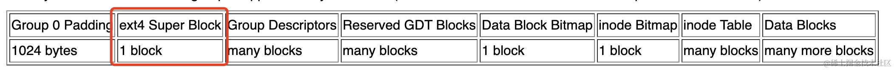
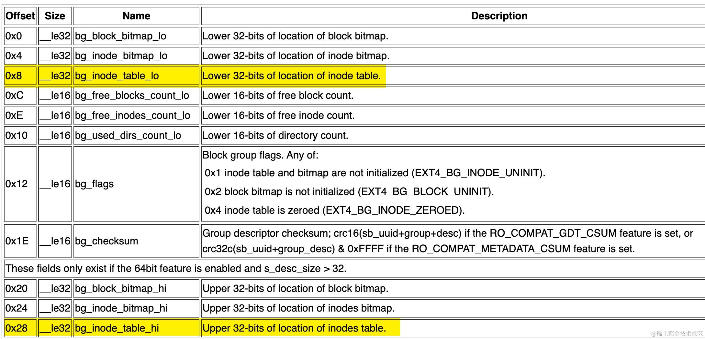
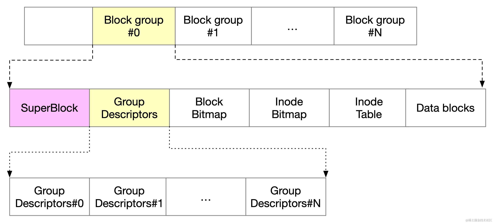
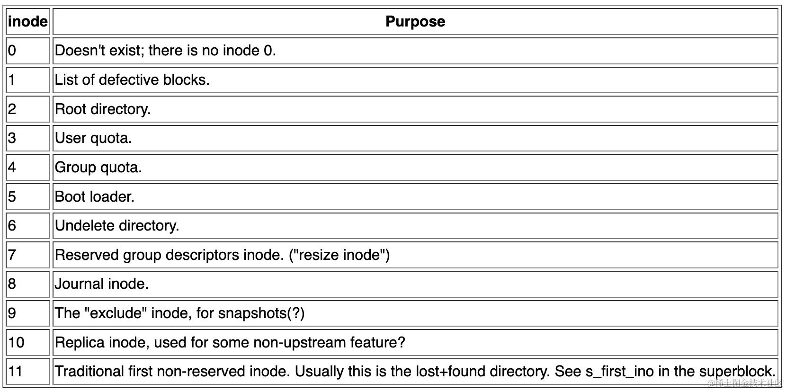
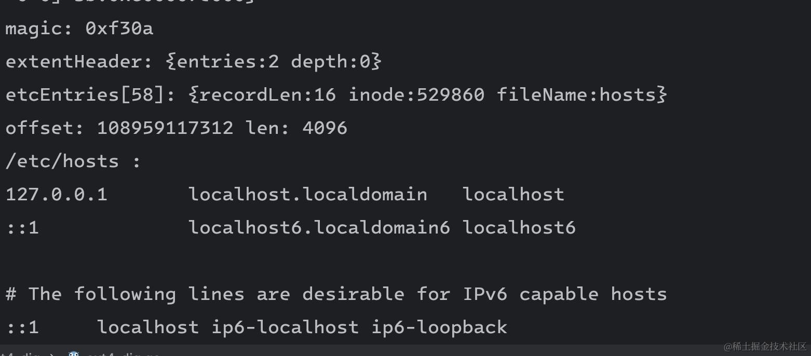

我们可能听说过很多文件系统，比如 FAT32、NTFS、EXT4，在linux 下 EXT4 是一个使用比较广泛的文件系统，前面的小节我们简单介绍了 EXT4 文件系统的内部结构，这个小节我们用硬核方式读取 EXT4 文件系统下 `/etc/hosts` 文件，以深入理解文件系统的底层原理。

关于 ext4 文件系统的设计，可以参考官网的介绍 <https://www.kernel.org/doc/html/latest/filesystems/ext4/overview.html>

首先我们通过 df 或者 mount 命令查看 `/` 挂载在哪个盘，以我的测试机为例，根目录 `/` 挂载在 `/dev/sda2` 下

```powershell
df -Th /
Filesystem     Type  Size  Used Avail Use% Mounted on
/dev/sda2      ext4  117G  104G  6.8G  94% /
```

此时我们就可以使用文件 io 来读取 `/dev/sda2` 了。

```go
file, err := os.OpenFile("/dev/sda2", os.O_RDONLY, 0755)
```

在开始读取 /dev/sda2 裸盘之前，先来写一个简单的工具结构体 `SeekableReader`

```go
type SeekableReader struct {
	io     Reader
	offset int64
}
```

定义了下面这几个工具函数，放在在特定 offset 处读取数据

```go
func (sr *SeekableReader) ReadBytes(pos int64, bytes []byte) int;
func (sr *SeekableReader) ReadUint8(offset int64) uint8;
func (sr *SeekableReader) ReadUint16(offset int64) uint16;
func (sr *SeekableReader) OffSet(n int64);
func (sr *SeekableReader) ClearOffSet();
```

## superblock

第一件事情就是读取超级块 superblock，它的偏移量为 1024：



从这里读取我们关心的 superblock 的字段

```go
type SuperBlock struct {
	magic          uint16 // 魔数，0xEF53
	blockSize      uint64 // 块大小，偏移量为 0x18
	blocksPerGroup uint64 // 每个块组中的块数，偏移量为 0x20
	inodesPerGroup uint64 // 每个块组中的 inode 数，偏移量为 0x28
	inodeSize      uint64 // 每个 inode 的大小，偏移量: 0x58
}
```

superblock 布局结构如下图所示：


根据上图对应的 offset 和 size 来读取 superblock：

```go
const Superblock0Offset = int64(1024)

func NewSuperBlock(r SeekableReader) SuperBlock {
	r.OffSet(Superblock0Offset)
	magic := r.ReadUint16(0x38)
	
	// s_log_block_size
	n := r.ReadUint32(0x18)
	
	// Block size is 2 ^ (10 + s_log_block_size).
	blockSize := 1 << (10 + n)

	blocksPerGroup := r.ReadUint32(0x20)

	inodesPerGroup := r.ReadUint32(0x28)
	inodeSize := r.ReadUint16(0x58)

	return SuperBlock{
		magic:          magic,
		blockSize:      uint64(blockSize),
		blocksPerGroup: uint64(blocksPerGroup),
		inodesPerGroup: uint64(inodesPerGroup),
		inodeSize:      uint64(inodeSize),
	}
}
```

运行打印 superblock 的值

```powershell
{magic:61267 blockSize:4096 blocksPerGroup:32768 inodesPerGroup:8192 inodeSize:256}
```

可以看到这个 superblock 的魔数为 61267（0xEF53），block 大小为 4kB，每个 BlockGroup 中块的个数为 32768，每个 Block group 中的 inode 数量为 8192 个，每个 inode 大小为 256 字节。

## Block group

Block group 是一组连续的块，这些块被组织在一起以便于管理和分配。每个 block group 包含的数据结构包括

*   块位图 (Block Bitmap): 用于跟踪 block group 中哪些块是已分配的，哪些是空闲的。
*   inode 位图（Inode Bitmap): 用于跟踪 block group 中哪些 inode 是已分配的，哪些是空闲的。
*   inode 表 (Inode Table): 存储文件和目录的元数据
*   数据块 (Data Blocks): 用于存储实际的文件数据和目录内容

根据上面的输出，我们可以知道 block 大小为 4K，每个 block group 包含 32768 个 block，可以计算出每个 Block group  的大小为 4K\*32768 = 128MB。

每个block group都有对应的 group descriptor,用于记录该block group的元数据,如 inode 表、block bitmap和inode bitmap的位置等。

## Block group descriptor

Block group descriptor 它描述了每个 block group 的元数据信息:

*   block bitmap 的块号
*   inode bitmap 的块号
*   inode 表起始块号（重点关注）
*   空闲块数
*   空闲inode数

磁盘布局结构如下：



所有 block group 的 group descriptor 信息存储在一起,形成 group descriptor table，该表紧跟在 superblock 之后。



接下来我们来读取 "/" 根目录 inode，通过 ext4 的文档，我们可以发现系统内置的特殊的 inode 编号，根目录的 inode 号为 2。



文档中还规定了如何找到 inode：

```powershell
Each block group contains sb->s_inodes_per_group inodes. Because inode 0 is defined not to exist, this formula can be used to find the block group that an inode lives in: bg = (inode_num - 1) / sb->s_inodes_per_group. The particular inode can be found within the block group's inode table at index = (inode_num - 1) % sb->s_inodes_per_group. To get the byte address within the inode table, use offset = index * sb->s_inode_size.
```

公式 `bg = (inode_num - 1) / sb->s_inodes_per_group` 用于计算给定 inode 编号所在的 block group

公式 `index = (inode_num - 1) % sb->s_inodes_per_group` 用于计算 inode 在块组的 inode 表中的索引位置。

公式 `offset = index * sb->s_inode_size` 用于计算 inode 在 inode 表中的字节偏移量

## Inode

Inode 的结构如下：

| offset | size     | name          | desc                           |
| ------ | -------- | ------------- | ------------------------------ |
| 0x0    | \_\_le16 | i\_mode       | mode                           |
| 0x4    | \_\_le32 | i\_size\_lo   | Lower 32-bits of size in bytes |
| 0x6C   | \_\_le32 | i\_size\_high | Upper 32-bits of file          |
| 0x28   | 60 bytes | i\_block      | Block map or extent tree       |

定义 Inode 数据结构

```go
type Inode struct {
	mode  uint16
	size  uint64
	block []byte
	sb    *SuperBlock
}
```

根据上面的 inode 读取公式，我们来实现一个读取 inode 的方法：

```go
func NewInode(r *SeekableReader, sb *SuperBlock, inodeNumber uint64) Inode {
	// The blockGroupNumber of the block group containing an inode
	// can be calculated as (inode_number - 1) / sb.s_inodes_per_group,
	blockGroupNumber := (inodeNumber - 1) / sb.inodesPerGroup

	// group descriptor table 开始地址，跳过 superblock
	// 每个 block group descriptor 的长度为 64
	gdtOffset := sb.blockSize + blockGroupNumber*64
	r.OffSet(int64(gdtOffset))

	// 读取低 32 位地址
	lo := r.ReadUint32(0x8)
	// 读取高 32 位地址
	hi := r.ReadUint32(0x28)
	inodeTableOffset := uint64(lo) + (uint64(hi))<<32

	// 将 inode 表的地址乘以块大小，得到 inode 表在磁盘上的偏移量
	inodeTableOff := inodeTableOffset * sb.blockSize

	// 根据公式 index = (inode_num - 1) % sb->s_inodes_per_group
	inodeIdxInTable := (inodeNumber - 1) % sb.inodesPerGroup

	// 将 inode 表的偏移量加上 inode 在表中的索引乘以 inode 大小，得到 inode 在磁盘上的实际偏移量
	inodeOff := inodeTableOff + inodeIdxInTable*sb.inodeSize

	// 偏移量设置为 inode 的偏移量，以便读取 inode 的信息
	r.OffSet(int64(inodeOff))
	// 读取 inode 的信息
	mode := r.ReadUint16(0)
	size := r.ReadU64LoHi(0x4, 0x6C)
	buffer := make([]byte, 60)
	r.ReadBytes(0x28, buffer)

	return Inode{
		mode:  mode,
		size:  size,
		block: buffer,
		sb:    sb,
	}
}
```

写一个测试代码，读取根目录的 inode

```go
rootInode := NewInode(&r, &sb, 2)
fmt.Printf("rootInode: %+v\n", rootInode)
```

输出如下：

```powershell
rootInode: {mode:16877 size:4096 block:[10 243 1 0 4 0 0 0 0 0 0 0 0 0 0 0 1 0 0 0 48 36 0 0 0 0 0 0 0 0 0 0 0 0 0 0 0 0 0 0 0 0 0 0 0 0 0 0 0 0 0 0 0 0 0 0 0 0 0 0] sb:0xc00007e000}
```

## Extent header

不管是叶子节点还是索引节点，最开始的 12 字节总是一个名为 ext4\_extent\_header 结构，用来存储 extents 的信息

extent header 的结构如下

| Offset | Size     | Name           | Description                                                                                                                                                                                                                                                                                                        |
| ------ | -------- | -------------- | ------------------------------------------------------------------------------------------------------------------------------------------------------------------------------------------------------------------------------------------------------------------------------------------------------------------ |
| 0      | \_\_le16 | eh\_magic      | Magic number, 0xF30A.                                                                                                                                                                                                                                                                                              |
| 2      | \_\_le16 | eh\_entries    | Number of valid entries following the header.                                                                                                                                                                                                                                                                      |
| 4      | \_\_le16 | eh\_max        | Maximum number of entries that could follow the header.                                                                                                                                                                                                                                                            |
| 6      | \_\_le16 | eh\_depth      | Depth of this extent node in the extent tree. 0 = this extent node points to data blocks; otherwise, this extent node points to other extent nodes. The extent tree can be at most 5 levels deep: a logical block number can be at most 2\^32, and the smallest n satisfies\*(((blocksize-12)/12)\^n)\>=2\^32is 5. |
| 8      | \_\_le32 | eh\_generation | Generation of the tree. (Used by Lustre, but not standard ext4).                                                                                                                                                                                                                                                   |

简化定义 ExtentHeader 如下：

```go
type ExtentHeader struct {
	entries uint64
	depth   uint64
}
```

从 Inode 中读取 extent header

```go
func (i *Inode) ReadExtentHeader() ExtentHeader {
	r := SeekableReader{io: bytes.NewReader(i.block), offset: 0}
	magic := r.ReadUint16(0) // Magic number, 0xF30A.
	fmt.Printf("magic: 0x%x\n", magic)
	entries := r.ReadUint16(0x02) // Number of valid entries following the header.
	depth := r.ReadUint16(0x06)   // Depth of this extent node in the extent tree.
	return ExtentHeader{
		entries: uint64(entries),
		depth:   uint64(depth),
	}
}
```

## Extent 结构

Extent 的作用是表示一个连续的文件块，它包含了两个重要的信息：起始位置（ee\_block）和文件块数（ee\_len），起始位置表示了文件的连续块在磁盘的起始位置，文件块数表示了文件连续块的数量。通过 ext4\_extent，文件系统可以将文件内容存储为一块连续的区域，减少了内存碎片的产生。Extent 结构如下：

| Offset | Size     | Name          | Description                                                                                                                                                                                                                                                                                                                                                   |
| ------ | -------- | ------------- | ------------------------------------------------------------------------------------------------------------------------------------------------------------------------------------------------------------------------------------------------------------------------------------------------------------------------------------------------------------- |
| 0      | \_\_le32 | ee\_block     | First file block number that this extent covers.                                                                                                                                                                                                                                                                                                              |
| 4      | \_\_le16 | ee\_len       | Number of blocks covered by extent. If the value of this field is <= 32768, the extent is initialized. If the value of the field is \> 32768, the extent is uninitialized and the actual extent length is ee\_len - 32768. Therefore, the maximum length of a initialized extent is 32768 blocks, and the maximum length of an uninitialized extent is 32767. |
| 6      | \_\_le16 | ee\_start\_hi | Upper 16-bits of the block number to which this extent points.                                                                                                                                                                                                                                                                                                |
| 8      | \_\_le32 | ee\_start\_lo | Lower 32-bits of the block number to which this extent points.                                                                                                                                                                                                                                                                                                |

简化定义 Extent：

```go
type Extent struct {
	len   uint64
	start uint64
}


func (i *Inode) ReadExtent(offset int64) Extent {
	r := NewSeekableReader(bytes.NewReader(i.block), offset)
	len := r.ReadUint16(0x04) // Number of blocks covered by extent.
	hi := r.ReadUint16(0x06)  // Upper 16-bits of the block number to which this extent points.
	lo := r.ReadUint32(0x08)  //Lower 32-bits of the block number to which this extent points.
	start := uint64(hi)<<32 + uint64(lo)
	return Extent{
		len:   uint64(len),
		start: start,
	}
}
```

## Directory Entries 结构

我们这里只介绍线性数组表示的目录结构，它包含了目录文件名、inode 编号等重要信息。Directory Entries 结构定义如下：

| Offset | Size     | Name                   | Description                                              |
| ------ | -------- | ---------------------- | -------------------------------------------------------- |
| 0      | \_\_le32 | inode                  | Number of the inode that this directory entry points to. |
| 4      | \_\_le16 | rec\_len               | Length of this directory entry. Must be a multiple of 4. |
| 6      | \_\_le16 | name\_len              | Length of the file fileName.                             |
| 8      | char     | name\[EXT4\_NAME\_LEN] | File name.                                               |

据此可以简化定义如下：

```go
type DirEntry struct {
	recordLen uint64
	inode     uint64
	fileName  string
}

func ReadDirEntry(r *SeekableReader) DirEntry {
	nameLen := r.ReadUint8(0x06)
	nameBuf := make([]byte, nameLen)
	r.ReadBytes(0x08, nameBuf)
	name := string(nameBuf)
	return DirEntry{
		recordLen: uint64(r.ReadUint16(0x04)),
		inode:     uint64(r.ReadUint32(0x0)),
		fileName:  name,
	}
}
```

接下来实现一个方法，从某个 inode 中读取所有的 dir entry。这里简化处理，认为处理的 /etc/hosts 各路径都只有一级 extent 结构。

```go
const EXTENT_HEADER_SIZE = 12

func (i *Inode) dirEntries(r *SeekableReader) []DirEntry {
	entries := make([]DirEntry, 0)
	// 从 inode 中读取 extent header
	extentHeader := i.ReadExtentHeader()
	fmt.Printf("extentHeader: %+v\n", extentHeader)
	entryCount := extentHeader.entries
	// 遍历所有的 extent
	for idx := uint64(0); idx < entryCount; idx++ {
		extentOffset := EXTENT_HEADER_SIZE * (idx + 1)
		// 读取一个 extent
		extent := i.ReadExtent(int64(extentOffset))
		entryStart := int64(extent.start * i.sb.blockSize)
		totalEntryLen := int64(extent.len * i.sb.blockSize)

		offset := int64(0)
		for offset < totalEntryLen {
			r.OffSet(entryStart + offset)
			// 读取 dir entry
			entry := ReadDirEntry(r)
			if entry.inode == 0 {
				break
			}
			entries = append(entries, entry)
			offset += int64(entry.recordLen)
		}
	}

	return entries
}
```

接下来我们在 main 函数中，逐级调用函数查询 "/"、"/etc"、"/etc/host" 文件

```go
func main() {
	file, err := os.OpenFile("/dev/sda2", os.O_RDONLY, 0755)
	if err != nil {
		panic(err)
	}
	defer file.Close()
	r := SeekableReader{io: file}
	sb := NewSuperBlock(r)
	fmt.Printf("%+v\n", sb)
	// 获取 '/' 的 inode
	rootInode := NewInode(&r, &sb, 2)

	fmt.Printf("rootInode: %+v\n", rootInode)

    // 获取 '/' 目录下所有的 dir
	rootEntries := rootInode.dirEntries(&r)
	for i := range rootEntries {
		if rootEntries[i].fileName == "etc" {
    		// 读取 /etc 的 inode
			etcInode := NewInode(&r, &sb, rootEntries[i].inode)
			fmt.Printf("etcInode: %+v\n", etcInode)
			// 获取 /etc 目录下所有的 dir
			etcEntries := etcInode.dirEntries(&r)
			for j := range etcEntries {
				if etcEntries[j].fileName == "hosts" {
	           fmt.Printf("etcEntries[%d]: %+v\n", j, etcEntries[j])
	           // 读取 /etc/hosts 的 inode
					hostsInode := NewInode(&r, &sb, etcEntries[j].inode)

					extentOffset := 12
					// 读取 extent
					extent := hostsInode.ReadExtent(int64(extentOffset))
					offset := int64(extent.start * sb.blockSize)
					len := extent.len * sb.blockSize
					println("offset:", offset, "len:", len)
					buf := make([]byte, len)

					r.ClearOffSet()
					// 读取文件内容
					r.ReadBytes(offset, buf)
					fmt.Printf("/etc/hosts :\n%s", string(buf))
				}
			}
			break
		}
	}
}
```

最终的效果是可以将 "/etc/hosts" 文件打印出来。



完整的代码我放在了小册对应的代码仓库，你可以运行一下跑起来逐个分析。
