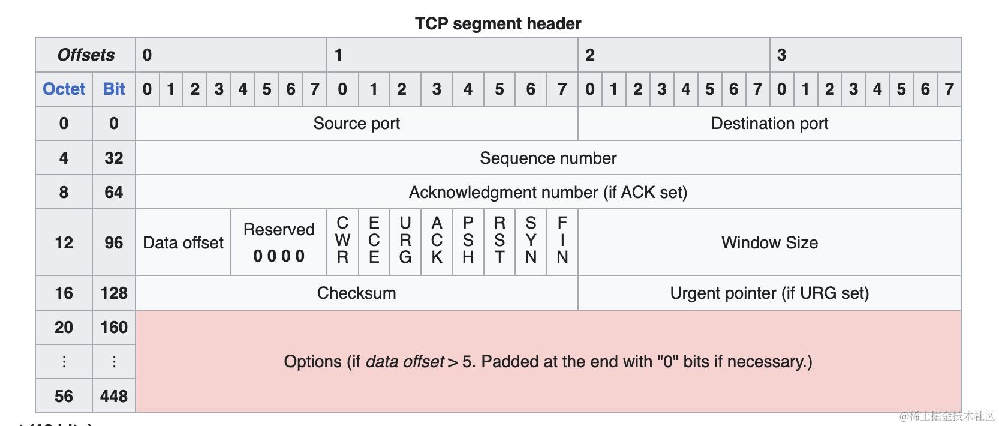
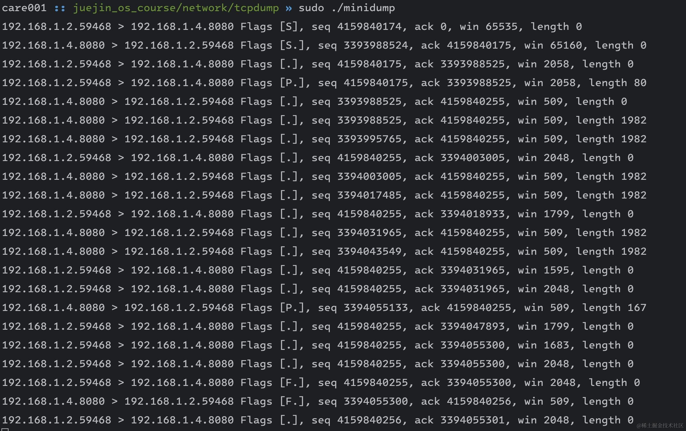

tcpdump 和 Wireshark 是网络问题定位中的神器，尽管它们已经被使用了多年，许多人仍然不了解它们是如何实现抓包的。这篇文章将介绍 tcpdump 背后的底层实现，并展示如何模拟 tcpdump 的部分格式来抓取 8080 端口的包。最终效果如下

```powershell
192.168.1.2.59043 > 192.168.1.4.8080 Flags [S], seq 2188010653, ack 0, win 65535, length 0
192.168.1.4.8080 > 192.168.1.2.59043 Flags [S.], seq 500839884, ack 2188010654, win 65160, length 0
192.168.1.2.59043 > 192.168.1.4.8080 Flags [.], seq 2188010654, ack 500839885, win 2058, length 0
192.168.1.2.59043 > 192.168.1.4.8080 Flags [P.], seq 2188010654, ack 500839885, win 2058, length 80
192.168.1.4.8080 > 192.168.1.2.59043 Flags [.], seq 500839885, ack 2188010734, win 509, length 0

```

为了实现上述功能，我们需要一些前置知识，首先需要了解原始套接字（Raw Socket）的概念。

## 原始套接字（Raw Socket）

我们来看创建套接字的 `socket` 系统调用的函数签名：

```c
#include <sys/socket.h>

int socket(int domain, int type, int protocol);
```

其中第二个参数 `type` 表示了 socket 的类型，我们最常使用的套接字类型是

*   流式 Socket（SOCK\_STREAM）：收发 TCP 报文
*   数据报 Socket（SOCK\_DGRAM）：收发面向无连接的 UDP 报文

但如果想开发更底层的应用，比如发送自定义的 IP 报文、伪造 IP、捕获流经本机网卡的数据报文，使用这两种套接字就无法实现了。为了实现这些更底层的操作，就需要使用原始套接字（Raw Socket)，它的 type 为 SOCK\_RAW。

第一个参数表示套接字使用的协议族 domain，比如常见的 IPv4（AF\_INET）以及 IPv6（AF\_INET6），原始套接字的协议族为 AF\_PACKET(或 PF\_PACKET)。

第三个参数 protocol 用于指定要接收的协议类型，在抓包的场景中，可以传入 ETH\_P\_ALL 让原始套接字接收到网卡上所有的数据链路层数据帧，从而进行网络数据包捕获和分析。

## 原始套接字（Raw Socket）的读写

创建完 Raw Socket，接下来就是对这个 socket 进行读写。Raw Socket 可以认为是无连接的，因为它的编程方式和 UDP 差不多，`recvfrom`和 `sendto`系统调用在一个原始 Raw Socket 上接收和发送数据报。抓包的场景是从 Raw Socket 读取数据，我们来重点看一下 recvfrom 函数。

```c
ssize_t recvfrom(int sockfd, void *buf, size_t len, int flags,
                 struct sockaddr *src_addr, socklen_t *addrlen);
```

其中 buf 用来指定读取的数据缓冲区，len 表示缓冲区的长度，src\_addr 用来获取对端地址，如果不关心可以设置为 NULL，addrlen 表示 src\_addr 结构体的长度。

## 实战抓包

先来定义以太网帧、IP 帧、TCP 帧的数据结构：

```c
#define ETHER_ADDR_LEN          6

// 以太网帧头部结构体
struct EthernetHeader {
    u_char ether_dhost[ETHER_ADDR_LEN]; /* 目的以太网地址 */
    u_char ether_shost[ETHER_ADDR_LEN]; /* 源以太网地址 */
    u_short ether_type; /* 以太网类型 */
};

// IPv4 头部
struct IPv4Header {
    u_char ip_vhl;      /* 版本号和头部长度(in words) */
    u_char ip_tos;      /* 服务类型 */
    u_short ip_len;     /* 总长度 */
    u_short ip_id;      /* 标识 */
    u_short ip_off;     /* 片偏移 */
    u_char ip_ttl;      /* 生存时间 */
    u_char ip_p;        /* 协议 */
    u_short ip_sum;     /* 校验和 */
    struct in_addr ip_src; /* 源地址 */
    struct in_addr ip_dst; /* 目的地址 */
};

// TCP 头部
struct TCPHeader {
    u_short th_sport;   /* 源端口号 */
    u_short th_dport;   /* 目的端口号 */
    u_int th_seq;       /* 序列号 */
    u_int th_ack;       /* 确认号 */
    u_char th_offset;   /* 数据偏移 */
    u_char th_flags;    /* TCP flags */
    u_short th_win;     /* 窗口大小 */
    u_short th_sum;     /* 校验和 */
    u_short th_urp;     /* 紧急数据偏移量 */
};
```

这样我们就可以把读到的数据，直接映射到结构体上，如下所示:

```c
char buf[2048];
ssize_t n = recvfrom(sock_fd, &buf, sizeof(buf), 0, nullptr, nullptr);

auto *eth_header = (struct EthernetHeader *) buf;
auto *ipv4_header = (IPv4Header *) (buf + sizeof(EthernetHeader))
auto *tcp_header = (TCPHeader *) (buf + sizeof(EthernetHeader) + sizeof(IPv4Header));
```

接下来我们写一个 helper 函数，用来解析 `tcp_flags`:

```cpp
std::string tcp_flags(u_char flags) {
    std::string result;
    if (flags & TH_FIN) {
        result += "F";
    }
    if (flags & TH_SYN) {
        result += "S";
    }
    if (flags & TH_RST) {
        result += "R";
    }
    if (flags & TH_PUSH) {
        result += "P";
    }
    if (flags & TH_URG) {
        result += "U ";
    }
    if (flags & TH_ACK) {
        result += ".";
    }
    return result;
}
```

这里过滤一下包，只打印端口号为 8080 的 tcp 请求，完整的代码如下：

```cpp
int main() {
    int sock_fd = socket(AF_PACKET, SOCK_RAW, htons(ETH_P_ALL));
    if (sock_fd < 0) {
        std::cerr << "Failed to create socket" << std::endl;
        return 1;
    }
    while (true) {
        char buf[2048];
        struct sockaddr addr;
        socklen_t addr_len = sizeof(addr);
        ssize_t n = recvfrom(sock_fd, &buf, sizeof(buf), 0, nullptr, nullptr);
        if (n < 0) {
            std::cerr << "Failed to receive data" << std::endl;
            continue;
        }
        auto *eth_header = (struct EthernetHeader *) buf;
        ushort ether_type = ntohs(eth_header->ether_type);
        if (ether_type == ETHERTYPE_IP) {
            auto *ipv4_header = (IPv4Header *) (buf + sizeof(EthernetHeader));
            if (ipv4_header->ip_p == IPPROTO_TCP) {
                auto *tcp_header = (TCPHeader *) (buf + sizeof(EthernetHeader) + sizeof(IPv4Header));
                u_char tcp_header_length = (tcp_header->th_offset >> 4) * 4;
                if (ntohs(tcp_header->th_dport) == 8080 || ntohs(tcp_header->th_sport) == 8080) {
                    uint16_t tcp_header_len = (tcp_header->th_offset >> 4) * 4;
                    std::cout << inet_ntoa(ipv4_header->ip_src) << "." << ntohs(tcp_header->th_sport) << " > "
                              << inet_ntoa(ipv4_header->ip_dst) << "." << ntohs(tcp_header->th_dport) << " "
                              << "Flags [" << tcp_flags(tcp_header->th_flags) << "], "
                              << "seq " << ntohl(tcp_header->th_seq) << ", ack " << ntohl(tcp_header->th_ack) << ", "
                              << "win " << ntohs(tcp_header->th_win) << ", "
                              << "length "
                              << n - sizeof(EthernetHeader) - sizeof(IPv4Header) - tcp_header_length
                              << std::endl;
                }
            }
        }
    }
}
```

其中有一个值得注意的是 `tcp_header_length` 的计算方式：

```c
u_char tcp_header_length = (tcp_header->th_offset >> 4) * 4;
```

这是因为 TCP 头中的 data offset 的值在高四位，以 32-bit words 的形式来指定头部的长度。



我们来编译运行一下上面的代码：

```powershell
$ g++ minidump.cpp -o minidump
$ sudo ./minidump
```

接下来启动一个 tcp server，监听 8080 端口，这里启动一个静态文件服务器，使用 curl 访问一下，就可以在 minidump 的输出中看到握手、发送数据和挥手的过程了。



## 内核层面是如何处理的

前面提到的都是应用层的注册行为，那内核是如何处理的呢？这就要提到 `ptype_all` 链表，定义在 `net/core/dev.c` 文件中：

```c
struct list_head ptype_all;
```

链表元素类型为 `packet_type`

```c
struct packet_type {
	__be16			type;	
	struct net_device	*dev;
	int			(*func) (struct sk_buff *,
					 struct net_device *,
					 struct packet_type *,
					 struct net_device *);
    // ...omit some...
	struct list_head	list;
};
```

其中：

*   type 表示需要匹配的 Ethernet 协议类型，比如我们前面介绍的 `ETH_P_ALL` 表示所有的协议类型。
*   dev：表示需要处理的网络设备，NULL 表示所有网络设备
*   func：表示当收到包时的回调函数
*   list 指向链表头

当网络设备收到一个包时，会调用 `net/core/dev.c` 文件中的 `__netif_receive_skb_core` 函数，内核会遍历 `ptype_all` 链表，调用 `deliver_skb`，将数据包发送给注册的抓包进程。

```c
static int __netif_receive_skb_core(struct sk_buff **pskb, bool pfmemalloc, struct packet_type **ppt_prev)
    // ..
    list_for_each_entry_rcu(ptype, &ptype_all, list) {
    	if (pt_prev)
    		ret = deliver_skb(skb, pt_prev, orig_dev);
    	pt_prev = ptype;
    }
    // ..    
}    
```

当使用 `socket(AF_PACKET, SOCK_RAW, htons(ETH_P_ALL))` 创建一个原始套接字时，内核会将对应的 `packet_type` 结构体插入到 `ptype_all` 链表中。

从这里我们能更加明显的感受到，应用层能实现多少功能，还得靠内核能开放多少能力。

## 小结

这篇文章介绍了抓包程序的实现原理，我们需要了解 Raw Socket 编程、如何比较方便的解析各层的网络包，最后如果你感兴趣，你可以再深入研究一下内核底层的 ptype\_all 链表是如何为 tcpdump 等抓包程序服务的。通过这些知识，我们可以更好地理解和使用 tcpdump 和 Wireshark 进行网络问题的定位和分析。
