Docker和Kubernetes等工具的普及，使得容器技术成为现代软件开发和运维的核心组成部分。这篇文章我们来详细看看容器相关的技术，包含下面的内容

*   chroot
*   rootfs
*   namespace
*   cgroup
*   容器网络

## chroot

容器技术的发展最早可以追溯到 1979 年，那一年 UNIX Version 7 系统中提供了 chroot 命令，它是英文单词“Change Root directory”的缩写。

chroot 的作用是改变进程的根目录，使得进程不能访问该目录之外的其它文件，限制进程的文件系统访问，这种机制又被称为 "chroot 监狱"（chroot jail），1991 年，世界上第一个监控黑客行动的蜜罐程序就是使用 chroot 来实现的。

```powershell
chroot NEWROOT [COMMAND [ARG]...]
```

其中：

*   NEWROOT：表示要切换到的新 root 目录
*   COMMAND 指的是切换 root 目录后需要执行的命令

<!---->

```powershell
sudo chroot /data/dev/ya/my_root /bin/ls_go
```

接下来我们来实操 chroot。首先准备一个根目录

```powershell
mkdir /data/dev/ya/my_root
```

此时执行 chroot 命令会提示找不到 /bin/bash 文件

```powershell
sudo chroot my_root
chroot: failed to run command ‘/bin/bash’: No such file or directory
```

把这个文件拷贝过去

```powershell
mkdir -p my_root/bin                                                                                    
cp /bin/bash my_root/bin
```

再次执行 chroot 发现此时还是报 `/bin/bash` 文件不存在。

```powershell
sudo chroot my_root
chroot: failed to run command ‘/bin/bash’: No such file or directory
```

此时其实是因为 `/bin/bash` 是动态链接的，通过 ldd 查看 bash 依赖的 so 库。

```powershell
$ ldd /bin/bash

	linux-vdso.so.1 (0x00007ffff7ffa000)
	libtinfo.so.5 => /lib/x86_64-linux-gnu/libtinfo.so.5 (0x00007ffff788f000)
	libdl.so.2 => /lib/x86_64-linux-gnu/libdl.so.2 (0x00007ffff768b000)
	libc.so.6 => /lib/x86_64-linux-gnu/libc.so.6 (0x00007ffff729a000)
	/lib64/ld-linux-x86-64.so.2 (0x00007ffff7dd3000)
```

将这些 so 库拷贝到对应的目录

```powershell
$ tree my_root
my_root
├── bin
│   └── bash
├── lib
│   ├── libc.so.6
│   ├── libdl.so.2
│   └── libtinfo.so.5
└── lib64
    └── ld-linux-x86-64.so.2
```

再次执行 chroot，可以看到可以成功了。不过此时执行不了什么命令，因为当前 root 目录没有对应的可执行文件。

```powershell
$ sudo chroot my_root

bash-4.4#
```

## 操作系统的「躯壳」rootfs

在容器技术中，rootfs 是容器的根文件系统，提供了一个隔离的执行环境，包含了操作系统运行需要的文件和目录。这个根文件系统，一般来说会包含下面这些文件 /bin，/etc，/proc 等，


我们进入容器内执行的 /bin/bash 就是rootfs 中 /bin 目录下的 bash可执行文件，与宿主机上的 /bin/bash 不是一回事。

### busybox

busybox 被称为 Linux 工具里的瑞士军刀，集成了一百多个最常用 linux 命令和工具的软件,甚至还集成了一个http服务器和一个telnet服务器，而所有这一切功能却只有 1M 左右的大小，适用于嵌入式设备、移动设备（安卓）、超小的 linux 发行版。

比如 CentOS 或者 Ubuntu 的镜像都在 100MB 以上，压缩后也都有大几十 MB ，而轻量化的 Alpine 3.10 版本镜像大小约为 5.58MB ，而它压缩后更是仅有 2MB 大小左右。

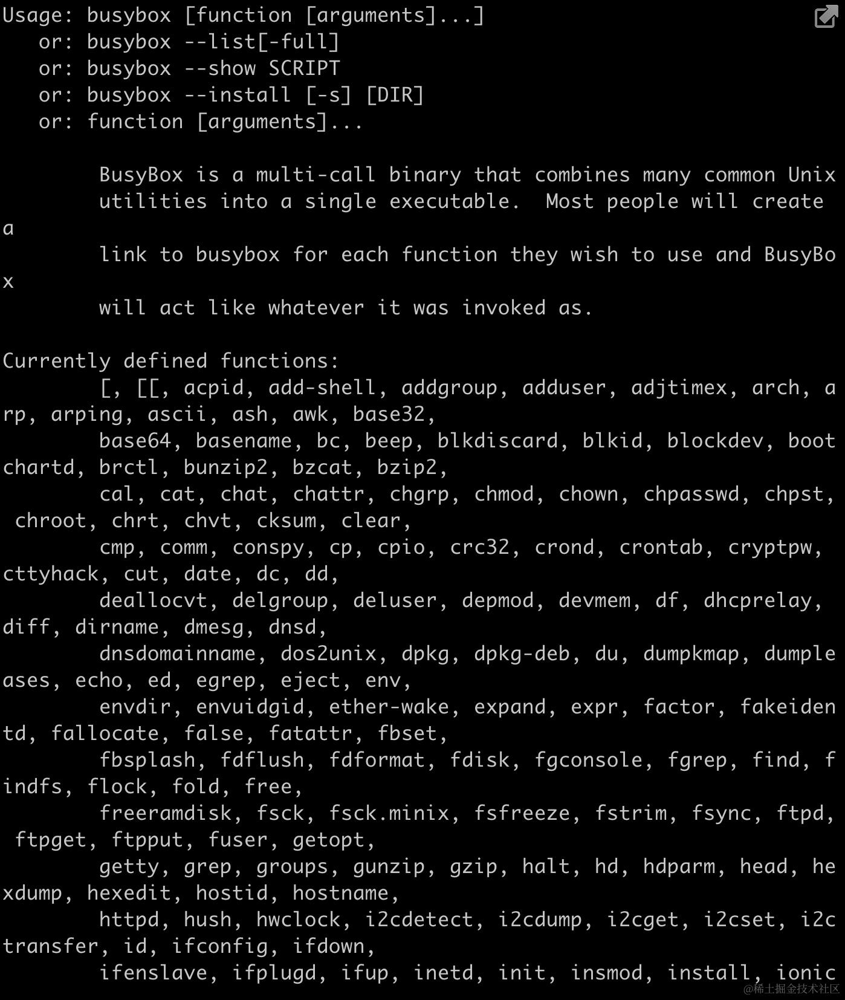

我们可以很方便的基于 busybox 生成一个 rootfs。

## 看起来隔离的 Namespace

在 C++中，namespace 是一个关键字，不同 namespace 下的变量名、函数名可以相同而不产生冲突，如下所示。

```cpp
#include <iostream>

namespace A {
    int a = 100;
}
namespace B {
    int a = 200;
}

int main() {
    std::cout << "In A, a = " << A::a << std::endl;//100
    std::cout << "In B, a = " << B::a << std::endl;//200
}
```

在 Linux 中，很多资源管理都是全局的，比如系统中的所有的进程 PID、网络设备等，Linux namespace 做了一层资源隔离，使得在 namespace 中的进程/进程组可以看起来拥有自己的独立资源，提供了虚拟化的一种非常轻量级方式。

这种隔离机制和 chroot 很类似，chroot 是把某个目录修改为根目录，从而无法访问外部的内容。Linux Namesapce 在此基础之上，提供了对 UTS、IPC、Mount、PID、Network、User 等的隔离机制。

最常用的 namespace 如下：

| 分类               | 系统调用参数   | 主要作用                                |
| ------------------ | -------------- | --------------------------------------- |
| Mount Namespaces   | CLONE\_NEWNS   | 隔离各进程看到的挂载点视图              |
| UTS Namespaces     | CLONE\_NEWUTS  | 隔离nodename、domainname                |
| IPC Namespaces     | CLONE\_NEWIPC  | 隔离 IPC                                |
| PID Namespaces     | CLONE\_NEWPID  | 隔离进程 PID，容器内进程都以 1 开始编号 |
| Network Namespaces | CLONE\_NEWNET  | 隔离网络设备、IP、端口                  |
| User Namespaces    | CLONE\_NEWUSER | 隔离用户组 ID                           |

Linux 提供了下面这些跟 namespace 相关的 API：

*   clone：指定特定的 flag(CLONE\_NEW\*) 标志给 clone，则会根据每个标志设置与父进程共享命名空间或者创建新的命名空间
*   setns：允许进程加入一个已存在的 namespace 中
*   unshare：允许进程取消其执行上下文，可以利用此系统调用来让当前的进程移动至一个新的 namespace 中

接下来我们来看下使用 unshare() API 来进行 namespace 的隔离

```powershell
sudo  unshare --pid --fork --mount-proc  /bin/sh
```

*   `--fork` 是为了让 unshare 进程 fork 一个新的进程出来，然后再用 /bin/sh 替换掉新的进程中执行的命令
*   `--pid` 表示 Unshare pid namespace
*   `--mount-proc` 自动挂载 /proc 文件系统

执行上面的命令，我们可以看到，pid 确实从头开始编号了，mount 也做了隔离。


通过 `/proc/<pid>/ns` 可以查看进程的 namespace，我们可以在查看 unshare 以后，在新的终端中看到的 unshare 创建子进程的 namespace 和父进程中 ns 对比。

可以看到除了 mount 和 pid 这两个 namespace 不同以外，其它的 namespace 都相同。

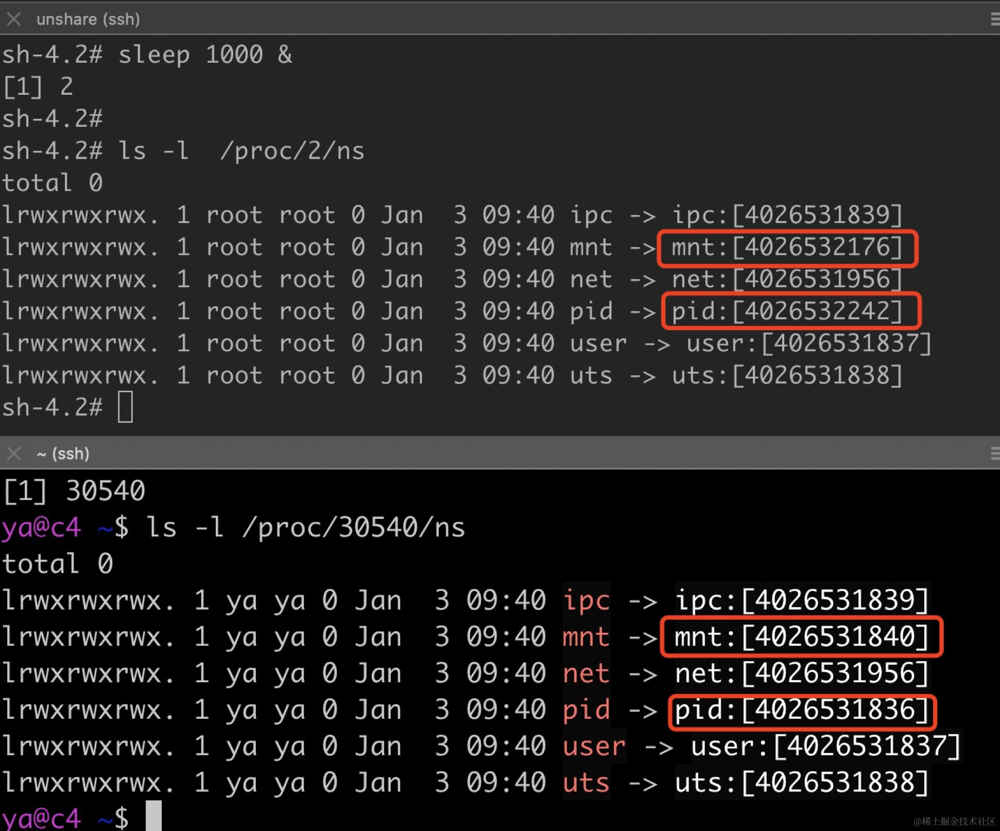

比如我们常用的 nsenter 可以进入一个或多个已存在的命名空间（namespace），比如 PID、网络、IPC、UTS、用户和挂载（mount）命名空间。

```powershell
// 进入目标进程（PID 12345）的 PID 命名空间和网络命名空间
$ nsenter --target 12345 --pid --net

$ nsenter -h                                                                                                       

Usage:
 nsenter [options] [<program> [<argument>...]]

Run a program with namespaces of other processes.

Options:
 -a, --all              enter all namespaces
 -t, --target <pid>     target process to get namespaces from
 -m, --mount[=<file>]   enter mount namespace
 -u, --uts[=<file>]     enter UTS namespace (hostname etc)
 -i, --ipc[=<file>]     enter System V IPC namespace
 -n, --net[=<file>]     enter network namespace
 -p, --pid[=<file>]     enter pid namespace
 -C, --cgroup[=<file>]  enter cgroup namespace
 -U, --user[=<file>]    enter user namespace
 -S, --setuid <uid>     set uid in entered namespace
 -G, --setgid <gid>     set gid in entered namespace
     --preserve-credentials do not touch uids or gids
 -r, --root[=<dir>]     set the root directory
 -w, --wd[=<dir>]       set the working directory
 -F, --no-fork          do not fork before exec'ing <program>
 -Z, --follow-context   set SELinux context according to --target PID

 -h, --help             display this help
 -V, --version          display version
```

## 给「小世界」围上围墙 CGroup

CGroup 的全称是 Control Group，是容器实现环境隔离的关键技术之一。
cgroup 项目最早是由 Google 的工程师（主要是 Paul Menage 和 Rohit Seth）在 2006 年发起的，当时取的名字就叫做“进程容器”（Process Containers）

它对很多子系统提供精细化的控制的能力，比如下面这些：

*   CPU
*   内存
*   IO
*   网络

CGroup 的所有操作都是基于 cgroup virtual filesystem，这个文件系统一般挂载在 `/sys/fs/cgroup` 目录下，通过 ls 查看这个目录信息如下。

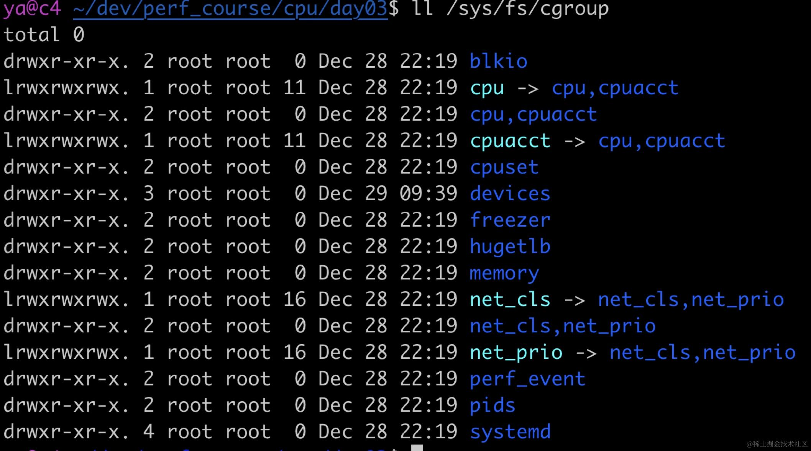

接下来我们来看看如何使用 cgroup 来限制 cpu 使用率。

首先进入 `/sys/fs/cgroup/cpu` 创建一个 A 目录

```powershell
cd /sys/fs/cgroup/cpu

mkdir A
```

此时相当于建立了一个 cgroup 组，cgroup 会自动生成 cgroup 相关的文件。
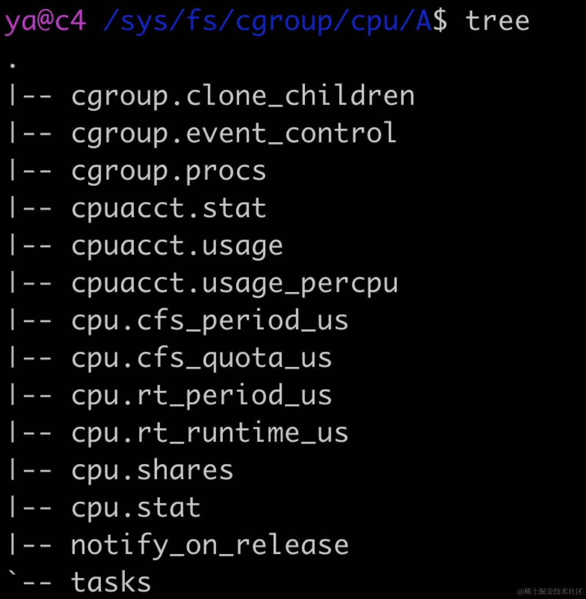

此时我们可以把进程添加到 cgroup 中了。

    # 把进程加入到 cgroup 的 A 组中
    sudo sh -c "echo 14839 > A/cgroup.procs"

cgroup 提供了 `cpu.cfs_quota_us` 和 `cpu.cfs_period_us` 两个参数限制 CPU 占用的上限。

*   cpu.cfs\_period\_us 表示运行周期，单位为微秒，默认值为 100000us，也就是 100ms
*   cpu.cfs\_quota\_us 表示在运行周期内这个 cgroup 组所有进程可运行的时间总量，单位同样为微秒，默认值为 -1，也就是不设置上限。

cfs\_quota\_us 和 cfs\_period\_us 决定了每个控制组中所有进程的可使用 CPU 资源的最大值。

接下来我们跑一个 busy 程序来实际验证

    ./busy -j 20

这个程序会把启动 20 线程跑死循环，会把我的 12 核 cpu 跑满。

接下来把这个进程加入到 cgroup A 中，此时 cpu 的使用率还是 1200%

    sudo sh -c "echo 16559 > A/cgroup.procs"


接下来我们来调整 `cfs_quota_us`

```powershell
sudo sh -c "echo 50000 > A/cpu.cfs_quota_us"
```

此时 cpu 已经降到了 50%。这是因为 cpu.cfs\_period\_us 为 100000us，cpu.cfs\_quota\_us 调整为 50000us 以后，表示单位时间内可运行时间是总量的 50%


如果把 cpu 调整为 150000，此时 cpu 使用率变为 150%。

```powershell
sudo sh -c "echo 150000 > A/cpu.cfs_quota_us"
```


上面我们介绍了单个 cgroup 内的 cpu 控制。接下来我们来看多组 CGroup 之间如何分配 CPU 资源。

cpu.shares 可以用来设置各个 cgroup 可使用 CPU 的相对比例，默认值是 1024。不过只有当系统上 CPU 资源被占满的情况下，这个比例才会在控制组中起作用。如果系统中只有一个控制组在运行，那么无论其 cpu.shares 设置为多少，它都可以使用所有可用的 CPU 时间。

我们来做一下实验来验证，新建一个新的 Group：B，将 A 的cpu.shares 调整为 512，B 保持默认的 1024。

启动两个跑满 CPU 的程序

```powershell
busy -j12 
busy -j4
```

分别加入到 A 和 B 的 group 中，观察CPU 的占用

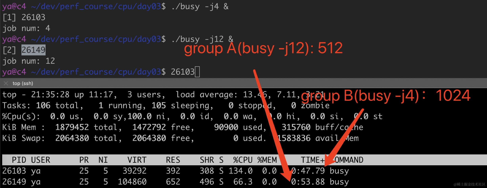

一个控制组获得的 CPU 时间比例是根据其 cpu.shares 值相对于同一层级其他控制组的 cpu.shares 值来决定的。

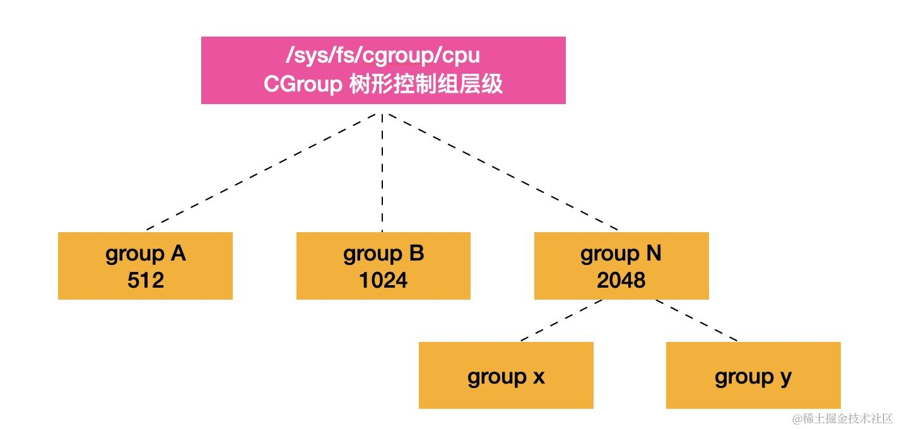

## 容器网络原理简介

我们在其他的文章已经详细介绍了下面文章的内容，下面的文章主要侧重实验环节。

### 一条虚拟的大网线：veth 设备

它模拟了在物理世界里的两块网卡，以及一条网线。通过它可以将两个虚拟的设备连接起来，发送到 veth 一段虚拟设备的请求会送另外一端设备中发出，veth 总是成双成对地出现。

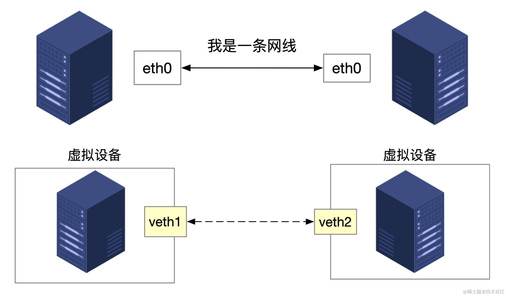

### 虚拟交换机：网桥

Bridge 虚拟设备用来桥接网络设备，相当于现实世界的交换机，

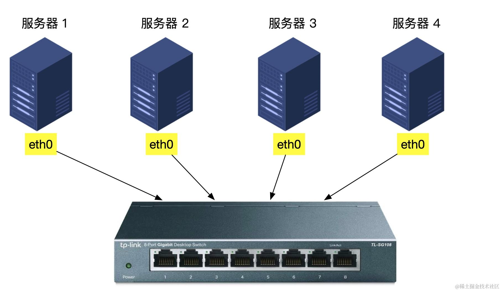

对于容器网络，网桥充当一个交换机，容器可以把 veth 的一端“插入”到网桥中。

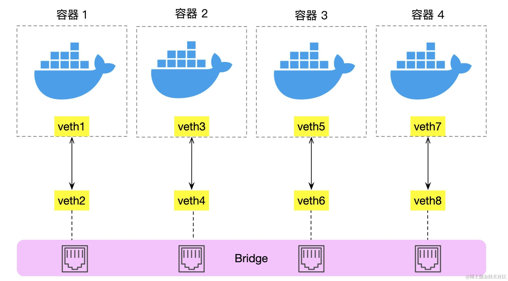

### 实战容器网络

创建一个新的名为 net1 的 net namespace，并将 veth1 加入到 net1 中

```powershell
# 创建一个名为 net1 的 net namespace
sudo ip netns add net1
# 新建 veth 对 veth1-veth2
sudo ip link add veth1 type veth peer name veth2
# 把其中的一头 veth1 放到这个新的名为 net1 的 net namespace。
sudo ip link set veth1 netns net1
# 给 veth1 配置 ip 并启用
sudo ip netns exec net1 ip addr add 192.168.0.101/24 dev veth1
sudo ip netns exec net1 ip link set veth1 up
#查看 veth1 是否已经正常
sudo ip netns exec net1 ifconfig
```

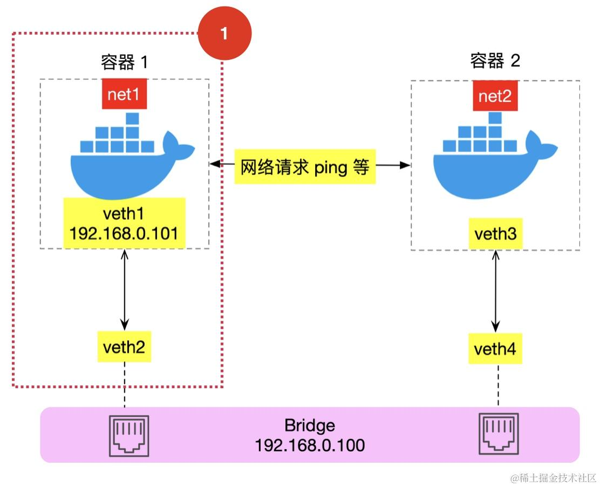

创建一个新的名为 net2 的 net namespace，并将 veth3 加入到 net2 中

```powershell
# 创建一个名为 net2 的 net namespace
sudo ip netns add net2
# 新建 veth 对 veth3-veth4
sudo ip link add veth3 type veth peer name veth4
# 把其中的一头 veth3 放到这个新的名为 net1 的 net namespace。
sudo ip link set veth3 netns net2
# 给 veth3 配置 ip 并启用
sudo ip netns exec net2 ip addr add 192.168.0.102/24 dev veth3
sudo ip netns exec net2 ip link set veth3 up
```

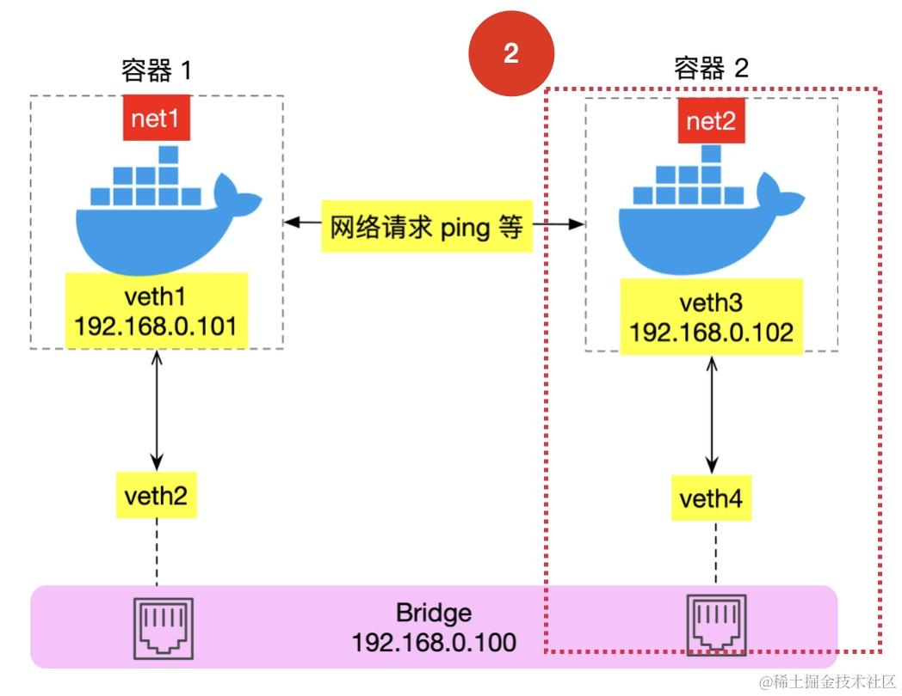

接下创建 bridge，将 veth2 和 veth4 加入到 bridge 中

```powershell
# 把两个网络连接到一起
sudo brctl addbr br0
sudo ip link set dev veth2 master br0
sudo ip link set dev veth4 master br0
sudo ip addr add 192.168.0.100/24 dev br0
sudo ip link set veth2 up
sudo ip link set veth4 up
sudo ip link set br0 up

```

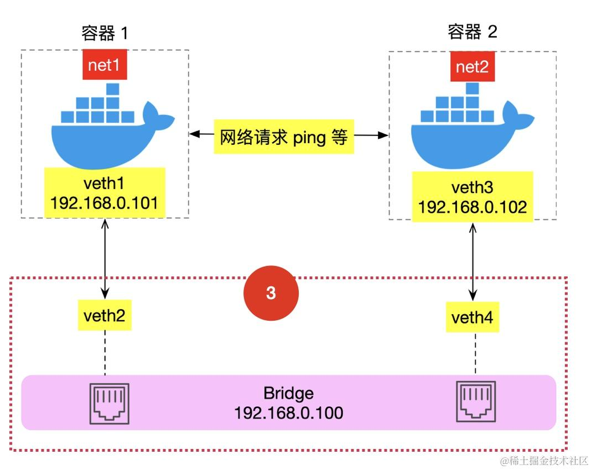

接下来我们就可以来测试两个容器网络的连通性了

```powershell
sudo ip netns exec net1 ping 192.168.0.102 -I veth1
```

此时的容器还只能单机局域网互相访问，如果要访问互联网，需要修改路由表。

```powershell
sudo ip netns exec net1 route add default gw 192.168.0.100 veth1
```

网络包到达网桥 br0 以后，不知道如何把包发到外部，外部的机器压根就不知道 192.168.0.\* 这个网段内的 IP，内部外通信都是基于虚拟机 eth0 来通信。为了实现内部虚拟网络访问外网，就需要使用 NAT 技术，这里我们用的是 iptables 中的 MASQUERADE 源地址伪装。

```powershell
# 增加 forward 默认允许策略为 ACCEPT
sudo iptables -P FORWARD ACCEPT

# 打开 IP 转发
sudo sysctl -w net.ipv4.conf.all.forwarding=1
sudo sysctl -w net.ipv4.ip_forward=1

# 对容器内 Namespace 中发出的包添加网络地址转换
sudo iptables -t nat -A POSTROUTING -s 192.168.0.102/24 ! -o br0  -j MASQUERADE
```

此时就可以访问外网了。


我用 C 语言实现了一个简易的容器服务，<https://github.com/imdach/perf-course/tree/master/toy_docker> ，感兴趣的同学，可以用你熟悉的语言实现一遍。
