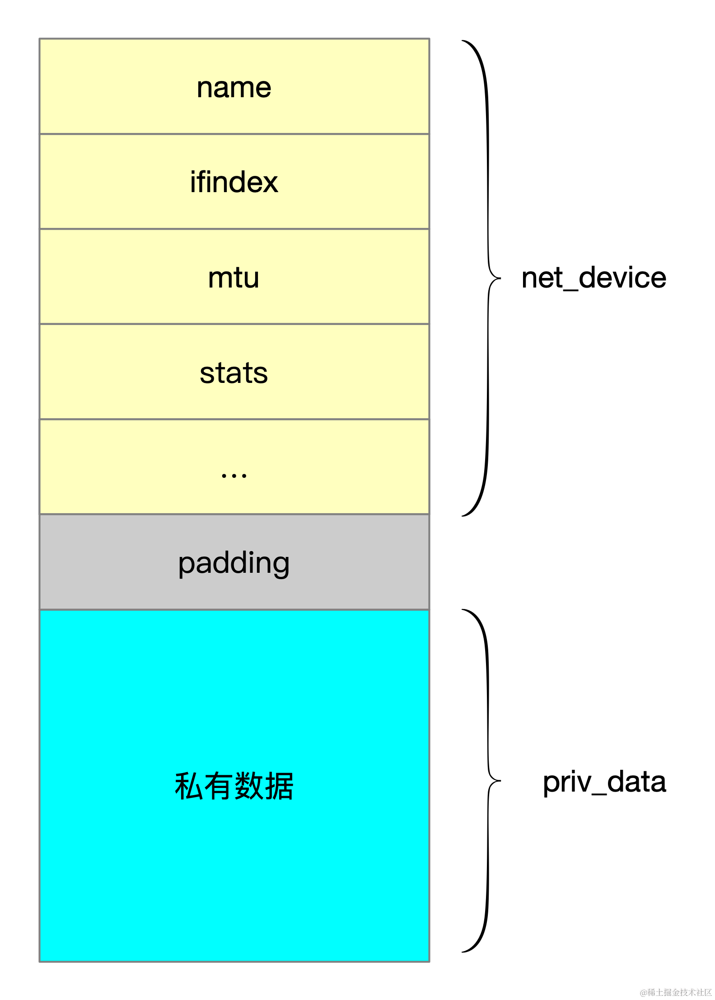
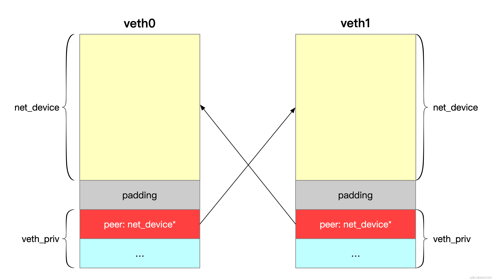

Veth（Virtual Ethernet）设备是 Linux 内核中一种特殊的虚拟网络设备，它总是成对出现，工作方式类似于一根虚拟的以太网线缆，从一端发送的数据包会立即被另一端接收到。Veth 设备常用于实现容器网络，使得不同网络命名空间中的进程能够互相通信。这篇文章将深入探讨 Linux 内核中 Veth 设备的实现原理。

在 linux 下可以使用 ip 命令来创建和管理 veth 设备对。

```powershell
ip link add veth0 type veth peer name veth1
ip addr add dev veth0 10.0.4.100/24
ip addr add dev veth1 10.0.4.101/24
ip link set veth0 up
ip link set veth1 up
```

以上命令创建了一对 Veth 设备 veth0 和 veth1，并给它们配置了 IP 地址，最后将设备状态设为 UP。

## 内核中的网络设备表示

在 Linux 内核中，`struct net_device` 结构体用于表示一个网络设备，这个结构体包含了管理网络设备的相关信息，比如网络设备的名称、mtu、统计信息等。net\_device 结构体在 `include/linux/netdevice.h` 头文件中定义，核心的字段如下：

```c
struct net_device {
	char			name[IFNAMSIZ]; // 网络设备名称
	int			ifindex; // 接口索引，它是内核用来唯一标识网络接口的数字
	unsigned int		flags; // 设备的状态和功能标志，如 IFF_UP（接口正在运行）、IFF_BROADCAST（支持广播）等
	unsigned int		mtu; // 最大传输单元（Maximum Transmission Unit）
	unsigned short		type;	 // 接口类型，如以太网（ARPHRD_ETHER）、环回（ARPHRD_LOOPBACK）等。
	const struct net_device_ops *netdev_ops; // 设备相关的操作接口列表，如初始化设备的接口、关闭设备的接口和发送数据的接口
	struct net_device_stats	stats; // 网络接口统计信息，如传输的数据包数量、错误数量
   ...
}
```

## 分配网络设备

在创建 net\_device 结构体对象时，内核会分配两块紧邻的内存，一块用于 `net_device` 结构体本身，另一块用于存储设备的私有数据。net\_device 内存分配的函数是 `alloc_netdev_mq`：

```c
struct net_device *alloc_netdev_mqs(int sizeof_priv, const char *name,
		unsigned char name_assign_type,
		void (*setup)(struct net_device *),
		unsigned int txqs, unsigned int rxqs)
{
	struct net_device *dev;
	unsigned int alloc_size;
	struct net_device *p;

    // net_device 结构体的大小
	alloc_size = sizeof(struct net_device);
	if (sizeof_priv) {
		/* ensure 32-byte alignment of private area */
		// 先把 net_device 结构体 按 32 字节对齐
		alloc_size = ALIGN(alloc_size, NETDEV_ALIGN);
	   // 加上私有数据结构部分的大小
		alloc_size += sizeof_priv;
	}
	/* ensure 32-byte alignment of whole construct */
	// 把整个结构体按 32 字节对齐
	alloc_size += NETDEV_ALIGN - 1;

    //  分配内存
	p = kvzalloc(alloc_size);
    ...
}
```

通过 dev 指针经过简单的指针运算就可以得到网络设备的私有数据

```c
/**
 *	netdev_priv - access network device private data
 *	@dev: network device
 *
 * Get network device private data
 */
static inline void *netdev_priv(const struct net_device *dev)
{
	return (char *)dev + ALIGN(sizeof(struct net_device), NETDEV_ALIGN);
}
```

内存布局如下图所示：



## Veth 设备

对于 veth 设备来说，私有的数据类型为 `veth_priv`

```c
struct veth_priv {
    struct net_device	*peer; // 对端 veth 设备
    ...
};
```



## 创建 Veth 设备对

创建 Veth 设备对的核心逻辑在 `veth_newlink` 函数中，主要是创建 peer 设备，然后将两个设备的 peer 指针相互指向对方：

```c
static int veth_newlink(struct net *src_net, struct net_device *dev,
			struct nlattr *tb[], struct nlattr *data[],
			struct netlink_ext_ack *extack)
{
	int err;
	struct net_device *peer;
	struct veth_priv *priv;
	char ifname[IFNAMSIZ];

    // 创建 peer 设备
	peer = rtnl_create_link(net, ifname, name_assign_type,
				&veth_link_ops, tbp);
	
	// 获取 dev 设备的私有数据部分
	priv = netdev_priv(dev);
	// 将 dev 设备的 peer 指针指向 peer 设备（veth0.peer = veth1)
	priv->peer = peer;
    // 获取 peer 设备的私有数据部分
	priv = netdev_priv(peer);
	// 将 peer 设备的 peer 字段指向 dev 设备(（veth1.peer = veth0)
	priv->peer = dev;

	return 0;
}
```

Veth 设备对的一端收到数据会发送到另一端，这个逻辑在 `veth_xmit` 函数中实现：

```c
static netdev_tx_t veth_xmit(struct sk_buff *skb, struct net_device *dev)
{
    // 获取当前设备 veth 的 private 数据
    struct veth_priv* priv = netdev_priv(dev);    
    // 获取对端 peer 设备
    struct net_device *rcv = （struct net_device *）priv->peer;
	 // 调用 veth_forward_skb 把数据发给 veth peer 
    veth_forward_skb(rcv, skb, rq, false);
    return NETDEV_TX_OK;
}
```

## 小结

Veth 设备作为一种虚拟网络设备，在容器网络实现中扮演着重要角色。这篇文章深入分析了 Veth 设备在 Linux 内核中的实现原理，包括 net\_device 结构体、私有数据内存布局以及核心的创建和数据转发逻辑。理解 Veth 的工作原理，有助于我们更好地掌握容器网络的底层机制。
