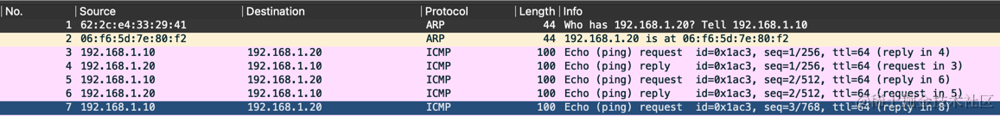

## Linux Bridge 概述

Linux Bridge 是 Linux 内核自带的一种虚拟网桥设备,用于在链路层(数据链路层)
实现数据帧的转发和交换。它的作用类似于物理交换机（Switch）,可以连接多个网络设备(物理或虚拟),并根据 MAC
地址在这些网络设备之间转发数据帧。虽然与交换机（Switch）有细微上的些许差异，为了理解的方便，我们可以将两者等同。

Linux Bridge 工作在 OSI 模型的第二层(数据链路层),根据 MAC
地址对数据帧进行转发、广播或丢弃处理。它还能将收到的数据帧发送到主机的三层网络协议栈中,因此也可以在三层网络中工作,类似于三层交换机。

## Linux Bridge 相关命令

Linux 系统中管理和配置 Linux Bridge 主要有两个命令工具:

### 1. brctl 命令

brctl 是专门用于创建和管理 Linux Bridge 的命令行工具,需要安装 bridge-utils 软件包。常用的 brctl 命令包括

*   `brctl addbr <bridge>` - 创建一个名为 <bridge> 的网桥
*   `brctl delbr <bridge>` - 删除名为 <bridge> 的网桥
*   `brctl addif <bridge> <ifname>` - 将网络接口 <ifname> 添加到 <bridge> 网桥
*   `brctl delif <bridge> <ifname>` - 从 <bridge> 网桥中移除接口 <ifname>

### 2. ip 命令

除了 brctl,Linux 系统中还可以使用更通用的 iproute2 工具集中的 `ip` 命令来管理网桥。

*   `ip link add <bridge> type bridge` - 创建一个名为 <bridge> 的网桥
*   `ip link set <bridge> up` - 启用网桥 <bridge>
*   `ip link set <ifname> master <bridge>` - 将接口 <ifname> 加入到网桥 <bridge> 中

这两个命令的区别是 brctl 使用比较老的 ioctl 方式来实现，ip 命令则是调用 netlink 来与内核通信。

## bridge 模拟 Docker 网络通信

因为我们只需要模拟网络的部分，可以简单用 net namespace 隔离来模拟 docker 网络通信模式。

首先使用 ip netns 创建两个网络命名空间，我们假装这是两个容器，为了方便下面也用「容器」这个词来描述。

```powershell
$ sudo ip netns add n1
$ sudo ip netns add n2

$ sudo ip netns
n2
n1
```

接下来使用 ip 命令创建两对 veth 设备对

```powershell
sudo ip link add veth0 type veth peer name veth1
sudo ip link add veth2 type veth peer name veth3
```

然后把 veth1 放入 n1 网络命名空间，veth3 放入 n2 命令空间。

```powershell
sudo ip link set veth1 netns n1
sudo ip link set veth3 netns n2
```

我们来看下 n1 命名空间中的网卡信息

```powershell
$ sudo ip netns exec n1 ifconfig -a                                                                                                                       

lo: flags=8<LOOPBACK>  mtu 65536
        loop  txqueuelen 1000  (Local Loopback)
        RX packets 0  bytes 0 (0.0 B)
        RX errors 0  dropped 0  overruns 0  frame 0
        TX packets 0  bytes 0 (0.0 B)
        TX errors 0  dropped 0 overruns 0  carrier 0  collisions 0

veth1: flags=4098<BROADCAST,MULTICAST>  mtu 1500
        ether 62:2c:e4:33:29:41  txqueuelen 1000  (Ethernet)
        RX packets 0  bytes 0 (0.0 B)
        RX errors 0  dropped 0  overruns 0  frame 0
        TX packets 0  bytes 0 (0.0 B)
        TX errors 0  dropped 0 overruns 0  carrier 0  collisions 0
```

接下来给容器内 veth1 和 veth2 配置 ip 并启用（up）。

```powershell
$ sudo ip netns exec n1 ip addr add 192.168.1.10/24 dev veth1
$ sudo ip netns exec n2 ip addr add 192.168.1.20/24 dev veth3

$ sudo ip netns exec n1 ip link set veth1 up
$ sudo ip netns exec n2 ip link set veth3 up
```

接下来创建网桥 br0，把 veth0 和 veth2 "插到"网桥 br0 端口上。

```powershell
sudo ip link add br0 type bridge
sudo ip link set br0 up
sudo ip link set veth0 master br0
sudo ip link set veth2 master br0

sudo ip link set veth0 up
sudo ip link set veth2 up
```

目前的网络结构如下

                n1                                n2         
    ┌────────────────────────┐         ┌───────────────────────┐
    │     192.168.1.10       │         │     192.168.1.20      │ 
    │     ┌───────────┐      │         │     ┌───────────┐     │                  
    │     │   veth1   │      │         │     │   veth3   │     │
    │     └─────▲─────┘      │         │     └─────▲─────┘     │                  
    └───────────┼────────────┘         └───────────┼───────────┘                  
                │                                  │         
    ------------│----------------------------------│-----------│        
                │                                  │       
           ┌────▼─────┐                       ┌────▼─────┐
           │  veth0   │                       │  veth2   │
    ┌──────┴──────────┴───────────────────────┴──────────┴─────┐
    │                          bridge                          │
    └──────────────────────────────────────────────────────────┘

此时万事俱备，尝试在 n1 容器内 ping 容器 2 的 ip(192.168.1.20)

```powershell
$ sudo ip netns exec n1 ping 192.168.1.20 -I veth1

PING 192.168.1.20 (192.168.1.20) 56(84) bytes of data.
64 bytes from 192.168.1.20: icmp_seq=1 ttl=64 time=0.091 ms
64 bytes from 192.168.1.20: icmp_seq=2 ttl=64 time=0.093 ms
64 bytes from 192.168.1.20: icmp_seq=3 ttl=64 time=0.098 ms
```

大功告成，此时两个隔离的容器环境的网络可以互相访问了。

为了更好的理解通信的过程，我把几个网络设备的 mac 地址列在了下面

*   veth0: 5a:28:d3:58:3c:2a
*   veth1: 62:2c:e4:33:29:41 (192.168.1.10)
*   veth2: 5e:b2:32:81:bd:f1
*   veth3: 06:f6:5d:7e:80:f2 (192.168.1.20)

此时查看 fdb 表，is local 表示当前是否属于网桥端口自身的 MAC 地址。

```powershell
$ brctl showmacs br0

port no	mac addr	     	is local?	ageing timer
  1	    5a:28:d3:58:3c:2a	yes		   0.00              -- veth0
  1	    62:2c:e4:33:29:41	no		   0.03              -- veth1
  2	    5e:b2:32:81:bd:f1	yes		   0.00              -- veth2
  2	    06:f6:5d:7e:80:f2	no		   0.03              -- veth3
```

当容器 n1 需要 ping 访问 192.168.1.20，因为发现是同一个网段，首先 veth1(62:2c:e4:33:29:41) 会发起一个 arp 广播请求，问局域网中
192.168.1.20 的 mac 地址是什么。



接下来我们深入看看 Bridge 在内核层的实现。

## Bridge 数据结构

```c
struct net_bridge {
	struct list_head		port_list;
	struct net_device		*dev;
	struct rhashtable		fdb_hash_tbl;
	bridge_id			bridge_id;
	struct hlist_head		fdb_list;
};
```

其中

*   port\_list 是一个链表,包含了所有加入该网桥的端口(port)。每个端口由 struct net\_bridge\_port 表示。
*   dev 是一个指向 struct net\_device 的指针,表示该网桥设备本身
*   fdb\_hash\_tbl 是一个散列表,用于存储网桥的转发数据库(Forwarding Database)。转发数据库记录了网络中每个 MAC 地址所连接的端口
*   bridge\_id 该网桥的标识符,包括优先级和 MAC 地址两部分。

## 网桥端口数据结构

一个 Bridge 可以连接多个端口，每个端口的信息由 struct net\_bridge\_port 表示，在 bridge 中以链表 port\_list 的形式存在。

```c
struct net_bridge_port {
	struct net_bridge		*br;     // 所属网桥
	struct net_device		*dev;    // 表示端口设备 
	struct list_head		list;    // 网桥端口链表
    // ...
	u16				        port_no; // 端口编号
};
```

### FDB

网桥有一个核心结构FDB（Forwarding database），用来记录 mac 地址与端口编号的映射关系，本质就是一个哈希表

    +--------------------------------------+
    |  Forwarding Database (FDB)           |
    +--------------------------------------+
    | Hash Table                           |
    +--------------------------------------+
    | Bucket 0 | Bucket 1 | ... | Bucket n |
    +--------------------------------------+
    | ┌───────┐  ┌───────┐      ┌───────┐  |
    | │ Entry │  │ Entry │      │ Entry │  |
    | ├───────┤  ├───────┤      ├───────┤  |
    | │ MAC=A │  │ MAC=C │      │ MAC=F │  |
    | │ Port=1│  │ Port=2│      │ Port=9│  |
    | └───────┘  └───────┘      └───────┘  | 
    |                               │      |
    |        ┌───────┐              │      |
    |        │ Entry │<─────────────┘      |
    |        ├───────┤                     |
    |        │ MAC=B │                     |
    |        │ Port=3│                     |
    |        └───────┘                     |
    +--------------------------------------+

哈希表中每个元素用 struct net\_bridge\_fdb\_entry 表示，

```c
struct net_bridge_fdb_entry {
	struct net_bridge_port		*dst; // 对应的网桥端口
	struct net_bridge_fdb_key	key;  // mac + vlan_id
	// ... other ...
};
```

当把一个新的设备加入到网桥端口时，会调用 br\_fdb\_insert 将新设备的 mac 地址加入到网桥的 FDB

```c
/* Add entry for local address of interface */
int br_fdb_insert(struct net_bridge *br, struct net_bridge_port *source,
		  const unsigned char *addr, u16 vid)
{
	int ret;
	ret = fdb_insert(br, source, addr, vid);
	return ret;
}

static int fdb_insert(struct net_bridge *br, struct net_bridge_port *source,
		  const unsigned char *addr, u16 vid)
{
	struct net_bridge_fdb_entry *fdb;

	fdb = br_fdb_find(br, addr, vid);
	if (fdb) {
		fdb_delete(br, fdb, true);
	}

	fdb = fdb_create(br, source, addr, vid, 1, 1);
	if (!fdb)
		return -ENOMEM;
	fdb_add_hw_addr(br, addr);
	fdb_notify(br, fdb, RTM_NEWNEIGH, true);		
	return 0;
}
```

下面是把一个 veth 设备 veth0 加入网桥 br0 的时候的 debug 效果，

```powershell
$ ifconfig
veth0     Link encap:Ethernet  HWaddr 72:E6:8C:03:68:01
          inet addr:192.168.1.100  Bcast:192.168.1.255  Mask:255.255.255.0
          inet6 addr: fe80::70e6:8cff:fe03:6801/64 Scope:Link
          UP BROADCAST RUNNING MULTICAST  MTU:1500  Metric:1
          RX packets:10 errors:0 dropped:0 overruns:0 frame:0
          TX packets:9 errors:0 dropped:0 overruns:0 carrier:0
          collisions:0 txqueuelen:0
          RX bytes:796 (796.0 B)  TX bytes:726 (726.0 B)
          
$ brctl addbr br0          
```

我们可以使用 gdb 查看各个值，帮你更直观的知道网桥新增一个端口设备是怎么回事，首先在 `br_fdb_insert` 函数处加断点。

```powershell
$ brctl addif br0 veth0
```

此时会命中断点，可以通过 bt 查看此时的调用堆栈

```powershell
(gdb) bt
#0  br_fdb_insert (br=0xffff8880063c3880, source=0xffff888006395400, addr=0xffff888006d19c10 "r\346\214\003h\001", vid=0) at ./include/linux/spinlock.h:334
#1  0xffffffff8193ea9b in br_add_if (br=0xffff8880063c3880, dev=0xffff88800632a000, extack=<optimized out>) at net/bridge/br_if.c:668
#2  0xffffffff81829a44 in dev_ioctl (net=0xffffffff824e6500 <init_net>, cmd=35234, ifr=0xffffc90000147da0, need_copyout=0xffffc90000147d90) at net/core/dev_ioctl.c:488
#3  0xffffffff817e15c1 in sock_do_ioctl (net=0xffffffff824e6500 <init_net>, sock=<optimized out>, cmd=35234, arg=140731761192720) at net/socket.c:1067
#4  0xffffffff817e1889 in sock_ioctl (file=<optimized out>, cmd=35234, arg=140731761192720) at net/socket.c:1164
#5  0xffffffff811c15d1 in vfs_ioctl (arg=<optimized out>, cmd=<optimized out>, filp=<optimized out>) at fs/ioctl.c:46
#6  file_ioctl (arg=<optimized out>, cmd=<optimized out>, filp=<optimized out>) at fs/ioctl.c:501
#7  do_vfs_ioctl (filp=0xffff8880062fe200, fd=<optimized out>, cmd=<optimized out>, arg=140731761192720) at fs/ioctl.c:688
#8  0xffffffff811c1909 in ksys_ioctl (fd=3, cmd=35234, arg=140731761192720) at fs/ioctl.c:705
#9  0xffffffff811c194f in __do_sys_ioctl (arg=<optimized out>, cmd=<optimized out>, fd=<optimized out>) at fs/ioctl.c:712
#10 __se_sys_ioctl (arg=<optimized out>, cmd=<optimized out>, fd=<optimized out>) at fs/ioctl.c:710
#11 __x64_sys_ioctl (regs=<optimized out>) at fs/ioctl.c:710
#12 0xffffffff810020d3 in do_syscall_64 (nr=<optimized out>, regs=0xffffc90000147f58) at arch/x86/entry/common.c:293
#13 0xffffffff81c00090 in entry_SYSCALL_64 () at arch/x86/entry/entry_64.S:242
#14 0x0000000000000000 in ?? ()
```

我们先来查看 br 的类型和值， 可以看到这里的要操作的设备的设备名为 "br0"。

```powershell
(gdb) p br
$28 = (struct net_bridge *) 0xffff8880063c3880
(gdb) p br.dev
$29 = (struct net_device *) 0xffff8880063c3000
(gdb) p/s br.dev.name
$31 = "br0", '\000' <repeats 12 times>
```

再来查看 source 的类型和值，可以看到此时的想要添加的设备为 veth0，不要添加到的网桥设备指针为
0xffff8880063c3880，也就是函数的第一个参数。

```powershell
(gdb) p source.br
$35 = (struct net_bridge *) 0xffff8880063c3880
(gdb) p source.dev
$36 = (struct net_device *) 0xffff88800632a000
(gdb) p source.dev.name
$37 = "veth0\000\000\000\000\000\000\000\000\000\000"
(gdb) p source.port_no
$38 = 1
```

我们来看看 addr 的值，因为 mac 地址用 6 字节表示，我们用 x 命令来打印 addr 的值

```powershell
(gdb) x/6bx addr
0xffff888006d19c10:	0x72	0xe6	0x8c	0x03	0x68	0x01
```

可以看到确实是前面 ifconfig 输出中的 veth0 的 mac 地址（72:E6:8C:03:68:01）。

通过这个例子，你应该理解把一个设备添加到 bridge 中底层到底发生了什么。

接下来我们来当bridge 收到数据包时会怎么处理,当 bridge 收到数据包时，首先会调用 `br_handle_frame`
函数，这个函数会做一些基本的校验，然后调用 `br_handle_local_finish` 函数。

br\_handle\_frame\_finish 函数我删掉部分代码保留了主线，详细的注释如下

```c
int br_handle_frame_finish(struct net *net, struct sock *sk, struct sk_buff *skb)
{
	// 获取接收到的数据包的网桥端口
	struct net_bridge_port *p = br_port_get_rcu(skb->dev);
	// 声明数据包的类型，初始化为单播
	enum br_pkt_type pkt_type = BR_PKT_UNICAST;

	struct net_bridge_fdb_entry *dst = NULL;
	struct net_bridge *br;
	u16 vid = 0;

	/* insert into forwarding database after filtering to avoid spoofing */
	br = p->br;
	// 如果端口启用了学习功能,则更新FDB表项
	if (p->flags & BR_LEARNING)
		br_fdb_update(br, p, eth_hdr(skb)->h_source, vid, false);

	switch (pkt_type) {
	case BR_PKT_MULTICAST:
		// ...omit...
		break;
	case BR_PKT_UNICAST: 
		// // 处理单播数据包, 从 bridge 的 fdb 中查找目标 mac 地址
		dst = br_fdb_find_rcu(br, eth_hdr(skb)->h_dest, vid);
	default:
		break;
	}
	// 如果找到了，则调用 br_forward 转发数据包到对应的端口上
	if (dst) {
		br_forward(dst->dst, skb, local_rcv, false);
	} else {
		// ...omit...
	}

	return 0;
}
```

可以看到网桥处理的逻辑简化来看就是根据数据包的目的MAC地址类型(单播、多播或广播)和FDB表,决定是是否转发到对应的端口上。

## 小结

这篇文章介绍了 linux 网桥的基础概念，带你用实验的方式理解了不同的容器是如何通过网桥通信的，最后带你走读了一遍 linux
内核源码中关于网桥的实现，包括添加网桥设备、FDB、如何处理包的转发等细节。
