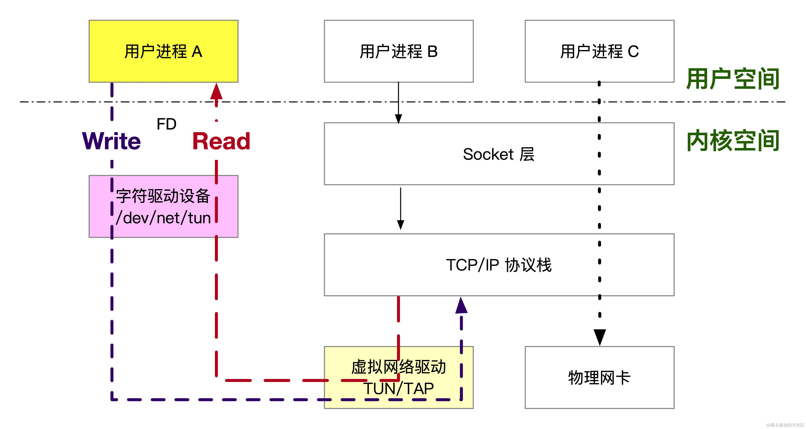

## 什么是 TUN/TAP 设备

我们先来看一下 Linux 内核中关于 tuntap 的描述，文件在 `Documentation/networking/tuntap.txt`，

> TUN/TAP provides packet reception and transmission for user space programs.
> It can be seen as a simple Point-to-Point or Ethernet device, which,
> instead of receiving packets from physical media, receives them from
> user space program and instead of sending packets via physical media
> writes them to the user space program.

简单来说 TUN/TAP 设备是 Linux 内核提供的一种虚拟网络设备，模拟了一个虚拟的网络设备，它为用户空间程序提供了一种接收和发送数据包的机制。

TUN/TAP 设备在 VPN、容器、虚拟化等领域有着广泛的应用，例如：

*   OpenVPN 使用 TUN/TAP 接口来传输加密的 IP 数据包
*   知名的容器网络方案 flannel 的 UDP 模式也是使用 TUN/TAP 来实现覆盖网络
*   网络协议栈测试工具 packetdrill 则利用 TUN/TAP 将测试数据包写入内核协议栈，以测试协议栈的响应。
*   安全系统可以将恶意流量引导到 TAP 设备上，然后在用户空间对其进行分析

虽然我们经常将 TUN 和 TAP 放在一起提及，它们的工作原理确实类似，但实际上它们是两种不同类型的设备

*   TUN 设备模拟了一个三层设，用于处理 IP 数据包
*   TAP 设备模拟了一个二层设备，用于处理以太网帧

用户通过与 `/dev/net/tun` 这个字符驱动设备文件进行交互，来与 TUN/TAP 设备交互，实现数据包的收发：

*   当内核将数据包发送给 TUN/TAP 设备时，用户空间程序可以通过读取 `/dev/net/tun` 来获取数据包的内容
*   当用户空间程序向 `/dev/net/tun` 写入数据时，这些数据会作为数据包被发送到内核的网络协议栈中

如下图所示：



下面是一个使用 TUN 设备的简单示例，它展示了如何创建并配置一个 TUN 设备，并从该设备读取数据包：

```c
int tun_alloc(char *dev) {
    struct ifreq ifr;
    int fd, err;

    // 1、打开 /dev/net/tun 文件获取操作句柄 fd
    if ((fd = open("/dev/net/tun", O_RDWR)) < 0) {
        perror("Opening /dev/net/tun");
        return -1;
    }

    memset(&ifr, 0, sizeof(ifr));
    // 2、设置创建设备的 flag、设备名
    ifr.ifr_flags = IFF_TUN | IFF_NO_PI;
    if (*dev) {
        strncpy(ifr.ifr_name, dev, IFNAMSIZ);
    }

    // 3、调用 ioctl 来设置 TUN/TAP 设备的接口标志
    if ((err = ioctl(fd, TUNSETIFF, (void *) &ifr)) < 0) {
        perror("ioctl(TUNSETIFF)");
        close(fd);
        return -1;
    }

    strcpy(dev, ifr.ifr_name);
    return fd;
}
```

调用 `tun_alloc` 函数就可以创建一个 TUN 设备，然后就可以像普通文件一样对返回的fd 进行读写操作，与内核网络栈交换数据包。

```c
int main() {
    char tun_name[IFNAMSIZ];
    int tun_fd, nread;
    unsigned char buffer[1500];

    strcpy(tun_name, "tun1");
    // 分配一个 tun1 虚拟网卡
    tun_fd = tun_alloc(tun_name);

    if (tun_fd < 0) {
        perror("Allocating interface");
        exit(1);
    }

    printf("TUN/TAP device %s opened\n", tun_name);

    while (1) {
        // 从 tun_fd 读取数据（内核发往用户态）
        nread = read(tun_fd, buffer, sizeof(buffer));
        if (nread < 0) {
            perror("Reading from interface");
            close(tun_fd);
            exit(1);
        }
        // 打印 ip 头
        print_ip_header((struct ip_header *) buffer);
        // 调用 payload
        print_payload(buffer, 20, nread);
    }

    return 0;
}
```

编译运行上面的代码，但是别急，此时 tun1 还没有 ip 地址也还没有被启用。给 tun1 设备配置 IP 地址并启用它：

```powershell
$ ip addr add 10.0.5.100/24 dev tun1
$ ip link set tun1 up

$ ifconfig -a

tun1: flags=4305<UP,POINTOPOINT,RUNNING,NOARP,MULTICAST>  mtu 1500
        inet 10.0.5.100  netmask 255.255.255.0  destination 10.0.5.100
        unspec 00-00-00-00-00-00-00-00-00-00-00-00-00-00-00-00  txqueuelen 500  (UNSPEC)
        RX packets 0  bytes 0 (0.0 B)
        RX errors 0  dropped 0  overruns 0  frame 0
        TX packets 0  bytes 0 (0.0 B)
        TX errors 0  dropped 0 overruns 0  carrier 0  collisions 0
```

通过 `route -n` 我们可以知道所有去往 `10.0.5.0` 包都会经过 tun1 网卡

```powershell
$ route -n                                                                                                         
Kernel IP routing table
Destination     Gateway         Genmask         Flags Metric Ref    Use Iface
0.0.0.0         192.168.31.1    0.0.0.0         UG    100    0        0 enp0s31f6
10.0.5.0        0.0.0.0         255.255.255.0   U     0      0        0 tun1
```

此时如果 ping 一个 10.0.5.0/24 网段内的 IP，例如 10.0.5.101，我们的程序就可以收到相应的 ICMP 包，并打印出包的内容。这表明数据包已经被成功地发送到了用户空间程序。在我们的应用进程就收到了对应的 icmp 包，对应的数据如下：

```powershell
IP Header
   |-Version        : 4
   |-Header Length  : 20 Bytes
   |-Type Of Service: 0
   |-Total Length   : 21504 Bytes
   |-Identification : 53078
   |-TTL            : 64
   |-Protocol       : 1
   |-Checksum       : 4549
   |-Source IP      : 10.0.5.100
   |-Destination IP : 10.0.5.101
Data Payload:
	08 00 FC 5D 64 68 00 69
	D3 74 AF 65 00 00 00 00
	4E 23 07 00 00 00 00 00
	10 11 12 13 14 15 16 17
	18 19 1A 1B 1C 1D 1E 1F
	20 21 22 23 24 25 26 27
	28 29 2A 2B 2C 2D 2E 2F
	30 31 32 33 34 35 36 37
```

## 使用 TUN/TAP 实现用户态 TCP 协议

有了 TUN/TAP 就可以搞很多好玩的项目，比如实现一个用户态 TCP 协议栈。基本思路是通过 TUN/TAP 设备接收和发送数据包，并在用户态处理 TCP 协议的各个功能模块，如连接管理、数据传输、拥塞控制等。

如果你真要动手写，需要仔细阅读 TCP 的 RFC 文档 RFC793： <https://datatracker.ietf.org/doc/html/rfc793。>

需要实现以下主要功能模块：

*   连接管理：处理 TCP 三次握手和四次挥手，管理连接状态。
*   数据传输：实现数据包的发送和接收，处理重传和确认机制。
*   拥塞控制：实现 TCP 拥塞控制算法，如慢启动、拥塞避免、快速重传和快速恢复。

目前已有一些开源项目利用 TUN/TAP 在用户态实现了TCP/IP协议栈,可供我们学习参考:

mstack-cpp 基于 TUN/TAP 设备，用 C++20 实现用户态TCP/IP协议栈

Rust 届的大佬有一个视频介绍如何通过 TUN/TAP 从零到一实现用户态 TCP 协议，感兴趣的同学可以参照这个视频：

<https://www.youtube.com/watch?v=bzja9fQWzdA>

## 小结

TUN/TAP 为用户空间程序提供了一种直接与网络协议栈交互的方式，使得许多有趣的应用场景成为可能，强烈推荐大家动手试一试。
